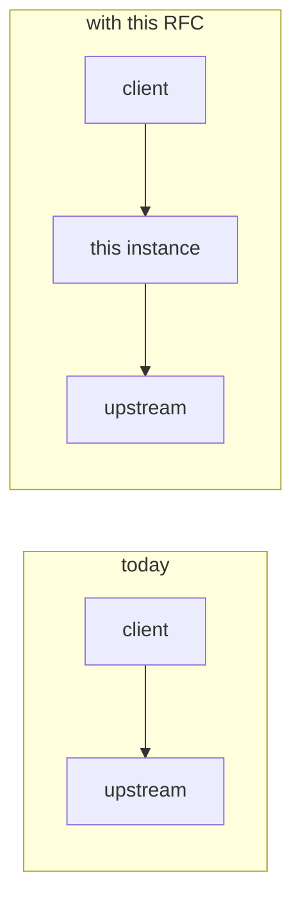

An RFC here is a change worth arguing about *before* it is written, and the
document is what the argument is had against. The rules of the form live in
two places this skill points at rather than repeats, because a third copy
would drift (RFC 0005 is the record of what that costs):

- `docs/internal/0000-rfc-template.md` — the sections, the header table, the
  status vocabulary, what to delete. Read it in full before `new`.
- `docs/contributing/contributing.md` §12 — the mechanics: `task rfc:new`,
  what is generated from the header rows, the drift gate.

This skill is the procedure around them: what to read first, what to run, in
what order, and the mistakes the gates do not catch.

## 1. Before writing a line

**Verify the protocol against its client, not against memory or the roadmap.**
The roadmap entry that sketches a feature is a hypothesis written without the
source open. RFC 0024 found two of its claims wrong in the first hour: the
client verified a checksum the entry did not mention, and it had removed a
signature check the entry said was "off by default". Either would have shipped
a broken adapter.

- Fetch the client's source and quote it: file, function, the line that sends
  the request or checks the answer. Name the client version you read.
- Probe the upstream on the wire (`curl -sI`, a `HEAD` on the real files) for
  sizes, content types and which paths exist. Numbers in the RFC come from
  here, not from estimates.
- Read the nearest sibling RFC for vocabulary before inventing any: a registry
  kind reads RFC 0010 (nodedist, sdkman); a policy reads 0015/0018; a listing
  question reads 0008-bis. Reuse its names for the same things.
- Grep for every type, function and file the RFC will name. An RFC that
  invents symbols the codebase does not have is hard to review and harder to
  implement. `RegistryKind`'s exhaustive matches, `DocumentKind`,
  `blocking::strip`, `listing_filter()` and `builders.rs` are the usual
  anchors for a registry kind.

## 2. `new` — scaffold, fill, regenerate

```bash
task rfc:new TITLE="…" SETTLES="…" [SHORT=…] [SLUG=…] [BIS=NNNN]
task rfc:index          # after every header-table edit
task docs:design        # the finish line: index drift, links, structure, audience, i18n, mermaid, roadmap
```

`rfc:new` takes the next free number (never reused), fills author and date,
sets `Draft`, and writes the page into both listings so it is never an orphan.
Then fill the template top to bottom and **delete every HTML comment**; what
is left must read as a document, not a filled-in form. Sections that do not
apply are deleted and the numbering closed up, never left as "N/A".

Set `Co-author` to the model that wrote with the user, in the form the
existing RFCs use. `Touches` lists the crates and trees the design actually
edits, and it is what a reviewer reads first.

## 3. What the gates do not check

The gates catch a broken link, a heading too deep, a diagram that does not
parse and a listing that drifted. They do not catch a weak document. The
house rules, from the RFCs that read well:

- **Motivations are numbered and falsifiable.** Each names the code path or
  workflow that hurts today. "It would be cleaner" is not one; "the client
  refuses the manifest as *checksum failed*" is.
- **Non-goals are the most useful section.** Write the things a reasonable
  reader would assume are in scope, one clause each on why not.
- **Before / after shows, prose tells, and it is drawn.** §1 carries both: a
  config block or client snippet *and* a mermaid diagram of the two paths, the
  one the request takes today and the one it takes after. §4 shows again, in
  its own terms. See §4 for what the diagram has to contain.
- **Behaviour rules state the uninteresting case.** What happens when nothing
  is blocked, when the upstream is the default, when the option is absent as
  distinct from empty.
- **Validation splits hard errors from warnings**, in two tables, and says
  where the operator will see a warning. A `tracing::warn!` nobody reads is
  not an answer.
- **The design names the invariant, not only the steps.** Under each
  mechanism: "because X, Y cannot happen here" is the sentence a reviewer
  checks.
- **A "deliberately untouched" list** in §6 for whatever a reviewer will go
  looking for and should not: the sibling implementation not reused, the rule
  that needs no new branch, the question another RFC already closed.
- **Alternatives are rejected on a concrete cost**, never "it is worse". The
  literal reading of the roadmap entry is usually one of them.
- **Decisions keep their numbers.** A question moves from *Still open* to
  *Resolved* with its number, its decision in bold and a one-line rationale.
  The gap in the resolved table is the record.
- **Phases each leave the tree green**, and the note says which phase is
  useful on its own. Two phases that cannot land apart (a kind with no client)
  say so and land together.
- **Word count.** A page over 4 000 words declares `reference: true` in
  frontmatter, or `docs:structure` fails. Most RFCs are over it; check with
  `wc -w`.
- **Prose width** is 80 columns like the rest of the tree; tables and code
  are exempt.

## 4. A new registry kind carries three more things

Most RFCs here add a protocol. Three sections separate the ones that were
implementable from the ones that had to be re-researched at implementation
time, and none of them is optional for a kind, an upstream or a protocol
surface that does not exist yet.

### 4.1 The before / after diagram in §1

The text block says what the operator writes; the diagram says what changes on
the wire. Both, always, in `### Before / after`.



That sketch is the floor, not the target. A good one names the documents, and
marks the one request that is refused or rewritten — the whole point of the
RFC, in the place a reviewer looks first. A reader who stops after §1 should be
able to draw the request path from memory.

### 4.2 How the real registry actually works, as §5.1

**A new registry kind, a new upstream protocol, or a new protocol surface on an
existing kind opens §5 with the protocol as the real thing serves it** —
before any design is laid on top of it. Title it for the subject ("The
protocol as `static.rust-lang.org` serves it"), and renumber the mechanism
subsections after it.

It carries, for the *real* upstream and the *real* client:

- **Every endpoint the client touches, in the order it touches them**, as a
  table: the path, what answers, the content type, and what the client does
  with the answer. One full install from a cold cache, nothing skipped — the
  discovery document, the listing, the per-version document, the artifact, and
  whatever signature or checksum sits beside them.
- **A `sequenceDiagram` of that install**, against the real upstream with no
  proxy in it. This is the diagram a reviewer checks the design against, and
  the one an implementer works from.
- **The numbers, from probes**: status codes, response sizes, page caps,
  redirect chains and where they land, cache headers. Each one observed, not
  estimated. A `302` to a signed URL, an index capped at 100 entries and a
  27 MB listing are all design constraints, and none of them is in the
  protocol's documentation.
- **What the client verifies, quoted from its source**: the checksum, the
  signature, the lockfile digest, and the error text it prints when the check
  fails. Name the client version read.
- **Auth, and what the client will not send**: which requests carry a
  credential, in what header, and what it drops across a redirect.
- **The spellings**: how the upstream names a package, a version and an
  artifact file, including the normalisations (case, separators, `v` prefixes)
  and the filename the client reconstructs.

When the protocol is one **this instance defines** rather than one it proxies —
a publish surface with no upstream, as RFC 0025 adds to `generic` — there is no
real registry to describe, and the requirement is met by a `### 4.2 The
protocol` subsection carrying the same endpoint table and the same client
snippets. Say in its first line that there is no upstream, and do not write a
§5.1 that repeats it; an instruction has one home here too.

Write it so a second implementer could build the adapter from §5.1 alone, and
so a reviewer can tell a protocol fact from a design decision by which
subsection it is in. When a fact could not be observed — a WAF refused the
probe, the endpoint needs a credential nobody has — say so in place rather
than filling the gap from memory.

### 4.3 The heavy suite it will add, in §6

A route test proves routing. The suite that finds the shipped bugs is the one
that runs the real package manager, and an RFC that does not name it is an RFC
whose "it works" is a guess. The last `§6.x` before the docs subsection is
`tests/heavy/<name>.sh`, and it names:

- the script, its `config.<name>.toml`, `task test:<name>-heavy`, and the row
  it adds to the `heavy-client` matrix;
- **the client, and how it is pinned** — the version, where the job installs
  it from, and which of its caches are redirected into the run's directory so
  no two steps share state;
- **a numbered list of what it proves on the wire, through the tap**, each
  step an observation rather than an intention. At minimum: an install that
  succeeds; a **refusal**, with the client's own error text and the assertion
  that the refused bytes were never requested; a listing that no longer names
  the blocked version; and a second install that moves
  `batlehub_artifact_cache_hits_total`.
- for a kind with a publish protocol, a publish followed by an install of what
  was published, from a clean client cache.

Read `docs/rfc/0010-toolchain-managers.md` §13 for what the difference between
this list and the built thing looks like afterwards — that delta is the reason
the list is written before the code.

## 5. Diagrams

Two to four mermaid diagrams in §5, beside the two §4 asks for. `flowchart`
for a decision, a `sequenceDiagram` for a request crossing components, `graph`
for wiring. Each one carries a sentence beneath it stating what it proves.

- Wrap labels in double quotes; use `<br/>` for line breaks.
- Inside a label, brackets and braces are HTML entities: `#91;` `#93;`
  `#123;` `#125;`. **The braces that make a decision node are structure, not
  label**: `B{"blocked?"}` stays as written, only the `{date}` inside a label
  becomes `#123;date#125;`. A blanket replace over the fence breaks every
  decision node.
- `task docs:mermaid` parses every fence in the repository; the site renders
  on the client, so a broken diagram builds green and draws an error box for
  the reader. Run it before calling the RFC done.

## 6. What else changes with an RFC

An RFC is never the only file. The table is the checklist.

| When | What | How |
| --- | --- | --- |
| Any header-table edit | `docs/rfc/index.md` (between the `rfc-index` markers) and `docs/.vitepress/nav/en.ts` (`rfc-sidebar`) | `task rfc:index`, never by hand |
| The RFC covers a roadmap entry | The entry in `ROADMAP.md` gains `(RFC NNNN, \`docs/rfc/NNNN-slug.md\`, Draft)`; the checkbox and the status word move as the RFC does | edit `ROADMAP.md`, then `task docs:roadmap` |
| The RFC changes what is next | `docs/rfc/plan.md` | by hand |
| The RFC corrects a claim elsewhere in the docs | The page that made it, in the same change | by hand; `task docs:links` for the cross-reference |
| The RFC adds a repo convention | `CLAUDE.md`, one paragraph, and `docs/contributing/` where a person reads it | by hand |
| The design adds a generated table (support, endpoints, listing coverage) | The generator, not the page | `task docs:*:check` names the task |

## 7. `revise` — open questions and status

`task rfc:status` prints every RFC's status and open-question count. The
template's readiness test is that *Still open* is empty.

- Resolve a question by moving it up with its number and writing the
  decision; do not delete it. If the answer went against the draft's own
  recommendation, say so, that is the useful part.
- Status moves in the header table only, and the listings follow through
  `task rfc:index`. The vocabulary is the template's: `Draft`, `In review`,
  `Accepted`, `Implemented`, `Rejected`, `Superseded by NNNN`. Anything
  else fails the build.
- The `/rfc/` page and sidebar are three shelves read off the status: *In the
  works* (Draft, In review), *Ready to build* (Accepted), *Settled*
  (Implemented, Rejected, Superseded). A document changes shelf by having its
  status row edited. **The files never move**; some two hundred links name
  them by path.
- A follow-on that reopens a settled RFC is a *bis* (`BIS=NNNN`), not an edit
  to the settled one beyond a pointer in its header.

## 8. `land` — when the implementation ships

- Add `## 13. Revision against the tree (date)` at the end, in the form RFC
  0010 §13 uses: what shipped, and every point where the built thing differs
  from the text above, each one small and each one deliberate, with the
  reason. Do not rewrite the earlier sections to match; the delta is the
  record.
- Say what the heavy suite observed, not what the RFC predicted: the
  client's own error text, what was and was not requested on the wire, the
  counter that moved.
- Status to `Implemented` with the landing dates in the note; `Touches`
  updated if the tree differs; the roadmap entry ticked and its status word
  removed; `task rfc:index`, `task docs:roadmap`, `task docs:design`.

## 9. Finish

Run `task docs:design` and report its last line. Then tell the user, in that
order: the number and path, what is still open in §11, every other file the
change touched, and what was verified against a real client versus read from
its source. Do not commit; the user signs.
