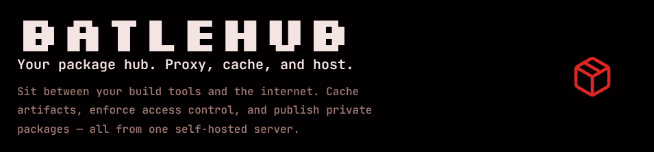

<p align="center"></p>

# BatleHub - Proxy Cache

A self-hosted smart proxy and cache for package registries. It sits between your build tools and the internet, caches artifacts after the first download, and enforces access-control rules before any package reaches a developer or CI pipeline.

---

## Quick start

### With Docker Compose

```sh
# Clone and start PostgreSQL + the server
git clone https://github.com/your-org/batlehub
cd batlehub
cp config.example.toml config.toml   # edit as needed
podman compose up -d                 # or docker compose up -d
```

The server listens on `http://localhost:8080`. The admin token from `config.example.toml` is `change-me-admin-token`.

### Build from source

**Prerequisites:** Rust 1.87+, Node 24+, PostgreSQL

```sh
# Backend
cargo build --release -p batlehub-server

# Frontend (optional — embeds the SPA into the server)
cd ui && pnpm install --frozen-lockfile && pnpm run build && cd ..

# Generate the OpenAPI spec and TypeScript client
cargo run -p batlehub-server -- --config config.example.toml dump-spec > ui/openapi.json
cd ui && pnpm run generate && pnpm run build && cd ..

# Run
./target/release/batlehub --config config.toml
```

Or use the [Task](https://taskfile.dev) shortcuts:

```sh
task compose:db    # start only postgres
task run           # cargo run with example config
task ui:dev        # vite dev server (proxies /api and /proxy to :8080)
task test          # cargo test --workspace
```

---

## Documentation

| Document | Contents |
|----------|---------|
| [Supported Registry](https://batleforc.git.batleforc.fr/batlehub/registries/) | List of supported Registries and how to use them |
| [Installation](https://batleforc.git.batleforc.fr/batlehub/guide/installation.html) | Choosing a method: Docker Compose, container image, binary, source, Helm |
| [Helm chart](https://batleforc.git.batleforc.fr/batlehub/guide/install/helm.html) | Kubernetes: three complete values files — basic, S3, production-ready |
| [Administration](https://batleforc.git.batleforc.fr/batlehub/guide/administration.html) | Administration: config, auth, S3, health, package management |
| [User guide](https://batleforc.git.batleforc.fr/batlehub/use/) | User guide: client setup and publishing for all registry types |
| [Configuration](https://batleforc.git.batleforc.fr/batlehub/guide/configuration.html) | Full TOML reference, permissions, worked examples |
| [Configuration § Registry modes](https://batleforc.git.batleforc.fr/batlehub/guide/configuration.html#registry-modes) | Private registry modes (local / hybrid) |
| [Private upstreams](https://batleforc.git.batleforc.fr/batlehub/guide/private-upstreams.html) | Upstream auth (Bearer / Basic / header) and custom CA certificates |
| [Publishing](https://batleforc.git.batleforc.fr/batlehub/use/publishing.html) | Step-by-step guide for publishing packages (npm, Cargo, VSIX, Go modules, gems, Maven artifacts, Terraform modules/providers, PyPI wheels, conda packages) |
| [SBOM](https://batleforc.git.batleforc.fr/batlehub/guide/sbom.html) | SBOM configuration, format reference, API endpoints, and export guide |
| [Adding a registry](https://batleforc.git.batleforc.fr/batlehub/contributing/adding-a-registry.html) | Step-by-step guide for implementing a new registry adapter |
| `/swagger-ui/` (runtime) | Interactive API docs |

---

## Development, Contributing, security, and license

```sh
task build          # cargo build --workspace
task test           # cargo test --workspace
task lint           # cargo clippy --workspace
task fmt            # cargo fmt --all
task dump-spec      # regenerate ui/openapi.json
task ui:generate    # regenerate TypeScript client from openapi.json
task coverage       # generate HTML coverage report (requires PostgreSQL + RustFS)
task coverage-check # enforce ≥80% line coverage (fails the build if below threshold)
```

- [`CONTRIBUTING.md`](CONTRIBUTING.md) — contributor guide (points to [Contributing guide](https://batleforc.git.batleforc.fr/batlehub/contributing/contributing.html))
- [Deployment](https://batleforc.git.batleforc.fr/batlehub/guide/installation.html)
- [`ROADMAP.md`](ROADMAP.md) for the full list of planned features, or browse the [Roadmap page on the documentation site](https://batleforc.git.batleforc.fr/batlehub/guide/roadmap.html).
- [Testing](https://batleforc.git.batleforc.fr/batlehub/contributing/testing.html)
- [Access control](https://batleforc.git.batleforc.fr/batlehub/guide/access-control.html)
- [RFCs](https://batleforc.git.batleforc.fr/batlehub/rfc/)
- [`SECURITY.md`](SECURITY.md) — supported versions and how to report a vulnerability
- [`LICENSE`](LICENSE) — Apache License 2.0
