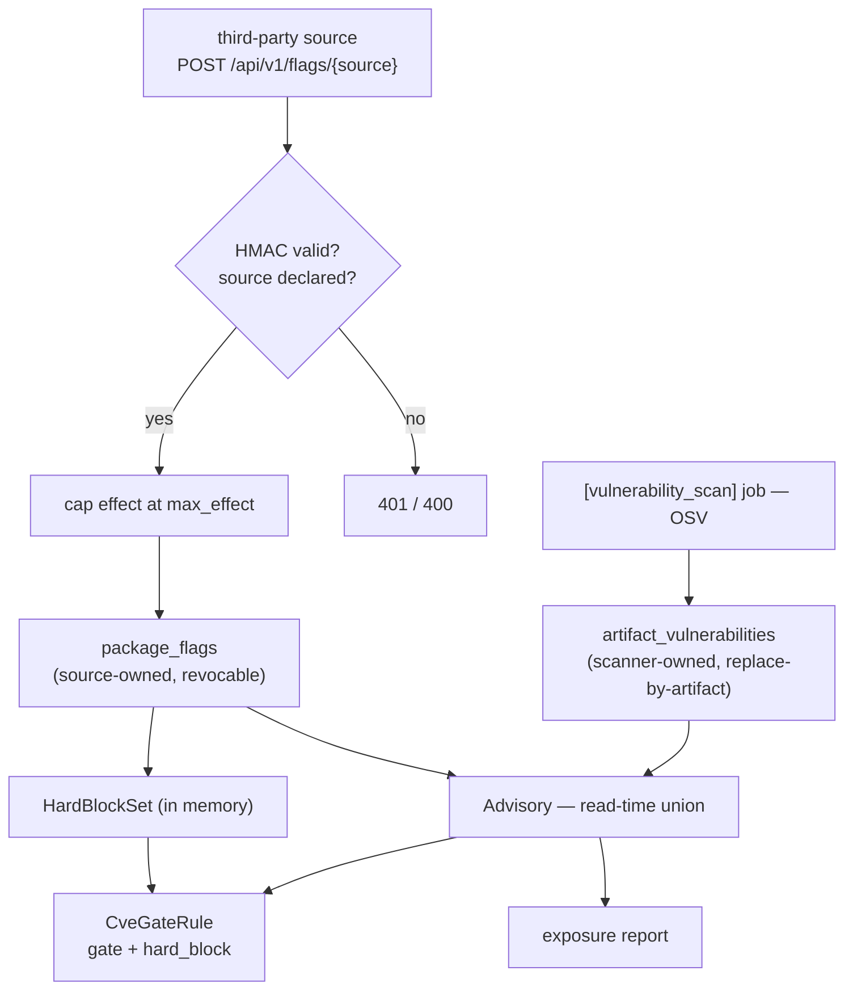
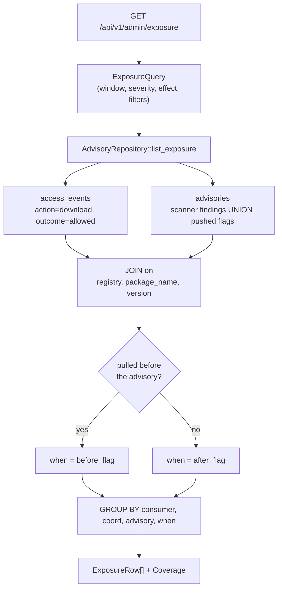
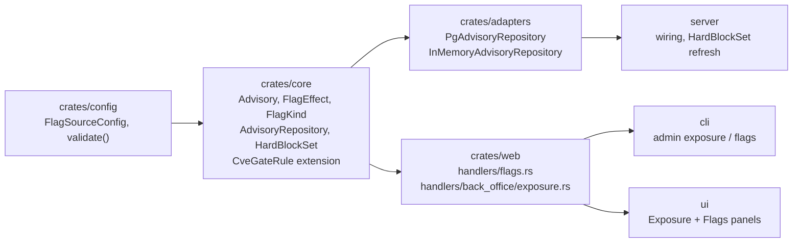

# RFC 0002 — Vulnerability flags and exposure reporting

| Field       | Value                                                             |
| ----------- | ----------------------------------------------------------------- |
| Status      | In review — the §13 recast landed 2026-09-04 (§13.1); one question open, measured by RFC 0018 phase 0a |
| Short       | Vulnerability flags |
| Settles     | What BatleHub knows about a package's CVEs, and who it tells |
| Author      | Max Batleforc <maxleriche.60@gmail.com>                            |
| Co-author   | —                                                                  |
| Created     | 2026-08-03                                                         |
| Supersedes  | —                                                                  |
| Touches     | `crates/core`, `crates/config`, `crates/adapters`, `crates/web`, `server`, `cli`, `ui`, docs |

---

## 1. Summary

Two capabilities that share one data model:

1. **Push.** A trusted third-party service — a SOC, a corporate vulnerability
   platform, an internal advisory feed — can flag a package version as unsafe
   through an authenticated API, stating both *what it asserts* (a CVE, a
   malicious release, a licence problem) and *how hard it wants BatleHub to
   react* (report it, gate it on severity, or refuse the download outright).

2. **Report.** A platform admin can ask *who pulled a version that is flagged*,
   over a time window, grouped by consumer — including the retroactive case
   where the flag landed after the pull.

They are one RFC because they are one model. A report that only knows about
OSV-derived findings is wrong the day a third party pushes a flag, and a flag
nobody can query the blast radius of is half a feature. The join underneath is
the same: the download audit trail (`access_events`) against the set of
advisories affecting a coordinate.

The push side deliberately does **not** reuse `artifact_vulnerabilities`. That
table is owned by the scan job, whose `replace_findings_for_artifact` opens with
`DELETE FROM artifact_vulnerabilities WHERE artifact_key = $1` — anything an
external system wrote there disappears at the next scan. Pushed flags get their
own table and a source-scoped lifecycle; the two are unified at read time.

### Before / after

```text
# today — the security team can only ask an admin to block, by hand, coordinate by coordinate
$ curl -XPOST …/api/v1/admin/packages/npm1/left-pad/block -d '{"reason":"backdoored"}'
# …and nobody can answer "who already pulled it"

# with this RFC — the SOC pushes, BatleHub enforces and reports
$ curl -XPOST https://hub.example.com/api/v1/flags/acme-soc \
    -H 'X-Hub-Signature-256: sha256=…' \
    -d '{"flags":[{"external_id":"SOC-2026-0412","kind":"compromised_release",
                   "effect":"hard_block","registry":"npm1","package_name":"left-pad",
                   "version":"1.3.1","severity":"critical",
                   "summary":"post-install script exfiltrates env"}]}'
{"accepted":1,"rejected":0,"effect_capped":0}

$ batlehub admin exposure --since 7d --min-severity high
CONSUMER    REGISTRY  PACKAGE   VERSION  ADVISORY                SEV       EFFECT      PULLS  LAST PULL             WHEN
ci-runner   npm1      left-pad  1.3.1    acme-soc:SOC-2026-0412  critical  hard_block     87  2026-08-03T04:11:02Z  before flag
alice       npm1      lodash    4.17.20  osv:GHSA-p6mc-m468-83gg high      gate           12  2026-08-02T09:14:22Z  before flag

2 consumers, 99 pulls, both exposures predate the flag.
Coverage: 4 of 7 registries scanned (pypi1 configured but never scanned); 2 flag sources.
```

---

## 2. Motivation

1. **Nothing outside the scan job can flag a version.** The only write path into
   the vulnerability model is `VulnerabilityRepository::replace_findings_for_artifact`,
   called by the `[vulnerability_scan]` background task. An organisation whose
   authoritative source of "this release is bad" is a SOC platform, a paid feed
   or an internal review process has no way in. The nearest substitute is an
   admin manually calling the package-block endpoint, one coordinate at a time,
   through a human.

2. **Writing into `artifact_vulnerabilities` is a trap, not a shortcut.**
   `crates/adapters/src/db/vulnerability.rs` deletes the whole finding set for an
   `artifact_key` before reinserting the scan's results. Any externally-inserted
   row silently vanishes at the next scan of that artifact — a failure mode that
   would surface as "the block stopped working, some time last week". A separate
   table with source-scoped replacement is not a design preference here; it is
   the only correct option.

3. **The existing block has exactly one degree, and it is coarse.**
   `PackageStatus::Blocked { reason, blocked_by, blocked_at }` and
   `BlockListRule` give a binary. `CveGateRule` gives a second, orthogonal
   mechanism with a severity threshold and a `block` on/off switch. Neither can
   express "report this but do not block" or "block this regardless of what the
   registry's severity threshold is set to" — the two ends of the range a
   third-party feed actually needs.

4. **Both gates fail open, by explicit design.** `BlockListRule` and
   `CveGateRule` both log and return `RuleDecision::Allow` when the database is
   unreachable, with a comment saying availability beats blocking. That is the
   right default for a mirror. It is the wrong answer for "this release is
   backdoored", where the whole point of the assertion is that it holds.

5. **The join for reporting does not exist.** `access_events` records every
   served download — proxy path via `AccessEvent::allowed_download` in
   `crates/core/src/services/proxy/cache.rs`, local path in
   `local_registry/read.rs` — and `artifact_vulnerabilities` records findings per
   coordinate. The only read on the vulnerability side is
   `list_for_coordinate(registry, name, version)`: one coordinate per call, no
   access to the download side at all.

6. **Incident response documents the manual workaround.**
   `docs/operations/incident-response.md` §"Phase 1 — Detection / Manual detection" offers
   three recipes: denied events in the last hour, events from a given IP, and a
   24-hour CSV export. All three filter on something the responder already has.
   When an advisory lands, the responder has an identifier and needs the
   consumers — the inverse direction, which no documented procedure covers.

7. **The retroactive case is both the common one and the uncomputable one.**
   A flag or a finding almost always postdates the pulls it concerns. `CveGate`
   only refuses downloads happening after detection; by construction it says
   nothing about the bytes already delivered. Those are the copies sitting in
   someone's `node_modules` or CI cache right now, and nothing in the product can
   name them.

8. **Unauthenticated pulls are attributable but unattributed.**
   `access_events.user_id` is `NULL` for anonymous pulls, which in a CI-heavy
   deployment is most of them. Migration `029_audit_ip_ua.sql` added
   `ip_address` and `user_agent` precisely to keep those rows traceable. A report
   that dropped them would understate blast radius by an order of magnitude.

9. **Coverage is partial and invisible.** Findings only exist where an SBOM
   exists, and `[registries.sbom]` is opt-in per registry. An admin reading an
   empty report cannot tell "nothing is flagged" from "nothing is scanned".

---

## 3. Goals / non-goals

**Goals**

- Let a configured external source push and revoke version flags through an
  authenticated, idempotent API.
- Separate *what a flag asserts* from *what BatleHub does about it*, so the same
  vocabulary covers "FYI" and "refuse this download".
- Cap what each source may assert, so integrating a feed is not equivalent to
  handing it a kill switch.
- Make the strongest degree actually hold, including while the database is
  unavailable — while still letting an operator through in an emergency, loudly.
- Let a flag target a version **range**, interpreted by the versioning scheme of
  the registry it applies to, so a source states "everything before 1.3.2" once
  rather than enumerating what it happens to know about.
- Give a consumer one identity across an auth-provider subject change, so an
  exposure history does not silently split in two.
- Answer "which consumers pulled a flagged version in the last N days", grouped
  by consumer, over pushed flags and scanner findings alike.
- Classify each exposure as pulled-before-flag or pulled-after-flag.
- Attribute anonymous pulls rather than discarding them.
- State coverage explicitly, so an empty report is never mistaken for a clean one.
- Reach all of it from the API, the CLI and the admin UI, with the CSV export the
  audit log already offers.

**Non-goals**

- **Notifying affected consumers.** Worth doing, needs its own decisions (opt-in,
  throttling, channel); the notification service exists and can consume this
  report later.
- **Replacing `[vulnerability_scan]` or adding scanners.** Coverage is reported,
  not widened. See `docs/contributing/adding-a-vulnerability-scanner.md`.
- **Replacing the admin block.** `PackageStatus::Blocked` stays what an
  administrator does by hand; flags are what a *system* asserts. §8 says why
  they are not merged.
- **Transitive attribution below the advisory's `purl`.** Mapping a finding
  through a consumer's own dependency tree needs data BatleHub does not have.
- **A universal version algebra.** Ranges are interpreted per registry kind
  (§4.3); a kind with no meaningful order gets exact matching only, and says so
  rather than pretending.
- **Changing audit retention.** `purge_events_before` stays a manual admin
  action; the report only says when a purge truncated its window.
- **Resolving an IP back to a person.** The consumer key stops at `ip:<addr>`.

---

## 4. User-facing design

### 4.1 Flag sources

A source must be declared before it can push. Undeclared sources are refused;
there is no self-registration.

```toml
[[flag_sources]]
name          = "acme-soc"
secret        = "${ACME_SOC_HMAC_SECRET}"  # HMAC-SHA256 over the raw body
max_effect    = "hard_block"               # ceiling on what this source may assert
registries    = ["npm1", "pypi1"]          # absent = every registry
max_flags_per_minute = 5000                # ingestion cap for this source

[[flag_sources]]
name       = "vendor-feed"
secret     = "${VENDOR_FEED_SECRET}"
max_effect = "gate"                        # may gate, may never hard-block
```

- `secret` reuses the `X-Hub-Signature-256` HMAC scheme and the existing
  `verify_inbound_hmac` helper from the inbound-webhook receiver. Unlike that
  receiver, the secret is **mandatory** here: an inbound webhook is a record in a
  table, a flag can stop every download of a package.
- `max_effect` is the ceiling, not the value. A source pushing above its ceiling
  is not rejected — the flag is accepted and **capped**, and the response says so
  (`effect_capped`, §4.4). Rejecting outright would mean a feed upgrading a CVE
  to critical silently stops being ingested at all.
- `registries` scopes a source to the registries it is authoritative for.
- `max_flags_per_minute` bounds ingestion per source (default 10 000). The
  existing rate limiter keys on `/proxy/{registry}/…` and so does not cover this
  endpoint at all; without a cap, a feed looping on a 1000-flag batch is an
  unbounded write amplification against `package_flags` and a `HardBlockSet`
  rebuild per call. Exceeding it returns `429` with `Retry-After`, and the batch
  is rejected whole — a partially-ingested sync is worse than a retried one.
- Absent section = the feature is off. No source, no push endpoint reachable.

`CURRENT_CONFIG_VERSION` does not move; the section is additive and optional.

### 4.2 What a flag is: two axes

The degrees are two orthogonal things, and conflating them is the mistake to
avoid. "CVE" describes *what is claimed*. "HARD BLOCK" describes *what to do*. A
CVE can be informational; a licence violation can be a hard block.

**`kind` — what the source asserts** (open vocabulary; unknown values are stored
and reported, never silently dropped):

| `kind` | Meaning |
| --- | --- |
| `cve` | A published advisory affects this version |
| `compromised_release` | This specific artifact is backdoored or tampered with |
| `malware` | The package is malicious by intent |
| `license` | Licence terms make this version unusable here |
| `deprecated` | Superseded; discouraged but not dangerous |
| `policy` | Fails an internal rule that is not a security issue |

**`effect` — what BatleHub does** (closed vocabulary, ordered):

| `effect` | Download | Report | Notes |
| --- | --- | --- | --- |
| `inform` | served | yes | Visible in the UI and the exposure report only |
| `warn` | served | yes | Adds `X-BatleHub-Advisory` to the response; the client sees it |
| `gate` | subject to `CveGate` | yes | Behaves exactly like a scanner finding: the registry's `min_severity` and `block` settings decide |
| `hard_block` | **refused** | yes | Denies regardless of `min_severity`, regardless of `block = false`, and survives a database outage (§4.6) |

`effect` is ordered `inform < warn < gate < hard_block`, which is what
`max_effect` caps and what precedence compares (§4.6).

A flag also carries `external_id` (the source's own identifier), `severity` (the
existing `Severity` scale), `summary`, and optional `reference_url`,
`fixed_version` and `expires_at`.

### 4.3 Version targeting, interpreted per registry

A flag targets either one exact version or a range, and **the range is
interpreted by the versioning scheme of the registry it applies to** — not by a
single house dialect. `1.3.2` does not order the same way for Maven, Debian and
PEP 440, and a range that a source means one way and BatleHub reads another is a
hard block on the wrong artifacts, or worse, no block on the right ones.

```json
{ "registry": "npm1",   "package_name": "left-pad", "version": "1.3.1" }
{ "registry": "pypi1",  "package_name": "requests", "version_range": "<2.31.0" }
{ "registry": "deb1",   "package_name": "openssl",  "version_range": "<1:3.0.8-1" }
```

Exactly one of `version` / `version_range` is required.

Each `RegistryKind` declares its scheme via `RegistryKind::version_scheme()`:

| Scheme | Registry kinds | Range syntax |
| --- | --- | --- |
| `SemVer` | cargo, npm, goproxy, composer, terraform, openvsx, vscode-marketplace, jetbrains, jetbrains-marketplace | `<1.3.2`, `>=1.0.0,<2.0.0` |
| `Pep440` | pypi, conda | `<2.31.0`, `>=1.0,<2.0` |
| `Maven` | maven | Maven's own order, `[1.0,2.0)` |
| `NuGet` | nuget | NuGet's four-field order and range brackets |
| `Gem` | rubygems | `< 2.31.0`, `~> 1.0` |
| `DebianEvr` | deb | epoch:upstream-revision comparison |
| `RpmEvr` | rpm, pacman | RPM epoch-version-release comparison |
| `Opaque` | generic, github, forgejo, gitlab | **no order** — exact versions only |

**`Opaque` is a first-class answer, not a gap.** A `generic` registry's "version"
is whatever string the publisher chose; inventing an order for it would make
ranges silently wrong. A range pushed at an `Opaque` registry is **rejected at
push time** with a per-item error naming the scheme, so the source finds out
immediately instead of believing it blocked something.

That rejection rule is general and is the safety property of this whole section:
**a range that the target scheme cannot parse is refused at push time, never
stored.** A stored-but-unparseable range would match nothing at evaluation time,
and a `hard_block` that matches nothing is worse than no flag at all — it reads
as protection on every dashboard while serving the artifact.

`fixed_version` is compared with the same scheme, so "is this consumer already
past it" is answered consistently with how the range was matched.

### 4.4 Push API

```
POST /api/v1/flags/{source}
```

Authenticated by HMAC over the raw body, as the inbound webhook is. The body is a
batch, because a feed syncing state should not need N round trips:

```json
{
  "flags": [
    {
      "external_id": "SOC-2026-0412",
      "kind": "compromised_release",
      "effect": "hard_block",
      "registry": "npm1",
      "package_name": "left-pad",
      "version": "1.3.1",
      "severity": "critical",
      "summary": "post-install script exfiltrates environment variables",
      "reference_url": "https://soc.acme.internal/incidents/412",
      "fixed_version": "1.3.2",
      "expires_at": null
    }
  ]
}
```

Response:

```json
{ "accepted": 1, "rejected": 0, "effect_capped": 0, "errors": [] }
```

- **Idempotent on `(source, external_id)`.** Re-pushing the same identifier
  updates the flag in place, so a feed can replay its whole state on every sync
  without creating duplicates — the normal operating mode for this kind of
  integration.
- **Partial success is the contract.** One malformed entry does not reject the
  batch; it lands in `errors` with its index and reason. A feed pushing 500 flags
  must not lose 499 of them to one bad row.
- **Bounded.** The same 5 MiB body cap as the inbound webhook, plus 1000 flags
  per batch.

### 4.5 Revocation and lifecycle

```
DELETE /api/v1/flags/{source}/{external_id}
```

Revokes rather than deletes: the row keeps a `revoked_at` so the exposure report
can still explain a download served while the flag was live. Revoked flags stop
being enforced immediately.

A source may only touch its own flags. There is no cross-source write, and no API
by which one source can revoke another's assertion.

`expires_at` gives the same outcome on a timer, for feeds publishing time-boxed
advisories. An expired flag is treated exactly as a revoked one.

Admin override: `POST /api/v1/admin/flags/{id}/suppress` lets an operator
neutralise a flag their own source pushed — the escape hatch for a feed that
starts hard-blocking half the registry at 03:00. Suppression is recorded in the
audit trail like every other admin action.

### 4.6 Enforcement semantics

- **Precedence is the strongest live effect** for a coordinate, across every
  source and the scanner. One source saying `inform` does not weaken another
  saying `hard_block`.
- **`gate` merges with scanner findings.** A `gate` flag is evaluated by the
  existing `CveGateRule` on the same footing as an `ArtifactVulnerability`: same
  `min_severity` comparison, same `bypass_roles`, same `block` switch. Nothing
  about the current gate's behaviour changes for a deployment that never pushes a
  flag.
- **`hard_block` overrides the gate's own configuration.** It denies when
  `block = false`, and when the flag's severity is below `min_severity`. That is
  the entire difference between it and `gate`, and it is why `max_effect` exists.
- **`hard_block` does not fail open.** Both existing rules return `Allow` on a
  database error, deliberately. Preserving that here would mean a database hiccup
  quietly re-serves a backdoored artifact. Instead the set of hard-blocked
  coordinates is held in memory — a `LockedMap`-shaped structure, refreshed like
  every other hot map and updated synchronously on push — so enforcement does not
  depend on a query at request time. A database outage freezes the set at its
  last known state rather than emptying it. `inform`/`warn`/`gate` keep today's
  fail-open behaviour unchanged.
- **`bypass_roles` applies to `hard_block`, and every use is announced.** A 03:00
  incident where the responder needs the package *now* is real, and suppressing
  the flag first (§4.5) is a step too many. The safety property is not "nobody
  gets through" but "nobody gets through **quietly**", so a bypassed hard block
  is the noisiest event this feature produces:

  | Channel | What it carries |
  | --- | --- |
  | Audit trail | An `AccessEvent` with the new `AccessResult::BypassedHardBlock { advisory_id, role }` — `outcome: "bypassed"`, distinct from `allowed`, so it is one filter away in the audit log and never blends into normal traffic |
  | Response header | `X-BatleHub-Advisory: bypassed:<advisory_id>`, so the client and any CI log capture it too |
  | Notification | A `NotificationEventType::HardBlockBypassed` through the existing subscription machinery, alongside the package-lifecycle events |
  | Metric | `batlehub_hard_block_bypass_total{registry,advisory}` for alerting |
  | Log | `tracing::warn!` with coordinate, advisory and principal |

  The exposure report counts a bypassed pull as exposure like any other — the
  bytes were delivered — and shows it with its `bypassed` outcome, which is
  usually the first row an incident reviewer wants.

  Bypass is only reachable by a role the operator listed in that registry's
  `bypass_roles`; it is not an implicit admin power. A deployment that wants the
  strict reading writes `bypass_roles = []`.

### 4.7 The consumer key

One exposure row is scoped to a consumer, defined as the first of:

| `access_events` column | Consumer key | Shown as |
| --- | --- | --- |
| `user_id` is set | `user:<principal>` | `alice` |
| `user_id` is `NULL`, `ip_address` set | `ip:<ip_address>` | `ip:10.4.7.19` |
| neither | `unknown` | `unknown` |

Anonymous pulls are grouped, not dropped (motivation 8). The distinction is a
`kind` field in the response, not only a string prefix, so a client does not have
to parse it back out.

**One consumer across a subject change.** `user_id` is whatever the auth provider
returned, so an OIDC subject rotation, a move between providers, or an SSO
migration splits one person's history into two consumers with nothing linking
them — precisely at the moment an incident reviewer is counting who holds a bad
artifact. Two additions fix it, and both are worth having on their own:

- `access_events` gains an `auth_provider` column. `Identity` already carries
  `auth_provider: Option<String>`, and the audit row simply drops it today, so a
  bare `user_id` is currently ambiguous across providers — `alice` from static
  tokens and `alice` from OIDC are the same string.
- A `principal_aliases` table maps `(auth_provider, subject) → principal_id`.
  Unaliased identities resolve to themselves, so nothing changes for a
  deployment that never merges anything.

`POST /api/v1/admin/principals/merge` records an alias, and every consumer key —
in the exposure report *and* in the audit log — resolves through it. The merge is
itself an audited admin action.

This widens the RFC beyond exposure: it touches the audit schema that the whole
audit log reads, not just this report. That is the honest cost, and the reason it
is its own phase (§12). The alternative — leaving it — means the report quietly
under-counts exactly the consumers whose identity moved, with no signal that it
is doing so.

### 4.8 Report behaviour rules

- **The window applies to the download**, not to the flag. `--since 7d` means
  "pulls served in the last 7 days", which is the question actually asked. The
  advisory's own timestamp classifies rather than filters.
- **`when`** is `before_flag` when the download predates the advisory's
  `detected_at` (scanner) or `created_at` (pushed flag), `after_flag` otherwise.
  A consumer that pulled on both sides produces two rows, because the two demand
  different follow-up.
- **Only `outcome = 'allowed'` and `action = 'download'` count.** A denied
  request delivered no bytes, so it is not exposure.
- **One row per `(consumer, coordinate, advisory, when)`**, aggregating
  `pull_count`, `first_pull_at`, `last_pull_at`. Three advisories on one version
  produce three rows, so severity and effect filtering stay meaningful.
- **Revoked and expired advisories still appear**, marked, for downloads served
  while they were live. Dropping them would erase the history of a real exposure
  the moment the feed cleaned up.
- **Scanner findings withdrawn upstream disappear**, because
  `replace_findings_for_artifact` deletes and reinserts the set. This asymmetry
  with pushed flags is deliberate and worth stating: BatleHub owns the flag
  lifecycle and can keep tombstones, but only mirrors the scanner's.

### 4.9 Report API

```
GET /api/v1/admin/exposure
```

Gated by `audit:read`, the verb `audit.rs` checks since RFC 0015 (there is no
admin guard any more; the flag endpoints need verbs of their own — §13).

| Parameter | Type | Default | Meaning |
| --- | --- | --- | --- |
| `since` | duration (`7d`, `48h`) or RFC3339 | `7d` | Start of the download window |
| `until` | RFC3339 | now | End of the download window |
| `min_severity` | `unknown`…`critical` | `unknown` | At-or-above filter |
| `effect` | `inform`…`hard_block` | all | At-or-above filter on effect |
| `source` | string | all | `osv` or a flag-source name |
| `registry` | string | all | Restrict to one registry |
| `consumer` | string | all | `user:alice` or `ip:10.4.7.19` |
| `advisory_id` | string | all | Restrict to one advisory |
| `when` | `before_flag` \| `after_flag` | both | Classification filter |
| `limit` / `offset` | int | 100 / 0 | Pagination, as `audit-log` |

Response, in the `items`/`total` envelope `GET /api/v1/admin/audit-log` already
returns:

```json
{
  "items": [
    {
      "consumer": { "kind": "user", "id": "alice", "label": "alice" },
      "registry": "npm1",
      "package_name": "lodash",
      "version": "4.17.20",
      "advisory": {
        "source": "osv",
        "id": "GHSA-p6mc-m468-83gg",
        "kind": "cve",
        "effect": "gate",
        "severity": "high",
        "summary": "Prototype pollution in lodash",
        "fixed_version": "4.17.21",
        "flagged_at": "2026-08-01T00:00:00Z",
        "revoked_at": null
      },
      "when": "before_flag",
      "pull_count": 12,
      "first_pull_at": "2026-07-28T11:02:03Z",
      "last_pull_at": "2026-08-02T09:14:22Z"
    }
  ],
  "total": 3,
  "coverage": {
    "registries_total": 7,
    "registries": [
      { "name": "npm1",   "sbom_configured": true,  "last_scan_at": "2026-08-03T02:00:00Z" },
      { "name": "pypi1",  "sbom_configured": true,  "last_scan_at": null },
      { "name": "maven1", "sbom_configured": false, "last_scan_at": null }
    ],
    "flag_sources": ["acme-soc", "vendor-feed"],
    "window_truncated_at": null
  }
}
```

`coverage` is part of the response, not a separate call, so a client cannot
render rows without the caveat.

**Three states, not two.** A registry is scanned (`sbom_configured` with a
`last_scan_at`), configured but never scanned (`last_scan_at: null` — the job has
not reached it, or has been failing), or not configured at all. The first cut of
this RFC reported a binary, which collapses the middle case into "covered" and is
the one an operator most needs to see: SBOMs are switched on, the dashboard looks
green, and no scan has ever run.

`window_truncated_at` is set when the oldest surviving `access_events` row is
newer than the requested `since` — a purge has eaten part of the window and the
count is a floor.

`GET /api/v1/admin/exposure/export` mirrors `/api/v1/admin/audit-log/export` in
shape and auth, for the archive `docs/operations/incident-response.md` §"Phase 5 —
Post-Mortem" step 5 already asks for. **It streams**, because an export is
expected to span months rather than the default week: the response is chunked
CSV driven by a keyset-paginated cursor (on `last_pull_at` plus the grouping key,
never `OFFSET`, which degrades quadratically over a long export). Honest caveat:
the aggregation itself is a `GROUP BY`, so the database still materialises the
result set — streaming bounds the server's memory and time-to-first-byte, not the
query's cost.

`GET /api/v1/admin/flags` lists pushed flags with their source, effect and
lifecycle state, so an admin can see what a feed has asserted without querying
the database.

### 4.10 CLI

```
batlehub admin exposure [--since 7d] [--min-severity high] [--effect hard-block]
                        [--source acme-soc] [--registry npm1]
                        [--consumer user:alice] [--advisory-id …]
                        [--when before-flag] [--json] [--explain-coverage]

batlehub admin flags list   [--source acme-soc] [--effect hard-block] [--json]
batlehub admin flags suppress <id> --reason "false positive on 1.3.1"
```

Table by default, `--json` for piping. `--explain-coverage` prints the coverage
block as prose, naming the unscanned registries and the config key that fixes
them — the "empty report" trap from motivation 9 only closes if the fix is one
copyable line away.

These sit next to the existing `batlehub admin audit-log` / `export-audit-log`.

### 4.11 Admin UI

Two additions to the vulnerability surface the console has — the home
`AdvisoriesWidget`, the badges in `PackageVersionsTable` and the package detail
page; there is no vulnerabilities admin page today (§13) — an **Exposure** panel
(window and severity controls, the table, a coverage banner whenever a
`coverage.registries[]` entry has `sbom_configured: false` or a null
`last_scan_at`, row click-through to the audit log
pre-filtered on that consumer and coordinate) and a **Flags** panel (what each
source has asserted, with the suppress action). No new page, no new navigation
entry.

### 4.12 Validation

`AppConfig::validate()` rejects:

| Condition | Rationale |
| --- | --- |
| A `[[flag_sources]]` entry with no `secret`, or an empty one | An unauthenticated push endpoint that can hard-block downloads; an empty HMAC key is one an attacker can also compute with |
| Duplicate `flag_sources[].name` | The name is both the routing key and the flag's owner; a duplicate silently gives one source another's flags |
| `max_effect` outside the effect vocabulary | A typo must not fall back to a permissive default |
| A `registries` entry naming an unknown registry | Same class as the existing unknown-storage-backend check: a silent no-op instead of an error |
| `max_flags_per_minute = 0` | Reads as "unlimited" but means "reject everything"; make the operator write which one they meant |

Push-time rejection, per item, in the batch's `errors` array:

| Condition | Rationale |
| --- | --- |
| Neither or both of `version` / `version_range` | Ambiguous targeting on something that can hard-block |
| `version_range` at an `Opaque`-scheme registry | There is no order to interpret it with, and matching nothing silently is the worst outcome (§4.3) |
| `version_range` the target scheme cannot parse | Same: never stored, so a `hard_block` can never look live while matching nothing |
| `effect` or `kind` malformed | `kind` is an open vocabulary, but a malformed *value* is still a typo worth surfacing |

Warnings, surfaced to the admin:

| Condition | Behaviour |
| --- | --- |
| A source declares `max_effect = "hard_block"` | Accepted, and stated plainly: this source can stop every download of any package in its scope |
| Some registries have no SBOM configuration | They appear in `coverage.registries[]` with `sbom_configured: false`, against a `coverage.registries_total`; rows still returned for the rest |
| A configured registry has never been scanned | Its `coverage.registries[]` entry has `sbom_configured: true` and `last_scan_at: null` — the middle state of §4.9, not "covered" |
| The window predates the oldest audit event | `coverage.window_truncated_at` set; counts are a floor |

Request validation on the report, returning `400`: unparseable `since`,
`since >= until`, unrecognised `min_severity`/`effect`, `limit > 1000`.

---

## 5. Architecture

### 5.1 One advisory model, two producers



The invariant: **the two producers never share a table.** The scanner's
replace-by-`artifact_key` is destructive by design, so a pushed flag placed there
would be deleted at the next scan (motivation 2). They meet only at read time, in
a union the consumers see as one `Advisory` type.

### 5.2 Exposure is derived, never stored



Nothing is written at download time, so an advisory pushed tomorrow is
retroactively visible against pulls served today with no backfill. That is why
the join lives in the read path; §8 covers the alternative that does not hold
this property.

### 5.3 Where it sits in the crates



Dependency direction is the existing one (`core ← adapters ← web ← server`), and
`config` is read by `server` and `web` only.

---

## 6. Detailed design

### 6.1 `crates/config`

`schema/flag_sources.rs` (new): `FlagSourceConfig { name, secret,
max_effect: FlagEffect, registries: Option<Vec<String>>, max_flags_per_minute }`,
plus `AppConfig::flag_sources: Vec<FlagSourceConfig>` (serde default empty) and
the `validate()` rules of §4.12. The hard-block warning joins its neighbours in
`AppConfig::warnings()` with a new code `FLAG_SOURCE_CAN_HARD_BLOCK`.

### 6.2 `crates/core`

`entities/advisory.rs` (new), beside `entities/vulnerability.rs`:

- `FlagKind` — the open vocabulary of §4.2, with `Other(String)` for unknown
  values.
- `FlagEffect { Inform, Warn, Gate, HardBlock }` — `Ord` derived from declaration
  order, so capping and precedence are `min`/`max`, exactly as `Severity` already
  works for the CVE gate.
- `PackageFlag` — one pushed row: `id`, `source`, `external_id`, coordinate,
  `kind`, `effect`, `severity`, `summary`, `reference_url`, `fixed_version`,
  `created_at`, `updated_at`, `expires_at`, `revoked_at`, `suppressed_at`.
- `Advisory` — the read-time union: `source: AdvisorySource { Osv, Flag(String) }`,
  `id`, `kind`, `effect`, `severity`, `summary`, `fixed_version`, `flagged_at`,
  `revoked_at`. `From<ArtifactVulnerability>` maps a scanner finding to
  `effect: Gate`, `kind: Cve`, `source: Osv`, so the scanner keeps behaving
  precisely as it does today.
- `ConsumerKey { User(String), Ip(String), Unknown }`, `ExposureWhen`,
  `ExposureRow`, `ExposureCoverage`, `ExposureQuery` — the report vocabulary,
  defaulted like `EventFilter::new()` (limit 100) so the two read alike.

`entities/version_scheme.rs` (new) — the per-registry interpretation of §4.3:

```rust
pub enum VersionScheme { SemVer, Pep440, Maven, NuGet, Gem, DebianEvr, RpmEvr, Opaque }

impl VersionScheme {
    /// `None` when this scheme cannot parse the range — the caller must reject
    /// the flag rather than store a range that will match nothing.
    pub fn parse_range(&self, raw: &str) -> Option<VersionRange>;
    pub fn matches(&self, range: &VersionRange, version: &str) -> bool;
    pub fn compare(&self, a: &str, b: &str) -> Option<std::cmp::Ordering>;
}
```

`RegistryKind::version_scheme()` maps each of the 21 kinds to one, and the
exhaustive `match` means a new registry kind cannot be added without choosing
(the same forcing function `server/src/builders.rs` already provides for client
construction). `Opaque` returns `None` from `parse_range`, which is how §4.3's
rejection falls out of the type rather than being a special case.

Each scheme is backed by a dedicated crate where a well-tested one exists
(`semver`, `pep440_rs`, `deb-version`, …) rather than hand-rolled comparison —
version ordering is a classic source of subtle wrongness, and here a subtle
wrongness is a hard block on the wrong artifact. Every added dependency goes
through `cargo deny` (`deny.toml` bans, licences, advisories) before it lands;
`CLAUDE.md` §"Security constraints" applies unchanged.

`entities/principal.rs` (new) — `PrincipalId` plus the alias resolution of §4.7,
so the exposure report and the audit log agree on who a consumer is.

`ports/advisory.rs` (new):

```rust
#[async_trait]
pub trait AdvisoryRepository: Send + Sync {
    /// Upsert a batch on (source, external_id). Per-item outcomes, so one bad
    /// row cannot cost the caller the other 499.
    async fn upsert_flags(&self, source: &str, flags: Vec<PackageFlag>)
        -> Result<Vec<FlagUpsertOutcome>, CoreError>;

    async fn revoke_flag(&self, source: &str, external_id: &str) -> Result<bool, CoreError>;

    /// Live advisories for one coordinate — pushed flags unioned with scanner
    /// findings. What CveGateRule reads.
    async fn list_for_coordinate(&self, registry: &str, name: &str, version: &str)
        -> Result<Vec<Advisory>, CoreError>;

    /// Every coordinate with a live hard_block flag, for the in-memory set.
    async fn list_hard_blocked(&self) -> Result<Vec<PackageId>, CoreError>;

    async fn list_exposure(&self, query: ExposureQuery)
        -> Result<(Vec<ExposureRow>, u64), CoreError>;
}
```

`VulnerabilityRepository` stays exactly as it is — the scan job keeps its narrow
write port, `AdvisoryRepository` is the read-side union. Splitting them this way
means the scan path needs no changes at all.

`services/hard_block.rs` (new): `HardBlockSet`, an
`Arc<RwLock<HashSet<PackageId>>>` behind the accessor shape `crates/web`'s
`LockedMap` already uses — `contains`, `replace_from`, `insert`, `remove`. Held
by the rule, refreshed by the server (§6.5), updated synchronously by the push
handler so a hard block is in force before the response is written.

`rules/cve_gate.rs`: `CveGateRule` gains `advisories: Arc<dyn AdvisoryRepository>`
and `hard_blocks: HardBlockSet`, and `evaluate` becomes:

1. `hard_blocks.contains(&ctx.package.id)` → `Deny`, before anything else. No
   database call, no `block` check, no `bypass_roles` — this is the branch that
   does not fail open.
2. Then today's logic verbatim: `!self.block` → `Allow`, `bypass_roles` →
   `Allow`, otherwise query and compare against `min_severity`. The query moves
   to `AdvisoryRepository::list_for_coordinate`, which returns scanner findings
   and `gate` flags together; `inform`/`warn` flags are filtered out of the
   gate's view since by definition they do not gate.

Every existing `cve_gate` test passes unchanged with an empty `HardBlockSet` —
that is the regression signal for "nothing changed for deployments that never
push a flag".

### 6.3 `crates/adapters`

**Migration `047_package_flags.sql`:**

```sql
CREATE TABLE IF NOT EXISTS package_flags (
    id             UUID        PRIMARY KEY DEFAULT gen_random_uuid(),
    source         TEXT        NOT NULL,
    external_id    TEXT        NOT NULL,
    registry       TEXT        NOT NULL,
    package_name   TEXT        NOT NULL,
    -- Exactly one of these is set; the CHECK is what keeps a flag from being
    -- ambiguous about what it targets.
    version        TEXT,
    version_range  TEXT,
    CONSTRAINT ck_package_flag_target CHECK (num_nonnulls(version, version_range) = 1),
    kind           TEXT        NOT NULL,
    effect         TEXT        NOT NULL,
    severity       TEXT        NOT NULL,
    summary        TEXT        NOT NULL,
    reference_url  TEXT,
    fixed_version  TEXT,
    created_at     TIMESTAMPTZ NOT NULL DEFAULT NOW(),
    updated_at     TIMESTAMPTZ NOT NULL DEFAULT NOW(),
    expires_at     TIMESTAMPTZ,
    revoked_at     TIMESTAMPTZ,
    suppressed_at  TIMESTAMPTZ,
    CONSTRAINT uq_package_flag_source_ext UNIQUE (source, external_id)
);

-- Exact-version flags are answered by a lookup; range flags cannot be, so they
-- are fetched per (registry, package) and evaluated in Rust (§6.3).
CREATE INDEX IF NOT EXISTS idx_package_flags_coord
    ON package_flags (registry, package_name, version);
CREATE INDEX IF NOT EXISTS idx_package_flags_ranges
    ON package_flags (registry, package_name)
    WHERE version_range IS NOT NULL;
CREATE INDEX IF NOT EXISTS idx_package_flags_live_hard_block
    ON package_flags (registry, package_name)
    WHERE effect = 'hard_block'
      AND revoked_at IS NULL AND suppressed_at IS NULL;
```

The unique constraint is the idempotency contract of §4.4, enforced in the schema
rather than in the handler.

**Ranges change the shape of a lookup, and that is the real cost of §4.3.**
`list_for_coordinate` can no longer be a single indexed equality: it fetches the
exact-version rows *and* the (usually few) range rows for `(registry, package)`,
then evaluates the ranges through the registry's `VersionScheme`. The same
applies to the `HardBlockSet`, which becomes exact coordinates plus a per-package
list of compiled ranges — still an in-memory structure with no query on the
request path, but no longer a plain `HashSet` membership test. Ranges are
compiled once when the set is built, never per request.

**Migration `048_registry_scan_state.sql`:** one row per registry, written by the
`[vulnerability_scan]` job at the end of each pass, read by the coverage block
(§4.9) to tell "never scanned" from "scanned at T".

```sql
CREATE TABLE IF NOT EXISTS registry_scan_state (
    registry      TEXT        PRIMARY KEY,
    last_scan_at  TIMESTAMPTZ NOT NULL,
    artifacts     BIGINT      NOT NULL DEFAULT 0,
    last_error    TEXT
);
```

A table rather than a `system_kv` key per registry: the coverage block needs all
registries in one read, and `last_error` gives the "configured but failing"
case somewhere to live instead of being indistinguishable from "not started".

**Migration `049_principal_identity.sql`:** the two additions of §4.7 —
`ALTER TABLE access_events ADD COLUMN auth_provider TEXT` (nullable; existing
rows keep a `NULL` that reads as "provider not recorded", which is the truth) and

```sql
CREATE TABLE IF NOT EXISTS principal_aliases (
    auth_provider TEXT NOT NULL,
    subject       TEXT NOT NULL,
    principal_id  TEXT NOT NULL,
    merged_by     TEXT NOT NULL,
    merged_at     TIMESTAMPTZ NOT NULL DEFAULT NOW(),
    PRIMARY KEY (auth_provider, subject)
);
CREATE INDEX IF NOT EXISTS idx_principal_aliases_principal
    ON principal_aliases (principal_id);
```

Resolution is a left join; an identity with no alias row is its own principal, so
the query shape and the result are unchanged for a deployment that never merges.

**Migration `050_exposure_indexes.sql`:** the join drives on the audit side,
which has `idx_access_events_pkg (registry, package_name, package_version,
created_at DESC)` from migration 021 — usable, but it leads with the coordinate
while this query leads with the window:

```sql
CREATE INDEX IF NOT EXISTS idx_access_events_download_window
    ON access_events (created_at DESC, registry, package_name, package_version)
    WHERE action = 'download' AND outcome = 'allowed';
```

Partial, because downloads dominate the table and both predicates are in every
call. `idx_artifact_vulns_coord` already covers the scanner probe side.

This one is created **`CONCURRENTLY`**, which is illegal inside a transaction —
and `mig!` passes `false` as `Migration::new`'s `no_tx` flag, so every migration
runs in one today. The opt-out mechanism therefore already exists and needs a
sibling macro, not a new runner:

```rust
macro_rules! mig_no_tx {
    ($ver:expr, $desc:literal, $path:literal) => {
        Migration::new($ver, Cow::Borrowed($desc), MigrationType::Simple,
                       SqlStr::from_static(include_str!($path)), true)
    };
}
```

`access_events` is the largest table in the schema and append-only; an
`ACCESS EXCLUSIVE` lock for the duration of a full index build is the one thing
in this RFC that would be felt by every user of a busy instance.

**`db/advisory/`** (new module: `mod.rs` for the impl, `exposure.rs` for the
report query, `models.rs` for the row types) implementing `AdvisoryRepository`.
The exposure query joins `access_events` against a `UNION ALL` of the two
advisory sources:

```sql
WITH advisories AS (
    SELECT registry, package_name, version,
           'osv' AS source, osv_id AS advisory_id, 'cve' AS kind,
           'gate' AS effect, severity, summary, fixed_version,
           detected_at AS flagged_at, NULL::timestamptz AS revoked_at
    FROM artifact_vulnerabilities
    UNION ALL
    SELECT registry, package_name, version,
           source, external_id, kind,
           effect, severity, summary, fixed_version,
           created_at, COALESCE(revoked_at, expires_at, suppressed_at)
    FROM package_flags
)
SELECT
    COALESCE('user:' || ae.user_id, 'ip:' || ae.ip_address, 'unknown') AS consumer,
    ae.registry, ae.package_name, ae.package_version,
    a.source, a.advisory_id, a.kind, a.effect, a.severity, a.summary,
    a.fixed_version, a.flagged_at, a.revoked_at,
    (ae.created_at < a.flagged_at)                                     AS before_flag,
    COUNT(*)           AS pull_count,
    MIN(ae.created_at) AS first_pull_at,
    MAX(ae.created_at) AS last_pull_at
FROM access_events ae
JOIN advisories a
  ON a.registry     = ae.registry
 AND a.package_name = ae.package_name
 AND a.version      = ae.package_version
WHERE ae.action = 'download' AND ae.outcome = 'allowed'
  AND ae.created_at >= $1 AND ae.created_at < $2
  -- optional predicates appended by the builder
GROUP BY consumer, ae.registry, ae.package_name, ae.package_version,
         a.source, a.advisory_id, a.kind, a.effect, a.severity, a.summary,
         a.fixed_version, a.flagged_at, a.revoked_at, before_flag
ORDER BY MAX(ae.created_at) DESC
LIMIT $n OFFSET $m
```

Written with the query builder already used across `db/`, **not**
`sqlx::query!` — `sqlx-macros` is patched out of the tree for RUSTSEC-2023-0071
(`CLAUDE.md` §"Security constraints"). Every filter is a bind parameter.

`window_truncated_at` is a second cheap query, `SELECT MIN(created_at) FROM
access_events`, answered by `idx_access_events_created_at`.

`in_memory/advisory.rs` mirrors the semantics in Rust so the web integration
tests keep running without Postgres, as `InMemoryPackageRepository` does for
`list_events`. It reads download events from the `PackageRepository` it is handed
— the same optional-collaborator shape `LocalRegistryService` uses for
`access_log`.

### 6.4 `crates/web`

- `handlers/flags.rs` (new) — `POST /api/v1/flags/{source}` and
  `DELETE /api/v1/flags/{source}/{external_id}`. Resolves the source from config
  *before* reading the body (as the inbound-webhook receiver does, so an unknown
  name costs nothing), verifies the HMAC with `verify_inbound_hmac`, caps each
  flag's effect at `max_effect`, rejects coordinates outside `registries`,
  upserts, then updates the `HardBlockSet` synchronously for accepted
  `hard_block` entries.
- `handlers/back_office/exposure.rs` (new) — `GET /api/v1/admin/exposure` and
  `/export`, behind the same `audit:read` verb as `audit_log`. Composes
  `ExposureCoverage` from a `HotConfig` snapshot (cloning the `Arc` before any
  `await`, as every handler does) since `registries_total` and each
  `registries[].sbom_configured` come from config, not the database.
- `handlers/back_office/flags.rs` (new) — `GET /api/v1/admin/flags` and
  `POST /api/v1/admin/flags/{id}/suppress`, the latter recording an `AccessEvent`
  so suppression is auditable.
- Routes and `utoipa` tags registered in `lib.rs`.

### 6.5 `server`

`builders.rs` passes the `AdvisoryRepository` and the `HardBlockSet` into
`CveGateRule::new`. `main.rs` seeds the set from `list_hard_blocked()` at startup
— a `hard_block` must be in force before the first request, not after the first
refresh — and spawns a periodic reconciliation (default 60 s) so a flag pushed to
one replica reaches the others. The push handler's synchronous update makes the
pushing replica correct immediately; the refresh makes the rest eventually
correct.

Multi-replica convergence within the refresh interval is a stated property, not
an accident: §11 records the alternative (Postgres `LISTEN/NOTIFY` fan-out) and
why it is not phase 1.

### 6.6 `cli` and `ui`

- `cli`: `admin exposure` and `admin flags list|suppress`, table renderers,
  `--json` passthrough, `--explain-coverage`.
- `ui`: the two panels of §4.11, using the regenerated client — `task dump-spec`
  then `task ui:generate`; `ui/src/client/` is never hand-edited.

### 6.7 Docs

- `docs/operations/incident-response.md` — replace the manual blast-radius `jq` recipe with
  `admin exposure`; add pushing a `hard_block` to Phase 2 (Containment), beside
  the existing "Quarantine a malicious package".
- `docs/guide/vulnerability-proxy.md` — the flag model, the two axes, coverage.
- `docs/guide/configuration.md` — `[[flag_sources]]` in §3, the new endpoints in §9.2,
  the new warning code in the warnings table.
- `docs/guide/access-control.md` — flag sources as a non-user principal.

**Deliberately untouched**, so reviewers do not go looking:

- `VulnerabilityRepository` and the `[vulnerability_scan]` job — the scan path
  keeps its narrow port and its replace-by-artifact semantics; the union happens
  above it.
- `BlockListRule` / `PackageStatus` — the admin's manual block stays a separate,
  human-driven mechanism (§8).
- `record_access` call sites — exposure is derived at read time (§5.2), so there
  are no producer-side changes.
- `EventFilter` / `list_events` — the audit log keeps its own filter; widening it
  to carry advisory joins would couple two queries that only share a table.
- Retention and `purge_events_before` — reported on, not changed.

---

## 7. Security considerations

- **This RFC adds a write surface that can deny service.** A source with
  `max_effect = "hard_block"` can stop every download of any package in its
  scope. That is the point, and it is why: the secret is mandatory (§4.12), the
  ceiling is per source and enforced server-side by capping rather than trusting
  the payload, `registries` scopes the blast radius, and an admin can suppress
  any flag (§4.5). A compromised feed can do at most what the operator wrote in
  the config file.
- **HMAC is verified before the body is parsed**, over the raw bytes, with the
  same 5 MiB cap the inbound-webhook receiver uses — an unauthenticated caller
  cannot stream an unbounded body into memory before the check runs.
- **An unknown source name is refused before the body is read**, with a
  deliberately vague error, matching the inbound webhook's anti-enumeration
  stance.
- **Effect capping is server-side, and loud at the response level.** Capping
  without saying so would leave a feed believing it hard-blocked something it did
  not; `effect_capped` is how it finds out.
- **A source can only write its own flags.** `(source, external_id)` is the
  identity, and `source` comes from the authenticated path segment, never from
  the body, so one feed cannot revoke or overwrite another's assertions.
- **`hard_block` deliberately does not fail open**, unlike `BlockListRule` and
  `CveGateRule` today. This trades availability for integrity in exactly one
  narrow case, and the in-memory set (§4.6, §6.5) keeps the trade small: a
  database outage freezes the block set rather than dropping it, and no request
  waits on a query.
- **A hard block is bypassable by a configured role, and that is a deliberate
  weakening** (§4.6). The threat it does *not* defend against is an attacker who
  already holds a `bypass_roles` identity — but such an identity can already
  suppress the flag outright, or unblock the package, so the bypass adds no
  capability. What it changes is the noise floor: suppression is one audited
  event and then silence, whereas a bypass emits an audit row with its own
  `bypassed` outcome, a notification, a metric and a response header **per
  download**. An operator who wants the property back writes `bypass_roles = []`.
- **The version-range interpreter is attacker-adjacent input.** A source supplies
  the range string, and it is parsed by an ecosystem crate. Ranges are parsed
  **once at push time** (rejected if unparseable, §4.3) and the compiled form is
  reused, so no request-path parsing of source-controlled text happens at all.
  A range that parses but is wider than intended is a false positive — annoying,
  and safe; the dangerous direction is a range that silently matches nothing,
  which push-time rejection is what prevents.
- **`principal_aliases` is an identity-merging surface** (§4.7). Merging two
  principals rewrites who past downloads are attributed to, so it is admin-only
  and audited like any other admin action. It cannot grant access — resolution is
  read-only and feeds reporting, never authorisation.
- **The exposure report is a new concentration, not a new disclosure.** Every
  field is already reachable by an admin through `/api/v1/admin/audit-log` and
  the per-coordinate lookup. What is new is one call yielding "every consumer
  holding a flagged artifact" — a ready-made target list. Admin-only for that
  reason, and it must never gain a per-user "my own exposure" variant without a
  separate decision; that would turn it into supply-chain reconnaissance.
- **Unauthenticated access to the report must `403` before any query runs**, so
  response timing does not leak whether rows exist.
- **Personal data.** Rows carry IP addresses and user ids that `access_events`
  already stores. Nothing new is persisted, and `purge_events_before` is honoured
  implicitly since the report reads those same rows. The report should be listed
  as a new *reader* of that data in whatever inventory `docs/operations/soc2-checklist.md`
  tracks.
- **Injection surface.** Every filter — including `consumer`, a parsed prefix
  rather than raw SQL — is a bind parameter. The only interpolation is
  `LIMIT`/`OFFSET`, bounded by validation.
- **Denial of service via the report.** The query aggregates over the largest
  table in the schema; the partial index, the `limit` ceiling and the mandatory
  window are what bound it. Without all three, `--since 10y` is a table scan.

---

## 8. Alternatives considered

| Alternative | Why rejected |
| --- | --- |
| Push into `artifact_vulnerabilities` | `replace_findings_for_artifact` deletes by `artifact_key` before reinserting, so every pushed flag disappears at the next scan of that artifact — silently, and days later (motivation 2) |
| Reuse `PackageStatus::Blocked` for pushed flags | One binary degree, no source attribution, no idempotent external id, no expiry — and it is the admin's own surface: a feed and a human writing one field means neither can tell who set what |
| One enum conflating kind and effect (`CVE`, `HARD_BLOCK`, …) | They are orthogonal: a CVE can be informational, a licence violation can be a hard block. Conflating them makes "inform me about CVEs but block malware" inexpressible, which is the first thing an operator asks for |
| Let the payload choose the effect, unconstrained | Integrating any feed would then equal handing it a kill switch for the whole registry. `max_effect` makes the ceiling the operator's decision, in config, reviewable |
| Generic inbound webhook (`/api/v1/webhooks/inbound/{name}`) plus a mapper | That endpoint stores opaque JSON with no schema, no idempotency and no per-source authorisation; everything that makes a flag safe would have to be rebuilt behind it |
| Stamp advisory status onto the `AccessEvent` at download time | Destroys the retroactive case (motivation 7) — an advisory published tomorrow could never be attributed to a pull served today, which is most real exposure |
| Materialised view refreshed by the scan job | Adds staleness and a refresh failure mode to answer a question asked a handful of times per incident; the live join with a partial index is fast enough at this shape |
| Ship a documented SQL snippet instead of an endpoint | Requires direct database access during an incident — exactly the access that should be rare and audited — and leaves the CLI, UI and export unbuilt |
| `hard_block` fails open like the other rules | A database hiccup would quietly re-serve an artifact the security team declared backdoored. The in-memory set costs one `HashSet` and removes the failure mode entirely |

---

## 9. Rollout and compatibility

- **Default behaviour when unconfigured.** No `[[flag_sources]]` means the push
  endpoints are unreachable and `HardBlockSet` is empty, so `CveGateRule` behaves
  byte-for-byte as it does today. The exposure endpoint always exists and always
  answers; with no SBOM-enabled registry and no source it returns zero rows plus
  a `coverage` block explaining why — never a bare empty list.
- **Config migration.** Additive and optional; `CURRENT_CONFIG_VERSION` does not
  move.
- **Schema migrations.** Four, all additive, no data rewrite:
  `047_package_flags.sql` (new table), `048_registry_scan_state.sql` (new table),
  `049_principal_identity.sql` (nullable column on `access_events` + new table)
  and `050_exposure_indexes.sql` (one partial index, built `CONCURRENTLY` via the
  new `mig_no_tx!`). The nullable `auth_provider` column is the only one touching
  an existing table, and an `ADD COLUMN` with no default is a catalogue-only
  change in modern PostgreSQL — no table rewrite, no long lock.
- **Operator prerequisites.** Useful exposure output needs `[registries.sbom]`
  and `[vulnerability_scan]` for the scanner half, and at least one declared
  source for the push half. All are named in the response when missing.
- **Rollback.** Remove `[[flag_sources]]` to disable ingestion and enforcement
  with no code change; drop the routes to remove the surface. `package_flags` is
  inert if left behind, and the indexes are harmless. `principal_aliases` is the
  one piece with a caveat: dropping it after merges have happened splits those
  histories again, so it should be treated as data, not scaffolding.
- **Order of operations.** Phases 1–2 (model, storage) land before any endpoint
  exists, so the schema is in place and reviewed before the surface that writes
  to it.

---

## 10. Test plan

- **Unit** (`crates/config/src/schema/`): each `validate()` row of §4.12; the
  `FLAG_SOURCE_CAN_HARD_BLOCK` warning fires exactly when a source declares that
  ceiling.
- **Unit** (`crates/core/src/entities/advisory.rs`): `FlagEffect` ordering and
  capping (`min(requested, max_effect)`); `From<ArtifactVulnerability>` maps to
  `Gate`/`Cve`/`Osv`; consumer-key precedence (user over ip over unknown);
  `ExposureWhen` exactly at `created_at == flagged_at` (→ `after_flag`); an
  unknown `kind` round-trips through `Other` rather than being dropped.
- **Unit** (`crates/core/src/entities/version_scheme.rs`): per scheme, a table of
  `(range, version, expected)` cases including the ones that separate the schemes
  — `1.0.0-rc1 < 1.0.0` (SemVer), `1.0.0rc1 < 1.0.0` (PEP 440), `1:0.1 > 9.9`
  (Debian epoch), `1.0 < 1.0.1 < 1.0a` (Maven's ordering of qualifiers);
  `Opaque::parse_range` returns `None` for every input; an unparseable range
  returns `None` rather than an empty match set.
- **Unit** (`crates/core/src/rules/cve_gate.rs`): a `HardBlockSet` hit denies
  with `block = false` and denies below `min_severity`; a `bypass_roles` member
  is **allowed** and the bypass is recorded — the audit event carries
  `BypassedHardBlock`, the notification fires, the counter increments; a database
  error still fails **open** on the non-hard-block path and still **denies** for a
  hard-blocked coordinate; a range flag denies a version inside the range and
  allows one outside it.
- **Unit** (`crates/adapters/src/in_memory/advisory.rs`): the in-memory
  implementation agrees with the SQL on grouping, ordering, the
  allowed-downloads-only filter, and the union of the two sources.
- **External integration** (`crates/adapters/tests/pg_advisory.rs`, run by a new
  `task test:pg-advisory`): upsert idempotency on `(source, external_id)`; revoke
  and expiry remove a flag from `list_for_coordinate` but keep it in
  `list_exposure`; the real union join — before/after classification, aggregation
  counts, pagination totals; the partial indexes are chosen (assert on
  `EXPLAIN`); `window_truncated_at` after a purge.
- **Integration** (`crates/web/tests/package_flags.rs`, new file): push with a
  bad HMAC → `401`; unknown source → `400` without reading the body; effect
  capped at `max_effect` with `effect_capped` in the response; a coordinate
  outside `registries` rejected; partial batch success; re-push is idempotent; a
  `hard_block` push is enforced by the very next request on the same replica;
  a `version_range` at an `Opaque` registry is rejected with the scheme named;
  exceeding `max_flags_per_minute` returns `429` and ingests nothing.
- **Integration** (`crates/web/tests/hard_block_bypass.rs`, new file): a
  `bypass_roles` caller gets the artifact, the response carries
  `X-BatleHub-Advisory: bypassed:…`, and `GET /api/v1/admin/audit-log` shows the
  download with outcome `bypassed` rather than `allowed` — the guarantee the
  whole bypass decision rests on.
- **Integration** (`crates/web/tests/principal_merge.rs`, new file): downloads
  recorded under two auth providers collapse into one consumer after a merge, in
  the exposure report *and* the audit log; an unmerged deployment is byte-identical
  to before.
- **Integration** (`crates/web/tests/vuln_exposure.rs`, new file): admin guard
  returns `403` for anonymous and non-admin; `400` for each report-validation
  case; coverage block present when a registry has no SBOM config; a revoked flag
  still explains an older download; CSV export shape matches the audit-log export.
- **CLI integration** (`cli/tests/integration.rs`): `admin exposure` table and
  `--json`; `--explain-coverage` names an unscanned registry; `admin flags list`
  and `suppress`.
- **Existing suites that must pass unchanged**: every test in
  `crates/core/src/rules/cve_gate.rs` (with an empty `HardBlockSet`) — the
  regression signal that nothing changes for deployments that never push a flag;
  `crates/web/tests/vuln_proxy_endpoints.rs` and the `local_registry` audit tests
  — proving the producer side (`record_access`, `replace_findings_for_artifact`)
  is untouched, which is the core claim of §5.2.

---

## 11. Decisions and open questions

### Resolved

| # | Question | Decision |
| --- | --- | --- |
| 1 | Where do pushed flags live? | **A separate `package_flags` table.** `replace_findings_for_artifact` deletes by `artifact_key`, so anything external in `artifact_vulnerabilities` is destroyed at the next scan (motivation 2). |
| 2 | One degree enum or two axes? | **Two.** `kind` (what is asserted) and `effect` (what BatleHub does) are orthogonal; conflating them makes "inform on CVEs, block malware" inexpressible (§8). |
| 3 | Who decides how hard a flag hits? | **The operator, via `max_effect`.** The payload proposes, config caps, the server enforces the cap and reports it. |
| 4 | Window over download time or advisory time? | **Download time.** "Who pulled it in the last N days" is the question asked; the advisory timestamp classifies rather than filters. |
| 5 | Include denied downloads in exposure? | **No.** A denied request delivered no bytes, so it is not exposure. They stay visible in the audit log. |
| 6 | Drop anonymous pulls? | **No.** Group under `ip:<addr>`; dropping them understates blast radius in exactly the CI-heavy deployments that need this most. |
| 7 | Stamp exposure at download time? | **No.** It makes the retroactive case unanswerable (§8). |
| 8 | Does `hard_block` fail open? | **No** — and the in-memory `HardBlockSet` is what makes that affordable without a query on the request path. |
| 9 | Does `bypass_roles` apply to `hard_block`? | **Yes, and every use is announced** (§4.6). A 03:00 responder needs the package now; the property worth keeping is not "nobody gets through" but "nobody gets through quietly" — a distinct `bypassed` audit outcome, a notification, a metric and a response header, per download. `bypass_roles = []` restores the strict reading. |
| 10 | Multi-replica propagation of a hard block | **Accept the refresh window for phase 1**, document it, and revisit with Postgres `LISTEN/NOTIFY` if operators report it — the same mechanism would serve the other hot maps. |
| 11 | Version ranges | **Per registry** (§4.3). `RegistryKind::version_scheme()` picks the ecosystem's own semantics; a kind with no meaningful order is `Opaque` and takes exact versions only. A range the target scheme cannot parse is rejected at push time, never stored — a `hard_block` that matches nothing is worse than no flag. |
| 12 | `CREATE INDEX CONCURRENTLY` inside a transaction | **Add `mig_no_tx!`** (§6.3). `mig!` already passes `no_tx: false`, so the mechanism exists; the sibling macro is four lines, and other index migrations will want it. |
| 13 | Coverage granularity | **Report `last_scan_at` per registry** (§4.9). The binary collapsed "configured but never scanned" into "covered", which is the state an operator most needs to see: SBOMs on, dashboard green, no scan ever run. `registry_scan_state` also carries `last_error` so "failing" has somewhere to live. |
| 14 | Consumer identity across a subject change | **Fix it here** (§4.7): `auth_provider` on the audit row plus a `principal_aliases` table and an admin merge endpoint. It widens the RFC into the shared audit schema — the stated cost — but the alternative is a report that silently under-counts exactly the consumers whose identity moved. |
| 15 | Export size | **Stream it.** Exports are expected to span months, so the CSV is chunked from a keyset-paginated cursor rather than `OFFSET`. The `GROUP BY` still materialises server-side; streaming bounds memory and time-to-first-byte, not the query. |
| 16 | Rate-limiting the push endpoint | **Per-source `max_flags_per_minute`** (§4.1), since the existing limiter only keys on `/proxy/{registry}/…`. Over the cap returns `429` and ingests nothing — a partially-applied sync is worse than a retried one. |

### Still open

Reopened on 2026-09-02 — see §13 for what RFC 0015 and 0018 changed and the
decisions taken there. One question remains, and it needs a measurement rather
than an argument:

1. **Do pushed flags surface through the protocol-native advisory feeds** that
   already ship (NuGet `v3/vulnerabilities`, npm `security/advisories/bulk`,
   Composer `security-advisories`)? They should, or a `hard_block` is invisible
   to `npm audit`; what each client prints is RFC 0018 phase 0a's to measure.

---

## 12. Implementation phases

| Phase | Content |
| --- | --- |
| 1 | **Version schemes.** `entities/version_scheme.rs`, `RegistryKind::version_scheme()`, the ecosystem crates and their `cargo deny` review, and the per-scheme comparison tables. First because everything downstream targets versions, and because it is the phase most likely to surface a surprise. Useful alone: correct version ordering per registry kind is reusable well beyond flags. |
| 2 | `crates/config` `[[flag_sources]]` + validation + warning; `crates/core` advisory vocabulary (`FlagKind`, `FlagEffect`, `PackageFlag`, `Advisory`) and the `AdvisoryRepository` port; unit tests. Nothing ships, but the model and its capping rules are reviewable in isolation. |
| 3 | `crates/adapters`: migrations `031`–`034` (including `mig_no_tx!`), `PgAdvisoryRepository`, the in-memory mirror, `pg_advisory.rs` + `task test:pg-advisory`. |
| 4 | Push surface: `handlers/flags.rs`, HMAC + capping + scoping + per-source rate cap, `package_flags.rs` integration tests. Useful on its own — flags can be ingested and listed before anything enforces them. |
| 5 | Enforcement: `HardBlockSet` (exact + compiled ranges), `CveGateRule` extension, the bypass announcement path (audit outcome, notification, metric, header), server wiring and refresh loop. The existing `cve_gate` suite is the regression gate; `hard_block_bypass.rs` is the new one. |
| 6 | Scan state: `registry_scan_state` written by the `[vulnerability_scan]` job. Independently useful — it answers "is scanning actually running" whether or not the report exists. |
| 7 | Exposure report: `handlers/back_office/exposure.rs`, validation, coverage composition, streaming export, `vuln_exposure.rs`, `task dump-spec`. Shippable — the API answers the question with no CLI or UI. |
| 8 | Principal identity: `auth_provider` on the audit row, `principal_aliases`, the merge endpoint, `principal_merge.rs`. Deliberately last of the backend phases — it is the only one touching the shared audit schema, and the report is correct without it for every deployment that has not rotated a subject. |
| 9 | `cli admin exposure` and `admin flags list\|suppress`, CLI integration tests. |
| 10 | UI Exposure and Flags panels, `task ui:generate`. |
| 11 | Docs: `incident-response.md` (blast radius + containment + bypass), `vulnerability-proxy.md`, `configuration.md`, `access-control.md`. |

---

## 13. Revision against the tree (2026-09-02)

This document was signed off against a codebase that RFC 0004, 0005, 0015,
0016 and now 0018 have since moved. A re-read found the claims below false or
overtaken. Each is corrected in place above where a one-line fix sufficed; the
rest are decisions this section takes so the RFC can be re-reviewed as one
piece rather than argued paragraph by paragraph.

**Corrected in place.** Migrations `031`–`034` are taken (`031_stats_history`
… `034_package_readmes`; the last is `046_user_tokens_groups`), so the four
here are `047`–`050`, and the `CONCURRENTLY` index needs a `mig_no_tx!`
variant that does not exist yet (`mig!` always passes `no_tx = false`). Every
docs path in §6.7 and §12 moved with RFC 0005's audience split. "Admin-only"
is not a thing since RFC 0015: `audit.rs` checks `audit:read`. The
"vulnerabilities admin page" of §4.11 does not exist; the console's
vulnerability surface is the home widget, the version-table badges and the
package page.

**Claims that were wrong when signed off.**

- §2.5 "the only read on the vulnerability side is `list_for_coordinate`" —
  `list_for_coordinates` (batch) exists and the admin service uses it.
- §7 "must never gain a per-user 'my own exposure' variant without a separate
  decision" — RFC 0004 took that decision the other way: `GET
  /api/v1/me/advisories` already answers "what am I exposed to, from what I
  pulled". §7 is amended: the per-user surface exists and this RFC's exposure
  report is the admin, cross-consumer half of the same join.
- Phase 1 "there is no version ordering to reuse" —
  `services/version_order.rs` is *the* order the server states, deliberately
  one, with a header warning against a second. A `VersionScheme` per kind must
  become the implementation behind `newest_first`, or ranges are scoped to the
  two ecosystems (SemVer, PEP 440) whose crates are worth the `cargo deny`
  cost. Decision: the former, and phase 1 is rewritten as "replace the body of
  `version_order.rs`", not "add a module beside it".

**Reopened by RFC 0018, and decided here** (0018 §11 decision 28 is the other
half of the same decision):

1. *Enforcement hole.* On a `[registries.security]` registry `CveGateRule` does
   not run as a rule (0018 §4.1), so a `HardBlockSet` consulted from inside it
   never fires exactly where the operator is most careful. **Decision:** a
   pushed flag is a `Finding` of kind `SocVerdict` (`effect = hard_block` →
   severity `critical`, `gate` → the registry's `max_severity`, `warn`/`inform`
   → `low`, informational) evaluated by `VerdictService` into a persisted
   verdict. `HardBlockSet` and its compiled ranges are dropped; a `denied`
   verdict is the block. On a registry without `[security]`, the flag reaches
   `CveGateRule` as today — one producer, two consumers, no second engine.
2. *Two SOC push surfaces.* 0018's `security.verdict` webhook event is the
   single-coordinate, always-`denied` form; this RFC's contract (batch,
   idempotent `external_id`, ranges, `max_effect` ceiling, revoke with
   tombstone, per-source registry scope) is the richer one. **Decision:** this
   RFC's endpoint is the SOC surface; 0018's event is its degenerate case and
   is documented as an alias that lands in the same table.
3. *Two override paths.* `POST …/suppress` (no expiry) and role-based
   hard-block bypass duplicate RFC 0015's `GateExemption` (`exempt_until` and
   `reason` required, `gates:exempt`, audited). **Decision:** both are
   removed; `"flags"` joins `EXEMPTIBLE_GATES`.
4. *Two who-pulled reports.* 0018 phase 4 ships a coordinate-centric pullers
   export; §4.9 here is advisory-centric with before/after classification and
   coverage. **Decision:** one query over `access_events` through the existing
   `EventFilter`; 0018 ships the narrow form first, this RFC extends it.
   Pagination is keyset on both, not `OFFSET` on the report and keyset on the
   export.

**Reopened by RFC 0015.** Six new endpoints and no `Action` verb for any.
**Decision:** `flags:read`, `flags:write` (per source, the source being the
principal), `audit:read` for exposure, `system:write` for the principal
merge. Phase 8 (`principal_aliases`) rewrites every audit read for a benefit
this RFC cannot demonstrate alone; it is split out as a follow-up RFC and the
exposure report keys on the `(auth_provider, user_id)` pair `Identity` already
carries.

**RFC 0014 O5** asked this RFC for a name-level block on a freed name. The
`CHECK (num_nonnulls(version, version_range) = 1)` and the rejection of ranges
on `Opaque` kinds make that impossible precisely on the forge registries where
squatting happens. **Decision:** a `version = '*'` sentinel is allowed on
`Opaque` kinds only, meaning "every version, present and future", and 0014's
`"block"` on a package-level confirmation writes it.

**Not yet decided, and why the status is Draft again.** Whether pushed flags
surface through the protocol-native advisory feeds that already ship (NuGet
`v3/vulnerabilities`, npm `security/advisories/bulk`, Composer
`security-advisories`) — they should, or a `hard_block` is invisible to `npm
audit`, but each feed has its own schema and phase 0a of RFC 0018 is the
place to measure what the clients print. That measurement is the one input
this RFC still lacks.

### 13.1 The recast landed (2026-09-04)

What §13 decided is in the tree, on `feat/idk`, measured in-process and
against Postgres. In the order the decisions above were taken:

1. **Flags are findings, and a rule where there is no verdict.** On a
   `[security]` registry the `flags` internal scanner
   (`services/scanners.rs`) emits one `SocVerdict`-kind finding per live
   flag covering the version: `hard_block` as `SOC_VERDICT`, always denied;
   `gate` as `VULNERABILITY` at the pushed severity, judged by
   `max_severity`; `warn`/`inform` at `low`, recorded. `record_scan` drops
   the previous run's `flags` findings before merging, so a revoke
   disappears with the next rescan while an administrator's own
   `SocVerdict` findings still outlive one. On a registry without a
   profile the same store is read by `FlagsRule` (`rules/flags.rs`),
   beside `BlockListRule`: `hard_block` refuses outright, `gate` borrows
   the registry's `cve_gate` threshold and `block`. `CveGateRule` was not
   extended after all — a registry with no `cve_gate` rule configured
   would then have ignored every flag, and a rule of its own is what makes
   the gate exemptible by name. `HardBlockSet` does not exist.
2. **One push surface.** `POST /api/v1/flags/{source}` and
   `DELETE /api/v1/flags/{source}/{external_id}`, authenticated by
   `X-Hub-Signature-256` over the raw body with the `[[flag_sources]]`
   secret (`DELETE`: over the empty body); unknown source and bad signature
   are the same `404`. A batch is at most 1000 items and 5 MiB, per-item
   outcomes (`accepted` with `created` and `effect_capped`, or `rejected`
   with the reason), `429` with `Retry-After` over `max_flags_per_minute`.
   `security.verdict` on a signed `[[notifications.inbound]]` webhook is
   now an alias: it lands as a `hard_block` flag under the webhook's name
   (`external_id` from the event, else the coordinate), and
   `security.rescan` enqueues at `Webhook` priority — both were designed
   in 0018 §4.3 and neither had been implemented.
3. **A push acts at once on a `[security]` registry.** A `hard_block` for a
   version this instance has already judged denies the stored verdict
   synchronously (`FlagService::apply`) and queues a `Webhook` rescan of
   every covered coordinate, which re-derives the same denial from the
   scanner; a `*` flag does this to every stored verdict of the package.
   Any other effect, and a revoke, queue the rescan only. A version never
   seen has no verdict to touch and is judged at first sight.
4. **`"flags"` is in `EXEMPTIBLE_GATES`.** No suppress endpoint, no role
   bypass: the only relief is a `GateExemption` on the version.
5. **The report is one query.** `GET /api/v1/admin/exposure` joins
   `access_events` (`action = 'download'`, `outcome = 'allowed'`) to
   `package_flags` on `(registry, package_name)` and `version = '*' OR
   version = package_version`, grouped by consumer × coordinate × flag,
   `last_pull DESC`, keyset on `(last_pull, consumer, registry, name,
   version, flag_id)` — the cursor is the last row served, base64 in
   `after`. `pulls_before_flag` is the retroactive count; `when` keeps the
   rows that have one (`before_flag`) or one after (`after_flag`).
   `/export?format=csv|json` walks every page. The join is served by
   `idx_access_events_pkg` (migration 021), so no new index on the access
   log and no `CONCURRENTLY` migration were needed. The `coverage` block
   prints registries total, those with `[registries.sbom]`, those with a
   profile, the last scan per registry (`registry_scan_state`, migration
   055, written by `VulnerabilityScanService` after each pass) and the live
   flags per source. `window_truncated_at` is not filled: audit retention
   is a manual purge here, not a configured window, so there is no floor
   to report.
6. **Verbs.** `flags:read` exists and is granted to `role:admin` at the
   instance and registry tiers. `flags:write` was **not** added: the push
   is authenticated by the source's secret, not by an `Identity`, and a
   verb no route requests is the dead end RFC 0015 §11.5's test refuses.
7. **Version selectors.** An exact `version` or `version_range = "*"`, on
   every kind — `*` is unambiguous under any ordering, so 0014 O5's
   restriction to `Opaque` kinds was not needed. Any other range is refused
   per item with the reason. The `version_range` column does not exist
   (`package_flags`, migration 054): `version` is the exact string or `*`,
   and a range scheme, when it comes, is a new column with its own RFC.
8. **Surfaces.** `batlehub admin exposure` and `batlehub admin flags list`;
   the console's audit page carries the exposure panel and the SBOM page
   the flags panel, both under the verbs above; configuration §3.11,
   incident response and access control in the docs.

**Measured.** `crates/web/tests/flags.rs` (six tests: signature and
enumeration, per-item outcomes and the cap, the hard block refusing the
download and the report naming the pull before it, `gate` by severity and
`warn` never refusing, the verbs, the keyset), one test in
`security_registry.rs` (the synchronous denial, the rescan agreeing without
a duplicate, the revoke lifting), `crates/adapters/tests/pg_advisory.rs` on
Postgres (the `xmax` upsert, the tombstone and its revival, the join with
`*` and exact flags, the three filters, two keyset pages with no overlap
and no gap).

**Still open.** The one input §13 named — whether pushed flags surface
through the protocol-native advisory feeds — is unchanged: a `hard_block`
is still invisible to `npm audit`. Phase 8 (`principal_aliases`) and the
version-scheme work stay split out.
