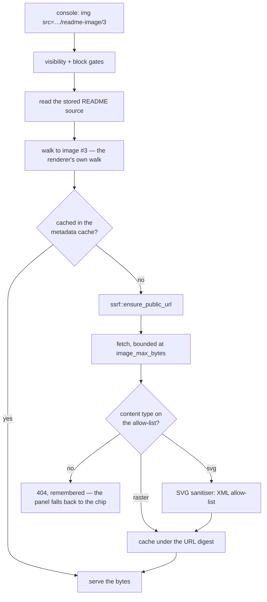
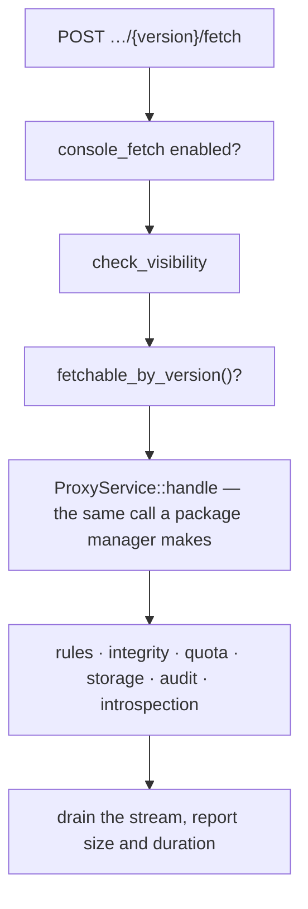

# RFC 0007-bis — The three RFC 0007 deferred

| Field       | Value                                                        |
| ----------- | ------------------------------------------------------------ |
| Status      | Implemented. Every open question was resolved by measurement first (§13), two of them against the recommendation this RFC was drafted with; §14 records where the built thing differs from what §1–§12 proposed |
| Short       | The three 0007 deferred |
| Settles     | Rendering a README's images without telling their host who is reading, searching what a package says rather than what it is called, and asking for a version the page has told you exists |
| Author      | Max Batleforc <maxleriche.60@gmail.com>                       |
| Co-author   | —                                                             |
| Created     | 2026-08-18                                                    |
| Supersedes  | —                                                             |
| Complements | RFC 0007 §11 open questions 1, 2 and 6 — the three it recommended a decision on and did not take; RFC 0002 (what "scanned" means), RFC 0009 §4.2 (the rungs), RFC 0004-bis §13.1 (one pass over the archive) |
| Touches     | `crates/core`, `crates/adapters`, `crates/config`, `crates/web`, `server`, `ui`, docs |

---

## 1. Summary

RFC 0007 shipped with seven open questions. Four were answered in the building:
RubyGems' README is a filename convention and the row stays, an edited upstream
README replaces its row with no history kept, the discovery read defaults to on,
and PyPI's per-version description costs one request per version selected.

Three were deferred with a recommendation and no decision, and all three are the
same shape: **the page now knows something it cannot act on.**

- A README's images are charted rather than loaded, and
  `remote_images = "proxy"` is a setting that validates, is carried to the
  renderer, and does nothing — because the endpoint it would rewrite to was
  never built.
- The catalogue's search matches **names**. A reader who knows what they need a
  library to *do* and not what it is called has a package page full of prose and
  a search box that cannot see it.
- The package page now lists versions this instance holds nothing of and marks
  every one **not held here** — and then offers no way to stop that being true.
  RFC 0007 made the page honest; it did not make it useful.

This RFC settles the three. Each is small on its own; together they are the
difference between a README panel that describes the catalogue and one an
operator can work from.

### Before / after

```text
# today

[registries.readme] remote_images = "proxy"
  → accepted, validated, carried to the renderer, and images are charted anyway
  → `readme.image-proxy-unimplemented` warns that the setting does nothing

GET /api/v1/explore/packages?name=retry        → matches package *names*
  → "which of our internal libraries does exponential backoff" is unanswerable

GET /api/v1/explore/packages/npm1/express      → 288 versions, every one
  → "not held here", "unknown" downloads, "not scanned"
  → and no way to change that from the page

# with this RFC

[registries.readme] remote_images = "proxy"
  → images render, fetched by this server, never by the reader's browser
  → GET /api/v1/explore/packages/{registry}/{name}/{version}/readme-image/{n}
    …resolved from the stored README, so no caller ever supplies a URL

[search] readmes = true
GET /api/v1/explore/packages?q=exponential+backoff&in=readme
  → { name: "…", matched_in: "readme", snippet: "…retries with exponential…" }
  → a name match always outranks a prose match

POST /api/v1/explore/packages/{registry}/{name}/{version}/fetch
  → the same download a package manager would have made, by the same identity,
    through every gate — the row becomes `proxied`, and `not scanned` becomes
    a real answer
```

---

## 2. Motivation

### 2.1 A setting that validates, is carried, and does nothing

RFC 0007 §4.1 refuses a `remote_images = "allow"` value on the grounds that it
would be a trap: the console's CSP is baked into the document at build time
(`img-src 'self' data:`), so the operator would set it, see broken images, and
find no error anywhere.

`"proxy"` shipped as very nearly the same trap. It is accepted by
`AppConfig::validate`, parsed into `RemoteImagePolicy::Proxy`, carried through
`HotConfig` to `RenderOptions`, and the renderer and sanitiser both implement the
proxied path in full — `sanitize.rs` has an attribute filter that rewrites every
`img src` and a test that asserts it. The only missing piece is a URL to rewrite
*to*.

What stops it being a trap today is a warning
(`readme.image-proxy-unimplemented`) that says in words what happens instead.
That is honest, and it is not a feature. An operator who wants badge rows in
their READMEs — and there is real demand for that; a badge row is the first
screenful of a great many READMEs — currently has no configuration that produces
them.

The reason not to *just render them* has not changed and is worth restating,
because it is the entire design constraint: a README's images live on hosts the
**package author** chose. Rendering them means every console page view sends a
request, with a `Referer`, to a third party, announcing that somebody inside this
network is reading about this package right now. For a proxy whose reason to
exist is partly *not* talking to the public internet on every developer action,
that is a regression delivered as a feature.

So the images must be fetched by **this server**, once, and served from this
origin. That is what `"proxy"` was always going to mean.

### 2.2 The search box promises names, and the question is about prose

`explore_packages` filters with `package_name ILIKE '%q%'` (and `lp.name` for
locally published rows). That is a substring match on names, and it is the whole
of the catalogue's search.

It answers *"do we have something called `retry`"*. It cannot answer *"which of
our internal libraries does exponential backoff"*, which is the question a
developer actually arrives with — and the question an internal package page is
the only place in the world that could answer, because there is no npmjs.com to
go and read instead.

RFC 0007 §11 recommended **no**, and said "revisit as its own RFC if asked for".
The reasons it gave were real and are addressed rather than dismissed here: a
full-text index over prose is a different storage and ranking problem, and the
search box currently promises name matching. The first is a design question with
a well-understood answer in Postgres. The second is a *product* claim, and the
answer is to stop making it silently — a result that matched on prose has to say
so, or it reads as a bug.

There is also a fact RFC 0007 created that makes this cheaper than it was: the
prose is already in one table, keyed by coordinate, with a digest. The index has
somewhere to live.

### 2.3 The page tells you a version exists and gives you no way to get it

This is the one that bothers most.

RFC 0007 §2.3's argument was that the console's own search finds packages this
instance holds nothing of, and the page it links to said *"no versions yet"*. That
page now lists every version upstream knows about, marks each **not held here**,
renders `unknown` where a download count would be and `not scanned` where a
vulnerability verdict would be.

Every one of those marks is honest. Together they describe a wall. The reader has
been told the version exists, told this instance does not have it, and given a
page whose only remaining move is to leave, open a terminal, guess the coordinate
their package manager wants, and run an install they may not want yet.

RFC 0007 §11 recommended deferring, and gave a good reason: *"it also means the
console can start artifact fetches, which is a new capability with quota and
authorisation questions of its own"*. Those questions have an answer, and reading
the code makes it a short one — see §5.3. The reason to take it now rather than
later is that the page is *already* honest about what it holds, which was the
stated precondition.

There is a second gain, and RFC 0002 owns it. `vulnerabilities_scanned: false` on
an upstream-only row is not a temporary display state — nothing will ever scan a
version this instance has no bytes of. A reader who wants to know whether a
candidate library has open advisories currently cannot find out from the page
that is telling them the library exists. Fetching is what turns that `false` into
an answer.

---

## 3. Goals / non-goals

**Goals**

- `remote_images = "proxy"` renders a README's images, fetched by this server,
  **never by the reader's browser** — and no caller ever names a URL for it to
  fetch.
- A search can match what a package *says* as well as what it is called, opt-in,
  and every result says which of the two it matched.
- A reader who can already download a version can ask this instance to fetch it
  from the page that told them it exists, through **every gate that download
  would have passed**, with the fetch attributed to them.
- Each of the three is independently useful and independently revertible: three
  config switches, three phases, no shared state.

**Non-goals**

- **Rendering images inline in the CLI, or in any client that is not the
  console.** `batlehub package readme` prints the source, images included as
  markdown. Nothing changes there.
- **An image cache with a lifetime of its own.** The bytes ride the existing
  metadata cache and its TTL, for the reason RFC 0007 §4.1 gives about
  `upstream_detail`: a second, independently clocked expiry for bytes that
  already have one is how two caches come to disagree.
- **Ranking search results across registries by anything but relevance and
  name-over-prose.** No download-count boost, no recency boost. Those are
  product decisions with their own arguments and none of them belong in the
  change that makes prose searchable at all.
- **Indexing a README this instance does not store.** A derived README (RFC 0007
  §5.6) is bounded by the metadata cache's TTL and has no row; indexing it would
  mean either writing the row §5.6 refuses or an index that half-empties itself.
  Upstream-only versions are not searchable, and the empty state says so.
- **Searching any other prose.** Not commit messages, not dependency manifests,
  not the SBOM. One column becomes searchable.
- **Fetching a version an identity could not download.** The button is not a
  privilege; it is a shortcut for a request the caller could already make. If
  the download path would refuse it, so does the button, with the same reason.
- **Bulk fetch, "fetch all versions", or a fetch queue.** One version, one named
  actor, one decision. `task warm` and `POST …/warm` remain the bulk answer and
  remain admin-only.
- **Making the console's *page view* fetch anything.** RFC 0007 §4.4's list of
  what a page view does not do is unchanged and stays enforced by the same tests.
  This adds a **button**, which is a different thing from a page load in exactly
  the way that matters.

---

## 4. User-facing design

### 4.1 Configuration

Three switches, one per question, in the block each belongs to.

```toml
# 1 — images. `proxy` stops being inert.
[registries.readme]
remote_images   = "proxy"    # "strip" (default) | "proxy"
image_max_bytes = 2097152    # 2 MiB per image; larger is not served

# 2 — prose search. Off by default: this one is not free.
[search]
readmes     = true
text_config = "english"   # the Postgres text search configuration

# 3 — fetch. On by default: it admits nothing a caller could not already do.
[registries]
console_fetch = true
```

- **`image_max_bytes`** is per image and separate from `max_bytes`, which caps a
  stored README's *text*. A 256 KiB text cap and a 2 MiB image cap are not the
  same number for the same reason, and sharing one would make raising either a
  decision about the other.
- **`text_config`** is the Postgres text search configuration the index is built
  with. `english` is the default because it is measurably better at the question
  this feature exists to answer — a reader who types `retry` finds a README that
  says `retrying`, and one who types `cache` finds `caching`; `simple` finds
  neither (§13.3). Changing it **rebuilds the generated column**, so it is a
  decision to take at install rather than to tune later, and `validate()` says so
  rather than letting an operator discover it during a migration.
- **`[search] readmes`** is global and off by default. Unlike README capture —
  which RFC 0007 defaulted on because it costs one already-parsed field — this
  builds an index over prose, and the cost is storage plus write amplification on
  every capture. An operator should choose it.
- **`console_fetch`** is per registry and on by default. It admits nothing: the
  fetch runs the same download the caller could already run with `curl`. The
  switch exists for the operator who wants the console strictly read-only, which
  is a legitimate posture and not one the software should have to guess at.

### 4.2 Images that this server fetches

With `remote_images = "proxy"`, the renderer keeps the `` and rewrites its
`src` to **this** server:

```
GET /api/v1/explore/packages/{registry}/{name}/{version}/readme-image/{index}
```

**The caller never supplies a URL.** `{index}` is the position of the image in
that version's README, and the server resolves it by re-reading the stored source
and walking to the *n*th image — the same walk the renderer did, over the same
bytes, at the same renderer version, so the two agree by construction. §5.1 says
why this shape rather than the signed-URL one RFC 0007 sketched.

The response is the image bytes, with:

- the `Content-Type` echoed from an allow-list — `image/png`, `image/jpeg`,
  `image/gif`, `image/webp`, `image/avif`, and **`image/svg+xml`** — and nothing
  else.
- `Content-Disposition: inline`, `X-Content-Type-Options: nosniff` (already
  global), and a `Cache-Control` derived from the registry's `metadata_ttl_secs`
  so a reader who scrolls back does not re-request.

**SVG is on that list, and this RFC was drafted saying it would not be.** The
draft's reasoning — an SVG is a document that can carry script, and this serves
from the console's own origin — is correct and is not sufficient, because
**two-thirds of the images in real READMEs are SVG** (§13.2). Excluding them
would make `remote_images = "proxy"` refuse every shields.io badge, which is to
say the entire feature for the case that motivated it: a setting that appears to
render images and mostly does not. That is the `"allow"` trap wearing different
clothes.

So SVG is served, through two independent controls, either of which is sufficient
on its own (§7.2):

- it goes through an **SVG sanitiser** — an XML allow-list, in the same shape and
  with the same fuzz discipline as `sanitize.rs`, which drops `<script>`,
  `<foreignObject>`, every `on*` handler, and every external reference;
- the response carries **`Content-Security-Policy: default-src 'none'; style-src
  'unsafe-inline'; sandbox`**, which neutralises script even for a reader who
  opens the image in a new tab — the one mode in which a browser would otherwise
  execute it.

The CSP does not change. `img-src 'self'` already permits this, which is the
point: the image is served from the console's own origin, so the policy that
blocks a third-party host keeps blocking it.

When the image cannot be served — the upstream is unreachable, the type is not on
the allow-list, it is over `image_max_bytes`, the README is derived and its cached
document has since expired — the endpoint returns `404` and the panel falls back
to **the chip it shows under `"strip"`**: the alt text and the host. A broken
image icon would be a worse answer than the one `"strip"` gives, and there is no
reason to accept a regression on the failure path.

### 4.3 Searching what a package says

```
GET /api/v1/explore/packages?q=exponential+backoff&in=name|readme|both
```

`in` defaults to `name`, which is today's behaviour byte for byte. `readme` and
`both` are the new values, and both require `[search] readmes = true` — with it
off they are accepted and answer exactly as `name` does, plus a response field
saying so. A parameter that silently means something else is the failure this
whole RFC family keeps finding; a parameter that says *"prose search is not
enabled on this instance"* is one an operator can act on.

Each hit gains two fields:

| Field | Meaning |
| --- | --- |
| `matched_in` | `name` \| `readme` \| `both` — why this row is here |
| `snippet` | The matched fragment of the README, as **plain text**, or `null` |

`matched_in` exists because a result that matches nothing the reader can see
reads as a bug. A row whose name has nothing to do with the query and whose
README mentions it in passing is a *correct* result and an inexplicable one
without the label.

`snippet` is plain text and is rendered as text. It never reaches `v-html`. The
README panel's `v-html` is a deliberate, tested, single-component boundary
(RFC 0007 §6.5); a search snippet is a *second* place where package-authored
content reaches the page, and it is not going to be a second place where markup
is interpreted. §7.3.

**Name always outranks prose.** A package literally called `retry` must come
before one that mentions retrying, however densely. This is not a tuning
parameter; it is what a reader means when they type a name.

**Only stored READMEs are searchable**, which is to say only versions this
instance holds or hosts. The empty state says so rather than implying the query
found nothing: *"no package here says that — this searches READMEs of versions
held on this instance"*.

### 4.4 Asking for a version

On a row marked **not held here**, a **Fetch this version** button:

```
POST /api/v1/explore/packages/{registry}/{name}/{version}/fetch
  → 200 { fetched: true, size_bytes, duration_ms }
  → 403 { code: "fetch.denied", message: "<the rule's own reason>" }
  → 404   the registry, package or version does not exist upstream
  → 409 { code: "fetch.already-held" }
```

It runs **the download**. Not a warming task, not a special path — the same
`ProxyService::handle` a package manager's request runs, with the same
`ProxyRequest`, under the caller's own identity. §5.3 explains why that is the
only defensible shape, and it is the section of this RFC most worth reading.

What follows from that, and is the point:

- **The rules run.** RBAC, the block list, the release-age gate, the licence
  gate, `require_signed_release`, the version gate. A refusal returns the rule's
  own reason, which is the same string the download would have given — so the
  console shows the operator *why*, and the `/tools/access-check` page it already
  links to explains the same verdict.
- **Integrity verification runs**, including `block_on_mismatch`. Bytes that fail
  their advertised checksum are not stored and the fetch fails, exactly as a
  download does.
- **Quota is consumed** where quota applies, and the response carries the same
  quota headers a publish does.
- **The access event is recorded, with the caller as the actor.** This is the
  difference from a page view in one line: a page view has no actor because
  nobody decided anything. A fetch has one, and the audit log names them.
- **SBOM and README extraction run**, because the artifact lands in storage
  through the ordinary path and `maybe_introspect_artifact` fires. A version
  fetched from the page therefore gains its licence, its dependency manifest and
  its archive-borne README without a second mechanism.
- **The row changes.** `source` becomes `proxied`, `download_count` becomes `1`,
  `readme` may become `available`, and `vulnerabilities_scanned` becomes `true`
  once the scanner next runs — which is the loop RFC 0002 left open for versions
  nothing had ever opened.

The button is **not shown** when the version cannot be addressed by version
alone. Maven's artifact is a set of files, and a Terraform provider needs an OS
and an architecture; "fetch this version" has no single meaning for either.
`RegistryKind::fetchable_by_version()` answers, exhaustively (§6.1), and the
console renders the reason rather than a disabled button with no explanation.

### 4.5 Validation

`AppConfig::validate()` rejects:

| Condition | Rationale |
| --- | --- |
| `image_max_bytes == 0` with `remote_images = "proxy"` | Serves nothing while claiming to render images — the same defect `max_bytes = 0` with `enabled = true` already refuses. |
| `image_max_bytes` > 16 MiB | The bytes are buffered in memory to check the type and the cap before anything is written. A ceiling makes that bound a statement rather than a hope. |
| `[search] readmes = true` with no Postgres database | The index is a Postgres generated column with a GIN index. There is no other backend to put it in, and failing at startup beats a search that quietly matches nothing. |

Warnings:

| Condition | Behaviour |
| --- | --- |
| `remote_images = "proxy"` on a registry whose `readme_support()` is `None` | Accepted and inert: there is no README, so there are no images. Same shape as `README_UNSUPPORTED_TYPE`. |
| `[search] readmes = true` while every registry has `[registries.readme] enabled = false` | Accepted. The index will exist and stay empty, because nothing is ever stored to put in it. |
| `console_fetch = true` on a `local`-mode registry | Accepted and inert. There is no upstream to fetch from; every version the page lists is already held. |

The existing `readme.image-proxy-unimplemented` warning is **removed** — it says
the endpoint does not exist, and after phase 1 it does. A warning that outlives
its subject is worse than no warning, because it teaches operators the channel is
noise.

---

## 5. Architecture

### 5.1 An image proxy that takes no URL

The obvious design is `GET /readme-image?url=<encoded>`, and it is the one
RFC 0007's `sanitize.rs` was built for — the attribute filter percent-encodes the
original URL onto a caller-supplied prefix. It is also an **open image proxy for
any authenticated console user**, which RFC 0007 §11 named as the objection:
*"it makes BatleHub an open-ish image proxy for whatever a package author
writes"*.

Three ways out, and the third is better than the two the RFC considered:

| Shape | Why not / why |
| --- | --- |
| An allow-list of image hosts | An operator would have to maintain a list of every CDN every package author uses. It will be wrong, and wrong in the direction of broken images, which is indistinguishable from the feature not working. |
| HMAC-signed URLs | Correct, and introduces a signing key: generated where, rotated how, shared between replicas how. A new secret with a lifecycle, for a feature that renders badges. |
| **Address by coordinate and index** | The caller names `{registry}/{name}/{version}/readme-image/{n}`. The server resolves the URL by walking that version's **stored README** to the *n*th image. There is no caller-supplied URL, so there is nothing to sign and nothing to allow-list. |

The third works because the renderer already walks that exact list — `strip_images`
in `render.rs` visits every `Tag::Image` in order to build its chips. Extracting
the same list is the same walk with a different accumulator, over the same stored
bytes at the same `RENDERER_VERSION`, and the fuzz target already asserts that
rendering is deterministic. The `n` the browser asks for is the `n` the renderer
emitted.

It also inherits, for free, everything the README endpoint already decides:
`check_visibility` (an `internal` package's images are not a side channel around
the gate that hides its name), the block state (a blocked version serves no
README and therefore no images), and the fallback rule. A URL-taking endpoint
would have had to re-derive all of that, or skip it.



The fetch itself is the one the RFC already specified: `ssrf::ensure_public_url`
against the resolved host, the shared `UpstreamHttpOptions` client with its
timeouts and TLS settings, the body read incrementally to `image_max_bytes`
rather than buffered-then-truncated, and a decode-safe content-type allow-list.
Redirects go through `ssrf::fetch_following_redirects`, which validates **every
hop** — an image URL that 302s to `169.254.169.254` is the attack this exists to
stop.

Caching is the existing `CacheStore` under `readme-image:{sha256(url)}`, encoded
the way `passthrough.rs`'s `UpstreamBytes` already encodes bodies. Keyed by URL
rather than by coordinate, so two packages with the same shields.io badge — which
is most of them — are one entry.

### 5.2 Search is an index on a column that already exists

`package_readmes.content` is `TEXT`, one row per coordinate. Making it searchable
is a generated `tsvector` column and a GIN index:

```sql
ALTER TABLE package_readmes
  ADD COLUMN content_tsv tsvector
  GENERATED ALWAYS AS (to_tsvector('simple', content)) STORED;

CREATE INDEX idx_package_readmes_fts ON package_readmes USING GIN (content_tsv);
```

`'english'` rather than `'simple'`, and this RFC was drafted arguing the
opposite. The draft's reasoning was that stemming mangles identifiers — `axios`
becomes `axio`, `redis` becomes `redi` — and that a README search is closer to a
code search than a document search.

The first half is true and the conclusion does not follow. **Stemming is applied
to the query as well as the document**, so a search for `axios` becomes a search
for `axio` and still matches. Measured, `english` answers every one of seven test
queries correctly and `simple` fails two of them — including `retry` against a
README that says `retrying`, and `cache` against one that says `caching`, which
are exactly the searches this feature exists to serve (§13.3).

`simple` is not the conservative choice. It is the choice that silently returns
nothing for the most natural way to ask.

The configuration is settable (`[search] text_config`) because an estate whose
internal packages are documented in another language is precisely the kind of
deployment that self-hosts, and because the column is `GENERATED … STORED`:
changing it later rebuilds the whole column, which makes it a decision worth
taking at install rather than discovering during a migration.

Generated and `STORED`, so the index cannot drift from the text: there is no
trigger to forget and no backfill to run. The cost is write amplification on
`ReadmeService::record`, which already refuses to rewrite an unchanged digest —
so a re-resolve that changed nothing costs nothing here either.

Ranking is `ts_rank_cd`, with **name matches lifted above every prose match** by
sorting on a match-class key first and the rank second, not by a weight that a
sufficiently dense README could out-score.

The query is `websearch_to_tsquery`, which accepts what a person types —
quoted phrases, `or`, `-excluded` — and does not error on syntax the way
`to_tsquery` does. A search box that 500s on an apostrophe is not a search box.

### 5.3 Fetch is the download path, and this is the whole design

`WarmingService::warm_one_version_inner` calls `client.fetch_artifact` **directly**
and stores the result. It does not go through `ProxyService::handle`. That means
warming bypasses the rule engine, the release-age gate, the block list, the
licence gate, quota, and the access audit — and this is *fine*, because
`POST /api/v1/admin/registries/{registry}/warm` calls `require_admin` and an
administrator pre-fetching their own registry is not a request that needs gating.

So the single most important sentence in this RFC is: **the fetch button must not
reuse the warming service.** Wiring a non-admin button to a path built on the
assumption of an admin caller would hand every console user a way to pull bytes
past every gate the proxy has. It would not look like a hole — it would look like
reuse.

Instead:



The handler builds a `ProxyRequest` with the caller's own `Identity`, calls
`ProxyService::handle`, and **discards the body** — it wants the side effect, not
the bytes. Everything that makes a download safe applies because it *is* a
download; the only difference is that nothing writes the response to a socket.

That also settles RFC 0007 §11's "quota and authorisation questions of its own":
they are not of its own. They are the download path's questions, already
answered, and the button inherits the answers. The new surface is one endpoint
and one `RegistryKind` accessor.

One consequence worth stating rather than discovering: this makes the console
capable of causing egress that a page view cannot. `docs/operations/egress.md`
gains a section, and it is a *button*, which is the difference the page has to
make visible — §7.4.

---

## 6. Detailed design

### 6.1 `crates/core`

**`entities/registry_kind.rs`** — `fetchable_by_version(&self) -> FetchSupport`,
returning `ByVersion`, `ByVersionWithArtifact(&'static str)` for the kinds whose
artifact needs a sub-coordinate (`vsix`, `plugin` — `warm_artifact()` already
names these and this reuses it rather than restating it), or `None(&'static str)`
for Maven, Terraform providers and the path-addressed kinds. Exhaustive, no
wildcard arm, generated into the support table alongside `readme_support()` and
`upstream_detail()` — the same contract, for the same reason.

**`services/readme/render.rs`** — `image_urls(source, format) -> Vec<String>`,
sharing `strip_images`' walk. One function, two accumulators; a second walk that
could disagree with the first is the whole risk this design takes on and the
reason not to write one.

**`services/readme/sanitize.rs`** — `image_proxy_prefix` becomes a *path* prefix
rather than a query prefix, and the attribute filter rewrites `src` to
`{prefix}{n}` using the index of the image being visited. `encode_query_value`
loses its only caller and goes with it. `RENDERER_VERSION` **bumps**: the output
changes, and the render cache must not serve a rendering made under the old
scheme.

**`services/search/`** — `SearchScope { Name, Readme, Both }` on the existing
`SearchService`, and `matched_in` / `snippet` on `SearchHit`. The upstream search
rungs are untouched: an upstream's search API answers about names, and asking it
about prose is not a thing the protocols offer.

**`ports/readme.rs`** — `ReadmeRepository::search(registry_scope, query, limit)`.
On the port because the query is Postgres FTS and the in-memory implementation
answers with a substring match, which is the honest double: the tests that matter
for ranking run against real Postgres (`pg_readmes.rs`), and the in-memory one
exists so the web suite can exercise the endpoint's shape.

### 6.2 `crates/adapters`

- **`migrations/035_package_readmes_fts.sql`** — the generated column and the GIN
  index of §5.2. `CREATE INDEX CONCURRENTLY` is not available inside the
  migration transaction; on a large `package_readmes` this migration takes a lock
  for the duration of the build. Stated in the release notes, because an operator
  with a large catalogue should choose when to run it.
- **`db/readme.rs`** — the search query, `websearch_to_tsquery`, `ts_rank_cd`,
  and `ts_headline` for the snippet with markup **disabled**
  (`StartSel=, StopSel=`), so what comes back is text and nothing else has to
  strip it.
- **`registry/http_client.rs`** — `fetch_image`, the bounded, allow-listed,
  redirect-validating read of §5.1. Beside `fetch_linked_text` rather than inside
  it: the two share a shape and differ in every guard that matters, and merging
  them would produce one function with a `is_image` flag deciding four things.

### 6.3 `crates/web`

- **`handlers/front_office/explore/image.rs`** (new) — the endpoint of §4.2.
  Visibility and block gates first, exactly as `readme.rs` does them, then resolve
  the index, then serve.
- **`handlers/front_office/explore/fetch.rs`** (new) — the endpoint of §4.4. It is
  short by construction: build the `ProxyRequest`, call `handle`, drain, report.
  Its length is the argument for the design.
- **`handlers/front_office/explore/list.rs`** — `q`/`in` on the query, `matched_in`
  and `snippet` on the DTO, and `readme_search_enabled` on the response so a
  client can tell "no matches" from "not enabled".

### 6.4 `ui`

- **`ReadmePanel.vue`** — no change to the `v-html` boundary, which is the point.
  With `"proxy"` the HTML it receives contains `` tags pointing at this
  origin; the panel does not know or care which policy produced them. A CSS rule
  gives images a max width and a placeholder background, so a `404` degrades to
  the chip rather than to a broken-image icon.
- **`PackageDetailPage.vue`** — the **Fetch this version** button on
  `source === "upstream"` rows, its refusal rendered with the rule's own reason,
  and a refresh of the row on success so the reader sees `proxied` rather than
  having to reload.
- **`ExplorePage.vue`** — the `in` control, the `matched_in` badge, the snippet
  rendered as **text**, and the empty state of §4.3.
- **`src/locales/{en,fr}.json`** — French written from what the control does, per
  the standing rule, not translated word for word.

---

## 7. Security considerations

### 7.1 The image proxy's risk is that it fetches what it is told

An endpoint that fetches a URL on a caller's behalf is an SSRF primitive unless
every one of these holds, and this design's answer to each:

| Risk | Answer |
| --- | --- |
| Caller names an internal URL | **The caller names no URL.** It names a coordinate and an index; the URL comes from a README this instance stored. §5.1. |
| A README names an internal URL | `ssrf::ensure_public_url` resolves the host and refuses every private, reserved, loopback and link-local address — the same guard artifact downloads already use. |
| A redirect goes somewhere internal | `ssrf::fetch_following_redirects` validates **every hop**, not just the first. |
| The response is a huge file | Read incrementally to `image_max_bytes`, never buffered then truncated. |
| The response is not an image | A decode-safe content-type allow-list, echoed rather than passed through, with `nosniff` already global. |
| The response is an SVG | **On the allow-list, sanitised and sandboxed.** Two-thirds of README images are SVG (§13.2), so excluding them refuses the case that motivated the feature. §7.2 has the two controls, either sufficient alone. |
| The endpoint becomes a general-purpose proxy | It cannot fetch anything that is not an image in a README this instance holds, for a package the caller can already see. |

A residual worth naming rather than hiding: a package author still chooses *which
host this server talks to*, and can therefore learn that **somebody** on this
instance rendered their README, plus this instance's egress IP. What they cannot
learn is who, when repeatedly, or from which internal address — the requests are
this server's, coalesced and cached. That is a real reduction and not an
elimination, and an operator for whom even that is unacceptable keeps `"strip"`,
which remains the default.

### 7.2 Serving an SVG from the console's own origin

Two-thirds of README images are SVG (§13.2), so the choice is not *whether* to
handle them but how. The threat is precise, and so is the answer.

An SVG referenced by `` is rendered by every browser in **secure static
mode**: scripts do not run and external references are not loaded. The panel's
rendering is therefore already safe, and the beacon this whole feature exists to
prevent is already prevented there. The exposure is the *other* modes — a reader
who opens the image in a new tab, or any embedding through `<object>`/`<iframe>`
— where an SVG is a document that executes with the origin it was served from,
which here is the console's.

Two independent controls, either sufficient alone:

| Control | What it stops |
| --- | --- |
| **`Content-Security-Policy: default-src 'none'; style-src 'unsafe-inline'; sandbox`** on the image response | Script execution in *every* mode, including top-level navigation, and every subresource load. This is the control that does not depend on our parser being right. |
| **An SVG sanitiser** — XML allow-list over `quick-xml`, already in the tree | `<script>`, `<foreignObject>`, `on*` handlers, `href`/`xlink:href` to anything but a document fragment, `<use>` and `<image>` external references, and `<style>` `@import`. This is the control that does not depend on the browser being right. |

Belt and braces is deliberate here and not elsewhere in this RFC, for the reason
RFC 0007 §7.1 gives about the HTML sanitiser: this is markup an arbitrary
publisher authored, rendered on an authenticated administrator's origin. The
sanitiser gets the same treatment its HTML sibling got — a table-driven corpus of
the standard SVG vectors and a fuzz target asserting no `<script`, no `on*=` and
no external reference survives.

Rasterising to PNG instead was considered and rejected in §8: a shields.io badge
is *text*, and rasterising text without the right fonts on the server produces
output that is wrong in a way nobody would notice until a reader complained.

### 7.3 Search does not widen what anyone can see

The search runs against `package_readmes` rows scoped to the registries in
`explore_accessible_registries_for(&identity)` — the same set the listing and the
detail page already use — and then through the same per-package `check_visibility`
the detail endpoint applies. An `internal` package does not become discoverable
by quoting a phrase from its README, which would otherwise be a neat oracle: the
name is hidden, the prose is not, so guess the prose.

The snippet is the one genuinely new exposure, and it is deliberately narrow: it
is a fragment of a document the same caller could fetch in full from
`…/readme`. If they could not fetch that document, they get no row.

### 7.4 A search snippet is package-authored content on a second surface

RFC 0007 §6.5 established that exactly one component may render server-supplied
HTML, and that a repository-wide test keeps it that way. A search results page
that rendered snippets as markup would be a second such component, reached by a
much cheaper path — no navigation, just a query.

So the snippet crosses no markup boundary at all: `ts_headline` is asked for
empty start and stop delimiters, the API returns plain text, and the console
interpolates it. It cannot contain markup because nothing on the path produces
any, and the `v-html` assertion in `ReadmePanel.test.ts` continues to name the
only two components that may.

### 7.5 Fetch admits nothing, and must be seen to admit nothing

The button's entire security argument is that it is the download path. That
argument is only true while it *stays* the download path, which is a property of
one call site and therefore easy to erode — someone optimising a slow fetch by
"reusing the warming service" would silently remove every gate.

Two things defend it:

- **A test that asserts the refusal**, not just the success: a caller whose role
  cannot download a version gets `403` from the button with the rule's reason,
  and a version behind an unexpired release-age gate is refused with *that*
  rule's reason. A test that only checked the happy path would pass against a
  warming-service implementation.
- **A test that the audit event exists**, with the caller as actor. Warming
  records none, so this is the assertion that fails if the paths are ever
  swapped.

The other visible change: a page view still writes nothing, and RFC 0007 §4.4's
assertions are untouched. The console can now *cause* a write, and the difference
is a button and a named actor. `docs/operations/egress.md` gains a **"someone
presses Fetch"** section beside the ones for a build, a search box and the
discovery read, because a page that can start an artifact download belongs on the
list of what makes this instance talk to the internet.

---

## 8. Alternatives considered

| Alternative | Why rejected |
| --- | --- |
| Leave `remote_images = "proxy"` unimplemented and delete the value | Honest, and it gives up on badge rows permanently. The value is already validated, carried and tested end to end in the renderer; what is missing is one endpoint. Deleting a setting to avoid writing the endpoint is the wrong trade. |
| Sign image URLs with an HMAC instead of addressing by index | Correct, and it introduces a secret with a lifecycle — generated where, rotated how, shared between replicas how — for a feature that renders badges. The index shape needs no secret. §5.1. |
| Fetch and store a README's images at capture time | Turns every capture into N outbound requests and puts third-party binaries in the artifact store, where eviction, quota and the SBOM would all have to learn about them. And it beacons at capture rather than at read, which is not an improvement, only a different time. |
| Widen the CSP so images load directly | Every console page view becomes a beacon to a host the package author chose. This is `"allow"`, which RFC 0007 §4.1 refused, and refusing it is why `"proxy"` exists at all. |
| `ILIKE '%q%'` over `content` instead of a real index | One line, and a sequential scan over every stored README on every keystroke. It would work in a demo and fall over on the first real catalogue, which is the worst possible order to discover it in. |
| An external search engine | A second stateful service to deploy, back up and secure, for one column. Postgres FTS is in the database that is already required. |
| Rasterise SVG images to PNG on the server | Removes the SVG class of risk outright, and needs a rasteriser (`resvg` and its tree) **plus fonts on the server**. A shields.io badge is text; rasterising it without the fonts it was designed against produces output that is subtly wrong and that nobody notices until a reader reports an unreadable badge. Also CPU per distinct image, forever, to avoid a class two response headers already close. |
| Exclude SVG and accept charted badges | What this RFC was drafted with. Measurement killed it: 67 % of README images are SVG (§13.2), so `"proxy"` would refuse two-thirds of them and look broken — the `"allow"` trap in different clothes. |
| `'simple'` text search configuration | What this RFC was drafted with, on the argument that stemming mangles identifiers. It does, and symmetrically: the query is stemmed too, so `axios` still matches. Meanwhile `simple` fails `retry`→`retrying` and `cache`→`caching`, which are the searches the feature exists for (§13.3). |
| Index the manifest `description` too | RFC 0007 §3 already refused to *show* a description where a README belongs. Searching it is a different question, but it is a different question — and mixing two sources into one relevance score without deciding how they rank is how a search box stops being explicable. |
| Reuse `WarmingService` for the fetch button | It bypasses the rule engine, quota and the audit, because its only caller is `require_admin`. This is the design's central trap and §5.3 exists to name it. |
| Make the fetch admin-only | Safe and useless: an administrator is not the person reading a package page deciding whether to adopt a library. And it is unnecessary — the download path already answers "may this identity have these bytes". |
| Fetch automatically when a reader opens the page | RFC 0007 §11 question 14 already refused this, and nothing has changed: it makes browsing a write, on behalf of a reader who may have clicked the wrong link. The button is the same capability with a decision in front of it. |
| A fetch *queue* with progress, retries and cancellation | A version download is seconds, and the endpoint already streams through the ordinary path. A queue is the right answer to bulk warming, which already exists and is already admin-only. |

---

## 9. Rollout and compatibility

- **Defaults.** `remote_images` stays `"strip"`. `[search] readmes` is `false`.
  `console_fetch` is `true`. An instance that upgrades and changes nothing gets
  one new capability — the button — and it admits nothing its users could not
  already do.
- **API compatibility.** `matched_in`, `snippet` and `readme_search_enabled` are
  additive. `in` and `q` are new optional parameters whose absence is today's
  behaviour. The two new endpoints add routes. Nothing changes shape.
- **The renderer version bumps**, which invalidates every cached rendering. That
  is the mechanism working: the image markup changed, and a rendering made under
  the old scheme must not be served. No backfill, no migration — the next read
  re-renders from the stored source, which is the entire reason RFC 0007 §5.3
  stores the source.
- **Migration `035` builds a GIN index in-transaction.** On a large
  `package_readmes` this holds a lock for the duration. Named in the release
  notes so an operator with a big catalogue schedules it, rather than finding out
  during a deploy.
- **The `readme.image-proxy-unimplemented` warning is removed.** An operator who
  had `"proxy"` set and was living with the warning gets working images and no
  warning, with no config change.
- **Rollback.** Each of the three reverts independently: set `remote_images` back
  to `"strip"`, set `[search] readmes = false` (the index can be dropped or left;
  nothing reads it), set `console_fetch = false`. The migration is additive and
  the column is unread when the switch is off.

---

## 10. Test plan

- **The `<picture>` chip** (`render.rs`): a `<picture>` with a fallback ``,
  in a markdown README and in an HTML one, produces a chip carrying the
  fallback's alt text and host, and the alternative `<source>` is not a second
  chip. Written and passing already — phase 0 shipped with RFC 0007 §13.10. What
  remains for *this* RFC is the same corpus under `remote_images = "proxy"`,
  where the chip becomes a proxied `` pointing at the fallback.
- **The SVG sanitiser** (`svg.rs`): a table-driven corpus — `<script>`,
  `<foreignObject><script>`, `onload` on `<svg>` and on a child, `<use
  href="http://…">`, `<image href="…">`, `<style>@import`, an entity-encoded
  handler, a nested `<svg>` — each asserting the *specific* removal; a fuzz
  target over arbitrary bytes asserting no `<script`, no `on*=` and no external
  reference survives; and a real shields.io badge rendering to something that
  still contains its text, because a sanitiser that empties every badge is a
  sanitiser nobody will keep enabled.
- **Images** (`crates/core/src/services/readme/render.rs`,
  `crates/web/tests/readme_images.rs`): `image_urls` and `strip_images` agree on
  order and count for the same source, over the corpus and under the fuzz target
  — this is the invariant the index shape rests on; a nested image, a linked
  badge and a `data:` URI each land where the renderer put them; the endpoint
  refuses an index past the end; a blocked version's images are `403` like its
  README; an `internal` package's images are `404` for an anonymous caller; an
  SVG response is refused; an over-cap response is refused; a redirect to a
  private address is refused (`ssrf` unit tests already cover the guard — this
  covers that the guard is *reached*); two packages carrying the same badge URL
  produce one cache entry and one upstream request.
- **Search** (`crates/adapters/tests/pg_readmes.rs`,
  `crates/web/tests/explore_search.rs`): a phrase in a README is found and
  `matched_in` says `readme`; a name match and a prose match for the same query
  return the name match first, **regardless of prose density** — the assertion
  that would fail under a weight-based ranking; a snippet contains no markup for
  a README full of it; **`retry` finds a README that says `retrying`** — the
  query `simple` fails and the reason `english` is the default; an `internal` package is absent for a caller who cannot
  see it, and its distinctive phrase returns nothing (the oracle test); a
  registry the caller cannot explore contributes nothing; `in=readme` with the
  feature off answers as `in=name` and says `readme_search_enabled: false`; an
  apostrophe, an unbalanced quote and a bare `or` all return a result set rather
  than a `500`.
- **Fetch** (`crates/web/tests/explore_fetch.rs`): a fetch stores the artifact and
  the row becomes `proxied` with `download_count: 1`; **a caller whose role
  cannot download gets `403` with the rule's reason**; **a version behind a
  release-age gate is refused with that gate's reason**; a blocked version is
  refused; **an access event is recorded naming the caller** — the three
  assertions that fail if this is ever rewired to the warming service; a checksum
  mismatch fails the fetch and stores nothing; a second fetch of a held version
  is `409`; a Maven coordinate reports not-fetchable rather than fetching
  something arbitrary; `console_fetch = false` refuses; the README and SBOM are
  extracted afterwards, so `readme` moves from `unknown` to `available`.
- **Config** (`crates/config/src/schema/tests.rs`): each rejection and each
  warning of §4.5, and that `readme.image-proxy-unimplemented` is gone.
- **Existing suites that must pass unchanged**: RFC 0007's
  `explore_upstream_detail.rs` — **a page view still writes nothing**, which is
  the invariant this RFC is closest to eroding; `ReadmePanel.test.ts`'s `v-html`
  boundary, which must still name exactly two components; `openapi_contract.rs`;
  `task coverage-check` ≥ 80 %.

---

## 11. Decisions and open questions

### Resolved

| # | Question | Decision |
| --- | --- | --- |
| 1 | How does the image endpoint avoid being an open proxy? | **It takes no URL.** Address by coordinate and index; resolve against the stored README with the renderer's own walk. No signing key, no allow-list, and it inherits the README endpoint's visibility and block gates. §5.1. |
| 2 | Serve SVG images? | **Superseded by q14 — the answer is now yes, sanitised and sandboxed.** It was drafted as no, on the sound reasoning that an SVG is a document that can carry script and would be served from the console's own origin. What that reasoning did not know is that two-thirds of README images are SVG (§13.2), which makes "no" a refusal of the feature rather than a restriction on it. Kept here rather than rewritten, because the threat it names is real and is what §7.2's two controls answer. |
| 3 | Where do fetched images live? | **The metadata cache**, keyed by URL digest, under the registry's own TTL. Not the artifact store: they are not artifacts, and eviction, quota and the SBOM would all have to learn about them. |
| 4 | Is prose search on by default? | **No.** Unlike README capture, this is a real index with real storage and write cost. RFC 0007 defaulted capture on because it was one already-parsed field; this is not that. |
| 5 | `simple` or `english` text search? | **Superseded by q16 — the answer is now `english`, and settable.** Drafted as `simple` because stemming mangles identifiers. It does (`axios` is stored as `axio`), and it does not matter: the query is stemmed by the same configuration, so it still matches — while `simple` fails `retry` against a README that says `retrying`. §13.3. |
| 6 | Can a prose match outrank a name match? | **Never.** A package called `retry` beats one that mentions retrying, however densely. That is what a reader means when they type a name. |
| 7 | Are derived (unstored) READMEs searchable? | **No.** They have no row, and writing one is what RFC 0007 §5.6 refuses. The empty state says what the search covers. |
| 8 | Does the fetch button reuse the warming service? | **No, and this is the central decision.** Warming bypasses the rule engine, quota and the audit because its only caller is `require_admin`. The button runs `ProxyService::handle`. §5.3. |
| 9 | Who may press Fetch? | **Anyone the download path would allow**, and nobody else. It is a shortcut for a request the caller could already make, not a new privilege. |
| 10 | Is the fetch admin-only? | **No.** An administrator is not the person reading a package page deciding whether to adopt a library. |
| 11 | What happens on a kind with no single artifact per version? | **The button is not offered**, and the page says why. `fetchable_by_version()` answers exhaustively, so a new kind cannot be added without deciding. |
| 12 | Does a page view still write nothing? | **Yes**, unchanged, and the assertions stay. A button is not a page view: it has an actor. §7.4. |

### Resolved by measurement

Five questions were left open when this was drafted. All five are now answered,
and **two of them against the recommendation they were drafted with**. §13 has
the measurements; this is what they decided.

| # | Question | Decision |
| --- | --- | --- |
| 13 | Follow `srcset` and `<picture>`? | **Yes, narrowly — and it is a bug fix, not a feature.** 7 % of sampled READMEs use each, and a `<picture>` rendered to **nothing at all**: no image, no chip, not even the alt text (§13.1). That breaks the promise RFC 0007 §7.3 makes for stripped images — *"the reader can see that an image was there and where it pointed"*. Raw-HTML `` is chipped like a markdown one, so `<picture>` degrades to its fallback's chip — **shipped ahead of this RFC**, in [RFC 0007 §13.10](/rfc/0007-package-readmes#_13-10-an-image-written-as-html-rendered-to-nothing), because a broken promise should not wait on a feature. **Not** multi-source resolution: one chip, or one proxied image, naming the fallback. |
| 14 | Serve SVG? | **Yes**, sanitised and sandboxed. Drafted as "no" on a correct threat model and an unexamined premise; 67 % of README images are SVG, so excluding them makes the feature refuse the case that justified it. §7.2. |
| 15 | Remember a failed image? | **Yes**, with the discovery read's `negative_ttl_secs` shape. 3.3 % of real README image URLs are dead (§13.2) — not hypothetical, and without it each is re-fetched on every render-cache miss forever. |
| 16 | Text search configuration, per instance or fixed? | **`english` by default, and settable.** Drafted as "fixed at `simple`"; measurement reversed both halves. `simple` fails the two most natural queries in the test set, and the generated column's rebuild cost is an argument for letting an operator choose *at install*, not for refusing to offer it. §13.3. |
| 17 | Fetch the newest version, or the row's? | **The row's.** `express` has 288 versions and `dist-tags.latest` is `5.2.1` while a great many consumers want `4.x`; "newest" is a claim the page's sort makes, not a fact about the package. A button that fetches something other than the row it sits on is a surprise that costs bytes. |
| 18 | What does the console show while a fetch runs? | **Synchronous, with a spinner.** Measured against real upstreams: median 0.57 MB in 66 ms, and the largest artifact in the sample — `next` at 41.7 MB — took 417 ms (§13.4). A spinner holds that comfortably. The endpoint returns the size so the row can say what arrived. |

### Resolved by building

The last two were open on the day this was labelled *Implemented*, and both were
recommended **no** — each with a real argument, and each argument resting on a
fact about the tree rather than on a principle. Both facts turned out to be
wrong, and finding that out cost less than the deferral would have.

1. ~~**Should the SVG sanitiser be shared with anything else?** Nothing else in
   the tree renders SVG today, so it has exactly one caller. If a future feature
   grows a second, the question is whether it should move to `crates/core`
   beside `readme/sanitize.rs`. Recommendation: leave it where its caller is
   until there are two, and resist the urge to generalise a security boundary
   that has never been asked to serve two masters.~~

   **Decided: yes, moved — because there were already two.** "Nothing else in
   the tree renders SVG" was the premise, and it was false when it was written.
   A VSIX ships an `icon` its manifest names, the marketplace asset endpoint
   serves it out of the archive, and `vsx/archive.rs` sent every SVG icon out as
   `application/octet-stream` with a comment calling that "the correct trade" —
   which it was, exactly as long as the alternative was serving a publisher's
   markup unexamined as a document on the origin the console holds a bearer
   token for. It stopped being the alternative when this RFC's phase 1 landed.
   The premise was not "no second caller exists"; it was "no second caller had
   asked", and a caller that has quietly given up asking is the one a survey
   never finds.

   The trigger the recommendation named was therefore already met, and the move
   is the one it described: `readme::svg` → `services::svg`, a **sibling** of
   the README service rather than a module inside it, so neither caller reaches
   through the other. `SVG_SANDBOX_CSP` and `SVG_CONTENT_TYPE` moved with it —
   §7.2's two controls are one decision, and a second caller that took the
   sanitiser and left the header behind would have kept the half that can be
   wrong. Nothing about the allow-list changed; it did not need to serve two
   masters, because both masters want exactly the same thing.

   What it bought: an extension's SVG icon now renders, in the editor's
   Extensions view and in the console. A document the sanitiser refuses falls
   back to the opaque download it always was — not to a `404`, because the bytes
   are still the extension's. §14.9.
2. ~~**Should `text_config` be validated against the server's installed
   configurations?**~~ **Answered in the building: yes, and it had to be.** The
   recommendation was to leave it to the migration, on the grounds that a
   database round trip during `validate()` is something nothing else does. It
   still is — the check runs at *startup* rather than in `validate()`, in
   `ensure_readme_text_config`, because the generated column has to be rebuilt
   there anyway when the setting changes. And it is not optional: the
   configuration reaches SQL as a literal, so `SELECT cfgname FROM pg_ts_config
   WHERE cfgname = $1` is simultaneously the validation and the reason
   interpolating it is safe. §14.1.
3. ~~**Does the fetch button belong on the *listing* page as well?** The search
   result for a package this instance holds nothing of has the same wall the
   detail page had. Against: the listing has no version, and fetching "the
   package" means choosing one — which is question 17 again, one screen earlier.
   Recommendation: no, and reconsider only if readers turn out to fetch from the
   detail page and then complain about the trip to get there.~~

   **Decided: yes, on the upstream rows only — and question 17 never arises
   there.** "The listing has no version" is true of a *cached* row, whose
   version column shows the newest version this instance obtained and which
   therefore has nothing to fetch. It is not true of the rows the button would
   exist for. An upstream row came from `/api/v1/explore/upstream`, whose every
   item carries the `latest_version` the upstream's own search returned; the
   listing already prints it in the version column. So the button names that
   version — *Fetch 9.9.9*, not *Fetch* — and nothing is chosen on this screen.
   Question 17's answer, "the row's version", is honoured rather than dodged:
   the row has one.

   A cached row is offered nothing, which is where the recommendation's
   objection does hold and where it stays refused.

   The offer is answered by the server, per row, exactly as on the package page
   — `UpstreamPackageDto` gained a `fetch` field, and `fetch_offer` moved out of
   `explore/detail.rs` into `explore/fetch.rs` so both surfaces ask the same
   function rather than one reaching through the other. Per *row* and not per
   response, because a listing with no registry filter spans every registry the
   caller may browse, and both halves of the answer — `console_fetch` and
   `RegistryKind::fetchable_by_version` — are per registry.

   Where the offer is not made the listing draws **nothing**: no button, and no
   sentence either. The package page states the reason once, in a sentence, and
   the name in every row links to it; repeating a per-registry sentence under
   fifty hits would drown the rows it explains. §14.10.

## 12. Implementation phases

Each phase leaves the tree green, and the three features are **independent**:
images, search and fetch can land in any order, or not at all, without the others.
Phase 0 is not one of the three — it is the bug fix §13.1 turned up, and it has
already landed.

| Phase | Content |
| --- | --- |
| 0 | **The `<picture>` chip — a bug fix, and already landed.** Raw-HTML `` becomes a chip like a markdown image does, so a `<picture>` degrades to its fallback's chip rather than to nothing (§11 q13, §13.1). It is a defect in RFC 0007's shipped behaviour and it did not wait on this RFC: it shipped with `RENDERER_VERSION = 2` under [RFC 0007 §13.10](/rfc/0007-package-readmes#_13-10-an-image-written-as-html-rendered-to-nothing). Listed here because §13.1 is where it was found. |
| 1 | Images, core: `render::image_urls` sharing `strip_images`' walk, the path-prefix rewrite in `sanitize.rs`, `RENDERER_VERSION` bump, `http_client::fetch_image` with its guards, and the **SVG sanitiser** with its corpus and fuzz target. Pure library work with no HTTP surface — reviewable on its own, which is the point for the component whose defects are exploitable. |
| 2 | Images, wired: the endpoint with its sandbox CSP, the negative cache for failed URLs, `image_max_bytes` in config and `HotConfig`, the panel's fallback styling, removal of the `readme.image-proxy-unimplemented` warning. |
| 3 | Search, store: migration `035`, `ReadmeRepository::search`, the Postgres implementation and its `pg_readmes.rs` coverage, `[search] readmes` and `text_config` in config with their validation. No endpoint yet — verified against the repository, as RFC 0007's phase 1 was. |
| 4 | Search, wired: `SearchScope`, `matched_in`/`snippet`/`readme_search_enabled` on the listing, the `in` parameter, the console control and empty state, `en`/`fr`. |
| 5 | Fetch: `RegistryKind::fetchable_by_version()`, the endpoint, `console_fetch` in config, the button and its refusal rendering, `docs/operations/egress.md`'s new section. |
| 6 | Docs: the support table gains the fetchable column, both new config blocks documented in `docs/guide/`, the search behaviour in `docs/use/package-explorer-search.md`, and this RFC's status moved to Implemented. |

Phases 1 and 2 are separated for the same reason RFC 0007 separated its renderer
from its endpoint: the guards are the whole feature, and they deserve a diff that
contains nothing else.

**All seven landed.** What each one turned into, and the five places the built
thing differs from what is proposed above, is §14.

---

## 13. Measurements

Five open questions, three of them claims about the world. The world was asked on
2026-08-18: **50 packages** (30 npm, 20 PyPI, by download rank), **41 with a
README**, **34 containing at least one image**, **722 image references**, and a
stratified sample of **150 image URLs fetched over the wire**. The script is
`survey_readmes.py`; the numbers below are what it returned, and two of them
reversed a decision this RFC was drafted with.

This section exists because a claim like *"there is real demand for badge rows"*
— which §2.1 makes — is the kind of statement an RFC can carry for years without
anyone checking. These were checked.

### 13.1 `<picture>` renders to nothing, and that is a shipped defect

3 of 41 READMEs use `srcset`; 3 use `<picture>`. About 7 % either way — small
enough to defer as a feature, which is what the draft did.

Then the behaviour was actually run. A `<picture>` with a fallback ``,
through the real renderer under `remote_images = "strip"`, produced **an empty
string**: no image, no chip, no alt text. `picture` and `source` are not in the
sanitiser's allow-list, so they are dropped; `` is not either, and being a
void element it has no children to keep. Everything the author wrote disappears.

That is not a missing feature. It is RFC 0007 §7.3's promise — *"the reader can
see that an image was there and where it pointed"* — silently unkept for 7 % of
READMEs, which is why it did not wait for this RFC to be accepted. It is fixed in
[RFC 0007 §13.10](/rfc/0007-package-readmes#_13-10-an-image-written-as-html-rendered-to-nothing)
and the numbers above are why.

### 13.2 Two-thirds of README images are SVG

| Measure | Result |
| --- | --- |
| By file extension, of 722 references | `.svg` 69.7 %, `.png` 14.8 %, no extension 13.2 %, `.gif`/`.jpg` 1.4 %, relative 1.0 % |
| **By `Content-Type` on the wire**, of 145 that answered `200` | **`image/svg+xml` 66.9 %**, `image/png` 28.3 %, `image/jpeg` 4.1 %, `image/gif` 0.7 % |
| Refused by the drafted allow-list | **97 of 145 — 67 %**, every one of them an SVG |
| Failed outright | 5 of 150 — 3.3 % (four `404`, one `403`) |
| Body size | median 4.0 kB, p95 50.8 kB, max 1.6 MB |
| Top hosts | `opencollective.com` (331), `img.shields.io` (114), `github.com` (64), `raw.githubusercontent.com` (30) |

The 13.2 % with no file extension is why the check is on the response
`Content-Type` and not on the path: a badge URL frequently ends in a parameter,
not a suffix.

Three decisions come straight out of this table. SVG must be served or the
feature is decorative (§7.2). The 1.6 MB maximum against a 2 MiB
`image_max_bytes` says the cap is generous rather than restrictive, which is the
right side to be on for a first release. And 3.3 % dead URLs makes the negative
cache a bounded, real saving rather than a hypothetical one.

### 13.3 `simple` fails the queries the feature exists for

Postgres 17, one corpus string containing both identifiers and English prose,
each query run against both configurations:

| Query | `simple` | `english` |
| --- | --- | --- |
| `retrying` | ✓ | ✓ |
| **`retry`** (doc says `retrying`) | **✗** | ✓ |
| `caches` | ✓ | ✓ |
| **`cache`** (doc says `caching`, `caches`) | **✗** | ✓ |
| `axios` | ✓ | ✓ |
| `serialise` | ✓ | ✓ |
| `serialization` | ✓ | ✓ |

`english` does stem identifiers — the stored vector holds `axio`, `redi`,
`kubernet` — and it does not matter, because the *query* is stemmed by the same
configuration and still matches. The draft's objection was real about the
mechanism and wrong about the consequence.

What it missed is the cost of `simple`: a reader who types `retry` gets nothing
from a README that talks about retrying, which is the exact shape of the question
§2.2 says this feature exists to answer.

On language: 2 of 41 READMEs are more than 2 % non-ASCII, and 28 of 41 contain
some. The public corpus is overwhelmingly English-with-accents, so `english` is
right for it — and a private estate's internal packages are precisely the case
that may not be, which is why `text_config` is settable rather than fixed.

### 13.4 A version download is fast enough to wait for

Thirteen real artifacts, fetched from `registry.npmjs.org` and `pypi.org`:

| | Size | Time |
| --- | --- | --- |
| Median | 0.57 MB | 66 ms |
| Largest (`next@16.3.1`) | 41.7 MB | 417 ms |
| Second largest (`numpy`) | 16.9 MB | 266 ms |

A synchronous endpoint with a spinner is comfortable at these numbers, and the
tail is the one to watch rather than the median: 41.7 MB over a constrained link
is tens of seconds, which a spinner can hold but a reader will feel. That is the
argument for returning the size in the response, so the row can say what arrived
rather than leaving the reader to wonder what the wait bought.

### 13.5 What was not measured

Stated so the numbers above are not read as more than they are:

- **The sample is popular public packages.** A private estate's READMEs are
  probably shorter, likelier to be in the operator's own language and far less
  likely to carry a badge row. The SVG proportion is a fact about the public
  ecosystem and an upper bound for an internal one — but the design has to serve
  the public case, because proxying public registries is what most instances do.
- **Download timings are from this network to these CDNs.** They establish that
  the *server side* is fast; they say nothing about an operator behind a slow or
  metered link, which is the case question 18's spinner has to survive.
- **No measurement of how often a README changes**, which is what would justify
  or refute RFC 0007's decision to keep no history (its open question 4). Out of
  scope here; noted because it is the obvious next thing to ask.

---

## 14. Implementation notes

What was built, and the places it differs from what §1–§12 proposed. Recorded
for the reason RFC 0007 §13 gives: an RFC published under a label saying it
shipped, describing something the code does not do, is a claim about the product
that is not true.

### 14.1 The phases, as landed

| Phase | Landed as |
| --- | --- |
| 0 | `render::chip_html_images` — shipped ahead of this RFC under [RFC 0007 §13.10](/rfc/0007-package-readmes#_13-10-an-image-written-as-html-rendered-to-nothing), because a broken promise should not wait on a feature |
| 1 | `sanitize::sanitize_capturing_images` and the index rewrite, `render::{render_capturing_images, image_urls, proxy_prefix}`, `readme/image.rs` (the allow-list, `FetchedImage`), `svg.rs` + its corpus (`readme/svg.rs` until §14.9 moved it, with `SVG_SANDBOX_CSP` — `IMAGE_CSP` as it then was), `ports::ReadmeImageFetcher`, `http_client::fetch_image`, `registry/readme_image.rs`, `fuzz_svg_sanitize`, `RENDERER_VERSION` → `3` |
| 2 | `explore/image.rs`, `ReadmeService::{image_at, ReadmeImageConfig}` with the positive and negative cache, `image_max_bytes` in config and `HotConfig` with its two refusals, `ReadmePanel.vue`'s image styling, removal of `readme.image-proxy-unimplemented`, `crates/web/tests/readme_images.rs` |
| 3 | migration `035`, `ReadmeRepository::search` + `ReadmeSearchHit`, the Postgres query, the in-memory substring double, `ensure_readme_text_config`, `[search]` in config with its refusals and its warning, six new tests in `pg_readmes.rs` |
| 4 | `SearchScope`, `matched_in`/`snippet`/`readme_search_enabled`/`searched_in`/`truncated` on the listing, `ExploreFilter::name_in` in both backends, `SearchConfigLock` through `configure_app` **and the reload path**, `crates/web/tests/readme_search.rs` |
| 5 | `RegistryKind::fetchable_by_version()` + `FetchSupport`, `explore/fetch.rs`, `console_fetch` in config and `HotConfig`, `proxy::proxy_artifact_key`, the *Fetchable* column in the generated support table, `crates/web/tests/explore_fetch.rs` |
| 6 | This section, `docs/guide/admin-config.md` §§ image proxy / console fetch / prose search, `docs/use/package-explorer-search.md`, `docs/operations/egress.md`'s two new sections |

### 14.2 The image proxy prefix has to be absolute, and nothing said so

§4.2 describes the rewritten `src` as a path. It cannot be one.

`ammonia`'s `url_relative(Deny)` — which exists so a package's own relative
`href` is dropped rather than resolved against the console — is applied to the
attribute filter's **output**, not only to what the author wrote. A relative
prefix therefore produces `` with no `src` at all: every image invisible, no
error, no warning. That is RFC 0007 §4.1's `"allow"` trap arriving through a
different door.

So the prefix is built from `trusted_origin(req)` — the same function that
decides whether a forwarded header may influence any generated URL — and
`render::proxy_prefix` refuses a relative one, charting the images instead. Two
tests pin it: one on the sanitiser, asserting the ammonia behaviour that makes
the refusal necessary, and one on the renderer, asserting the refusal.

### 14.3 The index is captured, not walked twice

§5.1 says `image_urls` shares `strip_images`' walk. It does not, and the reason
is stronger than the plan.

`strip_images` only runs under `"strip"`. Under `"proxy"` the markdown events
pass through untouched and the *sanitiser* rewrites each `src` — and it also
rewrites raw-HTML ``, which `strip_images` never sees. Two walks would have
numbered two different sets.

So the numbering happens exactly once, inside the attribute filter that does the
rewriting: `sanitize_capturing_images` returns the URLs it rewrote, in the order
it rewrote them. `image_urls` is the same pipeline run for its second half alone.
There is no second walk to drift from the first, which is what makes an index a
safe thing to accept from a browser.

### 14.4 The fuzz target found a real bypass, and two bugs in itself

`fuzz_svg_sanitize` reported three failures. The first two were the check
confusing markup with text — a badge label reading `xlink:href=`, then a `d`
attribute whose *value* contained `href=`. Both harmless; both fixed in the
target, which now tests for an attribute-**name** position rather than "inside a
tag". `fuzz_readme_render` needed the same lesson twice before it.

The third was real, and it was **idempotence** that caught it rather than any of
the named vectors. A value reading `url\u{1}(http://evil.example/x)` passed
`safe_value` — the control character broke up the `url(` token it looks for — and
then `strip_forbidden_chars` removed the character and wrote a working external
reference into the output. Sanitising twice gave a different answer from
sanitising once, which is precisely the shape that says a decision was taken
about bytes other than the ones emitted.

The fix is one line of ordering — normalise, then validate — and the rule it
states is worth more than the line: **validate the bytes you are going to emit,
never the ones that arrived.** 3.4 million runs clean afterwards.

### 14.5 `ts_headline`'s empty delimiters need quoting

`StartSel=,StopSel=` does not mean "no delimiters". Postgres reads the next
option's *name* as StartSel's value and leaves StopSel at its default, so every
snippet came back wrapped in `,StopSel=…</b>` — markup, on the one surface §7.4
exists to keep markup off. `StartSel="",StopSel=""` is the correct spelling.

Caught by an assertion that the snippet contains no `</b>`, which is exactly the
assertion a looser test would not have made.

### 14.6 The "already held" check asked the wrong store

The first version of the fetch endpoint checked `artifact_storage_key`, which is
the `local:` key a **published** artifact goes to. A proxied artifact is cached
under `artifact:` plus the coordinate. The two describe different halves of the
same catalogue, so the check was a question always answered "no": every fetch
looked new, and pressing the button twice downloaded twice.

`proxy::proxy_artifact_key` now builds it in one place, used by the download path
that writes it and the button that reads it.

### 14.7 Prose search scopes explicitly, and the listing does not

`ExploreFilter::registries` documents an empty vector as "all accessible
registries". `ReadmeRepository::search` treats an empty scope as **nothing**,
which is the safe direction for a query that reads package text.

The two are not the same rule, and the difference is visible in one place: an
instance whose `[registries.rbac.explore]` grants nothing lists everything and
searches no prose. That is a pre-existing inconsistency in the listing rather
than something this RFC introduced, and it is left alone here — narrowing the
search to match the safer of the two is the right side to be on, and widening the
*listing* is a separate change with its own argument.

The web suite's shared `access_config` helper leaves the explore sets empty, so
the prose-search tests build their app with `access_config_with_explore`. The
helper now says why.

### 14.8 What the tests cover

- **Images**: `sanitize.rs` (document-order indices, skipped `src`s, the relative
  prefix trap), `render.rs` (`image_urls` agreeing with the emitted indices, in
  both dialects), `svg/tests.rs` (the standard vectors, the control-character
  bypass, idempotence, and a real shields.io badge still reading),
  `readme_image.rs` (the SSRF refusal against a server that really is listening),
  `crates/web/tests/readme_images.rs` (the endpoint, the CSP, and — through a
  call-counting fake — every request that was *not* made).
- **Search**: `pg_readmes.rs` against real Postgres for stemming, ranking,
  one-row-per-package, scoping and query robustness; `readme_search.rs` for the
  endpoint's shape, the scope semantics, name-over-prose, and the feature-off
  answer.
- **Fetch**: `explore_fetch.rs`, including the two assertions that would pass
  against a warming-service implementation and therefore have to exist — the
  refusal with the rule's own reason, and the audit event naming the caller;
  plus the listing's own offer, anonymous and signed-in (§14.10).
- **The listing's button**: `PackageCatalog.test.ts` — the version it names and
  fetches, the refusal shown in the rule's words, the refetch of both halves of
  the page, and the three cases that draw nothing: not offered, no session, and
  a row from a server that predates the field.
- **The shared sanitiser**: `vscode_gallery.rs` — an extension's SVG icon
  sanitised and served as an image under the sandbox policy, a refused one still
  an opaque download, and the same file fetched through `vscode/unpkg` coming
  back byte for byte as a download, sprite intact (§14.9).
- **Fuzz**: `fuzz_svg_sanitize` over arbitrary bytes, asserting well-formedness,
  no script, no handler, no external reference, and idempotence.

### 14.9 The sanitiser had two callers before it had one

`readme::svg` was written for the image proxy and §11 q1 asked whether to share
it, answering *not until there are two*. The count was wrong at the time of
asking: `handlers/proxy/vsx/assets.rs` serves the file an extension's manifest
names as its `icon`, and `archive::content_type_for` mapped every `.svg` to
`application/octet-stream` — no icon in the editor's Extensions view, no icon in
the console, and a comment describing that as the correct trade.

It was the correct trade. Nothing in the tree could vouch for a publisher's SVG,
and serving one as `image/svg+xml` from the origin the console holds a bearer
token for is the console-session theft RFC 0007 §7.1 is about. What made it stop
being correct was this RFC's own phase 1, which built the thing that vouches —
and left it addressable only as a detail of the README service, where the one
caller that needed it would have had to write `use crate::services::readme::svg`
in a marketplace handler to reach it.

So the module moved to `services::svg`, a sibling of `services::readme` rather
than a child. `SVG_SANDBOX_CSP` (§7.2's first control) and `SVG_CONTENT_TYPE`
moved with it, because the sanitiser and the header are one decision and a caller
that took one without the other would keep the half that can be wrong. The
allow-list itself is unchanged.

`serve_entry` routes an SVG to `serve_svg`, which sanitises, serves
`image/svg+xml` under the sandbox policy and `Content-Disposition: inline`, and
on refusal serves the original bytes as the opaque download they used to be —
not a `404`, because the bytes are the extension's and a client that wants them
for something other than rendering may still have them.

**On the icon asset alone**, and that scoping is the point rather than a
detail. `serve_entry` backs three routes: the gallery's asset endpoint, the
`vscode/unpkg` template an editor resolves a *web extension's own resources*
through, and OpenVSX's `…/file/{name}`. Only the first advertises a file as an
image a browser should draw. The other two are file servers, and a file server
that hands back something other than what the publisher shipped is a worse thing
than an icon that does not render — an extension shipping a `<symbol>`/`<use>`
icon sprite would get a blank drawing, since the allow-list drops both. So
`SvgHandling::Render` is passed for `Icons.Default` and `SvgHandling::Verbatim`
everywhere else, where an SVG keeps going out opaque exactly as before. `content_type_for`'s SVG
row therefore became the fallback rather than the rule, and its comment now says
which.

**What a real editor showed, and what it could not.** `tests/heavy/vsx_view.sh`
step 7 publishes an extension whose manifest names an `icon.svg` carrying a
`<script>` that reads the page's storage, an `onload` and a `javascript:` link.
The asset endpoint's half is asserted with `curl`: `image/svg+xml`, the sandbox
policy on the response, all three payloads gone, the drawing kept. The gallery's
half is asserted the same way: the entry it renders for that extension
advertises the `Icons.Default` asset, which is precisely what an
`application/octet-stream` icon could never be — an entry whose gallery
advertises no usable icon gets the editor's own `defaultIcon`.

Two things the suite could not measure, both about the editor rather than about
what was served, and both worth writing down because a later reader will
otherwise re-derive them:

- **The Extensions view lists what is *installed*, and the step now runs before
  anything is.** That was the whole of it. Two changes ruled out the
  stale-query explanation — publishing the fixture *before* the editor server
  starts, and typing the full `publisher.name` so the view resolves by
  identifier (`filterType 7`) rather than by free text — and neither moved the
  needle. What gave the answer was the one entry the view *did* list: its only
  action was **Manage**, which the view offers for an extension already
  installed. A fresh Extensions view opens on Installed, and a query typed there
  filters that; the SVG fixture never is installed. Moving the step from the end
  of the suite to between §3b and §4 — before the first thing that installs
  anything — makes the view list the fixture and adopt the registry's icon
  asset. `ICON-VIEW-OK`.
- **The icon request leaves the browser and fails before reaching the server.**
  Measured, not guessed: the driver reports `requestfailed` for both entries'
  `Icons.Default` URLs, with an empty `errorText`, and the tap sees no such
  request. So the entry advertises the right asset, the editor asks for it, and
  something aborts the fetch client-side. Why is still not known — and the first
  answer written down here, that the workbench refused a cross-origin `http`
  image under its own Content-Security-Policy, was **wrong**: the page this
  build serves carries no CSP at all, and the refusals the driver counts belong
  to the readme's webview iframe, a different document.

Publishing the fixture early also corrected an assertion that was true by
accident: the signed-in search asserted *exactly one* entry, which encoded "the
registry holds one extension" rather than "the fixture is listed" — the phase
before it clicks the view's Refresh, and a refreshed view lists what the gallery
holds rather than re-running the typed query. It asserts the fixture is listed
now.

The step asserts what is now reachable — the view lists the extension and shows
the registry's icon — and logs the paint rather than requiring it, because
requiring it would make an unexplained client-side abort a red gate on unrelated
work. The two gates that are squarely about this change stay hard either way:
the bytes the endpoint serves, and the asset the gallery advertises on the
entry.

Two tests in `crates/web/tests/vscode_gallery.rs` pin it: an icon carrying a
`<script>`, a `javascript:` link and an `onload` comes back as an image with the
drawing intact and none of the three; a document whose encoding the reader
refuses comes back as a download. The first found the behaviour the module
documents and a test written from the prose had got wrong — a disallowed element
is dropped **with its subtree**, so a `<circle>` inside the `<a>` goes with the
link.

### 14.10 The listing's fetch, and the offer both surfaces ask for

§11 q3 was recommended *no* on the grounds that "the listing has no version".
The catalogue's upstream rows have one: `/api/v1/explore/upstream` returns each
hit's `latest_version` and the table already prints it. The button names it, so
the reader sees what they are asking for and the page chooses nothing. Cached
rows get no button, which is where the objection holds.

Three things moved rather than being duplicated:

- `FetchOfferDto`, `fetch_offer` and `fetch_offer_for_registry` left
  `explore/detail.rs` for `explore/fetch.rs`, beside the endpoint they have to
  agree with. `fetch_offer_for_registry` now takes the `HotConfigLock` directly
  instead of a `LocalRegistryService` it only used to reach the lock, which is
  what let the listing handler call it at all.
- `UpstreamPackageDto` gained `fetch`, filled **once per registry** and copied
  to its rows: the offer takes the hot-config read lock, and a page of fifty
  hits from one registry would otherwise take it fifty times for one answer.
- The console's action is a row of its own beneath the package row — the shape
  the snippet and the refusal note already use on this page, and the one the
  package page arrived at after its own button spent a while as a 24 px chip in
  a table cell.

Two things the tests caught. The console reads `row.fetch?.offered`, optional
although the generated type says the field is always present: the upstream half
of the catalogue is served from a ten-minute in-memory cache, so a tab that
outlived a deploy holds rows from the server that had no such field, and a hard
read throws inside the render and takes the whole listing down — including the
cached rows, which had nothing to do with it. And the post-fetch invalidation is
scoped by the **selected** registry rather than by the row's: with no registry
selected both cache stores key on the empty string, so invalidating `npm` cleared
nothing, the ten-minute upstream cache served the row straight back as a
discovery, and the button looked as though it had done nothing.

### 14.11 What a real client found, twice

Both changes above passed their unit tests, their integration tests and the
component suite before anything drove them. Then `tests/heavy/console_fetch.sh`
put a browser in front of the built console and pressed the button, and the row
did not change: the version arrived, the catalogue went on offering to fetch it,
and a second press answered `409 fetch.already-held` — the console disagreeing
with itself in the one place a reader is looking.

Two independent defects, neither of them in the button:

**The `already_cached` flag was asked by the wrong question.** An upstream
search is a *relevance* search. npm answers `left-pad` with `pad-left`, `lpad`
and `@stdlib/string-left-pad`, and not one of those contains the query as a
substring — but the flag was computed by asking the catalogue for packages whose
name **contains the query**, so the answer could not credit the rows it was
annotating. Every fuzzy hit was reported as not held however many times the
instance had pulled it. The fix asks by the names that came back (`name_in`,
which carries the registry with the name, so a namesake in another registry
cannot be credited either), and asks nothing at all when the search returned
nothing — an empty `name_in` means *no restriction*, which would have fetched the
whole catalogue to annotate zero rows.

This was reachable before the button existed and nothing had found it, because
the flag's only consumer was a chip nobody had a reason to disbelieve.

**A console fetch did not invalidate the catalogue's cache.** The explore
listing is served from a ten-minute cache invalidated on a local publish and on
a yank — the two writes that used to change what the catalogue holds. A fetch is
a third, and it was not on the list, so the row stayed stale for ten minutes
whatever the flag said. The fix invalidates that registry's entries at the end
of the fetch, and reaches the cache through `AdminService`, which **owns** the
one the listing reads from, rather than through `LocalRegistryService`'s
`Option` that happens to hold the same `Arc` because `main.rs` clones it in: the
test fixture leaves that option `None`, so a fix written against it would have
been a no-op everywhere the tests can see. A package manager's download
deliberately still does not invalidate — it has no reader waiting on a fresh
listing, and flushing on every proxied download trades a correct listing for a
cache that never warms.

`a_hit_the_instance_already_holds_is_marked_however_it_was_matched` in
`crates/web/tests/explore_fetch.rs` covers both at once, and needs a registry
client the shared fixture cannot provide: `FixedRegistry`'s search filters on
`name.contains(query)`, so its answers always contain the query and it cannot
express the case. The test's first search is not scene-setting either — it is
what puts the stale "we hold none of these" answer in the cache, so the second
search is only correct if the fetch invalidated it.

### 14.12 The flag was still wrong wherever a name is spelled twice

Asking by the names that came back (§14.11) fixed the fuzzy-hit case and left a
narrower one standing: the comparison was exact, and three registry kinds hold a
package under a name their own search does not return. NuGet's search API
answers `Newtonsoft.Json` where `dotnet restore` addresses — and this proxy
stores — `newtonsoft.json`; PyPI's answers `Pillow` where the simple index
stored the PEP 503 `pillow`; pkg.go.dev answers `github.com/BurntSushi/toml`
where the `go` client stores the case-encoded `github.com/!burnt!sushi/toml`.
In each, the row reported `already_cached: false` for a package the instance
holds, the catalogue offered **Fetch**, and the button answered
`409 fetch.already-held` — §14.11's symptom exactly, in the ecosystems that
spell a name two ways.

The rule now has one home: `RegistryKind::canonical_package_name`, next to
`fetch_coordinate`, which already normalised NuGet's coordinate the way the flat
container addresses it. The NuGet and PyPI adapters' own normalisers
(`normalize_id`, `normalize_name`) delegate to it, so the read path and anything
comparing against what that path stored cannot drift apart — a second definition
beside the first is how the two spellings diverged in the first place.

The held-set query asks in **both** spellings and answers against the canonical
one. `name_in` is an exact match, so a row stored before its handler normalised
would go unseen if only the canonical spelling were asked for; at most two
coordinates per hit, and either one credits the row. Every arm is idempotent,
which is what makes it safe to apply to a stored name whose provenance the
handler does not know.

`a_hit_is_matched_in_the_spelling_the_read_path_stores` in
`crates/web/tests/explore_fetch.rs` drives it through the real fetch rather than
asserting against a name the test wrote by hand: the coordinate is built by the
kind, stored by the proxy, and read back through the same canonicalisation the
flag uses.

### 14.13 The search's `limit` is the caller sizing our work

Fixing §14.12 by asking in both spellings put a second constant in front of a
number the caller controls. The held-set query's array and its `LIMIT` are both
sized from the hits, the hits are the fan-out across every registry the caller
may browse, and `limit` had no ceiling of its own — so one request could bind an
arbitrarily large array. The flag's correctness did not depend on that; the
bound is worth having anyway, and it is ours to set rather than borrowed from
whatever each upstream happens to enforce.

`MAX_UPSTREAM_SEARCH_LIMIT` is 100, and it is deliberately invisible: every
client that honours the limit already clamps it lower before it reaches the
upstream — NuGet and cargo at 100, npm, Composer, OpenVSX, Maven and JetBrains
at 50, Terraform at 25 — so no registry gives a different answer than it did.
It is the bound that stops a future adapter passing the number through, or a
local search answering it exactly. A caller asking for more is not refused; the
ceiling is applied and the search runs.

`a_registry_is_never_asked_for_more_than_the_ceiling` asserts on the number the
*client was handed*, not on how many rows came back — the rows are capped by
each real client long before the ceiling is reached, so a test written against
them would pass with no ceiling at all.
