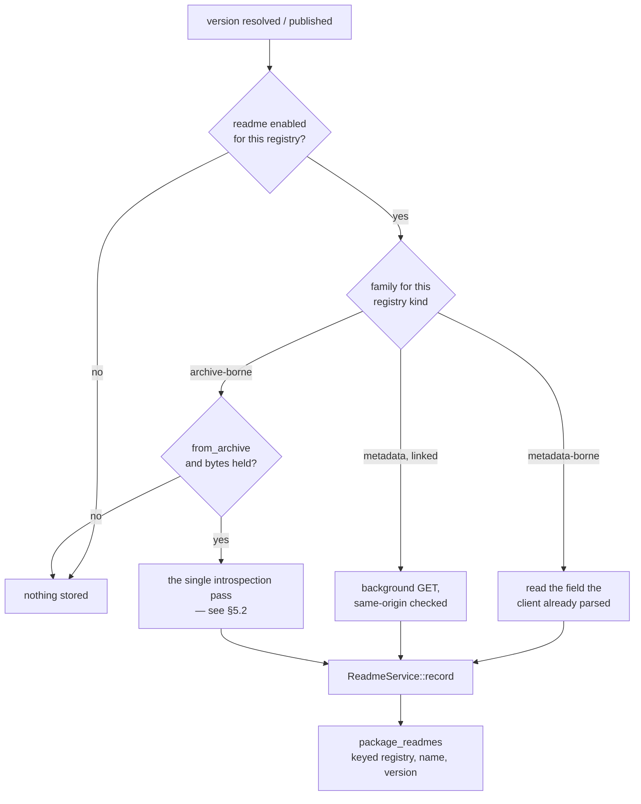
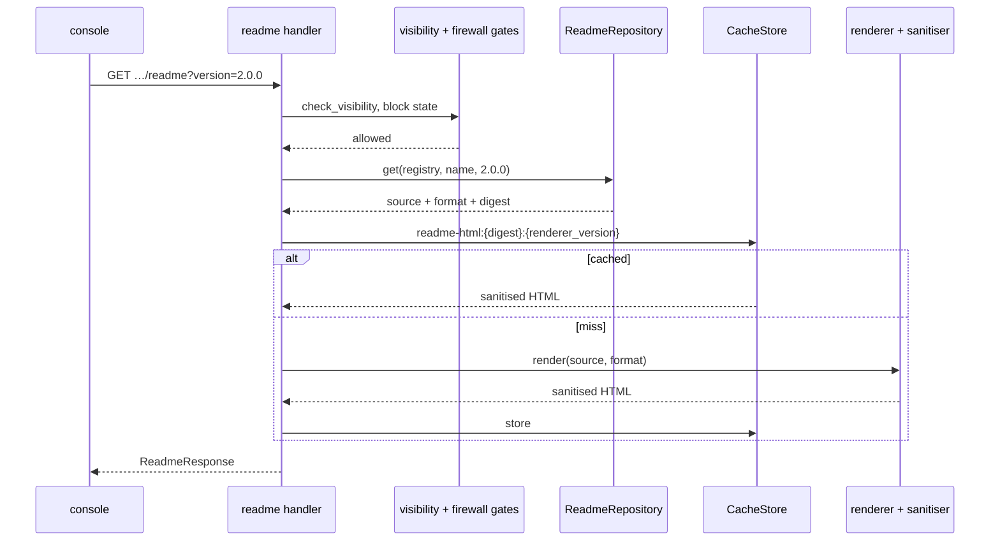
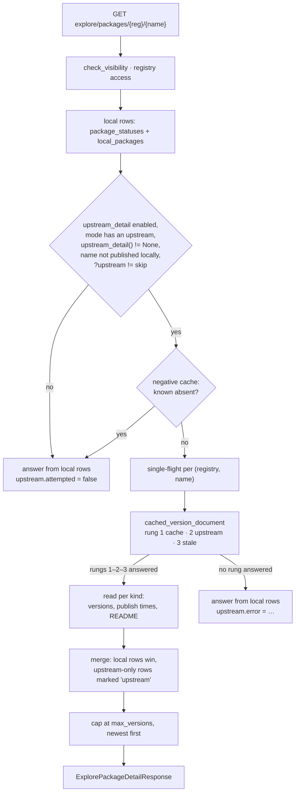

# RFC 0007 — The README, per version, and a package page for a package we hold nothing of

| Field       | Value                                                        |
| ----------- | ------------------------------------------------------------ |
| Status      | **Implemented** — all nine phases landed; see the implementation notes in §13. RFC 0009's dependency is discharged (it shipped), and the discovery read reuses the three rungs it built rather than inventing a second cache policy |
| Short       | The README, per version |
| Settles     | Storing each version's own README, rendering it safely on the server, and making the package page answer — versions and documentation — for packages this instance holds nothing of |
| Author      | Max Batleforc <maxleriche.60@gmail.com>                       |
| Co-author   | —                                                             |
| Created     | 2026-08-15                                                    |
| Supersedes  | —                                                             |
| Complements | RFC 0004-bis §13.1 (single-pass manifest extraction), RFC 0006 (what a blocked version may still show), RFC 0009 §4.2 and §7.7 (the three rungs, and what an answer costs in egress) |
| Touches     | `crates/core`, `crates/adapters`, `crates/config`, `crates/web`, `server`, `ui`, `cli`, docs |

---

## 1. Summary

Every registry BatleHub proxies that has a notion of *a package as a thing a person reads about*
carries a README, and most of them carry a **different one per version** — that is the point of a
README, it describes the code that shipped with it. BatleHub already receives that text on four
separate code paths and throws all four away, then renders a package page that can say what a
version costs, what it depends on and whether it is vulnerable, but not what it *is*.

This RFC stores the README **per `(registry, name, version)`**, from whichever source the registry
type actually has — the metadata document it already fetches, or the artifact it already caches —
renders it to sanitised HTML **on the server**, and puts it on the package detail page under a
version selector, with the CLI able to print the source. Sanitisation is the whole security story
and it is server-side, allow-listed and fuzzed, because the console serves the console's own origin.

It also fixes the thing that would otherwise make the panel useless at the moment it matters most.
The package detail page today answers **only for packages this instance has already pulled or
hosts**: it reads accessed-through-the-proxy rows and locally published rows, and for anything else
renders *"no versions yet"*. But the console already has a search that finds packages we hold
nothing of — `/api/v1/explore/upstream` exists and flags each hit `already_cached: false` — so the
console's own discovery path leads to an empty page. A README panel added on top of that would light
up only for packages somebody had already decided to use, and stay blank for every package anybody
was still deciding about. So this RFC also gives the detail page a **discovery read**: one bounded,
cached, per-package upstream lookup that fills in the version list *and* the README for coordinates
this instance holds no bytes for, on the console path only, reusing the three rungs RFC 0009 already
built (`cached_version_document`, `cached_passthrough`) rather than inventing a second cache policy.
Looking at a package is still not downloading it — §4.4 is explicit about everything the read does
*not* write.

### Before / after

```text
# today — four sources arrive, four are discarded

npm publish         body.readme            dropped: npm/write.rs reads `versions` + `_attachments`
cargo publish       metadata.readme        dropped: metadata_to_index_entry → CargoIndexEntry
PyPI  /pypi/…/json  info.description       dropped: PypiVersionJson keeps only `urls`
OpenVSX /api/…/…    files.readme           dropped: OpenVsxFiles keeps download/signature/manifest/icon

GET /api/v1/explore/packages/npm1/express
  versions[]: version, source, firewall, downloads, licence, vulnerabilities, deprecation
  …and nothing that says what the package is

GET /api/v1/explore/upstream?name=express     → { name: "express", already_cached: false }
GET /api/v1/explore/packages/npm1/express     → { versions: [] }        ← the same package
/packages/npm1/express                        → "No versions yet"

/packages/npm1/express     a versions table, and the reader opens npmjs.com in another tab

# with this RFC

GET /api/v1/explore/packages/{registry}/{name}                 versions[].readme: available|none|unknown
                                                               versions[].source: local|proxied|upstream
                                                               upstream: { attempted, freshness, … }
GET /api/v1/explore/packages/{registry}/{name}/readme?version=4.18.2
  { version, requested_version, is_fallback, format, source, stored, freshness,
    truncated, rendered_html, source_text, extracted_at }

/packages/npm1/express     README panel below the header, following the selected version,
                           labelled when it is showing a different version's
/packages/npm1/express     …and it answers for a package nothing here has ever fetched,
                           with every such version marked "not held here"
batlehub package readme npm1/express@4.18.2
```

---

## 2. Motivation

### 2.1 The text arrives and is discarded, on four paths, today

This is not a "we would have to go and fetch it" feature for the majority of the catalogue. Four
paths already have the bytes in hand:

- **`crates/web/src/handlers/proxy/npm/write.rs`** reads `body["versions"]` and
  `body["_attachments"]` out of the publish document and nothing else. npm's publish document
  carries the README at the document root, and per-version in `versions[v].readme`. What is kept as
  `index_metadata` is the version object minus `dist.tarball`; the root is dropped on the floor.
- **`crates/web/src/handlers/proxy/cargo/helpers.rs::metadata_to_index_entry`** narrows the publish
  metadata to a `CargoIndexEntry` — `name`, `vers`, `deps`, `cksum`, `features`, `yanked`, `links`,
  `rust_version`, `v`. Cargo sends `readme` (the full text) and `readme_file` alongside; the
  workspace's own fixture proves it, `crates/web/tests/common/mod.rs` builds a publish payload with
  `"readme": null, "readme_file": null` in it. Neither field has anywhere to go.
- **`crates/adapters/src/registry/pypi/models.rs`** declares `PypiVersionJson { urls }`. The
  document it is deserialised from is `/pypi/{name}/{version}/json`, whose `info.description` *is*
  the long description with `info.description_content_type` naming its markup. Both are per-version
  by construction — a wheel's `METADATA` ships inside the wheel.
- **`crates/adapters/src/registry/openvsx.rs`** declares `OpenVsxFiles { download, signature,
  manifest, icon }`. The upstream returns `readme` in the same object.

Four registry types, four discards, no new upstream contract needed for any of them.

### 2.2 The package page answers every question except the first one

`ExplorePackageDetailResponse` is a rich document: per version it carries source, firewall status,
download count, last access, publication time, pre-release flag, vulnerabilities, licence, socket
badge, deprecation and unlisting. RFC 0004-bis added the licence; RFC 0002 added the advisories.

All of it is *judgement about* a package. None of it is *the package's own account of itself*. A
developer landing on `/packages/npm1/some-internal-lib` — which for an internal package is the only
page that exists anywhere — gets a versions table and no answer to "what is this and how do I call
it". For a proxied public package they open npmjs.com in another tab, which on a deliberately
inward-facing deployment is both the wrong answer and a disclosure of what they are looking at.

### 2.3 The console can already find packages it holds nothing of, and the page it sends you to is empty

`explore_upstream_search` (`crates/web/src/handlers/front_office/explore/stats.rs`) fans a query out
across every accessible registry's upstream search API and returns each hit with
`already_cached: false` when this instance has neither pulled it nor hosts it. That endpoint exists
because discovery is a thing operators and developers actually do here: *is this library in a
registry I am allowed to use, and should we adopt it?*

The page it links to cannot answer. `explore_package_detail` builds its version list from exactly two
sources — `AdminService::list_packages`, which is the record of what has been *accessed through the
proxy*, and `LocalRegistryService::backend::get_versions`, which is what has been *published here*. A
package in neither yields `versions: []`, and `PackageDetailPage.vue` renders the empty state:
*"No versions yet — nothing has been pulled through."* Which is true about this instance and useless
to the reader, who has just been told by the search box on the previous screen that the package
exists.

That matters for this RFC specifically, and not as a general grievance about the detail page. A
README is documentation, and the moment documentation is worth reading is **before** the first
install, not after — once a package is in a lockfile somebody already decided. A README feature
scoped to versions we already hold would therefore be scoped to precisely the packages whose READMEs
nobody needs any more, and would go on being blank for every package under evaluation. The versions
table has the same shape of gap; it is just less obvious, because a table with no rows looks like an
answer and a documentation panel with no text looks like a bug.

The fix is not new infrastructure. `cached_version_document` (`crates/core/src/services/proxy/
handle.rs`) already fetches, parses and caches an upstream's own version-listing document — the npm
packument, the NuGet flat index, `maven-metadata.xml` — with stale-on-error bounded by the
registry's `serve_stale_metadata`. For the metadata-borne registry types of §4.3 that one document
carries both halves of what the page is missing: the version list *and*, for npm, the README. The
detail page is not asking for anything a package manager pointed at the same proxy would not already
have caused us to fetch.

### 2.4 A README is a per-version fact, and treating it otherwise is wrong in the direction that hurts

npm's packument carries `readme` per version *and* at the document root; PyPI's description is part
of the version's `METADATA`; a `.crate`, a `.nupkg` and a `.vsix` each contain exactly one README,
theirs. A package whose 2.x README documents an API the 1.x README does not is the normal case, not
an edge case — it is what a major version is.

So "show the README" cannot mean "show *a* README". The store has to be keyed by version from the
start; retrofitting a version key onto a package-level column later means either a migration that
cannot backfill or a page that lies. Where a source genuinely is package-level (npm's root
`readme`), the design has to say which version it is being attributed to and label it, rather than
present a guess as a fact.

### 2.5 The archive is already being read, once, for something else

`ProxyService::maybe_trigger_sbom` spawns a task that pulls the freshly-cached artifact back out of
storage and hands it to `SbomExtractor::extract`, which returns an `ExtractedManifest` — dependencies
*and* licence, together, because RFC 0004-bis established that they come from the same file and
opening the archive twice for two facts is waste.

The README is in that same file, for exactly the same reason. `.crate`, `.nupkg`, `.tgz`, the Go
module `.zip`, a Terraform module tarball, a Composer dist zip — the archive is open, decompressed
and in memory. A README feature that opens it a second time repeats the mistake 0004-bis fixed.

### 2.6 Rendering untrusted markdown is the security question, and it should be answered once

Whatever renders this text is handling attacker-authored input: anyone who can publish to a proxied
upstream can author it, and on a local registry anyone with publish rights can. The rendered result
is displayed on the console origin, to an operator who is very often an admin with a live session.

There is exactly one place that question should be answered, and it should be a place that has unit
tests, a fuzz target and `cargo audit`/`cargo deny` over its dependencies. That is the server. A
markdown renderer plus a DOM sanitiser in the SPA bundle would put the boundary where the fuzz suite
cannot reach it, and would have to be reimplemented for every other client.

---

## 3. Goals / non-goals

**Goals**

- A README is stored, served and displayed **for the version it belongs to**, for every registry
  type that has one, from proxied and locally published versions alike.
- The reader can move between versions and see each version's own README, and is told plainly when
  what they are looking at came from a different version than the one selected.
- **The package detail page answers for a package this instance holds nothing of** — versions, and
  the README where the protocol carries one — and every such version is labelled as not held here,
  so nothing on the page implies we have bytes we do not have.
- Untrusted markup can neither execute nor phone home from the console origin.
- **No package-manager path changes, and no page view writes to the catalogue.** Nothing on a
  protocol request path fetches anything new; the console's discovery read is cache-first, bounded,
  coalesced, and records no access, no download count and no held-artifact state (§4.4).
- A registry type with no README has that recorded as a fact the operator can read, not as a blank
  panel that looks like a bug. The same for a version whose README needs bytes we do not hold: the
  panel says so, rather than showing nothing.

**Non-goals**

- **Rendering reStructuredText.** PyPI descriptions may declare `text/x-rst`, and the only faithful
  implementation is docutils. RST is displayed as escaped preformatted source with its declared type
  shown. Guessing at a subset would render some documents subtly wrong, which is worse than plainly
  showing the source.
- **Loading remote images by default.** See §4.4 and §7.3 — this is a decision, not an omission.
- **A README for path-addressed registries** (`deb`, `rpm`, `pacman`, `jetbrains`, `generic`). They
  have no package identity to hang one on; `RegistryKind::is_path_addressed` already names the set.
- **A README for `github`/`gitlab`/`forgejo`.** For those the README is a file the proxy will already
  serve you by path — `/proxy/gh/{owner}/{repo}/raw/main/README.md` is in the setup snippets today.
  Re-fetching and re-rendering it under a second URL would be a second answer to a solved question.
- **Warming, caching or downloading anything as a side effect of a page view.** The discovery read
  fetches one metadata document. It never fetches an artifact, never writes a `package_statuses` row,
  never increments a download count and never creates the appearance of a held version. An operator
  who wants the bytes has `task warm` and the download button, both of which are decisions someone
  took.
- **An archive-borne README for a version we hold no bytes for.** Opening the artifact means fetching
  the artifact, which is the previous non-goal. Those versions report `readme: "unknown"` and the
  panel says the README arrives when the version is first downloaded — the same honest limit
  `license` already has (§4.3).
- **A discovery read on the *listing* endpoint.** `/api/v1/explore/packages` is a catalogue of what
  this instance has; turning it into a federated search across every configured upstream is a
  different feature with a different cost, and `/api/v1/explore/upstream` already exists for the
  question it would be answering. The discovery read happens only when a caller asks for one named
  package by coordinate.
- **Substituting the manifest `description` when there is no README.** A one-line description is not
  a document; putting it where a reader expects one makes every package look like it has thin
  documentation. The description belongs in the page header, which is a separate change.
- **Full-text search over README bodies.** The catalogue's search is over names. Indexing prose is a
  different feature with a different cost profile (open question 2).
- **Editing or overriding a README from the console.** BatleHub reports what the package says.
- **Changelogs, icons, or the rest of the marketplace asset set.** The mechanism generalises; the
  scope here does not.

---

## 4. User-facing design

### 4.1 Configuration

```toml
[registries.readme]
enabled       = true      # store and serve READMEs for this registry
from_archive  = true      # extract from the cached artifact when the metadata carries none
max_bytes     = 262144    # cap on stored source (256 KiB); larger is truncated and flagged
remote_images = "strip"   # "strip" | "proxy"
```

- **Absent block means enabled**, unlike `[registries.sbom]`. For the metadata-borne types the text
  is inside a document the proxy already fetches and parses, so the default costs one deserialised
  field. `from_archive` rides the artifact read that SBOM already performs when SBOM is on, and adds
  one storage read per newly-cached version when it is not — stated here because it is the one part
  of the default that is not free.
- `max_bytes` is a cap on the **stored source**, applied after decompression, at the point of
  extraction. Truncation is recorded (`truncated = true`) and surfaced, never silent.
- `remote_images` takes no `"allow"` value. The SPA's CSP is baked into the document at build time by
  `ui/build/csp.ts` (`img-src 'self' data:`), so a setting that only worked in a custom UI build
  would be a trap: the operator would set it and see broken images with no error anywhere.

The discovery read of §2.3 is a second block, on `RegistryConfig` beside `readme`, because it is not
a README setting — it governs the version list too, and an operator may want one without the other:

```toml
[registries.upstream_detail]
enabled           = true    # the console may ask upstream about a package we hold nothing of
max_versions      = 300     # cap on upstream-only versions returned for one package
negative_ttl_secs = 300     # how long an upstream "no such package" is remembered
```

- **Absent block means enabled**, and it is inert on a `local`-mode registry — there is no upstream to
  ask. It is inert for the path-addressed kinds for the same reason §3 excludes them from READMEs:
  no package identity to ask about.
- **There is no TTL of its own.** The document lands in the existing metadata cache under the key
  `cached_version_document` already uses, so it obeys the registry's `metadata_ttl_secs` and its
  `serve_stale_metadata`. A second, independently clocked expiry for the same bytes is how two caches
  come to disagree about the same document; RFC 0009 §4.2 made the same argument for the passthrough
  cache and reused the same policy rather than adding a switch.
- `max_versions` bounds the response, not the fetch: the document is one document whatever its size,
  and the cap is on how many upstream-only rows the page is handed. It is applied newest-first and
  the response says it was applied (§4.2), because a silently shortened list is a lie about the
  registry — the failure RFC 0009 §5.1 named when it added `must_find`.
- `negative_ttl_secs` exists so a bad URL, a typo or a crawler cannot turn every reload into an
  upstream request. A `404` is a fact (RFC 0009's distinction between *failed* and *answered
  something other than success*), so it is cached like one; a connection failure is not, and is not
  cached at all.

### 4.2 Where it appears

**API.** Changes to the explore surface:

```
GET /api/v1/explore/packages/{registry}/{name}[?upstream=auto|skip]
      → versions[].readme: "available" | "none" | "unknown"
      → versions[].source: "local" | "proxied" | "upstream"
      → versions[].vulnerabilities_scanned: bool
      → upstream: { attempted, freshness, version_count, truncated, error }
GET /api/v1/explore/packages/{registry}/{name}/readme?version=X&format=html|source|both
```

`ReadmeResponse`:

| Field | Meaning |
| --- | --- |
| `registry`, `name`, `version` | the coordinate the returned text belongs to |
| `requested_version` | what the caller asked for |
| `is_fallback` | `version != requested_version` — the panel labels it |
| `format` | `markdown` \| `html` \| `rst` \| `plain` — what the source *is* |
| `source` | `upstream-metadata` \| `archive` \| `local-publish` — where it came from |
| `stored` | `true` for a durable record; `false` when it was derived from a cached upstream document for a version we hold no bytes for (§5.6) |
| `freshness` | `cached` \| `fresh` \| `stale`, using the vocabulary of `Freshness::header_value`. Only meaningful when `stored = false` |
| `truncated` | the source hit `max_bytes` |
| `rendered_html` | sanitised HTML, present unless `format=source` |
| `source_text` | the stored source, present unless `format=html` |
| `extracted_at` | when this instance obtained the text — for a derived answer, when the document it came from was cached |

`readme` on the version DTO is a **tri-state, not a boolean**, so the version selector can mark which
versions have one without a probe per version and without lying about the ones it cannot know:

| Value | Means |
| --- | --- |
| `available` | there is a README for this version and the endpoint will return it |
| `none` | there is genuinely none — the registry type has no README (`readme_support() == None`), or this version's metadata carries an empty one |
| `unknown` | not determined: an archive-borne type on a version we hold no bytes for, a `from_archive = false` registry, or a discovery read that was skipped or failed |

A boolean cannot carry the third case, and the third case is the common one the moment the page
starts answering for packages we hold nothing of. `false` rendered for *"we have not looked"* is the
same defect class as RFC 0009's NuGet search stub: a definite-looking answer with nothing behind it.

`vulnerabilities_scanned` is on the version DTO for exactly the same reason. `vulnerabilities: []`
today means *scanned and clear*; on an upstream-only version it would mean *never scanned*, and the
two must not render identically — a green row on a package this instance has never opened is a claim
we cannot support.

`upstream` reports the discovery read itself: whether it was `attempted` (it is not for a `local`
registry, an inert registry type, a `?upstream=skip` caller, or a **locally published package** —
§4.4), which rung answered (`freshness`), how many upstream-only versions came back, whether
`max_versions` truncated the list, and the error when upstream was unreachable and no stale document
was allowed. `?upstream=skip` exists for callers that want the cheap local-only answer — the console
uses it for the admin panels that only care about held versions.

Note that holding *some* versions of a package does not suppress the read: a package this instance
has pulled three versions of, out of forty upstream, is exactly the case where the missing rows are
worth showing. The suppression is about *provenance*, not coverage.

**Console.** A README panel on `PackageDetailPage.vue`, below the header and above the versions
table, bound to the page's selected version. Selecting a version in the table swaps the panel. When
the selected version has none and a fallback is shown, the panel header says so in words — *"README
from 1.4.2; version 2.0.0-rc1 ships none"* — rather than showing prose that belongs to different code.

Upstream-only versions appear in the same table, marked **not held here**, with their download
count, last-access and licence cells rendered as *unknown* rather than as `0`/`—`, and their
vulnerability cell rendered as *not scanned* rather than as clear. The empty state changes: a package
with no rows at all now distinguishes *"nothing has been pulled through, and the upstream does not
have it either"* from *"the upstream could not be reached"*, which is what `upstream.error` is for.

**CLI.** `batlehub package readme <registry>/<name>[@version]` prints the source, for a held version
or an upstream-only one; `--no-upstream` maps to `?upstream=skip`. Markdown in a terminal is readable;
rendering it to ANSI is a separate concern and not in scope.

### 4.3 Where a README comes from, per registry type

Two families, and which one a type belongs to is a property of the *protocol*, not a preference:

- **Metadata-borne** — the text (or a link to it) is in a document the proxy already fetches to
  resolve a version. Available for every version upstream knows about, including versions this
  instance holds no bytes for.
- **Archive-borne** — the text is a file inside the artifact. Available only for versions this
  instance has cached or hosts, which is the honest limit and matches how `license` already behaves.

That distinction is what the *unheld* column below reports, and it is the reason the discovery read
of §2.3 is worth having at all: for the metadata-borne family the document that lists the versions is
the document that carries the README, so one cached fetch answers both questions. For the
archive-borne family it answers only the first — which is still the difference between a versions
table and an empty state.

| Type | Family | Source | Per version | Unheld version |
| --- | --- | --- | --- | --- |
| npm | metadata, archive fallback | `versions[v].readme`; root `readme` attributed to `dist-tags.latest` and labelled; else `README*` in the tarball | yes | **versions + README** — the packument carries both |
| PyPI | metadata | `info.description` + `info.description_content_type` | yes | **versions + README** — one `/pypi/{name}/{version}/json` per version read, so the panel fetches on selection rather than for the whole table |
| OpenVSX | metadata (linked) | `files.readme` URL, same-origin checked | yes | **versions + README** (the linked fetch of §7.4) |
| VS Code Marketplace | metadata (linked) | `Microsoft.VisualStudio.Services.Content.Details` asset | yes | **versions + README** (the linked fetch of §7.4) |
| JetBrains Marketplace | metadata | plugin `<description>`, `text/html` | yes | **versions + README** |
| cargo | archive; local publish | `README*` named by `Cargo.toml [package] readme`; on publish, the `readme` field of the publish metadata | yes | versions only — the sparse index has no README; `readme: "unknown"` |
| NuGet | archive | `.nuspec` `<readme>` → that file inside the `.nupkg` | yes | versions only |
| Go | archive | `README*` at the module root of the `.zip` | yes | versions only (`@v/list`) |
| Terraform | archive | `README*` at the root of a module tarball. Providers have none | modules only | versions only |
| Composer | archive | `README*` at the root of the dist zip | yes | versions only |
| conda | archive | `info/about.json` → `description`, as `text/plain` | yes | versions only |
| RubyGems | archive (phase 3) | `README*` in `data.tar.gz`; there is no declared field, so this is a convention match | yes | versions only |
| Maven | none | the POM has `<description>`, which is a sentence, not a document | — | versions only (`maven-metadata.xml`) |
| deb, rpm, pacman, jetbrains, generic | none | path-addressed; no package identity | — | neither |
| GitHub, GitLab, Forgejo | none | the README is a file the proxy already serves by path | — | neither |

The three rightmost rows are not gaps to be closed later; they are the non-goals of §3 written per
type, and `readme_support()` on `RegistryKind` returns them so that the console and the config
validator quote the same list rather than each carrying a copy.

The *unheld* column has its own accessor for the same reason —
`RegistryKind::upstream_detail()`, returning `Document(DocumentKind)` for the kinds whose listing
document `cached_version_document` can read, `ListVersions` for the kinds that only implement
`list_versions`, and `None` for the path-addressed and source-hosting kinds. It is an exhaustive
match with no wildcard arm, exactly as `listing_filter()` and `is_path_addressed()` are, so a new
registry kind does not compile until it answers the question. Every value it advertises must reach a
real reader, checked the way `every_advertised_filter_is_reachable_from_dispatch` checks
`blocking::strip` — a table claiming coverage that dispatch cannot deliver is the failure mode RFC
0009 was written about.

### 4.4 Behaviour rules

- **Version selection.** The panel requests the version the page has selected. The page's initial
  selection is unchanged by this RFC — the first row of the existing sort (stable before
  pre-release, newest first).
- **Fallback.** If the requested version has no README, the response carries the newest version that
  does, with `is_fallback = true`. Fallback never crosses a firewall state: a blocked or unlisted
  version is not eligible as a fallback source.
- **No README anywhere.** `200` with `rendered_html: null` and `source: null` is not used —
  the endpoint returns `404` with a body distinguishing *this package has none stored* from *this
  registry type has none to give* (`readme_support() == None`). The panel renders the second as a
  statement, not an error.
- **Blocked versions.** A version an administrator has blocked serves no README: `403`, carrying the
  same block reason the download path returns. RFC 0006 removes blocked versions from protocol
  listings; the console still shows them to operators with a `Blocked` badge, so `403`-with-reason is
  consistent with both — the operator sees that it exists and why it is refused.
- **Yanked versions** serve their README normally. A yank withdraws a recommendation, not the
  documentation, and the version remains downloadable by exact coordinate.
- **Deprecated / unlisted versions** serve their README. Both remain downloadable.
- **Staleness.** A stored README is refreshed when the version's metadata is re-resolved and the
  extracted text differs. Upstream mutating a published version's README is npm-specific and rare;
  the record carries `extracted_at` so the page can say when it was read.

And for a package or version this instance holds nothing of:

- **Viewing is not downloading, and the list of what it does not do is the rule.** The discovery read
  records no `AccessEvent`, writes no `package_statuses` row, increments no download count, touches no
  `last_accessed`, consumes no quota, creates no storage entry and does not make the package appear in
  `/api/v1/explore/packages` or in the eviction service's accounting. A page view must not be able to
  change what the catalogue claims this instance has — otherwise browsing the console silently
  rewrites the inventory an operator reads to make decisions.
- **Rules are evaluated for display, and never for permission.** Upstream-only versions get the same
  `FirewallDto` treatment held ones do: the blocked set is consulted, so a version an administrator
  blocked shows as `Blocked` with the reason rather than as installable. The release-age gate and the
  rest of `crates/core/src/rules/` are not re-implemented here — they run on the download, which is
  where they have always run. The page describes; it does not admit.
- **The rungs, and what the page says on each.** Rung 1, a fresh cached document: answered, `freshness
  = cached`. Rung 2, fetched now: `fresh`. Rung 3, upstream unreachable — a stale document when the
  registry's `serve_stale_metadata` allows it (`stale`, and the page says how old), otherwise the
  local rows alone with `upstream.error` set and a banner saying the upstream could not be reached.
  Rung 3 never degrades to an empty page presented as an answer, which is what today's *"No versions
  yet"* does.
- **Air-gapped is a supported outcome, not a failure.** On a deployment with no route off site the
  discovery read fails, the page falls back to local rows, and the banner says so once. RFC 0008's
  estate should set `enabled = false` and get the same page with no attempt and no banner.
- **`firewall_only` registries** are fully supported here, unlike the archive-borne README path: a
  firewall registry caches no artifacts but still resolves metadata, which is all the discovery read
  reads.
- **`local`-mode registries** never attempt it: there is no upstream.
- **A locally published package is never asked about upstream, on any mode.** If the local backend has
  the name, the read is suppressed. On a `hybrid` registry a private package published here shares a
  namespace with a public index, and sending its name to that index on every page view would leak the
  existence of internal software to a third party — the same class of disclosure the `sumdb_url = ""`
  guidance exists for (`crates/config/src/schema/registry.rs`: *a lookup there would leak private
  module paths upstream*). It would also invite a dependency-confusion answer, where the page shows
  upstream's versions of a name that means something else here. Local rows are the whole answer for a
  local name.
- **A README for an unheld version is derived, not stored** (§5.6), so it is bounded by the metadata
  cache's TTL rather than accumulating rows for every package anyone ever looked at.
- **Visibility is unchanged.** `check_visibility` runs first and a refusal is a `404`. A package with
  no local record has no visibility record either, so it is public by construction — the discovery
  read cannot be used to see round an `internal` or `team` marking, because the marking only exists on
  packages this instance hosts.

### 4.5 Validation

`AppConfig::validate()` rejects:

| Condition | Rationale |
| --- | --- |
| `remote_images` not in `{"strip", "proxy"}` | An unrecognised value must not silently become the default; the two behaviours differ in what leaves the network. |
| `max_bytes == 0` with `enabled = true` | Stores nothing while claiming to be on — a configuration that cannot do its job should not start. |
| `max_bytes` > 4 MiB | The value is a row in a transactional store read on a page load. |
| `upstream_detail.max_versions == 0` with `enabled = true` | Attempts the fetch and discards every result: the egress happens and nothing is shown. |
| `upstream_detail.max_versions` > 5 000 | One page's version table, held in memory and serialised to JSON per request. |

Warnings (logged and surfaced to the admin, following `crates/config/src/schema/warnings.rs`):

| Condition | Behaviour |
| --- | --- |
| `enabled = true` on a type whose `readme_support()` is `None` | Accepted and inert. Names the type and says nothing will ever be stored, in the same shape as `LICENSE_GATE_SBOM_DISABLED`. |
| `from_archive = true` on a metadata-borne-only type | Accepted and inert; the archive is never opened for it. |
| `enabled = true`, `from_archive = true`, and the registry is `firewall_only` | `firewall_only` streams without buffering, so no artifact is ever cached to extract from. Metadata-borne sources still work; archive-borne ones never will. |
| `upstream_detail.enabled = true` on a `local`-mode registry | Accepted and inert. There is no upstream to ask, and the page is already complete from local rows. |
| `upstream_detail.enabled = true` on a kind whose `upstream_detail()` is `None` | Accepted and inert; names the kind and says the detail page will answer from local rows only. |
| `upstream_detail.enabled = true` while the registry has no reachable upstream configured | Accepted. Warned rather than rejected because an air-gapped estate is a supported deployment (RFC 0008) and its operator should be told the setting will produce one failed attempt per TTL, not have the server refuse to start. |

---

## 5. Architecture

### 5.1 Two families, one store



The invariant the shape protects: **nothing on this diagram runs on a package-manager request path,
and nothing on it is triggered by a page view.** Metadata-borne capture happens where
`resolve_metadata` already parsed the document; linked and archive-borne capture happen in the same
detached task that SBOM generation already uses. A page view for a version we hold reads one row and,
on a miss in the render cache, runs the renderer.

The discovery read of §5.5 is the one path a page view can start, and it is deliberately *not* on
this diagram: it writes nothing here. It reads a cached upstream document — or fetches and caches one
— and derives its answer (§5.6). The store is fed by resolution and publication, never by browsing.

### 5.2 One pass over the archive, not two

RFC 0004-bis §13.1 made dependencies and licence come back from a single decompression because they
live in the same file. The README lives in the same file again.

`ExtractedManifest` gains a third field, and `SbomExtractor::extract` keeps its signature:

```rust
pub struct ExtractedManifest {
    pub dependencies: Vec<SbomDependency>,
    pub license: Option<String>,
    pub readme: Option<ExtractedReadme>,   // new
}

pub struct ExtractedReadme {
    pub content: String,
    pub format: ReadmeFormat,
    /// The archive-relative path it was read from, for the operator to check.
    pub path: String,
    pub truncated: bool,
}
```

`ProxyService::maybe_trigger_sbom` becomes `maybe_introspect_artifact` and its early return changes
from *SBOM is off* to *SBOM is off **and** README-from-archive is off*. The storage read, the
`collect_byte_stream` and the `extract` call happen once; the results fan out to `SbomService` and
`ReadmeService` independently, each still non-fatal and each still logging its own failure.

This is the one place the RFC changes existing behaviour rather than adding to it, and it is why
`crates/core/src/services/proxy/` tests are named in the test plan as the regression signal.

### 5.3 The read path



**The store keeps the source, not the HTML.** Two reasons, and the second is the one that matters: a
fix to the sanitiser has to apply to everything already stored, and it does — the cache key carries
`renderer_version`, so bumping it invalidates every rendering in one commit with no backfill. The
first is the argument `ExtractedManifest::license` already makes in its doc comment: keeping what the
package actually said, rather than a transformation of it, is what lets an operator check the
transformation.

The render cache is the existing `CacheStore` port, keyed by content digest, so two versions with an
identical README (the common case for a patch release) render once.

A miss at `ReadmeRepository::get` is not the end of the path. For a version this instance holds no
bytes for there was never a row to find, and the handler falls through to the derived read of §5.6 —
the cached upstream document, then the same renderer, the same digest key and the same cache entry.
The only difference the caller sees is `stored: false` and a `freshness`.

### 5.4 What survives what

- A README **survives artifact eviction**. The catalogue is deliberately able to describe versions it
  holds no bytes for — `ResolutionState::Pending` exists for exactly that — and a README panel that
  emptied itself when LRU eviction ran would be inexplicable.
- A README is **deleted with its version**: local delete removes the row, and the package's rows go
  when the package does — by explicit `delete_for_version` / `delete_for_package` calls, not by a
  cascade. §6.2 says why the table has no foreign key: a cascade from anything evictable would take
  the README with the bytes, which is the behaviour the previous bullet rules out.
- A README is **not part of the cached explore detail payload** (`explore_cache.rs`). The panel
  fetches it separately, so the catalogue cache TTL never holds a stale document and the detail
  response does not grow by a megabyte per package.

### 5.5 A page for a package we hold nothing of



Three things about this shape are load-bearing:

**Local rows win every collision.** A version we hold is described by what we know about it —
download count, cache state, licence from its own archive, scan results — and the upstream document
cannot overwrite any of that. The merge only *adds* rows the local sources did not have. This is the
same precedence `SearchMode::Hybrid` already uses (upstream results merged with locally held ones,
deduped by name), and for the same reason: what we hold is a fact about this instance, what upstream
says is a report about somewhere else.

**Single-flight, not one fetch per reader.** Ten operators opening the same new package must produce
one upstream request. The coalescing is per `(registry, name, document kind)` — the cache key
`cached_version_document` already builds — so it also collapses a page reload during the fetch.
Without it the console becomes a request amplifier under exactly the conditions that make a package
interesting: several people looking at it at once.

**The reader is per protocol and reached from one place.** `crates/core/src/services/upstream_detail/`
mirrors `crates/core/src/services/blocking/` — one file per protocol, each a pure function over a
`VersionDocument`, one `dispatch` call site, coverage declared by an exhaustive match on
`RegistryKind`. That module already proves core can read these documents without knowing what HTTP is,
and `blocking` needs the same npm packument, NuGet flat index, `maven-metadata.xml` and PyPI simple
page this does. Two modules parsing the same documents to different structs would drift; the reader
returns what both need and `blocking`'s filters stay where they are.

Everything here **fails open in the safe direction**, which for a read path means fewer rows rather
than a broken page: an unparseable document is warned about and contributes nothing, a missing field
yields `null` rather than a guess, and no failure of this path can make an artifact retrievable —
the download gate re-checks the concrete coordinate as it always has.

### 5.6 What is stored, and what is only derived

The store keeps a row for a version this instance **holds bytes for or hosts**. For an upstream-only
version, the README is *derived from the cached document* on each read and never written to
`package_readmes`. `stored: false` in the response says which one the caller got.

This is not a shortcut, it is the answer to a retention question the discovery read would otherwise
create. A row written because somebody looked at a page has nothing that ever deletes it: §5.4's
deletion rules are *deleted with its version*, and an upstream-only version is never deleted here
because it was never held. Rows would accumulate for every package anyone browsed, on a table with no
eviction and no owner — while a copy of the same text already sits in the metadata cache, which does
have a TTL and an eviction story.

So the two lifetimes match what they describe:

| | Held / published version | Upstream-only version |
| --- | --- | --- |
| README source | `package_readmes` row | derived from the cached upstream document |
| Lifetime | durable; survives artifact eviction (§5.4) | the registry's `metadata_ttl_secs` |
| Rendered HTML | render cache, keyed by content digest + `renderer_version` | the same render cache, same key |
| Deleted by | version delete, package delete | cache expiry; nothing to clean up |

A version that later gets fetched or published gains its durable row through the ordinary capture
path of §5.1 — no promotion logic, no backfill, no second writer. And because the render cache is
keyed by content digest, the derived and the stored rendering of identical text are the same cache
entry: reading a README before a download and after it costs one render, not two.

---

## 6. Detailed design

### 6.1 `crates/core`

**`src/entities/readme.rs`** (new):

```rust
pub struct PackageReadme {
    pub registry: String,
    pub name: String,
    pub version: String,
    pub content: String,
    pub format: ReadmeFormat,
    pub source: ReadmeSource,
    /// SHA-256 of `content`, the render cache key and the change detector.
    pub digest: String,
    pub truncated: bool,
    pub extracted_at: DateTime<Utc>,
}

pub enum ReadmeFormat { Markdown, Html, Rst, Plain }
pub enum ReadmeSource { UpstreamMetadata, Archive, LocalPublish }
```

**`src/entities/registry_kind.rs`** — `readme_support(&self) -> ReadmeSupport`, returning
`Metadata`, `MetadataLinked`, `Archive`, `MetadataThenArchive` or `None`, exhaustively matched so a
new registry kind cannot be added without answering the question. `RegistryKind::ALL` plus an
exhaustive match is the existing enforcement pattern here (`supports_local_mode`,
`is_path_addressed`), and §4.3's table is generated from it in the docs build.

Beside it, `upstream_detail(&self) -> UpstreamDetailSupport` — `Document(DocumentKind)`,
`ListVersions` or `None` — the accessor §4.3 describes, under the same exhaustiveness rule and
generated into the same table. `Document` names *which* listing document to read, because the kinds
with more than one would otherwise have the choice made twice: `DocumentKind::Versions` for npm and
Maven, the flat index for NuGet, `LATEST`/`@v/list` for Go, `SIMPLE_JSON` for PyPI.

**`src/ports/readme.rs`** (new) — `ReadmeRepository`: `upsert`, `get(registry, name, version)`,
`get_latest_with_readme(registry, name, exclude_states)` for the fallback, `list_versions_with_readme`
for the per-version `readme` states in one query, `delete_for_version`, `delete_for_package`.

**`src/ports/sbom.rs`** — `ExtractedManifest.readme` as in §5.2; a `README_EXTRACTION_TYPES` constant
beside `LICENSE_EXTRACTION_TYPES`, with the same drift test in `extractor/mod.rs` refusing a type
listed without a parser or a parser added without a listing.

**`src/services/readme/`** (new):

| File | Contents |
| --- | --- |
| `mod.rs` | `ReadmeService`: `record_from_metadata`, `record_from_archive`, `record_from_publish`, `get_for_version` with the fallback rule of §4.4 |
| `render.rs` | `render(source, format, opts) -> String`. CommonMark + GFM tables, strikethrough and task lists via `pulldown-cmark`; `Html` skips straight to the sanitiser; `Rst`/`Plain` are HTML-escaped into a `<pre>` |
| `sanitize.rs` | the allow-list, `id` prefixing, link and image handling — §7.1 and §7.3 |
| `detect.rs` | filename → `ReadmeFormat` (`.md`/`.markdown` → Markdown, `.rst` → Rst, `.html` → Html, else Plain) and `description_content_type` → `ReadmeFormat` |

**`src/services/upstream_detail/`** (new) — the per-protocol reader of §5.5, laid out like
`services/blocking/`: `mod.rs` holding `UpstreamDetail`, `UpstreamVersion` and the single `dispatch`,
plus one file per protocol (`npm.rs`, `nuget.rs`, `pypi.rs`, `cargo.rs`, `maven.rs`, `goproxy.rs`,
`composer.rs`, `conda.rs`, `rubygems.rs`, `terraform.rs`, `openvsx.rs`). Each is a pure function from
`&VersionDocument` to `UpstreamDetail`:

```rust
pub struct UpstreamDetail {
    pub versions: Vec<UpstreamVersion>,
    /// Present only for the metadata-borne kinds whose listing document carries
    /// the text — npm's packument does, a cargo sparse index does not.
    pub readmes: HashMap<String, ExtractedReadme>,
}

pub struct UpstreamVersion {
    pub version: String,
    pub published_at: Option<DateTime<Utc>>,
    pub is_prerelease: bool,
    /// The upstream's own withdrawal marks, where the protocol has them:
    /// cargo `yanked`, npm `deprecated`. Not this instance's policy — that is
    /// applied on top by the handler.
    pub yanked: bool,
    pub deprecated: Option<String>,
}
```

**`src/services/proxy/`** — `cached_version_document` becomes `pub(crate)` and gains a public,
identity-gated wrapper, `ProxyService::upstream_detail(registry, name, identity) ->
Result<(UpstreamDetail, Freshness), CoreError>`, which resolves the kind, consults
`RegistryKind::upstream_detail()`, single-flights on the cache key, runs the three rungs and calls
`upstream_detail::dispatch`. It reuses `request_prelude` for the registry policy and TTL, so the
access checks and the stale policy are the ones the proxy path already applies rather than a second
copy. `ListVersions` kinds go through `list_versions` and produce versions with no timestamps —
honest, and enough for a table.

**`src/services/proxy/resolve.rs`** — `maybe_trigger_sbom` → `maybe_introspect_artifact` (§5.2).

**`src/services/hot_config.rs`** — `ReadmeConfig { enabled, from_archive, max_bytes, remote_images,
registry_type }` and `pub readme: HashMap<String, ReadmeConfig>` on `HotConfig`, mirroring
`SbomConfig` exactly, including carrying `registry_type` for dispatch. Likewise
`UpstreamDetailConfig { enabled, max_versions, negative_ttl }` and `pub upstream_detail:
HashMap<String, UpstreamDetailConfig>`; both are snapshotted out of the lock before any `await`, per
the hot-reload convention.

### 6.2 `crates/adapters`

- **`migrations/033_package_readmes.sql`** — `package_readmes(registry, package_name, version,
  content, format, source, digest, truncated, extracted_at)`, primary key on the coordinate, plus a
  `(registry, package_name)` index for the per-version state and fallback queries. Add the `mig!`
  entry to `embedded_migrator()`; the `sqlx::migrate!` macro stays unused, per the security
  constraint. **No foreign key to a held artifact or to `local_packages`** — §5.4's rule is that a
  README outlives the bytes, so the coordinate is the key and deletion is explicit
  (`delete_for_version`, `delete_for_package`) rather than a cascade from something that gets evicted.
  Nothing here holds a row for an upstream-only version; that answer is derived (§5.6).
- **`src/db/readme.rs`** — the `ReadmeRepository` impl. Falls in `COVERAGE_EXCLUDE` with the other DB
  adapters; its behaviour is covered by `tests/pg_readmes.rs` under `task test:pg-readmes`.
- **`src/in_memory/readme_repo.rs`** — the in-memory impl the web tests use.
- **`src/sbom/extractor/`** — each existing parser returns the README alongside what it already
  returns: `cargo.rs` (the file `Cargo.toml`'s `readme` names, defaulting to a root `README*` match),
  `npm.rs`, `nuget.rs` (via the `.nuspec` `<readme>` element), `pypi.rs` (the `METADATA` body, when
  the JSON API was not the source). New: `goproxy.rs`, `composer.rs`, `terraform.rs`, `conda.rs`,
  `rubygems.rs`. Every one of them reads at most `max_bytes` decompressed bytes and refuses an entry
  whose path escapes the archive root.
- **Registry clients** — the four discards of §2.1 stop being discards: `NpmVersionMeta.readme`,
  `PypiVersionJson.info`, `OpenVsxFiles.readme`, and the VS Code Marketplace `Content.Details` asset
  are deserialised and handed to `PackageMetadata::extra` under a `readme` key, which is the existing
  channel for registry-specific fields and needs no signature change to `RegistryClient`.
- **`fetch_version_document` coverage** — the discovery read is only as good as the kinds that
  implement it. Any kind whose `upstream_detail()` says `Document(k)` must implement
  `fetch_version_document` for that `k`; the drift test of §4.3 is what enforces it, and the kinds
  that do not are `ListVersions` or `None` rather than a `Document` entry nothing answers. RFC 0009
  implemented most of these already, which is one more reason this RFC sits behind it.

### 6.3 `crates/config`

`ReadmeConfig` on `RegistryConfig` beside `sbom`, deserialised from `[registries.readme]`, with
`enabled` defaulting to `true` via `default_true` (already in the module). `UpstreamDetailConfig`
beside it, from `[registries.upstream_detail]`, same defaulting. `validate()` gains the rejections and
warnings of §4.5; `CURRENT_CONFIG_VERSION` does not move — both blocks are additive and their absence
is a valid configuration meaning "on".

### 6.4 `crates/web`

- **`src/handlers/front_office/explore/readme.rs`** (new) — the endpoint of §4.2. It runs
  `check_visibility` and returns `404` on refusal, exactly as `detail.rs` does and for the reason
  stated there: a `403` would confirm that a package someone is not allowed to see exists. On a miss
  in `package_readmes` it falls through to the derived path of §5.6 — `ProxyService::upstream_detail`
  for the document, then the same `render`/`sanitize` pair — and sets `stored: false`.
- **`src/handlers/front_office/explore/detail.rs`** — `readme` on `ExploreVersionDto` from one
  `list_versions_with_readme` call rather than a lookup per version, `vulnerabilities_scanned`, and
  the merge of §5.5: local rows built exactly as they are today, then `ProxyService::upstream_detail`
  for the rest, capped by `max_versions`, with the `upstream` block reporting the attempt. The two
  existing sources keep their current precedence and their current code; the upstream rows are
  appended and marked, so a bug in the new path cannot change what the page says about a version we
  hold.
- **`src/handlers/front_office/explore/mod.rs`** — the negative cache and the single-flight map live
  beside the handler as `web::Data`, not in `ExploreCache`: that cache is keyed by *query* and
  invalidated per registry (`invalidate_explore_cache`), and a per-package absence marker keyed into it
  would be cleared by an unrelated catalogue write.
- **`src/lib.rs`** — route registration and the `utoipa` tag. `ReadmeResponse` is a named `ToSchema`
  DTO: `crates/web/tests/openapi_contract.rs` fails a `200` without a `body`, and an untyped response
  here would land in the SPA client as `unknown` and in the docs site's API reference as a blank.
- **Publish handlers** — `npm/write.rs` passes the publish document's root and per-version `readme`
  to `ReadmeService::record_from_publish`; `cargo/publish.rs` passes `meta_json["readme"]` with
  `readme_file` naming its format. Neither changes what goes into `index_metadata`: the README is not
  index data, and widening the index entry would change what package managers receive.

### 6.5 `ui`

- **`src/components/package/ReadmePanel.vue`** (new) — the only component in the console that uses
  `v-html`, containing the sanitised HTML in a scoped-typography wrapper. A vitest asserts that no
  other component in `src/` uses `v-html`, so the boundary stays where it is described.
- **`src/pages/PackageDetailPage.vue`** — the panel, bound to the selected version; the versions
  table marks rows whose `readme` is `none`, and distinguishes those from `unknown`. Upstream-only
  rows carry a **not held here** badge and render download count, last access, licence and
  vulnerabilities as *unknown* / *not scanned* rather than as `0`, `—` and an implied clear. The
  `upstream` block drives one banner: stale age, or unreachable.
- **`src/components/package/UpstreamNotice.vue`** (new) — that banner, so the states of §4.4's rung
  list have one implementation rather than three inline `v-if`s that can disagree.
- **`src/locales/{en,fr}.json`** — new keys for the panel header, the fallback sentence, the
  truncation notice, the "this registry type has no README" statement, the stripped-image chip, the
  *not held here* badge, *not scanned*, *README arrives when this version is first downloaded*, the
  stale-document notice and the upstream-unreachable notice. French labels are written from what the
  panel does, not translated word-for-word from the English; `pnpm run i18n:check` stays at zero.
- **`openapi.json` / `src/client/`** — regenerated via `task dump-spec` then `task ui:generate`. Not
  hand-edited.

### 6.6 `cli`

`batlehub package readme <registry>/<name>[@version]`, calling the endpoint with `format=source`, and
`--no-upstream` for `?upstream=skip`. Covered by `cli/tests/integration.rs` against the in-memory
server; note the store separation documented in `CLAUDE.md` — the CLI test seeds the readme repository
directly rather than expecting a publish through the local-registry endpoint to appear in
`AdminService`'s view.

**Deliberately untouched**, so reviewers do not go looking:

- `crates/core/src/services/blocking/` — READMEs are not in any protocol listing document, so RFC
  0006's filters have nothing to filter here. The block is enforced at the endpoint (§4.4). The new
  `upstream_detail/` module reads the same documents `blocking/` filters, but only on the console path
  and only after `blocking` has done nothing to them: the discovery read sees the *unfiltered* cached
  document, exactly as `blocking::dispatch_multi` does, and applies the blocked set itself for display.
- `crates/core/src/rules/` — a README is not an input to any gate. Reading one is not downloading, and
  the discovery read does not consult or evaluate the rule engine.
- `ProxyService::handle` and every protocol handler — the discovery read is reachable only from the
  explore endpoints. No package manager's request path gains a branch.
- `artifact_storage_key` and the storage backends — READMEs are metadata and live in the database.
  Nothing new reaches `ensure_safe_key`.
- `crates/web/src/middleware/security_headers.rs` and `ui/build/csp.ts` — the policy is not widened
  by this RFC. That is the whole of §7.3.

---

## 7. Security considerations

This feature takes attacker-authored markup and renders it on the console's own origin, to a session
that is frequently an administrator's. It is the highest-risk surface added since the console
existed, and every decision below is downstream of that.

### 7.1 Cross-site scripting is the risk, and the answer is an allow-list

- **Deny by default.** `ammonia`'s allow-list model over an `html5ever` parse — not a regex, not an
  escape pass. Elements permitted: headings, paragraphs, emphasis, lists, tables, blockquotes, code,
  `hr`, `br`, `a`, `img`, `details`/`summary`. Everything else is dropped, including `script`,
  `iframe`, `object`, `embed`, `form`, `input` and `svg`.
- **`style` goes entirely** — both the `<style>` element and the `style` attribute. CSS is not
  decoration in this threat model: it is the mechanism for overlaying the console's own controls, and
  attribute selectors are an exfiltration channel.
- **URL schemes** are restricted to `http`, `https` and `mailto`. `javascript:`, `data:` and
  `vbscript:` are dropped rather than rewritten.
- **`id` attributes are prefixed** (`readme-`). Unprefixed ids from untrusted markup shadow
  `document.getElementById` and named-access properties on `window` — DOM clobbering — and can
  hijack the page's own anchor targets.
- **Links get `rel="nofollow ugc noopener noreferrer"` and `target="_blank"`**, so a README cannot
  reach back through `window.opener` and cannot lend the instance's reputation to a link farm.
- **Raw HTML inside markdown is not trusted.** `pulldown-cmark` passes it through; it goes to the
  same sanitiser as the `Html` format, on the same allow-list. There is no path from source to output
  that skips `sanitize.rs`, and the fuzz target in §10 exists to keep it that way.
- **A fuzz target** (`fuzz/fuzz_targets/fuzz_readme_render.rs`) asserts the invariant directly: for
  arbitrary input, the output contains no `<script`, no `on*=` attribute, and no non-allow-listed
  scheme.

### 7.2 What an attacker gains, and what they already had

A malicious package already runs code on a developer's machine at install time; that is not changed
here and is what the firewall rules, the release-age gate and the advisories exist to address. What
is genuinely **new** is a path from *publishing text* to *markup in an operator's authenticated
console session*. That is why the sanitiser is server-side, allow-listed, fuzzed, and applied on
read from a stored source rather than once at write — a defect in it is fixable for content already
stored (§5.3).

### 7.3 Remote images are a beacon, and default off

A README's images normally live on third-party hosts. Rendering them means every console page view
sends a request — with a `Referer` — to a host chosen by the package author, announcing that someone
inside this network is reading about this package at this moment. For an inward-facing proxy whose
reason to exist is partly *not* talking to the public internet on every developer action, that is a
regression delivered as a feature.

`remote_images = "strip"` (default) replaces the image with an inline chip carrying its `alt` text
and its host, so the reader can see that an image was there and where it points. `"proxy"` — phase 5,
open question 1 — would fetch through the server, and inherits the SSRF guards of §7.4 plus a size
cap and a decode-safe content-type allow-list. There is no `"allow"`: §4.1.

Data-URI images are also dropped, despite `img-src` permitting them: a data URI in a README is
megabytes of base64 in a database row, and SVG data URIs are script.

### 7.4 Fetching a linked README is an outbound request

OpenVSX and the VS Code Marketplace give a URL, not text. That fetch:

- runs `ensure_same_origin` against the configured registry base URL, the guard `npm.rs` already
  applies to tarball URLs — an upstream that has been compromised or misconfigured cannot use this to
  point BatleHub at an internal host;
- goes through the existing `UpstreamHttpOptions` client with its timeouts and the `ssrf.rs` guards;
- is capped at `max_bytes` with the body read incrementally, not `bytes()`-then-truncate;
- ignores the response `Content-Type` for format detection, using the registry protocol's declared
  format instead — an upstream declaring `text/html` for a document the protocol says is markdown
  should not be able to switch which renderer path runs.

### 7.5 Archive extraction is bounded

Archive-borne extraction is decompression of attacker-controlled input. It reads at most `max_bytes`
decompressed bytes from the single entry it wants, refuses entries whose path escapes the archive
root, and never writes to disk. The artifact was already fully buffered for SBOM extraction, so this
adds no new memory ceiling; `max_artifact_size_bytes` remains the outer bound.

### 7.6 The README is exactly as readable as the package

- **Visibility.** The endpoint calls `check_visibility` and returns `404` on refusal, matching
  `detail.rs`. An `internal` or `team` package's README must not be a side channel around the gate
  that hides its name.
- **Blocked versions** get `403` with the reason (§4.4), matching the download path.
- **Nothing is logged.** README content never appears in a log line or a span field; the extractor
  logs a coordinate, a byte count and a path, never a body.

### 7.7 A page view can now cause an outbound request

The discovery read of §5.5 means a URL a caller controls — the registry and package segments of an
explore path — decides what this instance asks upstream about. That is a real change in the threat
model and it needs stating rather than assuming, so:

- **The registry access gate comes first.** The read only happens for a registry in
  `explore_accessible_registries_for(&identity)`, the same set `explore_upstream_search` and the
  listing already use. A caller who cannot explore a registry cannot make it emit traffic.
- **Single-flight and cache-first bound the rate structurally**, not by a limiter that has to be
  tuned: N readers of the same package during one TTL produce one request. The per-registry
  `rate_limit` still applies on top for a caller enumerating *different* names.
- **Absence is cached** (`negative_ttl_secs`), so a loop over guessed names does not become a loop of
  upstream requests. A connection failure is not cached, because it is not a fact about the package.
- **Egress is a disclosure, and it is the same one search already makes.** RFC 0009 §7.7 documented
  that rung 2 forwards a user's query upstream, and that an operator for whom that is unacceptable
  configures it away rather than discovering it. The same applies here, with a smaller footprint: a
  package name rather than a free-text query, and only for names somebody navigated to. `enabled =
  false` is the switch, and §4.5 warns rather than fails when the estate has no upstream at all.
- **Nothing new leaves that the proxy would not otherwise fetch.** The request is the same version
  document a package manager pointed at this registry causes on its first resolve, to the same host,
  through the same `UpstreamHttpOptions` client, with the same timeouts, TLS settings, upstream auth
  and SSRF guards. The discovery read introduces no new outbound host and no new code path to one.
- **Text from a discovery read is exactly as untrusted as any other.** It is attacker-authored, it has
  passed no gate, and it goes through the same `render`/`sanitize` pair with the same allow-list —
  there is no "we fetched this ourselves so it is fine" path, and §7.1's fuzz target covers the input
  regardless of where it came from. The one asymmetry worth noting is that the text arrives *without*
  the package having been admitted by any rule, so it must never be presented as vetted: the console
  marks the row **not held here** and its vulnerability cell **not scanned** for exactly that reason
  (§4.2).
- **A private name is never sent upstream.** A package the local backend hosts suppresses the read
  entirely (§4.4), so publishing internal software to a hybrid registry cannot cause its name to be
  disclosed to the public index behind it — by a page view or by anything else on this path.
- **The response cannot be used as an existence oracle for hidden packages.** `check_visibility` runs
  before the read, and a package with a visibility marking is by definition one this instance hosts —
  so it is answered from local rows and never reaches upstream.

---

## 8. Alternatives considered

| Alternative | Why rejected |
| --- | --- |
| Render markdown in the SPA (`markdown-it` + `DOMPurify`) | Moves the security boundary into the bundle, where the fuzz target and `cargo deny` cannot reach it; adds two dependencies to the JS audit surface; and every other client — CLI, docs, any API consumer — would need its own renderer and its own bugs. |
| Render into a sandboxed `iframe` | Contains script but not layout or beacons, needs `srcdoc` (a CSP widening) or a second origin to serve from, and gives up the console's typography and theme inside the panel. |
| Store the rendered HTML instead of the source | A sanitiser fix would not reach anything already stored without a backfill, and the operator loses the ability to see what the package actually said — the argument `ExtractedManifest::license` already makes. |
| Store both source and HTML | The HTML is derivable and content-addressed; a second copy in the transactional store is a cache that cannot be invalidated by bumping a key. |
| Fetch the README from upstream on **each page view**, uncached | Turns an authenticated console page into an upstream-request amplifier and fails entirely on an air-gapped deployment. This is what the discovery read is *not*: it is cache-first, single-flighted, TTL-bounded and degrades to local rows (§5.5). For versions we hold, it is not consulted at all — the stored row answers. |
| Leave the detail page as it is: local rows only | It is the state §2.3 describes. The console's own search sends readers to a page that says "no versions yet" about a package it has just told them exists, and the README panel would be blank for every package under evaluation. An empty table looks like an answer, which makes it worse than an error. |
| Warm the package (fetch and cache the artifact) when someone opens its page | Makes browsing a write: quota consumed, storage filled, download counts moved, eviction pressure created, and the release-age gate and rules engaged — all by a page view, on behalf of a reader who may have opened the wrong link. The bytes are a decision, and `task warm` plus the download button are where that decision is taken. |
| Have the browser fetch the upstream document directly | The upstream is frequently unreachable from a developer's browser (that is often the point of the deployment), it would need CORS the upstream does not grant, it would put attacker-authored markup on the console origin with no server-side sanitiser, and it discloses each reader's IP to the upstream rather than one instance's. |
| A background job that mirrors upstream catalogues so the page always has local rows | Enormous and mostly wasted: npm alone is millions of packages, of which one estate touches thousands. It also inverts the product — a proxy that pulls what is asked for becomes a mirror that pulls everything — and RFC 0009's `task warm` already covers the named-subset case an operator actually wants. |
| Store a `package_readmes` row for every upstream-only version anyone browses | Rows nothing ever deletes: §5.4's deletion rules key on a version being deleted, and a version never held here is never deleted. The table would grow with browsing while an identical copy sat in the metadata cache, which does have a TTL. §5.6. |
| Reuse `ExploreCache` for the upstream documents | It is keyed by query and invalidated per registry by `invalidate_explore_cache`, so an unrelated catalogue write would drop per-package documents; and the metadata cache already holds this exact document under the key `cached_version_document` builds, with the registry's own TTL and stale policy. Two caches for the same bytes is how they come to disagree. |
| Link out to npmjs.com / crates.io / PyPI | Discloses what is being read, fails when the upstream is unreachable, and answers nothing at all for locally published internal packages, which are the ones with no other documentation anywhere. |
| Keep `has_readme` a boolean and report `false` when we have not looked | A definite answer with nothing behind it — the same defect class as the NuGet search stub RFC 0009 §5.1 was written about. The tri-state costs one enum. |
| One `readme` column on `local_packages` | Covers only locally published versions; the proxied majority would have nowhere to live, and the version key would have to be retrofitted onto whatever came next. |
| A package-level README, not per-version | Wrong in the direction that hurts: it shows 2.x's API to someone reading 1.x. §2.4. |
| Show the manifest `description` when no README exists | Puts a sentence where the reader expects a document and makes every package look thinly documented. The description belongs in the header. |
| Widen `img-src` to `*` so images render | Every console page view becomes a beacon to a host the package author chose. §7.3. |
| A separate archive pass for READMEs | Decompresses the same artifact twice for two facts from one file — the exact waste RFC 0004-bis §13.1 removed. |
| Always on, no config | `from_archive` costs a storage read per newly-cached version on registries with SBOM off, and some operators will not want prose from public upstreams stored at all. The metadata-borne default is on precisely because it is free. |

---

## 9. Rollout and compatibility

- **Default behaviour when unconfigured.** `[registries.readme]` absent means enabled with
  `from_archive = true`, `max_bytes = 262144`, `remote_images = "strip"`. On a registry type whose
  `readme_support()` is `None` this is inert. `[registries.upstream_detail]` absent means enabled with
  `max_versions = 300`, `negative_ttl_secs = 300`; inert on `local`-mode registries and on kinds whose
  `upstream_detail()` is `None`.
- **Config migration.** None. Both blocks are additive; `CURRENT_CONFIG_VERSION` stays at 1.
- **Behaviour change on upgrade, stated plainly.** With the discovery read defaulted on, a package
  detail page that previously showed *"no versions yet"* will start showing upstream versions, and the
  instance will make one metadata request per browsed-but-unheld package per TTL. That is the point of
  the feature, and it is also the only change an operator gets without asking: the switch is
  `[registries.upstream_detail] enabled = false`, per registry, and it is named in the release notes
  rather than left to be discovered in a traffic graph.
- **API compatibility.** `versions[].has_readme` never shipped — it is introduced by this RFC as the
  tri-state `readme` (§4.2), so there is nothing to deprecate. `versions[].source` gains the value
  `"upstream"`, which is an additive change to an existing string field; the generated TypeScript
  client narrows it to a union, so the console fails to build rather than silently mishandling it, and
  `?upstream=skip` gives any consumer that wants the old shape the old behaviour.
- **Data migration.** `033_package_readmes.sql` creates one table. **There is no backfill**, and this
  is deliberate: backfilling archive-borne READMEs would mean re-reading every cached artifact in the
  store, and backfilling metadata-borne ones would mean re-resolving every known version upstream.
  The table fills as versions are resolved, published and cached. Operators who want it sooner have
  `task warm` — the warming service resolves and caches, and therefore extracts.
- **Operator prerequisites.** None. No new infrastructure, no new outbound host beyond the registry
  upstreams already configured — the discovery read talks to the same upstream, through the same
  client, as the first resolve of any package would.
- **New dependencies.** `pulldown-cmark` and `ammonia` (with `html5ever`). Both must pass
  `cargo deny check` — advisories, bans, licences and sources — before phase 4 merges; the `[bans]`
  invariants around `rsa`, `sqlx-mysql` and the legacy `rustls` line are unaffected by either, but
  the gate is the check, not this sentence.
- **Rollback.** Drop the config blocks and the feature is off; the table can be dropped with no effect
  on any other read path, because nothing else reads it. Turning `upstream_detail` off returns the
  detail page to exactly today's behaviour, because the local-row half of the merge is today's code
  unchanged (§6.4). Uninstalling mid-phase is safe at every phase boundary.

---

## 10. Test plan

- **Unit** (`crates/core/src/services/readme/`):
  - `sanitize.rs`: a table-driven corpus of the standard vectors — `<script>`, ``,
    `<a href="javascript:">`, `<svg><script>`, `<style>` exfiltration, `<iframe srcdoc>`, an
    unprefixed `id` clobbering a console element id, a `<details>` wrapping raw HTML, an entity-encoded
    scheme, markdown that emits raw HTML. Each asserts the specific removal, not merely "no script".
  - `render.rs`: GFM tables/strikethrough/task lists render; `Rst` and `Plain` come back escaped
    inside `<pre>`; `Html` is sanitised but not re-rendered.
  - `detect.rs`: filename and `description_content_type` mapping, including unknown values → `Plain`.
  - `mod.rs`: the fallback rule — exact hit; fallback to the newest with one; blocked and unlisted
    versions ineligible as fallback; nothing anywhere → the two distinct 404 shapes.
- **Fuzz** (`fuzz/fuzz_targets/fuzz_readme_render.rs`, `task fuzz`): arbitrary bytes through
  `render` + `sanitize`; the output contains no `<script`, no `on*=`, and no scheme outside the
  allow-list.
- **Adapters** (`crates/adapters/src/sbom/extractor/*`): per format, a fixture archive with a README
  at the expected place; the `Cargo.toml`-named path case; a `.nuspec` `<readme>` pointing at a
  nested file; an entry whose path escapes the root is refused; an entry larger than `max_bytes`
  truncates and sets the flag; a non-archive body returns `None` rather than erroring. The
  `README_EXTRACTION_TYPES` drift test in `extractor/mod.rs`.
- **Registry clients**: `mockito` upstreams returning a README field — npm per-version and root,
  PyPI `info.description` with each `description_content_type`, OpenVSX `files.readme` (including a
  cross-origin URL, which must be refused), VS Code Marketplace `Content.Details`.
- **Integration** (`crates/web/tests/package_readmes.rs`, new): two versions with different READMEs
  each return their own; `readme` is correct per version in the detail response; the fallback
  response sets `is_fallback` and names the version; an `internal` package's README is `404` for an
  anonymous caller and readable for a member; a blocked version is `403` with the reason; a yanked
  one is `200`; a registry type with no support returns the "none to give" shape; `format=source`
  returns the source unrendered; a stored README containing `<script>` comes back without it through
  the real handler, not only through the unit test.
- **The unheld case** (`crates/core/src/services/upstream_detail/*` unit tests, plus
  `crates/web/tests/explore_upstream_detail.rs`, new). This is the half of the RFC with the most ways
  to be quietly wrong, so the assertions are about what is *not* there as much as what is:
  - Per protocol, a fixture document → the expected `UpstreamDetail`: an npm packument yields versions,
    publish times from `time`, per-version READMEs and the root README attributed to
    `dist-tags.latest`; a NuGet flat index and a `maven-metadata.xml` yield versions and no README; a
    cargo sparse index yields versions with `yanked` honoured. An unparseable document yields nothing
    and warns rather than erroring the page.
  - The drift test of §4.3: every kind whose `upstream_detail()` is `Document(k)` is reachable from
    `dispatch` and has a `fetch_version_document` implementation for `k` — the
    `every_advertised_filter_is_reachable_from_dispatch` pattern.
  - **A package with no local rows at all returns upstream versions**, each `source: "upstream"`, with
    `upstream.attempted = true` — the test that would have failed before this RFC and is the whole
    point of §2.3.
  - **A page view writes nothing**: after a detail request for an unheld package, the package does not
    appear in `/api/v1/explore/packages`, no access event was recorded, no download count moved, no
    storage entry exists, and `package_readmes` has no new row. Asserted against the in-memory stores
    directly, because this is the invariant of §4.4 and an implementation drift here is invisible from
    the response body.
  - **Local rows win the merge**: a version present both locally and upstream appears once, with the
    local licence, download count and cache state intact.
  - Rung behaviour: a mocked upstream failure with `serve_stale_metadata = true` answers from the
    stale document and reports `freshness: stale`; with it `false`, the page answers from local rows
    with `upstream.error` set and the response is still `200`, not a `502`.
  - Bounding: `max_versions` truncates newest-first and sets `upstream.truncated`; a second request
    within the TTL makes no upstream call (asserted on the mock's hit count); concurrent requests for
    the same package make exactly one (the single-flight assertion); an upstream `404` is remembered
    for `negative_ttl_secs` and a connection failure is not.
  - Gating: `enabled = false`, `?upstream=skip`, a `local`-mode registry and a kind whose
    `upstream_detail()` is `None` each yield `attempted: false` and no upstream call; a registry the
    caller cannot explore yields no call either.
  - **A package published to a hybrid registry makes no upstream call**, asserted on the mock's hit
    count — the private-name disclosure of §4.4 and §7.7. Its sibling: a package with *some* versions
    held but none published does make the call, so the suppression cannot be over-applied into
    "anything we know about is answered locally".
  - README: an upstream-only npm version returns its README with `stored: false`; an upstream-only
    cargo version reports `readme: "unknown"` and the endpoint returns the "needs bytes" shape rather
    than a bare `404`; a blocked upstream-only version is `403` with the reason, like a held one.
- **Config** (`crates/config/src/schema/tests.rs`): each rejection and each warning, following the
  `license_gate_without_sbom_enabled_warns_that_nothing_is_extracted` pattern — including
  `upstream_detail` on a `local`-mode registry and on an inert kind.
- **Postgres** (`crates/adapters/tests/pg_readmes.rs`, `task test:pg-readmes`): upsert replaces,
  delete-for-version and delete-for-package cascade, the per-version state query returns one row per
  version.
- **UI** (`ui/src/components/package/ReadmePanel.test.ts`, `UpstreamNotice.test.ts`): renders the HTML
  it is given; switching the selected version refetches; the fallback label appears with the source
  version in it; the truncation notice appears; an upstream-only row shows *not held here* and *not
  scanned* and never a `0` download count; the stale and unreachable notices render from `upstream`;
  **no component other than `ReadmePanel.vue` uses `v-html`** — a repository-wide assertion, so the
  boundary cannot quietly move.
- **CLI** (`cli/tests/integration.rs`): `package readme` prints the source for an explicit version
  and for the default version; for an upstream-only coordinate against a mocked upstream; unknown
  coordinate exits non-zero with a readable message; `--no-upstream` makes no upstream call.
- **Existing suites that must pass unchanged**: `crates/web/tests/openapi_contract.rs` (the new `200`s
  declare bodies); the proxy service tests around `maybe_introspect_artifact` — they are the
  regression signal for §5.2, which is the only behavioural change to existing code on the write side;
  `crates/web/tests/explore.rs` (the local-row half of the detail response is byte-for-byte what it was,
  with `?upstream=skip`); `explore_cache` tests (the detail payload does not grow, and the upstream
  documents are not in that cache); `ui` i18n audit at zero; `task coverage-check` ≥ 80 %.

---

## 11. Decisions and open questions

### Resolved

| # | Question | Decision |
| --- | --- | --- |
| 1 | Per-version or per-package? | **Per-version, keyed by `(registry, name, version)`.** A README describes the code that shipped with it; a package-level store shows 2.x's API to a 1.x reader, and the version key cannot be retrofitted without a migration that cannot backfill. |
| 2 | Render on the server or in the SPA? | **Server.** One implementation for console, CLI and any API consumer; the security boundary lands where the fuzz target, `cargo audit` and `cargo deny` already look. |
| 3 | Store the source or the rendered HTML? | **The source.** A sanitiser fix then applies to everything stored by bumping the render-cache key, and the operator can still see what the package actually said. |
| 4 | Reuse the SBOM archive pass or open the archive again? | **Reuse.** `ExtractedManifest` already returns two facts from one decompression for this exact reason (RFC 0004-bis §13.1); a second pass repeats a mistake already fixed. |
| 5 | Load remote images? | **No, by default.** Every page view would beacon to a host the package author chose, from inside the network. `"proxy"` is the opt-in; there is no `"allow"`, because the SPA's CSP is baked at build time and the setting would silently do nothing. |
| 6 | npm's root `readme` — attribute it to which version? | **The version `dist-tags.latest` names, and label it.** It is package-level in the document, and inventing a per-version claim from it would be a guess presented as a fact. |
| 7 | Blocked versions: serve the README? | **No, `403` with the reason.** It matches the download path, and the console already shows the operator that the version exists with a `Blocked` badge. |
| 8 | Yanked, deprecated, unlisted: serve it? | **Yes.** All three remain downloadable by exact coordinate; withdrawing a recommendation is not withdrawing the documentation. |
| 9 | Render reStructuredText? | **No.** docutils is the only faithful implementation; a partial one renders some documents subtly wrong. Escaped source, with the declared type shown. |
| 10 | Maven: use the POM `<description>`? | **No.** A sentence in the place a reader expects a document makes every package look thinly documented. |
| 11 | Does a README survive artifact eviction? | **Yes.** The catalogue already describes versions it holds no bytes for (`ResolutionState::Pending`); a panel that emptied on LRU eviction would be inexplicable. |
| 12 | Default on or off? | **On**, with `from_archive` on. The metadata-borne path is a field in a document already fetched and parsed; the one non-free part is named in §4.1 rather than hidden in a default. |
| 13 | Should the detail page answer for a package this instance holds nothing of? | **Yes.** The console's own search already finds those packages and flags them `already_cached: false`, and the page it links to says *"no versions yet"*. A README panel restricted to held versions would be blank for every package under evaluation, which is when documentation is read. §2.3. |
| 14 | On demand at view time, or by warming the package? | **On demand, metadata only.** Warming on view makes browsing a write — quota, storage, download counts, eviction pressure, the rules engine — on behalf of a reader who may have clicked the wrong link. §4.4 lists everything the read does not do, and that list is the feature. |
| 15 | A new cache for the upstream documents, or the existing one? | **The existing metadata cache**, under the key `cached_version_document` already builds, with the registry's `metadata_ttl_secs` and `serve_stale_metadata`. RFC 0009 §4.2 made this call for the passthrough cache; a second TTL for the same bytes is how two caches come to disagree about one document. |
| 16 | Store a README row for an upstream-only version? | **No — derive it.** Nothing would ever delete such a row: §5.4 deletes with the version, and a version never held here is never deleted. The text already sits in the metadata cache, which has a TTL. §5.6. |
| 17 | `has_readme: bool`, or something that can say "we do not know"? | **A tri-state.** The moment the page answers for unheld versions, *unknown* is the common case, and a `false` meaning "we have not looked" is the NuGet-search-stub failure again: a definite answer with no evidence. Same reasoning for `vulnerabilities_scanned`. §4.2. |
| 18 | Does an upstream-only version get the block treatment? | **Yes, for display.** The blocked set is consulted and the row shows `Blocked` with the reason. The gate that matters still runs on the download; the page describes rather than admits. §4.4. |

### Where the seven landed

**Nothing here is open.** The seven below were this RFC's open questions and all
seven are decided: four were answered in the building, and three — 1, 2 and 6 —
were taken up by [RFC 0007-bis](/rfc/0007-bis-images-search-and-fetch), which is
*Implemented*. The struck text is each question as it was asked, kept because the
recommendation under it is what 0007-bis argues from; the decision follows.
§13.8 is the same seven in one table.

This heading used to say *Still open*, and went on saying it for a month after
the last of the seven was decided — so `task rfc:status` reported seven open
questions against an Implemented document, and this was the loudest unfinished
thing in the tree while being one of the most finished. A listing is only worth
reading if a row in it means something.

1. ~~**`remote_images = "proxy"` — phase 5, or never?**~~ It is the only way images render at all, and
   there is real demand for badge rows in READMEs. Against: it makes BatleHub an open-ish image proxy
   for whatever a package author writes, and the SSRF surface has to be exactly right. Recommendation:
   phase 5, opt-in, with the fetch confined to the same `ssrf.rs` guards as upstream fetches, a hard
   size cap, an image-type allow-list that excludes SVG, and a cache. If phase 5 does not land, the
   chip in §7.3 is a complete answer to "was there an image and where did it point".

   **Decided: phase 5, and it is [RFC
   0007-bis](/rfc/0007-bis-images-search-and-fetch) §4.2's phase 1.** Not built
   here — the setting was accepted, validated, carried to the renderer and
   inert, with a `readme.image-proxy-unimplemented` warning that said so.
   0007-bis built the endpoint on the shape recommended here: no URL in the
   request, the same `ssrf.rs` guards, a hard cap, a cache. Against one half of
   the recommendation, SVG is **served** rather than excluded — sanitised and
   sandboxed — because two-thirds of README images are one, and excluding them
   refuses the case that justifies the feature (0007-bis §11 q14). §13.3.

2. ~~**Should README text feed the catalogue's search?**~~ It would make "which internal package does
   X" answerable, which nothing currently answers. Against: a full-text index over prose is a
   different storage and ranking problem, and the search box currently promises name matching.
   Recommendation: no, and revisit as its own RFC if asked for.

   **Decided: not here, as recommended — and it was asked for, so it became
   [RFC 0007-bis](/rfc/0007-bis-images-search-and-fetch) §4.3.** Opt-in and off
   by default, a Postgres generated column under a GIN index, a name match
   always outranking a prose match, and every result saying which it was.

3. ~~**RubyGems convention matching.**~~ There is no declared README field in a gemspec, so §4.3's
   RubyGems row is a filename convention over `data.tar.gz` — a double untar for a guess.
   Recommendation: phase 3, and drop the row if the fixture work shows the hit rate is poor.

   **Decided: built, as recommended, and the row stays.** The fixture work did
   not show a poor hit rate: a gem's `data.tar.gz` carries `README*` at its
   root in the ordinary case, and a gem that names its documentation something
   else reports none rather than showing the wrong file. §13.8.

4. ~~**Refresh policy for a mutated upstream README.**~~ §4.4 refreshes when metadata is re-resolved and
   the digest differs. npm permits this; most registries do not. Recommendation: keep it, and record
   nothing about the previous text — this is a cache of what upstream says, not an audit log of what
   it used to say. Reviewers who disagree should say so now, because adding history later is a
   schema change.

   **Decided: kept, as recommended.** A re-resolve compares digests and
   replaces on a change; nothing is recorded about the previous text. No
   reviewer asked for history, and adding it later remains a schema change.
   §13.8.

5. ~~**Should the discovery read default to on?**~~ §9 says yes, and it is the one default in this RFC that
   changes an instance's outbound traffic without the operator asking. For: the page is wrong today and
   an off-by-default fix is a fix nobody finds; the request is the same one the first `npm install` of
   that package would make anyway; it is cached, coalesced and bounded. Against: an operator whose
   threat model is *this box talks upstream only when a build needs bytes* now has a console that talks
   upstream when someone browses, and will find out from a traffic graph. Recommendation: keep it on,
   name it in the release notes (§9) and in `docs/operations/`, and reconsider if review disagrees —
   flipping the default is a one-line change now and a breaking one after it ships.

   **Decided: on, as recommended** — and named in `docs/operations/egress.md`
   rather than left to a traffic graph. Flipping it is still one line, per
   registry: `[registries.upstream_detail] enabled = false`. §13.8.

6. ~~**Should an upstream-only version be offered as a download from the page?**~~ A **Fetch this version**
   button would take the decision §4.4 refuses to take implicitly, explicitly and with a named actor —
   which is a better answer than making the reader guess the coordinate and use their package manager.
   It also means the console can start artifact fetches, which is a new capability with quota and
   authorisation questions of its own. Recommendation: not in this RFC; it is a small, well-shaped
   follow-up once the page is honest about what it holds, and the design should not be rushed into a
   README change.

   **Decided: not in this RFC, as recommended, and it is [RFC
   0007-bis](/rfc/0007-bis-images-search-and-fetch) §4.4.** The stated
   precondition held — the page is honest about what it holds — and the
   follow-up answered the two questions this paragraph raised rather than
   deferring them: the button runs `ProxyService::handle` under the caller's
   own identity, so the quota it spends and the authorisation it passes are the
   download's own (0007-bis §5.3). It is on the catalogue listing as well as
   the package page (0007-bis §11 q3).

7. ~~**PyPI's per-version description costs one request per version.**~~ Unlike npm's packument, the
   description lives in `/pypi/{name}/{version}/json`, so filling `readme` for every row of a PyPI
   version table would be N requests. §4.3 says the panel fetches on selection instead, which means
   PyPI rows report `readme: "unknown"` until selected. Recommendation: accept it — the alternative is
   either N upstream requests per page view or a boolean that guesses. Revisit if PEP 691's JSON simple
   page grows a description field.

   **Decided: accepted, as recommended**, and it took a second pass to deliver:
   the version table reports `unknown` and resolves nothing, and the panel
   resolves the one version selected. Revisit if PEP 691's JSON simple page
   grows a description field. §13.4.

---

## 12. Implementation phases

Each phase leaves the tree green — builds, clippy clean, tests pass — and phases 1 and 2 are useful
on their own even if nothing after them lands.

| Phase | Content |
| --- | --- |
| 1 | The store. `PackageReadme`, `ReadmeFormat`, `ReadmeSource`, `ReadmeRepository`, `RegistryKind::readme_support()`, migration `033`, the Postgres and in-memory adapters, `ReadmeConfig` in config and `HotConfig`, `AppConfig::validate()` rules. No reader, no writer — nothing user-visible yet. |
| 2 | The four discards of §2.1 stop being discards: npm (metadata + publish), cargo (publish), PyPI, OpenVSX. `ReadmeService::record_from_metadata` / `record_from_publish`. Still no reader — verified by tests against the repository. |
| 3 | Archive-borne extraction. `ExtractedManifest.readme`, `maybe_trigger_sbom` → `maybe_introspect_artifact`, extractors for cargo, npm, NuGet, PyPI, Go, Composer, Terraform, conda, and RubyGems subject to open question 3. |
| 4 | Render and sanitise. `render.rs`, `sanitize.rs`, `detect.rs`, the render cache, the fuzz target, `pulldown-cmark` + `ammonia` through `cargo deny`. Pure library work with no HTTP surface — reviewable on its own, which is the point for the one component whose defects are exploitable. |
| 5 | The API: the readme endpoint, the tri-state `readme` and `vulnerabilities_scanned` on the version DTO, `openapi.json` and the generated client. Optionally `remote_images = "proxy"` (open question 1). |
| 6 | The unheld case, core-side and unobservable from outside: `RegistryKind::upstream_detail()`, `services/upstream_detail/` with its per-protocol readers and drift test, `ProxyService::upstream_detail` with the three rungs, single-flight and negative cache, `UpstreamDetailConfig` in config and `HotConfig`. Verified by the unit tests of §10 with no endpoint change — the same shape as phase 4, and for the same reason: it is the other component that can be reviewed on its own merits before anything depends on it. |
| 7 | The unheld case, wired up: the merge in `detail.rs`, `?upstream=skip`, the `upstream` block, the derived README path in `readme.rs`. This is the phase where the *"no versions yet"* page starts answering, and where §10's "a page view writes nothing" assertions earn their place. |
| 8 | The console: `ReadmePanel.vue`, `UpstreamNotice.vue`, the detail page binding, the versions-table marks and the *not held here* / *not scanned* rendering, `en`/`fr` locales, the no-other-`v-html` assertion. |
| 9 | `batlehub package readme` with `--no-upstream`, and docs: the per-type support table in `docs/registries/` generated from `readme_support()` and `upstream_detail()`, both config blocks documented in `docs/guide/`, the egress note in `docs/operations/`, and this RFC's status moved to Implemented. |

Phases 6 and 7 could be one commit and should not be: the merge in `detail.rs` is where a mistake
becomes a wrong statement about what this instance holds, and it deserves a diff that contains nothing
else.

---

## 13. Implementation notes

What was built, and the places the built thing differs from what §1–§12
proposed. Recorded because an RFC published under a label saying it shipped, and
describing something the code does not do, is a claim about the product that is
not true.

### 13.1 The phases, as landed

| Phase | Landed as |
| --- | --- |
| 1 | `entities/readme.rs`, `ports/readme.rs`, `RegistryKind::readme_support()`, migration `034_package_readmes.sql`, `db/readme.rs` + `in_memory/readme_repo.rs`, `ReadmeConfig` in config and `HotConfig`, the §4.5 rejections and warnings, `tests/pg_readmes.rs` behind `task test:pg-readmes` |
| 2 | `NpmVersionMeta.readme` and the packument root, `PypiVersionJson.info`, `OpenVsxFiles.readme`, the VS Code `Content.Details` asset; `MetadataReadme` as the `extra` channel; `ReadmeService::record_from_metadata` / `record_from_publish` / `record_from_linked`; npm and cargo publish capture |
| 3 | `ExtractedManifest.readme`, `maybe_trigger_sbom` → `maybe_introspect_artifact`, extractors for cargo, npm, NuGet, PyPI, Go, Composer, Terraform, conda and RubyGems, `README_EXTRACTION_TYPES` and its two drift tests |
| 4 | `services/readme/{render,sanitize,detect}.rs`, the render cache keyed by digest + `RENDERER_VERSION`, `fuzz_readme_render`, `pulldown-cmark` + `ammonia` through `cargo deny` |
| 5 | `GET …/readme`, the tri-state `readme` and `vulnerabilities_scanned` on the version DTO, `openapi.json` and the generated client |
| 6 | `RegistryKind::upstream_detail()`, `services/upstream_detail/` with nine per-protocol readers and the drift test, `ProxyService::upstream_detail` with the three rungs, `UpstreamDetailCoordinator` (single-flight + negative cache), `UpstreamDetailConfig` |
| 7 | The merge in `detail.rs`, `?upstream=skip`, the `upstream` block, the derived README path in `readme.rs` |
| 8 | `ReadmePanel.vue`, `UpstreamNotice.vue`, the detail-page binding, the *not held here* / *not scanned* rendering, `en`/`fr`, the `v-html` boundary assertion |
| 9 | `batlehub package readme` with `--no-upstream`, the generated support table, both config blocks documented, `docs/operations/egress.md` |

### 13.2 PyPI reads its archive too

§4.3 files PyPI as metadata-borne only. The extractor contradicted that on the
first run of the drift test: `pypi.rs` reads the long description out of a
wheel's `METADATA` and an sdist's `PKG-INFO`, which is the *same text* the JSON
API returns under `info.description`. A version resolved through the simple index
rather than the JSON API would otherwise have had no README at all.

`readme_support()` therefore says `MetadataThenArchive` for PyPI, as it does for
npm. The *unheld* column is unchanged — a metadata-borne source still answers for
a version we hold no bytes for — so §4.3's table reads the same to an operator.

This is the drift test doing its job on its first day: the table and the code
disagreed, and the test refused to let the table be the one that was believed.

### 13.3 `remote_images = "proxy"` was accepted, warned about, and inert

> **Superseded by [RFC 0007-bis](/rfc/0007-bis-images-search-and-fetch) §4.2.**
> `proxy` now fetches, sanitises and serves the image, and the
> `readme.image-proxy-unimplemented` warning described below **no longer
> exists** — an operator who set `proxy` on the strength of this section would
> today get the images it says they will not get. What follows records why the
> setting shipped inert in the version this RFC describes; it is not a statement
> about the current build.

Open question 1 recommended the image proxy for "phase 5, or never", and it is
not built. §4.1 refuses an `"allow"` value precisely because a setting that
appears to do something and does not is a trap — so `"proxy"` could not simply
render as `"strip"` in silence.

It is accepted and validated as §4.5 requires, carried through `HotConfig` to the
renderer, and raises a `readme.image-proxy-unimplemented`
[config warning](/guide/admin-config#config-warnings) naming exactly what it does
instead. The renderer and sanitiser implement the proxied path in full and are
tested; the only missing piece is an endpoint to rewrite `src` to, which is one
line in `explore/readme.rs` when it lands.

### 13.4 Open question 7 was nearly answered wrong, and the table caught it

§4.3's PyPI row promises **versions + README** for a version this instance holds
no bytes for, with the note that "the panel fetches on selection rather than for
the whole table". The first implementation of the derived read only looked in the
*listing* document — which npm's packument carries a README in and PyPI's simple
page does not. Three of the four kinds in that column answered `404`: PyPI,
OpenVSX and the VS Code Marketplace.

Nothing failed. The generated support table said `versions + README` and the code
served nothing, which is precisely the failure RFC 0009 was written about — a
published table claiming coverage dispatch cannot deliver.

The fix is `ProxyService::upstream_version_readme`: when the listing document
carries no README **and the caller named a version**, resolve that one version's
metadata (cache-first, single request per version per TTL) and take the README
from it — inline for PyPI, by following the link for the two galleries, through
the same same-origin and SSRF guards §7.4 requires. Open question 7's cost is
accepted exactly as recommended: PyPI rows report `readme: "unknown"` until a row
is selected, and the version table resolves nothing.

One thing the fixtures could not have told us, and a real upstream did: **npm's
packument no longer carries a README for large packages.** `registry.npmjs.org`
answers `readme: ""` for `express` and has no per-version field at all, so
npm's rows report `unknown` and the panel says the README arrives on first
download. That is the tri-state doing its job — the alternative shape, a boolean
`false`, would have said "there is none" about a package with a perfectly good
README in its tarball. Smaller packages (`left-pad`) still ship one and the
derived path serves it. §4.3's npm row is a statement about the protocol, and it
remains true; what changed is how often the protocol's optional field is filled.

That finding also bought a bound: because npm's *listing* document is its README
source, a per-version resolve would re-fetch the same packument to find the same
nothing. `upstream_detail::listing_carries_readmes` — exhaustive, no wildcard —
stops it, so the second read happens only for the kinds where it is a different
request with a different answer.

Two things stop this becoming a hole:

- **It writes nothing.** `resolve_metadata_uncaptured` is the ordinary resolve
  with the capture removed, so a page view stores no `package_readmes` row for a
  version it holds no bytes for (§5.6) while still warming the cache a later real
  download reads. Asserted at the unit boundary as well as through the handler,
  because the recording hook and the resolve sit one line apart.
- **The promise is now tested exhaustively.**
  `every_kind_promising_a_readme_for_unheld_versions_delivers_one` walks
  `RegistryKind::ALL`, and any kind whose `readme_support()` answers for unheld
  versions must actually serve one. Its fixture is driven off `readme_support()`
  rather than a list of kinds, so a kind added to that column gets coverage
  without anyone remembering to add it. That test is what would have caught this
  on the first day; it exists now because it did not.

### 13.5 The version cap keeps the top of the table, not a second ordering

§4.1 says `max_versions` is "applied newest-first". Implemented as *the first N
rows of the table's own order* — stable before pre-release, then newest first —
rather than a semver ordering that would keep a different pair. Consistency with
what the reader sees matters more here: a truncated list whose kept rows were not
the ones at the top is confusing in a way a shorter list is not, and a reader
deciding whether to adopt something is looking at the top of the table either way.

### 13.6 The fuzz target found two bugs, both in itself

`fuzz_readme_render` asserts that no forbidden URL scheme survives. Its first
version looked for `"data:`, and the fuzzer produced the *text* `"data:` inside a
paragraph within seconds. The second looked for `="data:`, and it produced that
too. Neither was a sanitiser defect; both were the check confusing markup with
text.

It now tests whether the match is inside a tag — the last `<` more recent than
the last `>`, which is exact because the sanitiser escapes `<` in text. 320 000
runs clean afterwards. The episode is recorded because it is the argument for the
target rather than against it: a check that cannot tell markup from text would
have passed a real bypass of the same shape, and no unit test would have found
that.

### 13.7 Two components use `v-html`, and the second is not a hole

§6.5 asks for a vitest asserting that no component other than `ReadmePanel.vue`
uses `v-html`. `CodeBlock.vue` already did: its HTML is Shiki's rendering of *this
repository's own* snippet strings, not anything a package author can write.

The assertion names both and fails on a third, which is the property that
matters — the boundary cannot quietly move — while being true about the tree as
it is rather than about the tree the RFC imagined.

### 13.8 Where the open questions landed

| # | Question | Where it landed |
| --- | --- | --- |
| 1 | `remote_images = "proxy"` — phase 5, or never? | **Not built here.** Accepted, validated and carried to the renderer, with a `readme.image-proxy-unimplemented` config warning naming what it does instead. The chip is the complete answer §7.3 said it would be. Taken up by [RFC 0007-bis](/rfc/0007-bis-images-search-and-fetch) §4.2. §13.3 |
| 2 | Should README text feed the catalogue's search? | **Not here**, as recommended — and it was asked for, so [RFC 0007-bis](/rfc/0007-bis-images-search-and-fetch) §4.3 takes it up, opt-in, with a name match always outranking a prose match and every result saying which it was. |
| 3 | RubyGems convention matching | **Built**, as recommended. The fixture work did not show a poor hit rate: a gem's `data.tar.gz` carries `README*` at its root in the ordinary case, and a gem that names its documentation something else reports none rather than showing the wrong file. The row stays. |
| 4 | Refresh policy for a mutated upstream README | **Kept**, as recommended. A re-resolve compares digests and replaces on a change; nothing is recorded about the previous text. No reviewer asked for history, and adding it later remains a schema change. |
| 5 | Should the discovery read default to on? | **On**, as recommended — and named in `docs/operations/egress.md` rather than left to a traffic graph. Flipping it is still one line: `[registries.upstream_detail] enabled = false`, per registry. |
| 6 | Offer an upstream-only version as a download from the page? | **Not in this RFC**, as recommended. The page is now honest about what it holds, which was the stated precondition — and [RFC 0007-bis](/rfc/0007-bis-images-search-and-fetch) §4.4 is that follow-up. |
| 7 | PyPI's per-version description costs one request per version | **Accepted**, as recommended — and it took a second pass to actually deliver. The version table reports `unknown` and resolves nothing; the panel resolves the one version selected. §13.4 |

### 13.9 What the tests cover

- **Store and service**: `crates/core/src/services/readme/tests.rs` (capture
  rules, truncation on a character boundary, the fallback rule and its
  exclusions, the render cache's content addressing),
  `crates/adapters/tests/pg_readmes.rs` (`ON CONFLICT`, the `= ANY($3)`
  exclusion, scoped deletion).
- **Sanitiser**: a table-driven corpus of the standard vectors plus mXSS shapes
  in `sanitize.rs`, and `fuzz_readme_render` over arbitrary input.
- **Images written as HTML**: `render.rs` asserts that a raw `` and a
  `<picture>` both chart, in a markdown document and in an HTML one, that the
  alternative `<source>` is not a second chip, and that the attribute parser
  handles all three quoting forms — the assertions §13.10 was found by not
  having.
- **Extraction**: real archives built in-process — gzipped tar, plain tar, zip,
  bzip2, zstd — in each extractor, plus the path-escape, truncation and
  non-UTF-8 guards in `extractor/readme.rs`.
- **The unheld case**: `services/upstream_detail/tests.rs` per protocol,
  `services/proxy/tests.rs` for the rungs, coalescing and negative cache, and
  `crates/web/tests/explore_upstream_detail.rs` for what a page view does *not*
  write.
- **Endpoints**: `crates/web/tests/package_readmes.rs` (publish capture, the
  endpoint's four answer shapes, sanitisation through the real handler) and the
  updated `explore.rs`, which now pins the local-row half with `?upstream=skip`
  and asserts the new default separately.
- **Console**: `ReadmePanel.test.ts`, `UpstreamNotice.test.ts`.
- **CLI**: `cli/tests/integration.rs`, including that the qualifying notes go to
  stderr so a redirect writes the document alone.

### 13.10 An image written as HTML rendered to nothing

Found by surveying real READMEs for [RFC 0007-bis](/rfc/0007-bis-images-search-and-fetch)
§13.1, not by a test: an image the author wrote as an
`` element rather than in markdown's own image syntax produced **an empty
string**. No image, which is the point of stripping
— but also no chip, no alt text, nothing at all. A `<picture>` was worse: `picture`
and `source` are not in the allow-list either, so the whole element disappeared.

The mechanism is exactly the one §7.3 relies on and did not follow through. GFM
images become chips in `render.rs` before the sanitiser sees them, so `img` can
leave the allow-list; raw HTML never went through that walk, and `img` being a
void element there were no children for the sanitiser to keep. Every part behaved
as designed and the reader was told nothing.

It is a defect against §7.3's own promise — *"the reader can see that an image was
there and where it pointed"* — for the roughly 7% of READMEs the survey found
using `<picture>` or `srcset`, and it is fixed here rather than deferred to the
follow-up RFC: `chip_html_images` gives raw-HTML images the same chip, in the
markdown path via `Event::Html`/`Event::InlineHtml` and on the `Html`-format path
over the whole document. `<picture>` needs nothing of its own — once its fallback
`` is a chip, the sanitiser drops the two wrapper tags and keeps their
contents. `RENDERER_VERSION` goes to `2`, which is what makes the fix reach every
already-rendered README with no backfill (§5.3).

The rewrite is cosmetic and deliberately not a security boundary: the sanitiser
still runs after it and still owns that. Mis-parsing a tag there yields a missing
chip — the behaviour being fixed — never a tag that survives, because anything
left behind meets the same allow-list it would have met anyway.

Worth stating plainly: this shipped, and the phase-4 tests passed, because every
image test in the suite was written in markdown. The corpus was drawn from what
the RFC described rather than from what packages contain, and the fix's first
commit is a set of assertions in the second dialect.
