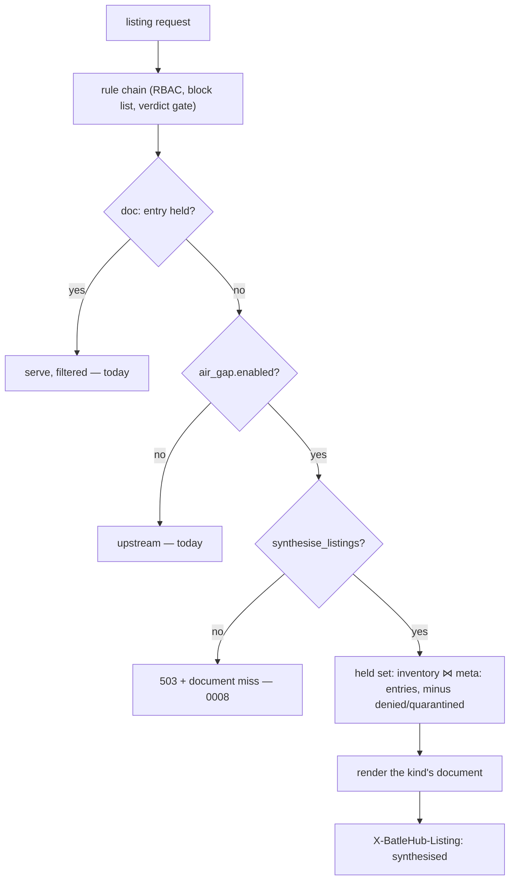
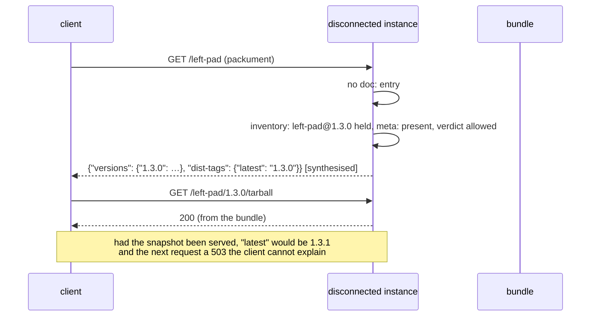

# RFC 0008-bis — Listings across the gap

| Field       | Value                                                        |
| ----------- | ------------------------------------------------------------ |
| Status      | **In review** — all five phases of §12 landed 2026-09-05 (§13.1–§13.5), and the renderers that open the artifact at import followed the same day (§13.6): RubyGems' compact index, conda's `repodata.json`, NuGet's registration page and Composer's `p2`. Terraform's provider download document followed (§13.7), composed from the held archive, checksum list and signature with the publisher's keys carried on the manifest — this instance signs nothing. Ten clients prove the whole in `tests/heavy/airgap.sh` |
| Short       | Listings across the gap                                       |
| Settles     | What a disconnected instance answers when a client resolves through a listing it does not hold: a bundle that carries the documents, or listings synthesised from what the instance holds |
| Author      | Max Batleforc <maxleriche.60@gmail.com>                       |
| Co-author   | —                                                             |
| Created     | 2026-09-05                                                    |
| Supersedes  | —                                                             |
| Complements | RFC 0008 — the one gap its §14.8 measured and did not close: a bundle carries artifacts and the entry that finds them, never the listing a client resolves through |
| Touches     | `crates/core` (`services/proxy`, `services/bundle`), `crates/adapters`, `crates/web`, `cli`, `ui`, docs |

---

## 1. Summary

RFC 0008 made `mise install` complete on a host with no route off the site,
and measured the sentence it could not make true: a bundle carries the
*artifacts* a plan names and the metadata entry that finds each one, and it
carries no *document* — no release listing, no packument, no simple page,
no flat index. A client that already knows what it wants, from a lock,
never asks for one; a client that has to *resolve* — `mise install
github:cli/cli@2.60.0` with no lock, `npm install left-pad@^1`, `pip
install requests` — asks for the listing first, and a disconnected
instance answers `503`, records a `document` miss, and the install stops
before it has asked for a single byte the bundle holds.

This RFC decides what the disconnected side answers. Two designs are
possible and §8 argues them: a bundle that also carries the documents its
artifacts were resolved from, or a disconnected instance that
**synthesises** a listing from what it holds. It chooses the second. The
bundle's manifest already names every version the instance has, per
package, with the metadata that describes it; a listing that names exactly
those versions is *true* — every version it advertises is installable —
where a carried document is a snapshot of an upstream that has moved on
and advertises versions the bundle left out. The miss log's `document`
kind, built in 0008 to say which listings were asked for, is the input
that tells the connected side which packages the next plan should widen.

### Before / after

```text
# today, on the disconnected side

$ mise install github:cli/cli@2.60.0          # no mise.lock
mise ERROR download failed: 503 from batlehub.corp
      not in this instance: github/cli/cli/releases
$ batlehub-cli admin air-gap-missing
github  cli/cli  document  3 requests   first 2026-09-04  last 2026-09-04
# The bundle holds gh_2.60.0_linux_amd64.tar.gz. Nothing can find it.

# with this RFC

$ mise install github:cli/cli@2.60.0
mise cli/cli@2.60.0 installed                # the listing named the one release the bundle carries
$ curl -s batlehub.corp/proxy/github/cli/cli/releases | jq '.[].tag_name'
"v2.60.0"                                    # one entry, synthesised, X-BatleHub-Listing: synthesised
$ npm view left-pad versions --registry batlehub.corp/proxy/npm/
[ "1.3.0" ]                                  # the packument names what is held, nothing more
$ npm install left-pad@1.3.1
npm error notarget No matching version found for left-pad@1.3.1
$ batlehub-cli admin air-gap-missing
npm  left-pad  document  1 request   requested 1.3.1, held 1.3.0
```

---

## 2. Motivation

The measurement first, because the design follows from it. Measured by
`tests/heavy/airgap.sh` (phase 0, §13.1) on 2026-09-05: a second instance
under `[air_gap] enabled = true` holding exactly one version of each
package — the tarball, the wheel, the release asset, carried by bundle —
with the tap between the client and it, egress denied to every process,
and the client's own retry defaults left alone. mise 2026.8.6, npm 11.19,
pip 26.2.

| Install | URLs attempted | Outcome |
| --- | --- | --- |
| `mise install github:cli/cli@2.60.0`, no lock | `releases/tags/v2.60.0` — the release **by tag** — four times, then `/releases?per_page=100` four times, the pair repeated four times: 32 requests, every one `503`; the asset never asked for | fails after about 33 s: `HTTP GET …/releases/tags/v2.60.0 attempt 1 failed (transient): HTTP status server error (503)` |
| the same tool from `mise.lock` | the asset download URL, and nothing else (`mise.sh` §4) | installs |
| `npm install left-pad@1.3.0`, clean cache | the packument `/left-pad`, three times (one try, two retries); the tarball never asked for | fails after 70 s: `code E503 … 503 Service Unavailable - GET …/left-pad` |
| `npm ci` from a lockfile naming the tarball | the tarball, and nothing else | installs, 1 s |
| `pip install six==1.17.0`, no cache | `/simple/pip/` once (pip's own version self-check, ignored), then `/simple/six/` six times (one try, five retries); the wheel never asked for | fails after 8 s: `No matching distribution found for six==1.17.0 (from versions: none)` |
| `pip install "six @ <the held wheel's URL>"` | `/simple/pip/` once (the self-check), then the wheel, and nothing else | installs, 1 s |

The pattern is the same three times: **a lock resolves nothing and a
version string resolves through a listing**, and the listing is the one
thing RFC 0008's bundle does not carry. Two things the table shows that
the inference from other suites did not (RFC 0008 §14.8 had mise asking
the listing first, measured against a closed port rather than a `503`):

- **mise asks for the release by tag before it asks for the listing.** A
  fully pinned version is first tried as `releases/tags/v{version}`, which
  is a document about *one* release — its `tag_name` and `assets[]` — and
  only when that fails does mise page the listing to resolve the version.
  A disconnected instance that answers the by-tag read from what it holds
  never has to synthesise a listing for a pinned mise install at all.
- **The miss log already knows the version for one of the three.** The
  by-tag read names it in the path; npm's packument and pip's simple page
  do not, and the follow-up artifact request that would (§4.4) never
  comes, because the client stops at the listing.

1. **The bundle is complete and the install fails anyway.** 0008 §1's
   claim is about the locked install and it holds; but an estate that has
   seeded every artifact a project needs still cannot run `mise install`
   for a tool added since the lock, `npm install` in a fresh clone, or
   `pip install` of anything not pinned by hash. The bytes are there and
   the map to them is not.
2. **The `503` is correct and unhelpful.** 0008 §4.4 chose `503` over
   `404` because the artifact exists elsewhere. For a *document* the same
   status is right and the client's reaction is worse: `mise` prints the
   status and stops, `npm` and `pip` treat a failed index fetch as a
   registry outage and retry, and none of them can tell the operator that
   the version they wanted is one directory away in the same instance.
3. **The miss log already says which listings were asked for, and nothing
   consumes it.** `MissKind::Document` was added in 0008 phase 1 (§13
   decision 3) exactly so the next bundle could be a list rather than a
   guess. Today it lists packages; it does not say which *versions* the
   client wanted, because the listing request does not name one. §4.4
   closes that.
4. **A carried snapshot lies within a day.** A listing captured on the
   connected side names every version upstream had at capture time; the
   bundle carries the ones the plan named. Serving the snapshot advertises
   versions that `503` on download — the RFC 0006 failure, a block believed
   by the API and not by the packument, in reverse. The listing must be
   derived from the holdings or it is a promise the instance cannot keep.

---

## 3. Goals / non-goals

**Goals**

- A client that resolves through a listing installs, on a disconnected
  instance, every version the instance holds — for every registry kind
  whose listing document RFC 0006's `listing_filter()` already knows how
  to render.
- A synthesised listing never names a version the instance cannot serve.
- The listing is labelled as synthesised on the wire and in the console,
  so nobody mistakes "what this instance holds" for "what upstream has".
- A `document` miss records the version the client went on to ask for,
  when it asked for one, so the connected side learns *which* versions to
  add rather than that a package was looked at.
- The bundle stays what it is: content-addressed blobs and one manifest.
  No format change, no second file type.

**Non-goals**

- **Carrying upstream documents in the bundle.** §8's first row; the
  design rejects it on truth, not on size.
- **Search.** A synthesised listing answers "which versions of *this*
  package"; `npm search`, PyPI's XML-RPC search and the cargo index's
  prefix directories stay `503`. Search is a question about the registry,
  and a bundle holds a plan, not a registry.
- **The forges' typed reads and raw content.** RFC 0019's `tags`,
  `commits` and `branches` families and `[raw]` stay `503` in air gap:
  they answer about a repository, not a release, and the bundle carries
  neither.
- **Verification.** 0008 §14.8's second half — running cosign, SLSA and
  the attestation API at seed time — is RFC 0018's scanner work pointed at
  `mise seed --verify`, and it is not made smaller by being bundled with
  this. It gets its own follow-up.
- **`dist-tags`, `latest` and other pointers to a version upstream chose.**
  A synthesised packument's `latest` is the highest held version, said so
  in §4.3; a bundle that wants a different pointer names it in the plan.

---

## 4. User-facing design

### 4.1 Configuration

```toml
[air_gap]
enabled            = true
synthesise_listings = true    # answer a listing from what this instance holds (default true when enabled)
record_misses      = true
miss_retention_days = 90
bundle_trusted_keys = ["…"]
```

- `synthesise_listings` is read only under `enabled = true`; `true`
  elsewhere is a validation error rather than a silent no-op, for the
  reason 0014 §4.4 refuses `on_confirmed = "block"` with `enabled =
  false`.
- Absent means `true`: an air-gapped instance that has just imported a
  bundle should answer the listing without a second setting. `false` is
  today's behaviour, for an estate that wants every resolve to fail loudly
  and drive its plan from the miss log alone.

### 4.2 Behaviour rules

- **A listing is synthesised only when it is not held.** The `doc:` cache
  entry an instance wrote while it was connected — or that a future
  connected instance wrote before it was cut off — is served as today,
  filtered by RFC 0006's block list and RFC 0018's verdicts exactly as
  today. Synthesis is the fallback where 0008 answers `503`, and it sits
  where 0008 §5.3 put the miss decision: after the rule chain, so a
  package RBAC or a block denies is denied, not listed.
- **Every version a synthesised listing names is held.** The source is
  the artifact-meta inventory (`ArtifactInventory::list_artifacts`) joined
  to the `meta:` entries the bundle wrote (0008 §14.2): a version without
  its metadata entry is not listed, because nothing could serve it. A
  version whose verdict is `denied` or `quarantined` is not listed, by the
  filter the served listing already goes through.
- **The document is the registry's own shape.** The packument npm parses,
  the PEP 691 JSON and the PEP 503 HTML page pip parses, the flat index
  `dotnet` parses, the `@v/list` Go parses, the sparse-index line cargo
  parses, the `maven-metadata.xml` mvn parses, the release listing mise
  parses. `RegistryKind::listing_filter()` says which document each kind
  has; the renderer of §6.2 produces it from the held set rather than
  removing entries from an upstream one.
- **The listing says what it is.** `X-BatleHub-Listing: synthesised` on
  every such response, `X-BatleHub-Listing-Held: <n>` with the count. The
  console's package page carries the same word on the versions table
  (§6.4). A held document — cached from upstream — carries neither header.
- **A pointer is derived, not invented.** npm's `dist-tags.latest`,
  PyPI's ordering, Go's `@latest`: the highest held version under the
  kind's own ordering (`RegistryKind::version_scheme()`, RFC 0002 phase 1),
  and pre-releases only when nothing else is held. The rule is written
  once, in `services/listing_synthesis.rs`, and the same for every kind.
- **A `document` miss records the follow-up.** When a synthesised listing
  is served and the client's next request on the same package is an
  artifact the instance does not hold, the miss row for the package gains
  `requested_version`. 0008's row was keyed on `(registry, key)`; the
  version is a column beside `first_seen`, `last_seen` and `count`, and
  the admin page and `admin air-gap-missing` print it.
- **Metadata the synthesised entry needs and does not have is absent, not
  fabricated.** A packument entry has `name`, `version`, `dist.tarball`
  (the proxy's own URL, as the rewrite already writes it) and
  `dist.integrity` when the artifact-meta row recorded a checksum;
  `description`, `time`, `repository` come from the `meta:` entry's
  `extra` when the bundle carried them and are omitted when it did not.
  A client that requires a field the synthesis cannot supply is a
  finding for §10, not a reason to invent one.

### 4.3 Per kind

What "the held set, rendered" means for each listing document
`listing_filter()` knows. The column the design turns on is the last one.

| Kind | Document synthesised | From | Pointer |
| --- | --- | --- | --- |
| npm | packument (`versions`, `dist-tags`, `time` when known) | inventory + `meta:` | `latest` = highest held stable |
| PyPI | PEP 691 JSON and PEP 503 HTML simple page | inventory (filenames are the keys) | none — pip orders |
| cargo | sparse-index lines, one per held version, `yanked: false` | inventory + `meta:` (the crate's manifest, read at import — §13.4) | none — cargo orders |
| Go | `@v/list`, `@v/{v}.info`, `@latest` | inventory + `meta:` (`Time`) | `@latest` = highest held |
| NuGet | flat index `versions[]`; registration page from the `.nuspec` read at import (§13.6) | inventory + `extra.nuget` | none — the client orders |
| Maven | `maven-metadata.xml` (`versions`, `latest`, `release`) | inventory | `latest`/`release` = highest held |
| RubyGems | compact `/versions`, `/names` and `/info/{gem}`, and the versions JSON API, from the gemspec read at import (§13.6) | inventory + `extra.rubygems` | none |
| Composer | `p2/{vendor}/{name}.json` (and the empty `~dev` variant) from the `composer.json` read at import (§13.6) | inventory + `extra.composer` | none |
| conda | `repodata.json` and `current_repodata.json` per subdir, from the `info/index.json` read at import; a subdir with nothing held answers empty (§13.6) | inventory + `extra.conda` | none |
| Terraform | provider and module `versions`; the provider `download` document for a platform whose archive, checksum list and signature are all held, with the publisher's keys and protocols carried on the manifest (§13.7) | inventory + `extra.terraform` (the checksum list read at import; the keys and protocols from the bundle's `facts`) | none |
| forges (GitHub, GitLab, Forgejo) | release listing and release-by-tag, one release per held `git_ref`, assets from the held keys | manifest's `BundleRef` + inventory | none — mise reads `tag_name` |
| nodedist, sdkman | `index.tab` / `index.json`; the candidate list | inventory + `meta:` (`published_at`) | none |

The path-proxy family (`deb`, `rpm`, `pacman`, `jetbrains`, `generic`) and
the extension galleries have no listing this instance can compose — the
signed `Packages` index cannot be re-signed here, and a gallery answers by
query. They stay `503` on a listing and serve a held artifact by path as
today; the table on the registry page says so.

### 4.4 The miss log, one column wider

```text
$ batlehub-cli admin air-gap-missing
registry  package    kind      requested   held           requests  first        last
npm       left-pad   document  1.3.1       1.3.0          4         2026-09-04   2026-09-05
github    cli/cli    document  v2.61.0     v2.60.0        1         2026-09-05   2026-09-05
pypi      requests   document  —           2.32.3         2         2026-09-04   2026-09-04
```

`requested` is the version the client asked for *after* the listing —
absent when it never did, which is a client that read the listing and
went away satisfied (or a human with `curl`). `held` is what the
synthesised listing named. Together they are the next plan's diff.

One request already names its version before any listing: a forge's
release **by tag** (`releases/tags/v2.60.0`), which is what a pinned
`mise install` asks for first (§2). Phase 0 found it served through the
artifact path and its miss filed as kind `artifact` under
`{registry}/{owner/repo}/{tag}` — the log said an asset was missing where
a document was (§13.1). Since phase 2 it is a `document` miss under
`{owner/repo} (release)` with `requested_version` set from the path, so
the forge row of the table above is filled on the first request.

Which requests fill `requested`, measured (§13.3): an artifact request
(a lock naming a version the instance does not hold) and the forge's
release by tag. npm and pip resolve a version string against the
synthesised listing *client-side* and stop — `ETARGET`, "no matching
distribution" — without a request, so for them the column fills only
when a lock names the version. The listing itself names none, and is
never a miss when it was synthesised.

### 4.5 Validation

`AppConfig::validate()` rejects:

| Condition | Rationale |
| --- | --- |
| `synthesise_listings = true` with `enabled = false` | The key has no effect and reads as if the instance answered listings offline. |

Warnings (logged and surfaced to the admin):

| Condition | Behaviour |
| --- | --- |
| A synthesised listing is served for a registry with no `meta:` entries at all | Every version is unlisted for want of metadata; the bundle that seeded it predates 0008 §14.2. Warn once per registry, name the bundle id. |
| A registry of the path-proxy family under `enabled = true` | Nothing is synthesised for it; say so at startup, so a `503` on its index is not read as this RFC failing. |

---

## 5. Architecture

### 5.1 Where the answer comes from



The invariant: **a synthesised listing is a projection of the served
set.** It is built from the same inventory the eviction service and the
upstream audit read, filtered by the same block list and verdicts the
served listing is, and rendered by a function that takes a `Vec<HeldVersion>`
and nothing else. There is no second source of truth to drift from, and
the RFC 0006 property — a block every ecosystem can see — holds for it
because it holds for the inputs.

### 5.2 Why the held set and not the snapshot



---

## 6. Detailed design

### 6.1 `crates/core`

- `entities/air_gap.rs` — `AirGapPolicy` gains `synthesise_listings:
  bool` (default `true`); `ContentMiss` and `RecordedMiss` gain
  `requested_version: Option<String>` and `held_versions: Vec<String>`.
  `MissRecorder::record` takes the version when the caller has one.
- `services/listing_synthesis.rs` — new. `HeldVersion { id, checksum,
  size, published_at, extra }`, `held_versions(inventory, cache, verdicts,
  registry, name) -> Vec<HeldVersion>` (the join of §5.1, the filter of
  §4.2), and one `render(kind, doc_kind, held, public_base) ->
  Option<VersionDocument>` per row of §4.3 — `None` for a kind with no
  listing, which is the `503` of today. The pointer rule
  (`highest_held`) lives here and is the one place it is defined.
- `services/proxy/handle.rs` — `fetch_version_document_cached`'s error arm
  (the `record_if_missing(…, MissKind::Document)` of 0008) becomes: under
  `air_gap.enabled && synthesise_listings`, render; on `Some`, serve it
  through the *same* filter path the held document takes and mark the
  response; on `None`, the `503` of today. The artifact path's miss
  recording passes the requested version.
- `ports/air_gap.rs` — `MissRecorder::record_document_followup(registry,
  name, requested_version)`; the in-memory and Postgres implementations.

### 6.2 `crates/adapters`

- `migrations/058_missing_content_requested.sql` — `requested_version
  TEXT`, `held_versions TEXT[]` on `missing_content`; a `mig!` entry.
- The renderers are pure functions over `HeldVersion` and live in core;
  nothing here but the store.

### 6.3 `crates/web`

- `handlers/proxy/common.rs` — the response builder sets
  `X-BatleHub-Listing: synthesised` and `X-BatleHub-Listing-Held` when
  the `VersionDocument` says it was synthesised (a flag on the struct,
  not a second type).
- The forge routes (`github.rs`, GitLab's and Forgejo's) — the release
  listing and release-by-tag routes fall through to synthesis from the
  bundle's `BundleRef` rows, which already carry `owner_repo`, `git_ref`,
  `kind` and `sha` (0008 §14.4), and the asset names from the held keys.
- `handlers/air_gap.rs` — the listing and the CSV gain the two columns.

### 6.4 `cli` and `ui`

- `batlehub-cli admin air-gap-missing` prints `requested` and `held`;
  `mise plan --from-misses` (0008 phase 2's input) reads
  `requested_version` when present and the miss row's package when not.
- `AdminAirGap.vue` — the two columns. `PackageDetailPage.vue` — the
  versions table's caption says *synthesised from what this instance
  holds* when the explore detail came from a synthesised document; the
  detail endpoint carries the flag.

### 6.5 docs

- `docs/use/mise.md` and `docs/operations/air-gap.md` — the loop gains
  a step: *read what was requested*, not only what was missing.
- The registry pages' air-gap row: which document is synthesised for the
  kind, and the two families that get none.

**Deliberately untouched**, so reviewers do not go looking:

- `services/bundle.rs` and the bundle format — no new file, no new
  manifest field. The manifest already names every version and ref; that
  is the point.
- `services/document_cache.rs` — the per-grant-set cache of RFC 0015 is
  for held documents; a synthesised one is rendered per request from a
  query the eviction service already runs, and caching it would be
  caching the inventory.
- `RegistryKind::listing_filter()` and RFC 0006's filters — they are what
  the synthesised document is passed through, not what renders it.

---

## 7. Security considerations

- **No new unauthenticated surface.** The listing routes exist; this
  changes what an air-gapped instance answers on them, after the same
  rule chain. A caller who may not list a package still may not.
- **A synthesised listing cannot advertise what a block or a verdict
  hides.** It is built from the served set (§5.1), so RFC 0006's and RFC
  0018's guarantees hold by construction rather than by a second filter
  that could drift.
- **The miss log's new column is attacker-writable, like the row.** A
  caller who can request an artifact can write a `requested_version`.
  The value is stored as an opaque string, cut to `LAST_ERROR_MAX_BYTES`
  as 0014 cuts upstream text, never parsed, and the row cap of 0008 §13
  decision 3 still bounds the table. What an attacker gains is a line in
  the operator's next plan that names a version nobody wanted; the plan
  is reviewed before it is seeded.
- **Nothing is fabricated that a client verifies.** A synthesised
  `dist.integrity` or `cksum` comes from the artifact-meta checksum the
  connected side recorded or is omitted; a client that then verifies the
  bytes verifies the bundle's, which is what 0008 §5.2 promised.

---

## 8. Alternatives considered

| Alternative | Why rejected |
| --- | --- |
| **Carry the documents in the bundle** — `documents/<key>` beside `blobs/`, the connected side capturing each listing it resolved through | It advertises what the bundle does not hold (§2 item 4): the snapshot names every upstream version, the plan seeded some, and every other one is a `503` the client cannot tell from an outage. Trimming the snapshot to the held set is this RFC with an extra copy of the truth to keep in step. It also grows the bundle by a packument per package — `lodash`'s is 800 KB — for bytes the manifest already implies. |
| **Carry the documents and trim them on import** | The trimming code *is* the renderer of §6.1, run once at import instead of per request, over an input that adds nothing the manifest lacks. And a listing trimmed at import is stale the moment a second bundle adds a version: it has to be re-trimmed, which is re-rendering. |
| **A `latest` the plan pins** | Wanted for a pointer that must not move; deferred (§3, §11 q2). The default has to work with no plan field, and "highest held" is what every kind's own client would compute from the listing anyway. |
| **Synthesise only for mise** | The measurement is three clients wide (§2) and the renderer per kind is the smaller part of the work; a mise-only answer leaves npm and pip at `503` for the same reason. |

---

## 9. Rollout and compatibility

- **Default behaviour.** Nothing changes for a connected instance:
  synthesis sits behind `air_gap.enabled`. An air-gapped instance that
  upgrades starts answering listings it used to `503`; an estate that
  drove its plan from those `503`s keeps the miss row (the listing is
  served, the follow-up artifact miss is still recorded, one column
  richer) and may set `synthesise_listings = false` to keep the old
  behaviour exactly.
- **Config migration.** One optional key; `CURRENT_CONFIG_VERSION` does
  not move.
- **Operator prerequisites.** A bundle exported by 0008 §14.2 or later,
  so the `meta:` entries exist; older bundles synthesise nothing and warn
  (§4.5).
- **Rollback.** The flag off. The migration's two columns are nullable
  and harmless to leave.

---

## 10. Test plan

- **Unit** (`crates/core/src/services/listing_synthesis/tests.rs`): the
  join drops a version without its `meta:` entry and one whose verdict is
  `denied`; the pointer picks the highest stable held and falls back to a
  pre-release only when nothing else is held; each row of §4.3 renders
  the document that kind's existing parser accepts (round-trip through
  the adapter's own model where one exists — `NpmPackument`, the cargo
  index line, `maven-metadata.xml`).
- **Integration** (`crates/web/tests/air_gap.rs`): under `enabled = true`
  a packument for a held package is `200` with the header and one
  version, for an unheld package `503` with the miss; the follow-up
  artifact miss carries `requested_version`; RBAC and a block still
  refuse the listing; `synthesise_listings = false` is today's `503`.
- **Heavy** (`tests/heavy/airgap.sh` — ports 8110 for the connected
  instance, 8120 for the disconnected one, 8119 for the tap in front of
  it): both halves on one disconnected instance. With
  `synthesise_listings = false` it is the measurement of §2, every row
  asserting the refusal; then the miss log is purged, the key flipped by
  a hot reload, and the same commands run again: `npm install
  left-pad@1.3.0` from a clean cache, `pip install six==1.17.0` and `mise
  install github:cli/cli@2.60.0` with no lock all complete against the
  disconnected instance with egress denied, the packument, the simple
  page and the by-tag release each carry `X-BatleHub-Listing:
  synthesised`, and a request for a version the instance does not hold
  (`left-pad@1.2.0`) fails in npm with `ETARGET` and never asks for a
  tarball. That is the client seeing the listing, which is the only thing
  this RFC claims. Phase 2 adds the assertion that `admin air-gap
  missing` names `1.2.0` as requested and `1.3.0` as held.
- **Existing suites** unchanged: `local_npm_registry.rs`, the RFC 0006
  listing filters and `every_advertised_filter_is_reachable_from_dispatch`
  — a synthesised document passes through the same filters, so nothing
  that reads them knows it exists.

---

## 11. Decisions and open questions

### Resolved

| # | Question | Decision |
| --- | --- | --- |
| 1 | Carry documents, or synthesise? | **Synthesise from the held set.** A carried snapshot advertises what the bundle left out; a projection of the holdings is true by construction (§2 item 4, §5.1). |
| 2 | Where does the version the client wanted come from? | **The follow-up artifact request.** The listing request names no version; the next request on the package does, and the miss row is one column wider (§4.4). |
| 3 | Which kinds? | **Every kind with a listing document** (`listing_filter()`), rendered in its own shape. The path-proxy family and the galleries have none and stay `503` (§4.3). |

| 4 | Do npm and pip really stop at the listing? | **Yes, measured** (phase 0, §2, §13.1). Both ask the listing first, retry it on `503` — npm for 70 s, pip for 8 s — and never ask for the artifact they could have had. pip asks the simple page once and negotiates its shape — its `Accept` prefers the PEP 691 JSON page and accepts the PEP 503 HTML one (pip ≥ 22.2) — and the miss log shows which the server chose: the row is `six (simple-json)`. Phase 1 renders the JSON page, which every pip this RFC cares about takes; phase 3 the HTML one for the older clients and the tools that read it by hand. |
| 6 | Does the estate sign Terraform's checksum list with a key of its own? | **No** (§13.7). Terraform verifies OpenPGP signatures and nothing else; the OpenPGP crates depend on `rsa`, which `deny.toml` bans (RUSTSEC-2023-0071), and the bundle's own signature is ed25519 for the same reason (`bundle.rs`). It is also unnecessary: the checksum list and its signature are artifacts the connected instance proxies already, so the bundle carries them and the client verifies *the publisher's* signature, exactly as it does connected. The one thing no artifact carries — the key set the download document names, and the protocols — the export reads off the connected instance's document and the manifest carries as `facts`, under the manifest signature. A re-signed list would have replaced the publisher's provenance with the estate's and made every install report a self-signed key. |
| 5 | What does a synthesised forge release need to carry? | **`tag_name` and `assets[]` with `name`, `size`, `browser_download_url` and `url`, from the held keys** (§13.1, corrected by §13.2). mise's first read is the release *by tag*, and it deserialises the forge's schema strictly: `url` and `size` are required fields of an asset, and a release without them fails to decode whole — phase 1's first run against mise said `missing field \`url\``. There is no forge id to give `url` an asset endpoint, so it names the download by name, the one address the instance holds. A synthesised listing is one such release per held tag; `body`, `published_at` and the forge's own links are omitted unless the `meta:` entry has them, as §4.2 says. |

### Still open

1. **A plan-pinned pointer.** Whether `mise-plan.json` should carry a
   `latest` per package for the estates that want `npm install left-pad`
   with no version to land on something other than the highest held.
   Deferred: nobody has asked, and the default is what the client would
   compute.
2. **A planner for the package registries.** `mise plan` reads a
   `mise.lock`; the phase-0 suite hand-writes the npm and PyPI plan
   entries, because nothing turns a `package-lock.json` or a
   `requirements.txt` into proxy paths. RFC 0008 scoped the plan to mise
   on purpose; whether the same estate wants `batlehub-cli plan
   --npm-lock` is a question for it to ask, and §6.4 lists it as a CLI
   item only.

---

## 12. Implementation phases

| Phase | Content |
| --- | --- |
| 0 | **Measure** — done, §13.1. npm, pip and mise against a disconnected instance holding one version, with the tap: the URLs, the statuses, what each prints (§2). Answered §11 q4 and q5. |
| 1 | **Landed** — §13.2. `synthesise_listings`, `HeldVersion`, the join and the filter, the npm, PyPI-JSON and forge renderers, the response header. **Useful alone**: `mise install` without a lock, `npm install` in a fresh clone and `pip install` of a version string all work on a disconnected instance. |
| 2 | **Landed** — §13.3. The miss log's `requested_version` and `held_versions`, migration 058, the CLI and console columns; the forge's by-tag read filed as a `document` miss with its version (§4.4). `mise plan --from-misses` is not built: see §13.3. |
| 3 | **Landed** — §13.4, for every kind whose held keys say enough: PyPI's HTML page, cargo (with the crate's manifest read at import), Go, Maven, NuGet's flat index, GitLab, nodedist, SDKMAN. cargo, go, mvn and dotnet are proven in the suite. Terraform, RubyGems, Composer, conda and NuGet's registration pages are not composed: what they need is in the artifact, not the key (§13.4). |
| 4 | **Landed** — §13.5. The runbook's loop and expectations, the mise page, an *Air gap* row on every registry page; and the checksum a composed `maven-metadata.xml` answers for itself, which §13.4 measured as the difference between a second and five minutes. |
| 5 | **Landed** — §13.6 and §13.7, the kinds §13.4 set aside: the four renderers that open the artifact at import, and Terraform's download document with its facts carried on the manifest. Nothing of §4.3 stays a `503`. |

---

## 13. Landed

### 13.1 Phase 0 — the measurement (2026-09-05)

`tests/heavy/airgap.sh`, run one at a time with the other heavy suites
(they share `scan_jobs`; `docs/rfc/plan.md`). One version of each —
`left-pad@1.3.0`'s tarball, `six-1.17.0`'s wheel, cli/cli `v2.60.0`'s
linux-x64 asset — seeded through a connected instance, exported as a
signed bundle (three blobs) and imported into a second instance under
`[air_gap] enabled = true`; the three artifacts answer `200` from it
before any client is run. Then five client rows against it, each with
egress denied and its retry defaults untouched, read off the tap. §2 is
the table; what it settled:

1. **The design's premise holds for all three clients.** A version
   string is resolved through a listing, the listing is a `503` the
   client treats as an outage, and the artifact the instance holds is
   never asked for. A lock — `npm ci`, a PEP 508 direct reference,
   `mise.lock` — fetches the artifact and nothing else, in a second.
2. **mise asks by tag first.** RFC 0008 §14.8 had recorded the listing
   as mise's first request; that was measured against a closed port. On
   a `503` mise tries `releases/tags/v{version}` four times, then the
   listing four times, and repeats the pair four times before giving up
   (about 33 s, 32 requests). The by-tag document is about one release and is
   answerable from a held asset's key alone, so a pinned mise install
   needs no synthesised *listing*; §11 q5 is decided on that.
3. **The by-tag miss is mis-kinded.** It is served through the artifact
   path and recorded as kind `artifact` under
   `{registry}/cli/cli/v2.60.0`, so the miss log reports an asset missing
   where a document was — and the one request that names its version
   files it under the wrong column. Phase 2 (§4.4).
4. **The miss log names the page, not only the package.** A document
   miss is keyed `left-pad (versions)`, `cli/cli (versions)`,
   `six (simple-json)`: the page kind the server was asked for is in the
   key, which is how §11 q4's negotiation was read off — and how phase 2
   knows which renderer a miss row is asking for.
5. **pip's self-check is a document miss.** pip asks `/simple/pip/`
   before anything else, for its own version notice; on a disconnected
   instance that is a `503` pip ignores and a `pypi:document:pip` row in
   the miss log. Harmless, and worth knowing when reading the log:
   `PIP_DISABLE_PIP_VERSION_CHECK=1` removes it, the operations page
   should say so.
6. **How long a client retries is what the operator sees.** npm's three
   tries at the packument take 70 s (its `fetch-retry-mintimeout` and
   `fetch-retry-maxtimeout`), pip's six take 8 s, mise's 32 take about 33 s.
   §2 item 2 called the `503` "correct and unhelpful"; the measurement
   adds that it is slow.
7. **The plan has no package-registry planner.** The npm and PyPI entries
   of the bundle were hand-written proxy paths; `mise seed` and `mise
   export` took them without complaint, and the storage keys came back
   off the responses as RFC 0008 §14.1 intends. The gap is the
   *planning* step only (§11 open q2).

What it does not show: any of the three installs succeeding through a
synthesised listing. That is phase 1's assertion, on the same commands.

### 13.2 Phase 1 — listings synthesised from the held set (2026-09-05)

The design of §4–§6 as built, and what building it against the three
clients changed.

**Where it lives.** `services/listing_synthesis.rs` in `crates/core`:
`HeldVersion`, the join `held_versions` (artifact-meta rows for the
package, each joined to its `meta:` entry; a row without one is not
listed), the pointer `highest`, and the renderers — the packument, the
PEP 691 page, the release listing and the release by tag. The proxy
service calls it from two places: `version_document`'s miss arm, so the
composed listing goes through the same block-list and verdict filters
and the same URL rewrite as a fetched one; and `handle`'s miss arm for
the forge release by tag, which is served through the artifact route and
so runs the grant check, the block list and the registry's rule chain on
a minimal metadata before it answers. The held set is read through the
artifact-meta store the proxy service already holds
(`ArtifactCacheMeta::list_package_artifacts`, defaulting to empty), not a
new handle: seventy-three constructions of the service would otherwise
have changed for one query. `ProxyResponse::Document` carries a composed
document on a streaming route; `VersionDocument::synthesised` is the flag
the response builders turn into the two headers. An in-memory
artifact-meta store that remembers its rows now exists beside the no-op
one, for the tests and for a deployment without a database.

**What the clients required.** §11 q5 was decided on the by-tag read
needing "nothing a held asset's key does not say"; mise's decoder said
otherwise, twice, and the release schema is now read off mise's own
source rather than inferred. A release needs `tag_name`, `draft`,
`prerelease`, `created_at` and `assets[]` with `name`,
`browser_download_url` and `url`. Two consequences:

- `url` — the forge's asset endpoint, which the rewrite of RFC 0019 §13.2
  removes from an asset with no id — is the address mise downloads from.
  A composed asset has no forge id, so `url` names the download route by
  name, and `rewrite_release_urls` keeps such a field rather than
  dropping it (an asset with neither id nor name still loses it).
- `created_at` is required and an import records no upstream date (RFC
  0008 §14.2). The release is dated by when this instance received its
  first asset: a true statement about this instance, and the one
  exception to §4.2's "absent, not fabricated" — with 0008 §14.2's own
  caveat that a client's release-age gate reads an imported release as
  new. `published_at` is only ever what upstream said.

**Measured, on the same commands as §2**, the suite green end to end on
its eighth run (the earlier ones were mise's schema, one field at a time,
and a purge that forgot nothing): after the flip, `npm install left-pad@1.3.0` from
a clean cache completed in under a second off a packument answering
`200` with `X-BatleHub-Listing: synthesised` and `X-BatleHub-Listing-Held:
1`, then the tarball; `npm install left-pad@1.2.0` failed with `ETARGET`
off the same packument and asked for no tarball; `pip install
six==1.17.0` completed off the JSON simple page, then the wheel; `mise
install github:cli/cli@2.60.0` with no lock made exactly two requests —
the release by tag, `200` synthesised, and the asset, 13 MB — and `gh
--version` answered `2.60.0`. Against the first half's 70 s, 8 s and 33 s
of retries into a `503`.

**What is not in phase 1, by §12:** the miss log's `requested_version`
and `held_versions` and the re-kinding of the by-tag miss (phase 2); the
PEP 503 HTML page, GitLab's release shape and every other renderer of
§4.3 (phase 3); the docs beyond the configuration reference (phase 4).
One thing phase 2 now knows it cannot do: the version a client wanted and
the instance does not hold is not learnable from npm, which stops on
`ETARGET` without a request; §4.4's `requested` column fills only for the
clients that ask.

### 13.3 Phase 2 — the miss log, two columns wider (2026-09-05)

`ContentMiss` and `RecordedMiss` carry `requested_version` and
`held_versions`; migration 058 adds the columns; the Postgres and
in-memory recorders keep the last version asked for across a request
that named none and the held set as of the last request. The proxy
service fills them at the one place a miss is recorded: the version from
the coordinate when the kind names one (artifact, ref, checksum), the
held set through the same join the synthesised listing is built from —
and only under synthesis, because without it the client saw no listing
to compare with. `batlehub-cli admin air-gap-missing` prints `Requested`
and `Held`; the console's air-gap page has the two columns; the admin
listing carries both fields, so nothing needs a second call.

**The forge's release by tag is a document miss now.** `handle`'s miss
arm recognises a forge coordinate with no artifact selector and a tag as
its version, and files it as `{owner/repo} (release)`, kind `document`,
`requested_version` the tag. Measured by the suite: `mise install
github:cli/cli@2.59.0` against an instance holding only `v2.60.0` is
refused at the release by tag, and the row reads `requested v2.59.0,
held v2.60.0` — which is exactly the line the next plan needs.

**What fills `requested`, and what does not.** An artifact request names
its version, so a lock pinning an unheld version (`npm ci`, a PEP 508
reference, `mise.lock`) fills it; the forge's by-tag read fills it. npm
and pip resolving a *version string* do not: both read the synthesised
listing, find the version absent, and stop client-side without a
request. That is the design working — the listing named only what is
held — and it means §4.4's example row for npm (`requested 1.3.1`) is
reachable only through a lock. The column is honest about it: absent
means the client never asked for a version this instance could record.

**`mise plan --from-misses` is deliberately not built.** RFC 0008 §14.1
established that a storage key is a function of the route, not of the
URL, and the inverse — a miss row's key back to a proxy path — holds for
the simple shapes (`npm/left-pad/1.2.0/tarball`) and not for several
real ones (a forge asset by id, a Maven multi-file version, a path-proxy
file). A planner that guessed would plant entries the connected side
cannot fetch, and `mise seed` would report every one as "a planned path
the server does not answer". The honest input to the next plan is the
row itself, which now says the version; turning it into a plan is
0008's `plan` reading a lock the operator writes from it. Recorded here
rather than in §11: it is a decision, not a question.

**Tests.** `crates/web/tests/air_gap.rs`: an artifact miss under
synthesis names the version and the held set, newest first; without
synthesis it names the version and no held set; the forge's unheld tag
is a document miss under the package with the tag requested and the held
tags. The in-memory and Postgres recorders keep the requested version
across a request that named none and take the latest held set. The
heavy suite's step 10 is the row above, read through the CLI.

### 13.4 Phase 3 — the remaining renderers (2026-09-05)

`render` in `services/listing_synthesis.rs` now composes, from the held
keys and their `meta:` entries: PyPI's PEP 503 HTML page; cargo's sparse
index; Go's `@v/list`, `@latest` and, through the artifact route,
`@v/{v}.info`; `maven-metadata.xml`; NuGet's flat index; GitLab's release
listing and release by tag (`assets.links` from the held downloads);
nodedist's `index.tab` and `index.json`; SDKMAN's `versions/all` and
`candidates/default`. Two things the build changed in the design:

- **Some listing facts are in the artifact, not the key.** A sparse-index
  line carries the crate's dependencies and features, and a line without
  them is not a shorter truth but one cargo would build against. §4.3 had
  them coming from the `meta:` entry; an import writes no such thing. So
  the import reads them off the bytes, once — `listing_facts::
  cargo_index_facts` opens the `.crate` for `{name}-{version}/Cargo.toml`
  and files `deps`, `features` and `links` in the entry's `extra` — and a
  crate whose entry has no facts is not listed at all. The same pattern
  is what the kinds still open need (below); the extractor is the
  precedent.
- **The listing's name is not always the package's.** A PyPI page is
  asked for as `typing-extensions` and its files are filed under
  `typing_extensions`; an SDKMAN listing is `java/linuxx64` and its
  artifacts are `java`. `package_names_for` maps one to the other before
  the query, and the join reads each key back with the row's own name.
  Found by the Go and SDKMAN rows, which produced empty listings until
  it did.

**Measured, with the clients this runner has** (run 15 of the suite):
`cargo generate-lockfile` with `unicode-xid = "0.2"` resolved `0.2.5`
through the composed sparse index in a second; `go get github.com/google/uuid`
with no version resolved `v1.5.0` through the composed `@v/list` and
`.info` in under a second, with `GOSUMDB=off` as an air-gapped estate
sets it; `mvn dependency:resolve` of `[3.12,)` resolved `3.12.0` through
the composed `maven-metadata.xml`, and `dotnet restore` of `13.*`
resolved `13.0.3` through the composed flat index. Each of the four
listings answered `200` with `X-BatleHub-Listing: synthesised`, and the
miss log holds nothing of theirs afterwards.

**Three findings from the wire.** Maven fetches `.sha1` and `.md5` beside
every file — the composed `maven-metadata.xml`, the carried pom and jar
alike — and the bundle carries none of them; each is a `503` Maven's
default checksum policy warns about and retries, and the row took 184 s
on one run and 312 s on the next where the others took a second or four.
The six checksum files appear in the miss log as artifact misses, which
is honest and which the next plan can carry for the two real files; for
the composed document the checksum has to be composed too. Serving a checksum of the
composed bytes on those two paths is small and belongs to phase 4's
polish; until then an operator sees the warning. Maven's local
repository records the id of the repository each file came from and
re-verifies a file against an id it does not know: a warm repository
built against the connected instance is only reused offline if both
`settings.xml` mirrors share an id. And `go get github.com/google/uuid`
asks `@v/list` of `github.com` and `github.com/google` before the module
itself — Go finding which prefix is the module — so the miss log carries
a document miss for each parent path; a listing composed for them would
say "no versions", which is what the `503` also means to Go, and neither
row is a gap the next bundle can fill.

**Not composed, and why.** Terraform's `versions` is trivial but the
install then reads `{version}/download/{os}/{arch}`, which names a
`shasums_url` and the provider's signing keys — a document the instance
would have to compose *and sign* — so a composed listing alone would lead
the client to a refusal. RubyGems' compact index needs each gem's
dependencies (from the gemspec inside the `.gem`), Composer's `p2` needs
`composer.json` from the zip, conda's `repodata.json` needs
`info/index.json` from the package, and NuGet's registration page needs
the `.nuspec` from the `.nupkg`. Each is the cargo pattern — an
extractor at import, a renderer over `extra` — and each is a bounded
piece of work with a client to prove it; they are listed here rather than
guessed at. `sdk list`'s rendered table (`versions-list`) is also not
composed: `sdk install` does not read it.

### 13.5 Phase 4 — the docs, and a checksum (2026-09-05)

The runbook (`docs/operations/air-gap.md`) gains step 4b in its loop —
listings composed from what is held, needing no action — and step 5
reads *what was requested and what was held*, the two columns of §4.4,
with the four things an operator will see in the miss log and should not
chase: pip's self-check, Go's parent-path probes, Maven's checksum files,
and a `document` row with `Requested` filled. The mise page's *what will
not work* no longer lists a lockless install: it works when the asset was
bundled, and says what happens when it was not. Every registry page's
*At a glance* table has an **Air gap** row saying which listing this
instance composes for that kind offline — or that none is, and why: a
signed index, a gallery answering by query, a document that lives inside
the artifact.

**The checksum.** §13.4 measured Maven spending 184 s and 312 s retrying
`maven-metadata.xml.sha1` and `.md5` into a `503`, on a document this
instance had just composed. `metadata_checksum_of` recognises the
checksum path of a metadata document; when the document is composed, the
handler answers the digest of the bytes it composed, under the same
`X-BatleHub-Listing: synthesised` header, and Maven moves on. A held
document keeps upstream's own file, as before. The suite asserts the
`.sha1` answers `200` beside the composed metadata; the Maven row went
from 312 s to 124 s. What remains of the 124 s is the `.sha1` and `.md5`
of the carried pom and jar — real upstream files the bundle did not
carry, four `503`s Maven retries — and those are the next plan's to
carry: they are in the miss log as artifact misses with the version
named.

### 13.6 The renderers that open the artifact (2026-09-05)

The cargo pattern of §13.4, applied four more times: the import reads the
facts a listing needs off the bytes it just stored and files them in the
`meta:` entry's `extra`; the renderer is a pure function over the held
set. Nothing new was written to parse: the gemspec, `info/index.json`,
the `.nuspec` and `composer.json` are read by the same functions the
local-mode publish paths use.

- **RubyGems.** `extra.rubygems` carries the platform and the runtime
  dependencies. `/info/{gem}` is one line per held version, `VERSION
  dep:req,…|checksum:SHA256`; `/versions` is one line per gem with the
  md5 of that gem's `/info` document, which is how Bundler pairs the two
  and validates them; `/names` lists the gems; the versions JSON API is
  composed too. `/versions` and `/names` describe the whole registry, so
  they are the first documents composed from the *registry's* held set
  (`held_registry`, `render_registry`), not one package's — the store
  gained `list_registry_artifacts` for it. A gem imported without its
  gemspec facts is not listed: a resolver handed an empty dependency list
  installs a gem without the gems it needs.
- **conda.** `extra.conda` is the package's `info/index.json`. A subdir's
  `repodata.json` is every held package of that subdir, keyed by file
  name, `.tar.bz2` under `packages` and `.conda` under `packages.conda`,
  each entry the index the import read plus the digest and size the row
  knows. A subdir with nothing held answers an *empty* repodata when the
  registry holds anything at all, because a client reads every subdir
  of a channel and "nothing here" is a true statement — micromamba asks
  `noarch` beside `linux-64` and stops on a `503` for either. Served on
  every encoding the route offers, with the header on each.
- **NuGet.** `extra.nuget` is the `.nuspec`'s id, description, authors and
  tags; the registration index is one inline page whose catalog entries
  carry them, `packageContent` pointing at the flat container this
  instance serves. Dependency groups are not composed — the parser does
  not read them, and `dotnet restore` takes dependencies from the
  `.nuspec` inside the package it downloads, not from the page.
- **Composer.** `extra.composer` is `composer.json`; the `p2` document is
  one entry per held dist with `dist.url` on this proxy's route and
  `source` removed. The `~dev` variant is answered empty when nothing dev
  is held, because Composer asks for it either way.

**A defect the seed found first.** The conda proxy route filed a package
under its name and version while the conda client read the *platform*
out of the version field, so a proxied conda download had never worked:
`conda repodata not found for platform '0.1'`. The conda heavy suite is
local-only, which is why nothing had said so. The route now carries the
subdir in the artifact selector (`linux-64/{filename}`) and the client
reads the platform from there, keeping the coordinate a name and a
version — the thing a block is placed on. The composed `repodata.json`
reads the subdir the same way.

**Measured.** The suite's two new rows: `bundle install` of an unpinned
gem resolves through the composed `/versions` and `/info/rake` and
fetches the gem; `micromamba create` resolves `_libgcc_mutex` through the
composed `linux-64/repodata.json` beside an empty `noarch`, and fetches
the package. NuGet's registration page and Composer's `p2` are proven in
process (`crates/web/tests/air_gap.rs`): no client on the runner reads
the registration page during a restore, and Composer is not installed
there.

**What stayed a `503`, then.** Terraform: its `versions` is trivial,
but the install then reads `{version}/download/{os}/{arch}`, which names a
`shasums_url` and the provider's signing keys — a document this note
assumed the instance would have to compose *and sign*. §13.7 is the
answer, and it signs nothing.

### 13.7 Terraform — the download document, without a key of our own (2026-09-05)

The assumption above was wrong in a useful way. Terraform verifies a
provider in three reads the download document names — the archive, the
checksum list (`SHA256SUMS`) and the list's OpenPGP signature — and the
proxy already serves all three as *artifacts* (`{os}/{arch}`, `shasums`,
`shasums.sig` under the version), which is what made the connected
`terraform init` pass through this instance with nothing fetched from the
internet (RFC 0009 §12.8). So a bundle carries them as it carries any
artifact, the client verifies **the publisher's** signature exactly as it
does connected, and nothing has to be signed here. What no artifact
carries is the *key set* the document names and the protocols the
provider speaks — those live in the download document alone.

- **The manifest carries facts.** `BundleEntry.facts`, an object keyed
  by registry kind the way the import files what it reads off the bytes,
  under the manifest signature. `mise export` recognises a provider
  archive by its plan path (`…/v1/providers/{ns}/{type}/{v}/artifact/{os}/{arch}`),
  reads the `download` sibling off the connected instance, and carries
  `protocols` and `signing_keys` as `facts.terraform`. A document it
  cannot read is a printed note, not a refusal: the archive still
  crosses, and the note says the install will stop at its download
  document. The export also says, per provider archive, which of the
  two sidecars the plan does not name — the miss log would say so too,
  on the wrong side of the gap.
- **The import files them**, merged over what it reads off the bytes:
  the checksum list is parsed into `extra.terraform.sums`
  (`filename → sha256`), because the archive's own key names a platform
  and Terraform looks the archive's line up *by file name*. The name in
  the composed document is the list's entry whose digest is the
  archive's; the conventional `terraform-provider-{type}_{v}_{os}_{arch}.zip`
  only when the list carries no facts.
- **The renderers.** `versions` for a provider is one entry per held
  version with the platforms its archives are held for and the protocols
  its facts named; a version whose only held row is a checksum list is
  not listed. `versions` for a module is its held tarballs (the module
  `download` route already points at this instance without asking
  anyone). The download document is composed **only when the archive,
  the list and the signature are all held** for that platform — a
  document for a provider the client could not verify would lead it to a
  refusal, and the `503` names the gap instead. The document's coordinate
  is addressed in full (`providers/{ns}/{type}/{v}/download/{os}/{arch}`),
  so `package_names_for` lists it under its provider. The handler then
  repoints and, under RFC 0012, signs the three URLs exactly as it does
  for a fetched document.
- **Decision** (§11 q6): the estate does not sign. The OpenPGP crates
  depend on `rsa`, banned by `deny.toml`; the bundle is ed25519 for the
  same reason; and re-signing would replace the publisher's provenance
  with the estate's, which Terraform would report as a self-signed key.

**Measured** (`tests/heavy/airgap.sh` §7d, Terraform 1.8.5, `hashicorp/null`
3.2.2 on `linux/amd64`, egress denied to the client). The export read the
connected instance's download document and carried `protocols = ["5.0"]`
and one key, `34365D9472D7468F` — HashiCorp's. The disconnected run,
`terraform init` against a TLS tap with `localhost` bound to the Terraform
registry, was six requests and nothing else: discovery, `versions` (`200`,
synthesised, three rows held), `3.2.2/download/linux/amd64` (`200`,
synthesised), then `shasums` (1 344 B), `shasums.sig` (566 B) and the
archive (5 057 172 B), each `200` from the held set. Terraform printed
*Installed localhost:8121/hashicorp/null v3.2.2 (signed by HashiCorp)*
and exited 0 after one second; the miss log holds nothing of the
registry's. Two things the suite found before the row passed, both in
the suite: a registry with `hosts` refuses to load without
`[server].trusted_proxies`, and the mise runner must be given the
suite's four `MISE_*` variables back or it tries to install Terraform
through the instance it is testing. In process
(`crates/web/tests/air_gap.rs`): the same three entries imported with
their facts serve the listing, a download document whose `shasum` is the
archive's digest and whose `filename` is the list's entry for it, and
the three bytes; an archive carried without its list gets a `503` on
its download document while its version is still listed.

