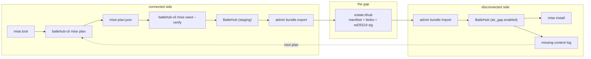
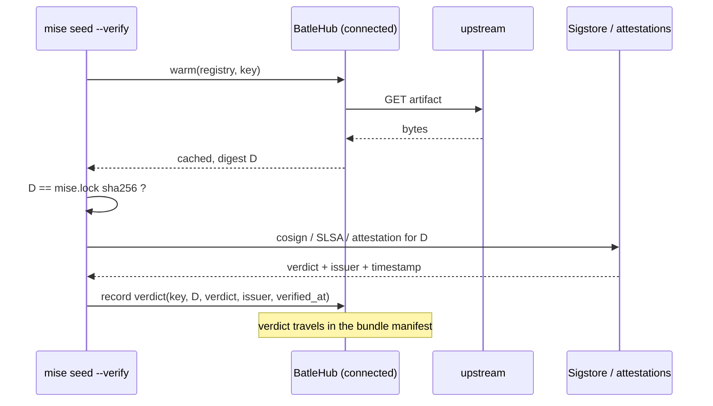
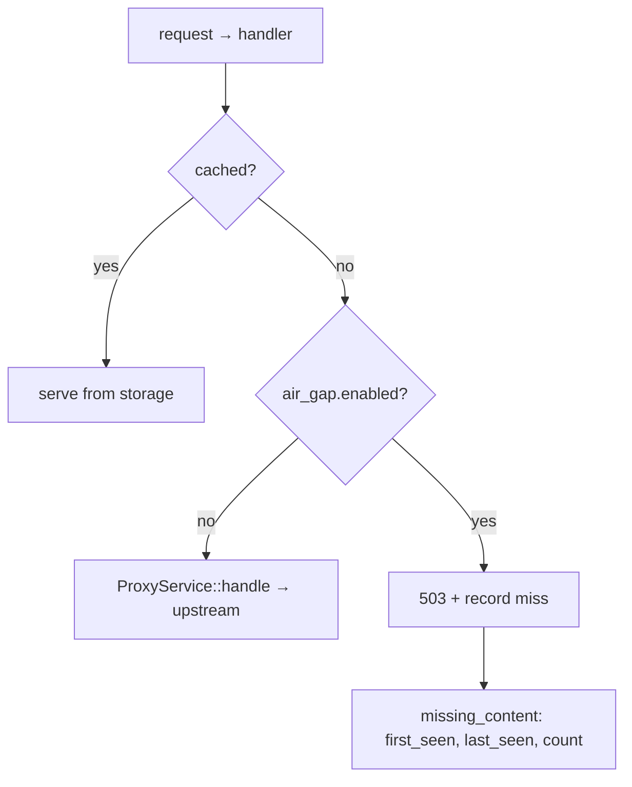

# RFC 0008 — mise in an air-gapped estate

| Field       | Value                                                        |
| ----------- | ------------------------------------------------------------ |
| Status      | **Implemented** — all six phases landed 2026-09-04 (§14), and `tests/heavy/mise.sh` §4 passes: plan, seed, export, import into a second instance running `[air_gap] enabled = true`, then `mise install` completing from the lock with egress denied to both processes. Building it corrected four things this document said about the tree — a storage key is a function of the route and not of the URL, so the server reports the one it used (§14.1); an imported artifact needs the metadata entry that finds it, because metadata resolves before the cache is looked at (§14.2); a forge resolves its ref before it fetches anything, so the resolution has to cross too (§14.4); and `mise.lock` records a quoted platform key and two addresses per asset (§14.5) — and found one defect in shipped code, RFC 0019's release rewrite removing a field the GitHub schema requires (§14.6). §14.8 states what a bundle does not carry: proxied documents, which an `0008-bis` should settle |
| Short       | mise in an air-gapped estate |
| Settles     | Making `mise install` work with no route off the site: `mise.lock` as the bill of materials, a server that will not dial out, and verification moved to the connected side |
| Author      | Max Batleforc <maxleriche.60@gmail.com>                       |
| Co-author   | —                                                             |
| Created     | 2026-08-15                                                    |
| Revised     | 2026-08-17 — re-verified against the tree after RFC 0009 landed: §2.1's settings survey, §2.7, §4.4's ordering question, §6.5's flag name, §10's layer-4 home. 2026-09-02 — §13, four assumptions replaced. 2026-09-04 — §14, what building it found |
| Supersedes  | —                                                             |
| Complements | RFC 0004-bis §13.2 (content-addressable dedup), RFC 0002 (what BatleHub knows about a CVE), RFC 0009 §7.4 (the cached sumdb this RFC's Go case rests on) and §12.16 (the real-client suites §10 reuses) |
| Touches     | `crates/config`, `crates/core`, `crates/adapters`, `crates/web`, `server`, `cli`, `ui`, docs |

---

## 1. Summary

BatleHub already tells people how to point [mise](https://mise.jdx.dev) at it. The Setup Guide has a
`mise` tab, `batlehub-cli registry suggest --mise` reads a project's `mise.lock` and prints a
`[settings.url_replacements]` block, and `docs/registries/generic.md` documents the toolchain
mirrors that block refers to. All of that works, and none of it is an air gap. It is a *restricted
network* story: it assumes the workstation can still reach whatever the rewrite table failed to
mention.

This RFC makes `mise install` work on a host with **no route off the site at all**. It does three
things. It turns `mise.lock` — which already records the exact URL and checksum of every tool, per
platform — into a **plan** that BatleHub can be seeded from and audited against, instead of into
advice. It adds an **`[air_gap]` mode** in which a proxy-mode registry never dials upstream: a miss
fails fast, names itself, and is recorded, so the list of things the next bundle needs is produced
by the estate rather than guessed by an operator. And it moves mise's supply-chain verification —
cosign, SLSA, GitHub attestations, all on by default and all unreachable offline — to the connected
side of the gap, performed once at seed time and recorded as a verdict BatleHub serves, rather than
switched off on every workstation and forgotten.

### Before / after

```text
# today, on a disconnected workstation

$ mise install
mise aqua:EmbarkStudios/cargo-deny@latest ⠋
  … hangs on api.github.com, then fails with a connect timeout.
# The url_replacements block covered api.github.com. It did not cover
# fulcio.sigstore.dev, which aqua.cosign = true reaches before installing.
# Nothing says so. The operator sets MISE_PARANOID=0 and moves on.

# with this RFC, connected side (once):
$ batlehub-cli mise plan --lock mise.lock --platform linux-x64 -o mise-plan.json
28 tools · 41 downloads · 6 registries · 3 hosts with no mirror configured
$ batlehub-cli mise seed --plan mise-plan.json --verify
41/41 fetched · 41/41 checksums match the lock · 38/41 cosign-verified, 3 unsigned
$ batlehub-cli admin bundle export --plan mise-plan.json -o estate.bhub

# disconnected side:
$ batlehub-cli admin bundle import estate.bhub
signature ok (ed25519 f3a9…) · 41 blobs · 0 rejected
$ mise install
mise all tools installed          # no egress, checksums verified from mise.lock

# and when the plan was wrong:
$ mise install some-new-tool
mise ERROR download failed: 503 from batlehub.corp
      not in this instance: github/jdx/mise-tool@v1.2.0
$ batlehub-cli admin air-gap missing
github  jdx/mise-tool@v1.2.0   4 requests   first 2026-08-14  last 2026-08-15
```

---

## 2. Motivation

1. **The rewrite table is hand-assembled, and its failure mode is a hang.**
   `ui/src/config/registryTypes.ts`'s `mise` entry rewrites eight patterns: the GitHub API,
   release-asset downloads, `github.com` archives, `codeload.github.com`, `raw.githubusercontent.com`,
   `registry.npmjs.org` and `static.crates.io`. `mise settings --all` on 2026.8.6 lists 164 settings
   (re-counted 2026-08-17; it was 160 on 2026.8.0 when this was first written, and the point is that
   the number moves), of which at least nine name a *different* host in their default value —
   `go.download_mirror` (`dl.google.com/go`), `go.repo` (`github.com/golang/go`),
   `dotnet.registry_url` (`api.nuget.org`), `pipx.registry_url` (`pypi.org/pypi/{}/json`),
   `python.pyenv_repo`, `ruby.ruby_build_repo`, `ruby.ruby_install_repo`, `ruby.precompiled_url`
   (`jdx/ruby`, a repo shorthand that resolves to GitHub releases), and the two `github.oauth_*_url`s.
   Every one of the nine still holds on 2026.8.6. A URL the table does not match is not an error; it
   is a direct request, and on a disconnected network that is a connect timeout with no attribution.
   There is no way to ask BatleHub whether a table is complete, and no way to make the gap fail loudly.

2. **mise's verification is on by default and has no proxy path.**
   `github_attestations = true`, `github.slsa = true`, `aqua.cosign = true`, `aqua.slsa = true`,
   `aqua.minisign = true`. Those reach Sigstore's Fulcio and Rekor, and GitHub's attestation API.
   BatleHub proxies neither, and a transparency log is not a thing you cache — an offline Rekor
   answer proves nothing about inclusion. So the operator disables verification on every workstation,
   in the one environment whose entire justification is that it verifies things. The verification is
   *possible*, just not there: the connected side can do it once.

3. **Several backends fetch over git, which BatleHub does not speak.**
   asdf plugins, `python.pyenv_repo`, `ruby.ruby_build_repo` and `ruby.ruby_install_repo` are git
   clones. `crates/web` has no smart-HTTP surface — no `info/refs`, no `git-upload-pack` route
   exists. `url_replacements` cannot help: it rewrites the URL, and the rewritten URL is still a git
   endpoint. Today an estate discovers this per-tool, at install time, at the point of use.

4. **Nothing puts content into a disconnected instance.**
   Proxy mode needs an upstream by construction, and `[registries.cache] warm_paths` /
   `warm_packages` warm *from* that upstream — they are a connected-network feature. `ROADMAP.md`
   already records the gap for the estate as a whole ("Instance-to-instance transfer for air-gapped
   estates", still unchecked) and correctly says the only path in today is restoring a full backup,
   which moves the database, the config, and every credential in it. mise is what makes the problem
   tractable rather than open-ended: a mise estate's content is exactly the tools in `mise.lock` —
   finite, enumerable, version-pinned, and checksummed by a file the project already commits.

5. **`mise.lock` is a bill of materials and nothing consumes it as one.**
   `cli/src/api/suggest.rs` reads it and is explicit that it is "the best source there is: it records
   the *exact* URL of every tool the project installs, per platform". It then throws the URLs away
   and emits `[[registries]]` blocks. The same parse, kept, is the manifest of everything the mirror
   must hold — and the checksum against which a seeded copy can be proven byte-identical to what the
   connected side saw.

6. **A miss on a disconnected instance is indistinguishable from a bug.**
   With `serve_stale = true` (the default) and an unreachable upstream, a metadata request degrades
   to stale-or-error and an artifact request to an error whose text is about a connection. The
   operator cannot tell "this was never in the bundle" from "the network is broken", and no record
   accumulates that would make the next bundle better. The feedback loop that would converge an
   air-gapped mirror on completeness does not exist.

7. **What RFC 0009 has since closed, and what it leaves.** This RFC was written before 0009 shipped,
   and three of 0009's outcomes change its scope rather than its argument:

   - **The Go checksum database is proxied and cached** (0009 §7.4, §13.12). A `GONOSUMCHECK`-free
     air-gapped Go build was impossible while a sumdb lookup needed `sum.golang.org`; it now works
     off a cached record, and the signature the client verifies is still the upstream's own. This is
     the one place in the estate where verification genuinely survives the gap without being moved,
     because a transparency-log record is a signed artifact rather than a live service call — which
     is exactly the distinction §3's Sigstore non-goal turns on.
   - **Terraform provider installs no longer reach out at the last step** (0009 §12.8): `shasums`
     and `shasums.sig` were still upstream URLs inside an otherwise-gated download document.
   - **Search degrades to what the registry holds** instead of answering empty (0009 §7.7). An
     air-gapped instance's search stops claiming a package does not exist when it simply cannot ask.

   None of that seeds content, none of it makes a miss diagnosable, and none of it moves mise's
   cosign/SLSA/attestation checks to a side of the gap where they can run. Items 1–6 stand
   unchanged; the *artifact* path is what remains, which is what this RFC is about.

---

## 3. Goals / non-goals

**Goals**

- `mise install` completes on a host with no egress, against a BatleHub that was seeded before the
  gap, using only BatleHub.
- The set of content to mirror is *derived* from `mise.lock` and its platforms, not hand-listed.
- A URL the estate did not plan for fails immediately, locally, naming the host and the coordinate —
  and is recorded, so the next bundle can be complete by construction rather than by iteration.
- Supply-chain verification survives the gap: performed on the connected side where Sigstore and the
  attestation API are reachable, recorded per artifact, and visible on the disconnected instance.
- An operator can answer "is this bundle complete for this lock?" **before** it is carried across,
  and "what did the estate ask for that we did not have?" after.
- Nothing above changes behaviour for a connected instance that does not opt in.

**Non-goals**

- **Proxying Sigstore.** Fulcio and Rekor are not caches; a stale inclusion proof is not a proof. The
  design moves the verification, it does not relay the service.
- **Speaking git.** Three backends (asdf plugins, `pyenv`, `ruby-build`/`ruby-install`) fetch over
  git. Adding a smart-HTTP surface is a large new protocol area for backends that all have an
  HTTP-fetching alternative (`aqua:`, `ubi:`, `core:`). The RFC's answer is to detect them in `mise
  plan` and name them as unsupported, loudly, at planning time rather than at install time.
- **Mirroring GitHub.** The unit is "the artifacts this lock names", not "the hosts they came from".
- **Making mise itself offline-aware.** mise has `offline` and `prefer_offline` settings already;
  this RFC does not propose changes to mise, only configuration of it.
- **A general-purpose instance-to-instance replication protocol.** The ROADMAP item is broader than
  mise. This RFC defines a bundle format sufficient for a planned artifact set and constrains what
  the general case must stay compatible with (§9); it does not attempt live or incremental
  replication.
- **Solving the bootstrap of `mise` itself.** The first mise binary on a disconnected host arrives in
  the base image, not through a mirror that mise is required to reach. §11 keeps this open only for
  the *upgrade* path.

---

## 4. User-facing design

### 4.1 `[air_gap]` — a server that will not dial out

```toml
[air_gap]
enabled              = true    # default false; false is exactly today's behaviour
bundle_trusted_keys  = ["3b1f…"]  # hex ed25519 public keys accepted on import
record_misses        = true    # default true when enabled
miss_retention_days  = 90      # default 90; 0 keeps them until purged by hand
```

When `enabled = true`:

- **No proxy-mode registry attempts an upstream connection.** A cache hit is served exactly as
  today. A miss returns `503` with a JSON body naming the registry and coordinate, rather than a
  connect error some seconds later.
- **`serve_stale` becomes the normal path, not the degraded one.** Cached metadata is served without
  a revalidation attempt; there is nothing to revalidate against. The `serve_stale = false` case
  becomes a hard miss and is reported as one.
- **Cache warming is refused at validation time**, not at run time — `warm_paths` and
  `warm_packages` describe a fetch from an upstream that this mode says will never happen (§4.3).
- **`[proxy]` (the egress proxy section) is refused in the same way.** Both being set is a
  contradiction the operator should see at boot, not discover from a log.

`enabled = false` — the default, and the value in every existing config — leaves every code path as
it is today. This is additive; `CURRENT_CONFIG_VERSION` stays at `1`.

### 4.2 The plan — `mise.lock` as a bill of materials

```console
$ batlehub-cli mise plan --lock mise.lock --platform linux-x64,darwin-arm64 -o mise-plan.json
```

Produces a plan describing every download the locked tools imply, resolved per platform:

```json
{
  "plan_version": 1,
  "generated_from": { "file": "mise.lock", "sha256": "9c1e…" },
  "platforms": ["linux-x64", "darwin-arm64"],
  "entries": [
    {
      "tool": "aqua:EmbarkStudios/cargo-deny",
      "version": "0.18.2",
      "platform": "linux-x64",
      "url": "https://github.com/EmbarkStudios/cargo-deny/releases/download/0.18.2/cargo-deny-0.18.2-x86_64-unknown-linux-musl.tar.gz",
      "registry": { "name": "github", "type": "github" },
      "key": "github/EmbarkStudios/cargo-deny/0.18.2/cargo-deny-0.18.2-x86_64-unknown-linux-musl.tar.gz",
      "sha256": "4f0c…",
      "size": 5439201
    }
  ],
  "unsupported": [
    { "tool": "asdf:mise-plugins/mise-postgres", "reason": "git-fetched backend; no HTTP path through BatleHub" }
  ],
  "unmirrored_hosts": ["binaries.sonarsource.com"]
}
```

Three fields carry the argument of this RFC:

- **`key`** is the storage key the artifact is expected to occupy — a best guess, and §14.1
  records why it can be no more than that: a storage key is a function of the *route*, not of the
  URL, so only the server can name it. The plan's real handle on BatleHub is **`proxy_path`**, the
  path each download takes through it; a plan is therefore a statement about this instance, not
  about a list of URLs. The bundle uses the key the server reports on
  `X-BatleHub-Storage-Key`.
- **`unsupported`** is the git-backend list from §3, produced at planning time. The operator learns
  that `asdf:` tools will not work *before* the bundle is built, and the message names the backend
  rather than the symptom.
- **`unmirrored_hosts`** is every host in the lock for which no registry is configured. It is the
  answer to "is my `url_replacements` table complete?", which today has no answer.

`mise plan` is offline itself: it reads the lock and the server's registry list, and resolves nothing
over the network.

### 4.3 Seeding, exporting, importing

```console
# connected side — fetch every planned entry through BatleHub, prove it matches the lock
$ batlehub-cli mise seed --plan mise-plan.json --verify

# export the planned set as a signed, content-addressed bundle
$ batlehub-cli admin bundle export --plan mise-plan.json --sign-key ./estate.key -o estate.bhub

# disconnected side
$ batlehub-cli admin bundle import estate.bhub
```

`mise seed` drives the **existing** admin warm API (`client.cache_warm(&registry, packages, paths)`)
one entry at a time, then re-reads each artifact and compares its digest to the lock's. `--verify`
additionally runs the upstream verification mise would have run — cosign, SLSA, GitHub attestation —
and records the verdict (§5.2). Its exit status is non-zero if any entry is missing or any digest
disagrees, so it is usable as a CI gate on the connected side.

A bundle is a tar of:

```text
manifest.json          # the plan, plus per-entry verification verdicts and metadata rows
blobs/<sha256>         # content-addressed, so two registries holding the same bytes ship once
manifest.sig           # ed25519 detached signature over manifest.json
```

Blobs are content-addressed rather than key-addressed, which is what makes the format compatible with
the content-addressable dedup of RFC 0004-bis §13.2: `manifest.json` maps keys onto digests, and the
digest is the identity. `import` verifies `manifest.sig` against `air_gap.bundle_trusted_keys` before
reading a single blob, then writes each blob and its metadata rows transactionally.

### 4.4 Behaviour rules

- **A miss is a `503`, not a `404`.** `404` asserts the artifact does not exist, which is false — it
  exists, it is simply not in this instance. `503` also keeps the semantics a client already
  understands as "try later", where "later" is after the next bundle. The body is JSON with
  `registry`, `coordinate` and `bundle_hint`, and the same information goes to the miss log.
- **A miss is recorded once per unique `(registry, key)`,** with a first-seen, last-seen and a
  counter. mise retries; the log must not grow with the retries.
- **The catch-all rewrite.** `mise plan --emit-mise-toml` appends a final rule mapping anything not
  already rewritten onto `{proxy}/_air-gap/unmirrored/…`, which returns `501` naming the host and
  records it alongside the misses. This turns "a host nobody predicted" from a connect timeout into a
  line in the console.

  The behaviour this depends on is **confirmed, measured on mise 2026.8.6 (2026-08-17)**:
  `[settings.url_replacements]` is applied in declaration order, first match wins, and matching
  *stops* at the first hit. A `http:` tool whose URL matches both a specific rule and a
  `^https://(.+)` catch-all reached the specific rule's target when the specific rule was declared
  first, and the catch-all's when the catch-all was — one request either way, never both. Two
  consequences the design has to honour:

  - **The catch-all must be emitted last**, after every typed rule, or it swallows them. `mise plan`
    and `registry suggest` both append it, so the ordering is a property of the generator rather than
    of the operator's editing.
  - **There is no fallback on failure.** The rule that matched is the only URL tried; a `503` from a
    matched registry does not fall through to the catch-all. That is the wanted behaviour — a miss on
    a configured registry is a gap in the bundle (§4.4's `503`), not an unmirrored host (`501`) — but
    it also means a *wrong* typed rule cannot be rescued by the catch-all, which is why
    `unmirrored_hosts` is computed at plan time rather than left to be discovered at install time.

  The catch-all's `$1` carries the host as the first path segment
  (`…/_air-gap/unmirrored/binaries.sonarsource.com/…`), so the recorder sees the host without parsing
  the tail as a URL — which is what keeps §7's "opaque string for logging" rule cheap to hold.
- **RBAC is unchanged.** An air-gapped instance still evaluates `RbacRule` and the rest of the chain;
  offline is not a synonym for anonymous. The `releases:read` grants in the generic-mirror examples
  remain what a workstation needs.
- **Verification verdicts are read-only after import.** A disconnected instance cannot re-run cosign,
  so it serves the recorded verdict and says where it came from — bundle id, key, and the date the
  connected side verified. It never presents a recorded verdict as a live one.

### 4.5 Validation

`AppConfig::validate()` rejects:

| Condition | Rationale |
| --- | --- |
| `air_gap.enabled = true` together with any `[proxy]` or `[registries.proxy]` table | An egress proxy is a route off the site. Both set is a contradiction, and the safe reading (which one wins?) is not obvious enough to pick silently. |
| `air_gap.enabled = true` with any `cache.warm_paths` / `cache.warm_packages` entry | Warming fetches from an upstream this mode guarantees will never be dialled. Failing at boot is better than a startup task that logs a connect error per path, forever. |
| `air_gap.bundle_trusted_keys` entry that is not 32 hex-encoded bytes | The rule `signing.trusted_keys` *should* have and does not (it is parsed at verify time today); this RFC adds it for both fields. An unusable key must not read as "signing is configured". |
| `air_gap.enabled = true` with `bundle_trusted_keys = []` | Import would accept any bundle. An air-gapped instance whose only content path is unauthenticated is worse than one with no content path. |

Warnings (logged and surfaced to the admin):

| Condition | Behaviour |
| --- | --- |
| `air_gap.enabled = true` and a registry is in `local` or `hybrid` mode | Kept and allowed — publishing to a disconnected instance is legitimate. The warning exists because the *hybrid fall-through* can no longer reach upstream, so a hybrid registry behaves as local, and an operator should know that is what they configured. |
| `air_gap.enabled = false` and `bundle_trusted_keys` is non-empty | Kept. Importing a bundle into a connected instance is how the connected side stages one; the warning notes the keys are unused for serving. |
| A registry has no cached content at boot in air-gap mode | Logged once, with the count, and shown on the admin page. An empty registry in this mode answers `503` to everything, and that is worth saying at boot rather than at first request. |

---

## 5. Architecture

### 5.1 Three sides, one plan



The invariant the shape protects: **the plan is the only thing that crosses in both directions.** It
goes across as a manifest inside the bundle, and comes back as a miss list that feeds the next
`mise plan`. Nothing else needs to be carried, and in particular the database, the config and its
credentials do not — which is the specific objection `ROADMAP.md` raises against the
restore-a-backup workaround.

### 5.2 Verification, moved rather than removed



Two properties this preserves across the gap:

- **The checksum is verified on both sides, independently.** `mise.lock` carries the sha256, and mise
  checks it at install time with no network. The seed step checks the same digest against what
  BatleHub actually stored. A bundle that was corrupted, truncated or tampered with in transit fails
  on the disconnected side without reference to anything the bundle itself claims.
- **The signature verdict is verified once, where it can be.** It is then *evidence about a past
  check*, and the design labels it that way everywhere it is shown. That is a real reduction in
  assurance compared to live verification, and pretending otherwise would be the failure mode worth
  avoiding: the alternative in the field today is `MISE_PARANOID=0` and no record at all.

Ed25519 is the only signature BatleHub verifies in-process (`signing.trusted_keys`; the `rsa` crate
is banned by `deny.toml` for RUSTSEC-2023-0071, which rules out PGP and x509). Cosign signatures are
ECDSA over an x509 identity, so BatleHub **records the verdict, not the signature** — it cannot
re-derive one and must not imply it can. Bundle signing itself is ed25519, reusing the existing
verification code and key format.

### 5.3 Where a miss is decided



The decision sits in `ProxyService::handle`, at the point where it would otherwise stream from the
upstream client — after the rule chain, not before. That ordering matters and is deliberate: a
coordinate that RBAC or a `block_list` rule denies must still be denied in air-gap mode, and must not
be recorded as "missing content the next bundle should carry". A blocked package is not a gap in the
mirror.

---

## 6. Detailed design

### 6.1 `crates/config`

- New `AirGapConfig` in `crates/config/src/schema/` (its own `air_gap.rs`, following
  `registry.rs`'s shape): `enabled`, `bundle_trusted_keys`, `record_misses`, `miss_retention_days`,
  all `#[serde(default)]`.
- `AppConfig::validate()` gains the four rejections and three warnings of §4.5. Warnings go through
  the existing warning channel (`crates/config/src/schema/warnings.rs`) so they reach the admin
  surface rather than only the log.
- `CURRENT_CONFIG_VERSION` does not move: the section is additive and absent means today's behaviour.

### 6.2 `crates/core`

- `AirGapPolicy` alongside `RegistryPolicy`, snapshotted from `HotConfig` by the same
  clone-the-`Arc`-before-any-`await` discipline the rest of the proxy path uses.
- `ProxyService::handle` — at the upstream-fetch branch, when the policy is on: return
  `CoreError::ContentUnavailable { registry, key }` instead of dialling, and hand the coordinate to
  the miss recorder. New error variant rather than reusing `NotFound`, because the web layer's
  hybrid fall-through treats `NotFound` as "ask upstream" — the exact confusion RFC 0006's
  `NotFoundWithheld`/`NotFound` split exists to prevent, and reusing it here would reintroduce it.
- New port `MissRecorder` in `crates/core/src/ports/`, with the in-memory and Postgres implementations
  in `crates/adapters`. Recording is fire-and-forget: a failure to record a miss must never turn a
  `503` into a `500`.
- `services/bundle.rs` — the manifest model, the digest/key mapping, and `verify_manifest_signature`,
  which reuses the ed25519 verification already written for `signing.verify_on_download`.

### 6.3 `crates/adapters`

- `missing_content` table + a `mig!` entry in `crates/adapters/src/migrations.rs`, keyed
  `(registry, storage_key)` with `first_seen`, `last_seen`, `count`, `kind`
  (`artifact` | `metadata` | `unmirrored_host`). Upsert increments the counter and moves `last_seen`;
  this is the "recorded once per unique key" rule of §4.4 expressed as a primary key.
- `artifact_attestations` table: `(storage_key, digest, verdict, issuer, verified_at, bundle_id)`.
  One row per digest, not per key — two registries holding identical bytes share the verdict, which
  is the same identity rule the blob store uses.
- Bundle reader/writer: streaming tar, digest-checked on the way in. A blob whose content does not
  hash to its filename is rejected without being written.

### 6.4 `crates/web`

- `503` renderer for `CoreError::ContentUnavailable`, with the JSON body of §4.4.
- `GET /_air-gap/unmirrored/{tail:.*}` — records and returns `501`. **It never fetches anything**;
  it exists to convert an unmatched rewrite into a diagnosable event, and its handler has no HTTP
  client in scope so it cannot become an SSRF surface (§7).
- Admin endpoints, each with a `body = T` in its `utoipa::path` per the OpenAPI contract test:
  `GET /api/v1/admin/air-gap/missing`, `DELETE /api/v1/admin/air-gap/missing`,
  `POST /api/v1/admin/bundle/import`, `GET /api/v1/admin/bundle`.
- Import applies `validate_coordinate` and `ensure_safe_key` to **every** manifest key before writing,
  and re-applies each target registry's `path_allow`. A bundle is untrusted input that names storage
  keys; without this it would be a way to plant content at an arbitrary key, which is precisely what
  the two existing funnels exist to stop.

### 6.5 `cli`

- `batlehub-cli mise plan` — extends `cli/src/api/suggest.rs` rather than duplicating it. The lock
  parser (`collect_from_mise_lock`) already extracts per-tool URLs; the plan keeps them and adds the
  registry/key resolution, the `unsupported` classification from `BACKEND_REGISTRIES` (a backend not
  in that table and not HTTP-fetching lands in `unsupported`), and the `unmirrored_hosts` diff
  against `GET /api/v1/registries`.
- `batlehub-cli mise seed [--verify]`, `admin bundle export|import`, `admin air-gap missing`.
- `registry suggest --mise` gains the catch-all rule in its emitted block, behind
  `--mise-catch-all` (`requires = "mise"`, mirroring the existing `--mise-commented`) so an existing
  user's output does not change shape without asking. `render_mise_toml` grows the flag as a fourth
  parameter (it already takes `regs`, `server_url`, `commented`) rather than a second renderer.

### 6.6 `ui`

- One new admin page, **Air gap**: bundle history (id, signer, imported-at, blob count, rejections),
  the missing-content table (sortable by count, exportable as the input to the next plan), and per
  artifact the recorded verdict with its `verified_at` and bundle id — labelled as a past check.
- `ui/src/config/registryTypes.ts`'s `mise` entry gains the catch-all rule and a note explaining what
  the `501` means, so the Setup Guide and the CLI emit the same block.

### 6.7 docs

- `docs/use/mise.md` — the one home for "point mise at BatleHub", connected and air-gapped. It is
  `use/` and not `registries/`: mise is a client, not a registry protocol. `docs/registries/generic.md`
  and `docs/registries/github.md` keep their one-line pointers and lose nothing else, per the
  one-instruction-one-home rule of RFC 0005-bis.
- `docs/guide/configuration.md` gains the `[air_gap]` section; `docs/operations/` gains the
  bundle runbook (build, carry, import, reconcile misses).

**Deliberately untouched**, so reviewers do not go looking:

- `crates/adapters/src/registry/http_client.rs` — air-gap mode is enforced above the HTTP client, in
  the service. Making the client itself refuse to dial would also break the connected side's seed
  path, which runs through the same code.
- The `[proxy]` egress section — unchanged and still the right answer for a *restricted* network.
  §4.5 only refuses the combination.
- `RegistryKind` — no new variant. mise is a client that speaks GitHub, npm, cargo and plain HTTP,
  all of which already have homes; a `mise` kind would be a protocol that does not exist.

---

## 7. Security considerations

- **The gap does not make content trusted; it makes it unverifiable later.** The design's answer is
  to verify on the connected side and carry the verdict, and to label it as a past check everywhere
  it is displayed. A recorded verdict shown as though it were live would be a claim about the product
  that is not true.
- **Bundles are attacker-relevant input.** They arrive on removable media, by definition from outside
  the instance's trust boundary. Import verifies an ed25519 signature against configured keys
  *before* reading blobs, rejects a bundle with an empty trusted-key list at config validation, and
  digest-checks every blob against its own name. A blob that does not hash to its filename is never
  written.
- **A manifest names storage keys, so it is a path-traversal surface.** `validate_coordinate`,
  `ensure_safe_key` and each registry's `path_allow` all apply to import, exactly as they do to a
  publish. This is the third funnel through the same guards, and deliberately so.
- **`/_air-gap/unmirrored/` must not become SSRF.** It is a recorder and a `501`. Its handler holds no
  HTTP client, and the URL tail is treated as an opaque string for logging — never parsed into a
  request. A test asserts no outbound request results from calling it.
- **Miss records are attacker-writable in one narrow sense.** Any client that can reach a registry can
  cause rows to appear. They are bounded by the `(registry, storage_key)` primary key, subject to
  `miss_retention_days`, and recorded only *after* the rule chain has allowed the request — so a
  denied coordinate never enters the log, and the log cannot be used to enumerate what the instance
  blocks.
- **Air-gap mode does not relax authorization.** RBAC, the block list and the gates run unchanged.
  The mode changes where bytes come from, not who may have them.
- **What an attacker gains from the new surface, if a check is bypassed:** for `/_air-gap/unmirrored/`,
  nothing — it returns a fixed status and writes a bounded row. For import, everything, which is why
  the signature check precedes blob reading rather than accompanying it.

---

## 8. Alternatives considered

| Alternative | Why rejected |
| --- | --- |
| A pull-through proxy in a DMZ, reachable from the enclave | That is a route off the site. It is the `[proxy]` feature that already exists, and it answers a different question — a restricted network, which BatleHub already serves. |
| Ship `~/.local/share/mise` as a tarball per workstation | No provenance, no RBAC, no CVE view, no shared cache; drifts per machine, and does not survive `mise upgrade` or a second project with different pins. It also moves binaries with no record of what verified them. |
| Teach BatleHub git smart-HTTP so asdf/pyenv/ruby-build work | A large new protocol surface, with its own auth and traversal characteristics, for three backends that each have an HTTP-fetching alternative. `mise plan` naming them as unsupported costs one list and no attack surface. |
| A new `mise` `RegistryKind` | mise is not a protocol. The content is GitHub releases, npm tarballs, crates and plain files, all of which have adapters. A `mise` kind would have to delegate to all of them and would own nothing. |
| Vendor the aqua registry into BatleHub so aqua tools resolve offline | Unnecessary: `aqua.baked_registry = true` is mise's default and the registry is compiled into the mise binary. There is nothing to mirror. |
| Serve `404` on a miss instead of `503` | `404` asserts non-existence, which is false and which the hybrid fall-through and the local-registry read path both treat as "ask upstream" — the confusion RFC 0006 spent an RFC separating. |
| Record misses client-side (a mise plugin or wrapper) | Puts the feedback loop on the workstation, where it is per-user, unaggregated, and lost on reimage. The instance is the only place that sees the whole estate. |
| Make the bundle a full database backup | The ROADMAP's own objection: it moves the config and every credential in it, and it cannot express "these approved artifacts" as a unit. |

---

## 9. Rollout and compatibility

- **Default behaviour.** `[air_gap]` absent ⇒ `enabled = false` ⇒ every path behaves exactly as
  today. The CLI subcommands are additive; `registry suggest`'s output only changes under an explicit
  `--catch-all`.
- **Config migration.** None. `CURRENT_CONFIG_VERSION` stays `1`.
- **Operator prerequisites.** An ed25519 keypair for bundle signing, held on the connected side, with
  the public half in the disconnected instance's `air_gap.bundle_trusted_keys`. Storage sized for the
  planned set — toolchain tarballs are large, and `limits.max_artifact_size_bytes` (default 500 MiB)
  usually needs raising, as `docs/registries/generic.md` already warns.
- **Rollback.** Setting `enabled = false` restores upstream fetching immediately; nothing about the
  mode is persisted. Imported content is ordinary cached content and survives — an instance that
  regains a network keeps everything the bundle gave it and starts filling misses from upstream.
- **Compatibility with the ROADMAP item.** This RFC implements the mise-shaped slice of
  "instance-to-instance transfer" and constrains the general case: blobs are content-addressed by
  sha256 (so RFC 0004-bis §13.2's dedup is the same identity), the manifest maps keys onto digests,
  and the signature covers the manifest rather than the tar. A future general bundle should extend
  `manifest.json` with more row types, not replace the container.

---

## 10. Test plan

- **Unit** (`crates/config/src/schema/tests.rs`): each §4.5 rejection and warning, including
  `air_gap` + `[proxy]`, `air_gap` + `warm_paths`, and an empty trusted-key list.
- **Unit** (`crates/core/src/services/proxy/`): `handle` in air-gap mode returns
  `ContentUnavailable` and does not touch the registry client (a `FixedRegistry` double that panics
  on call proves it); a coordinate denied by the rule chain is denied *and not recorded*.
- **Unit** (`crates/core/src/services/bundle.rs`): manifest signature accept/reject, blob digest
  mismatch, and a manifest whose key fails `validate_coordinate`.
- **Integration** (`crates/web/tests/air_gap.rs`, new file per the one-file-per-area convention):
  cached hit still serves; miss returns `503` with the documented body; the miss appears once for
  four requests with `count = 4`; `/_air-gap/unmirrored/` returns `501` and records; import rejects
  an unsigned bundle, a bundle signed by an untrusted key, a blob with a bad digest, and a manifest
  key containing `..`; a hybrid registry in air-gap mode does not fall through.
- **Integration** (`cli/tests/integration.rs`): `mise plan` against a fixture `mise.lock` produces
  the expected entries, classifies an `asdf:` tool as unsupported, and lists a host with no registry
  under `unmirrored_hosts`; `bundle export` → `import` round-trips against the in-process server.
- **External** (`crates/adapters/tests/pg_air_gap.rs`, via `task test:pg-*`): the `missing_content`
  upsert counter and `miss_retention_days` purge against real Postgres.
- **Real client** (`tests/heavy/mise.sh`, joining the suites RFC 0009 §12.16 built, on
  `tests/heavy/lib.sh` and the `http_tap.py` transcript): seed, export, import into a second instance
  configured with `air_gap.enabled = true`, then `mise install` **with no route off the host**, and
  assert on the wire that every request landed on BatleHub. This is the end-to-end signal that §1's
  claim is true, and it belongs here rather than in `crates/examples/tests/smoke.rs` — that suite
  provisions toolchains with `mise install` against real upstreams (its layers 2 and 3), which is the
  opposite of the condition under test. 0009's own argument applies directly: a transcript run once by
  hand is not a check, and the six bugs §12.16 found were found by scripting it.
  `task test:heavy` runs it locally; CI's `heavy-client` matrix gets a `mise` entry.
- **The negative half of that test is the assertion.** Egress is denied for the run (no route, not a
  mocked upstream), so a rewrite rule this RFC's plan failed to emit fails the suite instead of
  quietly succeeding through the workstation's real network — the failure mode that makes an
  air-gapped claim untestable on a connected developer machine.
- **Existing suites that must pass unchanged**: `crates/web/tests/blocked_versions_hidden.rs` and the
  local-registry suites (the `NotFound`/`AccessDenied` distinction must not shift under a third error
  variant), `crates/web/tests/openapi_contract.rs` (the new endpoints all declare bodies), and the
  full `cargo test --workspace` with `[air_gap]` absent, which is the regression signal that the
  default path is untouched.

---

## 11. Decisions and open questions

### Resolved

| # | Question | Decision |
| --- | --- | --- |
| 1 | New `RegistryKind` for mise? | **No.** mise is a client, not a protocol; its content already has adapters. |
| 2 | Relay Sigstore through BatleHub? | **No.** A transparency log is not a cache; verify on the connected side and carry the verdict. |
| 3 | `404` or `503` on an air-gapped miss? | **`503`.** `404` asserts non-existence and is what the hybrid fall-through acts on. |
| 4 | Blob identity in the bundle | **sha256 content address**, so dedup (RFC 0004-bis §13.2) is the same identity and duplicate bytes ship once. |
| 5 | Bundle signature algorithm | **ed25519.** The `rsa` ban (RUSTSEC-2023-0071, enforced by `deny.toml`) rules out PGP/x509, and the verification code already exists for `signing.trusted_keys`. |
| 6 | Store the cosign signature or the verdict? | **The verdict.** BatleHub cannot verify ECDSA/x509 in-process, so storing the signature would imply a capability it does not have. |
| 7 | Where the miss check sits relative to the rule chain | **After.** A blocked coordinate is not missing content, and must not be proposed for the next bundle. |
| 8 | Does mise apply `[settings.url_replacements]` in declaration order, first match wins? | **Yes — declaration order, first match wins, and matching stops at the first hit.** Measured on **mise 2026.8.6 linux-x64 (2026-08-17)**: one `http:` tool whose URL matches both a specific rule and a `^https://(.+)` catch-all was fetched through whichever of the two was declared first, and only that one — one request per run, never a second attempt through the other rule. So the catch-all works, provided the generator emits it last (§4.4), and the deny-list-of-known-hosts fallback this question held in reserve is not needed. |
| 9 | Is the RFC 0009 dependency real, and is it discharged? | **Real, and discharged.** The Go case was blocked on an uncacheable sumdb lookup and the Terraform case on upstream `shasums` URLs; 0009 §7.4/§13.12 and §12.8 closed both (§2.7). Nothing 0009 landed seeds content or diagnoses a miss, so the scope here is unchanged. |

### Still open

Closed on 2026-09-02; the decisions are in §13.

1. ~~**Per-platform plans.**~~ `--platform` explicit, default the planning host's, `all` opt-in (§13).
2. ~~**How the mise binary itself is upgraded across the gap.**~~ `plan --include-mise` (§13).
3. ~~**Miss-log granularity for metadata.**~~ One table, one `kind` column, capped (§13).
4. ~~**Whether `mise seed --verify` should fail the run on an unsigned artifact.**~~ The registry's `[security]` decides; no `--require-signed` (§13).

---

## 12. Implementation phases

| Phase | Content |
| --- | --- |
| 1 | `[air_gap]` config, validation, `ContentUnavailable` → `503`, miss recording, admin list/purge endpoints. **Useful alone**: it turns a disconnected instance from "hangs mysteriously" into "says what it lacks", with no bundle format at all. |
| 2 | `batlehub-cli mise plan` — plan file, `unsupported` and `unmirrored_hosts` classification, `registry suggest --mise-catch-all`, `/_air-gap/unmirrored/`. **Useful alone**: answers "is my rewrite table complete?" for connected estates too. |
| 3 | `mise seed [--verify]` and the attestation store — connected side only, no bundle yet. |
| 4 | Bundle format, export, import, signature verification, and the traversal/`path_allow` guards on import. |
| 5 | The Air gap admin page and `docs/use/mise.md` + the operations runbook. |
| 6 | `tests/heavy/mise.sh`: seed → export → import → `mise install` with egress denied, on RFC 0009's harness and in the `heavy-client` matrix, as the standing proof of §1. |

---

## 13. Revision against the tree (2026-09-02)

The header still says "ready to schedule". Re-read against the tree after
RFC 0015, 0016, 0018 and 0019, four load-bearing assumptions no longer hold,
and this section replaces them. Nothing of the six phases has started, so no
shipped behaviour is affected.

**Corrected in place.** RFC 0006's variant is `NotFoundWithheld`, not
`AccessDenied`. `render_mise_toml` already takes three parameters. The
`signing.trusted_keys` hex validation §4.5 cites does not exist; it is added
here for both fields. `docs/use/mise.md` is a page this RFC creates, not one
it edits; the pointers that exist are in `docs/registries/generic.md` and
`docs/registries/github.md`.

**Four assumptions that moved.**

1. *"The decision sits in `ProxyService::handle`, at the upstream-fetch
   branch."* There are two artifact fetch sites (`handle.rs` and
   `proxy/cache.rs`, both through `fetch_artifact_or_record_error`) and five
   other dial-outs `handle` never sees: the passthrough rungs (npm audit,
   sumdb), metadata resolution, `upstream_detail` (already warned as
   air-gap-relevant in `warnings.rs`), warming and README fetch. **Decision:**
   "never dials" is enforced where clients are *built* — `server/src/builders.rs`
   wraps every `RegistryClient` of an `air_gap.enabled` instance in an
   `OfflineRegistryClient` that answers `ContentUnavailable` to every call.
   Every path inherits it; §6.7's "seeding runs through the same code"
   objection is void because seeding runs on the connected instance.
2. *"`serve_stale` becomes the normal path for cached metadata and
   artifacts."* `serve_stale` is metadata-only (`serve_stale_metadata`);
   artifacts have no stale path, a cached artifact is a plain hit and a miss
   is the 503. §4.1 is amended to say so.
3. *Identity.* §4.2 keys every plan entry on the lock's sha256 and the
   `artifact_storage_key`. RFC 0019 decision 9 keys forge archives and raw
   files on the **commit SHA** (forge tarballs are not byte-stable) and
   rewrites the `PackageId` so the cache key is
   `{registry}/{o}/{r}/{sha}/…`. A plan built on the lock's sha256 would fail
   `mise seed --verify` on every recompressed archive. **Decision:** identity
   is per kind — content sha256 for release assets, npm, cargo, pypi; commit
   SHA for `tarball`/`zipball`/`raw` — and the bundle manifest carries the
   `ref → commit` rows so the disconnected instance can answer a ref without
   resolving it (0019's TTLs are frozen under `air_gap.enabled`). `[raw]`
   must be enabled on the disconnected side for the `raw.githubusercontent.com`
   rewrite to work; the runbook says so.
4. *Verification.* `artifact_attestations` duplicates RFC 0018's
   `artifact_verdicts`/`artifact_findings`. **Decision:** the table is dropped.
   `mise seed --verify` runs the 0018 pipeline on the connected instance and
   the bundle carries verdict and finding rows; import upserts them with
   `policy_ref` naming the connected-side policy, and the disconnected instance
   runs 0018's offline profile (`["osv"]` against a mirror plus offline
   postmortem). An imported blob with no verdict on an instance with
   `[security]` is `SCAN_PENDING`, fail-closed, as 0018 intends.

**The four open questions, closed.**

| # | Question | Decision |
| - | -------- | -------- |
| 1 | Per-platform plans | `--platform` explicit; default is the planning host's; `--platform all` opt-in. Same shape as RFC 0010 decision 11 (`warm_platforms`). |
| 2 | Upgrading mise across the gap | `mise self-update` reads `api.github.com/repos/jdx/mise/releases`, which the github rule already rewrites and RFC 0019 phase 3 link-rewrites; `plan --include-mise` adds `github:jdx/mise@<current>` so a bundle always carries the binary that reads the next plan. |
| 3 | Miss-log granularity | One table, one `kind` column (`artifact`, `document`, `checksum`, plus `ref` for a forge ref not in the bundle), matching 0018's single verdict table with codes. Rows are capped per registry with LRU purge and `miss_retention_days` — the cardinality was unbounded and attacker-writable. |
| 4 | `--verify` on an unsigned artifact | Not this RFC's knob. Strictness is the registry's `[registries.security]` (`require_provenance`); `seed --verify` exits non-zero on a `denied` verdict and reports `PROVENANCE_MISSING` as a count. |

**Coverage, stated.** RFC 0010 covers `nodedist` and `sdkman`. mise's `core:`
backends for go (`dl.google.com`), python (python-build-standalone) and ruby
have no kind; they are `generic` or `unmirrored_hosts`, and the CLI's
`BACKEND_REGISTRIES` needs `core:` rows saying which. The two generators of the
mise snippet (`cli/src/api/suggest.rs`, nine rules including openvsx, and
`ui/src/config/registryTypes.ts`, three) already disagree; phase 1 makes one
the source of the other. And the catch-all `^https://(.+)` rule rewrites
BatleHub's own URLs when an operator has already pointed a backend at the proxy
— an identity rule for the proxy host precedes it, and `mise.sh` tests that.

**Ordering, as a constraint.** RFC 0019 phase 1 (SHA-keyed cache) before this
RFC's phases 2 and 4; RFC 0018 phase 1 (verdict model) before phase 3; RFC 0010
before all of it, for the toolchain-coverage reason the index gives.

---

## 14. Landed (2026-09-04)

All six phases are built on `feat/idk` and measured. The design held; five
things it said about the tree did not, and each was found by a test rather
than by a re-read. They are recorded below because four of them are the kind
of mistake this RFC's own §13 exists to catch, and the fifth is a defect this
work found in shipped code.

**What is there.** `[air_gap]` with the four rejections and two warnings of
§4.5 (`crates/config/src/schema/air_gap.rs`, `validate_air_gap`); the refusal
enforced where clients are *built*, per §13 decision 1
(`registry/offline.rs`, wired in `server/src/builders.rs`);
`CoreError::ContentUnavailable` rendered as the `503` of §4.4; the miss log
and the bundle history as ports, in-memory and Postgres adapters, and
migrations 056/057; `GET`/`DELETE /api/v1/admin/air-gap/missing`,
`GET /_air-gap/unmirrored/{tail}` → `501`, `POST /api/v1/admin/bundle/import`
and `GET /api/v1/admin/bundle`; `batlehub-cli mise plan|seed|export|import`
and `registry suggest --mise-catch-all`; the bundle format in
`core/services/bundle.rs`; the Air gap console page; `docs/use/mise.md`, the
[air-gap runbook](/operations/air-gap) and configuration §3.12; and
`tests/heavy/mise.sh` §4, which plans, seeds, exports, imports into a second
instance running `[air_gap] enabled = true` and installs through it with
egress denied to both processes.

### 14.1 A storage key is a function of the route, not of the URL

§4.2 says a plan names "the storage key the artifact will occupy, derived by
the same `artifact_storage_key(registry, name, version)` the proxy and
local-registry paths already share". Neither half is true of the proxy path.
`artifact_storage_key` is the *local-registry* key (`local:…`); the proxy
writes `artifact:{PackageId::cache_key()}`, and the coordinate in it is built
by the **handler**, differently per route: npm's tarball is
`…/{name}/{version}/tarball`, a GitHub asset by name is
`…/{tag}/filename/{file}`, the same asset by id is `…/unknown/{id}`, a
generic mirror is `…/repo/_/{path}`, and a forge archive is keyed by its
commit. §4.2's own example key is none of these.

A bundle whose keys were derived from the download URL imports cleanly,
reports its blobs written, and answers `503` for every one of them forever.

**Decision: the server reports the key it used.** Every artifact response
carries `X-BatleHub-Storage-Key`, and `ProxyResponse::ForgeStream` now
carries the commit-keyed coordinate so the header is right for an archive
too. `mise export` writes what the header said into the manifest and falls
back to the plan's derived key only when talking to a server too old to send
one, saying so in a `skipped` line.

Two more headers ride with it — `X-BatleHub-Package` and
`X-BatleHub-Version` — because the key cannot be read back into a coordinate:
a name may contain slashes, so `gh/cli/cli/v2.60.0/filename/gh.tar.gz` splits
four plausible ways and only one is right. The import needs the coordinate,
not just the key, for the verdict row of §14.3: a coordinate guessed wrong
files the judgement against a package nobody will ever ask about, which looks
exactly like the verdict having been lost. The alternative — a second routing table
in the CLI — is a table that drifts, and the discovery here is what drift
looks like. The header discloses nothing: every segment of the key is in the
URL the caller asked for. `crates/web/tests/air_gap.rs` asserts the header
against the store, so a route that reports the wrong key fails there rather
than on a disconnected estate.

### 14.2 An imported artifact needs the entry that finds it

`ProxyService` resolves metadata **before** it looks at the artifact cache.
On an air-gapped instance that resolve has no upstream to ask, so a bundle
that carried only bytes would import cleanly and serve none of them — §4.1's
"a cache hit is served exactly as today" is true of the artifact and not of
the lookup that reaches it.

**Decision: import writes the metadata entry too.** The two are one
coordinate under two prefixes (`artifact:` and `meta:`), which is why one
reported key is enough for both. `published_at` is deliberately `None`: this
instance knows when the bundle was made, not when the upstream published, and
dating an artifact by its import would make every age gate read `fresh`. The
judgement that *did* have the date is the carried verdict.

The entry expires at once on a **connected** instance and never on a
disconnected one. §4.5's second warning is the case: a connected instance
imports bundles to stage them, and there an import that pinned a metadata
answer would beat the upstream that can give a better one.

### 14.3 The verdict crosses, and only in one direction

§13 decision 4 is built: `mise export` asks the connected instance for each
entry's verdict, and import upserts a row whose `policy_ref` is
`bundle:<id>` — never a local policy, so nothing here can read as a check
this instance made.

*Asked for*, not read off the response, and the difference is the whole
point. RFC 0018's headers say something only when there is something to say:
a hold or a warning. An `allowed` verdict is silent on the wire — and silence
is exactly the case that has to cross, because it is the one that lets the
disconnected instance serve. An export built on the headers alone would carry
the verdicts for artifacts it should not be shipping and none for the ones it
should.

**Only a served state crosses.** `allowed` and `warned` are evidence a
disconnected instance may act on. `denied` and `quarantined` are dropped: a
bundle is signed by whoever holds the key, and a signer who could write a
refusal into this instance's verdict table could refuse any package on it.
A bundle may carry evidence that something was allowed; it may not carry an
order to refuse.

### 14.4 A forge resolves a ref before it fetches anything

§13.3 said the bundle carries the `ref → commit` rows and that 0019's TTLs
are frozen under `air_gap.enabled`. Both are built, and neither is optional:
a forge coordinate resolves its ref *first*, so a disconnected instance
without the resolution refuses every coordinate in the bundle it just
accepted — including the ones whose bytes it is holding. An expired row would
do the same, because an expired row falls through to the forge, which is not
there.

The export reads the pair off the response — `X-BatleHub-Ref-Kind`,
`X-BatleHub-Resolved-Commit`, and a new `X-BatleHub-Ref-Requested`, which is
the only place the asked-for name survives on a commit-keyed archive, where
the coordinate has already become the SHA — and the import upserts it into
the resolution table.

Frozen means "do not re-ask", not "answer anyway": a ref this instance has
never resolved is still refused. What it holds it serves; what it has never
seen is a gap in the bundle, recorded under the `ref` kind.

It applies to a release *asset* too, not only to an archive: 0019 §4.2 keys
an asset's cache on the tag but still resolves that tag, so a moved tag is
recorded. The heavy suite therefore asserts the row in the **manifest**
rather than on the disconnected instance — the two share a database there, so
the instance would find the connected side's resolution whether the bundle
carried one or not. The bundle is the thing under test.

### 14.5 What the lock really looks like

Three corrections to the plan, all from reading `mise.lock` as `mise lock`
writes it rather than as §4.2 imagines it:

- **The platform is a quoted key**, `[tools.X."platforms.linux-x64"]`, which
  parses as one key literally named `platforms.linux-x64` on the tool table.
  Read naively, `--platform linux-x64` matched nothing and planned an empty
  bundle for a lock full of tools.
- **A release asset has two addresses.** The lock records `url` *and*
  `url_api`, and the `aqua:`/`github:` backends usually fetch the second.
  Both are planned; they are one artifact, they share a digest, and the
  bundle carries a single blob under two keys.
- **`proxy_path_for` dropped the type segment** for the path-addressed kinds,
  so a `generic` plan seeded 404s — while the rewrite rules it emits
  alongside had the segment. Both now come from one function.

§13 decisions 1 and 2 are built as stated: `--platform` defaults to the
planning host's with `all` opt-in (plus a guard — a host the lock has nothing
for plans everything and says so, rather than writing an empty bundle), and
`--include-mise` carries `github:jdx/mise@<current>`. The identity rule §13
requires ahead of the catch-all is emitted: without it the catch-all rewrites
BatleHub's own URLs into the `501` sink and turns a working registry into an
"unmirrored host".

### 14.6 A defect this found in shipped code

RFC 0019 phase 3's release-document rewrite removed each asset's `url` field,
on the argument that it points at the forge's own asset endpoint and is "a
working way around every rule above". `url` is a **required** field of an
asset in the GitHub API's schema, and a client that deserializes strictly
fails on the whole release list rather than on one asset. mise does: every
`mise install` through a BatleHub github registry answered `missing field
\`url\`` from the moment 0019 phase 3 landed until this suite measured it.

This proxy *does* have an equivalent — `releases/assets/{id}` is a route it
serves, under the same rules as every other artifact — so the field is now
repointed there rather than deleted. The bypass stays closed and the document
stays readable. It is the argument for phase 6 in one line: the rule was
written, reviewed and unit-tested, and the only thing that could catch it was
a real client.

### 14.7 Two smaller things

`§4.5`'s third warning — a registry with nothing cached, which answers `503`
to everything — is logged once at boot **and** recomputed by the missing
endpoint as `empty_registries`, so it stays true after the first import
rather than freezing what was true at startup. And `mise import` reports the
server's refusal instead of decoding it as a success shape; it used to answer
`missing field \`bundle_id\`` to every rejection, which named nothing.

### 14.8 What is not carried

**Documents.** A bundle carries artifacts and the metadata entry that finds
them; it does not carry proxied *documents* — a release listing, a packument,
a flat index.

This is why the lock is the bill of materials, and it was measured rather
than assumed — on mise 2026.8.6, by pointing every rewrite rule at a closed
port and reading which URLs the client attempted:

| Install | URLs attempted |
| --- | --- |
| `mise install github:cli/cli@2.60.0`, no lock | `/releases?per_page=100` first — the version string is a query |
| the same tool from `mise.lock` | the asset download URL, and nothing else |

A disconnected instance cannot answer a query, so the first is a correct
`503`; the second resolves nothing, because the lock already holds the URL and
the checksum, and takes the artifact the bundle carried. §1's claim is about
the second, and §4.2's first sentence says so.

So it is a gap only for a client that resolves through a listing on the
disconnected side, and the miss log's `document` kind is exactly where that
shows up: the estate is told what it asked for and did not get, which is what
turns the next bundle into a list rather than a guess. An `0008-bis` should
decide whether a bundle carries documents or a disconnected instance answers
listings from what it holds; neither is attempted here, and §12's phases are
complete without it.

**Sigstore, and what actually replaces it.** §2's second motivation lists five
verifiers mise runs by default. Turning them off one at a time on the
disconnected side reproduces that section rather than arguing it:

| With | The locked install stops at |
| --- | --- |
| everything default | `api.github.com/repos/…/attestations` — the attestation API |
| `github_attestations = false` | SLSA provenance, which fetches the release *document* and gets §14.8's `503` |
| all five off | download, checksum, install |

The checksum in `mise.lock` is verified locally throughout: it is the one
check that needs nothing but the bytes, and it is why an air-gapped install is
not an unverified one. The suite sets all five off, which is what §2 says
operators already do.

What §5.2 promised in its place is a verdict made where the check *can* run.
Half of that is built: `mise seed --verify` reads BatleHub's own RFC 0018
verdict, the bundle carries it, and the import files it (§14.3). The other
half is not: **nothing runs cosign, SLSA or the attestation API at seed time**.
§5.2's sequence diagram shows the CLI doing so; §12 phase 3 scoped it as "the
attestation store", and §13 decision 4 replaced that store with 0018's verdict
rows without saying who fills them with *those* checks. Today a disconnected
estate turns mise's verification off and gets 0018's judgement instead, which
is a real answer and a narrower one than §1 implies. Closing the difference is
0018's scanner work — `sigstore.rs` exists — pointed at seed time, and it
belongs with the `0008-bis` above rather than in a footnote here.

**Measured, not assumed.** `tests/heavy/mise.sh` §4 is the standing proof of
§1, and it passes: plan, seed, export, a second instance under
`[air_gap] enabled = true`, a `503` that names itself before the import, the
import, 13 MB served out of the read path, and `mise install` completing from
the lock with egress denied to both processes. Two honest bounds on it are
stated in the script.

The runner's kernel routing is untouched, so egress is denied to the two
processes under test — the server by `[air_gap]` itself, mise by a proxy
pointed at a closed port — rather than to the host. That is the strongest
form available in a job that has to reach GitHub in section 1 to have
anything to carry across in section 4.

And the two instances share one `DATABASE_URL`, because the heavy suites
have one. The bytes and the refusal are still real — the metadata cache is
in-process and the storage directories are separate — but the storage
router's inventory is a table in that shared database, so the disconnected
instance can *see* rows for keys it does not hold. Anything asserting what it
reports holding is therefore asserted in `crates/web/tests/air_gap.rs`
instead, where the store belongs to one app. A real pair shares nothing, and
finding this took a failing assertion rather than a re-read: the fixture had
been described in its own comment as costing nothing.
