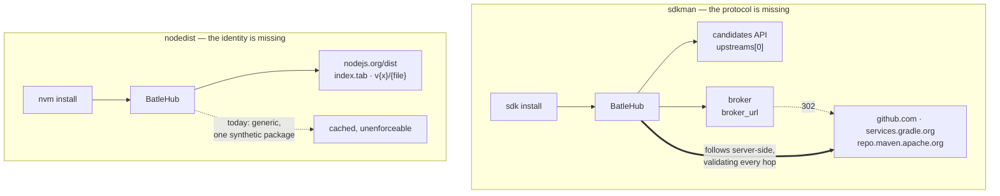
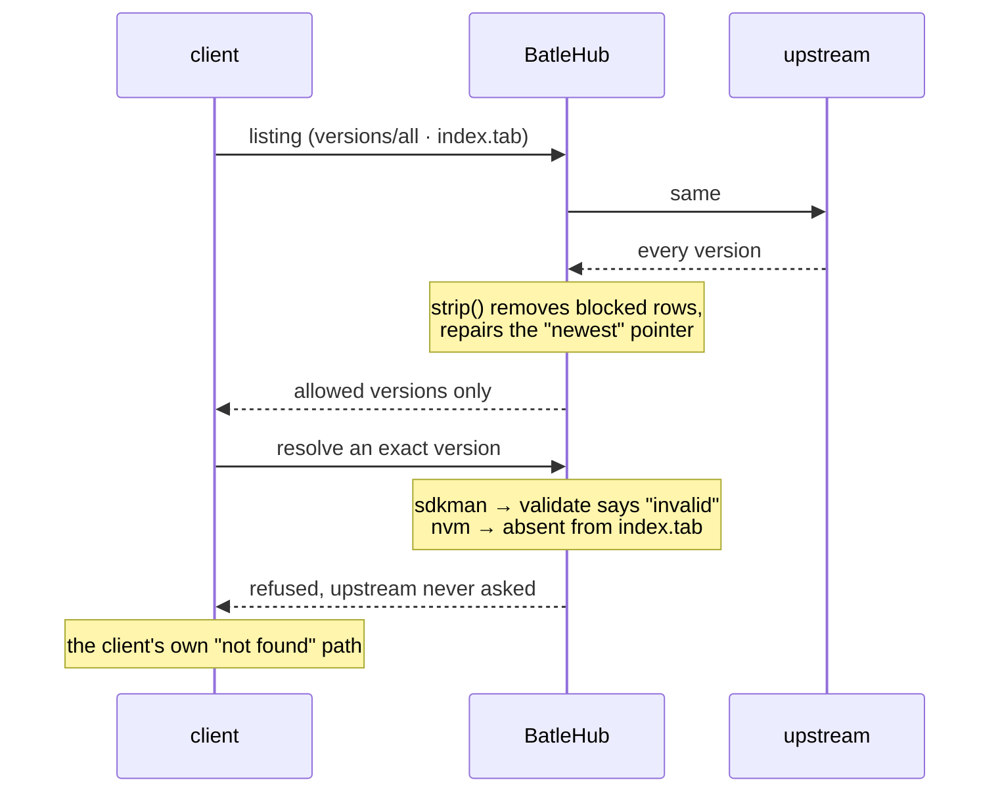

# RFC 0010 — The toolchain layer: SDKMAN and nvm

| Field       | Value                                                        |
| ----------- | ------------------------------------------------------------ |
| Status      | **Implemented** — all nine phases of §12 landed: `nodedist` on 2026-09-03 (§13.1, phases 1–4, `tests/heavy/nvm.sh`) and `sdkman` on 2026-09-04 (§13.2, phases 5–9, `tests/heavy/sdkman.sh`), each proven by its own heavy suite before it shipped. Every open question was resolved before implementation (§11), two of them against this document's own first draft: SDKMAN's rendered version table is filtered rather than exempted, and an unknown publish date is the operator's explicit choice rather than a hard-coded allow |
| Short       | The toolchain layer |
| Settles     | Proxying the JDK and the Node runtime themselves, not only what they build: SDKMAN and the `nodejs.org/dist` tree as registry kinds, and making a blocked toolchain a refusal rather than a claim |
| Author      | Max Batleforc <maxleriche.60@gmail.com>                       |
| Co-author   | Claude Opus 5 (1M context) <noreply@anthropic.com>            |
| Created     | 2026-08-18                                                    |
| Supersedes  | —                                                             |
| Touches     | `crates/core`, `crates/config`, `crates/adapters`, `crates/web`, `server`, `cli`, `ui`, `docs` |

---

## 1. Summary

A BatleHub instance can proxy every Maven artifact a JVM build resolves, and
none of the JVM it resolves them with. It can proxy every npm package a Node
build installs, and not the Node. The toolchain layer — the JDK, Gradle, the
Kotlin compiler, the Node runtime itself — sits *underneath* everything this
project already mediates, and reaches a developer's machine from
`api.sdkman.io` and `nodejs.org` without passing anything BatleHub owns.

This RFC adds two proxy-only registry kinds:

- **`sdkman`** — the SDKMAN API, for JVM toolchains. A protocol BatleHub does not
  speak at all today.
- **`nodedist`** — the `nodejs.org/dist` file tree, for Node. A tree BatleHub
  already mirrors as `generic`, and cannot enforce a single policy on.

They are different problems with one thesis. SDKMAN needs an adapter because the
protocol is missing. nvm needs one because the *bytes already flow* — the
`generic` kind mirrors `nodejs.org/dist` today, and its own documentation uses
that as the worked example — while a blocked Node version remains a row in the
admin console that nothing enforces. Serving the bytes was never the hard part.

### Before / after

```text
# today — the toolchain is the layer that goes straight out
$ sdk install java 21.0.5-tem
  → api.sdkman.io   → broker.sdkman.io  302 →  github.com/adoptium   (200 MB, direct)
$ nvm install 22.11.0
  → nodejs.org/dist/index.tab  →  nodejs.org/dist/v22.11.0/…         (direct)
#   …or through a `generic` registry, which caches the bytes and enforces nothing.

# with this RFC
$ export SDKMAN_CANDIDATES_API=https://batlehub.example.com/proxy/sdkman/sdkman
$ export SDKMAN_BROKER_API=https://batlehub.example.com/proxy/sdkman/sdkman/broker
$ export NVM_NODEJS_ORG_MIRROR=https://batlehub.example.com/proxy/node/nodedist

$ sdk install java 17.0.20-tem      # administratively blocked
  Stop! 17.0.20-tem is not a valid java version.
$ nvm install 22.11.0               # administratively blocked
  Version '22.11.0' not found - try `nvm ls-remote` to browse available versions.
```

Both refusals are the client's own message on its own error path. Neither
required a patched client: SDKMAN and nvm both read their base URLs from
environment variables they already consult.

---

## 2. Motivation

1. **The toolchain is the last unproxied layer.** RFC 0009 made BatleHub serve
   what Maven, Gradle, npm and Bundler actually request. All of them run *on* a
   runtime no BatleHub instance has ever seen. An operator who has blocked a
   CVE-bearing library and cannot block a CVE-bearing JDK or a Node release has
   covered the smaller of the two.

2. **For Node, the bytes already flow and the policy does not.** A `generic`
   registry pointed at `nodejs.org/dist` caches every tarball — the worked
   example in `docs/registries/generic.md` is literally that. But `generic_get`
   (`crates/web/src/handlers/proxy/generic.rs:57`) builds
   `PackageId::new(reg, "repo", "_")`: one synthetic package, no version, no
   identity. So `index.tab` is relayed unfiltered, no Node version can be
   blocked, nothing appears in explore, and per-version statistics do not exist.
   This is the more dangerous of the two gaps, because the cache working makes it
   look solved.

3. **For the JVM, the protocol is simply absent.** `generic` gets closer than
   expected — I verified a complete `sdk install` through two `generic`
   registries — and then `sdk list java` returns **400**, because `generic_get`
   takes only a path and SDKMAN's `versions/list` requires `?current=&installed=`.
   The stopgap is real, is documented in §9, and is not the feature.

4. **A block on a toolchain is currently a claim, not a control.** RFC 0006 §1
   set the standard that a blocked version is hidden from *every* listing an
   ecosystem serves. Between them these two managers have six documents that
   name versions — SDKMAN's `versions/all`, `candidates/default`, the rendered
   `versions/list` and `validate`, and Node's `index.tab` and `index.json` — and
   BatleHub filters none of them.

5. **The broker's redirect is egress that survives an air gap.**
   `broker.sdkman.io/download/…` answers `302` to a third-party CDN
   (`github.com`, `repo.maven.apache.org`, `services.gradle.org`,
   `groovy.jfrog.io` — four different hosts across the seven candidates I
   sampled), and `__sdkman_secure_curl_download` passes `--location`, so the
   *client* follows it. An estate that has closed egress everywhere else finds
   out at the moment it provisions a build agent. RFC 0008 §2 made this argument
   for `mise`; this is the rest of it.

6. **`.nvmrc` and `.sdkmanrc` are bills of materials nobody reads.** One is a
   single line naming a Node version or alias; the other is `candidate=version`
   pairs. Both pin exactly what a repository builds with, both are already in the
   repositories, and `batlehub registry suggest` already scans `mise.toml` and
   `mise.lock` for the same purpose. §6.9 warms from them.

---

## 3. Goals / non-goals

**Goals**

- `sdk install`, `sdk list`, `sdk use`, `sdk default` and `sdk upgrade`, and
  `nvm install`, `nvm ls-remote` and `nvm use`, all work against a BatleHub
  registry with no patched client — only environment variables the clients
  already read.
- A blocked toolchain version is absent from every listing document the two
  ecosystems serve, and the client's own "not found" path runs rather than a
  download that fails halfway.
- Toolchain archives are cached under a stable per-version coordinate, so the
  second build agent to ask for a 200 MB JDK or a 50 MB Node tarball does not
  leave the site.
- Every hop of SDKMAN's redirect chain is validated server-side, and upstream
  credentials never cross an origin.
- Node's `SHASUMS256.txt` reaches the client byte-identical, so nvm's checksum
  verification keeps meaning what it means.

**Non-goals**

- **Local/hybrid mode for either kind.** Neither has a publish protocol: SDKMAN
  candidates are onboarded by the SDKMAN team, and Node releases are built by
  the Node project. Both join the proxy-only group with `github`, `forgejo`,
  `gitlab`, `jetbrains` and `generic`.
- **Hosting a private toolchain.** "Publish our internal JDK build as an SDKMAN
  candidate" needs a version-catalogue model this RFC does not design, and half
  of it shipped under the same registry kind would be worse than none.
- **READMEs.** Neither protocol carries prose about a release.
- **Reflowing SDKMAN's rendered `versions/list` table.** It *is* filtered
  (§4.4), but a removed version in the non-Java grid layout leaves its cell
  blank rather than pulling the remaining versions up a row. Re-packing a
  column-major fixed-width grid is a rendering job with no compatibility
  promise behind it, where blanking a cell is a two-line change that cannot
  corrupt the rest of the table.
- **Rewriting `SHASUMS256.txt`.** It is signed by a sibling `.asc`/`.sig`; §7.
- **Mirroring either installer.** `get.sdkman.io` and nvm's `install.sh` on
  `raw.githubusercontent.com` are shell scripts on hosts with no registry
  protocol. §11 decision 9 states the rule.
- **`nvm install --lts` reading a stale local alias.** nvm caches LTS aliases
  under `$NVM_DIR/alias/lts/`; §4.4 states the resulting limit honestly rather
  than pretending the block is total.

---

## 4. User-facing design

### 4.1 Configuration

```toml
[[registries]]
name  = "sdkman"
type  = "sdkman"
mode  = "proxy"                                # the only mode; see §4.5
upstreams  = ["https://api.sdkman.io/2"]       # the candidates API
broker_url = "https://broker.sdkman.io"        # the download broker

[[registries]]
name = "node"
type = "nodedist"
mode = "proxy"
upstreams = ["https://nodejs.org/dist"]        # the default; io.js takes its own block

  # An age gate on either kind must say what it does with an unknown publish
  # date — there is no default here, on purpose (§4.5, §6.7).
  [[registries.rules]]
  kind         = "release_age_gate"
  min_age_secs = 86400
  deny_missing_timestamp = false
```

- `broker_url` is a new `RegistryConfig` field, absent by default, meaning
  `https://broker.sdkman.io`. It sits beside cargo's `index_url`
  (`crates/config/src/schema/registry.rs:232`) and is documented the same way: a
  second upstream URL that one kind needs and the rest ignore. It is rejected on
  any other type.
- `upstreams` behaves as everywhere — a list tried in order, defaulting to
  `https://api.sdkman.io/2` and `https://nodejs.org/dist`. SDKMAN's `/2` is part
  of the URL rather than synthesised, because the client's own variable carries
  it and an operator pointing at `https://beta.sdkman.io/2` must be able to say
  so.
- `path_allow` is used by neither: both kinds are typed rather than
  path-addressed, so `is_path_addressed()` stays false for both.
- **io.js** takes a second `nodedist` registry pointed at `https://iojs.org/dist`,
  not a second field. Unlike SDKMAN's broker it is a separate (and long-dead)
  ecosystem rather than a second facet of one service, and its `index.tab` has
  nine columns where Node's has eleven.

### 4.2 The client side

```sh
BH=https://batlehub.example.com/proxy

# SDKMAN — both variables are set in sdkman-init.sh only when empty
export SDKMAN_CANDIDATES_API="$BH/sdkman/sdkman"
export SDKMAN_BROKER_API="$BH/sdkman/sdkman/broker"

# nvm
export NVM_NODEJS_ORG_MIRROR="$BH/node/nodedist"
```

Exporting them before sourcing `sdkman-init.sh` or `nvm.sh` — in
`/etc/profile.d`, a `Containerfile`, or a CI job's `env:` block — is enough.
`nodedist` also serves the other clients that read the same tree: fnm's
`FNM_NODE_DIST_MIRROR`, `n`'s `N_NODE_MIRROR`, and the `NODEJS_ORG_MIRROR` that
`docs/registries/generic.md` already documents for mise.

Authenticated instances add a `~/.netrc` entry for the proxy host. Neither
client has a place to put a header — `__sdkman_secure_curl` and `nvm_download`
both build their own `curl` invocation — and libcurl reads `~/.netrc` without
being asked:

```text
machine batlehub.example.com
login <your-user-id>
password <your-token>
```

`SDKMAN_SERVICE` is the installer's variable and matters only when bootstrapping
SDKMAN itself; §11 decision 9.

### 4.3 Coordinates

| Request | `PackageId` | Cache key |
| --- | --- | --- |
| `sdkman` `broker/download/java/21.0.5-tem/linuxx64` | `java` / `21.0.5-tem` / `linuxx64` | `sdkman/java/21.0.5-tem/linuxx64` |
| `sdkman` `candidates/java/linuxx64/versions/all` | `java/linuxx64`, version unused | metadata, `versions` |
| `sdkman` `candidates/default/java` | `java`, version unused | metadata, `sdkman-default` |
| `nodedist` `v22.11.0/node-v22.11.0-linux-x64.tar.xz` | `node` / `v22.11.0` / `node-v22.11.0-linux-x64.tar.xz` | `node/node/v22.11.0/node-v22.11.0-linux-x64.tar.xz` |
| `nodedist` `v22.11.0/SHASUMS256.txt` | `node` / `v22.11.0` / `SHASUMS256.txt` | `node/node/v22.11.0/SHASUMS256.txt` |
| `nodedist` `index.tab` | `node`, version unused | metadata, `versions` |

`nodedist` has exactly one package, and its name is `node` (`iojs` on an io.js
registry). That reads oddly until you try the alternative: the thing an admin
blocks is *a Node release*, and a package-per-platform or package-per-file model
would make "block Node 22.11.0" eight separate operations. One package, many
versions, many files per version is what the ecosystem actually is.

### 4.4 Behaviour rules

**SDKMAN's platform axis.** Every version-bearing SDKMAN endpoint is addressed
by `{candidate}/{version}/{platform}`, where platform is a closed set of eight
values produced by `infer_platform` in the installer: `linuxx64`, `linuxx32`,
`linuxarm32hf`, `linuxarm64`, `darwinx64`, `darwinarm64`, `windowsx64` and
`exotic`. The candidate is the package, the platform is a sub-coordinate: one
cache entry per platform, one blocked-version set per candidate.

**What is filtered, and what is not.**

| Kind | Document | Treatment |
| --- | --- | --- |
| `sdkman` | `candidates/{c}/{plat}/versions/all` | **Filtered.** Comma-separated text; blocked versions removed. |
| `sdkman` | `candidates/default/{c}` | **Filtered.** A single version string — the "newest" pointer, repaired to name a version still allowed, as `dist-tags.latest` is for npm. |
| `sdkman` | `candidates/{c}/{plat}/versions/list` | **Filtered.** The rendered `sdk list` table, in both of its layouts — see below. |
| `nodedist` | `index.tab` | **Filtered.** TSV, one release per row; blocked rows removed, header preserved. |
| `nodedist` | `index.json` | **Filtered.** The same data as a JSON array — read by fnm and mise. Filtering one and not the other would leave a second unfiltered answer to the same question. |
| `nodedist` | `SHASUMS256.txt` | **Never touched.** §7. |

**SDKMAN renders `versions/list` two different ways, and both are addressable.**
The table is produced for a human, but it is fixed-width and every version in it
appears in a field a filter can find:

```text
# Java — a vendor-grouped table whose last column is the install identifier
 Vendor        | Use | Version      | Dist    | Status     | Identifier
--------------------------------------------------------------------------------
 Corretto      |     | 21.0.12      | amzn    |            | 21.0.12-amzn
               |     | 17.0.20      | amzn    |            | 17.0.20-amzn

# everything else — a column-major grid of version strings
     4.0.0-rc-6          3.9.5               3.6.3               3.1.1
     3.10.0-rc-1         3.9.2               3.6.0               3.0.4
 > * 3.9.9               3.8.4               3.2.5
```

In the Java layout a blocked version is one whole line, matched on the
`Identifier` column — which is exactly the string `sdk install java <id>` takes.
The one complication is that the `Vendor` cell is written only on the first line
of each vendor's block, so removing that line would orphan the group: the vendor
name is promoted into the next surviving line of the same block, in the same
fixed-width field.

In the grid layout a blocked version is one cell, blanked in place to its own
width. The remaining versions do not move up. That keeps the column widths, the
`> * +` markers and the legend intact, and a gap in a list of versions is a
smaller wrong than a re-packed table that no longer aligns.

Neither layout is parsed for meaning — no column is interpreted, nothing is
re-rendered. Both filters find a version string in a known field and remove it,
which is why an upstream cosmetic change degrades to "a row we failed to
remove", never to a corrupted document.

**The two chokepoints.** Each ecosystem has one place where "install this exact
version" is decided, and in both cases it is a document above:

- SDKMAN calls `candidates/validate/{c}/{v}/{plat}` and refuses anything that
  does not answer `valid`. A blocked version answers `invalid`, producing *"Stop!
  17.0.20-tem is not a valid java version."* and no download.
- nvm resolves *every* install through `index.tab` — `nvm_remote_version` sets
  `VERSION='N/A'` when the pattern matches nothing in it, including a fully
  specified `nvm install 22.11.0`. A blocked row therefore produces *"Version
  '22.11.0' not found"* and no download.

That symmetry is the reason both kinds are in one RFC: the enforcement point is
the listing document in both, and neither needs a new refusal mechanism.

**The honest limit on nvm.** nvm writes LTS aliases into `$NVM_DIR/alias/lts/`
when it reads `index.tab`, and `nvm install --lts` will use a cached alias
without re-reading the index. A version blocked *after* a machine last ran
`nvm ls-remote` can therefore still be requested by alias — at which point the
tarball fetch is refused and nvm reports a download failure rather than a clean
"not found". The block holds; the message degrades. Documented on the registry
page rather than discovered.

**SDKMAN response headers.** The broker's `302` carries `X-Sdkman-ArchiveType`
and, for some candidates, `X-Sdkman-Checksum-<ALG>`; `__sdkman_download` greps
`^X-Sdkman` out of the response and `__sdkman_checksum_zip` verifies against it.
BatleHub forwards every `X-Sdkman-*` header from the **final** response of the
redirect chain, as an allow-listed prefix. Nothing in the CLI reads
`ArchiveType` today, but dropping the checksum family would silently disable the
one integrity check the client performs.

**SDKMAN hook scripts.** `hooks/pre` and `hooks/post` return bash the client
`source`s and executes. Relayed byte-exact: no rewriting, no sanitiser, no URL
substitution. §7.

### 4.5 Validation

`AppConfig::validate()` rejects:

| Condition | Rationale |
| --- | --- |
| `type = "sdkman"` or `"nodedist"` with `mode = "local"`/`"hybrid"` | Neither has a publish protocol; the registry would answer nothing. `supports_local_mode()` already produces this error for `generic` and `jetbrains`. |
| `broker_url` on a registry whose type is not `sdkman` | Same class as `index_url` on a non-cargo registry: a silently ignored option is a misconfiguration that looks like a proxy bug. |
| `broker_url` that is not an absolute `http`/`https` URL | It is joined with a path and fetched; a relative value fails at install time instead of at boot. |
| A `release_age_gate` rule on an `sdkman` or `nodedist` registry with no explicit `deny_missing_timestamp` | Both kinds can hand the rule a package with no publish date, and the two answers — quarantine everything undated, or exempt it — are opposite security postures. The field already exists and defaults to `false`; inheriting that default *silently* on a registry where it decides the whole gate is how an operator ends up believing a toolchain is quarantined when it is not (§6.7). |

Warnings (logged and surfaced to the admin):

| Condition | Behaviour |
| --- | --- |
| `path_allow` on an `sdkman` or `nodedist` registry | Ignored, with a warning naming the option — neither is path-addressed, and an operator who set an allowlist believes something is being enforced. |
| `sdkman` `upstreams` whose path does not end in `/2` | Served as given. SDKMAN versions its API in the path; a URL without it is more likely a typo than a choice, but it is not ours to reject. |
| `nodedist` `upstreams` pointing at a host with no `index.tab` | Served as given, warned at reload. The registry will answer artifacts and fail listings, which is worth saying once at boot rather than once per `nvm ls-remote`. |

---

## 5. Architecture

### 5.1 Two shapes of the same gap



SDKMAN needs a client because BatleHub cannot form the requests. `nodedist`
needs one because BatleHub cannot form the *coordinate* — the bytes already
arrive, addressed by a path, under a package called `repo` with a version called
`_`.

The heavy line in the SDKMAN half is the load-bearing decision. The client
*could* follow the broker's redirect itself — `--location` is already passed —
and then BatleHub would have proxied a policy decision and cached nothing.
Following it server-side is what makes this a cache instead of a referral, and it
reuses `ssrf::fetch_following_redirects`, which validates the initial URL and
every `Location` against the SSRF guard and re-issues without credentials once
the chain leaves the registry's origin.

### 5.2 The SDKMAN listing coordinate

`RegistryClient::fetch_version_document` takes `(package: &str, kind: DocumentKind)`
— no platform — so SDKMAN's platform has to travel inside `package`, the way
Terraform's `modules/`/`providers/` prefix already does. That is fine for the
fetch and wrong for the *block*: `ProxyService::version_document` derives the
blocked-version lookup from the same string
(`crates/core/src/services/proxy/handle.rs:509` and `:518`), so an admin would
block `java/linuxx64 17.0.20-tem` and leave the same JDK installable on macOS.
§6.2 normalises it.

`nodedist` has no such problem: the platform is part of the *file name*, which
lives in `PackageId::artifact`, and the version stands alone.

### 5.3 Where a block becomes effective



The invariant: a version removed from a listing is also unresolvable by exact
name, and both read the blocked set on each request rather than a snapshot. A
user who types a version the listing no longer shows — from a lockfile, an
`.nvmrc`, or memory — hits the same wall as a user who browses.

---

## 6. Detailed design

### 6.1 `crates/core` — the registry kinds

`RegistryKind::Sdkman` and `RegistryKind::Nodedist` are added to the enum and to
`ALL`. Ten wildcard-free matches then refuse to compile until answered (five in
`registry_kind.rs`, two in `upstream_detail`, one in `blocking`, two in
`builders.rs`), which is the
intended pressure. Both answer `supports_local_mode() = false`,
`requires_explicit_upstream_in_proxy_mode() = false` and
`is_path_addressed() = false`; the rest:

| | `sdkman` | `nodedist` |
| --- | --- | --- |
| `listing_filter()` | `Filtered("versions/all", ["versions"])`, `Filtered("candidates/default", ["sdkman-default"])`, `Filtered("the rendered versions/list table", ["versions-list"])` | `Filtered("index.tab", ["versions"])`, `Filtered("index.json", ["index-json"])` |
| `readme_support()` | `None("SDKMAN describes a distribution, not a package: no document in the protocol carries prose about a candidate")` | `None("a Node release is a set of tarballs and a checksum file; the dist tree carries no prose")` |
| `upstream_detail()` | `Document("versions")` | `Document("versions")` |
| `fetchable_by_version()` | `None("addressed by platform as well as version")` | `None("a Node release is a set of files — one per platform, plus headers, source and checksums — so \"fetch this version\" has no single meaning")` |
| `warm_artifact()` | `None` — the platform is not a constant | `None` — the file name is not a constant |

Maven's row already establishes the `fetchable_by_version` shape for "a version
is a set of files", and Terraform's for "a version needs a platform". Neither is
new vocabulary.

`docs:listing-coverage` and `docs:readme-coverage` generate their published
tables from the first two rows, so each registry page's support table is
produced, not written.

### 6.2 `crates/core` — blocking

`blocking::strip` gains two arms.

`Sdkman`, dispatching on `ctx.document`:

- `DocumentKind::Versions` → `with_text(doc, sdkman::strip_versions_csv)`. A
  comma-separated list, filtered by splitting on `,` and rejoining. No parser.
- `DocumentKind::SDKMAN_DEFAULT` (a new `Secondary("sdkman-default")`) → if the
  named version is blocked, replace it with `best_latest` over the filtered
  `versions/all` for that candidate. That needs a second document, which is the
  composition RubyGems' `GEM` arm already delegates to its handler; the same is
  done here (§6.5).
- `DocumentKind::SDKMAN_VERSIONS_LIST` (a new `Secondary("versions-list")`) →
  `with_text(doc, sdkman::strip_rendered_list)`, which picks its layout by
  looking for the `| Identifier` header:
  - **Vendor table** — drop lines whose `Identifier` field is blocked. If the
    dropped line carried the `Vendor` cell for its block, write that cell into
    the next surviving line of the block, padded to the same width. If no line
    of the block survives, the vendor disappears with it, which is correct.
  - **Grid** — replace a blocked version's cell with spaces of the same width,
    leaving every other cell where it is. The `Use` markers (`>`, `*`, `+`) sit
    in their own leading field and are untouched.

  Both operate on whole fixed-width fields and neither re-renders the document,
  so the failure mode of an upstream layout change is a version we did not
  remove — visible, and caught by the fixture test — rather than a table we
  corrupted.

`Nodedist`:

- `DocumentKind::Versions` → `with_text(doc, nodedist::strip_index_tab)`. Keep
  line 1 (nvm strips it with `sed 1d`, so a lost header silently eats the newest
  release), drop rows whose first tab-separated field is blocked, leave every
  other column untouched. The column count is **not** assumed: Node's `index.tab`
  has eleven columns and io.js's has nine.
- `DocumentKind::INDEX_JSON` (a new `Secondary("index-json")`) →
  `with_json(doc, nodedist::strip_index_json)`, dropping array entries by
  `version`.

There is no "newest pointer" to repair in either Node document: `index.tab` is
ordered newest-first and nvm derives `lts/*` aliases from column 10 of whatever
rows survive, so removing a row moves the alias by construction. That is worth
stating because it is the one place this design gets something for free.

The blocked-set lookup is normalised for SDKMAN. `RegistryKind` gains:

```rust
/// The name a blocked-version lookup should use for `package`.
///
/// Defaults to the name itself. `sdkman` addresses its listing documents by
/// `{candidate}/{platform}` because `fetch_version_document` has nowhere else
/// to put the platform, but a block is a statement about the candidate: an
/// admin blocking a JDK means all eight platforms, not the one whose listing
/// they happened to be looking at.
pub fn blocking_package_name<'a>(&self, package: &'a str) -> &'a str
```

`ProxyService::version_document` calls it for both the `ListingContext` and
`blocked_versions_for`. Every other kind returns `package` unchanged, so the
change is inert everywhere but here — and it is a named function with a reason
attached rather than an `if kind == Sdkman` at a call site.

### 6.3 `crates/config`

- `RegistryConfig::broker_url: Option<String>`, documented as SDKMAN-only.
- `validate()` needs no new registry-type list: it parses `registry_type` into
  `RegistryKind`, so both variants are picked up automatically. The rejections
  and warnings of §4.5 are added beside the existing `index_url` checks.
- `CURRENT_CONFIG_VERSION` does **not** move. Every existing config file remains
  valid; the new field is optional and the new types are additive.

### 6.4 `crates/adapters`

**`registry/sdkman/`** — a directory, not a flat file, per the layout rule in
`CLAUDE.md`: the platform axis, the second base URL and the header allow-list
would otherwise crowd out the request logic.

- `client.rs` — `SdkmanRegistryClient { http, api_base, broker_base, … }`.
  - `resolve_metadata` → `GET candidates/validate/{c}/{v}/{plat}`; `invalid`
    becomes `CoreError::NotFound`. The cheapest existence check the protocol
    offers, and the same question the rule engine needs answered.
    `published_at` is `None` — SDKMAN publishes no dates (§6.7).
  - `fetch_artifact` → `broker_base/download/{c}/{v}/{plat}` through
    `ssrf::fetch_following_redirects`, returning the final response's body and
    its `X-Sdkman-*` headers.
  - `fetch_version_document` → `Versions`, `SDKMAN_DEFAULT` and
    `SDKMAN_VERSIONS_LIST` as text with
    `content_type: "text/plain; charset=UTF-8"`, matching upstream. The
    rendered list carries the client's `current`/`installed` query string
    through to upstream, and *is* part of the metadata cache key — two clients
    with different installed sets must not share an entry.
  - `list_versions(package)` → parses `{candidate}/{platform}` out of `package`
    and reads `versions/all`.
- `models.rs` — the platform enum and its parser, so an unknown platform is a
  `400` at the edge rather than a segment forwarded upstream.
- `tests.rs` — `mockito`, spanning both files, per the standalone-`tests.rs`
  exception.

**`registry/nodedist.rs`** — a flat file. The tree has no DTOs worth a module:
`index.tab` is TSV parsed by `split('\t')`, `index.json` is an array of objects
with a `version` field, and there is no second protocol facet.

- `resolve_metadata` → reads the release date out of the **cached** `index.tab`
  and populates `published_at`, falling back to a `HEAD` on the artifact path
  when the version is not in the index. Node's dist tree has no metadata API,
  but column 2 of the listing is the release date and the listing is already
  fetched and cached — so the age gate works for Node without a second request.
  It is `None` only for a release the index no longer lists, which is the case
  §6.7 makes the operator decide about.
- `fetch_artifact` → `{base}/{version}/{file}`, streamed. No redirect chain: the
  tree serves its own bytes.
- `fetch_version_document` → `Versions` (`index.tab`, `text/plain`) and
  `INDEX_JSON` (`index.json`, `application/json`).
- `list_versions("node")` → the first column of `index.tab`.

`FetchedArtifact` grows one field — `headers: Vec<(String, String)>` — for the
`X-Sdkman-*` allow-list. Every other client leaves it empty.

### 6.5 `crates/web` — handlers and routes

`handlers/proxy/sdkman/`:

| Route | Handler |
| --- | --- |
| `GET …/sdkman/candidates/all` | `candidates_all` — passthrough |
| `GET …/sdkman/candidates/list` | `candidates_list` — passthrough |
| `GET …/sdkman/candidates/{c}/{plat}/versions/all` | `versions_all` — filtered |
| `GET …/sdkman/candidates/{c}/{plat}/versions/list` | `versions_list` — filtered, **forwarding `?current=&installed=`** |
| `GET …/sdkman/candidates/default/{c}` | `candidate_default` — filtered, composed against `versions/all` |
| `GET …/sdkman/candidates/validate/{c}/{v}/{plat}` | `validate` — blocked ⇒ `invalid` |
| `GET …/sdkman/hooks/{phase}/{c}/{v}/{plat}` | `hook` — byte-exact passthrough |
| `GET …/sdkman/healthcheck` | `healthcheck` |
| `GET …/sdkman/broker/download/{c}/{v}/{plat}` | `download` — `proxy_stream` |
| `GET …/sdkman/broker/version/sdkman/{channel}/{track}` | `selfupdate_version` |

`handlers/proxy/nodedist.rs`:

| Route | Handler |
| --- | --- |
| `GET …/nodedist/index.tab` | `index_tab` — filtered document |
| `GET …/nodedist/index.json` | `index_json` — filtered document |
| `GET …/nodedist/{version}/{file}` | `dist_file` — `proxy_stream`, covers tarballs, `SHASUMS256.txt`, `.asc`, `.sig` |

Two obligations from the existing rules, both non-negotiable:

- **Validate at the edge.** Every path segment reaches a storage key.
  `validate_package_name` on the SDKMAN candidate, the platform enum on the
  platform, `validate_path_safe` on the Node file name, and a `..`/separator
  rejection on both versions — before anything else, for a clean `400`.
  `validate_coordinate` in `ProxyService::handle` and `ensure_safe_key` in the
  storage backends remain the deeper guards; the handlers do not lean on them.
- **`body = T` on every success response**, or `crates/web/tests/openapi_contract.rs`
  fails. The text documents take the `ProtocolDocument` marker from
  `handlers/schemas.rs`; `download` and `dist_file` take `ArtifactBytes`.

Route ordering matters in both. SDKMAN's `candidates/default/{c}` and
`candidates/{c}/{plat}/versions/all` are both multi-segment under `candidates/`,
and `default` must register first or a candidate named `default` is unreachable.
`nodedist`'s `index.tab` must register before `{version}/{file}`. The
conformance fixture (§10) asserts the matched pattern, so both orderings are
checked rather than commented.

### 6.6 `server`

`builders.rs`'s exhaustive `match` on `RegistryKind` forces two arms:
`SdkmanRegistryClient` from `resolve_urls(&reg.upstreams, "https://api.sdkman.io/2")`
plus `reg.broker_url.as_deref().unwrap_or("https://broker.sdkman.io")`, and
`NodeDistRegistryClient` from `resolve_urls(&reg.upstreams, "https://nodejs.org/dist")`.
No `main.rs` change beyond what the builder already does for every kind.

### 6.7 Rules

`DenyLatestRule` and `BlockListRule` need nothing — they read the coordinate.
`ReleaseAgeGateRule` reads `published_at`, and the two kinds differ in how often
they can produce one:

- `nodedist` **usually can**: `index.tab` column 2 is the release date, and
  §6.4 populates `published_at` from the cached listing. The gate works. It is
  unknown only for a release the index no longer lists.
- `sdkman` **never can**: the protocol publishes no dates at all. Every package
  reaches the rule with `published_at: None`.

The rule already has the knob for this. `ReleaseAgeGateRule::deny_missing_timestamp`
(`crates/core/src/rules/release_age.rs:20`) decides whether a missing timestamp
denies or is skipped, and `ReleaseAgeGateConfig` exposes it as
`deny_missing_timestamp`, **defaulting to `false`**. Nothing new is invented
here; what changes is that the default stops applying silently to these two
kinds.

**On `sdkman` and `nodedist`, an age gate must state the field.** Config
validation rejects a `release_age_gate` rule on either kind that does not
(§4.5). The reason is that on `sdkman` this single field *is* the rule: with
`false` the gate is inert and every JDK passes; with `true` the gate denies
every JDK, because no SDKMAN package will ever carry a date. Both are legitimate
postures — "we do not quarantine toolchains" and "we do not serve anything whose
age we cannot verify" — and neither is a sensible thing to arrive at by
inheriting a default written for npm. The earlier draft of this RFC hard-coded
the permissive answer; that was the wrong shape, because it made a security
decision on the operator's behalf and left no trace of having made it.

The registry pages state the consequence in one line each, so it is read before
it is discovered: on `sdkman`, `deny_missing_timestamp = true` means no artifact
downloads at all; on `nodedist`, it means current releases pass and de-listed
ones are refused.

### 6.8 `ui` and `docs`

- `ui/src/config/registryTypes.ts` — a `REGISTRY_TYPE_DEFS` entry per kind, with
  the `export` lines of §4.2 as the setup snippet and the `~/.netrc` block for
  authenticated instances. The `nodedist` entry names nvm, fnm, `n` and mise,
  because nobody searches a console for "nodedist".
- Two new pages under `docs/registries/`, whose support and endpoint tables are
  *generated* (`task docs:readme-coverage`, `docs:listing-coverage`,
  `docs:endpoints`) rather than written.
- `docs/registries/index.md` and the `/registries/` sidebar in
  `docs/.vitepress/config.ts` — one sidebar per page, or `task docs:audience`
  fails. `docs/registries/generic.md` keeps its `nodejs.org/dist` example and
  gains one line pointing at `nodedist` for anyone who needs policy on it.
- `docs/operations/egress.md` — the CDN hosts SDKMAN's broker redirects to.

### 6.9 `cli` — `.nvmrc` and `.sdkmanrc`

`batlehub registry suggest` already scans a project for `mise.toml` and
`mise.lock`. It gains two more inputs:

- `.nvmrc` — a single line, a version or an alias (`lts/*`, `node`).
- `.sdkmanrc` — `candidate=version` pairs, `#`-commented.

Both produce the registry blocks of §4.1 and the client environment variables of
§4.2, and both feed cache warming. Warming needs a platform that neither file
names, so it comes from config — a `warm_platforms` list on the registry,
defaulting to the platform the server runs on. Guessing all eight would fetch
1.6 GB of JDK to satisfy a one-line file.

### 6.10 `tests/heavy` — two new suites

Both kinds get a heavy suite, `tests/heavy/sdkman.sh` and `tests/heavy/nvm.sh`,
with a `config.sdkman.toml` and `config.nvm.toml` beside them, `task
test:sdkman-heavy` / `test:nvm-heavy` targets, entries in `task test:heavy`, and
two more rows in the `heavy-client` matrix in `.github/workflows/test.yaml`.
They are not optional extras; §10 says why.

Three things about these two clients that `lib.sh` does not already handle, and
that an implementer will otherwise hit one at a time:

- **`sdk` and `nvm` are shell functions, not binaries.** `heavy_need` checks
  `command -v` *before* anything is sourced, so it cannot be asked for them. The
  prerequisite check is for the binaries the managers themselves shell out to,
  and the client's existence is asserted after sourcing its init script —
  `type -t sdk`, `type -t nvm` — inside the same `bash -l` the test drives.
- **SDKMAN's Java post-install hook needs `zip` *and* `tar`.** The hook the API
  returns for a Linux JDK runs `/usr/bin/env tar zxf` then `/usr/bin/env zip
  -qyr` to repackage the tarball as the zip `__sdkman_install_candidate_version`
  unzips. A runner without `zip` fails inside a script BatleHub relayed and did
  not write, which is the single most confusing failure this suite can produce.
  `heavy_need zip zip` and `heavy_need tar tar`, up front.
- **Both managers write into `$HOME`.** `$SDKMAN_DIR` and `$NVM_DIR` are
  redirected into the run's temp directory, so a suite cannot install a JDK over
  the runner's own toolchain, and two concurrent matrix jobs cannot collide.

**Deliberately untouched**, so reviewers do not go looking:

- `crates/adapters/src/registry/path_proxy.rs` — the `generic` stopgap keeps
  working exactly as today. This RFC does not deprecate it; §9 says what
  migrating costs.
- `crates/core/src/services/local_registry.rs` — no local mode, so no
  `get_sdkman_versions` or `get_nodedist_versions`.
- `blocking::dispatch_multi` — neither kind has a whole-registry index, so no
  snapshot lag and no `FILTERED_ELSEWHERE` entry.

---

## 7. Security considerations

- **`SHASUMS256.txt` is never rewritten, and that is a hard rule.** Each Node
  version directory carries `SHASUMS256.txt` alongside `SHASUMS256.txt.asc` and
  `.sig`, and `nvm_get_checksum`/`nvm_compare_checksum` verify every download
  against it. Editing it would break the detached signature for anyone who checks
  it and silently invalidate nvm's own integrity check for everyone who does not.
  This is the same reason `listing_filter()` already records for deb, rpm and
  pacman — editing a signed index invalidates it and the client rejects the whole
  repository, a worse failure than the one filtering fixes. Blocking a Node
  version removes it from `index.tab`; it does not doctor its checksums.

- **The proxy relays executable shell.** SDKMAN's `hooks/pre` and `hooks/post`
  return bash the client sources and runs as the invoking user. This is SDKMAN's
  design, it is what the client does today directly from `api.sdkman.io`, and
  BatleHub neither adds nor removes trust by carrying the bytes. What it must not
  do is *modify* them: rewriting a URL inside a hook would turn a relay into a
  party that authored part of the script. Byte-exact passthrough, documented on
  the registry page so an operator knows the relationship they are in.

- **Redirect chains are attacker-adjacent.** SDKMAN's broker names the download
  host, and that host is not SDKMAN. Following the chain with
  `ssrf::fetch_following_redirects` — rather than reqwest's default policy, which
  is what the `generic` stopgap gets — validates every hop against the SSRF guard
  and drops upstream credentials the moment the chain leaves the registry's
  origin. A compromised or mistaken broker response cannot make BatleHub fetch an
  internal address, nor collect the operator's configured upstream credentials.
  `nodedist` has no redirect chain at all.

- **Header forwarding is an allow-list, not a passthrough.** Only `X-Sdkman-*`
  from the final response crosses back. Forwarding upstream headers wholesale
  would carry `Set-Cookie` — the broker sits behind Cloudflare and does set one —
  into a response BatleHub authenticates itself.

- **`validate` answering `invalid` is a deliberate small lie.** The version
  exists upstream; BatleHub says it is not valid *here*. The alternative —
  answering `valid` and refusing the artifact — writes an error body to the
  binary path, fails the post-install hook on `tar tzf`, and tells the user
  *"Download has failed, aborting!"*, which sends them looking for a network
  fault. The audit log records the refusal with its rule, so the operator-facing
  record is accurate even though the client-facing string is the protocol's only
  available "no". nvm needs no equivalent: absence from `index.tab` *is* its
  "not found".

- **Path traversal.** Candidate, version, platform and Node file name are all
  attacker-controlled and reach a storage key. §6.5 validates each at the edge;
  the traversal regression test of §10 is the one every registry kind carries.

- **New unauthenticated surface: none.** Every route sits under
  `/proxy/{registry}/…` and inherits the registry's RBAC, reading
  `releases:read` for artifacts and `releases:list` for documents (RFC 0015's
  vocabulary; the `strip` of §4.4 composes with 0015 §4.4's per-version grant
  filter, which runs first), exactly as the other twenty-one kinds do.

---

## 8. Alternatives considered

| Alternative | Why rejected |
| --- | --- |
| Leave Node on `generic` | It caches and enforces nothing: one synthetic package, no version, so no blocking, no explore, no per-version statistics, and `index.tab` relayed unfiltered. The cache working is what makes this the more dangerous gap. |
| Ship the two-`generic`-registries recipe as the SDKMAN answer | `sdk list` returns 400 (§2.3), and the same identity problem applies. It stays documented as a stopgap in §9. |
| Name the Node kind `nvm` | A registry kind names a *protocol*, not a client — `goproxy` is the precedent. The `nodejs.org/dist` tree is read by nvm, fnm, `n`, volta and mise; naming it after one of them would make the other four look unsupported. The UI and docs lead with "nvm" so it is still findable. |
| Filter `index.tab` and leave `index.json` | Two encodings of one document; filtering one leaves an unfiltered answer to the same question for fnm and mise. RFC 0006's PyPI row already settled this shape. |
| Rewrite `SHASUMS256.txt` to drop blocked files | Breaks the detached `.asc`/`.sig` signature and nvm's own verification. §7. |
| Relay SDKMAN's `302` to the client | Zero caching — the 200 MB JDK still leaves the site, from a host the operator did not configure. BatleHub would mediate a policy decision and none of the bytes. |
| One registry per SDKMAN host (`sdkman-api` + `sdkman-broker`) | Two config blocks, two RBAC surfaces, two rule sets for one logical registry — and a block on one silently not applying to the other. |
| A `broker_url`-style second field for io.js | io.js is a separate ecosystem with a different `index.tab` shape, not a second facet of one service. A second registry block is the honest model, and costs an operator three lines they will almost certainly never write. |
| Put SDKMAN's platform in `PackageId::version` (`21.0.5-tem@linuxx64`) | Blocked-version matching, `best_latest` and every existing version comparison would operate on a string that is not a version. |
| A `DocumentKind` per SDKMAN platform (`versions-linuxx64`, …) | Possible — the set is closed at eight — but it multiplies a `&'static str` discriminant by a dimension it was not built for, where `blocking_package_name` (§6.2) solves the same problem in one function. |
| Leave SDKMAN's rendered `versions/list` unfiltered | It is the table `sdk list` prints. Leaving it whole means the console advertises a JDK that `sdk install` then refuses — the exact failure RFC 0006 §1 exists to prevent. The layouts turned out to be addressable by fixed-width field (§4.4), so the objection that survived was cosmetic, not structural. |
| Re-pack the grid layout after removing a cell | A column-major fixed-width grid re-flowed on the fly is a rendering job that can misalign the whole table; blanking one cell cannot. §3. |
| A new per-registry `unknown_release_date` option | `ReleaseAgeGateConfig::deny_missing_timestamp` already exists and already means exactly this. A second option for one question would be two places to look and one of them wrong. |
| Let `deny_missing_timestamp` default to `false` on these kinds | On `sdkman` that field *is* the rule, and inheriting a default silently is how an operator ends up believing toolchains are quarantined when nothing is. §6.7. |

---

## 9. Rollout and compatibility

- **Default behaviour when unconfigured.** Nothing changes. Both are new registry
  types; an instance with neither configured behaves exactly as before. The new
  `broker_url` field is optional and rejected on other types (§4.5), so no
  existing config file changes meaning.
- **Config migration.** None. `CURRENT_CONFIG_VERSION` stays at `1`.
- **Operator prerequisites.** Egress to `api.sdkman.io`, `broker.sdkman.io`,
  `nodejs.org`, and the CDN hosts SDKMAN's broker redirects to — `github.com`
  (and `objects.githubusercontent.com`), `repo.maven.apache.org`,
  `services.gradle.org`, `groovy.jfrog.io` at minimum. That list is documented as
  *observed, not exhaustive*: the broker can add a host without telling anyone,
  which is itself an argument for warming ahead of an air gap.
- **Migrating a `generic` Node mirror to `nodedist`.** Change `type` and drop
  `path_allow`; the client variable changes from `…/generic` to `…/nodedist`.
  Cached artifacts do **not** carry over — `generic` stores under
  `{registry}/repo/_/{path}` and `nodedist` under `{registry}/node/{version}/{file}`
  — so the cost is one cold fetch per Node release still in use. The same applies
  to the SDKMAN stopgap. The two coexist rather than one replacing the other, and
  `generic` keeps its `nodejs.org/dist` example for operators who want a mirror
  with no policy.
- **Rollback.** Remove the registry block. Cached artifacts remain in storage
  under their keys, unreferenced, and the ordinary retention path collects them.
  Nothing else is persisted.

---

## 10. Test plan

- **Unit** (`crates/adapters/src/registry/sdkman/tests.rs`, `mockito`):
  `versions/all` parses and round-trips; `validate` maps `invalid` to `NotFound`;
  the broker's `302` is followed and the final body streamed; a redirect to a
  private address is refused by the SSRF guard; `X-Sdkman-*` survives the chain
  and `Set-Cookie` does not; an unknown platform is rejected before a request is
  made.
- **Unit** (`crates/adapters/src/registry/nodedist.rs`): `index.tab` parses with
  eleven columns and with io.js's nine; `index.json` parses; `list_versions`
  returns the first column; a version directory file streams.
- **Unit** (`crates/core/src/services/blocking/sdkman.rs`): a blocked version is
  removed from a comma-separated list, at the first and last positions and when
  it is the only entry; `candidates/default` naming a blocked version is repaired
  to the newest allowed one; an empty blocked set leaves the document
  byte-identical. For the rendered table, against captured fixtures of both
  layouts: a blocked Java row is removed by its `Identifier`; blocking the
  **first** row of a vendor block promotes the vendor name into the next
  surviving row at the same column width; blocking every row of a vendor block
  removes the vendor entirely; a blocked version in the grid layout is blanked
  in place with every other cell, the `> * +` markers and the legend
  byte-identical; an unrecognised layout is passed through and logged rather
  than mangled.
- **Unit** (`crates/core/src/services/blocking/nodedist.rs`): the header row
  survives filtering — the case that matters, because nvm strips line 1
  unconditionally and a lost header eats the newest release; a blocked row is
  removed from both `index.tab` and `index.json`; blocking the newest LTS moves
  the `lts/*` alias nvm derives from column 10; a nine-column io.js table is
  filtered without touching its columns; an empty blocked set is a byte-identical
  passthrough.
- **Unit** (`crates/core/src/entities/registry_kind.rs`): the existing
  `every_kind_answers_*` tests cover both new variants automatically — that is
  the point of their exhaustiveness — and
  `every_advertised_filter_is_reachable_from_dispatch` must resolve all four
  advertised documents to a real filter.
- **Unit** (`crates/config/src/schema/tests.rs`): a `release_age_gate` rule on an
  `sdkman` or `nodedist` registry without `deny_missing_timestamp` is a config
  error naming the field; with it, either value loads; on any other registry
  type the field stays optional and the default is unchanged.
- **Integration** (`crates/web/tests/local_sdkman_registry.rs` and
  `local_nodedist_registry.rs`, both new): a blocked version is absent from the
  listing *and* refused on exact resolution, in one test per kind; a blocked
  version is absent from the rendered `versions/list` in both layouts;
  `versions/list` forwards its query string and does not 400; a `nodedist`
  release carries the `published_at` read from `index.tab`, and one absent from
  the index is denied when `deny_missing_timestamp = true` and served when it
  is `false`;
  `SHASUMS256.txt` is served byte-identical to the upstream fixture;
  `sdkman_download_traversal_version_returns_400` and
  `nodedist_file_traversal_returns_400`, per the mandatory pattern; the artifact
  is served from cache on the second request.
- **Conformance** (`crates/web/tests/protocol_conformance.rs`): one entry per
  route of §6.5, each a literal request line taken from `sdkman-cli`'s and
  `nvm.sh`'s sources with the file and line recorded in `source`. SDKMAN's
  `candidates/default/{c}` against `candidates/{c}/{plat}/versions/all`, and
  `nodedist`'s `index.tab` against `{version}/{file}`, are the two pairs that
  prove route ordering. These land as `not_yet` in phase 1 and clear as the
  phases implement them — the ratchet only shrinks.
- **Heavy** (`tests/heavy/sdkman.sh` and `tests/heavy/nvm.sh`, both new): **the
  load-bearing part of this plan, and a shipping requirement rather than a
  follow-up.** Everything above this line is written from our own reading of two
  bash codebases. The two facts the whole enforcement design rests on —
  that `validate` answering `invalid` makes `sdk install` stop, and that a
  version absent from `index.tab` makes `nvm install <exact-version>` stop — are
  **read, not observed**. `protocol_conformance.rs` marks that distinction in its
  `source` field for exactly this reason, and RFC 0009 §12 is the record of what
  it costs to skip: seven ecosystems driven by their real clients found twelve
  bugs that every test in this repository passed, and writing the scripts found
  six more. A registry kind whose refusal path has never been seen refusing is
  not finished.

  Each suite follows the existing shape — `heavy_init`, a `config.<suite>.toml`,
  the server behind `http_tap.py`, `heavy_mark`/`heavy_wire`/`heavy_wire_after`
  asserting **on the wire** rather than on our own logs, `heavy_done`, and
  `COVERAGE=1` running the server under `cargo llvm-cov` so the client's path
  counts toward coverage. What each one drives:

  | | `sdkman.sh` | `nvm.sh` |
  | --- | --- | --- |
  | install | `sdk install java <v>`, JDK on disk and runnable (`java -version`) | `nvm install <v>`, then `node -v` |
  | listing | `sdk list java` renders, and `sdk list` names candidates | `nvm ls-remote` lists versions |
  | **the refusal** | a blocked version: `sdk install` prints SDKMAN's *"is not a valid … version"* and installs nothing | a blocked version: `nvm install <exact>` prints *"Version … not found"* and installs nothing |
  | the filter | `heavy_wire_not` on any upstream request for the blocked artifact — the block must stop the request, not merely the install | same |
  | rendered listing | the blocked version is absent from `sdk list java`'s table (§4.4's Java layout) and from a non-Java candidate's grid | the blocked version is absent from `nvm ls-remote` |
  | integrity | the JDK unpacks — i.e. the relayed post-install hook ran and `X-Sdkman-*` survived | `nvm` reports no checksum mismatch, i.e. `SHASUMS256.txt` came through byte-exact (§7) |
  | cache | a second install of the same version makes no upstream artifact request (`heavy_wire_after`) | same |

  The "the block must stop the request" row is the one that cannot be written as
  a unit test: it asserts a *negative* about upstream traffic, and only a tap in
  front of a real client can see it.
- **Existing suites** that must pass unchanged:
  `crates/web/tests/openapi_contract.rs` (every new `200` declares a body),
  `task docs:listing-coverage:check` and `docs:readme-coverage:check` (the
  generated tables regenerate to what is committed), `task docs:audience`,
  `docs:structure` and `docs:links` (both new registry pages in exactly one
  sidebar).

---

## 11. Decisions and open questions

### Resolved

| # | Question | Decision |
| --- | --- | --- |
| 1 | One SDKMAN registry or two, given two upstream hosts? | **One**, with `broker_url` beside cargo's `index_url`. Two would split RBAC, rules and blocking across a boundary the protocol does not have. |
| 2 | Local/hybrid mode? | **Proxy-only, both.** Neither has a publish protocol; hosting a private toolchain is a separate feature (§3). |
| 3 | Follow SDKMAN's broker `302` or relay it? | **Follow it server-side**, through `ssrf::fetch_following_redirects`. Relaying caches nothing and proxies only the policy. |
| 4 | Serve SDKMAN's `hooks/*` at all? | **Yes, byte-exact.** The CLI cannot install without them, and modifying them would make BatleHub a co-author of executed shell. |
| 5 | Filter SDKMAN's rendered `versions/list`? | **Yes.** An earlier draft left it `Qualified` on the grounds that it is a human view; that was wrong by this project's own standard — RFC 0006 §1 is that a blocked version is hidden from *every* listing, and a `sdk list` that advertises a JDK `sdk install` then refuses is precisely the failure it names. Both layouts turned out to be addressable by fixed-width field (§4.4), so what remained of the objection was cosmetic. Rows are removed and cells blanked; nothing is re-rendered (§6.2). |
| 6 | How does a blocked version fail? | **SDKMAN: `validate` answers `invalid`. Node: the row is absent from `index.tab`.** Both are the client's own not-found path (§7). |
| 7 | Forward upstream response headers? | **`X-Sdkman-*` only**, from the final response. Wholesale forwarding would carry the broker's `Set-Cookie`. |
| 8 | *(was open)* Normalise the platform out of SDKMAN's blocked-set lookup? | **Yes — `RegistryKind::blocking_package_name` (§6.2).** Per-platform blocked entries is the class of defect that passes every test and is wrong in production: an admin blocking a JDK means all eight platforms. The function is inert for the other twenty-one kinds, and a named function with a reason beats a special case at a call site. |
| 9 | *(was open)* Mirror the installers — `get.sdkman.io`, nvm's `install.sh`? | **No. BatleHub proxies registries, not installers.** Adding nvm is what settled it: two managers, two installers, two hosts with no registry protocol and no seam beyond a hard-coded URL. Telling operators to `curl \| bash` from BatleHub is a different trust relationship than proxying a registry, and one exception would become the rule. The `broker/download/sdkman/…` endpoints *are* served (§6.5) because they are registry endpoints; fetching the bootstrap script once is documented as an air-gap prerequisite. |
| 10 | *(was open)* Cache TTL for the mutable pointers? | **The registry's existing metadata TTL, for all of them.** `candidates/all`, `candidates/default/{c}`, `index.tab` and `index.json` are the same class of document — a pointer that moves when upstream ships. A second TTL knob for four documents would be configuration nobody tunes correctly, and the failure it guards against is asymmetric: `default` moving late means `sdk upgrade` is quiet for an hour, while a too-short TTL puts every `nvm ls-remote` and every shell hook on the upstream path. |
| 11 | *(was open)* `.sdkmanrc` and `.nvmrc` as warming inputs? | **In scope, as phase 6 (§6.9).** One file was a nice-to-have; two of them, plus the `mise.toml`/`mise.lock` scanning `batlehub registry suggest` already does, is a pattern. Neither file names a platform, so warming reads a `warm_platforms` config list defaulting to the server's own — guessing all eight SDKMAN platforms would fetch 1.6 GB of JDK to satisfy a one-line file. |
| 12 | Name the Node kind `nvm` or `nodedist`? | **`nodedist`.** A registry kind names a protocol, not a client (`goproxy` is the precedent), and the same tree serves fnm, `n`, volta and mise. The console and the docs lead with "nvm" so it is findable by the name people know. |
| 13 | io.js — a second field or a second registry? | **A second registry.** A separate ecosystem with a nine-column `index.tab`, not a second facet of one service like SDKMAN's broker. |
| 14 | What does the age gate do when the upstream publishes no date? | **The operator says, per registry, and config validation makes them.** `ReleaseAgeGateConfig::deny_missing_timestamp` already exists and already answers this; on `sdkman` and `nodedist` it becomes mandatory rather than defaulted (§4.5, §6.7). An earlier draft hard-coded "allow" for `sdkman` — a security decision taken on the operator's behalf and left with no trace. `nodedist` additionally stops being a case of this most of the time: §6.4 populates `published_at` from `index.tab`, so the gate genuinely works for current Node releases. |

### Still open

None. The RFC is ready for sign-off.

---

## 12. Implementation phases

Each phase leaves the tree green — builds, clippy clean, tests pass.

| Phase | Content |
| --- | --- |
| 1 | `RegistryKind::Sdkman` and `::Nodedist` with their ten exhaustive answers and the three `matches!` predicates that would otherwise default silently; `broker_url` in `RegistryConfig`, and the mandatory `deny_missing_timestamp` validation, with their tests; the conformance fixture entries as `not_yet`. Useful alone: the generated support tables gain two honest rows saying what is and is not covered. |
| 2 | `NodeDistRegistryClient` and its routes — `index.tab`, `index.json`, `{version}/{file}` — with edge validation, OpenAPI bodies, and `published_at` read from the cached index. `nvm install` works here. |
| 3 | `Nodedist` blocking: `strip`'s arm, the `index-json` document kind, the header-row and LTS-alias tests. Node policy is code-complete at the end of this phase — and unproven. |
| 4 | `tests/heavy/nvm.sh` with its `config.nvm.toml`, `task test:nvm-heavy`, an entry in `task test:heavy` and a row in the `heavy-client` CI matrix (§6.10, §10). **`nodedist` ships at the end of this phase, and not before.** |
| 5 | `SdkmanRegistryClient` — `resolve_metadata`, `fetch_artifact` through the SSRF-checked redirect chain, `fetch_version_document`, `list_versions` — with its `mockito` suite. No routes yet. |
| 6 | SDKMAN handlers and routes, `builders.rs` wiring, then `Sdkman` blocking: `strip`'s three arms including both rendered-table layouts, the `sdkman-default` and `versions-list` document kinds, `blocking_package_name`, and `validate` refusing a blocked version. |
| 7 | `tests/heavy/sdkman.sh` and the rest of §6.10 — the `zip`/`tar` prerequisites, the redirected `$SDKMAN_DIR`, the second CI matrix row. **`sdkman` ships at the end of this phase, and not before.** |
| 8 | `.nvmrc`/`.sdkmanrc` in `batlehub registry suggest`, and `warm_platforms` warming from them. |
| 9 | `ui` setup snippets, both registry pages with their generated tables, the egress host list, and the `generic`-migration notes. |

The heavy suites are phases 4 and 7 rather than one phase at the end, and that
placement is the point: each manager is verified when *it* is finished, by the
only oracle that can fail on the bugs this RFC is most likely to contain. A
plan that defers both to phase 9 is a plan that discovers in week four that the
refusal path never refused.

---

## 13. Revision against the tree (2026-09-02)

Accepted two weeks ago, nothing built. A re-read against the tree after RFC
0015 landed and RFC 0018/0019 were drafted found the document sound and its
vocabulary stale in three places. Line references were refreshed in place
(`generic.rs:57`, `registry.rs:232`, `handle.rs:509/518`), the exhaustive-match
count corrected (ten, not six, plus three `matches!` predicates that default
silently — `grant.rs`'s `namespace_separator` among them, see below), and
"twenty kinds" reconciled with §11's "twenty-one".

**RFC 0015.** §7 used pre-0015 words. Listings are `releases:list`, and 0015
§4.4 filters a listing by per-version grant *before* this RFC's `strip` sees
it; the two compose and the order is stated in §7 now. "Block" throughout means
an admin block row (`packages:block`, `BlockListRule`, `blocked_versions_for`),
which is still the right mechanism. The namespace tier has no meaning for
`nodedist` (one package) and an ambiguous one for `sdkman`, where §5.2 stuffs
`{candidate}/{platform}` into `package` and `namespace_separator` defaults to
`/`: the platform would read as a namespace. **Decision:** `namespace_separator`
answers `None` for both kinds (no namespace tier), and the `Sdkman` arm is
written explicitly rather than left to the `_ => '/'` default.

**RFC 0018.** Three seams, all now recorded on 0018's side too.

- 0018 replaces `release_age_gate` with `[security].min_age_secs` and holds on
  a missing timestamp by default. This RFC's mandatory `deny_missing_timestamp`
  is the same flag under the other name; on a `[security]` registry 0018's key
  wins and this RFC's validation row does not apply. The `published_at` this
  RFC derives from `index.tab` / the candidate list is registered in 0018 §4.1
  as the timestamp source for the two kinds.
- A JDK or Node tarball exceeds 0018's `max_extracted_mb = 512`; archive
  scanners answer `SCANNER_UNSUPPORTED` for them and age + OSV still apply.
  Operators who put a toolchain registry behind `[security]` get exactly the
  age gate this RFC argues for, with a verdict and a `Retry-After`.
- 0010 decision 9 (no installers) and 0019's `raw` policy are reconciled in
  0019 §11 q2, **decided 2026-09-04**: this RFC refuses to *host* an
  installer as a package — a synthetic version, a cache entry, a name in the
  catalogue — while 0019 passes one *through* a forge's raw route under a
  policy, with a reason code on the response. The two are different acts and
  the difference is what `[registries.raw]` exists to govern; a registry with
  `[registries.security]` refuses script payloads by default, which is the
  strictest reading either RFC asks for.

**RFC 0019.** SDKMAN's broker answers `302` to `github.com/…/releases/download/…`
for several candidates. This RFC follows the chain server-side through the
SSRF pair and caches under `sdkman/{c}/{v}/{plat}`; it never goes through the
github registry client, so 0019's ref model does not apply, and the egress host
list in §9 is the one 0019 will need for GitHub release assets. Neither RFC
depends on the other.

**Two protocol details corrected against the recorded endpoint map** (the
memory this repository keeps of the live SDKMAN probe):

- `X-Sdkman-Checksum` / `X-Sdkman-Archive-Type` were returned on the broker's
  `302`, not on the CDN's final `200`, and by none of the seven sampled
  candidates rather than "some". §4.4 is amended: headers are collected from
  every hop, last non-empty wins, and their absence is not an error.
- `broker/version/sdkman/{channel}/{track}` lives under the *candidates* API
  host, and `selfupdate/{channel}/{platform}` exists beside it; both are added
  to §6.5's endpoint list, relayed byte-exact like the hooks.

**Wording.** §9 said "the ordinary retention path collects them"; RFC 0016's
retention governs locally published versions only. Proxy cache is
`EvictionConfig`; the word is "eviction".

**Still the weakest piece**, and unchanged: the fixed-width parse of the
rendered `versions/list` table. Its cache key includes the client's
`?current=&installed=` query, so the hit rate is per client and the filter runs
on nearly every call; §4.4 now says so instead of implying the document caches
like `index.tab`.

### 13.1 Phases 1–4 landed (2026-09-03)

`nodedist` shipped: `RegistryKind::Nodedist` and its exhaustive answers,
`NodeDistRegistryClient`, the three routes, the `index.tab` / `index.json`
filters, the mandatory `deny_missing_timestamp`, the conformance entries and
`tests/heavy/nvm.sh` — run against nvm 0.40.3 and nodejs.org before this note
was written. Six things differ from the text above, each small and each
deliberate:

- **`RegistryKind::Sdkman` waits for phase 5.** §12's phase 1 declares both
  variants. Declaring `sdkman` with no client means a `type = "sdkman"` config
  that validates and then fails to build at startup, and a generated support
  table advertising three filtered documents that no route serves. The
  exhaustive matches apply the same compile-time pressure whenever the variant
  is added, so nothing is lost by adding it with its adapter. `broker_url`
  goes with it.
- **`path_allow` on `nodedist` is rejected, not warned.** §4.5 asked for a
  warning; the existing validator already refuses `path_allow` on every kind
  that is not path-addressed, and a refusal is the stronger form of the same
  statement. One rule for twenty-two kinds beats a second one for two.
- **No boot-time probe of the upstream's `index.tab`.** §4.5's "warned at
  reload" needs a network request inside config validation, which is offline
  by design. A tree with no `index.tab` fails on the first `nvm ls-remote`
  with an upstream error naming the URL; the heavy suite is the check that
  the default tree has one.
- **The publish date is the index's day at 00:00 UTC.** `index.tab` carries a
  date, not a time. Midnight is the earliest instant of that day, so a release
  is never treated as older than it can be: a 24-hour gate holds a release
  published at 23:00 for a full day after the date rolls, never less.
- **The `iojs` package name comes from the upstream URL**, read through the
  registry's upstream map, not from a config field: a registry pointed at
  `iojs.org` serves `iojs`, everything else serves `node`. The client itself
  never needs the name — its URLs are `{base}/{version}/{file}` — so the
  choice lives in the handler, once.
- **The two listing routes take `releases:list`; the file route takes
  `releases:read`.** §7 said so; it is restated here because the nvm suite's
  config needed both in `anonymous`, which is the line the registry page will
  have to carry (phase 9).

Observed, not read, by the heavy suite: with `v22.10.0` blocked, `nvm install
22.10.0` exited non-zero on nvm's own not-found path (nvm.sh:3477, *"Version
'…' not found - try `nvm ls-remote`"*), `nvm ls-remote` no longer listed it,
and nothing was requested under `/nodedist/v22.10.0/` — the transcript shows
one `index.tab` read per resolution and no file request;
`nvm install 22.11.0` read `SHASUMS256.txt` and the `.tar.xz` through the
proxy and reported *Checksums matched!*; a second install from a fresh
`$NVM_DIR` moved `batlehub_artifact_cache_hits_total`. nvm's own check on
`$NVM_NODEJS_ORG_MIRROR` (`nvm_get_mirror`) is a no-op in 0.40.3 — its `awk`
evaluates the regex and discards the result — so a mirror with a port number
works, which §4.2's example URL depends on.

### 13.2 Phases 5–9 landed (2026-09-04)

`sdkman` shipped: `RegistryKind::Sdkman` and its exhaustive answers,
`SdkmanRegistryClient` (`registry/sdkman/`), the eleven routes of §6.5, the
three filters of §6.2 with `blocking_package_name`, `broker_url` and the
mandatory `deny_missing_timestamp`, `warm_platforms` and the `.nvmrc` /
`.sdkmanrc` inputs of §6.9, the console entries and registry pages of §6.8,
and `tests/heavy/sdkman.sh` — run against sdkman-cli 5.23.0, api.sdkman.io
and broker.sdkman.io before this note was written. What differs from the text
above, each small and each deliberate:

- **`X-Sdkman-*` headers are not forwarded, and `FetchedArtifact` did not
  grow a field.** §4.4 and §6.4 asked for the family to cross back from the
  final response. Two things the build found: the proxy's artifact path has
  no header channel from a *cached* artifact, so forwarding would have
  applied to the first request and silently not to the second; and the
  client's own reader, `grep '^X-Sdkman'` in `__sdkman_download`, is
  case-sensitive where the API answers over HTTP/2 with lower-cased names —
  so the checksum step is inert today against the API itself, and no sampled
  candidate emits a checksum header anyway. Forwarding a header nothing reads
  through a channel that does not exist was not worth thirty-six edits. The
  registry page says so; when a vendor starts emitting checksums, the work is
  a header channel on `ProxyResponse::Stream` plus persistence beside the
  cached bytes, and this note is where to start.
- **The refusal text.** §4.4 quotes *"Stop! 17.0.20-tem is not a valid java
  version."* — the line in `sdkman-install.sh`. It is never reached:
  `__sdkman_determine_version` (`sdkman-env-helpers.sh`) returns first with
  *"Stop! java X is not available. Possible causes: · X is an invalid
  version · java binaries are incompatible with your platform · …"*. Same
  path, same effect (no download, `sdk` exits non-zero), different words;
  the heavy suite accepts either.
- **`candidates/default` is repaired against the default platform.** The
  document carries no platform and §6.5 did not say which list to repair it
  from. `linuxx64`: every vendor ships for it, so its list is the nearest
  thing to the union of the eight. A repaired default that some other
  platform lacks fails at `validate`, which is where a wrong version always
  failed.
- **Relayed documents are one `DocumentKind`, not six.** `candidates/all`,
  `candidates/list`, `hooks/*`, `healthcheck`, `broker/version/*` and
  `selfupdate/*` are all text the client reads as-is; `RELAYED` carries the
  API path in `package`, behind an allow-list of the paths the client calls,
  and each is its own cache entry.
- **`validate` answers a blocked version without asking upstream**, after
  RBAC. §5.3's *"refused, upstream never asked"* holds for the resolution;
  the heavy suite's transcript shows the `validate` read and nothing from the
  broker or the hooks for the blocked version.
- **`namespace_separator` stays `/` for `sdkman`, written out.** §13 chose
  `None`. With `/`, a grant on `java` covers both the download coordinate
  (`java`) and the listing coordinate (`java/linuxx64`); with `None` it would
  cover the first and not the second, and a namespace that reaches the
  archive but not its listing is the inconsistency the decision was trying to
  avoid. The arm carries the reason.
- **`versions/all` is not called by the 5.23.0 bash client.** `sdk list`
  reads the rendered `versions/list`; `versions/all` is the API's documented
  list and what the native component reads. It is served, filtered and
  conformance-tested, with its source recorded as read rather than observed.
- **The Java table has four columns now**, not the six §4.4 shows: `Vendor
  | Use | Version | Identifier`. The filter finds `Identifier` by header
  name, so the change cost nothing, and the fixture is the 2026-09-04
  rendering. The help line below the table (*"install the default:
  25.0.4-tem"*) is not a row and is left alone.
- **Phase 9's pages cover both kinds**: `nodedist` had shipped in §13.1 with
  its console entry and registry page deferred to this phase, and both land
  here beside `sdkman`'s.

Observed, not read, by the heavy suite: with `26.0.2+1.1-tem` blocked, `sdk
install java 26.0.2+1.1-tem` exited non-zero on SDKMAN's own invalid-version
path after one `candidates/validate` read and no broker or hook request; the
row left `sdk list java` and a blocked `3.9.9` was blanked from `sdk list
maven` with the table's line count unchanged; `sdk install java 25.0.4-tem`
read `validate`, then `broker/download/java/25.0.4-tem/linuxx64` (141 MB,
followed server-side from the broker's `302`), then `hooks/post`, and the
relayed hook's `tar` + `zip` produced a JDK whose `java -version` answered
`openjdk version "25.0.4"`; a second install from a fresh `$SDKMAN_DIR` moved
`batlehub_artifact_cache_hits_total`. Every `sdk` invocation read
`healthcheck` first, and the 24-byte token crossed unchanged — an HTML body
there is what the client calls *"PROXY DETECTED"*.

