# RFC 0011 — Authenticated OpenVSX Registry Access

| Field      | Value                                                                  |
| ---------- | ---------------------------------------------------------------------- |
| Status     | **In review** — §13's cut landed 2026-09-04 (§14): the credential contract file with its normative JSON Schema, `auth token`/`write-token-file`/`status`, and the editor patch carried in `patches/che-code/`. The loopback proxy and the bootstrap entry followed on 2026-09-05 (§14.8), measured against the real VS Code 1.96.4 core with `product.json` repointed — the editor a test *can* repoint. What remains is the `batlehub-vsx` extension and the canary workspace with a real Extensions view. Phases 1–2's server half was already shipped under RFC 0015/0017; the PAT model in the body above is not the shipped one, and §13 says so |
| Short      | Authenticated OpenVSX access |
| Settles    | Giving an editor that has no credential hook a way to send one: a contract file that may point at a secret rather than hold it, the pod's own Kubernetes identity, a loopback proxy for editors we do not build, and a sign-in entry in the Extensions view instead of a blank one |
| Author     | batleforc                                                              |
| Co-author  | —                                                                      |
| Created    | 2026-08-18                                                             |
| Revised    | 2026-09-02 — §13, re-read against the tree: what shipped elsewhere, what was wrong when drafted, and the cut. 2026-09-04 — §14, what building the cut found |
| Supersedes | —                                                                      |
| Touches    | `server` (VSX API auth: OIDC, PAT, Kubernetes), `cli/` (**existing** `batlehub-cli`: auth sources, local gallery proxy, TUI credential screen), `vscode-ext` (new), `che-code` patch (external), docs |

Authorization — *which* extensions a caller may see — is [RFC 0011-bis](/rfc/0011-bis-namespace-scoped-visibility). This RFC produces the credential that one reads.

---

## 1. Summary

VS Code and its derivatives provide no mechanism to authenticate extension gallery requests: search, query, and `.vsix` download are performed by the editor core, outside the reach of extension APIs. Microsoft's Private Marketplace (2025) authenticates only the service-index discovery request and gates access on GitHub Enterprise/Entra accounts — unusable for Batlehub.

This RFC introduces five cooperating components so the Batlehub VSX registry can require authentication end to end:

1. The **Batlehub CLI** — already shipped as `cli/` — owning credential acquisition and refresh: OAuth2 PKCE against the IDP, PATs, and the workspace pod's own Kubernetes service account token (§4.5).
2. A **JSON contract file** under `$HOME`, written by the CLI, read by other consumers — carrying either a credential or a pointer to where one lives (§4.1).
3. A **che-code patch** injecting an `Authorization` header on gallery requests, generic enough to be proposed upstream to `che-incubator/che-code`.
4. A **local gallery proxy** (`batlehub proxy serve`, §4.4) — a loopback server run by the user's own CLI, for editors whose core we do not build. It holds the credential so the editor never does, and it turns an unauthenticated first start into a sign-in entry in the editor's own Extensions view instead of an empty one.
5. A **VS Code extension** (`batlehub-vsx`) acting as token broker, and as a fallback marketplace UI for builds whose gallery URL cannot be repointed.

### Before / after

```
# today
Batlehub VSX endpoints must be anonymously readable; any exposure of the
registry exposes every hosted extension. che-code / VS Code cannot send
credentials to a custom gallery.

# with this RFC
VSX endpoints require a Bearer credential — an OIDC access token, a bh_pat_*,
or a Kubernetes service account token minted for the Batlehub audience.
Patched che-code reads the contract file and authenticates natively. Editors
whose core we do not build point at a loopback proxy the CLI runs, and the
credential never enters the editor process. A workspace pod signs in with no
interaction at all. A user with no credential opens the Extensions view and
finds a "Sign in to Batlehub" entry, not an error.
```

---

## 2. Motivation

1. **The VSX registry cannot stay anonymous.** Network-level isolation (ClusterIP + NetworkPolicy) was rejected for security reasons, so authentication must happen at the application layer — but `extensionGalleryService` in the editor core offers no credential hook.
2. **Upstream will not solve it.** The VS Code Private Marketplace presents a bearer token only on service-index discovery; search/query/download stay unauthenticated, and access is tied to GitHub Enterprise/Copilot accounts.
3. **Credentials must be shared across registries.** Batlehub serves (or will serve) multiple package protocols; a per-tool credential story does not scale. One CLI as credential authority mutualises login, refresh, and storage for VSX today and npm/cargo/OCI later.
4. **A first run with no credential must not look like an outage.** The editor's only vocabulary for a gallery failure is an empty view and a generic toast. If the answer to "you are not signed in" is a `401`, the user's experience of authentication landing is that extensions stopped working. The sign-in path has to live inside the protocol the editor already speaks.
5. **Authentication without scoping is only half a fix.** An authenticated-but-flat registry moves the leak from anonymous to any-employee. The other half is [RFC 0011-bis](/rfc/0011-bis-namespace-scoped-visibility), which this RFC's credentials feed: every credential here resolves to `Identity.groups`, and that is what decides which extensions come back.

---

## 3. Goals / non-goals

**Goals**

- Authenticated search, metadata, and `.vsix` download from patched che-code, from VSCodium-family builds, and from stock VS Code.
- OIDC access/refresh pairs, Batlehub PATs, and Kubernetes service account tokens accepted interchangeably by the server, dispatched on their own issuer.
- **A workspace pod that authenticates with no user interaction**, from the identity Kubernetes already gives it — no browser, no device code, no provisioned secret.
- **An unauthenticated editor that says so where the user is looking.** No blank Extensions view, no generic failure toast: a sign-in entry in the gallery response itself.
- A che-code patch with zero Batlehub-specific coupling, upstreamable as-is.
- All client-side paths dynamic, resolved relative to `$HOME`.

**Non-goals**

- Authenticating the official marketplace or open-vsx.org — out of Batlehub's control.
- **Repointing a gallery we cannot configure.** `extensionsGallery.serviceUrl` lives in `product.json` and stock VS Code offers no environment or settings override. Editing that file works (§4.4.4 did it) but is overwritten by updates and is not a configuration we can ship. Builds whose gallery URL is fixed are served by the fallback marketplace (§6.5).
- Extension publishing flows — already covered by OpenVSX PAT publishing.
- **Deciding which extensions a caller may see.** That is RFC 0011-bis. This RFC stops at producing an `Identity` with groups.
- **An OS keychain implementation.** Che pods have no keychain, so v1 is file- and pointer-based. The name `keychain` is reserved as a token source (§4.1.2) so it does not arrive later as a second mechanism.

---

## 4. Design

### 4.1 The contract file

`$BATLEHUB_HOME/state/vsx-token.json`, where `BATLEHUB_HOME` defaults to `$HOME/.batlehub`:

```json
{
  "version": 1,
  "registries": {
    "https://hub.example.dev": {
      "token": "<bearer credential>",
      "kind": "oidc",
      "expires_at": "2026-08-18T12:00:00Z",
      "refresh": { "source": "cli", "owner": "batlehub-cli" }
    },
    "https://hub.other.dev": {
      "token": { "from": "file", "path": "/var/run/secrets/batlehub/token" },
      "kind": "kubernetes",
      "refresh": { "source": "reresolve" }
    }
  }
}
```

- `registries` is keyed by origin; the consumer selects the entry matching the configured gallery origin. One file serves every future registry protocol.
- `kind` is `"oidc"`, `"pat"` or `"kubernetes"`; `expires_at` is optional and absent for PATs. Absent `expires_at` means "treat as non-expiring"; an empty `registries` map is valid and means "no credentials yet".
- `token` is either the raw credential as a string, or a **source** describing where to get it (§4.1.2). A consumer never interprets the resolved value beyond placing it in the header.
- **Consumers ignore fields they do not know, and preserve them on rewrite.** `version` moves only when an existing field changes meaning or disappears; adding one is not a break.
- **The normative schema is a JSON Schema shipped beside the CLI**, not this section. Four refresh sources times six token sources with one level of nesting is more than prose keeps honest, and the CLI's validation tests run against the schema so the two cannot drift.

#### 4.1.1 The `refresh` block

`refresh` answers one question, and the question is not "what is the refresh token": it is **"when this `token` expires, how does a fresh one appear, and who is allowed to make it appear?"** A consumer that cannot answer it has exactly two behaviours available on expiry — fail, or send the user back through a full login — and both are worse than the truth.

| `source` | Meaning | Other fields |
| --- | --- | --- |
| `"cli"` | Refresh material lives in the CLI's own profile store — `~/.config/batlehub/config.toml`, already `0600`, already holding `oidc_refresh_token` / `oidc_expires_at` / `oidc_provider`. The consumer invokes `batlehub auth token` (§4.2 chain step 3) or waits for the owner to rewrite the file | `owner` |
| `"reresolve"` | There is no refresh token: resolving `token` again yields a fresh one, because something else keeps it fresh. The kubelet rotating a projected token (§4.5) is the reference case; an `exchange` source that can simply be re-run is the other | — |
| `"inline"` | The refresh token is in this file, with what is needed to redeem it. **The fallback for a consumer with no secret store**, never the default | `token`, `endpoint`, `client_id`, `scope`, optional `expires_at` |
| `"none"`, or the block absent | Nothing to refresh — a PAT, or an OIDC login without `offline_access`. On expiry the answer is a new login (§4.4.2) | — |

Three rules make this safe, and they are rules rather than recommendations:

1. **Inline is a fallback, not a format.** A writer with a secret store uses it — the CLI's profile store, the extension's `SecretStorage` (§4.2 chain step 4), an OS keychain when one lands. `source: "inline"` exists for the consumer that has none, and the CLI never writes it.
2. **Exactly one refresher per entry, named in `owner`.** Public-client refresh tokens are usually single-use with rotation, and rotation plus two racing refreshers is not a lost update — it is the IDP seeing a replayed refresh token, treating it as a breach, and revoking the whole chain. Both processes then hold nothing. A refresher takes `state/vsx-token.refresh.lock` before redeeming, re-reads the file under the lock, and writes back atomically per §4.2; a consumer whose name is not `owner` never redeems, it waits and re-reads. When the CLI is present it is the owner.
3. **The patch never reads `refresh`.** Its contract is `token` in, header out. Teaching the editor core to redeem a refresh token means giving it an IDP client id, a token endpoint and a POST — the Batlehub-specific coupling §11 decision 6 exists to keep out of an upstreamable patch. Refresh belongs to brokers: the CLI, the proxy, the extension.

#### 4.1.2 Where the token comes from

A literal `token` means the file **is** the secret, and every place the file goes the secret goes with it. That is the right shape when the CLI just logged in and owns the value, and the wrong shape everywhere the secret already lives somewhere better — an environment variable a CI system injected, a projected file the kubelet rotates, an STS that will mint one on demand. So `token` accepts either the string, or a source object:

| `from` | Resolves by | Fields | For |
| --- | --- | --- | --- |
| `inline` | the literal value | `value` | what the plain string is shorthand for; what the CLI writes after a login |
| `env` | reading an environment variable | `name` | CI, injected secrets — per registry, unlike the global `VSX_REGISTRY_AUTH_TOKEN` |
| `file` | reading a file | `path`, optional `format` (`raw`\|`json`) and `pointer` | the projected Kubernetes token (§4.5), a secret mounted by any other operator |
| `exchange` | RFC 8693 token exchange at an STS | `endpoint`, `audience`, `subject`, `subject_token_type`, optional `client_id`, `scope` | turning an identity you already have into one Batlehub accepts |
| `keychain` | an OS secret store | `service`, `account` | reserved; not implemented in v1 (§3), named now so it does not arrive as a second mechanism |

`subject` is itself a source, nested one level and no deeper, which is what makes `exchange` worth having:

```json
"token": {
  "from": "exchange",
  "endpoint": "https://idp.example.dev/realms/batlehub/protocol/openid-connect/token",
  "audience": "batlehub",
  "subject": { "from": "file", "path": "/var/run/secrets/kubernetes.io/serviceaccount/token" },
  "subject_token_type": "urn:ietf:params:oauth:token-type:jwt"
}
```

That example is the answer to the deployment that cannot add a projected volume with the Batlehub audience: the pod's own API-server token is presented to an STS **as a subject**, and the STS validates it and mints a Batlehub-audience token. It is not the forwarding §4.5 forbids — the audience is re-established by an issuer, not ignored by a consumer — and it is the only shape in which a cluster-audience token may become a Batlehub credential. The same source with a GitHub Actions OIDC token as subject is how CI authenticates without a stored secret.

**There is no `command` source.** An earlier draft had one, gated behind a deployment flag, as the escape hatch for vault clients and keychain helpers. It is dropped: `env`, `file` and `exchange` cover CI, Kubernetes and STS between them, `keychain` is reserved for the remaining case, and a program name in a file that an operator or a workspace template may author turns write access to that file into code execution in the editor's own process. A capability that large should not be in v1 to serve a case that has a narrower answer.

Five rules, in the order a reviewer should check them:

1. **A source is not more trusted than the file it came from.** `exchange.endpoint` is the one field a consumer *acts* on rather than reads. A contract file is now something an operator or a workspace template may author, not only something the CLI generates, so the endpoint is checked against the configured trusted issuer/STS set before use, and never taken on the file's word. This is the same rule already stated for `refresh.endpoint`, and it is one rule, not two.
2. **The patch understands the literal string and nothing else.** It cannot read another process's environment, should not open a second file, and must not POST anything (§4.1.1 rule 3, decision 6). Anything but a string reads as "no credential", and the patch falls through to `VSX_REGISTRY_AUTH_TOKEN`. Sources are for brokers — the proxy, the extension, the CLI — which is also why the proxy makes them worth having: it resolves, the editor never sees the result.
3. **Failure to resolve is "no credential", never an error.** A missing variable, an absent file, an STS that refuses — all of them mean the same thing to the editor, and what the editor gets is §4.4.2's sign-in entry, not a stack trace. The reason is logged once, at the broker, with the source named and the value absent.
4. **An unknown `from` reads as "no credential" and warns once.** That is what lets a later source be added without a `version` bump — but the safe direction, since guessing at an unknown source is how a consumer would end up sending the wrong thing.
5. **A resolved secret is never written back into the file.** The whole point of `env`, `file` and `exchange` is that the credential is not at rest here; a broker that caches a resolved token caches it in memory, until `expires_at` or a short TTL, and re-resolves rather than materialising. `file` resolution additionally requires an absolute path to a regular file, caps the read, and warns when the mode is group- or world-readable — the file is a credential now, and it should be told so.

#### 4.1.3 Environment and commands

Environment variables (consumer side, i.e. the che-code patch):

```
VSX_REGISTRY_AUTH_TOKEN_FILE = <path>   # overrides the default contract path
VSX_REGISTRY_AUTH_TOKEN      = <token>  # inline credential, lowest precedence, CI only
VSX_REGISTRY_AUTH_SUPPORT    = 1        # advertised by patched builds (see 4.2)
```

CLI commands. **`batlehub-cli` exists** (`cli/`, clap + a ratatui TUI) and already ships `auth login/logout/whoami/refresh`, `auth token list|create|revoke`, `config init|show|set` over `~/.config/batlehub/config.toml` profiles at `0600`, and `setup`. Everything below is an extension of that surface, not a new tool — `+` marks what this RFC adds:

```
  batlehub auth login [--pat | --oidc] [--registry <url>]   # shipped: PKCE / PAT entry
  batlehub auth login --kubernetes-token-path <p>           # shipped: SA token file, read fresh per request
+ batlehub auth login --kubernetes [--audience <aud>]       # 4.5: audience-aware, auto-detected in a pod
+ batlehub auth login --kubeconfig [--context <c>] --service-account <ns/sa> [--audience <aud>]
                                                            # mints via TokenRequest; never forwards the kubeconfig token
+ batlehub auth token [--output raw|json] [--min-ttl <dur>] # print a valid credential, refresh under min-ttl
+ batlehub auth write-token-file [--path <p>]               # refresh if needed, atomically update the contract file
  batlehub auth logout                                      # shipped; also clears the contract entry
  batlehub auth token create --name <n> --days <d>          # shipped PAT creation
+                            [--scope vsx:read]             # groups on a PAT are RFC 0011-bis

+ batlehub auth status [--json]                             # 4.6: one screen, every registry, does it resolve
+ batlehub auth source show|set|clear <registry>            # 4.6: author a token source without editing JSON
+                   --from env|file|exchange|inline …
+ batlehub auth doctor [--registry <url>] [--json]          # 4.6: resolve, reach the server, check the editor

+ batlehub proxy serve [--registry <url>] [--bind 127.0.0.1:0]  # local gallery proxy (4.4)
+                      [--print-gallery-url]                    # capability URL for the editor's product.json
+ batlehub proxy status [--json]                                # is it up, which entry, whose credential
```

`auth login` with no mode flag selects `--kubernetes` when `KUBERNETES_SERVICE_HOST` is set and a token for the configured audience is mounted, and `--oidc` otherwise. A workspace image therefore ships one command in its startup script and it is right in both a pod and a laptop.

**CLI storage is the shipped profile store**, not a new file: `~/.config/batlehub/config.toml`, `0600`, which already holds `token`, `oidc_refresh_token`, `oidc_expires_at`, `oidc_provider` and `kubernetes_token_path` per profile. This RFC adds no second credential store. The contract file remains separate because it has a different job: it is the *consumer* contract, read by processes that are not the CLI. `--min-ttl` aligns with the shipped `is_token_expiring_soon()` threshold of 120 s rather than introducing a second freshness rule.

### 4.2 Behaviour rules

- **Contract file writes are atomic**: temp file + rename, `0600`, parent dirs `0700`. Writers update only their registry's entry, preserving others and preserving unknown fields (read-modify-write).
- **A refresh is a read-modify-write under the lock, by the entry's `owner` only** (§4.1.1). Redeem, then rewrite `token`, `expires_at` and — where the IDP rotated it — the inline refresh token, in one atomic write.
- **An expired entry is not a deleted entry.** A consumer that cannot refresh leaves the entry in place and reports "expired", so the owner can still refresh it and so the user is not silently logged out of every registry by whichever process noticed first.
- **Consumer resolution order** (patch): `VSX_REGISTRY_AUTH_TOKEN_FILE` → default contract path → `VSX_REGISTRY_AUTH_TOKEN`. First source yielding a credential for the gallery origin wins. In the file, the patch reads a literal `token` string only.
- **Extension credential chain** (first hit wins):
  1. Contract file, if it holds a still-valid entry — or an expired one the extension owns and can refresh itself (§4.1.1).
  2. `BATLEHUB_TOKEN` environment variable (CI / injected secrets).
  3. Batlehub CLI if on `PATH`: `batlehub auth token --output raw`.
  4. Interactive OAuth2 PKCE via a registered `AuthenticationProvider`; refresh token in `SecretStorage`; access tokens written back to the contract file.
  5. Manual PAT entry (input box), stored in `SecretStorage` and written to the contract file.
- **Header scoping**: the patch injects `Authorization: Bearer <credential>` only when the request URL origin equals the configured gallery origin; redirects to foreign origins drop the header.
- **401 handling**: on `401`, the patch re-reads the credential source once and retries the request a single time. Short-lived OIDC tokens work without file watchers or IPC — the broker refreshes the file, the retry picks it up.
- **Mode detection** (extension, at activation): `vsxRegistryAuthSupport: true` in `product.json` or `VSX_REGISTRY_AUTH_SUPPORT=1` → broker mode. Otherwise → fallback marketplace mode.
- **Server dispatch is the existing provider chain**, not a new one: the auth middleware already iterates `Vec<Arc<dyn AuthProvider>>` and takes the first `Identity`. `bh_pat_` is a PAT (argon2id lookup, scope check `vsx:read`); a JWT-shaped credential reaches the OIDC and Kubernetes providers, each of which asserts its own audience; anything a provider cannot recognise is passed on untouched rather than forwarded to it — which is how a PAT stays out of the control plane's request logs (§4.5). What this RFC adds is that the VSX routes go through that chain at all. Unauthenticated requests get `401` + `WWW-Authenticate: Bearer realm="batlehub"`.
- **The local proxy never returns `401` to the editor** (§4.4.2). It is the client, not the server, of the authenticated hop: it resolves the credential, refreshes it, retries once itself, and represents the outcome as gallery content.
- **Every credential resolves to groups, not just to a role.** `vsx:read` is the capability to talk to the gallery at all; *which* extensions come back is RFC 0011-bis, decided by the `Identity.groups` the credential carries. A credential with no groups sees `public` and `internal` extensions only.

### 4.3 Validation

Two different programs validate two different things, and an earlier draft conflated them in one table.

**Server, at config load — `AppConfig::validate()` rejects:**

| Condition | Rationale |
| --------- | --------- |
| VSX auth enabled without an OIDC issuer URL, without PAT support, and without a Kubernetes issuer | No validation path could ever succeed; every request would 401 |
| Configured JWKS audience empty while OIDC validation enabled | Tokens for any audience would be accepted — confused-deputy risk |
| A `type = "kubernetes"` provider with an empty `audiences` | Nothing could be confirmed bound, so nothing would authenticate — and an implementation that "helpfully" accepted an empty echo would accept every pod's API-server token (§4.5) |
| A `type = "kubernetes"` provider whose `audiences` contains the cluster API's own | The one value that must never be asked for, stated as a rejection rather than left to the operator to notice |

**Server warnings** (logged and surfaced to the admin):

| Condition | Behaviour |
| --------- | --------- |
| OIDC access-token TTL at the IDP reported/configured below 10 min | Warn: long `.vsix` downloads may outlive the token; the patch's 401-retry covers one rotation only. Does not apply behind the proxy (§4.4) |
| TokenReview caching disabled while VSX auth is enabled | Warn: `extensionquery` runs on every editor start, so every start becomes an API-server round trip (§4.5.1) |
| A `type = "kubernetes"` provider with no `role_mappings` | Warn: every service account authenticates as `Anonymous` and its groups are all provider-prefixed, so it sees `public`/`internal` only. That is the safe default, and it is also exactly what "my team's extensions are missing" looks like |

**Client, on writing or reading the contract file** — the CLI and every broker:

| Condition | Behaviour |
| --------- | --------- |
| Schema violation (version, origin not a URL, `expires_at` not RFC 3339, required fields per `from`, `subject` nested more than one level, relative `path`) | Refused on write; read as "no credential". A malformed file must never become a token request against an attacker-named `endpoint` |
| `kind: "pat"` with a `refresh` block other than `"none"` | Warn and ignore the block. A PAT has nothing to redeem, and a file that claims otherwise is a writer bug worth surfacing |
| `refresh: "reresolve"` on a `from: "inline"` token | Refused: re-resolving a literal yields the same literal. The entry would silently never refresh |
| An `inline` refresh block written while the writer has a usable secret store | Warn: it is the fallback, and taking it by default is how a long-lived credential ends up in a file an editor reads (§4.1.1 rule 1) |
| A `file` token source whose target is group- or world-readable | Warn, naming the mode: the file is a credential now, whoever wrote it may not have meant it to be one |
| An `exchange` endpoint outside the configured trusted set | Refused, before the request is made, naming where the allowlist lives |
| Unparseable file | "No credential", logged once. It must never break extension installs for anonymous galleries |
| `proxy serve` asked to bind a non-loopback address, or to serve without a capability path segment | Startup failure, not a warning: both silently widen who can drive it (§4.4.1) |

### 4.4 The local gallery proxy

`batlehub proxy serve` is a loopback HTTP server, run by the user's own CLI process, in front of the Batlehub VSX API. The editor's gallery URL points at it; it attaches the credential the CLI already holds.

It is not the sidecar rejected in §8. That sidecar was a platform-operated container in the workspace pod, with its own lifetime and its own operational surface, serving whatever else ran alongside it. This is a process with the same uid and the same lifetime as the editor, and it exists for something the patch cannot cover: **it is the only way to authenticate an editor whose core we do not build.**

What it buys beyond convenience:

- **The credential never enters the editor.** The contract file hands a bearer token to a process that runs arbitrary extension code. The proxy hands it nothing.
- **Token expiry stops being the editor's problem.** The proxy refreshes and retries on its own side of the connection, so the single 401-retry of §4.2 and the ≥ 10 min TTL warning of §4.3 do not apply to a `.vsix` that streams for longer than an access token lives.
- **It is a place to sign in from** (§4.4.2).
- **It generalises.** The same process fronts npm, cargo and OCI the day those need credentials, which is motivation 3 realised as an endpoint rather than as a file format.

Two things it does not buy, so reviewers are not told otherwise:

- **It does not repoint a gallery.** See the non-goal in §3: `product.json` is the only lever, and it is not one we can ship.
- **It is a process to supervise.** When the proxy is down the Extensions view is down. That is one more failure mode than a file, and it is the honest price of the four bullets above.

#### 4.4.1 Transport, and the part that is load-bearing

A unix socket under `$XDG_RUNTIME_DIR` at `0600` would reproduce the contract file's threat model exactly — a uid boundary. The editor cannot use one: the gallery URL is parsed as `http(s)`. So the transport is loopback TCP, and **in a workspace pod loopback is not a user boundary at all**: containers share a network namespace, so any process in the pod can drive the proxy as a confused deputy holding the user's credential. This is the original sidecar objection, and it survives the change of packaging. Answering it is not optional.

The port is therefore not the secret. **The path is**: the proxy binds an ephemeral loopback port and serves everything under a per-session random segment —

```
http://127.0.0.1:<port>/<session>/vsx/…      gallery + assets
http://127.0.0.1:<port>/<session>/login       PKCE redirect target (4.4.2)
```

— written into the workspace's gallery configuration at startup and into the `0600` state directory. Reachability becomes knowledge of a secret held in a file the same uid already owns: the property the contract file had, and the property plain loopback loses. Requests outside the session segment get `404`. **A proxy on a fixed well-known port with no capability path is the rejected sidecar with fewer containers**, and should be reviewed as one.

The session secret is regenerated per `proxy serve` invocation, never derived from the credential, and never logged.

#### 4.4.2 Signing in from the Extensions view

**Towards the editor, authentication state is data in the response, never a status code.** A `401` on `extensionquery` blanks the Extensions view and reports a generic failure — the worst available place to say "sign in". The proxy always answers `200` with a well-formed gallery document; what is inside depends on the credential state it owns.

With no valid credential, that document holds exactly one synthetic entry, `batlehub.sign-in`, pinned first. Its `Microsoft.VisualStudio.Services.Content.Details` asset is markdown the proxy serves itself, and that markdown **is** the sign-in page: the device code already filled in, the link that opens the browser, and what happens next. The editor fetches and renders the details asset for an entry that is not installed — verified in §4.4.4 — and opens `http`/`https` links externally. The proxy is already an HTTP server on loopback, so it is also the **PKCE redirect target**: one process, one port, gallery on one path and the login callback on another. Device code remains the fallback where the user's browser cannot reach the pod's loopback.

Each rule below is a way to get this wrong. The first is not a style point: without it the entry is **dropped from results entirely**, and the bootstrap silently produces the empty view it exists to prevent.

| Rule | Why |
| --- | --- |
| **The entry declares `Microsoft.VisualStudio.Code.Engine`** (e.g. `^1.0.0`) | Without it the editor fetches the `Manifest` asset to read `engines.vscode`; a missing manifest throws, version validation fails, and the extension is omitted. Verified in §4.4.4 |
| **The entry carries a manifest and an installable `.vsix`** | Install is the primary affordance next to a gallery entry. Without a package, clicking it fails with *Missing manifest for extension* — a dead end on the one action the UI invites. §4.4.4 established that an unsigned `.vsix` from a custom gallery installs, so this costs two asset routes, and the package it serves is `batlehub-vsx` itself (§6.5) |
| The entry is returned for search and browse queries only, never for a query by extension name | Startup asks the gallery about every installed extension. An unauthenticated proxy answers those with a valid **empty** result; erroring there makes the editor mark installed extensions unavailable. The query carries `filterType: 7` for a name lookup and `filterType: 10` for search — the classifier is that field (§4.4.4) |
| An authenticated session never receives the entry | Otherwise it sits in everyone's Extensions view permanently |
| A credential that expires and cannot be refreshed puts the entry back | The cycle closes itself, and the user is told in the view they are already looking at |
| Asset URIs in the entry point at the proxy's capability base | Same rewriting rule as every other entry (§4.4.3) |
| The markdown is a static asset of the proxy build | It is rendered in a webview and sanitised by the editor; nothing user- or registry-supplied is interpolated into it. The one dynamic value is the device code, emitted escaped |

While unauthenticated the proxy serves the sign-in entry and nothing else. Serving anonymously-readable proxied extensions alongside it is a server-side decision about anonymous read, not a proxy behaviour, and this RFC's default is that there is none.

#### 4.4.3 Absolute URLs are rewritten, or the download bypasses the proxy

Gallery and OpenVSX documents carry absolute URLs — `assetUri`, `fallbackAssetUri`, `files.download`, `files.manifest`. A pass-through proxy leaves them pointing at the Batlehub origin: the editor then lists correctly and fetches the `.vsix` **directly, with no credential**, and gets a `401` after the user clicked install. The proxy rewrites every absolute URL whose origin is the upstream registry to its own capability base, and rewrites nothing else.

Asset URLs are built as `${assetUri}/${assetType}`, with `?redirect=true&install=true` appended on the package fetch (§4.4.4), so rewriting the two URI fields is sufficient — the editor composes the rest.

It is therefore protocol-aware, not a generic reverse proxy. It rewrites the documents produced by RFC 0011-bis's entry builders rather than re-deriving them, so it inherits the filtering and cannot disagree with it.

#### 4.4.4 Verified against VS Code 1.96.4

The bootstrap rests on claims about an editor we do not control, so they were tested rather than assumed: a fake gallery served the synthetic entry, `product.json` was repointed at it, and the real VS Code CLI (`ELECTRON_RUN_AS_NODE`, own `--user-data-dir`/`--extensions-dir`) was run against it. Source references are to the 1.96.4 tree.

| Claim | Method | Result |
| --- | --- | --- |
| The editor fetches a **non-installed** entry's readme from the gallery and renders it | source: `extensionEditor.ts` → `extensionGalleryService.getReadme(gallery, token)`, `openMarkdown` | **Holds.** Falls back to *No README available.* if the asset is missing |
| Links in that markdown open externally | source: `matchesScheme(http/https/mailto)` → `openerService.open` | **Holds.** Markdown is sanitised for non-system extensions |
| A minimal entry survives client-side filtering (no icon, no target platform, no statistics) | live | **Holds** |
| An entry with no `Code.Engine` property survives | source: `getEngine` → `getManifestFromRawExtensionVersion`, throws `Manifest was not found`; `isValidVersion` returns false | **Fails.** The extension is omitted from results. The property is mandatory — this is the finding that changed the design |
| The sign-in entry can be left non-installable | live | **Fails usefully.** Install reports *Missing manifest for extension*; with a manifest but no package it still fails. The Install button is a dead end unless a package is served |
| An **unsigned** `.vsix` from a custom gallery installs on stock VS Code | live | **Holds.** `Extension 'batlehub.sign-in' v1.0.0 was successfully installed.` This reverses decision 18 of an earlier draft |
| A name lookup and a search are distinguishable in the request | live | **Holds.** `filterType: 7` = extension name, `filterType: 8` = target, `filterType: 12` = exclude-with-flags; `flags: 950`, `pageSize: 1`. Search is `filterType: 10` |
| Asset URL composition | live | `${assetUri}/${assetType}`, `?redirect=true&install=true` on the package |
| `product.json` is the only gallery lever, and it works | live | **Holds**, and confirms the non-goal in §3: editable, honoured, overwritten by updates |

Not covered, and stated as such: the Extensions **view** itself could not be exercised — the downloaded build's Electron cannot start in this environment. The search path is verified at the protocol and gallery-service level, not visually. A canary workspace (§12) closes that gap.

### 4.5 Kubernetes as a credential source

**Most of this is shipped.** `crates/adapters/src/auth/kubernetes.rs` implements a `type = "kubernetes"` auth provider: TokenReview against the API server, `role_mappings` from Kubernetes usernames and groups to roles, and an `Identity` carrying groups. On the client, `auth login --kubernetes-token-path <p>` stores `Profile.kubernetes_token_path` and re-reads it per request. An earlier draft of this section specified all of that as new work, and specified some of it differently from what exists; what follows is the delta, and the two shipped properties it must not undo.

**The audience is the entire security property, and it is enforced in both directions.** A token minted for the API server is mounted into every pod by default and readable by everything in it; accepting one here would make every pod in the cluster a Batlehub identity. The shipped provider sends `spec.audiences` **and refuses unless `status.audiences` echoes one of them** — because an empty echo means the authenticator ignored the request, and the token it just authenticated is exactly that default mount. That is stricter than the reference webhook authenticator in `k8s.io/apiserver`, which falls back to implicit audiences; as the relying party we have none to fall back to. Nothing in this RFC weakens that check.

So the workload presents a **projected** token, not the default mount:

```yaml
volumes:
  - name: batlehub-token
    projected:
      sources:
        - serviceAccountToken:
            path: token
            audience: batlehub          # must match one entry in `audiences`
            expirationSeconds: 3600
```

**Groups.** The shipped `resolve_groups` keeps a Kubernetes group as-is when it appears in `role_mappings` and otherwise prefixes it with the provider name, so `system:serviceaccounts:digital` from a provider named `k8s` becomes `k8s:system:serviceaccounts:digital`. That prefix is deliberate — it stops one provider's group names from colliding with another's — and it is the string a reader grant must name in RFC 0011-bis. An operator who writes the unprefixed form gets the "grant names a group no auth rule has ever emitted" warning and no access, which is the right failure but an easy one to spend an afternoon on. The cross-reference belongs in both documents.

Because the kubelet rotates the token and the provider re-resolves on every request, **a Kubernetes identity re-resolves its groups the way OIDC does, and unlike a PAT**. The staleness argument that caps PAT lifetimes does not apply: a pod that leaves the `digital` namespace stops being `digital` within one rotation.

#### 4.5.1 What this RFC actually adds

| Gap | Why it is a gap |
| --- | --- |
| The client asserts nothing about the token it reads | `--kubernetes-token-path` presents whatever it is pointed at. Pointed at the default mount, it sends the API-server token and the server correctly refuses it — with a TokenReview round trip and a log line the user never sees. `--kubernetes` parses `aud` and `exp` locally first and says *this token is for the API server, not for Batlehub*, naming the audience it did carry |
| Auto-detection | `auth login` with no mode flag selects `--kubernetes` when `KUBERNETES_SERVICE_HOST` is set and a token for the configured audience is mounted. One line in a workspace startup script, right in a pod and on a laptop |
| The contract file cannot express a rotating mounted token | It can now: `token: {from: file, path}` with `refresh: {"source": "reresolve"}` (§4.1.2). The CLI writes a pointer, not a copy — the kubelet owns the token and brokers re-read it |
| `~/.kube/config` | See below: a minting key, never a credential |
| TokenReview on the gallery hot path | `extensionquery` runs on every editor start, so every start becomes an API-server round trip, and a `.vsix` stream depends on the control plane. **Not a redesign**: a response cache keyed by token hash and bounded by the token's own `exp`, measured before anything more ambitious. Offline JWKS via the cluster's issuer-discovery endpoint is the larger alternative, and it is a separate proposal against a shipped, working, audience-strict implementation — not a decision this RFC gets to take in passing (open question 7) |

**`~/.kube/config` is a cluster credential, and is not treated as a Batlehub one.** A kubeconfig holds a raw token (often legacy), a client certificate — which is not a bearer credential at all — or an `exec` plugin minting a token whose audience is the cluster API. Forwarding any of them is the audience violation above wearing a different hat.

**`~/.kube/config` is a cluster credential, and is not treated as a Batlehub one.** A kubeconfig holds a raw token (often legacy), a client certificate — which is not a bearer credential at all — or an `exec` plugin minting a token whose audience is the cluster API. Forwarding any of them to Batlehub is the audience violation above wearing a different hat.

What `--kubeconfig` does instead is use the kubeconfig to **mint** a correctly-scoped token through the `TokenRequest` API — the equivalent of `kubectl create token <sa> --audience batlehub` — and present that. It needs `create` on `serviceaccounts/token` for the named service account. When the caller lacks it, the CLI says which permission is missing and points at `--oidc`, rather than falling back to a token the server would reject anyway. **A token read out of a kubeconfig is never sent verbatim**, and a `--kubeconfig` login is a laptop-and-CI convenience; in a pod, the projected token is both simpler and stronger.

**Nothing is stored, and nothing is copied.** `--kubernetes` writes no credential into the CLI's profile store beyond the path itself, and it does not paste the token into the contract file either: it writes a `file` source pointing at the mount, with `refresh: {"source": "reresolve"}`. The kubelet owns the token and rotates it, brokers re-read it. `auth logout` has nothing to revoke — the credential dies with the pod.

Where a projected volume with the Batlehub audience cannot be added, the supported escape hatch is the `exchange` source of §4.1.2, not a wider audience check here.

### 4.6 Managing this from the CLI and the TUI

Everything §4.1 adds — sources, refresh descriptors, a proxy, a capability URL — is configuration a human has to be able to see. And the failure mode is specifically bad: when a source does not resolve, nothing errors. The proxy serves the sign-in entry, the editor renders a shorter list, and the user's experience is *extensions are missing*, with no thread to pull. A format that fails silently by design needs a command that says why, or the design has moved the problem instead of solving it.

Three commands, and no new places to configure anything.

**`batlehub auth status`** — the whole credential picture in one screen, values never printed:

```
REGISTRY                  KIND        TOKEN SOURCE                    STATE     EXPIRES  REFRESH
https://hub.example.dev   oidc        inline (written by cli)         ok        4m12s    cli (batlehub-cli)
https://hub.k8s.dev       kubernetes  file /var/run/secrets/…/token   ok        58m      reresolve
https://hub.ci.dev        oidc        exchange → idp.example.dev      ok        9m40s    reresolve
https://hub.old.dev       pat         env BATLEHUB_TOKEN              unset     —        none
```

`STATE` is the resolution attempted now, not a cached opinion: `ok`, `expired`, `unset` (the variable or file is not there), `refused` (the endpoint is outside the trusted set), `unreachable` (the STS did not answer). That distinction is the entire value of the command — `unset` and `refused` look identical from the editor and want opposite fixes.

**`batlehub auth source show|set|clear <registry>`** — authoring a source without hand-editing JSON, with the §4.3 validation applied at write time rather than discovered at read time:

```
batlehub auth source set https://hub.ci.dev \
  --from exchange --endpoint https://idp.example.dev/... --audience batlehub \
  --subject-from file --subject-path /var/run/secrets/kubernetes.io/serviceaccount/token
```

It refuses an endpoint outside the trusted set and says where the allowlist lives. A hand-written file stays perfectly legal — this is a convenience over a documented format, not a lock on it.

**`batlehub auth doctor`** — the end-to-end check, because every layer above can be individually correct and the editor still show nothing:

1. Contract file parses against the schema, mode is `0600`.
2. Every source resolves — or names the reason.
3. The resolved credential is accepted by the server, and `whoami` reports the identity **and its groups** — a credential that authenticates with no groups sees no team extension and looks exactly like a broken one.
4. The proxy, if configured, is answering on its capability URL.
5. The editor's configured gallery URL matches the proxy the CLI would start. A stale `product.json` pointing at a dead port is the failure this step exists to catch, and it is invisible from every other layer.

Non-zero exit on any failure, `--json` for CI — the global flag the CLI already has.

**In the TUI, this extends two screens that already exist rather than adding screens.** `Screen::Login` gains the `auth status` table, so the place a user goes to log in is the place that tells them what they are logged in *as*. `Screen::IdeSetup` — which already detects editors and shows how to point their extension ecosystem at a Batlehub registry — gains the proxy's capability URL for the detected editor, whether that editor is currently pointed at it, and the copy-paste to fix it.

Two rules across all of it: **a secret is never printed, logged, or shown in the TUI** — `auth token --output raw` remains the one command whose job is to emit a credential — and **every state shown is a resolution performed now**, since a cached "ok" from before the token file rotated is the failure being debugged.

---

## 5. Architecture

### 5.1 Components and credential flow

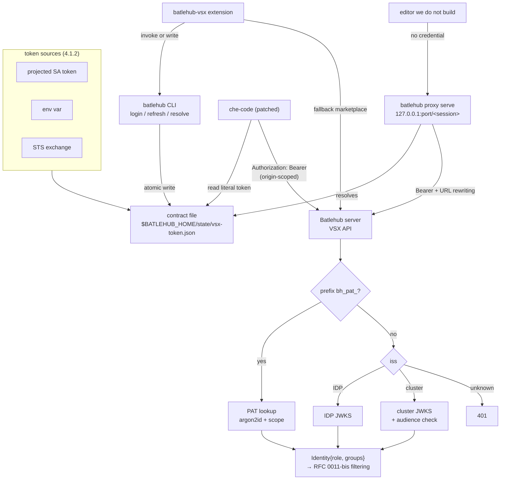

### 5.2 Acquiring a credential

Six ways a credential comes into existence. The first two are the only ones that involve a human; the rest are what a pod or a runner does with an identity it already has.

**(a) OIDC with PKCE and a loopback redirect** — the desktop default. The proxy, when it is running, is the redirect target, so the same server serves the gallery and the callback (§4.4.2); `auth login` on its own binds a throwaway loopback listener for the same purpose.

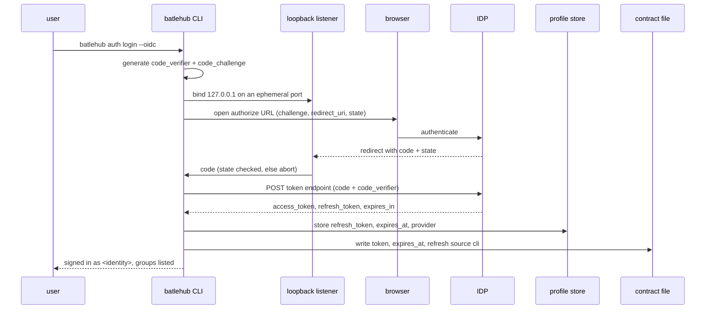

**(b) OIDC device code** — no browser reachable from where the CLI runs: a Che terminal, an SSH session, a pod whose loopback the user's browser cannot reach. This is also what the bootstrap entry's markdown displays (§4.4.2, case D).

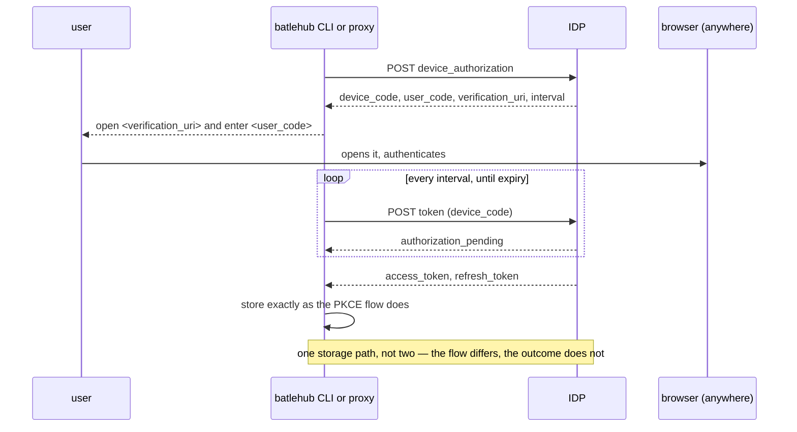

**(c) Personal access token** — automation, and the fallback where no OIDC provider is configured. Creation requires an OIDC session: a PAT cannot mint another PAT, and neither can a service account.

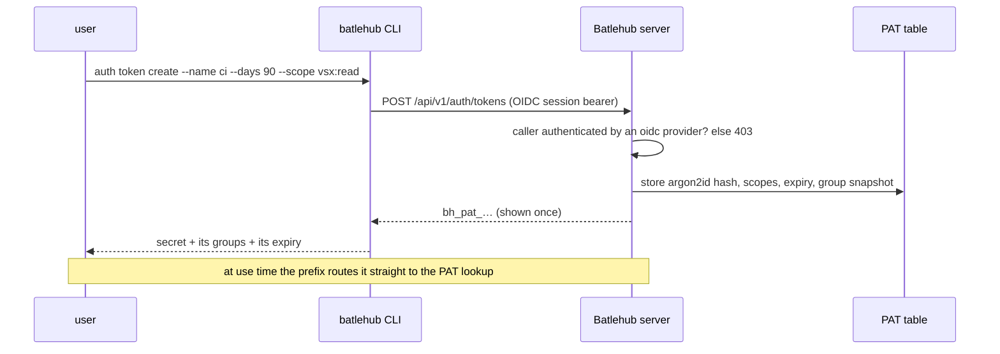

**(d) Kubernetes projected token** — nothing is acquired. The kubelet mints and rotates; the CLI only records where to look.

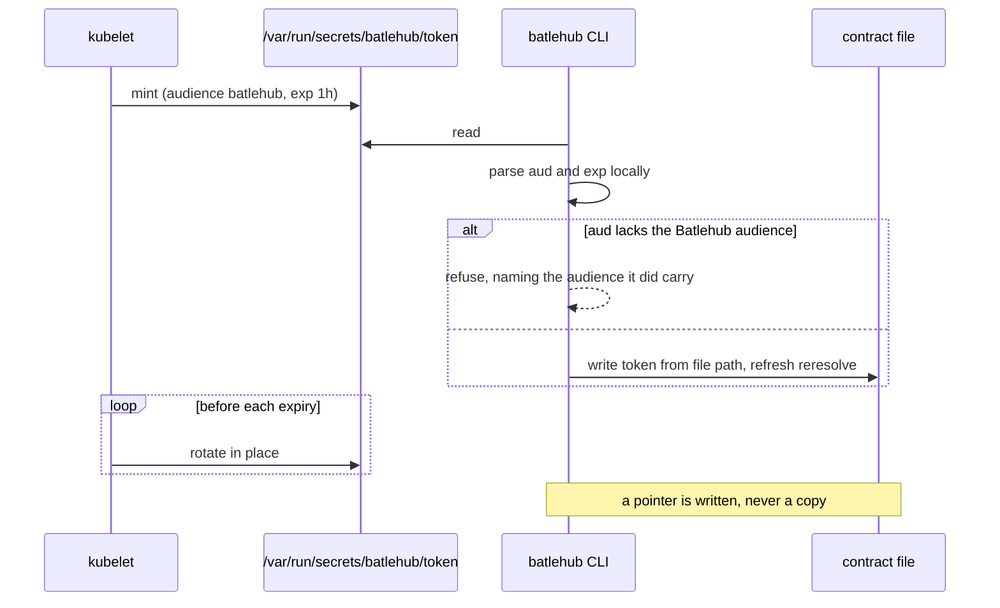

**(e) `--kubeconfig`** — a laptop or a runner holding a cluster credential. The kubeconfig is a minting key, never the credential presented to Batlehub (§4.5).

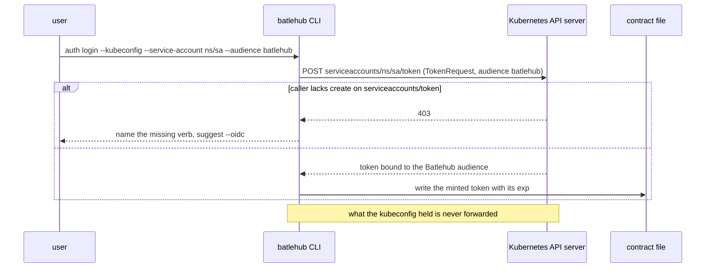

**(f) RFC 8693 token exchange** — CI, or a cluster whose workspace templates cannot add a projected volume. Resolved at request time, not at login (§5.3).

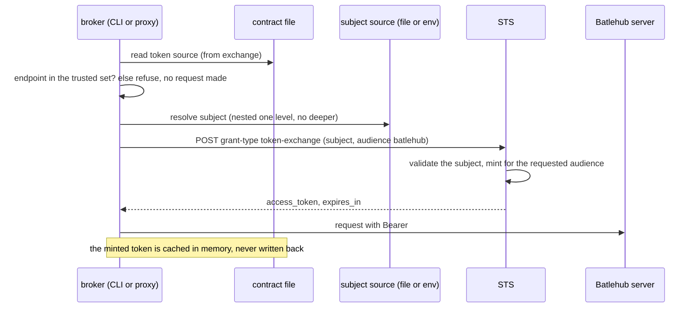

### 5.3 Getting a usable token at request time

Acquisition happens once; this happens on every request. A broker resolves the source, decides whether what it got is fresh enough, and refreshes only if it is the entry's owner.

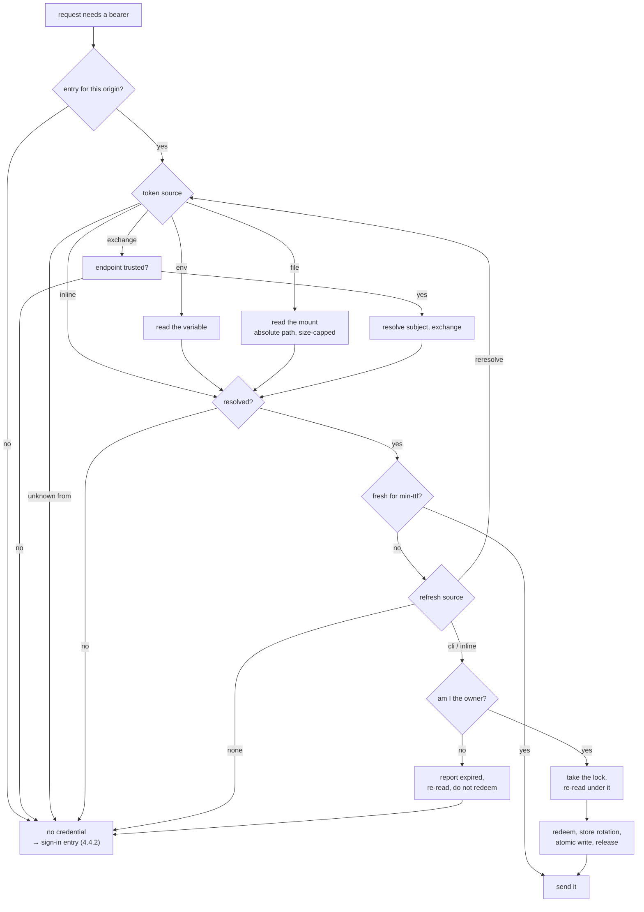

Two branches carry the weight. **`reresolve` loops back to the source** rather than to a refresh endpoint — that is the whole Kubernetes case: the fresh token is the same file, read again. And **a non-owner never redeems**, because the alternative is not a lost update:

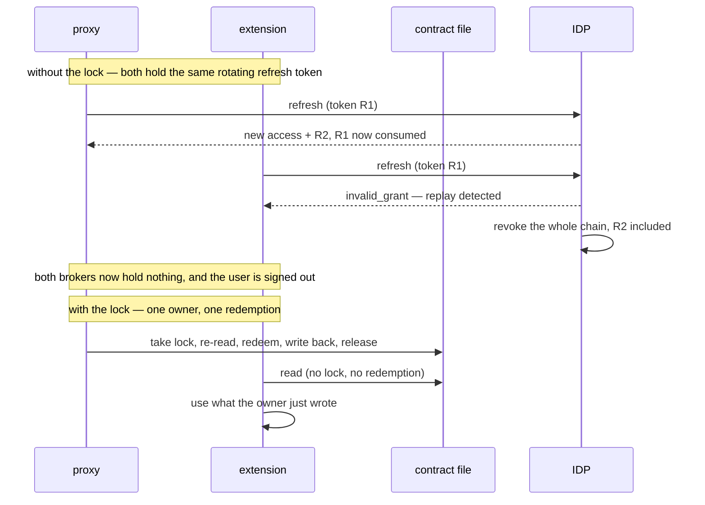

### 5.4 From credential to identity, server-side

The middleware already iterates `Vec<Arc<dyn AuthProvider>>` and takes the first `Identity`; this RFC routes the VSX endpoints through it. Each provider asserts its own audience, and a provider that cannot recognise a credential passes it on untouched rather than forwarding it — which is how a PAT stays out of the control plane's request logs.

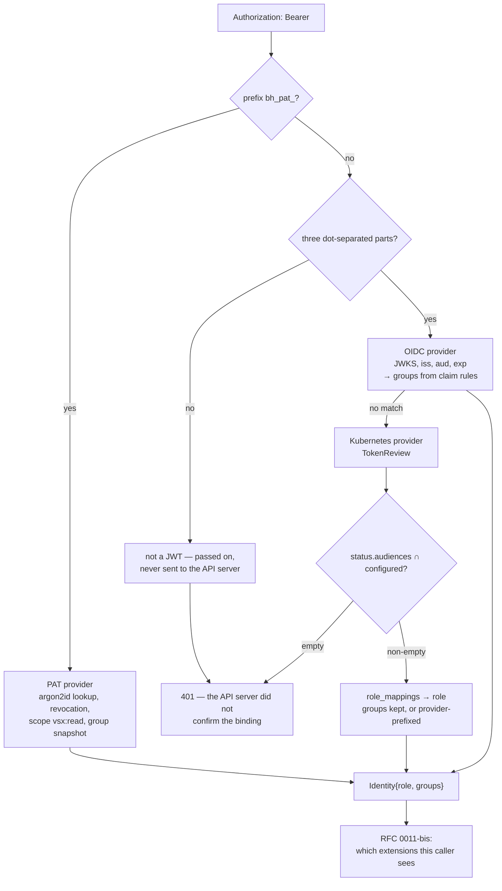

The empty-intersection branch is the one to keep in view: an authenticator that ignores `spec.audiences` answers with an empty `status.audiences`, and the token that produces that answer is the default service account mount every pod carries.

### 5.5 The final cases

Six end states. Each is a supported configuration; the deployment picks one per editor.

**Case A — patched che-code, contract file, no proxy.** The original path: the credential is in the file, the editor core sends it.

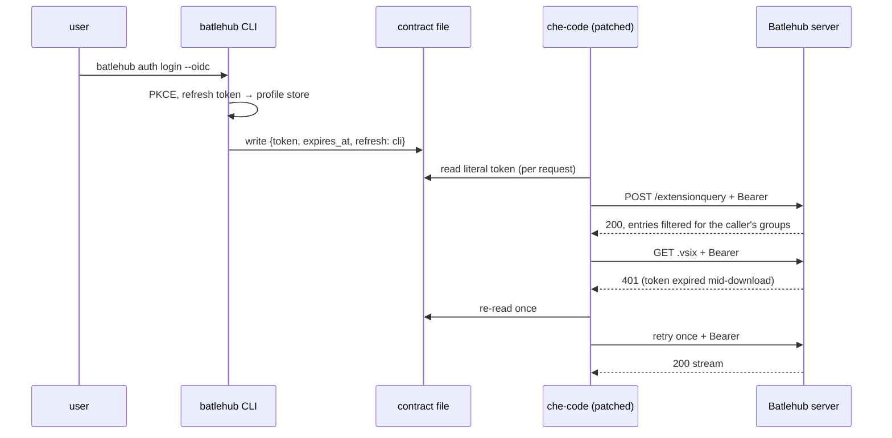

**Case B — any editor behind the local proxy.** The credential stays in the CLI's process; the editor holds a loopback URL.

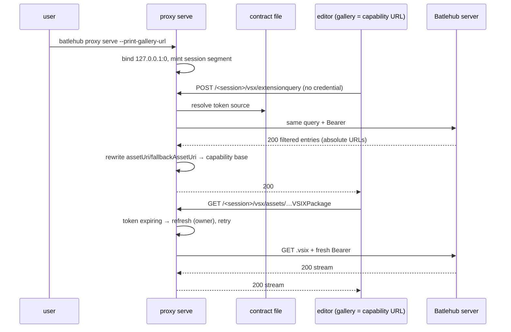

**Case C — workspace pod, zero interaction.** Nothing is typed, nothing is provisioned.

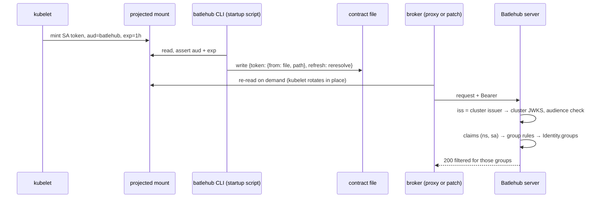

**Case D — first run, no credential.** The bootstrap. Note the two query kinds answered differently.

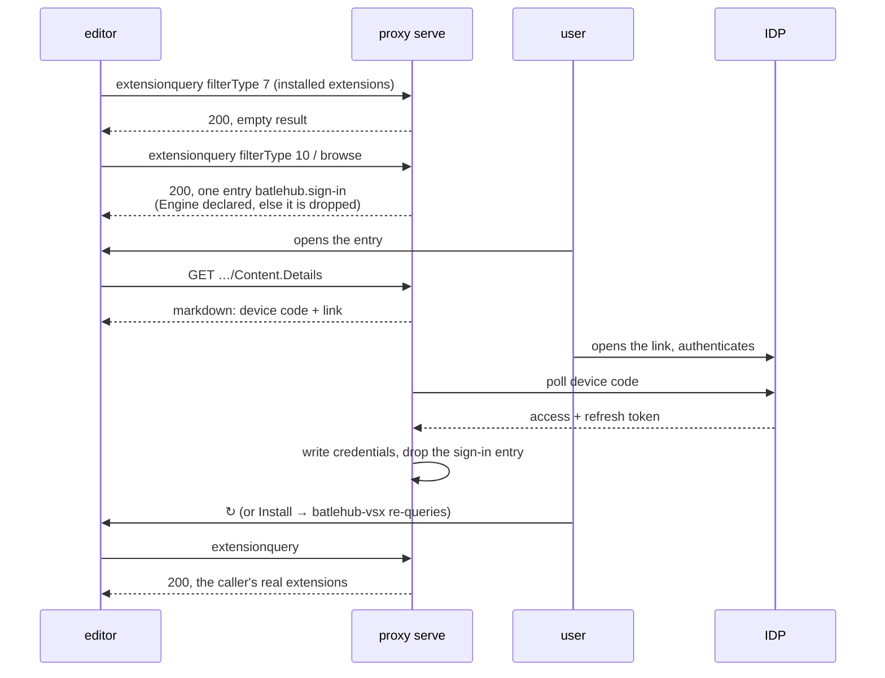

**Case E — CI, no stored secret.** The identity CI already has becomes one Batlehub accepts.

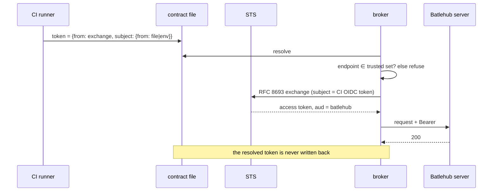

**Case F — stock VS Code.** The gallery URL cannot be repointed, so the extension is the surface.

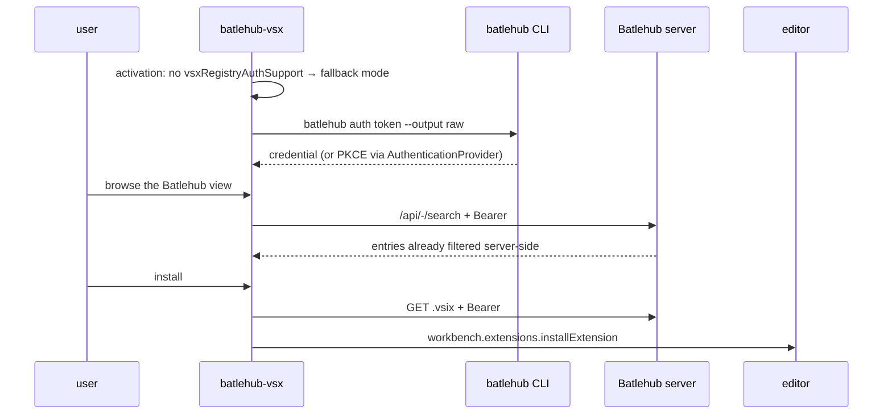

### 5.6 What the proxy answers, by credential state

The editor sees one status code — `200` — in every branch. The branch is the content.

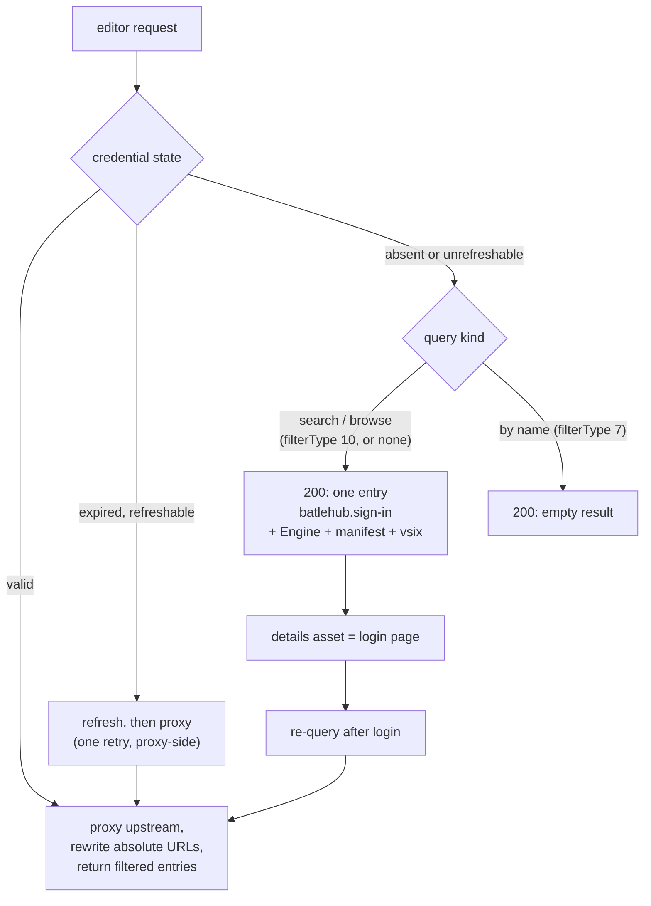

---

## 6. Detailed design

### 6.1 `server`

- Bearer middleware on VSX routes: prefix dispatch (`bh_pat_` → PAT path, else JWT path), JWKS cached with rotation handling, no introspection round-trip on the hot path.
- **The provider chain is not rebuilt.** `KubernetesAuthProvider` and the OIDC provider ship; the work is routing VSX endpoints through the middleware that already consults them, and adding the PAT scope check.
- Kubernetes (§4.5.1): a TokenReview response cache keyed by token hash and bounded by the token's own `exp`, because `extensionquery` runs on every editor start. The two-directional audience check is untouched.
- PAT table — **shipped**, and not as drafted: hashed secret (argon2id), `role`, `groups` (migration 046), a mandatory 1–90 day expiry, revocation flag; no `scopes` column (§13). CRUD API consumed by the CLI and the admin UI. The group snapshot on a PAT is RFC 0011-bis.

### 6.2 `cli/` (`batlehub-cli`, existing)

- **Not a new crate.** `cli/` ships `Cli`/`Command` (clap), `cli::auth` with `login/logout/whoami/refresh` and `token list|create|revoke`, `cli::config_cmd` over `ConfigFile`/`Profile`, and `tui::` with `Screen::{Login, IdeSetup, SetupWizard, RegistryList, …}`. This RFC extends that tree.
- `Profile` already carries `oidc_refresh_token`, `oidc_expires_at`, `oidc_provider` and `kubernetes_token_path`, and `main.rs` already auto-refreshes an expiring OIDC token before building the client. The work is to make those the backing store for `refresh: {"source": "cli"}`, not to reimplement them; `kubernetes_token_path` becomes the `file` source of §4.1.2 and gains an audience assertion.
- Source resolver (§4.1.2), shared by every consumer: one implementation for `inline`/`env`/`file`/`exchange`, one place the trusted-endpoint set is enforced, one place a resolution failure becomes "no credential" with a single log line. The proxy and the CLI link it; the extension reimplements the two sources it needs (`inline`, `env`).
- Contract-file writer: read-modify-write keyed by origin, atomic rename, JSON Schema validation, unknown fields preserved. Emits the `refresh` descriptor for the mode it logged in with — `cli` for OIDC, `reresolve` for a mounted token, `none` for a PAT — and never `inline`, since it has the profile store.
- Refresh path: take `state/vsx-token.refresh.lock`, re-read under it, redeem, store a rotated refresh token, rewrite the entry, release. Refuses to redeem an entry whose `owner` is not the CLI.
- `cli::auth` gains `status`, `source show|set|clear`, `doctor` (§4.6), built on the same resolver so the state they report is the state a broker would get. `cli::proxy` is a new module: `serve` and `status`.
- Redaction is a property of the render path, not of each call site: statuses and TUI widgets take a resolved-credential *summary* (source, state, expiry) that has no field capable of carrying the secret. A type that cannot hold it cannot leak it into a log line added later.

### 6.3 `batlehub proxy serve` (`cli/`)

- Loopback-only bind (refused otherwise), ephemeral port, per-session capability segment, `--print-gallery-url` for the workspace startup script. Session secret and resolved URL written to the `0600` state directory.
- Request path: capability check → credential resolve (refresh under `--min-ttl` when it is the entry's `owner`, otherwise re-read and wait) → upstream call with `Authorization` → **absolute-URL rewriting** on JSON responses → stream the body. `.vsix` bodies stream; they are never buffered, since the whole point is that they outlive an access token.
- Unauthenticated branch (§4.4.2): a `filterType` classifier, the synthetic `batlehub.sign-in` entry with its `Code.Engine` property, and asset routes for details markdown, manifest and package. The package served is the `batlehub-vsx` build embedded in the proxy binary.
- Login surface on the same server: `/{session}/login` as the PKCE redirect target, or the device-code display when no browser can reach it. Completion writes credentials exactly as `auth login` does; one code path for storage, not two.
- The proxy renders the server's already-filtered documents. **It holds no visibility logic**, and a bug in it cannot widen what a caller sees — only narrow it or break it.

### 6.4 che-code patch (external repository)

- Touches `src/vs/platform/extensionManagement/common/extensionGalleryService.ts` and the gallery asset download call sites; adds credential resolution (§4.2) and origin-scoped header injection; JSON parsing limited to a literal `token` string.
- Maintained as a rebase-friendly commit series on the Forgejo mirror, built into the workspace editor image; `product.json` of the patched build sets `vsxRegistryAuthSupport: true`.

### 6.5 `vscode-ext` (`batlehub-vsx`)

- `AuthenticationProvider` registration, `SecretStorage` for refresh tokens/PATs, credential chain per §4.2.
- **Broker mode**: keep the contract file fresh, status-bar auth state, and the re-query after login that the bootstrap entry cannot do for itself.
- **Fallback marketplace** (stock VS Code): TreeView first, webview detail later; install ledger in workspace state for the update diff; `extensionDependencies`/`extensionPack` resolved depth-first and cycle-guarded. Renders the server's filtered entries; no client-side filtering.
- The same build is what the proxy serves as the sign-in entry's package (§4.4.2), so installing from the bootstrap and installing from a marketplace produce the same extension.

**Deliberately untouched**, so reviewers do not go looking:

- Publishing endpoints and existing OpenVSX PAT publishing flow.
- Anonymous read on any other Batlehub registry — the credential work is VSX-only.
- che-code telemetry, product branding, and update channels.

---

## 7. Security considerations

- **The contract file is the trust boundary on disk.** `0600` under `$HOME`, atomic writes, and no path outside the user's home.
- **A token source keeps the secret out of the file, and moves the trust into one field.** `env`, `file` and `exchange` mean the contract file stops being a place a credential rests. The price is that `exchange.endpoint` is acted on, not just read, so it is validated against configuration rather than trusted from the file. Dropping the `command` source (§4.1.2) removes the other, larger, instance of the same hazard.
- **An inline refresh token changes what the file is worth.** An access token expires in minutes; a refresh token beside it mints access tokens until revoked. Hence §4.1.1 rule 1: inline only where no secret store exists, never by the CLI.
- **Refresh is single-owner because rotation makes concurrency destructive.** Two brokers redeeming a rotating refresh token look exactly like a replay to the IDP, and the correct response to a replay is to revoke the chain. The lock and the `owner` field are what stop two Batlehub processes from logging the user out of Batlehub.
- **In proxy mode the editor never holds the credential.** It holds a loopback URL — a smaller thing to leak from a process that executes arbitrary extension code, and the main security argument for the proxy rather than a side effect of it.
- **Loopback is not a boundary in a pod; the capability path is.** Containers share a network namespace, so a fixed-port proxy is drivable by anything running beside the editor. The ephemeral port plus per-session path segment restores the "knows a secret in a `0600` file" property. A review of any implementation should check this first.
- **A Kubernetes token is accepted only for an audience the API server confirms it is bound to.** `spec.audiences` asks, `status.audiences` answers, and an empty answer is a refusal — because the token that produces an empty answer is the default mount every pod carries. The shipped provider is stricter than the reference webhook authenticator here, and the caching layer of §4.5.1 must cache the decision, never widen it. Everything else about k8s auth is convenience; this is the part that is security.
- **A Kubernetes identity is a workload identity.** Its groups derive from Kubernetes groups, so a `role_mappings` entry naming `system:serviceaccounts:<ns>` grants a whole namespace at once. A provider with no mappings yields `Anonymous` and provider-prefixed groups — `public`/`internal` only, the safe direction to fail.
- **The bootstrap entry serves an installable package, so it is a distribution channel.** It is the `batlehub-vsx` build embedded in the proxy binary, served over loopback from a process the user started; it is not fetched at request time and not operator-supplied. §4.4.4 established that the editor will install an unsigned package from a custom gallery, which is a property of the editor rather than a choice here, and the reason this channel is kept as narrow as it is.
- **Header injection is origin-scoped.** Attached only to requests whose origin equals the configured gallery origin, dropped on cross-origin redirects.
- **PATs are identifiable and scoped.** `bh_pat_` prefix enables secret scanning; scope `vsx:read` bounds blast radius; secrets stored argon2id-hashed.
- **The 401-retry loop is bounded.** One re-read and one retry per request prevents hammering the IDP on revoked credentials.

---

## 8. Alternatives considered

| Alternative | Why rejected |
| ----------- | ------------ |
| Platform-operated sidecar proxy in the workspace pod | A container with its own lifetime, shared by everything else in the pod, on a well-known port, operated by the platform rather than the user — and one more component per pod to run and monitor |
| User-owned local proxy on loopback + capability URL | **Adopted as a second transport** (§4.4), on the conditions in §4.4.1. Cost: a process to supervise, and protocol-aware URL rewriting |
| Local proxy on a unix socket | The secure transport, and the editor cannot speak it: the gallery URL is parsed as `http(s)`. Revisit if that ever changes |
| Local proxy on a fixed loopback port, no capability path | The rejected sidecar with fewer containers. In a shared network namespace, reachable is authorised |
| `401` to the editor when unauthenticated | Blanks the Extensions view behind a generic error, which is where the user is least able to act. Authentication state is content |
| A sign-in entry with no package | Verified dead end: Install reports *Missing manifest for extension* (§4.4.4). The one action the UI invites fails |
| A sign-in entry with no `Code.Engine` property | Verified worse: the entry is dropped from results entirely and the view is empty (§4.4.4) |
| A `command` token source | Turns write access to an operator-authored file into code execution in the editor's process, to serve a case `keychain` covers more narrowly. Dropped |
| Forwarding the token found in `~/.kube/config` | Its audience is the cluster API. `exchange` re-mints; forwarding ignores |
| `TokenReview` as the default Kubernetes validation path | An API-server round trip on `extensionquery` — every editor start — and an API-server dependency while a `.vsix` streams |
| Network trust only (ClusterIP + NetworkPolicy) | No user identity; any workload in allowed namespaces reads everything; does not cover desktop |
| Pure extension, no patch, no proxy | Loses native Extensions view, auto-updates, and dependency resolution — acceptable as fallback, not as the primary UX |
| VS Code Private Marketplace | Bearer only on service-index discovery, gallery ops unauthenticated, gated on GitHub Enterprise/Entra accounts |
| Raw single-line token file (no JSON) | No multi-registry support, no expiry metadata, and a second file format the day npm/cargo need credentials |
| `token` as a literal string only | Forces every credential to rest in this file, including ones that already live somewhere better. It also makes the file the thing to steal, when it could have been a pointer |
| A separate "credential helper" config beside the contract file | Two files to keep in agreement about one credential; the failure mode is a consumer reading the stale one |
| No refresh information in the contract file | The consumer cannot tell "ask the CLI" from "the kubelet already rewrote it" from "sign in again". All three become a full login |
| A refresh descriptor without an `owner` or a lock | Concurrent redeem of a rotating token is a replay; the IDP revokes the chain and both brokers hold nothing |
| IPC between extension and patched core | Cross-process protocol to design, version and secure; the file + 401-retry achieves the same freshness with none of that surface |
| Keeping namespace visibility in this RFC | Two independently shippable changes behind one review. Split to [RFC 0011-bis](/rfc/0011-bis-namespace-scoped-visibility) |

---

## 9. Rollout and compatibility

- **Default behaviour**: auth disabled on VSX endpoints until enabled in server config; unpatched editors against an anonymous registry are unaffected. The patch with no credential sends no header.
- **Config migration**: new server config section for VSX auth (issuer, audience, PAT toggle, cluster issuers); additive.
- **Kubernetes prerequisites** (unchanged from the shipped provider): a projected `serviceAccountToken` volume with the Batlehub audience — *not* the default mount — and `system:auth-delegator` on the server's service account for TokenReview. **A provider with no `role_mappings` authenticates every pod in the cluster as `Anonymous` with provider-prefixed groups**: harmless, and exactly what "my team's extensions are missing" looks like. Reader grants in RFC 0011-bis must name the prefixed form (§4.5).
- **The local proxy is opt-in and additive.** No proxy, no change: patched che-code keeps reading the contract file. Rolling back is pointing the editor's gallery URL back at the server.
- **Operator prerequisites**: IDP OAuth2 client (public, PKCE, loopback + device code grants), JWKS reachable from the server, patched che-code image published, CLI present in workspace images.
- **Rollback**: disable auth in server config (endpoints revert to anonymous); patched editors keep working; contract files and PAT table persist but become inert.

---

## 10. Test plan

- **Unit** (`server`): prefix dispatch, JWT validation (expiry, audience, issuer, key rotation), PAT hash lookup + scope + revocation, 401 challenge format. A service account token minted for the cluster API audience is rejected; a non-JWT-shaped credential is never sent to the API server; VSX routes reject an unauthenticated request with the documented `WWW-Authenticate` challenge.
- **Unit** (`cli/`, contract file): read-modify-write preserves foreign origins and unknown fields; atomic write; a `refresh` block round-trips for each `source`; a `token` source round-trips for each `from`, and the plain string reads as `inline`; `reresolve` on an `inline` token is refused; a non-`owner` consumer never redeems and reports "expired" instead of deleting the entry; two refreshers contend on the lock and exactly one redeems; a rotated refresh token replaces the stored one in the same atomic write. Every case is asserted against the shipped JSON Schema, not against a second copy of the rules.
- **Unit** (`cli/`, source resolver): every `from` resolves; every failure mode — missing variable, absent file, refusing STS — yields "no credential" and one log line; an unknown `from` warns once; an `exchange` endpoint outside the trusted set is refused **before** the request is made; `subject` nested two levels is rejected at parse; a resolved value is never written back; `file` rejects a relative path and caps the read.
- **Unit** (`cli/`, Kubernetes): `--kubernetes` auto-selection when `KUBERNETES_SERVICE_HOST` is set; a token whose `aud` lacks the Batlehub audience is rejected **client-side, before any TokenReview round trip**, with a message naming the audience it did carry; `--kubeconfig` never emits the token it read.
- **Existing suite** (`crates/adapters`, `auth/kubernetes.rs`): must pass unchanged. In particular the case that refuses a token the API server authenticated but did not confirm bound to a requested audience — that test is the audience property, and a caching layer added in phase 2 must not be able to serve around it.
- **Unit** (`cli/`, proxy): a request without the session segment is `404`; a bind to a non-loopback address is refused at startup; `assetUri`/`fallbackAssetUri` are rewritten to the capability base and foreign origins are left alone; a `.vsix` body streams rather than buffers.
- **Unit** (`cli/`, bootstrap) — each row of §4.4.2, and the first two are regression tests for findings, not hypotheses: the synthetic entry always carries `Microsoft.VisualStudio.Code.Engine`; it always carries manifest and package assets; a `filterType: 7` query returns an empty `200` and a `filterType: 10` query returns exactly one entry; neither returns `401`; with a credential the entry is absent from both; an expired unrefreshable credential brings it back; the details asset escapes the device code.
- **Unit** (`cli/`, status and doctor): `auth status` distinguishes `ok`/`expired`/`unset`/`refused`/`unreachable` as the underlying source changes; **no output path can emit a credential** — the summary type has no field for one; `doctor` exits non-zero on each failed step in turn, and its editor-URL step fails when the configured gallery URL does not match the proxy the CLI would start.
- **Integration** (`cli/tests/integration.rs`, existing subprocess pattern): `auth status --json` against a seeded contract file; `auth source set` then `auth status` reflects the new source without a restart.
- **Integration** (proxy + server): unauthenticated start → sign-in entry → device code login → re-query returns the caller's set; a token that expires mid-`.vsix` is refreshed by the proxy without the download failing — the case the 401-retry patch cannot cover.
- **Integration** (`server` + CLI): full PKCE login → `write-token-file` → authenticated search/download; PAT lifecycle create → use → revoke → 401.
- **Unit** (patch, upstream test layout): resolution order; origin scoping incl. redirect drop; single 401-retry; unparseable file treated as no-credential; a `token` source object yields no credential and falls through to the environment variable.
- **Real client** (per the project's standing practice that route tests are not client tests, and per §4.4.4 which could not exercise the view): a canary workspace with a real Extensions view — the sign-in entry appears in search and browse, its README renders, Install succeeds, and after login the view lists the caller's extensions. Plus `code --install-extension` against short-TTL tokens, with a `.vsix` larger than one token lifetime.
- **Existing suites** that must pass unchanged: VSX API conformance with auth disabled — proves the anonymous path is untouched; the extension publishing suite — proves publishing flow isolation.

---

## 11. Decisions and open questions

### Resolved

| # | Question | Decision |
| --- | -------- | -------- |
| 1 | Sidecar proxy vs application-layer auth | **Application-layer, plus a user-owned local proxy as a second transport.** The platform-operated sidecar stays rejected. `batlehub proxy serve` has the editor's own uid and lifetime, binds an ephemeral loopback port behind a capability path, and is the only way to authenticate an editor whose core we do not build. The original rejection was of the packaging, and it does not transfer unexamined. |
| 2 | Contract file format | **JSON, versioned, keyed by registry origin**, with a shipped JSON Schema as the normative definition. Unknown fields ignored and preserved, so an added field is not a version bump. |
| 3 | Contract file location | **Dynamic, `$HOME`-relative**: `$BATLEHUB_HOME/state/vsx-token.json`, `BATLEHUB_HOME` defaulting to `$HOME/.batlehub`. |
| 4 | Extension chain: env vs existing file | **Contract file first, then env.** |
| 5 | Token formats | **Three**: OIDC access/refresh, PATs, Kubernetes service account tokens — resolved by the existing `AuthProvider` chain, each provider asserting its own audience. |
| 6 | Patch ↔ extension coupling | **None.** The file is the contract; the patch reads a literal string and stays upstreamable. |
| 7 | CLI existence | **It already exists** — `cli/` (`batlehub-cli`), clap plus a ratatui TUI, with `auth login/logout/whoami/refresh`, `auth token` CRUD, profile storage at `0600`, OIDC refresh with auto-renewal, and `auth login --kubernetes-token-path`. An earlier draft called for creating it. This workstream extends it, adds no second credential store, and adds no TUI screen. |
| 8 | Local proxy transport | **Loopback TCP behind a capability URL.** A unix socket is the transport whose permissions mean something, and the editor cannot speak it. Ephemeral port plus a per-session path segment restores the "knows a secret in a `0600` file" property; a fixed port with no capability path does not. |
| 9 | What the proxy answers with no credential | **`200` with a single `batlehub.sign-in` entry whose details asset is the login page.** A `401` blanks the Extensions view behind a generic error. Authentication state is content, not a status code. |
| 10 | Whether the sign-in entry is installable | **Yes — it carries `Code.Engine`, a manifest, and the `batlehub-vsx` package.** An earlier draft said no, on the grounds that manifest validation, engine matching and signature policy were too much surface. §4.4.4 tested all three: the engine property is *mandatory* or the entry vanishes, the manifest is one JSON, and an unsigned package from a custom gallery installs. Refusing to serve a package leaves the Install button as a dead end and forfeits the re-query after login. Reversed on evidence. |
| 11 | Fully silent workspace startup: device code vs a provisioned per-user PAT | **Neither — the pod's own Kubernetes identity** (§4.5). No browser, no provisioning pipeline, no long-lived secret, and it re-resolves groups on every rotation. Device code remains the fallback outside a pod. |
| 12 | Kubernetes token validation path | **Keep the shipped TokenReview provider, and cache it.** An earlier draft made offline JWKS the default and TokenReview the opt-in; `crates/adapters/src/auth/kubernetes.rs` already does TokenReview with a two-directional audience check that is stricter than the reference authenticator. Replacing a working, audience-strict implementation to save a round trip is a proposal of its own, not a clause in this one (open question 7). |
| 13 | `~/.kube/config` as a credential source | **Only as a minting key, never as a credential.** `--kubeconfig` calls `TokenRequest` for an audience-scoped token and says which RBAC verb is missing when it cannot. |
| 14 | How the contract file represents refresh | **A `refresh` descriptor, not a refresh token**: `cli`, `reresolve`, `inline`, `none`, plus who may redeem. The refresh token itself is inline only where the writer has no secret store. |
| 15 | Concurrent refresh | **One `owner` per entry, plus a lock, plus atomic read-modify-write.** With rotating public-client refresh tokens, two redeemers are a replay. |
| 16 | Literal token vs indirection | **`token` is a string or a source**: `inline`, `env`, `file`, `exchange`, with `keychain` reserved. A credential that already lives somewhere should be pointed at, not copied into a file several processes read. |
| 17 | A `command` token source | **Dropped.** It turns write access to an operator-authored file into code execution in the editor's process, to cover a case `keychain` covers more narrowly. An earlier draft kept it behind a deployment gate; a gate is a weak control for that size of capability. |
| 18 | A cluster-audience token as a Batlehub credential | **Only through `exchange`.** An STS validating the subject and minting a Batlehub-audience token re-establishes the audience; forwarding ignores it. Same token, opposite security properties, and the difference is which party asserted the audience. |
| 19 | Where this configuration is managed | **In the shipped CLI and TUI** (§4.6): `auth status`, `auth source`, `auth doctor`, `proxy status`, plus the existing `Screen::Login` and `Screen::IdeSetup`. A format whose failure mode is a silently shorter extension list needs a command that says why. |
| 20 | Scope: authentication vs authorization | **Split.** [RFC 0011-bis](/rfc/0011-bis-namespace-scoped-visibility) owns which extensions a caller may see; it touches every ecosystem's SQL predicate and needs no editor to test. This RFC stops at producing an `Identity` with groups. |

### Still open

Closed on 2026-09-02; the decisions are in §13. Questions 1 and 5 leave with the
loopback proxy and the extension, which §13 moves to a follow-up RFC.

1. ~~**Who supervises `proxy serve` in a workspace.**~~ Not this RFC any more (§13).
2. ~~**How the capability URL reaches each editor build.**~~ The Setup Guide's per-build `product.json` snippets (§13).
3. ~~**Whether an unauthenticated proxy also serves anonymously-readable proxied extensions.**~~ Per-package visibility is RFC 0015's; pass through, never re-decide (§13).
4. ~~**Fallback marketplace offline behaviour.**~~ Fail visibly (§13).
5. ~~**Whether the proxy embeds the `batlehub-vsx` package or fetches it.**~~ Not this RFC any more (§13).
6. ~~Where the VS Code extension lives in the repository layout.~~ A separate repository (§13).
7. ~~**Whether Kubernetes validation should move off TokenReview.**~~ No; the shipped cache bounds the cost (§13).

---

## 12. Implementation phases

| Phase | Content | Depends on |
| ----- | ------- | ---------- |
| 1 | `server`: Bearer middleware (OIDC + PAT), multi-issuer JWT path, PAT management API. `cli/`: `auth token`, `auth write-token-file`, and `auth status`/`source`/`doctor` — the last three land here rather than later, because they are how every subsequent phase is debugged. | — |
| 2 | Kubernetes delta (§4.5.1): client-side `aud`/`exp` assertion with a message that names the audience, `--kubernetes` auto-detection, `--kubeconfig` minting via `TokenRequest`, the `file` + `reresolve` contract entry, and a TokenReview response cache. The provider itself ships. Testable with `curl` and a mounted token before any editor is involved. | 1 |
| 3 | `batlehub proxy serve` (§4.4): loopback bind + capability URL, credential attachment, absolute-URL rewriting, streaming. | 1 |
| 4 | The unauthenticated bootstrap (§4.4.2) and the login surface on the same server, including the `Code.Engine` property and the package assets that §4.4.4 showed to be mandatory. | 3 |
| 5 | che-code patch: credential resolution, origin-scoped injection, 401-retry; patched image in CI; canary workspace with short-TTL tokens **and a real Extensions view**, which is the gap §4.4.4 could not close. | 1 |
| 6 | `cli/` TUI: `Screen::Login` shows credential state per registry, `Screen::IdeSetup` shows and applies the proxy's gallery URL for the detected editor. | 3 |
| 7 | `batlehub-vsx` broker mode: mode detection, credential chain, contract-file upkeep, status-bar state, re-query after login. Becomes the package the bootstrap serves. | 4 |
| 8 | `batlehub-vsx` fallback marketplace for builds whose gallery URL cannot be repointed — stock VS Code above all. | 7 |
| 9 | Upstream PR against `che-incubator/che-code`; adjust per review; the proxy and fallback remain regardless of outcome. | 5 |

---

## 13. Revision against the tree (2026-09-02)

This document has not been re-read against the tree since July, and a full
quarter of its server-side work has shipped in the meantime — under RFC 0015,
0017 and the "groups on a PAT" item — in a shape that is not the one drafted
here. Nothing in phases 3–9 has started. This section says what is shipped,
what the draft got wrong, and what is cut.

**Already shipped, described above as future work.**

- The auth middleware is applied app-wide (`server_factory.rs`); every VSX
  handler takes an `AuthIdentity` and the gallery runs `authorize_gallery_read`.
  §4.2/§5.4's "the work is routing VSX endpoints through the chain" is done.
- The TokenReview response cache (60 s hit / 10 s reject, keyed by token hash)
  and the server-side `aud`/`iss` peek before any API-server call
  (`token_may_be_ours`, `looks_like_a_jwt`) — §6.1's and phase 2's largest
  items.
- PATs: `bh_pat_` prefix, argon2id, revocation, `role`, `groups` snapshot
  capped to the creator's own, `--groups`/`--all-groups`, the tokens page.
- `--kubernetes-token-path`, re-read per request; `is_token_expiring_soon`;
  the TUI `Login` screen with its Kubernetes-path tab.

**Wrong when drafted.**

- *The PAT model.* There is no `scopes` column, no optional expiry (1–90 days,
  mandatory), and `vsx:read` is not in RFC 0015's vocabulary — gallery read is
  `source:read`. Every `--scope vsx:read` above reads as `--role user
  --groups …`; the blast-radius argument of §7 holds through groups and
  visibility, not scopes.
- *The CLI login flow.* §4.1.3/§5.2 describe PKCE with a loopback redirect and
  a device-code fallback. The shipped flow is server-brokered: the CLI prints
  the SSO URL and the user pastes the redirect back; PKCE lives server-side with
  a `client_secret` (a confidential client). Neither PKCE-loopback nor device
  code exists; if either is wanted it is a new deliverable, and this revision
  does not add one.
- *`401 + WWW-Authenticate: Bearer`.* Nothing emits `WWW-Authenticate`. The
  gallery answers `200` with an empty list to an anonymous caller — which is
  the RFC's own §4.4.2 property, already holding server-side.
- *§4.3 validation rows.* Empty `audiences` defaults to `["batlehub"]`; no
  cluster-audience rejection exists; the TokenReview cache has no toggle to
  warn about. The three rows are deleted.
- *§5.1's diagram* says "cluster JWKS + audience check"; §4.5 and the shipped
  provider use TokenReview. The diagram is wrong.
- *0011-bis* is superseded by 0015; the twelve references to it as the live
  authorization spec now point at 0015 and 0017. "Reader groups on a
  namespace" are `group:` subjects in a grant.
- *The `exchange` credential source* duplicates `ActionsOidcAuthProvider`,
  which already accepts a GitHub Actions token directly. Dropped, with
  `keychain` and `--kubeconfig`, from v1.

**Cut and split.** Five deliverables across three languages and two
repositories behind one Draft is why the index ranks this last. **Decision:**
this RFC keeps the contract file (one source: `file`, plus a literal for
tests), `auth token`/`write-token-file`/`status` in the CLI, and the che-code
patch that reads one literal — roughly 500 lines. The loopback `proxy serve`,
the bootstrap sign-in entry and the `batlehub-vsx` extension (phases 3–4 and
7–8) move to a 0011-bis-successor RFC written when a build that cannot repoint
its gallery URL is actually in front of us. RFC 0018 lists "the Batlehub VS
Code extension reads the verdict endpoint" as a channel; that is this cut
piece, and 0018 now says so.

**The seven open questions.** 1 (who supervises `proxy serve`) and 5 (embed
vs fetch the vsix) leave with the proxy and the extension. 2 (how the URL
reaches each editor) is answered by the `product.json` snippets the Setup
Guide already carries per build. 3 (anonymous extensions beside the sign-in
entry): per-package visibility is 0015's, `Public` means anonymous; pass
through what the server returns and never re-decide. 4 (offline cache): fail
visibly, as the gallery already does. 6 (where the extension lives): a
separate repository, when it exists. 7 (TokenReview → offline JWKS): no; the
cache bounds the cost. Zero remain.

---

## 14. Landed (2026-09-04)

§13's cut is built: the contract file, three CLI verbs, and the editor patch.
Roughly what §13 estimated, and it closes the one thing this RFC could deliver
without an editor build in front of us — a Batlehub gallery that requires a
credential is no longer a gallery that answers every query with an empty list.

**What is there.** `cli/src/contract.rs` — the document, the resolver and the
atomic read-modify-write writer, with `cli/schema/vsx-token.schema.json` as
the normative shape §4.1 asked for. `batlehub-cli auth token`,
`auth write-token-file` and `auth status` (§4.1.3, §4.6).
`patches/che-code/` — the credential module and the steps to integrate it,
carried in this repository so both halves of the contract change together.
`docs/registries/openvsx.md` gains the section, beside the warning it answers,
and `docs/use/cli.md` the three verbs.

### 14.1 Two sources, and the rest named rather than silent

The cut says "one source: `file`, plus a literal for tests". Built as
`inline` and `file` — the literal the CLI writes after a login, and the
projected token something else keeps fresh, which is the pair a Kubernetes
workspace actually needs.

`env`, `exchange` and `keychain` are **in the schema as reserved**, and read
as "no credential" with one warning. That is §4.1.2 rule 4 taken seriously:
naming them is what lets a later implementation arrive without a `version`
bump, and refusing to guess at them is what stops this build sending the wrong
thing. A schema that omitted them would make the first one to land look like a
breaking change.

### 14.2 The schema is the document, and a test says so

§4.1 argued the normative schema belongs beside the CLI rather than in the
prose, because "four refresh sources times six token sources with one level of
nesting is more than prose keeps honest". Taking that seriously means the two
cannot be allowed to drift, so the CLI's tests read the shipped schema and
assert against it in **both** directions: a vocabulary the schema documents
and the model cannot parse is a lie to whoever writes the second
implementation, and a value the model accepts and the schema omits is a second
implementation written against the wrong document. Every example the schema
carries is parsed and resolved by the same code path a consumer uses.

No JSON Schema validator was added to do it. The drift that matters here is
vocabulary and field names, and walking the schema for those costs sixty lines
and no dependency — which is the right trade in a tree whose supply chain is
its own §7.

### 14.3 `auth token` is the bare verb, not a fourth name

§4.1.3 spells it `batlehub auth token --output raw`, and §4.2's credential
chain hardcodes that string. But `auth token` was already the personal-access-
token subcommand group. **Decision:** the subcommand is optional — `auth
token` prints a credential, `auth token list|create|revoke` are unchanged. A
fourth name would have been easier and would have made the RFC's own
integration snippet wrong.

### 14.4 Redaction is a property of a type

§4.6's rule is that a secret is never printed or logged, and the way it is
kept is that `EntrySummary` — what the status table, the JSON output and any
future TUI widget render — has **no field able to hold one**. The resolution
that does carry the credential is a different type. A log line added later
cannot leak what the type it was handed never had, which is the only version
of this rule that survives a year of edits.

### 14.5 What the patch will not do, and why it is short

The module reads a literal `token` string, scopes the header to the gallery's
own origin, retries once on `401`, and never throws. It does **not** read the
`refresh` block, resolve a token *source*, or send a request of its own —
each would mean an IDP client id or a second file open in the editor's own
process, and each belongs to a broker. That is §4.1.1 rule 3 and decision 6,
and it is also what keeps the patch to one added file and a handful of call
sites, which is what a rebase-friendly series has to be.

**It is carried, not applied.** This repository builds no editor, so the
honest artifact is the module plus the integration steps rather than a diff
with invented context lines that would fail to apply against whatever upstream
looks like on the day. `patches/che-code/README.md` says so in those words.

### 14.6 The patch is tested, and testing it found a bug

§10 names five properties for the patch — resolution order, origin scoping
including the redirect drop, the single 401 retry, an unparseable file as no
credential, and a token *source* object falling through to the environment
variable. All five are asserted, in `patches/che-code/vsxRegistryAuth.test.ts`,
which travels with the module so whoever rebases it can tell in one command
whether it still does what the contract says.

**Plain `node --test`, no toolchain.** Node strips the types itself, so the
module that goes into an editor build is tested with no dependency, no bundler
and no config — which is what makes it reasonable to carry tests for code this
repository does not compile.

Writing them found a defect in the retry: the guard that stops a second
identical request compared the retry's `Authorization` against the *base*
headers, which never carried one, so every `401` retried whether the
credential had changed or not. `sendWithCredential` compares against the
headers it actually sent now. It is the same lesson as 0008 §14.5 at a smaller
scale — the code read correctly and did something else, and only a test that
counted the requests could tell.

### 14.7 Still cut

Of what §13 moved out, the loopback `proxy serve` and the unauthenticated
bootstrap entry landed on 2026-09-05 — §14.8. Still out: the `batlehub-vsx`
extension and `auth source`/`auth doctor`. The extension waits on an editor
build whose gallery URL cannot be repointed at all (its fallback-marketplace
role, phase 8); the last two are conveniences over a format
whose validation now happens at write time, which was the failure they were
mostly there to explain.

The `--kubernetes` and `--kubeconfig` login modes of §4.5 are not built
either. `--kubernetes-token-path` ships, and `write-token-file --from-file`
turns it into the `file` + `reresolve` contract entry the RFC describes, which
is the part a consumer sees; the audience assertion and `TokenRequest` minting
remain phase 2's.

### 14.8 The proxy and the bootstrap, against the real editor core (2026-09-05)

§13 deferred phases 3–4 until "a build that cannot repoint its gallery URL
is actually in front of us". The premise was that no editor here could be
pointed at a loopback proxy. The recipe §4.4.4 itself used says otherwise
for a *test*: the stock VS Code download reads `extensionsGallery` from
`product.json`, that file is editable, and the CLI (`cli.js` under
`ELECTRON_RUN_AS_NODE`) drives the real `extensionGalleryService`. It is not
a configuration we can ship — §3's non-goal stands, updates overwrite the
file — but it is the editor a heavy suite can put in front of the proxy,
which is what the deferral was waiting for. So phases 3 and 4 are built,
and `tests/heavy/vsx_login.sh` measures them.

**What is there.** `cli/src/gallery_proxy.rs` — the server: the session
segment (§4.4.1), the credential read off the contract file on every
request, the absolute-URL rewrite (§4.4.3), the `filterType` classifier
and the sign-in entry with its three assets (§4.4.2), and the `.vsix` it
serves, generated at startup. `cli/src/cli/proxy.rs` — `batlehub-cli proxy
serve`: loopback-only bind, `--print-gallery-url`, `gallery-proxy.json`
at `0600`. Unit tests hold every row of §4.4.2's table, and the two
findings of §4.4.4 — `Code.Engine` mandatory, a package mandatory — are
regression tests rather than notes.

**What differs from §6.3, each deliberate.**

- **No login surface on the proxy.** §6.3 wanted `/{session}/login` as a
  PKCE redirect target or a device-code display. §13 recorded that neither
  flow exists in the shipped CLI — the login is server-brokered — so the
  sign-in page names the two commands that do, `auth login` then `auth
  write-token-file`, and the proxy re-reads the contract file on every
  request. A login lands without a restart, which is the property the
  page promised; the device code was one way to get it.
- **The package is generated, not `batlehub-vsx`.** The entry's `.vsix`
  is a manifest, a readme and nothing else: installing it changes nothing
  about the editor. §12 phase 7 makes the extension the package; until
  then the Install button is not a dead end, which is what §4.4.4 found
  it had to not be.
- **Every string on the registry's origin is rewritten, not two fields.**
  §4.4.3 named `assetUri` and `fallbackAssetUri`; the proxy rewrites any
  string in the document that starts with the registry base, and leaves
  every other origin alone. Two fields was the measured minimum; a
  prefix rewrite is what stays true when the document gains a third.
- **A lookup by name for the entry itself is answered with the entry.**
  §4.4.2's rule — never on a query by extension name — exists so that
  startup's lookup of every installed extension is answered empty rather
  than with an error. The suite's first run found the rule, read
  literally, made the entry uninstallable: `--install-extension
  batlehub.sign-in` *is* a `filterType: 7` lookup, and an empty answer is
  *Extension 'batlehub.sign-in' not found*. The proxy now answers a lookup
  whose name is the entry's own; every other name stays empty.
- **The package carries no `activationEvents`.** The second run found the
  editor's manifest validator refusing the key on an extension with no
  `main` or `browser` — *Cannot read the extension from …* — so the
  generated manifest is name, publisher, version and `engines` and nothing
  that implies code. Read off `--verbose --log trace`, which is the only
  place the editor says why.
- **The tap records the credential's scheme.** `http_tap.py` now logs
  `Authorization: Bearer` when a request carries one — the scheme only,
  never the value — so the suite can assert that every registry request
  the proxy forwarded was authenticated and none arrived bare.

**Measured** (`tests/heavy/vsx_login.sh`, VS Code 1.96.4's `cli.js` under
node, a local `vscode-marketplace` registry whose `anonymous` holds no
verb, the tap between the proxy and the registry). The registry answers an
anonymous `extensionquery` with `403` — not the empty `200` §13 assumed of
a gallery, which holds only where anonymous read is granted — and a
user's with the one fixture. Unauthenticated, through the proxy: a search
is `200` with one entry, `batlehub.sign-in`, `Code.Engine` set, and the tap
saw nothing; `--install-extension batleforc.weebo-bridge-notify` printed
*Extension 'batleforc.weebo-bridge-notify' not found* and the tap saw
nothing; `--install-extension batlehub.sign-in` printed *was successfully
installed* and the entry is listed; a request outside the session segment
was `404`. Then `auth write-token-file` with the user token, nothing
restarted: a search through the proxy is `[batleforc.weebo-bridge-notify]`
with both asset URIs on the proxy; `--install-extension` by id succeeded;
the tap recorded six registry requests, every one `Authorization: Bearer`
— two `extensionquery`, two `Code.Manifest`, the `VSIXPackage` with
`?redirect=true&install=true` — and none without. `auth status` reported
the entry `ok` and printed no credential. Four runs to green, each a
finding: the anonymous `403`, the lookup-by-name rule read too literally,
the manifest validator's `activationEvents`, all recorded above. What this
does not measure, still: the Extensions view itself, and the che-code build
with the patch of §14.5.
