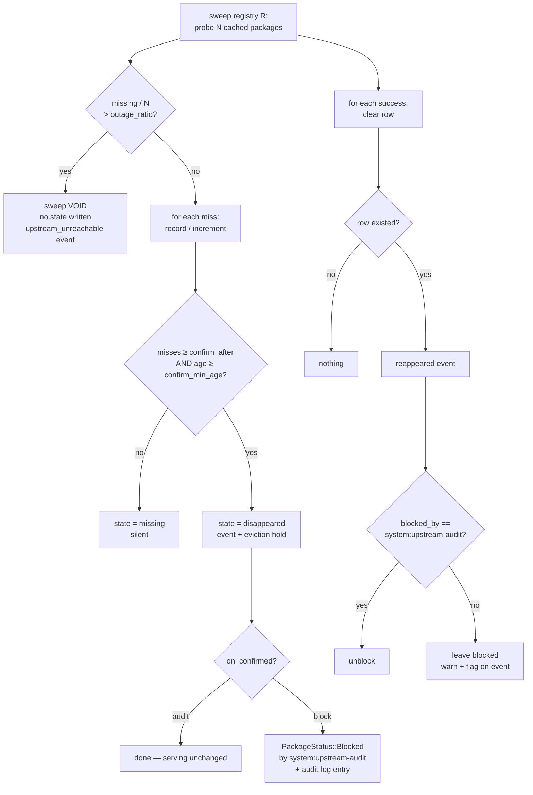
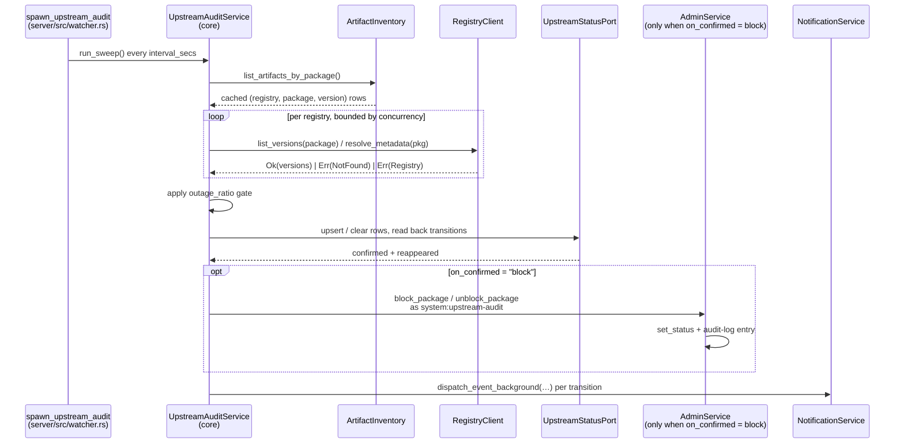
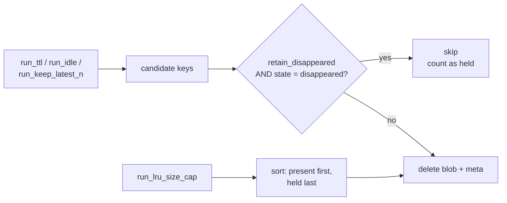

# RFC 0014 — Detecting packages that disappear upstream

| Field       | Value                                                        |
| ----------- | ------------------------------------------------------------ |
| Status      | **Implemented** — all nine phases of §12 landed 2026-09-04 (§13.1–§13.4): the sweep, the state machine, the hold, the notifications, the block arm, the admin API, the console and the operations page, each proven in process and by `tests/heavy/upstream_audit.sh` against a served upstream and a real receiver. Revised 2026-09-02 onto RFC 0018's worker |
| Short       | Upstream disappearance                                        |
| Settles     | How a package that vanished upstream is detected, held, and reported to the admin |
| Author      | Max Batleforc <maxleriche.60@gmail.com>                       |
| Co-author   | —                                                             |
| Created     | 2026-08-25                                                    |
| Supersedes  | —                                                             |
| Touches     | `crates/core`, `crates/adapters`, `crates/config`, `crates/web`, `server`, `ui`, docs |

---

## 1. Summary

A proxy cache exists so that an estate survives its upstreams. Today BatleHub
survives an upstream that is *down* — `serve_stale_metadata` and the artifact
cache both handle that — but it does not notice an upstream that has *changed
its mind*. When `left-pad@1.3.1` is unpublished from npm, BatleHub keeps serving
the cached tarball, says nothing, and then deletes it at the next TTL sweep,
because eviction has no idea it is holding the last copy in the estate.

This RFC adds a periodic **upstream audit**: a background sweep that asks each
proxy/hybrid upstream whether the artifacts we cached from it are still there,
confirms a disappearance across several sweeps before believing it, emits a
`package_disappeared_upstream` notification through the channels the admin has
already configured, and — the part that actually saves the estate — exempts a
confirmed-disappeared artifact from TTL and idle eviction so the last copy is
not garbage-collected precisely because upstream stopped refreshing it.

What happens next is the admin's policy, set once in config. The default,
`on_confirmed = "audit"`, reports and holds and changes nothing about serving.
An admin who treats an unpublish as hostile until proven otherwise sets
`on_confirmed = "block"`, and a confirmed disappearance is blocked through the
existing RFC 0002 machinery — held in storage, refused on the wire. The two
settings are the two honest readings of an unpublish, and the config key is
where the estate declares which one it believes.

### Before / after

```text
# today
2026-08-20  npm unpublishes left-pad@1.3.1
2026-08-20  BatleHub keeps serving the cached tarball          (nobody notices)
2026-08-27  eviction(ttl) deletes it — the artifact is 7d old  (nobody notices)
2026-08-27  CI: npm ERR! 404 Not Found - GET .../left-pad/-/left-pad-1.3.1.tgz
            ↑ the estate learns at the worst possible moment, and the bytes are gone

# with this RFC
2026-08-20  sweep: left-pad@1.3.1 missing upstream (1/3)       → suspected
2026-08-21  sweep: still missing (2/3)                          → suspected
2026-08-22  sweep: still missing (3/3), older than 24h          → CONFIRMED
            → notification to #supply-chain (Slack), admin@… (email)
            → artifact held: exempt from TTL and idle eviction
            → GET /api/v1/admin/upstream/disappeared lists it
2026-08-27  eviction(ttl): skipped 1 held artifact
            CI keeps working. The admin decided what to do on the 22nd.
```

The same estate with `on_confirmed = "block"`, for an admin who reads an
unpublish as a supply-chain event first and an availability event second:

```text
2026-08-22  sweep: CONFIRMED
            → notification, as above
            → artifact held: exempt from TTL and idle eviction
            → blocked: PackageStatus::Blocked{ blocked_by: "system:upstream-audit" }
            → audit log: Block, actor system:upstream-audit
2026-08-22  CI: 403 — left-pad@1.3.1 is blocked
            ↑ deliberate. The bytes are kept for forensics and refused on the wire,
              and the console offers one-click unblock with the reason attached.
```

---

## 2. Motivation

1. **Eviction deletes the last copy of exactly the artifacts worth keeping.**
   `EvictionService::run_ttl` (`crates/core/src/services/eviction/mod.rs:248`)
   selects on `cached_at`, and `run_idle` on `last_accessed_at`. Neither knows
   anything about upstream. An artifact that upstream no longer has is,
   mechanically, an artifact that will never be re-cached — and it ages exactly
   like every other artifact, so it is deleted on the same schedule. The cache
   is at its least useful the moment it is needed most. This is the strongest
   motivation and it is fixable independently of everything else in this RFC.

2. **The estate finds out from a red build.** There is no code path today that
   compares what we hold against what upstream holds. `ProxyService::handle`
   sees `CoreError::NotFound` from upstream on a cache miss and returns a 404;
   the information that *we have this cached and upstream now denies it* exists
   for one stack frame and is discarded. The first human-visible symptom is a
   resolver failure in CI, in a build that was green yesterday.

3. **A version silently vanishing from a listing is worse than a hard 404.**
   `npm unpublish pkg@1.2.3` removes one version. The package still resolves,
   the proxied index still returns a document, and it simply has one fewer
   entry. A lockfile pinned to that version breaks; nothing anywhere logs a
   warning. RFC 0006 established that a version disappearing from a listing is a
   user-visible event worth designing around — it did so for versions *we*
   block. The same event arriving from upstream is currently invisible.

4. **An unpublished name is a supply-chain event, not just an availability
   one.** A freed package name can be re-registered by someone else; a
   maintainer removing a version is one of the documented shapes of a
   compromised-account cleanup. The admin who gets told "this name stopped
   existing upstream on Tuesday" can block the *name* before a replacement
   lands. The admin who is not told cannot. RFC 0002 built the flag and block
   machinery for precisely this kind of decision, and it has no input for this
   signal.

5. **`serve_stale_metadata` hides the symptom by design.** A registry with
   `serve_stale_metadata = true` answers from the stale cache when upstream
   errors (`crates/core/src/services/proxy/handle.rs:797`). That is correct
   behaviour for an outage and it is also, for a permanent disappearance,
   an indefinite postponement of the discovery. The better the outage handling
   gets, the longer a real disappearance stays hidden.

---

## 3. Goals / non-goals

**Goals**

- An operator learns, through a channel they already configured, that something
  they cache no longer exists upstream — within a bounded, configurable delay.
- A confirmed disappearance does not fire on a transient upstream 404, a CDN
  edge miss, or a registry-wide outage.
- An artifact whose upstream is gone stops being an eviction candidate for the
  strategies that assume it can be re-fetched.
- The state is queryable and visible in the console, not only in a webhook that
  was delivered once at 04:00.
- A package that comes back clears its own state and says so.
- **An admin can declare, in config, that a confirmed disappearance is
  automatically blocked** — quarantined rather than served — without giving up
  the eviction hold that keeps the bytes recoverable.

**Non-goals**

- **Auto-blocking by default.** `on_confirmed` defaults to `"audit"`. Shipping
  `"block"` as the default would mean a misdiagnosed upstream outage becomes an
  estate-wide outage on a server the operator never configured for that, and
  §7 shows it would hand a selective-404 attacker a denial-of-service primitive
  they do not otherwise have. Opt-in, loudly documented, is the difference
  between a policy an estate chose and one it inherited.
- **Blocking a *name* against future re-registration.** `PackageStatus` rows are
  keyed `(registry, name, version)` and there is no name-level or wildcard row
  (`ports/registry/package_repo.rs:115`). `"block"` therefore blocks every
  version of the name the estate holds; it cannot pre-emptively block a version
  a squatter publishes tomorrow under the freed name. §11 O5 records what
  closing that gap would take, and why it is not this RFC.
- **Re-publishing the cached copy as a local package.** Hybrid mode can already
  do this deliberately; doing it automatically would silently change a
  package's provenance, and the estate would lose the ability to tell "npm has
  this" from "we kept this".
- **Ecosystem-native change feeds** — npm `_changes`, the crates.io index git
  repo, PyPI's XML-RPC changelog. A handful of the twenty-one registry kinds in
  `RegistryKind::ALL` publish one;
  each is a bespoke integration. §8 records why the generic probe comes first,
  and a feed can be added later per registry as a fast path behind the same
  state machine.
- **Detecting *modified* artifacts.** Bytes changing under a fixed version is a
  different problem with a different answer — that is what per-artifact
  checksums and `IntegrityConfig` are for (`026_artifact_cache_checksum.sql`).
  This RFC is about presence, not content.
- **Auditing locally-published packages.** They have no upstream. §6.2 shows
  why this falls out of the design rather than needing a filter.
- **Sub-hour detection.** The confirmation model deliberately trades latency
  for trust; §4.2 explains why a one-sweep alert is worse than no alert.

---

## 4. User-facing design

### 4.1 Configuration

```toml
[upstream_audit]
enabled              = true     # default false — nothing sweeps unless asked
interval_secs        = 21600    # 6 h between sweeps
concurrency          = 4        # simultaneous upstream probes
confirm_after        = 3        # consecutive sweeps a miss must survive
confirm_min_age_secs = 86400    # …and at least this long since the first miss
outage_ratio         = 0.25     # above this fraction missing, the sweep is void
on_confirmed         = "audit"  # "audit" | "block" — what a confirmation does
retain_disappeared   = true     # hold confirmed artifacts back from eviction
skip_recently_seen   = true     # real traffic counts as a successful probe
registries           = []       # empty = every proxy/hybrid registry
```

- **`enabled` defaults to `false`**, matching `[vulnerability_scan]`. A sweep
  sends outbound requests to third-party registries on a schedule; an operator
  opts into that. `docs/guide/` lists it among the things to turn on.
- **`registries = []` means every registry in `proxy` or `hybrid` mode**, which
  is different from "no registries" — the empty list is the permissive default,
  not an off switch. `enabled = false` is the off switch.
- **`confirm_after` and `confirm_min_age_secs` are both floors**, and both must
  be cleared. With the defaults, the fastest possible confirmation is 24 hours
  (the age floor binds) and the slowest is 18 hours' worth of sweeps if the
  interval is raised. An operator who wants faster detection lowers both; an
  operator who lowers only the interval gets more probes and the same 24-hour
  answer, which is the safe way for that mistake to fail.
- **`on_confirmed` is the only key that changes what a client receives.**
  Everything else in this block changes what the server knows and keeps.
  `"audit"` is the default and is described by every other section here;
  `"block"` adds the action in §4.3. An operator reading only this file should
  be able to tell, from one key, whether enabling the feature can break a build.
- **`retain_disappeared` holds an artifact back from TTL, idle and
  keep-latest-N eviction, but not from the LRU size cap.** The size cap exists
  to stop the disk filling, and an unbounded exemption would let a large enough
  disappearance turn a storage limit into an outage. Held artifacts sort last
  within the LRU pass, so they are the last thing evicted rather than exempt.

### 4.2 Behaviour rules

A cached artifact is in exactly one of four states:

| State | Meaning | How it is reached |
| --- | --- | --- |
| `present` | Upstream confirms it, or has never denied it | Default; no row is stored |
| `missing` | Upstream denied it at least once; unconfirmed | First miss in a valid sweep |
| `disappeared` | Confirmed gone: `confirm_after` misses **and** `confirm_min_age_secs` elapsed | Confirmation in a valid sweep |
| — | Upstream answered again | Row deleted, reappearance event emitted |

- **Only a *valid* sweep may record a miss or confirm one.** A sweep in which
  more than `outage_ratio` of the probed packages for a registry came back
  missing is **void**: no misses recorded, no confirmations, existing state
  untouched. §5.1 explains why this single rule does most of the work.
- **A successful probe clears the row.** Not "decrements the counter" —
  clears it. Two misses six months apart are not two thirds of a
  disappearance, and a counter that never resets eventually confirms every
  package in the estate.
- **An empty version listing is inconclusive, never a miss.**
  `RegistryClient::list_versions` has a default implementation returning
  `Ok(vec![])` (`crates/core/src/ports/registry/client.rs:220`), so a registry
  kind that does not implement listing is indistinguishable from one whose
  listing is genuinely empty. Treating empty as "everything disappeared" would
  fire the loudest possible false alarm on the registries with the weakest
  protocol support. Under-reporting for those kinds is the correct direction to
  fail, and §6.3 gives them the per-version fallback probe.
- **Serving is unchanged in every state under `on_confirmed = "audit"`.** No
  handler consults the `upstream_status` table — not in either policy. Under
  `"block"` the effect on serving is entirely mediated by a `PackageStatus`
  row that the sweep writes and that RFC 0002's existing block path reads, so
  there is exactly one code path that refuses a request and this RFC does not
  add to it.
- **Notifications are per confirmation, once.** Confirming an artifact emits one
  event; it is not re-emitted on subsequent sweeps while the state persists. A
  package that disappears, reappears and disappears again emits three events —
  that sequence is information, not noise.
- **A whole-package disappearance is one event, not one per version.** When
  `resolve_metadata` returns `NotFound` for the package itself, every cached
  version of it is confirmed together and reported as a single event with
  `version: null` and the affected version list in `metadata`.

### 4.3 The confirmation policy

`on_confirmed` takes one of two values. Both notify, both hold from eviction;
they differ in one thing.

| Value | On confirmation | Serving |
| --- | --- | --- |
| `"audit"` *(default)* | Row written, event dispatched, artifact held | Unchanged |
| `"block"` | The same, plus a `PackageStatus::Blocked` row per affected version | Blocked — the estate's existing 403 |

**What `"block"` writes.** `AdminService::block_package`
(`services/admin/packages.rs:8`), called with a synthetic system identity, so
the block is indistinguishable in shape from an admin's own and every existing
consumer — `BlockListRule`, `blocked_versions`, the packument filters RFC 0006
built, the console's block table — works with no change:

```rust
PackageStatus::Blocked {
    reason:     "upstream disappearance confirmed 2026-08-22 (3 misses since 2026-08-20)",
    blocked_by: "system:upstream-audit",
    blocked_at: <confirmed_at>,
}
```

It also lands in the audit log as an `AccessAction::Block` by
`system:upstream-audit`, because `block_package` records one — an automated
block that did not appear in the audit trail would be the one block an auditor
could not account for.

**Scope, and its honest limit.** A version-level confirmation blocks that
version. A package-level confirmation blocks **every version of that name the
estate holds**, which is the closest thing the data model can express to
"block the name": blocks are `(registry, name, version)` rows and there is no
wildcard. This defends the estate against the *held* artifacts of a withdrawn
package. It does **not** stop a squatter who re-registers the freed name and
publishes `9.9.9` — nothing has blocked a version that does not exist yet.
Motivation 4 is therefore only half-served by `"block"`, and §11 O5 records the
data-model change that would serve the other half.

**Unblocking is conditional, and this is the load-bearing rule.** When a
package reappears upstream, the sweep unblocks it **only if
`blocked_by == "system:upstream-audit"`**. If an admin has since edited the
block, or had already blocked that version for an unrelated reason — a CVE, a
licence, an RFC 0002 pushed flag — the row is left exactly as it is and the
reappearance event says so. An automated unblock that silently reverses a human
decision is a worse failure than any this RFC prevents: the package the security
team blocked on Monday would quietly start serving again on Thursday because an
unrelated upstream came back.

**Turning the policy off unblocks nothing.** Changing `on_confirmed` from
`"block"` to `"audit"`, or disabling the feature, stops *new* blocks; existing
ones stay until an admin removes them or the package reappears. A config edit
that mass-unblocked on reload would make the setting unsafe to experiment with,
and the blocks it would remove are real administrative state. The console's
block table filters on `blocked_by = system:upstream-audit`, so removing them in
bulk is one filtered selection away.

### 4.4 Validation

`AppConfig::validate()` rejects:

| Condition | Rationale |
| --- | --- |
| `confirm_after == 0` | Confirms on the first miss — the failure mode the whole design exists to prevent. A zero here is always a mistake, never an intent. |
| `outage_ratio` outside `(0.0, 1.0]` | `0.0` voids every sweep containing any miss, so nothing is ever detected; a value above `1.0` is unreachable and silently means "never void", which an operator should have to write as `1.0`. |
| `interval_secs < 300` | Below five minutes the sweep becomes an unintentional denial-of-service against a third party's registry, from a config typo. |
| `concurrency == 0` | A sweep that probes nothing while reporting success. |
| A name in `registries` that is not a configured registry | Names a registry that will never be swept; the operator believes it is covered. |
| A name in `registries` whose mode is `local` | A local registry has no upstream. Naming one is a misunderstanding of the feature, and silently skipping it leaves the operator believing their local packages are audited. |
| `on_confirmed` is not `"audit"` or `"block"` | A typo — `"blocked"`, `"warn"`, `"none"` — must not silently fall back to a default. Whichever default it fell back to would be wrong: falling back to `"audit"` means an operator who asked for blocking does not get it, and falling back to `"block"` means one who did not ask for it does. |
| `on_confirmed = "block"` with `enabled = false` | The key has no effect and the operator believes blocking is active. Cheap to write, impossible to notice. |

Warnings (logged and surfaced to the admin):

| Condition | Behaviour |
| --- | --- |
| `enabled = true` with no registry in `proxy`/`hybrid` mode | Sweep starts and no-ops each cycle; warn once at startup rather than fail, because a config in transition is legitimate. |
| A sweep is voided by `outage_ratio` | `tracing::warn!` **and** an `upstream_unreachable` notification event, so a registry that is void every cycle is itself an alert rather than a silent gap in coverage. |
| `retain_disappeared = true` and held artifacts exceed 25% of a registry's `max_size_bytes` | The hold is doing something an operator should know about; warn on the eviction pass and surface the byte count on the admin health card. |
| `on_confirmed = "block"` at startup | Log it at `INFO`, once, naming the policy. This is the setting that can break a build; an operator reading a startup log should not have to infer it from the config file. |
| `on_confirmed = "block"` with `retain_disappeared = false` | `WARN` at startup and on the health card. Legal, and almost always a mistake: §5.4 shows the combination quietly deletes the blocked artifact via `run_idle`, because a blocked package is never read. A warning rather than a rejection, because an operator who genuinely wants withdrawn packages gone has said so coherently. |
| A reappearance whose block was not written by `system:upstream-audit` | Left blocked (§4.3); warn, and mark it in the reappearance event so the admin knows a manual decision is now the only thing keeping it blocked. |

### 4.5 Notifications

Two new `NotificationEventType` variants, carried by the existing
`NotificationEvent` and delivered by the existing channels
(`crates/web/src/services/notification/channels.rs`) with no new delivery code:

| Variant | Wire name | Emitted when |
| --- | --- | --- |
| `PackageDisappearedUpstream` | `package_disappeared_upstream` | A miss is confirmed |
| `PackageReappearedUpstream` | `package_reappeared_upstream` | A `missing`/`disappeared` row is cleared by a successful probe |

A third, registry-scoped rather than package-scoped:
`UpstreamUnreachable` / `upstream_unreachable`, emitted when a sweep is voided.
It reuses the same envelope with `package_name` set to `"*"`, because a
subscription filter on `package_name: None` already matches it and the
alternative is a second event shape for one field.

```json
{
  "id": "…", "event_type": "package_disappeared_upstream",
  "registry": "npm1", "package_name": "left-pad", "version": "1.3.1",
  "actor": "system:upstream-audit",
  "occurred_at": "2026-08-22T04:11:02Z",
  "metadata": {
    "first_missed_at": "2026-08-20T04:09:55Z",
    "consecutive_misses": 3,
    "probe": "version_listing",   // or "package", "per_version", "artifact" (§13.5)
    "cached_at": "2026-08-11T09:22:31Z",
    "held_from_eviction": true,
    "policy": "block",
    "blocked": true
  }
}
```

`policy` and `blocked` are separate fields on purpose. `policy` is what the
operator configured; `blocked` is what actually happened. They differ when the
block write failed, and a webhook consumer that assumes the policy took effect
would be wrong exactly when it matters. A reappearance event carries
`unblocked: true | false` and, when `false`, `unblock_skipped_reason:
"blocked_by_admin"` — the §4.3 rule, made visible to whoever receives the event
rather than only to whoever reads the log.

`actor` is `system:upstream-audit`. Every other `NotificationEvent` in the
system carries a user ID there, and inventing a null actor would make every
consumer that formats "who did this" handle a new case. The `system:` prefix is
not a valid user ID, so it cannot collide.

### 4.6 API and console

```
GET  /api/v1/admin/upstream/disappeared?registry=&state=&page=&per_page=
GET  /api/v1/admin/upstream/status/{registry}/{name}
POST /api/v1/admin/upstream/recheck        { registry, package_name, version? }
```

- The listing is admin-scoped, paginated by `LimitsConfig::packages_per_page`,
  and returns `UpstreamStatusSummary` rows.
- `recheck` probes one coordinate immediately and applies the result through the
  same state machine, so an admin who has just confirmed with upstream that a
  package is back does not wait six hours. It is a probe, not an override: it
  cannot confirm a disappearance early (the age floor still binds) and cannot
  force one.
- Console: a card on `AdminHealth.vue` with the per-registry counts, the last
  sweep outcome and **the active policy**, a filterable table beneath it, and a
  badge on `PackageDetailPage.vue` for an affected version. Under `"audit"` the
  badge offers a one-click block, pre-filling the existing dialog with the
  disappearance as the reason; under `"block"` it shows the block already in
  place and who wrote it. A console that does not show which policy is running
  makes every blocked-package question start with "check the config file".

---

## 5. Architecture

### 5.1 Telling an unpublish apart from an outage

This is the whole difficulty. A 404 from upstream means either "this is gone" or
"ask me again later", and nothing in the response distinguishes them.

The discriminator is not in the response — it is in the *population*. A real
unpublish affects one package. An outage, a rate limit, a DNS failure, a
credential expiry or a registry migration affects nearly all of them. So the
sweep decides per registry, not per package:



The invariant this protects: **no single upstream failure mode can confirm a
disappearance.** Confirming requires `confirm_after` sweeps that were each
individually valid, spanning at least `confirm_min_age_secs`, in which this
package was missing while the overwhelming majority of its neighbours were not.
An upstream would have to fail selectively, on one package, for a day, to
produce a false confirmation — and an upstream that does that is, for the
estate's purposes, indistinguishable from one that unpublished it.

The three thresholds are deliberately redundant rather than orthogonal. Each one
alone has a hole: the ratio gate misses a small registry where one package *is*
25% of the population, the count alone misses a sustained partial outage, the
age floor alone misses a fast-flapping upstream. Together the holes do not line
up.

### 5.2 Where the sweep sits



`UpstreamAuditService` lives in `core` and depends only on ports, so it is unit
testable with the in-memory fakes the eviction and warming suites already use.
The `NotificationService` lives in `web` and cannot be depended on from `core`,
so the service returns a `SweepReport` carrying the transitions and the
`server`-side spawn wrapper does the dispatching — the same shape
`spawn_periodic_vuln_scan` uses for its report.

### 5.3 The eviction hold



`EvictionService` gains one optional dependency,
`Option<Arc<dyn UpstreamStatusPort>>`. `None` — which is what every existing
construction site and every existing test passes — means no hold, so the
eviction suite's current behaviour is unchanged by construction rather than by
review.

### 5.4 Why holding and blocking are not contradictory

Read quickly, `retain_disappeared = true` with `on_confirmed = "block"` looks
incoherent: keep the bytes carefully, then refuse to serve them. It is the
opposite — it is the only combination that makes blocking *safe*.

The two settings answer different questions. The hold answers "may this be
deleted", and it must say no, because upstream will never supply it again: once
those bytes are gone the estate cannot change its mind. The block answers "may
this be served", and under `"block"` it says no, because the operator has
decided a withdrawn package is guilty until cleared. Together they mean
**quarantine**: preserved, inspectable, not shipped.

Take the hold away and `"block"` becomes destructive by a side door. The
artifact is blocked, so nothing reads it; nothing reads it, so `run_idle`
eventually deletes it. The estate would have converted "we suspect this" into
"this is permanently gone" through no decision anyone made, and an admin who
later cleared the package would find nothing to unblock. That is why
`retain_disappeared` is not merely compatible with `"block"` but a precondition
for it, and why §4.4 warns loudly at an operator who sets `"block"` with
`retain_disappeared = false` rather than treating it as a free choice.

---

## 6. Detailed design

### 6.1 `crates/core` — entities and port

`crates/core/src/entities/upstream_status.rs` (new):

```rust
pub enum UpstreamState { Missing, Disappeared }

pub struct UpstreamStatus {
    pub registry: String,
    pub package_name: String,
    /// `None` = the whole package is gone, not one version.
    pub version: Option<String>,
    pub state: UpstreamState,
    pub first_missed_at: DateTime<Utc>,
    pub last_checked_at: DateTime<Utc>,
    pub confirmed_at: Option<DateTime<Utc>>,
    pub consecutive_misses: u32,
    /// The upstream error as last seen, for the console. Never parsed.
    pub last_error: Option<String>,
}
```

`crates/core/src/ports/ops/upstream_status.rs` (new) — `ops/` rather than
`registry/`, because this is an operational record about the estate, not part of
any registry protocol:

```rust
#[async_trait]
pub trait UpstreamStatusPort: Send + Sync {
    async fn record_miss(&self, obs: MissObservation<'_>) -> Result<UpstreamStatus, CoreError>;
    async fn confirm(&self, key: &UpstreamKey<'_>, at: DateTime<Utc>) -> Result<(), CoreError>;
    async fn clear(&self, key: &UpstreamKey<'_>) -> Result<Option<UpstreamStatus>, CoreError>;
    async fn get(&self, key: &UpstreamKey<'_>) -> Result<Option<UpstreamStatus>, CoreError>;
    async fn list(&self, filter: UpstreamStatusFilter) -> Result<Vec<UpstreamStatus>, CoreError>;
    async fn count(&self, filter: UpstreamStatusFilter) -> Result<u64, CoreError>;
    /// Keys currently `Disappeared`, for the eviction hold. Returns a set so the
    /// eviction pass makes one query per registry, not one per candidate.
    async fn disappeared_keys(&self, registry: &str) -> Result<HashSet<String>, CoreError>;
}
```

`record_miss` returns the resulting row so the caller sees
`consecutive_misses` without a second read — the sweep needs it immediately to
decide whether the confirmation thresholds are met.

`MissObservation` is a named-argument struct for the same reason
`ArtifactMetaRecord` is: the positional form has adjacent `Option<String>`
fields that are easy to transpose.

### 6.2 `crates/core` — the sweep

`crates/core/src/services/upstream_audit/` — `mod.rs` (service, config,
`SweepReport`), `probe.rs` (one registry's probes), `confirm.rs` (the state
machine), `tests.rs`. The split follows `services/warming/`.

The sweep's input is `ArtifactInventory::list_artifacts_by_package()`.

**Why that makes the local/hybrid case correct for free.** `record_artifact` has
exactly two call sites — `services/proxy/cache.rs:362` (the proxy fetch-and-cache
path) and `services/warming/run.rs:129` (warming, which also fetches from
upstream). `LocalRegistryService` writes to storage without ever touching
`artifact_meta`. So every row in the artifact-meta table came from an upstream,
and the sweep needs no provenance filter: a hybrid registry's locally-published
versions are absent from its input, not excluded by it. This invariant is worth
a test of its own (§10) because it is load-bearing and non-obvious, and a future
`record_artifact` call site on the local path would break the feature silently.

Per registry, in this order:

1. Group the registry's rows by package name.
2. Skip packages whose artifacts were successfully resolved from upstream since
   the last sweep, when `skip_recently_seen` is on (§6.4).
3. For each remaining package, probe (§6.3), bounded by a
   `tokio::sync::Semaphore` of `concurrency` — the same bound
   `WarmingService` uses for the same reason.
4. Classify each result as `Present` / `MissingPackage` / `MissingVersions(Vec<String>)`
   / `Inconclusive`. Only the two `Missing*` shapes count towards the ratio;
   `Inconclusive` is excluded from both numerator and denominator, so a registry
   that cannot answer at all yields `0/0` and is skipped rather than voided.
5. Apply the `outage_ratio` gate over the classified population.
6. Write transitions through `UpstreamStatusPort`, collecting them into the
   `SweepReport`.

### 6.3 The probe ladder

Registry kinds differ in what they can answer. The probe tries the cheapest
useful question first and never treats a capability gap as evidence:

| Rung | Call | Outcome |
| --- | --- | --- |
| 1 | `list_versions(package)` → non-empty `Ok` | Authoritative. Cached versions absent from the listing are `MissingVersions`; the rest are `Present`. One request covers every cached version of the package. |
| 2 | `list_versions` → `Ok(vec![])` | **Inconclusive** — indistinguishable from the default trait impl. Fall through to rung 3. |
| 3 | `resolve_metadata(pkg)` per cached version → `Err(NotFound)` | `MissingVersions` for that version. Works for every registry kind, at one request per version. |
| 4 | Any rung → `Err(CoreError::NotFound)` naming the *package* | `MissingPackage`; the remaining versions are not probed. |
| 5 | Any rung → `Err(CoreError::Registry)` / timeout | **Inconclusive**, and recorded as a probe error on the report. Not a miss: an upstream that failed to answer has not denied anything. |

Rung 3 is the expensive one, so a registry that reaches it is capped: at most
`max_version_probes_per_package` (constant, 25) versions per package per sweep,
oldest-checked first, so a package with 400 cached versions is covered over
several sweeps rather than issuing 400 requests in one. The cap is logged in the
report — a bound the operator cannot see is a bound that reads as full coverage.

### 6.4 Traffic as a free probe

Every successful upstream metadata resolution on the serve path is evidence the
package exists. `ProxyService` already knows this; it just discards it.

`ArtifactCacheMeta` gains nothing here — instead the sweep reads the existing
`ArtifactMeta::cached_at`, which `record_artifact` resets on every re-fetch. A
package whose newest artifact was cached from upstream more recently than the
last sweep started was demonstrably present at that moment, so `skip_recently_seen`
skips it. No new write path, no new column, and the optimisation degrades to
"probe everything" if it is wrong.

This only covers packages with recent cache *misses*; a package served from
cache all week is still probed. That is the right split — the packages the sweep
must probe are exactly the ones nothing else is checking.

### 6.5 Applying the policy

`UpstreamAuditService` gains `admin: Option<Arc<AdminService>>`, `None` under
`"audit"`. It calls the existing `AdminService::block_package` /
`unblock_package` (`services/admin/packages.rs:8` and `:37`) rather than
`PackageRepository::set_status` directly, for two reasons: `block_package`
already writes the audit-log entry, and going around it would produce the
project's first block that exists in the status table and not in the audit
trail.

Both take `&Identity`, so the sweep constructs one:

```rust
Identity {
    user_id: Some("system:upstream-audit".to_owned()),
    role: Role::Admin,
    ..Identity::system()
}
```

`user_id` is what `block_package` records as `blocked_by`, which is exactly the
value §4.3's conditional unblock tests against. The `system:` prefix is not a
legal user ID from any auth provider, so it cannot be forged by a real account
and cannot collide with one.

Ordering within a confirmation, and it matters: **write the `upstream_status`
row first, then block, then dispatch the event.** A crash between the status row
and the block leaves a confirmed-but-unblocked package that the next sweep
re-reconciles — it re-reads its own state and applies the policy to any
confirmed row lacking a matching block. A crash in the other order would leave a
package blocked by a confirmation nothing recorded, which no later sweep can
find or undo. The reconciliation pass is the reason `"block"` is idempotent
across restarts, and it is what makes enabling the policy on a server with
existing confirmed rows do the obvious thing rather than nothing.

`unblock_package` is called only when `get_status` returns
`Blocked { blocked_by, .. }` with `blocked_by == "system:upstream-audit"`. The
check and the unblock are not atomic; an admin editing a block in that window
loses the edit. The window is microseconds against a human action, and the
alternative — a compare-and-swap on `set_status` — is a port change for every
implementor to close a race nobody can hit. Recorded here rather than
discovered later.

### 6.6 `crates/adapters`

- `crates/adapters/migrations/047_upstream_status.sql`, registered with a `mig!`
  entry in `crates/adapters/src/migrations.rs`.

  ```sql
  CREATE TABLE IF NOT EXISTS upstream_status (
      registry            TEXT        NOT NULL,
      package_name        TEXT        NOT NULL,
      -- '' means "the whole package", not "a version named empty string".
      -- A nullable column cannot carry a primary key in Postgres, and the
      -- alternative — a surrogate id plus a partial unique index per nullability
      -- case — is two indexes and a NULL-safe upsert to express one fact.
      version             TEXT        NOT NULL DEFAULT '',
      state               TEXT        NOT NULL,
      first_missed_at     TIMESTAMPTZ NOT NULL,
      last_checked_at     TIMESTAMPTZ NOT NULL,
      confirmed_at        TIMESTAMPTZ,
      consecutive_misses  INTEGER     NOT NULL DEFAULT 1,
      last_error          TEXT,
      PRIMARY KEY (registry, package_name, version)
  );
  CREATE INDEX IF NOT EXISTS upstream_status_state_idx
      ON upstream_status (registry, state);
  ```

  The `''` sentinel is converted at the adapter boundary, so `Option<String>` is
  what core and the API see. Nothing above the adapter knows the sentinel exists.

- `crates/adapters/src/upstream_status/{mod.rs, postgres.rs, memory.rs}`,
  mirroring `notification/`. `InMemoryUpstreamStatusStore` is what the web
  integration tests use.

### 6.7 `crates/config`

`UpstreamAuditConfig` in `crates/config/src/schema/mod.rs` beside
`VulnerabilityScanConfig`, with `#[serde(deny_unknown_fields)]` — a typo in
`confirm_after` must fail the load, not silently take the default. Validation
per §4.3 in `AppConfig::validate()`.

### 6.8 `crates/core` — eviction

`EvictionService` gains `upstream_status: Option<Arc<dyn UpstreamStatusPort>>`
and `EvictionConfig` gains `retain_disappeared: bool`. `run_ttl`, `run_idle` and
`run_keep_latest_n` each fetch `disappeared_keys(registry)` once and skip
candidates in the set; `run_lru_size_cap` partitions its sorted candidate list so
held keys land at the end. `EvictionReport` gains `held: usize`.

The existing `EvictionService::new` signature keeps working — the new field is
set by a `with_upstream_status()` builder method, so none of the ~40 existing
test constructions change.

### 6.9 `crates/web`

- `crates/web/src/handlers/back_office/upstream/mod.rs` — the three endpoints of
  §4.5. Every `200` declares `body = T` (`UpstreamStatusPage`,
  `UpstreamStatusSummary`, `MessageResponse`); `openapi_contract.rs` enforces it.
- `NotificationEventType` gains the three variants, with `as_str`/`FromStr` arms.
  Both are exhaustive matches, so the compiler finds every site.
- `crates/web/src/lib.rs` — routes plus an `upstream` utoipa tag.

### 6.10 `server`

`watcher::spawn_upstream_audit(cfg, svc, notifications)` — a detached
`tokio::spawn` with a `tokio::time::interval`, modelled line-for-line on
`spawn_periodic_vuln_scan` (`server/src/watcher.rs:92`), including its
first-tick-fires-immediately behaviour. Wired from `main.rs` behind
`config.upstream_audit.enabled`.

Metrics (`ProxyMetrics`, per the observability work already on `main`):

| Metric | Type | Labels |
| --- | --- | --- |
| `batlehub_upstream_disappeared_total` | gauge | `registry` |
| `batlehub_upstream_missing_total` | gauge | `registry` |
| `batlehub_upstream_audit_sweeps_total` | counter | `registry`, `outcome` = `ok`/`void` |
| `batlehub_upstream_audit_duration_seconds` | histogram | `registry` |
| `batlehub_eviction_held_total` | counter | `registry` |

A rising `void` rate is the alert that says "this feature has stopped working",
which a gauge of disappearances alone would never show.

### 6.11 `ui`

`AdminUpstream.vue` (table + filters), a summary card on `AdminHealth.vue`, and
a badge on `PackageDetailPage.vue`. The client is regenerated — `task dump-spec`
then `task ui:generate` — never hand-edited.

**Deliberately untouched**, so reviewers do not go looking:

- `crates/core/src/services/proxy/` — the serve path reads none of this. The
  temptation is to add a header or a warning on a served-but-disappeared
  artifact; that is a serving change, and §3 rules it out.
- `PackageStatus` (`entities/package.rs:143`) — a two-arm enum owned by the admin
  block workflow. A third arm would make every `is_blocked()` call site
  re-derive intent, and disappearance is orthogonal to blocking: a package can
  be both, neither, or either.
- `EvictionService::run_coherence_check` — it compares storage against our own
  metadata. Upstream truth is a different axis and shares no code.
- `RegistryClient` — no new trait method. §6.3's rung ladder exists precisely so
  that the twenty-odd adapters under `crates/adapters/src/registry/` do not have
  to declare a capability.

---

## 7. Security considerations

- **No new unauthenticated surface.** The three endpoints are admin-scoped and
  sit behind the existing auth middleware. The sweep is outbound only, to
  upstreams already configured and already contacted on every cache miss.

- **The notification exposes nothing new.** Registry, package name and version
  are already visible to any admin through the catalog and the audit log. The
  event adds a timestamp and a state.

- **An attacker who controls the upstream connection can induce false
  reports.** Someone able to MITM, DNS-hijack or BGP-hijack the path to a
  registry can serve selective 404s. What they gain is bounded: a false
  `disappeared` state, one notification, and — with `retain_disappeared` — an
  artifact pinned past its TTL. What stops it becoming useful: the confirmation
  window forces them to hold that position across `confirm_after` sweeps and at
  least `confirm_min_age_secs`; the `outage_ratio` gate means interfering
  broadly voids the sweep instead of confirming anything, so the attack must be
  narrow *and* sustained; and the LRU size cap still evicts held artifacts, so
  the pinning cannot fill the disk. An attacker with that position already has
  strictly greater powers over the proxy — they can serve fabricated metadata to
  a cache miss — so this adds no meaningful capability.

- **`on_confirmed = "block"` is what that attacker is really after, and it is
  why the default is `"audit"`.** Under `"audit"` the worst outcome of a
  successful false confirmation is a human reading a wrong alert. Under
  `"block"` it is a targeted denial of service: the same selective-404 attacker
  picks a package the estate depends on, holds the position for the confirmation
  window, and the estate blocks it against itself. The report becomes the weapon.

  This is a real cost of the policy and it is not fully mitigable — it is
  inherent in automating a decision from an untrusted signal. What is true is
  that the attacker must already own the network path to the upstream, must act
  narrowly enough to pass the `outage_ratio` gate and sustainedly enough to
  clear `confirm_after` and `confirm_min_age_secs`, and gains a *revocable*
  outcome: the bytes are still there (§5.4), the block names
  `system:upstream-audit` so an admin can find every block the policy wrote in
  one filtered query, and unblocking is one action. Compare with the same
  attacker's existing capability — serving fabricated metadata to a cache miss,
  which poisons the cache silently and is not revocable by inspection.

  The design conclusion is the one this RFC ships: make it opt-in, make the
  operator write the word `block` in their config, log it at startup, show the
  active policy in the console, and record here what they are accepting. An
  estate that runs an internal mirror it controls end-to-end is accepting very
  little. An estate proxying a public registry over the open internet is
  accepting more, and should read this paragraph before setting the key.

- **`last_error` is upstream-controlled text.** It is stored verbatim, never
  parsed, never interpolated into a query, and rendered as text by the console —
  the same treatment `WarmFailure::error` gets. It is truncated at 512 bytes on
  write so a hostile upstream cannot use it as unbounded storage.

- **Sweep volume against third parties.** `interval_secs >= 300`, the
  `concurrency` bound and the rung-3 per-package cap together bound outbound
  request rate. Default-off means no operator sends this traffic without asking.

- **An automated block is still an audited block.** `block_package` writes an
  `AccessAction::Block` audit entry naming `system:upstream-audit` (§6.5). No
  package can be blocked by this feature without a row an auditor can find,
  which is the property that makes `"block"` defensible under the SOC 2 controls
  `docs/operations/soc2-checklist.md` tracks.

- **The conditional unblock is a security control, not a nicety.** §4.3's rule
  that only `system:upstream-audit`'s own blocks are auto-cleared is what stops
  an upstream from laundering a human decision: without it, an attacker who can
  make a package disappear and reappear could clear a block the security team
  placed for an unrelated reason, using nothing but 404s.

---

## 8. Alternatives considered

| Alternative | Why rejected |
| --- | --- |
| Alert on the first upstream 404 | Every CDN edge miss and rate-limit-rendered-as-404 pages the admin. The channel is muted within a week, and the one real unpublish arrives in a muted channel. The feature's value is entirely in being believable. |
| Passive detection on the serve path only, no sweep | Nothing probes a package nobody requested. The estate learns at the next CI run — which is precisely motivation 2, unfixed. Kept as an optimisation (§6.4), rejected as the mechanism. |
| Ecosystem change feeds (npm `_changes`, crates.io index git, PyPI XML-RPC) | Cheaper and near-real-time where they exist, and they exist for a handful of the twenty-one registry kinds. Building them first means the feature covers npm and Cargo and nothing else, and the generic path still has to be written. The state machine here is feed-agnostic, so a feed can be added later as a rung-0 fast path. |
| A `supports_version_listing()` method on `RegistryClient` | Makes the capability explicit instead of inferring it from an empty listing — but it is a trait change touching every registry adapter, and a default of `false` reproduces exactly the inconclusive-empty behaviour §4.2 already gets for free. Worth doing if a second feature ever needs the same fact. |
| Store the state in `PackageStatus` | Adding a `Disappeared` arm to a two-arm enum whose `is_blocked()` is called from the serve path means every call site re-derives intent, and blocked-and-disappeared is a real combination the enum could not express. |
| Reuse `run_coherence_check` | It answers "does storage agree with our metadata" — internal consistency. This asks "does upstream agree with our metadata". Different question, different port, no shared code beyond the iteration. |
| Auto-block as the shipped default | §7. The operator who never read this RFC is exactly the one who should not have a build broken by a heuristic about a third party's registry. Opt-in keeps the capability and moves the decision to someone who has considered it. |
| No auto-block at all, ever — console button only | The first draft of this RFC. Rejected: an estate that has decided withdrawn packages are quarantined should not have to staff that decision at 04:00, and the manual path does not scale past the first incident. The console button survives as the `"audit"`-mode affordance (§4.6). |
| A third policy, `"hide"` — drop the version from listings without a 403 | RFC 0006 already owns listing suppression, and it derives suppression *from* the block. A policy that hid without blocking would create the project's second, parallel way for a version to vanish from a packument, which is the exact duplication RFC 0006 was written to remove. |
| Per-registry `on_confirmed` override | Genuinely useful — auto-block a public upstream, audit-only an internal mirror — and deferred rather than rejected. It needs a `RegistryPolicy` field and a precedence rule, and the global key answers the question most estates actually have. §11 O6. |
| Confirm on elapsed time alone, no sweep count | A single unlucky sweep during a day-long outage would confirm everything probed in it. The count is what forces independent observations. |
| Confirm on sweep count alone, no age floor | An operator who sets `interval_secs = 300` for a fast first look would get confirmations 15 minutes into a routine upstream maintenance window. |

---

## 9. Rollout and compatibility

- **Default behaviour when unconfigured**: `[upstream_audit]` absent ⇒
  `enabled = false` ⇒ no sweep task spawned, no outbound traffic, no rows
  written, `EvictionService` constructed with `None` and therefore byte-identical
  in behaviour to today. An operator who never reads this RFC sees no change.
- **Config migration**: none. The block is additive and every field has a serde
  default. `CURRENT_CONFIG_VERSION` does not move — it marks breaking schema
  changes, and nothing here breaks an existing file.
- **Database migration**: `047_upstream_status.sql` is additive, `IF NOT EXISTS`,
  and touches no existing table. It runs on upgrade whether or not the feature is
  enabled, which is what makes enabling it later a config-only change.
- **Operator prerequisites**: outbound network access to the configured
  upstreams — already required for proxying — and at least one notification
  channel configured, or the events have nowhere to go. The admin listing works
  without a channel, so the feature is useful (if quieter) with none.
- **Rollback**: set `enabled = false`. The task stops, the table stops being
  written, eviction resumes evicting held artifacts on the next pass. Downgrading
  the binary leaves an unused table; nothing reads it and nothing breaks. The
  only irreversible act is the eviction the hold prevented, which did not happen.
- **Rolling back `on_confirmed = "block"` specifically** is two steps, not one,
  and the docs must say so: setting it to `"audit"` stops new blocks but leaves
  existing ones (§4.3 — a config edit does not mass-mutate administrative
  state). Step two is a filtered bulk unblock on
  `blocked_by = system:upstream-audit` in the console. This is deliberate and it
  is the one place where the safe design is also the less convenient one; an
  operator who discovers the policy blocked something at 03:00 turns the policy
  off in one edit and reviews the blocks in the morning.
- **Adopting `"block"` on a server that has been running `"audit"`** applies the
  policy to the confirmed rows already there, via §6.5's reconciliation pass. An
  operator who has been watching disappearances accumulate for a month and then
  enables blocking should expect a batch, not a trickle — the startup log states
  the count before applying it.
- **First sweep after enabling** finds nothing, by design: every miss starts at
  `consecutive_misses = 1`. The first confirmations arrive after
  `confirm_min_age_secs`. The docs say so, because an operator who enables this
  and sees an empty table an hour later will otherwise file a bug.

---

## 10. Test plan

- **Unit** (`crates/core/src/services/upstream_audit/tests.rs`): the state
  machine end to end — miss → miss → confirm at `confirm_after`; confirmation
  blocked by the age floor while the count is met, and vice versa; a successful
  probe clearing a row and yielding a reappearance transition; the counter
  resetting rather than decrementing; a sweep voided by `outage_ratio` writing
  nothing at all (asserted against the fake port's call log, not just its final
  state); `Inconclusive` excluded from both sides of the ratio; empty
  `list_versions` never producing a miss; rung 4 short-circuiting the remaining
  version probes; the rung-3 cap bounding request count and appearing in the
  report; whole-package disappearance emitting one transition, not one per
  version.
- **Unit** (`crates/core/src/services/eviction/tests.rs`): a held artifact
  surviving `run_ttl`, `run_idle` and `run_keep_latest_n`; the same artifact
  still evicted by `run_lru_size_cap` and sorted last within it; `held` counted
  in `EvictionReport`; and every existing case passing with
  `upstream_status: None` — the regression signal for §6.8.
- **Unit** (`crates/core/src/services/upstream_audit/tests.rs`, policy cases):
  under `"audit"` a confirmation calls no block path at all (asserted against a
  fake `AdminService` that panics if called — the strongest possible statement
  that the default is inert); under `"block"` a version-level confirmation
  blocks exactly that version and a package-level one blocks every held version
  of the name; the reason string and `blocked_by` are what §4.3 specifies; a
  reappearance unblocks only when `blocked_by == "system:upstream-audit"` and
  leaves an admin's own block untouched while flagging it on the event; a failed
  block write yields `blocked: false` on the event rather than a lie; the §6.5
  ordering, by driving a sweep that crashes between the status write and the
  block and asserting the next sweep reconciles it.
- **Unit** (`crates/config/src/schema/tests.rs`): defaults for an absent block,
  including `on_confirmed` defaulting to `"audit"` — the single most important
  default in this RFC and the one a careless serde change could flip; each §4.4
  rejection, `on_confirmed = "blocked"` among them; `deny_unknown_fields`
  rejecting a misspelled key; `registries` naming a `local` registry failing;
  the `"block"` + `retain_disappeared = false` warning firing.
- **Integration** (`crates/web/tests/upstream_audit.rs`, new file per the
  one-file-per-area convention): the admin listing's shape, filters and
  pagination; `401`/`403` for a non-admin; `recheck` applying a probe result;
  and a confirmation dispatching through `InMemoryNotificationStore` to a
  subscription filtered on `package_disappeared_upstream` — the end-to-end
  proof that the new event types route through the existing machinery. Plus, in
  `"block"` mode, the full path: a confirmed disappearance makes the registry's
  own protocol endpoint refuse the version, asserted through the npm packument
  and the flat index rather than through `get_status`. That is what proves the
  policy reaches a client, and it is the RFC 0006 lesson — a block believed by
  the admin API and not by the packument is not a block.
- **Integration** (`crates/web/tests/local_npm_registry.rs`): a version
  published locally to a hybrid registry does **not** appear in the sweep's
  input. This is the §6.2 invariant; it is the test most likely to catch a
  future regression, because a new `record_artifact` call site on the local
  publish path would break the feature with no other visible symptom.
- **Adapters** (`crates/adapters/tests/pg_upstream_status.rs`, behind
  `task test:pg-*`): upsert semantics, the `''` sentinel round-tripping to
  `Option<String>`, `disappeared_keys` returning the right set, filter
  pagination.
- **Contract**: `crates/web/tests/openapi_contract.rs` must pass unchanged —
  it is what proves the three endpoints declare response bodies and that the
  generated client will not emit `unknown`.
- **UI** (`ui/src/pages/AdminUpstream.test.ts`, plus additions to
  `AdminHealth.test.ts` and `PackageDetailPage.test.ts`): the table renders each
  state, the empty state explains the first-sweep-finds-nothing behaviour, the
  active policy is shown on the health card, and the badge offers the block
  action under `"audit"` while showing the existing block under `"block"`.
- **Existing suites** that must pass unchanged: the whole `crates/web/tests`
  suite and `services/proxy/tests.rs` — nothing on the serve path changes, and
  that is the claim §6.11 makes. The block-related suites (`admin`,
  `namespaces_and_visibility`, the RFC 0006 listing tests) are the regression
  signal for §6.5: the sweep writes blocks through `AdminService::block_package`
  precisely so that none of them need to know it exists.

---

## 11. Decisions and open questions

### Resolved

| # | Question | Decision |
| --- | --- | --- |
| 1 | How is an unpublish told apart from an outage? | **A per-registry population gate, not a per-package heuristic.** An outage affects nearly everything; an unpublish affects one thing. §5.1. |
| 2 | Sweep, passive observation, or both? | **Sweep as the mechanism, traffic as an optimisation.** Passive alone never probes what nobody requests (§8); it earns its place as `skip_recently_seen` (§6.4). |
| 3 | Where does the state live? | **A new `upstream_status` table and port**, not `PackageStatus`. The two facts are orthogonal and a package can hold both (§6.11). |
| 4 | Does a disappearance change what is served? | **Only if the admin says so.** `on_confirmed = "audit"` (default) changes nothing; `"block"` quarantines through RFC 0002's existing machinery. This reverses the first draft, which forbade auto-blocking outright — the capability is real and the estate's, the *default* is what needed to be safe (§4.3, §7). |
| 5 | Which value ships as the default? | **`"audit"`.** The operator who never read this RFC is the one who should not have a build broken by a heuristic about a third party's registry. §7 records what an operator accepts by choosing `"block"`. |
| 6 | Does `"block"` treat a vanished *name* differently from a vanished *version*? | **Same policy, wider scope.** A package-level confirmation blocks every held version of the name; a version-level one blocks that version. It cannot block a name against future re-registration — no wildcard row exists — which is O5. |
| 7 | Does a reappearance auto-unblock? | **Only a block this feature wrote** (`blocked_by == "system:upstream-audit"`). Auto-reversing a human's block would let an upstream launder a security decision with nothing but 404s (§4.3, §7). |
| 8 | Does turning the policy off unblock what it blocked? | **No.** A config edit does not mass-mutate administrative state; the console's filtered bulk unblock does, deliberately and visibly (§4.3, §9). |
| 9 | Are held artifacts exempt from every eviction strategy? | **No — not from the LRU size cap.** An unbounded exemption converts a storage limit into an outage; held keys sort last instead (§4.1). |
| 10 | Does an empty version listing mean everything vanished? | **No, it is inconclusive.** The default trait impl returns empty, so the alternative fires the loudest false alarm on the weakest registries (§4.2). |
| 11 | Default `enabled`? | **`false`**, matching `[vulnerability_scan]`. Scheduled outbound traffic to third parties is opt-in. See O3 for revisiting. |
| 12 | What `actor` does a system-generated event carry? | **`system:upstream-audit`.** A null actor would add a case to every consumer that formats "who did this"; the prefix cannot collide with a user ID. |

### Still open

Closed on 2026-09-02; the decisions are in §13's table.

1. ~~**Should `retain_disappeared` hold the *metadata* cache too?**~~ Yes, in phase 5 (§13 O1).
2. ~~**Which registry kinds actually reach rung 1?**~~ `RegistryKind::upstream_detail()` already says: 13 can, 8 cannot (§13 O2).
3. ~~**Flip `enabled` to `true` in a later release?**~~ Later; unchanged (§13 O3).
4. ~~**What is the right `outage_ratio` for a registry with three cached packages?**~~ `min_probed = 10`, and `"block"` refused under the floor (§13 O4).
5. ~~**How does an estate block a freed *name* against re-registration?**~~ RFC 0002 §13's `version = '*'` sentinel on `Opaque` kinds (§13 O5).
6. ~~**Per-registry `on_confirmed` override?**~~ A registry-tier policy row, deepest wins (§13 O6).

---

## 12. Implementation phases

Each phase leaves the tree building, clippy-clean and green.

| Phase | Content |
| --- | --- |
| 1 | Entity, `UpstreamStatusPort`, migration `039`, Postgres + in-memory adapters, adapter tests. Nothing calls it yet. |
| 2 | `UpstreamAuditService`: probe ladder, ratio gate, state machine, `SweepReport`, unit tests. Fills in the O2 coverage matrix. Still not wired. |
| 3 | `UpstreamAuditConfig` + validation + `spawn_upstream_audit` + metrics. **First shippable point**: sweeps run and the state is recorded, visible in logs and `/metrics`. |
| 4 | The three `NotificationEventType` variants of §4.5 — `package_disappeared_upstream`, `package_reappeared_upstream` and the registry-scoped `upstream_unreachable` — and dispatch on transition. Completes the ask: the admin is notified. (The block arm of phase 6 is not a fourth type: it is the `blocked` / `unblocked` field on the same events, §4.5.) |
| 5 | Eviction hold. **Independently valuable** — it is the only phase that prevents data loss, and it is useful even if the rest never lands. **Precedes phase 6 deliberately**: §5.4 shows `"block"` is quietly destructive without it, so the hold must exist before the policy that needs it. |
| 6 | `on_confirmed` — the policy enum, the `AdminService` wiring, the conditional unblock, the reconciliation pass, the startup logs. The `"audit"` path is already what phases 1–5 do, so this phase is entirely the `"block"` arm. |
| 7 | Admin API + OpenAPI + regenerated TypeScript client. |
| 8 | Console: `AdminUpstream.vue`, the `AdminHealth` card including the active policy, the package-detail badge. |
| 9 | Docs: `docs/operations/upstream-disappearance.md` (registered in the `/operations/` sidebar, per `task docs:audience`), the config reference block including §7's paragraph on what `"block"` costs, and the registry coverage matrix from O2. |

Phases 1–5 are the feature as an admin first asked for it: detect, notify, keep.
Phase 6 is the policy that lets an estate act on it without staffing 04:00.
Phases 7–9 are what stop it being a webhook nobody can query afterwards.

---

## 13. Revision against the tree (2026-09-02)

Written before RFC 0015, 0016 and 0018; nothing of its nine phases has
started. The diagnosis in §2.1 is intact and still the strongest reason to
build it: `run_ttl` selects on `cached_at` and knows nothing about upstream.
The rest is re-based here.

**Corrected in place.** `run_ttl` is at `eviction/mod.rs:248`; `PackageStatus`
at `package.rs:143`; migration `039` is `local_package_tombstones`, the next
free is `047`; the console pages live in `ui/src/pages/`.

**§2.2 was half wrong.** "A 404 exists for one stack frame and is discarded"
— `UpstreamDetailCoordinator` keeps a per-process negative cache
(`record_absent`, `is_absent`, `clear_absent`, capped at 100 000, TTL
`negative_ttl`), written from the console discovery path. It is not this
RFC's mechanism — in RAM, per document, console-only, never for something the
estate holds — but it is prior art, and the sweep seeds from it: a remembered
absence is a free first miss.

**Re-based onto RFC 0018** (recorded there as decision 29). Two periodic
walkers over the same rows, two timers, two concurrency bounds and two ways to
say "upstream no longer lists this" is the shape 0018 exists to remove.
**Decision:** the probe of §5 runs as an `ArtifactScanner` named
`upstream-presence` on 0018's worker with `ScanTrigger::Rescan`, on every
proxy/hybrid registry whether or not it has `[security]`; its finding is
`UNPUBLISHED_UPSTREAM`. The state machine — population gate, confirmation
window, hold, reappearance — stays here, keyed on the `upstream_status` rows.
On a `[security]` registry `on_confirmed = "block"` is a `denied` verdict with
that code; elsewhere it stays a `PackageStatus::Blocked` row as written.
Phase 3's own timer and concurrency knobs go; `[worker]` owns them.

**Re-based onto RFC 0016.** Tombstones are local rows and eviction never reads
them, so there is no overlap in code — but 0016 §5.1 and `retention/mod.rs`
insist eviction must never grow "only copy" semantics, and a held artifact is
an only copy. The hold is the minimal exception, bounded by the LRU cap.
Three deleters now touch the same bytes; the precedence is **hold > 0018 §6.10
retention > eviction**, and the size cap wins over all three.

**Two conventions corrected.** The actor is `Identity::system()` (already
`user_id = "system"`, admin) with the source in the block `reason` and the
event's `metadata.source`; `system:upstream-audit` was a second convention
nobody else uses. The sweep's first tick copies
`spawn_periodic_coherence_sweep` (skips tick one) rather than
`spawn_periodic_vuln_scan` (fires at second zero, before `skip_recently_seen`
has a picture). And the rung ladder dispatches on
`RegistryKind::upstream_detail()` — which already declares `Document`,
`ListVersions` or `None` per kind — instead of inferring capability from an
empty `Vec`.

**Open questions.**

| # | Question | Decision |
| - | -------- | -------- |
| O1 | Hold the metadata cache too? | Yes, in phase 5: a `disappeared` row pins the metadata key's stale copy, otherwise motivation 3 returns one layer up. |
| O2 | Which kinds reach rung 1? | Answered by `upstream_detail()`: 9 by document, 4 by listing, 8 cannot (3 forges, 5 path-proxy). The matrix is generated from the enum, not maintained in `docs/internal/`. The five path-proxy kinds reach a rung of their own since §13.5 — a `HEAD` per held file. |
| O3 | Flip `enabled` default? | Later; unchanged. |
| O4 | `outage_ratio` on three packages | `min_probed = 10` (a constant, not config): below it the ratio gate is skipped and `confirm_after`/`confirm_min_age` carry the decision, **and** `"block"` is refused under the floor — hold and notify only, the event carrying `policy_downgraded: "small_population"`. The one place the population argument is weak is no longer the one place the destructive arm fires. This was the decision the index said was owed before phase 2. |
| O5 | Block a freed name | RFC 0002 §13 allows a `version = '*'` sentinel on `Opaque` kinds; a package-level confirmation writes it once 0002 lands. Until then, versions only, as written. |
| O6 | Per-registry `on_confirmed` | RFC 0015's `policy` table already composes per-tier `rules` and `retention`; `on_confirmed` is a registry-tier policy row, deepest wins. Landed §13.6 — with the global key kept as the estate tier the row falls back to, not removed: it is what every operator guide and the heavy suite describe, and "absent means the estate's key" is the same rule `visibility` follows. |

Zero remain open.

### 13.1 Phases 1–3 and 5 landed (2026-09-04)

Built and verified: `entities/upstream_status.rs` and the
`UpstreamStatusPort` under `ports/ops/` (phase 1, migration **053** — the
next free number by the time it landed — with Postgres and in-memory
stores, the `''` sentinel converted at the adapter and round-tripped in
`pg_upstream_status.rs`); `services/upstream_audit/` — the probe ladder
dispatching on `RegistryKind::upstream_detail()`, the ratio gate with
`min_probed = 10`, the state machine, `SweepReport` — with the §10 unit
cases against a recording fake (a voided sweep asserted to have written
*nothing*, the age floor holding a met count, a clear rather than a
decrement, whole-package as one row and one transition, the rung-3 cap
reported, traffic as a free probe, a local registry never in the input)
(phase 2); `[upstream_audit]` with every §4.4 rejection and the two
warnings, `spawn_upstream_audit` on the worker role, the §6.10 metrics
(phase 3); and the eviction hold on TTL, idle and keep-latest-N with held
keys sorted last in the size cap, `held` on the report, and the metadata
pin of O1 (phase 5). What differs from the text, each deliberate:

- **The 0018 seam is a scanner that reads, not one that probes.**
  Decision 29 has the probe "run as an `ArtifactScanner`". A scan is one
  coordinate, and §5.1's whole argument is that one coordinate's 404 proves
  nothing — so the sweep stays a sweep (it needs the population), and
  `UpstreamPresenceScanner` (`upstream-presence`) reads the row the sweep
  wrote and says `UNPUBLISHED_UPSTREAM` when it is confirmed: `low` under
  `"audit"`, `high` under `"block"`. A confirmation or reappearance on a
  `[security]` registry queues a `Rescan` per affected version, which is
  how the verdict notices. On a registry without the section the row is
  the whole record until phase 6.
- **`interval_secs` stays.** §13 said the timer knob goes to `[worker]`;
  `[worker]` has no cadence — the scan queue is demand-driven — and a sweep
  needs one. Concurrency did move: it is `[worker].max_concurrent`.
- **`on_confirmed = "block"` parses and is refused**, naming phase 6, the
  way `[scanners]` refuses a scanner that has not shipped. The key exists
  so a config written for the full feature round-trips and a typo is a
  startup error today rather than a silent `"audit"` later.
- **The negative-cache seed is not taken.** §13's "a remembered absence is
  a free first miss" would seed from `UpstreamDetailCoordinator`'s
  per-process, console-only cache; the sweep's own first miss costs one
  request and the seed would have made the first confirmation depend on
  whether someone had opened the console. Left out.
- **The metadata pin re-stores the entry, it does not read on the serve
  path.** O1 is met by the sweep re-`set`ting `meta:<coordinate>` with a
  TTL of two intervals for every `disappeared` version each sweep, so
  `serve_stale_metadata` keeps answering; `ProxyService` reads none of
  this, as §6.11 promised.
- **Phase 6 (the block arm) and 7–9 (API, console, the operations page)
  are not started.** The config reference carries the section so the keys
  are documented from the day they parse.

### 13.2 Phase 4 landed (2026-09-04)

The three `NotificationEventType` variants of §4.5 (`as_str`/`FromStr`,
the console's picker and badge, the CLI's mirror), a `NotificationSink`
port in `crates/core` — outbound dispatch as the domain sees it, fire and
forget — implemented over the web crate's `NotificationService`, and
`UpstreamAuditService::with_notifier`: one event per transition, emitted
from the sweep after the row is written. Measured by the §10 unit cases
(one event per *package* on a whole-package confirmation, none on a silent
miss, `upstream_unreachable` and no package event on a voided sweep, a
reappearance reported only for a row that had reached `disappeared`), by
`crates/web/tests/upstream_audit.rs` (a confirmation dispatched through
`InMemoryNotificationStore` to a `mockito` webhook subscribed to the new
type and not to one subscribed to `package_published` — the proof the new
types route through the existing filter), and by `tests/heavy/upstream_audit.sh`:
a directory the suite serves as an npm registry, `npm install` seeding the
cache, the packument and tarball removed, two probes confirming, and one
`package_disappeared_upstream` read back from a receiver the suite runs —
a real 404, a real state machine and a real HTTP delivery. What differs
from the text, each deliberate:

- **`recheck` landed here, not in phase 7.** §4.6's `POST
  /api/v1/admin/upstream/recheck` runs the same ladder and state machine
  on one package, on demand; the heavy suite needed it because the sweep
  interval has a five-minute floor and a confirmation takes two. It is a
  probe, not an override — below the population floor by construction,
  and it confirms nothing the count and age floors would not. The listing
  and the per-package status stay in phase 7.
- **The plan that ordered this phase read §4.5 as two variants and §12 as
  three;** §4.5 lists three, the third registry-scoped. §12 now says so,
  and says that phase 6's block is not a fourth type but the `blocked` /
  `unblocked` field on the same events.
- **`policy` is reported on every event, `blocked` is `false` until
  phase 6.** `UpstreamAuditPolicy` gained `on_confirmed` as the enum
  §4.3 describes, parsed from the string the config already validates.
- **The path-proxy family cannot be probed.** Rung 3 calls
  `resolve_metadata`, which for `deb`/`rpm`/`pacman`/`generic`/`jetbrains`
  answers without asking upstream — so a vanished file reads as *present*,
  not as inconclusive. O2's "8 cannot reach rung 1" understated it: they
  reach no rung. The heavy fixture the plan wanted in `pathproxy.sh` is
  therefore an npm directory instead, and a `HEAD` probe for path kinds
  is a gap this RFC records rather than closes. *Closed in §13.5.*

### 13.3 Phase 6 landed (2026-09-04)

The block arm. `on_confirmed = "block"` is accepted (§4.4's refusal
naming this phase is gone; the `enabled = false` refusal stays), and
`UpstreamAuditService::with_admin` hands the sweep `AdminService` — the
same pen an admin's block goes through, so a block written here is in
shape and in the audit trail exactly theirs (§6.5). A version-level
confirmation blocks that version; a package-level one blocks every held
version of the name; the row carries §4.3's reason and
`blocked_by = system:upstream-audit`. A reappearance lifts a block only
when it is this audit's own, and an admin's — or one this audit wrote and
an admin then edited — stays, with `unblock_skipped_reason:
"blocked_by_admin"` on the event and a warning in the log. `blocked` on
the event is what happened, not what was configured: a failed write says
`false`. The reconciliation pass of §6.5 runs on every sweep: each
`disappeared` row whose versions are not all blocked is blocked then, so
a crash between the status write and the block heals on the next sweep,
and enabling the policy on an estate with existing confirmed rows blocks
them on the first. Startup logs the policy once at `INFO`, and
`"block"` with `retain_disappeared = false` raises
`upstream-audit.block-without-hold` (§4.4). Measured by the §10 unit
cases against a block table that *panics* on any write under `"audit"`
(version-level, package-level, the conditional unblock and the flagged
admin block, the failed write, the reconciliation on the next sweep and on
first enabling), by `crates/web/tests/upstream_audit.rs` — after a
confirmed disappearance in `"block"` mode the npm packument and the NuGet
flat index omit the version and list it again on reappearance, asserted
through the protocol endpoints and not `get_status` — by
`local_npm_registry.rs`'s §6.2 invariant (a hybrid registry's local publish
records nothing the sweep would read, against a recording artifact-meta
store), and by `tests/heavy/upstream_audit.sh` under `"block"`: after the
deletion and the probes, a fresh `npm install` stops at the packument and a
pinned `npm ci` is answered `403` on the tarball; after the restore and one
probe both install again. What differs from the text, each deliberate:

- **`on_confirmed` is still one value for the estate.** §13 O6 decided a
  registry-tier policy row; nothing reads one yet, and the config key is
  what the heavy suite and the operator guide describe. The row is phase
  7's to add beside the listing, where the console can show it. *Landed
  in §13.6.*
- **The reconciliation reads the held versions from the sweep's own
  input**, so a package-level row is reconciled against what the cache
  holds *now*: a version evicted since the confirmation is not blocked
  after the fact, and one cached since (the hold keeps the others) is.

### 13.4 Phases 7–9 landed (2026-09-04)

The admin API of §4.6 — `GET /api/v1/admin/upstream/disappeared` (filters
on registry and state, pages by `[limits].packages_per_page`, and carries
the active policy and per-registry counts so a console never opens the
config file) and `GET /api/v1/admin/upstream/status/{registry}/{name}`
(the package's rows, whole-package and per-version; an empty list is
*present*), beside phase 4's `recheck` — with `openapi_contract.rs`
unchanged and the TypeScript client regenerated. The console:
`AdminUpstream.vue` under *Operations → Upstream* (the policy first, the
filterable table, *Recheck* per row, the first-sweep empty state that says
why it is empty, and the "not running in this process" state that a `503`
is), the *Upstream audit* card on `AdminHealth.vue` with the policy and the
counts, and the badge on the package page's selected version — *missing
upstream*, *disappeared upstream*, or *blocked by the upstream audit* under
`"block"` — fetched only for an admin. The docs:
`docs/operations/upstream-disappearance.md` in the `/operations/` sidebar
(the loop, the two policies and what a false confirmation costs under each,
the console, the log and the metrics, what the audit cannot see), and the
configuration reference's `on_confirmed` row with §7's paragraph on what
`"block"` costs. Measured by `crates/web/tests/upstream_audit.rs` (the
listing's shape, filters, pagination, the per-package status, `403` for a
non-admin, `503` without the audit), `AdminUpstream.test.ts` (each state:
not running, empty, missing and confirmed rows, the filters on the wire,
`recheck`'s outcome), `AdminHealth.test.ts` and `PackageDetailPage.test.ts`
(the card and the badge, absent without the audit), the catalogue test for
the French strings, and `task docs:audience` / `task docs:structure`. Two
things differ from the text:

- **The listing sorts newest confirmation first**, then the most recently
  missed: the row an operator came to see is the one that just happened,
  and the port has no ordering of its own.
- **The package badge asks the status endpoint, not the package detail.**
  §4.6 wanted the badge on the row the detail already renders; threading
  the audit's rows through `PackageDetailResponse` would have made every
  package view read the audit table. One more admin-only request on the
  page that wants it is the cheaper coupling.

With this, every phase of §12 has landed.

### 13.5 The path-addressed kinds, probed per file (2026-09-05)

§13.2 recorded that `deb`, `rpm`, `pacman`, `jetbrains` and `generic` reach
no rung: their client's `resolve_metadata` answers without asking upstream,
so a vanished file read as *present*. Closed, on the status page's
"path-proxy probe" item, by giving them a rung of their own rather than by
bending rung 3.

- **A path kind has one package and one version.** Every file is filed
  under `repo/_` with its upstream path as the artifact selector
  (`generic.rs`, `repo/mod.rs`), so the sweep's "versions" for such a
  registry were a list of `_`s — one per file, all the same — and a probe
  per version had nothing to ask about. The audit now carries **the file's
  path** as the version for these kinds (`held_version`, read off the
  artifact key `{registry}/repo/_/{path}`), so a status row, an event and
  a block name the file.
- **The probe is a `HEAD`.** `RegistryClient::probe_artifact`, default
  `NotSupported` — a capability gap stays inconclusive — implemented by
  `PathProxyRegistryClient` as `HEAD {upstream}/{path}` through the same
  allowlist as a fetch, with a `GET` whose body is dropped when the server
  answers `405`/`501`. `404` is the file gone; anything but `2xx` is an
  upstream that did not answer. `probe_package` takes this rung for
  `is_path_addressed()` kinds, capped at the same 25 per package per sweep
  and inconclusive on the first failure to answer, as rung 3 is; the
  event's `probe` is `"artifact"`.
- **The block lands on the file.** `audit_coordinate` builds
  `repo/_` *with the path as the artifact* for these kinds — the exact
  coordinate a request on the file carries, which `BlockListRule` checks
  first. A block on the bare `repo/_` would have been every file of the
  registry: the in-process test asserts the sibling file stays served, and
  the heavy suite reads it off the route. The unblock on reappearance,
  the reconciliation pass, the metadata pin and the rescan all address the
  same coordinate. `recheck` with a `version` selects one file by its path.
- **What did not change.** The population floor counts what is probed —
  files, here — and the ratio gate reads as before; `upstream_detail()`
  still says *no package identity to ask about*, because that method is
  about the console asking upstream for a package held nowhere, which a
  path kind still cannot do.

**Measured** (`tests/heavy/upstream_audit.sh` §7, 2026-09-05): the
suite's served directory configured a second time as a `generic` registry
with `path_allow = ["**"]`; two files fetched through it with `curl`
(`tarballs/left-pad-1.3.0.tgz` and `left-pad`, both `200`, both held under
`repo/_`); the tarball removed from the directory. `recheck` on `repo`:
probed 1, missing 1, no transition, and the served directory's own log
shows `HEAD /tarballs/left-pad-1.3.0.tgz`; the second `recheck` confirms,
and the receiver gets `package_disappeared_upstream` with `package_name:
"repo"`, `version: "tarballs/left-pad-1.3.0.tgz"`, `probe: "artifact"`,
`policy: "block"`, `blocked: true`. On the wire the file then answers
`403` and its sibling `200` — the block is the file's, not the
registry's. Restored, one `recheck` clears the row, the receiver gets
`package_reappeared_upstream` with `unblocked: true`, and the file is
`200` again. In process (`crates/core` and `crates/web/tests/upstream_audit.rs`):
the row is filed under the path, an upstream that refuses the probe is
inconclusive, `recheck` selects one file by its path, and the sibling
route is never refused.

### 13.6 The registry-tier `on_confirmed` (2026-09-05)

§13 O6's row, on the status page's last build item. `on_confirmed` is now a
field of the policy node (`PolicyNode::on_confirmed`, RFC 0015's tier
model), written at the registry tier from `[registries] on_confirmed` and
resolved the way `visibility` is: deepest wins, absent means the tier above
— and the tier above the registry is the estate's `[upstream_audit]` key,
which stays. O6 said "no global key"; the key is kept as the estate tier
rather than removed, because it is what the operator guide, the heavy
suite and every existing config say, and a row that falls back to it is
the same rule the other scalars follow.

- **Resolved per registry, at apply time.** `UpstreamAuditService::policy_for`
  reads the registry's tier row off the hot config and falls back to the
  estate key; the block arm and the reconciliation pass are gated on it,
  not on whether the pen was handed over — `with_admin` now always keeps
  `AdminService`, since a registry-tier `"block"` under an estate-wide
  `"audit"` needs it. The event's `policy` is the one that applied.
- **Validated like the estate key.** `"block"` on a registry the audit
  does not sweep — a local registry, one left out of `[upstream_audit]
  registries`, or any registry when the audit is off — is refused, and a
  value other than the two is a typo, never a fallback. One `"block"`
  anywhere with `retain_disappeared = false` raises §5.4's warning.
- **Shown where the decision is made.** The listing's page carries the
  estate's `policy` and, per registry, `policy` and `overridden`; a
  package's status carries its registry's; the console's policy card puts
  a badge beside a registry whose row differs, so "audit" at the top is
  never read as "everywhere". The `upstream-presence` scanner's block flag
  is the registry's too.
- **Measured** by `tests/heavy/upstream_audit.sh`, whose estate key is
  now `"audit"` with `on_confirmed = "block"` on both audited registries:
  every step §13.3 and §13.5 read off the wire — the `403`s, the lifted
  blocks, the events saying `policy: "block"` — holds under the
  registry-tier row, and the admin listing reports the estate as `audit`
  with both registries overridden to `block`.
