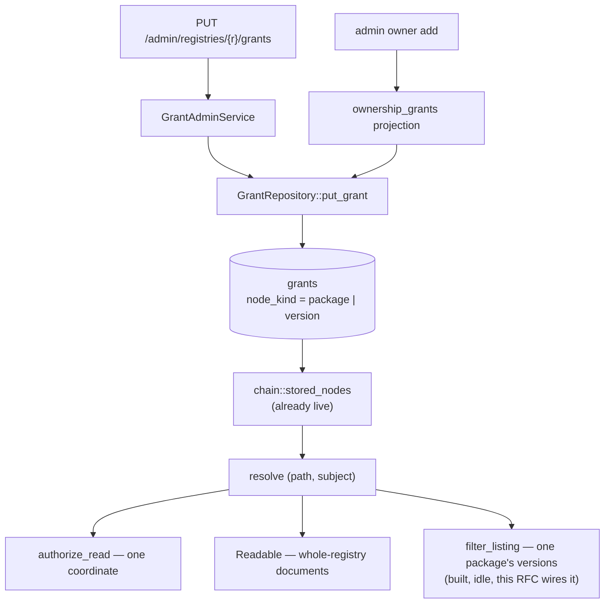
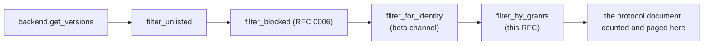

# RFC 0017 — Writing grants at the package and version tiers

| Field       | Value                                                        |
| ----------- | ------------------------------------------------------------ |
| Status      | **Implemented** — all three phases. `grants:read`/`grants:write` are in the vocabulary and held by `role:admin` at the instance tier (§10 rule 5); `GrantAdminService` (`crates/core/src/services/grants_admin.rs`) is the write funnel; the three routes are `crates/web/src/handlers/back_office/governance/grants.rs`; `filter_by_grants` runs in `load_visible_versions` and gave `filter_listing`/`package_visibility` their first caller, in the same release, as §2.3 requires; the CLI is `batlehub admin grants list\|set\|rm` and the console panel is `ui/src/components/admin/PackageGrants.vue`. **§1's before/after example is wrong and is corrected below** — it describes a version grant *narrowing* what another subject sees, which §4.3's "grants only widen" forbids and `resolve` (a union) cannot express |
| Short       | Grants editor                                                 |
| Settles     | Who writes a package- or version-tier grant, and what §4.4 filters once they exist |
| Author      | Max Batleforc <maxleriche.60@gmail.com>                       |
| Co-author   | —                                                             |
| Created     | 2026-09-01                                                    |
| Supersedes  | —                                                             |
| Touches     | `crates/core`, `crates/adapters`, `crates/web`, `cli`, `ui`, docs |

---

## 1. Summary

RFC 0015 built the two deepest tiers of the grant hierarchy and left them without
an editor. The `grants` table has a `node_kind` of `package` or `version`
(migration 041), `GrantRepository` can write either, and `chain::stored_nodes`
reads both on every authorization — but the only code in the tree that ever calls
`put_grant` is the ownership projection, which writes **package** rows carrying
exactly three verbs. No caller has ever written a **version** row.

This RFC adds the missing writer: an admin API, CLI and console surface for
grants on a package or a version, and the per-version listing filter that becomes
load-bearing the moment a version row can exist.

The second half is not optional decoration on the first. RFC 0015 §4.4 rule 2
says a caller holding the read on a package but not on every version gets *the
filtered list*, and `filter_listing`/`package_visibility` were written for it and
have never been called — because with no version row to differ from the package
answer there has never been anything to filter. Shipping the writer without the
filter turns two functions that are correct and idle into two functions that are
correct and bypassed.

### Before / after

```text
# today
$ batlehub admin grants set npm @acme/billing --subject group:oidc1:eng \
      --actions releases:read
error: unknown subcommand `grants`

  — a package-tier grant is reachable only as a side effect of
    `batlehub admin owner add`, which writes releases:publish + owners:read +
    owners:write and nothing else. A version-tier grant is unreachable.

# with this RFC
$ batlehub admin grants set npm @acme/billing --subject group:oidc1:eng \
      --actions releases:read,releases:list
$ batlehub admin grants set npm @acme/billing@2.4.0-rc.1 \
      --subject group:oidc1:release-managers --actions releases:read
$ batlehub admin grants list npm @acme/billing
  node                     subject                          actions
  package:@acme/billing    group:oidc1:eng                  releases:read, releases:list
  package:@acme/billing    user:alice                       releases:publish, owners:read, owners:write  (from ownership)
  version:@acme/billing@2.4.0-rc.1  group:oidc1:release-managers  releases:read
```

::: warning This paragraph was wrong, and the correction is the interesting part

It originally read: *"An `eng` caller listing `@acme/billing` now receives every
version **except** `2.4.0-rc.1`, rather than a version index naming a release
candidate they cannot download."*

That describes a version-tier grant **narrowing** what a different subject sees,
and it contradicts this document's own §4.3 — *"Grants only widen. Nothing
written here can take away what a broader tier granted"* — as well as RFC 0015's
model, where `resolve` is a union over the path. `eng` holds `releases:read` on
the package, so it holds it on every version beneath, and a row written for
`release-managers` cannot subtract from that.

**What the filter actually does**, and what the implementation asserts: it is
what a caller holding `releases:list` **without** `releases:read` sees. That
caller's read verdict is decided per version, so a version-tier grant is the only
thing that puts a version in their index:

```text
$ batlehub admin grants set gems rails@2.0.0 --subject user:ci --actions releases:read

  ci  →  GET /proxy/gems/info/rails  →  2.0.0
         (1.0.0 and 3.0.0 are absent: ci holds the list, and the read on
          nothing else)

  eng →  GET /proxy/gems/info/rails  →  1.0.0, 2.0.0, 3.0.0
         (holds releases:read above; grants only widen, so nothing is removed)
```

Hiding a release candidate from a caller who holds the package read is
`Visibility::Private` on that version plus a grant re-admitting the audience —
visibility narrows, grants widen (§4.5), and the two stay separate mechanisms.
That is not built: visibility is a property of the package name today, applied to
all versions at once.

:::

---

## 2. Motivation

1. **The version tier is built, read on the hot path, and unwritable.** Migration
   041 constrains `node_kind IN ('package','version')`, `ports::version_node_key`
   formats `name@version`, and `chain::stored_nodes` passes the version into
   `grants_for` on every `authorize`. Every one of those runs today against rows
   that cannot exist. A tier the resolver walks and nothing can populate is worse
   than an absent feature: it is a cost paid on every request for a capability
   nobody has.

2. **The package tier has a writer that can express three verbs.** The ownership
   projection (`services/ownership_grants.rs`) puts `releases:publish`,
   `owners:read` and `owners:write`. There is no way to grant `releases:read` on
   one package to one group — the motivating example of RFC 0015 §4.4's own
   opening sentence. The projection code already anticipates the writer that does
   not exist: `project_remove` keeps verbs it did not write, commented *"Something
   else wrote verbs for this subject on this package. Losing an owner is not a
   reason to lose those."* Nothing else writes them.

3. **§4.4 rule 2's second half has never been reachable, and will become
   reachable silently.** `filter_listing` and `package_visibility` have no
   caller — audited 2026-09-01. Today that is correct rather than a hole: with no
   version row, a caller's `releases:read` verdict is uniform across every
   version, so the package-tier decision is the whole answer. The first
   version-tier grant changes that with no other code change and no error: index
   documents keep listing versions the caller may not read. The download gate
   still refuses them one at a time, so what leaks is the existence and the
   numbers, not the bytes — inside a package the caller is already allowed to
   list. Bounded, and precisely what rule 2 decided against.

4. **RFC 0015 deferred the editor to "phase 4", and phase 4 shipped without
   it.** §12's decision log records: *"No grants editor before phase 4. …
   config-file-first is right for the registry and namespace tiers because those
   grants are reviewable and diffable; the editor is only needed for the package
   and version tiers, which do not exist until phase 4."* Those tiers now exist.
   RFC 0015 is marked Implemented, so the deferral has no document left to sit
   in.

---

## 3. Goals / non-goals

**Goals**

- An operator can grant a subject any verb on one package or one version, and
  take it away, without editing the config file or restarting.
- A version index returns the versions the caller may read, and a count and
  pagination computed on that set — RFC 0015 §4.4 rules 1 and 2.
- A filtered listing is never served from a cache key that does not name the
  grant set (§4.4 rule 3).
- The ownership projection and the new editor write the same rows without
  fighting: adding an owner and granting a verb are two writers on one table.

**Non-goals**

- **Grants at the registry or namespace tier stay in the config file.** §4.3's
  argument holds and this RFC does not reopen it: those grants are broad, and
  broad authorization belongs in something reviewable and diffable. The editor is
  for the two tiers a config file cannot reasonably enumerate.
- **No sealing from the API.** An empty action set is what a *seal* is (§4.3),
  `ck_grants_actions_non_empty` refuses one, and a seal is a config-file
  statement. Removing every verb deletes the row, exactly as `project_remove`
  already does.
- **No new verbs.** This is a writer for the vocabulary RFC 0015 §4.2 defines.
- **No expansion at evaluation time.** `releases:*` expands at write, as §4.2
  requires; the stored row carries the expanded set. That is already what
  `StoredGrant::actions` documents.
- **No UI for the version tier in phase 1.** The console gets the package tier
  first; a per-version grants panel is worth its own review once the API exists.

---

## 4. User-facing design

### 4.1 API

```text
GET    /api/v1/admin/registries/{registry}/grants?package=<name>[&version=<v>]
PUT    /api/v1/admin/registries/{registry}/grants
DELETE /api/v1/admin/registries/{registry}/grants
```

`PUT` body:

```json
{
  "package": "@acme/billing",
  "version": "2.4.0-rc.1",
  "subject": "group:oidc1:release-managers",
  "actions": ["releases:read"]
}
```

`version` absent addresses the package node; present, the version node. The verb
is `grants:write` for the mutations and `grants:read` for the listing — new
entries in RFC 0015 §4.2's control vocabulary, held at the instance tier by
`role:admin` under §10 rule 5, and delegable per registry like every other
control verb.

### 4.2 CLI

```sh
batlehub admin grants list npm @acme/billing
batlehub admin grants set  npm @acme/billing --subject group:oidc1:eng --actions releases:read,releases:list
batlehub admin grants set  npm @acme/billing@2.4.0-rc.1 --subject user:alice --actions releases:read
batlehub admin grants rm   npm @acme/billing --subject group:oidc1:eng
```

`name@version` in the positional argument selects the version node, matching
`version_node_key`'s own spelling so the CLI and the storage key read the same.

### 4.3 Behaviour rules

- **A write replaces that subject's row on that node**, never the node's other
  rows. `put_grant` already documents why: two rows for one subject would make
  the union depend on read order.
- **Removing every verb deletes the row.** There is no empty-set row to write.
- **Ownership verbs are not editable through this surface.** A `PUT` that would
  drop `releases:publish`, `owners:read` or `owners:write` from a subject that
  holds them by ownership is refused with `409`, naming `admin owner rm` as the
  way to do it. Two writers on one row is fine; two writers on one *verb* is a
  race with no winner, and the ownership projection would silently restore what
  the editor removed on the next owner change.
- **Grants only widen** (§4.3). Nothing written here can take away what a broader
  tier granted; a "deny" is not expressible and is not becoming expressible.

### 4.4 Validation

`PUT` rejects:

| Condition | Rationale |
| --- | --- |
| Unknown action name | An unrecognised verb silently granting nothing is §13.17's shape: a config that looks applied and is not |
| Unparseable subject spelling | Same; `SubjectMatcher` already has one parser and this uses it |
| Empty `actions` | A seal is a config-file statement (§4.3), and the table constraint refuses it anyway |
| `version` present and the package has no such version | A grant on a coordinate that does not exist is a typo more often than a plan, and the row would resolve for nobody |
| A verb held through ownership | See §4.3 |

Warnings (surfaced on the response and in `explain`):

| Condition | Behaviour |
| --- | --- |
| The subject already holds the verb from a broader tier | Written, and reported as redundant. Grants union, so this is legal and inert — and an operator who wrote it believed it did something |
| A version-tier grant on a yanked or deleted version | Written, and reported. The coordinate is spent; the row will resolve for nothing |

---

## 5. Architecture

### 5.1 Where the write lands, and what already reads it



The invariant this protects: **there is one writer path and one reader path.**
The editor does not get its own table, its own cache or its own resolution — it
writes the rows the resolver already walks, which is why the authorization half
of this RFC is small. What is new is a writer and one filter.

### 5.2 Where the version filter goes

The package-level half of §4.4 is enforced by `Readable`
(`services/authz/filter.rs`), consulted by `local_registry/read.rs` for every
whole-registry document. The version-level half belongs one layer in, at
`LocalRegistryService::load_visible_versions` — the single funnel every version
index already passes through, beside `filter_unlisted`, `filter_blocked` and
`filter_for_identity`.

That placement is the whole of rule 1's compliance for local documents: the
funnel returns the filtered `Vec<PublishedPackage>`, and every protocol handler
counts and pages what the funnel returned. Nothing downstream can compute a total
over rows the caller may not see, because nothing downstream ever holds them.



---

## 6. Detailed design

### 6.1 `crates/core`

- `services/grants_admin.rs` (new) — `GrantAdminService`, the write funnel:
  validation, the ownership-verb refusal, expansion of `releases:*`, and the
  redundancy warning. A service rather than handler code, so the CLI and the API
  cannot disagree about what a legal grant is.
- `services/local_registry/read.rs` — `filter_by_grants`, called from
  `load_visible_versions` after `filter_for_identity`. Resolves once per package
  and asks per version; the rows for both tiers arrive in the `grants_for` call
  `stored_nodes` already makes.
- `services/authz/filter.rs` — `filter_listing` and `package_visibility` acquire
  their caller. The module header's "waiting for a writer" note is deleted in the
  same commit, because a note that outlives its subject is the next reader's
  wrong turn.

### 6.2 `crates/adapters`

- Nothing. `PgGrantRepository` implements every method this needs, and migration
  041's constraints already refuse an empty action set and a duplicate
  `(registry, node_kind, node_key, subject)`.

### 6.3 `crates/web`

- `handlers/back_office/governance/grants.rs` (new) — the three routes, guarded
  by `require_verb(GrantsWrite | GrantsRead)`.
- `handlers/back_office/authz_explain.rs` — **this was wrong, and the correction
  is below (§12).** `explain` did *not* resolve through the same path: the stored
  tiers are appended by `authorize_grants` after a short-circuit no diagnostic
  reaches, so it answered `deny` where the server answers `allow`.
  `access_check.rs` had the same defect. Both now take
  `resolution_path_for_coordinate`.

### 6.4 `cli`

- `cli/src/cli/admin.rs` — `admin grants list|set|rm`.

**Deliberately untouched**, so reviewers do not go looking:

- `server/src/grants.rs` — builds the registry and namespace tiers from config.
  Those tiers are a non-goal here.
- `services/ownership_grants.rs` — the projection stays exactly as it is. It is a
  second writer on the same table by design, and §4.3's `409` is what keeps the
  two from overwriting each other.
- The proxy read path — a proxied version document is filtered by
  `ProxyService::version_document` for blocks; grants at the version tier apply
  to locally published versions, and a proxied coordinate has no local row to
  hold a grant against.

---

## 7. Security considerations

- **The new surface is authenticated and admin-gated.** `grants:write` is a
  control verb, held at the instance tier by `role:admin` under §10 rule 5, and
  delegable per registry exactly like `cache:evict` or `audit:purge`.
- **A grant cannot narrow.** Everything writable here widens (§4.3), so the worst
  a wrong write does is grant access, not silently revoke it. That is the
  direction an audit trail can catch after the fact, which is why every mutation
  records one.
- **The filter closes a disclosure rather than opening one.** Before this RFC a
  version-tier grant is unwritable, so no listing under-filters. The filter and
  the writer must land in the same release: the writer alone is the disclosure
  described in §2.3.
- **Rule 3 is a hard requirement, not a follow-up.** Any cache in front of a
  filtered listing is keyed by `GrantSet::cache_key` or it is not cached. Survey
  finding 11 is the precedent already paid for: the search cache held merged
  local hits under an identity-blind key and replayed one caller's private
  results to the next.
- **Every mutation is audited.** New `AccessAction` variants `GrantWrite` and
  `GrantRevoke`, carrying the coordinate and the subject — the question after an
  incident is "who could read this and since when", and a grant write is the only
  event that answers it.

---

## 8. Alternatives considered

| Alternative | Why rejected |
| --- | --- |
| Config-file grants at the package and version tiers | §4.3 already rejected it for these tiers, and the estate sizes §11.7 measures make it absurd: a config file enumerating grants for 200 000 packages is not reviewable, which was the entire argument for keeping the broad tiers in config |
| Extend the ownership API instead of a new surface | Ownership means three specific verbs on one package. Widening it to arbitrary verbs makes "owner" mean nothing, and the cargo owners API is a view over it (§5.1) — it would start reporting subjects that are not owners |
| Ship the writer now, the filter later | §2.3: the gap is silent, and the release between them is a release that lists versions the caller may not read. The filter is idle code today and becomes the thing that makes the writer safe |
| Filter in the handlers rather than in the funnel | 76 call sites, each free to compute a total before filtering — rule 1's failure mode exactly. The funnel is the reason `load_visible_versions` exists |
| Deny-grants at the version tier instead of filtering | A deny in a model that only unions is a second composition rule pointing the other way, and §4.5 gives the account of why visibility (which narrows) and grants (which widen) stay separate mechanisms |

---

## 9. Rollout and compatibility

- **Default behaviour when nothing is configured**: unchanged. No version-tier
  row exists in any estate today, so the filter removes nothing until an operator
  writes the first grant.
- **Config migration**: none. `CURRENT_CONFIG_VERSION` does not move — this adds
  no config key.
- **Schema migration**: none. Migration 041's table already carries both tiers.
- **Operator prerequisites**: none beyond an admin token.
- **Rollback**: the rows persist. Reverting the code leaves version-tier rows in
  the table that the resolver still reads and no filter acts on — which is the
  §2.3 disclosure. A rollback that matters therefore deletes
  `WHERE node_kind = 'version'`, and the release note has to say so.

---

## 10. Test plan

- **Unit** (`crates/core/src/services/grants_admin.rs`): expansion of
  `releases:*` at write; the ownership-verb `409`; empty-actions refusal; unknown
  subject and unknown action refusals; the redundancy warning fires on a
  broader-tier duplicate and not otherwise.
- **Unit** (`crates/core/src/services/authz/filter.rs`): `filter_listing` and
  `package_visibility` keep their existing tests and gain a caller — the tests
  that have been asserting an idle function start guarding a live one.
- **Unit** (`crates/core/src/services/local_registry/read.rs`): a version-tier
  grant on one version of three yields one version to a caller whose package
  grant does not cover it; no version-tier row yields all three, byte for byte
  what the funnel returns today.
- **Integration** (`crates/web/tests/authz_matrix.rs`): ~~the matrix gains a
  version-tier row~~ — **withdrawn, and the reason is the appendix below.** The
  matrix's rows are read routes, and every one of them gates on `releases:read`
  at the handler; §4.4's configuration is a caller holding `releases:list`
  *without* the read, who is refused before the funnel the filter lives in. A row
  there would assert a `403` that the handler gate produces and the filter never
  sees — §13.17's own failure mode, a denial for the wrong reason. The filter is
  observable on the rubygems compact index and is asserted there instead. What
  the matrix does still owe is the inert direction: it must pass unchanged with
  no version-tier row in the table, which it does.
- **Integration** (`crates/web/tests/grants_editor.rs`): the three routes, the
  verb gate, and `explain` reporting a package- and a version-tier grant's
  provenance — the last of which failed against the code §6.3 said needed no
  change.
- **Integration**: a filtered version index served twice to two callers with
  different grant sets returns two different documents — rule 3, asserted rather
  than assumed.
- **Heavy** (`tests/heavy/authz.sh rubygems`): the writer and the filter under
  Bundler. Three versions are published, one is granted to a list-only caller,
  and the assertion is that `bundle install` resolves to **`2.0.0` while `3.0.0`
  exists and is newer** — a real resolver picking what the grant left. This is
  the arm that found the `/versions` defect below; every `curl` assertion about
  `/info` passed while it was broken.
- **Heavy** (`tests/heavy/authz.sh matrix`): the pair over `curl` against a
  running server and a real Postgres. Not optional and not a nicety — that suite
  reads the verb list out of `permission.rs` at run time and fails on any verb
  nothing exercised, so adding `grants:read`/`grants:write` to the vocabulary
  *breaks it* until the section exists. It is also where §11.6's oracle is asked
  about a version-tier row on the same server that just accepted it, which is
  the check §6.3's mistake would have survived in-process.
- **Existing suites that must pass unchanged**: `authz_matrix.rs` on every route
  that has no version-tier grant (the filter must be inert when the table is
  empty), `local_npm_registry.rs` and its siblings for the untouched protocol
  documents, and `pg_grants.rs` for the storage layer this adds nothing to.

---

## 11. Decisions and open questions

### Resolved

| # | Question | Decision |
| --- | --- | --- |
| 1 | Config file or API for these tiers? | **API.** §4.3 settled it for the broad tiers and gave the reason the deep ones differ: a config file cannot enumerate 200 000 packages, and these grants are written per package by people who are not editing the deployment |
| 2 | Does the ownership projection stay? | **Yes, unchanged.** It is the cargo owners API's storage (§5.1). Two writers on one table is the design; the `409` on ownership verbs is what keeps them from fighting over one row |
| 3 | Writer and filter in one release? | **Yes.** The gap between them is a release that under-filters, silently (§2.3) |

### Still open

All three closed as recommended; kept here because the reasoning is what the
answers rest on.

1. ~~**Does the version filter apply to proxied documents?**~~ **Closed: local
   only.** `filter_by_grants` runs in `load_visible_versions`, the local funnel —
   a proxied version has no local row to hang a grant from. `GrantAdminService::set`
   refuses a version the local backend does not hold, so the grant that "appears
   to apply and does not" cannot be written in the first place; with no local
   backend the check degrades to *not checkable* rather than to *refused*.

2. ~~**Should `grants:read` be separate from `audit:read`?**~~ **Closed:
   separate.** The audit log says what a subject *did*; a grant listing says what
   they *may do*, and enumerates the subjects that can reach a private package.
   That is the larger of the two disclosures, and the `audit:read`/`audit:purge`
   split is the precedent.

3. ~~**Does the console get the version tier in phase 3, or later?**~~ **Closed:
   later, but the rows are shown.** The panel edits the package tier and renders
   version-tier rows read-only, pointing at the CLI. Deferring the *editor* is the
   recommendation; deferring the *display* would have made the panel answer "who
   can reach this package" with half the rows, which is the question it exists for.

---

## 12. Implementation phases

| Phase | Content | State |
| --- | --- | --- |
| 1 | `grants:read` / `grants:write` in the vocabulary, `GrantAdminService`, the three routes, the audit actions | **Built.** The interlock phase 1 describes — refusing `node_kind = version` until phase 2 lands — was never needed: phases 1 and 2 shipped in one change, which is the guarantee the interlock existed to provide |
| 2 | `filter_by_grants` in `load_visible_versions`, wiring `filter_listing` and `package_visibility` | **Built, in the same change.** Those two have their first caller. Rule 3 landed with them: `DocumentAudience` gained `version_read_grants`, because the rubygems compact index filters every version of every gem and two callers differing by one version row are entitled to different documents |
| 3 | CLI `admin grants list\|set\|rm`, then the console's package-tier panel | **Built.** The CLI takes `name` or `name@version`, splitting on the *last* `@` so a scoped npm name is not read as a version node. The console edits the package tier and shows the version tier read-only |

### What building it changed

Nine departures from §6, each because the code disagreed with the plan:

- **`crates/adapters` was not "Nothing".** Two `GrantRepository` methods were
  added: `version_grants_for_package` (the filter's one query per package —
  asking `grants_for` per version would be the N+1 §13.2 measured at 806× on a
  package with four hundred versions) and `version_grants_in_registry`
  (`package_grants_in_registry`'s twin, which rule 3's cache key needs). Both are
  one indexed query; neither is on the fast path.
- **The filter needed a query-free fast path.** It runs inside
  `load_visible_versions`, which the rubygems `/versions` document calls once per
  gem. Resolving the config tiers first and returning early when they already
  grant `releases:read` means the common caller pays nothing — the rows are
  fetched only for a caller those tiers do not already satisfy.
- **The redundancy warning could never fire for `group:*:`.** §4.4's warning
  table promises a subject already holding a verb from a broader tier is told so.
  `synthetic_subject` builds the caller a matcher describes, and for a
  wildcard provider it built a **bare** group string — while `group_matches`
  requires the `<provider>:` prefix to be present and non-empty, answering
  `false` for a bare one. The synthetic identity was therefore rejected by its
  own matcher, and the warning was structurally unreachable for that spelling.
  Fail-safe, so it was silent: a message not printed, never a grant not written,
  which is why it needed a test rather than surfacing as a bug.
  `authz_explain::identity_for` had already met this and solved it the same way;
  the two stay separate functions — they disagree about `*` and `token:` — but
  they now agree here, and each says so.

- **The filter reintroduced the N+1 it was written to avoid.** `filter_by_grants`
  asks two questions per package — the version rows under this name, and the
  package node — and a whole-registry document asks it once per package. The
  query-free fast path §12 records covers a caller the config tiers already
  grant `releases:read`, which is *not* the caller this feature is for: one
  holding a package-tier read is admitted to the document, does not short-circuit
  (the fast path resolves the config tiers only), and pays both queries. That is
  the shape §13.2 measured at 806×, on the estate sizes §11.7 gives — and the
  ownership projection writes package-tier rows, so it is the common estate, not
  a corner. The document already fetches both row sets registry-wide to build
  `Readable` and the cache key; `RegistryGrantRows` hands them down, and
  `crates/core`'s `a_whole_registry_document_costs_no_per_package_query` counts
  the queries rather than timing them: 5 on a four-package fixture before, 0
  after.

- **`list_for_package` could not see a grant whose version was deleted.** It
  enumerated versions through `VersionLookup` and asked `grants_on_node` per
  version, under a comment saying the port offered no "every version row of this
  package" query — which this RFC had itself made false by adding
  `version_grants_for_package`. Driving the listing off the version list meant a
  row on a deleted version kept resolving (`version_grants_in_registry` still
  feeds it to `Readable::with_version_grants`) while `GET /grants`, the CLI and
  the console panel all showed nothing: undiscoverable through the surface built
  to remove it. With no local backend the whole tier was writable and never
  listed. Reading the rows themselves has neither failure, does not depend on the
  backend, and is one query instead of one per version.

- **An emptied listing is not an absent package, and Hybrid could not tell.**
  The filter's terminal case — §4.4 rule 2 removing the *last* version a caller
  may read — reaches `load_visible_versions_or_not_found` with
  `emptied_by_blocking` false, so it answered `NotFound`. On a Hybrid registry
  that variant is the fall-through signal: every handler reads it as *"we do not
  host this, ask upstream"*. An internal package whose versions this caller may
  not read was therefore answered with the **public package of the same name** —
  the dependency-confusion substitution that function's own doc comment was
  written to prevent for administratively blocked packages, arriving through the
  door this RFC opened. `crates/web/tests/grants_editor.rs` demonstrates it:
  reverted, the test receives `200` and upstream's `1.1.0` and `2.0.0-beta.1`.

  `CoreError::NotFoundWithheld` renders as `404` — hidden means absent, and a
  `403` would confirm the name — but is not the variant the Hybrid arms match,
  so it fails **closed** at all seventeen of them by construction. One arm did
  not match on the variant at all: rubygems' compact index read `Err(_) => {}`
  and fell through on *every* error, which had been defeating the blocked-package
  protection too. That is fixed in the same change.

- **The whole-registry index dropped the name before the filter could see
  it.** Every such document gates each package on `Readable::contains`, which
  composed the config and package tiers and stopped there — so a caller whose
  only grant was a version-tier row was told the package does not exist, and
  `load_visible_versions` (where `filter_by_grants` lives) was never called for
  it. `/info/{gem}` filtered correctly the whole time, which is why nothing
  caught it: `curl` asks `/info` directly, and **Bundler does not**. It resolves
  from `/versions`, and an empty one sends it to the legacy `specs.4.8.gz` index
  this server answers `404` — so the install failed with *"could not fetch
  specs"* and the correctly-filtered document was never requested. The grant was
  writable, visible in `explain`, and asserted in `/info`; it was unusable by the
  one client that resolves from these documents. `Readable::with_version_grants`
  admits the name; the version list behind it is unchanged, and `live.is_empty()`
  drops a name whose versions all filter away. Not a disclosure — it failed
  closed — but the §4.4 rule-2 story was unreachable in practice.

- **`explain` did need a change, and so did `access-check`.** §6.3 said the
  diagnostics already reported the two new tiers "because it resolves through the
  same path". They did not resolve through the same path. `resolution_path`
  composes the tiers a config file declares; the stored ones are appended by
  `authorize_grants` *after* a short-circuit that returns as soon as the config
  tiers hold the verb. A diagnostic is asked about exactly the callers they do
  not hold it for, so both endpoints answered `deny` where the server answers
  `allow` — and `explain` listed `package:…` and `version:…` in `tiers_walked`
  while doing it, reporting that it had looked where it had not. Before this RFC
  the blast radius was the ownership projection's three verbs; the editor makes
  it any verb on either tier. Both now call
  `resolution_path_for_coordinate`, which is `resolution_path` plus
  `stored_nodes` — the enforcement path keeps its short-circuit, because grants
  union and the two therefore agree.

- **`GrantAdminService` does not take `LocalRegistryBackend`.** It needs one
  question answered — does this version exist, and is it spent — so it takes a
  four-line `VersionLookup` instead of a 22-method trait. A rule whose test double
  costs a page is a rule that ends up asserted through HTTP or not at all.

### Where the filter is observable

Worth stating, because it is not every route. §4.4's configuration is a caller
holding `releases:list` **without** `releases:read`, and most version-document
routes gate on `releases:read` at the handler
(`serve_local_or_proxy_document(..., Action::ReleasesRead, ...)`) — so such a
caller is refused before the funnel and the filter never runs. The rubygems
compact index in `Local` mode authorizes *inside* the funnel, through
`check_read_access`'s `releases:list`, which makes it the surface where rule 2's
second half is reachable — and the one document cached under `DocumentAudience`,
which is why rule 3 matters exactly there. `crates/web/tests/grants_editor.rs`
asserts it through those routes rather than through the service.

### The ownership command is `owners`, not `admin owner`

This document says `admin owner add` and `admin owner rm` (§2, §5.2, §6.3). The
command shipped as a **top-level** `batlehub-cli owners add|remove|list`, because
ownership is a package-level fact a maintainer manages, not an instance-level one
an administrator does — the same reading that puts `publish` at the top level and
not under `admin`.

The body is left as it was proposed. What was not left alone is the refusal
message: `GrantAdminService`'s ownership conflict told the operator to *"Use
`admin owner rm`"*, a command that has never existed, which left the one reader
who hit that `409` with no way forward. It now names `batlehub-cli owners
remove`.
