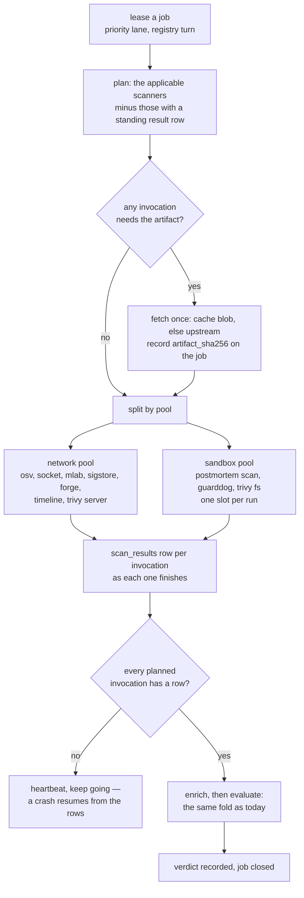
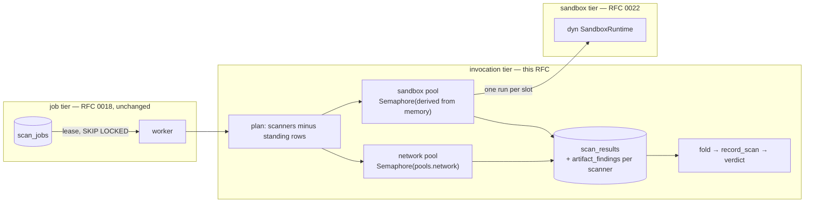
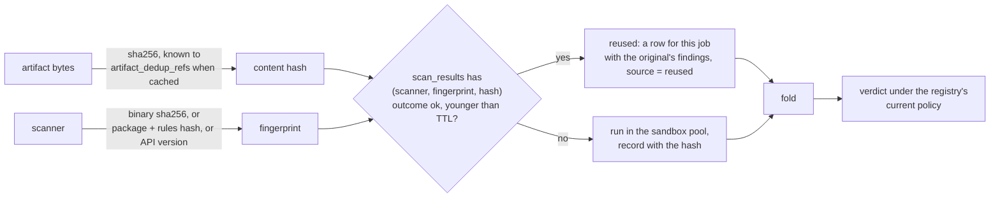
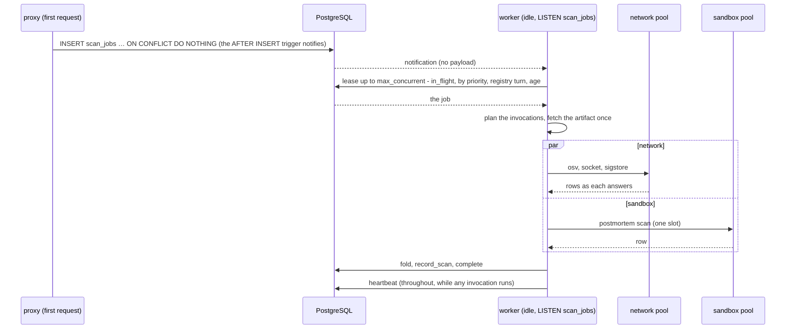

# RFC 0018-bis — The worker under load: invocations, slots, and results by content

| Field       | Value                                                        |
| ----------- | ------------------------------------------------------------ |
| Status      | Draft                                                         |
| Short       | Worker under load                                             |
| Settles     | How one worker turns a job into concurrent, resumable, content-cached scanner invocations, and how a fleet of them drains a backlog |
| Author      | Max Batleforc <maxleriche.60@gmail.com>                       |
| Co-author   | —                                                             |
| Created     | 2026-09-10                                                    |
| Supersedes  | —                                                             |
| Complements | RFC 0018 — the worker's inner loop (§5.4, §6.3): what happens between a lease and a verdict, which 0018 left sequential, all-or-nothing and unshared |
| Depends on  | RFC 0022 for the sandbox slot: a run's memory cost is `memory_limit_mb + max_extracted_mb` there, and this RFC sizes its pool from it |
| Touches     | `crates/core`, `crates/adapters`, `crates/config`, `server`, `helm`, docs |

---

## 1. Summary

RFC 0018 put the scan queue in PostgreSQL, gave it four priority lanes and
an anti-starvation slot, deduplicated open jobs per coordinate, and scaled
worker replicas on queue depth. That skeleton is right and this RFC keeps
it. What it changes is everything *inside* one worker between a lease and
a verdict. Today `ScanWorker::run_once` leases up to `max_concurrent` jobs
and runs them **one after the other**; `run_job` runs a job's scanners
**one after the other**; `record` writes the findings and the `scanners_done`
list **once, at the end**; and a lease that expires on the third scanner
re-runs the first two. A worker's parallelism is one, a crash is a full
retry, and the same bytes republished under another name are scanned again
from nothing.

This RFC makes the **invocation** — one scanner over one job — the unit of
work. A leased job is turned into a *plan* of invocations; each runs from
one of two pools, a **network pool** for the scanners that call out and a
**sandbox pool** whose slot count is derived from the memory the worker has
and the memory one sandbox costs; each records its own result row as it
finishes, so a retry re-runs only what is missing and `max_attempts` counts
per invocation. The verdict becomes a fold over the rows, computed the
moment the last one lands. Scanners that judge *bytes* rather than a
*coordinate* — `trivy`, `postmortem scan`, GuardDog, the SBOM gate —
declare it, and their results are keyed on the scanner's fingerprint and
the artifact's SHA-256, which the deduplicating storage router already
knows: a mirror, a re-publish under a new name, or a rescan after nothing
changed reuses the row instead of the sandbox. Around it, three smaller
things: workers wake on a `NOTIFY` instead of a two-second poll, the lease
takes turns across registries inside a lane, and the fleet scales on the
**age** of the oldest open job rather than on depth, which cannot tell a
backlog that is draining from one that is falling behind.

Nothing a client sees changes. The verdict model, the reason codes, the
policies and `batlehub why` are byte-identical; what changes is how many
sandboxes one worker keeps busy, how much of a job survives a crash, and
how many times the same bytes are opened.

### Before / after

```text
# today — one job at a time, one scanner at a time, everything at the end
INFO security worker: leased 4 jobs
INFO security worker: verdict recorded package=npm:left-pad@1.3.0 to=allowed   (38 s later; the other three waited under lease)
WARN security worker: job failed package=pypi:requests@2.32.0 error=scanner timed out   (postmortem and trivy had answered; all three run again)

# with this RFC — invocations, from two pools, each recorded as it lands
INFO security worker: pools network=16 sandbox=2 (cgroup 8192 MiB, reserve 2256 MiB, 2560 MiB per run)
INFO security worker: job npm:left-pad@1.3.0 planned: 5 invocations (2 reused by content, 2 network, 1 sandbox)
INFO security worker: invocation done package=npm:left-pad@1.3.0 scanner=trivy source=reused content=sha256:9f2c…
INFO security worker: invocation done package=npm:left-pad@1.3.0 scanner=osv source=ran 0.4s
INFO security worker: verdict recorded package=npm:left-pad@1.3.0 to=allowed   (6 s; three jobs ran beside it)
WARN security worker: invocation failed package=pypi:requests@2.32.0 scanner=guarddog attempt=2/3 error=scanner timed out   (the other four rows stand)
```

```toml
# today
[worker]
max_concurrent = 4       # the lease batch — and, in practice, nothing else

# with this RFC — the same key means what it says, and the pools are sized
[worker]
max_concurrent = 4       # jobs in flight at once, per worker

[worker.pools]
network = 16             # network-scanner invocations at once
sandbox = 0              # 0 = derived from the memory budget and one run's cost
memory_budget_mb = 0     # 0 = the cgroup's memory.max, else what is set here

[worker.results]
reuse_by_content = true  # content-scope scanners reuse a result for the same bytes
reuse_ttl_secs = 604800  # a reused result older than a week is run again
```

---

## 2. Motivation

1. **A worker's parallelism is one.** `ScanWorker::run_once`
   (`crates/core/src/services/scan_worker.rs`) leases up to `max_concurrent`
   jobs, then `for job in jobs { self.run_and_close(&job, …).await }`; inside,
   `run_job` does `for scanner in applicable { self.run_scanner(…).await }`.
   Four leased jobs are one running and three waiting under a lease they
   heartbeat. A fleet of four replicas with `max_concurrent = 4` has four
   sandboxes busy and twelve jobs leased and idle. `queued()` counts every
   job with `completed_at IS NULL`, leased or not, so those twelve still
   count as backlog and the HPA adds replicas for work the fleet has
   already taken and cannot start; `batlehub_scan_jobs_leased` reports four
   per worker as if all four were being worked on.
2. **A crash retries everything.** `run_scanner` accumulates `findings` and
   `done` in memory and `record` writes them once, after the last scanner
   and the enrichers. A lease that expires while GuardDog is on the third
   scanner (an OOM on a hostile archive, the case RFC 0018 §5.4 designs for)
   returns the job to the queue and the next attempt re-runs `postmortem`
   and `trivy`, which had answered. `max_attempts = 3` is three runs of
   every scanner, not three of the one that fails.
3. **The same bytes are scanned as many times as they have names.** The
   storage router deduplicates by content: `artifact_dedup_refs` maps every
   logical key to a `content_hash` (an artifact cached before dedup has no
   row and is hashed as it is read), and `scan_jobs.artifact_sha256` was
   created for this and is read back by `JOB_COLUMNS` — but nothing writes
   it. A tarball mirrored into two registries, re-published under a scoped
   name, or rescanned after a `rescan.interval_secs` during which neither
   the bytes nor the scanner changed, opens a sandbox for `trivy`,
   `postmortem` and GuardDog each time, and the three answer the same
   thing.
4. **Depth is the wrong signal to scale on.** The chart's HPA targets
   `batlehub_scan_jobs_queued` at `targetQueued = 20` per replica. A queue
   of 200 that drains at 50 a minute and a queue of 200 that grows by 50 a
   minute are the same number, and the second is the one that needs
   replicas. The age of the oldest open job per lane says which is which;
   nothing exports it.
5. **A worker sleeps two seconds between the enqueue and the lease.** With
   an empty queue `run` sleeps `idle_poll` (2 s) and polls. For a backfill
   it is nothing; for the first request on a version, where a person is
   looking at `SCAN_PENDING` (RFC 0018 §4.2), it is two seconds of a budget
   measured in tens. PostgreSQL has `LISTEN`/`NOTIFY` and the queue is
   PostgreSQL.
6. **Inside a lane, the first registry to burst wins.** `lease_ordered`
   orders by `priority, created_at`. Two registries both producing
   `first_seen` jobs are served in arrival order, so a registry that just
   saw a monorepo publish 400 versions parks every other registry's next
   first request behind them at the same priority.
7. **A rate limit is an answer today, and the wrong one.** RFC 0019 gave
   the forge clients a shared `rate_limit_budget` table; OSV, Socket and
   mlab have nothing shared, so a fleet multiplies its load on them by the
   replica count. When Socket answers `429`, `socket.rs` returns
   `ScannerError::Upstream` with a message that until 2026-09-10 read
   *"the job is retried"* (mlab's too) — and nothing retries it: `run_scanner` turns every `Err` into a
   `SCANNER_ERROR` finding on the spot, `evaluate` applies
   `scanner_error_effect` to it, and under the default `quarantine` the
   version is **held** until a rescan or an administrator's rescan. A
   transient rate limit becomes a quarantine. The two messages now say
   what happens ("no answer this scan — the policy's `scanner_error` mode
   applies until a rescan"); the behaviour they describe is what this RFC
   changes.

---

## 3. Goals / non-goals

**Goals**

- The unit of work is the **invocation**: one scanner over one job, with
  its own result row, its own attempts and its own timeout.
- A job whose worker died resumes where it stopped; only the invocations
  without a result run again.
- One worker keeps **several** sandboxes busy, and the number is derived
  from memory, never guessed: a worker cannot admit more sandboxes than it
  can hold.
- Network scanners and sandboxed scanners draw from **separate pools**, so
  a slow upstream never idles a sandbox slot and a heavy archive never
  blocks a lookup.
- A content-scope scanner's result is **reused** for the same bytes and
  the same scanner, across names, registries and rescans, with a TTL.
- Workers **wake on enqueue**; the poll remains as the fallback.
- The lease **takes turns across registries** inside a priority lane.
- The fleet scales on the **age** of the oldest open job per lane, and
  the metric exists whether or not the chart uses it.
- The verdict for a version is the same as today for the same scanner
  answers: `evaluate` is untouched; only *when* and *from what rows* it is
  called changes.

**Non-goals**

- Replacing the queue. PostgreSQL with `SKIP LOCKED` is not the ceiling of
  this system and will not be at any load this project targets (§8).
- Changing where a scanner's process runs. That is RFC 0022; this RFC
  consumes its `SandboxRuntime` and its per-run memory cost and adds
  nothing to it.
- Warm sandboxes, pre-fetching artifacts before a lease, or speculative
  scanning. A sandbox that exists before its job is rejected in RFC 0022
  §8 and stays rejected.
- Reusing results across *scanner versions*. A new `trivy` is a new
  fingerprint and a new result; the point of a rescan is that the scanner
  may have changed its mind.
- Any change to what a scanner finds, to the verdict model, the reason
  codes, the policies, or the client-facing surface.

---

## 4. User-facing design

### 4.1 Configuration

```toml
[worker]
# Jobs in flight at once per worker — leased *and* being worked on. This is
# what the key always said; until this RFC it was only the lease batch.
max_concurrent   = 4
job_timeout_secs = 600          # unchanged: one invocation's ceiling, and the lease
max_attempts     = 3            # now per invocation, for the errors that are retried (§4.2)
# The poll interval when the queue cannot notify (the in-memory queue, a
# connection that lost its LISTEN); on PostgreSQL the worker wakes on
# NOTIFY and this is only the safety net.
idle_poll_secs   = 2

[worker.pools]
# Network-scanner invocations at once: osv, socket, mlab, sigstore, the
# forge checks, postmortem's `timeline`, trivy against a server.
network          = 16
# Sandboxed invocations at once. 0 derives it:
#   floor((memory_budget_mb - reserve) / (sandbox.memory_limit_mb + sandbox.max_extracted_mb)), at least 1
# where reserve = 256 + max_concurrent × max_artifact_size_mb, the worker's
# own working set (§4.2). A value here may lower the derived number; one
# above it is refused at worker start (§4.3).
sandbox          = 0
# What the worker has. 0 reads the cgroup's memory.max (the pod's limit; on
# a bare host, the host's memory less 1 GiB); a value here overrides it for
# a worker that shares its cgroup with something else.
memory_budget_mb = 0

[worker.results]
# A content-scope scanner (§4.2) reuses a result recorded for the same
# artifact bytes and the same scanner fingerprint.
reuse_by_content = true
# Older than this, a reusable result is run again anyway. Keep it at or
# above the longest `[registries.security.rescan] interval_secs`, or a
# rescan reuses what it was meant to refresh (§4.3 warns).
reuse_ttl_secs   = 604800
```

Nothing is required. A config with today's `[worker]` block, or none, loads
and behaves as §4.2 says with every default: the pools are derived, reuse
is on, and `max_concurrent` finally means four jobs at once.

### 4.2 Behaviour rules

The life of one job, from lease to verdict:



- **A leased job is planned, not run.** `plan` lists the scanners the
  registry's profile names and that `supports(kind)`, exactly as today,
  then subtracts every one that already has a **standing** result row for
  this job (a previous attempt's) or, for a content-scope scanner, a
  **reusable** one (§4.2 *Results by content*). What is left is the plan;
  each entry is an invocation with `attempts = 0`.
- **A scanner declares its scope.** `ArtifactScanner` gains
  `fn scope(&self) -> ScanScope`: `Content { input }` for a scanner whose
  answer depends on what it read and nothing else, naming *what* it read —
  `Artifact` (`trivy fs`, `postmortem scan` with `online = false`,
  GuardDog) or `Sbom` (`trivy sbom`, the SBOM gate), so the reuse key is
  the hash of the artifact bytes or of the SBOM document respectively;
  `Coordinate` for one whose answer depends on the name, the version, the
  date, the registry, or a lookup (`osv`, `socket`, `mlab`, `sigstore`,
  the forge checks, `postmortem timeline`, `postmortem scan` with
  `online = true` — `--enrich` asks the code hosts by name — and every
  `RuleAsScanner`). The scope is answered per configuration, not per
  binary: the same `postmortem` is `Content` offline and `Coordinate`
  online. The default is `Coordinate`: a scanner that does not say is
  never reused.
- **A scanner declares its fingerprint.** `fn fingerprint(&self) -> String`:
  for a binary scanner the SHA-256 of the binary it runs (read once at
  build, from the image on the image runtimes of RFC 0022 — the probe
  reports it); for GuardDog the package version plus the hash of its rules
  directory; for a network scanner the API version string it targets. Two
  results are comparable only when the fingerprint is equal.
- **Two pools, one job.** Every invocation runs from the pool its scanner
  belongs to — `Content` and `postmortem scan` from the sandbox pool,
  everything else from the network pool — under a `tokio::sync::Semaphore`
  each. A job's invocations run concurrently across both pools; the job
  holds its lease and heartbeats while any of them is running. There is no
  ordering between scanners: none reads another's output, and the
  enrichers (`mlab`) run after the fold as today.
- **The sandbox pool is sized by memory.** One run costs
  `sandbox.memory_limit_mb + sandbox.max_extracted_mb` (RFC 0022 §4.2: the
  scanner's `RLIMIT_AS` plus the memory-backed `/work`). The worker keeps
  a **reserve** for itself first: `256 MiB + max_concurrent ×
  max_artifact_size_bytes`, because `ScanInput.artifact` holds a job's
  bytes as `Bytes` for the life of the job and every job in flight may
  hold one (500 MiB by default). The pool is `floor((budget - reserve) /
  cost)`, at least 1, where the budget is the cgroup's `memory.max` unless
  configured. With the defaults — four jobs in flight, 500 MiB artifacts,
  2048 + 512 per run — an 8 GiB pod reserves 2256 MiB and runs **two**
  sandboxes; a 16 GiB pod runs five; a 4 GiB pod cannot hold one and §4.3
  refuses it with the arithmetic. The reserve is what it is because the
  artifact is held in memory; q3 records the follow-up that shrinks it.
  `pools.sandbox` may lower the derived number; a value above it is
  refused.
- **A job in flight holds a slot in `max_concurrent`**, and the lease
  batch is `max_concurrent - in_flight`, taken only when a slot frees. The
  three-of-four-idle case of §2 is gone: a leased job is always being
  worked on, and `batlehub_scan_jobs_leased` becomes a saturation gauge
  that means it.
- **Each invocation records itself — on its own row, not in
  `artifact_findings`.** When a scanner answers, a `scan_results` row is
  written carrying the outcome, the duration, the fingerprint, the content
  hash for `Content` scope, and **the findings themselves as JSON**.
  `artifact_findings` is still written once, by the verdict, at the fold:
  `batlehub why` and the console read that table beside the verdict, and a
  finding visible there before the verdict that judged it would be a
  finding with the wrong verdict next to it. When an invocation fails, what
  happens depends on the error, exactly as it does today for all but one
  class: `Unsupported`, `Output`, `Crashed`, `Timeout` and `Other` are
  answers on the first failure — a `SCANNER_ERROR` (or
  `SCANNER_UNSUPPORTED`) finding is written to the row and the row is
  `exhausted`, as `run_scanner` decides now. **Only `Upstream` is
  retried**: the invocation's `attempts` goes up, `last_error` is kept,
  `not_before` is set from `Retry-After` when there is one (capped at
  `job_timeout`), and it goes back to the plan; at `max_attempts` it is
  `exhausted` with the same finding. A rate limit is the one error that
  means "ask again", and it is the one this RFC asks again.
- **The verdict is a fold over the rows, taken when the last one lands.**
  With every planned invocation answered or exhausted, the worker runs the
  enrichers and calls `VerdictService::record_scan` with the union of the
  scanners' findings and the list of scanners that answered — the same
  call, the same `evaluate`, the same `scanners_done`. An `exhausted`
  invocation contributes its `SCANNER_ERROR` finding and is *not* in the
  list, so `record_scan` carries that scanner's previous findings forward
  exactly as it does today for a scanner that errored. A job whose every
  invocation was reused still reaches this step: the verdict is re-derived
  under the registry's *current* policy, which is what a rescan is for.
- **Resumption is the plan.** A worker that dies leaves the job leased
  until `leased_until`; the next worker to lease it plans again, finds the
  rows the dead worker wrote, and runs only the rest. Nothing is re-done
  that was recorded. Job-level `attempts` stays as RFC 0018's outer bound:
  a job re-leased `max_attempts` times without reaching the fold is closed
  by `exhausted` as today.
- **Results by content.** Before planning a `Content`-scope invocation the
  worker looks up `scan_results` by `(scanner, fingerprint,
  artifact_sha256)` for a row younger than `reuse_ttl_secs` whose outcome
  is `ok`. Found, the invocation is **reused**: a `scan_results` row is
  written for this job with the original row's findings (a `Finding`
  carries no coordinate of its own, only the scanner and what it saw),
  `source = reused` and the original's id, and no sandbox opens. The
  lookup needs the hash, so a job with any `Content { Artifact }`
  invocation fetches the artifact first — from the cache blob, whose hash
  `artifact_dedup_refs` already holds so no bytes are read for it; from a
  pre-dedup key or from upstream, hashed on the way as `artifact_bytes`
  streams it — and records `artifact_sha256` on the job; a `Content {
  Sbom }` invocation hashes the stored SBOM's canonical JSON instead. A
  `Coordinate`-scope scanner is never reused, whatever the bytes.
- **Wake on enqueue.** `PgScanQueue::enqueue` runs inside a statement that
  also `NOTIFY`s the `scan_jobs` channel with no payload; an idle worker
  `LISTEN`s on a dedicated connection and leases on the first
  notification, then falls back to `idle_poll_secs` while the connection
  is down. The notification carries nothing and grants nothing: the lease
  is still `SKIP LOCKED`, and a worker woken for a job another took simply
  finds none.
- **Turns across registries.** Inside a priority lane, `lease` orders by
  `priority, registry_turn, created_at`, where `registry_turn` ranks each
  registry's oldest open job by how long ago that registry was last
  leased *by anyone*; the anti-starvation slot of RFC 0018 decision 16 is
  unchanged. A burst on one registry still drains in order; it no longer
  parks the others' next job behind it.
- **Rate limits are the invocation's, not the job's, and they are
  retried.** A network scanner that answers `429` (Socket today, OSV under
  a burst) fails *its* invocation with `ScannerError::Upstream`, which is
  the retried class above; the job's other invocations are unaffected, and
  the job stays leased and heartbeats until `not_before` passes or
  `job_timeout` ends it. Socket's and mlab's `429` messages then change
  once more, to say that the invocation is retried and when. The network pool
  additionally reads RFC 0019's `rate_limit_budget` for the forge scanners,
  as that RFC said the worker would.
- **Embedded mode** (`roles = ["proxy", "worker"]`) derives the sandbox
  pool from the same cgroup, which the proxy shares; the docs say to set
  `memory_budget_mb` explicitly there, and §4.3 warns when it is derived
  in a process that also serves.

### 4.3 Validation

`AppConfig::validate()` rejects:

| Condition | Rationale |
| --- | --- |
| `pools.network < 1` | A pool of zero never runs the scanners the profile requires; the job would wait for `job_timeout` and fail. |
| `pools.sandbox` set above the derived value | The key is a ceiling on what memory allows; a value above it would admit a sandbox the budget cannot hold, which is the OOM §2 describes. Refused at *worker start*, where the cgroup is known, not at load. |
| `memory_budget_mb` (set or derived) less the reserve below one run's cost | A worker that cannot hold one sandbox beside its own working set can scan nothing; refused at worker start with the three numbers in the message. |
| `max_concurrent < 1` | Unchanged. |
| `reuse_ttl_secs < 3600` | A result reused for less than an hour is a cache that saves nothing and complicates every explanation. |

Warnings (logged at load, and printed as `!!` lines by `explain-config`):

| Condition | Behaviour |
| --- | --- |
| `reuse_ttl_secs` shorter than a registry's `rescan.interval_secs` | Allowed: the rescan re-runs the content scanners, as the operator seems to want; the warning names the registry. |
| `reuse_ttl_secs` *longer* than a registry's `rescan.interval_secs` | Allowed and expected: the rescan re-runs the coordinate scanners (OSV, the forges) and reuses the content ones; the warning says so once, at load, so nobody reads "rescanned" as "re-run trivy". |
| embedded mode with `memory_budget_mb = 0` | Derived from a cgroup the proxy shares; the worker takes half of it and says so. |
| `pools.network > 64` | Allowed; the warning points at the upstream rate limits the pool will meet first. |

---

## 5. Architecture

### 5.1 The invocation tier

RFC 0018 has a job tier (the queue, the lease, the replicas) and RFC 0022
has a sandbox tier (where one scanner's process runs). This RFC is the
tier between them: what one worker does with one leased job.



The invariant the tier protects: **a scanner's answer is written once and
survives the process that produced it.** Everything else — concurrency,
resumption, reuse — follows from every invocation having a row of its own.

### 5.2 Results by content



Reuse is safe for exactly one reason: a `Content`-scope scanner's answer
is a function of the bytes and the scanner, and the key is both. A policy
is *not* part of the key — the same `trivy` findings feed a `block`
profile and a `warn` profile and produce different verdicts, which is why
the fold always runs under the coordinate's own policy and the findings,
not the verdict, are what is reused.

### 5.3 Wake, turns and slots



---

## 6. Detailed design

### 6.1 `crates/core`

- `ports/scanner.rs` — `ArtifactScanner` gains `fn scope(&self) -> ScanScope`
  (default `Coordinate`) and `fn fingerprint(&self) -> String` (default: the
  scanner's name, which makes two builds of a scanner that does not say
  comparable — acceptable only for `Coordinate` scope, which is never
  reused; the doc comment says so).
  `ScannerError::Upstream` gains an optional `retry_after: Option<Duration>`
  carried from the response.
- `entities/security.rs` — `ScanScope { Content { input: ContentInput },
  Coordinate }` with `ContentInput { Artifact, Sbom }`;
  `ScanInvocation { job_id, scanner, attempts, not_before, last_error }`;
  `ScanResult { id, job_id, coordinate, scanner, fingerprint, scope,
  content_sha256: Option<String>, outcome: ResultOutcome, source:
  ResultSource, findings: Vec<Finding>, duration, recorded_at }` with
  `ResultOutcome { Ok, Exhausted }` and `ResultSource { Ran, Reused { of:
  Uuid } }`. `ScannerError::retryable()` — `true` for `Upstream` only.
- `ports/security.rs` — `ScanQueue` gains `lease` ordering by registry turn
  (a parameter, not a new method), `record_artifact_hash(job_id, sha256)`,
  and `wait_for_work(timeout) -> Result<bool, CoreError>` (returns on a
  notification or the timeout; the in-memory queue returns after the
  timeout). A new port, **`ScanResultStore`**: `standing(job_id) ->
  Vec<ScanResult>`, `reusable(scanner, fingerprint, sha256, max_age) ->
  Option<ScanResult>`, `record(result)` (one row, findings included),
  `invocation_failed(job_id, scanner, error, not_before)`,
  `exhausted(job_id, scanner)`.
- `services/scan_worker.rs` — restructured around `plan_job`,
  `run_invocation` and `fold`; `run_once` becomes the lease loop of §4.2
  (`max_concurrent - in_flight`, `wait_for_work` between passes). The two
  pools are `Arc<Semaphore>`s held by the worker; `run_invocation`
  acquires the right one, runs the scanner with `job_timeout`, and records
  through `ScanResultStore`. `run_scanner`'s finding-on-error mapping moves
  into `record`'s exhausted path unchanged. `WorkerConfig` gains the pool
  sizes and `memory_budget_mb`; **deriving them from the cgroup is
  `server`'s** (§6.4), `core` receives numbers.
- `services/verdict.rs` — untouched. `record_scan` is called with the same
  arguments it takes today; what changes is that they come from rows.

**Deliberately untouched**, so reviewers do not go looking:

- `services/rescan.rs` — a rescan enqueues a job as today; reuse is decided
  at plan time by the TTL, not by the trigger.
- `services/verdict.rs::evaluate` and every `ReasonCode` — a result reused
  is a result, and the fold does not know the difference.
- The proxy's `SCAN_PENDING` path, `batlehub why`, the console's verdict
  views — they read `artifact_verdicts` and `artifact_findings`, both of
  which keep their shape.

### 6.2 `crates/config`

- `schema/security.rs` — `WorkerConfig` gains `idle_poll_secs`,
  `pools: PoolsConfig { network, sandbox, memory_budget_mb }` and
  `results: ResultsConfig { reuse_by_content, reuse_ttl_secs }`, with the
  defaults of §4.1; `validate()` gains the load-time rows of §4.3. The
  start-time checks live in `server`.

### 6.3 `crates/adapters`

- `migrations/060_scan_invocations.sql` — `scan_invocations (job_id,
  scanner, attempts, not_before, last_error, PRIMARY KEY (job_id,
  scanner))` and `scan_lease_turns (registry PRIMARY KEY, last_leased_at)`;
  `scan_jobs` gains nothing (`artifact_sha256` exists and is now written).
- `migrations/061_scan_results.sql` — `scan_results (id, job_id, registry,
  package_name, version, scanner, fingerprint, scope, content_sha256,
  outcome, source, reused_of, findings JSONB, duration_ms, recorded_at)`
  with the lookup index `(scanner, fingerprint, content_sha256, recorded_at
  DESC) WHERE scope LIKE 'content%' AND outcome = 'ok'` and the job index
  `(job_id)`. `findings` is the scanner's own answer and is hostile data:
  read as JSON into `Vec<Finding>`, never interpolated, the same rule
  `artifact_findings.raw` carries.
- `migrations/062_scan_jobs_notify.sql` — an `AFTER INSERT` trigger on
  `scan_jobs` that `pg_notify('scan_jobs', '')`. A trigger rather than a
  second statement in `enqueue`, so the CLI's `backfill` and the rescan
  timer wake workers too without knowing to.
- `db/security.rs` — `PgScanQueue::lease_ordered` takes the order of
  §4.2: `ORDER BY priority, COALESCE(t.last_leased_at, 'epoch'), created_at`
  over a `LEFT JOIN scan_lease_turns t USING (registry)`, and the same
  statement upserts `scan_lease_turns` for the registries it leased — one
  small table, not a scan of `scan_jobs` per lease; `wait_for_work` over a
  `sqlx::postgres::PgListener` (the `postgres` feature the workspace
  already enables; no macros) on its own connection; `record_artifact_hash`.
  New `db/scan_results.rs` implementing `ScanResultStore`; `record` is one
  insert.
- `in_memory/security.rs` — the same two ports in memory, for the web and
  CLI suites; `wait_for_work` sleeps the timeout.
- `scanners/*.rs` — each binary scanner implements `scope()` and
  `fingerprint()` (the binary's SHA-256, computed once in the constructor
  from `command`; on RFC 0022's image runtimes, read from the probe
  report). `osv`, `socket`, `mlab`, `sigstore` return `Coordinate` and
  their API version; `socket` and `osv` carry `Retry-After` into
  `ScannerError::Upstream`.

### 6.4 `server`

- `setup.rs` — `build_scanners` unchanged but for passing the fingerprint
  source; a new `worker_pools(&WorkerConfig, &SandboxConfig) ->
  Result<Pools>` reads `/sys/fs/cgroup/memory.max` (cgroup v2; v1's
  `memory.limit_in_bytes` as the fallback; `max` or unreadable means the
  host's `MemTotal - 1 GiB`), applies the override, derives the sandbox
  pool, and performs the start-time refusals of §4.3.
- `main.rs` — `start_scan_worker` builds the pools and the result store
  and logs the line of §1 (`pools network=… sandbox=… (memory budget …)`).

### 6.5 `helm`, docs

- `values.yaml` — `worker.pools.*` and `worker.results.*` rendered into
  the worker's `config.toml`; `worker.autoscaling.metricName` defaults to
  `batlehub_scan_jobs_oldest_age_seconds` with `targetAge: 120` (seconds)
  and keeps `targetQueued` as the legacy alternative behind
  `worker.autoscaling.metric = age | queued`. The worker's `resources.limits.memory`
  comment explains that it *is* the sandbox pool: 8 GiB is two sandboxes
  at the defaults with four jobs in flight, and the arithmetic is in
  `docs/operations/scan-worker.md`.
- `docs/operations/scan-worker.md` — "What one pass does" is rewritten
  around the plan and the pools; a "Sizing a worker" section gives the
  arithmetic; "What to watch" gains the age metric and the reuse ratio.
- `docs/guide/configuration.md` — the new keys.

### 6.6 Observability

- `batlehub_scan_jobs_oldest_age_seconds{trigger}` gauge — the HPA input.
- `batlehub_scan_invocations_total{scanner, outcome, source}` counter —
  `outcome` = `ok`, `error`, `exhausted`; `source` = `ran`, `reused`.
- `batlehub_scan_pool_in_use{pool}` and `batlehub_scan_pool_size{pool}`
  gauges — saturation per pool; `sandbox` size is the derived number.
- `batlehub_scan_job_duration_seconds{registry, scanner, outcome}` keeps
  its name, its labels and its meaning — it is already per scanner, which
  is to say per invocation — and gains `source` (`ran`, `reused`). A new
  `batlehub_scan_job_total_seconds{registry, trigger}` histogram is the
  lease-to-verdict time, which nothing measures today.
- `batlehub_scan_results_reused_bytes_total{scanner}` counter — the bytes
  a reuse did not open, which is the number the reuse feature is judged on.
- Spans: one per job, one per invocation under it, with the pool, the
  scanner, the source and the sandbox run's fields (RFC 0022 §6.6) nested.

---

## 7. Security considerations

The invariant of RFC 0018 §7 — the worker never executes artifact-supplied
code with credentials in reach — is RFC 0022's to keep and this RFC does
not touch it. What this RFC adds is a second kind of trust: **a result
written by one run and believed by another.**

- **Reuse is keyed on the exact bytes and the exact scanner.** The key is
  the artifact's SHA-256 and the scanner's fingerprint, which for a binary
  scanner is the SHA-256 of the binary. Two coordinates share a result only
  when a collision-resistant hash says their bytes are identical and the
  same program judged them. An attacker who can make a hostile artifact
  hash like a clean one has broken SHA-256, not this design.
- **A reused finding is as trustworthy as the run that produced it, and no
  more.** A scanner that was wrong once is wrong for every coordinate that
  reuses it, for `reuse_ttl_secs`. That is already true of a scanner's
  *database* (a stale `trivy` DB is wrong for every scan) and the TTL
  bounds it the same way. A rescan after a scanner upgrade changes the
  fingerprint and re-runs; the TTL catches the rest.
- **Reuse never crosses a policy.** Findings are reused, verdicts are not.
  A coordinate under a `block` profile is judged by the fold under its own
  policy, whatever profile the original run's coordinate had.
- **Reuse never crosses a scope.** `Coordinate`-scope scanners — the ones
  whose answer depends on who published, when, and under which name —
  are never reused, whatever the bytes. A typosquat is a property of the
  name; the same tarball under `lodash` and `lodahs` gets the same `trivy`
  row and a different `postmortem timeline` row.
- **The result rows are the worker's, written with the worker's
  credentials, inside the wall's outer side.** Nothing inside a sandbox
  can write `scan_results`; the agent of RFC 0022 has one PUT on one key
  and it is not a table.
- **More sandboxes per worker is more blast radius per worker.** The pool
  is derived from memory so that the OOM a hostile archive causes is the
  sandbox's (RFC 0022 §2, its own cgroup on the image runtimes, `RLIMIT_AS`
  on `bwrap`) and never the worker's. On `bwrap`, where the runs share the
  worker's cgroup, the derived pool is what keeps `n × (memory_limit +
  max_extracted)` under the limit; a `pools.sandbox` above it is refused
  for this reason, not as a style rule.
- **The notification is a wake-up, not a message.** `NOTIFY scan_jobs`
  carries no payload; a worker that receives it still leases through
  `SKIP LOCKED`. Nothing an insert can say reaches the worker's parser.
- **Per-registry turns cannot be gamed into starvation.** A registry with
  no open job takes no turn; a registry that floods takes one turn per
  round like every other. The anti-starvation slot across lanes is
  untouched.

---

## 8. Alternatives considered

| Alternative | Why rejected |
| --- | --- |
| Replace the queue with NATS, Redis Streams or RabbitMQ | The queue is not the bottleneck: the scanner CPU is. A `SKIP LOCKED` lease is a few hundred microseconds and a fleet of fifty workers polling every two seconds is twenty-five leases a second. RFC 0018 chose PostgreSQL because every deployment has it; that reason has not changed. |
| Temporal or another workflow engine for the plan | A second stateful system for a plan that is one table and one fold. The plan's state is `scan_invocations` and `scan_results`; a workflow engine would hold the same rows somewhere else. |
| Scale only by replicas, keep one sandbox per worker | A worker pod sized for one sandbox wastes the memory of the network scanners' wait and cannot use a large node; a pod sized for three needs the pool to exist. Replicas stay the horizontal knob; the pool is the vertical one. |
| One Kubernetes Job per scan job | Rejected in RFC 0018 §8 and RFC 0022 §8 for the same reason: it is a worker replica with a controller's latency and a second object to sweep. |
| Reuse verdicts, not findings | A verdict is a policy's judgement of findings; two registries with different profiles must judge the same findings differently. Reusing the verdict would silently apply one registry's policy to another. |
| Reuse by coordinate on rescan (skip the content scanners when the bytes did not change) | A special case of reuse by content with a worse key: it needs the previous hash on the verdict and cannot help a mirror or a re-publish. The content key subsumes it. |
| Reuse across scanner versions with a "compatible" flag | The point of a scanner upgrade is that it may find something the old one did not. A fingerprint change is a new result, and the TTL is the only other expiry. |
| A shorter poll instead of `LISTEN`/`NOTIFY` | Polling at 200 ms from fifty workers is 250 queries a second for nothing; `LISTEN` is one idle connection per worker and a trigger. The poll stays as the fallback. |
| `scan_results` rows in `scan_jobs` (one row per invocation) | The job's identity — the coordinate, the trigger, the lease — is one thing and a scanner's answer is another; a row per invocation would carry the coordinate five times and make the open-job unique index meaningless. |
| Order the lease by registry round-robin *across* lanes | Fairness inside a lane is enough; across lanes, priority is the point (a `first_seen` on any registry outranks a `backfill` on every registry), and decision 16's slot already keeps the lowest lane moving. |

---

## 9. Rollout and compatibility

- **Default behaviour.** With no config change: the pools are derived from
  the cgroup (a worker that ran one sandbox at a time in a 4 GiB pod still
  runs one, in an 8 GiB pod two), `max_concurrent = 4` means four jobs in
  flight (it meant a batch of four before, of which one ran), reuse is on
  with a week's TTL, workers wake on `NOTIFY`. The observable change for an
  operator is throughput and `batlehub_scan_jobs_leased` becoming honest.
- **One behavioural change a client can see.** A transient `Upstream`
  error — a `429`, an upstream that did not answer — no longer becomes a
  `SCANNER_ERROR` verdict at once; the invocation is retried up to
  `max_attempts` with `Retry-After` honoured, and only then does the
  finding land. A version that was quarantined by a rate limit today is
  judged on a real answer tomorrow, a little later. Every other error class
  keeps today's timing.
- **`max_concurrent` changes meaning without changing name.** The docs and
  the release notes say so in one sentence: "it now does what it says". A
  deployment that tuned it high to widen the lease batch gets that many
  jobs in flight, bounded by the pools; the pools, not the number, are
  what limits load.
- **Migrations.** 060–062 are additive: three tables and one trigger. No
  existing row changes; `artifact_sha256` starts being written. No `CURRENT_CONFIG_VERSION` move — every new key
  has a default.
- **Mixed fleets during an upgrade.** An old worker and a new one can share
  the queue: the old one ignores `scan_invocations` and writes the verdict
  at the end as before; the new one plans from rows that do not exist and
  runs everything. A job leased by a new worker and re-leased by an old one
  after a crash is scanned in full by the old one, which is today's
  behaviour. Nothing is corrupted either way.
- **Rollback.** The previous release ignores the two tables and the
  trigger (an unread `NOTIFY` is nothing). Rows in `scan_results` stay and
  are harmless; a later re-upgrade reuses them within the TTL, which is
  correct.
- **Operator prerequisites.** None new for the worker. The HPA on age
  needs the same metrics adapter the HPA on depth needs, with a new rule
  for the new gauge; the chart's README carries both rules.

---

## 10. Test plan

- **Unit (`crates/core`, `services/scan_worker.rs` tests with the in-memory
  stores)**: a job with three scanners produces three result rows and one
  verdict; a worker "killed" after two rows (the test drops the future)
  resumes and runs only the third; an invocation failing `max_attempts`
  times writes one `SCANNER_ERROR` finding for that scanner and the verdict
  still lands; a `Content` scanner with a standing row within TTL is
  `reused` and its findings appear on the new coordinate; a `Coordinate`
  scanner with identical bytes is not; a reused result older than the TTL
  runs; the fold under a `warn` profile and a `block` profile from the same
  reused findings gives the two verdicts `evaluate` gives today; the
  sandbox pool admits exactly `floor(budget / cost)` runs at once
  (`Semaphore` permits observed); a `429` with `Retry-After` on one
  invocation leaves the others running and the job leased, and a `Crashed`
  on one is an answer at once; the findings of a landed invocation are not
  in `artifact_findings` until the fold.
- **Unit (`server`)**: `worker_pools` against fixture cgroup files — v2
  `memory.max` with a number, with `max`, unreadable; v1 fallback; the
  override; the refusal below one run's cost.
- **Integration (`crates/adapters/tests/pg_scan_worker.rs`, `task
  test:pg-scan`)**: `lease` takes turns across two registries in one lane
  while keeping `priority` first and decision 16's slot; `wait_for_work`
  returns within 100 ms of an insert made through a *separate* connection
  (the trigger, not the enqueue method); `record` writes one row whose
  `findings` read back as the `Vec<Finding>` that went in, and
  `artifact_findings` is untouched by it; `scan_lease_turns` is upserted by
  the lease statement itself; the reuse index answers the lookup with
  `EXPLAIN` showing the partial index.
- **Existing suites that must pass unchanged**: every `crates/web/tests`
  file that reads verdicts (`vuln_proxy_endpoints.rs`, the `why` and
  console tests) — they prove the client surface did not move; RFC 0018's
  `tests/heavy/quarantine.sh` — every client-facing claim of its §13.4,
  re-run green; RFC 0022's `task test:sandbox-oci` once it exists — the
  pool composes with a real runtime.
- **Load (`tests/heavy/scan_load.sh`, on the same trigger as the heavy
  suites)**: enqueue 2 000 `backfill` jobs over 200 distinct artifacts (ten
  names per blob) against one worker with a 6 GiB budget; assert the pool
  size logged is 2, the reuse ratio on `trivy` and `postmortem` is above
  0.85, `batlehub_scan_jobs_oldest_age_seconds{trigger="backfill"}` falls
  monotonically after the first minute, and the drain time is under a
  fifth of the sequential run's measured on the same host. The numbers
  are recorded in §13 when the suite runs, not promised here.

---

## 11. Decisions and open questions

### Resolved

| # | Question | Decision |
| --- | --- | --- |
| 1 | Is the unit of work the job or the invocation? | **The invocation.** §4.2. It is what has a timeout, an attempt count and a result; the job is the coordinate and the lease. |
| 2 | Where does an invocation's result live? | **In its own row, written when it lands.** §4.2, §6.3. Resumption, concurrency and reuse all follow from it; nothing follows from an in-memory list written at the end. |
| 3 | How many sandboxes per worker? | **Derived from memory, never configured up.** §4.2, §7. `floor(budget / (memory_limit + max_extracted))`; a configured value is a ceiling. |
| 4 | One pool or two? | **Two.** §4.2. Network scanners wait on upstreams; sandboxes hold memory; one pool would let either starve the other. |
| 5 | Reuse verdicts or findings? | **Findings, keyed on bytes and scanner.** §5.2, §7, §8. Policy is applied at the fold, per coordinate. |
| 6 | Which scanners are reusable? | **Those that declare `Content` scope.** §4.2. The default is `Coordinate`, so a scanner is never reused by accident. |
| 7 | What is a scanner's fingerprint? | **The binary's SHA-256; for GuardDog its version plus its rules hash; for a network scanner its API version.** §4.2, §6.3. Open for GuardDog's exact rule set (q1). |
| 8 | Wake on `NOTIFY` or poll faster? | **`NOTIFY` from a trigger, poll as the fallback.** §4.2, §6.3, §8. A trigger so that every enqueuer wakes workers. |
| 9 | Keep `max_concurrent`'s name? | **Yes, and make it mean what it says.** §9. The chart, the docs and RFC 0018 use it; a rename would be a migration for a key that was simply under-implemented. |
| 10 | Scale on depth or age? | **Age, with depth kept as the legacy option.** §2, §6.5. Depth cannot tell draining from falling behind. |
| 11 | Fairness across registries? | **Turns inside a lane; priority across lanes untouched.** §4.2, §8. |
| 12 | Does this RFC change RFC 0022? | **Its concurrency assumption only.** 0022 §4.2 said "one sandbox at a time per worker" because that was the tree; it now reads "the sandbox pool of 0018-bis", and its quota is sized from replicas × pool. |
| 13 | Where do an invocation's findings live before the verdict? | **On its `scan_results` row, as JSON.** §4.2, §6.3. `artifact_findings` is written by the verdict at the fold, as today, so nothing reads a finding beside a verdict that has not judged it. |
| 14 | Which errors are retried? | **`Upstream` only.** §4.2, §9. Every other class is an answer on the first failure, as `run_scanner` decides today; a rate limit is the one error that means "ask again". |
| 15 | How does the lease take turns? | **A `scan_lease_turns` row per registry, upserted by the lease.** §6.3. One small table rather than an aggregate over `scan_jobs` on every lease. |

### Still open

1. **q1 — GuardDog's fingerprint.** GuardDog's findings depend on its
   Python package version *and* on the semgrep rules it ships, which move
   with the package; whether the package version alone is a sufficient
   fingerprint, or the rules directory must be hashed, is decided by
   reading how the rules are versioned in the release. Recommendation:
   hash the rules directory too; it costs one walk at build time.
2. **q2 — the budget's share in embedded mode.** Half of the cgroup is the
   proposal; the proxy's own memory under load is what decides whether
   half is right, and it has not been measured with the pools on.
   Recommendation: half, with the warning of §4.3, and revisit with the
   load suite's numbers.
3. **q3 — the artifact held as `Bytes`.** The reserve of §4.2 is large
   because `ScanInput.artifact` keeps a job's bytes in memory for the life
   of the job, and `max_concurrent` jobs may each hold 500 MiB. RFC 0022's
   bundle writer reads a cached artifact from the storage blob and never
   needs the bytes in the worker at all; once the scanners take the artifact
   by reference (a storage key, or a `TempDir` path) rather than by value,
   the reserve drops to the base and the pool grows accordingly.
   Recommendation: do it with 0022 phase 1, where `ScanInput` changes
   anyway, and reduce the reserve then.
4. **q4 — whether `trivy` in server mode is `Content` scope.** Its answer
   depends on the bytes and on the *server's* database, which the
   fingerprint does not see. Recommendation: `Coordinate` for the server
   mode (never reused) and `Content` for the local-database mode, where
   the database version is folded into the fingerprint.

---

## 12. Implementation phases

| Phase | Content |
| --- | --- |
| 1 | **Rows and resumption.** `ScanResultStore`, migrations 060–061, `scope()` and `fingerprint()` on the port with every scanner implementing them, `plan_job` / `run_invocation` / `fold` with **no concurrency yet** (the pools exist with size 1), findings on the row and `artifact_findings` written at the fold, `Upstream` as the one retried class. Same verdicts; a crash resumes; a `429` waits instead of holding. Useful alone. One PR. |
| 2 | **Pools and slots.** `worker_pools` from the cgroup, the two semaphores, `max_concurrent` as jobs in flight, the start-time refusals, the pool metrics, the chart's memory comment. Depends on RFC 0022 phase 1 only for the *per-run cost* being the documented one; works on today's `bwrap` with the same arithmetic. |
| 3 | **Results by content.** `artifact_sha256` written, the reuse lookup, `source = reused`, the reuse metrics, q1 and q4 answered. |
| 4 | **Wake, turns, age.** Migration 062 and `wait_for_work`, `scan_lease_turns` and the registry turn, `batlehub_scan_jobs_oldest_age_seconds`, the chart's `metric = age`, `Retry-After` on the network scanners, with their `429` messages saying so. |
| 5 | **The load suite** and a §13 with its numbers. |
