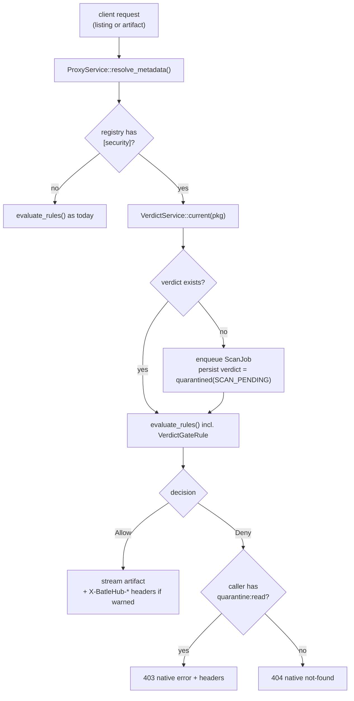
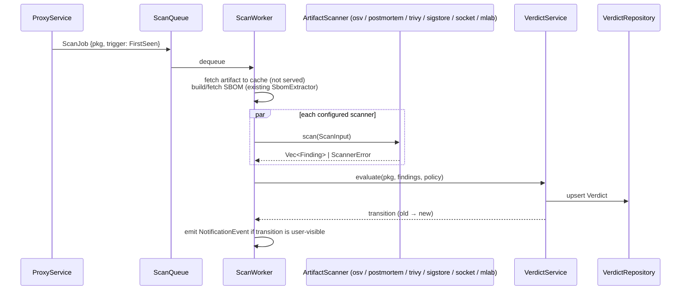
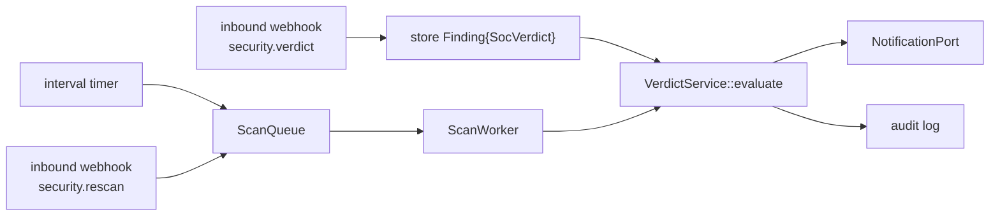
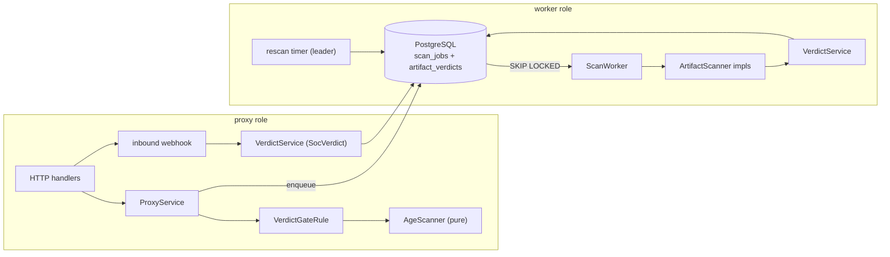

# RFC 0018 — Supply-chain security layer: quarantine, scanning and verdicts

| Field       | Value                                                                                 |
| ----------- | ------------------------------------------------------------------------------------- |
| Status      | **Implemented** — every phase of §12 landed (§13.1–§13.7); phase 4's `audit pulls` followed later (§13.10), with the "reports audit themselves" clause of §4.2 declined there: the quarantine, the scanners and the sandbox, the rescan and the flip alert, the external scanners and the admin surface, each proven in process and, for the client-facing claims, by `tests/heavy/quarantine.sh`. §11 q1 is answered by the spike table; q2 is measured per tool as its registries opt in |
| Short       | Supply-chain quarantine and verdicts                                                  |
| Settles     | How an artifact is scanned before it is served, who may see why it is held, and how the SOC can intervene |
| Author      | Maxime <maxleriche.60@gmail.com>                                                       |
| Co-author   | —                                                                                     |
| Created     | 2026-09-02                                                                            |
| Supersedes  | —                                                                                     |
| Depends on  | Co-dependent with RFC 0019 (forge metadata contract and rate-limit budget) for GitHub/GitLab/Forgejo registries only; ordering fixed in §12 |
| Touches     | `crates/core`, `crates/adapters`, `crates/config`, `crates/web`, `server`, `ui`, `cli`, `helm`, docs |

---

## 1. Summary

Today BatleHub decides whether to serve an artifact with a chain of independent
gates — `block_list`, then one `[[registries.rules]]` entry per gate:
`release_age_gate`, `cve_gate`, `license_gate`, `require_signed_release`,
`trusted_publisher`, `deny_latest`, `version_gate`. Each gate looks at one signal, answers `Allow` or
`Deny`, and the reason lives in a free-form string that most clients never
display. There is no notion of an artifact that is *not yet known to be safe*,
no way to plug in a malware or provenance scanner next to the OSV lookup, and
no path for a SOC to push a decision into the proxy.

This RFC adds a per-registry `[registries.security]` profile that turns the
proxy into a quarantine: an artifact fetched from upstream is scanned by a
configurable set of scanners (self-hosted or external), the findings are
evaluated by the internal rule engine into a persisted **verdict**
(`allowed`, `warned`, `quarantined`, `denied`), and only `allowed`/`warned`
artifacts are served. Scanning runs in a **worker** role that can live in the
same process as the proxy or in its own deployment, sharing only the database
queue. Versions older than a configurable maturity age are served while their
scan is pending, so the layer can be switched on over a live cache. The verdict
carries machine-readable reason codes and is
surfaced through four channels — the protocol-native error of each registry,
`batlehub why`, the Package Explorer, and notifications — behind two new
permissions: `quarantine:read` (that a version is held, and until when) and
`findings:read` (why, in detail). Overriding a verdict is an administrator
action. A signed inbound webhook lets the SOC trigger a rescan or push a
verdict of its own.

### Before / after

```text
# today
[[registries]]
type = "npm"
name = "npm-public"

[[registries.rules]]
kind         = "cve_gate"
min_severity = "high"
block        = true          # fails open on repository error, nothing is held

$ npm install left-pad@1.3.1
npm ERR! 403 Forbidden - blocked: known high vulnerability GHSA-xxxx (minimum gated severity: high)

# with this RFC
[registries.security]
mode              = "block"
min_age_secs      = 259200                 # 3 days; floor is 3600
scanners          = ["osv", "trivy", "postmortem", "sigstore"]
required_scanners = ["osv", "postmortem"]
max_severity      = "high"
require_provenance = true

$ npm install left-pad@1.3.1
npm ERR! 403 Forbidden - left-pad@1.3.1 is quarantined (MIN_AGE_NOT_MET, available 2026-09-05T14:12Z).
npm ERR! Run `batlehub why npm:left-pad@1.3.1` for details.

$ batlehub why npm:left-pad@1.3.1
npm:left-pad@1.3.1   QUARANTINED   policy npm-public/default
  MIN_AGE_NOT_MET     published 2026-09-02T14:12Z, min age 72h, available in 61h

$ batlehub wait npm:left-pad@1.3.1 --timeout 72h && npm ci    # for a CI job that must have it
```

The example is deliberately the *non-terminal* case: one time-bound code, a
stated `available_at`, and a wait that ends. Under this same profile a missing
provenance attestation is a `denied` verdict rather than a longer hold — it
does not become servable by waiting — which is why the two are never shown in
one illustration. §4.2 gives the precedence.

---

## 2. Motivation

1. **A vulnerable-or-worse artifact is served before anyone looked at it.**
   `ProxyService` evaluates rules on the first request and streams the bytes in
   the same call. `CveGateRule` only reads what `VulnerabilityRepository`
   already holds; if the OSV batch has not run yet — or fails — the rule
   returns `Allow` (`cve_gate.rs`: *"SECURITY: fail-open, consistent with
   `BlockListRule`"*). Nothing distinguishes "not scanned" from "clean": both
   are an empty finding list, and `None => Allow`. `BlockListRule` fails open
   the same way on a repository error, so even an admin block is a
   best-effort deny today. The first consumer of a new version is always
   unprotected.
2. **Account hijacks and typosquats are caught by time, not by CVE feeds.**
   Most malicious npm/PyPI releases are pulled within 48 h of publication and
   never get an OSV entry. `ReleaseAgeGateRule` exists but is independent of
   scanning, has no floor (`min_age_secs = 0` is accepted), and by default
   skips a coordinate whose registry omits a timestamp (GitHub tarballs and
   raw files, Terraform providers, some conda packages). The hold exists —
   `deny_missing_timestamp` — but it is off, undocumented in the example
   config, and nothing warns that the gate is silently absent for those
   registries.
3. **Only one kind of signal is pluggable.** `VulnerabilityScanner::query_batch`
   speaks OSV-by-PURL. Malware heuristics (install hooks, obfuscation, network
   egress in `postinstall`), provenance/signature verification and third-party
   reputation services have no port to plug into, so each would become one more
   ad-hoc gate with its own repository and its own failure mode.
4. **Denials are opaque to the person who hits them.** `RuleDecision::Deny`
   carries a string; `crates/web` maps it to a 403 whose body each client
   handles differently (pip shows nothing but the status, VS Code shows
   "not found"). The Package Explorer's resolution state shows `Blocked`/`Yanked`/`Held`
   but not *why*, and the CLI has no query for it. Users open tickets instead of
   waiting an hour.
5. **The SOC has no lever.** `InboundWebhookConfig` records events but cannot
   change what the proxy serves. Blocking a version during an incident means
   an admin logging into the UI.
6. **Nothing is ever re-examined.** A CVE published after an artifact was
   cached never changes its standing; the cache is a permanent allow list.

---

## 3. Goals / non-goals

**Goals**

- Every registry type — the 21 variants of `RegistryKind` the adapters crate
  builds today: npm, Cargo, PyPI, RubyGems, Composer, Go, Maven, Conda,
  NuGet, Terraform, OpenVSX, VS Code Marketplace, JetBrains Marketplace,
  GitHub, GitLab, Forgejo, and the path-proxy family (deb, rpm, pacman,
  jetbrains, generic) — can be placed behind the same quarantine pipeline,
  with per-registry `block`/`warn` mode and thresholds. `RegistryKind` is an
  exhaustive enum with an `ALL` slice, so a new registry kind cannot be added
  without a decision about its place in the pipeline: the same forcing
  function `server/src/builders.rs`'s match already applies to client
  construction. `ArtifactScanner::supports` takes the wire string
  (`RegistryKind::as_str`) because a scanner is an adapter concern and
  declares its own coverage, not a closed set the core enumerates.
- A new version is never served before (a) a configurable minimum age, never
  below one hour, and (b) every *required* scanner has returned.
- Scanners are pluggable behind one trait; the shipped set covers self-hosted
  (OSV, Trivy, postmortem, GuardDog, Sigstore) and external (Socket.dev,
  mlab.sh) options.
- The decision is a persisted verdict with stable reason codes, evaluated by
  BatleHub's own rule engine.
- A held or denied artifact is invisible to users without `quarantine:read`,
  explained to users with it, and detailed for users with `findings:read`.
- Overrides are admin-only, time-boxed and audited.
- The SOC can trigger a rescan or push a verdict through a signed webhook.
- Rescan of cached artifacts is available on an interval and on webhook; off
  by default.

**Non-goals**

- An external policy engine (OPA/Rego). The rule engine stays in
  `crates/core::rules`; expressiveness is added by config, not a DSL.
- OCI/container registries. BatleHub does not proxy them.
- Writing new scanners' detection logic. BatleHub orchestrates Trivy, postmortem,
  GuardDog and friends; it does not reimplement them.
- A user-side "accept the risk" flow. Overrides are administrative
  (`gates:exempt`), full stop.
- Changing `RuleDecision`. It has always been binary (`Allow` /
  `Deny { reason }`) and every caller matches on `Deny`; a third variant is
  one those callers miss. `warned` is expressed at the verdict level, not the
  rule level.
- Retroactively deleting bytes from the cache when a verdict flips to
  `denied`. The artifact stays stored (evidence, rollback) and stops being
  served.

---

## 4. User-facing design

### 4.1 Configuration

Scanners are declared once, globally; registries opt in by name.

```toml
[scanners.osv]                       # already implicit today; now named
type = "osv"

[scanners.trivy]
type     = "trivy"
endpoint = "http://trivy:4954"       # trivy server; consumes the CycloneDX SBOM
timeout_secs = 60

[scanners.postmortem]                # default behavioural scanner
type    = "postmortem"
command = "/usr/local/bin/postmortem" # single static binary, subprocess
online  = false                      # admin opt-in; see docs/guide/scanners/postmortem.md before enabling
timeline = true                      # npm only: publisher/script/repo/provenance transitions

[scanners.guarddog]                  # optional second opinion
type    = "guarddog"
command = "/usr/local/bin/guarddog"  # subprocess, sandboxed by the deployment
ecosystems = ["npm", "pypi", "go"]

[scanners.mlab]                      # external enrichment: CVSS/EPSS/KEV on CVE findings
type    = "mlab"
api_key = "${MLAB_API_KEY}"

[scanners.sigstore]
type = "sigstore"
rekor_url = "https://rekor.sigstore.dev"
require_for = ["npm"]                # npm provenance attestations

[scanners.socket]
type    = "socket"
api_key = "${SOCKET_API_KEY}"        # external service; opt-in per registry

[server]
roles = ["proxy", "worker"]          # default: both (embedded worker)

[worker]
max_concurrent = 4                   # scan jobs in flight per worker process
registries     = []                  # empty = all; else only these registry names
job_timeout_secs = 600
max_attempts   = 3                   # then verdict gets SCANNER_ERROR

[worker.sandbox]
runtime        = "bwrap"             # "bwrap" (default, bundled) | "none" (tests only)
memory_limit_mb = 2048
cpu_seconds    = 300
max_extracted_mb = 512               # archive extraction ceiling, hard reject above; a JDK or Node
                                     # tarball (RFC 0010) exceeds it → SCANNER_UNSUPPORTED for archive
                                     # scanners, age + OSV still apply
max_entries    = 50000

[[registries]]
type = "npm"
name = "npm-public"

[registries.security]
mode               = "block"         # "block" | "warn"; default "block"
min_age_secs       = 259200          # default 86400; hard floor 3600
mature_age_secs    = 2592000         # default 86400; 0 = never serve unscanned
hold_missing_timestamp = true        # default true; false = skip age gate as today
scanners           = ["osv", "trivy", "postmortem", "sigstore"]
required_scanners  = ["osv", "postmortem"] # must succeed before serving
max_severity       = "high"          # findings >= this deny (block) or warn
require_provenance = true            # PROVENANCE_MISSING is a deny/warn
deny_install_hooks = "warn"          # "deny" | "warn" | "ignore"; default "warn"
scanner_error      = "quarantine"    # "quarantine" | "warn" | "ignore"; default "quarantine"

[registries.security.rescan]
interval_secs = 86400                # default 0 = disabled
on_webhook    = true                 # default true when the section is present
```

- **Absent `[registries.security]`** — behaviour is unchanged: the existing
  gates run exactly as today. This RFC does not alter a registry that does not
  opt in.
- **Present with only `mode`** — `min_age_secs = 86400`, `scanners = ["osv"]`,
  `required_scanners = ["osv"]`, everything else default. The floor of one
  hour applies from the moment the section exists.
- **Publish timestamp for registries that lack one.** Git forges (GitHub,
  GitLab, Forgejo) derive it per **RFC 0019** (release → tag → commit date,
  same chain for publisher and provenance); this RFC only consumes the
  resulting `PackageMetadata`. Terraform providers on non-HashiCorp
  registries fall back to the forge release behind the provider when the
  registry exposes the source, and conda uses `repodata.json` `timestamp`
  where present. RFC 0010's toolchain kinds date a version from the listing
  they filter (`index.tab` for `nodedist`, the candidate list for `sdkman`),
  and 0010's mandatory `deny_missing_timestamp` is this key under the other
  name. Only when every source is empty does `hold_missing_timestamp`
  apply — and it holds by default.
- **Two age thresholds — and what the defaults mean.** With the defaults
  (`min_age_secs = mature_age_secs = 86400`) the "held until required
  scanners answer" window is **empty**: a version is refused for 24 h by age
  alone, then served `warned` even if no scan has returned. Scan-based
  holding only exists when `mature_age_secs > min_age_secs`; the reference
  config above (3 d / 30 d) is the recommended production profile and the
  doc says so in its first paragraph. The default favours a painless
  activation over a live cache; it is not the secure profile.
- Below `min_age_secs` a version is never served.
  Above `mature_age_secs` a version whose scan has not returned yet is served
  as `warned` (`SCAN_PENDING`) and scanned behind the request. Between the two
  it is held until every required scanner has answered. The maturity bypass
  covers only `SCAN_PENDING` and `SCANNER_ERROR`; an actual finding,
  `BLOCK_LIST`, `SOC_VERDICT` or `MIN_AGE_NOT_MET` deny regardless of age.
- **Roles.** `server.roles` selects what a process does: `proxy` serves
  requests and enqueues scan jobs; `worker` dequeues and scans. Both is the
  default (embedded worker); `batlehub --roles worker` runs a scan-only
  process (the server binary is `batlehub`, package `batlehub-server`; it has
  `--config` and three subcommands today, and `--roles` is a new top-level
  flag beside `--config`, not a `serve` subcommand — there is none). A worker is generic — it handles every registry kind —
  unless `worker.registries` scopes it.
- `min_age_secs` **replaces** the `[[registries.rules]] kind =
  "release_age_gate"` entry for that registry. Declaring both is a validation
  error (§4.3) rather than a precedence rule nobody remembers.
  `hold_missing_timestamp` is that rule's `deny_missing_timestamp` under the
  verdict's name, defaulted the other way: the gate skips by default, the
  quarantine holds by default.
- The `cve_gate`, `license_gate`, `require_signed_release` and
  `trusted_publisher` entries of `[[registries.rules]]` — and `BlockListRule`,
  which `build_policy` always inserts first — are **not run as rules** on a
  `[security]` registry; they are run as internal scanners through
  `RuleAsScanner` (§6.1) and their `Deny` becomes a finding (`VULNERABILITY`,
  `LICENSE_DENIED`, `SIGNATURE_MISSING`, `UNTRUSTED_PUBLISHER`,
  `BLOCK_LIST`). One answer covers everything, and there is no second path
  where a gate can fail open beside the verdict: a repository error inside
  `BlockListRule` is `SCANNER_ERROR` → quarantine here, where in the chain it
  is `Allow`. `deny_latest` and `version_gate` stay in the chain — they judge
  the *selection*, not the artifact. On registries without `[security]`
  every rule stays in the chain exactly as today.

Permissions, in the `[registries.rbac]` vocabulary (RFC 0015):

| Permission        | Grants                                                                                     | Default roles      |
| ----------------- | ------------------------------------------------------------------------------------------ | ------------------ |
| `quarantine:read` | See that a version is `quarantined`/`denied`/`warned`, its reason codes and `available_at` | `user`, `admin`    |
| `findings:read`   | See the findings behind those codes (CVE ids, scanner output, SOC verdict text)            | `admin`            |

Without `quarantine:read` a held version is indistinguishable from one that
does not exist upstream (404 on the artifact, omitted from listings).
`anonymous` gets neither by default. The defaults live where the role
defaults live since RFC 0015 — `services/authz/translate.rs` — not in
`build_policy`.

Overrides reuse `gates:exempt` and `GateExemption`; `"security_verdict"`
joins `EXEMPTIBLE_GATES` (today `["cve_gate", "license_gate"]`). An exemption
is time-boxed (`exempt_until`), carries a reason, and is audited like the
existing ones. `gates:exempt` is granted to nobody by default (`translate.rs`);
an operator who wants overrides grants it explicitly, which is the point.

### 4.2 Behaviour rules

**Verdict states**

| State         | Served? | Meaning                                                                    |
| ------------- | ------- | -------------------------------------------------------------------------- |
| `allowed`     | yes     | All required scanners returned, no finding at or above threshold.          |
| `warned`      | yes     | Findings at/above threshold but `mode = "warn"`; or scan still pending on a version past `mature_age_secs`. Headers carry the codes. |
| `quarantined` | no      | Held. Two kinds, and the difference is what a caller can do about it: **time-bound** (`MIN_AGE_NOT_MET`, `SCAN_PENDING`, `SCANNER_ERROR`) lifts on its own and carries `available_at` and `Retry-After`; **open-ended** (`TIMESTAMP_MISSING`) does not, because an upstream that never dated a release will not date it later. |
| `denied`      | no      | Terminal until rescan or admin action: threshold breached in `block` mode, `BLOCK_LIST`, or `SOC_VERDICT`. |

`TIMESTAMP_MISSING` is a hold rather than a denial because it is a statement
about the *upstream's* metadata, not about the artifact — deriving the date
later (RFC 0019 for the forges, the source repo for Terraform providers,
`repodata.json` for conda) lifts it without a policy change. But it behaves
like a denial for anyone waiting on it: no `available_at`, no `Retry-After`,
and the `mature_age_secs` bypass does not reach it, since that bypass is
computed from `published_at` and there is none. `batlehub wait` exits 1 on it
rather than polling to timeout, and says which of the three derivations is
missing. This is the case §4.3 warns about at startup.

**Reason codes** (closed enum, `ReasonCode`, serialised SCREAMING_SNAKE —
this list is the master; RFC 0019 adds its ref-level codes here and does not
keep a separate table):
`MIN_AGE_NOT_MET`, `TIMESTAMP_MISSING`, `SCAN_PENDING`, `SCANNER_ERROR`,
`SCANNER_UNSUPPORTED`,
`VULNERABILITY`, `MALWARE_SIGNAL`, `INSTALL_HOOK`, `TYPOSQUAT_SUSPECT`,
`PUBLISHER_CHANGED`, `INSTALL_HOOK_ADDED`, `REPOSITORY_MOVED`,
`DORMANT_RELEASE`, `UNPUBLISHED_UPSTREAM`, `PROVENANCE_MISSING`,
`PROVENANCE_INVALID`, `PROVENANCE_UNVERIFIABLE` (GitLab only, RFC 0019),
`PROVENANCE_REMOVED`, `SIGNATURE_MISSING`,
`LICENSE_DENIED`, `UNTRUSTED_PUBLISHER`, `BLOCK_LIST`, `SOC_VERDICT`,
`ADMIN_OVERRIDE`, and from RFC 0019: `MUTABLE_REF`, `TAG_MOVED`,
`ASSET_REPLACED`, `PINNED_REF_REQUIRED`, `RAW_SCRIPT`.

The `*_CHANGED` / `*_ADDED` / `*_MOVED` / `DORMANT_RELEASE` codes are
*transition* signals (this release differs from the previous one in a way
compromises usually do). On their own they are `medium` and produce
`warned`; combined they are raised — the event-stream pattern (handover,
then a new install hook) is two of them on one release. How many it takes is
a property of the scanner that produced them, not of the registry: two
transitions from postmortem's timeline and two heuristics from GuardDog do
not carry the same confidence. Escalation is therefore configured **per
scanner** and only ever combines findings from that same scanner:

```toml
[scanners.postmortem.escalation]
kinds = ["transition"]               # which FindingKinds combine
count = 2                            # this many at or above `from`…
from  = "medium"
to    = "high"                       # …are raised to this severity

[scanners.guarddog.escalation]
kinds = ["malware_signal"]
count = 3
from  = "medium"
to    = "high"
```

Absent block = no escalation for that scanner. `VerdictService::evaluate`
applies it before the registry's `max_severity` threshold.

**Precedence.** A verdict is computed from the full finding set, not by
short-circuit: `denied` wins over `quarantined` wins over `warned` wins over
`allowed`. `BLOCK_LIST` and `SOC_VERDICT` are always `denied` regardless of
`mode`. `ADMIN_OVERRIDE` (a live `GateExemption`) flips `denied`/`quarantined`
to `warned` — never to `allowed`, so the override stays visible in headers
and audit. A `quarantined` verdict whose only codes are `SCAN_PENDING` and/or
`SCANNER_ERROR` becomes `warned` when `published_at + mature_age_secs <= now`
and `mature_age_secs > 0`; the codes stay on the verdict so the served-unscanned
state is visible.

**Listings.** A version whose verdict is not `allowed`/`warned` is hidden from
the documents the client reads to resolve versions, **by the same mechanism
and with the same per-registry caveats as a block** (RFC 0006). This RFC does
not restate which document each registry has or how each one hides a version:
`RegistryKind::listing_filter()` is the single source, the admin guide's
coverage table is generated from it (`task docs:listing-coverage`, drift-gated),
and `every_advertised_filter_is_reachable_from_dispatch` fails the build if a
document advertised as filtered has no filter behind it. A quarantine that
enumerated the same list by hand would drift from it within a release.

What that source already records, and this RFC inherits rather than decides:

- **Four rows are not a plain omission.** cargo's sparse index *marks*
  `yanked` instead of removing the line; conda's `channeldata.json` drops the
  package from the channel summary rather than naming an older version;
  RubyGems' `/versions` reaches a new decision within the blocked-set
  snapshot's 30-second TTL rather than instantly; NuGet filters inline
  registration pages and lets paged ones through, logged.
- **Three rows cannot filter at all.** The signed `deb`/`rpm`/`pacman`
  indexes (editing one invalidates its signature and the client rejects the
  whole repository) and RubyGems' Marshal indexes (`specs.4.8.gz`,
  `quick/Marshal.4.8` — nothing modern reads them). `generic` and `jetbrains`
  have no listing document at all.

For a held version, "cannot filter" means the version stays listed and the
refusal happens at download. That is the family this RFC's doc page recommends
`mode = "warn"` for, and it is why the download-path answer below carries the
whole contract for them rather than the listing.

**The mechanism is the registry's, not this pipeline's.** A quarantine states
*that* a version must not be selected; how a protocol expresses that is the
protocol's business, and cargo's `yanked` is the clearest case. Marking keeps
the line and lets a `Cargo.lock` that already pins the version resolve and
then meet the download gate — which is exactly where `Retry-After`,
`batlehub why` and the operator's reason live. Omitting the line reports the
crate as never having had that version: a pinned build gets *"no matching
package named `x` found"*, never reaches the gate, and the whole explanation
channel this RFC builds is unreachable for the one ecosystem that pins hardest.
So the marking stands, and §11 decision 26 records it as a decision rather
than a question. For callers with `quarantine:read` the hiding is unchanged; the
*reason* is delivered by the other channels.

**Direct artifact request** (pinned version, lockfile) for a non-served
verdict:

| Caller has        | Status | Headers                                                         | Body                                   |
| ----------------- | ------ | --------------------------------------------------------------- | -------------------------------------- |
| no permission     | 404    | none                                                            | registry's native "not found" (`CoreError::NotFoundWithheld`, the RFC 0006 variant that never falls through to upstream) |
| `quarantine:read` | 403    | `X-BatleHub-Verdict`, `X-BatleHub-Reason`, `X-BatleHub-Available-At` (if any), `X-BatleHub-Details` | native error, message + `batlehub why` hint |
| `findings:read`   | 403    | same                                                            | same, plus a findings summary line     |

`warned` artifacts are served with `200` and the same `X-BatleHub-*` headers,
`X-BatleHub-Verdict: warned`.

**What a CI pipeline sees.** A pinned pull of a `quarantined` version fails
with 403 today and there is nothing the pipeline can do but retry blindly.
Two things make it tractable:

- the 403 carries `Retry-After: <seconds until available_at>` when the only
  codes are time-bound (`MIN_AGE_NOT_MET`, `SCAN_PENDING`); a `denied`
  verdict carries no `Retry-After`, so a pipeline can tell "wait" from
  "fail";
- `batlehub wait <coord> [--timeout 2h]` polls the verdict endpoint and exits
  0 when the coordinate becomes servable, **1 when waiting cannot help** —
  `denied`, or a hold with no `available_at` such as `TIMESTAMP_MISSING` — and
  2 on timeout. The distinction is the point: exit 1 is returned on the first
  poll with the reason, never after burning the timeout, so a pipeline fails
  fast on a decision and waits only on a clock. The documented one-liner for a
  job that must have the newest version is
  `batlehub wait npm:left-pad@1.3.1 && npm ci`.

The doc page for CI shows this for GitHub Actions and GitLab CI, and states
the alternative plainly: pin versions older than `min_age_secs`.

**Anonymous callers.** `anonymous` has neither permission, so on a public
mirror without authentication a held version is a plain 404 and the "why"
channels are unavailable. Operators of such mirrors grant `quarantine:read`
to `anonymous` in `[registries.rbac]` if they want the reason visible; the
doc says so, this RFC does not change the default.

**Local publish.** `LocalRegistryService::publish()` on a `[security]`
registry stores the artifact, enqueues a `FirstSeen` job, and the version is
`quarantined(SCAN_PENDING)` — invisible in listings — until the verdict is
`allowed`/`warned`.

The **response status** is deliberately not decided here. Publish endpoints
are not uniform today: Maven (`maven/proxy.rs`), NuGet
(`nuget/search_publish.rs`), the shared `repo/publish.rs` and Terraform
modules answer `201`; Cargo, RubyGems, Composer and the VSX publisher answer
`200`; and `terraform/providers/write.rs` declares `201` in its `utoipa::path`
and returns `Ok()` — a drift this review found and phase 0a fixes in passing.
Each status is asserted by `openapi_contract.rs` and read by a different
tool: `202 Accepted` with `Location:` is the honest HTTP answer for
"stored, not yet servable", but `cargo publish` expects a JSON warnings body,
`dotnet nuget push` and `twine` have their own tolerance, and a status a
client rejects turns a successful publish into a failed pipeline for no
safety gain. Phase 0a measures it per registry (§4.4) and §11 open question
2 records the outcome; until then the shipped status stands per registry and the verdict is
discovered through the `X-BatleHub-Verdict` header and `batlehub wait`. `min_age` and `mature_age_secs` do not apply to local
publishes (the publisher is authenticated; the age gate targets upstream
hijacks). A CI that publishes then immediately consumes uses `batlehub
wait`.

**Native error bodies** — what each client actually prints. A row marked
**measured** is phase 0a's output (§4.4, §13.1): what the real client printed
on the wire, and the assertion of its heavy suite. The other rows are still
phase 0a's *input* — written from protocol documentation and from what the
existing handlers already emit — and each is replaced by what the real client
was observed to print before the corresponding registry ships. Where a row and
a client disagree, the client is right.


| Registry            | Body that the client surfaces                                        |
| ------------------- | -------------------------------------------------------------------- |
| npm                 | `{"error": "<message>"}`                                             |
| Cargo               | **measured** (cargo 1.98): the body is printed verbatim under `failed to get successful HTTP response from <url>, got <status>`, whatever its shape — the block's `{"error":"Forbidden","message":…}` reached the user as is. `{"errors": [{"detail": "<message>"}]}` stays the shape, for the registry-API tools that parse it. One request, no retry, `Retry-After` ignored. |
| Composer            | `{"status": "error", "message": "<message>"}`                        |
| RubyGems            | plain text `<message>` (gem prints the body)                         |
| Go                  | **measured** (go 1.27): the body is **not** printed — `reading <url>: 403 Forbidden` is the whole line, so the reason travels only through `batlehub why`. And a hold must be **`403`, never `404`, whatever the caller's permission**: with the default-shaped `GOPROXY=<proxy>,direct` a 404 means "ask the next source" and the held module was fetched from the origin behind the proxy's back; a 403 stops the list. The no-permission row of the direct-artifact table does not apply to `goproxy` (§11 decision 32). One request, `Retry-After` ignored. |
| Terraform           | `{"errors": ["<message>"]}`                                          |
| Maven               | **measured** (mvn 3.9.16): the body is not read; `status code: 403, reason phrase: <phrase>` is what reaches the user, so the reason phrase carries the short message. A `404` is worse than useless here: mvn treats a missing pom as *absent* and keeps resolving, then fails on the jar with "Could not find artifact" — the hold has to be a `403`. One request, `Retry-After` ignored; no `.lastUpdated` is written for a 403, so the next build sees the lifted hold without `-U`. |
| PyPI                | none read by pip/uv → removed from `simple/`; direct file URL gets the reason-phrase |
| Conda               | none read by conda → removed from `repodata.json`; direct URL gets the reason-phrase |
| NuGet               | none read by `dotnet`/`nuget` beyond the status → reason-phrase; omitted from the registration index and `FindPackagesById` |
| GitHub / GitLab / Forgejo | `{"message": "<message>"}` (mise and `gh` print it); ref-level codes per RFC 0019 |
| OpenVSX             | `{"error": "<message>"}`; a VS Code-side reading of the verdict endpoint waits on RFC 0011 phases 7–8 (no such extension exists today) |
| VS Code Marketplace | gallery error JSON; same extension path                              |
| JetBrains Marketplace | `updatePlugins.xml` omission; direct download gets `{"message": ...}` |
| deb / rpm / pacman / jetbrains / generic (path proxy) | **measured for `apt`** (Ubuntu 26.04): `E: Failed to fetch <url>  403  Forbidden [IP: …]` — the status and its reason phrase, nothing of the body; one request, no retry, `Retry-After` ignored; the same apt state downloads the file the moment the hold lifts. `dnf` is scripted in the same suite and measured in CI (§13.1). **No listing omission**: these indexes (`Packages`, `repomd.xml`, `*.db.tar.*`) are signed upstream and BatleHub does not hold the key, so a held version stays listed and fails at download. The doc page says so and recommends `mode = "warn"` for this family unless the operator re-signs. |

The `<message>` those bodies carry is always:

```text
<registry>:<name>@<version> is <state> (<CODES>[, available <RFC3339>]). Run `batlehub why <coord>` for details.
```

**Verdict endpoint**

```text
GET /api/v1/verdicts/{registry}/{name}/{version}
  200 → Verdict (findings array present only with findings:read)
  404 → no verdict or no quarantine:read
POST /api/v1/verdicts/{registry}/{name}/{version}/rescan     gates:exempt or admin
```

**CLI**

```text
batlehub why <registry>:<name>@<version>     human table; --json for the raw verdict
batlehub verdicts list --state quarantined    admin listing
batlehub verdicts backfill --registry <name>  enqueue every cached version, low priority
batlehub --roles proxy|worker|proxy,worker         # the server binary
```

**Queue priority.** Jobs carry a `trigger`: `FirstSeen` (a user is waiting)
is dequeued before `Webhook`, then `Rescan`, then `Backfill`. Within a
priority, FIFO. Priority never starves lower tiers completely: a worker takes
one lower-tier job per `max_concurrent` slots.

**Webhook (SOC)** — existing inbound webhook surface, two new event types:

```json
{ "type": "security.rescan",  "coordinates": ["npm:left-pad@1.3.1"] }
{ "type": "security.verdict", "coordinate": "npm:left-pad@1.3.1",
  "severity": "critical", "summary": "SOC-2026-0912 credential stealer",
  "expires_at": null }
```

`security.verdict` is handled by the proxy role itself: it stores a finding
of kind `SocVerdict` and re-evaluates the verdict synchronously, so the
denial is effective on the next request without a worker in the loop.
`security.rescan` enqueues the coordinates (trigger `Webhook`) regardless of
the rescan interval. Both require the HMAC signature already
enforced by `InboundWebhookConfig`.

**Rescan.** With `interval_secs > 0`, a job walks cached artifacts of that
registry whose `last_scanned_at` is older than the interval, re-runs the
scanners and re-evaluates. A transition from a served state to `denied` is
an **admin alert**, not a broadcast: it emits
`NotificationEventType::VerdictChanged` to admin subscriptions with the
coordinate, the reason codes, and the list of identities that pulled it in
the last `pullers_window_days` (default 30, configurable), taken from
`access_events`. Nothing is sent to the pullers themselves — with a popular
package that is hundreds of identities and the decision of what to tell them
belongs to the operator. A transition to `allowed` after `MIN_AGE_NOT_MET`
emits `ArtifactReleased` to the identities that were refused it (bounded by
construction: only those who asked during the hold — `access_events` records
`AccessResult::Denied`, so the set is already there, and `EventFilter` already
selects on `denied_only`, `user_id` and a window).

**Who pulled what.** Admins can answer the incident question directly:

```text
GET  /api/v1/verdicts/{registry}/{name}/{version}/pullers?since=30d&format=json|csv
GET  /api/v1/audit/pulls?package=…&identity=…&since=…&format=csv
batlehub verdicts pullers npm:left-pad@1.3.1 --since 30d --csv
batlehub audit pulls --identity ci-bot --since 7d --csv
```

Both read `access_events` through the existing `EventFilter`, are gated by
`audit:read` (the verb `audit.rs` already checks — there is no admin guard
since RFC 0015), are themselves audited, and
export CSV/JSON with `identity`, `first_pull`, `last_pull`, `count`,
`client_user_agent`, `source_ip`.

### 4.3 Validation

`AppConfig::validate()` rejects:

| Condition                                                        | Rationale                                                                 |
| ---------------------------------------------------------------- | ------------------------------------------------------------------------- |
| `security.min_age_secs < 3600`                                   | The one-hour floor is the point of the quarantine; degrading it silently defeats it. |
| `[security]` and a `[[registries.rules]] kind = "release_age_gate"` entry on one registry | Two owners of the same gate with different defaults; refuse rather than pick. |
| `[[notifications.inbound]]` without `secret` while any registry has `[security]` | The HMAC is optional today (`signature_valid: None` when no secret); a `security.*` event on an unsigned webhook would let anyone on the network deny packages. |
| `security.scanners` names a scanner not in `[scanners]`          | A typo would silently scan with nothing.                                  |
| `required_scanners` not a subset of `scanners`                   | Would quarantine forever.                                                 |
| `[scanners.<x>] type = "socket"` without `api_key`               | Fails at first request with a 401 nobody reads.                           |
| `[scanners.<x>] type = "postmortem"` or `"guarddog"` with a `command` that does not exist or is not executable at startup | Same, and these are the scanners that open untrusted archives. |
| `[scanners.<x>] type = "mlab"` without `api_key`                 | Same class as `socket`.                                                   |
| `worker.sandbox.runtime = "none"` outside `cfg(test)` builds     | Refused at startup unless `BATLEHUB_UNSAFE_NO_SANDBOX=1` is also set; the env var is logged as an error on every boot. |
| `worker.sandbox.runtime = "bwrap"` and `bwrap` not executable, or user namespaces unavailable | The worker would silently scan unsandboxed; refuse to start the worker role. |
| `max_severity` not one of `Severity`                              | Existing `cve_gate` rule.                                                 |
| `mature_age_secs != 0` and `< min_age_secs`                       | A version would be "mature" before it is servable at all; nonsense window. |
| `server.roles` empty or contains an unknown role                  | A process that does nothing, or a typo that silently drops the worker.   |
| `worker.registries` names an unknown registry                     | Same typo class as `scanners`.                                            |

Warnings (logged, and shown in the admin config-reload page and the
`/admin` banner):

| Condition                                                         | Behaviour                                                        |
| ----------------------------------------------------------------- | ---------------------------------------------------------------- |
| `mode = "warn"` with `required_scanners` empty                    | Nothing can ever hold; warn that the registry is effectively unprotected. |
| A scanner is configured for an ecosystem it does not support (e.g. `guarddog` on `maven`) | Scanner is skipped for that registry and no finding is raised — a config-time mismatch is the operator's, not the artifact's. `SCANNER_UNSUPPORTED` is reserved for the scan-time degradation in §11 q1, where a supported ecosystem's input could not be built. |
| `rescan.interval_secs > 0` and no `[notifications]` channel       | Verdict flips will only be visible in the UI.                    |
| `[scanners.<x>] type = "postmortem"` with `online = true` and the scanner in a registry's `required_scanners` | Network outage at GitHub/OSV becomes `SCANNER_ERROR` → quarantine for that registry; the warning links to the doc section. |
| `[security]` present on a registry and no process has the `worker` role (detected at startup via a heartbeat table) | Proxy keeps refusing `SCAN_PENDING` below `mature_age_secs`; admin banner says no worker is running. |
| `[security]` with `hold_missing_timestamp = true` (the default) on a registry kind that **structurally** has no publish date — `github`/`gitlab`/`forgejo`, and the path-proxy family — `security.timestamp-hold-unavailable` | Every version of that registry is held open-ended. See below: this is a refusal to serve the whole registry, and the warning states it in those words. |

**Why that one is a warning and not an error, and what it says.** A missing
timestamp is not a misconfiguration — it is a property of the upstream, and
holding on it is the correct default: an age gate that silently skips the
registries it cannot date is the `release_age` behaviour §2 lists as a defect.
But the combination is severe enough that discovering it from a user's failed
`mise install` is not acceptable, so it is detected at startup rather than at
the first request.

Two populations, and only the first is knowable before a request arrives:

- **Structural.** `GithubRegistryClient`, `GitlabRegistryClient` and
  `ForgejoRegistryClient` all build through `PackageMetadata::minimal()`,
  which sets `published_at: None` by construction — so *until RFC 0019 phase 1
  derives release → tag → commit dates*, `[security]` on a forge with the
  default holds every coordinate, permanently, with no `available_at`. The
  path-proxy family (`deb`, `rpm`, `pacman`, `jetbrains`, `generic`) addresses
  a file tree by path and has no version object to date at all. This is the
  set the startup warning names, by registry name, with the sentence *"every
  version of `<name>` will be held: this registry kind cannot supply a publish
  date"* and the two ways out — `hold_missing_timestamp = false`, or wait for
  the derivation.
- **Per version.** conda (`repodata.json` without `timestamp`), Composer,
  RubyGems (`created_at` absent) and NuGet (whose fallback is a `HEAD`
  `Last-Modified` probe that can fail) fill the date on the normal path and
  drop to `None` on some entries. These cannot be detected at startup; they
  surface as `TIMESTAMP_MISSING` on the individual verdict, which is what that
  code is for.

The warning carries the stable code `security.timestamp-hold-unavailable` and
is raised by `AppConfig::warnings()` alongside `license-gate.sbom-disabled`,
whose doc comment is the model: state the mechanism, then the observable
consequence. It is surfaced in the admin config-reload page and the `/admin`
banner like the others, and — because this one can make a registry serve
nothing — also logged at `WARN` on every boot rather than once.

---

### 4.4 Per-registry rejection: what phase 0a measures

Every table in §4.2 asserts something about a client this RFC has not run.
That is the failure mode RFC 0009 was written about — a route present, tested
and answering, with something no client can use — and it is the one this
repository has a layer for: `tests/heavy/*.sh` starts a real BatleHub against a
real Postgres, puts `http_tap.py` in front of it, drives the ecosystem's real
client and asserts on the wire transcript.

**The premise is that rejection is per registry, not per pipeline.** A verdict
is one decision — this version must not be selected — but there is no uniform
way to say it, and pretending otherwise is how a quarantine becomes a mystery.
Each protocol already owns its answer: cargo marks `yanked` (§11 decision 26), conda
drops the package from the channel summary, NuGet filters inline registration
pages and logs the paged ones, the signed `deb`/`rpm`/`pacman` indexes cannot
be touched at all and refuse at download instead. The verdict is shared; the
expression of it belongs to the registry, and the only way to know a given
expression works is to run the client. Rejection is also where clients diverge
most — a refusal npm prints, pip swallows, `dotnet` restates as "not found"
and `apt` turns into a hash mismatch — so phase 0a re-runs the exercise for
the four things this RFC newly asks of every client, per registry kind:

| Axis | Question the transcript has to answer |
| --- | --- |
| **Hide** | With the version hidden by that registry's own mechanism, what does a *fresh* resolve do — pick the previous version, or fail? And what does a resolve from an existing lockfile pinning the hidden version do? These are different answers, and only the second reaches the download gate. Cargo is the worked example: `yanked` is chosen precisely so the pinned case gets there. |
| **Refuse** | On the artifact path: what does the client print for `403` versus `404`, does it read the body at all, does it honour `Retry-After`, and does it retry, fail fast, or fall back to another source? |
| **Publish** | Which success status does the publishing tool accept — is `202 Accepted` a success, a failure, or a hang? Does it read `Location`? This is §11 open question 2, and it is per tool, not per protocol. |
| **Recover** | After the verdict flips to servable, does the *next* invocation work, or has the client cached the refusal? npm's `_cacache`, pip's wheel cache, NuGet's global packages folder and cargo's registry cache each remember a failure differently, and a hold that a client never recovers from is a worse defect than one that never lifts. |

The **Recover** axis is the one with no prior art here, and it is the reason
this is a phase rather than a paragraph. Every other layer of the test pyramid
starts from a clean client; `docs/contributing/testing.md` already warns that
reusing a cache between phases measures the client's cache rather than the
server. A quarantine deliberately serves a refusal and then stops — the cache
is the mechanism, not the noise.

**Deliverable.** One row per registry kind for each axis, replacing the drafted
rows in §4.2 and becoming the assertions of the heavy suites. Where a client's
behaviour makes a §4.2 row wrong, the row changes; where it makes the *design*
wrong — a client that cannot recover from a hold, or one for which no status
code means "later" — that registry ships with `mode = "warn"` and the doc page
says why.

**Coverage gap this exposes.** Ten heavy scripts — nine ecosystem suites
(marketplaces, Bundler, npm, PyPI, OpenVSX, conda, NuGet, Composer,
Terraform) plus `authz.sh`, which reuses four of them — cover ten of the
twenty-one kinds. Cargo, Go and Maven have none, and neither does the path-proxy
family — which is exactly the family whose listings *cannot* be filtered, so
the download refusal is its entire contract and the least measured. Phase 0a
adds `cargo.sh`, `go.sh`, `maven.sh` and one `pathproxy.sh` driving `apt` and
`dnf`, following the conventions in `tests/heavy/lib.sh` (fresh registry name
per run, never rewrite `Host`, a cache per phase, `heavy_need` rather than a
skip). The forges are RFC 0019's phase 1, measured there.

Phase 0a blocks phase 2 — the error-body mapping and listing filters — not
phase 1, which holds and refuses through paths every existing suite already
exercises.

**Measured (2026-09-03).** The four suites, run against crates.io,
proxy.golang.org (with sum.golang.org through the proxy), repo1.maven.org and
archive.ubuntu.com, with the tap rewriting the block's native `403` into a
`404` + `Retry-After: 30` for the second Refuse column. Each cell is an
assertion of the suite named in its row.

| Suite | Hide (fresh resolve / pinned) | Refuse (`403` / `404`) | Recover | Publish |
| --- | --- | --- | --- | --- |
| `cargo.sh` | yanked mark: `cargo generate-lockfile` picks the previous version; a `Cargo.lock` pinning the held one resolves and hits the download gate | prints the status and the body verbatim, both statuses, one request, no wait | the same `CARGO_HOME` fetches the version on the next `cargo fetch --locked` | `cargo publish` accepts `200` and `202` alike, then **polls the index** until the version appears (its own `waiting for … to be available`, 60 s default, a warning on timeout, exit 0) |
| `go.sh` | omitted from `@v/list` and `@latest`: `go get @latest` picks the previous; a pinned `go.mod` hits `.mod` first | prints `reading <url>: <status>`, never the body, one request, no wait; **`404` is bypassed by `GOPROXY=…,direct`, `403` stops it** | the same `GOMODCACHE` downloads on the next `go mod download` | — (no publish in the protocol) |
| `maven.sh` | omitted from `maven-metadata.xml`: a range `[prev,)` picks the previous; a pinned pom hits the pom first | `403`: `Could not transfer artifact …:pom:<v> from/to <mirror> … status code: 403, reason phrase: Forbidden` — the reason phrase is printed, the body is not; one request. `404`: the pom is treated as *absent* and mvn goes on to the jar, then `Could not find artifact …:jar:<v> in <mirror>`; no wait on `Retry-After` | **plain**: the same local repository resolves on the next run, no `-U` needed — Maven's `.lastUpdated` memory is for a 404, and a `403` transfer error leaves none | `mvn deploy:deploy-file` accepts `201` and `202` alike, `BUILD SUCCESS` on both |
| `pathproxy.sh` | **none**: `apt-cache policy` keeps the candidate (the index is signed); the refusal is the whole contract | `E: Failed to fetch … 403 Forbidden`, status and reason phrase only, one request, no wait | the same apt lists and cache download on the next `apt-get download` | — |
| `quarantine.sh` (npm 11.19, **against the real gate**, 2026-09-04) | hidden from the packument: a fresh `npm install <pkg>@<denied>` stops at resolution with `ETARGET` / *No matching version found* and never asks for the tarball — the developer sees "no such version", not the finding, which is what `batlehub why` is for; a lockfile pinning it (`npm ci`) skips the packument and reaches the gate | prints the body's `error` verbatim — `… is quarantined (SCAN_PENDING). Run \`batlehub why …\`` / `… is denied (VULNERABILITY) …` — with `code E403`, exits 1, **one** request, no retry, no fallback, nothing left in `node_modules` | the **same** npm cache installs on the next `npm install` once the verdict serves: a `403` is not cached | — (the local registry's `npm publish` is `npm.sh`'s) |

Two of the cells corrected the design rather than a table: a Go hold cannot
be a `404` (decision 32), and `cargo publish` already waits on the index, so
a quarantined publish needs no status change to be noticed (decision 31).

---

## 5. Architecture

### 5.1 Request path



The invariant: **an artifact in a `[security]` registry is never streamed
without a persisted verdict in `allowed` or `warned`.** `VerdictGateRule` is
the only rule that reads verdicts, and `build_policy` places it **first** in
the chain for every registry that opts in — where `BlockListRule` sits today
(`RbacRule` left the chain in RFC 0015 phase 3; grant resolution answers that
question before any rule runs) — so there is no path around it.
Because `SCAN_PENDING` is itself a verdict, "not scanned yet" is a deny, not
an absence — the fail-open of `CveGateRule` cannot recur here. The maturity
bypass is not an exception to this: it is the same verdict, downgraded to
`warned` by a pure age rule the proxy evaluates itself, and it is recorded
and surfaced as such.

### 5.2 Scan and verdict pipeline



`VerdictService::evaluate` is pure: `(PackageMetadata, Vec<Finding>,
SecurityPolicy, now) -> Verdict`. Age is a *finding* (`MIN_AGE_NOT_MET` with
`available_at`) produced by an internal `AgeScanner`, so the same evaluation
covers time and content and a held artifact's `available_at` is known without
a scan.

### 5.3 Rescan and SOC path



### 5.4 Process roles



The two roles share nothing but the database and the storage backend. The
proxy never fetches an archive for scanning and never blocks a request on a
scan; the worker never answers HTTP. Consequences the design relies on:

- **A dead or saturated worker degrades, it does not fail.** Versions below
  `mature_age_secs` stay refused with `SCAN_PENDING`; versions above are
  served `warned`. The proxy's latency is independent of scanner cost.
- **Only the worker image needs the scanner toolchains** (postmortem, the
  Trivy client; GuardDog on a `-guarddog` variant of that image, it being the
  one scanner with an interpreter behind it); the proxy image stays as it is
  today.
- **Only the worker needs upstream artifact egress and storage write**; the
  proxy needs upstream metadata and storage read. NetworkPolicies tighten.
- **Jobs are leased, not consumed**: a row carries `leased_until` and
  `attempts`; a worker heartbeats while scanning; a lease that expires
  (OOM on a hostile archive) returns the job to the queue, and after
  `max_attempts` the verdict gets `SCANNER_ERROR`. Jobs are idempotent on
  `(coordinate, artifact_sha256)`.
- **Embedded mode is the same code**: `roles = ["proxy", "worker"]` spawns
  the worker task in-process; nothing is conditional on it beyond which tasks
  start.

---

## 6. Detailed design

### 6.1 `crates/core`

- `entities/security.rs` — `Verdict { id, package: PackageId, state:
  VerdictState, reason_codes: Vec<ReasonCode>, findings: Vec<Finding>,
  policy_ref: String, available_at: Option<DateTime>, evaluated_at,
  last_scanned_at }`, `VerdictState`, `ReasonCode`, `Finding { scanner,
  kind: FindingKind, severity: Severity, reference: Option<String>, summary,
  confidence: Option<u8>, raw: serde_json::Value }`, `FindingKind`
  (`Vulnerability`, `MalwareSignal`, `InstallHook`, `Provenance`,
  `Signature`, `License`, `Publisher`, `Typosquat`, `Transition`, `Age`,
  `SocVerdict`, `ScannerError`).
- `ports/scanner.rs` — `trait ArtifactScanner { fn name(&self) -> &str;
  fn supports(&self, registry_type: &str) -> bool; async fn scan(&self, input:
  &ScanInput) -> Result<Vec<Finding>, ScannerError>; }` with `ScanInput {
  package: PackageMetadata, artifact: Option<StoredArtifact>, sbom:
  Option<Sbom>, purl: String }`. `VulnerabilityScanner` (OSV) is kept and
  wrapped by the `osv` adapter rather than replaced.
- `ports/security.rs` — `VerdictRepository { upsert, get, list_by_state,
  list_due_for_rescan }`, `ScanQueue { enqueue(job), lease(worker_id,
  registries: &[String], n) -> Vec<ScanJob>, heartbeat(job_id),
  complete(job_id), fail(job_id) }`, `WorkerRegistry { heartbeat, live_count }`
  (the "is any worker alive" check behind the §4.3 warning). `ScanJob {
  package, artifact_sha256, trigger: ScanTrigger, attempts, leased_until }`,
  `ScanTrigger::{FirstSeen, Webhook, Rescan, Backfill}` ordered by priority.
- `services/verdict.rs` — `VerdictService` (pure `evaluate`, plus
  `current()` that returns the stored verdict or a fresh `SCAN_PENDING` one
  and enqueues), and the maturity downgrade. `ArtifactVulnerability` rows from the existing OSV pass are
  mapped to `Finding{Vulnerability}` so history is preserved.
- `scanners/rule_as_scanner.rs` (core) — `RuleAsScanner<R: Rule>` wraps an
  existing gate: it builds the same `RuleContext` the chain would, calls
  `evaluate`, and maps `Deny { reason }` to one `Finding` with a fixed
  `(kind, severity, code)` per rule (`cve_gate` → `Vulnerability`/its own
  severity, `license_gate` → `License`/`high`, `require_signed_release` →
  `Signature`/`high`, `trusted_publisher` → `Publisher`/`high`, `block_list`
  → `BlockList`/`critical`) and `Allow` to no finding; a repository error
  inside the wrapped rule is a `ScannerError`, never an `Allow`. The rule
  files are untouched; `build_policy` simply omits those five from the chain
  for a `[security]` registry and registers the wrappers as scanners instead.
  Wrapped rules are always in `required_scanners` (they are local and cannot
  fail on network).
- `rules/verdict_gate.rs` — `VerdictGateRule` returning `Deny { reason:
  verdict.short_message() }` for `quarantined`/`denied`. It ignores
  `bypass_roles` on purpose: the only bypass is a `GateExemption`, which the
  service already folds into the verdict as `ADMIN_OVERRIDE`.
- `entities/permission.rs` — `Action::QuarantineRead` (`"quarantine:read"`),
  `Action::FindingsRead` (`"findings:read"`), added to the role defaults in
  `services/authz/translate.rs` (`quarantine:read` for `user` and `admin`,
  `findings:read` for `admin`). `EXEMPTIBLE_GATES` gains
  `"security_verdict"`.
- `entities/explore.rs` — `FirewallInfo` gains `Quarantined { reason_codes,
  available_at }` and `Warned { reason_codes }`; `ResolutionState::Held` is
  reused for `quarantined` (its doc comment is updated), `Blocked` for
  `denied`.
- `entities/notification.rs` — `NotificationEventType::{VerdictChanged,
  ArtifactReleased}` beside the four package events. `InboundWebhookEvent.payload`
  stays the `serde_json::Value` it is; the handler parses a typed
  `SecurityEvent::{Rescan, Verdict}` out of it by `type` and records anything
  else exactly as today. "Admin subscriptions" do not exist —
  `NotificationSubscription` is per registry, package and channel — so a
  subscription with a registry-wide package pattern and `VerdictChanged` in
  `event_types` is what an operator creates, and the doc page shows it.

### 6.2 `crates/config`

- `schema/rules.rs` — `SecurityConfig` (with `mature_age_secs`),
  `SecurityRescanConfig`, `ScannerErrorMode`, `InstallHookMode`;
  `schema/scanners.rs` — `ScannerConfig` enum tagged by `type`;
  `schema/server.rs` — `roles: Vec<Role>` (`Proxy`, `Worker`), default both;
  `schema/worker.rs` — `WorkerConfig { max_concurrent, registries,
  job_timeout_secs, max_attempts }`. `AppConfig::validate()` gets the §4.3 table. No
  `CURRENT_CONFIG_VERSION` bump: every new key is optional and absent means
  "as before".

### 6.3 `crates/adapters`

- `scanners/osv.rs` — wraps the existing OSV client into `ArtifactScanner`.
- `scanners/trivy.rs` — POSTs the CycloneDX SBOM (from `SbomRepository`) to a
  Trivy server; when no SBOM exists, sends the archive. *(Trivy server's
  remote-scan API shape and default port are to be confirmed against the
  pinned Trivy release during phase 3.)*
- `scanners/subprocess.rs` — shared runner for binary scanners. Every
  invocation goes through `bwrap` with: new user/pid/ipc/uts namespaces,
  `--unshare-net` unless the scanner declares `needs_network` (only
  `postmortem` with `online = true`), rootfs bind-mounted read-only, the
  per-job temp dir as the only writable mount and mounted `noexec,nosuid,
  nodev`, `--die-with-parent`, `--new-session`, empty environment except an
  explicit allowlist (`HOME=/tmp`, `PATH`), a seccomp filter denying
  `ptrace`/`mount`/`keyctl`/`bpf`/`io_uring`, rlimits from
  `[worker.sandbox]`, argv passed directly (no shell). Stdout is capped and
  parsed as untrusted JSON (size limit, strict schema, no interpolation
  anywhere). Exit codes and signals map to `ScannerError`. `runtime = "none"`
  runs the bare command and exists for unit tests only.
- `extract.rs` (worker side) — reuses the existing archive extractor from
  `crates/adapters/src/sbom/extractor/` and hardens it for hostile input.
  What exists today is `is_inside_root` (path containment, shared by the
  README, RubyGems and conda paths) and a decompressed-byte ceiling that
  **truncates and flags**; there is no symlink, hardlink, entry-type, ratio
  or entry-count handling. All of that is new, behind one
  `ExtractPolicy`: reject (never truncate) on path traversal, absolute
  paths, symlinks and hardlinks, entries above `max_entries`, cumulative
  size above `max_extracted_mb`, decompression ratio above 100:1, nested
  archives (not descended), and any entry whose declared type is not a
  regular file or directory; execute bits are dropped on every file. The
  same policy is applied by the README/SBOM extraction paths that already
  exist, so this RFC tightens them too (`README_EXTRACT_CEILING` becomes one
  field of the policy).
- `scanners/postmortem.rs` — on top of the runner. The worker materialises a
  minimal project in the temp dir: the extracted archive under the path the
  ecosystem expects plus a synthetic lockfile pinning only `(name, version)`
  (`package-lock.json`, `requirements.txt`, `Cargo.lock`, `Gemfile.lock`,
  `composer.lock`, `go.sum`, `pom.xml`), then runs `postmortem scan <dir>
  --json -o - --no-config --no-progress`. Findings map by category:
  `ioc`/`obfuscation`/`sensitive_api` → `MalwareSignal`, `install_hook` →
  `InstallHook`. The synthetic lockfile is written from `PackageMetadata`,
  never by invoking the ecosystem's tool; the typosquat near-miss (offline corpus, six ecosystems) →
  `Typosquat`. With `timeline = true` and an npm coordinate, `postmortem
  timeline <name> --json` is also run and the transitions *at the scanned
  version* become `Transition` findings (`PUBLISHER_CHANGED`,
  `INSTALL_HOOK_ADDED`, `REPOSITORY_MOVED`, `PROVENANCE_REMOVED`,
  `DORMANT_RELEASE`); a version the registry no longer lists becomes
  `UNPUBLISHED_UPSTREAM`. With `online = true`, `tree --online --vulns
  --json` adds reputation and advisory findings — postmortem then reaches
  GitHub/GitLab/Codeberg and OSV with coordinates only, so the adapter
  applies the same private-package refusal as `socket`. Exit code 2 (no
  ecosystem recognised) is a `ScannerError`, never an empty success. Covers
  npm, PyPI, Cargo, RubyGems, Composer, Go, Maven; source-level rules also
  run on C/C++/Perl inside archives.
- `scanners/guarddog.rs` — same runner, `guarddog <ecosystem> scan <path>
  --output-format json`. Supports npm, pypi, go. Optional second opinion where
  both are configured; not required for the default profile.
- `scanners/mlab.rs` — mlab.sh CVE API client (`vuln.mlab.sh`). It is an
  *enrichment* scanner: it runs after the others and attaches CVSS vector,
  EPSS probability and CISA KEV status to existing `Vulnerability` findings.
  A KEV-listed CVE is raised to `critical` regardless of its CVSS. It never
  creates findings on its own, so it is never a sensible member of
  `required_scanners` (validation warns).
- `scanners/sigstore.rs` — npm provenance attestations via the packument
  `dist.attestations` + Rekor inclusion check; generic cosign-bundle check
  for registries that carry `X-Artifact-Signature` with `sigstore` type.
- `scanners/socket.rs` — Socket.dev REST client, one call per PURL, mapped
  to `MalwareSignal`/`InstallHook`/`Vulnerability` by alert type. *(Alert
  taxonomy and the mlab.sh CVE API schema are to be confirmed against their
  current docs in phase 5; the mapping tables live in the adapters, not in
  this RFC.)*
- `db/verdicts.rs` — `artifact_verdicts`, `artifact_findings`, `scan_jobs`
  and `worker_heartbeats` tables (four `mig!` entries in
  `crates/adapters/src/migrations.rs`, the next free numbers after RFC 0019's
  — the workspace does not use `sqlx::migrate!`); `ScanQueue` on PostgreSQL
  (`SELECT … ORDER BY priority, created_at FOR UPDATE SKIP LOCKED`) so any
  number of workers share one queue. PostgreSQL is chosen because it is the
  one store every deployment has: `WarmCoordinator` is Redis-backed
  (`RedisWarmCoordinator`, with a `NoopWarmCoordinator` fallback) and Redis
  is only one of three cache backends, so it cannot carry a queue that must
  exist everywhere. No broker is introduced. The rescan timer's leader is
  elected with a PostgreSQL advisory lock for the same reason, not through
  `WarmCoordinator` — no advisory lock, `SKIP LOCKED` or leader election
  exists in `db/` today; this is the first.

### 6.4 `crates/web`

- Middleware after the auth/authz layer (`crates/web/src/middleware/auth.rs`,
  which resolves the `Identity` the `authz` services in
  `crates/core/src/services/authz/` then decide on): when the handler answers
  with a `Deny` that
  originated in `VerdictGateRule`, rewrite to the §4.2 table — 404 without
  `quarantine:read`, otherwise 403 with headers and the registry's native body
  (one `fn verdict_error_body(registry_type: &str, v: &Verdict) -> (ContentType,
  Bytes)` in `handlers/security.rs`; per-registry handlers stay untouched).
- Listing filters: each registry handler already post-processes upstream
  documents (yank, beta channel); the same hook drops non-served versions.
- `Retry-After` on a proxy `403` is new: only the rate-limit middleware emits
  the header today.
- `handlers/security.rs` — `GET /api/v1/verdicts/...`, `POST .../rescan`,
  inbound webhook event dispatch.
- OpenAPI regenerated (`task dump-spec`).

### 6.5 `server`

- `builders.rs` — always builds `VerdictService` and inserts
  `VerdictGateRule` first for `[security]` registries, in place of the
  `BlockListRule` it wraps; builds scanners from `[scanners]` only when
  `worker` is in `server.roles`.
- `main.rs` — starts the HTTP server if `proxy` is in roles; starts
  `ScanWorker` (bounded by `worker.max_concurrent`) and the rescan timer
  (one leader via the §6.3 advisory lock — `WarmCoordinator` is Redis-only and
  cannot elect anything on the other two cache backends) if `worker` is. A worker-only
  process still exposes `/healthz` and `/metrics`.
- `main.rs` (clap) — a top-level `--roles` flag beside `--config` overrides
  `server.roles`; the binary keeps its three subcommands (`dump-spec`,
  `hash-token`, `explain-config`).
- The existing test `build_policy_default_has_rbac_and_block_list_rules`
  (which asserts `names == ["block_list"]` — rbac is already absent) gains a
  sibling asserting `["verdict_gate"]` for a `[security]` registry.

### 6.6 `cli`

- `batlehub why`, `batlehub wait`, `batlehub verdicts list|backfill|pullers`,
  `batlehub audit pulls`; all through the generated client. (`--roles` is on
  the server binary, not the CLI.)

### 6.7 `ui`

- Version row badge for `Quarantined` (with countdown) and `Warned`; findings
  tab rendered only when the `/verdicts` response carries `findings`.
- Admin page: verdict listing by state, rescan button, exemption form reuses
  the `GateExemption` component.

### 6.8 `helm`, docs

- Docs: `docs/guide/security.md` (concepts, verdict states, reason codes,
  permissions, activation on a live registry) and one page per scanner under
  `docs/guide/scanners/` — `postmortem.md` is the long one: offline vs
  `online` (what leaves the worker, which hosts, the SSRF note, why it should
  not sit in `required_scanners` when online, air-gap consequences),
  `timeline` semantics, escalation tuning, the synthetic-lockfile mechanism
  and its per-ecosystem caveats.
- `worker.enabled` (default `false` → embedded); when `true`, a separate
  Deployment with the `batlehub-worker` image (server binary + postmortem +
  Trivy client, or `batlehub-worker-guarddog` where that scanner is on),
  `roles = ["worker"]` on it and `["proxy"]` on the proxy,
  HPA on `batlehub_scan_jobs_queued`. Optional Trivy server sub-chart.
  `docs/guide/security.md`.

**Verified against the repository** (so reviewers need not): `server/src/main.rs`
and `server/src/builders.rs`; `/api/v1/` as the API prefix; `SbomRepository`,
`SbomExtractor` and `README_EXTRACT_CEILING` in `ports/sbom.rs`;
`InboundWebhookEvent` fields; `AccessResult::Denied` in `access_events`;
`RedisWarmCoordinator`/`NoopWarmCoordinator`; the feature-gated registry list
in `crates/adapters`. **Assumed, to confirm in the phase that touches them**:
Trivy server API, Socket.dev alert taxonomy, mlab.sh CVE API schema, GitHub
attestation endpoint (RFC 0019). **Corrected on 2026-09-02 after a re-read
against the tree**: gates are `[[registries.rules]]` entries, not
`[registries.<gate>]` sections; `RbacRule` is not in the chain; the server
binary has no `serve` subcommand; the inbound webhook payload is untyped and
its HMAC optional; migrations are `mig!` entries; role defaults live in
`translate.rs`; the audit table is `access_events`; metrics are not
OpenTelemetry. Each is fixed in place above.

**Deliberately untouched**, so reviewers do not go looking:

- `crates/core/src/rules/mod.rs` — `RuleDecision` keeps two variants;
  `warned` never reaches the rule layer.
- `cve_gate.rs`, `license_gate.rs`, `signed_release.rs`,
  `trusted_publisher.rs` — file contents unchanged; on a `[security]`
  registry they are invoked through `RuleAsScanner` instead of the chain
  (§6.1), on any other registry exactly as today.
- `LocalRegistryService::publish()` — its checks (name and version
  validation, versioning policy, signing policy, namespace, ownership,
  overwrite grant, size, quota, RFC 0016 tombstone) are unchanged; the only
  addition is the enqueue and the verdict header. The status code stays what
  each endpoint returns today until phase 0a decides (§4.2).
- Storage backends — bytes of a quarantined artifact are stored exactly as
  cached ones; no new storage class.

### 6.9 Observability

Every component above emits through the existing `metrics` crate and its
Prometheus exporter (`batlehub_*` names; OpenTelemetry carries traces only in
this codebase); nothing here is optional, the metrics are how an operator
knows the layer is alive.

| Metric (Prometheus name)                          | Labels                         | Why                                             |
| ------------------------------------------------- | ------------------------------ | ----------------------------------------------- |
| `batlehub_scan_jobs_queued` (gauge)               | `registry`, `trigger`          | HPA input; backfill vs user-facing backlog       |
| `batlehub_scan_jobs_leased` (gauge)               | `worker`                       | Saturation                                       |
| `batlehub_scan_job_duration_seconds` (histogram)  | `registry`, `scanner`, `outcome` | Which scanner is slow; timeouts                |
| `batlehub_scan_jobs_expired_total` (counter)      | `registry`, `scanner`          | Lease expiries = crashes/OOM on hostile input    |
| `batlehub_verdicts_total` (counter)               | `registry`, `state`, `trigger` | Verdict mix; a spike in `denied` is an incident |
| `batlehub_verdict_transitions_total` (counter)    | `registry`, `from`, `to`       | Rescan flips                                     |
| `batlehub_verdict_denials_served_total` (counter) | `registry`, `code`, `status`   | 403/404 served to users, by reason               |
| `batlehub_findings_total` (counter)               | `registry`, `scanner`, `kind`, `severity` | Scanner noise profile                 |
| `batlehub_scanner_errors_total` (counter)         | `scanner`, `class`             | Sandbox kills vs upstream errors vs parse errors |
| `batlehub_workers_live` (gauge)                   | —                              | The "no worker" banner's source                  |
| `batlehub_upstream_budget_remaining` (gauge)      | `registry`                     | RFC 0019 rate-limit budget                       |

Traces: one span per scan job (`scan_job`) with child spans per scanner and
for extraction; the proxy's request span links to the verdict id. Logs: every
verdict transition and every override is a structured event with
`coordinate`, `from`, `to`, `codes`, `actor`. The Helm chart ships alert
rules for: no live worker while a `[security]` registry exists, queue age of
the oldest `FirstSeen` job above 5 min, lease expiries above zero in 10 min,
and any `SOC_VERDICT` written.

### 6.10 Retention

Quarantined and denied artifacts are stored but never served; findings carry
raw scanner output. Without bounds both grow forever.

```toml
[registries.security.retention]
denied_artifact_days     = 90     # bytes of a denied artifact are deleted after; verdict + findings stay
unrequested_hold_days    = 14     # a quarantined artifact nobody asked for again is deleted (re-fetched on demand)
finding_raw_days         = 30     # `Finding.raw` is nulled after; summary/severity/reference stay
```

Defaults above; `0` disables a rule. Deletion goes through the existing
storage GC and is audited; the verdict row is never deleted, so a re-fetch
of a denied coordinate is refused before any byte is downloaded.

---

## 7. Security considerations

- **Attacker-controlled input is the artifact itself**, and the worker is the
  one process that opens it while holding database and storage credentials.
  The design therefore rests on one invariant and a layered sandbox.

  **Invariant: the worker never executes code supplied by the artifact.**
  No package manager is ever invoked on scanned content — no `npm install`,
  `pip download`, `cargo metadata`, `mvn`, `go mod`, `gem`, `composer` — because
  those are exactly what run `preinstall`, `setup.py`, `build.rs` and
  friends. Lockfiles are synthesised from metadata (§6.3). Archives are
  opened only by BatleHub's extractor under `ExtractPolicy`. postmortem is
  invoked with `--no-config` (it otherwise auto-loads a `postmortem.conf`
  *from the scanned tree*, which an attacker ships in the tarball to
  suppress their own findings) and never with `system inspect --deep` or any
  mode that follows a URL found inside the archive. GuardDog and Trivy are
  likewise pointed at explicit config paths outside the tree.

  **Layers**, each sufficient on its own for the common case:
  1. *Process*: `bwrap` bundled in the worker image (§6.3), dedicated uid,
     no shell, empty env, rlimits, hard timeout, seccomp.
  2. *Filesystem*: read-only rootfs, one writable `noexec` temp dir, exec
     bits stripped at extraction.
  3. *Network*: none inside the sandbox by default. With `postmortem.online
     = true` the sandbox keeps the network namespace but the pod's egress is
     allowlisted (GitHub, GitLab, Codeberg, OSV) — the `repository` field of
     a manifest is attacker-controlled and postmortem resolves it, which is
     an SSRF surface only if egress is open.
  4. *Pod*: the Helm worker Deployment sets `readOnlyRootFilesystem`,
     `allowPrivilegeEscalation: false`, drops all capabilities, no inbound
     NetworkPolicy, and exposes `runtimeClassName` for gVisor/Kata as an
     opt-in fourth wall.
  5. *Output*: scanner stdout is hostile data — size-capped, schema-checked,
     never interpolated into a command or a query.

  Trivy runs as a separate service and receives the SBOM, not the archive,
  by default. A scanner crash or sandbox kill becomes a `ScannerError`
  finding, which under the default `scanner_error = "quarantine"` holds the
  artifact — a crash cannot become an allow.
- **Scanner isolation is a deployment property the roles make cheap.** In
  split mode the worker pod runs with no inbound network, restricted egress
  (upstreams, Trivy, Rekor, Socket, mlab) and a stricter profile than the
  proxy, because it serves nothing. The `bwrap` layer applies in embedded
  mode too, so a single-process deployment is not the unsandboxed one.
- **Fail-closed by construction.** `SCAN_PENDING` is a persisted deny; the
  absence of a scan result is not an allow. This is the reverse of
  `CveGateRule`'s current behaviour and the main property the design buys.
- **New authenticated surface**: `/api/v1/verdicts/*` and the two webhook
  events. Verdict reads are gated by the two new permissions; findings
  (which can name a CVE under embargo or a SOC case id) require
  `findings:read`, admin-only by default. The webhook keeps the existing
  HMAC check (`InboundWebhookEvent.signature_valid`), makes the `secret`
  mandatory for any webhook while a `[security]` registry exists (§4.3 — it
  is optional today), and adds replay
  protection on a **sender-supplied** `event_id` + `sent_at` inside the
  signed payload — `InboundWebhookEvent.id` is assigned by BatleHub at
  receipt and cannot serve that purpose; a forged
  `security.verdict` would deny, not allow, so the worst outcome of a
  compromised webhook secret is denial of service on chosen packages — and
  every such verdict names its source in the audit log.
- **Override abuse.** `gates:exempt` is already administrative; an exemption
  is time-boxed, reasoned and audited, and the result is `warned` rather than
  `allowed`, so headers and the Explorer keep showing it.
- **Information leakage to anonymous callers.** A held version answers 404
  exactly like a missing one; a caller cannot enumerate quarantined versions
  without `quarantine:read`.
- **External scanner data.** Socket.dev and mlab.sh receive PURLs / CVE ids
  (public coordinates), never archive contents or private package names;
  postmortem in `online = true` mode likewise sends only coordinates to code
  hosts and OSV. All three adapters refuse to run for `mode = "local"`
  registries and for team-visibility packages. postmortem in its default
  offline mode makes no network call at all and is therefore the scanner the
  air-gapped profile relies on.
- **The maturity bypass is bounded.** It serves only versions older than
  `mature_age_secs` that have no finding yet, marks them `warned`, and is
  re-evaluated the moment the scan lands. An attacker cannot make a version
  older; the window they get is the same one every unscanned proxy gives
  today, now with a record of who took it.
- **What an attacker gains by bypassing the gate**: exactly what they get
  today — an unscanned artifact. Nothing new becomes reachable.

---

## 8. Alternatives considered

| Alternative                                              | Why rejected                                                                                                   |
| -------------------------------------------------------- | -------------------------------------------------------------------------------------------------------------- |
| OPA/Rego as the policy engine                             | A second language and a second deployment for rules that are all "threshold on a finding"; config already expresses them, and hot reload covers policy changes. |
| Add `RuleDecision::Warn`                                  | RFC 0015 removed the third variant because callers matched on `Deny` and missed it; a `Warn` has the same failure shape. Verdict-level `warned` keeps rules binary. |
| One more gate per scanner (`guarddog_gate`, `sigstore_gate`, …) | Each gate re-derives "is the artifact scanned yet" and fails open independently; the verdict centralises that once. |
| Sidecar proxy in the developer workspace                  | Already excluded for Batlehub (RFC on IDE auth): moves trust to the client and cannot protect CI.               |
| Scan synchronously on first request instead of a queue    | GuardDog + Trivy on a large archive is tens of seconds; clients time out and retry, doubling load. The queue plus `SCAN_PENDING` gives a fast, honest answer. |
| Delete bytes on `denied`                                  | Loses the evidence the SOC wants and makes a false positive unrecoverable without refetching from an upstream that may have removed the version. |
| Reuse `release_age` as-is, without a floor                | An operator can set it to 0 and believe the quarantine is on.                                                  |
| Redis/NATS as the scan queue                              | Redis is optional in BatleHub (one of three cache backends) and NATS would be new; a queue that must exist in every deployment belongs in PostgreSQL, whose `SKIP LOCKED` is enough for "one job per new version". |
| Hard split only (worker always separate)                  | Doubles the minimum deployment for single-node users; embedded mode is one flag and the same code path.        |
| GuardDog as the default behavioural scanner              | Python toolchain in the worker image and three ecosystems; postmortem is one static binary, covers seven, adds typosquat corpora and the npm transition timeline. GuardDog stays as an optional second opinion. |
| Hold everything until scanned, no maturity bypass         | Enabling the layer on a live cache holds thousands of known-good versions until the worker catches up; the bypass plus `backfill` makes activation a non-event. |

---

## 9. Rollout and compatibility

- **Default behaviour**: registries without `[registries.security]` are
  untouched, including their existing `release_age`/`cve_gate` behaviour.
  `quarantine:read` defaults to granted for `user`/`admin` and
  `findings:read` for `admin`, so adding the section does not hide errors
  from existing developers.
- **Config migration**: none; `CURRENT_CONFIG_VERSION` stays 1. Operators
  opting in must move the `release_age_gate` entry's `min_age_secs` into
  `security.min_age_secs` and drop the entry (validation tells them).
- **Database**: four new tables via `mig!` entries (`artifact_verdicts`,
  `artifact_findings`, `scan_jobs`, `worker_heartbeats`); existing
  `artifact_vulnerabilities` rows are read, not migrated.
- **Operator prerequisites**: the postmortem binary (bundled in the worker
  image), a Trivy server and/or GuardDog binary reachable from the worker; if
  `sigstore` is enabled, outbound HTTPS to Rekor **and** to whatever host the
  packument's `dist.attestations.url` names, since that URL comes from the
  upstream index rather than the config (it is fetched through the SSRF guard,
  every redirect hop re-checked, with no credential attached); a
  Socket.dev key if `socket` is enabled. Air-gapped deployments can run with
  `["osv"]` against an OSV mirror plus `postmortem` (offline).
- **Enabling on a live registry**: add the section, run `batlehub verdicts
  backfill --registry <name>`; with the default `mature_age_secs = 86400`
  everything already cached is served `warned` until the backfill reaches it.
- **Roles**: `server.roles` absent = both, so existing single-process
  deployments keep working; the Helm chart's `worker.enabled` defaults to
  embedded.
- **Rollback**: remove the section and hot-reload; `VerdictGateRule` is not
  built, tables remain and are ignored. Nothing served during the feature's
  life becomes unservable after rollback.

---

## 10. Test plan

- **Unit** (`crates/core/src/services/verdict.rs`): `evaluate` precedence
  table (every state × every code), `ADMIN_OVERRIDE` never yields `allowed`,
  `available_at` computed from `published_at + min_age`, `TIMESTAMP_MISSING`
  with `hold_missing_timestamp` true/false, `scanner_error` modes.
- **Unit** (`crates/core/src/services/verdict.rs`, maturity): `SCAN_PENDING`
  below/above `mature_age_secs`, `mature_age_secs = 0`, a real finding is
  never downgraded, `SCANNER_ERROR` follows the same threshold.
- **Unit** (`crates/adapters/src/scanners/postmortem.rs`): JSON fixtures for
  each category and for `timeline` transitions, exit-code 2 → `ScannerError`,
  synthetic lockfile per ecosystem accepted by `postmortem scan` (fixture
  archives, binary pinned in CI).
- **Unit** (`crates/core/src/rules/verdict_gate.rs`): deny for
  `quarantined`/`denied`, allow for `allowed`/`warned`, ignores role.
- **Unit** (`crates/config`): the §4.3 table, one test per row.
- **Unit** (`crates/web/src/handlers/security.rs`): `verdict_error_body` for
  every `registry_type` the adapters crate registers (a test iterates the
  feature-gated list so a new registry type without a body mapping fails
  CI); 404-vs-403 by permission.
- **Fuzz** (`fuzz/`): `fuzz_verdict_evaluate` on arbitrary finding sets and
  timestamps, extending `fuzz_release_age`.
- **Integration** (`crates/adapters/tests/verdicts.rs`, needs PostgreSQL):
  lease/heartbeat/expiry under two workers, priority order with starvation
  guard, `worker.registries` scoping, rescan due-selection, webhook
  `security.verdict` → `denied` → notification emitted.
- **Canary** (`crates/adapters/tests/no_exec.rs`): one fixture package per
  ecosystem whose install hook / `setup.py` / `build.rs` / Gradle script /
  gemspec writes a marker file and opens a socket. The suite asserts, after a
  full scan job, that the marker never exists, no connection was attempted
  (sandbox `--unshare-net`), and the verdict carries `INSTALL_HOOK`.
- **Extraction** (`crates/adapters/src/sbom/extractor/` tests): zip-slip, absolute paths,
  symlink escape, hardlink, 100:1 bomb, nested archive, entry-count and size
  ceilings — each must *reject*, not truncate, and the README path must
  reject the same inputs.
- **Sandbox** (`crates/adapters/tests/sandbox.rs`): a scanner stub that
  tries to write outside the temp dir, exec from it, read the DB env, and
  reach the network — all four must fail under `runtime = "bwrap"`.
- **Integration** (`server/tests/roles.rs` — a new directory; `server/` has
  no tests today, and the pattern is `cli/tests/integration.rs`, which spawns
  the built binary): `--roles proxy` alone refuses
  `SCAN_PENDING` and raises the no-worker warning; `--roles worker` alone
  drains a queue seeded by a proxy process; `backfill` enqueues at
  `Backfill` priority.
- **Integration** (`crates/web/tests/security_registry.rs`, beside the other
  in-process suites): npm and PyPI end to
  end — first request yields `SCAN_PENDING`, worker runs a fake scanner,
  second request serves; listing omits held versions; `warn` mode serves
  with headers.
- **Existing suites** that must pass unchanged: all registry handler tests
  (no `[security]` in their fixtures → behaviour identical),
  `build_policy_default_has_rbac_and_block_list_rules`, the RFC 0015
  permission tests, and the `fuzz_release_age` target.

---

## 11. Decisions and open questions

### Resolved

| #  | Question                                            | Decision                                                                                          |
| -- | --------------------------------------------------- | ------------------------------------------------------------------------------------------------- |
| 1  | Which registries?                                   | **All 21 `RegistryKind` variants**, keyed on the wire string; scanners declare what they support; path-proxy family cannot rewrite signed indexes. |
| 2  | Block or warn?                                      | **Per registry, `mode`.** `block` default.                                                        |
| 3  | Minimum age                                         | **Configurable, floor 3600 s** enforced by validation.                                            |
| 4  | Self-hosted or external scanners?                   | **Both shipped**, chosen per registry; external is opt-in and never sees private packages.        |
| 5  | Policy engine                                       | **Internal rule engine.** No OPA.                                                                 |
| 6  | What does a user see for a held version?            | **Not offered** (omitted from listings, 404 without permission); reason visible in UI and CLI with permission. |
| 7  | Who overrides?                                      | **Admins only**, via the existing `gates:exempt` / `GateExemption`, result is `warned`.           |
| 8  | Rescan                                              | **Off by default**, interval configurable, retriggerable by SOC webhook.                          |
| 9  | Can the SOC push a decision?                        | **Yes**, `security.verdict` event, always `denied`, via the existing inbound webhook surface.     |
| 10 | Seeing "held" vs seeing "why"                       | **Two permissions**: `quarantine:read` and `findings:read`.                                       |
| 11 | OCI                                                 | **Out of scope**; not proxied.                                                                    |
| 12 | Where does scanning run?                            | **`server.roles`**: `proxy` and/or `worker`, default both; split mode shares only the DB queue.    |
| 13 | Worker shape                                        | **Generic by default**, scopable to registries with `worker.registries`.                          |
| 14 | SOC `security.verdict` path                         | **Handled by the proxy role synchronously**; only `security.rescan` goes through the queue.       |
| 15 | Serve mature versions before scanning?              | **Yes**, `mature_age_secs`, default 86400 (equal to `min_age_secs` → no scan hold by default; §4.1 states this), served `warned` with `SCAN_PENDING`; findings still deny. |
| 16 | Queue priority                                      | **`FirstSeen` > `Webhook` > `Rescan` > `Backfill`**, with an anti-starvation slot.               |
| 17 | GuardDog runtime                                    | **Subprocess inside the worker role.** The split deployment gives the isolation a wrapper would; no extra chart. |
| 18 | Behavioural scanner                                 | **postmortem (mlab.sh) by default**, offline; GuardDog optional; mlab.sh CVE API as enrichment; Socket.dev as external option. |
| 19 | Scanner sandboxing                                  | **`bwrap` bundled in the worker image, on by default**, `none` refused outside tests; pod hardening and optional `runtimeClassName` on top. |
| 20 | Archive extraction                                  | **Existing extractor, hardened** behind `ExtractPolicy` (reject, never truncate); same policy applied to the README/SBOM paths. |
| 21 | Missing publish timestamp                            | **Derive it** — forges per RFC 0019, Terraform via source repo, conda `timestamp` — and **hold** when nothing is available. |
| 22 | postmortem `online`                                  | **Off by default, admin-configurable**, with a dedicated doc page as a prerequisite of shipping the toggle. |
| 23 | Verdict flip to `denied` after rescan                | **Admin alert** with pullers over `pullers_window_days` (default 30); admin can query and **export** who pulled what. No broadcast to pullers. |
| 24 | `warned` badge                                       | **List and detail views** both.                                                                    |
| 25 | Escalation of combined findings                      | **Configurable in v1, per scanner**, findings never combined across scanners.                     |
| 26 | How a held version is hidden                         | **Each protocol's own mechanism**, inherited from RFC 0006 and `RegistryKind::listing_filter()` — not a uniform omission. For cargo that is `yanked`: the pinned build still reaches the download gate, which is where the reason, `Retry-After` and `batlehub why` are. Phase 0a's Hide and Refuse axes confirm it per client. |
| 27 | Missing publish timestamp, at startup                | **Hold (unchanged default), plus a startup warning** with the stable code `security.timestamp-hold-unavailable` naming the affected registries and the two ways out. The forges and the path-proxy family are structurally dateless; §4.3 states the consequence in the words an operator needs. |
| 28 | Relationship to RFC 0002 (pushed flags, exposure)     | **One SOC surface, one who-pulled report.** `security.verdict` is the minimal single-coordinate form and ships in phase 4; RFC 0002's batch, idempotent, range-aware, per-source-capped contract is the richer one and, once 0002 is revised onto this pipeline, replaces it — a pushed flag lands as a `SocVerdict` finding, never as a second gate. The pullers export here is the coordinate-centric half; 0002's advisory-centric report extends the same `EventFilter` query rather than adding a second join. |
| 29 | Relationship to RFC 0014 (upstream disappearance)    | **0014's probe runs as a scanner** (`upstream-presence`, `ScanTrigger::Rescan`) on this worker and produces `UNPUBLISHED_UPSTREAM`; the population gate, confirmation window and eviction hold stay in 0014. On a `[security]` registry 0014's `on_confirmed = "block"` is a `denied` verdict with that code; elsewhere it stays a `PackageStatus` row. Precedence on the same bytes: 0014's hold > §6.10 retention > eviction. |
| 31 | Publish status per tool (was open question 2)      | **Keep each registry's shipped status.** Measured (§4.4): `cargo publish` accepts `200` and `202` alike and then polls the sparse index for the version by itself, so a held version is noticed by the tool's own wait — no status change buys anything; `mvn deploy:deploy-file` likewise (§13.1). The asynchronous part is discovered through `X-BatleHub-Verdict` and `batlehub wait`. |
| 32 | A Go hold is never a `404`                           | **`goproxy` answers `403` for a withheld version whatever the caller's permission.** Measured: with `GOPROXY=<proxy>,direct` — the shape every `go env` defaults to — a `404` is "ask the next source" and the held module arrives from the origin; a `403` stops the list. The "no permission → 404" row of §4.2 has this one exception, and the doc page says why. |
| 30 | `ForgeRefRule` (RFC 0019)                             | **Wrapped like the four gates** on a `[security]` registry, so `MUTABLE_REF`/`TAG_MOVED` are findings on the verdict; a plain rule elsewhere. |

### Still open

1. ~~**postmortem input shape** — a spike, not a decision (phase 0b below).~~
   `scan` wants a project with a lockfile, not a bare archive. The
   synthetic-lockfile approach in §6.3 must be validated against the pinned
   postmortem release for each of the seven ecosystems, Go and Maven first
   (flat graphs in postmortem). Outcome per ecosystem: works as designed /
   works with a documented caveat / falls back to source-level rules only
   with `SCANNER_UNSUPPORTED`. The result is appended to this RFC before it
   moves to "In review".

   **Measured 2026-09-04, postmortem 2.3.1** (§13.5). One canary archive per
   ecosystem, packed as that ecosystem's tool packs one and carrying a
   `curl | sh`, a base64 `eval` and an `AWS_SECRET_ACCESS_KEY` read in its
   language; each materialised by `PostmortemScanner::layout` — the archive
   under the dependency path, the synthetic lockfile and manifest beside it
   — and scanned. **No ecosystem falls to `SCANNER_UNSUPPORTED`**: every
   layout is recognised (exit 0 or 1, never 2). What differs is whether
   postmortem has source rules for the language, and whether the artifact
   the proxy serves carries any source at all:

   | Ecosystem | Recognised as | Synthetic lockfile | Outcome | Caveat |
   | --- | --- | --- | --- | --- |
   | npm | `node` | `package-lock.json` + `package.json` | **works as designed** — `install_hook` (high) on the `preinstall`, `install_hook` (medium) on the `postinstall` | — |
   | PyPI | `python` | `requirements.txt` | **works as designed** — `install_hook` (critical) on `setup.py`, `obfuscation`, `sensitive_api` | an sdist; a wheel carries no `setup.py`, and the `.py` walk finds what it ships |
   | Composer | `php` | `composer.lock` + `composer.json` | **works as designed** — `obfuscation` (high), `sensitive_api` | a `scripts.post-install-cmd` in the package's own `composer.json` is not reported as an install hook |
   | Go | `go` | `go.sum` + `go.mod` | **works as designed** — `sensitive_api` | the graph is flat offline (postmortem's own `warn`, expected: §12 phase 0b); Go has no install hooks, and `exec.Command` alone is not one |
   | RubyGems | `ruby` | `Gemfile.lock` + `Gemfile` | **works with a fix** — `obfuscation` (high), `sensitive_api` ×2 **once `data.tar.gz` is unpacked** | a `.gem` is a tar of `metadata.gz` + `data.tar.gz`; the extraction policy does not descend nested archives, so the first run saw two blobs and found nothing. `materialise` now opens that one tarball, deliberately, under the same ceilings (`Layout::gem_data`) |
   | Cargo | `rust` | `Cargo.lock` + `Cargo.toml` | **graph only** — recognised, zero findings | postmortem 2.3.1 has no Rust source rules: `build.rs` with the full canary yields nothing. The lockfile graph (typosquat, advisories with `online`) is the whole answer for a crate |
   | Maven | `java` | `pom.xml` | **graph only** — recognised, zero findings | the Java rules exist (a `.java` with the canary yields `sensitive_api`), but a jar is bytecode and the proxy serves the jar; only a `-sources.jar` would carry a signal. Flat graph offline, as for Go |

   The row for a graph-only ecosystem is not a skip: the adapter test
   asserts the empty answer, so a postmortem release that starts reading
   `.rs` or `.class` turns it red and this table gets updated. The fixtures
   (`fixtures/canary-*.{tgz,tar.gz,crate,gem,zip,jar}`) and the recorded
   outputs are the canary tests', as the phase asked.
2. **Publish status per tool** — settled for cargo and mvn by decision 31;
   `twine`, `gem push`, `composer` and `dotnet nuget push` are measured when
   their registries opt in (their heavy suites exist; the Publish phase is
   added to each then).

---

## 12. Implementation phases

| Phase | Content                                                                                                                                              |
| ----- | ---------------------------------------------------------------------------------------------------------------------------------------------------- |
| 0a    | **Rejection survey** (§4.4): the Hide / Refuse / Publish / Recover axes measured against the real client of every registry kind, adding `cargo.sh`, `go.sh`, `maven.sh` and `pathproxy.sh` to `tests/heavy/`. Outputs the §4.2 tables as measurements rather than drafts, settles §11 open question 2, and fixes the terraform-provider `200`-declared-`201` drift. Blocks phase 2; phase 1 does not wait on it. Useful alone — the four new suites are regression cover for protocols that have none today, quarantine or no quarantine. |
| 0b    | **Spike**: synthetic lockfile × 7 ecosystems against pinned postmortem. Forge timestamp derivation and the shared `RateLimitBudget` are RFC 0019 phase 1 — the budget is a prerequisite of this RFC's phase 1 for any forge registry a worker will touch, the derivation of phase 3. Outputs a table in §11 and the fixture archives the canary tests will reuse. Blocks phase 3, not phase 1. |
| 1     | `crates/core`: entities, `ArtifactScanner`, `VerdictRepository`, `ScanQueue`, `VerdictService` (incl. maturity), `VerdictGateRule`, two permissions; `crates/config` schema + validation incl. `server.roles`/`[worker]`; `crates/adapters` DB tables, leased queue, `osv` and internal `AgeScanner`; `server` role wiring, embedded worker. Useful alone: fail-closed quarantine with age + OSV, splittable from day one. |
| 2     | `crates/web`: verdict endpoint, error-body mapping for every registry type, listing filters (non-signed indexes); `cli` `why`; `ui` badges and findings tab. Useful alone with phase 1. |
| 3     | `subprocess.rs` + `bwrap` runner, `ExtractPolicy`, canary fixtures; scanners: `postmortem` (+ timeline), `trivy`, `sigstore`, `guarddog`; `batlehub-worker` image, Helm `worker.enabled`, Trivy sub-chart; docs.                                     |
| 4     | Rescan worker, admin alert on flip with pullers list, `pullers`/`audit pulls` endpoints + CSV export, `ArtifactReleased`, inbound webhook events.       |
| 5     | `socket` and `mlab` external scanners, admin verdict listing/bulk rescan, `batlehub verdicts list|backfill`, HPA metric.                                          |

---

## 13. Revision against the tree

### 13.1 Phase 0a measured (2026-09-03)

Four suites in `tests/heavy/` — `cargo.sh`, `go.sh`, `maven.sh`,
`pathproxy.sh` — with `task test:<name>-heavy` tasks and rows in the
`heavy-client` CI matrix. The instrument is a **status-rewrite file** in
`http_tap.py` (`heavy_tap_rewrite`): the server does not emit a quarantine's
`403` + `Retry-After` until phase 2, so the tap answers them where the block
answered its native status, and the transcript shows `403=>404` so an
assertion can tell the two apart. Blocks go through the admin API
(`heavy_block`/`heavy_unblock` in `lib.sh`; the path-proxy kinds block one
file by its artifact path). The §4.4 table and the marked rows of §4.2 are
what the clients did; three things the survey turned up are not in either:

- **Two shipped defects, found by the clients and fixed in passing.**
  `cargo publish` could not authenticate against a local registry: cargo
  sends its token bare (`Authorization: <token>`, per the registry web API)
  and every `AuthProvider` read a `Bearer`, so the documented publish flow
  arrived anonymous — normalised in `extractors.rs` for cargo's API
  namespace only. And the goproxy checksum-database mirror never carried a
  lookup: `go` routes them through a proxy only after a `200` on
  `sumdb/<log>/supported`, which nothing upstream answers (even
  proxy.golang.org is a 404 on it), and the default base built
  `https://sum.golang.org/sum.golang.org/lookup/…` — a 404 for every lookup.
  The registry now answers `supported` itself and drops the log's host
  segment when the base *is* the log. Both are regression-tested in
  `crates/web`.
- **The terraform-provider `201`/`200` drift this RFC was going to fix is
  not in the tree.** The manifest upload declares `201` and answers it
  through `publish_and_respond(StatusCode::CREATED)`; the binary upload
  declares `200` and answers `Ok()`. Both are asserted by
  `openapi_contract.rs`. Nothing to change; the §12 row is kept as written
  so the history reads.
- **`dnf` is scripted, not observed here.** The developer machine this ran
  on has `apt` and no root, so `pathproxy.sh` ran with
  `HEAVY_PATHPROXY_SKIP_DNF=1` — an explicit opt-out that the banner
  records as *NOT MEASURED*, never a silent skip. The CI job installs `dnf`
  (Ubuntu packages it) and refuses to run without it; the rpm rows of §4.4
  are filled by that job's first run.

The Recover axis, the one with no prior art, came back clean for all four:
none of cargo, go, mvn or apt remembers a `403`, and the same client cache
that was refused fetches the version on its next invocation once the hold
lifts — Maven's `.lastUpdated` memory, the one this axis was written for,
is only written for a 404, which is one more reason a hold is a `403`. None
of them honours `Retry-After` either (one request, no wait), so the CI
contract stays `batlehub wait`, as §4.2 says.

### 13.2 Phase 1 landed (2026-09-03)

Built and verified: `entities/security.rs` (`VerdictState`, the closed
`ReasonCode` enum, `Finding`, `Verdict`, `SecurityPolicy`, `ScanJob`),
`ports/scanner.rs` (`ArtifactScanner`) and `ports/security.rs`
(`VerdictRepository`, `ScanQueue`, `WorkerRegistry`),
`services/verdict.rs` (`evaluate`, `VerdictService` with maturity and
`ADMIN_OVERRIDE`), `services/scanners.rs`, `services/scan_worker.rs`,
`rules/verdict_gate.rs`, the two permissions, `[registries.security]`,
`[scanners]`, `[server].roles`, `[worker]` with §4.3's validation and the
three warnings, migrations 049–052 with Postgres and in-memory stores, the
`osv` scanner, `--roles` on the server binary, the embedded worker and the
worker-only process (`/livez` + `/metrics`). Tests: the evaluator and gate in
`crates/core`, the config rules in `crates/config`, the queue on a real
Postgres (`pg_verdicts.rs`: `SKIP LOCKED` across two workers, lease expiry
by the database clock, the partial unique index), the whole thing in process
(`crates/web/tests/security_registry.rs`: first sight held → worker →
served, age hold with a clock, findings in `block` and `warn`, maturity,
scanner error, the undated case, a registry without the section untouched).
What differs from the text, each deliberate:

- **`FindingKind::Pending` exists.** The evaluator derives `SCAN_PENDING` /
  `SCANNER_ERROR` on every read from `scanners_done` versus
  `required_scanners`; those findings need a kind, and folding them into
  `Age` would have made "held for a scan" and "held for its age"
  indistinguishable to `batlehub why`.
- **`block_list` and `cve_gate` are scanners in their own right, not wrapped
  rules.** §4.1 wanted every gate behind `RuleAsScanner`; the two that read a
  store are re-implemented directly so a repository error is
  `ScannerError` → `SCANNER_ERROR` → quarantine, as the section requires.
  `license_gate`, `require_signed_release` and `trusted_publisher` are
  wrapped: they read metadata only, and their `Allow` on a missing signal is
  the rule's own documented default, not a failure.
- **An administrator's block is written into the verdict, not only queued.**
  Moving `block_list` out of the chain moved it off the request path: on a
  `[security]` registry the download gate reads the stored verdict, so a block
  that wrote only the `PackageStatus::Blocked` row left an already-`allowed`
  version streaming to every client until some later scan happened to run —
  and with no `[rescan]` interval configured, none ever would. `block_package`
  therefore denies the stored verdict immediately, the way `FlagService` does
  for a pushed `hard_block`, *and* enqueues a `Webhook`-priority rescan so
  `BlockListScanner` re-derives the same finding and the durable path stays the
  scanner's. Blocking is an operator's containment decision during an incident;
  it is the one gate that must not wait for a worker to lease a job.
- **The worker reads its policies from `HotConfig`.** A reload changes what
  the next job scans with, as it changes what the proxy serves with; the
  worker holds no copy.
- **Local publish does not enqueue.** `LocalRegistryService::publish()` is
  untouched; the version's first *read* creates the verdict and the
  `FirstSeen` job. The difference is the seconds between publish and first
  pull, and it kept the publish path out of a phase whose read path is the
  invariant. Phase 2 revisits it with the listing filters, which are where
  the hidden-until-scanned behaviour becomes visible.
- **The refusal body is the gate's message, for everyone.** Phase 1 has no
  verdict endpoint and no per-registry body mapping (phase 2), so a refused
  download is a `403` carrying `<registry>:<name>@<version> is <state>
  (<CODES>[, available <RFC3339>]). Run \`batlehub why …\`` in the registry's
  error shape, whether or not the caller holds `quarantine:read`. The two
  permissions are in the vocabulary and granted per §4.1 but consulted by no
  route yet; `vocabulary_dead_ends.rs` carries them as a phase-2 exception
  that names itself.
- **No anti-starvation slot.** §4.2's "one lower-tier job per
  `max_concurrent` slots" waits on the backfill command of phase 5, which is
  the first thing that can fill the low tier.
- **`[worker.sandbox]` and `[registries.security.rescan]` parse and are
  validated; nothing reads them yet** (phases 3 and 4). `runtime = "none"`
  is refused now rather than then, so a config that disables the sandbox is
  a decision taken on purpose from the first day it can be written.

### 13.3 Phases 2 and 3 landed (2026-09-04)

**Phase 2.** `handlers/security.rs`: the verdict endpoint (`GET
/api/v1/verdicts/{registry}/{name}/{version}`, `POST …/rescan`), the
per-registry error bodies of §4.2 (one `native_body` per `RegistryKind`),
the `X-BatleHub-Verdict` / `-Reason` / `-Available-At` / `-Details` headers
and `Retry-After` on a time-bound hold, the `404` for a caller without
`quarantine:read` with the two `403`-always exceptions (`goproxy`, `maven`),
the findings line for `findings:read`; a `warned` artifact streamed with the
same headers; held versions hidden from listings through the block filter
(`held_versions_for` unions them into `blocked_versions_for`, so cargo marks
`yanked`, conda drops the summary entry and every RFC 0006 caveat holds);
local publish enqueues `FirstSeen` and persists `quarantined(SCAN_PENDING)`
(`VerdictService::first_sight_local`); `batlehub why` and `batlehub wait`;
the console's verdict panel on the selected version with a rescan button
for `gates:exempt`; the two verbs left `vocabulary_dead_ends.rs`. Tests in
`security_registry.rs` cover each row of §4.2's direct-request table.

**Phase 3.** `scanners/subprocess.rs` — the `bwrap` runner of §6.3 with
its argv asserted flag by flag (namespaces, no network unless declared,
read-only root, one writable mount, empty environment, no shell), rlimits
from `[worker.sandbox]` set before exec, a stdout cap that kills the child,
`runtime = "none"` for tests. `scanners/extract.rs` — `ExtractPolicy`:
traversal, absolute paths, symlinks, hardlinks and devices refused; entry
count, size and a 100:1 ratio refused rather than truncated; nested archives
written and not descended; execute bits dropped. The scanners:
`postmortem` (project materialised per ecosystem, synthetic lockfile *and
manifest*, `--no-config`, the timeline's transitions), `trivy` (the client
against a server or its own database, SBOM first, extracted tree second),
`guarddog`, `sigstore` (npm attestations and Rekor inclusion). The worker
fetches the artifact — cache first, upstream second, never cached by it —
only when a scanner says `needs_artifact()`, and the listing for
`needs_listing()`. `Containerfile.worker`, the chart's `worker.enabled`
Deployment (memory-backed scratch, optional `runtimeClassName`) and the
Trivy sub-chart dependency; docs in the configuration guide and the CLI
page. What differs from the text, each deliberate:

- **The verdict reaches the response through a task-local slot, not a
  `RuleDecision` field.** Sixty sites build or match `Deny { reason }`; a
  new field would have touched every one for the benefit of one rule. The
  gate leaves its verdict in `with_request_verdict`'s scope around
  `evaluate_rules`, and `ProxyResponse::Denied` carries it as an `Option`;
  a served `warned` stream is wrapped in `ProxyResponse::Warned`.
- **The middleware of §6.4 is a function in `proxy_stream`.** Every
  artifact route already funnels through it, and a middleware would have
  had to re-derive the registry kind and the caller's grants from a
  response it could no longer ask about.
- **`candidates`-style permission checks read grants, not the chain.**
  `hold_visibility` asks `authorize_grants_public` for `quarantine:read`
  and `findings:read`: running the rule chain to decide who may see a
  verdict would run the gate on the gate. The rescan endpoint reads
  `gates:exempt` against the coordinate, as the exemption endpoints do;
  `role:admin` does not hold it by default (RFC 0015 §10) and a grant is
  written for it.
- **The verdict endpoint re-judges when it can.** With the version's
  metadata cached — the case a refused request leaves behind — it calls
  `VerdictService::current`, so a lifted age hold answers as served; with
  nothing cached it answers the stored row. `batlehub wait` therefore sleeps
  to `available_at` and asks again, rather than trusting the row.
- **`min_age` still applies to local publishes.** §4.2 says it should not;
  the local read path judges with the publish time as `published_at`, and
  telling the gate a version is local needs a signal the metadata does not
  carry yet. Recorded rather than papered over.
- **postmortem needs the manifest beside the lockfile.** §6.3's synthetic
  lockfile alone is *"no supported ecosystem detected"* (exit 2, observed):
  `package.json` next to `package-lock.json`, `Cargo.toml` next to
  `Cargo.lock`, and so on. Its findings on the canary package — a
  `preinstall` hook (medium), a `postinstall` piping `curl` into `sh`
  (high), a base64 `eval` and a credential read (medium) — are the fixture
  the mapping is tested against, and the real binary runs on the same
  package in the test suite wherever it is on `PATH`. Exit codes: 0 clean,
  1 the gate tripped (an answer), 2 no ecosystem (not one).
- **`X-Sdkman`-style header forwarding for scanners does not arise**, but
  `trivy` always keeps the network namespace: it talks to a server or
  downloads a database, and the RFC's "no network inside the sandbox"
  default holds for `postmortem` (offline) and `guarddog` only.
- **`sigstore` is an existence-and-inclusion check**, not a full
  verification: the attestation the packument announces is fetched and each
  transparency-log entry it cites is looked up in Rekor. Certificate chain,
  SCT and DSSE signature are the client's own `npm audit signatures`.
  Generic cosign bundles on `X-Artifact-Signature` wait for a registry that
  carries one.
- **`guarddog` is read, not observed.** Not provisioned here; its
  rule-family mapping is from the documented output and says so. The first
  worker-image run in CI is what turns it into an observation.
- **The rlimits are `RLIMIT_AS` and `RLIMIT_CPU`**, set on the child before
  exec: `bwrap` has no flag for them. The seccomp filter of §6.3 (`ptrace`,
  `mount`, `keyctl`, `bpf`, `io_uring`) is not applied by the runner — that
  is the pod's `RuntimeDefault` profile in the chart, and a `bwrap`-level
  filter needs a compiled BPF program the runner does not carry yet.
- **The chart cannot mount the scratch `noexec`.** An `emptyDir` has no
  mount-option knob; the extraction policy drops execute bits on every file
  instead, and the worker never runs anything from the tree regardless.

### 13.4 The quarantine measured from the client side (2026-09-04)

`tests/heavy/quarantine.sh` — npm 11.19 against a `[registries.security]`
registry backed by registry.npmjs.org and the real OSV database, the worker
embedded (`server.roles = ["proxy", "worker"]`), `tests/heavy/http_tap.py`
on the wire and `batlehub wait` / `why` as the developer's two verbs; a row
in the `heavy-client` matrix and `task test:quarantine-heavy`. The first
heavy suite with a `[security]` section: until it ran, every claim above
about a client had been proven against `FixedRegistry` and a fake OSV. Six
steps — first contact held on `SCAN_PENDING`, the worker clearing it and the
same cache recovering, `minimist@1.2.5`'s GHSA-xvch-5gv4-984h refused on
the wire and named by `why`, the listing agreeing, a config reload to `warn`
serving it with the verdict headers, and a scanner under `bwrap` that
*tries* to reach the tap (a script the worker runs as postmortem, reporting
a critical finding if the connect succeeds) — the last measured in CI only,
where `bubblewrap` and user namespaces exist. The §4.4 row is what it
observed. Two things it found:

- **A flip to `warn` did not reach the listings.** The artifact path
  re-judges a stored verdict under the current policy on every read
  (`VerdictService::current`), so a `denied` served `warned` the moment the
  registry flipped; the listing filter read the *stored* state, kept the
  version hidden, and a fresh resolve therefore never reached the artifact
  path that would have re-judged it — `npm install` answered ETARGET
  indefinitely. In-process, `the_same_finding_serves_in_warn_mode` starts in
  `warn` and could not see it. `Verdict::hides_from_listings_under(now,
  mode)` now judges the stored row under the registry's current mode: under
  `warn` a stored `denied` hides only when it carries an always-denied code
  (`BLOCK_LIST`, `SOC_VERDICT`), since those are the only `denied` the
  evaluator produces in that mode. The other direction — a stored `warned`
  under a registry now in `block` — is left to the artifact path, which
  refuses with the finding and re-judges the row so the next listing agrees:
  a one-request lag that errs on the side the gate corrects.
  `a_denied_version_is_listed_again_when_the_registry_flips_to_warn` pins it.
- **The Hide axis has two halves for npm, and only one reaches the gate.**
  §4.4's premise held: a fresh resolve of a denied version fails at the
  packument, as a block does, with npm's own `ETARGET` and no reason code —
  the developer is told the version does not exist. The refusal body, the
  headers and the reason code are seen only by a *pinned* resolve (`npm ci`
  over a lockfile naming the tarball), which is the path an existing project
  takes. The suite measures both, and the table says which is which.

Two smaller things the run settled: the config file watcher counts an
in-place rewrite as several change events (truncate, write, close) and a
reload asked for while it is mid-load answers `400`, so the suite renames a
new file over the old one and waits a beat; and `tests/heavy/http_tap.py`
now records `X-BatleHub-Verdict` and `X-BatleHub-Reason`, because a `200`
served *warned* is indistinguishable from a plain `200` without them.

### 13.5 Phase 0b measured (2026-09-04)

The spike of §11 q1, run against postmortem 2.3.1 on this machine with the
seven canary archives now in `crates/adapters/src/scanners/fixtures/`. The
table is in §11; the tests are
`every_canary_materialises_into_its_ecosystems_layout`,
`the_spike_outputs_map_per_ecosystem` (the recorded output of the four
ecosystems that found something, through `map_scan`) and
`the_real_postmortem_answers_for_all_seven_ecosystems_as_the_spike_recorded`,
which runs the binary wherever it is on `PATH` and asserts each row's
outcome — including the two empty ones. One thing it changed: a `.gem` is
opened one level further than the extraction policy allows for anything
else, because the format *is* a tar of tars and the Ruby source lives in
the inner one. One thing it settled: the phase's outcome vocabulary had a
third value, `SCANNER_UNSUPPORTED`, that no ecosystem needed — the
synthetic lockfile is recognised everywhere, and the distinction that
matters is whether the language has source rules and whether the served
artifact carries source. q1 is struck; q2 stays open by design — the
publish status of `twine`, `gem push`, `composer` and `dotnet nuget push`
is measured when each registry opts in, not argued here.

### 13.6 Phase 4 landed (2026-09-04)

The rescan and the flip. `VerdictRepository::list_due_for_rescan` (the
rows of a registry whose last scan is older than a cut-off, oldest first,
never-scanned first of all) and `RescanScheduler` (`services/rescan.rs`):
a tick a minute on every worker process, a no-op on every process but the
one holding the estate's advisory lock (`ScanQueue::try_lead`, a session
lock on a connection the queue keeps out of the pool while it leads —
§6.3's election, with the lock released by the connection closing). Each
tick queues a `Rescan` for what is due on every registry with
`[registries.security.rescan] interval_secs > 0`, dated from the metadata
cache so the age gate has what it had the first time, and the worker asks
upstream for the date once when the cache no longer has it. The
anti-starvation slot §13.2 deferred is in both queues: of `n` lease slots,
one goes to the *lowest* tier waiting, so a `FirstSeen` flood never parks
a backfill. The flip: a rescan that moves a served verdict to `denied`
emits `verdict_changed` — decision 23's admin alert — with the coordinate,
the codes, the findings and the identities that pulled the version inside
`pullers_window_days`, read from `access_events` through one query
(`services/pullers.rs`) that the new `GET
/api/v1/verdicts/{registry}/{name}/{version}/pullers?since=&format=json|csv`
and `batlehub verdicts pullers` read too (decision 28: one who-pulled
query). A hold that lifts emits `artifact_released` to the identities
refused during it, and to nobody when nobody was. Measured by
`pg_verdicts.rs` on Postgres (due-selection, the slot under a flood,
leadership refused to a second connection and released on drop),
`security_registry.rs` (a served version refused after a rescan finding;
the alert naming the pull inside a one-second window and not the one
before it; the endpoint's JSON and CSV agreeing with the alert; a
non-admin refused; a lifted hold announced to the first-contact requester)
and `quarantine.sh` step 7: a version scanned clean by an OSV the suite
runs, installed, then refused after that OSV learned an advisory — the
*scheduler's* rescan, observed at the receiver, with `ci-admin` in the
alert's pullers and in `batlehub verdicts pullers`. What differs from the
text, each deliberate:

- **The inbound `security.verdict` webhook stays, as the alias it already
  is.** §12 listed it under this phase and the build order called for
  dropping it in favour of RFC 0002's signed push (decision 28). It had
  landed earlier as a thin arm over the flag service — one coordinate
  recorded as a `SocVerdict` flag — so there is no second pipeline to
  remove, and a SOC integration written against the documented shape keeps
  working. 0002's contract is the one that grows; this one does not.
- **`pullers_window_days` is per registry**, on `[registries.security]`,
  not global: the estate that proxies a public mirror and the one that
  proxies its own packages do not owe the same horizon.
- **The alert says when it could not name anyone.** `pullers_known` is
  `false` on a worker without an access log (a `--roles worker` process
  without the repository, or a query that failed), so an empty list is
  never read as "nobody pulled it".
- **The release announcement is an event, not a message to each puller.**
  The notification machinery has channels, not inboxes; the event carries
  the `recipients` and the operator's subscription decides where it goes.
- **A scanner answers under its config key.** `required_scanners` and
  `scanners_done` speak in `[scanners.<name>]` keys, and the adapters
  answered their *type*: a second `osv` under another key — the suite's
  own database — or a postmortem-shaped probe under its own key was never
  "done", and its registry held every version forever. Found by step 7 of
  the heavy suite; `NamedScanner` wraps every configured scanner under its
  key, findings included, so a per-scanner escalation block keyed on it
  applies too.

### 13.7 Phase 5 landed (2026-09-05)

The two external scanners, the admin surface and the scaling input.
`scanners/socket.rs` — Socket.dev as an `ArtifactScanner`: `POST
/v0/purl?alerts=true&compact=true`, the key as the Basic-auth user name
the way Socket's own CLI sends it, one NDJSON artifact per line, alerts
mapped by `type` (`installScripts` → `INSTALL_HOOK`, `didYouMean` →
`TYPOSQUAT_SUSPECT`, the CVE types → `VULNERABILITY`, `malware` and
everything else → `MALWARE_SIGNAL` at the severity Socket gave; an alert
type this build does not know is reported, never dropped); a `429` and a
malformed answer are not answers. `scanners/mlab.rs` — mlab.sh's CVE API
as the *enrichment* §6.3 describes, behind a new `FindingEnricher` port
the worker runs after the scanners over what they found: `GET
/api/v1/cve/{id}` for every vulnerability finding that names a CVE, in its
`reference` or through the `aliases` OSV now records beside a GHSA id
(`OsvMatch::aliases`); CVSS, EPSS and the KEV listing attached under
`raw.enrichment`, a KEV-listed CVE raised to `critical`. The endpoint was
observed to answer unauthenticated on 2026-09-05, so `mlab`'s key is a
courtesy and `socket`'s is refused absent (§4.4). `GET
/api/v1/admin/verdicts?registry=&state=&limit=`, `POST
…/verdicts/rescan { registry, state? }` and `POST …/verdicts/backfill {
registry }` — the last walking the artifact-meta inventory and queueing
every cached version at `Backfill`, the priority the anti-starvation slot
of §13.6 exists for — with `batlehub verdicts list|rescan|backfill` over
them. The chart's `worker.autoscaling` renders a `HorizontalPodAutoscaler`
on the External metric `batlehub_scan_jobs_queued` (the gauge the worker
already exported, per registry and trigger; a metrics adapter exposes it)
and drops the Deployment's `replicas` while it is on; `helm lint` and the
rendered-manifest assertions pass. Measured by `mockito` for both APIs
(the mapping, the key on the wire, the rate-limited and the malformed
answer), `security_registry.rs` (the listing by state and its `403`/`404`,
a bulk rescan queueing one job at `Rescan`, a backfill queueing nothing on
an empty inventory and saying so), and `server/tests/roles.rs` — the
directory §10 asked for — where the built binary started with `--roles
worker` alone drains a queue seeded at `Backfill` priority against a
Postgres and a fake OSV, and records the verdict. Every phase of §12 has
now landed.

### 13.9 `audit pulls` was not built, and what answers its question instead

Phase 4 of §12 lists "`pullers`/`audit pulls` endpoints + CSV export" and §6.6
lists `batlehub audit pulls --identity … --since … --csv` among the CLI
deliverables. Only the first of each pair shipped.

`batlehub-cli verdicts pullers <registry>:<name>@<version> [--since] [--csv]`
exists and is §6.6's other command, verbatim, CSV included. It is
**version-scoped**: it answers *who pulled this version*.

`audit pulls` asked the other direction — *what did this identity pull* — and has
no home. Two commands each hold half of it: `admin audit-log --user` has the
identity filter and no CSV, and `admin export-audit-log --format csv` has the
export and no identity filter. Neither is a substitute, and there is no
`/api/v1/audit/pulls` route.

Recorded rather than fixed because the version-scoped question is the one the
flip alert asks, and it is answered. The identity-scoped one is a report an
auditor wants, which is a different reader with a different deadline; building it
means a server endpoint, not a client command.

### 13.10 `audit pulls`, and the one clause of §4.2 that was declined

Built after the fact, on the shape §13.9 described. `GET /api/v1/audit/pulls`
and `batlehub-cli audit pulls --identity … --since … --csv`, transposing
`verdicts pullers`: the identity is the filter and the coordinate is the group
key, where its sibling has them the other way round.

What was reused rather than copied: `EventFilter` expresses the whole predicate,
so no repository method, adapter or migration was needed; the offset pager was
**hoisted** out of `pullers.rs` into `read_all`, because a second copy of a
bounded walk is a second place for the bound to drift; and `parse_since` became
`pub(crate)`, so the two reports accept and refuse the same windows — including
the overflow guard, which the new endpoint inherited without knowing about it.

Two things §4.2 left open, decided here:

- **`client_user_agent` and `source_ip` are last seen**, not a distinct set.
  Both are multi-valued across a window and §4.2 names them singular; the last
  value is the one an incident acts on. An event that recorded neither does not
  blank what an earlier one knew.
- **The reports do not audit themselves.** §4.2 says they do. None of the four
  readers ever has — not `list_pullers`, not `audit_log`, not
  `export_audit_log` — so honouring it here would have meant either one
  inconsistent endpoint or retrofitting three others. Declined, and recorded
  rather than left as a sentence the code contradicts.

One limit worth naming, and it is not in this report: a local or hybrid
registry's own downloads reach the audit log **without** an address or an agent,
because `LocalRegistryService::record_download` builds its event from the
`Identity` alone while the proxy path threads both through `ProxyRequest`. The
columns are therefore empty on exactly the deployments that publish their own
packages. Fixing it means changing the local read path's signatures, which is its
own change.
