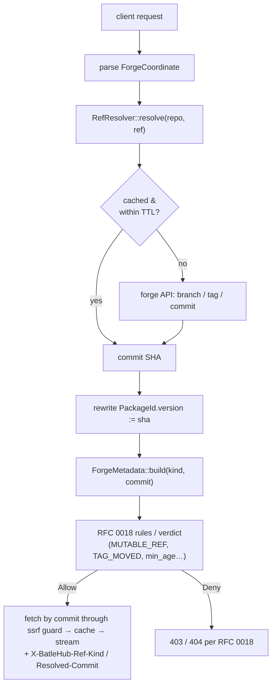
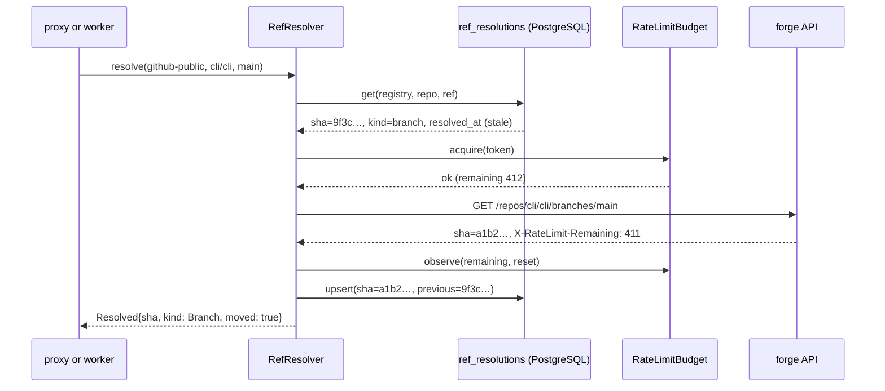

# RFC 0019 — Git-forge registries: refs, releases and raw content

| Field       | Value                                                                                 |
| ----------- | ------------------------------------------------------------------------------------- |
| Status      | **Implemented** — all five phases of §12 landed: phase 1 on 2026-09-03 (§13.1), phases 2–5 on 2026-09-04 (§13.2) and the two tails on 2026-09-05 (§13.3), each parity cell probed live before the code that relies on it. Every §11 question is decided, nothing in §12 is outstanding, and phases 3–5 are proven client-side by `tests/heavy/mise.sh` |
| Short       | Forge registries: refs, releases, raw                                                 |
| Settles     | What a "version" is for GitHub/GitLab/Forgejo, how mutable refs are served, what raw content is allowed, and what metadata these registries hand to RFC 0018 |
| Author      | Maxime <maxleriche.60@gmail.com>                                                       |
| Co-author   | —                                                                                     |
| Created     | 2026-09-02                                                                            |
| Supersedes  | —                                                                                     |
| Depends on  | Co-dependent with RFC 0018: this RFC *produces* the metadata contract and the rate-limit budget 0018 consumes, and *raises* codes on 0018's `ReasonCode`. The order is fixed once, in 0018 §12: this RFC's phase 1 precedes 0018 phase 3, and 0018 phase 1 precedes this RFC's phase 2. |
| Touches     | `crates/core`, `crates/adapters` (`registry/github`, `registry/gitlab`, `registry/forgejo`), `crates/config`, `crates/web`, `cli`, `ui`, docs |

---

## 1. Summary

BatleHub proxies three git forges — GitHub, GitLab and Forgejo — through the
same `RegistryClient` shape as a package registry. The GitHub client (which the
Forgejo handlers share) already serves a release listing, a release by tag, an
asset by id or by filename, a source tarball or zipball for any ref, and a raw
file at any ref; the GitLab client serves the same set under GitLab's `/-/`
URL shape. It works, but it treats a forge as if it had a packument: "version"
is whatever string sits in the URL, a branch and a tag are served identically,
`published_at` is filled for a release by tag and `None` for everything else
(`PackageMetadata::minimal()`), nothing records which commit a ref resolved
to, and the cache is keyed on the ref string — so `main` today and `main`
tomorrow share one cache entry over different bytes.

This RFC gives the three forges one coordinate model built on **ref
resolution**: every request resolves its ref to a commit SHA before anything
is fetched, and that SHA is what the cache, the audit log and RFC 0018's
verdicts key on. Releases, tags and commits are immutable coordinates;
branches are **mutable refs**, served by following the ref as the user asked,
but every such response says so — a `MUTABLE_REF` warning on the verdict, the
resolved commit in a header, and the Explorer listing them apart from
versions. Raw content becomes a first-class, separately policed mode (size,
repository allowlist, pinning requirement, script detection). Metadata is
derived rather than absent — release date, then tag date, then commit date;
release author, then tagger, then committer; signatures and attestations
where the forge exposes them — which is exactly the contract RFC 0018's
`min_age`, `PROVENANCE_*` and `UNTRUSTED_PUBLISHER` need. Rate-limit budget
becomes shared state so the proxy and the scan worker do not starve each
other.

**The URL scheme does not change.** Every path below is one the handlers
register today; the one new family (§4.2 *API reads*) is typed and opt-in.

### Before / after

```text
# today
$ curl batlehub/proxy/github/cli/cli/tarball/main
200                                    # which commit? unknown. age gate skipped: published_at is None

# with this RFC
$ curl -i batlehub/proxy/github/cli/cli/tarball/main
200
X-BatleHub-Ref-Kind: branch
X-BatleHub-Resolved-Commit: 9f3c1a2e…
X-BatleHub-Verdict: warned
X-BatleHub-Reason: MUTABLE_REF
X-BatleHub-Details: https://batlehub/…/verdicts/github/cli/cli/9f3c1a2e

$ batlehub why github:cli/cli@main        # RFC 0018's command; this RFC teaches it refs
github:cli/cli@main → 9f3c1a2e   WARNED   policy github-public/default
  MUTABLE_REF   branch "main" moves; pin a tag or commit for reproducible pulls
```

---

## 2. Motivation

1. **A ref is not a version.** `GithubRegistryClient` maps `pkg.version` to a
   release tag, and — for `tarball/…`, `zipball` and `raw/…` artifacts — to a
   git ref, with no notion of what kind of ref it is. `main` today and `main`
   tomorrow are the same `PackageId` (`github/cli/cli/main/raw/install.sh`)
   and therefore the same cache key (`artifact:` + `PackageId::cache_key()`,
   `crates/core/src/services/proxy/cache.rs`) with different bytes; the
   cache, the audit log and any verdict keyed on the id are silently wrong the
   moment the branch moves.
2. **Metadata is release-only.** `published_at` is filled from
   `GET /releases/tags/{tag}` for a release coordinate and is `None` for a
   tarball, zipball or raw file (`PackageMetadata::minimal()`); a tag without
   a release, a commit and a branch have none. `ReleaseAgeGateRule` skips a
   coordinate with no timestamp unless `deny_missing_timestamp` is set, and
   RFC 0018's `hold_missing_timestamp` holds it — for every forge coordinate
   that is not a release, permanently. The forge *has* the dates — on the tag
   object and on the commit — the client just does not ask.
3. **Raw is a foot-gun with no raw-specific policy.** `raw/{ref}/{path}`
   serves any file of any repository at any ref. The only ceiling is the
   global `[limits].max_artifact_size_bytes` (500 MiB by default, the same
   limit as a release asset); there is no repository allowlist and no way to
   require a pinned ref. The canonical use — `curl …/raw/main/install.sh |
   sh` — is precisely the pattern a supply-chain layer must be able to see
   and, per policy, refuse. RFC 0010 decision 9 refused to *mirror*
   installers; this path already serves them, so the decision has to be made
   again here (§11).
4. **Three forges, two implementations and one hole.** Forgejo shares the
   GitHub handler and mirrors its artifact conventions; GitLab has its own
   handler, its own `/-/` shape and its own client. Forgejo and GitLab fetch
   through `ssrf::fetch_following_redirects` with the credentialed/plain
   client pair; **the GitHub client does not** — `fetch_artifact` follows
   redirects with reqwest's default policy and no host check. Operators
   running a self-hosted Forgejo expect the same behaviour and the same
   Explorer view as for GitHub, and the one client most deployments use is
   the one without the guard.
5. **Rate limits are per process, and unread.** Upstream `X-RateLimit-*`
   headers are read nowhere; with RFC 0018 the scan worker will make metadata
   calls too, on the same token, and the first of the two to hit the ceiling
   takes the other down.
6. **Provenance exists and is ignored.** `is_release_signed` only checks for
   `.asc`/`.sig` sibling assets. GitHub artifact attestations and the signed
   tag/commit verification objects GitLab and Forgejo expose are the only
   provenance these ecosystems have, and none of the three clients' models
   carry them today (`forgejo/models.rs` has release and asset structs only).

---

## 3. Goals / non-goals

**Goals**

- One coordinate model for GitHub, GitLab and Forgejo: `Release`, `Asset`,
  `Archive`, `Raw`, `ApiRead`, each with a resolved commit.
- Ref resolution before fetch, cached per ref kind; mutable refs are served
  by following the ref, and flagged on every response.
- `published_at`, `publisher` and provenance derived from the best available
  object (release → tag → commit), exposed through `PackageMetadata` for
  RFC 0018.
- A raw-content policy: enabled per registry, size ceiling, repository
  allowlist, optional pinned-ref requirement, script detection.
- The GitHub client fetching through the same SSRF guard as the other two.
- Shared rate-limit budget per upstream token across proxy and worker roles.
- Explorer: releases and tags as versions, branches as moving refs, commit
  SHA visible.

**Non-goals**

- Git protocol proxying (`git clone` through BatleHub). Out of scope; the
  forge's own remote stays the remote.
- Write operations (creating releases, uploading assets). Read-only proxy.
- Container registries hosted by forges (`ghcr.io`, GitLab registry). Not
  proxied, per RFC 0018.
- Mirroring whole repositories. This RFC caches artifacts by commit, not
  repositories.
- A wildcard `/repos/*` passthrough. There is none today, and this RFC does
  not add one: `contents` and `git/blobs` return file bytes and would be raw
  by another door. The API reads this RFC adds are typed, one route each.
- Changing the URL scheme clients already use
  (`/proxy/{registry}/{owner}/{repo}/…`, `/proxy/{registry}/{project}/-/…`).
  Every existing path keeps working; new behaviour is additive.

---

## 4. User-facing design

### 4.1 Configuration

```toml
[[registries]]
type = "github"                      # or "gitlab" | "forgejo"
name = "github-public"
upstream = "https://api.github.com"

[registries.refs]
branch_ttl_secs   = 60               # how long a branch → commit resolution is trusted
tag_ttl_secs      = 3600             # tags can move; re-check at this cadence
mutable_refs      = "warn"           # "warn" (default) | "deny"
tag_moved         = "deny"           # "warn" | "deny" (default): tag now points elsewhere

[registries.raw]
enabled           = true             # default false
max_size_bytes    = 10485760         # 10 MiB; must be <= [limits].max_artifact_size_bytes
repos             = ["cli/*", "batleforc/*"]   # glob allowlist; empty = any repository
require_pinned    = false            # true = refuse branch refs for raw
scripts           = "warn"           # "warn" (default) | "deny" | "ignore": shell/PowerShell/Python payloads

[registries.api_reads]
families = ["tags", "commits", "branches"]   # typed read-only JSON routes added beside `releases`
```

- **Absent `[refs]`** — defaults apply: branches re-resolved every 60 s,
  mutable refs warned, moved tags denied. Resolution itself always runs (it
  is what builds the cache key). Two things change for a client with the
  defaults: the two headers appear, and **a tag that has moved since it was
  first resolved is refused** — the one new refusal, stated in §9.
- **Absent `[raw]`** — raw is **off**. This is the other behaviour change:
  raw was implicitly on for GitHub, Forgejo (`raw/`) and GitLab (`/-/raw/`).
  Operators who rely on it add `enabled = true`; the first refused request
  answers with a body that says exactly this, and `AppConfig::warnings()`
  raises `forge.raw-disabled-but-linked` at load when the registry's own
  `url_replacements` snippet (`registry suggest`, the console's Setup Guide)
  rewrites `raw.githubusercontent.com`.
- **Absent `[api_reads]`** — only the routes that exist today: the release
  listing and the release by tag. `families` adds typed routes for the tag
  list, a commit and a branch head, read-only (`GET`/`HEAD`), link-rewritten
  (§4.2). `contents` and `git/blobs` are not accepted values.
- `[registries.security]` (RFC 0018) is unchanged and consumes the metadata
  below.

### 4.2 Behaviour rules

**Coordinates.** A forge request is parsed into one of (GitHub and Forgejo
shapes shown; GitLab's `/-/` equivalents are in the parity table):

| Kind      | Routed path today                                            | Ref kind   | Immutable? |
| --------- | ------------------------------------------------------------ | ---------- | ---------- |
| `Release` | `/{o}/{r}/releases/tags/{tag}` (JSON)                        | tag        | yes*       |
| `Asset`   | `/{o}/{r}/releases/download/{tag}/{file}`, `/releases/assets/{id}` | tag  | yes*       |
| `Archive` | `/{o}/{r}/tarball/{ref}`, `/{o}/{r}/zipball/{ref}`           | any        | by ref     |
| `Raw`     | `/{o}/{r}/raw/{ref}/{path}`                                  | any        | by ref     |
| `ApiRead` | `/{o}/{r}/releases` today; `tags`, `commits/{sha}`, `branches/{name}` with `[api_reads]` | — | —   |

\* A release is immutable unless its tag is moved or its assets are
replaced; both are detected (below).

The `archive/{ref}.tar.gz` shape that appears in a forge's own
`tarball_url` is **not** a route; the mise snippet the console generates
already rewrites it to `/tarball/{ref}`, and §4.2 *API reads* rewrites it in
JSON. Adding it as an alias is §11 q3.

**Ref resolution.** Before any fetch, `ref` is classified and resolved to a
commit SHA:

- a 40-hex (or unambiguous ≥ 7-hex) string → `Commit`, no call;
- present in the repository's tags → `Tag`, resolved through the tag object
  (annotated) or directly (lightweight), cached for `tag_ttl_secs`;
- present in branches → `Branch`, cached for `branch_ttl_secs`;
- none → 404.

A ref that is both a tag and a branch resolves as the tag (documented; the
unit test in §10 pins it).

Cost: an unknown ref costs at most two API calls (tags, then branches);
GitHub's `git/matching-refs/` can answer both in one. Cached resolutions
cost none until their TTL. On an **anonymous** GitHub token (60 requests per
hour) that is a handful of new refs per hour, which is why a missing upstream
token is a load-time warning (`forge.anonymous-upstream`, raised by
`AppConfig::warnings()` — none exists today) and why `RateLimitBudget` (§5.2)
ships in phase 1 rather than later: with RFC 0018's worker on the same token
the budget is the only thing keeping the proxy alive.

**Cache key.** `ProxyService` — not the adapter — owns the cache key, and it
derives it from the `PackageId`. A forge coordinate is therefore *rewritten*
before the cache is consulted: `version` becomes the resolved SHA and
`artifact` keeps its kind and path, so the key is
`artifact:{registry}/{o}/{r}/{sha}/{tarball|zipball|raw/{path}}`. The
un-rewritten id (`…/main/…`) is what the access log and the response headers
report, so an operator can see both the ref asked for and the commit served.
Nothing else in `ProxyService` changes: the SHA is a version string like any
other.

**Identity of the bytes.** Forge-generated archives (`tarball/{ref}`) are
*not* byte-stable: the forge may recompress them (GitHub did in 2023 and
broke checksums across the ecosystem). For `Archive` and `Raw` the identity
RFC 0018 keys its verdict and job idempotency on is therefore the **commit
SHA**, and the content hash is recorded as informational only. For `Asset`
the uploaded bytes are the identity: `artifact_sha256` is the key and a
change is `ASSET_REPLACED`. `TAG_MOVED` is about the ref, never about
bytes. RFC 0008's plan/seed identity follows this split (its §4.2 is amended
by its own revision).

**Detection latency.** A moved tag or replaced asset is noticed on the next
resolution after `tag_ttl_secs` (default 1 h); until then the previously
resolved commit is served. Operators who need faster detection lower the TTL
and pay in API calls; the SOC webhook (`security.rescan`, RFC 0018) forces
an immediate re-resolution for named coordinates.

**Self-hosted forges and GitHub Enterprise.** The client already derives raw
and archive hosts from a non-`api.github.com` base URL (strip `/api/v3`,
same host for both); that logic is kept. Attestations are a github.com and
GHES ≥ 3.13 feature *(confirmed 2026-09-04: the endpoint is
anonymous-readable on github.com and answers `200 {"attestations": []}` when
there is none; a GHES instance without it answers `404`, which the client
reads as missing)*; on older GHES the row reads
`PROVENANCE_MISSING` like Forgejo.

**Mutable refs.** A `Branch` ref is served by following it (that is what the
user asked for), and the response is `warned` with `MUTABLE_REF`. Under
`mutable_refs = "deny"` it is refused with the same code. A `Tag` whose
resolved commit differs from the one previously recorded raises
`TAG_MOVED`: `deny` by default (a moved tag is either a mistake or an
attack), `warn` if the operator prefers. A release whose asset digest changed
since first seen raises `ASSET_REPLACED`, same handling as `TAG_MOVED`.

**Metadata contract** (what `resolve_metadata()` fills for RFC 0018).
`PackageMetadata` has `published_at`, `is_signed` and a free-form `extra`
today and nothing for a publisher or a provenance object; the typed fields
below are added by RFC 0018 phase 1 (`publisher`, `provenance`), and until it
lands this RFC writes them under `extra.forge` so phase 1 here does not wait:

| Field           | Release / Asset                          | Tag                              | Branch / Commit                 |
| --------------- | ---------------------------------------- | -------------------------------- | ------------------------------- |
| `published_at`  | release `published_at`                   | tagger date (annotated); lightweight tag → commit committer date | commit committer date |
| `publisher`     | release author login                     | tagger login/email → committer   | committer login/email           |
| `provenance`    | forge attestation for the asset digest; `.asc`/`.sig` sibling asset | tag signature verification | commit signature verification |
| `extra.forge.ref_kind` | `tag`                             | `tag`                            | `branch` / `commit`             |
| `extra.forge.resolved_commit` | sha                        | sha                              | sha                             |

`TrustedPublisherRule` already derives a forge publisher as the `owner`
segment of `owner/repo`; the `publisher` field is the *person*, and the rule
keeps matching on the owner. No `mutable: bool` is added: RFC 0015's
`Immutable` policy vocabulary is about who may overwrite a coordinate, not
whether upstream may, so the ref kind is carried as data and the rule (§6.1)
decides.

Forge parity — **only the first three GitHub rows are called by a client
today** (`/releases`, `/releases/tags/{tag}`, `/releases/assets/{id}`, plus
the archive and raw URL shapes); every other cell is written from the forges'
documentation and is verified against a live forge in the phase that first
relies on it, before anything depends on it:

| Capability             | GitHub                                          | GitLab                                   | Forgejo                                   |
| ---------------------- | ----------------------------------------------- | ---------------------------------------- | ----------------------------------------- |
| Release by tag         | `/repos/{o}/{r}/releases/tags/{tag}` ✓          | `/projects/{id}/releases/{tag}` ✓        | `/repos/{o}/{r}/releases/tags/{tag}` ✓    |
| Archive                | `github.com/{o}/{r}/archive/{ref}.tar.gz` ✓     | `/repository/archive.{fmt}?sha={ref}` ✓  | `/repos/{o}/{r}/archive/{ref}.tar.gz` ✓   |
| Raw                    | `raw.githubusercontent.com/{o}/{r}/{ref}/{path}` ✓ | `/repository/files/{path}/raw?ref={ref}` ✓ | `/repos/{o}/{r}/raw/{ref}/{path}` ✓  |
| Tag object / date      | `/git/ref/tags/{tag}` → `/git/tags/{sha}` ✓ *(confirmed 2026-09-03: `object.type` is `commit` for a lightweight tag, `tag` for an annotated one, whose object carries `tagger.date`)* | `/repository/tags/{tag}` ✓ *(confirmed 2026-09-04: one call — `commit.id`, `commit.committed_date`, `commit.committer_name`, and the tag's own `created_at` when annotated)* | `/repos/{o}/{r}/tags/{tag}` ✓ *(confirmed 2026-09-03: `commit.sha` and `commit.created` — the commit's date, not a tagger's; Forgejo exposes none)* |
| Commit date            | `/commits/{sha}` ✓ *(confirmed 2026-09-03: `commit.committer.date`, `committer.login`)* | `/repository/commits/{sha}` ✓ *(confirmed 2026-09-04: flat — `id`, `committed_date`, `committer_name`, `committer_email`)* | `/repos/{o}/{r}/git/commits/{sha}` ✓ *(confirmed 2026-09-03: `commit.committer.date`, `committer.login`)* |
| Branch head            | `/branches/{name}` ✓ *(confirmed 2026-09-03: `commit.sha`, `commit.commit.committer.date`)* | `/repository/branches/{name}` ✓ *(confirmed 2026-09-04: `commit.{id, committed_date, committer_name}`)* | `/repos/{o}/{r}/branches/{name}` ✓ *(confirmed 2026-09-03: `commit.id`, `commit.timestamp`, `commit.committer.username`)* |
| Asset attestation      | `/repos/{o}/{r}/attestations/{sha256:…}` ✓ *(confirmed 2026-09-04: anonymous-readable, `200 {"attestations": []}` when there is none; `404` on GHES < 3.13, which reads the same — missing)* | — (release evidence, not verifiable) | —                                    |
| Tag/commit signature   | `verification` on commit ✓ *(confirmed 2026-09-04: `{verified, reason, signature, payload}`)* | `/repository/commits/{sha}/signature` ✓ *(confirmed 2026-09-04: `404 {"message":"404 Signature Not Found"}` on an unsigned commit — the absence is the answer)* | `verification` on commit ✓ *(confirmed 2026-09-04: the object is there — `{verified, reason, signature, signer, payload}`, `gpg.error.not_signed_commit` when unsigned; the models did not have it and now do)* |

Where a forge lacks a capability the field is `None` and RFC 0018 reports
`PROVENANCE_MISSING` — never a guess. GitLab is the one exception: its
release *evidence* exists but cannot be cryptographically verified, so the
GitLab client reports `provenance = Unverifiable` and RFC 0018 emits
`PROVENANCE_UNVERIFIABLE` (severity `low`, informational) instead of
`PROVENANCE_MISSING`. No other forge may return `Unverifiable`; the
enum variant is documented as GitLab-only and the GitHub/Forgejo clients
have a test asserting they never produce it.

**Raw content.** With `[raw].enabled`:

- the repository must match `repos` when the list is non-empty;
- `Content-Length` (or the streamed size) above `max_size_bytes` → 413,
  never truncated;
- with `require_pinned`, a `Branch` ref → 403 `PINNED_REF_REQUIRED`;
- content is served as `application/octet-stream`
  (`DEFAULT_ARTIFACT_CONTENT_TYPE`) with `Content-Disposition: attachment`
  (`attachment_disposition()`); `X-Content-Type-Options: nosniff` is already
  set globally by `security_headers`. BatleHub never serves raw as `text/html`
  — today's raw path already uses the octet-stream default, so this bullet is
  a test, not a change;
- a file whose first bytes or extension mark it as a shell, PowerShell,
  Python or batch script raises `RAW_SCRIPT` — `warn` by default, `deny` if
  the operator wants no `curl | sh` through the proxy. RFC 0018's
  source-level rules run on the single file when a `[security]` section is
  present.

**API reads.** The release listing and the release by tag are JSON routes
that exist today; `[api_reads].families` adds `tags`, `commits/{sha}` and
`branches/{name}`, each a typed route, read-only (`GET`/`HEAD`), with the
client's own `Authorization` header stripped and the registry's upstream
token applied. Release listings are filtered by RFC 0018 verdicts like any
packument (the RFC 0006 block filter already drops a blocked release from
this document): a tag whose verdict is not served is omitted from the JSON,
and `latest` resolves to the newest served tag. Responses are rewritten so
that `tarball_url`, `zipball_url`, `browser_download_url` and raw links point
back at BatleHub — the `releases/download` rewrite exists in the mise
snippet; the JSON rewrite does not exist today, so `mise` and friends that
read `tarball_url` follow it straight to the forge and bypass the proxy.

**Response headers** (all forge kinds): `X-BatleHub-Ref-Kind`,
`X-BatleHub-Resolved-Commit` — spelled as the existing `X-BatleHub-Cache` is
— plus RFC 0018's `X-BatleHub-Verdict` / `X-BatleHub-Reason` when a verdict
exists. `X-BatleHub-Ref-Requested` joined them for RFC 0008 §14.4: on a
commit-keyed archive the coordinate has already become the SHA, so the ref as
the client spelled it survives nowhere else — and an air-gapped instance's
bundle has to carry that pair, because it cannot resolve a ref at all.

**What a CI pipeline sees.** Same contract as RFC 0018: a forge coordinate
held for `min_age` answers 403 with `Retry-After`; `batlehub wait
github:cli/cli@v1.2.0` works unchanged. A branch coordinate is never held
for being mutable (it is `warned`), only for a commit younger than the
floor — so a pipeline pulling `main` fails only in the hour after a push,
with a `Retry-After`, which is the intended friction.

**CLI and Explorer.** `batlehub why` is RFC 0018 phase 2's command (the
CLI's existing "why" is `batlehub authz explain`, which answers a different
question); this RFC teaches it forge coordinates so `github:cli/cli@main`
resolves and shows the commit. The Explorer's version list — rendered inside
`ui/src/pages/PackageDetailPage.vue` — contains releases and tags (newest
first, release date or tag date); a separate "Moving refs" panel lists
branches with their current commit and last resolution time. Every version
row shows its short SHA.

### 4.3 Validation

`AppConfig::validate()` rejects:

| Condition                                                        | Rationale                                                                 |
| ---------------------------------------------------------------- | ------------------------------------------------------------------------- |
| `raw.enabled = true` with `max_size_bytes = 0` or missing        | Unbounded raw is exactly the hole this RFC closes.                        |
| `raw.max_size_bytes > [limits].max_artifact_size_bytes`          | The global ceiling would win silently and the operator's number would be a lie. |
| `raw.repos` entry is not a valid `owner/repo` glob               | A typo would either allow everything or nothing, silently.                |
| `refs.branch_ttl_secs < 10`                                      | Re-resolving on every request is a rate-limit self-DoS.                   |
| `api_reads.families` contains a value outside `tags`, `commits`, `branches` | `contents` and `git/blobs` are raw by another door; unknown families would proxy writes. |
| `[refs]`, `[raw]` or `[api_reads]` on a registry whose `type` is not a forge | Same class as the existing "`index_url` on a non-cargo registry" refusal. |

Warnings (`AppConfig::warnings()`, stable codes, surfaced like
`license-gate.sbom-disabled`):

| Code | Condition | Behaviour |
| --- | --- | --- |
| `forge.anonymous-upstream` | a forge registry with no upstream token | Anonymous GitHub is 60 requests/hour; with ref resolution that is a few minutes of use. |
| `forge.raw-disabled-but-linked` | `[raw]` absent or disabled while the registry's generated `url_replacements` rewrite `raw.githubusercontent.com` | The snippet the operator hands out points at a path that refuses. |
| `security.timestamp-hold-unavailable` (RFC 0018) | `[security]` with `hold_missing_timestamp = true` on a forge whose `[refs]` derivation is not yet built | Retired for the forges by this RFC's phase 1, which dates every ref; the warning now fires for the path-addressed kinds only. |

---

## 5. Architecture

### 5.1 Request path



### 5.2 Ref resolution and budget



`RateLimitBudget` is a row per `(registry, token_fingerprint)` holding
`remaining` and `reset_at` as last reported by the forge; both roles read it
before calling and refuse (serve from cache, or `SCANNER_ERROR` on the
worker side) below a reserve of 10 %. The proxy always has priority: the
worker's reserve is 25 %. It lives in PostgreSQL for the reason RFC 0018 §6.3
gives for its queue: it is the one store every deployment has.

---

## 6. Detailed design

### 6.1 `crates/core`

- `entities/forge.rs` — `ForgeCoordinate { registry, owner_repo, kind:
  ForgeKind }`, `ForgeKind::{Release{tag}, Asset{tag, selector},
  Archive{git_ref, format}, Raw{git_ref, path}, ApiRead{family, rest}}`,
  `GitRef::{Commit(sha), Tag(name), Branch(name)}`, `ResolvedRef { sha,
  kind, resolved_at, previous: Option<sha> }`, `ForgeMetadata` mapping onto
  `PackageMetadata` (`extra.forge.*` until RFC 0018's typed fields exist).
- `ports/forge.rs` — `RefResolver { resolve(registry, repo, git_ref) }`,
  `RefResolutionRepository`, `RateLimitBudget { acquire, observe }`.
- `entities/security.rs` (RFC 0018) — the codes `MUTABLE_REF`, `TAG_MOVED`,
  `ASSET_REPLACED`, `PINNED_REF_REQUIRED`, `RAW_SCRIPT`,
  `PROVENANCE_UNVERIFIABLE` are added to RFC 0018's master `ReasonCode` list
  (its §4.2 is the single source; this RFC does not keep its own table);
  `FindingKind::Ref`. `PackageMetadata.provenance`
  becomes `Provenance::{Verified(..), Invalid(..), Unverifiable, Missing}`.
- `rules/forge_ref.rs` — `ForgeRefRule`: `MUTABLE_REF` (allow+warn or deny
  per config), `TAG_MOVED`, `ASSET_REPLACED`, `PINNED_REF_REQUIRED`. On a
  `[security]` registry it runs as a scanner through 0018's `RuleAsScanner`
  so its findings are part of the verdict; on a forge registry without
  `[security]` it is a plain rule in the chain — `deny` outcomes work, the
  `warn` outcomes are headers only, and there is no verdict to attach them
  to (which is the honest degradation, and the doc page says so).
- `ports/registry.rs` — `RegistryClient` gains `fn forge(&self) ->
  Option<&dyn ForgeRegistry>` beside its existing optional methods
  (`list_versions`, `fetch_version_document`, `fetch_linked_readme`,
  `search_packages`); `ForgeRegistry { resolve_ref, tag_object, commit,
  branch_head, attestation, signature }`. Non-forge clients return `None`;
  nothing else changes for them.
- `services/proxy/handle.rs` — the `PackageId` rewrite (§4.2 *Cache key*)
  happens once, before the cache lookup and before rules, in the one place
  that already resolves metadata first.

### 6.2 `crates/config`

- `schema/forge.rs` (new file beside `registry.rs`, `rules.rs`, `server.rs`)
  — `RefsConfig`, `RawConfig`, `ApiReadsConfig` as optional sub-structs of
  `RegistryConfig`, the shape `cache`, `rbac`, `quota`, `signing` … already
  take; validation per §4.3; `warnings.rs` gains the two codes. No config
  version bump (`CURRENT_CONFIG_VERSION` stays 1); `raw.enabled` default
  `false` is called out in the changelog and by the first-hit error body.

### 6.3 `crates/adapters`

- `registry/forge/` — shared `ForgeCoordinate` parser (path → coordinate,
  per forge URL shape), `RefResolverImpl`, `RateLimitBudgetPg`;
  `ref_resolutions` and `rate_limit_budget` tables as `mig!` entries 047 and
  048 in `migrations.rs` (the workspace does not use `sqlx::migrate!`).
- `registry/github/client.rs` — implements `ForgeRegistry` with the
  endpoints in the parity table; `static_artifact_url` takes a commit SHA
  instead of a ref; **`fetch_artifact` moves onto
  `ssrf::fetch_following_redirects` with the credentialed/plain client pair
  the Forgejo client already builds** (a phase-1 change that stands on its
  own); `is_release_signed` becomes one provenance source next to
  `/attestations/{digest}`; JSON responses rewritten by
  `rewrite_forge_links`.
- `registry/gitlab`, `registry/forgejo` — same trait, their endpoints. The
  Forgejo and GitLab `models.rs` gain commit and tag structs (with the
  `verification` / `signature` objects) — none exist today.
- Raw serving: `RawPolicy` applied in the client before streaming
  (allowlist, size, pinning, script sniff on the first 512 bytes).

### 6.4 `crates/web`

- The github handler (shared by Forgejo) and the gitlab handler parse into
  `ForgeCoordinate` and add the two headers; the `[api_reads]` routes are
  registered in `lib.rs` next to the existing seven GitHub routes and apply
  `rewrite_forge_links`. Every `200` declares a body schema, as
  `openapi_contract.rs` requires.
- Raw responses: already `application/octet-stream` and `nosniff`; add
  `attachment`.

### 6.5 `cli`, `ui`, docs

- `batlehub why` (RFC 0018) resolves forge coordinates.
- `PackageDetailPage.vue`: "Moving refs" panel, SHA column,
  `TAG_MOVED`/`ASSET_REPLACED` badges reuse RFC 0018's verdict badges.
- `docs/registries/github.md`, `gitlab.md`, `forgejo.md` — the three pages
  that exist — each gain the ref-kind, raw-policy and headers sections; the
  `mise` snippet in `ui/src/config/registryTypes.ts` and `cli/src/api/suggest.rs`
  (two generators that must agree — RFC 0008's revision owns that) are
  unchanged in shape.

**Deliberately untouched**: the `/proxy/{registry}/…` URL scheme; non-forge
registries (the `forge()` hook returns `None`); RFC 0018's rule engine and
verdict model (this RFC only adds codes and one rule); storage backends;
`PackageId::cache_key()` itself (the rewrite feeds it a different id).

---

## 7. Security considerations

- **Mutable refs are the attacker's friend and the user's choice.** Serving
  `main` is legitimate; serving it *silently* is not. Every mutable response
  is marked, recorded with its commit in the audit log, and `mutable_refs =
  "deny"` exists for registries that must be reproducible.
- **Moved tags and replaced assets are denied by default.** These are the
  two forge-native ways to swap bytes under a stable coordinate; detection
  keys on the previously recorded SHA/digest, so the first observation is
  trusted and any later change is a finding.
- **Raw is off unless enabled, bounded when it is.** Size ceiling, allowlist,
  no HTML content type, script sniffing. A raw file cannot be used to serve
  a phishing page through the proxy's origin.
- **API reads are typed, read-only and link-rewritten.** No method other than
  `GET`/`HEAD`, no family outside the three, no wildcard, no leaking of the
  upstream token (the client's own header is stripped; the proxy's is never
  echoed).
- **SSRF.** Every URL the adapter builds derives from `owner_repo` and a
  resolved SHA, both validated against strict grammars. The
  `registry::ssrf` guard applies to the upstream host **once the GitHub
  client is moved onto it (phase 1)** — today it applies to Forgejo and
  GitLab only. Links inside forge JSON are rewritten to BatleHub, never
  followed.
- **Rate-limit budget is a denial-of-service control.** Without it a burst of
  branch resolutions or a backfill on the worker exhausts the token and takes
  the proxy down with it; with it the proxy keeps its reserve and the worker
  degrades first.
- **Provenance is verified, not trusted.** An attestation is checked against
  the asset's digest with the forge's public key material; a `verification:
  {verified: false}` object is `PROVENANCE_INVALID`, not "signed".

---

## 8. Alternatives considered

| Alternative                                              | Why rejected                                                                                          |
| -------------------------------------------------------- | ----------------------------------------------------------------------------------------------------- |
| Refuse branch refs entirely                              | Breaks the dominant real use (`mise`, install scripts pinned to `main`); the user asked to follow the ref, so follow it and say so. |
| Treat a moved tag as a new version and serve it          | That is the hijack pattern; `deny` by default with an operator switch is safer and equally simple.    |
| Keep raw always on, add only a size limit                | Repository allowlist and pinning are the controls a SOC asks for first; off-by-default is the honest default for a supply-chain proxy. |
| A `/repos/*` wildcard passthrough with a family allowlist | `contents` and `git/blobs` are raw by another door and would need the raw policy applied to decoded JSON; three typed routes cover what `mise` and `gh` actually call and the OpenAPI contract stays complete. |
| Per-forge RFCs                                           | The coordinate and ref model is identical across the three; only endpoints differ. One trait, three impls. |
| Fold all of this into RFC 0018                           | 0018 would double in size for one registry family and mix "what is safe to serve" with "what is a version on a forge". 0018 consumes a metadata contract; this RFC produces it. |
| Resolve refs lazily, at fetch time only                  | The verdict, the cache key and the headers all need the SHA before the fetch; resolving first is one extra cheap call and makes the rest deterministic. |
| A new storage-key scheme owned by the adapter            | `ProxyService` derives the key from the `PackageId` and `handle.rs` relies on that; rewriting the id keeps one owner and one key function. |

---

## 9. Rollout and compatibility

- **Behaviour changes**: `raw` is off unless `[raw].enabled = true`; moved
  tags are denied. Both are stated in the changelog, by the load-time
  warning and by the first-hit error body. Everything else is additive
  (headers, verdict codes, metadata, the SSRF guard on GitHub).
- **URLs**: unchanged. `mise` configurations from the README and the Setup
  Guide keep working.
- **Cache**: the key changes from ref to SHA for archives and raw files. No
  migration: the old entries age out under the existing eviction policy and
  the first request after upgrade is a miss. Release assets keep their key.
- **Database**: `ref_resolutions`, `rate_limit_budget` via `mig!` 047/048;
  no data migration.
- **RFC 0018 dependency**: 0018's forge behaviour (age gate on derived
  dates, `MUTABLE_REF` in the verdict) requires this RFC's metadata, and
  0018's worker must not call a forge before this RFC's `RateLimitBudget`
  exists — both are phase 1 here. Until then 0018 treats forges as
  "timestamp missing" and its worker skips forge registries. This RFC's
  phase 2 needs 0018's `ReasonCode` and verdict to exist; on a forge without
  `[security]` the rule degrades to deny-or-header as §6.1 states.
- **Rollback**: remove the sections; the resolver still runs (it is what
  builds the cache key) but with defaults; tables stay.

---

## 10. Test plan

- **Unit** (`crates/adapters/src/registry/forge/coordinate.rs`): path →
  coordinate for the GitHub/Forgejo and GitLab URL shapes, including the
  ambiguous case (`tarball/v1.2.0` where `v1.2.0` is both a tag and a
  branch: tag wins, documented).
- **Unit** (`RefResolverImpl`, mock forge): SHA passthrough without a call,
  tag/branch classification, TTL expiry, `previous` recorded on change.
- **Unit** (`rules/forge_ref.rs`): each code under `warn`/`deny`, with and
  without a `[security]` registry.
- **Unit** (provenance): GitLab client yields `Unverifiable` for release
  evidence; GitHub and Forgejo clients never do (a `#[test]` over every
  provenance path of those two clients).
- **Unit** (`RawPolicy`): allowlist globs, size reject at 413, pinned
  requirement, script sniffing on shebang and extension.
- **Unit** (`rewrite_forge_links`): every URL field in release/asset JSON
  is rewritten; unknown fields untouched.
- **Unit** (GitHub client): a redirect to a private address from the archive
  host is refused — the SSRF test the Forgejo client already has, copied.
- **Integration** (mockito, per forge): release → tag → commit date
  derivation, moved-tag detection across two responses, replaced-asset
  detection by digest, rate-limit budget shared between two clients.
- **Integration** (`crates/web/tests/forge_security.rs`, with RFC 0018,
  beside the existing `blocked_versions_hidden_forge.rs`): a fresh commit on
  `main` is `warned MUTABLE_REF` and held by `min_age` when younger than the
  floor; an annotated tag older than the floor is served.
- **Heavy** (`tests/heavy/mise.sh`, new): no heavy suite drives a forge
  today. `mise` installs a tool from a GitHub release and from a tarball
  through the proxy, then a branch pull is asserted `warned` on the wire
  transcript and a moved tag refused — this is the forge half of RFC 0018
  §4.4's survey, measured here.
- **Existing suites** unchanged: current GitHub client tests
  (`static_url_*`, `list_versions_follows_pagination`) keep passing with the
  SHA-based signature.

---

## 11. Decisions and open questions

### Resolved

| # | Question                                   | Decision                                                                                     |
| - | ------------------------------------------ | -------------------------------------------------------------------------------------------- |
| 1 | Scope                                      | **All three forges** (GitHub, GitLab, Forgejo) under one model; raw content included.        |
| 2 | Mutable refs                               | **Serve by following the ref, warn on every response** (`MUTABLE_REF`); `deny` available.    |
| 3 | Moved tag / replaced asset                 | **Deny by default**, `warn` configurable.                                                    |
| 4 | Metadata for RFC 0018                      | **Derive**: release → tag → commit for date and publisher; forge attestations/signatures for provenance; carried in `extra.forge` until 0018's typed fields land. |
| 5 | Raw default                                | **Off**; bounded and allowlisted when on.                                                    |
| 6 | Lightweight tags                           | **Commit date** (release date when a release exists); never `TIMESTAMP_MISSING` for a resolvable tag. |
| 7 | Branch refs and `min_age`                  | **Kept**: a new commit on a branch is held for the floor like any new version; no bypass.    |
| 8 | GitLab release evidence                    | **`PROVENANCE_UNVERIFIABLE`, GitLab only**, informational; other forges report `MISSING`.     |
| 9 | Byte identity                              | **Commit SHA for archives and raw** (forge archives are not byte-stable); content hash for assets only. |
| 10 | Phase order                               | **GitHub + Forgejo in phase 1**, GitLab in phase 4; `RateLimitBudget` in phase 1.            |
| 11 | API passthrough                           | **No wildcard.** Three typed read-only families, opt-in; `contents`/`git/blobs` never.       |
| 12 | Cache key ownership                       | **`ProxyService`, via a rewritten `PackageId`** — no adapter-owned key scheme.               |

### Still open

1. ~~**Endpoints marked *(to confirm)*.**~~ Eleven cells of the parity table
   were written from documentation, and the first revision of this RFC
   claimed the Forgejo `verification` object was already in the client's
   models — it is not. Each is verified against a live forge in the phase
   that first relies on it. **Phase 1 confirmed its six cells on 2026-09-03**
   (GitHub and Forgejo: tag, commit, branch — §13.1); **phases 4 and 5
   confirmed the last five on 2026-09-04** (GitLab's tag, commit, branch and
   signature endpoints, GitHub's attestation store, Forgejo's `verification`
   object — §13.2). Every cell of the table is now a live observation, and
   the question is closed.
2. ~~**Installers through `raw`.**~~ RFC 0010 decision 9 says BatleHub proxies
   registries, not installers, and refuses to mirror `install.sh`; this RFC
   serves exactly that file under a `warn` default. The two are reconcilable
   — 0010 is about *hosting* an installer as a package, this is about
   *passing one through* with a policy on it — but the sentence has to be
   written in both documents, and `scripts = "deny"` may be the right default
   for a registry with `[security]`. Decide before phase 3.

   **Decided 2026-09-04, before phase 3.** Both halves. (a) The two RFCs are
   reconciled as stated: 0010 refuses to *host* an installer as a package —
   a synthetic version, a cache entry, a name in the catalogue — and this
   RFC passes one *through* under a policy, with a reason code on the
   response. (b) `scripts` defaults to **`deny` on a registry with
   `[registries.security]`** and to `warn` on any other. Opting into a
   quarantine is opting into "nothing unscanned is served", and a shell
   script passed through is the one artifact no scanner in this codebase
   reads: `guarddog` and `postmortem` read package archives, `trivy` reads
   SBOMs and lockfiles, and none of them is handed a single file. A default
   of `warn` there would have been a hole in the one section that promises
   there is none.
3. ~~**An `archive/{ref}.tar.gz` route alias.**~~ Every forge's own JSON
   advertises this shape; the snippet rewrites it and §4.2 rewrites it in
   JSON, so nothing needs it today. Adding it would let an un-rewritten
   `tarball_url` work; it would also be a second name for one coordinate in
   the cache and the access log.

   **Decided 2026-09-04: no.** The setup snippet and the §4.2 JSON rewrite
   both point every client at `tarball/{ref}`, and across `mise.sh`'s runs
   and the live probes of §13.1 and §13.2 no client has been observed to
   request the alias. Adding it would give one coordinate two names in the
   cache and the access log — the thing decision 12 exists to prevent — for
   a request nobody makes. Reopen it on the first client that does, with the
   client's name.

---

## 12. Implementation phases

| Phase | Content                                                                                                      |
| ----- | ------------------------------------------------------------------------------------------------------------ |
| 1     | `ForgeCoordinate`, `RefResolver` + `mig!` 047, SHA-rewritten `PackageId` and cache key, headers, `RateLimitBudget` (`mig!` 048, proxy + worker), `ForgeMetadata` in `extra.forge` for **GitHub and Forgejo** (Forgejo is the self-hosted case and shares GitHub's handler; doing both proves the trait), **GitHub client onto `fetch_following_redirects`**, the two load-time warnings, `tests/heavy/mise.sh`. Unblocks RFC 0018 phase 1 (budget) and phase 3 (metadata). Confirms the phase-1 *(to confirm)* cells. |
| 2     | `ForgeRefRule` (`MUTABLE_REF`, `TAG_MOVED`, `ASSET_REPLACED`), Explorer moving-refs panel, `batlehub why` support, `Retry-After` on held forge coordinates. Needs 0018 phase 1 for the verdict; degrades per §6.1 without it. |
| 3     | `[raw]` policy, off-by-default switch, script sniffing, `[api_reads]` typed routes + link rewriting + verdict filtering of release listings. Decides §11 q2 first. |
| 4     | GitLab `ForgeRegistry` to parity; the three registry pages updated.                                          |
| 5     | Provenance (attestations, signatures) wired into 0018 findings; GHES attestation detection; Forgejo/GitLab commit and tag models. |

---

## 13. Revision against the tree

### 13.1 Phase 1 landed (2026-09-03)

Built and verified: `ForgeCoordinate` and `RefKind` (`entities/forge.rs`),
the `ForgeRegistry`, `RefResolutionRepository` and `RateLimitBudget` ports
(`ports/forge.rs`), `services::forge_refs::resolve_ref`, `mig!` 047
(`ref_resolutions`) and 048 (`rate_limit_budget`) with Postgres and in-memory
stores, the `PackageId` rewrite in `ProxyService::handle`, the two response
headers, `ForgeRegistry` on the GitHub and Forgejo clients with every API
call drawn on the budget, the GitHub client on
`ssrf::fetch_following_redirects_trusting`, `[registries.refs]` with its
validation, the `forge.anonymous-upstream` warning, and `tests/heavy/mise.sh`.
The six phase-1 parity cells were probed live against api.github.com and
codeberg.org before the clients were written; the table above records what
each returned. Six things differ from the text, each deliberate:

- **`ForgeCoordinate` is read from the `PackageId`, not parsed from the
  path.** The handlers already encode the request in a small set of artifact
  conventions (`tarball/{ref}`, `zipball`, `raw/{path}`, `filename/{name}`,
  an asset id, `version = "releases"`); a second parser over the URL would be
  a second address for the same request. `from_package_id` reads those
  conventions back, in the one place that already resolves metadata first.
- **The access log records the resolved coordinate.** §4.2 asked for the
  un-rewritten id in the log and both in the headers. The audit row now names
  the commit that was served, which is the fact an incident needs; the
  requested ref is in the response headers and in `extra.forge.requested_ref`
  on the metadata. Threading a second id through every audit call for a row
  that would say `main` was not worth its surface.
- **The GitHub client trusts three origins, not one.** GitHub is the API
  host, `github.com` for archives and `raw.githubusercontent.com` for raw
  files, and a private repository needs the token on all three. The guard
  gained a `fetch_following_redirects_trusting` form taking the derived
  origins; every hop off them is SSRF-checked and re-issued without
  credentials, and an asset URL not on one of them is refused before any
  request.
- **`forge.raw-disabled-but-linked` waits for phase 3.** It describes the
  `[raw]` section, which does not exist yet; raw stays implicitly on until
  phase 3 turns it off, and a warning about a switch that is not there would
  be noise.
- **`forge.anonymous-upstream` fires for all three kinds.** GitLab.com is
  metered too, and an anonymous self-hosted Forgejo still sees the proxy's
  requests as nobody's. The message names GitHub's 60/hour as the reason.
- **The release listing (`/releases`) is not drawn on the budget.** It goes
  through the shared `fetch_release_listing` helper, which takes a request
  rather than a client; the release-by-tag, asset, ref and commit calls are.
  Closing that gap is a one-line change once the helper takes a client.

**Two shipped defects `mise.sh` found**, both in the three routes §4.2 says a
client calls today, and both invisible to every route test because
`FixedRegistry` answers any coordinate with bytes:

- `GET /{o}/{r}/releases/tags/{tag}` answered **500** to every real client.
  The handler streams it through `proxy_stream`, and both forge clients'
  `fetch_artifact` refused a coordinate with no artifact selector. mise's
  `github:` backend asks for exactly this first. Both clients now stream the
  release's own JSON, byte-exact.
- `GET /{o}/{r}/releases/assets/{id}` answered **404** unless the caller
  added `?tag=`, which no client does: the handler's placeholder tag
  `unknown` was looked up as a release. The GitHub client now reads the
  asset's own JSON, takes its release from `browser_download_url`, and dates
  the coordinate by that release; the coordinate model treats the placeholder
  as naming no ref, so the by-id route carries no ref headers (there is no
  ref to report until the asset has been read). Forgejo's by-id route still
  needs the tag — its API addresses an attachment through its release — and
  is left for phase 4 with the GitLab parity work.

Also observed: mise sends a `HEAD` for the asset by name before falling back
to the API asset, and the artifact routes answer `404` to `HEAD`. Harmless
here, since the fallback works, and noted for phase 3's typed reads.

Observed by `mise.sh` against api.github.com anonymously, with mise 2026.8.6
(the `ubi:` backend was tried first and downloads with its own HTTP client,
outside mise's `url_replacements` — the suite uses `github:`): `mise install
github:cli/cli[exe=gh]@2.60.0` read the release JSON, the checksums file and
the asset through the proxy; the release JSON and the checksums answered
`X-BatleHub-Ref-Kind: tag` with the tag's commit; `tarball/trunk` answered
`branch` with the head commit; `tarball/v2.60.0` answered `tag`;
`tarball/<sha>` answered `commit` resolving to itself; and a second pull of
`trunk` after its TTL was a cache hit on the commit-keyed entry. Not observed,
because they are phase 2: the moved-tag refusal and the `MUTABLE_REF` verdict.

Not yet in "In review": §11 q2 and q3 are still open, and the five GitLab
and provenance cells are still from documentation.

### 13.2 Phases 2–5 landed (2026-09-04)

Built and verified on `feat/idk`. The five parity cells that were still
written from documentation were probed live against api.github.com,
gitlab.com and codeberg.org before the code that relies on them, and the
table above now records what each returned; §11 questions 1 and 2 are closed
in place.

**Phase 2 — the ref is a finding.** `[registries.refs]` gained
`mutable_refs` and `tag_moved`; `ForgeRefRule` (`rules/forge_ref.rs`) reads
the resolution back out of `extra.forge` and produces `MUTABLE_REF`,
`TAG_MOVED` and `ASSET_REPLACED`, with the detection shared by
`services::forge_refs::ref_findings` so there is one definition of what a
moved tag is. `X-BatleHub-Ref-Previous-Commit` joins the two phase-1 headers.
The verdict endpoint resolves a forge ref, so `batlehub why
github:cli/cli@main` answers about the commit and says which one; a new
`GET /api/v1/explore/{registry}/{name}/refs` lists what this instance has
resolved for a repository, which is the console's moving-refs panel.

**Phase 3 — raw, and the typed reads.** `[registries.raw]` and
`[registries.api_reads]` with the §4.3 validation; `RawPolicyRule` refuses
raw that is off, a repository outside the allowlist, a branch under
`require_pinned` and a script under `scripts = "deny"`; the size ceiling is
enforced by lowering the *stream* limit, so a file over it is refused and
never truncated. The three families are typed routes in this proxy's own
shape. Release documents — the listing and the by-tag route, on all three
forges — have their download URLs repointed at the proxy and the forge's own
API links removed.

**Phase 4 — GitLab.** `ForgeRegistry` for the GitLab client (tag, branch,
commit, tags, signature), and every GitLab API call now draws on the shared
rate-limit budget, which was the phase-1 gap decision 10 deferred.

**Phase 5 — provenance.** `ForgeProvenance::{Verified, Invalid,
Unverifiable, Missing}` and `ForgeRegistry::provenance`; GitHub reads the
attestation store for an asset digest and the commit's `verification`
otherwise, Forgejo reads `verification`, GitLab reads the signature endpoint
and falls back to release evidence — the one source of `Unverifiable`, with a
test over both other clients asserting they never produce it.
`ForgeProvenanceScanner` turns the answer into a finding on a `[security]`
registry.

**Seven things differ from the text, each deliberate:**

- **The ref facts are a rule, never a scanner.** §6.1 offered both — a rule
  without `[security]`, `RuleAsScanner` with it. The scanner half cannot
  work: the worker judges a *coordinate* and the ref is a fact about a
  *request*, so `PackageMetadata::minimal(job.package)` has no ref to read,
  and the same commit reached through a tag and through a branch is one
  stored verdict and two ref kinds. The rule runs on both kinds of registry
  and, where there is a verdict, merges its findings into the *request's*
  verdict through a new `verdict::augment_request_verdict` — so a warned
  branch answers `X-BatleHub-Verdict: warned` and nothing about the ref is
  ever written to the verdict store.
- **`ASSET_REPLACED` compares the forge's advertised digest with the bytes
  already cached**, not two observations of the bytes. GitHub carries
  `digest` on the asset JSON (confirmed 2026-09-04, `null` on assets
  uploaded before the field existed), and the proxy already records the
  SHA-256 of what it stored. Where either is absent the finding cannot fire,
  which is a first sight and is trusted.
- **`RAW_SCRIPT` is judged twice, not once.** §4.2 asks for "first bytes or
  extension". The extension is checked in the rule, before any fetch, and
  produces the `warn` as well as the `deny`. The shebang is checked on the
  first chunk of the response — and only under `deny`, because refusing
  costs one chunk while warning on bytes would mean peeking at every raw
  file to say something the name already said.
- **The three `[api_reads]` families answer BatleHub's own shape**, not the
  forge's rewritten JSON. §4.2 wrote the rewriting requirement for the
  release documents, which is where the URLs that matter are; a typed answer
  for tags, commits and branches has no upstream URL in it at all, which is
  a stronger reading of §11 q11's "no wildcard" than rewriting would be.
- **`branches/{name}` answers through the resolver**, not through a direct
  API call, so the branch head the family reports and the commit
  `tarball/{branch}` serves are the same fact and the resolution is
  remembered.
- **The provenance scanner cannot reach an asset's attestation.** A verdict
  is about a version, and an asset digest is a sub-coordinate the worker does
  not have; the scanner asks for the commit's signature. The read path
  carries the asset digest in `extra.forge`, so the attestation is reachable
  where a request names one asset — which is the same split §4.2 already
  makes for byte identity.
- **`forge.raw-disabled-but-linked` fires for every forge registry that has
  not enabled raw**, rather than inspecting the generated snippet. The
  snippet rewrites the forge's raw host unconditionally for all three kinds,
  so the two conditions are the same condition; checking the generator would
  have been a second copy of a fact that is already true by construction.

**Measured.** `crates/web/tests/forge_security.rs` (8 tests: a branch served
and named, refused under `deny`, warned on the wire under `[security]`; a
moved tag refused by default, warned when configured, denied through the
verdict; an asset digest change refused and an archive's ignored),
`crates/web/tests/forge_api_reads.rs` (8: raw off until written, the
allowlist, `require_pinned`, `scripts` warn/deny, the three families opt-in
and their shapes, a package registry refusing), unit tests for the rule, the
raw policy, the link rewriting on both forge shapes, GitLab's five endpoints
against mockito bodies copied from gitlab.com, and the provenance guarantee
over every GitHub and Forgejo path.

**Left for later** — both closed the next day, in §13.3. The `mise.sh`
heavy suite still drives phase 1's routes
only; a moved tag cannot be staged against a real forge, so the wire
assertions for `TAG_MOVED` live in the in-process suite. The Explorer's
version rows do not yet show a short SHA — the moving-refs panel is the half
of §6.5 that needed a store behind it, and the SHA column is presentation
over data the page already has.

### 13.3 The tails (2026-09-05)

What the build order that followed this RFC left for last: presentation
over data the page already had, and client-side proof of phases 3–5.
The Explorer's version rows now show the short SHA beside a version that
is a ref (`data-testid="ref-sha"`, from the same `/refs` answer the
moving-refs panel reads; nothing on a package registry, where there is no
ref to resolve), tested in `PackageDetailPage.test.ts`. `tests/heavy/mise.sh`
gained two sections under a `[registries.raw] enabled = true, scripts =
"deny"` and `[registries.api_reads] families = ["tags"]` config: raw
`script/createrepo.sh` at a pinned tag is answered `403` naming
`RAW_SCRIPT` with none of its bytes, `README.md` at the same tag is served
through the same route; the `tags` family answers and names the tag, the
`commits` family — not enabled — refuses; and the release document for the
tag has every `browser_download_url`, `tarball_url` and `zipball_url` on
the proxy and no `assets_url`/`upload_url`/asset `url` left on
api.github.com. One thing the run settled: the release's own top-level
`url` is left as the forge wrote it — it is the release's identity, not a
link a client follows — and the suite asserts on the links that are.

