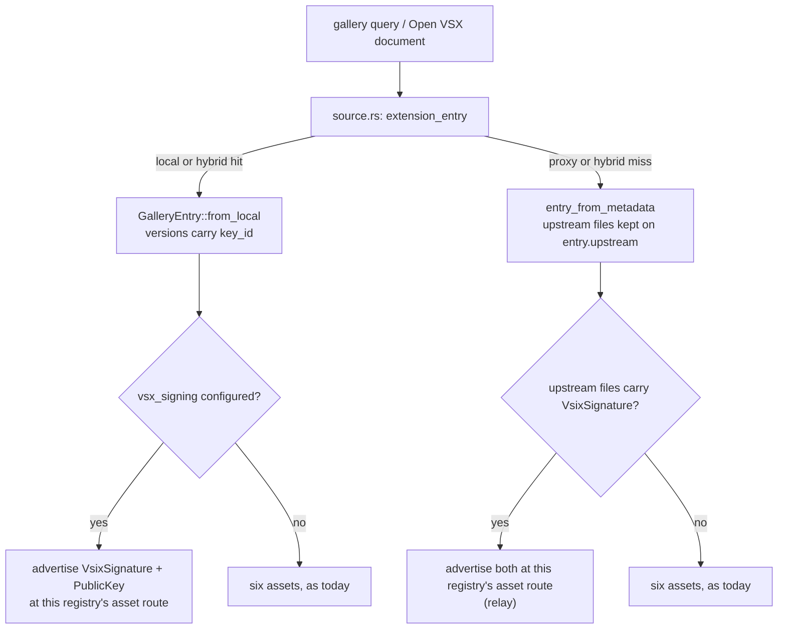
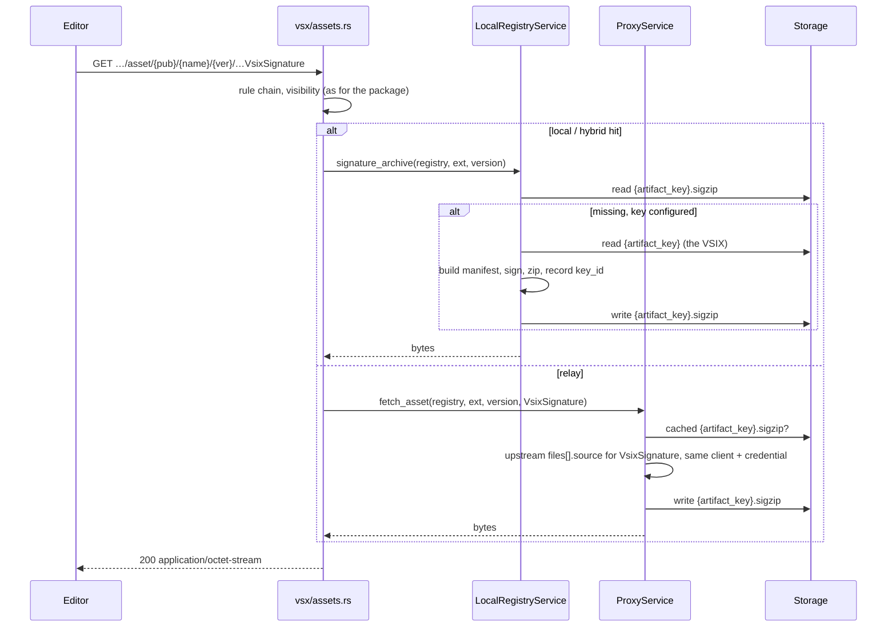

# RFC 0020 — Signing at the vscode-marketplace registry

| Field       | Value                                                        |
| ----------- | ------------------------------------------------------------ |
| Status      | **Implemented** — phases 1, 2, 3 and 5 landed 2026-09-06 (§13), plus the provided-signature path (§13.6): a marketplace extension republished here keeps its signature and a stock build verifies it. Phase 4 is **deferred**, and decided in principle, until a VSIX crosses the gap at all (§13.4, §11 decision 10). Measured by `tests/heavy/vsx_view.sh`, re-run green at sign-off on 2026-09-07 (§13.7): the view enables Install on a registry-signed extension, the editor's verifier refuses it as §4.5 said, and with the setting off the view installs it and the extension activates |
| Short       | Signed VSIX assets                                            |
| Settles     | Making what a BatleHub VSX registry serves installable from a current editor's Extensions view: a signature asset per version, the registry's own Ed25519 key in Open VSX's format, the upstream's signature relayed in proxy mode, and the one setting a stock build still needs |
| Author      | Max Batleforc <maxleriche.60@gmail.com>                       |
| Co-author   | —                                                             |
| Created     | 2026-09-05                                                    |
| Revised     | 2026-09-06 — §13, what building it found; §11 q1–q3 decided |
| Supersedes  | —                                                             |
| Touches     | `crates/config` (`[registries.vsx_signing]`), `crates/core` (`services/signature.rs`, `local_registry/eco_openvsx.rs`), `crates/adapters` (`registry/vscode_marketplace`), `crates/web` (`handlers/proxy/vsx/{render,assets,api,archive}.rs`), `cli/` (`vsx keygen`/`vsx verify`), `tests/heavy/{vsx_view,vsx_login,openvsx}.sh`, docs |

---

## 1. Summary

A current VS Code will not install an extension from its Extensions view
unless the gallery entry carries a signature asset, and a BatleHub
`vscode-marketplace` registry carries none — for what it hosts, and for what
it proxies, because the proxy re-renders every entry from a fixed list of
six assets and drops the upstream's seventh. This RFC adds the seventh. A
registry that holds an Ed25519 key signs each VSIX it publishes and serves
the signature in the archive shape Open VSX uses, under the asset type the
editor looks for; a registry that proxies relays the upstream's signature
and public key unchanged. The gallery and the Open VSX API advertise both
only when the bytes exist. What this buys, per editor build: on che-code,
code-server and VSCodium the view installs; on a stock build the view's
Install button turns on, and the install goes through once
`extensions.verifySignature` is off — the same setting those three builds
ship off — because `vsce-sign` accepts no signature but Microsoft's,
measured, and no key this registry could hold changes that.

### Before / after

```text
# today — tests/heavy/vsx_view.sh, VS Code 1.136.1, a local registry
Weebo Bridge Notify   batleforc   [Install]  (greyed)
  This extension is not signed by the Extension Marketplace.
$ code --install-extension batleforc.weebo-bridge-notify
Error … Signature verification failed with 'NotSigned' error.

# with this RFC
[registries.vsx_signing]
seed_hex = "${VSX_SIGNING_SEED}"         # 32-byte Ed25519 seed

Weebo Bridge Notify   batleforc   [Install]
$ code --install-extension batleforc.weebo-bridge-notify   # verifySignature off
Extension 'batleforc.weebo-bridge-notify' v0.5.0 was successfully installed.
$ batlehub-cli vsx verify weebo-bridge-notify-0.5.0.vsix --registry https://hub/proxy/vsx
ok: signed by key 3f1e…9c (https://hub/proxy/vsx/api/-/public-key/3f1e…9c)
```

---

## 2. Motivation

1. **The view refuses every entry this registry serves.** Measured by
   `tests/heavy/vsx_view.sh` ([RFC 0011](/rfc/0011-openvsx-login) §14.9):
   VS Code 1.136.1's Extensions view greys out Install on the fixture the
   registry holds, with *This extension is not signed by the Extension
   Marketplace*. The gate is `ExtensionsWorkbenchService.canInstall`:
   on 1.96.4 it refuses any gallery entry with no signature asset
   outright; on 1.136.1 it refuses one whenever the gallery manifest says
   the repository signs its public extensions, and the manifest an editor
   builds from `product.json` says exactly that
   (`allPublicRepositorySigned: true`, in the stock bundle and in the
   che-code bundle of this workspace alike). The suite pins the
   refusal, so the assertion to flip is written.
2. **Proxy mode strips a signature the editor would have accepted.**
   `render.rs` advertises `asset_type::ALL` — six types, at BatleHub's own
   asset routes — for every entry, local or proxied, and `assets.rs` serves
   each from the cached VSIX. `Microsoft.VisualStudio.Services.VsixSignature`
   is not among them, so an extension proxied from
   `marketplace.visualstudio.com`, which the editor would verify and
   install straight from the source, arrives unsigned and is refused. The
   proxy makes a signed extension uninstallable. That is a regression this
   registry causes, not a limitation it inherits.
3. **Since 1.136 the CLI refuses too, and one setting is the only lever.**
   `code --install-extension` of an unsigned package fails with
   `NotSigned` (measured; the 1.96.4 core did not check on that path),
   unless `extensions.verifySignature` is `false`. VSCodium hard-codes it
   off (`patches/00-extension-disable-signature-verification.patch` sets
   `verifySignature = false` in the node install path); code-server ships
   it off; the che-code in this workspace ships no `@vscode/vsce-sign`
   module at all. Those builds are the ones a self-hosted gallery is
   pointed at, and on all of them the *only* thing between the user and an
   install is the asset the view looks for.
4. **The format is known, open and already half here.** Open VSX signs
   with an Ed25519 key over the whole VSIX and serves a three-entry
   archive (`ExtensionVersionIntegrityService.java`), publishes the key at
   `/api/-/public-key/{id}`, and advertises both as gallery assets. This
   repository verifies Ed25519 detached signatures *over raw artifact
   bytes* already (`crates/core/src/services/signature.rs`,
   `signing.verify_on_download`), and holds a registry-side Ed25519 key
   already (`[registries.repo_signing]`, for `deb`/`rpm` indexes). What is
   missing is the archive, the asset and the endpoint.

---

## 3. Goals / non-goals

**Goals**

- Every version a local or hybrid registry publishes is served with a
  signature asset and a public-key asset, from the moment a key is
  configured — including versions published before it was.
- Every version a proxy or hybrid registry relays from an upstream that
  signs is served with the upstream's signature and key, unchanged.
- The editor's Extensions view enables Install on both, on every build
  that reads the default gallery manifest.
- `ovsx` and the Open VSX API see `files.signature` and `files.publicKey`
  where Open VSX would show them.
- A BatleHub client can verify what it downloaded: `batlehub-cli vsx
  verify`, and the public key in the two forms the estate already uses
  (PEM at the endpoint, hex for `trusted_keys`).

**Non-goals**

- **Passing `vsce-sign` on a stock build.** Its verification policy
  requires the marketplace's own signature — the flags on its stack trace
  are `requireMicrosoftPublisherSignature` and
  `requireVsMpRepositoryPrimarySignatureOrCountersignature` — and a
  PKCS#7 by any other certificate is `Untrusted` at best. Measured in
  §4.5: no archive this registry can produce passes with verification on.
- **PKCS#7 or RSA anywhere.** The `rsa` crate is banned
  (`deny.toml`, RUSTSEC-2023-0071), and the previous point makes it
  pointless.
- **Signing what the registry did not publish.** A proxied VSIX carries
  its upstream's signature or none; this registry never vouches for bytes
  it only cached (§11 q3).
- **The sign-in entry of RFC 0011.** It stays unsigned and greyed: it is
  a page, and RFC 0011 §14.9 says so on the page.
- **Publisher signatures.** `X-Artifact-Signature` and
  `[registries.signing]` are the *publisher's* statement and stay what
  they are; this is the *registry's*, and the two coexist on a version.
- **The JetBrains marketplace** — a plugin archive has no signature asset
  in that protocol; nothing here applies.
- **The `batlehub-vsx` extension** — RFC 0011 §11 q6, a separate
  repository.

---

## 4. User-facing design

### 4.1 Configuration

```toml
[[registries]]
type = "vscode-marketplace"
name = "vsx"
mode = "hybrid"

[registries.vsx_signing]
seed_hex = "${VSX_SIGNING_SEED}"   # 32-byte Ed25519 seed, hex; the loader expands ${VAR}
key_id   = "2026-09"               # optional; default: first 16 hex chars of SHA-256(public key)
```

- **Absent** — the registry signs nothing it publishes; entries it hosts
  stay as today. Relaying an upstream's signature (§4.2) has no switch: the
  bytes are the upstream's and were always the right answer.
- `seed_hex` is the same shape as `repo_signing.seed_hex`, and a secret of
  the same class: keep it out of the file with `${VAR}` and a mounted
  secret, as the [configuration guide](/guide/configuration#signing) says
  for the other one.
- `key_id` names the key in URLs and in the per-version record. It
  defaults to a digest of the public key so that two registries with the
  same key have the same id, and it must change when the key does — the
  default guarantees it; an explicit one is the operator's promise.

`batlehub-cli vsx keygen` prints a fresh seed and its key id; it writes
nothing.

### 4.2 Behaviour rules

- **At publish** (`PUT …/{ext}/{version}/vsix` and `POST /api/-/publish`
  alike), with a key configured: the registry builds the signature archive
  (§4.4) over the exact bytes it stores, writes it beside the artifact, and
  records the key id on the version.
- **On first request** of a signature asset for a version that has no
  archive — published before the key existed, or under a key that is
  gone — the registry builds it then, from the stored VSIX and the current
  key, and keeps it. A key configured later covers the whole catalogue
  without a migration; a rotated key re-signs lazily.
- **Advertised only when servable.** The gallery `files[]` carries
  `Microsoft.VisualStudio.Services.VsixSignature` and
  `Microsoft.VisualStudio.Services.PublicKey` for a version when, and only
  when, a key is configured (local) or the upstream entry carried a
  signature (relay). The Open VSX document carries `files.signature` and
  `files.publicKey` under the same rule. An entry that advertises what a
  request then cannot fetch is the failure the editor reports worst.
- **Relay.** In proxy and hybrid mode, when the upstream's entry has a
  `VsixSignature` file, BatleHub advertises its own asset URL for it and,
  on request, fetches the upstream's archive through the same client, with
  the same credential and the same rule chain as the package, and caches it
  beside the cached VSIX. `PublicKey` likewise when present (Open VSX
  upstreams; the Microsoft marketplace has none, its trust is the
  editor's). The bytes are never re-signed and never altered.
- **Never both.** A version is signed by its publisher's registry or
  relayed, not signed twice: a hybrid registry signs what it hosts and
  relays what it proxies. And a version whose archive was **provided**
  (§13.6) — an upstream's, attached after the publish — keeps it: the
  registry serves that archive as-is, advertises no `PublicKey` for it, and
  signs over nothing that someone else signed.
- **Blocked, hidden and quarantined versions** have no assets at all, as
  today: `source.rs` removes them before any document is rendered, and the
  signature asset is one more route behind that filter.
- **The public key** is served at `GET /proxy/{registry}/api/-/public-key/{key_id}`
  as `text/plain` PEM (`SubjectPublicKeyInfo`, the form Open VSX serves and
  its clients parse), anonymously — the visibility of a public key is not
  a decision, and the id reveals nothing. `batlehub-cli` prints the same
  key as 64 hex characters, the form `signing.trusted_keys` takes.

### 4.3 Validation

`AppConfig::validate()` rejects:

| Condition | Rationale |
| --- | --- |
| `vsx_signing` on a registry whose `type` is not `vscode-marketplace` | The section names a protocol's asset; on any other kind it is a misread of which registry signs what |
| `seed_hex` that is not 64 hex characters | A seed of the wrong length is a typo, and Ed25519 would sign with garbage rather than refuse |
| `key_id` empty, or containing a character outside `[A-Za-z0-9._-]` | It is a path segment of the public-key URL |

Warnings (logged, and on the admin's configuration report):

| Condition | Behaviour |
| --- | --- |
| `vsx_signing` on a registry in `proxy` mode | Nothing is ever published there, so nothing is signed; relay happens regardless. The key is ignored and the warning says so |
| The configured `key_id` differs from the id recorded on existing versions | Expected after a rotation; those versions are re-signed on their next signature request. Reported once per reload so a rotation is visible |

### 4.4 The archive, byte for byte Open VSX's

The asset served as `Microsoft.VisualStudio.Services.VsixSignature` is a
zip with three entries, in this order, and nothing else:

| Entry | Content |
| --- | --- |
| `.signature.sig` | 64 bytes: the Ed25519 signature over the **entire VSIX file** |
| `.signature.manifest` | JSON, `vsce-sign generatemanifest`'s own shape: `package: {size, digests: {sha256}}` and `entries`, one per file in the VSIX, keyed by the **base64 of the entry path**, each `{size, digests: {sha256}}`, digests base64 |
| `.signature.p7s` | zero bytes — present because the editor checks that the entry exists |

Two facts fix this shape. `vsce-sign generatemanifest` on the fixture
(`weebo-bridge-notify-0.5.0.vsix`) produces `package.digests.sha256 =
I0vgjgnjA/UauH+TtMwAGV/7cKpPaNHeGjAG+IDbl+g=` and an entry
`ZXh0ZW5zaW9uLnZzaXhtYW5pZmVzdA==` (`extension.vsixmanifest`); the builder
here reproduces that content — keys, digests, sizes — and a unit test holds
the entry-name encoding and the digests as a golden (the whitespace of the
JSON is nobody's contract: the `.p7s` beside it is empty). And Open VSX's `generateSignature` writes exactly
these three names, so a tool written for its archive — one that reads
`.signature.sig` and fetches the key the `PublicKey` asset points at —
reads this one.

### 4.5 Measured against `vsce-sign` 2.1.0

The binary VS Code 1.136.1's server ships (`@vscode/vsce-sign`), run
against the fixture and four archives, so the non-goal in §3 rests on
something:

| Archive | `vsce-sign verify` |
| --- | --- |
| Manifest + PKCS#7 by a self-signed code-signing certificate, attached | `SignatureIntegrityCheckFailed` (`Cryptography_BadHashValue`: the `.p7s` is the NuGet package-signature format, not a CMS over the manifest) |
| The same, detached | `SignatureIsNotValid` |
| Open VSX's three entries (§4.4) | `UnhandledException` — the empty `.p7s` makes the signing library throw |
| Manifest only | `SignatureIsMissing` |

Every row is refused by the editor when verification is on:
`extensionManagementService.ts` throws `SignatureVerificationFailed` for
the codes it names and `SignatureVerificationInternal` for every other
non-success, and exempts `NotSigned` only when the gallery manifest says
the repository does not sign — which the default manifest never says. So
on a stock build the archive changes one thing, the view's gate; the
install itself needs `extensions.verifySignature: false`, and the
[CLI page](/use/cli#gallery-proxy) says where that goes. On the builds
that ship it off, the archive is the whole difference.

---

## 5. Architecture

### 5.1 Sign or relay, decided where the entry is sourced



The invariant: **an asset is advertised only where the request for it can
be answered**, and the decision is taken once, in `source.rs`, where
blocked versions are already removed — not per rendered document. The
second invariant is the one a reviewer should check: **the registry signs
only bytes it published itself.** The local branch signs; the relay branch
fetches; no path reaches the signer with a proxied VSIX.

### 5.2 A signature asset, from request to bytes



The archive lives **beside the artifact under a derived key**,
`artifact_storage_key(registry, name, version) + ".sigzip"`, the way
Maven's sidecar files sit beside a jar. It is therefore under the same
`ensure_safe_key` guard, crosses an air-gap bundle as one more artifact
(§12 phase 4), and is deleted with its artifact by retention
([RFC 0016](/rfc/0016-retention-and-the-permanence-of-a-published-name)):
a tombstoned version has no signature to serve because it has no
bytes to serve.

---

## 6. Detailed design

### 6.1 `crates/config`

- `schema/registry.rs`: `VsxSigningConfig { seed_hex: String, key_id: Option<String> }`,
  field `vsx_signing: Option<VsxSigningConfig>` on `RegistryConfig`, next
  to `repo_signing`. `validate()` applies §4.3; `warnings.rs` the two rows.
- `explain-config` prints the derived `key_id` and never the seed, as it
  already does not print `repo_signing.seed_hex`.

### 6.2 `crates/core`

- `services/signature.rs`: `sign_ed25519(seed: &[u8; 32], data: &[u8]) -> [u8; 64]`
  and `public_key_pem(seed) -> String` (SPKI, the 12-byte Ed25519 prefix
  and the 32 key bytes, base64 in `-----BEGIN PUBLIC KEY-----`), beside
  the existing `verify_ed25519`. `ed25519-dalek` is already the dependency;
  `Signer` is one more trait import. `default_key_id(public_key) -> String`.
- `services/vsx_signature.rs` (new): `signature_manifest(vsix: &[u8]) -> Result<String>`
  reproducing `vsce-sign generatemanifest` (§4.4; `zip` reading is the
  same code path `handlers/proxy/vsx/archive.rs` uses — the reader moves
  down to core, the web handler keeps its parsing on top), and
  `signature_archive(vsix, sig) -> Vec<u8>` writing the three entries.
  Pure functions over bytes: no I/O, as core requires.
- `services/local_registry/eco_openvsx.rs`: publish signs when the
  registry's `VsxSigningKey` is on the `HotConfig` snapshot, writes the
  sibling, and sets the version's `vsx_signing_key_id`.
  `signature_archive_for(registry, ext, version)` implements the
  read-or-build rule of §4.2.
- `entities/local_package.rs`: `vsx_signing_key_id: Option<String>`.
- `ports/registry/client.rs`: `RegistryClient::fetch_named_asset(&self, package, asset_type) -> Result<ArtifactStream>`,
  default `NotSupported` — the pattern `probe_artifact` set in
  [RFC 0014](/rfc/0014-upstream-disappearance) §13.5.
- `services/proxy/`: `ProxyService::fetch_asset` — cache-first on the
  sibling key, then the client, behind the same rules and the same audit
  row as `handle`.

### 6.3 `crates/adapters`

- `registry/vscode_marketplace/client.rs`: `fetch_named_asset` resolves
  the upstream `files[].source` for the asset type from the metadata it
  already fetched (`models.rs` already deserialises `files` with
  `assetType`), and streams it with the client's credential.
- `migrations/059_vsx_signing_key_id.sql`: the column, nullable, no
  backfill (the archive is built on first request).
- `local_registry/{postgres,in_memory}.rs`: read and write the column.

### 6.4 `crates/web`

- `handlers/proxy/vsx/protocol.rs`: `asset_type::SIGNATURE` and
  `asset_type::PUBLIC_KEY`. `ALL` stays the six that every entry carries;
  the test `all_six_asset_types_are_advertised` keeps its meaning and a
  sibling test asserts the two extra ones appear only under §4.2's rule.
- `render.rs`: `GalleryVersion { signature: Option<SignatureSource> }` with
  `SignatureSource::{Registry { key_id }, Upstream { signature_url, public_key_url: Option }}`;
  `extension_json` emits the two files; `openvsx_extension_json` emits
  `files.signature` and `files.publicKey`.
- `source.rs`: `from_local` reads `vsx_signing_key_id` and the registry's
  key state; `entry_from_metadata` reads the upstream `files`.
- `assets.rs`: the dispatcher's non-package branch gains the two types
  before `resolve_asset_path` — they are not entries *in* the VSIX.
  `PublicKey` for a registry-signed version redirects to
  `/api/-/public-key/{key_id}`; for a relayed one it streams the upstream's.
- `api.rs`: `GET /proxy/{registry}/api/-/public-key/{key_id}`, `text/plain`,
  `Cache-Control: public, max-age=86400` (Open VSX's), `404` for a key this
  registry does not hold — *current or recorded on any version*, so a
  rotated-out key stays resolvable until its last archive is re-signed.
  The `utoipa::path` declares `body = ProtocolDocument`.
- `lib.rs`: the route, and the tag.

### 6.5 `server/`

- `builders.rs`: the `VsxSigningKey` (seed, key id, PEM) on the
  registry's `HotConfig` entry; a reload replaces it atomically like every
  other per-registry value, and in-flight publishes finish under the key
  they started with.

### 6.6 `cli/`

- `batlehub-cli vsx keygen` — prints `seed_hex` and `key_id`.
- `batlehub-cli vsx verify <file.vsix> (--signature <archive> | --registry <url>) [--public-key <pem|hex>]`
  — reads `.signature.sig`, verifies over the file's bytes with the key
  given or the one the registry's `PublicKey` asset names, and checks the
  manifest against the file. Exit `0`/`1`, no network beyond the two
  fetches.

### 6.7 Docs and tests

- [`docs/registries/openvsx.md`](/registries/openvsx) — a *Verify* row per
  build: what installs where, and the setting for a stock build.
- [`docs/guide/configuration.md`](/guide/configuration) — `[registries.vsx_signing]`
  beside `[registries.signing]`.
- `tests/heavy/vsx_view.sh` — its pinned assertions flip (§10).

**Deliberately untouched**, so reviewers do not go looking:

- `[registries.signing]`, `X-Artifact-Signature`, `verify_on_download` —
  the publisher's signature and its checks; a version may carry both.
- `[registries.repo_signing]` — a different key for a different artifact;
  sharing the seed would tie an APT repository's trust to a gallery's.
- `cli/src/gallery_proxy.rs` — the sign-in entry stays unsigned; the proxy
  relays the registry's signature assets like any other URL on the
  registry's origin (§4.4.3 of RFC 0011 rewrites every one).
- `crates/adapters/src/scanners/sigstore.rs` — provenance, not integrity;
  [RFC 0018](/rfc/0018-supply-chain-quarantine-and-verdicts)'s.

---

## 7. Security considerations

- **What the signature asserts.** "These bytes are the ones this registry
  published under this name and version" — origin and integrity, from the
  registry's key. Not "this extension is safe" (that is RFC 0018's
  verdict, which removes a version from every document before any asset
  is served), and not "the publisher is who they say" (that is the
  publisher's signature and RFC 0015's grants). Anyone allowed to publish
  gets a signed version; the gate is the publish grant, exactly as today.
- **The seed is a secret of the same class as `repo_signing.seed_hex`.**
  It is read from configuration through `${VAR}`, never logged, never
  printed by `explain-config`, and never leaves the process: the public
  key is the only key that is served. Compromise means rotation — a new
  seed, a new `key_id`; the old key's archives are re-signed lazily and
  its `public-key` URL answers until the last one is. Clients that pinned
  the old key see a mismatch, which is the point.
- **Relay adds no trust and no surface.** The relayed archive comes from
  the upstream, through the same client and credential as the VSIX, cached
  under a key derived from the artifact's. An attacker who could alter it
  could alter the package. The editor verifies the Microsoft one itself;
  an Open VSX one is verified by whoever holds Open VSX's key. BatleHub
  vouches for neither.
- **The public-key route is anonymous on purpose.** A public key is
  public; a key id is a digest. The route cannot be used to enumerate
  extensions or versions — it takes a key id, not a coordinate — and a
  registry that is private to a group is no less private for it: the
  assets that name the key are behind the same rule chain as the package.
- **`extensions.verifySignature: false` is not this RFC's
  recommendation for a marketplace-backed editor.** It recommends it for
  a build pointed at a non-Microsoft gallery, where verification cannot
  succeed for anything (§4.5) and "off" forfeits nothing the build ever
  had; the Ed25519 check by `batlehub-cli vsx verify` — or by a build
  that carries the key — is the replacement, and the [CLI
  page](/use/cli#gallery-proxy) says so in those words.
- **Existing defences hold.** The sibling key is under `ensure_safe_key`;
  the asset routes run `require_vsx`, the rule chain and the visibility
  filters of `source.rs`; the archive is bytes the registry built or
  cached, never a value a client sent.

---

## 8. Alternatives considered

| Alternative | Why rejected |
| --- | --- |
| A PKCS#7 signature by a registry-owned certificate | `vsce-sign`'s policy requires the marketplace's signature (§3, §4.5): the best outcome is `Untrusted`, refused like `NotSigned`. It would also need RSA — banned — or an ECDSA certificate `vsce-sign` does not accept |
| Sign proxied packages with the registry key | A claim the registry cannot back: it did not produce the bytes. And for the Microsoft marketplace the relayed signature is *better* — a stock build verifies it with nothing turned off |
| A manifest-only archive | `SignatureIsMissing` for the editor and nothing any client can verify; the view's gate would open onto an install that fails with less to say than today |
| Serve a gallery manifest with `allPublicRepositorySigned: false` | The editor reads a manifest from a URL only under the enterprise private-marketplace setting (`extensions.gallery.serviceUrl`), gated on a signed-in enterprise account (`electron-browser/extensionGalleryManifestService.ts`); the web workbench reads none. Not available to a self-hosted gallery |
| A different archive shape of our own | Open VSX's is what its clients read; the only thing `vsce-sign` says about it is `UnhandledException`, and it says something as bad about every other shape (§4.5). Compatibility costs nothing |
| Patch the editor (RFC 0011 §14.5's che-code patch) | Fixes one build we do not ship; stock builds and the two other families are the point, and they need the asset regardless |
| Per-publisher keys instead of a registry key | The publisher's key exists already (`X-Artifact-Signature`); the view needs one asset per version whoever signed it, and only the registry holds every version |
| Sign at read time, never store | Hashing every entry of every VSIX on every request; the manifest is deterministic and the signature is too, so storing once is the cheaper equal |

---

## 9. Rollout and compatibility

- **Default behaviour.** No `vsx_signing`: local publishes are unsigned as
  today. Relay (§4.2) is on for every proxy and hybrid registry from phase
  1 — the entries of a signing upstream gain two files they always
  should have had, and an editor that ignored them before ignores them
  still.
- **Config migration.** None: an optional section; `CURRENT_CONFIG_VERSION`
  does not move.
- **Operator prerequisites.** A seed (`batlehub-cli vsx keygen`, or
  `openssl rand -hex 32`), in a secret. For stock editors, the setting of
  §4.5 in the editor's settings; for che-code, code-server and VSCodium,
  nothing.
- **Rollback.** Remove the section: the registry stops advertising and
  building signature assets for what it hosts; the sibling archives are
  orphaned bytes, deleted with their artifact. The `vsx_signing_key_id`
  column stays, nullable. Relay has no rollback because it has no switch.

---

## 10. Test plan

- **Unit** (`crates/core/src/services/vsx_signature.rs`): the fixture's
  manifest reproduces `vsce-sign generatemanifest` byte for byte
  (golden: `weebo-bridge-notify-0.5.0.vsix`, `package.digests.sha256 =
  I0vgjgnjA/UauH+TtMwAGV/7cKpPaNHeGjAG+IDbl+g=`); entry names base64,
  directories skipped, digests base64; the archive has the three entries
  in order and `.signature.p7s` is empty; sign then `verify_ed25519` round
  trips with the hex form of the PEM key. (`signature.rs`): PEM encoding
  against a key made with `openssl genpkey -algorithm ed25519`.
  (`render.rs`): the two files appear for a `Registry` source and an
  `Upstream` source and for neither otherwise; `openvsx_extension_json`
  likewise. (`crates/config/src/schema/tests.rs`): §4.3's rows.
- **Integration** (`crates/web/tests/local_openvsx_registry.rs`): publish
  with a key → the gallery lists `VsixSignature` and `PublicKey` → both
  assets are `200`, the archive verifies with the served key; publish
  without a key, then reload with one → the first signature request
  builds the archive and the version records the key id; rotate → the
  old id's `public-key` still answers and the next request re-signs under
  the new one; a blocked version has no signature asset. Proxy relay
  against a `FixedRegistry` upstream whose metadata carries a
  `VsixSignature` file: advertised at BatleHub's route, fetched once,
  served from cache after; an upstream without one advertises none.
- **Heavy** (`tests/heavy/vsx_view.sh`): the two pinned *not signed*
  assertions flip — the sign-in entry stays greyed (it is a page), the
  fixture's Install button is **enabled** in the view, and with
  `extensions.verifySignature` off in the server's settings the view
  **installs it**, which is the client proof this RFC exists for; the
  server CLI row keeps measuring the refusal with the setting on
  (`UnhandledException` now, not `NotSigned` — pinned, so a change in
  `vsce-sign` is a red run). `tests/heavy/openvsx.sh`: `ovsx get` sees
  `files.signature` and `batlehub-cli vsx verify` accepts the download.
  A row that runs `vsce-sign verify` itself against the served archive
  pins §4.5's third line.
- **Existing suites** that must pass unchanged: `crates/web/tests/openapi_contract.rs`
  (the new route declares its body); `tests/heavy/vsx_login.sh`,
  `marketplace.sh`, `authz.sh openvsx` — none of them looks at the
  seventh asset, and an entry that gains one must still install by id.

---

## 11. Decisions and open questions

### Resolved

| # | Question | Decision |
| --- | --- | --- |
| 1 | Which archive shape | **Open VSX's three entries, byte for byte (§4.4).** `vsce-sign` refuses every shape a non-Microsoft signer can produce (§4.5), so the only shape that buys anything is the one other clients already read. |
| 2 | Which algorithm and where the key lives | **Ed25519, one seed per registry, in `[registries.vsx_signing]` like `repo_signing`.** The verifier and the dependency are in the tree; RSA is banned; the seed shape and secret handling are the precedent's. |
| 3 | Whether the registry signs what it proxies | **No — relay the upstream's signature, never re-sign.** A signature is a statement about bytes one produced; and the Microsoft marketplace's own signature is the one a stock build verifies. |
| 4 | When the archive is built | **At publish, and on first request when missing.** So a key configured after the fact covers the catalogue, and rotation needs no migration. |
| 5 | Where the archive is stored | **A sibling under `{artifact_key}.sigzip`.** Same guards, same retention, same bundle path as the artifact. |
| 6 | Whether to advertise the assets when nothing can serve them | **Never.** An advertised asset that `404`s is a worse failure than an absent one — RFC 0011 §4.4.2 learned it for the manifest. |
| 7 | The public-key route | **`/proxy/{registry}/api/-/public-key/{key_id}`, PEM, anonymous, a day's cache** — Open VSX's shape, so its clients find it, and a registry-scoped path, because this instance holds one key per registry. |
| 8 | The sign-in entry of RFC 0011 | **Stays unsigned.** Signing it would turn a page into an installable nothing, and its readme now says why its button is grey. |

| 9 | What che-code does with a signed entry, having no `vsce-sign` module (was open q1) | **It installs, with the verification at its default** — measured 2026-09-06 on this workspace's che-code 1.128.1 CLI against a registry-signed VSIX: *successfully installed*, logging *Extension signature verification is not done*. It installs an unsigned one the same way; the view's `canInstall` gate is the one thing the signature changes there. The [Open VSX page](/registries/openvsx)'s che-code row says *nothing to configure*. |
| 10 | Whether an air-gap bundle carries the archive and the key (was open q2) | **Deferred, decided in principle.** No VSIX crosses the gap today — the bundle is driven by a `mise.lock`, and `bundle.rs`, the air-gap handlers and `mise export` name no VSX kind. When one does, the sibling key (`{artifact_key}.sigzip`) makes the archive one more artifact of the version and the public key travels as a manifest fact, the way Terraform's publisher keys do ([RFC 0008-bis](/rfc/0008-bis-listings-across-the-gap) §13.7); the disconnected instance never signs. |
| 11 | Whether `signing.verify_on_download` also checks the registry's own signature (was open q3) | **No.** It would re-verify what the same process just signed; the check that matters is the client's, `batlehub-cli vsx verify`. The configuration guide says so. |

| 12 | What happens to an extension that was already signed when it is published here | **It keeps its signature, if the publisher hands it over.** A signature is not inside a `.vsix` — it is a separate archive beside it — so a republished VSIX arrives bare and the registry's own key was the only one it could get. `PUT …/{ext}/{version}/vsix/signature` attaches the upstream's archive after the publish (§13.6): the manifest is checked against the stored bytes, the archive is kept as-is and served instead of the registry's, no `PublicKey` is advertised (the key is the signer's), and a stock build verifies it — the only path on which one does. Asked on 2026-09-06 and decided by measurement the same day. |

### Still open

None — closed 2026-09-06; the record of the three that were is above.

<!--
1. **What che-code does with a signed entry, having no `vsce-sign`
   module.** Its bundle carries the same `canInstall` and the same
   install-path switch as the stock build, but no verifier to run: the
   result may be `UnknownError` thrown as `SignatureVerificationInternal`,
   or a patched pass. Measurable here — the workspace's own
   `/checode/checode-linux-libc/ubi9/out/server-main.js` runs under its
   node with `--install-extension` against a hard-linked copy of the tree
   whose `product.json` is repointed — and the answer decides whether the
   [Open VSX page](/registries/openvsx)'s che-code row says *nothing to
   configure* or names the setting. Recommendation: measure in phase 5
   before the docs row is written.
2. **Whether an air-gap bundle carries the archive and the key.** It
   should: the disconnected instance serves the connected registry's
   signature and its `PublicKey`, the key travelling as a manifest fact the
   way Terraform's publisher keys do ([RFC 0008-bis](/rfc/0008-bis-listings-across-the-gap)
   §13.7), and the disconnected instance never signs (it has no key to
   sign with, and should not: the bytes are not its). Recommendation: yes,
   phase 4.
3. **Whether `signing.verify_on_download` should also check the
   registry's own signature.** It would re-verify what the same process
   just signed; the check that matters is the client's. Recommendation:
   no, and say so in the configuration guide.
-->

---

## 12. Implementation phases

| Phase | Content | Useful alone |
| --- | --- | --- |
| 1 | **Relay.** `fetch_named_asset` on the marketplace client, `ProxyService::fetch_asset`, the two asset types in `protocol.rs`, `SignatureSource::Upstream` in `render.rs`/`source.rs`, the dispatcher branch in `assets.rs`; integration tests against a `FixedRegistry` that signs. | Yes — the marketplace regression of §2.2 closes, and a stock build verifies a proxied Microsoft extension with nothing turned off. |
| 2 | **The key.** `VsxSigningConfig` and validation, `sign_ed25519`/`public_key_pem`, `vsx_signature.rs`, migration 059, signing at publish and on first request, `SignatureSource::Registry`, the `public-key` route, `files.signature`/`files.publicKey` in the Open VSX document, `HotConfig` wiring. | Yes — every hosted version gains the asset. |
| 3 | **The client.** `batlehub-cli vsx keygen` and `vsx verify`; the [Open VSX page](/registries/openvsx)'s *Verify* rows and the configuration guide's section. | Yes. |
| 4 | **The gap.** `mise export`/`import` carry the sibling and the key as a manifest fact; `tests/heavy/airgap.sh` gains a row (§11 q2). | Yes. |
| 5 | **The measurement.** `vsx_view.sh` flips; `openvsx.sh` reads `files.signature`; the che-code row (§11 q1); the `vsce-sign verify` pin. | The proof — the RFC moves to *In review* on it, not before. |

---

## 13. Landed (2026-09-06)

Phases 1, 2, 3 and 5, in one day, on `feat/idk`. Each deviation from §6 is
named; the measurements are `tests/heavy/vsx_view.sh`'s.

### 13.1 Relay by selector, not by a new trait method

§6.2 proposed `RegistryClient::fetch_named_asset`. The proxy already
addresses one more file of a version by the **artifact selector** on
`PackageId` — `…/vsix` is the package, so `…/vsix.sigzip` is its signature
archive and `…/vsix.pubkey` the key — and `ProxyService::handle` runs the
rule chain and caches under `artifact:{registry}/{ext}/{version}/{selector}`
for any selector. So the two adapters honour the selectors in
`fetch_artifact` (Open VSX from `files.signature`/`files.publicKey`, the
marketplace from the `VsixSignature` file of the gallery document, on the
gallery's CDN hosts and no other), `resolve_metadata` sets `is_signed` and
carries the URLs on `extra`, and `assets.rs` asks `handle` for the selector
the request named. No trait change, no new cache path, and the selectors
are `is_verification_sidecar` — a signature fetch is recorded as the
metadata read it is, not as a download.

### 13.2 No column, no migration: verify or rebuild

§6.2–§6.3 proposed a `vsx_signing_key_id` column and migration 059. Not
needed: the asset route has the VSIX bytes in hand before it looks for the
archive, and an Ed25519 verification over them costs a hash. So the stored
sibling is checked against the **current** key on every request and rebuilt
when it does not verify — a version published before the key existed, or
under a key since rotated — and the `PublicKey` asset always names the key
that verifies what is served. The invariant of §5.1 holds by construction.
The one thing lost is a `public-key/{old id}` that keeps answering after a
rotation; it answers `404`, and the archive that named it is re-signed on
its next request. `crates/web/tests/vsx_signing.rs` holds the rotation.

### 13.3 The key lives on `HotConfig`, beside `signing`

Rather than a seventh web-level map (`RepoSignerMap`'s pattern),
`HotConfig.vsx_signing: HashMap<String, Arc<VsxSigningKey>>` is built where
`signing` is (`server/src/hot_config.rs`) and swaps with every reload. The
handlers read it through `LocalRegistryService::hot`; the publish hooks in
`openvsx.rs` and `vsx/api.rs` sign after `publish` returns, best effort —
a signature that could not be written then is built on first request.
`VsxSigningKey` (`services/signature.rs`) never prints its seed; the archive
builder is `services/vsx_signature.rs`, pure over bytes, `zip` added to
core for it.

### 13.4 Phase 4 is not applicable yet

No VSIX crosses the gap: the bundle is `mise.lock`-driven and names no VSX
kind. §11 q10 records the decision for the day one does.

### 13.5 Measured: the view, the verifier, the CLI, che-code

`tests/heavy/vsx_view.sh` against VS Code 1.136.1's server build, the
registry of RFC 0011 §14.9 now holding a key:

- **The view enables Install on the registry-signed fixture.** The gallery
  entry carries `VsixSignature` and `PublicKey`; the sign-in entry stays
  greyed (§11 q8). The click reaches the editor's *next* gate — **"Do you
  trust the publisher?"**, a modal 1.136 raises for a first install from a
  publisher — which the driver answers; then the editor fetches the package
  and the signature archive through the proxy, both with a Bearer, runs its
  verifier, and refuses: *Signature verification failed with
  'UnhandledException' error* in its own log, the code §4.5 measured on the
  bare binary. `vsce-sign verify` on the served archive, run by the suite,
  pins the same code.
- **`batlehub-cli vsx verify` accepts it**, offline with the archive and the
  PEM, and online through `--registry` with the CLI's token (a registry
  whose `anonymous` holds no verb answers the asset routes with a credential
  only — the first `--registry` run found the CLI sending none).
- **The server's CLI refuses with the same code**, having fetched the
  signature, and installs with `extensions.verifySignature` off in
  `<server-data-dir>/data/User/settings.json`; the server reads that file
  live, so a **second look at the same editor installs from the view** — and
  the extension activates: its own notification is the last thing the driver
  reads.
- **che-code (1.128.1, this workspace's, no `vsce-sign` module) installs
  with verification at its default**, signed or not, logging *verification is
  not done* — measured on a copy of the tree with `product.json` repointed
  (§11 q9).
- Two suite-only findings: `vsce-sign`'s exit status *is* its code (6 for
  `UnhandledException`) and needs `|| true` under `set -e`; and node prints
  the bundle's source with a stack trace, so a check for `NotSigned` must
  match the message, not the word.

### 13.6 A provided signature: the one path a stock build verifies (2026-09-06)

The question came the same day: *what if an extension is already signed —
do we override it?* For what is proxied, no, by construction (§13.1). For
what is republished here, the honest answer was that the signature never
arrived: it is a separate asset, and neither `ovsx publish` nor
`PUT …/vsix` carries one, so the registry's key was all such a version could
get — and a stock build then needed the setting off for a package the
marketplace had, in fact, signed.

So the registry now **accepts an upstream's archive after the publish**:
`PUT /proxy/{registry}/{extension_id}/{version}/vsix/signature`, the archive
as the body, under the version's publish grant (`authorize_write` with
`ReleasesPublish`). `LocalRegistryService::attach_vsix_signature` reads the
archive's `.signature.manifest` and refuses one that does not describe the
stored bytes (`400`), requires a signature entry with content (`.p7s` or
`.sig`), keeps the archive under `{artifact_key}.sigzip.upstream` — a key
the verify-or-rebuild of §13.2 never touches — and records
`index_metadata.vsixSignature = "provided"` through one narrow backend
setter (`set_vsix_signature_provided`, default `NotSupported` for the test
backends). `GalleryVersion` gains `SignatureSource::Provided`: the
signature asset is advertised, the `PublicKey` asset is not, `sign_locally`
leaves such a version alone, and the asset route serves the provided archive
before it looks for the registry's. A version deleted takes both siblings
with it.

**Measured** (`tests/heavy/vsx_view.sh`, step 4b): `ms-vscode.hexeditor`
1.11.1 and its `VsixSignature` fetched from the marketplace once, the VSIX
republished into the credential-only registry and the archive attached;
the served archive is byte for byte the marketplace's; `PublicKey` answers
`404`; **`vsce-sign verify` answers `Success`**, and the server's CLI
installs it **with its verifier on**, having fetched the archive through
the proxy with a Bearer. The one path on which a stock build verifies what
this registry serves, and the reason the registry never signs over a
provided archive.

Left for the registry page: nothing. Left for this RFC: sign-off.

### 13.7 The canary, re-run at sign-off (2026-09-07)

`vsx_view.sh` was re-run against VS Code 1.136.1's web build, its workbench
driven in the workspace's Chrome over CDP, before this RFC left review.
Every row held, and the two that matter most are the two ends of §4.5:

- **What this registry signs, a stock editor still refuses.** The view
  offers Install on the registry-signed fixture — which is what phase 2
  bought, since without a signature asset Install is greyed out and the
  entry is unusable — and the click gets as far as fetching the package
  and the signature before the editor's own `vsce-sign` answers
  `UnhandledException`. `batlehub-cli vsx verify` verifies the same three
  Open VSX entries against the served key, so the archive is well formed
  and the refusal is the verifier's policy, not a malformed asset. With
  `extensions.verifySignature` off, the view installs it.
- **What an upstream signed, a stock editor accepts.** `ms-vscode.hexeditor`
  1.11.1 republished here with the marketplace's own archive attached
  (§13.6) is `Success` to the same verifier, and installs with verification
  *on*. That is the difference this RFC draws, measured in one run: the
  marketplace's signature is the one a stock build trusts, and relaying it
  byte for byte is why proxy mode needs nothing turned off.

The wire says the rest: unauthenticated, the proxy forwards nothing;
signed in, every registry request carries a Bearer and none arrives
without one.
