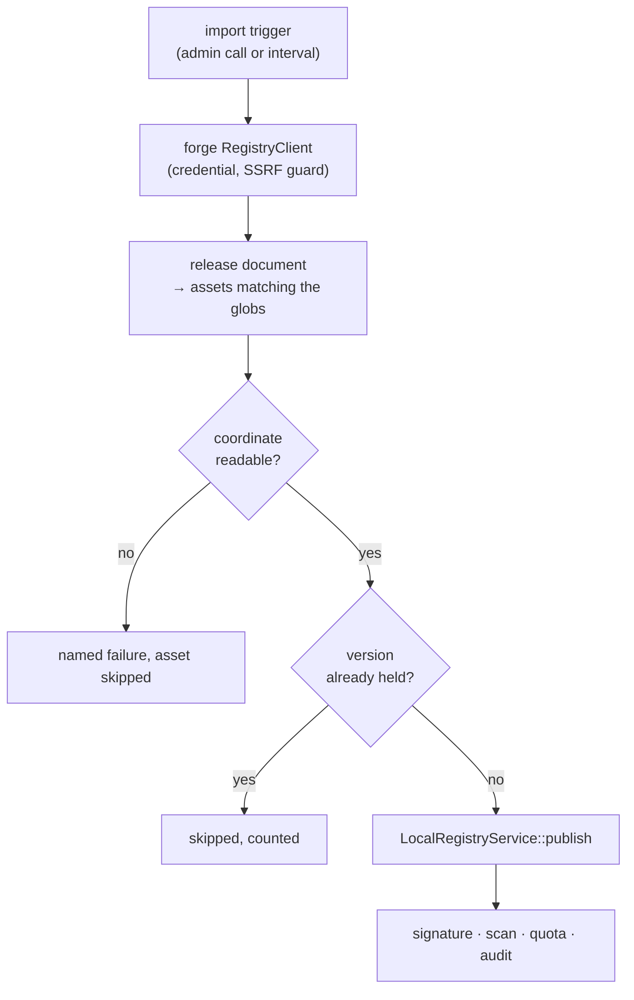

# RFC 0021 — Importing a forge release into the registry that serves it

| Field       | Value                                                        |
| ----------- | ------------------------------------------------------------ |
| Status      | Implemented                                                   |
| Short       | releases into registries                                      |
| Settles     | How an artifact published as a forge release asset reaches the protocol registry its clients read |
| Author      | Max Batleforc <maxleriche.60@gmail.com>                       |
| Co-author   | —                                                             |
| Created     | 2026-09-07                                                    |
| Supersedes  | —                                                             |
| Touches     | `crates/core`, `crates/adapters`, `crates/config`, `crates/web`, `server`, docs |

---

## 1. Summary

A team's own artifact is usually built by CI and attached to a forge release:
that is where `batlehub-vsx`'s `.vsix` lives, and where an internal jar, wheel or
gem lives in most estates that have one. [RFC 0019](/rfc/0019-git-forge-registries-refs-releases-raw)
made that asset reachable through a `github`, `gitlab` or `forgejo` registry, so
it can be downloaded, cached, audited and scanned. It cannot be *installed*: an
editor's Extensions view reads the gallery, `pip` reads the simple index, and
those are served by a registry of the ecosystem's own kind, which knows nothing
about the release.

The bridge today is a person. Download the asset, then publish it:

### Before / after

```text
# today — two commands and a human between them
curl -fL -H "Authorization: Bearer $TOKEN" \
  "$HUB/proxy/gh/batleforc/batlehub-vsx/releases/download/v1.0.0/batlehub-vsx-1.0.0.vsix" \
  -o batlehub-vsx-1.0.0.vsix
batlehub publish batlehub-vsx-1.0.0.vsix -r vsx-local

# with this RFC — the instance does it, and keeps doing it
[[registries.release_imports]]
into   = "vsx-local"                 # a local/hybrid registry of any kind
from   = "gh"                        # a configured forge registry — never a bare URL
repo   = "batleforc/batlehub-vsx"
assets = ["*.vsix"]

[registries.release_imports.as]      # who the publish is, and answers as
user_id = "svc-release-import"
groups  = ["config:extension-publishers"]
```

```bash
batlehub admin import vsx-local            # now
batlehub admin import vsx-local --tag v1.0.0
```

Every import is a **publish**, not a cache write: the version exists, carries the
metadata its gallery renders, is signed by the registry ([RFC 0020](/rfc/0020-signing-at-the-vscode-marketplace-registry)),
is scanned like any other published version ([RFC 0018](/rfc/0018-supply-chain-quarantine-and-verdicts)),
and is subject to the same grants, quota and audit.

---

## 2. Motivation

1. **An instance cannot host the extension this project ships.** RFC 0011 §11 q6
   built `batlehub-vsx` in its own repository, and [what is left](/rfc/plan)
   records the tail: *a release of that repository, and deciding whether this
   instance hosts it*. Hosting it today means a human with the release page open
   and a shell, once per version, forever.
2. **Warming cannot reach it, and this is structural.** `WarmingService` pulls
   through the *target* registry's own `RegistryClient`
   (`crates/core/src/services/warming/`), so an `openvsx` registry warms from
   whatever `upstream_url` names. `POST /api/v1/admin/registries/{r}/warm` takes
   package names or paths, and there is no source parameter to give it. Nothing
   about the warming path can be pointed at a release.
3. **The proxied asset is invisible to the client that wants it.** A `.vsix` at
   `/proxy/gh/{owner}/{repo}/releases/download/{tag}/{file}` is a download.
   `vsx/source.rs` renders gallery entries from the local registry in
   local/hybrid mode and from upstream metadata otherwise; a forge registry is
   neither, so the editor never learns the extension exists.
4. **The manual path silently skips what publishing is for.** A person who
   `curl`s the asset and `PUT`s it gets the right result today only because they
   remembered the coordinate, the namespace and, since RFC 0020, that an
   unsigned entry greys out Install in a current VS Code. Each of those is a
   step that can be forgotten once and stay wrong for a release cycle.

---

## 3. Goals / non-goals

**Goals**

- An artifact attached to a forge release appears in the registry whose protocol
  its clients speak, without a human in the loop.
- The import is indistinguishable, afterwards, from a publish: same metadata,
  same signature, same gates, same audit trail.
- The source is an existing configured forge registry, so the fetch inherits its
  credential, its SSRF guard and its egress policy.
- One import is idempotent and safe to schedule: a version already held is
  skipped, not republished.

**Non-goals**

- **Mirroring a forge.** This imports named assets of named repositories, not
  everything a forge holds.
- **Building from source.** The release asset is the input; if CI did not attach
  one, there is nothing to import.
- **Publishing *to* a forge.** The direction is one-way.
- **A bare-URL source.** Every fetch goes through a configured registry, which is
  what makes the credential handling and the SSRF guard someone else's solved
  problem rather than this feature's new one.
- **Webhook-driven import** in the first cut. A forge push notification needs a
  secret, an endpoint and a replay story per forge; polling and an explicit call
  cover the same ground while that is designed (§11 q4).

---

## 4. User-facing design

### 4.1 Configuration

```toml
[[registries.release_imports]]
into     = "vsx-local"              # target: a local or hybrid registry
from     = "gh"                     # source: a configured github/gitlab/forgejo registry
repo     = "batleforc/batlehub-vsx"
assets   = ["*.vsix"]               # globs; an asset matching none is ignored
releases = "latest"                 # "latest" | "all" | a tag; never a draft (§4.2)
interval = "1h"                     # absent = no polling, import only when asked

# Who the import publishes as. Required; §4.3 says why it is a principal
# declared here rather than a credential borrowed from somewhere else.
[registries.release_imports.as]
user_id = "svc-release-import"      # what grants name: `user:svc-release-import`
groups  = ["config:extension-publishers"]   # what namespace membership reads
```

The `config:` prefix on a group is reserved and required (§11 q3): it is what
keeps a principal declared in this file from being mistaken for a group an
identity provider minted.

- **Absent is off.** No block, no import, and no behaviour change for any
  existing deployment.
- `assets` **empty** is not "everything": it is a configuration error (§4.4). The
  distinction matters because a release routinely carries checksums, signatures
  and source tarballs beside the artifact.
- `as` has **no `role` field**, and that is the point (§4.3): the principal is a
  user, never an admin.

### 4.2 Behaviour rules

- **The coordinate comes from the artifact, not the config.** A VSIX names its
  own `publisher.name` and version in `extension/package.json`, which is exactly
  what `POST /api/-/publish` already reads (`archive::parse_manifest`). Where the
  ecosystem has no in-band manifest, the filename convention the CLI already
  implements (`cli/src/api/publish.rs::detect_meta`) decides. An asset whose
  coordinate cannot be read is skipped with a named failure, never guessed at.
- **A version already held is skipped.** The report counts it, the way
  `WarmingReport` counts a skip today. Re-importing is therefore free, which is
  what makes an interval safe.
- **A draft is never imported, and a pre-release only when asked.** `latest`
  means the newest release that is neither, which is what a release page shows
  by default; a pre-release is reachable by tag or under `all`. A draft is
  reachable by neither: it is not published, and importing one would serve bytes
  the producing team has not released.
- **A release that carries its own signature archive is believed.** RFC 0020
  §13.6 already distinguishes *signing what we host* from *relaying what someone
  else signed*, and the machinery is built: a provided archive is stored under
  its own `.sigzip.upstream` key, served as-is, and the `PublicKey` asset is
  refused for that version because the key is its signer's. An import attaches
  what the release carries and signs only what arrives unsigned.
- **Failures are per asset and named.** One unreadable manifest does not fail the
  release, in the same shape `WarmFailure` already gives an operator the *which*
  and not only the count.

### 4.3 Who the import runs as

A publish has a publisher. Every gate the target registry applies reads it —
`authorize_write` resolves the grants, `check_namespace_membership` compares the
identity's groups against the namespace's owning group, `QuotaService` charges
`user_id`, and `record_lifecycle_action` writes it into the audit trail. An
import is a publish (§5.1), so it needs an answer to *who*, and the answer has to
be one those four already understand.

**It is a principal, not a credential.** The `as` block declares an identity the
server constructs directly: a user id, and the groups it is a member of. No token
is minted, stored or sent, because the server is not authenticating to itself —
it is deciding what one of its own actions is allowed to do. There is therefore
nothing to leak and nothing to rotate, and the revocation story is `git revert`
on the config.

**It is never an admin.** `check_namespace_membership` returns `Ok` immediately
for an admin, and the rest of the grant chain has comparable shortcuts, so an
admin import could publish into *any* namespace on the target — including one a
team owns and did not offer. `as` therefore takes no role and the constructed
identity is `Role::User`; an operator who wants an import to reach a namespace
adds the principal to its group, which is the same sentence they would write for
a person. This is also why the import does **not** reuse `Identity::system()`,
which the sweeps use: `system` is an admin by construction, and it says *the
schedule did this*, which is the wrong subject for a publish that lands in
someone's namespace.

**Its groups say where they came from.** `Identity.groups` are
provider-namespaced strings, and a grant can match them by named provider, by
`*` for any provider, or as an unprefixed bare string. A principal whose groups
were written bare would be indistinguishable from a group an identity provider
minted, so a config file could name `eng` and collect whatever `eng` holds.
`as.groups` therefore carries the reserved `config:` prefix and validation
accepts no other, which makes a grant for this principal say out loud that its
group came from the config file. One consequence, written down rather than
discovered later: a grant spelled `group:*:eng` means *any provider's* `eng`,
and that includes `config:eng`.

**It is visible everywhere a person would be.** The audit row names
`svc-release-import`, not `system`; the package page shows it as the publisher;
`quota` counts against it, which gives an operator a bound on how much one import
can bring in per window without this RFC inventing a size limit of its own. And
because the principal is an ordinary user-shaped identity, it can be interrogated
**before** the first import ever runs:

```bash
batlehub authz explain vsx-local \
  --subject user:svc-release-import \
  --action releases:publish \
  --package batlehub.batlehub-vsx     # namespace tiers only match with a package
```

What it must hold, then, is exactly what a person publishing that artifact by
hand would need:

| Requirement | Read by | Failure |
| --- | --- | --- |
| `releases:publish` on `into` | `authorize_write` | The import fails, named, per asset |
| Membership of the namespace owning the coordinate | `check_namespace_membership` | Denied with the owning group named |
| Quota headroom on `into` | `QuotaService` | Denied; the report says which asset and how much |

### 4.4 Validation

`AppConfig::validate()` rejects:

| Condition | Rationale |
| --- | --- |
| `into` names a registry in `proxy` mode | A publish into it is a `404` at request time; failing at load is the same answer, a day earlier |
| `from` names a registry that is not a forge kind | Nothing else serves releases; the error names the three kinds that do |
| `assets` empty or absent | "Every asset" is never what an operator means, and a release's checksums would be published as packages |
| `releases` neither `latest`, `all`, nor a tag | Silent misreading of a tag as a keyword is unrecoverable at runtime |
| `interval` below the polling floor | A per-minute poll of a forge API burns the rate limit the whole estate shares |
| `as` absent, or `as.user_id` empty | A publish with no publisher is a row the audit cannot answer for, and a quota nothing is charged against |
| `as` carrying a `role`, or naming a user id an `[[auth.tokens]]` entry maps to `admin` | An admin skips `check_namespace_membership` outright (§4.3). Refusing at load is the difference between a config an operator can read and a bypass they cannot see |
| `as.user_id` equal to `system` | Reserved for the schedule's own identity, which is admin and means something else (§4.3) |
| An `as.groups` entry with no `config:` prefix, or with any other prefix | A config file that could mint an identity provider's group string would collect that group's grants (§4.3) |
| The combined poll rate of the imports sharing one `from` exceeding the floor | The forge's rate limit is spent by the source registry's credential, not by any one import (§11 q6) |

Warnings:

| Condition | Behaviour |
| --- | --- |
| `into` has no signing key and is a gallery kind | Imported extensions install nowhere with a current editor. The import runs; the warning names RFC 0020's config key |
| An asset matches no glob | Counted and named in the report, so a renamed release artifact is visible rather than silently absent |
| `as` holds no `releases:publish` on the target | Fails at the first import; warned at load, where an operator is looking, with the `authz explain` line that shows why |
| `as.groups` names a group no configured provider can produce | Not an error — a group may be minted by an OIDC provider this file never mentions — but a typo here is a namespace denial an hour later, so it is named at load |

---

## 5. Architecture

### 5.1 Where it hangs

The mechanism is the publish path, not the warming path. Warming writes artifact
bytes under the coordinate the proxy read path would have written; a gallery
entry needs the version to *exist*, with its index metadata, its visibility, its
quota accounting and its signature. Those are `LocalRegistryService::publish`'s
job, and reusing it is what makes an imported version indistinguishable from a
published one — including to RFC 0018's scanner and RFC 0002's flags.



The invariant a reviewer should check: **nothing writes storage directly.**
Every byte an import brings in enters through the same `publish` call the HTTP
publish routes use, so a gate added to publishing is a gate on importing, with no
second site to remember.

### 5.2 Reuse, and what it costs

| Step | Existing code |
| --- | --- |
| Read the release and its assets | RFC 0019's forge clients, already behind the SSRF guard |
| Read a VSIX coordinate | `handlers/proxy/vsx/archive.rs::parse_manifest` |
| Read a coordinate from a filename | `cli/src/api/publish.rs::detect_meta`, which moves to `core` |
| Create the version | `LocalRegistryService::publish` |
| Sign it | `handlers/proxy/vsx/signing.rs::sign_after_publish` |
| Report what happened | `WarmingReport` / `WarmFailure`, whose shape already fits |

`detect_meta` moving out of the CLI is the one real refactor: the rule "this
filename is this coordinate" is currently a client-side convenience, and this
makes it a server-side contract.

---

## 6. Detailed design

### 6.1 `crates/config`

- `ReleaseImportConfig` under `registries.release_imports`, validated as §4.4.
- `ImportPrincipalConfig` (`user_id`, `groups`) for the `as` block — a
  deliberately smaller shape than `Identity`, since `role` and `auth_provider`
  are not an operator's to choose here (§4.3).

### 6.2 `crates/core`

- `services/release_import/` — the service: resolve the release, match assets,
  map coordinates, skip what is held, publish the rest, return a report.
- `services/coordinate_from_filename.rs` — `detect_meta`'s rules, with the
  CLI calling the core function rather than its own copy.
- `ImportPrincipal::identity()` — the one place the configured principal becomes
  an `Identity`, pinned by a test to `Role::User`. One constructor, so "the
  import is never an admin" is a property of the type rather than a rule every
  call site re-applies.

### 6.3 `crates/adapters`

- `GhRelease`, `FjRelease` and `GlRelease` gain the fields the default depends
  on — `draft` and `prerelease`, and GitLab's `upcoming_release` — each
  `#[serde(default)]` and each checked against the live API rather than assumed
  (RFC 0019 §13's discipline for exactly these structs, and the reason a
  strictly-decoded release model has bitten this tree before).
- One accessor over the three, so "is this release importable" is asked once.

### 6.4 `crates/web`

- `POST /api/v1/admin/registries/{registry}/import`, guarded by `cache:warm`
  (§11 q2), answering the same report shape the warm endpoint answers.
- The scheduler that honours `interval`, beside the existing rescan scheduler.

### 6.5 `cli` and `ui`

- `batlehub admin import <registry> [--tag]`, and the report rendered the way
  `warm` renders its own.
- The registry's admin page grows the import block and its last run.

**Deliberately untouched**, so reviewers do not go looking:

- `WarmingService` — the name is close and the mechanism is not. Warming pulls
  through the target's own client, and this pulls through a different registry's;
  merging them would give one service two sources and two meanings.
- `bundle.rs` — an air-gap bundle is an export of what an instance holds, not an
  ingestion path for what it does not.

---

## 7. Security considerations

- **The fetch adds no egress surface.** The source is a configured forge
  registry, so the request goes out through that registry's client, credential,
  allowlist and SSRF guard. A bare URL would have added all four back as this
  feature's problem, which is why §3 rules it out.
- **The publish is authorised, not privileged.** The import runs as a configured
  principal and goes through `LocalRegistryService::publish`, so namespace
  membership, per-registry grants and quota all apply. An operator who cannot
  publish into a registry cannot import into it either.
- **The principal is not a credential, so there is nothing to steal.** The `as`
  block is a subject the server constructs for its own action, not a token it
  holds. A config file readable by an attacker discloses *what the import may
  do*, which the grants already say out loud, rather than a bearer secret that
  would let them do it from anywhere. This is the whole reason §8 rejects
  pointing `as` at an `[[auth.tokens]]` entry.
- **The admin shortcut is the one real trap, and it is closed at load.**
  `check_namespace_membership` returns `Ok` for an admin, so an import configured
  as one would publish into namespaces its operator never intended to touch, and
  nothing at request time would say so. §4.4 refuses the config instead.
- **The gates hold because there is one door.** RFC 0018's scan and RFC 0002's
  flags attach to published versions; since an import *is* a publish, an imported
  artifact is quarantined and flagged like any other. A design that wrote storage
  directly would have bypassed both silently.
- **The source is a supply chain, and the RFC does not pretend otherwise.** A
  forge release is mutable: a tag can be moved and an asset replaced. RFC 0019
  already decided what that costs (`MUTABLE_REF` warned, a moved tag and a
  replaced asset denied), and an import inherits it rather than restating it.
  What an import adds is that the artifact now carries this registry's signature,
  which says *this instance served it*, not *this instance vouches for its
  author* — §11 q5 is where that line gets written down.

---

## 8. Alternatives considered

| Alternative | Why rejected |
| --- | --- |
| Teach `WarmingService` a source registry | Gives one service two sources and two meanings, and it still would not create a gallery entry: warming writes bytes, and an entry needs a version |
| A CI step in each producing repository that publishes to the instance | Works today, and is the recommendation until this lands. It puts a publish token in every producing repository and leaves each of them to remember the signature and the namespace |
| A forge webhook per repository | The right end state, and a bigger one: a secret, an endpoint and a replay story per forge kind. §11 q4 keeps it as a follow-on to a working polled import |
| Run the import as `Identity::system()`, like the sweeps | It is `Role::Admin` by construction, so it skips namespace membership entirely; and `user_id = "system"` says *the schedule did this*, which is a true sentence about a retention pass and a misleading one about a version that now sits in a team's namespace |
| Point `as` at an `[[auth.tokens]]` entry | Puts a real bearer credential behind the import's authority, so anyone who reads the config can *be* the import from anywhere. The server never needs to authenticate to itself, so the credential is pure downside |
| Make the import RFC 0015's first `token:` principal | The right vocabulary — §4.3 of that RFC defines `token:<name>` as a machine credential with no user behind it — and today `SubjectMatcher::Token` matches nobody, `Subject` has one variant, and every rule in the chain takes an `&Identity`. Doing it here turns a feature into an authorization change (§11 q7) |
| An `openvsx` registry whose upstream is a forge | Would need a whole gallery protocol synthesised over a release listing, which is [RFC 0008-bis](/rfc/0008-bis-listings-across-the-gap)'s machinery pointed at a source it was not built for |

---

## 9. Rollout and compatibility

- **Default behaviour**: no `release_imports` block, nothing changes.
- **Config migration**: none; the block is additive and `CURRENT_CONFIG_VERSION`
  does not move.
- **Operator prerequisites**: a local or hybrid target registry, a forge registry
  with a credential that can read the release, an identity with publish rights on
  the target, and — for a gallery kind — a signing key.
- **Rollback**: remove the block. Versions already imported stay, because they
  are published versions; deleting them is the existing yank/delete path.

---

## 10. Test plan

- **Unit** (`crates/core/src/services/release_import/`): asset glob matching;
  coordinate from a VSIX manifest and from a filename; an unreadable asset is a
  named failure and not a stopped run; a held version is skipped.
- **Integration** (`crates/web/tests/release_import.rs`): a forge fixture serving
  a release document and an asset, a local `openvsx` registry as the target, and
  the assertion that matters — after the import, the **gallery** lists the
  extension and its `.vsix` downloads. Plus: a proxy-mode target is refused at
  load; a principal without `releases:publish` is refused at import; a principal
  outside the owning group is denied by namespace membership with the group
  named; the audit row and the package page both name the principal, not
  `system`; and the constructed identity is `Role::User` — the test that would
  fail if a future edit let an admin through and silently skipped the namespace
  check.
- **Existing suites** unchanged: `crates/web/tests/local_openvsx_registry.rs` and
  the forge suites, which prove the two halves this joins were not disturbed.
- **Real client** (the project's standing rule, and the one that has paid for
  itself): `tests/heavy/release_import.sh` — a real release, imported, then a
  real VS Code Extensions view installing the extension from it. Ports 8126/8134,
  the next free pair.

---

## 11. Decisions and open questions

### Resolved

| # | Question | Decision |
| --- | --- | --- |
| 1 | Who does an import publish as? | **A principal declared in the block, user-shaped, never admin** (§4.3). Every gate on the publish path already reads an identity; giving it one an operator wrote down is smaller than teaching four gates about a fifth kind of caller — and the alternatives are worse in a way §8 can state rather than assert. |
| 2 | `cache:warm` on the endpoint, or a publish verb? | **Both, and they are different questions.** `cache:warm` to *ask* for an import, the configured principal's own `releases:publish` to *do* it. So an operator may trigger an import they could not themselves publish, and if the principal cannot publish it fails as a publish — in the audit log, under the subject that was configured for it, not under the operator who pressed the button. |
| 3 | How is a principal's group spelled, and can it collide with a real one? | **A reserved `config:` provider prefix, and nothing else is accepted.** `Identity.groups` are provider-namespaced strings, and `SubjectMatcher::Group` matches them three ways (§4.3 of RFC 0015): a named provider, `*` for any provider, and `group::name` for a string carrying none. A principal whose groups were written bare would be indistinguishable from a group an identity provider minted — a config file could then mint `eng` and be granted whatever `eng` holds. Prefixing them `config:` makes a grant for this principal spell out where the group came from. **One consequence to write down rather than discover:** a grant of the form `group:*:eng` means *any provider's* `eng` and therefore matches `config:eng` too, so an estate that uses the wildcard form is choosing not to distinguish them. |
| 4 | Does the import create the namespace it needs, or refuse? | **Refuse — and the premise was wrong, which is the more useful half.** This proxy does not require a claim to exist: `check_namespace_membership` looks for the longest claim covering the coordinate and returns `Ok` when there is none, so a first import of a brand-new extension publishes with no namespace anywhere. What it needs is `releases:publish` reaching the coordinate. Where a claim *does* exist, the principal must be in its group, and the import will not create or join one: a config block that could claim a namespace is ownership by accident. (Extension ids are dotted, and `namespace_separator` already knows it — a claim on `batlehub` covers `batlehub.batlehub-vsx`.) |
| 5 | Which release, by default? | **`latest` is the newest release that is neither a draft nor a pre-release; a draft is never imported, even under `all`.** A draft is not published — importing one would serve bytes the producing team has not released. A pre-release is published and deliberately not the default, which is the same reading a release page gives. **This costs three models a field:** neither `GhRelease`, `FjRelease` nor `GlRelease` carries `prerelease`/`draft` today, and GitLab spells its own version of the idea `upcoming_release`, so each has to be extended and checked against the live API rather than assumed — the discipline RFC 0019 §13 already applies to these structs. |
| 6 | Is the polling floor per import, or per source registry? | **Per source registry.** RFC 0014 §4.4 set the five-minute floor under `[upstream_audit].interval_secs` because *"below five minutes a sweep is an unintentional denial of service against a third party's registry, from a config typo"* — the party being protected is the forge, and a forge's rate limit is spent by the credential, which belongs to the source registry rather than to any one import. So the floor is checked against the *combined* rate of every import sharing a `from`, and ten imports on a ten-minute interval are treated as one poll a minute. |
| 7 | What does this registry's signature mean on an imported artifact? | **Nothing new: the precedence RFC 0020 already built is the answer.** A provided archive is stored under its own key (`.sigzip.upstream`), served as-is rather than re-signed, and the `PublicKey` asset is *refused* for such a version because *"its key is its signer's"*. An import therefore attaches the release's own signature when it carries one and signs only what arrives unsigned, and the distinction is already load-bearing in the asset route rather than a new concept this RFC introduces. |
| 8 | Does the coordinate rule move into `core` for every ecosystem at once? | **Only the rules that are unambiguous from the artifact.** `detect_meta` covers ten formats today, and two of the kinds this RFC could otherwise target are not derivable at all: a Maven coordinate needs a `groupId` no filename carries, and a Composer zip shares its extension with everything else, which is why the CLI makes `--type` mandatory for it. Those move nowhere; an import of a kind whose coordinate cannot be read refuses, which is the rule §4.2 already states for an unreadable manifest. |
| 9 | Should the principal be a group rather than a user? | **No — `as.user_id` stays required.** Quota is keyed on `user_id` and so is the audit row, so a principal with only groups would be a publish nothing is charged for and nobody is named in. Group membership is still how it reaches a namespace; that is `as.groups`, and it is not an alternative to having a subject. |
| 10 | Is this RFC 0015's first `token:` principal? | **Not now, and the config does not depend on the answer.** §4.3 of that RFC defines `token:<name>` as a machine credential with no user behind it, which is what this is — but `SubjectMatcher::Token` answers `false` for every identity, `Subject` has one variant, and `admin_authz_explain` refuses a `token:` subject outright rather than invent a caller. Promoting it here would land an authorization change inside a feature, and would break the one operator affordance §4.3 leans on: `authz explain` cannot answer about a subject form it refuses. Revisit when a **second** machine caller exists, since one is not a pattern; `as` names a subject either way. |

### Still open

1. **Where does a reader see *which* signature a version carries?** The
   mechanism is decided (q7) and the two are already distinguishable in
   storage and in the asset route, but nothing on the package page says
   whether a version is signed by this registry or by whoever built it —
   and for an imported artifact that is the more interesting of the two
   facts. It is a surface question about RFC 0020's own display rather than
   about importing, so it wants deciding *there*: this RFC records that an
   import makes it worth asking, and would consume whatever answer that page
   gives.

---

## 12. Implementation phases

| Phase | Content | State |
| --- | --- | --- |
| 1 | The service and the admin endpoint, one repository, one asset glob, `openvsx` targets only, coordinate from the VSIX manifest, and the principal (§4.3) — which is phase 1 content and not a later hardening, since there is no publish without a publisher. Useful alone: it is the whole of the `batlehub-vsx` hosting question | **Landed** (§13.1) |
| 2 | The config block, its validation including the admin refusal, and the polled interval | **Landed** (§13.2) |
| 3 | The other ecosystems, on `detect_meta`'s rules moved into `core` | **Landed** (§13.3) |
| 4 | Signature passthrough when the release carries one (§11 q7's decision) | Not started — the registry's own signature runs today (§13.1) |
| 5 | The CLI command and the console block | Not started; the docs page landed with phase 2 |
| 6 | `tests/heavy/release_import.sh` — a real release into a real editor | Not started |

---

## 13. What landing it changed

### 13.1 The port the design did not have

§5.2 said the release listing came from "RFC 0019's forge clients", which was
true and not a mechanism. Reading them showed why: the three answer in three
shapes — GitHub lists `assets[]` addressed `filename/<name>`, GitLab lists
`assets.links[]` addressed `link/<name>`, and a caller parsing `extra` would be
three forge-specific parsers wearing a trench coat.

So the normalisation is a port, `ForgeReleaseSource`, reached exactly the way
RFC 0019's own `ForgeRegistry` is: `RegistryClient::releases()` answers `Some`
for the three forge kinds and `None` for everything else. The import service
never learns which forge replied, and the asset bytes still travel through
`RegistryClient::fetch_artifact` — so the fetch keeps the source registry's
credential, allowlist and SSRF guard, which is what §7 promised and what a
second HTTP client would have quietly broken.

Two things the design named as costs were real. The three release models gained
`draft` and `prerelease` (GitLab: `upcoming_release`, and it has no drafts at
all), each `#[serde(default)]` — a strictly-decoded release model has broken a
real client in this tree before. And the signature: rather than move the
gallery's storage layout into `core`, an import runs the *same*
`sign_after_publish` the `PUT …/vsix` route runs, through a `PostPublish` hook.
An imported entry is signed by the same call that signs an uploaded one, which
is the claim §5.1 makes, held by construction.

### 13.2 What the config surface actually is

§4.1 wrote `[[registries.release_imports]]` with an `into` field, which is two
different configurations: in TOML that path appends to the *last* `[[registries]]`
block, and then `into` names a registry that is already implied. It is now
top-level `[[release_imports]]`, the way `[[flag_sources]]` is, because an
import is a relationship between two registries and hanging it off either one
hides the other. `interval = "1h"` became `interval_secs`, matching every other
interval in the file.

Everything §4.4 promised is enforced at load, and the two that matter most are
the two that would not have failed at run time — they would have *succeeded*, at
something wider than the operator asked for: an import whose `as.user_id` is
also an admin token (an admin skips `check_namespace_membership` outright), and
a group written without the reserved `config:` prefix (indistinguishable from
one an identity provider minted). `ImportPrincipal::new` re-checks both, so the
rule is a property of the type and not of the config path.

### 13.3 The filename rules were already written, in the wrong crate

§11 q8 decided that only the coordinates a file name actually determines move
into `core`. Doing it found that the rules already existed and had been
exercised for a year — by `batlehub publish`, which has always worked out what
it was uploading from `some.nupkg`. They are now
`services::release_import::coordinate_from_filename`, and `cli/src/api/publish.rs`
delegates to them: two implementations of "this file name is that coordinate"
would drift, and the copy an import used would be the one no package manager
had ever tested.

`FilenameCoordinates` checks the kind rather than assuming it, which is not
ceremony: an `npm` registry importing a `.whl` because a glob was too wide
would publish a Python wheel as a tarball, and the failure would surface at
`npm install`. Maven and Composer are still refused — a `groupId` is in no file
name, and a Composer zip shares its extension with everything else, which is why
the CLI makes `--type` mandatory for it.

### 13.4 What is proven, and what is not

Fifteen unit tests in `crates/core/src/services/release_import/tests.rs` (the
principal is never an admin; `latest` skips a pre-release and never sees a
draft; a draft is refused even by tag; a held version is skipped without
downloading when the coordinate is in the asset name; an asset no glob names is
never fetched), seven config tests, three adapter tests over the forges' own
JSON, and four integration tests in `crates/web/tests/release_import.rs` — the
last of which is the one that matters: after the import, the **gallery** answers
about the extension and its `.vsix` downloads through the route a client uses.

Not proven the way this project means it: no real client has been through it.
Phase 6 is a real release imported into a real Extensions view, and until that
runs this is a feature whose tests pass.
