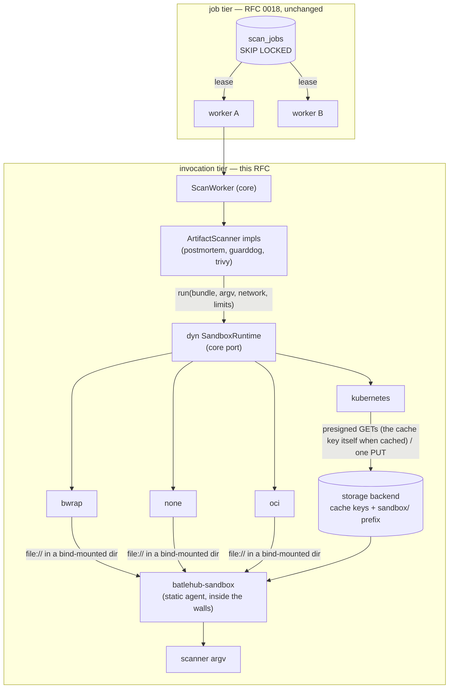

# RFC 0022 — Sandbox runtimes for the scan worker

| Field       | Value                                                        |
| ----------- | ------------------------------------------------------------ |
| Status      | Draft                                                         |
| Short       | Sandbox runtimes                                              |
| Settles     | Where a scanner's process runs — bwrap, an OCI container, a Kubernetes pod — behind one port, and what every runtime must prove |
| Author      | Max Batleforc <maxleriche.60@gmail.com>                       |
| Co-author   | —                                                             |
| Created     | 2026-09-09                                                    |
| Supersedes  | —                                                             |
| Depends on  | RFC 0018 (the worker role, the scanner port, `[worker.sandbox]`) |
| Touches     | `crates/core`, `crates/adapters`, `crates/config`, `crates/sandbox` (new), `server`, `helm`, docs |

---

## 1. Summary

RFC 0018 made the scan worker the one process that opens attacker-controlled
archives while holding database and storage credentials, and put every binary
scanner (`postmortem`, `guarddog`, `trivy`) behind `bwrap`. That sandbox is
hard-wired: `Sandbox.runtime` is a string, `subprocess::run` branches on it,
and the only alternative to `bwrap` is `none` — the bare command, refused
outside tests unless `BATLEHUB_UNSAFE_NO_SANDBOX=1` is set. Where the host
forbids unprivileged user namespaces (Ubuntu 24.04's AppArmor default, most
hardened Kubernetes nodes, every rootless container without
`--userns`), `bwrap` starts, prints nothing, and the worker reads the empty
output as a scanner error: the deployment is either unsandboxed or not
scanning.

This RFC turns "where a scanner runs" into a **port**. `crates/core` gains
`SandboxRuntime` — run one command over a *bundle* (the files the scanner
needs, described as data, never as a host path) and get its output back —
and `crates/adapters` gains one adapter per runtime: `none` and `bwrap`
(today's behaviour, unchanged for every existing deployment), `oci` (a fresh
Podman/Docker container per run) and `kubernetes` (a fresh pod per run, in
the worker's namespace or a dedicated one, optionally under a gVisor/Kata
runtime class *per scan*). The scanners stop knowing what a sandbox is: they
describe a bundle and an argv, and read stdout.

Inside every runtime the same thing executes: **`batlehub-sandbox`**, a
separate, statically linked agent that reads no config, no environment and no
stdin — it takes two URLs, fetches its bundle from the first, extracts the
archive *inside* the walls, runs the argv without a shell under the rlimits
and a seccomp filter of its own, and uploads the result to the second. On
`kubernetes` and (optionally) `oci` those URLs are **presigned, single-key,
short-lived URLs on the storage backend**, so the sandbox has no channel to
the worker at all: the only thing inside the wall is one GET and one PUT on
one prefix the proxy never reads. Every runtime must pass a **probe at
startup** that asserts, from inside, that the walls it claims are real; a
worker whose sandbox does not hold refuses to start rather than scanning
unsandboxed or silently holding every version. The agent installs a seccomp
filter on every runtime, and on `bwrap` it runs on a per-scanner root rather
than the worker's, so the room an escaped scanner lands in is the same
empty one everywhere. An `nsjail` sibling of `bwrap` is the one runtime left
proposed but not designed; a `remote` daemon and `systemd-run` are rejected
in §8.

### Before / after

```toml
# today — one switch, two positions, one of them unsafe
[worker.sandbox]
runtime         = "bwrap"        # or "none" + BATLEHUB_UNSAFE_NO_SANDBOX=1
memory_limit_mb = 2048
cpu_seconds     = 300

# with this RFC — the same keys keep the same meaning; the runtime is a choice
[worker.sandbox]
runtime         = "kubernetes"
memory_limit_mb = 2048           # → the pod's memory limit (and RLIMIT_AS inside)
cpu_seconds     = 300            # → RLIMIT_CPU inside; the scanner timeout bounds wall time

[worker.sandbox.kubernetes]
namespace       = "batlehub-sandbox"     # default: the worker's own
runtime_class   = "gvisor"               # optional: kernel isolation per scan
image           = "ghcr.io/batleforc/batlehub-sandbox-postmortem@sha256:…"

[scanners.guarddog]
command = "guarddog"
image   = "ghcr.io/batleforc/batlehub-sandbox-guarddog@sha256:…"  # per-scanner image, image runtimes only
```

```text
$ batlehub --roles worker --config config.toml
INFO sandbox: probing runtime "kubernetes" (namespace batlehub-sandbox, runtime class gvisor, bundles on s3://cache/sandbox/)
INFO sandbox: probe passed in 2.1s — no network but the storage endpoint, read-only root, empty environment, uid 65532, no service-account token, agent 1.3.0
INFO security worker: ready (4 slots, runtime kubernetes)

# and on a node where bwrap cannot do what it says
$ batlehub --roles worker --config config.toml
ERROR sandbox: probe failed for runtime "bwrap": the sandboxed process could still reach 10.0.0.1:53 with network = false
ERROR sandbox: refusing to start — a worker without its sandbox scans nothing, it does not scan unsandboxed
       (kernel.apparmor_restrict_unprivileged_userns=1 on this host; see docs/operations/scan-worker.md#runtimes)
```

---

## 2. Motivation

- **The sandbox is a string switch, not a seam.** `Sandbox { runtime: String
  }` in `crates/adapters/src/scanners/subprocess.rs` is read in exactly one
  place, `run()`, which does `if runtime == "none" { bare } else { bwrap }`.
  The three binary scanners each hold a copy of that struct and call `run`
  directly. Adding a third mechanism today means a third branch in the one
  function, a third set of fields on the struct, and the scanners still
  knowing nothing about it. The rest of the tree does not work this way:
  storage is `dyn StorageBackend`, the cache `dyn CacheStore`, the queue `dyn
  ScanQueue`. Isolation is the one infrastructure choice without a port.
- **`bwrap` has a hard host requirement, and the fallback is the absence of
  a sandbox.** Bubblewrap needs unprivileged user namespaces. Ubuntu 24.04
  restricts them under AppArmor by default; the GitHub `ubuntu-latest` runner
  broke the heavy suite this way on PR #146 (`bwrap --version` succeeds, every
  invocation exits with empty stdout, the worker holds `SCAN_PENDING`, and
  `batlehub wait` times out five minutes later). Kubernetes nodes hardened by
  a PSS `restricted` profile, a `seccomp` default that denies `unshare`, or
  a distribution kernel with `kernel.unprivileged_userns_clone=0` do the same.
  The Helm chart's documented answer (`helm/batlehub/values.yaml`, the
  `worker.securityContext` comment) is to grant `CAP_SYS_ADMIN` or to set
  `runtime = "none"` under a gVisor runtime class with the unsafe env var —
  which drops the per-scanner wall and puts the *worker*, credentials and all,
  inside the only sandbox left.
- **The strongest configuration is not reachable.** RFC 0018 §7 calls a
  sandboxed runtime class "the opt-in fourth wall", around the whole worker
  pod. What an operator actually wants is that wall around *each scan*, with
  the worker outside it: a gVisor pod per invocation is exactly that, and it
  needs the worker to be able to create pods, not to be one.
- **What a scanner can reach if it escapes is too much.** Today an escape
  from the scanner process lands in a `bwrap` namespace on the worker's
  host, next to the worker's cgroup, with the worker's binary — `batlehub`,
  every adapter, every client, the config parser — on the read-only root.
  Nothing there is *reachable* (empty environment, no credentials), but all
  of it is *present*, and presence is surface. The thing inside the wall
  should be the smallest program that can do the job, and it should hold
  nothing that outlives the job.
- **Blast radius today is the worker's own cgroup.** `RLIMIT_AS` and
  `RLIMIT_CPU` are per process; a decompression bomb that stays under
  `RLIMIT_AS` but pushes the pod over its memory limit takes the worker down
  with it, and the job returns to the queue for a second try at the same
  archive. A container or pod per run gives every scan its own limit and
  its own OOM, and the worker only sees a `Crashed`.
- **Extraction happens outside the sandbox.** `ExtractPolicy` is thorough
  (RFC 0018 §6.3), but it runs in the worker process: the decompressor, the
  tar reader and the path checks are the part of the pipeline that reads the
  most hostile bytes with the most privilege. The agent this RFC introduces
  moves extraction inside the walls on every runtime, including `bwrap`.
- **A sandbox that does not hold fails silently.** Nothing at startup checks
  that `bwrap` can do what its argv says. The AppArmor case above was
  diagnosed from a five-minute timeout and an `EOF` in a log line about JSON.
  A runtime that must *prove* its walls before the worker takes a job turns
  that into a refusal to start, with the reason on the first line.

---

## 3. Goals / non-goals

**Goals**

- One port, `SandboxRuntime`, in `crates/core`; the worker and the scanners
  depend on it and on nothing more specific. Adding a runtime is one adapter
  file and one `match` arm in `server/src/builders.rs`.
- Four runtimes at the end of §12: `none`, `bwrap`, `oci`, `kubernetes`. The
  first two behave exactly as today for every existing config.
- The scanner's inputs cross the port as **data** (a bundle), never as a
  host path, so a runtime that shares no filesystem with the worker is not a
  special case.
- **The agent is a separate static binary with no configuration surface**:
  two URLs on its argv, nothing from the environment, nothing on stdin, no
  file it reads that it did not just fetch. What an escaped scanner finds
  next to it is that binary and the bundle it already had.
- **No live channel from the sandbox to the worker.** The sandbox fetches
  its input from, and writes its output to, a storage endpoint — presigned,
  single-key, short-lived on the image runtimes; a bind-mounted directory on
  the local ones. The worker reads the result after the sandbox is gone.
- Extraction of the artifact happens inside the sandbox, on every runtime.
- A startup probe per runtime that asserts the walls from inside, and a
  worker that refuses to start when it fails. `batlehub_sandbox_ready` says
  which runtime holds.
- The same `[worker.sandbox]` limits mean the same thing on every runtime,
  mapped to what the runtime has (`rlimit`, cgroup, pod `resources`).
- Helm: `worker.sandbox.runtime = kubernetes` produces the Role, the
  RoleBinding, the sandbox pods' ServiceAccount and the NetworkPolicies, and
  nothing else changes.

**Non-goals**

- Distributing *jobs* differently. Which worker takes which job is settled
  by RFC 0018's PostgreSQL queue and the worker Deployment's replica count;
  this RFC is about where one scanner's process runs once a worker holds the
  job. §8 records why a pod-per-*job* executor is the wrong tier.
- Sandboxing the network scanners (`osv`, `socket`, `mlab`, `sigstore`,
  `trivy` in server mode). They run no artifact-derived code and make HTTP
  calls from the worker; that stays.
- Hiding the cold start of a pod per run. A warm pool is rejected in §8: a
  scan that takes a few seconds longer is acceptable, a sandbox that existed
  before its job is not.
- Designing the `nsjail` runtime. §5.4 says what it would be and what it
  would need; it is a bis of this RFC when a deployment asks. `remote` and
  `systemd-run` are not deferred, they are rejected (§8).
- Any change to what the scanners find, to verdicts, or to the client-facing
  surface. A `batlehub why` output is byte-identical before and after.

---

## 4. User-facing design

### 4.1 Configuration

```toml
[worker.sandbox]
# Which runtime runs a bundle. "bwrap" is the default and today's
# behaviour; "none" keeps its refusal outside tests.
runtime         = "bwrap"          # none | bwrap | oci | kubernetes
# The limits, unchanged in name and meaning. Each runtime maps them to
# what it has — the table in §4.2 says how.
memory_limit_mb = 2048
cpu_seconds     = 300
max_extracted_mb = 512             # applied by the agent, inside the sandbox
max_entries      = 50000
# How long the runtime may take to get the agent running (image pull, pod
# scheduling, the bundle fetch) before the run is a ScannerError::Timeout.
# Added to the scanner's own timeout for the sandbox's deadline.
start_timeout_secs = 120
# Where the image runtimes put what a run needs that is not already in the
# cache — the per-run manifest, an uncached artifact, the result — and for
# how long a presigned URL is valid past the run's deadline. The proxy never
# reads this prefix (§7).
bundle_prefix   = "sandbox/"
bundle_ttl_secs = 60

[worker.sandbox.bwrap]
binary = "bwrap"                   # was `[worker.sandbox] bwrap`; the old key still reads

[worker.sandbox.oci]
engine  = "podman"                 # podman | docker
binary  = "podman"                 # the CLI; the runtime talks to it, never to a socket directly
image   = ""                       # default: the worker's own image (§4.2)
# How the bundle reaches the container: a bind mount of the per-run
# directory ("mount", the default — same host, no storage round-trip) or
# the storage backend's presigned URLs ("storage", the kubernetes way).
transport = "mount"
# Extra flags appended verbatim — for a `--runtime=runsc` or a `--cgroup-parent`.
extra_args = []

[worker.sandbox.kubernetes]
namespace       = ""               # default: the worker's own namespace
service_account = "batlehub-sandbox"
image           = ""               # default: the worker's own image
runtime_class   = ""               # e.g. "gvisor" — kernel isolation per scan
node_selector   = {}
image_pull_secrets = []
# Pods still around after this many seconds past their deadline are ours to
# delete, and so are their bundles: the orphan sweep (§4.2).
orphan_after_secs = 900

[scanners.postmortem]
command = "postmortem"
# On the image runtimes only: the image a run of this scanner is opened
# from. The recommended layout is one slim image per scanner (§5.3), and
# the chart ships them. Refused on `none` and `bwrap` (§4.3).
image   = ""
```

Nothing here is required. A config with today's `[worker.sandbox]` block —
or none at all — loads and behaves as it does today.

### 4.2 Behaviour rules

- **A run is one bundle, one argv, one sandbox instance.** A scanner asks
  the runtime to run a command over a bundle (§5.2) with a `network` flag
  and the limits, and gets the output back. The sandbox instance — the
  `bwrap` process tree, the container, the pod — exists for that run and no
  longer. Two runs never share a filesystem, on any runtime.
- **Network is a property of the run.** A scanner that needs both an
  offline and an online step — `postmortem` with `timeline = true` runs
  `scan` offline and `timeline` online — makes two runs. The `timeline`
  run carries an *empty* bundle: it queries the registry by name and never
  reads the artifact, so it never shares a filesystem with the process that
  did. This is stricter than today, where both run in the same directory.
  On the image runtimes with the storage transport, "no network" means *no
  network but the storage endpoint* (§5.2, §7).
- **The agent runs on every runtime, and it is not `batlehub`.**
  `batlehub-sandbox` is a separate binary from its own crate (§6.2): static,
  no config file, no environment read, no stdin, argv of exactly
  `--in <url> --out <url>`. It fetches the manifest, then each input the
  manifest names by URL, extracts archive entries under the manifest's
  `ExtractPolicy`, sets `RLIMIT_AS` and `RLIMIT_CPU`, installs the seccomp
  filter on the child (§7),
  clears the environment but for `HOME` and `PATH`, spawns the argv directly
  (no shell, as today), caps stdout at `STDOUT_CAP_BYTES`, keeps the tail of
  stderr, and uploads a result carrying the exit status. It exits 0 when it
  uploaded a result — a scanner that exited 1 is an answer — and non-zero
  only when it could not. On `none` the same crate runs as a library inside
  the worker process (§6.3); the behaviour is identical, the walls are
  absent.
- **The limits map per runtime.**

  | `[worker.sandbox]`   | `none` / `bwrap`      | `oci`                                       | `kubernetes`                                            |
  | -------------------- | --------------------- | ------------------------------------------- | ------------------------------------------------------- |
  | `memory_limit_mb`    | `RLIMIT_AS` (agent)   | `--memory` on the container, `RLIMIT_AS` inside | `resources.limits.memory`, `RLIMIT_AS` inside       |
  | `cpu_seconds`        | `RLIMIT_CPU` (agent)  | `RLIMIT_CPU` inside                          | `RLIMIT_CPU` inside                                     |
  | scanner `timeout`    | kill the process tree | `podman kill` then `rm`                      | `activeDeadlineSeconds = start_timeout + timeout`, then delete |
  | `start_timeout_secs` | n/a (start is a spawn)| the container must reach the bundle fetch    | the pod must reach `Running` and fetch its bundle       |
  | `max_extracted_mb`, `max_entries` | agent    | agent                                        | agent                                                   |

  A limit the runtime cannot raise is not an error — the agent's rlimits are
  best-effort where the sandbox's own cgroup already bounds the process, as
  today.
- **The default image is the worker's own; the recommended one is per
  scanner.** With no `image`, a run uses the image the worker was started
  from — read from the `BATLEHUB_IMAGE` env the Containerfiles set at build
  time — which carries the agent and every scanner. The chart's default
  values point each scanner at its slim image
  (`batlehub-sandbox-postmortem`, `-trivy`, `-guarddog`): the scanner, its
  runtime, `batlehub-sandbox`, and nothing else — no `batlehub`, no shell.
  Every image a run uses **must contain `batlehub-sandbox`** at its wire
  version; the probe (§4.3) catches one that does not.
- **A run that fails to start is a `ScannerError`, not a skipped scanner.**
  Under the default `scanner_error = "quarantine"` it holds the artifact, as
  any scanner failure does. The runtime never falls back to a weaker runtime
  on its own: a `kubernetes` run that cannot be scheduled does not become a
  `bwrap` one.
- **Orphans are ours to sweep — pods, containers and bundles.** A worker
  that dies mid-run leaves a container or a pod behind, and on the storage
  transport a manifest, possibly an uncached artifact, and possibly an
  `out`. Every sandbox instance
  carries a label with the worker id, the job id and the scanner name;
  every bundle key carries the same in its path. At startup and on every
  idle pass the runtime deletes the ones labelled with *this* worker id, and
  the ones older than `orphan_after_secs` regardless of worker; bundle keys
  under `bundle_prefix` older than `orphan_after_secs` go the same way.
  `none` and `bwrap` have `--die-with-parent` and a `TempDir`, and nothing
  to sweep.
- **Concurrency is `max_concurrent` runs**, not jobs: a job that runs three
  binary scanners runs them one after the other, as it runs them today in
  three `bwrap` invocations. On `kubernetes` the namespace's `ResourceQuota`
  is the operator's ceiling; the chart sets one from `max_concurrent ×
  memory_limit_mb`.
- **Embedded mode is unchanged.** `roles = ["proxy", "worker"]` with
  `runtime = "kubernetes"` works — the proxy pod's ServiceAccount then holds
  the pod-creating Role, which §7 recommends against; the docs say so and
  the chart only wires the Role to the worker Deployment.

### 4.3 Validation

At config load:

- `runtime` outside `{none, bwrap, oci, kubernetes}` is refused with the
  list. `none` keeps RFC 0018's rule: refused outside tests unless
  `BATLEHUB_UNSAFE_NO_SANDBOX=1`.
- `runtime = "kubernetes"`, or `oci` with `transport = "storage"`, while the
  storage backend cannot presign (`filesystem`, `in_memory`; the router
  when its route for `bundle_prefix` cannot) is refused: *"the kubernetes
  runtime moves bundles through the storage backend and 'filesystem'
  cannot presign a URL; configure an S3-compatible backend, or route
  `sandbox/` to one"*. A sandbox with no way to receive its input is not a
  sandbox that fails later, it is a config error now.
- `[scanners.<name>] image` set while `runtime` is `none` or `bwrap` is
  refused: *"`image` on scanner 'guarddog' has no effect under runtime
  'bwrap'; it is read by the oci and kubernetes runtimes"*. A key that is
  silently ignored is a deployment that believes it is running something it
  is not.
- `[worker.sandbox.kubernetes]` set while `runtime != "kubernetes"` (and the
  same for `oci`) is a warning, not a refusal: the block is inert, and a
  config that is switched between runtimes by a layer (RFC 0018 §4.1's
  `load_layered`) legitimately carries both.
- `[worker.sandbox] bwrap = "…"` (the old key) and `[worker.sandbox.bwrap]
  binary` both set to different values is refused; the same value, or only
  one, reads as `binary`.
- A `[[registries]]` whose `name` equals `bundle_prefix` without its trailing
  `/` (`sandbox` by default) is refused: artifact keys start with the
  registry's name, and the one thing the sandbox may write must never share
  a prefix with anything the proxy reads (§7). `bundle_prefix` itself must
  be one path segment with a trailing `/`.
- On the image runtimes, `[scanners.<name>] command` is **not** checked
  against the worker's `PATH` at load (it is today, by `command_exists`):
  the binary lives in the scanner's image, and the probe checks it there.

At worker startup, **the probe** — for every distinct image the config
names (one, on the local runtimes), the runtime does one run with a bundle
whose manifest says `probe` and `network = false`, and requires every
assertion the agent makes from inside to pass:

| Assertion                   | How the agent checks                                                                      | Runtime that would fail it |
| --------------------------- | ----------------------------------------------------------------------------------------- | -------------------------- |
| no network                  | a `connect()` to the canary addresses the manifest lists (the worker's own, `1.1.1.1:53`) must fail with `ENETUNREACH`/`EACCES` within 1 s, not time out; on the storage transport the bundle fetch itself proves the one allowed destination | `bwrap` without userns (AppArmor), a pod whose NetworkPolicy is not enforced by the CNI |
| read-only root              | `open(O_WRONLY)` on `/usr/bin/.probe` fails with `EROFS`                                  | a misconfigured `oci` `--read-only` |
| one writable dir            | the work dir is writable, `nosuid` and `nodev` (from `/proc/self/mounts`)                  | `oci` with a plain bind |
| empty environment           | `environ` is exactly `HOME`, `PATH`                                                        | `oci` with `--env-host` |
| unprivileged                | `geteuid() != 0`, no capability in `CapEff`                                                 | a pod without `runAsNonRoot` |
| no credentials in reach     | `/var/run/secrets/kubernetes.io/serviceaccount/token` absent; no `DATABASE_URL`/`AWS_*`/`BATLEHUB_*` in the environment | `kubernetes` with `automountServiceAccountToken` unset |
| no shell, no worker binary  | no `sh`, `bash`, `busybox` or `batlehub` on `PATH`                                          | a scanner image built `FROM debian` without pruning — a **warning** on the worker's own image (it has both, by construction), a failure on a per-scanner one |
| the scanner's command exists| every `command` the manifest lists for this image is an executable file                     | an image built for another scanner |
| the agent's wire version    | the manifest's `wire` equals the agent's                                                    | a per-scanner `image` built from an older release |
| pid namespace               | `getpid() == 1` or the agent is the child of pid 1                                          | `none` (expected: `none` skips the probe and logs that it did) |

A failed probe is fatal: the process exits non-zero with the failed
assertion on the first line and the runtime-specific hint on the second.
`batlehub_sandbox_ready{runtime}` is `1` after a passed probe and `0` after
a failed re-probe — the probe runs again on config reload (the runtime or
an image may have changed) and every `probe_interval_secs` (default 600),
and a worker whose re-probe fails **stops leasing jobs** and says so, rather
than scanning behind walls that fell. A version on the queue then stays
`SCAN_PENDING` until a worker with a sandbox takes it, which is RFC 0018's
degraded mode, not a new one.

---

## 5. Architecture

### 5.1 Two tiers, one new port



Job distribution was settled by RFC 0018: any number of worker processes
lease from one PostgreSQL queue, and the Helm chart scales them on queue
depth. What this RFC adds is one tier down: *a worker that holds a job* asks
a runtime for a sandbox around each scanner process. The two tiers compose
freely — three worker replicas on `bwrap`, or one worker opening gVisor pods
— and neither knows the other's choice.

The port is in `crates/core` (`ports/sandbox.rs`) rather than beside the
scanners in `crates/adapters`, for the same reason `ArtifactScanner` is: the
invariant it carries — *the worker never executes artifact-supplied code
with credentials in reach* — is RFC 0018 §7's, a domain rule, and the
startup probe that enforces it is a worker concern, not a scanner's. The
scanners are the port's consumers; `server` is what wires an implementation
into them. The types that cross the port are data (`Bundle`, `RunSpec`,
`RunOutput`) and `core` needs no I/O to define or test them.

### 5.2 The bundle and the storage hop

Today a scanner writes files into a host temp dir and hands the sandbox a
path. That is the one thing a pod cannot use. The port therefore takes a
**bundle**: a `manifest.json` naming each input (a relative path, whether it
is a plain file or an archive to extract there, and *where to get it*), the
`ExtractPolicy` to extract under, the argv, the limits and the timeout.
Small inputs — the synthetic lockfile, a probe's canary list — are inline in
the manifest; the artifact is **a URL**. `postmortem`'s bundle is the
artifact as an `archive` input at the path its layout expects and a
synthetic lockfile inline — the same two things `materialise` writes today,
described instead of written. The **result** is a tar: `result.json` (exit
status, byte counts, the stderr tail, the probe verdicts when the run was
one) and `stdout`.

The manifest reaches the agent by URL, the inputs by the URLs it names, and
the result leaves the same way. Two schemes, one agent:

- **`file://`** — the local runtimes. The worker writes `manifest.json` and
  the artifact into the per-run `TempDir`, the runtime makes that directory
  the sandbox's one writable mount, the agent reads
  `file:///work/manifest.json` and the inputs beside it and writes
  `file:///work/out.tar`, and the worker reads it after the sandbox exited.
  No socket, no pipe: stdout of the *agent* is not read at all.
- **`https://`** — the storage transport. The worker asks the storage
  backend for presigned URLs, each valid for `start_timeout + timeout +
  bundle_ttl`:
  - a GET on the **artifact's own cache key** when the artifact is cached —
    which is the common case, since a job is queued by a request that just
    fetched it. No copy: the pod reads exactly the object it is scanning,
    read-only, and nothing else;
  - a GET on `<bundle_prefix><job>/artifact` when it is not — the worker
    uploads it there **once per job**, and every run of the job's scanners
    names the same URL (RFC 0018 §6.3 keeps the worker from writing an
    uncached artifact to the cache; this is not the cache);
  - a GET on `<bundle_prefix><job>/<scanner>/<attempt>/manifest.json`, a few
    KiB the worker writes per run;
  - a PUT on the sibling `out.tar`, with a `Content-Length` ceiling.

  Two strings on the agent's argv — the manifest's GET, the result's PUT —
  are the whole of what the sandbox is given; the artifact's URL is inside
  the manifest. The agent fetches, runs, uploads. The worker watches the
  sandbox to completion, reads `out.tar` through its own storage
  credentials, deletes the per-run keys (and the per-job artifact when the
  job closes), and only then parses the result. The sandbox never holds a
  credential, never reaches the worker, reads one or two objects it was
  going to read anyway, and can write exactly one object at one key the
  proxy never reads. A 500 MiB artifact that is in the cache costs the
  storage hop nothing but three GETs.

`StorageBackend` gains `presign_get(key, ttl)` and `presign_put(key, ttl,
max_bytes)` for this; the S3 backend implements them (the SDK's presigning
is local, no round-trip), the filesystem and in-memory backends return
`Unsupported`, and the router answers for whichever backend the key routes
to — which means the artifact's cache key and `bundle_prefix` may live on
different backends, and the router must be able to presign on both. The PUT
is presigned with a `Content-Length` ceiling of `STDOUT_CAP_BYTES` plus the
result's own bounds, so the agent cannot upload more than the worker will
read.

The `--probe` run is a bundle whose manifest says so: no argv, the canary
addresses to try, the commands to `stat`; the result carries the verdicts of
§4.3.

### 5.3 The four runtimes

- **`none`** — the agent crate as a library, called in-process on a
  `TempDir` with `file://` URLs; the argv is spawned by the worker process.
  What `runtime = "none"` does today, with extraction moved into the same
  code path as every other runtime. Skips the probe and logs that it did.
- **`bwrap`** — today's argv (`bwrap_argv`) with two changes: the command
  after `--` is `batlehub-sandbox --in file:///work/manifest.json --out
  file:///work/out.tar`, and the read-only root is **the scanner's own
  tree, not the host's**: `--ro-bind /opt/sandbox/<scanner> /` instead of
  `--ro-bind / /`. `Containerfile.worker` populates `/opt/sandbox/<scanner>`
  with a `COPY --from=<the scanner's sandbox image> / /opt/sandbox/<scanner>`
  per scanner — the same multi-stage that builds the per-scanner images of
  §6.5, so the tree is by construction what a `kubernetes` pod would see:
  the scanner, the agent, no shell, no `batlehub`. Every other flag stays.
  The work dir is a fresh `TempDir` bind-mounted as the only writable mount,
  as today; the *agent* extracts into it, from inside.
- **`oci`** — one `podman run` (or `docker run`) per run:

  ```text
  podman run --rm --name batlehub-sbx-<job>-<scanner>-<attempt>
      --label io.batlehub.worker=<worker_id> --label io.batlehub.job=<job>
      --network none                # or the engine's default when network = true;
                                    # with transport = "storage", a network the
                                    # storage endpoint is reachable from (§7)
      --read-only --tmpfs /work:rw,nosuid,nodev,size=<max_extracted_mb>m
      -v <run_dir>:/bundle:rw,nosuid,nodev   # transport = "mount": manifest + artifact in, out.tar out
      --cap-drop ALL --security-opt no-new-privileges --security-opt seccomp=default
      --userns auto                 # podman; docker: the daemon's userns-remap or nothing
      --memory <memory_limit_mb>m --pids-limit 256 --cpus 1
      --env-host=false -e HOME=/work -e PATH=/usr/local/bin:/usr/bin:/bin -w /work
      --user 65532:65532 <extra_args…>
      <image> batlehub-sandbox --in file:///bundle/manifest.json --out file:///bundle/out.tar
  ```

  Argv, never a shell; the CLI, never the socket (§7); no `-i`, the
  container's stdin is closed. The runtime kills the container on timeout
  and removes it on close; the sweep lists by label.
- **`kubernetes`** — one Pod per run, through the API server with the
  worker's in-cluster credentials (`kube` crate, behind the
  `sandbox-kubernetes` cargo feature so the proxy build does not carry it):

  ```yaml
  apiVersion: v1
  kind: Pod
  metadata:
    generateName: batlehub-sbx-<scanner>-
    namespace: <namespace>
    labels:
      app.kubernetes.io/name: batlehub
      app.kubernetes.io/component: sandbox
      io.batlehub/worker: <worker_id>
      io.batlehub/job: <job>
      io.batlehub/network: storage          # or "egress": what the NetworkPolicies select on
  spec:
    restartPolicy: Never
    activeDeadlineSeconds: <start_timeout + scanner timeout>
    serviceAccountName: batlehub-sandbox
    automountServiceAccountToken: false
    enableServiceLinks: false             # no *_SERVICE_HOST env leaking the cluster's shape
    runtimeClassName: <runtime_class>     # when set
    securityContext: { runAsNonRoot: true, runAsUser: 65532, seccompProfile: { type: RuntimeDefault } }
    containers:
      - name: sandbox
        image: <image>
        command: ["batlehub-sandbox", "--in", "<presigned GET>", "--out", "<presigned PUT>"]
        env: [{ name: HOME, value: /work }, { name: PATH, value: /usr/local/bin:/usr/bin:/bin }]
        workingDir: /work
        resources: { limits: { memory: <memory_limit_mb>Mi, cpu: "1" }, requests: { memory: <memory_limit_mb>Mi, cpu: 250m } }
        securityContext: { allowPrivilegeEscalation: false, readOnlyRootFilesystem: true, capabilities: { drop: [ALL] } }
        volumeMounts: [{ name: work, mountPath: /work }]
    volumes:
      - name: work
        emptyDir: { medium: Memory, sizeLimit: <max_extracted_mb>Mi }
  ```

  The runtime creates the pod and watches it (bounded by the deadline) to
  `Succeeded` or `Failed`; then reads `out.tar` from storage; then deletes
  the pod with a zero grace period and the per-run keys. There is no attach, no
  exec, no stdin: the worker's Role needs `pods` create/get/list/watch/delete
  and nothing on any subresource. The pod's network is decided by two
  NetworkPolicies the chart installs: on `io.batlehub/network=storage`,
  egress to the storage endpoint only (a CIDR, or an FQDN rule where the CNI
  has them — the chart takes `worker.sandbox.kubernetes.storageEgress` and
  renders whichever it is given); on `io.batlehub/network=egress`, the
  storage endpoint plus the allowlist RFC 0018 §7 describes for
  `postmortem.online`. The pod selector is the label, so the runtime never
  touches a policy.

  A pod per run costs a schedule and, on a cold node, an image pull. That
  is accepted (§8): the per-scanner images are small, `imagePullPolicy:
  IfNotPresent` with digest-pinned references makes the pull a one-time
  cost per node, and a scan is not on any request's path.

### 5.4 Proposed, not designed

Each of these is a runtime the port accommodates without change. They are
listed so the port's shape is judged against them, and so a deployment that
needs one knows what it would be asking for.

| Runtime     | What it is                                                                                            | What it buys                                                                                    | What it needs                                                                                                     | Verdict |
| ----------- | ----------------------------------------------------------------------------------------------------- | ----------------------------------------------------------------------------------------------- | ----------------------------------------------------------------------------------------------------------------- | ------- |
| `remote`    | A sandbox daemon (`batlehub sandboxd`) on another host: the worker hands it the two presigned URLs and a `RunSpec`, it opens the sandbox with whichever *local* runtime it has (`bwrap`, `oci`) and reports the sandbox's exit | A worker on a host that cannot sandbox uses one that can                                        | A listener, an auth scheme (mTLS or a shared bearer), capacity/queueing on the daemon side                       | **Rejected** (§8): its one real case is a developer's macOS or Windows machine, and `oci` over `podman machine` already covers it |
| `nsjail`    | A sibling of `bwrap` with a richer built-in seccomp/cgroup surface                                     | cgroup limits without a container engine                                                        | The same unprivileged userns `bwrap` needs, or root                                                               | **Candidate**, same host requirement as `bwrap` so it does not solve §2's second bullet; one file when someone wants it |
| `systemd-run` | A transient unit with `DynamicUser`, `PrivateNetwork`, `ProtectSystem=strict`, cgroup limits          | On a plain VM with systemd, most of `bwrap`'s walls plus cgroup limits                          | The *system* manager — root or a polkit rule for the worker; under `--user`, `PrivateNetwork` falls back on user namespaces, the requirement it was meant to escape | **Rejected** (§8): rootless Podman is one package and `oci` gives more with fewer conditions |
| `microvm`   | Firecracker or Cloud Hypervisor per run, driven directly                                              | Kernel isolation without Kubernetes                                                              | `/dev/kvm` on the worker host, a rootfs image, a VM lifecycle in the runtime                                     | **Not here.** On Kubernetes, `runtime_class = kata` on the `kubernetes` runtime is the same thing with the lifecycle handled |
| `wasm`      | Scanners compiled to WASI, run in-process under wasmtime                                              | No process, no kernel surface                                                                  | The scanners to exist as WASI modules — `postmortem` and `trivy` are native, GuardDog is Python                   | **Rejected** for the current toolchains; the port would carry it if that changed |

---

## 6. Detailed design

### 6.1 `crates/core`

- `ports/sandbox.rs` — the port:

  ```rust
  /// A runtime that can put a process behind walls (RFC 0022 §5.1).
  #[async_trait]
  pub trait SandboxRuntime: Send + Sync {
      /// `none`, `bwrap`, `oci`, `kubernetes` — the `runtime` label of the metrics.
      fn name(&self) -> &'static str;
      /// One run: create the sandbox, get the bundle to the agent, wait for
      /// the sandbox to end, bring the result back. Bounded by
      /// `start_timeout + spec.timeout`.
      async fn run(&self, spec: RunSpec) -> Result<RunOutput, SandboxError>;
      /// The startup probe (§4.3), once per image the config names.
      async fn probe(&self, image: Option<&str>) -> Result<ProbeReport, SandboxError>;
      /// Remove what a previous worker left behind (§4.2).
      async fn sweep(&self, older_than: Duration) -> Result<usize, SandboxError>;
  }

  pub struct RunSpec {
      pub bundle: Bundle,
      pub argv: Vec<String>,
      pub timeout: Duration,
      pub network: bool,
      pub limits: Limits,
      /// The image runtimes' override; `None` is the runtime's default.
      pub image: Option<String>,
      /// For labels, names and bundle keys: job id, scanner name, attempt.
      pub label: RunLabel,
  }
  pub struct RunOutput { pub status: Option<i32>, pub stdout: Bytes, pub stderr_tail: String }
  ```

  `Bundle`, `Manifest`, `Entry`, `RelPath`, `ExtractPolicy` and `Result`
  are re-exported from `batlehub-sandbox-wire` (§6.2), which `core` depends
  on. `ScannerError` gains `From<SandboxError>`: a run that timed out
  starting is `Timeout`, a probe or start failure `Crashed`, a malformed
  result `Output`.
- `ports/storage/backend.rs` — `presign_get` and `presign_put` with a
  default body returning `CoreError::Unsupported`, so every existing
  implementation compiles and only S3 answers.
- `services/scan_worker.rs` — takes `Arc<dyn SandboxRuntime>`; calls
  `probe()` for every image before the first pass and on reload, `sweep()`
  at startup and on idle passes, and refuses to lease while the last probe
  failed. Exposes `batlehub_sandbox_ready`. Nothing about jobs changes.

### 6.2 `crates/sandbox` — the agent, and its wire

Two new workspace members, sized for what runs inside the wall:

- **`batlehub-sandbox-wire`** (`crates/sandbox/wire`) — the bundle and
  result formats: `Manifest`, `Entry`, `RelPath` (refuses `..`, absolute
  paths and separators other than `/` at construction), `ExtractPolicy`
  (moved here from `crates/adapters/src/scanners/extract.rs`, with the
  extractor that applies it), the result schema and the wire version. Its
  dependencies are `serde`, `serde_json`, `tar`, `flate2`, `zip`, `bytes`:
  no async, no network, no config. Depended on by `core`, `adapters` and
  the agent.
- **`batlehub-sandbox`** (`crates/sandbox/agent`) — the binary, and a
  library entry `run(in_url, out_url) -> ExitCode` the `none` runtime calls
  in-process. Built statically (`x86_64-unknown-linux-musl` and
  `aarch64-unknown-linux-musl`, `panic = "abort"`, LTO, stripped) so a
  scanner image needs no libc, no loader, no `/lib`. Beyond the wire crate
  it carries a minimal HTTP client (`ureq` with `rustls` and
  `webpki-roots`, for the two presigned calls and nothing else) and
  `seccompiler` (a pure-Rust BPF compiler; no `libseccomp`). What it does
  not have: `clap` (two flags, parsed by hand), `tokio`, `tracing` (its
  diagnostics go into `result.json`, nothing is logged), any `batlehub_*`
  crate but the wire, any read of the environment, any file it did not
  fetch. `cargo deny` gets a `[bans]` entry that refuses `batlehub-core`,
  `batlehub-adapters`, `batlehub-config`, `reqwest`, `tokio` and `clap` in
  the agent's dependency tree, so the surface cannot grow back by accident.
- The agent's own sequence: parse argv → GET `in` (or read the file) →
  parse `manifest.json` with size caps checked before allocation → GET each
  input the manifest names (or read it beside the manifest), bounded by the
  size the manifest declared for it → extract under the policy into `/work`
  → drop exec bits → set rlimits → install the seccomp filter (§7) →
  `execve` the argv with `HOME`, `PATH` only → collect
  capped stdout and the stderr tail → write `result.json` and `stdout` into
  `out.tar` → PUT `out` (or write the file) → exit. On `--probe` (a
  manifest field, not a flag — the agent has two flags), the middle is the
  assertions of §4.3 instead of an `execve`.

### 6.3 `crates/adapters`

- `sandbox/mod.rs` — a new module beside `scanners/`, one file per runtime:
  `none.rs`, `bwrap.rs`, `oci.rs`, `kubernetes.rs` (feature
  `sandbox-kubernetes`, on in the default set like `registry-*`), plus
  `bundle.rs` (writing the manifest and, when needed, the artifact to a
  `TempDir` or to the storage backend; presigning the artifact's cache key
  when it is cached; reading `out.tar` back; the sweep of keys) and `local.rs` (what
  `subprocess.rs` has today for the process the *runtime* spawns — `bwrap`
  or the engine CLI: the kill on timeout, the stderr drain). The agent's
  stdout is never read; a local runtime's success is the sandbox's exit
  plus the presence of `out.tar`. `scanners/subprocess.rs` shrinks to
  `command_exists` and `parse_json`, which are about scanners, not
  sandboxes.
- `bwrap.rs` keeps `bwrap_argv` and its test
  (`the_bwrap_argv_is_the_sandbox_the_rfc_describes`), with the two
  assertions that change: the `--ro-bind` source is `/opt/sandbox/<scanner>`,
  and the command after `--` is the agent. Every other flag the test asserts
  is asserted still.
- `oci.rs` and `kubernetes.rs` each expose their builder as a pure function
  — `oci_argv(&OciConfig, &RunSpec, &Urls) -> Vec<String>`,
  `pod_manifest(&KubernetesConfig, &RunSpec, &Urls) -> Pod` — tested without
  an engine or a cluster, exactly as `bwrap_argv` is tested without `bwrap`.
- `storage/s3/backend.rs` — `presign_get`/`presign_put` over the SDK's
  `presigned()` request builders; the PUT carries the `Content-Length`
  ceiling.
- `scanners/postmortem.rs`, `guarddog.rs`, `trivy.rs` — hold
  `Arc<dyn SandboxRuntime>` instead of `Sandbox`; `materialise` becomes
  `bundle()` and returns the entries it used to write. `postmortem`'s
  `timeline` becomes its own empty-bundle, network-on run (§4.2). The
  mapping of exit codes and the JSON parsing do not change.

### 6.4 `server`

- `builders.rs` — `build_sandbox_runtime(&SandboxConfig, &dyn StorageBackend)`,
  returning `anyhow::Result<Arc<dyn SandboxRuntime>>`: the one `match` on
  `SandboxRuntimeKind`; the scanners are built with the result.
  The default image resolution of §4.2 lives here.
- The worker startup sequence gains the probes before the first pass, with
  the exit semantics of §4.3. No new subcommand: `batlehub` never runs
  inside a sandbox.

### 6.5 `helm`, images, docs

- `values.yaml` — `worker.sandbox.runtime`, `worker.sandbox.kubernetes.*`
  (including `storageEgress`) rendered into the worker's `config.toml`; when
  the runtime is `kubernetes`: a `Role` (`pods`: create, get, list, watch,
  delete — in the sandbox namespace only, no subresource), its
  `RoleBinding` to the worker's ServiceAccount, the `batlehub-sandbox`
  ServiceAccount (`automountServiceAccountToken: false`), the two
  NetworkPolicies of §5.3, and a `ResourceQuota` sized from
  `max_concurrent`. Per-scanner `image` values default to the slim images
  at the chart's `appVersion`. The `worker.securityContext` comment that
  recommends `CAP_SYS_ADMIN` or `runtime = "none"` is replaced by a pointer
  to this runtime. `helm-docs` regenerates the README (`task helm:docs`).
- `Containerfile.sandbox-<scanner>` — one per binary scanner, `FROM
  scratch` where the scanner is static (`postmortem`, `trivy`), `FROM
  gcr.io/distroless/python3` for GuardDog: the scanner, its data files, the
  agent, a `/work` mount point, `USER 65532`. No shell, no package manager,
  no `batlehub`. Built and scanned by the same workflows as the worker
  image (`image-scan.yaml`, `build.yaml`), attested the same way.
- `Containerfile.worker*` — gain `batlehub-sandbox` beside `batlehub`, one
  `/opt/sandbox/<scanner>` tree per scanner copied from the per-scanner
  image stages (the `bwrap` root of §5.3), and the `BATLEHUB_IMAGE`
  build-arg for the default-image rule.
- `docs/operations/scan-worker.md` — "What the scanners run under" becomes a
  section per runtime with its host requirement and its probe hint;
  `docs/guide/configuration.md` gains the sub-tables; `docs/contributing/
  security-scanning.md` gains the bundle, the agent and the storage hop.

### 6.6 Observability

- `batlehub_sandbox_ready{runtime}` gauge (0/1).
- `batlehub_sandbox_runs_total{runtime, outcome}` — `ok`, `start_timeout`,
  `run_timeout`, `crashed`, `result_invalid`.
- `batlehub_sandbox_run_seconds{runtime, phase}` histogram — `start` (to
  the bundle fetch), `run`, `collect` (result read + cleanup).
- `batlehub_sandbox_orphans_swept_total{runtime, kind}` — `pod`,
  `container`, `bundle`.
- Spans: one per run, with the runtime, the scanner, the image and the pod
  or container name as fields, so a stuck pod is found from a trace.

---

## 7. Security considerations

The invariant does not move: **the worker never executes code supplied by
the artifact, and nothing that opens the artifact holds a credential.** What
this RFC changes is who opens the archive (the agent, inside the walls, on
every runtime), what is inside the walls with it, and how many kinds of
walls there are.

**What an escaped scanner finds.** The design question the agent answers is
"a scanner broke out of its process — what is in the room?" Per runtime:

| In the room                          | `bwrap`                                            | `oci` / `kubernetes`, per-scanner image                     |
| ------------------------------------ | -------------------------------------------------- | ----------------------------------------------------------- |
| Binaries on the read-only root       | the scanner, `batlehub-sandbox` — `/opt/sandbox/<scanner>` is the root, not the worker's | the scanner, `batlehub-sandbox`; no shell, no libc on the static images |
| Processes                            | the agent (pid 1 of the namespace), the scanner    | the same                                                    |
| Environment                          | `HOME`, `PATH`                                     | `HOME`, `PATH`                                              |
| Credentials                          | none                                               | none; the SA token is not mounted                           |
| Network                              | none, or the pod's egress when `network = true`    | the storage endpoint; plus the allowlist when `network = true` |
| Writable                             | `/work`                                            | `/work`                                                     |
| What the agent holds                 | `file://` paths under `/work`                      | presigned URLs: GETs already consumed (the manifest, the artifact), one PUT on one key |
| Kernel                               | the host's, shared with the worker                 | the host's, or gVisor/Kata's per run                        |

The `bwrap` column used to be the worker's whole userland — `batlehub`,
every scanner, a shell, `apt`'s leftovers — because `--ro-bind / /` is what
RFC 0018 shipped. Binding the per-scanner tree instead costs one `COPY` per
scanner in the worker image and makes the room the same on every runtime.
Nothing `batlehub` links is reachable from inside anywhere.

**The presigned URLs are the sandbox's only reach, and they are bounded.**
The GETs are on the manifest and on the artifact — the artifact's own cache
key when it is cached, a per-job copy under `bundle_prefix` when not — and
are consumed before the scanner starts; a GET on a cache key is a read of
the one object the sandbox was handed to scan, and a presigned GET cannot
be turned into a write or a list. The PUT is on one key under
`bundle_prefix`, valid for the run's deadline plus `bundle_ttl`, with a
`Content-Length` ceiling. The proxy
never reads under `bundle_prefix` — every artifact key is
`artifact_storage_key(registry, name, version)`, so it starts with a
registry's name, and §4.3 refuses a registry named like the prefix — so a
hostile PUT cannot poison the cache; it can only replace *this run's* result,
which the worker parses as hostile data regardless. Both keys are deleted
when the run is collected, and swept if it never is. The URLs are visible
in the pod spec to anyone with `pods` read in the sandbox namespace, which
is one more reason that namespace is dedicated and the Role is scoped to it.

**The agent is small on purpose, and kept small by a gate.** Its
dependency tree is bounded by `cargo deny` (§6.2); its release artifact is
attested with the images; the probe's wire-version assertion keeps an old
agent from running under a new worker. It reads nothing it did not fetch
and logs nothing: an attacker who owns the agent owns a process that can do
one PUT.

**The agent installs a seccomp filter on the scanner.** RFC 0018 §6.3
promised one for `bwrap` and phase 3 did not ship it (`bwrap --seccomp`
takes a compiled BPF program). With `seccompiler` the agent compiles and
installs the filter itself before `execve`, on every runtime, enforcing
from phase 1. The list is a **deny list, and it is Docker's default
profile's**: `ptrace`, `mount`/`umount2`/`pivot_root`,
`keyctl`/`add_key`/`request_key`, `bpf`, `io_uring_*`, `unshare`, `setns`,
`clone` with any `CLONE_NEW*` flag, `process_vm_readv`/`writev`,
`perf_event_open`, `userfaultfd`, `kexec_*`, `reboot`,
`init_module`/`finit_module`/`delete_module`, `open_by_handle_at`, `mknod`,
`ioperm`/`iopl`, `personality`, `acct`, `quotactl`, `swapon`/`swapoff`.
A deny list rather than an allow list because the Go runtime and CPython
each touch dozens of syscalls that vary by version, and an allow list would
be maintained by chasing regressions; Docker's list runs `trivy` and
GuardDog in containers every day, so the chance it breaks a scanner is as
low as such a chance gets. The action is `SECCOMP_RET_ERRNO(EPERM)`, not
`KILL`: a scanner that trips it gets a readable error, exits, and the agent
reports the exit and the stderr tail in `result.json`, rather than a signal
nobody can attribute. On the image runtimes the filter stacks on the
engine's default profile, which is the same list applied twice.

**Per runtime, what the worker gains as power and what bounds it:**

- **`kubernetes` gives the worker the power to create pods.** A compromised
  worker could then run any image in that namespace. Bounds: the Role is
  namespaced (a dedicated `namespace` is the recommendation, and the chart's
  default when `worker.sandbox.kubernetes.namespace` is set); the Role has
  no subresource (no attach, no exec, no log); the sandbox ServiceAccount
  has no token and no Role; the namespace carries the `ResourceQuota` and,
  where the cluster enforces Pod Security Standards, the `restricted` label
  — every pod §5.3 creates satisfies `restricted`, which is why it sets
  `seccompProfile`, `runAsNonRoot` and drops all capabilities explicitly
  rather than relying on defaults. A pod the worker creates cannot mount a
  Secret it cannot read, and the worker's own Role grants no Secret access.
- **The storage endpoint is inside the wall.** A pod that can reach S3 can
  try any request against it; without credentials every one but the two
  presigned ones is a `403`. The NetworkPolicy limits egress to that
  endpoint's address, so the storage hop does not open the cluster. Where
  the storage endpoint is a public cloud service, the policy is a CIDR or an
  FQDN rule per the CNI; the docs give both forms.
- **`oci` with Docker means a socket, and the socket is root.** The runtime
  drives the CLI so the choice of transport is the operator's, but a worker
  that can reach `docker.sock` can do anything Docker can. The docs say what
  this means: `oci` is for the bare-VM and Compose deployments, with rootless
  Podman as the recommended engine; on Kubernetes the answer is the
  `kubernetes` runtime, never a mounted socket.
- **The image is part of the trust boundary.** A run executes whatever
  `image` names. Images are pinned by digest in the chart and the docs
  refuse tags in the recommended config; the probe's `no shell, no worker
  binary` and wire-version assertions catch an image that is not what the
  release built.
- **Extraction inside the walls** closes the one place RFC 0018 §7 accepted
  the worker opening the archive itself. A bomb that `ExtractPolicy` would
  have refused is still refused; one that exploits the decompressor now does
  so with no credentials, the storage endpoint as its only destination, and
  one writable directory.
- **The result is a new parser on hostile data**, and it is parsed by the
  worker after the sandbox is gone: fixed schema, sizes checked before
  allocation, the stdout bytes handed to the scanner's existing JSON parsing
  with the same discipline as today. There is no live socket between the
  two, which is what the attach design would have added and this one does
  not.
- **A probe that passes once is not a wall that holds forever.** The
  re-probe interval and the refusal to lease on failure are what turn a CNI
  upgrade that stops enforcing NetworkPolicy, or a node reboot that flips a
  sysctl, into a metric and a stopped worker rather than into unsandboxed
  scans.
- **Fail-closed stays.** A run that cannot start is a scanner error, which
  under the default policy holds the artifact. There is no runtime fallback
  chain, by design: a deployment that configured gVisor pods and got `bwrap`
  because the API server was slow would be a silent downgrade.

---

## 8. Alternatives considered

- **A pod per *job*, running the whole scan out of process** — the worker
  submits the job to a pod that fetches the artifact, runs every scanner and
  writes the findings. Rejected: the pod then holds storage credentials (to
  fetch) and either database credentials (to write) or a callback channel to
  the worker with its own auth; it duplicates the worker's loop; and it is
  the tier RFC 0018 already has — a pod per job *is* a worker replica, and
  the queue already distributes those. The per-invocation tier keeps the
  sandboxed thing credential-free and the scanners where they are.
- **A live channel to the sandbox — `pods/attach` with stdin, a framed
  protocol over it.** The first draft of this RFC. Rejected: it gives the
  worker a socket into the sandbox and the sandbox a socket into the worker,
  which is a parser on a live stream fed by the process that just ran the
  scanner; it needs `pods/attach` in the Role; it holds an API-server
  connection open for the length of every scan; and it ties the transport
  to Kubernetes' streaming protocol. The storage hop has none of that: two
  presigned URLs, a pod that ends on its own, a result read after the fact.
  The cost is a storage backend that can presign, which every Kubernetes
  deployment of this project has.
- **One long-lived sandbox pod with `pods/exec` per run.** Saves the cold
  start. Rejected: a reused sandbox is shared state between jobs; a scanner
  that left a file, a process or a mount behind contaminates the next scan;
  and the network decision cannot change between execs.
- **A warm pool of pods created ahead and used once.** Rejected for now: a
  pod that existed before its job is a pod that could have been tampered
  with before its job, and the cold start it hides is seconds on a path no
  request waits on. Revisited only if a measured p50 makes the queue fall
  behind.
- **Kubernetes `Job` objects instead of Pods.** Rejected: retries are the
  queue's (`max_attempts`), not the Job controller's; a Job adds controller
  latency, a TTL to manage and a second object to sweep.
- **Ship the bundle some other way** — a ConfigMap (1 MiB cap), a PVC
  (`ReadWriteMany` is not a given, and a shared volume is shared state), an
  init container that pulls from the worker over HTTP (a listener on the
  worker, and the worker inside the wall's egress). The storage backend is
  the one thing every deployment already has, already secures, and already
  puts artifacts on.
- **The agent as a `batlehub` subcommand.** Rejected: it puts the whole
  worker binary — every adapter, every client, the config parser, `clap`,
  `tokio` — inside the wall, and reads config-shaped things by construction.
  A separate static binary with a `cargo deny` fence is what keeps the room
  small.
- **Keep `Sandbox { runtime: String }` and add branches.** That is what a
  port replaces. The `oci` and `kubernetes` branches would each be several
  hundred lines inside one function of `scanners/subprocess.rs`, tested
  through the scanners rather than on their own.
- **`nsjail` instead of adding runtimes.** It would give cgroup limits, but
  it has `bwrap`'s host requirement and solves none of §2's second bullet.
  Listed in §5.4 as a candidate sibling.
- **A `remote` sandbox daemon.** A worker on a host that cannot sandbox
  would hand the run to a daemon on one that can. Rejected: `kubernetes`
  and `oci` cover every deployment this project targets, and the one host
  left — a developer's macOS or Windows machine — runs `oci` over `podman
  machine` today. A listener with its own auth and capacity model, for no
  deployment that asked, is surface without a user.
- **`systemd-run` as a runtime.** A transient unit with `DynamicUser`,
  `PrivateNetwork`, `ProtectSystem=strict` and cgroup limits, to sandbox on
  a plain VM without user namespaces. Rejected: those directives do their
  full work only through the *system* manager, so the worker needs root or
  a polkit rule; under `systemd-run --user`, `PrivateNetwork` falls back on
  user namespaces, which is the requirement it was meant to escape.
  Rootless Podman is one package, and `oci` gives more with fewer
  conditions.
- **Ship the artifact inside every run's bundle.** The first draft of
  §5.2: one `in.tar` per run carrying the artifact. Rejected once the cost
  was written down — three scanners on a 500 MiB artifact is 1.5 GiB up and
  1.5 GiB down per job — in favour of a manifest that names the artifact by
  URL, which is the cache key itself whenever the artifact is cached, and a
  per-job copy under `bundle_prefix` only when it is not.
- **Keep `--ro-bind / /` for `bwrap`.** The existing behaviour, and the
  first draft of this RFC left it. Rejected: the per-scanner images of
  §6.5 exist anyway, and copying their trees into the worker image is one
  multi-stage line per scanner for a room that no longer contains
  `batlehub`, a shell or the other scanners.

---

## 9. Rollout and compatibility

- **No config change is needed.** `runtime` defaults to `bwrap`; every
  existing `[worker.sandbox]` key keeps its name and meaning; the deprecated
  `bwrap` key reads as `bwrap.binary`. `BATLEHUB_UNSAFE_NO_SANDBOX` keeps its
  semantics.
- **Three behavioural changes on `bwrap`, one on `none`:** extraction
  happens inside the agent, and the agent installs the seccomp filter (both
  runtimes); the read-only root a scanner sees under `bwrap` is its own
  tree, not the host's. The limits are the same, the refusals are the same,
  the findings are the same; what an operator may notice is that a bomb now
  shows as a sandbox `Crashed` rather than an extractor error in the worker
  log, and that a scanner which read something off the host root it should
  not have needed — there is none known — would now fail its probe.
- **The worker image gains `batlehub-sandbox` and one tree per scanner
  under `/opt/sandbox/`**, which `bwrap` needs. A worker image without them
  fails the probe with the assertion named.
- **The probe is new and can stop a worker that started yesterday.** A
  deployment whose `bwrap` never actually held (the AppArmor case) has been
  holding every version as `SCAN_PENDING`; after upgrade its worker refuses
  to start and says why. That is the intended outcome, and the release
  notes say so with the hint per runtime. There is no flag to skip the
  probe: `BATLEHUB_UNSAFE_NO_SANDBOX=1` with `runtime = "none"` is the
  documented way to run without walls, and it already says "unsafe".
- **Helm** — the chart's `worker.sandbox.runtime` defaults to `bwrap`; the
  RBAC, NetworkPolicy and quota objects only render for `kubernetes`. A
  chart upgrade with unchanged values renders the same manifests it did.
- **Images** — three new per-scanner images join the release matrix; the
  proxy image is untouched.

---

## 10. Test plan

- **Unit (`crates/sandbox/wire`)**: bundle and result round-trip; every cap
  (`max_entries`, `max_extracted_mb`, `STDOUT_CAP_BYTES`) refuses before
  reading a payload; `RelPath` refuses traversal, absolute paths and
  backslashes; the existing `extract.rs` tests move here unchanged.
- **Unit (`crates/sandbox/agent`)**: the library entry over a `TempDir` with
  `file://` URLs: extraction under policy, the rlimits, the environment,
  the exit-code mapping, the probe's assertions each made to fail once, a
  scanner that trips the filter reported with its exit and stderr tail;
  `postmortem`, `trivy` and GuardDog each run once under the filter in
  the `oci` job, which is where a scanner that needs a denied syscall is
  found. A `cargo deny` check of the agent's tree against the
  fence, as part of `task security`.
- **Unit (`crates/adapters`)**: `bwrap_argv`'s existing test with its
  `--ro-bind` and command assertions updated;
  `oci_argv` asserts `--network none`, `--read-only`, `--cap-drop ALL`,
  `--env-host=false`, no `-i`, no shell; `pod_manifest` asserts
  `restartPolicy: Never`, `automountServiceAccountToken: false`,
  `enableServiceLinks: false`, `readOnlyRootFilesystem`, the memory
  `emptyDir`, the network label, no `stdin`, and the `restricted` PSS
  conformance — with a cluster nowhere near. The bundle writer against the
  in-memory storage backend, with presigning stubbed: a cached artifact
  presigns its cache key and uploads nothing; an uncached one is uploaded
  once for a job of three scanners.
- **Integration (`none`)**: today's `subprocess.rs` tests move to the `none`
  runtime and pass unchanged (`a_scanner_that_hangs_times_out`,
  `stdout_above_the_cap_is_an_output_error_not_an_answer`, …).
- **Integration (`oci`)**: `task test:sandbox-oci` — the coverage job already
  provisions Podman for Postgres and MinIO; the same job opens a real run
  against a locally built scanner image on both transports (`mount`, and
  `storage` against MinIO with real presigned URLs), runs the probe, then a
  `postmortem` scan of a fixture, and asserts the findings equal the `none`
  runtime's on the same fixture. Also the failure modes: an image without
  the agent (probe fails on the version assertion), an image with a shell
  (probe fails on the room assertion), a container killed on timeout, an
  orphan swept, a bundle swept.
- **Integration (`kubernetes`)**: `task test:sandbox-k8s` on a `kind`
  cluster in its own workflow (`sandbox-k8s.yaml`, on the same trigger as
  the heavy suites): the chart installed with `runtime = kubernetes` and
  MinIO in-cluster, the probe through a real NetworkPolicy (kind with
  Calico, so the `no network` assertion and the storage-only egress are
  real), one scan, the orphan sweep after a killed worker, and a
  `runtime_class` case skipped with a reason where the runner has no
  gVisor.
- **Heavy**: `tests/heavy/quarantine.sh` takes `HEAVY_SANDBOX_RUNTIME`;
  the client-facing claims of RFC 0018 §13.4 are re-proven under `oci`.
- **Probe on the GitHub runner**: a unit of the CI job asserts that with
  `kernel.apparmor_restrict_unprivileged_userns=1` the worker *exits*
  non-zero naming the `no network` assertion — the failure that cost PR #146
  an afternoon becomes a test that the failure is loud.
- **`task fuzz:check`**: `fuzz_sandbox_manifest` and `fuzz_sandbox_result`
  over the wire crate's parsers.

---

## 11. Decisions and open questions

### Resolved

1. **The port is per invocation, not per job.** §5.1, §8. The job tier is
   RFC 0018's and stays.
2. **The port lives in `crates/core`.** §5.1. It carries a domain invariant
   and the worker enforces it at startup.
3. **Inputs cross the port as a bundle, never as a path.** §5.2. This is
   what makes a filesystem-less runtime a peer of `bwrap` rather than a
   special case.
4. **The agent is a separate static binary with no configuration surface,
   from its own crate, fenced by `cargo deny`.** §6.2, §7, §8. Two URLs on
   its argv; nothing from the environment, stdin or any file it did not
   fetch. `batlehub` never runs inside a sandbox.
5. **No live channel: the storage backend is the transport on the image
   runtimes, a bind mount on the local ones.** §5.2, §8. The storage
   endpoint is inside the wall; the worker is not. `StorageBackend` gains
   presigning; runtimes that need it refuse a backend that cannot.
6. **A fresh sandbox per run; the cold start is accepted.** §5.3, §8. No
   warm pool, no reuse.
7. **Extraction moves inside the sandbox on every runtime.** §4.2, §7.
8. **Network is a run property; `postmortem timeline` gets its own run
   with an empty bundle.** §4.2.
9. **A failed probe stops the worker; a failed re-probe stops leasing.**
   §4.3. No flag skips it. The probe checks the room (no shell, no
   `batlehub`) as well as the walls.
10. **No runtime falls back to another.** §4.2, §7.
11. **A Pod, not a Job; watched, never attached; no subresource in the
    Role.** §5.3, §8.
12. **Per-scanner slim images are the recommended layout and the chart's
    default; the worker's own image is the fallback.** §4.2, §6.5.
13. **The seccomp filter is the agent's, on every runtime, enforcing from
    phase 1; its list is Docker's default deny list, its action `ERRNO`.**
    §7. It resolves the promise RFC 0018 §6.3 made for `bwrap` alone. A
    deny list, not an allow list: the runtimes behind the scanners vary
    their syscalls by version, and this list already runs them daily.
14. **The manifest names the artifact by URL; a cached artifact is read
    from its own cache key, an uncached one is uploaded once per job.**
    §5.2, §8. The storage hop costs a cached 500 MiB artifact nothing but
    GETs, so no measurement gates the design.
15. **`bwrap` binds the scanner's own tree as its root, not the host's.**
    §5.3, §7, §8. One `COPY` per scanner in the worker image; the room is
    the same on every runtime.
16. **`remote` and `systemd-run` are rejected**, not deferred. §5.4, §8.
    `nsjail` stays the one candidate sibling of `bwrap`.

### Still open

- **q1 — which scanner, if any, trips the filter.** The deny list is one
  no container-run scanner is known to trip, and the only way to know for
  these three is to run them under it, which phase 2's `oci` job does. The
  answer is recorded here; if one trips, the syscall it needs is the
  question, not the list.

---

## 12. Implementation phases

1. **The wire crate, the agent with its seccomp filter, the port, `none`
   and `bwrap` behind it, the probe.** Same findings, same config, same
   `bwrap` flags but the root and the command. `ExtractPolicy` and the
   extractor move to the wire crate; extraction moves into the agent;
   `subprocess.rs` shrinks; the worker image gains `batlehub-sandbox` and
   the per-scanner trees (which means the per-scanner image *stages* land
   here, published or not); the `cargo deny` fence lands with the crate.
   The probe ships here with its exit semantics, and the GitHub-runner test
   of §10 with it. One PR.
2. **`oci`, the published per-scanner images, presigning.** The runtime
   with both transports, `oci_argv` and its tests, `presign_get`/
   `presign_put` on the storage port, the S3 backend and the router, the
   cache-key-or-upload rule of §5.2, the three `Containerfile.sandbox-*` in
   the build and scan workflows, `task test:sandbox-oci` in the coverage job
   with each scanner run under the filter (q1 answered here), the docs
   section. The Compose deployment gets a sandbox that works where `bwrap`
   does not.
3. **`kubernetes`.** The runtime behind `sandbox-kubernetes`, `pod_manifest`
   and its tests, the chart objects, `task test:sandbox-k8s` on kind, the
   docs section, the replacement of the `CAP_SYS_ADMIN` comment.
