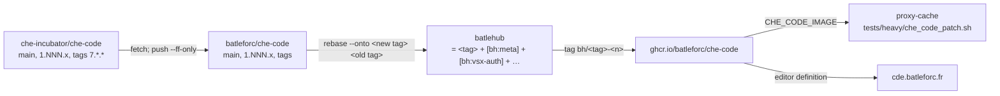

# RFC 0023 — A che-code fork that fast-forwards to upstream

| Field       | Value                                                        |
| ----------- | ------------------------------------------------------------ |
| Status      | Draft                                                         |
| Short       | che-code fork                                                 |
| Settles     | Carrying BatleHub's editor changes on a fork of che-code as a rebased series over a mirror branch that only ever fast-forwards, and the CI that keeps it that way |
| Author      | Max Batleforc <maxleriche.60@gmail.com>                       |
| Co-author   | —                                                             |
| Created     | 2026-09-11                                                    |
| Supersedes  | —                                                             |
| Depends on  | RFC 0011 (the gallery-credential patch, `patches/che-code/`, and §6.4's promise of a patched editor image); RFC 0020 §11 decision 9 for what che-code does with a signed entry |
| Touches     | a new repository `batleforc/che-code` (GitHub, mirrored on Forgejo); here: `patches/che-code/`, `tests/heavy/che_code_patch.sh`, `tests/heavy/vscode_patch.sh`, `.github/workflows/test.yaml`, docs |

---

## 1. Summary

BatleHub carries one change to the editor Eclipse Che runs — the
gallery-credential patch of RFC 0011 — as a diff in `patches/che-code/` that
this repository validates but never builds. RFC 0011 §6.4 said the patch would
be "maintained as a rebase-friendly commit series on the Forgejo mirror, built
into the workspace editor image". That is the one sentence of 0011 nothing
implements, and it is why the two heavy suites that exercise the patch load an
approximation of it into an unpatched build rather than the diff itself.

This RFC creates that fork, `batleforc/che-code`, and fixes the one property
everything else follows from: **the fork must always be able to fast-forward to
upstream**. Its `main` is a byte-for-byte mirror of `che-incubator/che-code`'s
`main`, pushed with `--ff-only` and nothing else, ever. Every change of ours
lives on one branch, `batlehub`, as a linear series of commits replayed on top
of an upstream tag by `git rebase` — never merged, so `git diff main..batlehub`
is the whole of what we carry, and dropping the series returns the tree to
upstream exactly. A feature enters the series as one labelled commit with an
entry in `BATLEHUB.md` that names what it is for and how it leaves. CI in the
fork fast-forwards the mirror, replays the series onto each new upstream
release, refuses any rebase that changed a commit's patch, builds the image
from a tag, and hands it to this repository's heavy suite. The credential patch
is the first feature; the fork is expected to gather a few more small ones over
time, and the discipline here is what keeps each of them cheap.

### Before / after

```text
# today
proxy-cache/patches/che-code/che-code-main-e2e91b70.diff   # carried, applied by nobody
tests/heavy/che_code_patch.sh   → quay.io/che-incubator/che-code + NODE_OPTIONS preload
                                  (the 401 retry and the browser hunk are not in the run)

# with this RFC
batleforc/che-code
  main       == che-incubator/che-code:main        (ff-only, no commit of ours)
  batlehub   == 7.122.0 + [bh:meta] + [bh:vsx-auth] + …   (rebased, never merged)
  tag        bh/7.122.0-1                          → ghcr.io/batleforc/che-code:7.122.0-bh.1
tests/heavy/che_code_patch.sh   → CHE_CODE_IMAGE=ghcr.io/batleforc/che-code:7.122.0-bh.1
                                  (the built editor, no preload)
cde.batleforc.fr                → editor definition batleforc/che-code/latest
```

---

## 2. Motivation

1. **The diff has never run in an editor.** `patches/che-code/validate.sh`
   applies it, type-checks the two touched files and runs the module's tests;
   `tests/heavy/che_code_patch.sh` and `vscode_patch.sh` then load
   `editor_patch_preload.mjs` into an *unpatched* build with `NODE_OPTIONS`.
   The preload re-implements the glue at the `http.request` boundary and says
   so: the single `401` retry and the web-workbench hunk that routes the
   Extensions view's queries through the server are not reproduced. Those two
   are the parts most likely to break on an upstream change, and nothing
   measures them in a real editor.
2. **The patch reaches no user.** che-code is the editor every workspace on
   `cde.batleforc.fr` runs (`/checode/checode-linux-libc/ubi9` in this pod).
   Without a built image, a Che workspace that needs a credentialed gallery
   still has only the loopback proxy of RFC 0011 §4.4, which exists for editors
   *we do not build*. We build none, so the primary UX of 0011 §8 ("pure
   extension, no patch, no proxy — acceptable as fallback, not as the primary")
   is the one nobody gets.
3. **A diff is the wrong carrier for something that must survive a monthly
   upstream.** che-code merges VS Code by `git subtree pull` every four hours
   on `main` and every twelve on its release branch; `validate.sh` on a newer
   tree can only report that a hunk no longer applies. Resolving that on a
   diff means regenerating it by hand with no history of what was resolved or
   why. A commit series resolves the same conflict with `git rebase`, keeps the
   resolution as a commit, and lets `git range-diff` show what changed.
4. **More than one change is coming, and they must not entangle.** Bundling
   `batlehub-vsx` as a built-in extension (0011 §6.5), a `product.json`
   default or two, an upstream fix cherry-picked before it is released: each
   is small, each is the kind of thing a fork accumulates, and each must be
   droppable on its own the day it is upstreamed or stops being worth its
   rebase. §11 decision 11 names the three candidates already on the table. Without a rule for how a feature enters and leaves, the fork drifts
   into the merge-based kind that cannot fast-forward any more, and that is
   the one outcome this RFC exists to prevent.

---

## 3. Goals / non-goals

**Goals**

- A repository `batleforc/che-code` whose `main` can be fast-forwarded to
  `che-incubator/che-code`'s `main` at any moment, and is.
- Every change of ours on one branch, as a linear series over an upstream
  tag, isolated by `git diff` and removable by `git reset`.
- A feature is one labelled commit group with a manifest row: what, why, which
  RFC, and its exit — an upstream pull request or a stated reason to stay local.
- CI that does the sync, the replay and the build with no human in the loop
  when nothing conflicts, and stops with a report — never a silent
  resolution — when something does.
- An image built from a tag of the series, run by this repository's heavy
  suite as the editor under test, replacing the preload.
- The image registered as an editor on the Che instance, opt-in per repository
  first.

**Non-goals**

- **Forking `microsoft/vscode`.** che-code already is that fork, carried as a
  subtree; stock VS Code, code-server and VSCodium users are served by the
  registry (RFC 0020) and the loopback proxy (RFC 0011 §4.4), not by a build
  they will never install. RFC 0020 §8 rejected patching the editor for
  signing on the same ground.
- **Branding, telemetry, update channels, the welcome page.** 0011 §6.5 listed
  them as deliberately untouched; every one is a rebase cost with no BatleHub
  purpose.
- **Tracking che-code's `main` for the published image.** `main` is VS Code
  Insiders territory; what a workspace runs is a `7.x.y` tag. The series is
  based on tags. `main` is mirrored and used as a canary only (§5.3).
- **Changing anything in `crates/`, `server/`, `cli/` or the UI.** The server
  side of 0011 is shipped; the fork consumes the contract file the CLI writes
  and nothing new.
- **Replacing che-code's own `.rebase/` mechanism or its release process.**
  We rebase *onto* what they release; we do not re-run their VS Code rebase.
- **Air-gapped delivery of the image.** RFC 0008's bundle carries packages,
  not editor images; a disconnected Che pulls the image the way it pulls every
  other one.

---

## 4. User-facing design

Two audiences see this: whoever maintains the series, and whoever operates a
Che instance that should run it.

### 4.1 The repository

```text
batleforc/che-code                      GitHub; push-mirrored to git.batleforc.fr
├── main                                mirror of upstream main   — ff-only, bot only
├── 1.NNN.x                             mirror of upstream release branches — ff-only, bot only
├── batlehub          (default branch)  <upstream tag> + the series — force-push, bot + maintainers
├── tags 7.*.*                          upstream's, mirrored verbatim
└── tags bh/<upstream tag>-<n>          what was built: series revision n over that upstream tag
```

`batlehub` is the default branch because scheduled workflows run from the
default branch only, and `main` may hold nothing of ours — not even a
workflow file. Branch protection on `main` and `1.NNN.x` allows no force push
and no pull request; the sync bot is the only writer. Branch protection on
`batlehub` allows force push from the bot and from maintainers, and requires
the invariants check of §5.5 on every pull request.

### 4.2 The series

The series is the commits `main..batlehub` — more precisely
`<base tag>..batlehub`, where the base is recorded in `BATLEHUB.md`. Rules:

| Rule | Reason |
| --- | --- |
| **Linear.** No merge commit is ever reachable from `batlehub` that is not reachable from its base. | A merge is the one thing `git diff base..batlehub` cannot undo and `git rebase` cannot replay. |
| **One label per feature.** Every commit subject starts with `[bh:<label>]`, `<label>` in `[a-z0-9-]+`; a feature may span several commits, all with the same label, contiguous. | `git log --grep '^\[bh:vsx-auth\]'` is the feature; dropping it is `git rebase -i` with those lines deleted. |
| **The first commit is `[bh:meta]`.** It adds `BATLEHUB.md`, `.github/workflows/bh-*.yml` and nothing under `code/` or `launcher/`. | Tooling and the manifest are themselves carried, so they rebase like everything else and `main` stays clean. |
| **Prefer an added file to an edited one.** A feature adds its logic in a new file and touches upstream files only for the call site — the shape 0011 §14.5 chose for the credential patch (one file added, two edited in `code/`, two in `launcher/`). | Hunks in upstream files are what conflict. The rebase report prints, per feature, how many upstream files it edits; a number that grows is the signal to refactor or upstream. |
| **Every feature has an exit.** Its manifest row names an upstream pull request, or a reason it cannot be one. | A fork that only grows is the merge-based fork in slow motion. |
| **Every feature has a document, and the document is an RFC of this repository.** Its manifest row names the number; a feature whose reason does not already live in one gets its own, written before the commit, and that document carries three things: what upstream does that forced the change, why this shape and not the alternatives, and what would let the commit be dropped. | The commit message says what changed; it does not survive as the answer to *why*, and a fork's cost is paid by whoever asks that question a year later without the room in their head. `[bh:vsx-auth]` has RFC 0011, `[bh:node-icu]` RFC 0034; the number in the manifest is what the invariants check can verify exists. |
| **Every feature ships a test, in the suite that can see it.** The three suites are §5.6; the feature's RFC names which one proves it, and `bh-smoke.sh` carries at least one assertion tagged with the label — the invariants check greps for it (§5.5). | A carried change nobody tests is a change we discover is broken from a user, on a rebase, months later. The suites are cheap because each is the smallest thing that can observe its feature: a unit test where the logic is a module, one line in the image where it is a build flag, a workbench where it is a workbench. |
| **A feature that will not replay is parked, not patched around.** If a rebase conflicts in a feature and the maintainer does not resolve it in that sync, the feature's commits move to `parked/<label>` and leave the series; the manifest row says so. | The series must always be at the current upstream. One stale feature must not hold every other one back. |

`BATLEHUB.md`, the manifest, is a table the invariants check parses:

```markdown
| Label      | What                                                 | RFC  | Base entered | Exit                                             |
| ---------- | ---------------------------------------------------- | ---- | ------------ | ------------------------------------------------ |
| meta       | this file, the bh-* workflows                        | 0023 | 7.122.0      | never — it is the fork                           |
| vsx-auth   | gallery credential from the contract file, 401 retry | 0011 | 7.122.0      | upstream PR che-incubator/che-code#NNNN (open)   |
| node-icu   | node built with full ICU, so `Intl.Segmenter` does not segfault | 0034 | 7.122.0      | upstream issue che-incubator/che-code#NNNN — drop when their assembly ships full ICU |
```

Base is a line above the table: `Base: 7.122.0`. The sync job rewrites it.

### 4.3 Adding a feature

1. Branch from `batlehub`; commit as `[bh:<label>] …`, new file first, call
   site second; add the manifest row.
2. Open a pull request against `batlehub`. The invariants check (§5.5) and
   che-code's own `code/` hygiene on the touched files must pass; a maintainer
   reviews the diff against upstream, which is exactly the pull request.
3. Merge by rebase — the forge's "rebase and merge", never a merge commit.
4. The next `bh/<tag>-<n>` tag builds it.

### 4.4 The image and the editor

Images are published as `ghcr.io/batleforc/che-code:<upstream tag>-bh.<n>`
and `:latest`, the same three distributions and assembly as upstream's
`image-publish.yml` (§5.4), so a workspace whose tooling image is musl, ubi8
or ubi9 behaves as it does with upstream's image.

Images are built for amd64 first. Upstream's matrix also builds arm64, and
the workflow keeps that entry in place rather than deleting it — enabling it
is one line and no rebase — so the door stays open for the day an arm64 node
exists (§11 decision 8).

A Che instance registers the fork as an editor definition beside the stock
one — `batleforc/che-code/latest` next to `che-incubator/che-code/latest` —
which is upstream's editor devfile with the two image references changed.
On `cde.batleforc.fr` the fork is **opt-in per repository**, through
`.che/che-editor.yaml`, and stays that way; upstream's image remains that
instance's default. A future instance may be created with the fork as its
default from the start — that is a `CheCluster` setting of that instance, and
§11 decision 10 records it as the intended path.

### 4.5 What the maintainer sees when a sync fails

The sync job never resolves a conflict and never disables itself. It opens (or
updates) one issue titled `rebase onto <tag> failed: [bh:<label>]`, with the
`git rebase` output, the `range-diff` of the features that did replay, and the
list of upstream files each conflicting feature edits. The series stays on the
previous base until a human pushes the resolution, which is a pull request like
any other and shows the resolution as a diff.

---

## 5. Architecture

### 5.1 Two kinds of branch, one invariant



The invariant: **every commit reachable from `main` is reachable from
upstream's `main`, and every commit reachable from `batlehub` is either
reachable from its base tag or carries a `[bh:…]` label.** The first half is
what "fast-forwards to upstream" means and `--ff-only` enforces it; the second
is what makes the series a series, and §5.5 enforces it. Together they give
the property the whole design exists for: `git reset --hard <base>` on
`batlehub` is upstream, and `git diff <base>..batlehub` is us, at all times.

### 5.2 Sync: mirror, then replay

`bh-sync.yml`, scheduled every twelve hours like upstream's
`rebase-release-branch.yml`, and on demand:

1. `git fetch upstream --tags`; for `main` and every `1.NNN.x`:
   `git push origin upstream/<b>:<b>` — a fast-forward or a failure, since
   `main` forbids force pushes. A failure here means upstream rewrote history,
   which che-code's own workflows never do (their `rebase.sh` does a
   `git subtree pull` and a plain `git push origin main`); it is reported, not
   worked around.
2. Newest `7.*.*` tag not yet the base → `git rebase --onto <new> <old> batlehub`.
3. **Pure-replay check.** The set of `git patch-id`s of the series before and
   after must be identical. A rebase that applied cleanly but changed a patch
   (git's rename detection or a fuzzy context can do that silently) is treated
   as a conflict: nothing is pushed, the issue of §4.5 is opened. An automated
   rebase moves commits; it never edits one.
4. Upstream's own smoke: `docker buildx build -f build/dockerfiles/linux-libc-ubi9.Dockerfile`
   on amd64, the same step their rebase workflows run before pushing.
5. Rewrite `Base:` in `BATLEHUB.md` inside the `[bh:meta]` commit (a
   `rebase --exec` amend, so the manifest is always true on the branch),
   `git push --force-with-lease origin batlehub`, tag `bh/<new>-1`.

`<n>` in `bh/<tag>-<n>` increments when the series changes over the same base
(a feature merged, a resolution pushed), so a tag is immutable and the image
tag `<tag>-bh.<n>` names one exact tree.

### 5.3 Canary: what will move next month

`bh-canary.yml`, daily: `git rebase --onto upstream/main <base> batlehub` in
a detached worktree, no push, no tag. Its output is a table per feature — clean
replay, changed patch-id, or conflict with the file list — posted as a check
summary. This is `validate.sh`'s `CHE_CODE_REF=main` mode with a history: the
day upstream moves `requestService.ts`, the maintainer learns it weeks before
the tag that carries it, and can fix the feature on the current base in a
normal pull request.

### 5.4 Image: upstream's pipeline, one registry changed

`bh-image.yml` is upstream's `image-publish.yml` with the trigger and the
registry changed: on push of a `bh/*` tag, build `musl`, `libc-ubi8` and
`libc-ubi9`, assemble, push `ghcr.io/batleforc/che-code:<tag>-bh.<n>` and
the manifest list, then `:latest`. Keeping their matrix and Dockerfiles
verbatim is a deliberate rebase choice: the workflow file lives in
`[bh:meta]`, and a copy that diverges from theirs is one more thing to
reconcile. The one edit to the matrix is the arm64 runner entry left in
place but not enabled (§4.4); the manifest-list step already handles a
single architecture.

The image is scanned like this repository's own (Trivy, blocking on fixable
HIGH/CRITICAL — `docs/contributing/security-scanning.md`), and its SBOM
attached to the tag. Signing the image with cosign is phase 3's last step and
the only supply-chain addition over upstream, which signs nothing.

### 5.5 Invariants, checked on every pull request and every sync

`bh-invariants.yml`, a script in `[bh:meta]`:

| Check | Fails when |
| --- | --- |
| `git rev-list --merges <base>..batlehub` is empty | a merge commit entered the series |
| every commit in `<base>..batlehub` matches `^\[bh:[a-z0-9-]+\] ` | an unlabelled commit |
| every label in the series has a row in `BATLEHUB.md`, and every row has commits or says `parked` | the manifest and the branch disagree |
| the first commit is `[bh:meta]` and touches nothing under `code/` or `launcher/` | tooling leaked into editor code |
| `Base:` equals `git merge-base main batlehub`'s tag | the manifest lies about the base |
| `git diff --stat <base>..batlehub -- code/ launcher/` per feature, printed | never — it is the report the parking rule reads |
| every label in `BATLEHUB.md` appears in `.github/scripts/bh-smoke.sh` — as an assertion tagged `# [bh:<label>]`, or as an explicit `# [bh:<label>] no-smoke: <reason>` | a feature entered the series with nothing that would notice it breaking |
| che-code's `code/` hygiene (`node build/eslint`, `npm run valid-layers-check`) on the files the series touches | a feature broke a layering rule (0011's module had to move from `common/` to `node/` for exactly this) |

The same script runs at the end of `bh-sync.yml` on the rebased branch before
it is pushed.


### 5.6 The three suites

A fork's tests are not one suite, because the three things it carries are not
observable in one place: a module is provable in a unit test, a build flag only
in the built artifact, and a workbench behaviour only in a workbench. So there
are three, each the smallest thing that can see its subject, and each with one
command:

| Suite | Home | Runs on | Command | Gate |
| --- | --- | --- | --- | --- |
| `bh-unit` | the fork, `[bh:meta]` + each feature | the tree, under the assembly's own node | `node --test code/**/*.bh.test.ts` | `bh-invariants.yml`, every pull request and every sync |
| `bh-smoke` | the fork, `.github/scripts/bh-smoke.sh` | **inside a built assembly** | `bh-smoke.sh /checode/checode-linux-libc/ubi9` | `bh-image.yml`, every image, every distribution |
| `bh-editor` | here, `tests/heavy/` | the image, driven in a browser | `CHE_CODE_IMAGE=… task test:che-code-patch-heavy` — the task that exists, reading the image instead of `CHE_CODE_DIR` | this repository's `test.yaml` matrix |

Three properties make them worth their keep:

- **`bh-smoke` takes a directory, not an image.** It asserts against an
  unpacked assembly, so the same script runs in CI against what was just built
  *and* in any Che workspace against the `/checode` it is already running —
  which is how the `Intl.Segmenter` defect of RFC 0034 was found, before any
  image of ours existed. A suite that needs a registry to run is a suite nobody
  runs while debugging.
- **One assertion names one feature.** Every check in `bh-smoke.sh` carries the
  `# [bh:<label>]` tag its feature owns; dropping a feature from the series
  drops its assertions in the same `rebase -i`, and the invariants check makes
  the reverse — a feature with no assertion — a red pull request.
- **`bh-editor` is the only one that costs minutes.** It needs the image, a
  BatleHub, a database and a browser, so it stays here, beside the suites that
  already have them (RFC 0023 §6.2), and never in the fork's pull-request path.

---

## 6. Detailed design

### 6.1 `batleforc/che-code` — creation

- Fork on GitHub from `che-incubator/che-code`; add the Forgejo remote as a
  push mirror the way `batlehub` itself is mirrored (both remotes on
  `origin`, `git remote -v` in this repository).
- `main` untouched. Create `batlehub` at the newest `7.*.*` tag (7.122.0 at
  the time of writing; upstream `main` is `e2e91b70`, the commit
  `patches/che-code/che-code-main-e2e91b70.diff` is validated against, and is
  itself at VS Code 1.128.1).
- `[bh:meta]`: `BATLEHUB.md`, `.github/workflows/bh-sync.yml`, `bh-canary.yml`,
  `bh-image.yml`, `bh-invariants.yml`, `.github/scripts/bh-invariants.sh`.
  Upstream's own workflows remain and are inert on `batlehub`: they trigger
  on `main` and `7.*.*` tags, neither of which we push except by mirroring,
  and the mirror push of a `7.*.*` tag *would* trigger their
  `image-publish.yml` in our fork. It is disabled in the fork's Actions
  settings rather than deleted, so it needs no hunk.
- `[bh:vsx-auth]`: `git apply` of the carried diff onto the tag (it was
  generated on `main` at `e2e91b70`; the five files are the same on the
  7.122.0 tag or the first sync says what moved), committed with the RFC
  0011 §14.5 description as its message. The module and its tests move in as
  `code/src/vs/platform/request/node/vsxRegistryAuth.ts` and
  `vsxRegistryAuth.test.ts`, byte-identical to `patches/che-code/`.
- Bot: a fine-grained token scoped to this one repository with contents
  write, held as `BH_SYNC_TOKEN`; it is the only principal allowed to push
  `main` and `1.NNN.x`.

### 6.2 `proxy-cache` — the suite runs the image

- `tests/heavy/che_code_patch.sh` gains `CHE_CODE_IMAGE`. When set, the build
  is copied out of that image (the `docker cp` path already there, with the
  image reference substituted), `editor_cli` sets **no** `NODE_OPTIONS`, and
  the scenarios run against the build's own request service. The
  `launcher/` half of the diff is not exercised here — the CLI path does not
  run the launcher — so `GALLERY_ENV_NAME` stays `OPENVSX_REGISTRY_URL`, set
  by the suite as the launcher would.
- `editor_patch_scenarios.sh` gains scenario 7, the one the preload could not
  do: rotate the contract file's token between two requests to a registry
  that answers `401` for the first; the tap must see exactly two requests to
  the same URL, the second with the new credential. Runs only when
  `CHE_CODE_IMAGE` is set; on the preload path it is skipped with the reason
  printed, as the suite does today for the 401 retry.
- `.github/workflows/test.yaml`: the `che_code_patch` matrix entry sets
  `CHE_CODE_IMAGE` to the fork's `:latest`. The suite is then a consumer of
  the fork's release, and a red run names the image tag.
- `tests/heavy/vscode_patch.sh` and `editor_patch_preload.mjs` are retired in
  phase 6: the stock family is the loopback proxy's, and the module they
  tested no longer lives here.
- `patches/che-code/` shrinks to a `README.md` that points at the fork and
  says the module, its tests and the series live there, and keeps
  `validate.sh` only until phase 6. The contract itself —
  `cli/schema/vsx-token.schema.json` — never moves; it is the CLI's.

### 6.3 `cde.batleforc.fr` — the editor definition

- An editor-definition ConfigMap in the Che namespace, upstream's
  `che-code` editor devfile with `che-code-injector` and `che-code-runtime`
  pointing at `ghcr.io/batleforc/che-code:latest`, id
  `batleforc/che-code/latest`. This instance already runs in the
  embedded-definitions mode (`CHE_PLUGIN_REGISTRY_URL` is empty in this
  workspace), so no registry is involved.
- `.che/che-editor.yaml` in `proxy-cache` and `batlehub-vsx` selects it. The
  exact keys are confirmed against the running Che in phase 4; if the
  per-repository file cannot name a ConfigMap-defined editor by id, it
  inlines the same devfile.

**Deliberately untouched**, so reviewers do not go looking:

- `cli/src/gallery_proxy.rs` and the loopback proxy — RFC 0011 §4.4 exists
  for editors we do not build, and that is still every editor but this one.
- `crates/adapters/src/registry/openvsx*` and the signing of RFC 0020 — the
  registry's behaviour does not depend on which editor asks.
- che-code's `.rebase/` directory, `rebase.sh`, `make-release.sh` — theirs,
  mirrored, never run by us.
- `docs/registries/openvsx.md`'s che-code row — it says *nothing to
  configure* for a signed entry (0020 §11 decision 9) and that stays true; a
  row for the fork's credential support is a doc change in phase 6.

---

## 7. Security considerations

- **The image is the editor every workspace runs, with the user's
  credentials in its process.** This is the same trust upstream's image
  already holds; what changes is who builds it. The series is reviewable as
  one diff against a public upstream tag, the build runs from an immutable
  tag in CI with no human step, the image is scanned and its SBOM attached,
  and phase 3 signs it. An operator can verify that `:7.122.0-bh.1` is
  `7.122.0` plus `git diff 7.122.0..bh/7.122.0-1` and nothing else.
- **The sync bot can force-push `batlehub`, and a tag on `batlehub` builds an
  image.** A compromised `BH_SYNC_TOKEN` could push arbitrary editor code
  and have it built. Mitigations: the token is scoped to the one repository;
  the pure-replay check means an automated push never contains a patch-id
  that was not already on the branch, so the bot's own job cannot introduce
  code; a *new* patch-id reaches `batlehub` only through a reviewed pull
  request; and `bh-image.yml` builds only tags, which the bot creates only at
  the end of a sync that passed the invariants. The residual risk is a token
  used outside the workflow, which is the same residual as upstream's
  `CHE_INCUBATOR_BOT_TOKEN`.
- **Nothing here adds authenticated or unauthenticated surface to the
  server.** The credential the editor sends is the one RFC 0011 §4.2 already
  defined, scoped to the gallery's origin and dropped on a cross-origin
  redirect; the fork changes where that code runs, not what it does.
- **`main` cannot carry a payload.** No principal but the bot can push it,
  the bot pushes it `--ff-only` from upstream, and the invariants check reads
  it as the base of nothing but the mirror. An attacker who could push
  `main` could push upstream, which is the stronger claim.

---

## 8. Alternatives considered

| Alternative | Why rejected |
| --- | --- |
| Keep the carried diff, no fork (today) | The diff has never run in an editor and reaches no workspace; on every upstream move it is regenerated by hand with no record of the resolution (§2.1, §2.3). |
| Fork `microsoft/vscode` | che-code is that fork with the Che glue already on it; stock, code-server and VSCodium users are served by the registry and the loopback proxy, never by a build of ours (§3, RFC 0020 §8). |
| A merge-based fork: `git merge upstream/main` into our branch | `git diff` no longer isolates the series, conflicts are resolved inside merge commits nobody reads, returning to upstream is a revert of a merge, and the branch can never fast-forward again — the exact property asked for. |
| Track che-code's `main` for the published image | `main` is Insiders; it merges VS Code every four hours and their own workflow disables itself when that breaks. Workspaces run `7.x.y` tags; so does the series. `main` is mirrored for the canary. |
| Use che-code's `.rebase/` add/override/replace mechanism for our changes | It is `jq` merges and string replacement, applied by *their* `rebase.sh` when they pull VS Code — for JSON and a few literals, not TypeScript, and not at the moment we rebase. The one JSON we need, `vsxRegistryAuthSupport` in `product.json`, is set by the launcher at start-up and needs no file at all. |
| Build the image in this repository's CI by `git apply` of the diff | A fork with no history: every resolution is a hand-edited diff, which is the status quo with a Dockerfile attached. |
| A quilt-style `patches/*.patch` directory with a series file | Equivalent to the diff; `git rebase` resolves conflicts with three-way context and `range-diff` shows what changed, `patch` does neither. |
| Upstream pull request only, no fork | The goal, not a substitute: review latency is not ours, a workspace needs the build now, and the series survives a pull request that sits for a quarter. Every feature's exit row points at one. |
| `main` as the default branch, workflows on a third branch | Scheduled workflows run from the default branch only; a workflow on `main` is a commit of ours on the mirror. |
| Resolve rebase conflicts automatically (`-X theirs`, or upstream's `checkout --theirs` pattern) | That is how a series silently loses a hunk. The pure-replay check exists to refuse exactly this. |

---

## 9. Rollout and compatibility

- **Default behaviour.** Nothing in `proxy-cache` changes for a user: no
  config key, no `CURRENT_CONFIG_VERSION` move. A Che instance that does not
  register the editor definition runs upstream's image as before.
- **Operator prerequisites.** A Che instance whose editor definitions can be
  edited; pull access to `ghcr.io/batleforc/che-code` from the cluster (a
  public package; a pull secret if it is made private).
- **Compatibility with upstream's image.** Same VS Code version, same three
  distributions, same launcher, same paths under `/checode`; a workspace
  switched between the two keeps its state, which lives on its volume.
- **Rollback.** Point the repository's `.che/che-editor.yaml` — or, on a
  future instance that defaults to the fork, the instance default — back at
  `che-incubator/che-code/latest`. Nothing is
  persisted by the fork's image that upstream's does not also read. In the
  fork itself, dropping the whole series is `git reset --hard <base>` on
  `batlehub`; the mirror needs nothing.

---

## 10. Test plan

- **`bh-unit` and the invariants, on every pull request and sync**
  (`bh-invariants.yml`): the eight
  checks of §5.5; `node --test` of `vsxRegistryAuth.test.ts` in place under
  the tree's own node (the five properties of RFC 0011 §10, already written);
  upstream's libc-ubi9 build as the smoke.
- **`bh-smoke`, on every image build** (`bh-image.yml`, §5.6): `node -e "new Intl.Segmenter().segment('ab')"`
  inside each built assembly, exit 0 required. One line, and it is the whole
  of what `[bh:node-icu]` promises; the day upstream ships full ICU it keeps
  passing with the commit dropped, which is how we learn the feature can go.
- **Fork, daily** (`bh-canary.yml`): the series replayed onto upstream `main`,
  reported and never pushed.
- **`bh-editor`, here** (`tests/heavy/che_code_patch.sh` with `CHE_CODE_IMAGE`):
  scenarios 1–6 of `editor_patch_scenarios.sh` unchanged — they are about
  behaviour, not about how the code got into the build — plus scenario 7,
  the `401` retry, which only the built editor can show. `PATCH-UNIT-OK` in
  step 0 now runs the tests shipped inside the image's tree.
- **Here, the view** (`tests/heavy/vsx_view.sh`): unchanged; it drives a
  stock VS Code server build and proves RFC 0020, not this RFC. A che-code
  variant of it — the web-workbench hunk of the diff is the one thing no CLI
  test reaches — is attempted in phase 3, time-boxed (§11 decision 9): the
  fork's image driven in the browser sidecar the way `vsx_view.mjs` drives VS
  Code, asserting that a credentialed gallery lists entries in the view
  rather than an empty result.
- **Here, the authorization pair** (the same che-code view driver, phase 3):
  the one claim about an editor that no other suite in this estate makes.
  `openvsx` is covered at client level by `ovsx` — a CLI, not the editor — and
  the editor is precisely where a credential has nowhere to live; this fork is
  what gives it one. So the pair is asked of the built image, against a
  registry whose `anonymous` and `user` tiers hold nothing and one named grant
  gives a reader the three read verbs:

  1. The workbench driven with the reader's credential lists the registry's
     extension in the Extensions view. This is the positive control, and
     without it the refusal below cannot be told from a refusal for an
     unrelated reason (RFC 0015 §13.17).
  2. The identical query, with a credential holding **no read verb**, does not
     list it.
  3. **What the editor shows instead is recorded, not predicted.** A `403` an
     editor turns into a silently empty view is not a boundary a user can act
     on — the distinction RFC 0009 §5.2 exists for — and the credential-less
     case already has a designed answer in the sign-in entry of RFC 0011
     §4.4.2. Whether a *credentialed but unauthorized* search should render
     that same entry, an error, or an empty result is not decided here; the
     test observes it, and the answer belongs to whichever RFC changes the
     behaviour it finds.

  Deferred with the driver if the time box of decision 9 expires: the pair
  needs the workbench, and there is no cheaper place to ask it.
- **Existing suites that must pass unchanged:** `vsx_login.sh`,
  `marketplace.sh`, `openvsx.sh`; the server side is untouched, and they say so.

---

## 11. Decisions and open questions

### Resolved

| # | Question | Decision |
| --- | --- | --- |
| 1 | Which upstream ref the series is based on | **The newest `7.*.*` tag.** It is what a workspace runs; `main` is Insiders and is mirrored for the canary only. |
| 2 | Rebase or merge | **Rebase, never merge.** The only model under which `main` fast-forwards, `git diff base..batlehub` is the series, and a feature is one `rebase -i` line to drop. |
| 3 | Where the tooling lives, given that `main` may hold nothing of ours | **In `[bh:meta]`, the first commit of the series, and `batlehub` is the default branch** — the only way a scheduled workflow runs without a commit on the mirror. |
| 4 | What an automated rebase may change | **Nothing but commit hashes.** Patch-ids before and after must be equal; anything else is a conflict for a human, resolved in a pull request. |
| 5 | Where the credential module's source of truth is | **The fork**, from phase 1. Two copies would drift; this repository keeps the contract (the CLI's schema) and the heavy suite that consumes the image. |
| 6 | Which forge runs CI | **GitHub Actions**, because upstream's workflows are GitHub Actions and are reused with one registry changed; Forgejo is a push mirror, as for `batlehub` itself. |

| 7 | The registry | **`ghcr.io/batleforc/che-code`, for now.** Built where the CI runs, no cross-forge secret; a Forgejo copy only if a cluster's pull path ever needs one. Decided 2026-09-11. |
| 8 | Architectures | **amd64 first, the door open for arm64.** Upstream's arm64 runner entry stays in the workflow's matrix, not enabled; turning it on is one line and no rebase. Decided 2026-09-11. |
| 9 | A che-code variant of `vsx_view.sh` | **Phase 3, time-boxed.** The browser hunk is only observable in a workbench; the fork's image is driven in the browser sidecar the way `vsx_view.mjs` drives VS Code. If the driver does not transfer within the box, it is deferred and the phase still closes. Decided 2026-09-11. |
| 10 | When the fork becomes the instance default | **Never on `cde.batleforc.fr`; the default of future instances.** This instance keeps upstream's image as its default and the fork as a per-repository opt-in; an instance created later may start with the fork as its default. Decided 2026-09-11. |
| 11 | Candidate second features | **Three, none committed by this RFC**, each a manifest row and, if it needs a design, an RFC of its own: (a) `batlehub-vsx` bundled as a built-in extension (0011 §6.5), so the broker needs no install; (b) `product.json` defaults for the workspace editor, set in the build rather than by the launcher; (c) a **configurable set of fonts loaded by the editor at runtime**, not baked into the image — FiraCode Nerd Font is the example — so the set is an instance's choice and a font change is not an image rebuild. A cherry-pick of an upstream fix ahead of its tag is not on the list. Decided 2026-09-11. Row 13 added the one feature this RFC does commit to beyond `vsx-auth`. |
| 12 | What crashes the extension host when a markdown file is opened | **The editor's own node, built with small ICU.** `new Intl.Segmenter(…).segment(s)` segfaults the node that ships in che-code's `checode-linux-libc/ubi9` assembly — v24.18.0, `icu_small: true`, ICU 78.3: the constructor returns, the first `segment()` call dies. The same call on this workspace's own node (24.20.0, full ICU) returns normally, and the other `Intl` constructors — `Collator`, `NumberFormat`, `DateTimeFormat`, `ListFormat` — all work on both. `DavidAnson.vscode-markdownlint` 0.61 added a `new Intl.Segmenter` (through `string-width`, for MD013's wide characters) where 0.60 had none, so every markdown file opened since takes the extension host down with it: `0.60.0` is clean, `0.61.1`, `0.61.2`, `0.62.0` and `0.62.1` each kill it three times over. The core says the same thing the one-liner does — a null internal field dereferenced through a V8 API callback. So: pin `0.60.0` on the instance today, and `[bh:node-icu]` — the series' second feature, designed in RFC 0034 — builds the assembly's node with full ICU. Two reports, both true: an editor that segfaults where it should throw, and a linter that trips it. Decided 2026-09-13. |
| 13 | Whether the fork carries the ICU fix, or waits for upstream | **It carries it, as `[bh:node-icu]`, and asks upstream in the same week.** The wait is unbounded and the failure is silent — a segfault with no message, in any extension that segments a string — while the change is a build flag on a node the assembly already builds. It is the first feature to arrive under the rule above: RFC 0034 is written before the commit, says what would let us drop it, and the image build gains the one-line smoke test that proves it (§10). Decided 2026-09-13. |

### Still open

The five questions this draft opened were closed on 2026-09-11 and are rows
7–11 above. Two were added on 2026-09-13, both measured in the che-browser
sidecar against the *unpatched* editor this instance runs today, so both are
about che-code, not about the fork's machinery:

- **Framing: the workbench refuses every origin but its own.** The editor
  serves its own page with `frame-src 'self' https://*.vscode-cdn.net data:`,
  read directly from `127.0.0.1:3100` with the gateway out of the path, so it
  is the editor's header and not oauth2-proxy's. Anything framed from the
  workbench document towards another origin dies as `net::ERR_BLOCKED_BY_CSP`
  — which on this instance means every endpoint Che publishes on its own
  subdomain (`max-proxy-cache-g4tc-dex.cde.batleforc.fr`), because a
  path-routed endpoint is `'self'` and frames fine. Webviews themselves are
  healthy: the service worker registers, `…/webview/browser/pre/index.html`
  answers `200`, and the Simple Browser renders a subdomain endpoint from
  inside its own CSP. The question is whether the fork widens `frame-src` to
  the instance's endpoint origins, or whether the instance stops putting
  endpoints on subdomains.
- **Markdown and MDX: two mermaid renderers.** che-code's VS Code base ships
  `vscode.mermaid-markdown-features` built in, and this instance also installs
  `bierner.markdown-mermaid`; the workbench console carries `Failed to register
  tool 'renderMermaidDiagram': Tool "renderMermaidDiagram" is already
  registered`. That is the rendering half of the symptom, and the question is
  only whether the fork should have an opinion on the pair — decision 11's
  `product.json` candidate — or whether the instance simply drops the
  extension. The crash half is answered in row 12: it was the linter, not the
  editor.

---

## 12. Implementation phases

| Phase | Content |
| --- | --- |
| 1 | The fork, both forges, branch protection, `batlehub` at 7.122.0 with `[bh:meta]` (manifest, the four workflows, the invariants script) and `[bh:vsx-auth]` (the diff, the module and its tests moved in). `bh-invariants.yml` green — the eight checks of §5.5 and `bh-unit`, which is 0011's five properties running where the module now lives. **Useful alone**: the patch is a commit with history instead of a diff with a SHA in its name, and something fails when it breaks. |
| 2 | `bh-sync.yml` and `bh-canary.yml` live; the first automated fast-forward of `main` and the first replay onto a new tag observed, with the pure-replay check and the failure issue exercised once on purpose (a conflict planted on a throwaway branch). |
| 3 | `bh-image.yml`: the amd64 image on ghcr, scanned, SBOM attached, signed. `[bh:node-icu]` (RFC 0034) lands here, where the assembly is built, and `bh-smoke.sh` (§5.6) stands up with it — its first two assertions are that feature's, and every later feature adds its own. `che_code_patch.sh` under `CHE_CODE_IMAGE` with scenario 7; the `test.yaml` matrix entry switched to the image. The che-code view variant attempted here, time-boxed (decision 9), and with it the authorization pair of §10 — the same driver, two credentials. |
| 4 | The editor definition on `cde.batleforc.fr` as an opt-in; `.che/che-editor.yaml` in `proxy-cache` and `batlehub-vsx`. The instance default is not touched (decision 10). |
| 5 | **What the editor gets wrong on this instance**, now that the fork's image runs there — driven in the che-browser sidecar (`task browser:start`, the workspace over CDP on `localhost:9222`, watched through noVNC), which is also how §11's two answers were found. The framing question is the one still open: widen the workbench's `frame-src` in the series, or take the endpoints off their subdomains on the instance. Beside it, what §11 rows 12–13 leave to do here: pin `markdownlint` 0.60.0 on the instance until phase 3's image exists, open the two reports, and settle the mermaid pair. **Useful alone**: an editor whose previews render and whose extension host stays up. |
| 6 | This repository: `patches/che-code/` reduced to a pointer, `vscode_patch.sh` and the preload retired, `docs/contributing/testing.md` and the OpenVSX registry page updated; RFC 0011 §6.4 annotated as landed here. |
| 7 | The upstream pull request for `vsx-auth` (RFC 0011 §12 phase 9), recorded in the manifest's exit column; when it merges, the commit leaves the series at the next sync. |
