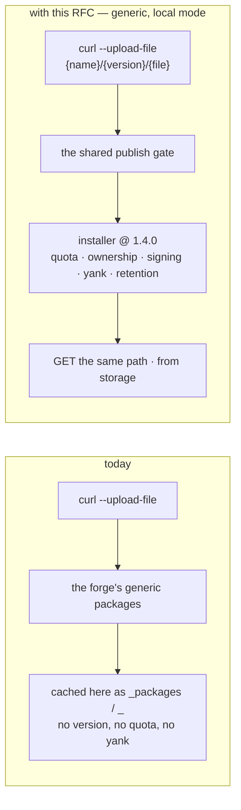
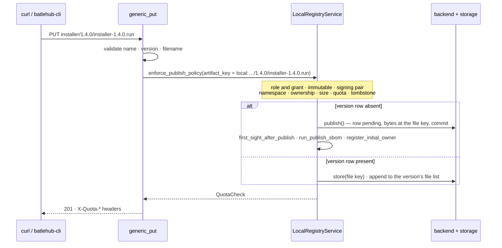
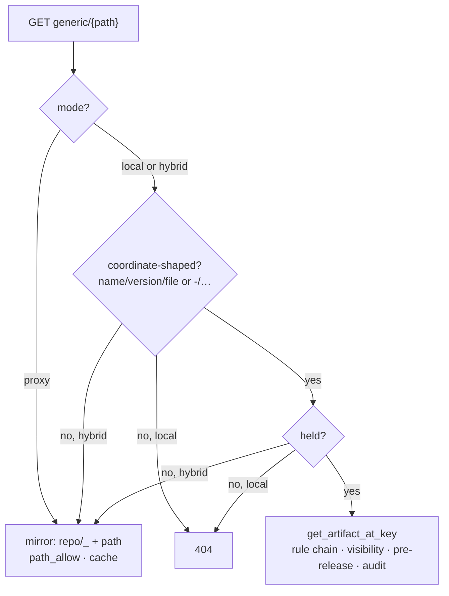

# RFC 0025 — Generic file mirror in local and hybrid mode

| Field       | Value                                                        |
| ----------- | ------------------------------------------------------------ |
| Status      | Draft                                                         |
| Short       | Generic publish                                               |
| Settles     | Publishing arbitrary files under {name}/{version}/{filename} to a generic registry — the equivalent of GitLab's generic packages — on the shared local-registry machinery |
| Author      | Max Batleforc <maxleriche.60@gmail.com>                       |
| Co-author   | Claude Fable 5.1 <noreply@anthropic.com>                      |
| Created     | 2026-09-11                                                    |
| Supersedes  | —                                                             |
| Touches     | `crates/core`, `crates/config`, `crates/web`, `cli`, `ui`, docs |

---

## 1. Summary

A `generic` registry mirrors any plain HTTP file tree, and only mirrors it:
`validate_registry_mode` refuses `mode = "local"` and `"hybrid"` on the kind
with *"no local publish model"*, and the roadmap has carried "the equivalent
of GitLab's generic packages" as the missing half since the kind shipped. This
RFC adds that half. A file is published with one `PUT` to
`{name}/{version}/{filename}` and read back from the same path; a version is a
set of files, listed at a reserved `-/` prefix; and everything between the
request and the bytes — role and grant checks, namespace visibility, ownership,
the immutable-coordinate tombstone, quota, size limit, signing policy, SBOM,
first-sight scanning, dedup, retention, yank and delete — is the machinery
every other local kind already runs through, reached by the same two calls
Maven's multi-file publish makes today.

Nothing about `mode = "proxy"` changes. `hybrid` is a mirror with a private
overlay: a held file answers first, an unheld one falls through to the upstream
path under the same `path_allow` as before.

### Before / after

```text
# today — private blobs live on the forge, everything else lives here
[[registries]]
name       = "gl"
type       = "gitlab"                    # passthrough of /api/v4/projects/…/packages/generic/…
#   published with PRIVATE-TOKEN to GitLab; cached here as `_packages`/`_`, no version, no policy

# with this RFC — the same curl, against this instance, on a coordinate
[[registries]]
name = "blobs"
type = "generic"
mode = "local"                           # or "hybrid" with upstreams + path_allow

$ curl -fsS -H "Authorization: Bearer $BATLEHUB_TOKEN" \
    --upload-file installer-1.4.0.run \
    https://batlehub.example.com/proxy/blobs/generic/installer/1.4.0/installer-1.4.0.run
{"message":"published installer 1.4.0 installer-1.4.0.run"}

$ curl -fsSO https://batlehub.example.com/proxy/blobs/generic/installer/1.4.0/installer-1.4.0.run
$ batlehub-cli package yank blobs installer 1.4.0      # the shared lifecycle, unchanged
```



The same `curl` on both sides. What changes is that the path now parses into a
coordinate before anything is written, which is what every line of §4.4 is
about.

**There is no upstream protocol to describe for this one**: the shape is this
instance's own, and §4.2 is its specification.

---

## 2. Motivation

1. **The demand is served today by a different server.** `gl_packages` in
   `crates/web/src/handlers/proxy/gitlab.rs` exists to cache GitLab's generic
   package registry — its own doc comment calls that endpoint *"ideal for the
   generic package registry (immutable file downloads)"*. A team that has
   moved npm, Maven and PyPI onto this instance still publishes its
   installers, CI blobs and vendored binaries to the forge, then proxies them
   back through here as the synthetic `_packages`/`_` coordinate: no
   version, no owner, no quota, no tombstone, no retention. The proxy is the
   second copy of a file whose first copy is governed elsewhere.

2. **The mode a private file needs is the one the kind refuses.**
   `AppConfig::validate_registry_mode` (`crates/config/src/schema/mod.rs`)
   fails a `generic` registry in `local`/`hybrid` with *"mode 'local'/'hybrid'
   is not supported for generic registries (no local publish model)"*, because
   `RegistryKind::Generic::supports_local_mode()` answers `false` beside the
   forges and the two toolchain kinds. The refusal is correct for the code as
   it stands and is the whole gap.

3. **The publish path is shared machinery, and it already accepts a per-file
   key.** `LocalRegistryService::publish` runs `enforce_publish_policy` (name
   and version validation, the RFC 0015 versioning and `immutable` policy, the
   signing pair check, namespace membership, ownership, the size limit, the
   quota reservation and the RFC 0016 tombstone), then
   `execute_publish_transaction`, `first_sight_after_publish` (RFC 0018),
   `run_publish_sbom` and `register_initial_owner`. Maven's non-POM files go
   through the same gate with `PublishPolicyRequest::artifact_key` set to
   `maven_artifact_storage_key(registry, name, version, filename)` and are
   stored under it (`handlers/proxy/maven/proxy.rs`). A generic version is
   the Maven shape with no `.pom`: several files, one coordinate, each file
   its own key. Nothing new has to be invented to govern it.

4. **The proxy coordinate cannot be reused, because it has no version.** The
   `generic` handler addresses everything as `PackageId::new(registry, "repo",
   "_").with_artifact(path)`. That is right for a mirror — an upstream path
   has no version to speak of — and useless for a publish: there is nothing to
   yank, nothing for retention to count, nothing a tombstone could burn. The
   coordinate is the design; the handlers follow from it.

5. **A mirror and its private overlay are one registry, or two URLs.** A fleet
   that mirrors `get.helm.sh` and also ships an in-house `helm` build today
   configures two registries and every consumer chooses between two base
   URLs. `hybrid` on this kind is what the mode was built for: the held file
   answers, the rest falls through.

---

## 3. Goals / non-goals

**Goals**

- A file can be published to a `generic` registry in `local` or `hybrid` mode
  with a single `PUT` of its bytes, and read back from the same path.
- A version is a set of files under one coordinate, and the shared lifecycle
  (yank, unlist, deprecate, delete, retention, tombstone) applies to the
  version as a whole.
- Every gate a NuGet or npm publish passes applies here unchanged, including
  the signing policy, quota headers, SBOM, first-sight scanning and dedup.
- A `hybrid` registry serves held files first and falls through to upstream
  for the rest, under the existing `path_allow`.
- The versions of a name, and the files of a version, are listable from the
  protocol so a CI job can ask "what is the newest installer" without the
  admin API.
- `batlehub-cli publish` and the console's setup snippet cover the kind.

**Non-goals**

- **Changing `mode = "proxy"`.** Every existing `generic` registry keeps its
  routes, its synthetic coordinate and its mandatory `path_allow`.
- **Paths inside a version.** A file name is one segment. A nested tree under
  a version is a second addressing scheme on the same coordinate, and the
  three-segment key is what every policy is written against.
- **Per-file delete.** The version is the unit of immutability (RFC 0016);
  removing one file from a published set is the same thing as republishing
  the set, which `immutable` governs.
- **Emulating GitLab's URL** (`/api/v4/projects/:id/packages/generic/…`) so
  unmodified pipelines point here. The forge passthrough already proxies that
  shape; this kind has its own prefix like every other, and the curl is one
  line either way.
- **Scanning every file of a version.** Scanning and SBOM attach to the
  version through its first file, the limitation Maven's jars already have;
  §11 q2 says where that is fixed.
- **Release imports into a generic registry** (RFC 0021). An import reads its
  coordinate off the asset's file name, and a generic file name carries none;
  the tag-as-version import is a bis of 0021 (§11 q4).
- **A checksum or signature side-car protocol** (`.sha256`, `.sig` served
  beside the file). The signature is a header on download as everywhere else;
  a consumer that wants a side-car publishes one as a second file.

---

## 4. User-facing design

### 4.1 Configuration

```toml
[[registries]]
name = "blobs"
type = "generic"
mode = "local"                     # no upstream; every file is published here

[[registries]]
name       = "helm-bin"
type       = "generic"
mode       = "hybrid"              # held files first, then the mirror
upstreams  = ["https://get.helm.sh"]
path_allow = ["helm-v*"]           # governs the fall-through only

[registries.rbac]
anonymous  = ["releases:read", "releases:list"]
# publishers hold releases:publish through a grant (RFC 0015); nothing new

[registries.quota]                 # the existing block, unchanged
max_storage_bytes_per_user = 10737418240
```

- `mode = "local"` needs no `upstreams` and no `path_allow`; both are refused
  (§4.5), because in local mode there is nothing for either to govern.
- `mode = "hybrid"` needs both, exactly as `proxy` does today. `path_allow`
  applies to the fall-through and never to a held file: a published file is
  reachable at its coordinate whatever the allowlist says, since the
  allowlist is a statement about the upstream host, not about what this
  instance holds.
- No new registry option. The kind gains a mode, not a knob.

### 4.2 The protocol

Under `/proxy/{registry}/generic/`:

| Method and path | Meaning | Action |
| --- | --- | --- |
| `PUT {name}/{version}/{filename}` | Publish one file. Body is the bytes; `Content-Type` is recorded and served back. | `releases:publish` (`releases:overwrite` to replace a held file) |
| `GET {name}/{version}/{filename}` | The file. Hybrid falls through to `{upstream}/{name}/{version}/{filename}`. | `releases:read` |
| `DELETE {name}/{version}` | Delete the version: every file, and the coordinate is burned. | `releases:delete` |
| `GET -/{name}` | Versions of a name, newest first, with `latest`. | `releases:list` |
| `GET -/{name}/{version}` | Files of a version: name, size, SHA-256, content type, publisher, signed or not. | `releases:list` |
| `GET {path}` (anything else) | Proxy mode: the mirror, as today. Hybrid: the fall-through for a path that is not a coordinate. Local: `404`. | `releases:read` |

```bash
# publish, with the optional detached signature the signing policy may require
curl -fsS -H "Authorization: Bearer $BATLEHUB_TOKEN" \
     -H "Content-Type: application/octet-stream" \
     -H "X-Artifact-Signature: $(base64 -w0 installer.sig)" -H "X-Signature-Type: ed25519" \
     --upload-file installer-1.4.0.run \
     "$REG/installer/1.4.0/installer-1.4.0.run"

# the CLI form — --type is mandatory, a file name carries no coordinate
batlehub-cli publish --type generic --name installer --version 1.4.0 installer-1.4.0.run

# what is the newest installer?
curl -fsS "$REG/-/installer" | jq -r .latest
```

Yank, unyank, deprecate and unlist are the existing admin API and
`batlehub-cli package …` commands; the version is a version like any other.

### 4.3 Coordinates

| Request | `PackageId` | Storage key |
| --- | --- | --- |
| `installer/1.4.0/installer-1.4.0.run` (local) | `installer` / `1.4.0` / `installer-1.4.0.run` | `local:blobs/installer/1.4.0/installer-1.4.0.run` |
| `installer/1.4.0/installer-1.4.0.run.sha256` (local) | `installer` / `1.4.0` / `…run.sha256` | `local:blobs/installer/1.4.0/…run.sha256` |
| `helm-v3.16.0-linux-amd64.tar.gz` (hybrid miss) | `repo` / `_` / `helm-v3.16.0-linux-amd64.tar.gz` | the proxy key, as today |
| `-/installer` | `installer`, version unused | not stored: rendered from the version rows |

The storage key is `maven_artifact_storage_key`'s shape — `local:{registry}/{name}/{version}/{filename}` — used for **every** file, including the first. There is no primary artifact at `local:{registry}/{name}/{version}`, because a generic version has no `.pom`: no file is more the version than another. `PublishRequest` gains an optional storage key for this (§6.1); the version row's `checksum` is the first file's, which is what `require_signed_release` and the download audit already read.

**`name` is one segment**, `validate_package_name`; `version` is one segment,
`validate_path_safe`, and is *not* required to parse as semver — an installer
called `2024.09` is a version. Ordering in `-/{name}` uses
`version_order`, which already tolerates the unparseable by falling back to
lexical order, and `latest` is `best_latest` over what is held and not
yanked, so a pre-release never becomes `latest` while a release exists.
`filename` is one segment, `validate_path_safe`, with GitLab's character set
(`A-Za-z0-9._-+~@`, no leading or trailing `~`/`@`) — the same rules a
pipeline already obeys.

### 4.4 Behaviour rules

**The uninteresting case.** A `PUT` of a new file name to a version that
does not exist creates the version and stores the file; a `PUT` of a new file
name to a version that exists adds the file (GitLab's default, *"the new files
are added to the existing package"*). Both need `releases:publish`. A `PUT` of
a file name the version already holds is a replacement, and RFC 0015 §4.5
decides it: `releases:overwrite` **and** the namespace's `immutable` setting
must both allow, evaluated on *this file's* key exactly as Maven's jar is —
otherwise `409`. That is the existing `artifact_key` branch of
`enforce_publish_policy`, not a new rule.

**A deleted coordinate is burned, whatever the file name.** RFC 0016 §4.4's
tombstone is on `{name}/{version}`; after a delete, a `PUT` of *any* file to
that version is `409` with the tombstone message. The name may be published
to again at a new version. This is the property that makes a generic registry
a place a lockfile can pin a checksum to, and it is why the unit is the
version and not the file.

**Every file passes the whole gate.** Name and version validation, the
versioning policy, the signing pair check, namespace membership, ownership,
`limits.max_artifact_size_bytes`, the quota reservation and the tombstone —
`enforce_publish_policy`, called once per `PUT`. A second file that fails the
quota leaves the first in place; the version is still valid with one file,
which is what the listing says.

**The signing policy is per file.** `X-Artifact-Signature` and
`X-Signature-Type` are checked on every `PUT` against `[registries.signing]`
(`required`, `allowed_types`), and a stored signature is verified on download
when `verify_on_download` is set — over the raw bytes of *that* file, which is
what `signature::verify_ed25519` defines. The version row carries the first
file's signature in its existing columns; every file's signature lives in the
version's file list (§6.1) and is what `append_signature_headers` reads for
that file. A version is "published signed" for `require_signed_release` when
its first file was, matching the column's existing meaning rather than
inventing an all-files rule the columns cannot hold.

**Dedup is free.** The storage router stores by content hash
(`blob/<sha256>`, `artifact_dedup_index`): the same installer published under
two names, or the same `LICENSE` beside every version, is one blob and two
references. Nothing in this RFC touches it; it is listed because it is the
first kind where publishing the same bytes twice is normal rather than a
mistake.

**Hybrid is a two-step read.** A `GET` of a coordinate-shaped path asks the
local store first; on a miss it becomes the mirror request
`{upstream}/{name}/{version}/{filename}`, checked against `path_allow` and
cached under the proxy key as today. A path that is not coordinate-shaped
(one or two segments, or a reserved `-/`) never consults the local store in
hybrid — it is the mirror's. `local` mode has no upstream: a miss is `404`.

**Listings are rendered, not stored.** `-/{name}` is the version rows for
the name — not yanked, not unlisted, not tombstoned, visible to the caller
under RFC 0015 — and `-/{name}/{version}` is that row's file list. Both are
`Filtered` listings in `listing_filter()`, so a version an administrator
blocked is absent from them the way it is absent from every other kind's
(`blocking::strip` gains a `Generic` arm; the JSON is this instance's, so the
filter is a plain array drop). In `proxy` mode the routes are `404`: a mirror
has no listing, and RFC 0008-bis §4.3's "the path-proxy family has no listing
this instance can compose" stays true of the mirror and stops being true of
what is published (§6.7).

**The response shape.**

```json
// GET -/installer
{ "name": "installer", "latest": "1.4.0",
  "versions": [ { "version": "1.4.0", "published_at": "2026-09-11T10:02:00Z",
                  "files": 2, "yanked": false } ] }

// GET -/installer/1.4.0
{ "name": "installer", "version": "1.4.0", "published_by": "user:ci-release",
  "files": [ { "name": "installer-1.4.0.run", "size": 48210944,
               "sha256": "…", "content_type": "application/octet-stream",
               "signed": "ed25519" },
             { "name": "installer-1.4.0.run.sha256", "size": 84,
               "sha256": "…", "content_type": "text/plain", "signed": null } ] }
```

Two DTOs with `ToSchema`, serialised from named structs — the
`openapi_contract` rule — so the generated TypeScript client and the console
read the same shape.

### 4.5 Validation

`AppConfig::validate()` rejects:

| Condition | Rationale |
| --- | --- |
| `type = "generic"`, `mode = "local"`, with `upstreams` or `path_allow` set | Neither governs anything in local mode; an operator who set them believes a mirror exists. Refused, not warned, for the same reason `path_allow` is refused on a non-path kind. |
| `type = "generic"`, `mode = "hybrid"`, with empty `path_allow` | The existing mandatory-allowlist rule, now conditioned on "there is an upstream" rather than on the kind alone. `["**"]` remains the explicit opt-out. |
| `type = "generic"`, `mode = "hybrid"`, with empty `upstreams` | The existing hybrid rule, unchanged. |

Warnings (logged and surfaced to the admin):

| Condition | Behaviour |
| --- | --- |
| A `generic` registry in `local`/`hybrid` under `[registries.sbom] required = true` | Served; warned at reload that an SBOM of an opaque file is generated from what the tool can identify in it, which for a compiled installer is usually nothing, so `required` will refuse publishes the operator meant to allow. |
| `[air_gap]` with a `generic` registry in `local`/`hybrid` | The existing `AIR_GAP_LISTING_NOT_SYNTHESISED` warning is **not** emitted for this mode (§6.7); it stays for `proxy`. |

---

## 5. Architecture

### 5.1 One `PUT`, the shared gate, one key



The invariant: **there is no path to storage that does not pass
`enforce_publish_policy` with the file's own key.** The first file and every
later one call the same function with `artifact_key` set, so `immutable`,
quota and the tombstone are decided per file and never on a row that a
previous file created — the trap RFC 0015 §4.5 names for Maven, and the
reason this design reuses Maven's branch rather than `publish()` alone.

### 5.2 A read, by mode



The invariant: **a held file is read through `get_artifact_at_key` and
nothing else**, the lesson of RFC 0009's survey finding 6, where Maven's jar
read `local_svc.storage` directly and skipped both the rule chain and the
visibility check that `maven-metadata.xml` beside it applied. The handler
never touches `storage` on a read.

### 5.3 What the version is

| Thing | Where it lives | Unit |
| --- | --- | --- |
| The coordinate, its checksum, publisher, signature, visibility, yank/unlist/deprecate flags, tombstone | the version row (`PublishedPackage`) | version |
| The file list — name, size, SHA-256, content type, signature | `index_metadata.files[]` on that row | file |
| The bytes | `local:{registry}/{name}/{version}/{filename}` | file |
| Quota, dedup refs, retention accounting | as today | bytes / version |

The version row is the unit of every policy; the file list is the unit of
every read. Keeping the file list in `index_metadata` rather than a new table
is deliberate: every other kind already puts its ecosystem document there
(`CargoIndexEntry`, the npm version object), the retention compaction of RFC
0016 §4.5 already knows to strip it after the window, and the air-gap
export already carries it.

---

## 6. Detailed design

### 6.1 `crates/core`

- `RegistryKind::Generic::supports_local_mode()` → `true`. The exhaustive
  matches that key on it (`validate_registry_mode`, the UI's mode picker
  through the generated client) follow.
- `listing_filter()` for `Generic` → `Filtered("versions (-/{name})",
  ["versions"])`, `Filtered("files (-/{name}/{version})", ["files"])`, with
  `DocumentKind::FILES = Secondary("files")`. `blocking::strip` gains a
  `Generic` arm dropping array entries by `version` and, for `FILES`, refusing
  the whole document when the version is blocked.
  `every_advertised_filter_is_reachable_from_dispatch` enforces the pair.
- `readme_support()` stays `None`; `fetchable_by_version()` stays `None` with
  its reason extended: a version is a set of files with no canonical one.
- `PublishRequest` gains `storage_key: Option<String>` — `None` keeps
  `artifact_storage_key` (every existing caller), `Some` stores the bytes
  there instead. `execute_publish_transaction` reads it; nothing else changes.
- `LocalRegistryBackend` gains one method,
  `set_index_metadata(registry, name, version, value)`, so a later file can
  be appended to the row's file list under the same transaction discipline
  `commit_publish` uses. This is the one new port method, and the reason it
  is a method rather than a re-publish is that a re-publish would run the
  tombstone and versioning checks against a row that legitimately exists.
- `services/generic.rs` — the file-list document: `GenericFile { name, size,
  sha256, content_type, signature_type, signature_b64 }`, `files_of(row)`,
  `push_file(row, file)`, the filename character rule, and the two rendered
  DTOs. `version_order` and `blocking::best_latest` are reused for `latest`.

### 6.2 `crates/config`

- `validate_registry_mode` no longer refuses the kind; the §4.5 rejections
  are added beside `validate_registry_path_allow`, whose `generic` branch
  becomes "mandatory when the registry has an upstream".
- `CURRENT_CONFIG_VERSION` does **not** move: no field is added or renamed.

### 6.3 `crates/web` — `handlers/proxy/generic.rs`

The one file grows four handlers and keeps `generic_get`'s route last:

| Route | Handler |
| --- | --- |
| `PUT /proxy/{registry}/generic/{name}/{version}/{filename}` | `generic_put` — `require_local_mode`; validate the three segments; `collect_payload` (bounded by `max_artifact_size_bytes`); signature headers via `extract_signature_headers`; then the §5.1 branch: `publish_and_respond` with `storage_key` set when the row is absent, `enforce_publish_policy` + `storage.store` + `set_index_metadata` when present. `201` with `MessageResponse` and the `X-Quota-*` headers `publish_and_respond` already sets. |
| `DELETE /proxy/{registry}/generic/{name}/{version}` | `generic_delete` — `delete_version_audited` (the version and every file key; the tombstone is the backend's, RFC 0016 §5.2). |
| `GET /proxy/{registry}/generic/-/{name}` | `generic_versions` — rendered from `get_index`-style rows through `check_visibility`; `releases:list`. |
| `GET /proxy/{registry}/generic/-/{name}/{version}` | `generic_files` — the file list; `releases:list`. |
| `GET /proxy/{registry}/generic/{path:.*}` | `generic_get`, as today, plus: in `local`/`hybrid`, a three-segment path first tries `get_artifact_at_key` with the file key and the `PackageId` `name/version` + `with_artifact(filename)` — the `handle_maven_artifact` shape — and only on a hybrid miss builds today's `repo`/`_` request. |

Obligations from the existing rules: validate every segment at the edge
(`validate_package_name`, `validate_path_safe` twice, the filename character
set) for a clean `400`; `body = T` on every success (`MessageResponse`,
`ArtifactBytes`, the two new DTOs), or `openapi_contract` fails. Route
ordering: `-/{name}` and `-/{name}/{version}` register before `{path:.*}`, and
`PUT`/`DELETE` are distinct methods so they never shadow the read. The
conformance fixture asserts the matched pattern for each.

`serve_local_or_proxy_artifact` is **not** used: its local branch calls
`get_artifact` with the primary key, which this kind does not have. The
Maven pair (`get_artifact_at_key` then `proxy_stream`) is the right shape
and is followed literally.

### 6.4 `cli`

`batlehub-cli publish --type generic --name <n> --version <v> <file>` →
`Api::publish_generic`, one `PUT` with the file's bytes and `Content-Type`
guessed from the extension. `--type generic` without `--name` and
`--version` is a usage error: `FilenameCoordinates` refuses the kind on
purpose, as it refuses Maven and Composer (RFC 0021 §13.3), because the name
carries no coordinate and guessing one would publish under the wrong one.
`batlehub-cli download` gains nothing: a generic file is a URL.

### 6.5 `ui` and `docs`

- `ui/src/config/registryTypes.ts` — the `generic` entry gains a *Publish*
  snippet (the curl of §4.2) shown when the registry's mode is local or
  hybrid, and its server block gains the local form. The description drops
  *"Proxy-only: there is no publish or index model"*.
- `docs/registries/generic.md` — a *Publishing* section, the coordinate table,
  the listing routes, the `immutable`/tombstone sentence, and the SBOM
  warning; its support table is regenerated (`task docs:listing-coverage`).
  `docs/use/publishing.md` gains the generic row. The "Private publish" cell
  of `docs/registries/index.md` flips.
- `ROADMAP.md` — the entry moves to done when phase 4 lands.

### 6.6 `tests/heavy/generic.sh`

A heavy suite, `config.generic-local.toml` beside it,
`task test:generic-local-heavy`, and a row in the `heavy-client` matrix.
There is no package manager for this kind; the real clients are `curl` (the
runner image's, version recorded in the transcript) and this project's own
CLI, both driven through the tap, with every download written into the run's
temp directory so no step reads another's file:

1. `curl --upload-file` publishes two files to one version; both `201`, the
   `X-Quota-Used` header grows by their sizes; `-/{name}/{version}` lists
   both with the SHA-256 `sha256sum` computes locally.
2. A second `--upload-file` of the same file name is `409`; with a
   `releases:overwrite` grant on an `immutable = "never"` namespace it is
   `201` and the listing's `sha256` changes.
3. `batlehub-cli publish --type generic` publishes a third version; `-/{name}`
   names it as `latest`.
4. `batlehub-cli package yank` removes it from `latest` and from the
   listing; the file still downloads by exact coordinate.
5. `DELETE` the version; a `PUT` of a *different* file name to it is `409`
   with the tombstone message; `-/{name}` no longer lists it.
6. A `hybrid` registry over `https://get.helm.sh` with `path_allow =
   ["helm-v*"]`: the published file answers from local, `helm-v3.16.0-linux-amd64.tar.gz`
   falls through and its cache-miss counter moves, and a path outside the
   allowlist is `403` while the held coordinate stays `200` whatever the
   allowlist says. Fetching the same fall-through path again moves
   `batlehub_artifact_cache_hits_total`.
7. The same bytes published under two names: `artifact_dedup_refs` grows by
   one and the blob count does not.

### 6.7 Air gap (RFC 0008-bis)

A `generic` registry in `local`/`hybrid` has a listing this instance *can*
compose, because it is this instance's own: `-/{name}` and
`-/{name}/{version}` render from the bundle's inventory and the held
`index_metadata`, with no external document to sign. The 0008-bis table
gains a row, the config warning of §4.5 is narrowed to `proxy`, and the
registry page's air-gap cell says *"held versions and their files are
listed; a mirror path is served if held"*. The mirror half keeps its
`503`-on-listing behaviour because a mirror still has no listing.

**Deliberately untouched**, so reviewers do not go looking:

- `crates/adapters/src/registry/path_proxy.rs` — the mirror client is not
  consulted on a local read and needs no change; hybrid reaches it through
  the same `proxy_stream` as today.
- `crates/core/src/services/local_registry/publish.rs` beyond the
  `storage_key` plumb — the gate is reused, not extended; no policy is
  specific to this kind.
- `crates/core/src/services/retention.rs` and the RFC 0016 tombstone — a
  version with several file keys is what Maven already is; delete and
  compaction handle it.
- The dedup router — content-addressed already; this RFC only points out
  that the kind exercises it.
- `gl_packages` — the forge passthrough keeps working for anyone who stays
  on GitLab; this kind is an alternative, not a replacement.

---

## 7. Security considerations

- **Trust boundary.** A publish is authenticated (`releases:publish` through
  RFC 0015 grants) and every byte it writes is under a coordinate the
  publisher may write to. The reader's side is unchanged: `releases:read`,
  namespace visibility, pre-release access, the rule chain, the download
  audit — all applied by `get_artifact_at_key`, never bypassed by a direct
  storage read (§5.2).
- **Attacker-controlled inputs** are the three path segments, the body and the
  two signature headers. Segments are validated before they touch a key;
  `ensure_safe_key` in the storage backends is the deeper guard; the body is
  opaque and bounded by `max_artifact_size_bytes` before it is buffered; the
  signature pair is refused when incoherent (`check_signing_policy`), and a
  zero-byte signature is not a signature.
- **Content type is data, not a directive.** The `Content-Type` a publisher
  sends is recorded and served back verbatim with `X-Content-Type-Options:
  nosniff`, as the mirror already does for upstream types. A generic registry
  can hold an HTML file; a browser opening it from this origin is the risk
  every artifact download already carries and the same header answers.
- **Immutability is the supply-chain property.** A pinned
  `{name}/{version}/{filename}` never changes bytes without a
  `releases:overwrite` grant *and* an `immutable` policy that allows it; a
  deleted version can never be reoccupied. This is what makes the registry
  usable as a lockfile target, and it is inherited, not built here.
- **A hybrid overlay cannot shadow the mirror by accident.** A held file wins
  over the upstream path of the same name — that is the feature — and it can
  only be held by someone with `releases:publish` on that name. The registry
  page states it, because "our helm is not the upstream helm" is a sentence
  an operator should read before choosing hybrid.
- **What an attacker gains from a bypassed check is nothing new**: every gate
  here is the one npm, NuGet and Maven publishes already stand behind.
  Adding a kind adds no new authority.

---

## 8. Alternatives considered

| Alternative | Why rejected |
| --- | --- |
| Keep the forge passthrough as the answer | It governs nothing: the cached copy is `_packages`/`_`, so no owner, quota, tombstone, retention or listing. The demand exists (§2.1), and the machinery to meet it is idle. |
| A new kind (`type = "files"`) instead of a mode on `generic` | Two kinds for one file tree, and a fleet that wants a mirror with a private overlay would need both. `hybrid` is the mode built for exactly that, and it costs one validator change. |
| Publish through `publish()` for every file, storing the primary at the plain key | The second file's `publish()` would hit the tombstone and versioning checks on a row that legitimately exists, and would double-store the first file. Maven already answers this with `artifact_key`; following it is one branch, not a rule. |
| A `files` table instead of `index_metadata.files[]` | A migration, a new port surface, a retention rule and an air-gap export path for a list that every other kind keeps in the same JSON column. Revisit if a version ever needs thousands of files. |
| Nested paths inside a version | A second addressing scheme on one coordinate; every policy is written against three segments; and GitLab, the reference, is flat too. |
| Emulate `/api/v4/projects/:id/packages/generic/…` so pipelines need no change | The forge passthrough already serves that URL for the forge's content; a second server answering it for different content is the kind of ambiguity that ends in a wrong artifact. Each kind has its own prefix here. |
| Serve `.sha256`/`.sig` side-cars computed by this instance | The signature is a header on download everywhere else; generating a second representation of it invents a protocol no client reads. Publish the side-car as a file if a consumer wants one. |

---

## 9. Rollout and compatibility

- **Default behaviour** when not configured: none. No `generic` registry
  changes mode by itself; `proxy` is untouched.
- **Config migration**: none; `CURRENT_CONFIG_VERSION` stays. The only
  validator change is that a combination that was refused is now accepted,
  and a `local` registry with an idle `upstreams`/`path_allow` is now refused
  — which cannot hit an existing file, since `local` was refused outright.
- **Operator prerequisites**: none beyond what a local registry of any kind
  needs (Postgres, a storage backend, tokens). `max_artifact_size_bytes`
  bounds each file; the page says so beside the mirror's identical note.
- **Rollback**: set the registry back to `proxy` (or remove it). Published
  rows and files stay in the database and storage under `local:` keys until
  retention or delete takes them; nothing else references the mode.

---

## 10. Test plan

- **Unit** (`crates/core/src/services/generic.rs`): the filename rule accepts
  GitLab's set and rejects a leading `~`, a space, a `/`; `push_file` on a
  row with no list creates it; `latest` skips a yanked and a pre-release
  version; `blocking::strip`'s `Generic` arm drops a blocked version from the
  versions document and refuses a blocked version's file document.
- **Unit** (`crates/config/src/schema/tests.rs`): `local` with `upstreams` is
  refused; `local` with `path_allow` is refused; `hybrid` without
  `path_allow` is refused; `proxy` is unchanged (the existing tests).
- **Integration** (`crates/web/tests/local_generic_registry.rs`): the five
  routes; `generic_publish_traversal_version_returns_400` and its `name` and
  `filename` twins; second file adds, same file `409`, overwrite grant with
  `immutable = "never"` replaces; delete then `PUT` is `409` tombstone;
  hybrid held-first then fall-through through `FixedRegistry`; listing hides
  a blocked version; `openapi_contract` sees `body = T` on every success;
  team-visibility coordinate is refused on the file *and* on both listings.
- **Conformance** (`crates/web/tests/protocol_conformance.rs`): a `GENERIC`
  fixture — the three `curl` lines of §4.2 and the CLI's `PUT` — asserting
  route ordering between `-/{name}`, `{name}/{version}/{filename}` and
  `{path:.*}`.
- **CLI** (`cli/tests/integration.rs`): `publish --type generic` without
  `--name` is a usage error; with both it publishes and the listing names it.
- **Heavy** (`tests/heavy/generic.sh`): §6.6.
- **Existing suites** that must pass unchanged: `local_maven_registry.rs`
  (the `artifact_key` gate this reuses), `tests/heavy/pathproxy.sh` and the
  `generic` mirror tests (`proxy` mode is untouched),
  `every_advertised_filter_is_reachable_from_dispatch`.

---

## 11. Decisions and open questions

### Resolved

| # | Question | Decision |
| --- | --- | --- |
| 1 | A mode on `generic`, or a new kind? | **A mode.** `hybrid` is the mirror-plus-overlay case, and it already exists. |
| 3 | Where does the file list live? | **`index_metadata.files[]`** on the version row. Every other kind's ecosystem document lives there; retention compaction and the air-gap export already handle it. |
| 5 | Listing routes under a reserved prefix or a trailing slash? | **`-/{name}` and `-/{name}/{version}`.** A trailing slash is a legitimate upstream path on a mirror; a reserved segment is the convention npm (`/-/`) and RFC 0019's raw scheme already use. |

### Still open

2. **Scanning and SBOM cover the first file only.** RFC 0018's `FirstSeen`
   job and `run_publish_sbom` attach to the version, and Maven's jars have
   the same gap today. Recommendation: land as-is with the limitation on the
   page, and open a 0018-bis for multi-file versions, since the fix is in
   the worker's notion of "the artifact", not here.
4. **Release imports into a generic registry** (RFC 0021). An import cannot
   read a coordinate off a generic asset name; a tag-as-version rule
   (`name = <repo>`, `version = <tag>`, every asset a file) is small and
   useful. Recommendation: a bis of 0021 after this lands, not scope here.

---

## 12. Implementation phases

| Phase | Content |
| --- | --- |
| 1 | `crates/core`: `supports_local_mode`, `listing_filter` and the `Generic` strip arm, `PublishRequest::storage_key`, `LocalRegistryBackend::set_index_metadata` (in-memory and Postgres), `services/generic.rs`. `crates/config`: the §4.5 validator changes. Tree green; nothing routable yet, so phases 1 and 2 land together. |
| 2 | `crates/web`: the four handlers and the local branch of `generic_get`, the two DTOs, `local_generic_registry.rs`, the conformance fixture. **Useful on its own**: publish, read, list, delete, hybrid overlay. |
| 3 | `tests/heavy/generic.sh` and its task and matrix row. Runs before phase 2 is called done. |
| 4 | `cli` `publish --type generic`; `ui` snippet; `docs/registries/generic.md`, `docs/use/publishing.md`, the registries index; `ROADMAP.md` ticked; the §13 note. |
| 5 | Air gap: the composed listings and the 0008-bis table row, proven in `tests/heavy/airgap.sh`. Ships on its own. |
