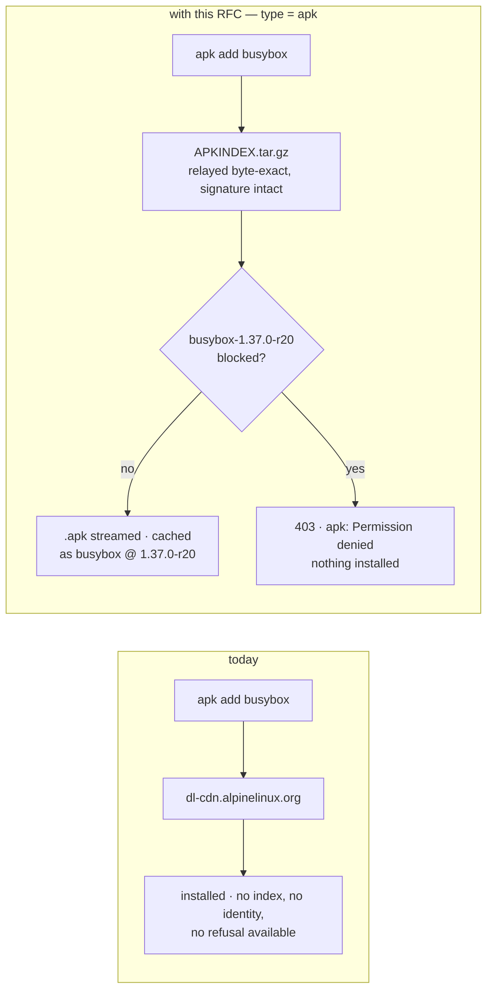
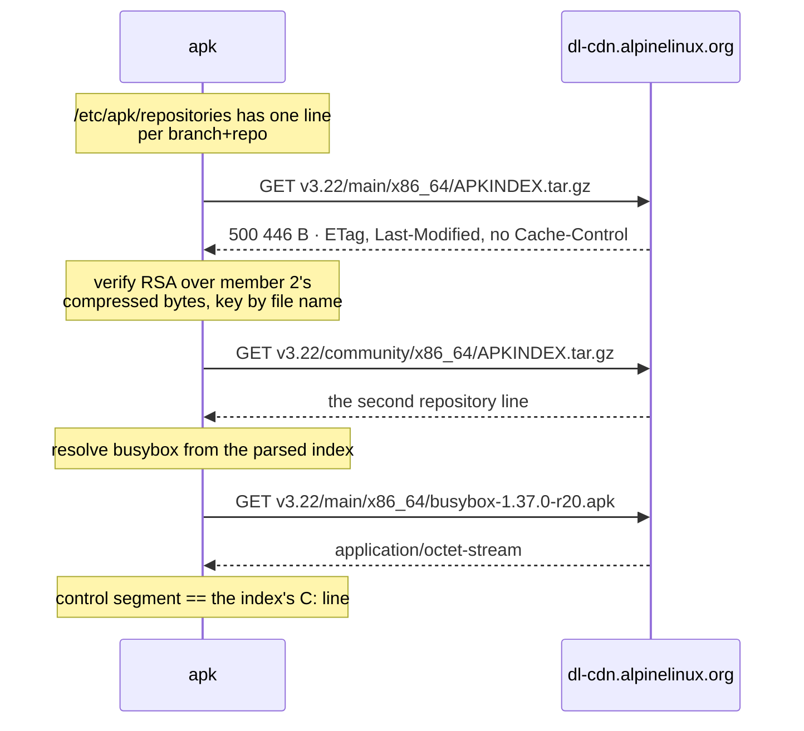
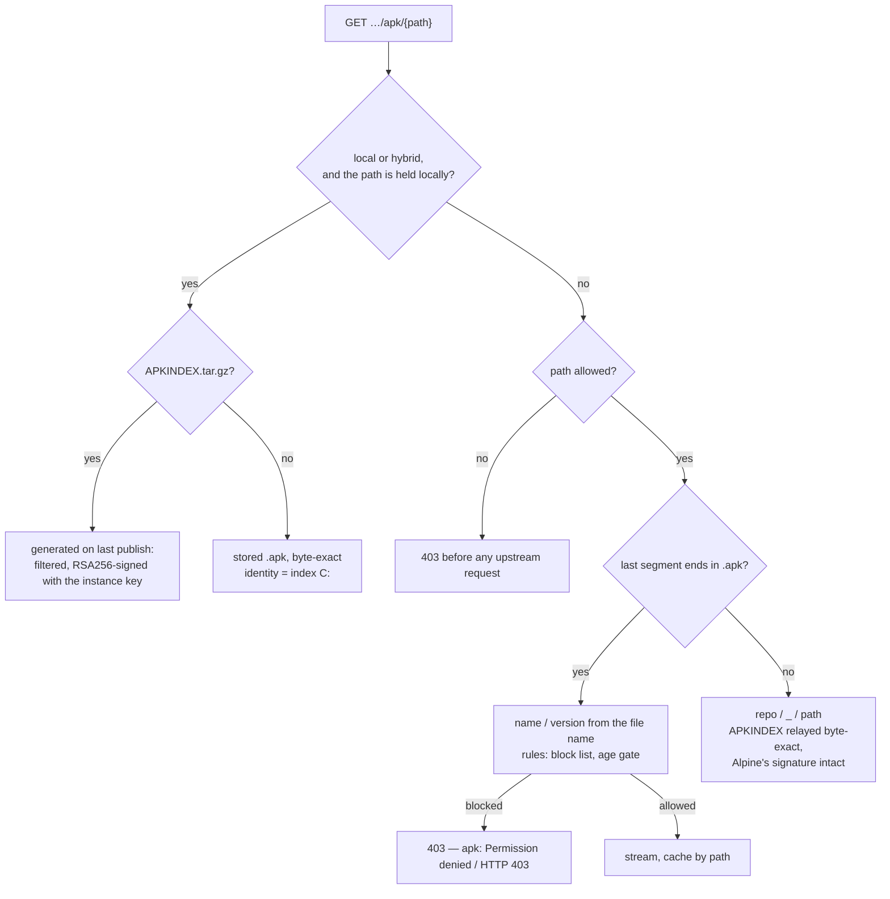
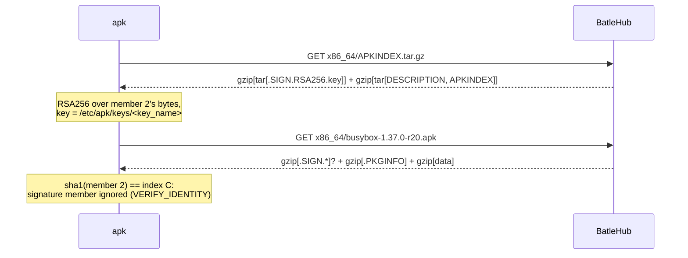

# RFC 0026 — Alpine apk

| Field       | Value                                                        |
| ----------- | ------------------------------------------------------------ |
| Status      | In review                                                     |
| Short       | Alpine apk                                                    |
| Settles     | Proxying Alpine's APKINDEX and .apk tree with the index relayed byte-exact and the block enforced at the package, and local publishing with an RSA-signed index that every shipping apk trusts — signed without the banned crate |
| Author      | Max Batleforc <maxleriche.60@gmail.com>                       |
| Co-author   | Claude Fable 5.1 <noreply@anthropic.com>                      |
| Created     | 2026-09-11                                                    |
| Supersedes  | —                                                             |
| Touches     | `crates/core`, `crates/config`, `crates/adapters`, `crates/web`, `server`, `ui`, `docs`, `tests/heavy`, `perf` |

---

## 1. Summary

Alpine is the base of most container images this proxy will ever sit in front
of — che-code's own musl build runs on it — and the missing member of the OS
family beside `deb`, `rpm` and `pacman`. `type = "apk"` adds it: in proxy mode
a path tree per `{branch}/{repo}/{arch}` with `APKINDEX.tar.gz` and `.apk` files
under it, cached and refused by version; in `local`/`hybrid` mode a repository
this instance hosts, regenerating and **signing** its index on every upload the
way `pacman` regenerates `<repo>.db`.

Two things the roadmap entry got wrong decide the shape, and both were found
by reading apk-tools rather than remembering it:

- **The index cannot be a filtered listing.** `APKINDEX.tar.gz` is signed by
  Alpine's RSA key and every apk that ships — 2.14.10 on Alpine 3.22,
  2.14.6 on 3.21, 3.0.8 on 3.23, 3.24, `latest-stable` and `edge` — verifies
  that signature before reading a byte
  of it, and refuses an unverifiable index unless `--allow-untrusted` is on,
  which also switches off the package identity check. So the upstream index
  is relayed byte-exact, as `deb`, `rpm` and `pacman` already relay theirs,
  and a block is enforced where it can be: at the `.apk`, whose file name
  carries a real `name` and `version`. That makes `apk` the first member of
  the path-proxy family with a coordinate — a block list, an age gate, a row
  in explore — and the honest limit is that apk's solver still *selects* the
  blocked version and fails on the download, on its own error, not on a
  not-found.
- **Publishing is not gated on apk-tools 3.** apk 3.0.8 accepts exactly the
  same `.SIGN.RSA*` entries as 2.14 does and nothing else, so "wait for apk 3
  to accept Ed25519" would be waiting for something that did not happen. What
  *is* true is that the ban is on the `rsa` crate (RUSTSEC-2023-0071), not on
  RSA: `aws-lc-rs`, already in this tree as rustls' provider, signs PKCS#1
  v1.5 with SHA-256, which is precisely what a `.SIGN.RSA256.<key>` entry is.
  A locally published repository is therefore signed with a key every apk
  trusts once it is dropped into `/etc/apk/keys/`, and its index — ours to
  write — *is* filtered, so RFC 0006's rule holds in full for what this
  instance hosts.

### Before / after

```text
# today — nothing: an Alpine image in front of this proxy fetches from dl-cdn.alpinelinux.org,
# or a `generic` registry caches the tree and can refuse nothing on it.

# with this RFC
[[registries]]
name      = "alpine"
type      = "apk"
mode      = "proxy"
upstreams = ["https://dl-cdn.alpinelinux.org/alpine"]

# /etc/apk/repositories
https://batlehub.example.com/proxy/alpine/apk/v3.22/main
https://batlehub.example.com/proxy/alpine/apk/v3.22/community

#   block "busybox" at "1.37.0-r20"  →  apk update still lists it (signed index, relayed);
#                                       apk add busybox → "ERROR: busybox-1.37.0-r20: Permission denied"
#                                       (apk 3: "HTTP 403: Forbidden"), nothing installed.
#   local mode                       →  index regenerated and RSA-signed on upload; a blocked
#                                       version is absent from it, and apk says "unable to select".
```



The index is the one document that cannot change, so the arrow that forks is
the package fetch. Everything in §4.4 follows from where that fork had to go.

---

## 2. Motivation

1. **The OS family has a hole where the container base is.** `deb`, `rpm`
   and `pacman` exist; Alpine does not. `docker build` on an `alpine:3.22`
   base runs `apk add` against `dl-cdn.alpinelinux.org` from inside every
   build, past the proxy that governs everything else the image installs.
   che-code's musl distribution (RFC 0023) is built on it.

2. **`generic` cannot refuse an Alpine package.** A `generic` registry on
   the mirror caches the tree under one synthetic package and has no version
   for `BlockListRule` to match (RFC 0010 §2 for Node, RFC 0024 §2 for Rust).
   The `.apk` file name is `{name}-{pkgver}-r{N}.apk`, so the coordinate is
   there for the taking, and nothing takes it.

3. **The index is a signed document and the roadmap treated it as a
   listing.** apk 2.14.10 fetches the index with `APK_SIGN_VERIFY`
   (`database.c:2307`) and `apk_sign_ctx_mpart_cb` returns `-EKEYREJECTED` on
   a signature that does not verify and `-ENOKEY` on a key it does not have;
   only `APK_ALLOW_UNTRUSTED` lets `-ENOKEY` through (`package.c:749–751`).
   A filtered index is an index with a bad signature, and the client's answer
   is to refuse the whole repository — the failure the `SIGNED` row in
   `listing_filter()` already names for the other three.

4. **The signing gate in the roadmap is the wrong gate.** apk 3.0.8's
   `extract_v2.c:96–99` accepts `RSA512`, `RSA256`, `RSA` and `DSA` signature
   entries, and `apk_verify_start` (`crypto_openssl.c:227`) calls
   `EVP_DigestVerifyInit` with the digest the entry names — a call OpenSSL
   rejects for an Ed25519 key, which takes no pre-hash. No shipping apk
   accepts Ed25519 for a v2 index, and no Alpine branch publishes a v3
   (`.adb`) index: `edge/main/x86_64/APKINDEX.adb` is a 404 today and the
   directory lists `APKINDEX.tar.gz` alone. Meanwhile RSA signing is one call
   into a crate the tree already links.

5. **Installs are verified through the index, not through the package.**
   When apk installs from a repository it opens the package with
   `APK_SIGN_VERIFY_IDENTITY` and `&pkg->csum` (`database.c:2904`,
   `app_fetch.c:206`): the control segment's SHA-1 must equal the index's
   `C:` field, and the package's own `.SIGN.*` entry is not consulted. That is
   the fact that makes local publishing tractable — a package built by
   `apk mkpkg`, `melange` or `nfpm` without a signature installs fine from a
   signed index — and it is nowhere in the roadmap entry.

6. **Every package carries a build timestamp.** The index's `t:` field is
   the unix build time of each package (5 647 of them in `v3.22/main` for
   x86_64), so `ReleaseAgeGateRule` gets a real `published_at` without a
   second request — the situation `nodedist` gets a date for and `sdkman`
   never gets at all.

---

## 3. Goals / non-goals

**Goals**

- An Alpine mirror is proxied and cached by path, with `path_allow` where the
  operator wants to bound it, exactly as the three sibling kinds are.
- A `.apk` request has a coordinate — `name`, `version` — so it can be blocked,
  age-gated, counted and shown in explore, and a blocked package is refused
  with the download gate's `403` before any byte leaves the site.
- A `local`/`hybrid` registry accepts `.apk` uploads, regenerates
  `APKINDEX.tar.gz` per architecture from the packages' own `.PKGINFO`, signs
  it with an operator-provided RSA key, and serves the public key at a stable
  path — so `apk` with a stock `/etc/apk/keys/` entry and no `--allow-untrusted`
  installs from it.
- The locally generated index is filtered: a blocked version disappears from
  it, and apk reports its own "unable to select" rather than a download error.
- Both apk generations that ship are proven against the real client: 2.14.10
  and 3.0.8.

**Non-goals**

- **Filtering the upstream index.** Impossible without breaking its
  signature; §8 records the re-signing alternative and why it is declined.
- **v3 (`.adb`) indexes and `apk mkndx`.** No Alpine branch publishes one and
  apk 3 reads the v2 format by default (`repoparser.c:181–193`: a URL with no
  `v3` keyword is `APK_REPOTYPE_V2`). If a branch starts shipping
  `Packages.adb` this is a bis, not a phase.
- **Signing the uploaded `.apk` itself.** Installs verify identity through
  the index (§2.5); a package signature would be for `apk add ./file.apk`
  from disk, which is not a registry operation.
- **Ed25519 anywhere in the apk path.** Nothing reads it.
- **`--allow-untrusted` as a documented mode.** It disables the identity
  check as well as the signature check (`package.c:513`), so a page telling
  an operator to set it would be telling them to install unverified bytes.
- **Tags (`@edge` repositories), `apk cache`, `apk audit`.** Client-side
  features that see the proxy as a mirror and need nothing from it.
- **DSA keys.** Accepted by apk 3, dead everywhere else, never generated here.

---

## 4. User-facing design

### 4.1 Configuration

```toml
# Proxy: an Alpine mirror by path, bounded to the branches this fleet runs
[[registries]]
name       = "alpine"
type       = "apk"
mode       = "proxy"
upstreams  = ["https://dl-cdn.alpinelinux.org/alpine"]   # the tree root, not a branch
path_allow = ["v3.22/**", "v3.24/**", "latest-stable/**"]  # optional; absent means the whole tree

# Local: a repository this instance hosts and signs
[[registries]]
name = "internal-apk"
type = "apk"
mode = "local"

[registries.apk_signing]
key_name        = "internal-apk@example.com-5f3a1c2e.rsa.pub"  # the file name under /etc/apk/keys/
private_key_pem = "${APK_SIGNING_KEY_PEM}"                    # RSA private key, PEM; 2048 bits or more
# Phase 5 (§11 decision 9): signed after the current key, so a fleet mid-rotation installs either way.
# previous_keys  = [{ key_name = "…-old.rsa.pub", private_key_pem = "${APK_OLD_KEY_PEM}" }]

[registries.rbac]
anonymous = ["releases:read", "releases:list"]   # APKINDEX is a listing, a package is a read

# An age gate on this kind must say what it does with a package the cached
# index does not list (it reaches the gate with no timestamp) — no default.
[[registries.rules]]
kind                   = "release_age_gate"
min_age_secs           = 172800
deny_missing_timestamp = false
```

- `upstreams` is the tree **root** — the directory holding `v3.22/`, `edge/`
  and `latest-stable/` — because the client appends `{branch}/{repo}/{arch}/`
  itself and the registry serves every branch under one name. There is no
  default: `deb` and `rpm` have none either
  (`requires_explicit_upstream_in_proxy_mode`), and Alpine's CDN is one
  mirror of many.
- `path_allow` is the existing glob allowlist of path-addressed kinds, with
  the same absent-means-everything rule.
- `apk_signing` is `local`/`hybrid` only. `key_name` is the exact file name
  the client will hold under `/etc/apk/keys/`, because apk opens the key *by
  the name in the signature entry* (`package.c:589`,
  `openat(ctx->keys_fd, name, …)`) — a mismatch is not an error, it is an
  untrusted index. Alpine's own convention is `<email>-<8 hex>.rsa.pub` and
  the validator enforces the `.rsa.pub` suffix so a key file lands beside
  Alpine's without a rename. `private_key_pem` takes a PEM (PKCS#8 or PKCS#1)
  through the `${VAR}` substitution the other seeds use; it is never written
  back by the config editor.

### 4.2 The client side

```sh
# /etc/apk/repositories — apk appends /{arch}/APKINDEX.tar.gz and /{arch}/{file}.apk
https://batlehub.example.com/proxy/alpine/apk/v3.22/main
https://batlehub.example.com/proxy/alpine/apk/v3.22/community

# apk 3 (Alpine ≥ 3.23) also accepts the components form — same requests on the wire
https://batlehub.example.com/proxy/alpine/apk/v3.24 main community

# A local repository: install the instance's key once, then the line
curl -fsSL -o /etc/apk/keys/internal-apk@example.com-5f3a1c2e.rsa.pub \
  https://batlehub.example.com/proxy/internal-apk/apk/keys/internal-apk@example.com-5f3a1c2e.rsa.pub
echo https://batlehub.example.com/proxy/internal-apk/apk >> /etc/apk/repositories

apk update            # one APKINDEX.tar.gz per repository line, verified against /etc/apk/keys
apk add busybox       # {name}-{version}.apk, its control segment checked against the index's C:
```

A `Containerfile` sets the same two lines before its first `apk add`; a
`sed -i 's#https://dl-cdn.alpinelinux.org/alpine#https://batlehub.example.com/proxy/alpine/apk#'
/etc/apk/repositories` on a stock image is the whole migration, and it is the
line the registry page carries.

**Authentication.** apk's downloader is its vendored libfetch, which sends
credentials embedded in the repository URL as HTTP Basic and has no header
or netrc mechanism of its own. The URL form works and leaks the token into
`apk update`'s own `fetch https://…` line, so the registry page says what
`generic.md` says: prefer `anonymous` read plus an authenticating ingress,
and treat the URL form as the last resort.

### 4.3 Coordinates

| Request (under `…/proxy/{reg}/apk/`) | `PackageId` | Cache key |
| --- | --- | --- |
| `v3.22/main/x86_64/APKINDEX.tar.gz` | `repo` / `_` / `v3.22/main/x86_64/APKINDEX.tar.gz` | the path |
| `v3.22/main/x86_64/busybox-1.37.0-r20.apk` | `busybox` / `1.37.0-r20` / `v3.22/main/x86_64/busybox-1.37.0-r20.apk` | the path |
| `v3.22/main/x86_64/py3-requests-2.32.4-r0.apk` | `py3-requests` / `2.32.4-r0` / … | the path |
| `keys/<key_name>` (local) | `repo` / `_` / `keys/<key_name>` | served live from the signer |
| `x86_64/APKINDEX.tar.gz` (local) | `repo` / `_` / `x86_64/APKINDEX.tar.gz` | generated on publish |

**The path is the cache key; the file name is the identity.** `apk` stays a
path-addressed kind — `PathProxyRegistryClient`, `path_allow`, `warm_paths`,
`local:{registry}/{path}` storage — because that is what the tree is. What
changes is that a request whose last segment ends in `.apk` is parsed into
`name` and `version` before the `PackageId` is built: the version is the
last two dash-separated tokens (`pkgver-rN`; apk's release suffix is always
`-r<digits>`, `package.c:864` onwards reads it from `pkgver`), the name is
everything before them, which is how `py3-requests-2.32.4-r0` splits
unambiguously though both halves contain dashes. A `.apk` whose name has no
`-r<digits>` token is a `400` at the edge, not a guess.

Several URLs can name one file. Today `v3.24/main/x86_64/busybox-1.37.0-r31.apk`
and `latest-stable/main/x86_64/busybox-1.37.0-r31.apk` are the same bytes —
`latest-stable` is a symlink to the newest stable branch — and a third joins
them for as long as a package survives into the next branch. They are that
many cache entries with that many paths, one dedup reference each
(`artifact_dedup_index`), and one row per `busybox`/`1.37.0-r31` in
statistics. That is the same trade `nodedist` made for io.js and it is the
right one: the identity is what the admin acts on, the path is what the
client asks for.

### 4.4 Behaviour rules

**The upstream index is relayed byte-exact, and the page says why in its
first paragraph.** `APKINDEX.tar.gz` is two concatenated gzip members: a
748-byte tar holding `.SIGN.RSA.alpine-devel@lists.alpinelinux.org-6165ee59.rsa.pub`,
then the 499 698-byte tar holding `DESCRIPTION` and the 2.26 MB `APKINDEX`.
The signature is over the **compressed bytes of the second member**
(`io_gunzip.c:88` hands `apk_sign_ctx_mpart_cb` the input window between
`cbprev` and `next_in`), verified with the digest the entry names —
`RSA` is SHA-1, `RSA256` SHA-256, `RSA512` SHA-512 — against the public key
found *by file name* in the keys directory. Editing a line of `APKINDEX`
therefore changes bytes the signature covers, and the client refuses the
repository. Nothing this instance does to an upstream index survives that,
so it does nothing: `listing_filter()` answers the `SIGNED` row for `apk` as
it does for `deb`, `rpm` and `pacman`, and `docs:listing-coverage` prints
the reason.

**The block is enforced at the package, and the message is apk's.** A
blocked `busybox`/`1.37.0-r20` is refused by the download gate with `403`.
apk 2.14.10 maps that through libfetch's `FETCH_AUTH` to `-EACCES`
(`io_url.c:44`) and prints `ERROR: busybox-1.37.0-r20: Permission denied`,
then the commit summary `1 error; …` (`commit.c:381`); apk 3.0.8 has a
string for the status itself, `HTTP 403: Forbidden`
(`print.c:37`, `io_url_libfetch.c:63`). In both, the transaction fails and
nothing is installed. The honest limit: the index still lists the version,
so `apk add busybox` *selects* it and fails on fetch rather than picking an
older one — and there is no older one, because an Alpine branch holds one
version per package. A block on a stable-branch package is a block on the
package until the branch bumps it; the page says so beside the block
example, as the Homebrew entry in the roadmap does for the same shape.

**The uninteresting case is a passthrough.** With no block, no gate and no
`path_allow`, every request under the prefix is fetched by path, cached by
path and served with `application/octet-stream` — what the CDN sends for
both the index and the packages. The identity parsing adds one string split
per `.apk` request and nothing to the bytes.

**`latest-stable` is a path, not an alias to repair.** It is a symlink on
the mirror; the proxy sees it as a directory and treats it like any other.
Nothing is composed and nothing moves.

**The local index is generated, filtered and signed.** On every `PUT`, the
registry reads `.PKGINFO` out of the upload's control segment, writes the
sidecar the way `regenerate_pacman` does, and rebuilds
`{arch}/APKINDEX.tar.gz` from every sidecar under that architecture:

- Entries are rendered in the field order `apk_pkg_write_index_entry`
  uses (`package.c:1128–1162`): `C:`, `P:`, `V:`, `A:`, `S:`, `I:`, `T:`,
  `U:`, `L:`, `o:`, `m:`, `t:`, `c:`, then `D:`, `p:`, `i:`, `k:` when
  present, blank-line separated, so `apk index` and this instance produce a
  document apk parses identically.
- `C:` is `Q1` + base64 of the SHA-1 over the control member's compressed
  bytes — the identity apk computes under `APK_SIGN_VERIFY_AND_GENERATE`
  and checks at install under `APK_SIGN_VERIFY_IDENTITY`. It is a
  protocol-mandated SHA-1 and is documented as such in the scanner triage
  notes, not "fixed".
- `S:` is the file size, `I:` the `size` line of `.PKGINFO`, `t:` the
  `builddate` line — the timestamp the age gate reads.
- **Blocked versions are omitted.** This index is ours, its signature is
  ours, and RFC 0006's rule applies in full: a blocked version is absent, and
  apk's solver reports *"unable to select packages: busybox-1.37.0-r20 (no
  such package)"* for an exact request rather than downloading anything.
  Hybrid mode filters the local index and relays the upstream one.
- The data member is the gzip of that tar (`DESCRIPTION` first, holding the
  registry name and a generation counter, then `APKINDEX`); the signature
  member is a gzip'd tar holding one entry, `.SIGN.RSA256.<key_name>`, whose
  content is the PKCS#1 v1.5 SHA-256 signature over the data member's bytes.
  The two are concatenated in that order, which is what `abuild-sign` writes
  and `apk_sign_ctx_process_file` expects (`.SIGN.*` entries before any
  other name, `package.c:573`).

**The public key is served live.** `GET …/apk/keys/<key_name>` answers the
PEM `SubjectPublicKeyInfo` of the configured key, before any publish, the
way `rpm`'s `repodata/repomd.xml.key` is (`is_signing_key_path`). Any other
name under `keys/` is `404`, so a client that typos the file name learns it
at `curl` rather than at `apk update`.

`keys/` is therefore a **reserved prefix** under `…/apk/`, and the page says
so. Alpine's own tree has nothing there — `dl-cdn.alpinelinux.org/alpine/keys/`
is a `404` and the root holds only branches, `MIRRORS.txt` and `last-updated`
— but a mirror that did would be shadowed in `hybrid` mode. One reserved
segment at the root of a tree whose real content always begins with a branch
name is a trade worth stating rather than discovering.

**Uploaded packages are stored byte-exact.** A `.apk` from `abuild` carries
its builder's `.SIGN.RSA.<builder key>` member; one from `apk mkpkg`,
`melange` or `nfpm` may carry none. Both are kept as uploaded and both
install, because the install path checks the index's `C:` and not the
package's signature (§2.5). The stored file name is
`{name}-{version}.apk` from `.PKGINFO`, never the client's, as `pacman_publish`
does with `.PKGINFO` and the compression magic.

### 4.5 Validation

`AppConfig::validate()` rejects:

| Condition | Rationale |
| --- | --- |
| `type = "apk"` in `proxy`/`hybrid` mode with no `upstreams` | Same rule as `deb`/`rpm`: there is no universal Alpine mirror and a placeholder would fail on the first `apk update` with a hostname that is nobody's fault. |
| `upstreams` entry ending in a branch (`/v3.22`, `/edge`, `/latest-stable`) or a repo (`/main`) | The client appends the branch and repo; a root that already holds one puts the index at `…/v3.22/v3.22/main/…`. Rejected naming the fix, because it is the mistake a `generic` migration makes. |
| `apk_signing` on a registry whose type is not `apk` | A silently ignored signing key is the class of misconfiguration `broker_url` off `sdkman` is rejected for. |
| `apk_signing` in `proxy` mode | There is nothing to sign: the upstream index is relayed and the key would advertise a trust this instance does not provide. |
| `apk_signing.key_name` not ending in `.rsa.pub`, or containing `/` or `..` | apk opens it by that name in the keys directory; the suffix is Alpine's convention and the rest is a path segment. |
| `apk_signing.private_key_pem` that does not parse as an RSA key of ≥ 2048 bits | `RsaKeyPair::from_pkcs8`/`from_der` reject it at boot rather than at the first publish, and a 1024-bit key is a key apk 3 warns about and this instance should not mint an index with. |
| `local`/`hybrid` with no `apk_signing` **and** no explicit `apk_unsigned = true` | An unsigned index is useless to every apk with `--allow-untrusted` off, which is every apk. The field exists so a test registry can say so out loud, as `pacman`'s page documents `SigLevel = Never`; inheriting silence would ship a repository nothing can install from. |
| A `release_age_gate` rule with no explicit `deny_missing_timestamp` | The index carries `t:` for every package it lists, so the only undated coordinate is one the cached index no longer has; the two answers are opposite postures and the operator states one (RFC 0010 §6.7). |

Warnings (logged and surfaced to the admin):

| Condition | Behaviour |
| --- | --- |
| `path_allow` that admits no `APKINDEX.tar.gz` (every pattern names a file) | Served as given, warned at reload: the registry will answer packages and refuse every `apk update`, which is worth one line at boot rather than one per client. |
| `apk_signing.private_key_pem` of a key apk 2.14 would accept but not 3.0 (none known today) | Reserved; the check is a table with no rows, kept so a future apk that drops an algorithm has a place to be named. |

---

## 5. Architecture

### 5.1 The protocol as an Alpine mirror serves it

No proxy in this subsection. Every number was observed against
`dl-cdn.alpinelinux.org` while writing this RFC; the client behaviour is read
from apk-tools 2.14 and 3.0.

| Request | Answers | Type · size | What apk does with it |
| --- | --- | --- | --- |
| `{branch}/{repo}/{arch}/APKINDEX.tar.gz` | the signed index for one repository | `application/octet-stream` · 500 446 B for `v3.22/main/x86_64` | `apk update`: verifies the signature, then reads every package's name, version, dependencies and control checksum |
| `{branch}/{repo}/{arch}/{name}-{version}.apk` | one package | `application/octet-stream` · 165 890 B for `curl-8.14.1-r3` | `apk add`: unpacks it, control segment checked against the index's `C:` line |
| `latest-stable/{repo}/{arch}/APKINDEX.tar.gz` | the alias branch's index | 528 446 B — **a different document** from `v3.22`'s | the same, for a client that tracks "whatever is stable" |
| `{branch}/{repo}/{arch}/` | an HTML directory listing | `text/html` | nothing; it is a human's page |
| `{branch}/releases/{arch}/latest-releases.yaml` | the release list | | nothing in the install path |

**There is no metadata document and no per-package endpoint.** The index is
the protocol: one file per `{branch}/{repo}/{arch}`, and everything a client
knows about every package in that repository comes out of it. That is why
§4.4's enforcement point is where it is — there is no third place to stand.

**`APKINDEX.tar.gz` is not a tarball.** It is two gzip members concatenated,
and listing it shows three names because the archive tool walks both:

```text
.SIGN.RSA.alpine-devel@lists.alpinelinux.org-6165ee59.rsa.pub   ← member 1, 748 B
DESCRIPTION                                                      ← member 2
APKINDEX                                                         ← member 2, ~2.26 MB uncompressed
```

The signature in member 1 is over the **compressed bytes of member 2**, and
the public key is found by the file name that entry carries, in
`/etc/apk/keys`. The consequence is the one §4.4 opens with: there is no edit
to `APKINDEX` that a shipping client will accept.

**Freshness is `ETag` and `Last-Modified`, and nothing else.** The index
carries no `Cache-Control` and no `Expires`; a mirror expects conditional
requests. A proxy that wants to be current without re-downloading half a
megabyte per `apk update` has to send `If-None-Match`, which is a statement
about the adapter, not about policy.

**What apk verifies.** The repository signature above, once per index; then,
per package, the control-segment checksum the index's `C:` line carries. A
`.apk` is itself three concatenated gzip members (signature, control, data),
so the package's own identity is checked from the index, never from the
file name — the file name is only how it was addressed.

**Credentials.** apk's downloader is its vendored libfetch: HTTP Basic from
userinfo in the repository URL, no header configuration, no netrc. §4.2 says
what that means for an operator.

**The spellings.** A package file is `{name}-{pkgver}-r{N}.apk`. The *name*
may contain dashes; the `pkgver` may not — measured over `v3.22/main/x86_64`,
all 5 647 versions carry exactly one dash, the one before `-r<digits>` — and
the release suffix is always `-r` followed by digits. So the split in §4.3 is
a `rsplit('-', 2)` and it is unambiguous even for the adversarial case the
branch actually contains: `linux-firmware-r128`, a package whose *name* ends
in `-r<digits>`, whose file `linux-firmware-r128-20250613-r0.apk` still splits
correctly because the version's two tokens are taken from the right.
An architecture is a directory (`x86_64`, `aarch64`, `armv7`, …), a branch is
`v3.22`, `edge` or `latest-stable`, and a repository is `main`, `community` or
`testing`.



`apk update` is one request per repository line and `apk add` is one request
per resolved package, both under the same prefix. There is no discovery
document, no search, and no request that carries a version the server has to
interpret.

### 5.2 Two indexes, two trust roots



The invariant: **a document this instance signs is a document this instance
may edit, and no other.** The upstream index reaches the client with Alpine's
signature and Alpine's bytes; the local index reaches it with ours and ours.
There is no third state — no re-signed upstream, no unsigned local by
default — so a client that trusts a key knows exactly whose content it is
trusting.

### 5.3 What the signature covers, and what the identity covers



This is why signing the package is a non-goal and signing the index is the
whole job: the index's `C:` is the trust anchor for every package, and apk
asks the package for nothing else. It is also why a filtered local index is
safe — removing an entry removes a package from what apk can select, and
cannot make apk accept different bytes for one it still lists.

### 5.4 Where a block becomes effective, by mode

| Mode | Document | Block visible as |
| --- | --- | --- |
| proxy | upstream index, relayed | not visible; the download is refused, apk fails on its own fetch error |
| local | generated index | absent; apk's solver reports "unable to select", nothing fetched |
| hybrid | both, by path | as local for held packages, as proxy for the rest |

The proxy row is the one that differs from every other typed kind, and it is
stated rather than smoothed over: hiding a version needs a document this
instance may write, and in proxy mode there is none.

---

## 6. Detailed design

### 6.1 `crates/core` — the registry kind and the file name

`RegistryKind::Apk` joins the enum and `ALL`; the exhaustive matches force the
answers:

| | `apk` |
| --- | --- |
| `supports_local_mode()` | `true` — with `deb`, `rpm`, `pacman` |
| `requires_explicit_upstream_in_proxy_mode()` | `true` — with `deb`, `rpm`, `generic` |
| `is_path_addressed()` | `true` — `PathProxyRegistryClient`, `path_allow`, `warm_paths` |
| `listing_filter()` | `SIGNED` — the existing const, with its reason |
| `readme_support()` | `None("path-addressed: …")`, the existing arm |
| `upstream_detail()` | `None(…)` for the kind; the per-package date reaches the gate through `resolve_metadata`, not through a detail document |
| `fetchable_by_version()` | `None("a version needs a branch, a repo and an architecture as well")` |
| `warm_artifact()` | `None` — `warm_paths` is the warming surface of a path kind |

`services/apk.rs` — no I/O:

- `apk_coordinate(file_name) -> Option<(name, version)>`: the `-r<digits>`
  split of §4.3. It is also added to `release_import/coordinates.rs`'s
  `coordinate_from_filename` under the `apk` extension, so a forge release
  asset named like a package lands on an `apk` registry (RFC 0021) the way a
  `.pkg.tar.zst` lands on a `pacman` one.
- `PkgInfo::parse(bytes)` — the `key = value` control file, the same shape
  `repo/pacman.rs::parse_pkginfo` reads (`pkgname`, `pkgver`, `arch`, `size`,
  `datahash`, `depend`, `provides`, `install_if`, `origin`, `maintainer`,
  `builddate`, `commit`, `license`, `url`, `pkgdesc`, `provider_priority`).
- `index_entry(pkg, size, identity) -> String` — the `APKINDEX` block in
  `apk_pkg_write_index_entry`'s field order.
- `ApkIndex::parse(text)` — the reverse, for `resolve_metadata` in proxy mode:
  `(name, version) → t:`. A linear pass over `P:`/`V:`/`t:` lines; no
  allocation per field the gate does not read.

### 6.2 `crates/adapters` — the client, `repo/apk.rs` and the signer

`repo/apk.rs`, beside `repo/pacman.rs`:

- `parse_apk(bytes) -> ApkPackage`: walk the concatenated gzip members
  (`flate2::read::MultiGzDecoder` is *not* used — it hides the boundaries
  the identity needs; the members are decoded one at a time with the
  consumed length tracked, as the Python probe in §10 does), classify them
  by their first tar entry (`.SIGN.*` → signature, `.PKGINFO` → control,
  else data), read `.PKGINFO` from the control member, and compute the
  identity as SHA-1 over the control member's **compressed** bytes. Rejects
  a stream with no control member, a control member with no `pkgname`/`pkgver`/
  `arch`, and any of those with `/` or `..` — the `pacman` publish rules.
- `generate_index(entries, description) -> Vec<u8>`: the data member.
- `sign_index(data_member, signer) -> Vec<u8>`: the signature member
  prepended, per §4.4.

`repo/apk_signer.rs` — `ApkSigner { key: aws_lc_rs::rsa::KeyPair, key_name }`:

- `from_pem(pem, key_name)`: accepts PKCS#8 and PKCS#1 PEM, rejects < 2048
  bits.
- `sign_sha256(bytes) -> Vec<u8>`: `RSA_PKCS1_SHA256`. The digest algorithm
  is fixed and the entry name follows from it (`RSA256`); the SHA-1 `RSA`
  form Alpine's own tooling still writes is not offered, because both apk
  generations accept `RSA256` and there is no client to be compatible with
  that does not.
- `public_key_pem()`: `SubjectPublicKeyInfo`, the form `PEM_read_bio_PUBKEY`
  reads (`crypto_openssl.c:204`, `package.c:592`).

`aws-lc-rs` is already a normal dependency of `crates/adapters` through
`rustls`'s `aws-lc-rs` feature (`crates/adapters/Cargo.toml:82`) and is the
workspace's TLS provider (`Cargo.toml:133`); this adds a direct dependency
line for the same version and no new crate to the tree. The banned `rsa`
crate is not touched: `deny.toml:182` continues to refuse it, and `cargo
deny check` is the regression test that this design did not smuggle it in.

**The proxy client, and where the timestamp comes from.**
`PathProxyRegistryClient::resolve_metadata` returns `published_at: None`
unconditionally today (`registry/path_proxy.rs:120–137`) — correctly, because
a path kind has no metadata API. apk is the first path kind whose tree *does*
carry a date, and the age gate needs it, so something has to change. The
choice is a **wrapper, not an arm**:

```rust
// crates/adapters/src/registry/apk.rs
pub struct ApkRegistryClient {
    inner: PathProxyRegistryClient,   // every byte path, unchanged
    metadata: Arc<dyn CacheStore>,    // where the parsed index lives
}
```

`fetch_artifact`, `probe_artifact`, `check_path_allowed` and the streaming
path delegate to `inner` verbatim. Only `resolve_metadata` is overridden: for
a `.apk` coordinate it reads the `APKINDEX.tar.gz` of the same
`{branch}/{repo}/{arch}` through the metadata cache with the registry's
`metadata_ttl` (apk's own default is four hours, `database.c:1521`), parses it
with `ApkIndex::parse`, and populates `published_at` from `t:`; for anything
else — the index itself, the key route — it delegates and the answer is
`None`. When the version is not listed it falls back to a `HEAD` on the path
with `published_at: None`, which is the case §4.5's mandatory
`deny_missing_timestamp` exists to answer. RFC 0010 §13.1's shape, with a
real timestamp instead of a date.

`path_proxy.rs` is genuinely untouched, which is what §6.8 claims and what a
new kind should cost an established family: one file, no arm in a shared
client, and the `deb`/`rpm`/`pacman`/`generic` path unchanged by construction
rather than by review.

### 6.3 `crates/config`

- `RegistryConfig::apk_signing: Option<ApkSigningConfig { key_name, private_key_pem }>`,
  documented `apk`-only, beside `repo_signing` and `vsx_signing`.
- `RegistryConfig::apk_unsigned: bool` (default `false`), the explicit opt-out
  of §4.5, valid only on `apk` in `local`/`hybrid`. Kind-prefixed like every
  signing field beside it (`repo_signing`, `vsx_signing`, `apk_signing`) —
  a bare `unsigned` on a struct shared by 25 kinds reads as a promise the
  other 24 do not keep. It generalises by being renamed, the day a second kind
  wants it, which is cheaper than a field that lied from the start.
- The §4.5 rejections beside the existing `repo_signing` checks.
- `CURRENT_CONFIG_VERSION` does **not** move.

### 6.4 `crates/web` — handlers and routes

`handlers/proxy/repo/mod.rs` gains `apk_get` beside `pacman_get`, and
`publish.rs` gains `apk_publish` beside `pacman_publish`:

| Route | Handler |
| --- | --- |
| `GET /proxy/{registry}/apk/{path:.*}` | `apk_get` — local first in `local`/`hybrid`, then `proxy_stream` by path; a `.apk` last segment builds the `name`/`version` `PackageId` |
| `GET /proxy/{registry}/apk/keys/{key_name}` | inside `apk_get`: `is_signing_key_path` answers the configured key's PEM, `404` for any other name |
| `PUT /proxy/{registry}/apk/upload` | `apk_publish` — authenticated, `require_local_mode`, `enforce_publish_policy`, store, sidecar, `regenerate_apk(arch)` |

`regenerate_apk` is `regenerate_pacman` with the index builder and signer
swapped: list the sidecars under `local:{registry}/_index/apk/{arch}/`,
drop the ones whose `(name, version)` is blocked, sort by `(name, version)`,
render, sign, store `{arch}/APKINDEX.tar.gz`.

**The block-change hook is the one new cross-cutting mechanism in this RFC,
so it is specified rather than mentioned.** Nothing calls a `regenerate_*`
today except its own `*_publish` (`handlers/proxy/repo/publish.rs`), because
no other generated index is *filtered* — `pacman`'s database is not, so a
block there needs no rebuild. An `apk` index is filtered, and without a hook a
block would be enforced at the download only until the next upload: correct
behaviour, silently resting on a stale document, which is exactly the
failure §4.4 promises does not exist.

- **Two sources, one entry point.** Blocks arrive from the admin API
  (`user_blocks`) and from a config `BlockListRule` through hot reload. Both
  call one `ApkIndexRefresh::on_block_change(registry, name, version)`
  registered as app data, which resolves the architectures that hold the
  coordinate and regenerates each. Unblocking takes the same path: the entry
  reappears, and the index is re-signed with it.
- **A registry with no `apk` kind is a no-op**, so the admin path pays one
  `RegistryKind` comparison and nothing else. Hot reload calls it once per
  `apk` registry whose effective block set changed, not once per rule.
- **Failure is loud and the block still holds.** Regeneration can fail —
  storage is down, the signer's key was rotated out from under it. The block
  itself is already committed and the *download gate still refuses the
  version*, so the estate is safe; what is stale is the listing. The hook
  therefore: logs at `error` with the registry, architecture and coordinate;
  increments `batlehub_apk_index_regeneration_failures_total`; and marks the
  registry degraded so the condition reaches the admin console rather than a
  log line nobody reads. It does **not** roll the block back — an enforced
  block with a stale listing is strictly better than no block.
- **Concurrency.** A publish and a block change can race for one
  `{arch}` index. Regeneration takes the per-`(registry, arch)` lock
  `regenerate_pacman` already takes, so the loser rebuilds from the state the
  winner left; both readings are consistent because both read the sidecars and
  the block set fresh.

Edge validation, per the standing rule: `validate_path_safe` on the whole
path (already in `repo_get`), `apk_coordinate` on a `.apk` name, and
`key_name` compared for equality, not matched.

`body = T` on every success: `ArtifactBytes` for files, `ProtocolDocument`
for the `PUT`'s text answer, a `PublicKeyPem` marker in `handlers/schemas.rs`
for the key route, because it is neither an upstream document nor an
artifact.

### 6.5 `server`

`builders.rs`: `RegistryKind::Apk => path_proxy("apk")?` with
`resolve_urls(&reg.upstreams, …)` given no default (the `Rpm` pattern —
`"https://example.invalid/…"` placeholder, which the §4.5 rejection makes
unreachable). `ApkSignerMap` is built from `apk_signing` the way
`RepoSignerMap` is from `repo_signing`, and registered as app data.

### 6.6 Rules

`BlockListRule` and `DenyLatestRule` read the coordinate; on `apk` they see
one for every `.apk` request and none for an index or a key, which is
correct — nothing blocks a listing. `ReleaseAgeGateRule` reads
`published_at`, present for every listed package in proxy mode and every
upload in local mode (the upload time). The mandatory
`deny_missing_timestamp` is RFC 0010 §6.7's rule; on `apk` the undated case
is a package the cached index does not list, and the page says which posture
each answer is.

### 6.7 `ui` and `docs`

- `ui/src/config/registryTypes.ts`: an `apk` entry with the two
  `/etc/apk/repositories` lines, the `sed` migration line, the key install
  for local mode, and the server blocks of §4.1. Label *Alpine (apk)*.
- `docs/registries/apk.md`, its support and endpoint tables generated. The
  four lines it must carry: the index is relayed byte-exact and why; a block
  in proxy mode fails the download and not the selection, and a branch holds
  one version; `--allow-untrusted` disables the identity check too; the key
  file name must match `key_name` exactly.
- `docs/registries/index.md`, the `/registries/` sidebar, and one line on
  `generic.md` for anyone mirroring Alpine through it today.
- `docs/operations/egress.md`: `dl-cdn.alpinelinux.org` (Fastly).
- `docs/contributing/security-scanning.md`'s triage notes: the `C:` SHA-1 is
  the protocol's identity, resolved in the scanner, never in the code.
- `ROADMAP.md`: nothing to write — the entry (line 35) already carries this
  RFC's correction of the signing question. Only the checkbox moves.

### 6.8 `tests/heavy/apk.sh`

One suite, `config.apk.toml` beside it, `task test:apk-heavy`, a row in the
`heavy-client` matrix (`.github/workflows/test.yaml`).

**Both generations run as static binaries, and neither is skipped.** Alpine
ships `apk-tools-static` for each: `apk-tools-static-2.14.10-r0.apk` on
`v3.22/main` and `apk-tools-static-3.0.8-r0.apk` on `v3.23`, `v3.24`,
`latest-stable` and `edge` — verified against the mirror while revising this
RFC. Both are driven with `--root $tmp --arch x86_64 --keys-dir $tmp/keys
--repositories-file $tmp/repositories --cache-dir $tmp/cache`, so neither
needs a rootfs, neither needs a user namespace, and nothing touches the
runner's own package database. This matters more than convenience: a user
namespace is blocked by AppArmor on the GitHub image, so a minirootfs plan
would have meant a reported skip — in the one suite whose whole purpose is to
make a skip impossible.

Through the tap, each client proves:

1. `apk update` fetches `v3.22/main/x86_64/APKINDEX.tar.gz` through the
   proxy and prints `OK: N distinct packages available` — Alpine's signature
   verified on relayed bytes, with Alpine's key copied into `--keys-dir`
   from the `alpine-keys` package.
2. `apk fetch busybox` fetches `busybox-1.37.0-r20.apk` through the proxy;
   `apk verify` on the file passes.
3. With `busybox`/`1.37.0-r20` blocked through the admin API, `apk fetch
   busybox` exits non-zero with `ERROR: busybox-1.37.0-r20: Permission denied`
   and the transcript shows the `403` and nothing else under the directory.
4. A second `apk fetch` from a fresh `--cache-dir` moves
   `batlehub_artifact_cache_hits_total`.
5. Local: `PUT` a package built by `apk.static mkpkg` — no signature — to
   `internal-apk`, install the key from `…/apk/keys/<key_name>`, `apk update`
   verifies the RSA256 index, `apk fetch` verifies the package identity
   against it. Then block that version: `apk update` re-reads a regenerated
   index without it and `apk fetch <name>` reports apk's own "unable to
   select".
6. The **credential boundary**, which apk makes its own shape: apk's
   vendored libfetch has no header and no netrc, only HTTP Basic from
   userinfo in the repository URL (§4.2). So the denied arm is
   `https://denied:token@…` returning `403`, and — the arm that matters —
   the *allowed* arm is `https://reader:token@…` actually succeeding. A
   denial proven with an anonymous client would be green for the wrong
   reason; this is the trap the `ovsx` and `dotnet restore` arms fell into,
   and the reason `apk` is claimed in `AUTHZ_CLIENT_KINDS` rather than left
   to a route-level row.

Steps 1–5 run twice, once per generation. Everything §4.4 says about the two
clients is read from their sources; the suite is what turns it into an
observation.

**The two coverage gates this kind must satisfy**, both enforced and neither
optional — a kind that lands without them is red, not undeclared:

- `crates/web/tests/registry_kind_coverage.rs` — one `COVERAGE` row per
  `RegistryKind::ALL`, checked against the suites both ways. `apk` declares
  `Live::Suite("tests/heavy/apk.sh")`, the escape hatch `cargo` already uses
  for `tests/heavy/rustup.sh`, because the client here is the *package
  manager of the distribution the kind serves* and its closed world has to
  bootstrap one. The air-gap column starts `AirGap::Gap(…)` and flips to
  `AirGap::Case` in phase 6.
- `tests/heavy/authz.sh` — `authz_check_kinds_covered` reads
  `registry_kind.rs` itself and fails a kind claimed by neither
  `AUTHZ_CLIENT_KINDS` nor a row in `authz_read_rows`. `apk` has a local
  mode, so it goes in `AUTHZ_CLIENT_KINDS` with the hermetic phase of step 6.

Both rows land in **phase 1**, with the kind, not with the suite they name.
The gates fire on `RegistryKind::ALL`, so the alternative is a red phase 1.

**Deliberately untouched**, so reviewers do not go looking:

- `crates/adapters/src/repo/openpgp.rs` — the Ed25519 OpenPGP signer stays
  the signer for `deb`/`rpm`/`pacman`; apk speaks no OpenPGP and the file is
  not extended.
- `crates/adapters/src/registry/path_proxy.rs` — not edited. `apk` wraps it
  (§6.2) rather than adding an arm to it, so the four kinds already served by
  it are unchanged by construction. The identity parsing is in the handler,
  where the path is a string; the index read is in the wrapper.
- `crates/core/src/services/blocking/` — no `strip` arm: the upstream index
  is `SIGNED` and the local index is filtered at generation, not at read.
- `deny.toml` — unchanged. The design's correctness claim is that it needs
  no change.
- RFC 0008-bis §11 q6 — the estate still does not sign Terraform's list;
  that decision was about OpenPGP and provenance and this RFC signs a
  document this instance authors, which is the case q6 explicitly left
  open.

### 6.9 `perf` — the soak arms and the one scenario worth writing

**The soak.** Every registry kind has an arm in `perf/k6/soak_arms.js`
(46 arms over 24 kinds today), and the pre-flight
(`perf/k6/scenarios/11_soak_arms.js`) fails the run if any arm does not
answer one of the statuses it declares — the check that exists because an arm
whose route was never written answers `404` and *passes* the load's own
"not 5xx". `apk` gets **two** arms rather than the one `deb`, `rpm` and
`pacman` each get, because unlike them it is not a pure byte path:

| Arm | Exercises |
| --- | --- |
| `apk_index` | the relayed `APKINDEX.tar.gz` — a half-megabyte document on the hot path of every `apk update`, streamed and cached with no parse |
| `apk_package` | a `.apk` — the coordinate split, `resolve_metadata` reading the cached index, and the whole rule chain, on every request |

`apk_package` is the arm with something to say. The other three OS kinds cost
the proxy a path lookup; `apk` costs it a parse of a 2.26 MB index the first
time and a cache read after, per `metadata_ttl`. Whether that is free in the
steady state is a measurement, not a claim, and the soak is where it is taken.
The mock upstream gains an `apk_file` route beside `pacman_file` in
`perf/mock-upstream/src/protocols/files.rs` plus a synthetic `APKINDEX.tar.gz`
generator (the same two-member shape, N entries), and `perf/config.soak.toml`
gains the registry.

**The scenario.** One new k6 scenario, `13_apk_index_regeneration.js`, and it
is the conda-filter question one format over: **what does `regenerate_apk`
cost as a local repository grows?** Every publish re-renders the whole index
for that architecture and RSA-signs it — O(n) in packages, on the upload path,
holding a lock. `v3.22/main/x86_64` is 5 647 packages and 2.26 MB, so a
plausible internal repository is not small. Four arms, publishing into indexes
of 100 / 1 000 / 5 000 / 20 000 entries, measuring publish latency, RSS and
CPU. The answer decides whether phase 3 ships as written or needs an
incremental index, and it is far cheaper to learn before the code than after
— scenario 12 found a route costing 0.7 req/s exactly this way. `task
perf:apk:*`, `task perf:run:apk`, and a row in `perf-report.md`.

### 6.10 The air gap

RFC 0008-bis's distinction is that an air-gapped client fails differently on a
missing *listing* than on a missing artifact, and for `apk` the listing is the
whole protocol: with no `APKINDEX.tar.gz` an `apk update` fails before any
package is named, and the client has no second way to ask.

What makes `apk` unusual — and what decision 8 records — is that the estate
**can** answer. The bundle holds packages; composing an index over what is
held and signing it with the estate's key is the §4.4 generator run over
inventory instead of over uploads. Every other OS kind is stuck here
(`pacman`'s row in RFC 0008-bis §4 reads "cannot be re-signed here"), because
their indexes are signed by a key the estate does not have and apk is the one
whose local index is ours by construction.

Two surfaces, both in phase 6:

- `crates/web/tests/air_gap.rs` — the case that flips the
  `registry_kind_coverage.rs` row from `AirGap::Gap` to `AirGap::Case`, and
  the fourth kind after cargo, npm, pypi and conda to have one. It asserts the
  composed index lists exactly the held packages and that a name the bundle
  does not carry is absent from the *listing*, not merely a `404` on fetch.
- `tests/heavy/airgap.sh` — a phase driving `apk.static` against the
  disconnected instance: install the estate key, `apk update`, `apk add` a
  held package, and `apk add` one that is not held, which must fail in the
  solver with "unable to select" and never open a socket.

---

## 7. Security considerations

- **Trust boundary in proxy mode is unchanged.** The client verifies
  Alpine's signature on Alpine's bytes and the package identity against that
  index; this instance can withhold a file and cannot substitute one, which
  is exactly what a `generic` mirror can do today.
- **Trust boundary in local mode is a new key, and it is the operator's.** A
  client that installs `<key_name>` trusts this instance for what that
  registry serves and nothing else — the key is per registry, never shared
  with a proxy registry (§4.5 refuses `apk_signing` in proxy mode), so a
  compromise of the key cannot be used to vouch for upstream content. The
  private key rides `${VAR}` substitution and is never written by the config
  editor or logged; the public key is served on a fixed path.
- **RSA without the banned crate.** RUSTSEC-2023-0071 is a timing side
  channel in the pure-Rust `rsa` crate's private-key operations. `aws-lc-rs`
  is AWS-LC's constant-time implementation, already trusted by this tree for
  every TLS handshake it makes; `cargo deny` continues to ban `rsa` by name
  and CI fails if it ever appears. The signing key is loaded once at boot and
  used from memory.
- **Uploads are attacker-controlled bytes.** `.PKGINFO` fields become the
  storage file name and index lines: `pkgname`, `pkgver` and `arch` are
  validated with `validate_coordinate` and `validate_path_safe`, a value
  with a newline is rejected (it would inject an index line), and the client's
  own file name is never used. The gzip members are decoded with a size cap
  from `limits.max_artifact_size_bytes` before the tar is read.
- **A filtered local index cannot be downgraded.** The signature covers the
  whole data member, so a client cannot be fed a stale unsigned index by a
  MITM any more than it could upstream; a client with the key and without
  `--allow-untrusted` accepts only what this instance signed last.
- **`--allow-untrusted` is documented as what it is.** It bypasses the
  signature *and* the identity check (`package.c:513`, `:523`); the page
  refuses to suggest it, and the `apk_unsigned = true` opt-out is named so that a
  registry nobody can install from is a choice on the record.
- **No new unauthenticated surface.** `releases:list` for the index and the
  key, `releases:read` for packages, `releases:write` (the existing publish
  verb) for `PUT`, and the page states that an install needs the first two.
- **SHA-1 is the protocol's identity.** The `C:` field is defined by apk as
  SHA-1 over the control segment; this instance computes it because the
  format requires it, and the scanner note records it as such.

---

## 8. Alternatives considered

| Alternative | Why rejected |
| --- | --- |
| Filter the upstream index and relay Alpine's signature | The client refuses the whole repository (`-EKEYREJECTED`); every `apk update` on the fleet fails until the block is lifted. |
| Re-sign a filtered upstream index with the instance key | Technically possible with the signer this RFC adds — and declined: every client would have to trust this instance's key for *Alpine's* content, the relayed document would no longer be Alpine's, and a bug in the filter would ship under our signature. RFC 0008-bis §11 q6's reasoning, one format over. Left as a bis if a fleet asks for it with its eyes open. |
| Wait for an apk that accepts Ed25519 | None does; apk 3.0.8 names a digest in every signature entry and OpenSSL refuses a pre-hashed Ed25519 verify. There is nothing to wait for. |
| Ship local mode unsigned, document `--allow-untrusted` | Disables the identity check as well; a repository whose clients install unverified bytes is worse than no repository. |
| Sign with `openssl` (the C library) through the `openssl` crate | A second crypto library in a tree that already links AWS-LC, with a system dependency the containers would have to carry. |
| One package per registry (`repo`/`_`) as the other three do | Loses the block list, the age gate and explore for the one OS kind whose file name carries the coordinate. |
| A `local` registry per `{repo}` component with `main`/`community` subpaths | apk needs no such structure — a repository is one URL — and the extra segment would be a second thing to typo in every `repositories` line. |
| Cache under the identity (`apk/{name}/{version}/{file}`) instead of the path | Path kinds cache by path everywhere (`warm_paths`, hybrid local-first lookup); changing that for one kind forks the family. Dedup already makes the three-paths-one-file case cost one copy. |

---

## 9. Rollout and compatibility

- **Default behaviour** when not configured: nothing changes. A `generic`
  registry on the Alpine CDN keeps working.
- **Config migration**: none; `apk_signing` and `apk_unsigned` are optional and
  the kind is additive. `CURRENT_CONFIG_VERSION` stays.
- **Operator prerequisites**: egress to the chosen mirror; for local mode an
  RSA key (`openssl genrsa 4096`, its public half exported with
  `openssl rsa -pubout`) and the `key_name` chosen once, because renaming it
  means re-installing it on every client.
- **Migrating a fleet from `generic`**: the `repositories` lines change
  prefix; the cache under the `generic` registry's keys stays until
  retention takes it.
- **Rollback**: remove the registry; stored packages and the generated index
  stay in storage under `local:{registry}/…` until deleted with the registry.

---

## 10. Test plan

- **Unit** (`crates/core/src/services/apk.rs`): `apk_coordinate` on
  `busybox-1.37.0-r20`, `py3-requests-2.32.4-r0`,
  **`linux-firmware-r128-20250613-r0`** — the real adversarial name in
  `v3.22/main`, a package whose own name ends in `-r<digits>`, which is worth
  more than the invented `a-b-c-1-r0` it replaces — `noversion.apk`
  (rejected), `x-1.0.apk` (no `-rN`, rejected); `PkgInfo::parse` on the
  fixture's control file; `index_entry` reproduces the fixture's own
  `APKINDEX` block for `busybox` byte for byte, `C:` included. **Scope that
  byte-for-byte claim to the fixture**: the branch contains 21 distinct field
  orders (`k:` precedes `D:` in some entries), so the *writer* follows
  `apk_pkg_write_index_entry` and the *parser* must not assume any order.
- **Unit** (`crates/adapters/src/repo/apk.rs`): the three-member split of
  the real `busybox-1.37.0-r20.apk` (720 / 1 719 / 503 677 compressed bytes;
  control 10 240 uncompressed), the identity equal to the index's
  `C:Q1…` for that package, a two-member package (no signature) parsing,
  a stream with no control member rejected; `generate_index` +
  `sign_index` produce a file whose signature verifies under
  `aws_lc_rs::signature::RSA_PKCS1_2048_8192_SHA256` against the PEM the
  key route serves.
- **Unit** (`repo/apk_signer.rs`): PKCS#8 and PKCS#1 PEM accepted, a
  1024-bit key rejected, the public PEM round-trips.
- **Integration** (`crates/web/tests/local_apk_registry.rs`, the pattern of
  `repo_deb_rpm_pacman.rs`): `apk_publish_then_read_index_and_package`,
  `apk_publish_requires_authentication`,
  `apk_publish_traversal_in_pkginfo_returns_400` (the mandated traversal
  test, with `pkgver = "../../etc/x"`), `apk_signed_publish_emits_rsa256_and_key`,
  `apk_signing_key_is_served_before_any_publish`,
  `apk_blocked_version_is_absent_from_regenerated_index`,
  `apk_block_added_after_publish_regenerates_index`,
  `apk_proxy_blocked_package_is_403_and_index_is_byte_exact`,
  `apk_proxy_resolve_metadata_reads_t_from_index`; `openapi_contract` sees
  `body = T` on every success.
- **Conformance** (`protocol_conformance.rs`): an `APK` fixture quoting
  `database.c:595–612` for the two URL shapes and `repoparser.c:192` for
  apk 3's.
- **Coverage gates**, both enforced, both landing in phase 1 (§6.8):
  the `apk` row in `crates/web/tests/registry_kind_coverage.rs`
  (`Live::Suite("tests/heavy/apk.sh")`, `AirGap::Gap(…)`), and `apk` in
  `AUTHZ_CLIENT_KINDS` in `tests/heavy/authz.sh`.
- **Heavy** (`tests/heavy/apk.sh`): §6.8, both generations as static
  binaries, no skipped half. Load-bearing.
- **Heavy — credentials** (`tests/heavy/authz.sh`): the hermetic `apk` phase,
  denied *and* allowed arms, both through userinfo-in-URL Basic because that
  is apk's only mechanism.
- **Air gap** (`crates/web/tests/air_gap.rs` + a phase in
  `tests/heavy/airgap.sh`): §6.10, phase 6. Declared here rather than left
  implicit — it is the row that flips `registry_kind_coverage.rs` from `Gap`
  to `Case`.
- **Soak** (`perf/k6/soak_arms.js`, `perf/config.soak.toml`, the `apk_file`
  route and index generator in `perf/mock-upstream`): the two arms of §6.9.
  The pre-flight (scenario 11) must pass before the soak runs — an arm that
  404s is the failure mode it exists to catch.
- **Perf** (`perf/k6/scenarios/13_apk_index_regeneration.js`): the four index
  sizes of §6.9, run for real before phase 3 is called done, with the numbers
  in `perf/README.md` and a row in `perf-report.md`.
- **`cargo deny check`**: unchanged and green — the proof that the signer
  added no banned crate.
- **Existing suites** that must pass unchanged: `repo_deb_rpm_pacman.rs`
  (the sibling handlers are untouched), `tests/heavy/pathproxy.sh` (apt and
  dnf through the same `PathProxyRegistryClient`), and the whole of
  `crates/web` for the exhaustive-match answers.

---

## 11. Decisions and open questions

### Resolved

| # | Question | Decision |
| --- | --- | --- |
| 1 | Is the upstream index filtered? | **No, relayed byte-exact.** Its signature covers the bytes and every shipping apk verifies it; the `SIGNED` row already says why. |
| 2 | RSA, given the ban? | **Yes, through `aws-lc-rs`.** The ban is on the `rsa` crate's implementation, not the algorithm; AWS-LC is already this tree's TLS provider and `cargo deny` keeps the crate out. |
| 3 | Wait for apk 3 to accept Ed25519? | **No.** apk 3.0.8 accepts the same RSA/DSA entries as 2.14 and no Alpine branch ships a v3 index. |
| 4 | Sign uploaded packages? | **No.** Installs verify the index's `C:`; a package signature is for `apk add ./file` from disk. |
| 5 | Which signature entry? | **`RSA256`.** Both clients accept it; Alpine's own `RSA` (SHA-1) is compatibility this instance has no client to keep. |
| 6 | Where does the coordinate live for a path kind? | **In the `PackageId`, from the file name; the cache key stays the path.** Rules and explore get the identity, the path family keeps one storage layout. |
| 7 | Unsigned local mode? | **Only by explicit `apk_unsigned = true`.** An unsigned index is uninstallable without `--allow-untrusted`, which the page refuses to recommend. |
| 8 | Air gap? | **Later, and now possible.** A held-package index composed and signed by the estate's key is exactly the local generator run over inventory; it is phase 6 and a row in RFC 0008-bis §4's table, replacing `pacman`'s "cannot be re-signed here" for this kind. |
| 9 | Key rotation | **`apk_signing.previous_keys`, phase 5.** apk installs from the first `.SIGN.*` entry whose key it holds, so an index signed with the new key and then each previous one installs on a fleet mid-rotation; the operator drops an old entry once every client has the new key file. Decided 2026-09-12. |
| 10 | Where does the index read for `t:` live, given `path_proxy.rs` must not change? | **A wrapper, `ApkRegistryClient`** (§6.2), delegating every byte path to `PathProxyRegistryClient` and overriding `resolve_metadata` alone. An arm inside the shared client would put an apk-shaped branch on the path four other kinds take. Decided 2026-09-15. |
| 11 | What happens when a block lands and the index regeneration fails? | **The block holds, the listing goes stale, and it is loud** (§6.4): error log, a failure counter, the registry marked degraded — and no rollback. The download gate already refuses the version, so an enforced block with a stale listing beats no block. Decided 2026-09-15. |
| 12 | Is the apk 3 arm allowed to be skipped on a runner without user namespaces? | **No, and it need not be**: `apk-tools-static-3.0.8-r0.apk` exists, so both generations run as static binaries under `--root` (§6.8). A planned skip in the suite that exists to prevent skips is not a trade-off, it is the bug. Decided 2026-09-15. |

### Still open

Nothing. Rows 9–12 are the four this document opened and closed; §13 records
what the revision against the tree changed.

---

## 12. Implementation phases

Two things moved after the revision of §13: the coverage gates are in phase 1
because they fire on `RegistryKind::ALL` and a phase 1 without them is red,
and the perf measurement is in phase 3 because its answer can change what
phase 3 ships.

| Phase | Content |
| --- | --- |
| 1 | **The kind, and the gates that go red without it.** `crates/core`: `RegistryKind::Apk`, `ALL`, the eight exhaustive-match answers of §6.1; `services/apk.rs` (`apk_coordinate`, `PkgInfo::parse`, `index_entry`, `ApkIndex::parse`); the `apk` arm of `coordinate_from_filename`. `crates/config`: `apk_signing`, `apk_unsigned`, the §4.5 rules. `crates/adapters`: `registry/apk.rs`, the `ApkRegistryClient` wrapper of §6.2. `server`: the builder arm. `crates/web`: `apk_get`, the file-name identity, `path_allow`. **And both coverage rows** (§6.8): `registry_kind_coverage.rs` and `AUTHZ_CLIENT_KINDS`. **Useful on its own**: every Alpine image in the estate installs through the proxy with a block list and an age gate. Lands with phase 2. |
| 2 | **Proxy proof, 2.14.10.** `tests/heavy/apk.sh` + `config.apk.toml` + `task test:apk-heavy` + the `heavy-client` matrix row; steps 1–4 of §6.8 with `apk.static`, asserted on the wire transcript and not on the client's exit code. The `authz.sh` phase of step 6. The `protocol_conformance.rs` fixture. |
| 3 | **Local mode.** `repo/apk.rs` (member split, `.PKGINFO`, the `C:` identity), `repo/apk_signer.rs` (direct `aws-lc-rs`, PKCS#1 v1.5 SHA-256, ≥ 2048 bits), `apk_publish`, `regenerate_apk`, the key route, **the block-change hook of §6.4 in full** — both sources, the failure posture, the lock — and `crates/web/tests/local_apk_registry.rs` including the mandated `apk_publish_traversal_in_pkginfo_returns_400`. `cargo deny check` green is the proof no banned crate came in. **Gated on the perf scenario**: `13_apk_index_regeneration.js` (§6.9) run for real, because an O(n) re-render and re-sign per upload is the one thing here that could need a different design, and finding that out after the code is written is the expensive order. |
| 4 | **Local proof, both generations.** §6.8 steps 5–6 against `apk-tools-static-3.0.8-r0.apk` as well as 2.14.10 — both static, both under `--root`, no minirootfs, no user namespace, **no skipped half**. |
| 5 | **Soak and surfaces.** The two soak arms, the `apk_file` mock route and index generator, the `perf/config.soak.toml` registry (§6.9). `ui/src/config/registryTypes.ts`; `docs/registries/apk.md` + `/registries/` sidebar + the `generic.md` pointer; `docs/operations/egress.md`; the scanner triage note for the protocol SHA-1; `task docs:listing-coverage`. Key rotation: `apk_signing.previous_keys`, signed in order after the current key (§11 decision 9). |
| 6 | **Air gap** (§6.10). The composed, estate-signed index over held packages; the `air_gap.rs` case that flips the `registry_kind_coverage.rs` row from `Gap` to `Case`; the `tests/heavy/airgap.sh` phase; RFC 0008-bis §4's row, replacing `pacman`'s "cannot be re-signed here" for this kind. Ships on its own. |

---

## 13. Revision against the tree

Revised **2026-09-15**, four days after the draft, by re-probing
`dl-cdn.alpinelinux.org` and the codebase rather than re-reading the draft.
What the revision found, in the order it matters:

**Confirmed, by measurement.** The design's load-bearing claim reproduces
exactly: `C:` = `Q1` + base64(SHA-1 over the *control member's compressed
bytes*) of `busybox-1.37.0-r20.apk` is `Q1Pp11KIKAs8SS6R8w4SbCQA0XAbM=`, the
index's own line, with the member split 720 / 1 719 / 503 677 — §10's numbers
to the byte. `v3.22/main/x86_64` holds 5 647 packages and **all 5 647 carry a
`t:`**, so the age gate's timestamp is universal, not typical. The two-member
index shape, the absence of `Cache-Control`, `latest-stable` as a distinct
document, and the three `aws-lc-rs` / `deny.toml` line references all hold.
The §4.3 filename split round-trips all 5 647 names.

**Corrected.**

- **`v3.25` does not exist.** The mirror's branch list stops at `v3.24`. The
  draft named it in five places. The measured distribution is 2.14.6 on
  `v3.21`, 2.14.10 on `v3.22`, 3.0.8 on `v3.23`, `v3.24`, `latest-stable` and
  `edge`.
- **`apk-tools-static-3.0.8-r0.apk` exists**, so §6.8's apk 3 half needs no
  minirootfs, no user namespace, and — the point — has no reason to be
  reported skipped on the AppArmor-restricted runner.
- **A `pkgver` never contains a dash** (0 of 5 647). The draft claimed it
  might; the parser is safer than its own RFC said. The genuine adversarial
  case is `linux-firmware-r128`, a package *name* ending in `-r<digits>`, and
  §10 now tests that instead of an invented string.
- **`latest-stable` tracks the newest stable branch**, `v3.24`, not `v3.22`;
  §4.3's shared-file example was impossible as written.
- Field order in `APKINDEX` is not universal — 21 distinct orders, `k:` before
  `D:` in some entries — so §10's byte-for-byte claim is scoped to its fixture
  and the parser is required to be order-independent.

**Added, because the draft's plan would not have passed CI.**

- Two enforced coverage gates the draft never named:
  `crates/web/tests/registry_kind_coverage.rs` and
  `authz_check_kinds_covered` in `tests/heavy/authz.sh`. Both fire on
  `RegistryKind::ALL`, so both go red the moment phase 1 lands the enum
  variant. They are now phase 1 (§6.8).
- The credential arm (§6.8 step 6). apk's only mechanism is Basic from
  userinfo in the URL, and a denial arm driven by a client that sends no
  identity is green for the wrong reason.
- `ApkRegistryClient` (§6.2). The draft said both that the client read the
  cached index for `t:` and that `path_proxy.rs` was untouched;
  `PathProxyRegistryClient::resolve_metadata` returns `published_at: None`
  unconditionally (`path_proxy.rs:120–137`), so one of the two had to give.
  A wrapper keeps both true.
- The block-change hook (§6.4), specified rather than mentioned: two sources,
  a stated failure posture, and the lock it shares with publish. It is the
  only new cross-cutting mechanism in the RFC and nothing else in the tree
  calls a `regenerate_*` outside its own publish handler.
- The perf and soak surfaces (§6.9) and the air-gap surfaces (§6.10), neither
  of which the draft's test plan listed.
- `unsigned` renamed `apk_unsigned`: it sits on the shared `RegistryConfig`
  beside `repo_signing`, `vsx_signing` and `apk_signing`, all kind-prefixed.
- `keys/` declared a reserved prefix (§4.4). No collision on dl-cdn — its root
  holds only branches, `MIRRORS.txt` and `last-updated` — but `hybrid` mode
  would shadow a mirror that had one.
