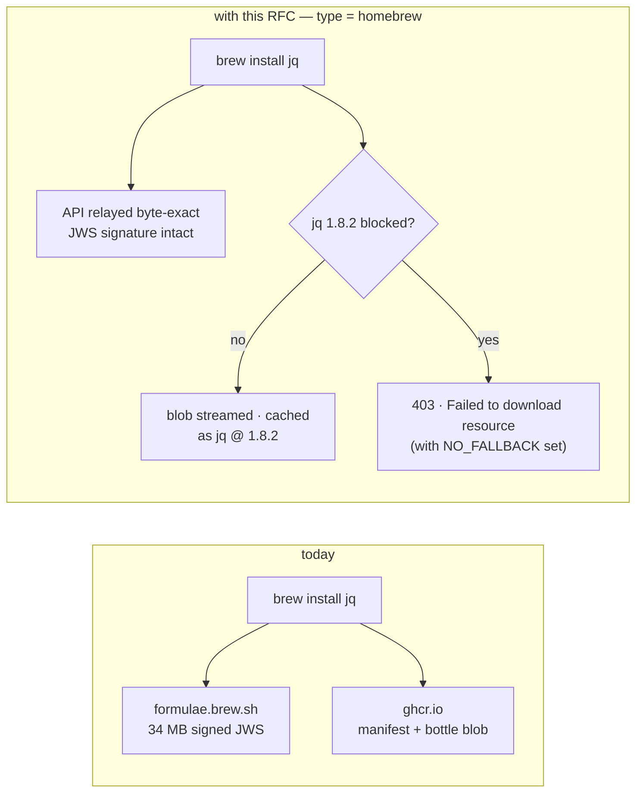
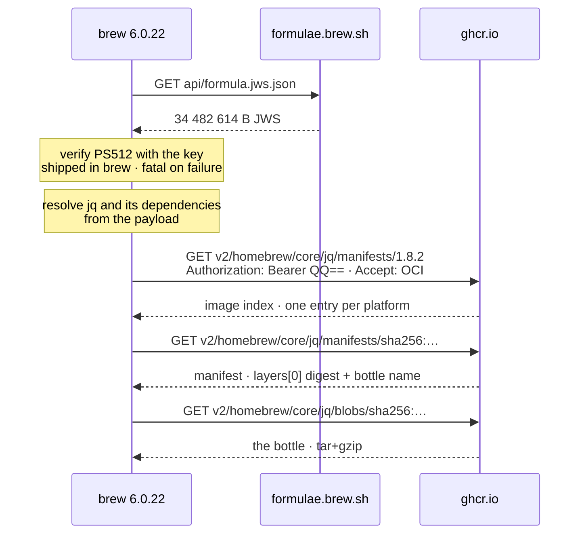
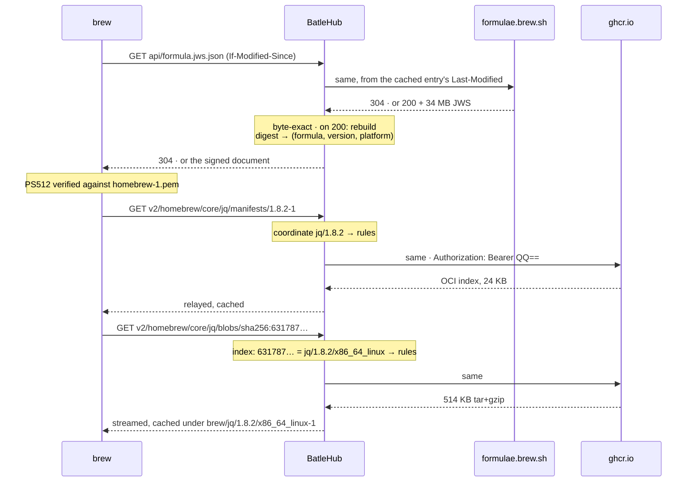
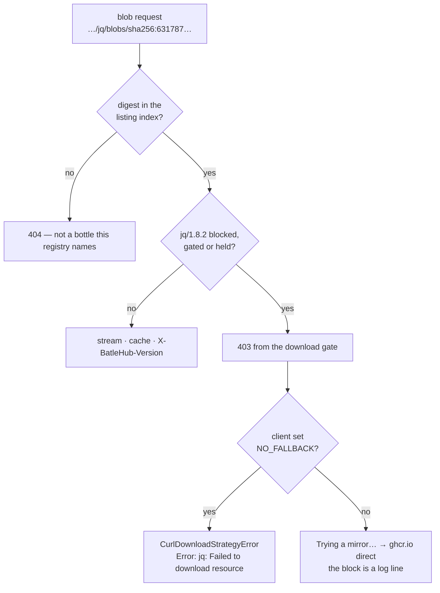

# RFC 0027 — Homebrew: the JSON API and the bottle store

| Field       | Value                                                        |
| ----------- | ------------------------------------------------------------ |
| Status      | Draft                                                         |
| Short       | Homebrew                                                      |
| Settles     | Proxying brew's signed JSON API byte-exact and its GitHub Packages bottles as a typed registry, with the download gate as the only enforcement point and the mirror fallback that would turn a refusal into a bypass |
| Author      | Max Batleforc <maxleriche.60@gmail.com>                       |
| Co-author   | Claude Fable 5.1 <noreply@anthropic.com>                      |
| Created     | 2026-09-11                                                    |
| Supersedes  | —                                                             |
| Touches     | `crates/core`, `crates/config`, `crates/adapters`, `crates/web`, `server`, `ui`, `docs` |

---

## 1. Summary

`brew install jq` is two conversations with two hosts. The first is with the
**JSON API** at `formulae.brew.sh/api`: one 34 MB document, `formula.jws.json`,
describing every formula in `homebrew/core`, signed by Homebrew and refreshed
by every client at most once every 450 seconds. The second is with **GitHub
Packages** at `ghcr.io/v2/homebrew/core`: an OCI image index per formula
version and one blob per platform, fetched anonymously. Nothing in BatleHub
proxies either today; a `generic` registry could cache the second host and
enforce nothing on it, and could not serve the first at all.

`type = "homebrew"` serves both under one registry. The API documents are
relayed **byte-exact**: the bulk files are JSON Web Signatures that brew
verifies with an RSA key shipped inside itself, a failure is fatal and there
is no switch to skip it, so a filtered listing cannot exist. Enforcement
therefore lives entirely at the bottle: every manifest and every blob is
resolved to a `(formula, version)` coordinate — the blob through an index the
proxy builds from the very listing it cannot edit — and the download gate
refuses what is blocked. `brew` then fails on its own download error, with
nothing poured.

Two facts about brew shape the rest, and the roadmap entry that sketched this
kind had one of them wrong:

- **Every mirror variable falls back.** `HOMEBREW_BOTTLE_DOMAIN` retries
  `ghcr.io` on any failure with no way to say otherwise; `HOMEBREW_API_DOMAIN`
  retries `formulae.brew.sh` once. Only `HOMEBREW_ARTIFACT_DOMAIN` paired with
  `HOMEBREW_ARTIFACT_DOMAIN_NO_FALLBACK` makes a refusal final. The registry
  page leads with that pair, and the heavy suite proves a `403` stays a `403`.
- **Casks and source tarballs cannot be routed through this proxy at all.**
  The roadmap said `HOMEBREW_ARTIFACT_DOMAIN` prefixes every download URL and
  would need an allowlist; brew 6.0.22's code rewrites only `ghcr.io` URLs and
  leaves every vendor URL untouched. There is no open relay to guard because
  there is no relay: a cask leaves the site regardless, and the RFC says so
  rather than designing for a switch that does not exist.

### Before / after

```text
# today — nothing proxies brew; a `generic` on ghcr.io could cache blobs
#   it cannot name, and nothing can serve the signed API

# with this RFC
[[registries]]
name = "brew"
type = "homebrew"
mode = "proxy"
#   block "jq" at "1.8.2"  →  brew install jq
#     Error: jq: Failed to download resource "jq"
#     Download failed: https://batlehub…/homebrew/v2/homebrew/core/jq/blobs/sha256:631787…

export HOMEBREW_API_DOMAIN="https://batlehub.example.com/proxy/brew/homebrew/api"
export HOMEBREW_ARTIFACT_DOMAIN="https://batlehub.example.com/proxy/brew/homebrew"
export HOMEBREW_ARTIFACT_DOMAIN_NO_FALLBACK=1
```



Two hosts before, two routes after, and the fork is at the **blob** rather
than at the listing or the manifest — which §4.4 and §5.3 spend their length
on, because every other candidate for that fork is a place brew retries.

---

## 2. Motivation

1. **The fleet's `brew` traffic is invisible and unmediated.** A developer
   laptop and a Linux CI runner both resolve every formula through
   `formulae.brew.sh` and pour every bottle from `ghcr.io`. Neither host is a
   registry BatleHub knows, so the cache, explore, statistics and every rule
   in `crates/core/src/rules/` see none of it. `generic` cannot even cache
   the API: `formula.jws.json` is revalidated with `If-Modified-Since` and
   34 MB per miss, and a path-addressed cache with no `304` answer would
   hand every client the whole file every 450 seconds.

2. **A formula cannot be refused.** When a bottle turns out to be bad — a
   miscompiled `openssl`, a `curl` with a live CVE — an operator today has no
   lever between "every machine pours it" and "block `ghcr.io` at the
   firewall". The bottle store has a coordinate in every manifest path, and
   the gate that reads coordinates exists; nothing connects them.

3. **The listing is the one document that cannot be filtered, and the naive
   design edits it anyway.** `Homebrew::API.verify_and_parse_jws` (`api.rb`)
   checks a `PS512` signature against `api/homebrew-1.pem`, and on failure
   `odie`s with *"Potential MITM attempt detected"*. No environment variable
   skips it. The `nodedist`/`sdkman` pattern of removing a blocked version
   from the listing (RFC 0010 §5.3) is not available here, and a kind that
   assumed it would break every `brew update` on the fleet.

4. **A refusal that is not final is a bypass.** `Bottle#fallback_on_error?`
   (`bottle.rb`) answers any `DownloadError` on a custom bottle domain with
   *"Bottle missing, falling back to the default domain…"* and retries
   `ghcr.io`. `CurlDownloadStrategy#fetch` interleaves the artifact-domain URL
   with the original and prints *"Trying a mirror…"* unless
   `HOMEBREW_ARTIFACT_DOMAIN_NO_FALLBACK` is set. A proxy that answers `403`
   to a client configured the obvious way has changed nothing; the design
   has to name the one configuration under which it has.

5. **The blob has no version in its path.** `…/jq/blobs/sha256:631787…` is
   what brew fetches, and the manifest fetch that precedes it is *optional*:
   `FormulaInstaller#fetch_bottle_tab` rescues `DownloadError` and does
   nothing, because the blob URL and its checksum come from the API JSON, not
   the manifest. Refusing the manifest refuses nothing. The gate needs a
   coordinate for the blob, and the only place it exists is the listing.

6. **Homebrew's own provenance check is orthogonal, and worth not breaking.**
   `HOMEBREW_VERIFY_ATTESTATIONS` runs `gh attestation verify <bottle>
   --repo Homebrew/homebrew-core` against `github.com` on the cached file
   (`attestation.rb`, `formula_installer.rb:1619`). A proxy that changes bytes
   would trip it; a proxy that relays them keeps it, and says so.

---

## 3. Goals / non-goals

**Goals**

- `brew install`, `brew upgrade` and `brew update` work through the proxy with
  three exported variables, with the API cached and revalidated so a fleet of
  clients costs one 34 MB fetch per upstream change, not one per client.
- Every bottle served is cached under a `(formula, version, platform)`
  coordinate that explore, statistics, retention and dedup can see.
- A blocked formula version is refused at the bottle, and `brew` fails on its
  own download error — provided the client is configured as the page says.
- The signed API documents reach the client byte-exact, so `brew`'s JWS check
  and its attestation check both keep working.
- `ReleaseAgeGateRule` gets a date where one exists, and the registry says
  where none does.
- An authenticated registry is reachable: brew has a bearer-token variable
  for the bottle host and a `curlrc` hook for the API host, and both are
  documented as the way in.

**Non-goals**

- **`local`/`hybrid` mode.** No publish protocol; `supports_local_mode()`
  answers `false` as it does for `nodedist` and `sdkman`.
- **Filtering, repairing or re-signing the API documents.** The signature is
  Homebrew's, `PS512` needs `rsa` which `deny.toml` bans, and a document that
  fails the check is fatal on the client. Relay or nothing.
- **Casks and source builds.** Their download URLs are vendor hosts that no
  brew variable routes through a mirror (§4.4). `cask.jws.json` is relayed so
  `brew` keeps working; the `.dmg` behind it never touches this instance.
- **Third-party taps.** `HOMEBREW_ARTIFACT_DOMAIN` rewrites only
  `ghcr.io/v2/homebrew/core`-shaped URLs into this registry's namespace, so a
  tap bottled elsewhere is out of scope; a tap on `ghcr.io/v2/<org>/<tap>`
  is a second registry with a different `bottle_url`, which is §11 q2.
- **`HOMEBREW_NO_INSTALL_FROM_API`.** The git-checkout path clones
  `homebrew-core` and never touches the API; bottles still come from ghcr and
  still work through this kind, but the listing does not exist for such a
  client.
- **An OCI registry.** Two read-only endpoints for one namespace — manifests
  by tag, blobs by digest, anonymous — are what this serves. There is no
  `/v2/` catalogue, no push, no token service, no cross-namespace mount. The
  roadmap's *Not planned: Docker / OCI artifacts* note stands, and §8 says
  why this is not the thin end of it.
- **Portable Ruby as a formula.** `brew`'s own bootstrap fetches
  `ghcr.io/v2/homebrew/core/portable-ruby/blobs/sha256:…` through the
  artifact domain (`cmd/vendor-install.sh`); it is served, cached and never
  blockable (§4.3), because it is not in the listing and has no version but
  its digest.

---

## 4. User-facing design

### 4.1 Configuration

```toml
[[registries]]
name       = "brew"
type       = "homebrew"
mode       = "proxy"                                 # the only mode: no publish protocol
upstreams  = ["https://formulae.brew.sh/api"]        # the JSON API root; the default
bottle_url = "https://ghcr.io/v2/homebrew/core"      # the bottle namespace; the default

[registries.rbac]
# The API documents are listings (`releases:list`); manifests and blobs are
# reads (`releases:read`). An install needs both.
anonymous = ["releases:read", "releases:list"]

# An age gate here must say what it does with a coordinate that has no date:
# every bottle has one (the manifest's created annotation); portable-ruby
# and a bottle whose manifest is unreachable do not.
[[registries.rules]]
kind                   = "release_age_gate"
min_age_secs           = 86400
deny_missing_timestamp = false
```

- `upstreams` absent means `https://formulae.brew.sh/api`. The value is the
  API root; the registry appends `formula.jws.json`, `formula/{name}.json`
  and the rest.
- `bottle_url` is the second base, kind-specific, in the shape of `sdkman`'s
  `broker_url` (RFC 0010 §6.3): a registry pointed at an internal ghcr
  pull-through or a different namespace sets it; everything else leaves it.
- `warm_platforms` reuses RFC 0010's field with bottle tags as values
  (`x86_64_linux`, `arm64_sonoma`); absent means the tag for the platform
  this server runs on, derived the way `nodedist` derives its own.
  `warm_packages = ["jq"]` warms the one version the listing has.

### 4.2 The client side

```bash
# The API: formula.jws.json, cask.jws.json, the per-formula documents
export HOMEBREW_API_DOMAIN="https://batlehub.example.com/proxy/brew/homebrew/api"
# Bottles: manifests and blobs, rewritten from ghcr.io by brew itself
export HOMEBREW_ARTIFACT_DOMAIN="https://batlehub.example.com/proxy/brew/homebrew"
# Without this, a refusal from the proxy is retried against ghcr.io directly
export HOMEBREW_ARTIFACT_DOMAIN_NO_FALLBACK=1

brew update              # formula.jws.json through the proxy, 304 when unchanged
brew install jq          # the manifest, then the x86_64_linux blob, cached
```

**Why `HOMEBREW_ARTIFACT_DOMAIN` and not `HOMEBREW_BOTTLE_DOMAIN`.** Both land
on the same route (§4.3). They differ in what a failure means:

| Variable | On a `403` from the proxy | Off switch |
| --- | --- | --- |
| `HOMEBREW_BOTTLE_DOMAIN` | `Bottle#fetch` → `fallback_on_error?` → *"Bottle missing, falling back to the default domain…"* → `ghcr.io` | none |
| `HOMEBREW_ARTIFACT_DOMAIN` | `CurlDownloadStrategy#fetch` tries `[artifact_url, original_url]` → *"Trying a mirror…"* → `ghcr.io` | `HOMEBREW_ARTIFACT_DOMAIN_NO_FALLBACK` |

With the first, a block is a log line the user never reads. With the second
and its switch, `urls = artifact_urls` and a `CurlDownloadStrategyError` is
the end of the install. The page states it in the first paragraph; the
console snippet exports all three lines together, never the first two alone.

**The API domain falls back too, and that is tolerable.**
`Homebrew::API.fetch_json_api_file` retries the default domain once when the
mirror fails (`api.rb:105–116`), then falls back to the cached copy with
*"update failed, falling back to cached version"*. The document is relayed
unfiltered, so a client that reads it from `formulae.brew.sh` has lost the
cache, not a policy. In an air-gapped estate the fallback is one failed
egress attempt per 450 seconds and then the cached file, which is the
behaviour RFC 0008 wants from a client that cannot reach upstream.

**Authentication.** `brew` attaches `Authorization: Bearer QQ==` — the
anonymous token GitHub Packages accepts for public packages, `"A"` in base64 —
to every ghcr request, *except* when `HOMEBREW_ARTIFACT_DOMAIN` is set and no
Docker registry token is
(`CurlGitHubPackagesDownloadStrategy#initialize`). Two consequences:

- The proxy never receives brew's token and never forwards one; it sends
  `Bearer QQ==` upstream itself, and answers a `401` from ghcr by the
  standard `WWW-Authenticate: Bearer realm=…` exchange for the `pull` scope
  (§6.4), so an anonymous token ghcr stops honouring does not take the
  registry down.
- An authenticated BatleHub registry is reached with
  `HOMEBREW_DOCKER_REGISTRY_TOKEN=<BatleHub token>`: brew then sends
  `Authorization: Bearer <token>` to the artifact domain, which is exactly
  what the auth middleware reads. The API host is `curl` with `--disable`;
  `HOMEBREW_CURLRC=/etc/brew.curlrc` names a file whose one line is
  `--netrc`, and the `~/.netrc` entry the other registry pages describe
  covers it. Both go on the page; neither is a header the user types.

### 4.3 Coordinates

| Request (under `…/proxy/{reg}/homebrew/`) | `PackageId` | Cache key |
| --- | --- | --- |
| `api/formula.jws.json` | registry-wide, version unused | metadata, `versions` |
| `api/cask.jws.json` | registry-wide | metadata, `casks` |
| `api/formula_tap_migrations.jws.json`, `api/cask_tap_migrations.jws.json` | registry-wide | metadata, `migrations:formula` / `migrations:cask` |
| `api/formula/jq.json`, `api/cask/firefox.json` | `jq` / `firefox`, version unused | metadata, `formula` / `cask` |
| `v2/homebrew/core/jq/manifests/1.8.2-1` | `jq` / `1.8.2` / `manifest:1.8.2-1` | `brew/jq/1.8.2/manifest-1.8.2-1.json` |
| `v2/homebrew/core/jq/blobs/sha256:631787…` | `jq` / `1.8.2` / `x86_64_linux` *(resolved through the listing index)* | `brew/jq/1.8.2/x86_64_linux-1.bottle.tar.gz` |
| `v2/homebrew/core/openssl/3/manifests/3.5.1` | `openssl@3` / `3.5.1` / `manifest:3.5.1` | `brew/openssl@3/3.5.1/manifest-3.5.1.json` |
| `v2/homebrew/core/portable-ruby/blobs/sha256:ab12…` | `portable-ruby` / `sha256:ab12…` / `blob` | `brew/portable-ruby/sha256:ab12…/blob` |

**One package per formula, one version at a time.** The API carries
`versions.stable` and nothing older; `homebrew/core` has no version history
a client can install from. The version coordinate is the `pkg_version` —
`1.8.2`, or `1.8.2_1` after a formula revision — and the OCI tag adds the
bottle rebuild: `GitHubPackages.version_rebuild` renders `1.8.2-1` for
rebuild 1 and `1.8.2` for rebuild 0. A rebuild is the same version poured
again and lives in the artifact name, so a block on `1.8.2` blocks every
rebuild of it. Blocking a version here means blocking the formula until
upstream bumps it, which is closer to `DenyLatestRule`'s posture than to a
block list's; the block list already answers a package coordinate with no
version (`BlockListRule::evaluate` tries the broader coordinate after the
exact one), so "never `jq`" is one admin call and "not this `jq`" is another.

**The image name is the formula name, transformed.**
`GitHubPackages.image_formula_name` maps `@` to `/` and `+` to `x`, so
`openssl@3` is `openssl/3/manifests/3.5.1` and `gtk+3` is `gtkx3`. The route
takes the whole tail after `v2/homebrew/core/` and splits on the last
`/manifests/` or `/blobs/`; the formula name is recovered by the inverse map,
which is unambiguous because a formula name cannot contain `/`, and a name
with a literal `x` that was once a `+` is resolved against the listing
(`gtkx3` is not a formula; `gtk+3` is).

**The blob's coordinate comes from the listing.** The proxy indexes the
cached `formula.jws.json` into `digest → (formula, pkg_version, rebuild,
platform tag)` from each formula's `bottle.stable.files[tag].sha256` — the
digest in the blob URL *is* that checksum (jq's `x86_64_linux` entry names
`sha256:631787…` in both fields). A blob whose digest the index does not
know is a `404`: it is not a bottle of any formula the registry serves. The
one exception is `portable-ruby`, brew's own runtime, which is not a formula
and whose only version is its digest; it is a package whose version is its
content hash, the arrangement RFC 0019 reached for a commit.

### 4.4 Behaviour rules

**The API documents are relayed byte-exact, with brew's own revalidation.**
brew fetches `formula.jws.json` with `--time-cond <cached file>` — an
`If-Modified-Since` — at most once every `HOMEBREW_API_AUTO_UPDATE_SECS`
(450) seconds per client. The route forwards the conditional and answers
`304` from the cached entry's `Last-Modified` when upstream has not moved,
so a fleet costs upstream one download per change. The body, when sent, is
the cached bytes: same signature, same payload, same `Content-Type`
(`application/json; charset=utf-8`). `cask.jws.json` (20 MB) and the two
tap-migration files are treated identically. Nothing is parsed on the
serving path; the index of §4.3 is built on refresh, off the request.

**The per-formula documents are the per-package view.** `formula/{name}.json`
is 4 KB, unsigned and carries the same `versions`, `bottle` and `urls` blocks
as the bulk entry, plus the analytics counters. It is what `upstream_detail`
reads and what the console's package page shows; it is relayed as fetched.

**A manifest is refused when its coordinate is blocked; a blob likewise.** The
manifest fetch is `fetch_bottle_tab`, wrapped in `rescue DownloadError;
# do nothing`, so a `403` there costs brew the tab and nothing else; the blob
fetch is the one that fails the install. Both are refused, because the
manifest carries `sh.brew.tab` (runtime dependencies, the compiler, the
built-on OS) and there is no reason to hand out the description of a
bottle that will not be served.

**What the client prints, under the configuration the page prescribes.** With
`HOMEBREW_ARTIFACT_DOMAIN_NO_FALLBACK` set, a `403` on the blob is a
`CurlDownloadStrategyError`, and brew ends with *Error: jq: Failed to
download resource "jq"* followed by the URL. brew does **not** fall back to
building from source: `pour_bottle?` is decided before the fetch and a
failed bottle download raises through `FormulaInstaller#fetch`. Without the
switch, the same `403` prints *"Trying a mirror…"* and pours from `ghcr.io`.
The page carries both sentences.

**Casks and sources bypass the proxy, and the registry says so.**
`CurlDownloadStrategy#fetch` rewrites a URL only when it matches
`^https?://ghcr.io/` (`curl_download_strategy.rb:48–64`); a cask's
`download-installer.cdn.mozilla.net/…/Firefox 155.0.1.dmg` and a formula's
source tarball on `github.com/…/releases/download/…` are fetched as written.
`env_config.rb` still describes a general prefix — *"a formula with the URL
`https://example.com/foo.tar.gz` will instead download from
`http://localhost:8080/https://example.com/foo.tar.gz`"* — and the code no
longer does it; the RFC follows the code. Consequently `cask.jws.json` is
served for `brew`'s sake and a cask install is egress this registry neither
sees nor mediates. The registry page states it in its second paragraph, so
an operator who reads "Homebrew is proxied" does not believe the `.dmg` is.

**The uninteresting case.** Nothing blocked, default upstreams, no rules: a
manifest and a blob are streamed and cached on first request and served from
storage after; the bulk API is fetched once and answered `304` until upstream
publishes; explore lists every formula with its one version and the
platforms held. The proxy adds `Bearer QQ==` upstream and strips nothing.

**Blobs are content-addressed twice.** The blob's storage key is per
coordinate so statistics and retention work per formula, and the storage
layer's dedup already stores identical bytes once (`artifact_dedup_index`),
which matters here because an `:all`-tagged bottle is one blob named by
every platform entry. brew's own `immutable_bottle_blob?` skips a download
whose cached name carries the digest, so the second `brew install` on a
machine asks the proxy for nothing; the second *machine* asks and hits the
cache.

### 4.5 Validation

`AppConfig::validate()` rejects:

| Condition | Rationale |
| --- | --- |
| `type = "homebrew"` with `mode = "local"`/`"hybrid"` | No publish protocol; `supports_local_mode()` already produces this error for `generic`, `nodedist` and `sdkman`. |
| `bottle_url` on a registry whose type is not `homebrew` | The `broker_url`/`index_url` rule: a silently ignored option looks like a proxy bug. |
| `bottle_url` that is not an absolute `http`/`https` URL, or whose path does not end in `/v2/{org}/{repo}` | It is joined with `{image}/manifests/{tag}`; a base without the namespace produces URLs ghcr answers `404` to, at install time rather than at boot. |
| `path_allow` on a `homebrew` registry | Not path-addressed; the existing validator refuses it on every such kind. |
| A `release_age_gate` rule with no explicit `deny_missing_timestamp` | Bottles carry a date; `portable-ruby` and a bottle whose manifest could not be read do not. RFC 0010 §6.7's rule: the field decides the gate and must be chosen. |
| `upstreams` entry whose path ends in `/formula.jws.json` or `/api/formula` | The value is the API root. Rejected with the fix named, because the roadmap's own example is the likely source of the mistake. |

Warnings (logged and surfaced to the admin):

| Condition | Behaviour |
| --- | --- |
| A non-default `bottle_url` whose namespace is not `homebrew/core` | Served as given, warned once at reload: brew rewrites only `ghcr.io/…` URLs into the artifact domain, so a client will reach this namespace only if the listing's `root_url` names it. |
| `warm_platforms` entry that is not a bottle tag the listing knows | Warming reports "no such platform" per entry; the config is not refused, because a tag can appear upstream before it appears here. |

---

## 5. Architecture

### 5.1 The protocol as Homebrew really serves it

No proxy in this subsection. Every number was observed against
`formulae.brew.sh` and `ghcr.io` while writing this RFC; the client behaviour
is read from brew 6.0.22.

| Request | Answers | Type · size | What brew does with it |
| --- | --- | --- | --- |
| `formulae.brew.sh/api/formula.jws.json` | every formula in `homebrew/core`, as a JWS | `application/json` · **34 482 614 B** | `brew update`: verifies the PS512 signature, parses the payload, replaces its local cache |
| `formulae.brew.sh/api/cask.jws.json` | every cask | `application/json` · 20 453 773 B | the same, for casks |
| `formulae.brew.sh/api/{formula,cask}_tap_migrations.jws.json` | renames and tap moves | | read on update, never on install |
| `ghcr.io/v2/homebrew/core/{formula}/manifests/{version}` | the OCI index for that release | `application/vnd.oci.image.index.v1+json` · 15 933 B for `wget` 1.25.0 | picks the entry whose `platform.os`/`platform.architecture` match the host |
| `ghcr.io/v2/homebrew/core/{formula}/manifests/sha256:{digest}` | one platform's manifest | `application/vnd.oci.image.manifest.v1+json` · 2 678 B | reads `layers[0].digest`, and the bottle's file name from that layer's `org.opencontainers.image.title` annotation |
| `ghcr.io/v2/homebrew/core/{formula}/blobs/sha256:{digest}` | the bottle | `application/vnd.oci.image.layer.v1.tar+gzip` · 1 616 304 B for `wget--1.25.0.arm64_sequoia` | pours it into the Cellar |

**The listing is one document for the whole tap, and it is 34 MB.** There is no
per-formula listing in the install path and no version index: the JWS payload
carries every formula's current version, its dependencies and its bottle
digests per platform. Two consequences the design has to live with — a
registry-wide metadata entry rather than a per-package one, and the fact that
`homebrew/core` publishes **one version per formula**, so the document names no
history to pick an older release from.

**The API is signed and the signature is fatal.** The JWS is PS512 over the
payload, with an RSA key shipped inside `brew` itself; a body that does not
verify is *"Potential MITM attempt detected"* and the update stops. There is no
flag to skip it. That is why §4.4 relays the document byte-exact and hides no
version in it.

**ghcr is two read endpoints, and it needs a token even when it is anonymous.**
Observed: a blob request with no `Authorization` header answers `401` with 73
bytes of JSON; the same request with `Authorization: Bearer QQ==` — `"A"` in
base64, the anonymous token GitHub Packages accepts for public packages — is
served. The manifest request additionally needs an `Accept` naming the OCI
media types, or ghcr negotiates something else.

**What brew verifies.** The JWS signature on the API document; the bottle
against the `sha256` in the manifest layer's digest, which is also how it is
addressed. Bottle *attestations* (`HOMEBREW_VERIFY_ATTESTATIONS`, Sigstore via
`gh`) are checked against GitHub, never against the mirror, and are untouched
by anything here.

**The spellings.** A formula is a lower-case name, possibly with a tap prefix;
the ghcr repository is `homebrew/core/{formula}`; a bottle tag is
`{formula}--{version}.{platform}.bottle.tar.gz` where the platform is a macOS
codename (`arm64_sequoia`, `ventura`) or `x86_64_linux`; the manifest tag is
the plain version. A digest is `sha256:` followed by 64 hex characters, and it
is both the address and the checksum.



One install is one listing read, then three ghcr requests per formula, of which
only the last carries bytes worth caching. Nothing in the chain names a version
the server interprets, and nothing but the blob is large.

### 5.2 One install, two hosts, one gate



The invariant: **everything the bottle route serves has been resolved to a
coordinate through the signed listing before the gate sees it.** The listing
cannot be edited, but it can be read, and reading it is what turns a
digest-addressed blob into something a rule can judge. A blob the listing
does not name is not served, so there is no path by which unnamed bytes reach
a client through this registry.

### 5.3 Where a refusal becomes final



The invariant, and its honest limit: the proxy's answer is the same in both
branches; what differs is the client. This registry cannot make a refusal
final on its own, which is why §4.2's three exports are one snippet and the
heavy suite runs the `403` case with the switch **unset** as well as set, so
the bypass is observed and not merely predicted.

### 5.4 What is relayed and what is derived

| Document | Treatment | Why |
| --- | --- | --- |
| `formula.jws.json`, `cask.jws.json`, `*_tap_migrations.jws.json` | **Byte-exact**, `304`-revalidated | Signed; a changed byte is fatal on the client |
| `formula/{name}.json`, `cask/{token}.json` | Byte-exact | Unsigned, but there is nothing to edit: it lists one version |
| OCI index (`manifests/{tag}`) | Byte-exact, gated | brew reads `sh.brew.tab` from it; digest-checked by ghcr's own `Docker-Content-Digest` |
| Blob | Byte-exact, gated, resolved | brew verifies it against the listing's `sha256`; attestation verifies the same file |
| The digest index | **Derived**, in memory, from the bulk listing on refresh | The gate's only source of a coordinate for a blob |

Nothing is composed and nothing is signed. The design is the reverse of
RFC 0024's: there, the listing was edited and its checksum recomputed; here,
the listing is untouchable and is instead *read* to give the artifacts an
identity.

---

## 6. Detailed design

### 6.1 `crates/core` — the registry kind

`RegistryKind::Homebrew` is added to the enum and to `ALL`; the wildcard-free
matches (`registry_kind.rs`, `upstream_detail`, `blocking`,
`listing_synthesis`, `builders.rs`) refuse to compile until answered.
`supports_local_mode() = false`, `requires_explicit_upstream_in_proxy_mode() =
false`, `is_path_addressed() = false`; the rest:

| | `homebrew` |
| --- | --- |
| `listing_filter()` | **Empty slice** — the protocol's listings are signed and cannot be filtered. `docs:listing-coverage` renders that as the honest row it is, beside `generic`'s. |
| `readme_support()` | `None("a formula document carries a one-line description and a homepage, not prose")` |
| `upstream_detail()` | `Document("formula")` — `formula/{name}.json`: the one version, its bottle platforms, the source URL and the analytics counters |
| `fetchable_by_version()` | `None("a bottle needs a platform tag as well as a version; the tag is not a constant")` |
| `warm_artifact()` | `Some` — for each `warm_platforms` tag, the blob the listing names for it |
| `blocking_package_name()` | identity |

`DocumentKind` gains `CASKS = Secondary("casks")`, `MIGRATIONS_FORMULA`,
`MIGRATIONS_CASK`, `FORMULA = Secondary("formula")` and
`CASK = Secondary("cask")`. `Versions` is `formula.jws.json`, registry-wide
(`listing_synthesis::is_registry_wide` answers `true` for it, as it does for
RubyGems' compact index).

### 6.2 `crates/core` — `services/homebrew.rs`

- `image_name(formula) -> String` and `formula_name(image) -> String`, the
  `@`/`/` and `+`/`x` maps of `GitHubPackages.image_formula_name`, with the
  inverse resolved against the listing for the `x` ambiguity (§4.3).
- `BottleRef::parse(tail) -> Result<BottleRef>` — splits the route tail into
  `{image}` and `Manifest(tag)` / `Blob(digest)`, validating the tag against
  brew's `VALID_OCI_TAG_REGEX` shape and the digest as `sha256:[0-9a-f]{64}`.
  A tail with neither `/manifests/` nor `/blobs/` is a `400`.
- `PkgVersion::parse("1.8.2-1") -> (version: "1.8.2", rebuild: 1)` — the
  inverse of `GitHubPackages.version_rebuild`; the version keeps a `_N`
  revision suffix as part of itself.
- `BottleIndex` — built by `BottleIndex::from_listing(&[u8])` with a
  streaming JSON reader over the JWS `payload` string (the payload is a
  JSON-encoded string inside the JWS object; it is decoded once into the
  array of formulae). For each formula: `name`, `versions.stable`,
  `revision`, `bottle.stable.rebuild`, and each `bottle.stable.files[tag]
  .sha256`. Lookup is `digest -> BottleEntry { formula, pkg_version,
  rebuild, tag }`. Roughly 7 000 formulae and 60 000 digests; tens of
  megabytes of source, a few megabytes of index, rebuilt only when the cached
  listing changes.
- `published_at` for a bottle is the OCI index's
  `org.opencontainers.image.created` annotation, read when the manifest is
  fetched and cached with it; a blob served before its manifest was ever
  requested fetches the manifest for the date (one 24 KB request, once). This
  is the "bottle whose manifest could not be read" case of §4.5: the date is
  `None` only when ghcr refuses the manifest and serves the blob.

### 6.3 `crates/config`

- `RegistryConfig::bottle_url: Option<String>`, documented as Homebrew-only,
  beside `broker_url`.
- The §4.5 rejections beside the existing `broker_url`/`index_url` checks.
- `CURRENT_CONFIG_VERSION` does **not** move.

### 6.4 `crates/adapters` — `registry/homebrew/`

A directory, per `CLAUDE.md`'s rule: two hosts, a token exchange and an index
built from a 34 MB document would crowd a flat file.

- `client.rs` — `HomebrewRegistryClient { http, api_base, bottle_base, … }`.
  - `fetch_version_document(pkg, kind)` → the API documents, relayed with
    upstream's `Last-Modified` and `ETag` kept on the cached entry, so the
    handler can answer `304`. `Versions` triggers `BottleIndex` rebuild on a
    changed body, behind an `ArcSwap` the handlers read.
  - `resolve_metadata(pkg)` → for a formula coordinate, the listing entry
    (exists, one version, `published_at` from the cached manifest when
    held); for `portable-ruby`, a `HEAD` on the blob.
  - `fetch_artifact(pkg)` → the manifest or the blob from `bottle_base`, with
    `Authorization: Bearer QQ==` and `Accept:
    application/vnd.oci.image.index.v1+json` on manifests. A `401` with
    `WWW-Authenticate: Bearer realm="https://ghcr.io/token",service="ghcr.io",
    scope="repository:homebrew/core/jq:pull"` is answered by fetching the
    realm with `service` and `scope`, caching the token by scope for its
    `expires_in`, and retrying once. ghcr answers blobs with `200` directly
    today, no redirect; any redirect that appears goes through
    `ssrf::fetch_following_redirects` as SDKMAN's broker does.
  - `list_versions(formula)` → the one `pkg_version` the index holds.
- `models.rs` — `ReleaseEntry` (the subset of a formula entry the index
  reads), `TokenResponse`, and the OCI index's annotation names as constants.
- `tests.rs` — `mockito`, spanning both files, per the standalone-`tests.rs`
  exception: the token exchange, the index build from a trimmed real
  `formula.jws.json`, and the `304` path.

The fixture is a real `formula.jws.json` trimmed to twenty formulae with the
signature kept intact — it does not verify against the trimmed payload, and
the tests assert exactly that the proxy never checks it — plus jq's real OCI
index, checked in with the date they were taken.

### 6.5 `crates/web` — handlers and routes

`handlers/proxy/homebrew/`, prefix `/proxy/{registry}/homebrew/`:

| Route | Handler |
| --- | --- |
| `GET api/formula.jws.json` | `api_formulae` — document, `304`-capable |
| `GET api/cask.jws.json` | `api_casks` — document, `304`-capable |
| `GET api/formula_tap_migrations.jws.json`, `GET api/cask_tap_migrations.jws.json` | `api_migrations` — document |
| `GET api/formula/{name}.json` | `api_formula` — per-package document |
| `GET api/cask/{token}.json` | `api_cask` — per-package document |
| `GET v2/homebrew/core/{tail:.*}` | `bottle` — `BottleRef::parse`, then `proxy_stream` on the resolved coordinate |
| `GET v2/{other:.*}` | `404` — a namespace this registry does not serve, refused before any upstream call |

Three obligations from the existing rules:

- **Validate at the edge.** `validate_package_name` on `{name}`/`{token}`;
  `BottleRef::parse` on the tail (image segments through
  `validate_path_safe`, the tag regex, the digest regex); the resolved
  formula name through `validate_package_name` again after the inverse map.
  `validate_coordinate` and `ensure_safe_key` remain the deeper guards.
- **`body = T` on every success response.** The API documents take
  `UpstreamDocument`; `bottle` takes `ArtifactBytes`; the `304` is declared
  as a response with no body.
- **Route ordering.** `api/formula.jws.json` before `api/formula/{name}.json`
  is not a conflict (different depth), but the conformance fixture asserts
  the matched pattern for both so a future `api/{file}` catch-all cannot
  swallow the per-formula route.

The `bottle` handler is the one place the index is consulted: a blob's
coordinate is `index.lookup(digest)`, and `portable-ruby` is the named
exception; a manifest's coordinate is parsed from its tag. Both then go
through `proxy_stream` with `Action::ReleasesRead`, which is where the gate
and the cache already live.

### 6.6 `server`

`builders.rs`'s exhaustive `match` forces one arm: `HomebrewRegistryClient`
from `resolve_urls(&reg.upstreams, "https://formulae.brew.sh/api")` and
`reg.bottle_url.as_deref().unwrap_or("https://ghcr.io/v2/homebrew/core")`.
No `main.rs` change.

### 6.7 Rules

`BlockListRule` reads the coordinate and needs nothing; its fallback from the
exact coordinate to the package is what makes "never `jq`" expressible.
`DenyLatestRule` never fires: no request names `latest`. `ReleaseAgeGateRule`
reads `published_at` from the manifest's `created` annotation; the mandatory
`deny_missing_timestamp` of §4.5 decides `portable-ruby` and the
manifest-unreachable case, and the page says which way each setting falls.

RFC 0018's verdicts apply at the same gate: a bottle held in quarantine is
refused exactly as a blocked one, and the scan sees the `.tar.gz` bottle
with the `sh.brew.sbom.supplement` annotation available from the manifest —
an input the worker RFC can take up, not this one.

### 6.8 `ui` and `docs`

- `ui/src/config/registryTypes.ts` — a `REGISTRY_TYPE_DEFS` entry labelled
  *Homebrew*, whose setup snippet is the three exports of §4.2 as one block,
  a `~/.netrc` + `HOMEBREW_CURLRC` + `HOMEBREW_DOCKER_REGISTRY_TOKEN` tab for
  authenticated instances, and the server block of §4.1.
- `docs/registries/homebrew.md`, tables generated
  (`task docs:readme-coverage`, `docs:listing-coverage`, `docs:endpoints`),
  and the four sentences the page must carry: the no-fallback pair and what
  happens without it; that casks and source builds are not proxied by any
  brew switch; that the listing is never filtered and a block is a refused
  bottle; and the age-gate consequence for `portable-ruby`.
- `docs/registries/index.md` and the `/registries/` sidebar in
  `docs/.vitepress/nav/en.ts`. `docs/operations/egress.md` gains `ghcr.io`
  and `formulae.brew.sh`, and notes the cask CDNs as egress the proxy does
  not mediate.
- `ROADMAP.md` — the entry's cask sentence is corrected (§13 will say so
  when it lands); `docs/guide/roadmap.md` regenerated.

### 6.9 `cli` — `Brewfile`

`batlehub registry suggest` gains `Brewfile`: `brew "jq"`, `tap "…"`,
`cask "firefox"`. `brew` lines become `warm_packages`; `cask` lines are
reported as not proxied; `tap` lines naming a tap other than `homebrew/core`
are reported as §11 q2. No new platform input: `warm_platforms` comes from
config as it does for the other two toolchain kinds.

### 6.10 `tests/heavy/brew.sh`

A heavy suite, `config.brew.toml` beside it, `task test:brew-heavy`, and a row
in the `heavy-client` matrix. brew is on the GitHub runner image (Linuxbrew
at `/home/linuxbrew/.linuxbrew`), and the script records `brew --version` in
the transcript and fails when it drifts below the version §4.4 was read from;
the suite sets `HOMEBREW_CACHE` and
`HOMEBREW_TEMP` into the run's temp directory and `HOMEBREW_NO_AUTO_UPDATE`
off, so the API fetch is observed. What it proves, on the wire, through the
tap:

1. `brew update` reads `formula.jws.json` through the proxy; a second
   `brew update` (after `HOMEBREW_API_AUTO_UPDATE_SECS=0`) is answered `304`
   and the transcript shows no body.
2. `brew install jq` fetches `jq/manifests/{tag}` and the host platform's blob
   through the proxy, brew reports the checksum matched, and `jq --version`
   answers.
3. With `jq` blocked at its current version and
   `HOMEBREW_ARTIFACT_DOMAIN_NO_FALLBACK=1`, `brew install jq` from a fresh
   `HOMEBREW_CACHE` exits non-zero with *Failed to download resource*, and the
   transcript shows the `403` and no request to `ghcr.io` — the tap sits in
   front of both hosts, so a bypass would be visible.
4. The same with the switch **unset**: the install succeeds, the transcript
   shows *Trying a mirror…* and a request to `ghcr.io`. This is the bypass,
   observed, and it is the sentence on the registry page.
5. A second `brew install jq` from a fresh cache moves
   `batlehub_artifact_cache_hits_total`.
6. `HOMEBREW_VERIFY_ATTESTATIONS=1` with `gh` present: the install through
   the proxy passes attestation, proving the relayed blob is byte-exact.

Everything in §4.4 is read from brew 6.0.22's source at `main` on 2026-09-11;
this script is what turns "read" into "observed".

### 6.11 Air gap (RFC 0008-bis)

A disconnected instance relays the bulk listing it holds — the last
`formula.jws.json` the bundle carried, signature intact, so `brew`'s check
still passes — and serves the bottles that were imported. A formula whose
bottle is not held answers `404` at the blob, and with the no-fallback
switch brew ends on its download error, which is the same behaviour as a
formula whose bottle was never built for that platform. No composition, no
signing: the listing is upstream's and is stale by exactly the bundle's age,
which the page states. This is the row RFC 0008-bis §4's table gains, and it
is phase 6.

**Deliberately untouched**, so reviewers do not go looking:

- `crates/core/src/services/blocking/` — no arm for this kind. There is no
  document to strip, and `listing_filter()`'s empty slice is checked against
  `blocking::strip` by `every_advertised_filter_is_reachable_from_dispatch`
  in the direction that matters: nothing advertised, nothing missing.
- `crates/adapters/src/registry/path_proxy.rs` — the OCI routes are two
  narrow handlers on a fixed namespace, not a path passthrough; reusing the
  generic client would reintroduce the "no coordinate" gap this RFC closes.
- The OpenPGP/JWS question — no `rsa`, no JWS library. The proxy never
  verifies the signature (that is the client's job and the client does it)
  and never produces one.
- `docs/registries/generic.md` — gains no Homebrew example, because a
  `generic` on `ghcr.io` would serve blobs it cannot name and the point of
  this kind is that it can.

---

## 7. Security considerations

- **Trust boundary.** The client verifies the listing's signature against a
  key it ships, and the bottle against a checksum from that listing. Neither
  check involves this instance; both survive it, because the bytes are
  relayed. An instance that altered a blob would fail the client's checksum;
  an instance that altered the listing would fail the client's signature and
  halt it. This is a stronger position than most kinds here: the proxy is a
  cache and a gate, and cannot be a substitution point.
- **What the gate can and cannot do.** It can refuse a bottle; it cannot
  hide one. A blocked formula stays in `brew search` and `brew info`, and
  the refusal surfaces as a download error. The page says so, because an
  operator who expects `nodedist`'s behaviour ("the version disappears")
  will otherwise read the visible entry as a failed block.
- **The refusal is only as final as the client's configuration.** §5.3. The
  registry cannot enforce `HOMEBREW_ARTIFACT_DOMAIN_NO_FALLBACK`; an estate
  that needs the block to hold enforces the variable through its
  configuration management, or blocks `ghcr.io` egress, and the page says
  which mechanism does what.
- **The index is built from a signed document the proxy does not verify.**
  A hostile or compromised upstream could name any digest under any
  formula, and the proxy would serve that blob under that coordinate. The
  client would then reject it: the same listing gave it the checksum, so a
  mismatch between the two is impossible unless the client's copy differs
  from the proxy's — at which point the client's copy came from the fallback
  and the client's own signature check applies. The proxy adds no trust to a
  listing and removes none.
- **Attacker-controlled inputs.** The route tail is parsed into an image
  name, a tag or a digest, each validated to its grammar before it reaches a
  storage key or an upstream URL. The digest is a lookup key into an
  in-memory index and is never interpolated into anything upstream that the
  index did not already contain. `WWW-Authenticate` from ghcr is parsed for
  `realm`, `service` and `scope`; the realm is required to be an `https` URL
  on the bottle host's registrable domain or the exchange is refused, so a
  compromised upstream cannot direct the proxy's token fetch at an internal
  address (the SSRF guard covers the redirect case; this covers the
  challenge case).
- **No credentials cross the boundary.** `Bearer QQ==` is a public constant
  and the only thing sent upstream. A BatleHub token brew presents via
  `HOMEBREW_DOCKER_REGISTRY_TOKEN` is consumed by the auth middleware and
  never forwarded; the token exchange with ghcr's realm carries no
  credentials.
- **No new unauthenticated surface, but a kind that needs one.** As with
  `nodedist` and RFC 0024's `rustup`, a client with no natural header needs
  `anonymous` read on both actions or an authenticating ingress; brew is
  better placed than most, because `HOMEBREW_DOCKER_REGISTRY_TOKEN` is a real
  bearer header for the bottle path, and the page shows it.

---

## 8. Alternatives considered

| Alternative | Why rejected |
| --- | --- |
| A `generic` registry on `ghcr.io/v2/homebrew/core` with `path_allow` | Serves the bytes and names nothing: no version, no explore, no gate, and no `304` for a 34 MB API document it cannot serve at all. This is the "today" of §1. |
| Filter `formula.jws.json` and remove the blocked formula | `PS512` over the payload; the client `odie`s *"Potential MITM attempt detected"* and stops. There is no unverified mode. |
| Re-sign the listing with this instance's key and ship the key to clients | `homebrew-1.pem` is read from `HOMEBREW_LIBRARY_PATH`, not configuration; replacing it means patching every client's brew checkout. And it needs `rsa`, which `deny.toml` bans (RUSTSEC-2023-0071). |
| Recommend `HOMEBREW_BOTTLE_DOMAIN`, the variable named for the job | Its fallback to `ghcr.io` has no off switch (`Bottle#fallback_on_error?`), and it adds ghcr as a `mirror` to the manifest resource. A block becomes a warning line. |
| Refuse the manifest only, and pass blobs through unresolved | `fetch_bottle_tab` rescues the failure and the blob URL comes from the API JSON: the install proceeds. The manifest is not a chokepoint. |
| Resolve blob digests by fetching the manifest on demand instead of indexing the listing | The manifest names the blob but the blob URL does not name the manifest; finding the manifest for a bare digest means guessing the formula, which the URL does give (`…/jq/blobs/…`) but not the version. The listing has both and is already cached. |
| Serve casks and source tarballs through a `{registry}/https://…` relay | brew 6.0.22 rewrites only `ghcr.io` URLs; no client would ever send such a request. A route nobody calls is not a feature. |
| Treat the bottle store as the first OCI registry and generalise | The general case needs a token service, a catalogue, cross-repository mounts, `HEAD`/range semantics, push, and everything Harbor already does. Two anonymous `GET`s under a fixed namespace share none of that machinery, and naming them "OCI" in the config would invite a `docker pull` that gets a `404`. The roadmap's note stands. |

---

## 9. Rollout and compatibility

- **Default behaviour** when not configured: nothing changes; no existing
  kind serves these hosts.
- **Config migration**: none. `bottle_url` is optional; `CURRENT_CONFIG_VERSION`
  stays.
- **Operator prerequisites**: egress to `formulae.brew.sh` and `ghcr.io`
  (blobs are served directly, no CDN redirect today). Metadata storage for
  two documents of 34 MB and 20 MB. `limits.max_artifact_size_bytes` above
  the largest bottle in use — an LLVM bottle is over 1 GB, `jq`'s is 514 KB;
  the page says to size for the fleet's largest formula.
- **Client rollout**: the three exports, in `/etc/profile.d` or the CI job's
  `env:`. `brew update` afterwards fetches the listing through the proxy
  once; already-installed formulae are untouched.
- **Rollback**: remove the registry block and the three exports. Cached
  bottles stay in storage until retention takes them.

---

## 10. Test plan

- **Unit** (`crates/core/src/services/homebrew.rs`): the image-name maps in
  both directions including `openssl@3`, `gtk+3` and a formula with a real
  `x`; `BottleRef::parse` on manifests, blobs, a tail with neither, a
  traversal, an uppercase digest; `PkgVersion::parse` on `1.8.2`, `1.8.2-1`,
  `1.8.2_1-2`; `BottleIndex::from_listing` on the trimmed fixture — every
  `files[tag].sha256` resolves, an unknown digest does not, an `:all` bottle
  resolves once with tag `all`.
- **Adapter** (`crates/adapters/src/registry/homebrew/tests.rs`, `mockito`):
  the `304` path carries upstream's `Last-Modified`; the index is rebuilt on a
  changed body and not on a `304`; `Bearer QQ==` is sent; a `401` challenge
  triggers exactly one realm fetch with `service` and `scope` and a retry; a
  challenge whose realm is not on the bottle host is refused; the manifest
  carries `Accept: application/vnd.oci.image.index.v1+json`; `published_at` is
  the `created` annotation.
- **Integration** (`crates/web/tests/local_homebrew_registry.rs`): the seven
  routes; a blocked formula's manifest and blob both answer `403`; an unknown
  digest answers `404` before any upstream call; `portable-ruby` blobs pass;
  `v2/{other}` answers `404`; a traversal in the tail answers `400`;
  `openapi_contract` sees `body = T` on every success.
- **Conformance** (`crates/web/tests/protocol_conformance.rs`): a `HOMEBREW`
  fixture, each line citing brew 6.0.22 (`api.rb` `fetch_json_api_file`,
  `bottle.rb` `github_packages_manifest_resource`, `curl_download_strategy.rb`
  lines 48–64 for the rewrite, `cmd/vendor-install.sh` for `portable-ruby`).
- **Heavy** (`tests/heavy/brew.sh`): §6.10. Steps 3 and 4 together are the
  load-bearing pair: the refusal, and the bypass.
- **Existing suites** that must pass unchanged: the whole of `crates/web`;
  `every_advertised_filter_is_reachable_from_dispatch` (an empty
  `listing_filter()` is the assertion, not an exemption); `tests/heavy/nvm.sh`
  and `sdkman.sh` for `warm_platforms`.

---

## 11. Decisions and open questions

### Resolved

| # | Question | Decision |
| --- | --- | --- |
| 1 | Which client variable does the page recommend for bottles? | **`HOMEBREW_ARTIFACT_DOMAIN` with `HOMEBREW_ARTIFACT_DOMAIN_NO_FALLBACK`.** It is the only combination in brew 6.0.22 under which a `403` ends the install; `HOMEBREW_BOTTLE_DOMAIN` always falls back. |
| 3 | Is the listing filtered? | **No, never.** Signed, verified by every client, fatal on mismatch, no switch. The kind advertises an empty `listing_filter()` rather than a filter it cannot honour. |
| 4 | Where does a blob get its coordinate? | **From an index over the cached bulk listing**, digest → formula/version/platform. The manifest is optional to the client and not a chokepoint; the listing is what both sides already hold. |
| 5 | Are casks and source tarballs relayed? | **No — they cannot be.** brew rewrites only `ghcr.io` URLs; `env_config.rb`'s description of a general prefix is stale against `curl_download_strategy.rb`. The page says the `.dmg` is not proxied. |
| 6 | Does this reopen OCI? | **No.** Two anonymous reads under a fixed namespace; §8's last row lists what a registry would additionally need, and none of it is built. |
| 7 | How is ghcr authenticated? | **`Bearer QQ==`, as brew does, with the standard realm exchange on a `401`** so the registry survives the anonymous token being withdrawn. No credentials in either path. |

### Still open

2. **Third-party taps with bottles on ghcr** (`ghcr.io/v2/<org>/<tap>`).
   A second registry with `bottle_url` pointed there would serve them, but
   brew's rewrite maps every `ghcr.io/…` URL onto *one* artifact domain, so
   two registries cannot both be reached from one client. The clean answer is
   a namespace-aware route (`v2/{org}/{repo}/…` resolved to a registry by
   namespace) which is a routing question above this kind. Recommendation:
   out of scope for phase 1–5; record the need and revisit when a tap is
   asked for. Not blocking sign-off.

---

## 12. Implementation phases

| Phase | Content |
| --- | --- |
| 1 | `crates/core`: `RegistryKind::Homebrew` and its exhaustive answers, `services/homebrew.rs` (names, `BottleRef`, `PkgVersion`, `BottleIndex`), the new `DocumentKind`s. `crates/config`: `bottle_url` and the §4.5 rules. Lands with phase 2 (a kind with no client fails at startup). |
| 2 | `crates/adapters/src/registry/homebrew/` with the token exchange and the `304` path; `builders.rs`; `handlers/proxy/homebrew/` with the seven routes; the conformance fixture; `local_homebrew_registry.rs`. **Useful on its own**: caching, blocking, gating. |
| 3 | `tests/heavy/brew.sh` with the refusal *and* the bypass observed. Runs before phase 2 is called done. |
| 4 | `cli`: `Brewfile` in `registry suggest`; warming per `warm_platforms` tag. |
| 5 | `ui` entry, `docs/registries/homebrew.md`, sidebar, egress page, the roadmap correction and regenerated page; the §13 revision note. |
| 6 | Air gap: relay the held listing and the held bottles; RFC 0008-bis table row; proven in `tests/heavy/airgap.sh`. Ships on its own. |
