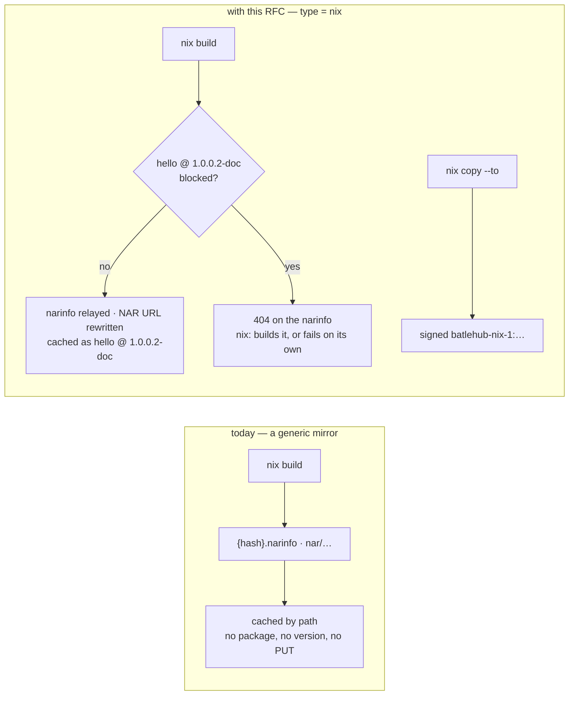
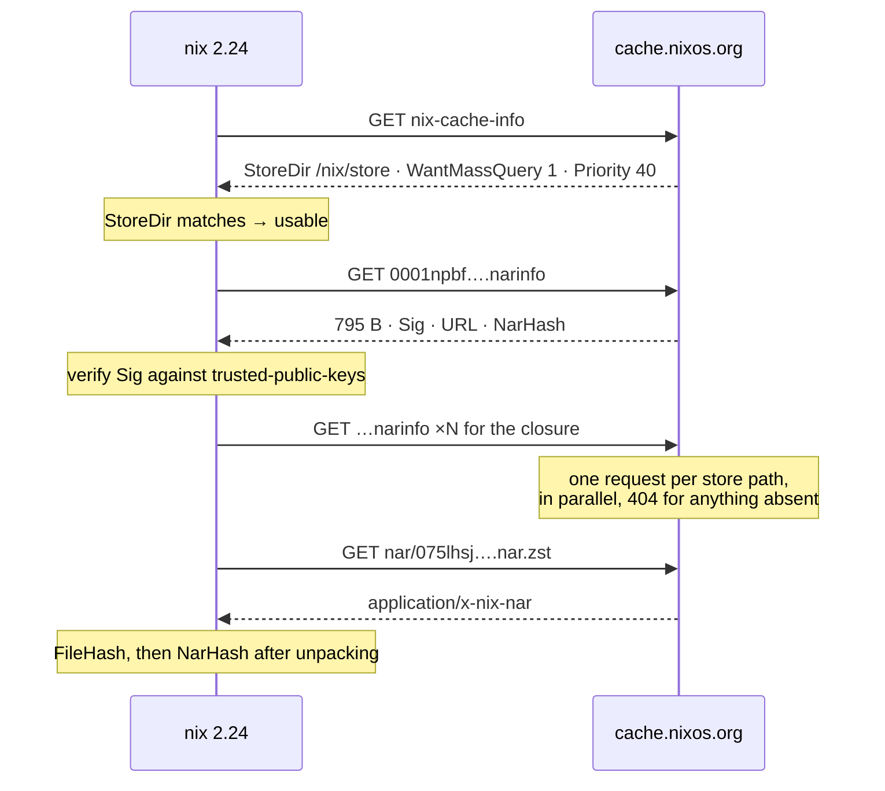
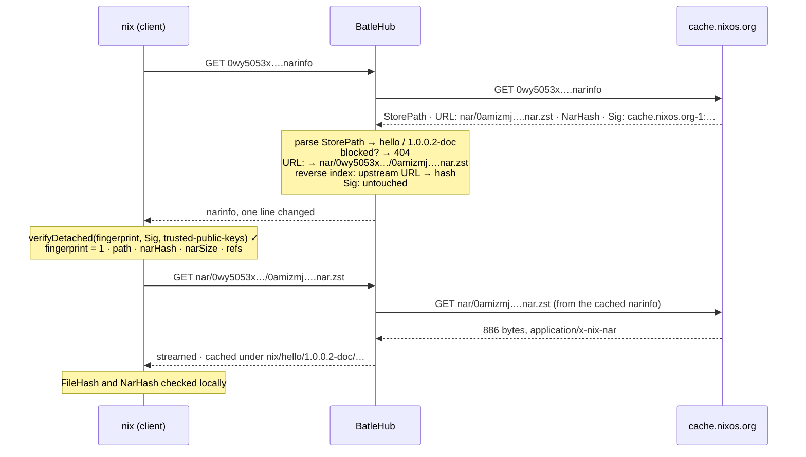
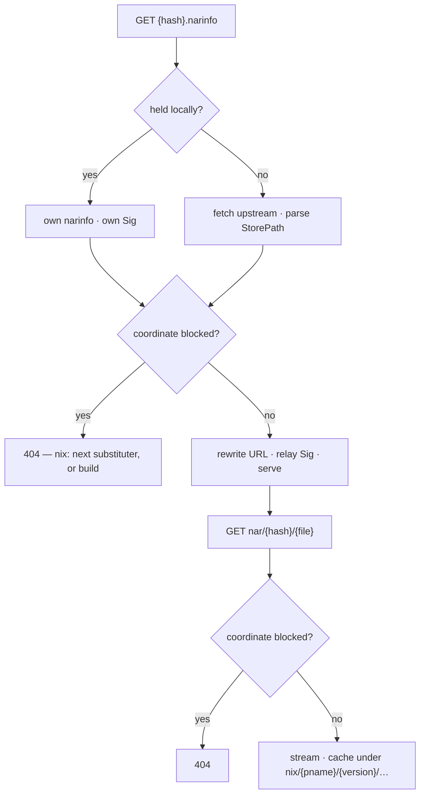
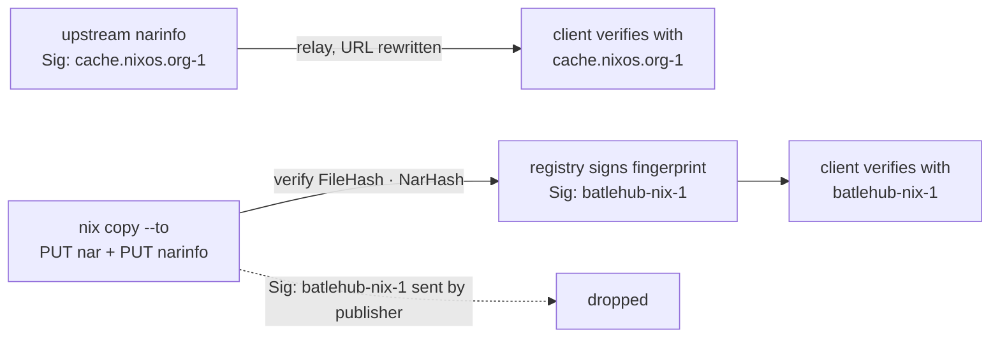

# RFC 0028 — Nix binary cache

| Field       | Value                                                        |
| ----------- | ------------------------------------------------------------ |
| Status      | **Implemented** — all six phases of §12 landed: 1, 2, 4, 5 and 6 on 2026-09-17 (reads, routes, publish, surface, air gap) and phase 3's `tests/heavy/nix.sh` with them, run against a real `nix` before the kind was called done. §13 records nine corrections to the design and §14 four more from that first real run, including a publish surface that authorized nobody — the fix is `holds_anywhere_in_registry` (§14). Shipped in v1.3.0 |
| Short       | Nix binary cache                                              |
| Settles     | The substituter protocol as a registry kind: narinfo listings, NARs as artifacts, Ed25519 narinfo signing in local mode, and blocking by store path |
| Author      | Max Batleforc <maxleriche.60@gmail.com>                       |
| Co-author   | Claude Fable 5.1 <noreply@anthropic.com>                      |
| Created     | 2026-09-11                                                    |
| Supersedes  | —                                                             |
| Touches     | `crates/core`, `crates/config`, `crates/adapters`, `crates/web`, `server`, `cli`, `ui`, `docs` |

---

## 1. Summary

A Nix *binary cache* is the simplest registry protocol this proxy will ever
meet and the only one whose signing scheme is the one this codebase is allowed
to implement. A cache is three kinds of file behind one URL: `nix-cache-info`
(three lines describing the cache), one `{hash}.narinfo` per store path (a
dozen `Key: value` lines naming the NAR, its hashes, its references and its
signatures), and the NARs themselves under `nar/`. There is no index, no
search, no version list: a client asks for exactly the store path it has
already computed, and a cache either has it or does not.

`type = "nix"` serves that protocol. In proxy mode it fronts `cache.nixos.org`
(or any other cache), relaying every narinfo's `Sig:` lines byte-exact so the
client's own `trusted-public-keys` keep doing the verifying, and rewriting the
one field the signature does not cover, `URL:`, so the NAR is fetched under
a coordinate this instance can block, cache and count. In `local`/`hybrid` mode it
accepts `nix copy --to` uploads, verifies what was uploaded, and signs each
narinfo with the registry's own Ed25519 key in the exact form `nix.conf`
already expects: `name:base64`. No OpenPGP, no `rsa` crate, no re-signing of
anything upstream signed.

The package model is Nix's own: `builtins.parseDrvName` splits a store path's
name at the first dash not followed by a letter, so `hello-1.0.0.2-doc` is
package `hello` at version `1.0.0.2-doc`, and the 32-character hash is the
artifact within it. A block on `hello@1.0.0.2-doc` makes every narinfo whose
path parses to it answer `404`, which is the protocol's own "this cache does
not have it": Nix moves to the next substituter or builds from source, and
says so in its own words.

### Before / after

```text
# today — a binary cache is a `generic` mirror at best
[[registries]]
name       = "nix-cache"
type       = "generic"
upstreams  = ["https://cache.nixos.org"]
path_allow = ["*.narinfo", "nar/**", "nix-cache-info"]
#   every path is one synthetic package: nothing to block, nothing in explore,
#   and a `nix copy --to` PUT has nowhere to go

# with this RFC
[[registries]]
name      = "nix"
type      = "nix"
mode      = "hybrid"
upstreams = ["https://cache.nixos.org"]
[registries.nix_signing]
seed_hex = "${NIX_SIGNING_SEED}"     # local uploads are signed as batlehub-nix-1:…

# nix.conf on every machine
substituters        = https://batlehub.example.com/proxy/nix/nix
trusted-public-keys = cache.nixos.org-1:6NCHdD59X431o0gWypbMrAURkbJ16ZPMQFGspcDShjY= batlehub-nix-1:<base64>

# a CI runner publishing what it built
nix copy --to https://batlehub.example.com/proxy/nix/nix ./result
```



A `404` on a narinfo is not an error to Nix, it is "not in this cache" — which
is why the block lands there rather than on the NAR, and why §5.3 spends its
length on what that means for a closure.

---

## 2. Motivation

1. **Nothing on a Nix cache can be refused today.** A `generic` registry on
   `cache.nixos.org` caches bytes under one synthetic package. `BlockListRule`
   has no version to match, explore has no rows, and a CVE in a store path is
   invisible to the console. A NixOS or home-manager fleet pulls its entire
   closure through this hole, including the compiler.

2. **The protocol's refusal is a `404`, and the client handles it well.**
   `HttpBinaryCacheStore::getFile` maps `404` and `410` to
   `FileTransfer::NotFound` (and `403` to `Forbidden`, which `fileExists`
   treats the same way), and `queryPathInfoUncached` turns that into "no
   info" — Nix consults the next substituter, or builds. There is no
   mid-transfer failure to design around: the narinfo is asked for before the
   NAR, always, by `BinaryCacheStore::narInfoFileFor` (`{hashPart}.narinfo`).

3. **The signature does not cover the URL.** `ValidPathInfo::fingerprint` is
   `1;{storePath};{narHash};{narSize};{references}` and nothing else. A cache
   is free to name its NARs as it likes — `cache.nixos.org` names them by
   NAR hash (`nar/0amizmj…nar.zst`) while `nix copy` names them by the hash of
   the compressed file — so this instance can rewrite `URL:` to carry a
   coordinate and relay `Sig:` untouched. Every other registry in the tree
   has had to choose between rewriting and provenance; this one gets both.

4. **This is the one protocol whose signing matches the codebase.** Narinfo
   signatures are libsodium `crypto_sign_detached` — Ed25519 — over the
   fingerprint above, serialised as `name:base64`, verified by
   `verifyDetached` against keys of the same shape in `trusted-public-keys`.
   `crates/core/src/services/signature.rs` already signs and verifies exactly
   that primitive with `ed25519_dalek`; pacman and APT needed an OpenPGP
   wrapper hand-rolled around it (`crates/adapters/src/repo/openpgp.rs`),
   VSX needed Open VSX's asset format (RFC 0020). Nix needs the raw signature
   and a name. A `local` registry that signs what it hosts is therefore the
   cheapest signing feature this tree can add, and the one that makes
   `require-sigs = true` — Nix's default — work against a private cache.

5. **`nix copy --to` has no target.** A CI runner that builds a closure has
   nowhere in the estate to put it: the protocol is `PUT nar/…` then
   `PUT {hash}.narinfo`, and nothing here answers `PUT`. Teams run a
   `nix-serve` or an S3 bucket beside the proxy, outside its quotas, its
   RBAC, its scanning and its retention.

6. **The air-gap bundle cannot carry a closure.** RFC 0008-bis moves packages
   by listing kind; a NixOS machine on the disconnected side has no kind to
   be exported as, and a closure is the most self-describing artifact set the
   bundle will ever meet — every reference is in the narinfo.

---

## 3. Goals / non-goals

**Goals**

- A store path can be blocked by package and version as Nix itself parses
  them, and a blocked path is absent from the cache in the protocol's own
  terms.
- Every narinfo relayed in proxy mode verifies on the client exactly as it
  would against the upstream, with the upstream's key.
- A NAR is cached and counted under a coordinate, and served to the second
  machine from storage.
- `nix copy --to` works against a `local`/`hybrid` registry, with the upload
  verified and signed by the registry's own key, and the key handed out in
  the form `trusted-public-keys` takes.
- A `hybrid` registry answers its own paths first and falls through to the
  upstream for the rest, the way every other hybrid kind does.
- A closure travels in the RFC 0008-bis bundle and is served, signed as it
  was, on the disconnected side.

**Non-goals**

- **An S3 or file store URL.** Nix speaks the same layout over `s3://` and
  `file://`; this registry is the `https://` store and nothing else. An S3
  bucket is what the storage backend is for, behind the HTTP surface.
- **`nix-serve`'s dynamic behaviour** — computing a narinfo from a local
  `/nix/store` on request. This instance has no store; it has what was
  uploaded or proxied.
- **Signing anything upstream signed, or re-signing on relay.** A proxied
  narinfo keeps its `Sig:` lines exactly. The registry key signs only what was
  published to it (§4.4).
- **Verifying upstream signatures server-side.** The client does it, with
  keys the operator chose; a proxy that also verified would need the same key
  list in a second place. `RegistryPolicy` can still refuse an *unsigned*
  upstream narinfo (§4.1).
- **Blocking by a single store path.** §11 q1: a version rebuilt with a
  different hash is the same software, and an admin blocking a CVE wants all
  of them.
- **Serving the `nix log` tree (`log/{drv}`) as anything but a passthrough.**
  Build logs have no coordinate a policy would act on.
- **The `nix-channel` tarballs and `channels.nixos.org`.** A different host
  and a different protocol (a tarball and a `store-paths.xz`); the `generic`
  kind mirrors it today and nothing here changes that.
- **Flake inputs from forges.** `github:` inputs are the `github` kind's
  business (RFC 0019).

---

## 4. User-facing design

### 4.1 Configuration

```toml
[[registries]]
name      = "nix"
type      = "nix"
mode      = "hybrid"                          # proxy · local · hybrid
upstreams = ["https://cache.nixos.org"]       # the default; any cache root

# Refuse to relay a narinfo that carries no Sig: line at all. Off by
# default: a content-addressed path (CA:) legitimately has none, and the
# client's require-sigs is the check that matters. On, it closes the case
# where an upstream mirror silently dropped signatures.
require_upstream_sigs = false

# The key local uploads are signed with. Absent → uploads are stored and
# served unsigned, and the registry page says what that means for clients.
[registries.nix_signing]
seed_hex = "${NIX_SIGNING_SEED}"              # 32-byte Ed25519 seed, hex; ${VAR} expanded
key_name = "batlehub-nix-1"                   # the name before the colon; default `batlehub-{registry}-1`

[registries.rbac]
# narinfo and nix-cache-info are listings; NARs, .ls and realisations are
# reads; PUT is a publish. `nix` sends no header but reads netrc-file.
anonymous = ["releases:read", "releases:list"]

# An age gate here must choose: the protocol carries no dates at all, so
# every path reaches the rule undated — `true` denies every path, `false`
# makes the gate inert. There is no default (RFC 0010 §6.7).
# [[registries.rules]]
# kind = "release_age_gate"
# min_age_secs = 86400
# deny_missing_timestamp = false
```

- `upstreams` absent means `https://cache.nixos.org`. The value is the cache
  root: the URL a client would put in `substituters`, without a query string.
- `nix_signing` absent in `local`/`hybrid` mode is allowed and warned about
  at reload: an unsigned narinfo is refused by every client with
  `require-sigs = true` (*"cannot add path '…' because it lacks a signature
  by a trusted key"*), which is every stock client, unless the path is
  content-addressed.
- `key_name` is the part of `trusted-public-keys` before the colon; Nix uses
  it to pick the public key that verifies a `Sig:`. It has to be stable
  across restarts and unique among the caches a client trusts — hence a
  default that carries the registry name and a suffix an operator can bump
  on rotation, as `cache.nixos.org-1` does.

### 4.2 The client side

```bash
# nix.conf (or nixConfig in a flake, for trusted users)
substituters        = https://batlehub.example.com/proxy/nix/nix?priority=30
trusted-public-keys = cache.nixos.org-1:6NCHdD59X431o0gWypbMrAURkbJ16ZPMQFGspcDShjY= batlehub-nix-1:<base64 public key>
netrc-file          = /etc/nix/netrc          # only for an authenticated registry

# a build farm publishing a closure
nix copy --to "https://batlehub.example.com/proxy/nix/nix" ./result
# reading it back somewhere else, with the registry's key trusted
nix build --substituters "https://batlehub.example.com/proxy/nix/nix" ...
```

`?priority=30` makes the proxy sort before `cache.nixos.org` (priority 40 in
its `nix-cache-info`, lower wins) when both are listed; alone, the value is
irrelevant. Unprivileged users can only use substituters in
`trusted-substituters` or the daemon's own list, which is the operator's
lever for making the proxy the only cache a machine reads.

**Nix sends no credentials unless told where they are.** The downloader is
libcurl with `CURLOPT_NETRC_FILE` set to `netrc-file` and `CURL_NETRC_OPTIONAL`
(`filetransfer.cc`); the default path is a dummy, so an authenticated registry
needs `netrc-file` pointed at a real file, and the path must be absolute.
There is no header setting for substituters. The registry page carries the
`machine … login … password …` block the way `nodedist`'s does.

### 4.3 Coordinates

| Request (under `…/proxy/{reg}/nix/`) | `PackageId` | Cache key |
| --- | --- | --- |
| `0wy5053x6ql7v6h1x223rnslcd7xiffk.narinfo` | `hello` / `1.0.0.2-doc`, artifact `0wy5053x…iffk.narinfo` | metadata, `narinfo:0wy5053x…` |
| `nar/0wy5053x6ql7v6h1x223rnslcd7xiffk/16ya8yxr…id21.nar.zst` (the rewritten URL) | `hello` / `1.0.0.2-doc` / `16ya8yxr…id21.nar.zst` | `nix/hello/1.0.0.2-doc/16ya8yxr…id21.nar.zst` |
| `nar/0amizmj…d7a.nar.zst` (upstream's own URL shape) | resolved through the reverse index, else `404` | as above |
| `0wy5053x6ql7v6h1x223rnslcd7xiffk.ls` | same package, artifact `….ls` | `nix/hello/1.0.0.2-doc/0wy5053x….ls` |
| `nix-cache-info` | registry-wide, version unused | metadata, `cache-info` |
| `realisations/sha256:{drvhash}!{out}.doi` | registry-wide, keyed by id | metadata, `realisation:{id}` |
| `log/{drvhash}-{name}.drv` | passthrough | metadata, `log:{drvhash}` |

**The package is what Nix says it is.** `DrvName::DrvName` (`names.cc`):
*"the name part of a derivation name is everything up to but not including
the first dash not followed by a letter"*. So `curl-8.21.0` is `curl` at
`8.21.0`, `hello-1.0.0.2-doc` is `hello` at `1.0.0.2-doc`, `php-curl-8.4.25`
is `php-curl` at `8.4.25`, and `source` (no dash followed by a non-letter) is
package `source` with an empty version, which the coordinate spells as `-`
(§4.4). The same parser is what `nix-env -u` and `lib.getVersion` use, so a
version an admin reads off `nix-env -q` is the version a block takes.

**The artifact is the hash.** Two builds of `hello-1.0.0.2` differ in the
32-character hash part and in nothing a policy reads, so one version holds
many artifacts, each named by its store hash. A block on the version covers
all of them; explore lists them as the files of a version, as `nodedist` lists
one file per platform.

### 4.4 Behaviour rules

**The narinfo is relayed with one field rewritten and none removed.** The
proxy parses the upstream narinfo with the grammar `nar-info.cc` uses — one
`Name: value` per line, `value` starting two characters after the colon — and
serves it back with:

- `URL:` rewritten to `nar/{storeHash}/{basename of upstream URL}`, so the
  NAR request carries the store hash the coordinate is derived from. The
  basename keeps upstream's file name and extension, so `Compression:` and
  `FileHash:` stay true.
- every other line byte-exact, in upstream's order. `Sig:` lines in
  particular: the fingerprint is `1;{path};{narHash};{narSize};{refs}`, none
  of which moved, so the client verifies exactly what it would have verified
  upstream, with the upstream's key.

The invariant: **a rewrite that touches only `URL:` cannot invalidate a
signature, because `URL:` is not in the fingerprint.** That is a fact about
`ValidPathInfo::fingerprint`, quoted in §6.2's test.

**A blocked path is absent.** `BlockListRule` and RFC 0018's verdicts are
consulted on the coordinate parsed from `StorePath:`; a blocked path answers
`404` on its `.narinfo`, its `.ls`, and any `nar/{hash}/…` request. Nix's
`queryPathInfoUncached` records a negative result in its own disk cache for
`narinfo-cache-negative-ttl` (3600 s) and moves on: the next substituter, or a
local build. **The honest limit:** blocking a binary does not block the
software. A machine that has the derivation — every NixOS machine does — will
build `hello-1.0.0.2` from source when no cache serves it, and nothing in this
protocol can stop that. The registry page says so in its first paragraph; the
lever an estate has is `max-jobs = 0` on machines that must not build, which
is Nix configuration and not this proxy's.

**The uninteresting case is byte-exact.** With nothing blocked and the
upstream's `nix-cache-info` relayed as it came, the only difference a client
can observe between the proxy and the upstream is the `URL:` line. A NAR
requested through the proxy is streamed from the upstream URL the cached
narinfo recorded and stored under the coordinate; the second machine gets it
from storage.

**Upstream-shaped NAR requests.** A client that fetched a narinfo *before*
the proxy existed holds `nar/0amizmj…nar.zst` in its disk cache for
`narinfo-cache-positive-ttl` (30 days) and will ask for that. The proxy keeps
a reverse index, upstream URL → store hash, written when a narinfo is served;
a hit is served as the coordinate; a miss is `404`, which makes Nix refetch
the narinfo, get the rewritten URL, and succeed. One extra round trip, once
per path, and never a NAR served outside a coordinate.

**`nix-cache-info` is the upstream's in proxy mode, composed in local mode.**
`StoreDir: /nix/store`, `WantMassQuery: 1`, `Priority: 40` are what
`cache.nixos.org` answers and what a client validates (`StoreDir` mismatch is
a hard error: *"binary cache '…' is for Nix stores with prefix '…', not
'…'"*). Hybrid serves the upstream's; local serves `StoreDir: /nix/store`,
`WantMassQuery: 1`, `Priority: 30`. A client that wants a different priority
sets it in the URL.

**Mass query means misses are the common case.** `WantMassQuery: 1` invites
`nix-env -qa`-style tools to ask for thousands of narinfos most of which do
not exist. A negative narinfo lookup is cached for the upstream negative TTL
the proxy already has (`DEFAULT_UPSTREAM_NEGATIVE_TTL_SECS`, 300 s) and never
counted as an error; `HEAD` is answered from the same cache without a body.

**Local publish is two `PUT`s, in the order Nix sends them.** `nix copy --to`
does `HEAD {hash}.narinfo` (skip if present), then `PUT nar/{fileHash}.nar.xz`
(or `.zst`, per the store URL's `?compression=`), then
`PUT {hash}.narinfo`, optionally `PUT {hash}.ls` and
`PUT realisations/{id}.doi`. The registry:

1. stores the NAR under a **pending** key named by its file hash, owned by
   the publisher, with no coordinate yet;
2. on the narinfo, parses `StorePath:` into the coordinate, checks that
   `URL:` names a pending NAR of this publisher, verifies `FileHash`/`FileSize`
   over the stored bytes and `NarHash`/`NarSize` over the decompressed stream
   (`zstd` and `liblzma` are already in the tree), rejects a mismatch with
   `400` naming the field, and only then moves the NAR under the coordinate
   and records the version through `LocalRegistryService` — quotas, ownership,
   RFC 0016 tombstones, dedup and RFC 0018 scanning included;
3. rewrites `URL:` to the coordinate form, **drops any `Sig:` whose key name
   is the registry's own** (a client cannot mint those), keeps every other
   `Sig:` the publisher sent, and appends the registry's signature over the
   fingerprint it just verified;
4. serves the result. A pending NAR nobody claims within the publish window
   is reaped like any other abandoned upload.

The order matters for the signature: the registry signs `narHash`/`narSize`
it computed from bytes it holds, not values it was told. "Sign what you
verified" is the same rule RFC 0020 applies to a VSIX.

**Hybrid resolution.** A `hybrid` registry answers a narinfo from its own
published paths first (by store hash), then the upstream. Store hashes do not
collide, so there is no "same version, two sources" case to arbitrate; the
question is only which side has the hash.

**Content-addressed paths** (`CA:` present) are relayed and published like any
other. Nix does not require a signature on them (`isContentAddressed` short-
circuits `checkSignatures`); the registry still signs a local one, which
costs nothing and harms nothing.

**Realisations and logs** are passthrough documents: a realisation names an
`outPath` whose narinfo carries the policy, and a log carries none. Both are
cached under their id for `metadata_ttl`. A realisation uploaded to a `local`
registry is stored beside the version its `outPath` resolves to and is removed
with it, so an RFC 0016 tombstone takes the mapping as well as the path
(§11 decision 6).

**Empty versions.** A store name with no version part (`source`,
`nixos-system-host`) gets the coordinate version `-`. It is a legal version
string everywhere the tree stores one, it cannot collide with a parsed
version (a version starts with a non-letter, never with a lone dash), and it
groups every unversioned build of a name under one row.

### 4.5 Validation

`AppConfig::validate()` rejects:

| Condition | Rationale |
| --- | --- |
| `nix_signing` on a registry whose type is not `nix` | A silently ignored secret is worse than an ignored option: the operator believes uploads are signed. Same class as `vsx_signing` off a VSX kind. |
| `nix_signing.seed_hex` that is not 64 hex characters | RFC 0020 §4.5's rule: a wrong-length seed is a typo, and Ed25519 would sign with garbage rather than refuse. |
| `nix_signing.key_name` containing `:` or whitespace | The colon separates name from key in `trusted-public-keys` and in `Sig:`; whitespace separates entries. Either produces a key no client can list. |
| `path_allow` on a `nix` registry | Not path-addressed; refused on every such kind (RFC 0010 §13.1). |
| A `release_age_gate` rule with no explicit `deny_missing_timestamp` | The protocol carries no dates; the field *is* the rule. RFC 0010 §6.7. |
| `upstreams` entry carrying a query string | `?priority=` and friends are client-side settings on a store URL; on the upstream they would be forwarded on every request and mean nothing. |

Warnings (logged and surfaced to the admin):

| Condition | Behaviour |
| --- | --- |
| `mode = "local"`/`"hybrid"` without `nix_signing` | Uploads are accepted and served unsigned, and every stock client refuses them. Warned at reload and stated on the registry page; not refused, because a fleet with `require-sigs = false` is a legitimate lab. |
| Upstream `nix-cache-info` with a `StoreDir` other than `/nix/store` | Relayed as is, warned once: clients with the default store refuse the cache themselves, with the error above. |
| `require_upstream_sigs = true` and a relayed narinfo with `CA:` but no `Sig:` | Served — a CA path needs no signature — and not counted against the option, which is about non-CA paths only. |

---

## 5. Architecture

### 5.1 The protocol as `cache.nixos.org` serves it

No proxy in this subsection. Every response below was fetched while writing
this RFC; the client behaviour is read from Nix 2.24's `binary-cache-store.cc`,
`filetransfer.cc` and `path-info.cc`.

| Request | Answers | Type · size | What Nix does with it |
| --- | --- | --- | --- |
| `nix-cache-info` | the cache's parameters | `text/x-nix-cache-info` · 51 B | read once per substituter; a `StoreDir` that differs from the local one makes the cache unusable, and `Priority` orders it against the others |
| `{storehash}.narinfo` | one store path's metadata | `text/x-nix-narinfo` · 795 B observed | decides whether that path can be substituted at all; **`404` means "not in this cache"**, not an error |
| `nar/{filehash}.nar.{zst,xz}` | the NAR | `application/x-nix-nar` · 46 064 B observed | unpacks it into the store, verifying `FileHash` and then `NarHash` |
| `{storehash}.ls` | a JSON listing of the NAR's contents | | `nix store ls` only, never an install |
| `realisations/sha256:{drvhash}!{output}.doi` | the derivation-to-output mapping | | content-addressed derivations only |
| `log/{drvpath}` | a build log | | `nix log` |

`nix-cache-info`, in full, as served:

```text
StoreDir: /nix/store
WantMassQuery: 1
Priority: 40
```

`WantMassQuery: 1` is the cache saying "ask me about everything", which is what
makes the next number matter.

A real narinfo, in full, as served:

```text
StorePath: /nix/store/0001npbf2n4z3pjy6vm2mw8ywkqixxs6-hslua-aeson-2.3.2-doc
URL: nar/075lhsj33mkk02xn3lf59xn9glvh02wkw9xislbcj1jgjlpcn79x.nar.zst
Compression: zstd
FileHash: sha256:10k72lz1iazridh4787xk3mfl6c5akf8x88xz7bnswc03b5gvyqp
FileSize: 46064
NarHash: sha256:075lhsj33mkk02xn3lf59xn9glvh02wkw9xislbcj1jgjlpcn79x
NarSize: 226848
References: ghpayap4j5fqg9ryyzrfdj9ygdi01iw9-aeson-2.2.4.1-doc …
Deriver: y1h1bh5gl539r42jydbnbmp3vyh11sva-hslua-aeson-2.3.2.drv
Sig: cache.nixos.org-1:21qiHy652KfJ7Rsnc+dy5KndgujuIQEU/oudrFh7sWkkLlT9r8F3AxKA//dMvr9xWBA3tITPZA6ZFC7KxxRJBA==
```

Three properties of that document decide the whole design:

- **`URL:` is relative.** It names `nar/…` under the cache root, so a
  substituter behind a path prefix needs no rewriting for the NAR to be found.
  A rewrite is therefore an option this RFC takes for a reason (§4.4's
  coordinate), not a repair it is forced into — the opposite of Terraform's
  `X-Terraform-Get` and Galaxy's `download_url`.
- **`Sig:` covers four fields and not the other six.** The signed fingerprint
  is `1;{StorePath};{NarHash};{NarSize};{References}`. `URL`, `Compression`,
  `FileHash`, `FileSize`, `Deriver` and `CA` are outside it. So the NAR's
  location can be rewritten with the signature left intact, and the store
  path, its contents hash and its closure cannot.
- **Everything is content-addressed twice.** The NAR's file name is its own
  `FileHash`, and `NarHash` covers the uncompressed stream. A cache cannot
  substitute different bytes under the same name without failing both checks.

**What Nix verifies.** The `Sig:` against `trusted-public-keys`, by the key
name before the colon; then `FileHash` over the downloaded bytes and `NarHash`
over the unpacked stream. An unsigned or untrusted-signature narinfo is
refused unless the user is trusted and `require-sigs = false`.

**Credentials.** libcurl with `CURLOPT_NETRC_FILE` from `netrc-file` and
`CURL_NETRC_OPTIONAL`; the default path is a dummy, so an authenticated
substituter needs that setting pointed at an absolute path. There is no header
mechanism for substituters.

**The spellings.** A store path is `{32-character base32 hash}-{name}`, and
the name splits into package and version at *"the first dash not followed by a
letter"* (`DrvName::DrvName`, `names.cc`). A narinfo is addressed by the hash
part alone; a NAR by its `FileHash` in base32. Hashes are Nix's own base32
alphabet, not RFC 4648.



One build is one cache-info read, then **one narinfo request per store path in
the closure** — hundreds for a real system build, which is why that path is
the hot one and why `404` has to be cheap.

### 5.2 A narinfo is a signed listing whose URL is not signed



What this proves: the client verifies the same bytes it would have verified
against the upstream, because the fingerprint never mentions where the NAR
lives. The rewrite is the entire difference between a proxy that can block
and one that cannot, and it costs no provenance.

### 5.3 Where a block becomes effective



The invariant, as RFC 0010 §5.3 states it: a path removed at the listing is
also unreachable by its artifact URL, and both read the blocked set on each
request. The NAR route re-derives the coordinate from the store hash in its
path and asks again, so a client holding a narinfo from before the block gets
`404` at the NAR, never a `403` mid-transfer.

### 5.4 What is signed by whom



Two keys, two provenances, never mixed: an upstream path is never signed
here, a local path is never served under a signature this instance did not
compute from bytes it verified. A publisher who tries to forge the registry's
own signature loses that one line and keeps every other.

---

## 6. Detailed design

### 6.1 `crates/core` — the registry kind

`RegistryKind::Nix` is added to the enum and to `ALL`; the exhaustive matches
(`registry_kind.rs`, `upstream_detail`, `blocking`, `listing_synthesis`,
`builders.rs`) refuse to compile until answered. `supports_local_mode() =
true`, `requires_explicit_upstream_in_proxy_mode() = false`,
`is_path_addressed() = false`; the rest:

| | `nix` |
| --- | --- |
| `listing_filter()` | `Filtered("narinfo", ["narinfo"])` — one document per path, absent when blocked |
| `readme_support()` | `None("a store path is a NAR and its narinfo; the protocol carries no prose")` |
| `upstream_detail()` | `None("a binary cache has no index: it answers a store path or does not")` — explore shows what this instance has served or holds, never a remote list |
| `fetchable_by_version()` | `None("a version is one or more store hashes, and the hash is not a constant")` |
| `warm_artifact()` | `None` — there is no version list to warm from; `warm_paths` (already on `RegistryConfig`) takes explicit store paths |
| `blocking_package_name()` | identity |

`DocumentKind` gains `NARINFO = Secondary("narinfo")`, `CACHE_INFO =
Secondary("cache-info")`, `REALISATION = Secondary("realisation")` and
`BUILD_LOG = Secondary("log")`, each qualified by its id in the cache key.

### 6.2 `crates/core` — `services/nix.rs` and `blocking/nix.rs`

`services/nix.rs`, no I/O:

- `StorePath::parse(&str)` — the `{32 nix32 chars}-{name}` grammar, name
  from Nix's `path-regex`: `[0-9a-zA-Z+._?=-]+`. The Nix32 alphabet is
  `0123456789abcdfghijklmnpqrsvwxyz` (no `e`, `o`, `u`, `t`); a hash outside
  it is a `400` at the edge. The name is validated against **this** grammar
  first, and only then through `validate_package_name` (which is
  `validate_path_safe`: no `..`, no separators, not empty): `+`, `?` and `=`
  are legal in a store name (`gcc-wrapper-14+`) and pass both, but a `400`
  that names Nix's rule is clearer than one that names a path rule. The
  storage backends' `ensure_safe_key` remains the deeper guard; none of `/`,
  `..` or whitespace is in the alphabet.
- `DrvName::split(name) -> (pname, version)` — Nix's rule, quoted from
  `names.cc` in the doc comment; empty version spelled `-`.
- `NarInfo::parse(&str)` — the `Name: value` grammar of `nar-info.cc`, kept
  as an ordered list of `(name, value)` lines so the serialisation is the
  upstream's order with one line replaced; `required()` checks the same four
  fields Nix does (`StorePath`, `NarHash`, `URL`, `NarSize`) with the same
  messages.
- `fingerprint(&NarInfo) -> String` — `1;{path};{narHash};{narSize};{refs}`,
  references comma-joined as full store paths, in the set order Nix uses
  (sorted). Unit-tested against the real `cache.nixos.org` narinfo above:
  the relayed `Sig:` verifies with `cache.nixos.org-1`'s public key over this
  function's output, which is the test that the fingerprint is right.
- `NixSigningKey` — `from_seed_hex` (the `VsxSigningKey` shape from
  `signature.rs`), `sign(fingerprint) -> "name:base64"`,
  `public_key_line() -> "name:base64"` (32 raw bytes, base64, the form
  `trusted-public-keys` reads).
- `rewrite_url(&mut NarInfo, store_hash)`.

`blocking/nix.rs`: `DocumentKind::NARINFO` → the coordinate is parsed from
the document's own `StorePath:`; blocked ⇒ `CoreError::NotFound`. Nothing is
stripped from a body, because the document *is* the version.

### 6.3 `crates/config`

- `RegistryConfig::nix_signing: Option<NixSigningConfig { seed_hex, key_name }>`
  and `require_upstream_sigs: bool`, both documented as nix-only, with the
  §4.5 rules beside the `vsx_signing` checks.
- `CURRENT_CONFIG_VERSION` does not move.

### 6.4 `crates/adapters` — `registry/nix/`

A directory: the client, the reverse index and the upload verification would
crowd a single file.

- `client.rs` — `NixBinaryCacheClient { http, base, reverse: NarUrlIndex }`.
  - `resolve_metadata(pkg)` → fetch and parse the narinfo for the artifact's
    store hash; `published_at: None` always. A `404`/`410`/`403` upstream is
    `NotFound`, mirroring `getFile`.
  - `fetch_artifact(pkg)` → the NAR, streamed from the upstream URL recorded
    in the cached narinfo (refetched if the metadata entry expired); `.ls`
    from `{hash}.ls`.
  - `fetch_version_document(pkg, NARINFO)` → the narinfo, `text/x-nix-narinfo`
    as upstream serves it; `CACHE_INFO` → `text/x-nix-cache-info`;
    `REALISATION` → `application/json`; `BUILD_LOG` → `text/plain`.
  - `list_versions` → `Unsupported`: there is no listing to read.
- `reverse.rs` — `NarUrlIndex`, upstream NAR basename → store hash, backed by
  the metadata cache (it is a derived fact of a narinfo, expires with it).
- `verify.rs` — `check_nar(bytes, compression, &NarInfo)`: `FileHash`/`FileSize`
  over the bytes, `NarHash`/`NarSize` over the decompressed stream (`zstd`,
  `liblzma`, and identity for `Compression: none`; `bzip2` is refused at
  publish with a message naming the supported set — Nix's own default is
  xz and `nix copy` is told with `?compression=`).
- `tests.rs` — `mockito`, spanning the three files; the real narinfo and
  `nix-cache-info` from §4.3 as fixtures, dated.

`LocalRegistryService` gains `publish_nix_nar` (pending, by file hash) and
`publish_nix_narinfo` (claim, verify, sign, record), following
`get_nuget_versions`'s pattern of a kind-specific helper on the shared
service.

### 6.5 `crates/web` — handlers and routes

`handlers/proxy/nix/`, prefix `/proxy/{registry}/nix/`:

| Route | Handler |
| --- | --- |
| `GET nix-cache-info` | `cache_info` — document |
| `GET|HEAD {hash}.narinfo` | `narinfo` — document; local first in hybrid; `404` when blocked |
| `GET nar/{hash}/{file}` | `nar` — `proxy_stream` under the coordinate |
| `GET nar/{file}` | `nar_upstream_shape` — reverse index → as `nar`, else `404` |
| `GET {hash}.ls` | `listing` — `proxy_stream`, `application/json` |
| `GET realisations/{id}.doi` | `realisation` — passthrough document |
| `GET log/{drv}` | `build_log` — passthrough document |
| `PUT nar/{file}` | `put_nar` — pending upload, `releases:write` |
| `PUT {hash}.narinfo` | `put_narinfo` — claim + verify + sign |
| `PUT {hash}.ls`, `PUT realisations/{id}.doi` | stored beside the version, `releases:write` |
| `GET public-key` | `public_key` — `text/plain`, the `name:base64` line; `404` when unsigned |

Obligations from the existing rules: every `{hash}` is validated against the
Nix32 grammar and every `{file}`/`{id}`/`{drv}` through `validate_path_safe`
before anything reaches a storage key; every `200` declares `body = T`
(`ProtocolDocument` for the text documents, `ArtifactBytes` for NARs and
`.ls`, `MessageResponse` for the `PUT`s); `nar/{hash}/{file}` registers
before `nar/{file}`, and the conformance fixture asserts both patterns. The
`PUT` handlers use `require_local_mode`. `HEAD` on the narinfo is answered
from the same code path with no body, because `nix copy` asks before it
uploads.

### 6.6 `server`

`builders.rs` gains one arm: `NixBinaryCacheClient` from
`resolve_urls(&reg.upstreams, "https://cache.nixos.org")`, and the signing key
from `nix_signing` handed to the local service the way `vsx_signing` is.

### 6.7 Rules

`DenyLatestRule` has no "latest" to deny and is inert on this kind (a
warning at reload names it, as for any kind with no listing).
`BlockListRule` reads the coordinate. `ReleaseAgeGateRule` never has a
`published_at` here, so `deny_missing_timestamp` is mandatory and decides the
whole gate (§4.5). RFC 0018's verdicts hide a version the way a block does.

### 6.8 `ui` and `docs`

- `ui/src/config/registryTypes.ts` — an entry labelled *Nix binary cache*,
  with the `nix.conf` lines of §4.2 as the setup snippet, the `netrc-file`
  block for authenticated instances, and the `nix copy --to` line for
  publishers; the public key rendered into `trusted-public-keys` when the
  registry signs.
- `docs/registries/nix.md`, tables generated, and the three lines the page
  must carry: a blocked binary is built from source unless `max-jobs = 0`;
  an unsigned local registry is refused by stock clients; the age gate's
  field decides everything.
- `docs/registries/index.md` and the `/registries/` sidebar; `generic.md`
  gains one line pointing here.
- `docs/operations/egress.md` — `cache.nixos.org` is a CDN; no redirect chain.

### 6.9 `cli`

`batlehub registry suggest` gains `flake.nix`/`flake.lock` as an input: their
presence suggests the registry block and the `nix.conf` lines; nothing is
warmed, because a flake names no store paths. `warm_paths` on the registry
takes `/nix/store/{hash}-{name}` entries for an operator who wants a closure
pre-fetched.

### 6.10 `tests/heavy/nix.sh`

A heavy suite, `config.nix.toml` beside it, `task test:nix-heavy`, an entry in
`task test:heavy`, and a row in the `heavy-client` matrix. Nix is not on the
GitHub runner image; the suite installs the static
single-user `nix` binary from the release tarball at a version pinned in the
script and quoted in the conformance fixture, into the run's temp
directory (RFC 0010 decision 9: the tarball, not the installer) with
`NIX_STORE_DIR`, `NIX_STATE_DIR` and `NIX_CONF_DIR` redirected, and sets
`store = local` so no daemon is needed. What it proves, on the wire:

1. `nix store prefetch`-free path: `nix copy --from <proxy> /nix/store/{hello}`
   with `substituters` set to the proxy fetches `.narinfo` then
   `nar/{hash}/…` through the tap, verifies against `cache.nixos.org-1`
   (default trusted), and `nix path-info --sigs` shows the upstream's `Sig:`
   unchanged.
2. With `hello@{version}` blocked, the same copy gets `404` on the narinfo,
   requests nothing under `nar/{hash}/`, and Nix reports its own *"path
   '…' does not exist and cannot be created"* (no derivation in the run's
   store to build from, which is the honest way to observe the block).
3. A second copy from a fresh store moves `batlehub_artifact_cache_hits_total`.
4. `nix copy --to <proxy>` of a locally built path lands as `PUT nar/…`,
   `PUT {hash}.narinfo`; the served narinfo carries `Sig: batlehub-…:` and
   verifies on a client with the registry's `public-key` line in
   `trusted-public-keys`; the same client with `require-sigs = true` and the
   key *absent* refuses it with Nix's own *"lacks a signature by a trusted
   key"*.
5. A narinfo `PUT` whose `NarHash` does not match the uploaded NAR is `400`,
   and nothing is served for its hash.

Everything above about Nix is read from `libstore` at master (Nix 2.35 line,
read 2026-09-11) and from `cache.nixos.org` on the wire; this script is what
turns "read" into "observed".

### 6.11 Air gap (RFC 0008-bis)

The bundle gains a `nar` entry kind: the narinfo as a held document (its
`Sig:` lines intact) and the NAR as a blob, exported for a closure by walking
`References:` from a root path — the one export where the listing says
exactly what to include. The disconnected instance serves the held narinfo
with `URL:` rewritten to its own layout and the signature untouched, so a
client on the far side verifies the publisher's key exactly as it does
connected, and the estate signs nothing (RFC 0008-bis §11 q6, the same
answer). Phase 6; ships on its own.

**Deliberately untouched**, so reviewers do not go looking:

- `crates/adapters/src/repo/openpgp.rs` — the OpenPGP wrapper is for
  clients that verify OpenPGP. Nix does not; wrapping an Ed25519 signature
  in a packet Nix cannot read would be wrong twice.
- `crates/core/src/services/signature.rs` — `verify_ed25519` over raw
  artifact bytes is the `X-Artifact-Signature` scheme; a narinfo signature
  is over the fingerprint, and reusing the verifier would verify the wrong
  bytes. The key type is reused; the verifier is not.
- `crates/core/src/services/blocking/*` for every other kind — nothing is
  stripped from a Nix document, so no text filter is shared.
- `crates/core/src/rules/release_age.rs` — no new branch; the missing date
  is the field's documented case.
- The `Not planned: OCI` note — Nix's binary cache is not OCI, and nothing
  here reopens it.

---

## 7. Security considerations

- **Trust boundary in proxy mode.** The client verifies every narinfo
  against keys the operator chose; the proxy relays signatures and rewrites
  a field the signature does not cover. A compromised proxy could serve a
  different NAR under the rewritten URL — and the client would catch it,
  because `FileHash` and `NarHash` are in the narinfo the signature covers
  and Nix checks both after download. What the proxy *can* do is withhold
  (a `404`), which is the block, and is what a `generic` mirror could
  already do.
- **Trust boundary in local mode.** The registry's key signs only a
  fingerprint it computed from a NAR it holds and verified. A publisher
  cannot get the registry to sign a `NarHash` the bytes do not have, and
  cannot inject a `Sig:` under the registry's name (dropped, §4.4). What a
  publisher with `releases:write` can do is publish a malicious path under
  an honest hash — the same power any local-registry publisher has, bounded
  by RBAC, ownership and RFC 0018 scanning.
- **The seed is a secret of the same class as `vsx_signing.seed_hex`**:
  `${VAR}` in the file, never logged, `Debug` prints the key name only. Key
  rotation is a new `key_name` suffix and a client-side
  `trusted-public-keys` change; old signatures stay valid for the old key
  as long as clients list it, which is Nix's own rotation model.
- **Attacker-controlled inputs.** A store hash is 32 characters of a
  32-symbol alphabet, validated at the edge; a name is Nix's grammar, which
  contains no separator. A narinfo body is parsed as `Name: value` lines
  and never evaluated; an unknown name is relayed, as Nix itself ignores
  it. A `References:` list is not followed by the proxy (no fan-out on a
  request), so a hostile narinfo cannot make the proxy fetch anything.
- **Uploads are bounded** by `limits.max_artifact_size_bytes` and the
  publish quotas like every local kind; the decompression in `check_nar` is
  streamed with the same cap on the decompressed size, so a small `.zst`
  cannot expand into an unbounded hash computation.
- **No new unauthenticated surface.** `releases:list` for documents,
  `releases:read` for NARs, `releases:write` for `PUT`. Nix reads
  `netrc-file`, so an authenticated registry is usable by every client
  without a header setting — better placed than nodedist or rustup.
- **`require-sigs` is the client's, and stays on.** Nothing here asks an
  operator to turn it off, and the registry page says an unsigned local
  registry is the thing to fix, not the setting.

---

## 8. Alternatives considered

| Alternative | Why rejected |
| --- | --- |
| Keep `generic` with `path_allow` | No coordinate, no block, no explore, no `PUT`. The literal roadmap-before-this-entry answer, and it is what a fleet has today. |
| Serve NARs at upstream's URL and key the cache by file hash | The NAR request then carries no store path: no coordinate, and a block at the narinfo is bypassed by any client holding an old one (30-day positive TTL). The rewrite is the whole design. |
| Rewrite `URL:` to an absolute URL on this host | Nix joins a relative `URL:` with the store URI; an absolute one would pin the host name into every cached narinfo on every client and break the day the ingress moves. Relative keeps the client's own configured base. |
| Re-sign relayed narinfos with the registry's key | Unnecessary (the upstream key verifies), and it would let a client trust *this instance* for paths it never verified — a provenance downgrade. RFC 0008-bis §11 q6's reasoning. |
| Sign local uploads over the publisher's stated hashes without decompressing | Cheaper, and it makes the registry's signature a claim about bytes it never checked. The signature is the product; it has to be earned. |
| Block by single store path | A CVE is in a version; every rebuild of it carries it. A single-hash block leaves the other builds served and the admin believing otherwise (§11 q1). |
| Compose `nix-cache-info` with the proxy's own `Priority` | The client can set it in the URL; a second knob for the same value in a second place. |
| Verify upstream signatures in the proxy too | A second copy of `trusted-public-keys` to keep in step with every client's; and the client's check is the one that counts. |

---

## 9. Rollout and compatibility

- **Default behaviour** when not configured: nothing changes. `generic`
  registries on a cache keep working.
- **Config migration**: none. `nix_signing` and `require_upstream_sigs` are
  optional; `CURRENT_CONFIG_VERSION` stays.
- **Operator prerequisites**: egress to the upstream cache;
  `limits.max_artifact_size_bytes` large enough for the closure's biggest
  NAR (a full toolchain output is in the hundreds of MB); a seed for local
  signing, generated as `openssl rand -hex 32`, and the resulting public
  key distributed to every client's `trusted-public-keys` before the first
  `nix copy --to`.
- **Migrating a fleet from `generic`**: `substituters` changes from
  `…/generic` to `…/nix`; nothing else. Clients holding old narinfos hit
  the upstream-shape route once per path (§4.4).
- **Rollback**: remove the registry block. Locally published paths stay in
  storage under `nix/…` keys and are unreachable until the kind returns;
  the database rows are the ordinary local-registry rows.

---

## 10. Test plan

- **Unit** (`crates/core/src/services/nix.rs`): the store-path grammar (all
  32 Nix32 symbols, rejection of `e`/`o`/`u`/`t`, names with `+`, `?`,
  `=`); `DrvName::split` on `hello-1.0.0.2-doc`, `php-curl-8.4.25`,
  `gcc-wrapper-14+`, `source`, `nixos-system-host`; `NarInfo::parse` on the
  real fixture and on each of the four missing-field errors with Nix's
  wording; **the fingerprint test**: the fixture's `Sig:` verifies with
  `cache.nixos.org-1`'s public key over `fingerprint()`'s output, which
  proves the format against the real signer; `rewrite_url` changes one line
  and the fingerprint does not change; `NixSigningKey` round-trips a
  signature through `verifyDetached`'s semantics (key name lookup, then
  Ed25519).
- **Unit** (`crates/adapters/src/registry/nix/verify.rs`): a NAR whose
  `FileHash`, `FileSize`, `NarHash` or `NarSize` disagrees is refused naming
  the field; `zstd`, `xz` and `none` all verify; `bzip2` is refused at
  publish with the supported set named; the decompressed-size cap holds.
- **Adapter** (`registry/nix/tests.rs`, `mockito`): narinfo relayed with
  only `URL:` changed; `404`/`410`/`403` upstream all `NotFound`; the
  reverse index answers an upstream-shape NAR after a narinfo was served and
  `404` before; negative lookups cached for the negative TTL.
- **Integration** (`crates/web/tests/local_nix_registry.rs`): the twelve
  routes; blocked ⇒ `404` on `.narinfo`, `.ls` and `nar/{hash}/…`; hybrid
  answers a held hash before the upstream; the `PUT` pair publishes,
  verifies, signs, drops a forged registry `Sig:`, keeps the publisher's;
  an unclaimed NAR is reaped; `nix_publish_traversal_version_returns_400` —
  a `StorePath:` whose name carries `..` or `/` is `400`; `openapi_contract`
  sees `body = T` everywhere.
- **Conformance** (`crates/web/tests/protocol_conformance.rs`): a `NIX`
  fixture, each line quoting the `libstore` location that sends it
  (`narInfoFileFor`, `HttpBinaryCacheStore::getFile`/`upsertFile`,
  `fileExists` as `HEAD`, `makeRealisationPath`).
- **Heavy** (`tests/heavy/nix.sh`): §6.10.
- **Existing suites** that must pass unchanged: the whole of `crates/web`;
  `tests/heavy/pathproxy.sh` (`generic` still serves the same tree); the
  local-registry suites, since `LocalRegistryService` gains two helpers and
  changes nothing shared.

---

## 11. Decisions and open questions

### Resolved

| # | Question | Decision |
| --- | --- | --- |
| 1 | Block by single store path as well as by version? | **No.** A version rebuilt with another hash is the same software; a single-hash block leaves the rest served. The hash is the artifact, and explore shows every artifact of a blocked version as blocked. |
| 2 | Rewrite `URL:` or key NARs by file hash? | **Rewrite.** The signature does not cover `URL:` (`ValidPathInfo::fingerprint`), so the rewrite is free, and without it a NAR request carries no coordinate. |
| 3 | Sign what the publisher claims, or what the registry verified? | **What it verified**, decompressing to check `NarHash`/`NarSize`. `zstd` and `liblzma` are already in the tree; `bzip2` is refused at publish. |
| 4 | Serve a public-key endpoint Nix does not read? | **Yes, `GET public-key`.** One `name:base64` line for `trusted-public-keys`; the console snippet and provisioning scripts read it, and it is the same thing RFC 0020 serves as an Open VSX asset. |
| 5 | Compose `nix-cache-info` in proxy mode? | **No; relay it.** `?priority=` on the client side covers the one value an operator would change. Local mode composes one because there is no upstream to relay. |
| 6 | `realisations/` in local mode | **Store, serve, and remove with the version.** A `.doi` is version-scoped metadata, so an RFC 0016 tombstone takes it with the path it maps to; heavy coverage waits for a run with `experimental-features = ca-derivations` rather than gating the phase on an experimental feature. Decided 2026-09-12. |

### Still open

| # | Question | Why it is open |
| --- | --- | --- |
| 7 | Should a store path an air-gapped instance does not hold answer `404` rather than the estate-wide `503`? | RFC 0008 §4.4's convention is `503` — *it exists, it is simply not here* — and a `404` is what a hybrid fall-through acts on. But to Nix a `404` is the protocol's own recoverable answer ("not in this cache" → the next substituter, or build from source) while a `503` is a transport error it reports rather than routes around, and on a disconnected machine building from source is usually the right next step. The tests assert the convention; changing it for one kind is a decision this RFC has to take deliberately (§13). Opened 2026-09-17 while implementing phase 6. |

---

## 12. Implementation phases

| Phase | Content |
| --- | --- |
| 1 | `crates/core`: `RegistryKind::Nix` and its answers; `services/nix.rs` (grammar, `DrvName`, `NarInfo`, `fingerprint`, `NixSigningKey`, `rewrite_url`); `blocking/nix.rs`; `crates/config` fields and §4.5 rules. Lands with phase 2 (a kind with no client fails at startup, RFC 0010 §13.1). |
| 2 | `registry/nix/` client, reverse index, `builders.rs`, the read routes, conformance fixture, `local_nix_registry.rs` for proxy mode. **Useful on its own**: every substitution through the proxy, blocked paths, cache hits. |
| 3 | `tests/heavy/nix.sh` for proxy mode (items 1–3 of §6.10). Runs before phase 2 is called done. |
| 4 | Local/hybrid: `verify.rs`, the two `LocalRegistryService` helpers, the `PUT` routes, signing, `public-key`; suite items 4–5. |
| 5 | `ui` entry, `docs/registries/nix.md`, sidebar, `generic.md` pointer, `ROADMAP.md` and the regenerated roadmap page; `registry suggest` on `flake.nix`; the §13 revision note. |
| 6 | Air gap: the `nar` bundle kind, the reference-walking export, the held-narinfo render; proven in `tests/heavy/airgap.sh`. Ships on its own. |

---

## 13. Implementation notes

Phases 1, 2, 5 and 6 landed 2026-09-17. Phase 3's suite is written and has not
been run; phase 4 is outstanding. What follows is where the design was wrong,
where it was under-specified, and what is still owed — because an RFC that
records only its successes is a worse guide to the next kind than one that
records its corrections.

### What the design got right, and why it matters

The three load-bearing facts of §4.4 and §5.2 held exactly as written, and each
was checked against something this implementation does not control:

- **`URL:` is not in the fingerprint.** `fingerprint()` was written from
  §5.1's quotation of `ValidPathInfo::fingerprint`, and a **real**
  `cache.nixos.org-1` signature verifies over its output
  (`fingerprint_matches_the_real_signer`), before *and* after the rewrite
  (`rewriting_the_url_does_not_change_the_fingerprint`). That is the whole
  design, proved against a signer this code cannot influence.
- **`DrvName`'s split is the right coordinate**, and the RFC's insistence on
  quoting `names.cc` rather than paraphrasing it is why: the rule is *"the first
  dash not followed by a letter"*, and every plausible paraphrase gets
  `php-curl-8.4.25` or `gcc-wrapper-14+` wrong.
- **The `404` is the protocol's own refusal.** §2's reading of
  `HttpBinaryCacheStore::getFile` — 404, 410 *and* 403 all becoming absence —
  is what makes a closed upstream fall through to the next substituter instead
  of failing a build.

### Nine corrections

1. **§6.2 puts the narinfo refusal in `blocking::strip`, which cannot express
   it.** `strip` returns `Option<Vec<String>>` — the versions it removed from a
   document it hands back. There is no error channel, so `CoreError::NotFound`
   cannot live there. A narinfo *is* one version, so the block is the whole
   document answering `404`, decidable only at the handler. Landed as
   `listing_filter()` advertising `filtered("narinfo", &[])` — rustup's
   empty-`documents` precedent for a row `strip` never sees — with `strip`
   answering `None` and `blocking`'s `FILTERED_ELSEWHERE` carrying the reason.
   **There is no `blocking/nix.rs`**, which §6.11's own *Deliberately untouched*
   list already implied: the RFC contradicts itself two sections apart.

2. **§5.1's narinfo "in full, as served" is not in full.** Its `References:`
   line ends in an ellipsis — one of the **five** references the real document
   carries. A `fingerprint()` written from that fixture produces a string of
   exactly the right shape, and the real signature does not verify over it,
   because four references are missing from the signed tail. It was caught only
   because the test verifies a signature this code did not produce. **An RFC
   that prints a document as the fixture an implementer will copy must not
   elide a byte of it**; an ellipsis inside a signed field is a fixture that
   cannot be right. Fixed by re-fetching the document (2026-09-17).

3. **The narinfo's digests are unreadable to this server's own verifier, and
   the RFC never mentions the field.** A narinfo spells every digest
   `sha256:{nix32}`. `integrity::parse_expected` reads an SRI token or bare hex
   and **nothing else**: it returns `None`, the NAR is cached *unverified*, and
   one `WARN` per download is the only symptom. That is RFC 0031 §13's defect 1
   exactly, and here the default — pass the narinfo's own spelling through —
   is the broken one. Worse than galaxy's version, because Nix's base32 is its
   own alphabet and `printHash32`/`parseHash32` walk the string from the *end*,
   five bits at a time: there is no off-the-shelf decoder. Landed as
   `nix32_decode`/`nix32_encode`/`nix_hash_to_sri`, with a test asserting
   **both** halves — that the raw spelling parses as nothing, and that the
   converted one parses as the same digest.

4. **§4.3's NAR cache key loses the store hash.** The table keys a NAR
   `nix/{name}/{version}/{file}`. `ProxyRequest` carries a `PackageId` and
   nothing else, so a client handed only the file basename cannot find the
   narinfo that names it — and the upstream `URL:` is only in the narinfo. A
   `/` *is* legal in a sub-coordinate (`validate_path_safe` refuses `..`, `\`,
   `\0`, and empty or `.` segments, not separators; Maven relies on this), so
   the artifact is `{hash}/{file}`. Keeping `{file}` is the RFC's own good idea
   and is kept: the basename *is* the `FileHash`, so an upstream recompression
   lands on a new key instead of serving stale bytes under a `FileHash` the
   narinfo no longer advertises.

5. **The air gap needs no new bundle entry kind.** §6.11 says "the bundle gains
   a `nar` entry kind". `BundleEntry::facts` already does it: RFC 0008-bis
   §13.7 added that field for precisely this shape — *"what the connected side's
   documents said about this artifact that its bytes do not"* — and Terraform's
   provider-download document is the precedent for the identical failure. A
   narinfo's `References`, `Deriver`, `CA` and every `Sig:` are unrecoverable
   from a compressed NAR; they are facts, not a format change.

6. **A narinfo is a *registry-wide* document on the disconnected side.** §4.3
   lists it as per-package, which is right for the proxy — the upstream document
   is what turns a store hash into a coordinate. With no upstream, that mapping
   exists *only* in the held set, whose keys carry the hash as the artifact
   sub-coordinate, so the synthesis has to see the whole registry. Landed as
   `is_registry_wide(Nix, NARINFO) = true` and a `render_registry` arm. **The
   function that makes the air-gap claim true is
   `listing_synthesis::nix_narinfo`** — named here because RFC 0031 §13's
   lesson was that an air-gap claim must name one.

7. **§6.10's whole test-harness plan describes something that does not exist,
   and its two halves contradict each other.** It proposes installing *"the
   static single-user `nix` binary from the release tarball"* with
   `NIX_STORE_DIR` redirected. Measured:
   - `nix-2.31.2-x86_64-linux.tar.xz` (26 MB) is a **store closure**, not a
     static binary. Its `bin/nix` has ELF interpreter
     `/nix/store/g8zyryr9…-glibc-2.40-66/lib/ld-linux-x86-64.so.2` and 158
     further `/nix/store` references: it cannot `exec` without a real
     `/nix/store`. `releases.nixos.org` publishes no `nix-static*` asset, and
     `NixOS/nix` has no GitHub release to take one from.
   - Redirecting `NIX_STORE_DIR` makes the client refuse the cache outright,
     with the `StoreDir` error **this RFC quotes twice** (§4.4, §5.1) as the
     reason `StoreDir` is not a knob.

   **Two problems, two answers.** The binary needs a real `/nix/store`, so the
   client comes from `nixos/nix` — its own image — through the shared
   `heavy_container_engine` that `closed_world.sh` already uses for `dnf` and
   `pacman`. That needs no root on the host and runs anywhere podman or docker
   does, rather than only on CI. The *store directory* is still not a knob, so
   isolation comes from a **chroot store** (`--store 'local?root=<dir>'`),
   which keeps the logical store dir `/nix/store` while the bytes stay under
   the run's own directory — and which also lets the store survive between
   container invocations, as the Recover axis requires.

8. **`nix_signing` needs a base64 public key, and `VsxSigningKey` has none.**
   §6.2 says "the `VsxSigningKey` shape" as though the accessors transfer.
   `signature.rs` offers hex and PEM; `trusted-public-keys` takes
   `name:base64(32 raw bytes)`.

9. **`zstd` and `liblzma` are not "already in the tree" in the form §6.4
   assumes.** `crates/adapters` carries `zstd` and **`lzma-rs`**, both optional;
   `liblzma` is only a transitive lockfile entry. `registry-nix` depends on
   those two features explicitly, and the xz decoder is `lzma-rs`'s
   `xz_decompress`.

### A new open question

Every air-gapped coordinate the bundle does not carry answers `503` — RFC 0008
§4.4: it exists, it is simply not here, and a `404` is what a hybrid
fall-through acts on. But to **Nix** a `404` is the protocol's own recoverable
answer, and a `503` is a transport error it reports rather than routes around.
On a disconnected machine, building from source is usually the right next step.
The estate-wide convention and this protocol's semantics point different ways
for this one kind. The tests assert the convention; changing it is an RFC
decision and is recorded in §11 rather than taken here.

### What is still owed

- **Phase 4 in full**: `verify.rs`, the two `LocalRegistryService` helpers, the
  `PUT` routes, signing, `GET public-key`, and §6.10 items 4–5. Seven
  `authz_matrix` route rows say `NoRow` for one reason — this matrix seeds a
  locally published package and there is nothing to publish — and they become
  real rows the day `PUT {hash}.narinfo` lands.
- **Running `tests/heavy/nix.sh`.** It is written and wired into CI and has
  **not been run**: the workspace it was written in has no container engine,
  and (before the suite was moved into one) no `/nix` either. RFC 0026 §13 and RFC 0031 §13 both end with the same
  instruction — *write the suite, then run it, then believe the kind works* —
  and only two of those three have happened here. Every registry defect this
  project has shipped was found by a client and not by a test double.
- **The reference-walking closure export**, so a bundle can be built from a
  root path by following `References:`.

## 14. Revision against the tree (2026-09-17, phase 4 and the first real run)

Phase 4 landed — `verify.rs`, the two `PUT` routes, signing, `GET public-key` —
and `tests/heavy/nix.sh` ran for the first time, against a real `nix` 2.35.2 in
the `nixos/nix` image under rootless podman. §13 ended with the instruction this
project keeps relearning: *write the suite, then run it, then believe the kind
works*. Running it took an afternoon and cost four corrections, one of them a
hole in the publish surface that every test in the tree had agreed was fine.

### 14.1 The `404` of §5.3 was a `403` on two routes of three

§5.3 settles that a blocked store path is **absent** rather than forbidden, and
this document's own §4.4 repeats it for `.narinfo`, `.ls` and every `nar/`
request. The narinfo route did that. The NAR route and the `.ls` route did not:
both resolve their coordinate and then read through `proxy_stream`, where a
blocked version is the denial every kind shares — a `403`.

Nothing caught it, and the reason is worth more than the defect. The in-process
test for exactly this case asserted `status == 403 || status == 404`, because
Nix's `HttpBinaryCacheStore` maps both to "absent" and the client cannot tell
them apart. A loose assertion written from the client's tolerance rather than
from the document's promise is a test that cannot fail the thing it is named
after. The real `nix copy` found it in one run: the wire showed `403` where
three separate places in this repository said `404`.

Landed as `refuse_blocked_path` inside `coordinate_for` — the resolver both
routes already share, so a future route that resolves a store hash inherits the
refusal — plus the same check on the reverse-index route, which is a second
spelling of the same coordinate and would otherwise have answered differently
depending on which URL a client happened to hold. The test now asserts `404`.

### 14.2 The staging area authorized nobody

§4.4 establishes that `nix copy --to` sends the NAR **before** the narinfo that
names it, and that the bytes therefore arrive with no coordinate. It never says
who may send them, and the implementation answered: anyone. `publish_nix_nar`
validated the file name and the size limit and stored the bytes. The grant check
lived one request later, in `publish_nix_narinfo`'s `enforce_publish_policy`.

The heavy suite drove an unauthenticated `nix copy --to` and printed the shape
of it in two lines:

```text
PUT /proxy/nix-local-…/nix/nar/0hv8wxg….nar.xz     -> 200
PUT /proxy/nix-local-…/nix/v906z7q6….narinfo       -> 403
```

So any caller who could reach a `local` or `hybrid` `nix` registry could park
bytes in it, bounded per request by `max_artifact_size_bytes` and unbounded in
count. They could never be *claimed* — the pending key is scoped by publisher
and the narinfo check is unchanged — which is why this is a storage hole and not
a content one, and why no correctness test was ever going to notice it.

**The gate is the widest question that is still a question.** A coordinate
check has nothing to resolve against here, so `holds_anywhere_in_registry`
(`services/authz/chain.rs`) asks whether the subject holds `releases:publish`
anywhere a *configured* node of this registry could grant it: the instance tier,
the registry node, or any one namespace. Each candidate path resolves on its own
rather than as one path holding every namespace, because a seal cuts everything
above it on its own path (RFC 0015 §4.3) and a sealed namespace must not cut the
registry node for a package it does not match. An active shadow answers yes, for
§4.7's reason, and records nothing — the narinfo that follows is the decision
worth recording.

**What it deliberately cannot see** is the package and version tiers. They live
in the `policy` table keyed by a coordinate this request has not got, and
enumerating a registry's stored grants to find one is the N+1 that RFC 0015
§13.2 measured at 806× the cached document. A publisher whose only
`releases:publish` is scoped to a single package is therefore refused at the
upload, and the refusal says so in as many words rather than reading as a wrong
credential.

### 14.3 Two limits the design did not have

An authorization gate decides *who* may fill the staging area, not *how much* of
it survives. A `nix copy` that dies between the NAR and its narinfo leaves bytes
nothing will ever claim, and the design had no answer for them. Two per-registry
settings now bound it:

| Setting | Default | Refused | Warned |
| --- | --- | --- | --- |
| `pending_nar_ttl_secs` | `3600` | `0` — it would sweep every NAR before its own narinfo arrives, so no publish could complete | `< 60`: a NAR and its narinfo are one round trip apart, so a shorter window races the network |
| `max_pending_nars` | `64` | `0` — it refuses the first upload, so it refuses every publish | `< 25`: `nix copy` parallelises over `http-connections` (25 by default) and each in-flight path holds one unclaimed NAR, so a smaller cap refuses copies for their *shape* rather than their size |

Both are `nix`-only and refused on any other kind, like `nix_signing` and
`require_upstream_sigs` before them. Per registry because both halves are
deployment facts rather than protocol ones: a link where the two requests are
far apart wants a longer window; an instance whose publishers are not all
trusted equally wants a shorter one and a smaller pile.

**The upload time is in the storage key.** `StorageBackend` offers `list_keys`,
`retrieve`, `delete` and no modification time, so a key of the form
`nix-pending:{registry}/{publisher}/{secs}/{file}` is the only backend-agnostic
place to record when a NAR was parked — a `StorageMeta` field would have to be
added to every backend, including the deduplicating router, where a logical
key's age is not a well-defined question. The sweep runs on the write path: the
only caller that cares is the one about to add to the pile, and a background
sweeper would be a second home for the same rule.

### 14.4 What the client decided, and no double could have

Four facts the suite could only learn by running, each of which had a test
asserting something else:

1. **The block lands on a `HEAD`.** `nix copy` probes with `fileExists` before
   it reads, so a blocked path answers `404` to a `HEAD` and the `GET` never
   happens. The phase asserted `GET …narinfo -> 404` and failed on a run where
   the block worked perfectly.
2. **An empty store is not a cold client.** Nix caches narinfos in
   `$HOME/.cache/nix` for `narinfo-cache-positive-ttl` (30 days) and negative
   results for an hour. The Refuse phase gave the client a fresh *store* and
   assumed it would re-ask; it did not, went straight to the NAR it already had
   a `URL:` for, and the phase measured the client's cache rather than this
   server. Both TTLs are now pinned to 0 for the run.
3. **A `404` sends the client to its other substituters.** With the image's
   default `substituters` in place, the refused path was fetched from
   `cache.nixos.org` and discarded only because the chroot store did not trust
   that key — on a machine that did, the phase would have gone green with the
   path fetched from upstream. `substituters` is now emptied for the run: the
   only source is the store each command names.
4. **Nix sends a credential preemptively, and that is not luck.** `nix copy`
   answered `403` on the narinfo because the suite sent no credential at all —
   there is no header setting for a binary-cache store, only `netrc-file`.
   Read from `filetransfer.cc` at tag 2.35.2: it sets `CURLOPT_NETRC_FILE` and
   `CURLOPT_NETRC` and never touches `CURLOPT_HTTPAUTH`, so libcurl's default
   Basic goes out on the first request. That matters because this server refuses
   an ungranted write with `403` and no `WWW-Authenticate`: a client that waited
   for a challenge would never send the credential, which is the trap
   `-Daether.connector.http.preemptiveAuth=true` exists for in `authz.sh`.

### 14.5 §9's "config migration: none" enumerates two settings; there are four

The conclusion still holds — all four are optional and an existing file loads
unchanged — but the sentence names `nix_signing` and `require_upstream_sigs`
only. The `nix` surface is now those two plus `pending_nar_ttl_secs` and
`max_pending_nars`.

### 14.6 What the suite has observed, and where it stops

Green on the wire, in order: substitution through the proxy with a real
`cache.nixos.org-1` signature relayed intact; a second cold store served from
storage (`batlehub_artifact_cache_hits_total` 0 → 50); a blocked path answering
`404` at its narinfo with **zero** NAR requests after it, and `nix` reporting
*"there is no substituter that can build it"*; recovery on the same store root
after the block was lifted; the upstream-shaped NAR route resolving through the
reverse index, and an unindexed one answering `404`.

It stops at the publish phases. The credential is wired and an anonymous
`PUT nar/…` is asserted to answer `403` — §14.2's hole, pinned where it was
found — but the signed readback, the client-without-the-key refusal, the
`NarHash` mismatch and the still-good check have not run. Until they have, phase
4 is code with unit tests and not a kind proven against its client.

