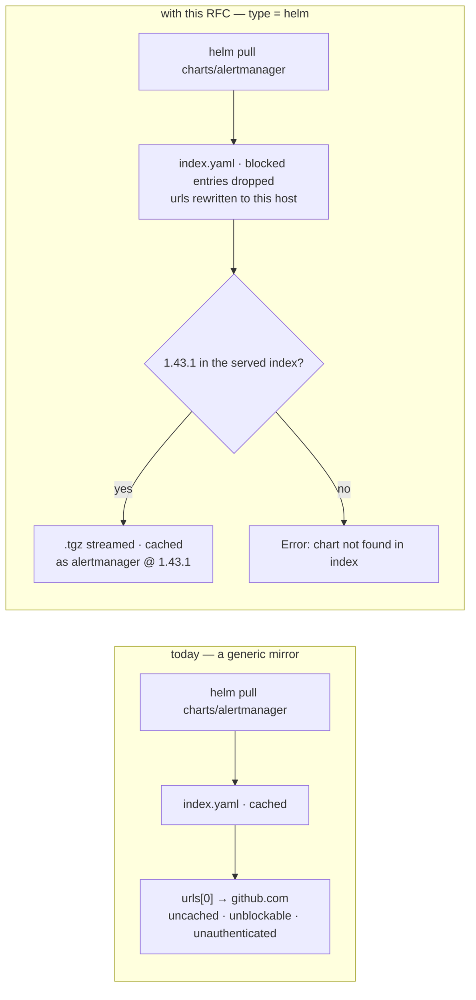
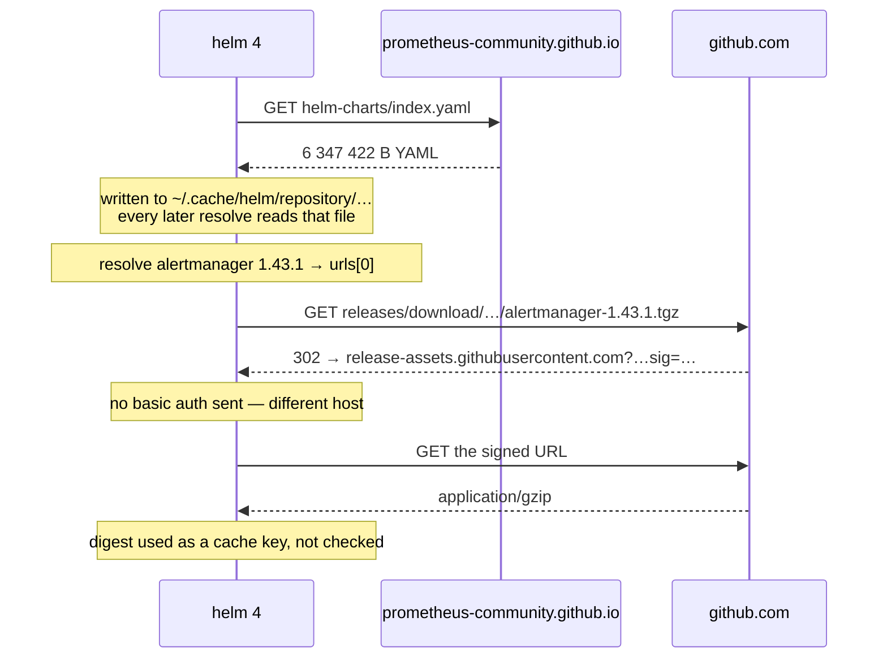
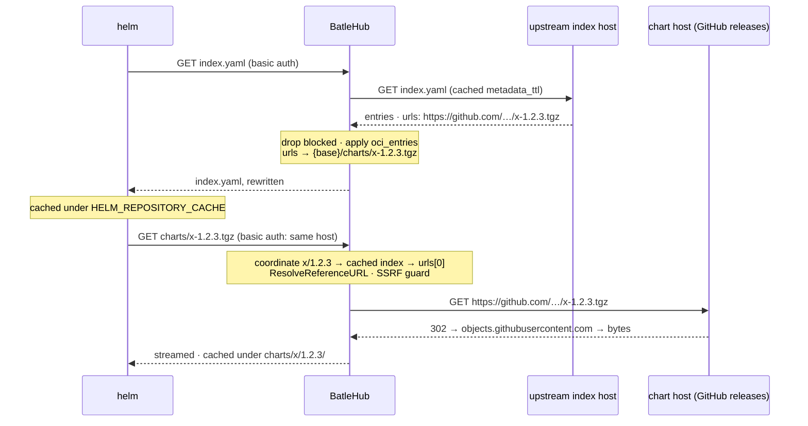
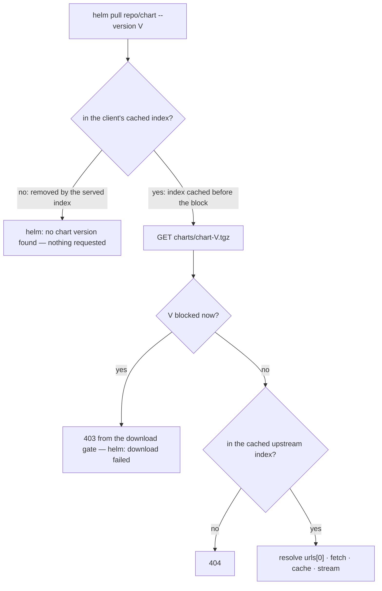
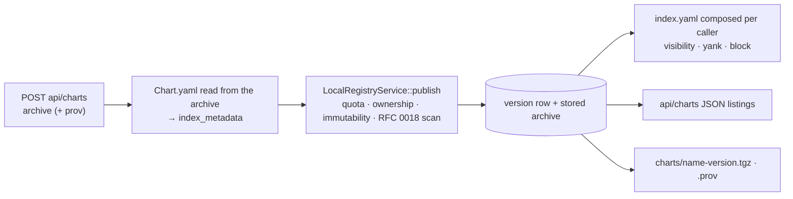

# RFC 0029 — Helm chart repositories

| Field       | Value                                                        |
| ----------- | ------------------------------------------------------------ |
| Status      | Draft                                                         |
| Short       | Helm charts                                                   |
| Settles     | The classic index.yaml chart repository as a registry kind: URL rewriting in the served index, chart archives as artifacts, and index regeneration for local publishing |
| Author      | Max Batleforc <maxleriche.60@gmail.com>                       |
| Co-author   | Claude Fable 5.1 <noreply@anthropic.com>                      |
| Created     | 2026-09-11                                                    |
| Supersedes  | —                                                             |
| Touches     | `crates/core`, `crates/config`, `crates/adapters`, `crates/web`, `server`, `cli`, `ui`, `docs` |

---

## 1. Summary

A Helm chart repository is one document and a pile of archives: `index.yaml`
lists every chart and every version with a `urls` entry per version, and
`helm` fetches the archive that entry names. Today the only way through the
proxy is a `generic` registry pointed at the repository, and it fails at the
one thing the document is for: the `urls` in a real index are **absolute and
point somewhere else**. `ingress-nginx`, `prometheus-community` and `grafana`
publish their index on GitHub Pages and their archives as GitHub release
assets; a client that reads the index through the proxy fetches the chart
from `github.com`, past the proxy, with no cache and no policy. Where the
URLs are relative (`jetstack`), the cache works and the policy still does
not: a path-addressed registry has no version to block.

`type = "helm"` serves a chart repository as a typed registry. `index.yaml`
is the filtered listing and the enforcement chokepoint: `helm` resolves
**every** `repo/chart` reference through its cached copy of it, and a version
absent from it fails on helm's own *"no chart version found"* path with
nothing downloaded. Every `urls` entry in the served index is rewritten to
this instance's chart route, which does two things at once: the fetch lands
here, and the chart's host now matches the repository's host, so `helm` sends
the repository credentials to it — the rule `pkg/getter/httpgetter.go`
applies and this RFC observed on the wire with Helm 4.2.4. The archives and
their `.prov` provenance files are artifacts, cached under a per-version
coordinate the upstream URL is resolved from.

In `local` and `hybrid` mode the registry speaks ChartMuseum's API — `POST
/api/charts` with the archive, the same call `helm cm-push` makes — and
composes `index.yaml` from the database the way `conda` composes
`repodata.json` (RFC 0009), so an in-house chart museum becomes a registry
block rather than a second server.

Two things the roadmap entry assumed are corrected here. The example it
names, Bitnami's `index.yaml`, is a 27 MB document whose current entries
point at `oci://registry-1.docker.io/bitnamicharts/…` — the classic index of
the largest publisher is now a signpost to OCI, and the design has to say
what it does with such an entry (§4.4). And `helm` never verifies the index
or the archive's `digest` on download; the only integrity check in the
install path is the optional `.prov`, which is OpenPGP and is relayed, never
re-signed, for the reason RFC 0008-bis §11 q6 gives.

### Before / after

```text
# today — the index is cached, and the charts it names leave the site
[[registries]]
name       = "charts"
type       = "generic"
upstreams  = ["https://prometheus-community.github.io/helm-charts"]
path_allow = ["index.yaml", "**/*.tgz"]
#   helm repo add charts https://batlehub/proxy/charts/generic
#   helm pull charts/alertmanager
#     → GET https://github.com/prometheus-community/helm-charts/releases/download/…/alertmanager-1.43.1.tgz
#       uncached, unblockable, without the repository's credentials

# with this RFC — one package per chart, one version per entry, the URL is ours
[[registries]]
name      = "charts"
type      = "helm"
mode      = "proxy"
upstreams = ["https://prometheus-community.github.io/helm-charts"]
#   helm repo add charts https://batlehub/proxy/charts/helm --username … --password …
#   helm pull charts/alertmanager --version 1.43.1
#     → GET …/proxy/charts/helm/charts/alertmanager-1.43.1.tgz   (cached, gated, authenticated)
#   block alertmanager 1.43.1
#     → Error: chart "alertmanager" matching 1.43.1 not found in charts index. (try 'helm repo update')
```



The rewrite on the right is what moves the chart fetch onto a host the client
already authenticated to, and the index edit is what makes the refusal
`helm`'s own sentence rather than a download error.

---

## 2. Motivation

1. **The index sends the client past the proxy.** `ResolveChartVersion`
   (`pkg/downloader/chart_downloader.go`) takes `cv.URLs[0]` from the cached
   index and hands it to `repo.ResolveReferenceURL`, which returns an absolute
   URL unchanged. Three of the five repositories probed for this RFC publish
   absolute URLs on a different host than the index (GitHub release assets);
   a `generic` mirror of their index serves a document whose every download
   bypasses the mirror. The cache-hit counter for such a registry counts
   index reads and nothing else, which is the kind of green that hides a gap.

2. **The credentials go with the host.** `httpgetter.go` sends basic auth
   only when `g.opts.passCredentialsAll || (u1.Scheme == u2.Scheme && u1.Host
   == u2.Host)`. Observed with Helm 4.2.4: a repository added with
   `--username/--password` whose index names a chart on another host fetches
   that chart **without** the `Authorization` header; the same fetch with
   `--pass-credentials` carries it. A proxy that leaves upstream URLs in the
   index therefore cannot be an authenticated registry for the charts it
   lists, only for the index. Rewriting the URLs to this instance's host is
   what makes the registry's own RBAC reach the archive.

3. **`generic` cannot say no.** RFC 0010 §2's argument, unchanged: a
   path-addressed registry addresses everything as one synthetic package, so
   there is no version for `BlockListRule`, no row in explore, no age gate,
   no verdict from RFC 0018. A chart with a known-bad release (a template
   that deletes a PVC on upgrade is the classic) has no lever short of
   removing the repository.

4. **The chokepoint exists and it is exact.** `IndexFile.Get` is the only
   way `helm install`, `helm pull`, `helm template`, `helm dependency
   update` and `helm search repo` resolve a `repo/chart` reference, and its
   failure text is a first-class error: *"chart "demo" matching 9.9.9 not
   found in relrepo index. (try 'helm repo update'): no chart version found
   for demo-9.9.9"* — and, for a name with no versions left, *"no chart name
   found"*. Both were observed. A version removed from the served index
   fails exactly the way an unpublished version fails, before any download.

5. **The largest classic index is now a pointer to OCI.** 30 822 of Bitnami's
   entries carry `urls: [oci://registry-1.docker.io/bitnamicharts/…]`; the
   `https://charts.bitnami.com/…tgz` entries are the old versions. `helm`
   treats an `oci://` URL as absolute and pulls it through its registry
   client. A design that "rewrites the URLs" without deciding what an OCI
   entry becomes ships a registry that silently relays the one thing the
   roadmap's *Not planned* note keeps out.

6. **In-house chart museums are a second server for one document.**
   ChartMuseum exists to accept `POST /api/charts` and regenerate
   `index.yaml`; this instance already accepts a publish, stores an archive,
   keeps a version row with metadata and composes a listing from it for
   conda, Composer, RubyGems and NuGet. A chart is the same shape with a
   `Chart.yaml` inside the archive.

---

## 3. Goals / non-goals

**Goals**

- A chart version can be blocked, and a blocked version fails on helm's own
  not-found path with nothing downloaded.
- Every archive a served index names is fetched from this instance, cached
  under a per-version coordinate, and gated by the registry's RBAC — with the
  repository's credentials, because the host matches.
- Relative and absolute upstream URLs are both handled, and the upstream URL
  is resolved with `ResolveReferenceURL`'s own rules, so what this instance
  fetches is what `helm` would have fetched.
- `.prov` files are served beside their archive, byte-exact, so `helm pull
  --verify` works through the proxy exactly as it does against upstream.
- An entry whose URL is `oci://` is handled by an explicit rule, not by
  accident.
- `local`/`hybrid` mode accepts ChartMuseum's upload API, composes
  `index.yaml` from the database, and serves what it holds.
- The age gate works on charts with the `created` timestamp every index
  carries.
- `Chart.yaml` dependencies feed `registry suggest`.

**Non-goals**

- **OCI charts** — `helm push`, `oci://` references, `helm pull oci://…`.
  The roadmap's *Not planned* note stands; Harbor does this. What this RFC
  decides about OCI is only what to do with an `oci://` entry inside a
  classic index (§4.4).
- **Rewriting `index.yaml` byte-exact.** The document is parsed and
  re-emitted; `helm` has no checksum or signature over it, so there is
  nothing to preserve but the fields.
- **Re-signing or generating `.prov`.** OpenPGP, the `rsa` ban, and the
  publisher's-provenance argument of RFC 0008-bis §11 q6. `.prov` is relayed
  in proxy mode and stored as uploaded in local mode.
- **The Helm binary** (`get.helm.sh`), covered by `generic`.
- **ChartMuseum's multitenancy depth** (`--depth`, `/org1/repoa/…`). One
  registry is one repository; a second repository is a second registry
  block.
- **`helm repo index --merge` semantics for local mode.** The served index
  is composed from rows, never from a stored `index.yaml`.
- **Rendering `index.yaml` as JSON.** Helm's `jsonOrYamlUnmarshal` would
  accept it; a person reading the URL in a browser would not.

---

## 4. User-facing design

### 4.1 Configuration

```toml
[[registries]]
name      = "charts"
type      = "helm"
mode      = "proxy"                                             # or local / hybrid
upstreams = ["https://prometheus-community.github.io/helm-charts"]   # the directory index.yaml lives in

# What an index entry whose urls[0] is oci:// becomes in the served index.
#   "drop"  — the entry is omitted; the chart is not installable through this
#             registry (default: an entry the proxy cannot serve is one the
#             policy cannot reach).
#   "relay" — the entry is served as upstream wrote it; helm pulls it from the
#             OCI registry directly, past this instance. For an estate that
#             mirrors OCI elsewhere and wants one `helm repo add`.
oci_entries = "drop"

[registries.rbac]
# index.yaml and the ChartMuseum listing routes are listings (`releases:list`);
# the archives and .prov files are reads (`releases:read`). An install needs both.
anonymous = ["releases:read", "releases:list"]
# helm cm-push / POST /api/charts
developers = ["releases:publish"]
```

- `upstreams` absent is an error: there is no default chart repository the
  way there is a default npm registry. The value is the directory
  `index.yaml` sits in — what `helm repo add` takes — not the file (§4.5).
- `oci_entries` absent means `drop`. It is rejected on any other kind.
- `mode = "local"` needs no `upstreams`; `hybrid` composes local rows over
  the upstream index, local winning on a `{name, version}` collision, the
  rule every other hybrid kind applies.

### 4.2 The client side

```bash
helm repo add charts https://batlehub.example.com/proxy/charts/helm \
  --username "$USER" --password "$BATLEHUB_TOKEN"
helm repo update
helm search repo charts/                # reads the cached index — filtered
helm pull charts/alertmanager --version 1.43.1 --verify   # .tgz then .tgz.prov, both through the proxy
helm install am charts/alertmanager

# local / hybrid — publishing, ChartMuseum's API
helm package ./mychart
curl --data-binary "@mychart-0.1.0.tgz" -H "Authorization: Bearer $BATLEHUB_TOKEN" \
  https://batlehub.example.com/proxy/charts/helm/api/charts
helm cm-push mychart-0.1.0.tgz charts    # the plugin makes the same POST
```

`helm` sends basic auth from `--username/--password` on every request to the
repository's scheme and host, and the rewritten URLs are on that host. There
is no `~/.netrc` to think about and no `--pass-credentials` to explain: the
registry page can say "add with `--username` and `--password`" and stop.
Bearer tokens for `curl` publishing are what every other registry's page
already shows.

### 4.3 Coordinates

| Request (under `…/proxy/{reg}/helm/`) | `PackageId` | Cache key |
| --- | --- | --- |
| `charts/alertmanager-1.43.1.tgz` | `alertmanager` / `1.43.1` / `alertmanager-1.43.1.tgz` | `charts/alertmanager/1.43.1/alertmanager-1.43.1.tgz` |
| `charts/alertmanager-1.43.1.tgz.prov` | `alertmanager` / `1.43.1` / `alertmanager-1.43.1.tgz.prov` | `charts/alertmanager/1.43.1/alertmanager-1.43.1.tgz.prov` |
| `index.yaml` | registry-wide, name unused | metadata, `versions` |
| `api/charts` (local) | registry-wide | composed from rows |
| `api/charts/{name}` (local) | `name` | composed from rows |

**The file name is the coordinate, and the index is the map back.** The
route is `charts/{name}-{version}.tgz`; the handler splits on the last `-`
that precedes a version (`ChartVersion.Version` is semver, and chart names
may contain dashes: `kube-prometheus-stack-65.1.0.tgz`), the same walk
`coordinate_of` does for rustup's component files (RFC 0024 §4.3). The
upstream URL for that coordinate is not in the request: the client reads
`urls[0]`, resolves it, and fetches the served route; the adapter looks the
same `{name, version}` up in the **cached upstream index** and resolves
upstream's `urls[0]` the way `helm` would have. There is no second source of
truth for where a chart lives, and a coordinate the upstream index does not
list is a `404`.

### 4.4 Behaviour rules

**The served index is upstream's index with three edits.** Parsed, then
re-emitted as YAML with every field preserved except:

- **`urls` becomes one URL, ours.** `{public_base}/charts/{name}-{version}.tgz`
  — `helm` reads `URLs[0]` only, and a served index that kept a second,
  upstream, entry would keep a way past the proxy that a future helm might
  take. The file name is `{name}-{version}.tgz` regardless of what upstream
  called the file, because the coordinate has to be recoverable from the
  route (§4.3); the upstream name is remembered in the index cache, not in
  the URL.
- **Blocked versions are removed.** The entry list for a chart loses the
  version; a chart with no version left loses its key. `helm` then reports
  *"no chart version found"* or *"no chart name found"*, its own text.
- **OCI entries follow `oci_entries`.** `drop` omits the version; `relay`
  serves it as written. A chart whose every version is dropped loses its
  key, so `helm search repo` does not advertise what `helm pull` cannot get.

`generated`, `apiVersion`, `entries[*][*].digest`, `created`, `annotations`
and every other field pass through. `digest` in particular: it is the
SHA-256 of the archive as upstream published it, and the archive is served
byte-exact, so a tool that does compare (Helm's own `helm dependency`
lockfile does not, on download) finds it true.

**The uninteresting case is a copy.** With nothing blocked, `oci_entries` on
an index with no OCI entry and the default RBAC, the served index differs
from upstream's in `urls` and in YAML formatting only. The metadata cache
holds upstream's document; the rewrite runs on read and its result is
cached under the block set's fingerprint for `metadata_ttl`, because a 6 MB
YAML parse per `helm repo update` across a fleet is a cost worth paying
once per TTL, not once per client.

**Resolving upstream's URL is `ResolveReferenceURL`, transcribed.** For the
entry's `urls[0]`: an absolute URL is taken as is; a relative one is
resolved against the upstream repository URL with its path forced to end in
`/` and the base's query string kept. That last clause matters for a
repository served behind a signed-URL scheme (`?token=…` on the base): Helm
carries the query onto every relative chart URL, and so does this adapter.
The fetch goes through `ssrf::fetch_following_redirects` with the SSRF guard,
because an absolute chart URL can name any host and GitHub's release assets
answer with a `302` to `objects.githubusercontent.com` — the SDKMAN broker's
shape (RFC 0010 §4.4), and the same rule: the bytes come back through this
instance, or not at all.

**`.prov` is the archive's sibling, byte-exact.** `DownloadTo` fetches
`u.String() + ".prov"` when `--verify` is given; the served route is the
archive route with `.prov` appended and it resolves to upstream's URL with
`.prov` appended, exactly as `helm` would have built it. A `404` upstream is
a `404` here, and `helm` prints its own *"failed to fetch provenance"*, which
this RFC observed. The file is OpenPGP-signed by the publisher and is never
touched.

**`helm` caches the index client-side.** `helm repo add` and `helm repo
update` fetch `index.yaml` once and write it under `HELM_REPOSITORY_CACHE`;
`helm pull` and `helm install` read the cache and do **not** re-fetch.
Observed: one `GET /index.yaml` per `repo add`, none per `pull`. A version
blocked after a client's last `repo update` is therefore still resolvable
from that client's stale index, and the archive fetch is what refuses it —
a `403` from the download gate, which `helm` reports as a download failure
rather than its clean not-found. The block holds; the message degrades until
the next `helm repo update`. The registry page says so, as `nodedist`'s does
for nvm's alias cache (RFC 0010 §4.4).

**Local and hybrid mode compose the index from rows.** A published chart's
`Chart.yaml` is read out of the archive at publish time
(`name`, `version`, `appVersion`, `description`, `apiVersion`, `type`,
`kubeVersion`, `keywords`, `maintainers`, `dependencies`, `annotations`) into
`index_metadata`; the composed entry is that map plus `urls` (ours),
`digest` (the stored checksum), `created` (the publish time). Yanked
versions are omitted, not marked `removed`. `hybrid` merges the composed
entries over the rewritten upstream ones, local winning on `{name,
version}`. The visibility rule is RFC 0015 §4.4's, applied through
`load_visible_versions_in` exactly as `get_conda_repodata` applies it: a
private chart is not listed to a caller the archive route would refuse.

**The ChartMuseum surface, and what each route is.**

| Route | Meaning |
| --- | --- |
| `POST api/charts` | Publish. Body is the archive (`--data-binary`) or a multipart form with `chart=` and optional `prov=`; `?force` is `releases:overwrite`, and without it a second publish of the same version is `409`. |
| `POST api/prov` | Attach a `.prov` to an already published version; the version is read from the file's `Chart.yaml` block. |
| `DELETE api/charts/{name}/{version}` | `releases:delete`. |
| `GET api/charts`, `api/charts/{name}`, `api/charts/{name}/{version}` | JSON listings of what the caller may see, composed from the same rows as the index; `HEAD` variants answer existence. |
| `GET api/charts` with `?offset=&limit=` | Paged as ChartMuseum pages, because the `helm cm-push` plugin and Artifact Hub's ChartMuseum tracker both read it. |

`helm cm-push` does `POST api/charts` with a multipart body and, when it
signed the package, `prov=`; it reads the response status and nothing else.
No other client of the API is known to this RFC, which is why the JSON
listings are composed generously and validated narrowly.

### 4.5 Validation

`AppConfig::validate()` rejects:

| Condition | Rationale |
| --- | --- |
| `type = "helm"` in `proxy`/`hybrid` mode with no `upstreams` | No default exists; `requires_explicit_upstream_in_proxy_mode()` answers `true` as it does for `generic`. |
| An `upstreams` entry whose path ends in `index.yaml` | The value is the repository directory, what `helm repo add` takes; an entry naming the file would put the index at `…/index.yaml/index.yaml`. Rejected with the fix named, because it is the most likely thing to paste. |
| `oci_entries` on a registry whose type is not `helm` | A silently ignored option is a misconfiguration that looks like a proxy bug (RFC 0010 §4.5). |
| `oci_entries` not `drop` or `relay` | Closed vocabulary. |
| `path_allow` on a `helm` registry | Not path-addressed; the existing validator refuses it on every such kind. |

Warnings (logged and surfaced to the admin):

| Condition | Behaviour |
| --- | --- |
| `oci_entries = "relay"` | Logged once at reload: entries with `oci://` URLs will be installed past this instance, uncached and ungated. The console's registry card carries the same line, because "the registry is configured to bypass itself for some charts" is a fact an operator reads there, not in a log. |
| An upstream index with more than one URL in an entry | Served with ours only; counted, and named once per reload, so an operator who expected mirror fallback learns it is not a thing `helm` does either. |

---

## 5. Architecture

### 5.1 The protocol as a real chart repository serves it

No proxy in this subsection. The numbers were observed against
`prometheus-community.github.io/helm-charts` while writing this RFC; the client
behaviour is read from helm 4's `pkg/downloader/chart_downloader.go` and
`pkg/repo`.

| Request | Answers | Type · size | What helm does with it |
| --- | --- | --- | --- |
| `{repo}/index.yaml` | every chart and every version the repository holds | `text/yaml` · **6 347 422 B** for prometheus-community | `helm repo add` and `helm repo update` write it to `~/.cache/helm/repository/{name}-index.yaml`; every later resolution reads that file, not the network |
| the entry's `urls[0]` | the chart archive | `application/gzip` · resolved relative to the repository URL when it is not absolute | `helm pull`/`install` fetch it with `Accept: application/gzip,application/octet-stream` |
| `{that URL}.prov` | the detached provenance signature | | fetched **only** with `--verify`; `VerifyAlways` fails when it is missing, `VerifyIfPossible` warns |

**That is the entire protocol: one document and one file per version.** There
is no per-chart endpoint, no search API and no version listing — `helm search
repo` reads the cached index, which is why an edit to the index is felt by
every command and why the index is the only chokepoint there is.

An entry, as served:

```yaml
  alertmanager:
  - apiVersion: v2
    appVersion: v0.34.0
    created: "2026-09-11T12:39:49.209345931Z"
    description: The Alertmanager handles alerts sent by client applications…
    digest: d370858f873b904a966e64d530874e645114a86a3095f7afc43ed65b217afab8
    home: https://prometheus.io/
    name: alertmanager
    urls:
    - https://github.com/prometheus-community/helm-charts/releases/download/alertmanager-1.43.1/alertmanager-1.43.1.tgz
    version: 1.43.1
```

Three facts in those twelve lines decide the design:

- **`urls[0]` is absolute and on a different host.** For this repository it is
  `github.com`, which answers `302` to a signed
  `release-assets.githubusercontent.com` URL with an expiry and a JWT in its
  query — observed. An unrewritten index therefore sends every chart fetch to
  two hosts that are not the repository, which is §2's motivation twice over:
  the bytes are never cached, and helm sends the repository's basic auth only
  to the repository's own scheme and host, so the fetch is also
  unauthenticated.
- **`digest` is a cache key, not a checksum helm enforces.** In helm 4's
  `DownloadTo` the digest is decoded, used to look the archive up in the local
  content cache, and never compared against the downloaded bytes; verification
  is the `.prov` path and nothing else. Two consequences: this instance must
  relay the digest unchanged so the client's cache stays coherent, and a chart
  already in a machine's content cache is installed without a request at all —
  a block reaches that machine when its cache is cleared, not before. Nothing
  the proxy can do changes that, and the registry page says so.
- **`created` is per version and RFC 3339**, which is what an age gate reads.

**What helm verifies.** With `--verify`, the `.prov` file's PGP signature over
the chart, against the keyring the user supplies; without it, nothing. The
index itself is unsigned — there is no repository signature to preserve, which
is exactly why this kind can filter its listing while `deb`, `rpm`, `pacman`
and `apk` cannot.

**Credentials.** `helm repo add --username/--password` become HTTP Basic, sent
only to the repository's own scheme and host unless `--pass-credentials` is
given. A rewritten `urls[0]` on the registry's host is therefore both cached
*and* authenticated; the upstream form is neither.

**The spellings.** A chart is a lower-case name that may contain dashes; a
version is semver; the archive is `{name}-{version}.tgz` and its provenance
`{name}-{version}.tgz.prov`. `kube-prometheus-stack-65.1.0.tgz` is the case
that forces the split rule in §4.3.



`helm repo update` is one request; `helm install` is one request per chart, to
whatever host the index named. The proxy's whole job is to make that second
host be this one.

### 5.2 The index is the map, in both directions



The invariant: **the client never holds an upstream URL.** Every URL the
served index carries is on this host, so every fetch it can cause arrives
here, carries the repository's credentials, and is resolved back to upstream
from the same cached document the index was rendered from. A coordinate the
cached index does not list has no upstream URL and is a `404`; nothing in
the request can name a host.

### 5.3 Where a block becomes effective



The listing is the enforcement point and the download gate is diagnosis, as
RFC 0010 §5.3 states it; the one difference from `nodedist` is that the
client's own cache can be stale, and the diagram names what the stale path
costs: helm's own message is replaced by a download error until the next
`helm repo update`.

### 5.4 Local mode composes what conda composes



Nothing here is new machinery: the publish funnel, the row, the storage key
and the per-caller listing are what `eco_conda.rs` and `eco_composer.rs`
already do, and the RFC 0016 tombstone rule applies to a deleted chart
version as it does to every other coordinate.

---

## 6. Detailed design

### 6.1 `crates/core` — the registry kind

`RegistryKind::Helm` is added to the enum and to `ALL`. The wildcard-free
matches then refuse to compile until answered (`registry_kind.rs`,
`upstream_detail`, `blocking`, `listing_synthesis`, `builders.rs`).
`supports_local_mode() = true`,
`requires_explicit_upstream_in_proxy_mode() = true`,
`is_path_addressed() = false`; the rest:

| | `helm` |
| --- | --- |
| `listing_filter()` | `Filtered("index.yaml", ["versions"])`, `Filtered("api/charts listings", ["api-charts"])` |
| `readme_support()` | `Archive` — `README.md` at the chart root, the convention `helm show readme` relies on |
| `upstream_detail()` | `Document("versions")` — the index, with `created`, `appVersion`, `description` and `deprecated` per version |
| `fetchable_by_version()` | `Some` — one archive per version, `charts/{name}-{version}.tgz` |
| `warm_artifact()` | the same archive; `warm_packages = ["alertmanager@1.43.1"]` warms it |
| `blocking_package_name()` | identity |

`DocumentKind::API_CHARTS = Secondary("api-charts")` is added for the JSON
listings. `index.yaml` is `Versions`: it is the registry's one version
listing, registry-wide, which `listing_synthesis::is_registry_wide` already
knows how to key (conda's `repodata.json` is the precedent).

### 6.2 `crates/core` — `services/helm.rs` and `blocking/helm.rs`

`services/helm.rs`, no I/O:

- `Index` — the parsed document: `api_version`, `generated`, `entries:
  BTreeMap<String, Vec<Entry>>`, with `Entry` keeping `name`, `version`,
  `urls`, `created`, `digest`, and `rest: serde_yaml::Mapping` for every
  other field, so what is not interpreted is not lost. Parsed and re-emitted
  with `serde_yaml` (§11 decision 1). Entries with no `version` are dropped,
  as `loadIndex` drops them.
- `coordinate_of(file) -> Result<(name, version)>` — the last-dash walk of
  §4.3, with `validate_package_name` on the name and a semver parse on the
  version; `.prov` recognised as a suffix on the same file.
- `resolve_reference(base, reference) -> Url` — `ResolveReferenceURL`
  transcribed, with the absolute case, the forced trailing slash and the
  kept base query, and a unit test per clause against the Go function's own
  cases.
- `rewrite(index, public_base, oci_entries) -> Index` — the three edits of
  §4.4, returning the dropped OCI count for the warning.
- `render(index) -> String` — YAML out, keys in Helm's own order
  (`apiVersion`, `entries`, `generated`), so a human diff against upstream
  is a diff of `urls` lines.
- `chart_yaml_from_archive(bytes) -> ChartYaml` — reads `{root}/Chart.yaml`
  out of the gzip'd tar through the `tar` crate (which refuses `..`, the
  scanner-canary note), for publish and for the readme reader's root.

`blocking/helm.rs`, from `blocking::strip`: `Versions` → `with_text` over
the parsed index, dropping blocked `{name, version}` pairs and empty charts;
`API_CHARTS` → `with_json`, the same filter over the JSON shape.
`blocking::rewrite_urls` gains a `Helm` arm calling `helm::rewrite`, beside
npm's and Composer's — the one place URL rewriting lives, so it cannot be
forgotten at a call site (the file's own comment).

### 6.3 `crates/config`

- `RegistryConfig::oci_entries: Option<OciEntries>` with `Drop | Relay`,
  documented as helm-only; the §4.5 rules beside the `broker_url` checks.
- `CURRENT_CONFIG_VERSION` does not move: the field is optional and the kind
  is additive.

### 6.4 `crates/adapters` — `registry/helm/`

A directory: the index model, the upload parsing and the URL resolution
would crowd a flat file.

- `client.rs` — `HelmRegistryClient { http, base, … }`.
  - `fetch_version_document(_, Versions)` → `GET {base}/index.yaml`,
    `text/yaml`; the metadata cache holds upstream's bytes; the rewrite runs
    on read.
  - `resolve_metadata(pkg)` → the entry from the cached index;
    `published_at` is `created`, which every `helm repo index` output
    carries; `CoreError::NotFound` when absent.
  - `fetch_artifact(pkg)` → the entry's `urls[0]`, resolved, fetched through
    `ssrf::fetch_following_redirects`; `.prov` by appending. Streamed.
  - `list_versions(name)` → the entry versions, newest first as
    `SortEntries` orders them.
- `models.rs` — the ChartMuseum JSON shapes (`api/charts` responses) and
  the multipart upload form.
- `tests.rs` — `mockito`, spanning both files: absolute and relative
  `urls`, a base with a query string, a `302` chain, a `.prov` `404`, an OCI
  entry under both settings. Fixtures are trimmed copies of jetstack's
  (relative URLs, `.prov` present) and ingress-nginx's (absolute GitHub
  URLs) indexes, dated.

### 6.5 `crates/web` — handlers and routes

`handlers/proxy/helm/`, prefix `/proxy/{registry}/helm/`:

| Route | Handler |
| --- | --- |
| `GET index.yaml` | `index_yaml` — filtered, rewritten document; hybrid composes |
| `GET charts/{file}` | `chart_file` — `proxy_stream` for `.tgz` and `.tgz.prov`; local reads first in local/hybrid |
| `POST api/charts` | `publish` — raw or multipart; `?force` |
| `POST api/prov` | `publish_prov` |
| `DELETE api/charts/{name}/{version}` | `delete` |
| `GET api/charts` · `api/charts/{name}` · `api/charts/{name}/{version}` | `api_list` — composed JSON, paged |
| `HEAD api/charts/{name}` · `api/charts/{name}/{version}` | existence |

Three obligations from the existing rules:

- **Validate at the edge.** `{file}` through `coordinate_of` (a `400` for a
  name `validate_package_name` refuses, a version that is not semver, or
  `..`); `{name}` and `{version}` on the API routes the same way. The
  publish handler validates the archive's `Chart.yaml` `name` and `version`
  before either reaches a storage key — the
  `helm_publish_traversal_version_returns_400` test of §10 is the
  `CLAUDE.md` pattern.
- **`body = T` on every success response.** `index_yaml` takes
  `ProtocolDocument`; `chart_file` takes `ArtifactBytes`; the API listings
  get named `ToSchema` structs in `models.rs`, because they are JSON of the
  handler's own shape.
- **Route ordering.** `index.yaml` and `api/…` before `charts/{file}`; the
  conformance fixture asserts the matched pattern.

`public_base` for the rewrite is the same value `composer::rewrite_dist_urls`
receives, so a registry behind a subdomain (RFC 0001) rewrites to the host
the client used.

### 6.6 `server`

`builders.rs`'s exhaustive `match` forces one arm: `HelmRegistryClient` from
`resolve_urls(&reg.upstreams, "")` — no default, which `validate()` already
guarantees is never reached empty — with `reg.oci_entries` handed to the
render.

### 6.7 Rules

`DenyLatestRule` and `BlockListRule` read the coordinate. `ReleaseAgeGateRule`
reads `published_at`; every proxied chart has `created` and every local one
has its publish time, so no coordinate reaches the gate undated and the
mandatory `deny_missing_timestamp` of RFC 0010 §6.7 does not apply here. RFC
0018's verdicts hide a version from the served index through the same
`blocked_versions_for` every listing consults; the scan runs on the archive
at publish and on first proxy fetch, and a chart is a tarball of templates,
which the existing archive scanners already open.

### 6.8 `ui` and `docs`

- `ui/src/config/registryTypes.ts` — a `REGISTRY_TYPE_DEFS` entry with the
  `helm repo add` line and the `curl --data-binary` publish, labelled *Helm
  charts (classic repository)* so nobody expects OCI from it.
- `docs/registries/helm.md`, with its support and endpoint tables generated,
  and the four lines the page must carry: the client-side index cache and
  the degraded message it causes; what `oci_entries` does and that `relay`
  bypasses; `.prov` is relayed and `--verify` works or fails exactly as
  upstream; add with `--username/--password`, never `--pass-credentials`.
- `docs/registries/index.md` and the `/registries/` sidebar; `generic.md`
  gains one line pointing here for anyone mirroring an index with it.
- `ROADMAP.md` — the entry's Bitnami example is corrected (it is an OCI
  signpost now) and the entry moves to done at landing; `docs/guide/roadmap.md`
  regenerated.

### 6.9 `cli` — `Chart.yaml` dependencies

`batlehub registry suggest` reads `Chart.yaml`'s `dependencies[].repository`
beside `mise.toml` and `.nvmrc`: every `https://` repository becomes a
`helm` registry block, `oci://` ones are reported as out of scope, and
`name@version` pairs feed `warm_packages`. `Chart.lock` is read in preference
when present, because it pins the resolved versions.

### 6.10 `tests/heavy/helm.sh`

A heavy suite, `config.helm.toml`, `task test:helm-heavy`, an entry in
`task test:heavy`, a row in the `heavy-client` matrix. `helm` is on the
runner image and 4.2.4 is on this machine; `HELM_REPOSITORY_CONFIG`,
`HELM_REPOSITORY_CACHE`, `HELM_CONFIG_HOME` and `HELM_CACHE_HOME` are
redirected into the run's temp directory so the suite never touches the
runner's repositories. Two upstreams, because they differ in the one way
that matters: `charts.jetstack.io` (relative URLs, `.prov` published) and
`kubernetes.github.io/ingress-nginx` (absolute GitHub release URLs). What it
proves, on the wire, through the tap:

1. `helm repo add` reads `index.yaml` through the proxy with basic auth;
   every `urls` entry in the served document is on the tap's host; no
   `oci://` survives under the default.
2. `helm pull jet/cert-manager --version v1.21.2 --verify` fetches the
   archive **and** `.prov` from the proxy, and `helm` reports the signature
   verified against the cert-manager keyring — so the archive and the
   provenance both came through byte-exact.
3. `helm pull nginx/ingress-nginx --version 4.15.1` fetches through the
   proxy; the tap shows **no** request left for `github.com` from the
   client, and the server log shows the `302` chain followed server-side.
4. With `4.15.0` blocked through the admin API and `helm repo update` run,
   `helm pull nginx/ingress-nginx --version 4.15.0` exits non-zero with
   *"no chart version found for ingress-nginx-4.15.0"* and requests nothing
   under `charts/`.
5. Without `helm repo update` after a block, the same pull is refused at the
   archive with a `403` and `helm` reports a download failure — the stale
   cache path of §4.4, observed rather than described.
6. A second pull from a fresh cache directory moves
   `batlehub_artifact_cache_hits_total`.
7. Local mode: `helm package` a chart, `curl --data-binary` it to
   `api/charts`, `helm repo add` the same registry, `helm pull` it back and
   compare digests; a second `POST` without `?force` is `409`; `DELETE`
   removes it from the next `index.yaml`.

Everything in §4.4 about `helm` was read from Helm's source and observed
with Helm 4.2.4 against two local repositories during the writing of this
RFC (basic-auth host rule, `.prov` fetch and error text, not-found texts,
one index fetch per `repo add`); the suite is what keeps it observed.

### 6.11 Air gap (RFC 0008-bis)

A disconnected instance composes `index.yaml` from the held archives, each
entry its own `Chart.yaml` read at import, `digest` from the stored checksum,
`created` from the receipt — the conda row of RFC 0008-bis §4's table with
`Chart.yaml` where `info/index.json` was. `.prov` files travel as artifacts
of their version. Phase 6, on its own.

**Deliberately untouched**, so reviewers do not go looking:

- `crates/adapters/src/registry/path_proxy.rs` — `generic` keeps serving an
  index for anyone who wants it cached without policy; the registry page
  says which charts that loses.
- `crates/core/src/services/blocking/composer.rs` — the closest rewrite, and
  not shared: Composer rewrites JSON `dist.url` fields to a route with no
  extension, the index rewrites YAML `urls` lists to a file name. Two
  ten-line functions beat one with a mode flag.
- `crates/core/src/rules/release_age.rs` — no new branch; `created` arrives
  as `published_at`.
- Anything OCI: no `registry` crate, no manifest parsing, no `oci://` fetch.
  `relay` is a string copied into the served index.

---

## 7. Security considerations

- **The chart host is attacker-adjacent by design.** An index entry's URL
  can name any host, and this instance fetches it on the client's behalf.
  Every such fetch goes through the SSRF guard with redirects followed
  server-side, the SDKMAN broker rule, so a hostile index cannot make the
  proxy read a private address. The URL comes from the **cached upstream
  index**, never from the request, so a client cannot supply one either.
- **Credentials now reach the archive, and only ours.** Before this RFC the
  repository's basic auth was sent to the index only (host rule); after it,
  to this instance's chart route, which is the point. It is never forwarded
  upstream: the upstream fetch uses the registry's own upstream credentials
  as every kind does. A client that set `--pass-credentials` against a
  `generic` mirror was sending its BatleHub token to `github.com`; the
  registry page says to drop the flag.
- **Trust boundary of the index.** `helm` has no signature or checksum over
  `index.yaml`, so the served document was never verifiable and still is
  not; what this instance changes in it is enumerated (§4.4) and the
  `digest` per version is upstream's, unedited. An operator who needs
  provenance uses `--verify`, which is `.prov`, relayed byte-exact.
- **`relay` is a documented bypass**, warned at reload and on the registry
  card. Its default is `drop` so that a registry never bypasses itself
  without being told to.
- **Publish is the existing funnel.** Quota, ownership, immutability
  (`?force` is `releases:overwrite`, refused where the namespace is
  immutable), RFC 0018 scanning and RFC 0016 tombstones all apply through
  `LocalRegistryService::publish`; the `Chart.yaml` name and version are
  validated before they become a key, and the archive is opened with the
  `tar` crate, which refuses traversal.
- **Visibility.** The composed index is per caller through
  `load_visible_versions_in`, the fix `get_conda_repodata` carries the
  comment for; a private chart is never listed to a caller the archive route
  refuses.
- **No new unauthenticated surface.** `releases:list` for the index and the
  API listings, `releases:read` for the files, `releases:publish` /
  `releases:overwrite` / `releases:delete` for the API writes.

---

## 8. Alternatives considered

| Alternative | Why rejected |
| --- | --- |
| Keep `generic`, add `path_allow` for `index.yaml` and `*.tgz` | Serves the index unchanged, so absolute URLs bypass the proxy and drop the credentials (§2.1, §2.2); nothing to block. This is what the roadmap's own `get.helm.sh` example already covers, for the binary. |
| Rewrite `urls` but keep upstream's as `urls[1]` | `helm` reads `[0]` only today; a second entry is a future bypass for no present benefit, and a mirror-fallback semantics `helm` does not have. |
| Serve the chart route as `{upstream file name}` rather than `{name}-{version}.tgz` | The coordinate must be recoverable from the request for the storage key and the gate; upstream file names are not guaranteed to carry either (`cert-manager-v1.21.2.tgz` does, `chart.tgz?dl=1` does not). |
| Fetch the archive by following the request's own URL (a `?from=` parameter) | A client-supplied upstream URL is an SSRF surface and a way past the block set. The index is the only source of URLs. |
| Relay OCI entries by default | The registry would silently install past itself for the largest publisher's every current version. `drop` fails visibly, `relay` is a choice. |
| Parse the index into a full typed struct | The schema is open (`annotations`, `artifacthub.io/*`, deprecated fields); a typed struct drops what it does not know, and the rest map keeps it. |
| Local mode stores an `index.yaml` and merges on publish (`helm repo index --merge`) | A stored index is a second source of truth beside the rows, and the one that goes stale on a yank or a visibility change. Compose from rows, as conda does. |
| Sign `.prov` for locally published charts | OpenPGP; `rsa` is banned; the publisher signs with their own key and uploads the `.prov`, which is how ChartMuseum works too. |

---

## 9. Rollout and compatibility

- **Default behaviour** when not configured: nothing changes; `generic`
  registries on chart repositories keep working, and the registry page says
  what they lose.
- **Config migration**: none. `oci_entries` is optional; the kind is
  additive.
- **Operator prerequisites**: egress to the index host and to every chart
  host the index names (GitHub releases and `objects.githubusercontent.com`
  for the three GitHub-hosted repositories probed); `docs/operations/egress.md`
  gains the line. `limits.max_artifact_size_bytes` is not a concern: charts
  are kilobytes.
- **Migrating a fleet from `generic`**: `helm repo add` the new URL under
  the same name (`helm repo add` refuses a changed URL for an existing name
  without `--force-update`), `helm repo update`; drop `--pass-credentials`
  if it was set.
- **Rollback**: remove the registry block; cached archives stay until
  retention takes them. Locally published charts are rows and objects like
  every other kind's and survive a rollback of the kind untouched.

---

## 10. Test plan

- **Unit** (`crates/core/src/services/helm.rs`): `coordinate_of` on
  dashed names, `v`-prefixed versions (`cert-manager-v1.21.2.tgz`),
  prereleases, `.prov`, and traversal; `resolve_reference` against each
  clause of `ResolveReferenceURL` (absolute, relative without and with a
  trailing slash on the base, a base with a query); `rewrite` on the two
  fixtures under both `oci_entries`; `render` round-trips through the
  parser and keeps unknown fields; `chart_yaml_from_archive` on a real
  `helm package` output.
- **Unit** (`blocking/helm.rs`): a blocked version removed, a chart with no
  versions left removed, the JSON listings the same.
- **Adapter** (`registry/helm/tests.rs`): the `302` chain, the `.prov`
  `404`, `published_at` from `created`, a coordinate absent from the index
  is `NotFound`, the multipart and raw upload forms.
- **Integration** (`crates/web/tests/local_helm_registry.rs`): every
  route; the served index's `urls` all on the public base; blocked ⇒ absent
  and `403` at the file; `helm_publish_traversal_version_returns_400`;
  `?force` without `releases:overwrite` ⇒ `403`; hybrid merge with local
  winning; the per-caller composed index (a private chart absent for an
  anonymous caller); `openapi_contract` sees `body = T` everywhere.
  `blocked_versions_hidden_helm.rs` beside the conda and Composer ones.
- **Conformance** (`protocol_conformance.rs`): a `HELM` fixture quoting
  `pkg/repo/chartrepo.go` `DownloadIndexFile`, `chart_downloader.go`
  `ResolveChartVersion` and `DownloadTo`, and ChartMuseum's README for the
  API routes.
- **Heavy** (`tests/heavy/helm.sh`): §6.10.
- **Existing suites** that must pass unchanged: the whole of `crates/web`
  (the exhaustive matches, `every_advertised_filter_is_reachable_from_dispatch`);
  `tests/heavy/conda.sh` and `composer.sh`, whose local-mode machinery this
  reuses; `tests/heavy/pathproxy.sh`, which proves `generic` still serves
  the same tree.

---

## 11. Decisions and open questions

### Resolved

| # | Question | Decision |
| --- | --- | --- |
| 1 | The YAML crate | **`serde_yaml`**, and the reason this question carried is wrong: its only RustSec advisory is RUSTSEC-2018-0005, fixed in 0.8.4 and inert for the current 0.9.34, and the database holds no unmaintained advisory for it — checked 2026-09-12, so `cargo deny` passes today. The crate is archived, which makes §6.2's `serde_yaml::Mapping` literal and leaves one live risk: a future unmaintained advisory, which under this repository's no-suppressions stance would fail CI. The swap is then `serde_yaml_ng`, which is API-compatible, and the floor is `yaml-rust2` or `saphyr` with a hand-written emitter. Decided 2026-09-12. |
| 2 | What does an `oci://` entry become? | **Dropped by default, relayed on request.** An entry the proxy cannot serve is one the policy cannot reach; the largest classic index is mostly such entries, so the default has to fail visibly and the alternative has to be a written choice. |
| 3 | Keep upstream's URL as a second `urls` entry? | **No.** `helm` reads `[0]`; a second entry is a bypass waiting for a client that reads it. |
| 4 | Rewrite byte-exact or re-emit? | **Re-emit.** Nothing verifies the index, and a byte-exact edit of a 27 MB YAML document is a text-surgery project for no reader that needs it. Unknown fields are kept. |
| 5 | Compose the local index or store one? | **Compose from rows**, as conda does; a stored index goes stale on yank and visibility. |
| 6 | Require `deny_missing_timestamp` on an age gate, as `nodedist` does? | **No.** Every servable coordinate comes from an index entry with `created` or a local row with a publish time; there is no undated path to decide about. |

### Still open

Nothing. The one question this draft opened is row 1 above.

---

## 12. Implementation phases

| Phase | Content |
| --- | --- |
| 1 | `crates/core`: `RegistryKind::Helm` and its answers; `services/helm.rs` (index model, `coordinate_of`, `resolve_reference`, `rewrite`, `render`); `blocking/helm.rs`; the `rewrite_urls` arm. `crates/config`: `oci_entries` and the §4.5 rules. The YAML crate chosen and gated. Lands with phase 2 (a kind with no client fails at startup, RFC 0010 §13.1). |
| 2 | `crates/adapters/src/registry/helm/`, `builders.rs`, `handlers/proxy/helm/` proxy routes (`index.yaml`, `charts/{file}`), conformance fixture, `local_helm_registry.rs` for proxy mode. **Useful on its own**: every classic repository through the proxy, blocked versions, `.prov`, credentials. |
| 3 | `tests/heavy/helm.sh`, proxy half; runs before phase 2 is called done. |
| 4 | Local/hybrid: `chart_yaml_from_archive`, the ChartMuseum routes, `eco_helm.rs` composing the index and the JSON listings, the heavy suite's local half. |
| 5 | `cli`: `Chart.yaml` / `Chart.lock` in `registry suggest`; `ui` entry; `docs/registries/helm.md`; sidebar; `generic.md` pointer; `ROADMAP.md` correction and tick; the §13 note. |
| 6 | Air gap: the composed index from held archives and the RFC 0008-bis table row, proven in `tests/heavy/airgap.sh`. Ships on its own. |
