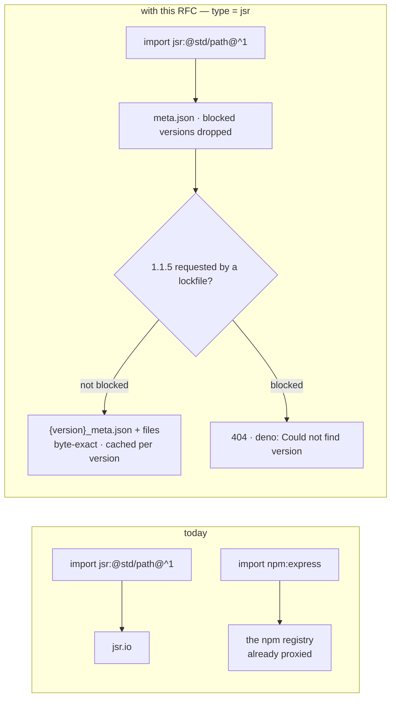
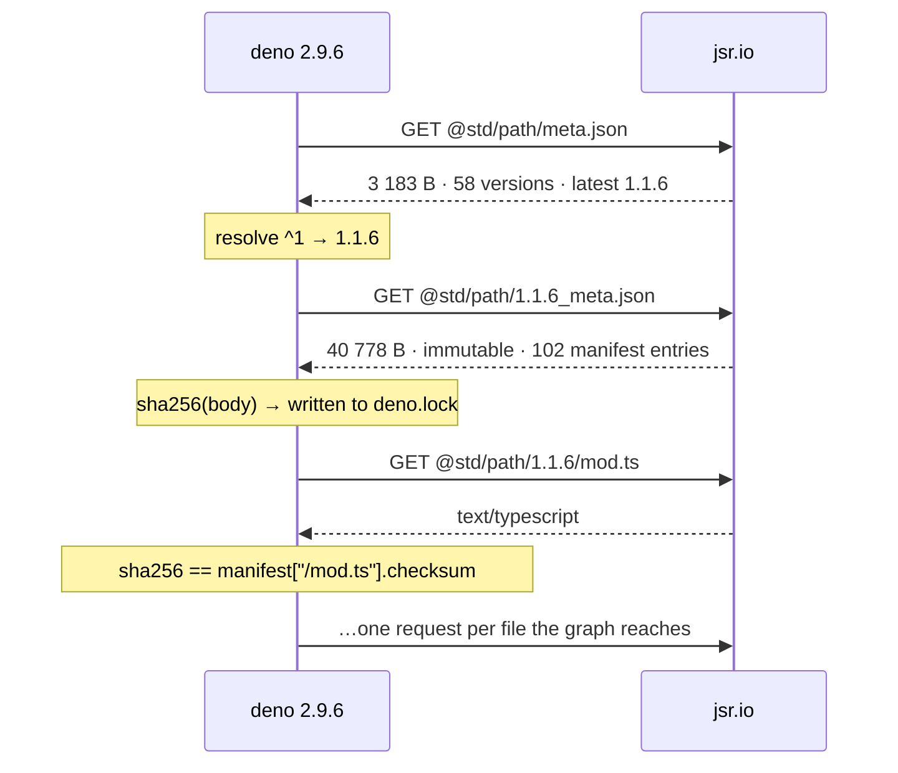
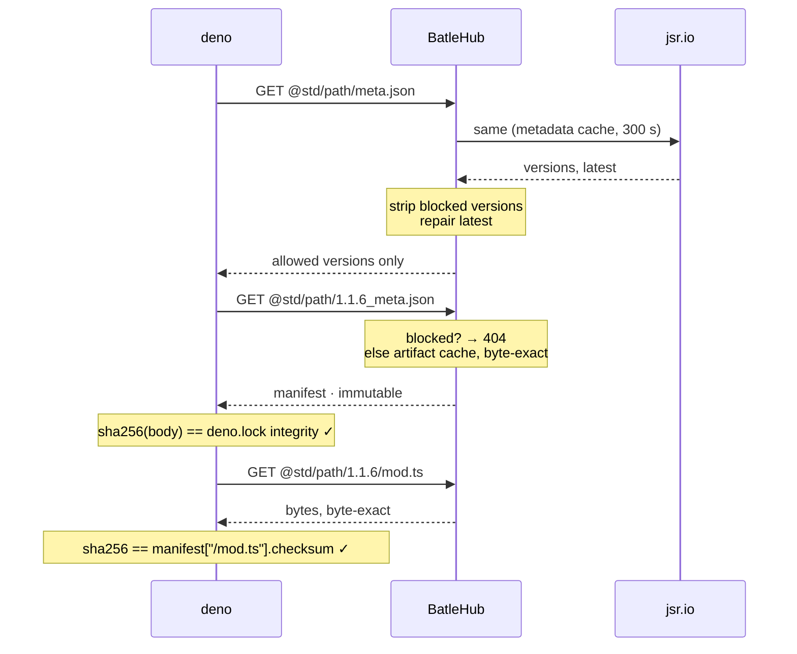
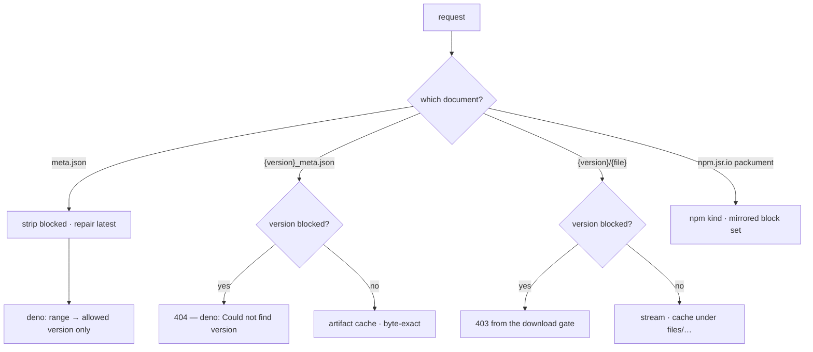
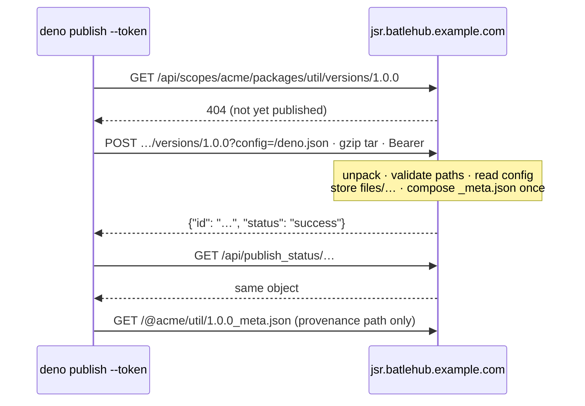

# RFC 0030 — JSR

| Field       | Value                                                        |
| ----------- | ------------------------------------------------------------ |
| Status      | Draft                                                         |
| Short       | JSR                                                           |
| Settles     | The jsr.io registry as a registry kind: meta.json listings, module files as artifacts, and the npm-compatibility endpoint served by the npm adapter as a second upstream |
| Author      | Max Batleforc <maxleriche.60@gmail.com>                       |
| Co-author   | Claude Fable 5.1 <noreply@anthropic.com>                      |
| Created     | 2026-09-11                                                    |
| Supersedes  | —                                                             |
| Touches     | `crates/core`, `crates/config`, `crates/adapters`, `crates/web`, `server`, `cli`, `ui`, docs |

---

## 1. Summary

JSR is the registry Deno resolves `jsr:` specifiers against, and the one the
`@jsr` npm scope is served from for everybody else. A BatleHub instance can
proxy every npm package a Deno project pulls through `npm:` and none of the
`jsr:` ones, which on a current Deno project is most of the standard library.

`type = "jsr"` serves the native protocol: `@{scope}/{name}/meta.json` is the
per-package listing and the enforcement chokepoint, `{version}_meta.json` is
the immutable version manifest, and every module file under
`@{scope}/{name}/{version}/…` is an artifact, cached under a per-version key.
`JSR_URL` is the one client switch. A package is `@scope/name` and its
versions are semver, the shape the `npm` kind already handles.

Two facts about the client decide the design, and both were read from the
source rather than the docs:

- **The version manifest is locked byte-for-byte.** `deno.lock` records, for
  every JSR package, the SHA-256 of the `{version}_meta.json` document as
  served, and `deno_graph` refuses a byte that differs with *"Integrity check
  failed"*. Every module file is then verified against the `manifest`
  checksums inside it. So the manifest and the files are relayed byte-exact,
  and the **only** document this instance may edit is `meta.json`, which no
  checksum covers. That is where a block lives.
- **Deno's publish API is rooted at the host.** `jsr_api_url()` takes
  `JSR_URL` and *replaces* its path with `api/`, so a registry reached under
  `/proxy/{registry}/jsr` publishes to `/api/…` at the root of the host,
  with no registry name in it. Reads work under a path prefix; `deno publish`
  needs the registry on its own host, which RFC 0001 already provides.

The npm side needs no new kind: `npm.jsr.io` speaks the npm protocol, and a
second `npm` registry pointed at it serves `@jsr/scope__name` today, tarball
rewrite and `dist-tags.latest` repair included. This RFC says why it is a
*second registry* and not a second upstream of the first, and adds one thing
the npm adapter did not need: a scan unit for a package whose native form is
a directory of files.

### Before / after

```text
# today — Deno's jsr: imports go straight out; the proxy sees only npm:
import { join } from "jsr:@std/path@^1";     # → https://jsr.io, unproxied

# with this RFC
[[registries]]
name = "jsr"
type = "jsr"
mode = "proxy"                      # or local / hybrid: `deno publish --token`

export JSR_URL="https://batlehub.example.com/proxy/jsr/jsr"     # reads
export JSR_URL="https://jsr.batlehub.example.com"              # reads and publish (RFC 0001 host)

#   block "@std/path" at "1.1.5"
#   → gone from meta.json; deno resolves ^1 to 1.1.6, and a lockfile that
#     pinned 1.1.5 fails on Deno's own "Could not find version" — nothing fetched
```



Half of a Deno project's imports already pass through the proxy and half do
not; this RFC closes the `jsr:` half. The byte-exact arrow is the constraint
everything else in the document serves.

---

## 2. Motivation

1. **The gap is the standard library.** Since Deno 2 the `@std/*` packages
   are on JSR and nowhere else, so any Deno project resolves through
   `jsr.io` on every cold cache. The proxy's `npm` registry catches the
   `npm:` half of a `deno.lock` and none of the `jsr:` half, and a `generic`
   mirror of `jsr.io` would cache the files under a synthetic package with no
   version to block — the gap RFC 0010 §2 names for toolchains, here for a
   package registry.

2. **The chokepoint is exact and cheap to hold.** `deno_graph`'s
   `JsrMetadataStore::queue_load_package_info` fetches
   `{JSR_URL}/@{scope}/{name}/meta.json` and `resolve_version` picks from its
   `versions` map; a version absent from the map cannot be chosen. A locked
   project skips the listing and fetches `{version}_meta.json` directly, and a
   `404` there is `JsrLoadError::PackageVersionNotFound`, Deno's own path.
   Both halves of "a blocked version is unresolvable" exist in the client.

3. **A literal filter of the wrong document breaks every locked project.**
   `deno.lock` v5 stores `"jsr": {"@std/path@1.1.4": {"integrity":
   "1d2d43f3…"}}`, and that value is the SHA-256 of the bytes
   `https://jsr.io/@std/path/1.1.4_meta.json` serves — checked on the wire
   while writing this, digest for digest. A proxy that reformats, re-orders or
   strips one field of that document turns every `deno install` on the fleet
   into *"Integrity check failed"*. The design has to say which document is
   touched, and it is not this one.

4. **Publishing cannot be reached under a path prefix.** `cli/args/mod.rs`
   `jsr_api_url()` does `jsr_url().clone(); set_path("api/")`. With
   `JSR_URL=https://host/proxy/jsr/jsr` the publish `POST` goes to
   `https://host/api/scopes/…`, which is this instance's own API namespace
   with no registry in the path. Without deciding this, `local` mode is a
   feature that works in the route test and not from a terminal.

5. **The npm-compatibility layer is a second door to the same versions.**
   `npm.jsr.io/@jsr/std__path` lists the same releases as `meta.json`, minus
   yanked ones, with tarballs at `npm.jsr.io/~/{revision}/@jsr/std__path/{v}.tgz`.
   A block that holds on the native side and not on `@jsr:registry=` is a
   block a `package.json` walks around. The npm adapter already serves this
   host; the RFC has to say how the two registries share a block set.

6. **A JSR version is a directory, not a tarball.** RFC 0018's byte-reading
   scanners take one artifact per version. `@std/path@1.1.6` is 102 files
   (205 KB) and no archive on the native side. Without a scan unit the
   quarantine gate has nothing to read, and a kind that is exempt from
   scanning by accident is the posture RFC 0010 §6.7 refused to inherit.

---

## 3. Goals / non-goals

**Goals**

- A JSR package version can be blocked, and a blocked version is neither
  resolvable from a range nor fetchable by a lockfile, both on Deno's own
  error paths with nothing downloaded.
- Every `{version}_meta.json` and every module file this instance serves is
  byte-identical to upstream, so `deno.lock` integrity and manifest checksums
  pass unchanged.
- Module files are cached under `@scope/name/{version}/…`, visible to
  explore, statistics and retention as one version.
- The `@jsr` npm scope is served by an `npm` registry pointed at
  `npm.jsr.io`, and a block on the native registry is mirrored there.
- `deno publish --token` and `npx jsr publish --token` work against a `local`
  or `hybrid` registry reached by host, and the published version is served
  natively and read back by Deno with a stable integrity.
- A scanned verdict on a version hides it from `meta.json` and refuses its
  files, using the npm-compatibility tarball as the bytes to scan.
- `deno.json`, `deno.jsonc` and `jsr.json` feed `registry suggest` and
  warming.

**Non-goals**

- **Browser-based publish authentication** (`deno publish` with no
  `--token`, the `authorizations` device flow, and `githuboidc` tokens). The
  device flow is a page on jsr.io; the token path is a Bearer this instance
  already issues.
- **The management API beyond publishing** — scopes, members, tokens,
  `/api/scopes/{scope}/packages/{name}/versions` listings. JSR's own docs say
  registry operations must not read it, and Deno does not.
- **Rendering.** `jsr.io` answers `Accept: text/html` with a documentation
  page for every registry URL; this instance answers JSON and files only.
- **Provenance.** Sigstore attestations (`rekorLogId`) are produced by
  OIDC publishes on jsr.io and verified against Rekor, not against the
  registry; nothing is relayed or minted.
- **`moduleGraph1`/`moduleGraph2` interpretation.** They are optimisation
  hints inside the immutable manifest and travel with it, unread.
- **Yanking through the proxy.** `yanked` is a jsr.io state set on the site;
  the proxy relays it and never writes it (§4.4 says why a block is not a
  yank).
- **A JSR *tap* for `deno vendor`/`DENO_DIR` layouts.** Deno's cache is the
  client's; this RFC serves what it asks for.

---

## 4. User-facing design

### 4.1 Configuration

```toml
# The native registry — Deno, and `npx jsr` for resolution
[[registries]]
name      = "jsr"
type      = "jsr"
mode      = "proxy"                     # proxy · local · hybrid
upstreams = ["https://jsr.io"]          # the default
# Phase 5 only: where the bytes to scan come from. Derived from the upstream
# host as jsr's own CLI derives it (`npm.` + host); set only for a mirror.
# npm_compat_url = "https://npm.jsr.io"

[registries.rbac]
# meta.json is a listing; the version manifest and every file are reads.
anonymous = ["releases:read", "releases:list"]

# The compatibility scope — npm, pnpm, yarn, bun. An ordinary npm registry.
[[registries]]
name      = "jsr-npm"
type      = "npm"
mode      = "proxy"
upstreams = ["https://npm.jsr.io"]
```

- `upstreams` absent means `https://jsr.io`. The value is the registry root;
  the API root is derived (`{root}/api/`) the way Deno derives it.
- No new per-kind option in phases 1–4. `npm_compat_url` arrives with phase 5
  and is rejected on any other kind, the `broker_url` rule.
- `local` and `hybrid` are supported: JSR has a publish protocol.

### 4.2 The client side

```bash
# Deno — every jsr: specifier, deno add, deno install, deno publish --token
export JSR_URL="https://batlehub.example.com/proxy/jsr/jsr"    # reads
export JSR_URL="https://jsr.batlehub.example.com"             # reads + publish

# npm / pnpm / yarn / bun — the @jsr scope, in .npmrc (yarn berry: npmScopes.jsr.npmRegistryServer)
@jsr:registry=https://batlehub.example.com/proxy/jsr-npm

deno add jsr:@std/path              # meta.json, then 1.1.6_meta.json, then the files it needs
npm install @jsr/std__path@1        # the packument, then ~/11/@jsr/std__path/1.1.6.tgz, rewritten
deno publish --token "$BATLEHUB_TOKEN"   # host form only, §4.4
```

`resolve_jsr_url` (`libs/resolver/factory.rs`, Deno 2.9.6) trims and re-adds
one trailing slash and `Url::join`s every registry path onto it, so a path
prefix works for reads. `npx jsr add` reads the same `JSR_URL` for
`meta.json` but derives the npm host by prefixing `npm.` to `JSR_URL`'s host
(`jsr-npm` 0.14.3, `src/api.ts` `getNpmPackageInfo`) and writes
`@jsr:registry=https://npm.jsr.io` verbatim into `.npmrc`
(`src/commands.ts`, `JSR_NPM_REGISTRY_URL`); an operator sets the scope
registry line themselves, once, and checks it in as JSR's docs already tell
them to. pnpm 10.9+ and yarn 4.9+ resolve `jsr:` to `npm:@jsr/…` and read the
same scoped-registry setting.

Deno's downloader sends no `.netrc` credentials and has no header
configuration; `deno publish --token` is the only credential it carries and
it goes to the API only. A `jsr` registry therefore needs `anonymous` read
or an authenticating ingress, the posture the VS Code gallery page records
(`docs/registries/vscode-marketplace.md`).

### 4.3 Coordinates

| Request (under `…/proxy/{reg}/jsr/`) | `PackageId` | Cache key |
| --- | --- | --- |
| `@std/path/meta.json` | `@std/path`, version unused | metadata, `versions` |
| `@std/path/1.1.6_meta.json` | `@std/path` / `1.1.6` / `_meta.json` | `jsr/@std/path/1.1.6/_meta.json` |
| `@std/path/1.1.6/posix/mod.ts` | `@std/path` / `1.1.6` / `files/posix/mod.ts` | `jsr/@std/path/1.1.6/files/posix/mod.ts` |
| `@std/path/1.1.6/deno.json` | `@std/path` / `1.1.6` / `files/deno.json` | `jsr/@std/path/1.1.6/files/deno.json` |

**The package is `@scope/name`**, spelled as Deno spells it and as the `npm`
kind already stores scoped names, so a block, an explore row and a grant name
the same thing on both registries. The `@jsr/scope__name` spelling exists
only on the compatibility registry and is folded to `@scope/name` when a
block is mirrored (§4.4).

**The version manifest is an artifact, not a document.** It is immutable
(`Cache-Control: public, max-age=31536000, immutable` upstream), scoped to
one version, and must be served byte-exact forever — the shape of goproxy's
`.info` and `.mod`, which are artifacts named `info` and `mod`, not the shape
of a listing in the metadata cache that expires and is re-fetched. Its
artifact name is `_meta.json`; module files sit under `files/` so a package
that ships a root file called `_meta.json` (JSR forbids nothing about the
name) cannot collide with it. Multi-segment artifact names are Maven's and
Terraform's precedent.

`fetchable_by_version()` is `ByVersion(Fixed("_meta.json"))`: "fetch this
version" is the manifest, and warming (§6.9) follows it to the files.

### 4.4 Behaviour rules

**What is filtered, and what is not.**

| Document | Treatment |
| --- | --- |
| `meta.json` | **Filtered.** Blocked versions are removed from `versions`; `latest` is repaired to `best_latest` over what remains, as `dist-tags.latest` is for npm. Nothing else is touched: `scope`, `name`, `githubRepository` and every surviving entry's `createdAt`/`yanked` pass through. |
| `{version}_meta.json` | **Never touched.** Byte-exact, or `404` when the version is blocked. Locked by `deno.lock` (§2.3). |
| module files | **Never touched.** Byte-exact, or refused at the download gate. Verified by the client against `manifest[path].checksum` (`deno_graph` `graph.rs` `get_checksum`, `sha256-` prefix required). |
| `npm.jsr.io` packument | Filtered by the `npm` kind as any packument, with the mirrored block set. |

**A block is a removal, not a yank.** JSR's own `yanked: true` means "still
installable when a lockfile names it": `deno_graph`'s `resolve_version` step 1
accepts an already-selected version whether or not it is yanked and only
records it in `used_yanked_packages` for a warning. A block that marked a
version yanked would hold for new resolutions and not for the fleet's locked
projects — the opposite of a block. Removing the entry makes a range
resolution skip it and an exact fetch `404`, which is the RFC 0010 §5.3
invariant: unresolvable from the listing *and* by exact name, and both read
the blocked set on each request.

**The uninteresting case is byte-exact.** With nothing blocked, `meta.json`
is relayed as fetched (the filter returns `Borrowed`), and every other
response is bytes from the artifact cache. `Accept` is not forwarded from the
client and not sent upstream: `jsr.io` answers `text/html` to a browser's
`Accept` on the *same* URL (checked: `meta.json` and `mod.ts` both come back
as an HTML page under `Accept: text/html`), and a cached HTML page under a
JSON key would be served to Deno next. The client fetch sends `*/*`.

**`Content-Type` is the file's.** Upstream serves `text/typescript`,
`application/json`, `text/markdown` and so on by extension; the proxy stores
and replays what it received, and answers `text/typescript` for `.ts` on a
cache hit rather than `application/octet-stream`. Deno decides the media type
from the header when the extension is ambiguous.

**Mirroring the block to the compatibility registry.** A block on
`@scope/name` in a `jsr` registry applies to `@jsr/scope__name` on every
`npm` registry whose upstream host is `npm.` + the `jsr` registry's upstream
host, and vice-versa, so `npm install @jsr/std__path@1` and
`deno add jsr:@std/path@1` agree. The fold is the one JSR's docs define:
strip `@`, replace the first `/` with `__`. It is a lookup at
`blocked_versions_for` time (§6.2), not a second row in the database, so
unblocking is one operation.

**`local` and `hybrid` need a host.** A `mode = "local"` or `"hybrid"` `jsr`
registry must be bound to a host (RFC 0001 `hosts`), because
`deno publish` posts to `{JSR_URL with path replaced by /api/}`. On that host
the routes are:

| Route | What |
| --- | --- |
| `POST /api/scopes/{scope}/packages/{name}/versions/{version}?config={path}` | the publish: a gzip tarball (`Content-Encoding: gzip`, upstream caps it at 20 MB), `Authorization: Bearer <token>` |
| `GET  /api/scopes/{scope}/packages/{name}/versions/{version}` | Deno's pre-flight `check_version_exists`; `404` means "go ahead", `200` means "already published" |
| `GET  /api/publish_status/{id}` | the poll, every 2 s until `status` is `success` or `failure` |

Publishing is synchronous: the tarball is unpacked, validated and stored
before the `POST` answers, and the answer is already `{"id": …, "status":
"success"}`, so the poll returns the same object once. `jsr.io` answers
`processing` and does the work in a task; nothing Deno does depends on
seeing that state (`pub_mod.rs` loops until `success`/`failure`). A version
that already exists answers the `duplicateVersionPublish` error code Deno
special-cases into a clean message rather than a `409` it would print raw.
Path-routed `local` registries are rejected at config validation (§4.5),
because they would accept a publish only from a client that does not exist.

**What a local publish stores.** The `config` query names the package config
file inside the tarball (`/deno.json`, `/jsr.json`); its `name`, `version`
and `exports` must agree with the URL. Every regular file becomes an artifact
under `files/`, the manifest is composed — `manifest` with `size` and
`sha256-` checksum per file, `exports` normalised to object form, no
`moduleGraph*` (both are `Option` in `deno_graph`'s `JsrPackageVersionInfo`
and absent means "no hint") — serialised **once**, stored as the `_meta.json`
artifact, and served from storage thereafter. That is what keeps the
integrity a `deno.lock` records stable: the manifest is bytes on disk, not a
render. `meta.json` for a local package is composed from the database at
read time, like the npm packument is, with `createdAt` from the publish row.

**Hybrid resolution.** A local version and an upstream version of the same
package merge in `meta.json` by version, local winning on collision, the
hybrid rule the `npm` kind already applies; `{version}_meta.json` and files
come from wherever the version lives.

### 4.5 Validation

`AppConfig::validate()` rejects:

| Condition | Rationale |
| --- | --- |
| `type = "jsr"` with `mode = "local"`/`"hybrid"` and no `hosts` binding | `deno publish` reaches `/api/…` at the root of `JSR_URL`'s host; under a path prefix the publish lands on this instance's own API. A local registry nobody can publish to is a misconfiguration that looks like a proxy bug. |
| `path_allow` on a `jsr` registry | Not path-addressed; the existing validator refuses it on every such kind. |
| `npm_compat_url` on a registry whose type is not `jsr` (phase 5) | The `broker_url` rule: a silently ignored option. |
| `npm_compat_url` that is not an absolute `http`/`https` URL | Joined and fetched; a relative value fails at scan time instead of boot. |
| A `release_age_gate` rule with no explicit `deny_missing_timestamp` | Every JSR version carries `createdAt`, so the field is inert on upstream versions — but a `hybrid` registry's local versions carry the publish row's date and an air-gapped listing (RFC 0008-bis) may carry none. The field must be chosen, as on every kind added since RFC 0010. |

Warnings (logged and surfaced to the admin):

| Condition | Behaviour |
| --- | --- |
| A `jsr` registry with no `npm` registry whose upstream is `npm.` + its host | Served; logged once at reload: the `@jsr` scope is a second door to the same versions and no block is mirrored to it until one exists. |
| A `jsr` upstream that is not `jsr.io` | Served; logged once: the API root and the compat host are derived from it, and a mirror that serves only the registry API answers publishes and scans with `404`s that will be reported as such. |

---

## 5. Architecture

### 5.1 The protocol as `jsr.io` serves it

No proxy in this subsection. Every number was observed while writing this RFC;
the client behaviour is read from Deno 2.9.6 (`deno_graph`, `cli/args`,
`cli/tools/publish`) and `jsr-npm` 0.14.3.

| Request | Answers | Type · size | What Deno does with it |
| --- | --- | --- | --- |
| `@{scope}/{name}/meta.json` | the package's versions and its `latest` | `application/json` · 3 183 B for `@std/path`, 58 versions | resolves a range or a bare specifier; a version absent here cannot be chosen |
| `@{scope}/{name}/{version}_meta.json` | the version manifest | `application/json` · 40 778 B for `@std/path` 1.1.6 · `cache-control: public, max-age=31536000, immutable` | the file list; **the SHA-256 of these exact bytes is what `deno.lock` records** |
| `@{scope}/{name}/{version}/{path}` | one module file | by extension — `text/typescript` for `.ts`, 7 621 B for `mod.ts` | compiles it, after checking it against the manifest's per-file checksum |
| `npm.jsr.io/@jsr/{scope}__{name}` | the npm packument for the same releases | `application/json` · 30 821 B for `@jsr/std__path` | npm, pnpm, yarn and bun resolution |
| `npm.jsr.io/~/{revision}/@jsr/{scope}__{name}/{version}.tgz` | the npm tarball | | `npm install` |
| `{JSR_URL with its path replaced by /api/}…` | the publish and status API | | `deno publish` only (§4.4) |

`meta.json`, as served:

```json
{"scope":"std","name":"path","latest":"1.1.6",
 "versions":{"1.1.6":{"createdAt":"2026-06-30T10:24:29.944663Z"},
             "1.0.0-rc.3":{"createdAt":"2024-07-02T11:46:57.873141Z"}}}
```

`{version}_meta.json`, as served — three keys, and the first is the whole file
tree:

```json
{"manifest":{"/posix/from_file_url.ts":{"size":668,
              "checksum":"sha256-e86443242a56bdcf67cfd05d9928b0cc869e9660386b34eac00be2ba9e70349e"},
             "…":{}},
 "moduleGraph2":{},
 "exports":{".":"./mod.ts","./basename":"./basename.ts"}}
```

For `@std/path` 1.1.6 that manifest names **102 files totalling 205 076
bytes**, which is what "a version is a directory, not a tarball" means in
numbers: one install of one small package is 1 listing + 1 manifest + up to 102
file requests, and there is no archive anywhere in the protocol.

**What Deno verifies, in two layers.** `deno.lock` v5 records, per JSR package,
the SHA-256 of the `{version}_meta.json` document *as bytes*; a mismatch is
*"Integrity check failed"*. Each file is then checked against
`manifest[path].checksum`, whose `sha256-` prefix `deno_graph` requires. So
everything below the listing is fixed by a hash the client already holds, and
`meta.json` is the only document in the protocol that no checksum covers.

**A `404` on a version manifest is a first-class outcome.**
`JsrLoadError::PackageVersionNotFound` is the error Deno prints for a locked
version the registry no longer serves — the client's own path, not an
HTTP-level failure.

**Credentials: none on reads.** Deno's downloader sends no `.netrc` and has no
header configuration; `--token` is carried to the `/api/` endpoints and nowhere
else. An instance serving `jsr` reads is therefore anonymous or behind an
authenticating ingress.

**The spellings.** A package is `@{scope}/{name}` with scope 2–32 and name
2–20 characters of `[a-z0-9-]`; versions are semver. The npm-compatibility
name folds the same package to `@jsr/{scope}__{name}` — strip the `@`, replace
the first `/` with `__`. Manifest paths are `/`-prefixed and are the file's
path under the version.



A locked project skips the listing entirely and starts at the manifest, which
is why §4.4 has to hold the block in two places rather than one.

### 5.2 Two documents, one of them sacred



The invariant: **nothing after the listing is ever rendered.** The version
manifest and the files are stored bytes and served as stored, so the two
checks the client performs — the lockfile's integrity over the manifest and
the manifest's checksum over each file — see exactly what upstream published.
The one document the proxy edits is the one document nothing checks, and a
block is therefore invisible to integrity by construction rather than by
care.

### 5.3 Where a block becomes effective



A range resolution never sees a blocked version; a locked project asks for
it by name and gets Deno's not-found; a client holding an old manifest is
refused at the file. The last is diagnosis, not enforcement — a `403` on a
file means the manifest was fetched before the block — and the mirrored
block on the compatibility registry closes the door a `package.json` would
otherwise open.

### 5.4 Publishing, on a host



The invariant: the manifest a publish stores is the manifest every later read
serves, so the integrity a `deno.lock` records on the day of publishing is the
integrity it records forever. Composition happens once, at write time, and
`read` is a byte copy.

---

## 6. Detailed design

### 6.1 `crates/core` — the registry kind

`RegistryKind::Jsr` is added to the enum and to `ALL`; the wildcard-free
matches force the answers. `supports_local_mode() = true`,
`requires_explicit_upstream_in_proxy_mode() = false`,
`is_path_addressed() = false`; the rest:

| | `jsr` |
| --- | --- |
| `listing_filter()` | `Filtered("meta.json", ["versions"])` |
| `readme_support()` | `MetadataThenArchive` is wrong here: there is no archive. `Archive("the version manifest names /README.md when the package ships one; it is a file under the version")` — the README is fetched as the artifact `files/README.md` when `manifest` lists it. |
| `upstream_detail()` | `Document("versions")` — `meta.json` carries `createdAt` per version and `yanked`, so the console's version table shows both, and the date is the one the age gate reads. |
| `fetchable_by_version()` | `ByVersion(Fixed("_meta.json"))` |
| `warm_artifact()` | `Some(Fixed("_meta.json"))`; the warmer then follows the manifest (§6.9) |
| `blocking_package_name()` | identity |

`DocumentKind::Versions` covers `meta.json`; no `Secondary` is needed, and
the manifest is an artifact (§4.3).

### 6.2 `crates/core` — `services/jsr.rs` and `blocking/jsr.rs`

`services/jsr.rs`, no I/O:

- `parse_package(&str) -> Result<(scope, name)>` — `@{scope}/{name}` with
  JSR's own limits, quoted from its docs: scope 2–32 and name 2–20 characters
  of `[a-z0-9-]`. Anything else is a `400` at the edge.
- `npm_compat_name("@std/path") -> "@jsr/std__path"` and its inverse, the
  fold of §4.4.
- `Manifest` — the serde model of `{version}_meta.json` used **only** by
  publish (to compose) and by warming (to list files). The read path never
  deserialises it.
- `compose_manifest(files: &[(path, bytes)], exports) -> Vec<u8>` — the
  publish-time render: `manifest` keyed by `/`-prefixed path with `size` and
  `sha256-{hex}`, `exports` in object form, keys sorted, serialised once.
  Deterministic on purpose, though nothing depends on it after the bytes are
  stored.
- `validate_publish_paths` — JSR's rules that matter for storage: no path
  segment `..`, no `:`/`*`/`?`, no two names differing only by case, and
  every `exports` target present in the tarball.

`blocking/jsr.rs`, dispatched from `blocking::strip`:

- `DocumentKind::Versions` → `with_json(doc, jsr::strip_meta)`: remove
  `versions[v]` for each blocked `v`; if `latest` was removed, set it to
  `best_latest` over the surviving keys, else leave it. `best_latest` prefers
  stable over pre-release, the rule JSR's own `latest` follows.

`blocked_versions_for` (`services/proxy/handle.rs`) gains the mirror: for a
`jsr` registry it also reads the blocks of every `npm` registry whose
upstream host is `npm.` + its own, folding names; for an `npm` registry whose
upstream is `npm.` + some `jsr` registry's host it reads that registry's
blocks, folding the other way. The lookup is by the registry map the service
already holds; nothing is persisted twice. The `Jsr` arm of
`blocking::normalize` is identity — semver, as npm.

### 6.3 `crates/config`

- `RegistryConfig::npm_compat_url: Option<String>` in phase 5, with the §4.5
  rejections.
- `validate()` gains the host rule for `local`/`hybrid` `jsr`, beside the
  existing `supports_local_mode` check. It reads the `hosts` binding RFC 0001
  added; no new concept.
- `CURRENT_CONFIG_VERSION` does not move.

### 6.4 `crates/adapters` — `registry/jsr/`

A directory: the read client, the publish-side tar handling and the compat
lookup are three concerns.

- `client.rs` — `JsrRegistryClient { http, base, api_base, compat_base }`.
  - `resolve_metadata(pkg)` → reads `meta.json` (cached, `INDEX_TTL` as
    `nodedist` caches `index.tab`), answers `NotFound` for a version absent
    from `versions`, `published_at` from `createdAt`. No second request.
  - `fetch_artifact(pkg)` → `_meta.json` from `{base}/@{s}/{n}/{v}_meta.json`,
    `files/{path}` from `{base}/@{s}/{n}/{v}/{path}`, streamed, with the
    upstream `Content-Type` carried in `FetchedArtifact.headers` (the field
    RFC 0010 added for `X-Sdkman-*`). No `Accept` header is sent.
  - `fetch_version_document(pkg, Versions)` → `meta.json` as
    `application/json`.
  - `list_versions(name)` → the keys of `versions`, in `version_order`.
- `publish.rs` — the tar reader: gzip, then `tar` (the crate already refuses
  `..`, per the scanner canary), bounded by `limits.max_artifact_size_bytes`,
  each entry validated by `validate_publish_paths` before it is buffered.
- `tests.rs` — `mockito`; standalone because the tests span the client and
  the publish reader.

### 6.5 `crates/web` — handlers and routes

`handlers/proxy/jsr/`, prefix `/proxy/{registry}/jsr/` (path form) and `/`
on a bound host (RFC 0001 rewrites the prefix away):

| Route | Handler |
| --- | --- |
| `GET @{scope}/{name}/meta.json` | `meta` — `serve_local_or_proxy_document`, filtered |
| `GET @{scope}/{name}/{version}_meta.json` | `version_meta` — `serve_local_or_proxy_artifact`, `application/json` |
| `GET @{scope}/{name}/{version}/{path:.*}` | `file` — `serve_local_or_proxy_artifact`, `Content-Type` from upstream or by extension |
| `GET /api/scopes/{scope}/packages/{name}/versions/{version}` | `version_exists` — `200` with `{scope, package, version}` or `404`; host form only |
| `POST /api/scopes/{scope}/packages/{name}/versions/{version}` | `publish` — `require_local_mode`, `Content-Encoding: gzip` required (upstream's `MissingGzipContentEncoding`), `?config=` required; host form only |
| `GET /api/publish_status/{id}` | `publish_status` — the stored task; host form only |

Three obligations from the existing rules:

- **Validate at the edge.** `parse_package` on scope and name, semver on
  `{version}`, `validate_path_safe` on every segment of `{path}` (it is a
  storage key under `files/`), and a `_meta.json` suffix parsed off the
  version segment before anything else — `1.1.6_meta.json` is one path
  segment and must not be taken for a version named `1.1.6_meta.json`. The
  conformance fixture asserts the ordering.
- **`body = T` on every success.** `meta` takes `UpstreamDocument`,
  `version_meta` and `file` take `ArtifactBytes`, `publish` and
  `publish_status` take a `PublishingTask { id, status, error }` schema that
  mirrors Deno's `registry::PublishingTask`, `version_exists` a
  `VersionExists` marker.
- **Route ordering.** `{version}_meta.json` must be matched by a guard on the
  suffix before `{version}/{path}`; `meta.json` as a literal must register
  before both, or a package version named `meta.json` is unreachable and a
  listing becomes a file.

The `/api/…` routes register only on hosts, not under `/proxy/{registry}/`,
because under the path form they cannot be reached by any client and would
sit beside this instance's own `/api/v1` looking like part of it.

### 6.6 `server`

`builders.rs` forces one arm: `JsrRegistryClient` from
`resolve_urls(&reg.upstreams, "https://jsr.io")`, with the API base as
`{root}/api/` and the compat base as `reg.npm_compat_url` or `npm.` + host.
No `main.rs` change.

### 6.7 Rules

`DenyLatestRule` and `BlockListRule` read the coordinate. `ReleaseAgeGateRule`
reads `published_at`, which `meta.json` supplies for every upstream version
(`createdAt`, an RFC 3339 instant, so no midnight rule is needed). RFC 0018's
verdict hiding joins the blocked set through `blocked_versions_for` as on
every kind, and the mirror of §6.2 carries a verdict to the compatibility
registry with it.

### 6.8 `ui` and `docs`

- `ui/src/config/registryTypes.ts` — a `REGISTRY_TYPE_DEFS` entry with the
  §4.2 exports and `.npmrc` line, the host-form note for publishing, and the
  server blocks of §4.1 for both registries. Labelled *JSR (Deno, and @jsr
  for npm)*.
- `docs/registries/jsr.md` with generated support and endpoint tables, and
  the four lines the page must carry: the version manifest and files are
  byte-exact because `deno.lock` and the manifest checksums say so; `local`
  needs a host and `--token`; the `@jsr` scope is a second `npm` registry
  and a block covers both; `npx jsr add` writes `npm.jsr.io` into `.npmrc`
  and the operator overrides it.
- `docs/registries/npm.md` gains one line: `npm.jsr.io` as an upstream, and
  why it is its own registry.
- `docs/registries/index.md`, the sidebar, `docs/operations/egress.md`
  (`npm.jsr.io` as a second host).
- `ROADMAP.md` — the entry gains the RFC link; the phrase "as a second
  upstream" is corrected to "as a second registry" (§8 says why).

### 6.9 `cli` — `deno.json` and warming

`batlehub registry suggest` gains `deno.json`, `deno.jsonc` and `jsr.json`:
the `imports` map's `jsr:` entries and, for a package being developed, the
`name`/`version`/`exports` that say it will be published. It emits both
registry blocks of §4.1 and the two client lines of §4.2. `deno.lock`'s
`jsr` section, when present, pins exact versions and feeds warming directly.

Warming a version fetches `_meta.json`, then every file the `manifest`
lists — 102 files for `@std/path`, 205 KB, one request each. Whole versions
and not entrypoints, because a `deno.lock` on a different machine can need
any file, and the point of warming is that the second machine does not leave
the site.

### 6.10 `tests/heavy/jsr.sh`

A heavy suite, `config.jsr.toml` beside it, `task test:jsr-heavy`, and a row
in the `heavy-client` matrix. Deno is installed by the job (a single static
binary; the version is pinned in the script and quoted in the conformance
fixture). `DENO_DIR` is redirected into the run's directory so no cache is
shared. What it proves, on the wire, through the tap:

1. `deno add jsr:@std/path` reads `meta.json`, one `_meta.json`, and the
   files the entrypoint needs, through the proxy; `deno.lock` records an
   integrity, and a second `deno install` from a fresh `DENO_DIR` with that
   lockfile passes it — the byte-exact rule, observed.
2. With `1.1.5` blocked through the admin API, `deno add jsr:@std/path@1.1.5`
   exits non-zero on Deno's own not-found, and nothing is requested under
   `@std/path/1.1.5/`; `deno add jsr:@std/path@^1` resolves to `1.1.6`.
3. With `1.1.5` blocked on the `jsr` registry, `npm install
   @jsr/std__path@1.1.5` against the `jsr-npm` registry is refused, and
   `npm view @jsr/std__path versions` does not list it — the mirror.
4. Against a `local` registry on a host, `deno publish --token` of a
   two-file package succeeds, `deno add jsr:@acme/util` from a fresh
   `DENO_DIR` installs it, and the integrity in the resulting `deno.lock`
   equals the SHA-256 of the served `_meta.json`.
5. A second install of the same version moves
   `batlehub_artifact_cache_hits_total`.

The host form needs a resolvable name; the suite uses the loopback host
binding the RFC 0001 suite already uses.

### 6.11 Scanning (phase 5)

RFC 0018's byte-reading scanners take one artifact. For a JSR version the
bytes are the **npm-compatibility tarball** of the same version, fetched from
`{compat_base}/@jsr/{scope}__{name}` (the packument, for the tarball URL and
its `integrity`) and then the tarball, and verified against that `integrity`
before it is handed to a scanner. The tarball is what `npm install` would put
on disk — transpiled JS, `.d.ts`, a `package.json` carrying `exports` and the
`_jsr_revision` — and it is the form every npm scanner already understands
(`guarddog`'s npm mode, `postmortem` on the tarball's `package.json`).

Two consequences are stated rather than hidden:

- The scanned bytes are not the served bytes. A verdict is about the
  package version — the same source, transpiled — and hides the version on
  both registries; it is not a claim that the TypeScript on the native side
  was read. The registry page says so.
- A version whose compat tarball does not exist yet (JSR's docs: the
  compatibility data "may not always be up to date … generally resolves
  itself within a few minutes") is a scan that retries, not a verdict. The
  worker's existing retry path covers it.

`ArtifactScanner::supports(RegistryKind::Jsr)` is answered by the npm-capable
scanners through a `scan_as()` hint the kind provides: `Jsr → Npm`. Metadata
scanners (OSV by coordinate) get the `@jsr/scope__name` coordinate on the
`npm` ecosystem, which today answers nothing — no advisory database lists JSR
as an ecosystem — and says so in the verdict's reason rather than passing
silently.

**Deliberately untouched**, so reviewers do not go looking:

- `crates/adapters/src/registry/npm.rs` — serves `npm.jsr.io` today, the
  `~/{revision}/` tarball path included: `ensure_same_origin` accepts it, and
  `rewrite_tarball_urls` repoints it. Nothing changes for phases 1–4.
- `crates/core/src/services/blocking/npm.rs` — the packument strip is what
  filters the compatibility listing; `strip_meta` is a separate, smaller
  function because `meta.json` has no `dist-tags`, no `time` and no per-version
  objects worth sharing a walker with.
- `crates/core/src/rules/release_age.rs` — `createdAt` arrives through
  `published_at`.
- The `generic` kind — a `jsr.io` mirror through it keeps working for anyone
  who wants a cache and no policy.

---

## 7. Security considerations

- **Trust boundary.** The client verifies the version manifest against its
  lockfile and every file against the manifest, and this instance edits
  neither. A hostile or compromised proxy could serve a manifest of its own
  only to a project with no lockfile yet — the same window the client has
  against upstream itself. What this instance adds is the ability to *remove*
  a version; it cannot substitute one for a locked project.
- **Attacker-controlled inputs.** Scope, name, version and every path segment
  are validated at the edge before they become storage keys; `meta.json` is
  parsed as JSON and only its `versions` map is edited; the manifest and
  files are opaque bytes. A publish tarball is read entry by entry with the
  `tar` crate's traversal refusal plus `validate_publish_paths`, bounded by
  size, and never extracted to a filesystem.
- **Publishing is authenticated by this instance's tokens.** `--token` is a
  Bearer the existing auth chain resolves; `releases:publish` on the package
  is the action, and RFC 0015/0017 grants apply. The `githuboidc` scheme is
  refused with `401`, not silently treated as anonymous.
- **The `/api/scopes/…` routes exist only on a registry host.** On the
  path-routed instance they are not registered, so they cannot shadow or be
  confused with `/api/v1/…`, and a request for them there is the ordinary
  `404`.
- **The `@jsr` scope is unclaimed on npmjs.** `registry.npmjs.org/@jsr/…`
  answers `404` and a scope search finds nothing. That is why the
  compatibility registry is a *separate* `npm` registry rather than a second
  upstream in a fan-out (§8): a fan-out asks `registry.npmjs.org` first and
  would hand `@jsr/std__path` to whoever publishes it there.
- **Scanning fetches a second artifact from a second host.** The compat
  tarball is fetched through the same SSRF guard as any upstream, verified
  against the packument's `integrity`, and cached under the `npm` coordinate
  it is; it is never served from the `jsr` registry.
- **No new unauthenticated surface**, but a kind that needs one: Deno sends
  no credentials on reads (§4.2), so a `jsr` registry is `anonymous` for
  `releases:read` and `releases:list` or behind an authenticating ingress.
  Publishing remains authenticated either way.

---

## 8. Alternatives considered

| Alternative | Why rejected |
| --- | --- |
| Serve `npm.jsr.io` as a second upstream of the existing `npm` registry (the roadmap's wording) | `FanoutRegistryClient` tries upstreams in order and moves on only on `NotFound`; `registry.npmjs.org` is asked first for `@jsr/*`, which nobody owns there. A block must also be mirrored between two registries by name, which a fan-out inside one registry has no identity to hang it on. A second `npm` registry costs one config block and the client already splits by scope. |
| Mark a blocked version `yanked: true` in `meta.json` | Deno installs a yanked version when a lockfile names it, with a warning (§4.4). The block would not hold for exactly the projects an operator needs it to hold for. |
| Serve `{version}_meta.json` from the metadata cache as a document | It expires and is re-fetched, and a document path invites a filter. It is immutable, version-scoped and integrity-locked: an artifact, like goproxy's `.info`. |
| Rewrite the version manifest for local packages at read time | The integrity a `deno.lock` records would depend on the serialiser's stability across releases. Compose once, store bytes, serve bytes. |
| Register the publish routes under `/proxy/{registry}/jsr/api/…` | No client can reach them: Deno replaces the path with `/api/`. A route that exists for the route test and no terminal is the defect RFC 0009 §12 catalogues. |
| Scan each module file as its own artifact | 102 jobs per version for `@std/path`, no scanner that understands a lone `.ts`, and a verdict per file that has to be folded back into one per version. The compat tarball is one job in a form every npm scanner reads. |
| Accept `githuboidc` tokens by verifying GitHub's OIDC JWT | A second identity provider for one publish path; the Kubernetes provider is the precedent for workload identity and a GitHub one is its own RFC. `--token` works from Actions today. |

---

## 9. Rollout and compatibility

- **Default behaviour**: nothing changes for an instance without a `jsr`
  registry. An `npm` registry already pointed at `npm.jsr.io` keeps working
  unchanged; it gains the mirrored block set only when a `jsr` registry with
  the matching host exists.
- **Config migration**: none. `CURRENT_CONFIG_VERSION` stays.
- **Operator prerequisites**: egress to `jsr.io` and `npm.jsr.io`; for
  `local`/`hybrid`, a host binding per RFC 0001 and a DNS name for it.
- **Rollback**: remove the registry block. Cached artifacts under `jsr/…`
  stay until retention takes them; locally published versions remain in the
  database as any local kind's do.

---

## 10. Test plan

- **Unit** (`crates/core/src/services/jsr.rs`): `parse_package` against
  JSR's limits and the traversal cases; the name fold in both directions;
  `compose_manifest` on a two-file fixture equals a checked-in expected
  document byte for byte, and the `sha256-` checksums match the files;
  `validate_publish_paths` on `..`, `:`, case collisions and a missing
  `exports` target.
- **Unit** (`crates/core/src/services/blocking/jsr.rs`): a real `meta.json`
  fixture (`@std/path`, 58 versions, one yanked) with `1.1.6` blocked has
  `latest` repaired to `1.1.5` and the yanked entry untouched; nothing
  blocked returns `Borrowed`.
- **Adapter** (`crates/adapters/src/registry/jsr/tests.rs`, `mockito`):
  `meta.json` fetched once per TTL for many resolves; `published_at` is
  `createdAt`; no `Accept` header on any upstream request (asserted with a
  matcher); `Content-Type` carried through; the gzip tar reader refuses an
  oversize body before buffering it.
- **Integration** (`crates/web/tests/local_jsr_registry.rs`): the six routes
  in both forms; `jsr_publish_traversal_version_returns_400` and its path
  twin; a blocked version absent from `meta.json` and `404` on its manifest;
  the mirror across a `jsr` and an `npm` registry in one app; a publish
  followed by a read whose `_meta.json` bytes hash to the same value twice;
  `openapi_contract` sees `body = T` on every success.
- **Conformance** (`crates/web/tests/protocol_conformance.rs`): a `JSR`
  fixture quoting `deno_graph` `jsr.rs` (`queue_load_package_info`,
  `queue_load_package_version_info`), `graph.rs` module loads, `cli/registry.rs`
  `get_package_version_api_url`, `cli/tools/publish/mod.rs`'s poll, and
  `jsr-npm` `api.ts`.
- **Heavy** (`tests/heavy/jsr.sh`): §6.10.
- **Existing suites** that must pass unchanged: the whole of `crates/web`;
  `tests/heavy/npm.sh` (the npm kind is untouched); the RFC 0001 host-routing
  tests, which the publish routes depend on.

---

## 11. Decisions and open questions

### Resolved

| # | Question | Decision |
| --- | --- | --- |
| 1 | Is `{version}_meta.json` a document or an artifact? | **An artifact**, named `_meta.json`, files under `files/`. It is immutable and integrity-locked; a document path is a filter waiting to happen. |
| 2 | Remove a blocked version or mark it yanked? | **Remove.** Yanked is "installable if locked" in `deno_graph`; a block must not be. |
| 3 | One `npm` registry with a fan-out, or a second registry for `npm.jsr.io`? | **A second registry.** The fan-out asks npmjs first for a scope nobody owns there, and a block needs a registry identity to mirror across. |
| 4 | Where do the publish routes live? | **On a bound host only.** Deno replaces `JSR_URL`'s path with `/api/`; a path-routed local registry is rejected at validation. |
| 5 | What bytes does a scanner read for a JSR version? | **The npm-compatibility tarball**, verified against the packument's `integrity`, with the verdict applied to the version on both registries. |
| 6 | Compose the local version manifest at read time or at publish time? | **At publish time, stored as bytes.** The lockfile integrity must not depend on a serialiser. |
| 7 | Is the npm-compatibility pairing automatic or declared? | **Derive it by host, and warn when no partner is found.** It costs no configuration and matches how `jsr-npm` itself derives the npm host from `JSR_URL`; §4.5's warning is what makes a mirror that does not follow the pattern visible instead of silent. Decided 2026-09-12. |
| 8 | A per-version README for the console? | **Yes, from `files/README.md`, in phase 4.** The manifest already says whether the file exists, so it is one cached artifact on the console path and nothing at all on the install path. Decided 2026-09-12. |

### Still open

Nothing. The two questions this draft opened are rows 7 and 8 above.

---

## 12. Implementation phases

| Phase | Content |
| --- | --- |
| 1 | `crates/core`: `RegistryKind::Jsr` and its answers; `services/jsr.rs`; `blocking/jsr.rs`; the mirror in `blocked_versions_for`. `crates/config`: the host rule. Lands with phase 2 (a kind with no client fails at startup, RFC 0010 §13.1). |
| 2 | `crates/adapters/src/registry/jsr/` (read side); `builders.rs`; the three read routes; the conformance fixture; `local_jsr_registry.rs` for proxy mode. **Useful on its own**: every `jsr:` import through the proxy, blocked versions, the mirrored `@jsr` scope. |
| 3 | `tests/heavy/jsr.sh` steps 1–3 and 5. Runs before phase 2 is called done. |
| 4 | `local`/`hybrid`: the publish reader, the three `/api/…` host routes, `compose_manifest`, hybrid merge; heavy step 4; the console entry, `docs/registries/jsr.md`, the `npm.md` line, sidebar, egress page, roadmap; `registry suggest` and warming. |
| 5 | Scanning: `npm_compat_url`, the compat fetch in the worker, `scan_as()`; proven by adding a JSR version to `tests/heavy/quarantine.sh`. Ships on its own. |
| 6 | Air gap (RFC 0008-bis): `meta.json` composed from held versions, `_meta.json` and files exported as artifacts; the bundle needs nothing new because both are bytes. Ships on its own. |
