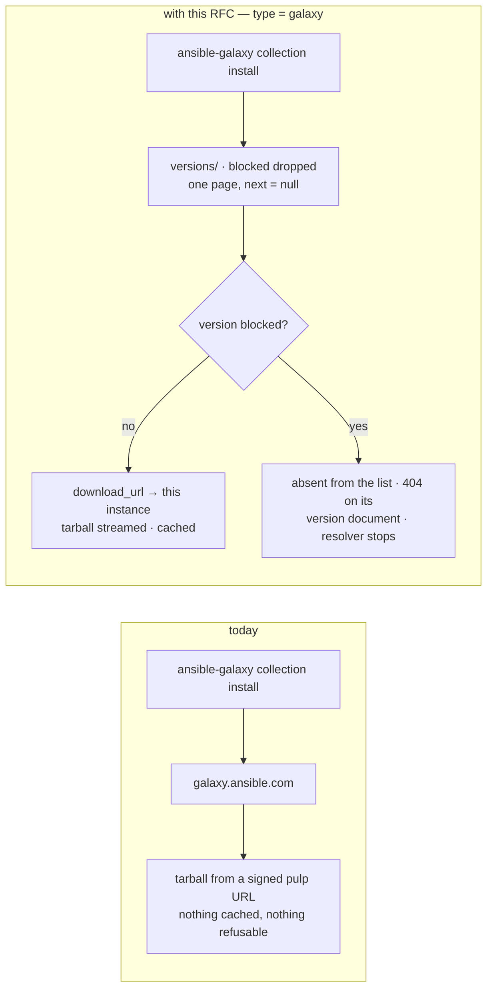
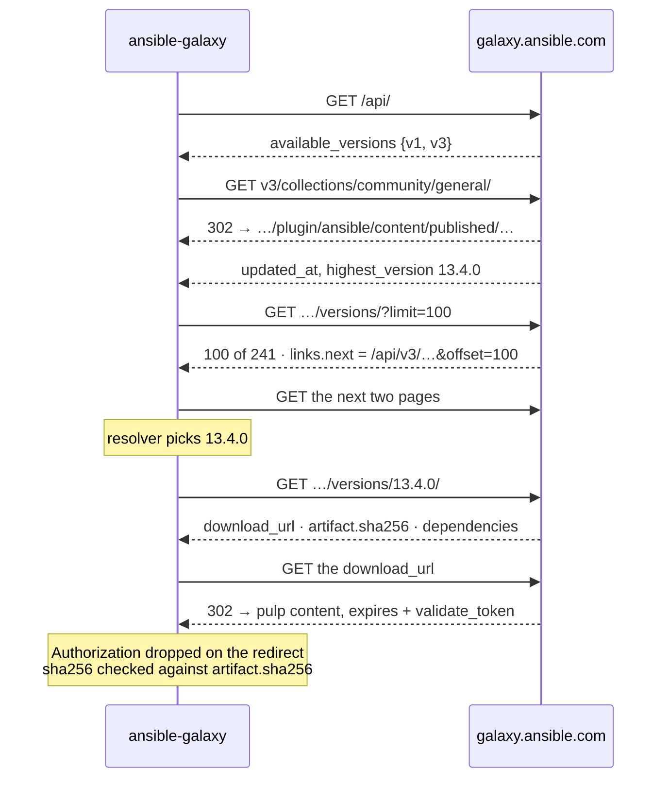
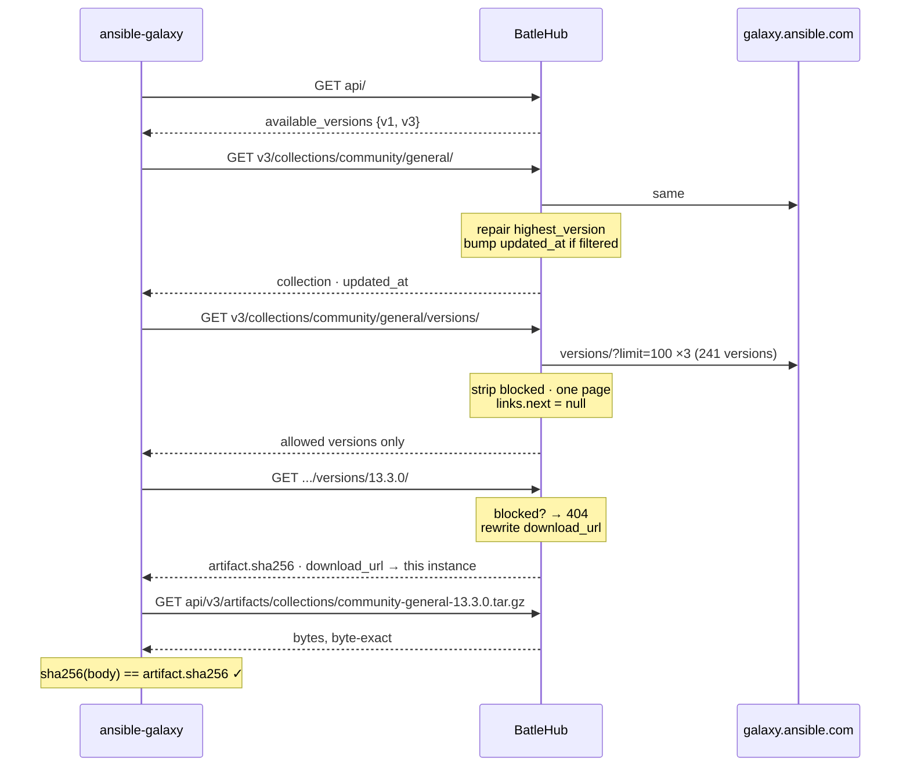
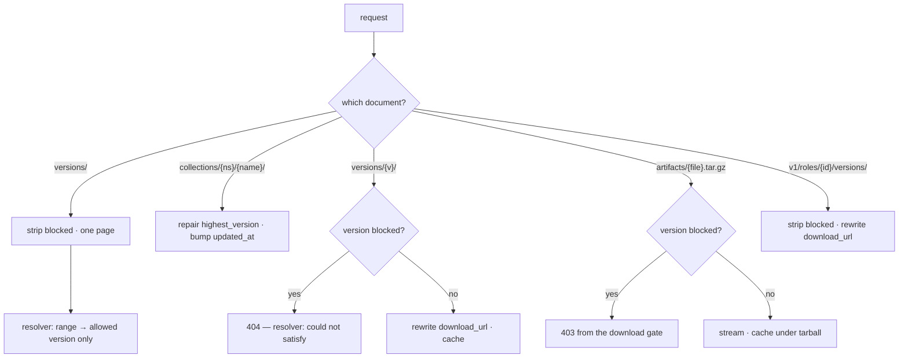
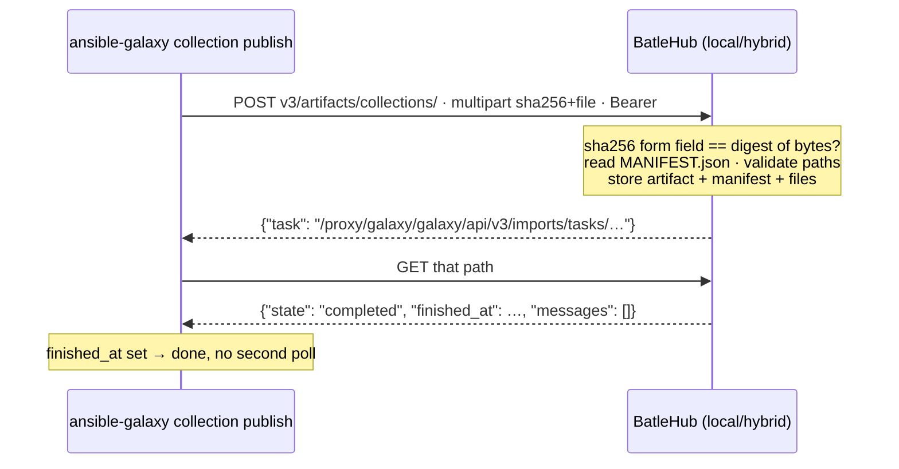

# RFC 0031 — Ansible Galaxy

| Field       | Value                                                        |
| ----------- | ------------------------------------------------------------ |
| Status      | Draft                                                         |
| Short       | Ansible Galaxy                                                |
| Settles     | The collections API v3 as a registry kind: the versions list as the chokepoint, download_url rewritten to this instance, and collection publish with its import-task poll in local mode |
| Author      | Max Batleforc <maxleriche.60@gmail.com>                       |
| Co-author   | Claude Opus 5 <noreply@anthropic.com>                         |
| Created     | 2026-09-11                                                    |
| Supersedes  | —                                                             |
| Touches     | `crates/core`, `crates/config`, `crates/adapters`, `crates/web`, `server`, `cli`, `ui`, docs |

---

## 1. Summary

Ansible is the one automation tool in the roadmap with no adapter. A fleet that
runs `ansible-galaxy collection install` resolves every collection and every
transitive dependency against `galaxy.ansible.com`, and a BatleHub instance
sees none of it.

`type = "galaxy"` serves the collections API v3: `/api/` is the discovery
document, `v3/collections/{ns}/{name}/versions/` is the per-collection listing
and the enforcement chokepoint, `v3/collections/{ns}/{name}/versions/{v}/` is
the version document carrying `download_url` and `artifact.sha256`, and the
`{ns}-{name}-{v}.tar.gz` tarball is the artifact. `local` and `hybrid` mode
accept `ansible-galaxy collection publish` and answer the import-task poll the
client does afterwards. The client switch is `server_list` in `ansible.cfg`.
Roles (the v1 API) are served read-only, with the limit §4.4 states.

Three facts about the client decide the design, and all three were read from
`ansible-core`'s source rather than from the API documentation:

- **Every pagination link the client follows loses a path prefix.** For
  collections, `get_collection_versions` does `urljoin(self.api_server,
  next_link)`, and an absolute-path link replaces the whole path — a link of
  `/api/v3/…` sends the next request to the root of the host, not to
  `/proxy/{registry}/galaxy/…`. For roles, `fetch_role_related` joins
  `next_link` to a deliberately stripped `scheme://netloc/` (the fix for
  ansible issue 64355). So every listing this instance serves is **one page**
  with its `next` null, and the adapter walks upstream's pages itself.
- **The artifact is checksummed by the client.** `_download_file` hashes the
  body and compares it with `artifact.sha256` from the version document,
  failing on *"Mismatch artifact hash with downloaded file"*. The tarball is
  relayed byte-exact and the checksum is relayed unedited. It also drops the
  `Authorization` header across a redirect (`unredirected_headers`), so the
  proxy streams the artifact rather than redirecting to it.
- **`download_url` is absolute and points at the upstream.** Unrewritten, every
  tarball leaves the site while this instance mediates the policy and none of
  the bytes — the `X-Terraform-Get` failure, one protocol over.

### Before / after

```text
# today — every collection resolves against galaxy.ansible.com
ansible-galaxy collection install community.general    # → galaxy.ansible.com, unproxied

# with this RFC
[[registries]]
name = "galaxy"
type = "galaxy"
mode = "proxy"

# ansible.cfg
[galaxy]
server_list = batlehub
[galaxy_server.batlehub]
url = https://batlehub.example.com/proxy/galaxy/galaxy/api/

#   block "community.general" at "13.4.0"
#   → gone from the versions list; a range resolves to 13.3.0, and a pin fails
#     on ansible's own "Failed to resolve the requested dependencies map"
```



The rewritten `download_url` is what moves the 2.8 MB onto this instance, and
the single page is what keeps the client's own URL joining from walking off it.

---

## 2. Motivation

1. **`generic` caches the tree and can enforce nothing on it.** A `generic`
   registry pointed at `galaxy.ansible.com` mirrors the artifact paths and
   addresses all of them as one synthetic package, so there is no version to
   block, nothing in explore, and no per-version statistics — the gap RFC 0010
   §2 named for Node distributions, here for a package registry with a real
   protocol and a real coordinate.

2. **The chokepoint is exact and cheap to hold.** The dependency resolver's
   `find_matches` asks `get_collection_versions` for *every* candidate,
   including a direct request pinned to one version, and picks from the
   returned list. A version absent from the list cannot be selected;
   `ansible-galaxy` prints *"Failed to resolve the requested dependencies map.
   Could not satisfy the following requirements:"* and stops before any
   metadata or artifact request. Both halves of "a blocked version is
   unreachable" already exist in the client.

3. **`download_url` is absolute, and on the real upstream it is a redirect to a
   signed URL.** Checked on the wire: `community.general` 13.4.0's
   `download_url` is
   `https://galaxy.ansible.com/api/v3/plugin/ansible/content/published/collections/artifacts/community-general-13.4.0.tar.gz`,
   which answers `302` to a signed
   `…/api/pulp/content/published/…?expires=…&validate_token=…`.
   A proxy that relays that field caches the listing and none of the 2.8 MB it
   points at, and the operator's first evidence is a cache-hit ratio that never
   moves.

4. **A naive pagination relay breaks under a path prefix.** Upstream's
   `links.next` is an absolute path (`/api/v3/plugin/…&offset=100`, probed).
   Relayed, `urljoin` against an api_server of
   `https://host/proxy/galaxy/galaxy/api/` yields `https://host/api/v3/…`,
   which on a path-routed instance is a `404` and on a host-routed one is
   another registry's namespace. The roles half is worse: `fetch_role_related`
   strips the path *on purpose*, so no link this instance emits can survive it.
   The design has to say how many pages it serves, and the answer is one.

5. **Upstream caps a page at 100 versions.** `?limit=500` and `?limit=1000`
   both come back with 100 items and a `next` whose `limit` is rewritten to
   100 (probed). `community.general` has 241 versions, so "one page to the
   client" is three requests upstream per cache fill, for the largest
   collection in existence. That number belongs in the RFC, because it is the
   cost of the previous point.

6. **Publishing has a protocol, and nothing serves it.** `publish_collection`
   posts a multipart body to `v3/artifacts/collections/` and then polls the
   import task until it reports `finished_at`. An in-house collection today
   lives in a git URL in a `requirements.yml`, with no version, no block list,
   no quota and no retention.

---

## 3. Goals / non-goals

**Goals**

- A collection version can be blocked, and a blocked version is neither
  resolvable from a range nor installable by an exact pin, on ansible's own
  error paths with nothing downloaded.
- Every tarball this instance serves is byte-identical to upstream's, so the
  `artifact.sha256` the client checks and the GPG signature over the
  collection's `MANIFEST.json` both pass unchanged.
- Tarballs are cached under `galaxy/{ns}.{name}/{version}/tarball`, visible to
  explore, statistics, quotas and retention as one version.
- `ansible-galaxy collection publish` works against a `local` or `hybrid`
  registry, including the import-task poll, and the published collection is
  installed back by an unmodified client.
- Roles resolve and install through the instance, with their `download_url`
  rewritten, or the v1 surface is off; the operator chooses (§4.4).
- `requirements.yml`, `collections/requirements.yml` and `galaxy.yml` feed
  `registry suggest` and warming.

**Non-goals**

- **Automation Hub's token exchange.** `auth_url`, `client_id` and
  `client_secret` in a `[galaxy_server.*]` section drive an OAuth2 refresh
  against a Keycloak; this instance issues its own Bearer tokens and the
  client sends them with `token`.
- **The role *write* APIs** — `POST v1/imports`, `ansible-galaxy role import`,
  `delete`, `setup`. They are a forge integration (a GitHub webhook and a
  build), not a registry operation.
- **Galaxy's search and browse APIs** (`v3/plugin/ansible/search/…`,
  namespace listings, the deprecation endpoints). `registry search` answers
  from what this instance holds, as it does for every kind.
- **Signing collections.** Upstream `signatures` are relayed as served;
  nothing is minted, and a locally published collection carries none. RFC 0018
  verdicts are the policy statement this instance makes about a version, not a
  GPG signature in someone else's trust root.
- **`docs_blob` and the rendered content views.** They are galaxy_ng's own
  documentation renderer, not part of an install.
- **Ansible Execution Environments** (`ansible-builder`, `ee` images). Those
  are OCI, and the roadmap's *Not planned* note covers OCI.
- **The `marks` and `deprecated` flags as policy inputs.** Relayed as served;
  a deprecation upstream is not a block here, and the reverse would make an
  operator's block list mean two different things.

---

## 4. User-facing design

### 4.1 Configuration

```toml
[[registries]]
name      = "galaxy"
type      = "galaxy"
mode      = "proxy"                              # proxy · local · hybrid
upstreams = ["https://galaxy.ansible.com/api/"]  # the default
# roles = "proxy"                                # proxy · index · off (§4.4)

[registries.rbac]
# The versions list is a listing; the version document and the tarball are reads.
anonymous = ["releases:read", "releases:list"]
```

- `upstreams` absent means `https://galaxy.ansible.com/api/`. The value is the
  **API root**, the thing that answers `available_versions` — and the adapter
  finds it the way the client does: it fetches the configured URL, and if that
  is not a JSON document with `available_versions` it retries with `/api/`
  appended. An operator who writes `https://galaxy.ansible.com` gets the same
  registry as one who writes the full form.
- `roles` selects how much of the v1 surface exists. Default `proxy`.
- `local` and `hybrid` are supported, under either routing: unlike JSR
  (RFC 0030 §4.4), ansible's publish endpoint is *inside* the configured URL,
  so a path-routed registry can be published to and needs no host binding.

### 4.2 The client side

```ini
# ansible.cfg — the one switch
[galaxy]
server_list = batlehub

[galaxy_server.batlehub]
url   = https://batlehub.example.com/proxy/galaxy/galaxy/api/
token = <a BatleHub token>          # sent as Authorization: Bearer
```

```bash
ansible-galaxy collection install community.general          # resolve, then install
ansible-galaxy collection install -r requirements.yml
ansible-galaxy collection publish ./acme-util-1.0.0.tar.gz   # local / hybrid
ansible-galaxy role install geerlingguy.docker               # roles = "proxy"
```

`GalaxyToken.headers()` sends `Authorization: Bearer <token>`, and a
`username`/`password` pair sends `Authorization: Basic …` — both are shapes
the existing auth chain resolves, with no extractor change. The token is sent
on **every** call once configured, reads included, so a `galaxy` registry can
be closed to anonymous reads without breaking the client, unlike the kinds
whose clients send nothing (RFC 0010 §4.2).

Reads with no token configured are anonymous, which is the ordinary
`anonymous = [...]` decision above.

### 4.3 Coordinates

| Request (under `…/proxy/{reg}/galaxy/`) | `PackageId` | Cache key |
| --- | --- | --- |
| `api/` | — | not a package |
| `api/v3/collections/community/general/` | `community.general`, version unused | metadata, `collection` |
| `api/v3/collections/community/general/versions/` | `community.general`, version unused | metadata, `versions` |
| `api/v3/collections/community/general/versions/13.4.0/` | `community.general` / `13.4.0` | metadata, `version-detail` |
| `api/v3/artifacts/collections/community-general-13.4.0.tar.gz` | `community.general` / `13.4.0` / `tarball` | `galaxy/community.general/13.4.0/tarball` |
| `api/v1/roles/?owner__username=…&name=…` | `roles/geerlingguy.docker`, version unused | metadata, `role` |
| `api/v1/roles/{id}/versions/` | `roles/geerlingguy.docker` | metadata, `role-versions` |
| `api/v1/roles/{id}/download/{version}.tar.gz` | `roles/geerlingguy.docker` / `{version}` / `tarball` | `galaxy/roles/geerlingguy.docker/{version}/tarball` |

**The package is `{namespace}.{name}`**, the spelling a `requirements.yml`
uses and an operator types, not the `{namespace}/{name}` the URL is built
from. A block, an explore row and a grant therefore name what a person names.
Roles carry a `roles/` prefix for the same reason Terraform's explore names
carry `modules/` and `providers/`: two namespaces that can hold the same word
must not collide in one package table.

**The served artifact path ends in the upstream filename.**
`_download_file` derives its working name by slicing `.tar.gz` off the last
path segment, so `…/artifacts/collections/community-general-13.4.0.tar.gz` is
the shape served, not a synthetic `…/versions/13.4.0/tarball`.

`fetchable_by_version()` is `ByVersion(Fixed("tarball"))`: a collection version
is exactly one file, which is also what makes this kind scannable with no new
machinery (§6.11).

### 4.4 Behaviour rules

**What is filtered, and what is not.**

| Document | Treatment |
| --- | --- |
| `versions/` | **Filtered.** Blocked versions are removed from `data`. Served as one page: `meta.count` is the count after filtering, `links.first`/`previous`/`next`/`last` are all `null`. |
| `collections/{ns}/{name}/` | **Filtered.** `highest_version` is repaired to the newest surviving version when the named one was removed, the way `dist-tags.latest` is for npm. `updated_at` is bumped when anything was removed (below). |
| `versions/{v}/` | **404 when the version is blocked.** Otherwise relayed with three fields rewritten: `download_url`, `href`, `collection.href`. `artifact.sha256`, `metadata`, `manifest`, `files` and `signatures` pass through untouched. |
| the tarball | **Never touched.** Byte-exact, or refused at the download gate. |
| `v1/roles/{id}/versions/` | **Filtered**, and each surviving entry's `download_url` is rewritten. Served as one page, `next_link` null. |
| `v1/roles/?owner__username=…` | Relayed. It names no version, so it carries no filtering obligation — a role with one blocked version still exists. |

**One page, always.** Every listing this instance serves carries a null
`next`/`next_link`, because §2.4 shows no non-null value can survive the
client's own URL joining under a path prefix. The adapter walks upstream's
pages itself, capped at `limit=100` by the server, and caches the assembled
document as one entry. The invariant: **because the served document has no
continuation, the client's prefix-losing join is never reached.**

**The listing key is `data`.** galaxy_ng answers with `data`, standalone
pulp_ansible with `results`; the client accepts either (`for key in ['data',
'results']`). This instance emits `data` for every v3 collection listing, in
proxy and local mode alike, because it composes the document anyway and one
shape is one set of fixtures. The v1 role documents keep `results`, which is
the only key that surface has ever used.

**A block bumps `updated_at`, and here is why it is worth doing.**
`get_collection_versions` re-reads `collections/{ns}/{name}/` on every call —
uncached, unlike the versions list itself — and drops its cached copy of the
list when `updated_at` differs from the one it recorded. The client's response
cache otherwise holds a listing for a day. Without the bump, a newly blocked
version stays in a warm client's list until then, the resolver picks it, and
the install fails on a `404` at the version document instead of quietly
resolving to an allowed version. *Enforcement holds either way* — the version
document and the tarball are both refused — so this is an error-quality
mechanism, not a security one. The served value is `max(upstream updated_at,
the newest blocked_at among this collection's block rows)`, which is a real
statement about when the served document last changed.

**The uninteresting case.** With nothing blocked, the versions list is
upstream's entries in upstream's order under a `data` key with null links, the
collection document is relayed with `updated_at` as served, and the version
document differs from upstream's only in the three URL fields. Nothing is
reordered, nothing is reformatted beyond serialising the JSON this instance
parsed.

**Roles, and the limit that has to be stated.** `Role.install` builds
`https://github.com/{github_user}/{github_repo}/archive/{version}.tar.gz`
itself, and only prefers a `download_url` when the matching entry of
`v1/roles/{id}/versions/` carries one. galaxy.ansible.com carries one for
every version (probed: `geerlingguy.docker`, 81 versions, each pointing at
`github.com`), so rewriting that field routes the bytes through this instance.
Two cases it cannot reach, and the registry page says so: a role with **no**
published versions installs from its default branch straight from GitHub, and
a `requirements.yml` entry with an explicit `src:` URL was never a registry
request at all.

| `roles` | Behaviour |
| --- | --- |
| `proxy` (default) | The v1 read endpoints are served, `download_url` is rewritten, and this instance fetches the archive from the host upstream named — through the SSRF guard, and only from a host upstream itself published (§7). |
| `index` | The v1 read endpoints are served with `download_url` relayed. Role metadata is proxied; role bytes are not. For an operator who wants the listing without egress to GitHub from the server. |
| `off` | The v1 endpoints answer `404`, and `available_versions` in the discovery document advertises `v3` only. `ansible-galaxy role install` then fails on the client's own *"requires API versions 'v1'"*. |

**Publishing, in `local` and `hybrid` mode.**

| Route | What |
| --- | --- |
| `POST api/v3/artifacts/collections/` | multipart (`sha256` + `file`), `Authorization` required; answers `{"task": "<absolute path>"}` |
| `GET api/v3/imports/tasks/{id}/` | the poll: `{"state": …, "finished_at": …, "messages": [], "error": null}` |

The publish is synchronous: the tarball is read, validated and stored before
the `POST` answers, and the task it names is already `completed` with a
`finished_at`. galaxy_ng answers `waiting` and does the work in a worker;
nothing the client does depends on seeing that state — `wait_import_task`
loops until `finished_at` is set, treats a `404` on the task as "not started
yet", and prints every `messages[]` entry at its own level. A duplicate
version answers `409` with an `errors[{title, detail, code}]` body, which is
the shape `GalaxyError` renders as *"(HTTP Code: 409, Message: … Code: …)"*.

**The task URL is an absolute path built from the request.** The client does
`urljoin(self.api_server, resp['task'])`, and `api_server` is whatever the
operator configured. A relative value (`v3/imports/tasks/…`) resolves
correctly only when that string ends in a slash, which is the operator's typo
to make; an absolute path (`/proxy/galaxy/galaxy/api/v3/imports/tasks/…`) is
correct under both routings and both spellings. It is built with
`registry_public_base`, the helper the NuGet service index already uses for
exactly this reason.

**What a local publish stores.** `MANIFEST.json`'s `collection_info` supplies
`namespace`, `name`, `version`, `dependencies`, `tags`, `license` and
`readme`; they must agree with the tarball's own name, and the `sha256` form
field must equal the digest of the uploaded bytes or the publish is a `400`
before anything is stored. `FILES.json` travels inside the artifact and is
not re-derived. The version document served afterwards is composed from the
publish row; `manifest` and `files` are the two documents read out of the
tarball at publish time and stored beside it, so a read is never an archive
open.

**Hybrid resolution.** A local version and an upstream version of the same
collection merge in the versions list by version, local winning on collision —
the rule the `npm` kind already applies. The version document and the tarball
come from wherever the version lives.

### 4.5 Validation

`AppConfig::validate()` rejects:

| Condition | Rationale |
| --- | --- |
| `path_allow` on a `galaxy` registry | Not path-addressed; the existing validator refuses it on every such kind. |
| `roles` on a registry whose type is not `galaxy` | The `broker_url` rule: a silently ignored option is a misconfiguration nobody sees. |
| `roles` with a value other than `proxy`, `index`, `off` | Spelled wrong, it would fall back to a default the operator did not choose. |
| A `release_age_gate` rule with no explicit `deny_missing_timestamp` | Every upstream version carries `created_at`, so the field is inert there — but a local publish and an air-gapped listing (RFC 0008-bis) may not, and the choice must be made rather than inherited, as on every kind added since RFC 0010. |

Warnings (logged once at reload and surfaced to the admin):

| Condition | Behaviour |
| --- | --- |
| The upstream's `available_versions` has no `v3` | Served; the registry answers roles only, and every collection request is a `404` the operator will otherwise read as a proxy bug. |
| The upstream's `available_versions` has no `v1` and `roles` is not `off` | Served; the v1 endpoints answer `404` because upstream has none. |
| `mode = "local"` and `roles` is not `off` | Served; there is no publish protocol for roles, so the v1 surface on a local registry can only ever be empty. |

---

## 5. Architecture

### 5.1 The protocol as `galaxy.ansible.com` serves it

No proxy in this subsection. Every response below was fetched while writing
this RFC; the client behaviour is read from `ansible-core` devel
(`lib/ansible/galaxy/api.py`, `collection/concrete_artifact_manager.py`,
`galaxy/role.py`).

| Request | Answers | Type · size | What ansible-galaxy does with it |
| --- | --- | --- | --- |
| `/api/` | `{"available_versions":{"v3":"v3/","v1":"v1/"}}` | `application/json` · 46 B | `g_connect`: caches it for the run, and refuses an action whose API version is absent |
| `/api/v3/collections/{ns}/{name}/` | the collection document | `application/json` · **`302`** to `/api/v3/plugin/ansible/content/published/collections/index/{ns}/{name}/` on the real upstream | read **uncached on every resolve**, for its `updated_at`; `highest_version` and `versions_url` travel with it |
| `…/collections/{ns}/{name}/versions/?limit=100` | one page of versions | `{"meta":{"count":241},"links":{…},"data":[…]}` | the resolver's candidate list, for every direct requirement *and* every dependency |
| `…/versions/{version}/` | the version document | `application/json` | `download_url`, `artifact.sha256`, `artifact.size`, `metadata.dependencies`, `signatures[]` |
| the `download_url` | the collection tarball | `302` to `…/api/pulp/content/…?expires=…&validate_token=…`, 2 866 617 B for `community.general` 13.4.0 | downloads it, **hashing as it reads** |
| `/api/v1/roles/?owner__username={u}&name={r}` | the role, if it exists | `{"count":1,"results":[{…}]}` | `lookup_role_by_name`; takes `results[0]` |
| `/api/v1/roles/{id}/versions/?page_size=50` | every version of that role | 81 entries for `geerlingguy.docker`, `next_link: null` | picks the highest, or validates the requested one, then takes that entry's `download_url` — which points at `github.com` |
| `POST /api/v3/artifacts/collections/` | the publish | multipart `sha256` + `file`; answers `{"task": "…"}` | polls the task until `finished_at` is set |

**The versions list caps at 100 and says so in its own link.** `?limit=500` and
`?limit=1000` both come back with 100 entries and a `next` whose `limit` has
been rewritten to 100 — observed. `community.general` has 241 versions, so the
full list is three requests upstream.

**Every pagination link is an absolute path**
(`/api/v3/plugin/…&offset=100`), and the two clients that follow one handle it
differently: collections do `urljoin(api_server, next)`, which an
absolute path replaces wholesale, and roles do
`urljoin("{scheme}://{netloc}/", next_link)` — the path stripped deliberately,
as the comment on ansible issue 64355 in `fetch_role_related` says. Neither can
survive a path prefix, which is the fact §4.4 is built on.

**What the client verifies.** `_download_file` hashes the body as it streams and
compares it with `artifact.sha256` from the version document, raising
*"Mismatch artifact hash with downloaded file"*. With a keyring configured it
then verifies the version document's `signatures[]` — detached GPG over the
tarball's own `MANIFEST.json`. That is why the tarball must be byte-exact and
the signature list relayed as served. Nothing verifies any listing document.

**Two hard rules the client enforces on URLs.** A `download_url` that is
neither absolute nor absolute-path is *"Invalid non absolute download_url"*; a
pagination link in the same shape is *"Invalid non absolute pagination link"*.
And the artifact download is issued with
`unredirected_headers=['Authorization']`, so a credential is dropped across
any redirect — a proxy that answers the
tarball with a `302` to an authenticated location hands the client a `401`.

**The client caches listings for a day, and invalidates on `updated_at`.**
`ansible-galaxy` enables its response cache by default (`--no-cache` and
`--clear-response-cache` turn it off); entries expire after 24 hours, and
`get_collection_versions` drops its cached list when the collection document's
`updated_at` differs from the value recorded beside it. That document is
fetched *without* the cache, every time, which is what makes §4.4's bump work.

**Credentials.** `GalaxyToken.headers()` sends `Authorization: Bearer <token>`,
a `username`/`password` pair sends `Basic`, and the header goes on **every**
call once configured, reads included. `_add_auth_token` refuses only when a
write needs a token and none is set.

**The spellings.** A collection is `{namespace}.{name}` to a person and
`{namespace}/{name}` in a URL; both halves are lower-case `[a-z0-9_]`. The
tarball is `{namespace}-{name}-{version}.tar.gz`, and `_download_file` derives
its working name by slicing `.tar.gz` off the last path segment. A role is
`{github_user}.{role_name}`, addressed by a numeric `id` after the first
lookup.



One install is: discovery, the collection document, three listing pages, one
version document and one tarball. Then the same again for every dependency the
version document names.

### 5.2 One install, four documents



The invariant: **the only fields this instance writes are the ones no checksum
covers.** The versions list and `highest_version` are policy, the three URL
fields are routing, and everything the client verifies — the tarball and the
`MANIFEST.json` signature inside it — is relayed as received.

### 5.3 Where a block becomes effective



A range resolution never sees a blocked version; a pin asks for it by name and
gets ansible's own unsatisfiable-requirements error; a client holding a version
document fetched before the block is refused at the tarball. The last is
diagnosis rather than enforcement, and it is the only path that reaches the
download gate.

### 5.4 Publishing and the import task



The invariant: **the work is finished before the task exists.** There is no
state a client can observe between "the POST returned" and "the version is
installable", so a publish followed immediately by an install cannot race —
the failure `wait_import_task` is written to tolerate (a task URL that
`404`s because the job has not started) never happens here.

---

## 6. Detailed design

### 6.1 `crates/core` — the registry kind

`RegistryKind::Galaxy` is added to the enum and to `ALL`; the wildcard-free
matches force every answer:

| | `galaxy` |
| --- | --- |
| `supports_local_mode()` | `true` |
| `requires_explicit_upstream_in_proxy_mode()` | `false` — `https://galaxy.ansible.com/api/` |
| `is_path_addressed()` | `false` |
| `listing_filter()` | three rows: `filtered("collection versions", ["versions"])`, `filtered("the collection document", ["collection"])`, `filtered("role versions", ["role-versions"])` |
| `readme_support()` | `Archive` — `MANIFEST.json`'s `collection_info.readme` names a file inside the tarball, conventionally `README.md` |
| `upstream_detail()` | `Document("versions")` — every entry carries `created_at` and `requires_ansible` |
| `fetchable_by_version()` | `ByVersion(Fixed("tarball"))` |
| `warm_artifact()` | derived: `Fixed("tarball")` |
| `blocking_package_name()` | identity |
| `canonical_package_name()` | identity — galaxy names are already lower-case by its own rules |

Two `DocumentKind` constants: `COLLECTION = Secondary("collection")` and
`ROLE_VERSIONS = Secondary("role-versions")`, plus `VERSION_DETAIL =
Secondary("version-detail")` for the per-version document, which is a document
rather than an artifact because it is mutable (its `updated_at` moves) and
nothing checksums it.

### 6.2 `crates/core` — `services/galaxy.rs` and `blocking/galaxy.rs`

`services/galaxy.rs`, no I/O:

- `parse_collection(&str) -> Result<(namespace, name)>` —
  `^[a-z][a-z0-9_]*\.[a-z][a-z0-9_]*$`, the rule every real galaxy server
  enforces. The
  client's own test (`is_valid_collection_name`: exactly one dot, both halves
  Python identifiers and not keywords) admits `Foo.Bar`; the stricter rule is
  the safe direction for something that becomes a storage key.
- `artifact_filename(ns, name, version) -> String` —
  `{ns}-{name}-{version}.tar.gz`, the one spelling §4.3 requires.
- `role_key(user, role) -> String` — `roles/{user}.{role}`.
- `Manifest` / `CollectionInfo` — the serde model of `MANIFEST.json`, used by
  publish and by the README extractor, never on the read path.
- `compose_versions(entries, count) -> Value` and `compose_collection(…)` —
  the local-mode renders, in the `data` shape of §4.4.

`blocking/galaxy.rs`, dispatched from `blocking::strip`:

- `DocumentKind::Versions` → remove blocked entries from `data` (or `results`,
  whichever the parsed document has), rewrite `meta.count`, null every `links`
  member.
- `COLLECTION` → repair `highest_version` to `best_latest` over the surviving
  versions and bump `updated_at` per §4.4.
- `ROLE_VERSIONS` → remove blocked entries from `results`, null `next` and
  `next_link`.

`BlockedVersions` gains `changed_at: Option<DateTime<Utc>>`, the newest
`blocked_at` among the rows it was built from, with a `with_changed_at`
builder so the existing constructor and its call sites are untouched. It is
the one piece of per-block metadata a document needs, and it already exists on
the row (`PackageStatus::Blocked { blocked_at, … }`).

The `Galaxy` arm of `blocking::normalize` is identity: galaxy versions are
semver and the client compares them as semver.

### 6.3 `crates/config`

- `RegistryConfig::roles: Option<GalaxyRoleMode>` with the §4.5 rejections.
- `validate()` gains nothing else: there is no host requirement, and the
  upstream default is a constant.
- `CURRENT_CONFIG_VERSION` does not move.

### 6.4 `crates/adapters` — `registry/galaxy/`

A directory: discovery, the read client, the publish reader and the role
surface are four concerns.

- `client.rs` — `GalaxyRegistryClient { http, api_root, v3, v1, roles }`.
  - **Discovery** happens once per client and is cached with the index TTL:
    `GET {api_root}` expecting `available_versions`, retried against
    `{api_root}/api/` exactly as `g_connect` does. The `v3`/`v1` path segments
    come from that document rather than being hardcoded, because galaxy_ng
    answers `v3/` and a pulp_ansible standalone answers a longer path.
  - `resolve_metadata(pkg)` reads the version document; `NotFound` maps to a
    `404` from upstream. `published_at` is `created_at`.
  - `fetch_version_document(pkg, kind)` covers the four listing documents.
  - `fetch_artifact(pkg)` follows `download_url`, **server-side, through the
    SSRF guard**, including upstream's `302` to a token-signed content URL —
    the SDKMAN broker's rule (RFC 0010 §7), and the reason a redirect is never
    handed to the client. The body is hashed while it streams and the cache
    write is abandoned if it does not match the version document's
    `artifact.sha256`.
  - `list_versions(name)` is the assembled versions list, in `version_order`.
- `pagination.rs` — `collect_pages(url) -> Vec<Value>`: follows `links.next`
  (or `next_link`) against the **same origin only**, with a hard cap of 50
  pages, and returns the concatenated entries. The cap is what stops a hostile
  or looping upstream from turning one client request into an unbounded walk.
- `publish.rs` — the multipart reader and the tar reader: gzip, then `tar`
  (which already refuses `..`, per the scanner canary), bounded by
  `limits.max_artifact_size_bytes`, `MANIFEST.json` and `FILES.json` read
  without extracting to a filesystem.
- `tests.rs` — `mockito`; standalone because the tests span discovery,
  pagination and the publish reader.

### 6.5 `crates/web` — handlers and routes

`handlers/proxy/galaxy/`, prefix `/proxy/{registry}/galaxy/`:

| Route | Handler |
| --- | --- |
| `GET api/` | `discovery` — composed here, not relayed: it advertises *this* instance's `v3`/`v1` and honours `roles = "off"` |
| `GET api/v3/collections/{ns}/{name}/` | `collection` — `serve_local_or_proxy_document`, filtered |
| `GET api/v3/collections/{ns}/{name}/versions/` | `versions` — `serve_local_or_proxy_document`, filtered |
| `GET api/v3/collections/{ns}/{name}/versions/{version}/` | `version_detail` — `404` when blocked, three URLs rewritten |
| `GET api/v3/artifacts/collections/{filename}` | `artifact` — `serve_local_or_proxy_artifact`, `application/gzip` |
| `POST api/v3/artifacts/collections/` | `publish` — `require_local_mode`, multipart |
| `GET api/v3/imports/tasks/{id}/` | `import_task` |
| `GET api/v1/roles/` | `role_search` — `?owner__username=&name=` |
| `GET api/v1/roles/{id}/versions/` | `role_versions` — filtered, `download_url` rewritten |
| `GET api/v1/roles/{id}/download/{filename}` | `role_artifact` — only when `roles = "proxy"` |

Three obligations from the existing rules:

- **Validate at the edge.** `parse_collection` on `{ns}`/`{name}`, semver on
  `{version}`, and `{filename}` parsed back into `{ns}-{name}-{version}.tar.gz`
  and checked against the coordinate before it becomes a storage key — the
  Maven and NuGet-flat rule, because this handler builds the key itself.
- **`body = T` on every success.** `UpstreamDocument` for the five documents,
  `ArtifactBytes` for the two downloads, and named `ToSchema` structs for the
  two this instance invents: `GalaxyDiscovery { available_versions }` and
  `GalaxyImportTask { task }` /
  `GalaxyTaskStatus { state, finished_at, messages, error }`.
- **Route ordering.** `versions/` (the literal) registers before
  `versions/{version}/`, and the collection document before both; the trailing
  slash is part of every v3 path and a redirect to add it would be a second
  request the client's `urljoin` does not expect.

### 6.6 `server`

`builders.rs` forces one arm: `GalaxyRegistryClient` from
`resolve_urls(&reg.upstreams, "https://galaxy.ansible.com/api/")` plus
`reg.roles`. No `main.rs` change.

### 6.7 Rules

`BlockListRule` and `DenyLatestRule` read the coordinate unchanged.
`ReleaseAgeGateRule` reads `published_at`, which every upstream version
supplies as `created_at` (an RFC 3339 instant, so no midnight rule is needed).
RFC 0018's verdict hiding joins the blocked set through `blocked_versions_for`
as on every kind, which is also what carries a verdict into the `updated_at`
bump for free.

### 6.8 `ui` and `docs`

- `ui/src/config/registryTypes.ts` — a `REGISTRY_TYPE_DEFS` entry labelled
  *Ansible Galaxy*, with the `ansible.cfg` block of §4.2, the server block of
  §4.1, and the publish command.
- `docs/registries/galaxy.md` with the generated support and endpoint tables,
  and the four facts the page must carry: the tarball is byte-exact because the
  client checksums it; one page per listing and why; the roles limit of §4.4;
  and that a token is sent on reads as well as writes.
- `docs/registries/index.md`, the sidebar, `docs/operations/egress.md`
  (`galaxy.ansible.com`, and `github.com` when `roles = "proxy"`).
- `ROADMAP.md` — the entry gains the RFC link, and its claim that roles are
  "proxied read-only" is qualified with the `download_url` finding of §2.
- `CLAUDE.md` needs no new paragraph: this kind introduces no repo convention.

### 6.9 `cli` — suggest and warming

`batlehub registry suggest` gains three inputs, beside the `.nvmrc` and
`.sdkmanrc` readers in `cli/src/api/suggest.rs`: `requirements.yml` and
`collections/requirements.yml` (the `collections:` list, each entry's `name`
and `version`, and a `source:` that names a server) and `galaxy.yml` (a
collection being developed — its `namespace`, `name` and `dependencies`). It
emits the registry block of §4.1 and the `ansible.cfg` block of §4.2, with
the `roles` line written out rather than left to the default, so the egress to
GitHub it implies is visible in the file the operator commits (§11 decision 9).

Warming a version fetches one artifact, so `warm_artifact()` answers it with
no per-platform machinery. A `requirements.yml` with pinned versions is the
natural warm list, and `registry suggest` emits it as one.

### 6.10 `tests/heavy/galaxy.sh`

A heavy suite, `config.galaxy.toml` beside it, `task test:galaxy-heavy`, and a
row in the `heavy-client` matrix. `ansible-core` is installed into a run-local
virtualenv with `uv` and its version is pinned in the script and quoted in the
conformance fixture; `ANSIBLE_GALAXY_CACHE_DIR` and `ANSIBLE_HOME` are
redirected into the run's directory so no cache is shared between steps. What
it proves, on the wire, through the tap:

1. `ansible-galaxy collection install community.general` reads `api/`, the
   collection document, one versions list and one version document, then the
   tarball — all through the proxy, and the install succeeds.
2. With the resolved version blocked through the admin API, the same command
   resolves to the next version down, and **nothing** is requested under the
   blocked version's paths. With the block set *after* a first install, a
   second run re-reads the listing rather than serving the stale one — the
   `updated_at` bump of §4.4, observed as a request count.
3. An exact pin on a blocked version exits non-zero with *"Failed to resolve
   the requested dependencies map"* and issues no artifact request.
4. Against a `local` registry, `ansible-galaxy collection publish` of a
   two-file collection succeeds, its import task reports `completed`, and
   `ansible-galaxy collection install acme.util` from a clean `ANSIBLE_HOME`
   installs it and verifies its checksum.
5. `ansible-galaxy role install geerlingguy.docker` with `roles = "proxy"`
   fetches the archive through the instance (the tap sees no direct
   `github.com` connection from the client), and with `roles = "index"` the
   client fetches it from GitHub itself — the difference the table promises.
6. A second install of the same collection moves
   `batlehub_artifact_cache_hits_total`.

### 6.11 Scanning and the air gap

An RFC 0018 scan unit is one tarball per version, which is what this kind
already serves: no `scan_as` hint, no second fetch, nothing new in the
worker.
Two honest limits go in the verdict's reason rather than passing silently:
`guarddog` has no ansible mode, so the artifact scanners that read it are the
generic ones (secrets, archive shape), and OSV has no galaxy ecosystem, so a
metadata scan by coordinate answers nothing today.

The air gap (RFC 0008-bis) needs nothing new either: the listing documents are
composed from held versions, and the tarball is bytes.

**Deliberately untouched**, so reviewers do not go looking:

- `crates/adapters/src/registry/forge.rs` — a role's bytes come from a GitHub
  archive URL, and the `github` kind already speaks to GitHub. It is not
  reused: that kind addresses a repository by ref through an operator's own
  credentials, and this is one upstream-published URL fetched anonymously.
  Sharing the client would give a role download a forge registry's auth.
- `crates/core/src/services/blocking/npm.rs` — `best_latest` is reused for the
  `highest_version` repair; the strip itself is a different document.
- `crates/core/src/rules/release_age.rs` — `created_at` arrives through
  `published_at` like every other kind's date.
- The `generic` kind — a `galaxy.ansible.com` mirror through it keeps working
  for anyone who wants a cache and no policy.
- RFC 0001 host routing — supported and not required, unlike RFC 0030's
  publish path (§4.1).

---

## 7. Security considerations

- **Trust boundary.** The client verifies the tarball against
  `artifact.sha256` from the version document, and this instance serves both;
  a compromised proxy could therefore serve a matched pair. That is the same
  exposure the client has against any server it is pointed at, and it is why
  the GPG signatures over `MANIFEST.json` — which this instance relays and
  cannot mint — are the check that survives a hostile registry. What this
  instance adds is the ability to *remove* a version, never to substitute one.
- **Attacker-controlled inputs.** Namespace, name, version and the artifact
  filename are validated at the edge before they become storage keys; the
  filename is additionally checked against the coordinate it claims. Listing
  documents are parsed as JSON and only the fields §4.4 names are edited.
- **`download_url` is upstream-controlled and is never followed blindly.** The
  adapter follows it only when its origin is the registry's own upstream, or —
  for a role under `roles = "proxy"` — a host on the fixed role-download
  allowlist (`github.com` today), through the SSRF guard either way. A hostile
  upstream document that names `http://169.254.169.254/…` is refused at the
  guard *and* at the origin check, and the request never reaches the network.
- **Pagination is bounded.** `collect_pages` follows same-origin links only and
  stops at 50 pages, so one client request cannot be amplified into an
  unbounded upstream walk by a link that points at itself.
- **Publishing is authenticated by this instance's tokens.** `--api-key` and a
  `token` in `ansible.cfg` both arrive as `Authorization: Bearer`;
  `releases:publish` on the package is the action and RFC 0015/0017 grants
  apply. The multipart body is bounded by `max_artifact_size_bytes` before it
  is buffered, and the `sha256` form field is verified against the bytes, so a
  mismatched pair is a `400` rather than a stored artifact nobody can install.
- **The tarball is never extracted to a filesystem.** `MANIFEST.json` and
  `FILES.json` are read from the archive in memory, with the `tar` crate's
  traversal refusal and an entry-count and entry-size bound.
- **The v1 surface can be turned off**, and `roles = "off"` removes it from
  the discovery document as well as from the routes, so a client fails on its
  own version check rather than on a `404` that looks like a proxy fault.

---

## 8. Alternatives considered

| Alternative | Why rejected |
| --- | --- |
| Relay upstream's pagination links | They are absolute paths; `urljoin` against a path-prefixed api_server drops the prefix, and `fetch_role_related` drops it on purpose. The client would walk off the registry on page two. Emitting fully-qualified URLs instead would work for collections and still not for roles. |
| Serve `?limit`/`?offset` through to upstream and filter per page | The client concatenates, so it would work — until a page emptied by filtering left `meta.count` describing a different document than the one served, and until `list_versions` and the console each needed their own walk. One assembled document is one cache entry for every reader. |
| Mirror `galaxy.ansible.com` with the `generic` kind | Already possible, and already the reason this RFC exists: one synthetic package, no version, nothing to block (§2.1). |
| Leave `updated_at` as upstream sends it | A newly blocked version then stays in a warm client's cached listing for up to a day, and the install fails with a `404` on the version document instead of resolving to an allowed version. Enforcement holds either way, which is why this is a decision and not a defect — but a worse error for a day is a real cost, and the fix is one field on a type that already carries the block set. |
| Make the version document an artifact, as RFC 0030 does for JSR | JSR's version manifest is immutable and integrity-locked; this one is mutable (`updated_at`), carries the URL fields this instance must rewrite, and is checksummed by nothing. It is a document. |
| Redirect the client to upstream's `download_url` | The client strips `Authorization` across redirects and the upstream URL is short-lived and token-signed; more to the point, the bytes would never be cached and the policy would be advisory. |
| Treat roles as a non-goal | The v1 versions document carries a `download_url` for every version on the real upstream, so the bytes *are* reachable — verified, not assumed. Dropping roles would leave `ansible-galaxy role install` pointed at GitHub with the proxy in the config and no indication it does nothing. |
| Accept galaxy's `deprecated`/`marks` as a block input | Two different meanings for one operator-facing list, and a collection deprecated upstream is still installable upstream. The verdict machinery of RFC 0018 is where a judgement about a version belongs. |

---

## 9. Rollout and compatibility

- **Default behaviour**: nothing changes for an instance without a `galaxy`
  registry. `BlockedVersions` gains an optional field with a builder, so every
  existing construction compiles and behaves identically.
- **Config migration**: none. `CURRENT_CONFIG_VERSION` stays.
- **Operator prerequisites**: egress to `galaxy.ansible.com`, and to
  `github.com` when `roles = "proxy"`.
- **Rollback**: remove the registry block. Cached tarballs under `galaxy/…`
  stay until retention takes them; locally published collections remain in the
  database as any local kind's do.

---

## 10. Test plan

- **Unit** (`crates/core/src/services/galaxy.rs`): `parse_collection` against
  the galaxy rules and the traversal cases (`../`, a second dot, an empty
  half); `artifact_filename` round-trips with the handler's parser;
  `compose_versions` on a fixture equals a checked-in document.
- **Unit** (`crates/core/src/services/blocking/galaxy.rs`): a real versions
  fixture (`community.general`, 241 entries) with one version blocked has it
  absent, `meta.count` decremented and every `links` member null; the
  collection document's `highest_version` repaired and `updated_at` bumped
  only when something was removed; a `results`-keyed upstream document
  filtered the same way as a `data`-keyed one; nothing blocked returns
  `Borrowed`.
- **Adapter** (`crates/adapters/src/registry/galaxy/tests.rs`, `mockito`):
  discovery retried with `/api/` appended; three upstream pages assembled into
  one document; a `links.next` pointing at another origin refused; the 50-page
  cap; a `download_url` on a foreign origin refused; a tarball whose bytes do
  not match `artifact.sha256` not written to the cache.
- **Integration** (`crates/web/tests/local_galaxy_registry.rs`): the ten routes;
  `galaxy_publish_traversal_version_returns_400` and its namespace twin; a
  blocked version absent from the listing and `404` on its version document
  and `403` on its tarball; the three URL rewrites present under both path and
  host routing; a publish followed by an install-shaped read; the import task
  answering `completed` on its first poll; `roles = "off"` removing `v1` from
  the discovery document; `openapi_contract` seeing `body = T` on every
  success.
- **Conformance** (`crates/web/tests/protocol_conformance.rs`): a `GALAXY`
  fixture quoting `galaxy/api.py` (`g_connect`, `get_collection_versions`'s
  pagination guard, `get_collection_version_metadata`'s `download_url` guard,
  `publish_collection`, `wait_import_task`), `concrete_artifact_manager.py`'s
  `_download_file` checksum, and `galaxy/role.py`'s `install`.
- **Heavy** (`tests/heavy/galaxy.sh`): §6.10.
- **Existing suites** that must pass unchanged: the whole of `crates/web`;
  `listing_audit.rs` and `blocked_versions_hidden_*.rs`, which enumerate the
  kinds and will fail until the three new listing rows are reachable from
  `strip`.

---

## 11. Decisions and open questions

### Resolved

| # | Question | Decision |
| --- | --- | --- |
| 1 | How many pages does a listing have? | **One**, always, with a null `next`. No link this instance can emit survives the client's own URL joining under a path prefix, and for roles the client strips the path deliberately. |
| 2 | `data` or `results` for v3 listings? | **`data`**, in both modes. The client accepts either; one shape is one set of fixtures. v1 keeps `results`. |
| 3 | Is the per-version document an artifact or a document? | **A document.** It is mutable, it carries the fields this instance rewrites, and nothing checksums it — the opposite of JSR's manifest (RFC 0030 decision 1). |
| 4 | Does a block touch `updated_at`? | **Yes**, `max(upstream, newest blocked_at)`. Enforcement holds without it; the bump is what turns a day of `404`s into a correct resolution. |
| 5 | Are roles in scope? | **Read-only, and configurable.** Their `download_url` is rewritten under `roles = "proxy"`; the two cases that cannot be reached are named on the registry page. |
| 6 | Does `local` mode need a host binding? | **No.** The publish endpoint is inside the configured URL, so path routing works — stated explicitly because the sibling RFC's answer is the opposite. |
| 7 | Is the publish synchronous? | **Yes**, and the task it returns is already finished. The client tolerates a task that does not exist yet; it does not require one. |
| 8 | Is the role-download allowlist configurable? | **No: fixed at `github.com` plus the registry's own upstream.** That covers every role galaxy.ansible.com publishes, and an allowlist nobody has needed yet is a surface to get wrong. `role_download_hosts` is one field to add the day a deployment asks for it. Decided 2026-09-12. |
| 9 | What does `registry suggest` emit for roles? | **`proxy` stays the config default, and `suggest` writes the line explicitly.** The egress to GitHub is then a choice visible in the operator's own file rather than one inherited from a default nobody read. Decided 2026-09-12. |

### Still open

Nothing. The two questions this draft opened are rows 8 and 9 above.

---

## 12. Implementation phases

| Phase | Content |
| --- | --- |
| 1 | `crates/core`: `RegistryKind::Galaxy` and its answers; `services/galaxy.rs`; `blocking/galaxy.rs`; `BlockedVersions::changed_at`. `crates/config`: `roles` and its validation. Lands with phase 2 — a kind with no client fails at startup (RFC 0010 §13.1). |
| 2 | `crates/adapters/src/registry/galaxy/` read side and `pagination.rs`; `builders.rs`; the five collection routes and the discovery document; the conformance fixture; `local_galaxy_registry.rs` for proxy mode. **Useful on its own**: every collection install through the proxy, blocked versions enforced, tarballs cached. |
| 3 | `tests/heavy/galaxy.sh` steps 1–3 and 6. Runs before phase 2 is called done. |
| 4 | `local`/`hybrid`: the multipart and tar readers, the publish and import-task routes, the composed listings, hybrid merge; heavy step 4. **Ships on its own.** |
| 5 | Roles: the three v1 routes, the `roles` modes, the download allowlist; heavy step 5. **Ships on its own**, and an operator who never sets `roles` sees the default arrive with it. |
| 6 | The console entry, `docs/registries/galaxy.md`, the index and sidebar, the egress page, the roadmap correction; `registry suggest` and warming. |
| 7 | Air gap (RFC 0008-bis): the listings composed from held versions, the tarball exported as an artifact. Nothing new is needed in the bundle format. |
