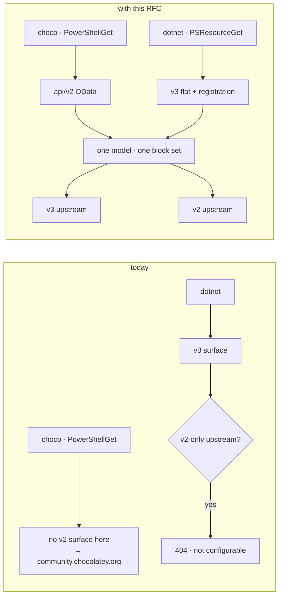
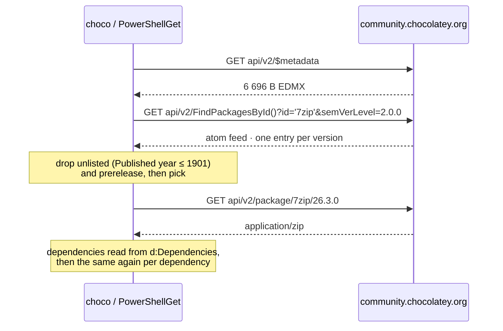
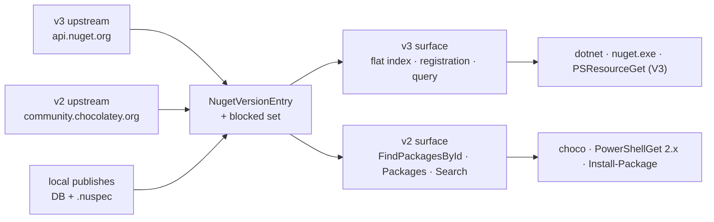
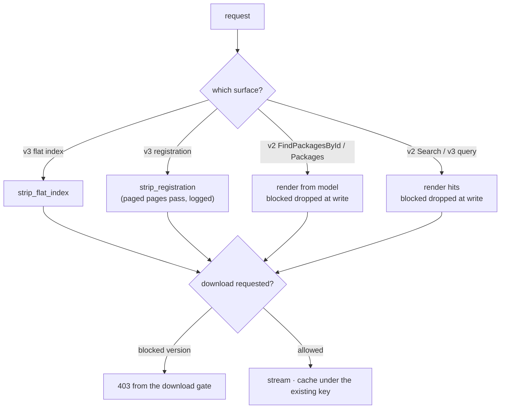
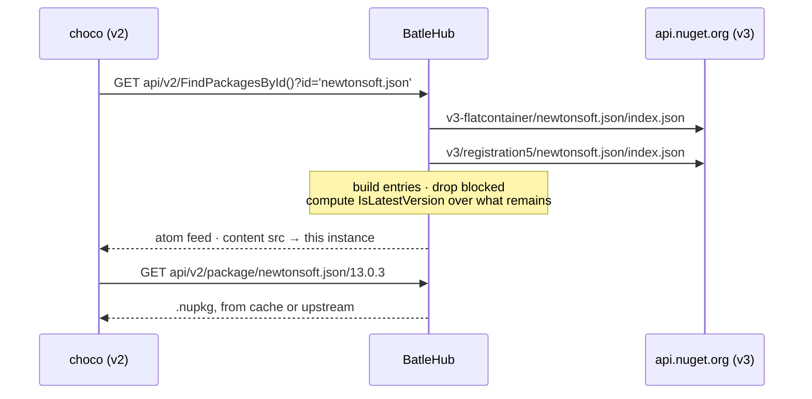
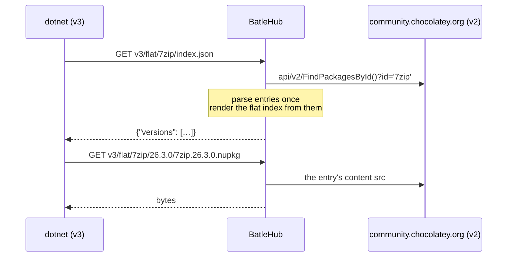

# RFC 0032 — NuGet v2 for Chocolatey and PowerShell Gallery

| Field       | Value                                                        |
| ----------- | ------------------------------------------------------------ |
| Status      | Draft                                                         |
| Short       | NuGet v2                                                      |
| Settles     | Adding the v2 OData surface to the nuget kind so choco and PowerShellGet can read and push through it, rendered from the same data as v3 |
| Author      | Max Batleforc <maxleriche.60@gmail.com>                       |
| Co-author   | Claude Opus 5 <noreply@anthropic.com>                         |
| Created     | 2026-09-11                                                    |
| Supersedes  | —                                                             |
| Touches     | `crates/core`, `crates/config`, `crates/adapters`, `crates/web`, `server`, `ui`, docs |

---

## 1. Summary

The `nuget` kind speaks v3 on both sides: it fetches `{base}/v3-flatcontainer`
and `{base}/v3/registration5` from upstream, and it serves a v3 service index
to clients. The two registries a Windows fleet actually uses are not v3.
`community.chocolatey.org` has no v3 endpoint at all — probed, `404` — and
PowerShell Gallery's own current client registers it as a v2 repository.

This RFC adds a **v2 axis on both sides of the same kind**: a v2 upstream
client, so a `nuget` registry can proxy chocolatey.org and PowerShell Gallery
at last, and a v2 OData server surface under `api/v2/`, so `choco` 1.x,
`PowerShellGet` 2.x and `Install-Package` can read and push through a registry
they can reach. Both are rendered from one internal model, so a block written
once hides a version on the flat index, the registration pages *and* the
OData feed, and `dotnet restore` against a chocolatey upstream works as a side
effect.

Three facts from the clients' own sources set the shape:

- **A v2 feed is one Atom document with a known field set.** NuGet's
  `V2FeedParser` reads `<m:properties>` and `<content src>`; only `Version`
  and `content/@src` are dereferenced unconditionally, everything else is
  optional. `IsListed` is `Published.Year > 1901`, which is exactly what a
  yank is here.
- **The query surface is small and fixed.** `V2FeedQueryBuilder` emits four
  shapes and nothing else, and PSResourceGet emits the same four with a
  slightly different filter vocabulary. This instance recognises those clauses
  and answers `400` to anything else, rather than pretending to be an OData
  server.
- **The delete endpoint the clients use is not the one this instance serves.**
  `PackageUpdateResource` appends `{id}/{version}` to the *push* endpoint, so
  `dotnet nuget delete` asks for `…/nuget/api/v2/package/{id}/{version}`,
  while the yank route is registered at `…/nuget/v2/package/{id}/{version}`.
  The v2 root is where that gets fixed.

### Before / after

```text
# today
[[registries]]
type = "nuget"
upstreams = ["https://community.chocolatey.org/api/v2"]
#   → the client builds …/api/v2/v3-flatcontainer/7zip/index.json  → 404
#   → there is no value of `upstreams` that proxies chocolatey.org

# with this RFC
[[registries]]
name      = "chocolatey"
type      = "nuget"
mode      = "proxy"
upstreams = ["https://community.chocolatey.org/api/v2"]   # v2 detected from the suffix

choco source add -n batlehub -s https://batlehub.example.com/proxy/chocolatey/nuget/api/v2
dotnet restore                      # v3 client, v2 upstream — also works
#   block "7zip" at "26.3.0" → absent from FindPackagesById(), from the flat
#   index, and from the registration pages; `choco install 7zip --version 26.3.0`
#   fails on choco's own "not found in the source(s) listed"
```



Four arrows where there were two, and the point of the diagram is the single
box they all pass through: one answer to "which versions exist", rendered twice
and fetched from either protocol.

---

## 2. Motivation

1. **The Chocolatey Community Repository cannot be proxied at all.** Probed on
   the wire: `https://community.chocolatey.org/api/v3/index.json` answers
   `404`, while `/api/v2/` answers an OData service document and
   `/api/v2/FindPackagesById()?id='7zip'` answers a 6.9 KB Atom feed.
   `NugetRegistryClient::new` builds `{base}/v3-flatcontainer` and
   `{base}/v3/registration5` (`crates/adapters/src/registry/nuget/client.rs`),
   so every request against that upstream is a `404` no matter how `upstreams`
   is spelled. The roadmap lists chocolatey.org as a supported upstream; it has
   never been configurable.

2. **PowerShell Gallery is the same shape.** Its v2 OData endpoints answer
   (`Packages(Id='PSReadLine',Version='2.3.6')` → `200`,
   `application/atom+xml`), and PSResourceGet — the current, maintained client
   — registers PSGallery in its own defaults as `APIVersion.V2`. That is the
   second of the two registries the Windows half of a fleet reads from.

3. **The in-box client on every Windows machine is v2-only.** Windows
   PowerShell 5.1 ships PowerShellGet 2.x over the PackageManagement NuGet
   provider, and PSResourceGet decides a repository's protocol by URL suffix —
   `/v2` is V2, `/index.json` is V3, `/nuget` is a third thing
   (`RepositorySettings.GetApiVersion`). An instance that offers only
   `/nuget/v3/index.json` is reachable by the new client and by nothing older.

4. **The roadmap's premise about `choco` is out of date, and the honest
   constraint is narrower.** Chocolatey 2.x builds its sources with
   `Repository.Factory.GetCoreV3` (`NugetCommon.cs`), the standard NuGet
   factory that carries both protocols, and its own comment in `NugetList.cs`
   says a v3 feed simply has no `ListResource`: *"Some technologies, such as
   Sleet or Baget, only offer V3 feeds, not V2, and as a result, no
   ListResource is available."* So modern choco reads v3 and loses one
   optimisation. What needs v2 is choco 1.x — still the installed base on
   fleets that have not moved to .NET 4.8 — and, far more decisively, the
   upstream in motivation 1.

5. **`dotnet nuget delete` cannot reach the yank route.**
   `PackageUpdateResource.DeletePackageFromServer` joins `{id}/{version}` onto
   the push endpoint the service index advertises, which is
   `/nuget/api/v2/package`. The route registered is
   `/proxy/{registry}/nuget/v2/package/{id}/{version}` — no `api/` — so the
   only way to yank today is the `curl` in `docs/registries/nuget.md`. Every
   client looks somewhere else.

6. **Two renderings of one truth is how a block gets walked around.** If the
   v2 feed were rendered by its own path from its own fetch, a version hidden
   from the flat index could still appear in `FindPackagesById()`, and a
   `choco install` would install what `dotnet restore` refuses. RFC 0006
   §13.1-bis is the same failure in the extension galleries; the fix there and
   here is one model with one filter, rendered twice.

---

## 3. Goals / non-goals

**Goals**

- A `nuget` registry can proxy a v2 upstream — chocolatey.org, PowerShell
  Gallery, an Artifactory or ProGet v2 feed — with no new registry kind, no
  new `PackageId` shape and no second block list.
- `choco`, `PowerShellGet`, `Install-Package` and `nuget.exe` read, install
  and push through the v2 surface; `dotnet` and PSResourceGet keep reading v3
  unchanged.
- A blocked version is absent from the flat index, the registration pages,
  `FindPackagesById()`, `Packages()` and `Search()`, and its download is
  refused on all of them.
- A yank is visible to a v2 client the way v2 spells it: `Published` in 1900.
- `dotnet nuget delete` and `choco push` reach the routes they actually
  address.
- The recognised OData query surface is written down, generated into the
  registry page, and asserted by the conformance fixture.

**Non-goals**

- **Being an OData server.** No `$expand`, no `$select`, no `$format`, no
  arbitrary `$filter` expression tree, no `$count` path segment. The
  recogniser in §6.2 accepts the clauses the real clients emit and refuses the
  rest with an error document, by design and in writing.
- **A `chocolatey` or `powershell` registry kind.** Both are NuGet feeds with a
  `.nupkg`, an id and a version; a second kind would double the block list,
  the explore rows and the grants for one XML dialect.
- **Chocolatey's own extras** — the community feed's moderation fields,
  `ReportAbuse`, virus-scan status, `chocolateyInstall.ps1` inspection. The
  first two are relayed when a v2 upstream sends them and omitted otherwise;
  the third is RFC 0018's job, not the protocol's.
- **`semVerLevel` gating.** nuget.org hides SemVer 2.0.0 versions from clients
  that do not send `semVerLevel=2.0.0`; this instance serves every version to
  everyone, exactly as the flat index already does. §4.4 states the
  consequence.
- **The v2 `$metadata` document as a contract.** One fixed EDMX is served
  because some clients fetch it before anything else; it describes the entity
  this instance emits and is not negotiated or versioned.
- **Symbol packages on v2.** `PUT api/v2/symbolpackage` already exists and is
  unchanged; there is no v2 *read* surface for `.snupkg` because no client
  asks for one.
- **PowerShell-specific filters as semantics.** `substringof('PSModule', Tags)`
  is recognised as a tag filter and applied as one; this instance does not
  learn what a PowerShell module is.

---

## 4. User-facing design

### 4.1 Configuration

```toml
# A v2 upstream — new
[[registries]]
name      = "chocolatey"
type      = "nuget"
mode      = "proxy"
upstreams = ["https://community.chocolatey.org/api/v2"]
# nuget_protocol = "auto"      # auto (default) · v2 · v3

[[registries]]
name      = "psgallery"
type      = "nuget"
mode      = "proxy"
upstreams = ["https://www.powershellgallery.com/api/v2"]

# A v3 upstream — unchanged, and now also readable by a v2 client
[[registries]]
name      = "nuget"
type      = "nuget"
mode      = "proxy"          # upstreams defaults to https://api.nuget.org
```

`nuget_protocol = "auto"` reads the upstream URL's suffix, the rule
PSResourceGet uses for the same question: a path ending in `/v2` or
`/api/v2` is v2, one ending in `/index.json` or `/v3` is v3, anything else is
v3 — which is what `https://api.nuget.org` has always meant here. The explicit
values exist for a feed whose URL says nothing, and for the rollback in §9.

**The v2 server surface is not configurable.** It is always served, like the
packument is on an `npm` registry. A protocol surface that some clients can
find and others cannot is a support question with no good answer, and every
v2 route runs the same authorization, the same rules and the same block set as
its v3 twin.

### 4.2 The client side

```powershell
# Chocolatey
choco source add -n batlehub -s https://batlehub.example.com/proxy/chocolatey/nuget/api/v2
choco install 7zip
choco push my.package.1.0.0.nupkg -s https://batlehub.example.com/proxy/internal/nuget/api/v2 -k <token>

# PowerShellGet 2.x / PackageManagement — the in-box client
Register-PSRepository -Name batlehub -SourceLocation `
  https://batlehub.example.com/proxy/psgallery/nuget/api/v2 -InstallationPolicy Trusted
Install-Module PSReadLine

# PSResourceGet — V2 by suffix, or V3 by pointing at the service index
Register-PSResourceRepository -Name batlehub -Uri https://batlehub.example.com/proxy/psgallery/nuget/api/v2
Register-PSResourceRepository -Name batlehub-v3 -Uri https://batlehub.example.com/proxy/nuget/nuget/v3/index.json

# dotnet / nuget.exe — unchanged, and now able to restore from a v2 upstream
dotnet nuget add source https://batlehub.example.com/proxy/chocolatey/nuget/v3/index.json -n choco
```

The API key travels as `X-NuGet-ApiKey`, which the auth extractor already
normalises to `Authorization: Bearer` before any provider sees it. Nothing in
the auth chain changes.

### 4.3 Coordinates

The v2 surface introduces **no new cache keys and no new `PackageId` shape**.
It is a second rendering of documents this instance already fetches, stores and
filters.

| v2 request (under `…/proxy/{reg}/nuget/api/v2/`) | Reads | Cache key |
| --- | --- | --- |
| `FindPackagesById()?id='7zip'` | the version model for `7zip` | the flat index and registration entries already keyed `versions` / `registration` |
| `Packages(Id='7zip',Version='26.3.0')` | one entry of the same model | as above |
| `Packages()?$filter=…` | the same model, filtered | as above |
| `Search()?searchTerm='7z'` | upstream search, or local search | the existing search path |
| `package/7zip/26.3.0` | the artifact | `nuget/7zip/26.3.0/7zip.26.3.0.nupkg`, the existing key |

Two spellings continue to mean what they already mean: the storage key and the
block list use the lower-cased id (`canonical_package_name`), and the rendered
entry carries the **display** spelling in `<title>` and `<d:Id>` — the
distinction RFC 0007-bis §14.11 records for search results, here for a feed.
Versions are compared in their normalised form (`blocking::normalize`'s NuGet
arm) and emitted twice, as `<d:Version>` (as published) and
`<d:NormalizedVersion>`.

### 4.4 Behaviour rules

**The model in the middle.** One type, `NugetVersionEntry`, is built from
whichever source the registry has, and every surface renders from it:

| Source | How the model is built |
| --- | --- |
| v3 upstream | the flat index for the version list, the registration pages for each version's `catalogEntry` (description, authors, tags, URLs, `dependencyGroups`, `published`, `listed`) |
| v2 upstream | `FindPackagesById()`'s entries, parsed once |
| `local` / the local half of `hybrid` | the publish row plus the `.nuspec` fields captured at publish time |

**Filtering happens at render, not at parse.** The renderer holds the blocked
set from `blocked_versions_for` and drops blocked versions as it writes
entries. This matters for one existing caveat: a registration document whose
`items` is a URL rather than an inline array passes through `strip_registration`
unfiltered, and is logged. The v2 surface does not inherit that hole, because
it filters what it emits rather than trusting what it read. The v3 caveat is
unchanged and out of scope here.

**What a v2 entry carries.**

| Element | Value |
| --- | --- |
| `<title>`, `<d:Id>` | the display id |
| `<d:Version>`, `<d:NormalizedVersion>` | as published, and normalised |
| `<content type="application/zip" src>` | `{public base}/nuget/api/v2/package/{id}/{version}` — this instance, always |
| `<d:Published>` | the publish or first-seen instant; **`1900-01-01T00:00:00Z` when the version is unlisted**, which is how `IsListed` is computed (`Published.Year > 1901`) |
| `<d:Created>`, `<d:LastEdited>` | the same instant when nothing better is known |
| `<d:Description>`, `<d:Summary>`, `<d:Tags>`, `<author><name>` | from the model, empty when unknown |
| `<d:Dependencies>` | the flattened v2 form, `id:range:tfm\|id:range:tfm` |
| `<d:IsLatestVersion>`, `<d:IsAbsoluteLatestVersion>`, `<d:IsPrerelease>` | computed over the **filtered** set, so the newest allowed stable version is the latest one |
| `<d:PackageHash>`, `<d:PackageHashAlgorithm>`, `<d:PackageSize>` | when known: relayed from a v2 upstream, computed at publish for a local version, **omitted** for a v3-upstream-backed entry. Chocolatey's `usePackageHashValidation` (off by default) skips a source that sends none, and throws on one that sends a wrong one, so omission is the safe arm (decision 10) |
| `<d:GalleryDetailsUrl>` | the console's package page |
| `<d:RequireLicenseAcceptance>`, `<d:MinClientVersion>`, `<d:LicenseUrl>`, `<d:ProjectUrl>`, `<d:IconUrl>` | from the `.nuspec` or the `catalogEntry` |

Every one of these except `Version` and `content/@src` is optional to the
client (`V2FeedParser` reads them through a null-tolerant `GetString`), which
is what makes the omitted-hash row safe to state plainly rather than fake.

**The recognised query surface.** Anything else is a `400` with an OData error
body, and the unrecognised clause is logged once per distinct text.

| Accepted | Where |
| --- | --- |
| `id='<id>'` | `FindPackagesById()` |
| `$filter=Id eq '<id>'`, `tolower(Id) eq '<id>'` | both list endpoints |
| `$filter=IsLatestVersion`, `IsLatestVersion eq true`, and the `IsAbsoluteLatestVersion` pair | both |
| `$filter=IsPrerelease eq true|false` | both |
| `$filter=NormalizedVersion <eq|ne|gt|ge|lt|le> '<version>'` | both |
| `$filter=substringof('<term>', Tags)`, `substringof('<term>', tolower(Id))`, with or without ` eq true` | both |
| `and` / `or` between the above, and parentheses | both |
| `$orderby=NormalizedVersion|Version|Id|DownloadCount [desc]` | both |
| `$skip`, `$top`, `$inlinecount=allpages`, `semVerLevel`, `searchTerm`, `targetFramework`, `includePrerelease` | as their names say |

`$inlinecount=allpages` adds `<m:count>` with the number of matches **before**
`$skip`/`$top`, which is what PSResourceGet's `GetCountFromResponse` reads and
what its pagination loop needs. `targetFramework` is accepted and ignored: this
instance does not resolve frameworks, and refusing the parameter would refuse
every `Search()` NuGet sends.

**`Search()` asks upstream, with `$top` capped at 100.** On a proxy or hybrid
registry it delegates to the upstream search the v3 `query` endpoint already
uses, so the two surfaces answer the same question the same way; on a local
registry it searches what this instance holds. A request with no search term
and no `$top` is answered with 100 entries and a log line naming the cap,
because `choco list` with no term against a ten-thousand-package feed is
otherwise one client request that walks all of it (§11 decision 9).

**Pagination is by `<link rel="next">`, with an absolute URL.** When `$top` was
given and more entries remain, the feed carries a `rel="next"` link built from
the incoming request with `$skip` advanced — absolute, because `V2FeedParser`
passes the value straight to its HTTP client. It is never the same URL twice:
a repeated link is a `FatalProtocolException` in the client
(*"Protocol_duplicateUri"*), which is the failure mode this rule exists to
avoid. With no `$top`, one document carries everything and there is no link.
This is the opposite of the answer RFC 0031 §4.4 reaches for ansible, and for
the opposite reason: that client joins the link against a base and loses a path
prefix; this one uses it verbatim.

**`semVerLevel` is accepted and ignored.** A client that does not send it is
telling the server it cannot parse SemVer 2.0.0 versions, and nuget.org hides
them from it. This instance serves every version to every client, as the flat
index already does, so a pre-SemVer2 client may see a version string it will
skip. The registry page says so; hiding versions from some clients and not
others would make "which versions exist" a question with two answers, which is
the thing this RFC exists to prevent.

**The uninteresting cases.** With nothing blocked and no query parameters,
`FindPackagesById()` is every version of the package in ascending order.
With a v3 upstream and no registration data for a version, the entry is emitted
with its version, its download URL and empty prose rather than being dropped:
a missing description must not make a version uninstallable.

**Publish and delete.** `PackageUpdateResource` appends nothing when the source
URL has a path, and appends `/api/v2/package` when it does not, so both of
these are real client behaviour and both are served:

| Route | Reached by |
| --- | --- |
| `PUT api/v2/package`, `PUT api/v2/package/` | a source of `…/nuget/api/v2/package` (what the v3 service index advertises) — exists today |
| `PUT api/v2/`, `PUT api/v2` | a source of `…/nuget/api/v2` (what a v2 client is configured with) — new |
| `DELETE api/v2/package/{id}/{version}` | `dotnet nuget delete` against the advertised push endpoint — new, and the fix for §2.5 |
| `DELETE api/v2/{id}/{version}` | the same against the v2 root — new |
| `DELETE v2/package/{id}/{version}` | the existing route, kept as an alias so documented `curl` invocations and the CLI keep working |

### 4.5 Validation

`AppConfig::validate()` rejects:

| Condition | Rationale |
| --- | --- |
| `nuget_protocol` on a registry whose type is not `nuget` | The `broker_url` rule: a silently ignored option. |
| `nuget_protocol` with a value other than `auto`, `v2`, `v3` | Spelled wrong, it would fall back to a protocol the operator did not choose, and the symptom is a `404` per request. |
| `nuget_protocol = "v3"` with an upstream whose path ends in `/api/v2` | A configuration that can only produce `…/api/v2/v3-flatcontainer/…`. The operator meant one of two things and neither is this. |

Warnings (logged once at reload and surfaced to the admin):

| Condition | Behaviour |
| --- | --- |
| `auto` resolved to v2 | Served; logged with the resolved protocol, because a wrong guess is otherwise a wall of `404`s with no statement of what was assumed. |
| A v2 upstream whose service document does not advertise a `Packages` collection | Served; it is probably not an OData feed, and every read will fail. |
| A v2-backed registry serving a v2 client where `PackageHash` is absent upstream | Logged once per registry, not per request: the hash column of the served feed is empty and a client that checks it will say so. |

---

## 5. Architecture

### 5.1 The protocol as a real v2 feed serves it

No proxy in this subsection. Every response below was fetched from
`community.chocolatey.org` or `www.powershellgallery.com` while writing this
RFC; the client behaviour is read from NuGet.Client's
`V2FeedQueryBuilder`/`V2FeedParser`/`PackageUpdateResource` and PSResourceGet's
`V2ServerAPICalls`/`RepositorySettings`.

| Request | Answers | Type · size | What the client does with it |
| --- | --- | --- | --- |
| `/api/v2/` | the OData service document, `<service xml:base="…/api/v2/">` with one `<collection href="Packages">` | `application/xml` · 408 B | some clients read it to confirm the feed exists; the NuGet library does not |
| `/api/v2/$metadata` | the EDMX describing `V2FeedPackage` | `application/xml` · 6 696 B | the PackageManagement provider fetches it before anything else |
| `/api/v2/FindPackagesById()?id='7zip'&semVerLevel=2.0.0` | every version of one package, as an Atom feed | `application/atom+xml` · 6 941 B for `7zip` | the version list; filtered client-side for prerelease and unlisted |
| `/api/v2/Packages(Id='PSReadLine',Version='2.3.6')` | one version, as a single `<entry>` root | `application/atom+xml` · 4 111 B | a direct resolve; the parser accepts `<entry>` as a document root |
| `/api/v2/Packages()?$filter=…&$orderby=…&$skip=&$top=` | a page of the whole feed | `application/atom+xml` | `nuget list`, `choco list`, `Find-Module` |
| `/api/v2/Search()?$filter=…&searchTerm='…'&targetFramework='…'&includePrerelease=…&$skip=0&$top=30&semVerLevel=2.0.0` | a search page | `application/atom+xml` | search and `Find-PSResource` |
| `/api/v2/package/{id}/{version}` | the `.nupkg` | `application/zip` | installs it |
| `PUT /api/v2/package` (or the feed root) | a publish | | `nuget push`, `choco push`, `dotnet nuget push` |
| `/api/v3/index.json` | **`404` on community.chocolatey.org** | `text/html` · 3 616 B | nothing: there is no v3 endpoint to read |

An entry, abridged from the `FindPackagesById()` feed as served:

```xml
<entry>
  <title type="text">7zip</title>
  <summary type="text">7-Zip is a file archiver with a high compression ratio.</summary>
  <author><name>Igor Pavlov</name></author>
  <content type="application/zip"
           src="https://community.chocolatey.org/api/v2/package/7zip/26.3.0" />
  <m:properties>
    <d:Version>26.3.0</d:Version>
    <d:Dependencies>7zip.install:[26.3.0]:</d:Dependencies>
    <d:IsLatestVersion m:type="Edm.Boolean">true</d:IsLatestVersion>
    <d:IsPrerelease m:type="Edm.Boolean">false</d:IsPrerelease>
    <d:Published m:type="Edm.DateTime">2026-09-04T12:10:33.917</d:Published>
    <d:PackageHash>L0XW5df1XZ/da9YDBd9byUeS1Go6…</d:PackageHash>
    <d:PackageHashAlgorithm>SHA512</d:PackageHashAlgorithm>
    <d:PackageSize m:type="Edm.Int64">3612</d:PackageSize>
  </m:properties>
</entry>
```

Four things in that entry decide the design:

- **`<d:Version>` and `<content src>` are the only fields the parser
  dereferences unconditionally.** Everything else goes through a null-tolerant
  reader, so an omitted `PackageHash` is legal and an omitted `Version` is a
  crash.
- **`IsListed` is computed, not sent.** `V2FeedPackageInfo.IsListed` is
  `!Published.HasValue || Published.Year > 1901`, so "unlisted" on this
  protocol *is* a `Published` date in 1900 — which is what a yank maps onto.
- **`IsLatestVersion` / `IsAbsoluteLatestVersion` are the server's opinion**,
  and clients filter on them rather than computing them. A proxy that hides a
  version has to recompute both or it advertises a latest that is gone.
- **`Dependencies` is one string**, `id:range:tfm` groups joined by `|`, with
  empty fields where a group has no framework.

**The query surface is small and fixed.** `V2FeedQueryBuilder` emits exactly
four URL shapes — the four in the table — and always appends
`semVerLevel=2.0.0`; PSResourceGet emits the same four with
`$inlinecount=allpages` and filters over `NormalizedVersion`,
`IsLatestVersion`, `IsAbsoluteLatestVersion` and `substringof(…, Tags)`.
There is no client in the field that sends
`$expand`, `$select` or a filter over a field outside that set, which is what
makes §6.2's recogniser a recogniser rather than an OData implementation.

**Pagination is `<link rel="next">`, and a repeat is fatal.** `V2FeedParser`
reads the Atom `next` link, requests it verbatim as a full URL, and throws
`FatalProtocolException` (*"Protocol_duplicateUri"*) if the same link comes
back twice. It sends `Accept: application/atom+xml, application/xml`, treats
`404` as an empty feed when it is allowed to, and `204` always.

**Push and delete are derived from the source URL, not advertised.**
`PackageUpdateResource.GetServiceEndpointUrl` appends `/api/v2/package` only
when the source URL's path is empty; otherwise it resolves against the source
as given. So a source of `…/nuget/api/v2/package` pushes there and deletes at
`…/nuget/api/v2/package/{id}/{version}`, and a source of `…/nuget/api/v2`
pushes to the feed root and deletes at `…/api/v2/{id}/{version}`. The API key
travels as `X-NuGet-ApiKey` on both.

**How a client decides which protocol a feed speaks.** PSResourceGet reads the
URL's suffix: `/v2` is V2, `/index.json` is V3, `/nuget` is a third mode
(`RepositorySettings.GetApiVersion`). Chocolatey 2.x asks NuGet's own factory
(`Repository.Factory.GetCoreV3`) and lets it resolve whichever resources the
feed offers. §4.1 borrows the first rule for the *upstream* side, because it
needs no probe.

**The spellings.** An id is case-insensitive and echoed in its display form;
a version is compared in NuGet's normalised form (`1.0.0.0` → `1.0.0`), which
is what `NormalizedVersion` carries and what `Packages(Id=,Version=)` is
addressed by. A key predicate is a literal path segment,
`Packages(Id='x',Version='y')`, not a query.



One install is a metadata document, one feed per package in the dependency
graph, and one `.nupkg` each. No document in the protocol carries a hash the
client is *required* to check: Chocolatey's `usePackageHashValidation` will
compare `d:PackageHash` against the package's own `.nupkg.metadata` content
hash when an operator turns it on, and skips a source that sends none.

### 5.2 One model, two protocols, two surfaces



The invariant: **there is one answer to "which versions exist", and both
surfaces render it.** A block applied to the model cannot be present in one
rendering and absent from the other, which is the property a second adapter
could not have given.

### 5.3 Where a block becomes effective



Four ways in, one gate out. The v2 renderer filters as it writes rather than
trusting the document it read, so it is the one path that is correct even for
a paged registration.

### 5.4 A v2 client against a v3 upstream, and the reverse





The invariant both diagrams show: **the protocol a client speaks and the
protocol an upstream speaks are independent.** Neither is carried through; both
meet at the model.

---

## 6. Detailed design

### 6.1 `crates/core` — the kind's answers

`RegistryKind::Nuget` keeps its variant and every existing answer;
`listing_filter()` gains a third row so the admin coverage table tells the
truth about the new surface:

```text
ListingDocument::filtered("v2 OData feed (FindPackagesById, Packages, Search)", &[])
```

The empty `documents` slice is the established spelling for "filtered at a
handler chokepoint, not through `strip`" — the one
`JETBRAINS_MARKETPLACE` already uses, and for the same reason: several
rendered documents come from one intermediate list.

`readme_support()`, `upstream_detail()`, `fetchable_by_version()` and
`canonical_package_name()` are unchanged: none of them is a statement about a
wire protocol.

### 6.2 `crates/core` — `services/nuget/`

A new directory beside `services/nodedist.rs` and `services/sdkman.rs` — the
two kinds that already keep their pure protocol logic in `core`. Three
files, no I/O:

- `entry.rs` — `NugetVersionEntry` and `NugetPackageModel`, the type of §4.4,
  plus `latest_flags(entries)` which sets `IsLatestVersion` and
  `IsAbsoluteLatestVersion` over the surviving set.
- `odata.rs` — the recogniser. `parse_filter(&str) -> Result<FilterExpr,
  UnrecognisedClause>` over the clause vocabulary of §4.4, `parse_orderby`,
  and `apply(expr, &[NugetVersionEntry]) -> Vec<&NugetVersionEntry>`. A
  hand-written tokeniser and a two-level expression parser (`or` over `and`
  over clause-or-parenthesis); no parser-combinator dependency, and no
  evaluation of anything the parser did not name. Roughly 300 lines including
  its own tests, and the list of accepted clauses is one `enum` a reviewer can
  read.
- `dependencies.rs` — `flatten(dependency_groups) -> String` and its inverse,
  the `id:range:tfm|…` encoding, shared by the v2 renderer and the v2 parser.

### 6.3 `crates/config`

- `RegistryConfig::nuget_protocol: Option<NugetProtocol>` (`Auto`, `V2`, `V3`),
  with the §4.5 rejections, and `resolve(upstream) -> NugetProtocol` holding
  the suffix rule so the validator and the builder cannot disagree.
- `CURRENT_CONFIG_VERSION` does not move: the field is optional and its
  default reproduces today's behaviour for every existing upstream.

### 6.4 `crates/adapters` — `registry/nuget/`

The directory gains two files beside `client.rs` and `models.rs`:

- `v2.rs` — `NugetV2Upstream`: `find_packages_by_id(id)`,
  `get_package(id, version)`, `search(term, skip, top)`, each issuing the URL
  shapes of §4.2 with `Accept: application/atom+xml, application/xml` (the
  headers `V2FeedParser` sends, which some feeds content-negotiate on), and
  each returning `Vec<NugetVersionEntry>`. It follows a `rel="next"` link when
  upstream sends one, same-origin, capped at 50 pages and refusing a repeated
  URL — the client's own guard, on the other side of the wire.
- `atom.rs` — the Atom parser, `quick_xml` in the streaming mode the `.nuspec`
  parser already uses. It reads exactly the elements §4.4 names and ignores
  the rest, so a feed with vendor extensions parses.

`NugetRegistryClient` gains a `protocol` field and dispatches: `list_versions`,
`resolve_metadata`, `fetch_version_document` and `search_packages` each have a
v2 arm that builds the v3-shaped document from the model. `fetch_artifact` on
a v2 upstream uses the entry's `content/@src` rather than a constructed flat
path, because a v2 feed's download URL is not derivable from the coordinate.

### 6.5 `crates/web` — the v2 surface

`handlers/proxy/nuget/odata/` — `mod.rs` (routes), `render.rs` (the Atom
writer), `service.rs` (the service document and `$metadata`).

| Route | Handler |
| --- | --- |
| `GET api/v2/`, `GET api/v2` | `v2_service_document` — the `<service>` XML with the `Packages` collection, `xml:base` from `registry_public_base` |
| `GET api/v2/$metadata` | `v2_metadata` — one fixed EDMX const |
| `GET api/v2/FindPackagesById()` | `v2_find_by_id` |
| `GET api/v2/Packages()` | `v2_packages` |
| `GET api/v2/Packages(Id='{id}',Version='{version}')` | `v2_package_entry` — a single `<entry>` document, which the parser accepts as a root |
| `GET api/v2/Search()` | `v2_search` |
| `GET api/v2/package/{id}/{version}` | `v2_download` — the same path the v3 flat download takes, after the same validation |
| `PUT api/v2/`, `PUT api/v2` | the existing `nuget_publish`, one more registration |
| `DELETE api/v2/package/{id}/{version}`, `DELETE api/v2/{id}/{version}` | the existing `nuget_yank`, two more registrations |

Four obligations from the existing rules:

- **Validate at the edge.** `validate_package_name` on every `{id}`, and on
  the `Id='…'` inside a key predicate, before it reaches a storage key or a
  cache key; the version rejected for `..` and separators. The parenthesised
  key predicate is parsed by the handler, not by a route pattern, because
  actix's path syntax cannot express `Packages(Id='x',Version='y')`: it is
  one literal-prefixed tail segment matched and then parsed.
- **`body = T` on every success.** `UpstreamDocument` does not fit: these are
  XML. A `V2Feed` marker schema joins `ArtifactBytes` and friends in
  `handlers/schemas.rs`, with `content_type = "application/atom+xml"`, and the
  `openapi_contract` test keeps it honest.
- **Route ordering.** `Packages(...)` before `Packages()`, both before the
  `api/v2/` service document; `package/{id}/{version}` before
  `{id}/{version}`, or a download becomes a delete's twin in the router.
- **Authorization is the v3 path's.** Every read calls `authorize_read` with
  the same `PackageId` its v3 twin would, so a grant written for a package
  covers both surfaces and RFC 0015/0017 need no new action.

### 6.6 `server`

`builders.rs` passes `nuget_protocol` (resolved) into `NugetRegistryClient`.
The exhaustive `RegistryKind` match keeps one arm. No `main.rs` change.

### 6.7 `ui` and `docs`

- `ui/src/config/registryTypes.ts` — the NuGet entry gains the v2 snippets of
  §4.2 beside the existing `dotnet` ones, and two upstream presets
  (chocolatey.org, PowerShell Gallery).
- `docs/registries/nuget.md` — a *v2 OData* section with the endpoint table,
  the **generated** table of recognised query clauses (§6.8), the
  `semVerLevel` note, the omitted-`PackageHash` note, and a corrected delete
  row naming `api/v2/package/{id}/{version}` first.
- `docs/guide/admin-policies.md` — regenerated from `listing_filter()`, which
  now carries the v2 row.
- `docs/operations/egress.md` — `community.chocolatey.org` and
  `www.powershellgallery.com`.
- `ROADMAP.md` — the entry gains the RFC link, and its claim that `choco`
  speaks v2 is corrected to §2.4's version.

### 6.8 The generated clause table

The accepted-clause list lives in `odata.rs` as an enum with a doc comment per
variant, and `task docs:endpoints` grows a generator that writes it into
`docs/registries/nuget.md` between markers, with a `:check` drift gate. The
alternative, a hand-maintained list in the page, is the arrangement RFC 0005
and `listing_filter()` were both written to end.

### 6.9 `tests/heavy/nuget.sh`

The existing suite grows a second half, and `config.nuget.toml` a second
registry; `task test:nuget-heavy` and its `heavy-client` matrix row already
exist and gain the new client as a second step rather than a second row.
Chocolatey does not run on Linux, so the v2 *client* under test is
PowerShell: `pwsh` and the in-box-equivalent `PowerShellGet` 2.2.5 are
installed by the job and pinned, and `Register-PSRepository` against the v2
root is the real client this RFC is for. What the suite proves, on the wire:

1. `Install-Module` through the v2 surface of a v3-backed registry installs a
   module, and the tap shows `FindPackagesById()` and
   `package/{id}/{version}` and no other shape.
2. With that version blocked, the same command fails, the version is absent
   from `FindPackagesById()`, and no artifact is requested.
3. `dotnet restore` against a **v2 upstream** (`community.chocolatey.org`)
   resolves and downloads through the v3 surface — the cross of §5.4.
4. `dotnet nuget push` then `dotnet nuget delete` against a `local` registry
   both return `2xx`, and the deleted version is unlisted: it is absent from
   `Find-Module`'s results and its v2 entry carries `Published` in 1900.
5. `Find-Module -Name x -AllVersions` and `Find-PSResource` return the same
   version set as the v3 flat index — the one-truth property, asserted as a
   set comparison rather than a sentence.
6. An unrecognised `$filter` gets a `400` with an OData error body, and the
   log line names the clause.
7. With `usePackageHashValidation` forced on in a `choco` configuration file,
   an install from a v2-upstream-backed registry validates the relayed
   SHA-512, and one from a v3-backed registry logs the skip rather than
   failing — decision 10, observed on the client that implements it, on the
   one runner where `choco` can be driven (or reported skipped, not green).

### 6.10 Scanning, the air gap and the console

Nothing new. A v2-backed version is a `.nupkg` under the same key, so RFC 0018
scans it as any NuGet artifact; the air-gap bundle exports the same artifact;
the console reads `upstream_detail()`'s flat-index document, which a v2
upstream now composes.

**Deliberately untouched**, so reviewers do not go looking:

- `crates/core/src/services/blocking/nuget.rs` — `strip_flat_index` and
  `strip_registration` are unchanged. The v2 surface filters at render (§4.4),
  and giving it a `strip` arm would mean a fourth document kind for a document
  that is never cached in its rendered form.
- `crates/web/src/handlers/proxy/nuget/service_index.rs` — the v3 service
  index already advertises `/nuget/api/v2/package` as `PackagePublish/2.0.0`;
  it is not extended to advertise the OData root, because no v3 client reads a
  v2 resource from a v3 index.
- `crates/web/src/handlers/proxy/nuget/vuln.rs` — the v2 protocol has no
  vulnerability document; `VulnerabilitiesUrl` stays a v3 resource.
- `FetchArtifact::NugetFlat` — the console's fetch coordinate is unchanged,
  and the v2 download path resolves to the same key.
- The `X-NuGet-ApiKey` normalisation in `extractors::raw_auth_from_request` —
  already correct for both protocols.

---

## 7. Security considerations

- **No new authenticated surface, and no new anonymous one.** Every v2 route
  resolves the same `PackageId` and calls the same `authorize_read` /
  `require_local_mode` as its v3 twin. A registry closed to anonymous reads is
  closed on both.
- **The parser is a recogniser, which is the point.** An OData `$filter` is
  attacker-supplied text. Parsing it into a fixed clause enum — rather than
  evaluating an expression tree, or worse, translating it toward a query — is
  what bounds it: an input the parser does not recognise produces a `400`
  before any data is touched, and no accepted clause can name a field the enum
  does not list.
- **Attacker-controlled ids reach storage keys.** `Id='…'` arrives inside a
  key predicate and inside `$filter`, and both go through
  `validate_package_name` before the cache or the storage backend sees them.
  `ensure_safe_key` remains the last line, as for every kind.
- **XML output is escaped, XML input is not expanded.** The renderer writes
  through `quick_xml`'s escaping writer, so a package description containing
  `]]>` or a tag cannot break the document; the Atom parser runs with entity
  expansion off and a size bound, so a v2 upstream cannot bill a billion
  laughs to this process.
- **An upstream `content src` is not followed blindly.** A v2 feed's download
  URL is upstream-controlled; it is fetched only when its origin is the
  registry's own upstream, through the SSRF guard, exactly as
  `ensure_same_origin` already constrains npm tarball URLs.
- **Pagination cannot be amplified.** The upstream walk follows same-origin
  links only, refuses a repeated URL and stops at 50 pages; the served feed's
  `next` always advances `$skip`, so a client cannot be looped either.
- **`PackageHash` is not a promise this instance makes.** It is relayed when
  upstream sent it and omitted when it did not, never computed from bytes this
  instance has not verified against something.

---

## 8. Alternatives considered

| Alternative | Why rejected |
| --- | --- |
| A separate `chocolatey` registry kind | Same `.nupkg`, same id, same version, same block list. A second kind doubles the coverage tables, the explore rows and the grants for one XML dialect, and an operator blocking `7zip` would have to know which kind they were in. |
| Serve v2 only as a shim in front of the v3 surface (HTTP to itself) | Two requests per read, a second authorization pass to keep consistent, and a block applied twice. The model in the middle is the same code with none of that. |
| Implement a general OData parser | The accepted grammar would be much larger than anything the clients emit, every extra production is a way to reach data by a path nobody tested, and the honest surface is four query shapes. §6.2's enum is reviewable in one sitting. |
| Ignore unrecognised `$filter` clauses and return unfiltered results | `$filter=IsLatestVersion` silently ignored returns every version and the client installs the wrong one. A `400` is the only answer that cannot be mistaken for success. |
| Render the v2 feed by filtering the registration document | A paged registration passes through `strip_registration` unfiltered (the caveat that row already carries), so the v2 feed would be the one surface where a block does not hold. Filtering at render makes the new surface correct regardless. |
| Gate the v2 surface behind a config flag | A protocol surface some deployments have and others do not is a support question with no good answer, and the flag's only real effect would be to break a client that found the endpoint anyway. No other kind has a switch for one of its documents. |
| Emit `PackageHash` computed as SHA-512 of the cached bytes for v3-backed entries | It would be a hash of what this instance holds, presented in the field a client reads as the publisher's. Omitting an optional field is honest; filling it with a locally computed value is not. |
| Leave the existing `v2/package/{id}/{version}` delete route as the only one | It is unreachable from every client that implements the protocol (§2.5). Keeping it as an alias costs one registration. |
| Detect the upstream protocol by probing `{base}/index.json` | One extra request per registry at boot, a guess when the probe is refused by a WAF (PowerShell Gallery's `/api/v3/index.json` answers `403` to a non-browser client, probed), and a silent flip if that ever changes. The URL suffix is what the operator wrote down, and it is the rule the PowerShell client already uses. |

---

## 9. Rollout and compatibility

- **Default behaviour**: an existing `nuget` registry keeps its v3 upstream
  (`auto` resolves `https://api.nuget.org` to v3) and gains the v2 read
  surface. No existing route changes, and the two new `PUT`/`DELETE`
  registrations are on paths that answer `404` today.
- **Config migration**: none. `nuget_protocol` is optional.
- **Operator prerequisites**: egress to the new upstream for whoever configures
  one.
- **Rollback**: `nuget_protocol = "v3"` restores the old upstream behaviour for
  a registry; the v2 read surface has no off switch by design (§4.1), and
  removing it would be a revert rather than a configuration.
- **Client migration**: none required. A fleet that registers the v2 root gets
  the v2 surface; one that registers `v3/index.json` sees no change.

---

## 10. Test plan

- **Unit** (`crates/core/src/services/nuget/odata.rs`): every accepted clause
  of §4.4 parsed, including the URL-encoded `%20` spellings
  `V2FeedQueryBuilder` emits; `and`/`or`/parenthesis nesting; an unrecognised
  function, an unknown field and a malformed literal each producing
  `UnrecognisedClause` with the offending text; `apply` over a fixture of ten
  entries for each clause.
- **Unit** (`entry.rs`, `dependencies.rs`): `latest_flags` over a set whose
  newest stable is blocked; the dependency string round-tripping through
  `flatten` and back; `IsListed` mapping to `Published` 1900 and back.
- **Adapter** (`crates/adapters/src/registry/nuget/tests.rs`, `mockito`): a real
  `FindPackagesById()` feed captured from community.chocolatey.org — the
  probe this RFC was written against, checked in beside the adapter tests —
  parsed into entries; a feed with a `rel="next"`
  walked, a repeated `next` refused, a foreign-origin `next` refused; a v2
  upstream rendering a v3 flat index and registration document; protocol
  resolution for six upstream URL shapes.
- **Integration** (`crates/web/tests/nuget_v2_odata.rs`, new): the nine read
  routes in path and host form; `Packages(Id='x',Version='y')` for a blocked
  version answering an empty feed rather than an entry; a blocked version
  absent from `FindPackagesById()` while present upstream; a `400` with an
  OData error body for `$filter=Foo eq 1`; `<m:count>` present only with
  `$inlinecount`; the `next` link absolute, advancing and absent without
  `$top`; the two new `PUT` and three `DELETE` registrations;
  `nuget_v2_traversal_id_returns_400`; `openapi_contract` seeing `body = T` on
  every success.
- **Integration** (`crates/web/tests/blocked_versions_hidden_nuget.rs`):
  extended with the assertion that the v2 feed and the flat index return the
  same version set, blocked and unblocked — the one-truth property as a test
  rather than a paragraph.
- **Conformance** (`crates/web/tests/protocol_conformance.rs`): a `NUGET_V2`
  fixture quoting `V2FeedQueryBuilder`'s four formats, `V2FeedParser`'s field
  set and its `GetNextUrl`, `V2FeedPackageInfo.IsListed`,
  `PackageUpdateResource.GetServiceEndpointUrl`, and PSResourceGet's
  `FindName`/`FindVersionGlobbing` query builders.
- **Heavy** (`tests/heavy/nuget.sh`): §6.9.
- **Existing suites** that must pass unchanged: the whole of `crates/web`; the
  existing `tests/heavy/nuget.sh` steps against `dotnet`, which are the
  regression check that v3 kept working.

---

## 11. Decisions and open questions

### Resolved

| # | Question | Decision |
| --- | --- | --- |
| 1 | A new registry kind, or an axis on `nuget`? | **An axis.** Same artifact, same coordinate, same block list; a second kind would double every table for one XML dialect. |
| 2 | How is the upstream protocol chosen? | **By URL suffix**, with an explicit override. It is the rule PSResourceGet uses, it needs no probe, and a probe would be wrong behind PowerShell Gallery's WAF. |
| 3 | Is the v2 surface configurable? | **No.** Always served, like the packument on an `npm` registry. |
| 4 | How much OData? | **A recogniser over the clauses the real clients emit**, `400` for the rest, and the accepted list generated into the registry page from the enum. |
| 5 | Where does filtering happen for v2? | **At render.** It is the only place that is also correct for a paged registration, which `strip_registration` passes through. |
| 6 | Pagination? | **`rel="next"` with an absolute URL, only when `$top` was given.** The client uses the link verbatim and treats a repeat as fatal — the opposite of RFC 0031's answer, for the opposite reason. |
| 7 | What does a yank look like on v2? | **`Published` = 1900-01-01**, because `IsListed` is `Published.Year > 1901` in the client. |
| 8 | `PackageHash` for a v3-backed entry? | **Omitted.** Optional to the parser, and a locally computed value in a publisher-provenance field would be a lie. |
| 9 | Does `Search()` fan out to upstream? | **Yes, with `$top` capped at 100 and a log line when the cap bites.** The v3 `query` endpoint already delegates, so the two surfaces answer the same question the same way; the cap is what stops `choco list` with no search term from walking a ten-thousand-package feed through this instance. Decided 2026-09-12. |
| 10 | Does any shipping client verify `PackageHash` on a v2 download? | **Chocolatey does, behind a feature that is off by default, and it already tolerates a hashless source.** `usePackageHashValidation` (2.3.0+, `defaultEnabled: false`) compares the feed's hash with the `.nupkg.metadata` content hash; a source that provides none is skipped with a debug line, whose comment names *"v3 api based sources"* as exactly that case, and a non-SHA-512 hash is a warning. So decision 8 is the safe arm: omitting is tolerated by the one client that checks, and a wrong or non-SHA-512 value is an `InvalidDataException`. |

### Still open

Nothing. The two questions this draft opened are rows 9 and 10 above.

---

## 12. Implementation phases

| Phase | Content |
| --- | --- |
| 1 | `crates/core/src/services/nuget/`: the model, the recogniser, the dependency encoding, with their unit tests. `crates/config`: `nuget_protocol` and its validation. Lands alone: nothing reads it yet, and the recogniser is the part worth reviewing on its own. |
| 2 | The v2 **upstream** client (`registry/nuget/v2.rs`, `atom.rs`), protocol dispatch in the client, `builders.rs`. **Useful on its own**: chocolatey.org and PowerShell Gallery become proxyable by every v3 client, which is motivation 1 closed. |
| 3 | The v2 **server** surface: the nine read routes, the renderer, the service document and `$metadata`; the two `PUT` and three `DELETE` registrations, which close §2.5. `nuget_v2_odata.rs`, the conformance fixture. **Useful on its own.** |
| 4 | `tests/heavy/nuget.sh`'s second half (§6.9) with `pwsh` and PowerShellGet. Runs before phase 3 is called done, and answers open questions 9 and 10. |
| 5 | The generated clause table and its drift gate, `docs/registries/nuget.md`, the admin-policy regeneration, the console snippets and upstream presets, the roadmap correction. |
