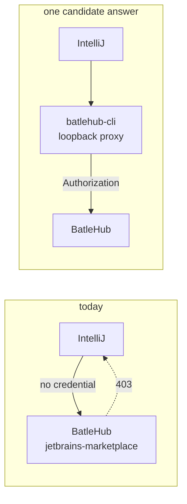

# RFC 0033 — Authenticated JetBrains Marketplace access

| Field       | Value                                                        |
| ----------- | ------------------------------------------------------------ |
| Status      | Draft                                                         |
| Short       | Authenticated JetBrains access                                |
| Settles     | Giving IntelliJ a way to send a credential to a jetbrains-marketplace registry, which its plugin-host setting has no field for |
| Author      | Max Batleforc <maxleriche.60@gmail.com>                       |
| Co-author   | Claude Opus 5 <noreply@anthropic.com>                         |
| Created     | 2026-09-13                                                    |
| Supersedes  | —                                                             |
| Depends on  | RFC 0011 §4.4 (the loopback gallery proxy, for the shape this one would copy); RFC 0015 for the grants a refusal comes from |
| Touches     | `cli/` (a second loopback proxy, if that is the answer), `tests/heavy/`, docs |

**This is a placeholder opened deliberately early.** The problem is established
and §2 records it; the design is not, and §11 carries every question that has
to be answered before §4–§6 can be written. Nothing here should be implemented
from as it stands.

---

## 1. Summary

A `jetbrains-marketplace` registry that refuses anonymous callers cannot be
used by IntelliJ, because IntelliJ has nowhere to put a credential. Its
`idea.plugins.host` property — and the Plugin Repositories dialog behind it —
takes a URL and nothing else; JetBrains' own documentation describes no
authentication for a custom plugin repository at all.

That is the same problem VS Code has, and RFC 0011 §4.4 already answered it
once: a loopback proxy the user's own CLI runs, which holds the credential so
the editor never sees it. This RFC asks whether the same answer fits here, and
what it would take.

### Before / after

Today the refusal is the end of the story: the property carries a URL, the URL
carries no credential, and a closed registry answers `403`. The candidate
answer moves the credential one process away from the editor, which is what
RFC 0011 did for the editor that had the same gap.

---

## 2. Motivation

1. **IntelliJ has no credential field, and this is documented by its absence.**
   `pacman.conf(5)` at least says what it does not have; JetBrains' *Managing
   plugins* page describes the custom repository URL, `idea.plugin.hosts` and
   `idea.plugins.host`, and says nothing about credentials in a URL, a token,
   or a login prompt. A closed `jetbrains-marketplace` registry is therefore
   unusable from the IDE rather than merely authenticated.
2. **It is the last registry kind with no client-level authorization
   coverage.** `docs/contributing/testing.md` §7-ter records twenty-one of
   twenty-four kinds covered at both the route and the client level. The three
   that are not are blocked by their client, and of those three
   `vscode-marketplace` and `openvsx` already have an answer in RFC 0011 and
   the che-code fork. This one has none.
3. **The proxy that would answer it is VSX-shaped, not reusable as it
   stands.** `cli/src/gallery_proxy.rs` is a loopback server in front of one
   *VSX* registry: it renders `extensionquery` responses, rewrites
   `assetUri`/`fallbackAssetUri`, and serves a synthetic `batlehub.sign-in`
   entry. None of that transfers to `updatePlugins.xml`, `plugins/list`,
   `pluginManager?action=download` and `files/{plugin}/meta.json`. What
   transfers is the *design*, and §11 asks how much of it.
4. **A refusal an IDE renders as an empty list is not a boundary.** RFC 0009
   §5.2's distinction applies here and has not been measured: nobody has
   observed what IntelliJ does with a `403` from its plugin host. If it draws
   an empty Plugin Repositories list in silence, the design needs an
   equivalent of RFC 0011 §4.4.2's sign-in entry, which is the expensive half.
   If it shows a legible error, the proxy reduces to attaching a header and
   rewriting URLs.

---

## 3. Goals / non-goals

### Goals

- A supported way for IntelliJ to reach a `jetbrains-marketplace` registry
  that does not grant anonymous read.
- Whatever that way is, a client-level authorization pair for the kind — the
  IDE refused when the credential holds no read verb, and working when it
  does — so the kind leaves the "route level only" row of
  `docs/contributing/testing.md` §7-ter.

### Non-goals

- **Changing the server.** The registry already refuses correctly and the
  route-level pair is already asserted by `authz.sh reads`. The gap is on the
  client side, and a server change to accommodate a client that cannot
  authenticate would be the wrong repair.
- **A second credential store.** Whatever runs would read the contract file
  RFC 0011 already defines, not invent a JetBrains-specific one.
- **Publishing.** Upload is a Gradle plugin with its own token handling and is
  not affected by this gap.
- **Deciding between the candidate answers.** That is §11, and this draft
  deliberately does not pre-empt it.

---

## 4. Security considerations

Two things are already clear, and both constrain any answer:

- **The editor must not hold the token.** An IDE runs arbitrary third-party
  plugin code, which is the reason RFC 0011 §4.4 put the credential in a
  separate process rather than in `product.json`. The same reasoning applies
  to `idea.properties`, which is a plain file in the IDE's own config
  directory.
- **Loopback is not a boundary in a workspace pod.** Every container in the
  pod shares it, so a port protects nothing. RFC 0011 §4.4.1's answer — a
  per-session random path segment, regenerated per invocation and never
  logged — is the floor for anything that listens here too.

---

## 5. Alternatives considered

Recorded now so the eventual design has to argue against them rather than
rediscover them. None is chosen.

| Alternative | Cost |
| --- | --- |
| A loopback proxy in `batlehub-cli`, as RFC 0011 §4.4 | A second protocol renderer to write and maintain; and the authorization boundary is then exercised by the proxy, not by the IDE, so the test proves "the supported deployment fails correctly" rather than "IntelliJ carries a credential" |
| Userinfo in the plugin-host URL | Undocumented by JetBrains. It may work — the IDE hands the URL to its HTTP client — but building on an undocumented behaviour is what made the `nodedist` and `sdkman` setup snippets wrong, and that cost is recent |
| A signed URL per RFC 0012, so the host URL needs no credential | Moves the secret into a URL that lands in `idea.properties`, and the plugin host is read repeatedly rather than once, so the expiry window is the whole question |
| Leave it uncovered, and say so | Free, and honest — but it leaves one registry kind that cannot be closed without becoming unusable, which is a product gap rather than a testing one |

---

## 6. Decisions and open questions

### Resolved

Nothing yet.

### Still open

1. **What does IntelliJ do with a `403` from its plugin host?** Not measured.
   The answer decides whether an equivalent of RFC 0011 §4.4.2's sign-in entry
   is needed, which is most of the cost. **Recommendation: measure this
   first** — the IDE is already downloaded by `tests/heavy/marketplace.sh`, so
   the experiment is small and it is the cheapest thing that changes the
   design.
2. **Does `idea.plugins.host` accept userinfo in the URL?** Also not measured,
   and cheap to measure in the same run as question 1. A yes would make most
   of this RFC unnecessary.
3. **Which of the alternatives in §5**, given the answers to 1 and 2.
4. **If it is a proxy: one binary or two?** `batlehub proxy serve` is VSX-only
   today. A `--kind` flag, a sibling subcommand and a second binary are all
   plausible, and the answer depends on how much of the rendering is shared —
   on present reading, almost none.
5. **Which documents need URL rewriting.** `updatePlugins.xml` and the plugin
   API return absolute download URLs on the BatleHub origin; left alone the
   IDE would fetch them without a credential, which is the bug RFC 0011
   §4.4.3 fixed for the gallery. The full list is part of the design, not of
   this draft.
6. **Where the heavy test lives**, once there is something to test — an
   `authz.sh live:` target, an extension of `marketplace.sh`, or its own
   script.

---

## 7. Implementation phases

Not yet. Phase 1 is answering questions 1 and 2 of §6, which is an experiment
rather than an implementation, and the shape of everything after it depends on
what that experiment finds.
