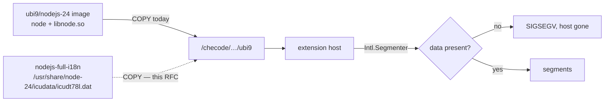

# RFC 0034 — A full-ICU node in the editor assembly

| Field       | Value                                                        |
| ----------- | ------------------------------------------------------------ |
| Status      | Draft                                                         |
| Short       | full-ICU node                                                 |
| Settles     | Why the fork's node carries the full ICU data, how it is shipped, and what would let the commit be dropped |
| Author      | Max Batleforc <maxleriche.60@gmail.com>                       |
| Co-author   | Claude Opus 5                                                 |
| Created     | 2026-09-13                                                    |
| Supersedes  | —                                                             |
| Depends on  | RFC 0023 (the fork, its series, and the rule that every feature carries a document) |
| Touches     | `batleforc/che-code`: `build/dockerfiles/linux-libc-ubi9.Dockerfile`, `linux-libc-ubi8.Dockerfile`, `linux-musl.Dockerfile`, `BATLEHUB.md`, `.github/workflows/bh-image.yml`; here: `devfile.yaml`, `docs/contributing/testing.md` |

---

## 1. Summary

The node that che-code ships inside its editor assembly is built with *small*
ICU and without the optional data package that completes it. One JavaScript
call — `new Intl.Segmenter().segment(s)` — does not throw on that build, it
**segfaults the process**. In the editor that process is the extension host, so
any extension that segments a string kills every other extension with it, with
no error message anywhere: the user sees *Extension host terminated
unexpectedly* and a workspace that reloads in a loop.

This is not hypothetical. `DavidAnson.vscode-markdownlint` 0.61 began calling
`Intl.Segmenter` (through `string-width`, for MD013's wide characters). Since
that release, opening *any* markdown file on `cde.batleforc.fr` takes the
extension host down three times before the editor gives up.

The fix is the data file the node build already looks for and the image does
not carry. `[bh:node-icu]` puts `icudt78l.dat` at the path compiled into the
binary, in all three assemblies. Nothing else changes: no patch to `code/`, no
launcher edit, no environment variable.

### Before / after

```text
# today — the assembly's own node
$ /checode/checode-linux-libc/ubi9/node -e "new Intl.Segmenter().segment('ab')"
Segmentation fault                       # v24.18.0, icu_small=true, ICU 78.3

# with this RFC
$ /checode/checode-linux-libc/ubi9/node -e "new Intl.Segmenter().segment('ab')"
$ echo $?
0
```

---

## 2. Motivation

1. **The failure is silent, and it is not the failing extension that pays.**
   The extension host dies on a signal: no exception, no log line, no
   `[Extension Host]` message. Six days of this instance's logs carry four
   `SIGSEGV` entries and nothing that names a cause. What the user sees is
   every extension gone — git, rust-analyzer, the terminal tools — because one
   of them measured the width of a string.
2. **One extension is affected today, and any extension can be tomorrow.**
   `Intl.Segmenter` is the standard way to count graphemes since Node 16.
   `string-width`, `slice-ansi`, `cli-truncate` and everything downstream of
   them use it. The fuse is lit for the whole ecosystem, not for markdownlint
   in particular — pinning `markdownlint` 0.60.0 buys time, it does not fix
   anything.
3. **The data is missing, not the capability.** The binary is built
   `--with-intl=small-icu --with-icu-default-data-dir=/usr/share/node-24/icudata`
   and that path is compiled into `libnode.so.137` — `strings` finds it three
   times. Red Hat ships the completing data as an optional `full-i18n`
   subpackage, a `Recommends:` that a container base image does not pull. So
   the editor image inherits a node that is one 33 MB file away from correct.
4. **Waiting for upstream is unbounded, and the change is a `COPY`.** che-code
   does not build node; it copies `/usr/bin/node` out of
   `registry.access.redhat.com/ubi9/nodejs-24` and `libnode.so*` out of that
   image's `/usr/lib64`
   (`build/dockerfiles/linux-libc-ubi9.Dockerfile`, the `cache node from this
   image` step). Adding the data directory beside them is a line in the same
   stage. We ask upstream in the same week (§9), and carry it until they answer.

---

## 3. Goals / non-goals

**Goals**

- `Intl.Segmenter` works, on every assembly the fork publishes (ubi9, ubi8,
  musl), with the same result as a full-ICU node.
- The fix survives a rebase untouched: it edits build files, never `code/`.
- The image build proves it, in one line, on every build.
- The commit can be dropped the day upstream carries the data, and the test
  keeps passing when it is — that is how we learn it can go.

**Non-goals**

- **Building node ourselves.** che-code takes the distribution's binary and so
  do we; a node we compile is a supply chain we own for no reason, and it would
  not survive upstream's next base-image bump.
- **Replacing it with a nodejs.org build.** Those are full-ICU and would also
  fix it, but they are not the binary Red Hat patches, ships and errata-tracks;
  swapping it changes what runs the editor far beyond ICU. §8 keeps it as the
  fallback if the data route fails on some assembly.
- **Trimming the data.** ICU's filtered builds can produce a smaller `.dat`,
  and the day 33 MB matters we will measure it. It does not matter in an image
  that is already gigabytes.
- **Fixing the segfault itself.** That node segfaults where it should throw is
  a node defect, reported as one (§9); this RFC only stops feeding it.
- **Any change to the extensions an instance installs.** Pinning `markdownlint`
  is the interim measure of RFC 0023 §11 row 12, not the design here.

---

## 4. User-facing design

Nobody configures anything. The data file is in the image, at the path the
binary already searches, and `Intl.Segmenter` behaves as it does everywhere
else.

### 4.1 The interim, before the image exists

An instance that runs upstream's image today has two moves, and neither needs a
rebuild:

```yaml
# devfile.yaml — the editor's container
env:
  - name: NODE_ICU_DATA
    value: /projects/.icu          # a directory holding icudt78l.dat
```

`NODE_ICU_DATA` overrides the compiled default and is read by the server and by
every extension host it spawns. The file lives on the workspace's persistent
volume, so it survives a restart; a workspace that has not been given one keeps
the crash, which is why pinning `markdownlint` 0.60.0 stays the first move.

Verified on this instance: with `NODE_ICU_DATA` pointing at a directory holding
`icudt78l.dat` from the ICU 78.3 release, the assembly's own node segments
`'héllo wörld 👨‍👩‍👧'` into 13 graphemes and `'bonjour le monde'` into 5 word
segments, where the same binary without it dies on the first call.

---

## 5. Architecture

Three facts, and the design falls out of them.

- **The binary looks for the data.** `process.config.variables` on the shipped
  node reads `icu_small=true`, `icu_locales=en,root`, `icu_ver_major=78`,
  `icu_endianness=l`, `icu_default_data=/usr/share/node-24/icudata`. A node
  built this way loads `icudt78l.dat` from that directory at startup if it is
  there, and runs on its built-in English-only data if it is not.
- **The missing data is a Red Hat subpackage.** The Fedora `nodejs24.spec`
  builds `--with-intl=small-icu --with-icu-default-data-dir=%{nodejs_datadir}/icudata`,
  unzips `icudt78l.dat` from the upstream ICU release into it, and ships that
  directory as `%{name}-full-i18n` — declared `Recommends:`, which `dnf
  install nodejs` in a container honours only when weak dependencies are on.
- **The assembly is a copy of that image's files.** So the fix belongs where
  the copy is made, and travels with the three Dockerfiles rather than with the
  editor's source.



---

## 6. Detailed design

### 6.1 `[bh:node-icu]` in the fork

One hunk per assembly Dockerfile, in the stage that already caches the node
binary:

```dockerfile
# builder stage, beside the existing `cache node from this image` step
RUN dnf install -y nodejs-full-i18n \
    && cp -r /usr/share/node-24/icudata /checode/icudata
# runtime stage
COPY --from=linux-libc-ubi9-builder /checode/icudata /usr/share/node-24/icudata
```

The package name is the one thing confirmed at build time rather than here:
Fedora calls it `nodejs24-full-i18n`, the UBI 9 node-24 stream calls it
`nodejs-full-i18n`, and if neither resolves the same file is unzipped straight
from the ICU release the spec itself uses —
`icu4c-78.3-data-bin-l.zip`, `icudt78l.dat`, 33 MB. The `78` and the `l` are
read from `process.config.variables` of the very binary being shipped, never
hardcoded: a base-image bump that moves node to ICU 79 must move the data file
with it, and §10's smoke test is what catches it if it does not.

The manifest row, per RFC 0023 §4.2:

```markdown
| node-icu | node built with full ICU, so `Intl.Segmenter` does not segfault | 0034 | 7.122.0 | upstream issue che-incubator/che-code#NNNN — drop when their assembly ships full ICU |
```

### 6.2 `proxy-cache` — the interim and the record

- `devfile.yaml` gains the `NODE_ICU_DATA` entry of §4.1 for as long as this
  workspace runs upstream's image, and loses it when it moves to the fork's.
- `docs/contributing/testing.md` gains the one-liner as a diagnostic: an
  extension host that dies with no message is tested for this first.

---

## 7. Security considerations

- **The data file is a third-party binary blob in the editor image.** It comes
  from the ICU release the distribution's own spec file uses, by URL and
  version, and its checksum is pinned in the build. It is data, not code: ICU
  parses it, and a corrupt file makes ICU fail, not execute. The alternative —
  a node from a different source entirely — is the larger trust change, which
  is part of why §3 rejects it.
- **It widens what the editor can do with text, not what it can reach.** No
  network, no filesystem, no credential path is touched. The `vsx-auth` feature
  of RFC 0011 remains the only one in the series that handles a secret.
- **A missing file must never be a silent downgrade.** If the data is absent
  the binary runs English-only and the segfault returns, so §10's check is a
  build gate rather than a report: an image that fails it is not published.

---

## 8. Alternatives considered

| Alternative | Why not |
| --- | --- |
| **Wait for che-code to fix it.** | The report is worth filing and is filed (§9), but the instance crashes today and the answer has no date. Carrying it costs one hunk per Dockerfile and is droppable the moment they act. |
| **Set `NODE_ICU_DATA` in the launcher instead of shipping the file.** | It needs the file to exist somewhere anyway. As an *interim* on an unmodified image it is exactly right (§4.1); as the design it adds an environment variable to every path that spawns a node and leaves the compiled default lying unused. |
| **Ship a nodejs.org build.** | Full-ICU out of the box, and it replaces the binary Red Hat patches and tracks errata for with one nobody in this chain audits. Kept as the fallback if a future base image drops the subpackage. |
| **Pin `markdownlint` 0.60.0 and call it done.** | It is the right first move and it is already taken, but it fixes one extension. The next dependency to adopt `Intl.Segmenter` reopens it, and nothing warns us. |
| **Disable the extension host's use of `Intl`.** | Not possible, and it would break correct code to protect a broken build. |

---

## 9. Rollout and compatibility

1. **Today:** `markdownlint` pinned to 0.60.0 on the instance; `NODE_ICU_DATA`
   in `devfile.yaml` for workspaces that want 0.62 back.
2. **With RFC 0023 phase 3:** `[bh:node-icu]` in the series, the image built
   with the data, the smoke test in `bh-image.yml`.
3. **Two reports, both true and both filed in the same week:**
   - `che-incubator/che-code` — the assembly ships a node whose `Intl.Segmenter`
     crashes; the fix is the `full-i18n` data in the image.
   - `nodejs/node` — a small-ICU build segfaults instead of throwing when the
     break-iterator data is absent. This one outlives our fork: every
     distribution that ships small-ICU node has the same trap.
4. **Compatibility:** none to break. The change adds a file to an image; an
   editor that already worked keeps working, and the 33 MB is invisible beside
   the assembly's own size.
5. **When upstream lands it:** the smoke test still passes with the commit
   dropped. That is the signal, and §12 phase 3 is where we act on it.

---

## 10. Test plan

- **The one-liner, in `bh-image.yml`, per assembly, as a gate:**
  `node -e "new Intl.Segmenter().segment('ab')"`, exit 0 required. It fails
  today on every published image and passes with the data present.
- **A locale that small ICU does not carry**, so the test proves the *full*
  data and not merely that a file was found:
  `node -e "if (new Intl.DateTimeFormat('th', {dateStyle:'long'}).format(new Date(0)) === new Intl.DateTimeFormat('en').format(new Date(0))) process.exit(1)"`.
- **In the heavy suite** (RFC 0023 §10, `che_code_patch.sh` under
  `CHE_CODE_IMAGE`): a markdown file with wide characters opened with a
  `markdownlint` newer than 0.61 installed, asserting the extension host is
  still alive afterwards — the editor-level version of the same fact.
- **What must not regress:** `Intl.Collator`, `NumberFormat`, `DateTimeFormat`
  and `ListFormat` already work on the shipped binary and must keep working;
  the data replaces nothing, it completes.

---

## 11. Decisions and open questions

### Resolved

| # | Question | Decision |
| --- | --- | --- |
| 1 | Ship the data, or a different node | **Ship the data.** The binary already searches for it; everything else changes more. Decided 2026-09-13. |
| 2 | Where the file goes | **`/usr/share/node-24/icudata`, the path compiled into `libnode.so`**, so no environment variable is needed at runtime and nothing has to remember to set one. Decided 2026-09-13. |
| 3 | Package or raw ICU release | **The distribution package when it resolves, the release zip when it does not** — the same file either way, and the build fails loudly rather than shipping without it. Decided 2026-09-13. |
| 4 | Whether this deserves its own RFC | **Yes, and so does the next one.** RFC 0023 §4.2 makes it a rule: a commit that changes what an editor image *is* must say why, or the fork becomes a pile of hunks whose reasons left with the person who wrote them. Decided 2026-09-13. |

### Still open

- **Which package name resolves in the UBI 9 node-24 stream** —
  `nodejs-full-i18n` or a versioned spelling. It is a one-line answer from the
  build, and the raw-zip path (§6.1) is the fallback that needs no answer.
- **Whether the musl assembly has the same default path.** It builds from a
  different base; `icu_default_data` must be read from *its* binary before the
  hunk is written, not assumed to match ubi9's.

---

## 12. Implementation phases

| Phase | Content |
| --- | --- |
| 1 | The interim, here and now: `markdownlint` pinned to 0.60.0 on the instance, `NODE_ICU_DATA` available in `devfile.yaml` for anyone who wants the newer one back. **Useful alone**: the crash stops today, on an unmodified editor image. |
| 2 | The two upstream reports (§9.3), with the one-line reproduction. **Useful alone**: the fix may arrive from upstream and cost us nothing. |
| 3 | `[bh:node-icu]` in the fork's series with its manifest row, the three Dockerfile hunks, and the §10 gate in `bh-image.yml`. Lands with RFC 0023 phase 3, where the image is built. |
| 4 | The interim removed: `NODE_ICU_DATA` out of `devfile.yaml`, `markdownlint` unpinned, once a workspace runs the fork's image. The commit itself leaves the series when upstream ships the data, and the gate stays. |
