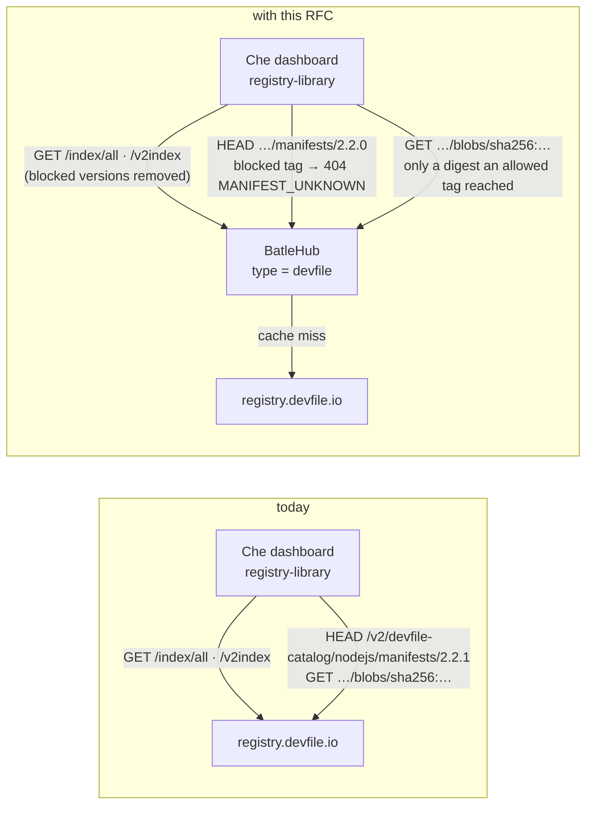
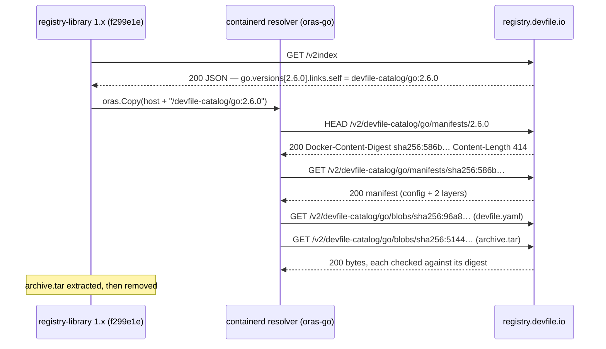
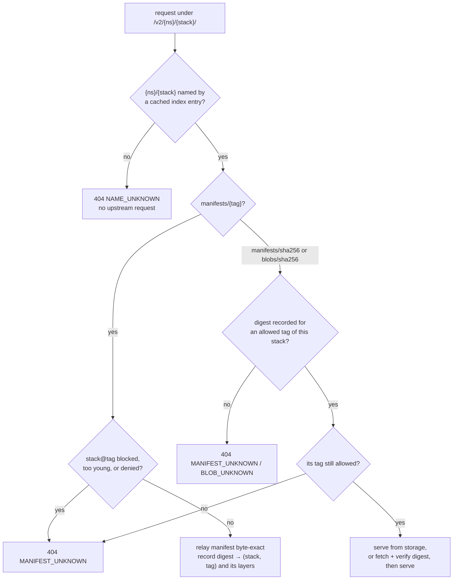
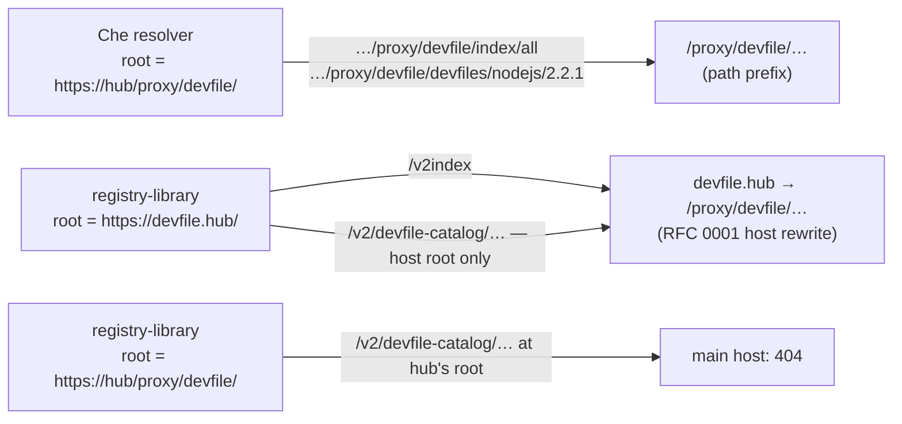

# RFC 0035 — Devfile registries

| Field       | Value                                                        |
| ----------- | ------------------------------------------------------------ |
| Status      | **Implemented** — all five phases of §12 landed 2026-09-22, each driven by a real client before being called done: `tests/heavy/devfile.sh` and the closed-world phase against `registry.devfile.io`, `airgap.sh` §7f through a signed bundle, and the Che canary against a live dashboard backend. §13 records where the built thing differs from the text |
| Short       | Devfile registries                                            |
| Settles     | The devfile registry (registry.devfile.io) as a registry kind: the index documents filtered, the stack's OCI manifest and blobs relayed byte-exact behind a tag chokepoint |
| Author      | Max Batleforc <maxleriche.60@gmail.com>                       |
| Co-author   | Claude Opus 5.5 <noreply@anthropic.com>                       |
| Created     | 2026-09-22                                                    |
| Supersedes  | —                                                             |
| Touches     | `crates/core`, `crates/config`, `crates/adapters`, `crates/web`, `server`, `ui`, `docs`, `tests/heavy`, `perf`, `.github/workflows/test.yaml` |

---

## 1. Summary

A devfile registry is the catalogue a cloud development environment reads to
offer "start a Node.js workspace": a JSON index of *stacks*, one `devfile.yaml`
per stack version, and the same devfile packaged as an OCI artifact. Eclipse
Che's dashboard reads it for its *Get Started* tiles; `odo` and every tool
built on `devfile/registry-support`'s `registry-library` read it to pull a
stack. `registry.devfile.io` is the public one.

This RFC adds `type = "devfile"`: a proxy-mode registry kind that serves the
index documents with blocked versions removed, the per-version devfile, the
stack's OCI manifest and blobs byte-exact, and the starter-project archives.
A stack version becomes a coordinate that can be blocked, age-gated and held
in an air-gap bundle. The OCI half is not a general container registry: it is
four read routes, reachable only through a tag this instance resolved for a
version it allows.

### Before / after

```toml
# today — nothing: Che and odo talk to registry.devfile.io directly
#   CheCluster.spec.components.devfileRegistry.externalDevfileRegistries:
#     - url: https://registry.devfile.io

# with this RFC
[[registries]]
type  = "devfile"
name  = "devfile"
mode  = "proxy"
hosts = ["devfile.hub.acme.io"]   # registry-library needs the host root (§5.3)
# upstreams defaults to ["https://registry.devfile.io"]
```

```sh
# Che: CheCluster.spec.components.devfileRegistry.externalDevfileRegistries
#   - url: https://devfile.hub.acme.io/        (or …/proxy/devfile/ — Che keeps a prefix)
# registry-library / odo:
registry-library pull https://devfile.hub.acme.io/ nodejs:2.2.1 --new-index-schema
```



The refused request is the manifest `HEAD` by tag: it is the first OCI request
`registry-library` makes for a stack (§5.1), and every blob it fetches after
is named by a digest that manifest supplied.

---

## 2. Motivation

1. **The workspace catalogue is an ungated supply-chain input.** A devfile
   names the container images a workspace runs, the commands it executes on
   start (`exec` components with `commandLine`), and the git remote of the
   starter project. `registry.devfile.io` published 31 stacks and 5 samples
   on 2026-09-22; an estate that routes every npm and PyPI byte through
   BatleHub still lets Che fetch, and act on, a document it never sees. No
   version of a stack can be blocked, age-gated or scanned today.
2. **An air-gapped Che has no catalogue.** The dashboard's *Get Started* page
   fetches `index/all` through its backend's `data/resolver`
   (`dashboard-backend/src/routes/api/dataResolver.ts`); with no route to
   `registry.devfile.io` the page shows the registry error and no tiles. Che's
   own answer is the `airgap-sample` ConfigMap, which is one hand-built sample,
   not a mirror. RFC 0008-bis's bundle has nothing to carry a stack in.
3. **`registry-library` does not protect the operator from a bad byte.** It
   checks each OCI blob against its manifest digest, and then — observed on
   2026-09-22 with the client built from `registry-support@f299e1e` against a
   tap that altered one byte — **leaves the altered `devfile.yaml` on disk and
   exits `0`**, printing *failed commit on ref "devfile.yaml": unexpected
   commit digest sha256:66bb…, expected sha256:eda8…*. Every failure path of
   the CLI (`cmd/root.go`) is a `fmt.Printf` with no `os.Exit`. Whatever
   serves the bytes is the only verification that has consequences, so the
   proxy has to verify before it serves, not after.
4. **`generic` cannot proxy it.** The index is JSON with a version tree
   inside, the version a client asks for is in the path of an OCI manifest
   request, and the blobs are addressed by digest. A path-addressed kind
   caches all three and blocks none of them: a blocked stack version still
   resolves, because nothing ties `blobs/sha256:eda8…` to `nodejs@2.2.1`.
5. **The client drops a path prefix.** `registry-library` builds the OCI
   reference as `path.Join(urlObj.Host, stackLink)` and the starter-project
   URL from `urlObj.Host` alone (`library.go`,
   `PullStackByMediaTypesFromRegistry` and `DownloadStarterProjectAsBytes`).
   Given `http://127.0.0.1:8177/pfx/`, the tap saw `GET /pfx/index`
   followed by `HEAD /v2/devfile-catalog/nodejs/manifests/2.2.1` — no
   `/pfx`. A kind mounted
   only under `/proxy/{registry}/` would answer the index and 404 every pull.
   This is a design constraint the kind must name, not a bug to discover in
   the first heavy run.

---

## 3. Goals / non-goals

**Goals**

- A stack version (`nodejs@2.2.1`) is a coordinate: blockable, age-gated,
  scanned, counted, held in a bundle.
- The six index documents are served with blocked versions removed, and the
  uninteresting case — nothing blocked — is upstream's bytes.
- `registry-library pull` (and therefore `odo init`) and Che's *Get Started*
  work through the instance, unmodified.
- The OCI manifest and blobs are relayed byte-exact, verified against their
  digests before they are stored or served.
- An air-gapped instance serves the held stacks as a catalogue Che can read.

**Non-goals**

- **The container images a devfile names.**
  `registry.access.redhat.com/ubi8/nodejs-18` is pulled by the cluster's
  kubelet, not by any devfile client; mirroring it is a container-registry
  product, and nothing here parses `image:` fields.
- **A general OCI distribution endpoint.** No push, no `_catalog`, no
  arbitrary repository: the four read routes answer only for the
  `{namespace}/{stack}` pairs the index names (§4.4). The roadmap's *Not
  planned: Docker / OCI artifacts* stands, on the argument RFC 0027 §3 made
  for Homebrew's bottles: read endpoints for one namespace are not a
  registry.
- **Local mode and publishing.** A devfile registry is built offline by
  `registry-support`'s build tools into an image; there is no publish
  protocol to be a server for. An instance-defined one would be RFC 0025's
  shape and its own document.
- **Samples' source.** A `type: sample` entry carries a `git.remotes.origin`
  (GitHub); cloning it is the forge kinds' business (RFC 0019). The entries
  are listed; their git is not proxied.
- **Icons.** Every stack's `icon` is an absolute `raw.githubusercontent.com`
  URL the browser loads itself. Still open (§11 question 2).
- **The Che-internal registry and `devfiles/index.json`.** Che's dashboard
  falls back to `devfiles/index.json` (the pre-2022 registry layout) when
  `index/all` fails. `registry.devfile.io` no longer serves it (`404`), and
  neither does this kind.
- **`odo`-specific behaviour.** `odo` was archived on 2026-03-30 at v3.16.1,
  which pins `registry-library@7c89891a72ce` (2024-03-28). It is a
  `registry-library` client and gets no code of its own; §6.9 drives the
  library's own CLI, which is maintained.

---

## 4. User-facing design

### 4.1 Configuration

```toml
[[registries]]
type  = "devfile"
name  = "devfile"
mode  = "proxy"                            # the only mode (§3)
upstreams = ["https://registry.devfile.io"] # the default; one entry
hosts = ["devfile.hub.acme.io"]            # RFC 0001; needed by registry-library

[registries.rbac]
anonymous = ["releases:read", "releases:list"]  # neither client sends a credential (§5.1)
```

- `upstreams` absent means `registry.devfile.io`, as `npm` defaults to
  `registry.npmjs.org`. A self-hosted devfile registry (the `registry-support`
  image, or Che's former internal one) is named here. One upstream: the index
  of one registry says nothing about another's tags.
- `hosts` absent is allowed and is Che-only. §4.5 warns.
- No new option. The kind's behaviour has no setting a reasonable operator
  would want to change; the one real choice (a blocked default version) is §11
  question 1, and its answer is a rule, not a knob.

### 4.2 The client side

Che, on the `CheCluster`:

```yaml
spec:
  components:
    devfileRegistry:
      externalDevfileRegistries:
        - url: https://devfile.hub.acme.io/
  devEnvironments:
    allowedSources:
      urls: ["https://devfile.hub.acme.io/*"]   # only if the estate uses the allowlist
```

`registry-library` (and the IDE plugins and `odo` builds that embed it):

```sh
registry-library list --type all  https://devfile.hub.acme.io/
registry-library pull https://devfile.hub.acme.io/ nodejs:2.2.1 --new-index-schema --context ./ws
odo preference add registry acme https://devfile.hub.acme.io/
```

The trailing `/` matters for a prefixed URL and is harmless on a host:
`registry-library` resolves the index with `url.ResolveReference("index")`,
so `https://hub.acme.io/proxy/devfile` without it asks for
`https://hub.acme.io/proxy/index` (observed: `/pfx` without a slash sent
`GET /index`). The registry page says so in the snippet.

### 4.3 Coordinates

| Upstream spelling | Coordinate |
| --- | --- |
| index entry `name` | package — `nodejs`, `java-springboot`; `validate_package_name` applies |
| `versions[*].version` (v2 index), `version` (legacy) | version — `2.2.1`; semver, as `registry-library` parses it with `hashicorp/go-version` |
| `links.self` = `devfile-catalog/nodejs:2.2.1` | OCI repository `devfile-catalog/nodejs`, tag `2.2.1` — the namespace is recorded per stack, never assumed |
| `/devfiles/{stack}/starter-projects/{name}` | artifact `starter-projects/{name}.zip` of the stack's **default** version |

A sample has no version and is not a coordinate; it is a listing row only.

### 4.4 Behaviour rules

**The six index documents are upstream's, filtered.** `/index`,
`/index/sample`, `/index/all`, and the three `/v2index` twins are fetched from
upstream as named and cached as metadata documents. On read:

- **v2 index**: a blocked version is removed from its stack's `versions`; a
  stack with none left loses its entry.
- **legacy index**: an entry names one version, the default. If that version
  is blocked, the entry is removed — not rewritten to another version (§11
  decision 2).
- **samples** pass through untouched in both.

**The query string is forwarded, not reimplemented.** `arch` (repeatable),
`deprecated`, `minSchemaVersion`, `maxSchemaVersion` are the four parameters
`registry-library` sends (`GetRegistryIndex`). They are validated with
upstream's own patterns (the schema-version one upstream quotes in its `400`:
`^[0-9]+\.[0-9]+(\.[0-9]+(\-alpha)?)?$`; `deprecated` ∈ `true|false`; `arch`
∈ a closed list), sorted, and become part of the cache key. Any other
parameter is dropped before the fetch, so a client cannot mint cache keys.

**The uninteresting case is a copy.** With nothing blocked, the served index
is upstream's bytes: the filter runs only when the stack set has a blocked
version, so the common read is a cache hit with no parse.

**The OCI routes answer for what the index names.** Under the registry root:

| Route | Answer |
| --- | --- |
| `GET /v2/` | `200 {}`, `Docker-Distribution-Api-Version: registry/2.0`. `registry-library` does not ask (observed); other OCI tools ping it. |
| `HEAD`/`GET /v2/{ns}/{stack}/manifests/{tag}` | the chokepoint (§5.2): blocked tag → `404` with OCI error `MANIFEST_UNKNOWN`; allowed → upstream's manifest, byte-exact, with `Docker-Content-Digest` and the real `Content-Length` on `HEAD` too |
| `GET /v2/{ns}/{stack}/manifests/sha256:{hex}` | only a digest an allowed tag of that stack resolved to; otherwise `404 MANIFEST_UNKNOWN` |
| `GET /v2/{ns}/{stack}/blobs/sha256:{hex}` | only a layer or config of such a manifest; otherwise `404 BLOB_UNKNOWN` |
| `GET /v2/{ns}/{stack}/tags/list` | the upstream list with blocked tags removed |

`{ns}/{stack}` that no cached index entry names is `404 NAME_UNKNOWN` without
an upstream request.

**`/devfiles/{stack}` and `/devfiles/{stack}/{version}` serve the devfile**
from the same stored bytes as the `devfile.yaml` blob: upstream's REST body
and the OCI layer are the same file (probed: `sha256` of
`/devfiles/nodejs/2.2.1` is the layer digest `eda8d592…`, 1 628 bytes both). A
versionless request is the default version's, so it is refused when the
default is blocked. Che's tiles link here (§5.1).

**Starter projects are artifacts of the default version.** The client's URL
has no version (`DownloadStarterProjectAsBytes`), so
`/devfiles/{stack}/starter-projects/{name}` resolves the default version,
checks it like any fetch, and stores the zip under it. The versioned form
upstream also answers (`/devfiles/nodejs/2.2.1/starter-projects/…`, `202`) is
served the same way. The response is `200`: upstream's `202` is not read by
either client, and `registry-library` does not read the status at all (it
`io.ReadAll`s whatever came back — a `404` body would be unzipped as a zip).

**Che caches the index for an hour per browser session.** The dashboard keeps
external registry metadata in `sessionStorage` for
`EXPIRATION_TIME_FOR_STORED_METADATA` (60 min). A version blocked after a
user's last fetch still shows as a tile; clicking it requests
`/devfiles/{stack}/{version}`, which refuses. The block holds; the tile lies
until the hour is up. The registry page says so, as `helm`'s says for its
client-side index (RFC 0029 §4.4).

### 4.5 Validation

`AppConfig::validate()` rejects:

| Condition | Rationale |
| --- | --- |
| `type = "devfile"` with `mode` other than `proxy` | No local mode exists (§3); `supports_local_mode()` answers `false` and the existing check refuses it. |
| More than one `upstreams` entry | Tags and digests from two registries cannot be merged into one index; a second entry would be silently ignored otherwise. |
| An `upstreams` entry whose path ends in `/index` or `/v2index` | The value is the registry root, what Che and `registry-library` take. Refused with the fix named. |
| `path_allow` | Not path-addressed; the existing validator refuses it on every such kind. |

Warnings (logged once at reload and shown on the console's registry card):

| Condition | Behaviour |
| --- | --- |
| No `hosts` entry | Served under `/proxy/{name}/` only. Che works; `registry-library` and `odo` resolve the index and then fail every pull at the host root (§5.3). The card names the two clients. |
| `anonymous` lacks `releases:read` | Neither client sends a credential (§5.1). Che's tiles and every pull will be `401`; the card says so rather than letting it read as an outage. |

---

## 5. Architecture

### 5.1 The protocol as `registry.devfile.io` serves it

Read from `devfile/registry-support@f299e1e` (2026-09-20,
`registry-library/library/library.go`, `util.go`, `cmd/root.go`) and
`eclipse-che/che-dashboard@7432014` (7.123.0-next,
`services/registry/devfiles.ts`, `fetchData.ts`, backend `dataResolver.ts`);
probed on 2026-09-22 with `curl` and with the `registry-library` CLI built
from that commit, through a logging tap.

**Endpoints, in the order a cold `registry-library pull go:2.6.0 --all
--new-index-schema` touches them** (the tap's transcript, verbatim paths):

| # | Request | Answer | Client does |
| --- | --- | --- | --- |
| 1 | `GET {root}/v2index` | `200`, `text/plain; charset=utf-8`, 101 212 B, JSON array | finds `go`, picks `versions[*]` with `version == "2.6.0"` (or `default: true` when none given), reads `links.self` = `devfile-catalog/go:2.6.0` |
| 2 | `HEAD {host}/v2/devfile-catalog/go/manifests/2.6.0` | `200`, `application/vnd.oci.image.manifest.v1+json`, `Content-Length: 414`, `Docker-Content-Digest: sha256:…` | containerd's resolver takes digest and size from these headers |
| 3 | `GET {host}/v2/devfile-catalog/go/manifests/sha256:586b…` | `200`, the manifest | verifies it against the `HEAD` digest; reads `layers` |
| 4 | `GET {host}/v2/devfile-catalog/go/blobs/sha256:96a8…` | `200`, `application/octet-stream`, 2 571 B, `cache-control: max-age=31536000` | `devfile.yaml`; digest-checked |
| 5 | `GET {host}/v2/devfile-catalog/go/blobs/sha256:5144…` | `200`, 617 B | `archive.tar` (`application/x-tar`); extracted into the context dir, then deleted |

`{root}` is the URL the user gave; `{host}` is its scheme and host only. The
legacy flow (no `--new-index-schema`) is identical with `/index` at step 1 and
`links.self` read from the flat entry. `download nodejs nodejs-starter` is
step 1 then `GET {host}/devfiles/nodejs/starter-projects/nodejs-starter`,
`202`, `application/zip`, `content-disposition: attachment;
filename="nodejs-starter.zip"`, 20 083 B.

Che's *Get Started* page, for an external registry:

| # | Request | Client does |
| --- | --- | --- |
| 1 | `POST /dashboard/api/data/resolver {url: "{root}/index/all"}` → backend `GET {root}/index/all` | reads the array; stored in `sessionStorage` for 60 min |
| 2 | (on a tile) resolver `GET {root}/devfiles/{stack}/{version}` | `links.self` rewritten by `resolveLinks`: `devfile-catalog/nodejs:2.2.1` → `new URL('devfiles', root)` + `/nodejs/2.2.1` — **the prefix is kept** |
| 3 | the devfile's `starterProjects[0].git` | cloned by the workspace, not through the registry |



This is the order the design gates: the tag at step 2, and everything after it
named by a digest the tag's manifest supplied.

**Numbers, probed 2026-09-22.** `/index` 24 180 B, `/index/all` 27 157 B,
`/index/sample` 2 979 B, `/v2index` 101 212 B, `/v2index/all` 106 165 B —
31 stacks, 5 samples, 1–7 versions a stack. Every index answer is
`text/plain; charset=utf-8` although the body is JSON. `GET /` is a `302` to
`/index`. **`HEAD` on the REST paths is `404`** (`/index`,
`/devfiles/nodejs/2.2.1`); on the OCI paths it is `200`. A missing stack or
version is `404` with a JSON body (53 B). A malformed `minSchemaVersion` is a
`400` quoting the regex. Manifests are 414–~600 B; blobs are
`cache-control: max-age=31536000`, manifests `private`. No redirects on any
path the clients use. Starter zips were byte-identical on two fetches (a zip
of the git tree at the devfile's `checkoutFrom.revision`; for `nodejs` that is
`main`, so it moves when the branch does).

**What the client verifies.** containerd checks the manifest against the
`HEAD`'s `Docker-Content-Digest` and each blob against its descriptor's
digest and size. The failure text, observed: *failed commit on ref
"devfile.yaml": unexpected commit digest sha256:…, expected sha256:…: failed
precondition*. A `HEAD` answered with `Content-Length: 0` fails the same way
with the empty-body digest `sha256:e3b0c442…` (observed: this RFC's first tap
did exactly that). The REST index, the REST devfile and the starter zip are
not verified by anything. And, as §2.3 says, a failed check leaves the file
on disk and the process exits `0`.

**Auth.** `setHeaders` sends `User`, `Client`, `Locale` telemetry headers
when set, and nothing else; the CLI sets `User: user`. No `Authorization` on
any request (tap: `auth=None` on all five). containerd would answer a `401`
with an anonymous token dance and no credential. Che's backend resolver sends
no credential either, follows **no** redirect (`maxRedirects: 0`), and refuses
any URL whose hostname is a private IPv4 literal, `localhost` or `::1`
(`isPrivateHostname`, a `403` *Requests to private addresses are not
allowed*); a DNS name resolving to a private address is not checked.

**Spellings.** Stack names are lower-case, `-`-separated (`java-springboot`,
`dotnet80`). Versions are semver without `v`. The OCI namespace is
`devfile-catalog` on this upstream and on every registry the
`registry-support` build tools produce, but it is read from `links.self`, not
assumed. OCI blob titles come from the layer annotation
`org.opencontainers.image.title` (`devfile.yaml`, `archive.tar`); the media
types are `application/vnd.devfileio.devfile.layer.v1`, `application/x-tar`,
`image/png`, `image/svg+xml`, `application/vnd.devfileio.vsx.layer.v1.tar`
(`DevfileAllMediaTypesList`).

### 5.2 The tag is the chokepoint



Because containerd reaches every digest through the tag's manifest, and a
digest is served only when it is recorded against a tag that is allowed *now*,
no byte of a blocked version leaves the instance by the OCI path — including
to a client that kept the digest from before the block. The re-check at `R` is
what makes a block retroactive; without it the record would be a bypass.

This is RFC 0027's shape — a digest turned back into a coordinate through a
document the instance already cached — with one difference that moves the
gate. `brew` rescues a failed manifest fetch and carries on, so 0027 has to
refuse at the blob; containerd has no fallback, so here the tag refuses and
the blob check is the backstop for a replayed digest.

The record is the manifest itself, cached as the metadata document
`DocumentKind::Secondary("oci-manifest")` of `{stack}@{tag}`; the digest lookup
reads the stack's cached manifests. A cold instance that receives a digest
first (a client replaying one) answers `404`; the client's next pull starts at
the tag, which is what it does anyway.

### 5.3 Two clients, two roots



Every route lives under `/proxy/{registry}/` like every other kind's;
RFC 0001's middleware rewrites a registry host's root onto it, which is what
`registry-library`'s host-only OCI reference needs. The kind adds no route at
the main host's root: a `/v2/` there would belong to whichever registry
claimed it first, and the main host carries the admin API.

---

## 6. Detailed design

### 6.1 `crates/core` — the registry kind

`RegistryKind::Devfile`, in the enum and `ALL`. The exhaustive matches then
refuse to compile until answered (`registry_kind.rs`, `upstream_detail`,
`blocking::strip`, both `builders.rs` matches, `handlers/security.rs`'s
`native_body`). `supports_local_mode() = false`,
`requires_explicit_upstream_in_proxy_mode() = false`,
`is_path_addressed() = false`.

| | `devfile` |
| --- | --- |
| `listing_filter()` | `filtered("stack index (legacy and v2)", ["versions", "legacy-index"])`, `filtered("OCI tag list", ["oci-tags"])` |
| `readme_support()` | `None("a devfile has no readme; its description is in the index")` |
| `upstream_detail()` | `Document("versions")` — the v2 index entry, with `description`, `schemaVersion`, `tags`, `lastModified` per version |
| `fetchable_by_version()` | `Some` — `devfile.yaml`, one per version |
| `warm_artifact()` | the devfile and every blob of the version's manifest; `warm_packages = ["nodejs@2.2.1"]` |
| `blocking_package_name()` | identity |

`DocumentKind` gains `LEGACY_INDEX = Secondary("legacy-index")`,
`OCI_MANIFEST = Secondary("oci-manifest")`, `OCI_TAGS =
Secondary("oci-tags")`. The v2 index is `Versions`. Both indexes are
registry-wide: `listing_synthesis::is_registry_wide` gains a `Devfile` arm
for `versions` and `legacy-index`, as conda's does for `repodata.json`.

**The silent one.** `listing_synthesis::render_listing` gets
`(Devfile, Versions)` and `(Devfile, LEGACY_INDEX)` arms (§6.8). Without them
the air gap refuses every listing with no compile error and no failing test —
`CLAUDE.md`'s third tier.

### 6.2 `crates/core` — `services/devfile.rs` and `blocking/devfile.rs`

`services/devfile.rs`, no I/O:

- `IndexEntry` — `name`, `type`, `version` (legacy), `versions:
  Vec<VersionEntry>` (v2), `links`, and `rest: serde_json::Map` for every
  other field, so what is not interpreted survives a filter. `VersionEntry`
  keeps `version`, `default`, `links`, `starter_projects`, `rest`.
- `oci_ref(links_self) -> Result<(namespace, stack, tag)>` — splits
  `devfile-catalog/nodejs:2.2.1`; the stack must equal the entry's `name` and
  pass `validate_package_name`, the tag must parse as semver. An entry whose
  `self` fails is dropped from the served index and counted (§4.5 has no row
  for it because it is upstream's defect, logged once per reload).
- `IndexQuery::parse(query_string) -> Result<IndexQuery>` — the four
  parameters of §4.4, validated, sorted; `as_cache_key()`.
- `manifest_digests(manifest_bytes) -> Result<Vec<Descriptor>>` — `config`
  and `layers`, each `{media_type, digest, size, title}`; refuses a digest
  that is not `sha256:` + 64 hex.
- `default_version(entry) -> Option<&str>` — the `default: true` version, else
  the first, as `GetStackLink` resolves it.

`blocking/devfile.rs`, from `blocking::strip` through `with_json`:
`Versions` removes blocked versions and emptied stacks; `LEGACY_INDEX` removes
an entry whose `version` is blocked; `OCI_TAGS` removes blocked tags. Samples
are never touched. A document whose stack set has no blocked version is
returned as the input bytes (§4.4, *a copy*).

### 6.3 `crates/config`

No new field. `validate()` gains the §4.5 rows beside the existing per-kind
checks; the warnings go through the same reload-warning list the console's
registry card reads. `CURRENT_CONFIG_VERSION` does not move.

### 6.4 `crates/adapters` — `registry/devfile/`

A directory from the start: the index DTOs, the OCI descriptor model and the
client would crowd one file, and `nuget/` is the reference layout.

- `client.rs` — `DevfileRegistryClient { http, base }`:
  - `fetch_version_document(_, Versions | LEGACY_INDEX)` — the index path the
    request named (§4.4 table) plus the canonical query. The metadata cache
    holds upstream's bytes; the filter runs on read.
  - `fetch_version_document(stack, OCI_MANIFEST)` with the tag — `GET
    {base}/v2/{ns}/{stack}/manifests/{tag}` with the `Accept` list containerd
    sends; the body is kept byte-exact and **its sha256 must equal the
    upstream `Docker-Content-Digest`** or the fetch fails. The header, not a
    recomputation, is what the client will compare against.
  - `resolve_metadata(pkg)` — the v2 index entry's version; `published_at`
    from `lastModified` (§6.7); `checksum` is the **bare hex** sha256 of the
    `devfile.yaml` layer, from the manifest. Not `sha256:<hex>`:
    `integrity::parse_expected` reads nothing else, and the prefixed spelling
    silently disables cache-write verification (RFC 0031 §13).
  - `fetch_artifact(pkg)` — the blob by digest, **buffered, verified, then
    served**; not streamed. `proxy_stream`'s cache-write check runs as the
    bytes leave, so on a first fetch a bad blob would reach the client before
    the mismatch was known, and §2.3 says what the client does with it. The
    descriptor carries the size up front (617 B to 2.6 KB observed); one over
    a 32 MiB constant is refused without a fetch. Once stored, a blob is
    served from storage like any artifact. Blobs other than `devfile.yaml`
    are artifacts of the same version, keyed by their title.
  - `list_versions(stack)` — from the v2 index.
- `models.rs` — the index entry and OCI manifest/descriptor DTOs, the OCI
  error body `{"errors":[{"code","message"}]}`. RFC 0027 needs the same
  descriptor and error shapes; whichever of the two lands second moves them
  to a shared `registry/oci.rs` rather than copying them.
- `tests.rs` — `mockito`: both index shapes from dated trimmed fixtures of
  `registry.devfile.io`; a manifest whose body does not match its
  `Docker-Content-Digest`; a blob with one byte altered; a `links.self` with a
  foreign namespace; the query-string allowlist.

`registry-devfile` is declared in `crates/adapters/Cargo.toml`'s
`[features]` and in `default`.

### 6.5 `crates/web` — handlers and routes

`handlers/proxy/devfile.rs`, prefix `/proxy/{registry}/`:

| Route | Handler |
| --- | --- |
| `GET index`, `index/sample`, `index/all`, `v2index`, `v2index/sample`, `v2index/all` (and `index/stack`, which upstream aliases) | `index` — filtered document, `application/json` |
| `GET devfiles/{stack}` · `devfiles/{stack}/{version}` | `devfile` — the stored `devfile.yaml`, `text/plain; charset=utf-8` as upstream |
| `GET devfiles/{stack}/starter-projects/{name}` · `devfiles/{stack}/{version}/starter-projects/{name}` | `starter_project` — `proxy_stream`, `application/zip` |
| `GET v2/` | `oci_ping` |
| `HEAD`/`GET v2/{ns}/{stack}/manifests/{reference}` | `oci_manifest` — §5.2 |
| `GET v2/{ns}/{stack}/blobs/{digest}` | `oci_blob` — §5.2; storage when held, otherwise §6.4's buffered fetch |
| `GET v2/{ns}/{stack}/tags/list` | `oci_tags` |
| `GET /` | `302` to `index`, as upstream |

Obligations from the existing rules:

- **Validate at the edge.** `{stack}` through `validate_package_name`,
  `{version}` and a tag reference as semver with no `/` or `..`,
  `{digest}` as `sha256:` + 64 lower hex, `{name}` of a starter project as
  `validate_package_name`. A `400` before any lookup; the blob and manifest
  handlers build a storage key from the digest, so they validate here rather
  than lean on `ensure_safe_key`.
- **OCI errors are OCI-shaped.** Every `4xx` under `v2/` carries the
  `{"errors":[…]}` body and `Docker-Distribution-Api-Version`, because
  containerd reads the code; the rest of the kind answers the house JSON.
- **`HEAD` is real.** `oci_manifest` answers `HEAD` with the stored
  manifest's `Content-Length` and `Docker-Content-Digest`, never a zero
  length (§5.1: that is a client-side digest failure).
- **`body = T` on every success.** `index` and `oci_tags` take
  `UpstreamDocument`; `devfile`, `starter_project`, `oci_blob` take
  `ArtifactBytes`; `oci_manifest` takes `ProtocolDocument`; `oci_ping` a
  named empty `ToSchema` struct.
- **No auth normalisation.** Neither client sends a credential in any shape,
  so `raw_auth_from_request` gets no arm (§6.9 case 7 is what proves the
  anonymous path is the only one).

`registry_public_base` is not needed: nothing in a served document is an
absolute URL of ours. `links.self` is relative by construction, and Che and
`registry-library` both resolve it against the root the user configured.

### 6.6 `server`

`builders.rs` gets one arm: `DevfileRegistryClient` from
`resolve_urls(&reg.upstreams, "https://registry.devfile.io")`.

### 6.7 Rules

`BlockListRule` and `DenyLatestRule` read the coordinate; `DenyLatestRule`'s
"latest" is the index's `default: true` version, which is what an unpinned
client installs. `ReleaseAgeGateRule` reads `published_at`, taken from the
version's `lastModified` — but upstream rewrites `lastModified` for **every**
entry on each registry rebuild (on 2026-09-22, 31 of 31 stacks and 87 of 90
versions carried `2026-09-20T12:41:07-04:00`; the other 3 carried
`0001-01-01T00:00:00Z`, Go's zero time), so it is the build date, not the
publication date. The age gate therefore treats a devfile version as
`deny_missing_timestamp` does an undated one, and the registry page says an
age gate on this kind measures the upstream rebuild, which is §11 question 4.
RFC 0018's scanners get the `devfile.yaml` (YAML, text) and `archive.tar` (the
existing tar reader) at first fetch.

### 6.8 Air gap (RFC 0008-bis)

A disconnected instance composes both index shapes from the held versions:
each held version's `devfile.yaml` `metadata` block gives `name`,
`displayName`, `description`, `icon`, `tags`, `projectType`, `language`,
`version`; `schemaVersion` is the devfile's own; `starterProjects` are the
devfile's `starterProjects[*].name`; `links.self` is the held manifest's
reference; `resources` are the held blobs' titles. `default` is the highest
held version. Samples are omitted — their source is a git remote the air gap
does not have, and a tile that fails on click is worse than no tile. The
query parameters are applied locally for `arch` (the `architectures` field)
and `deprecated` (the `Deprecated` tag, which is how upstream marks it:
`nodejs@2.1.1` carries it) and ignored otherwise; the registry page says so.
Manifests and blobs are held byte-exact with their digests, so the OCI routes
behave as connected. The held set's legacy entries use the version-level
`description`, which differs from upstream's stack-level one for 9 of 31
stacks — cosmetic, and named in the page.

### 6.9 `tests/heavy/devfile.sh`

A new suite, `config.devfile.toml`, `task test:devfile-heavy`, an entry in
`task test:heavy`, a row in the `heavy-client` matrix. **The client is
`registry-library`'s own CLI**, built by the job from
`github.com/devfile/registry-support/registry-library` at a pinned commit
(`f299e1e` today, pinned in the script) with the Go from `mise.toml` —
27 MB, about a minute cold. It keeps no cache; `HOME` and `--context` point
into the run's directory so no two steps share a file. The registry is bound
to `devfile.localhost` (resolves to loopback in Go's resolver, checked) over
plain HTTP, which the library selects from the `http` scheme, so the suite
needs no certificate. **Its exit code is never read** — it is `0` on every
failure (§2.3) — so every case asserts on the tap and on the files it left.

What it proves, on the wire, through the tap:

1. `registry-library pull http://devfile.localhost:$PORT/ go:2.6.0 --all
   --new-index-schema` — the tap shows the five requests of §5.1 in order,
   all on the instance, none on `registry.devfile.io` from the client;
   `devfile.yaml` in the context has the manifest's layer digest and
   `docker/` and `kubernetes/` came out of `archive.tar`.
2. `nodejs@2.1.1` blocked through the admin API; `pull … nodejs:2.1.1
   --new-index-schema` prints *the requested version 2.1.1 for stack nodejs
   does not exist in the registry* and the tap shows `GET /v2index` and **no**
   request under `/v2/` — refused at the listing.
3. The same block, with the client handed the tag directly — `HEAD
   /v2/devfile-catalog/nodejs/manifests/2.1.1` replayed by `curl` from case
   1's transcript shape — is `404` with `MANIFEST_UNKNOWN`, and a replay of
   that version's blob digest (recorded before the block) is `404
   BLOB_UNKNOWN`. The retroactive half of §5.2, which no real client reaches
   on its own.
4. The served `/v2index` has no `2.1.1` under `nodejs`;
   `/v2/…/nodejs/tags/list` has no `2.1.1`; `/index` still has `nodejs`
   (its default is `2.2.1`).
   Blocking `2.2.1` then removes `nodejs` from `/index` and `/index/all`
   (§11 decision 2), and `pull … nodejs` (no version) prints *no version
   specified for stack nodejs which no default version exists* — or, if §11
   question 1 lands as recommended, pulls `2.2.0`, and the case asserts that.
5. A second `pull` of `go:2.6.0` into a fresh context moves
   `batlehub_artifact_cache_hits_total{registry="devfile"}` by two blobs and
   issues no upstream request (server-side tap).
6. With the upstream tap altering one byte of the `devfile.yaml` blob, the
   instance answers the blob request `502` and never sends a byte of it; the
   pull prints an error (its text is recorded by the first run, not
   predicted), and **no file with the altered digest is in the context**.
   The same alteration without the instance in the path leaves one there
   (§2.3); the difference is the case.
7. `download http://devfile.localhost:$PORT/ nodejs nodejs-starter` — the tap
   shows `GET /devfiles/nodejs/starter-projects/nodejs-starter` at the host
   root; the context holds the unzipped project.
8. **The prefix trap, as a negative.**
   `pull http://127.0.0.1:$PORT/proxy/devfile/ nodejs` — the tap shows
   `GET /proxy/devfile/index` answered `200`, then
   `HEAD /v2/devfile-catalog/nodejs/manifests/2.2.1` at the main host
   answered `404`. The warning of §4.5 is what this case keeps honest.
9. **Che's reads, transcribed.** Che's resolver cannot run outside a
   cluster, so its three observable properties are replayed by `curl
   --max-redirs 0` with no credential: `GET {root}/index/all` through the
   prefix root is `200` JSON; `GET {root}/devfiles/nodejs/2.2.1` (the URL
   `resolveLinks` builds, computed in the suite with the same two `URL`
   calls under `node`) is the stored devfile; nothing on the path answers a
   `3xx`. This is a stand-in, not a client, and §11 question 3 is the real
   one.

The other four proofs a kind owes, one line each:

- **Closed world** — `phase_devfile` in `tests/heavy/closed_world.sh`, its
  `[[registries]]` block bound to `devfile.localhost`, a `- phase: devfile`
  row under `heavy-closed-world`; asserts case 1's transcript with
  `heavy_wire_re_after`.
- **Credential boundary** — `live:devfile` in `AUTHZ_LIVE_KINDS` with
  `config.authz-live.toml`, since there is no local mode. Both clients are
  anonymous (§5.1), so the allowed arm is the anonymous grant and the denied
  arm is a registry without it, asserted on the tap's `401` and the empty
  context (the client's text for it is not yet observed). A denial proven
  through a client that sends no identity is proven for the anonymous caller
  only, and the phase says so (the `ovsx` lesson).
- **Air gap** — a case in `crates/web/tests/air_gap.rs` (the composed index of
  §6.8 from a held `nodejs@2.2.1`) and a phase in `tests/heavy/airgap.sh`
  running case 1 against the disconnected server.
- **Soak** — a `devfile` arm in `tests/heavy/soak.sh`'s mock upstream: the
  six index paths and one stack's manifest and blobs, so
  `soak_kind_coverage.rs` passes.

And the two gates that are not suites: both route inventories in
`authz_matrix.rs`, and the README-extractor check in `sbom/extractor/mod.rs`
(which reads `readme_support()` and gets `None`).

**Deliberately untouched**, so reviewers do not go looking:

- `crates/adapters/src/registry/path_proxy.rs` — `generic` stays the way to
  cache a devfile registry without policy; the registry page says what that
  loses (§2.4).
- `crates/web/src/extractors.rs` — no auth normalisation arm; there is no
  credential to normalise (§6.5).
- `crates/web/src/middleware/host_routing.rs` — RFC 0001 already rewrites a
  registry host's root onto `/proxy/{registry}/`; §5.3 needs nothing new.
- `crates/adapters/src/registry/readme_image.rs` — icons are not fetched
  (§3); if §11 question 2 goes the other way, this is where it lands.
- Any OCI image support — no `registry` crate, no manifest *list*, no
  `_catalog`, no push. `models.rs` parses one manifest shape and refuses an
  index manifest with `MANIFEST_UNKNOWN`, which upstream does not serve for a
  stack.

### 6.10 `ui` and `docs`

- `ui/src/config/registryTypes.ts` — a `REGISTRY_TYPE_DEFS` entry, *Devfile
  registry (Che, odo)*, with the `CheCluster` snippet and the
  `registry-library` / `odo preference add registry` lines of §4.2, the
  trailing `/` included.
- `docs/registries/devfile.md` — generated support and endpoint tables, and
  the five lines the page must carry: the host binding and why; Che's one-hour
  tile cache; what a block of the default version does to the legacy index;
  the age gate measures the rebuild; the images the devfile names are not
  proxied.
- `docs/registries/index.md` and the `/registries/` sidebar.
- `ROADMAP.md` — a new entry pointing here, `Draft`; `task docs:roadmap`.

---

## 7. Security considerations

- **The catalogue becomes a gated input.** A devfile is instructions a
  workspace executes; this is the point of the RFC (§2.1). What it does not
  do is inspect those instructions: a devfile that runs `curl | sh` on start
  is served if its version is allowed. RFC 0018's scanners see the YAML;
  whether a rule should read `commands[*].exec.commandLine` is out of scope.
- **The instance is the only integrity check with consequences.** Manifests
  are compared with upstream's `Docker-Content-Digest` and blobs with their
  descriptors before they are stored (§6.4), because the client keeps a bad
  file and exits `0` (§2.3). A compromised upstream that serves a *consistent*
  manifest and blob is not detected — as with every kind here, the upstream is
  trusted for content and gated for policy.
- **No new authenticated surface, and a new anonymous one.** The kind is
  read-only. Reads are anonymous in practice because neither client can send
  a credential; §4.5 warns when the grants and the clients disagree rather
  than silently serving `401`. An operator who needs a closed catalogue has
  one today only for Che users behind a network policy, and the page says
  that.
- **Digests are not a key space the client controls.** A blob or manifest by
  digest is served only when an allowed tag's cached manifest names it
  (§5.2), and `{ns}/{stack}` only when a cached index names it. A client
  cannot make the instance fetch an arbitrary upstream digest, nor enumerate
  what it holds.
- **The query string cannot mint cache keys.** Four validated parameters,
  sorted; everything else dropped (§4.4).
- **Che's private-address refusal is a hostname-literal check.** An instance
  reached by a DNS name on a private network passes it; one configured as
  `http://10.0.0.5/` does not, and fails with Che's own `403`. That is Che's
  SSRF guard working, and the page says to use a name.
- **Every path element is validated at the edge** (§6.5), and the digest
  validation is what keeps a blob storage key out of `..`.

---

## 8. Alternatives considered

| Alternative | Why rejected |
| --- | --- |
| `generic` over `registry.devfile.io` | Caches all three surfaces and blocks none: nothing ties a blob digest to a stack version (§2.4). |
| Serve the REST index only; leave OCI to the upstream | `registry-library` would pull every blob straight from `registry.devfile.io` — the refused version included, since the index filter is advisory to a client given a tag. Che alone would be covered; the kind would claim a block it cannot hold. |
| Rewrite `links.self` to an absolute URL of ours, so a prefix works for `registry-library` | `GetStackLink` feeds `links.self` into `path.Join(urlObj.Host, stackLink)`; an absolute URL there becomes `host/https:/…`, an invalid reference. The client's host-only assumption cannot be steered from the document. |
| A general OCI pull-through (any repository, any digest) | A container-registry product (§3), with a key space the client controls; the four routes here answer only what the index names. |
| Synthesise the legacy index from `/v2index` (one upstream fetch instead of two) | Not the same document: `description` differs for 9 of 31 stacks and `lastModified` is per-entry (probed). Che reads the legacy one, and would see changed tiles. |
| Reimplement the index query filters locally | Upstream's `arch`, `deprecated` and schema-version semantics live in `registry-support/index/server`; forwarding a validated query is exact for the connected case at the cost of a few more cache entries. The air gap, which cannot forward, implements the two that matter (§6.8). |
| Rewrite a blocked legacy entry to the next allowed version | Needs the version-level fields of another document (row above), and a Che tile that silently changes version is worse than one that disappears (§11 decision 2). |
| Mount `/v2/` on the main host so no `hosts` entry is needed | The main host is the admin API and the SPA; a root `/v2/` belongs to one registry, which a second `devfile` registry would contradict. RFC 0001 exists for this. |

---

## 9. Rollout and compatibility

- **Default behaviour.** Nothing changes for an instance with no
  `type = "devfile"` registry. The kind is additive.
- **Config migration.** None; `CURRENT_CONFIG_VERSION` does not move.
- **Operator prerequisites.** A DNS name and a certificate for the registry
  host when `registry-library` or `odo` must work (§5.3); the ingress passing
  the `Host` header through. For Che, the `CheCluster` edit of §4.2 and, if
  `allowedSources` is set, an entry for the instance.
- **Rollback.** Remove the block; clients pointed at it fail until pointed
  back at `registry.devfile.io`. Cached documents and blobs are ordinary
  metadata and artifacts and expire as such.

---

## 10. Test plan

- **Unit** (`crates/core/src/services/devfile.rs`, `blocking/devfile.rs`):
  `oci_ref` on good, foreign-namespace, mismatched-name and `..` inputs;
  `IndexQuery` allowlist and ordering against upstream's regex; the three
  filters, including the untouched-bytes path when nothing is blocked and a
  sample beside a stack; `default_version` with and without a `default`.
- **Adapter** (`crates/adapters/src/registry/devfile/tests.rs`): §6.4's list.
- **Integration** (`crates/web/tests/devfile.rs`, new): every route of §6.5
  against `FixedRegistry`; the §5.2 flowchart one branch per test, including a
  digest replayed after its tag was blocked; `HEAD` carrying the real
  `Content-Length`; OCI error bodies under `v2/`; a
  `devfile_traversal_version_returns_400` and a digest-traversal `400` in the
  `CLAUDE.md` pattern (there is no publish, so the traversal is on the read
  routes).
- **Air gap** (`crates/web/tests/air_gap.rs`): §6.8.
- **Heavy** (`tests/heavy/devfile.sh`): §6.9.
- **Existing suites** that must pass unchanged: `registry_kind_coverage.rs`,
  `soak_kind_coverage.rs`, `authz_matrix.rs`, `openapi_contract.rs` (every
  `200` with a body type), and `pathproxy.sh`, which is RFC 0001's signal that
  host routing still rewrites a registry host's root.

---

## 11. Decisions and open questions

### Resolved

| # | Question | Decision |
| --- | --- | --- |
| 1 | The kind's name | **`devfile`.** What both clients and upstream call it; `registry` alone would be meaningless in `type = …`. |
| 2 | A blocked default version in the legacy index | **The entry is removed, not rewritten.** The legacy entry is a separate upstream document whose fields do not follow from the v2 one (probed, §8); a tile that disappears is honest, one that silently becomes another version is not. |
| 3 | Where a block is enforced on the OCI path | **At the tag, with digests served only through an allowed tag, re-checked at serve time** (§5.2). The re-check is what makes a block retroactive for a client holding a digest. |
| 4 | Rewrite the manifest | **No; byte-exact.** containerd verifies it against the digest the `HEAD` announced, and nothing in it needs to change. |
| 5 | The index query string | **Forwarded, four parameters validated and sorted, the rest dropped** (§4.4, §8). |
| 6 | Local mode | **Not in this RFC** (§3). There is no protocol to serve; an instance-defined one is its own document. |
| 7 | Where the starter-project zip is stored | **Under the default version**, because the client's URL has no version and the default is what the server upstream resolves. |
| 8 | (was open 1) What the v2 index says when the default version is blocked | **`default` moves to the highest version left**, as recommended — `blocking::best_latest`, so a stable release beats a pre-release. Observed with the real client: an unpinned `pull nodejs` after blocking `2.2.1` fetched the moved default. The move is not logged separately; the filter's own debug line names the removed version. |
| 10 | (was open 2) Icons | **Relayed as upstream wrote them when connected; empty in a composed index.** A remote image proxy would need the icons carried in the bundle, and an icon is an artifact of no coordinate. Omitting the field was the obvious alternative and is wrong: Che's `isDevfileMetaData` drops an index entry whose `icon` is undefined, so every tile would vanish. `icon: ""` keeps the entry. |
| 11 | (was open 3) Che as a real heavy client | **A manual canary, `tests/heavy/devfile_che_canary.sh`**, as recommended — not the tiles, which need the registry in the `CheCluster` (a cluster change the script does not make), but the dashboard backend's own `data/resolver`, which is where Che's three properties live. Run from this workspace against `cde.batleforc.fr` on 2026-09-22: four cases green (§13). |
| 9 | (was open 4) The age gate on a build date | **Undated**, against the recommendation: `published_at` is `None` and `deny_missing_timestamp` is mandatory on the kind, as on `sdkman` and `nix`. First-seen dates are a new mechanism with a store of their own, and nothing in this kind needed one to ship; it stays a candidate for a bis. |

### Still open

None.

---

## 12. Implementation phases

| Phase | Content |
| --- | --- |
| 1 | `RegistryKind::Devfile`, `services/devfile.rs`, `blocking/devfile.rs`, the adapter, the REST routes (index, devfile, starter projects), `builders.rs`, config validation. **Useful alone**: Che's catalogue is gated and cached — Che never touches the OCI half. |
| 2 | The OCI routes and the tag chokepoint of §5.2; host-binding warning. Makes `registry-library` and `odo` work. Lands with phase 3, because the only client that exercises it is the heavy one. |
| 3 | `tests/heavy/devfile.sh` and the closed-world, authz-live and soak arms of §6.9. The kind is not called done before this is green against the live upstream. |
| 4 | Air gap: `render_listing` arms, the composed indexes, `air_gap.rs` and the `airgap.sh` phase. |
| 5 | `ui` entry, `docs/registries/devfile.md`, roadmap; the Che canary of §11 question 3. |

---

## 13. Revision against the tree (2026-09-22)

Phases 1, 2, 3 and 5 are built; phase 4 (the air gap) is not, and
`registry_kind_coverage.rs` declares the gap in those words. What the heavy
suite observed, against `registry.devfile.io` and `registry-library` built
from `registry-support@f299e1e`:

- `pull go:2.6.0 --all --new-index-schema` through a host-bound registry
  made the five requests of §5.1 in order — `GET /v2index`, `HEAD` of the
  manifest by tag, `GET` by digest, two blobs — all on the instance, and the
  `devfile.yaml` on disk hashed to the layer the manifest names. containerd
  accepted the `HEAD`'s `Docker-Content-Digest` and length; the in-process
  harness cannot show the latter, because `call_service` never runs the
  HTTP/1 encoder that writes `Content-Length`.
- After blocking `nodejs@2.1.1`, `pull nodejs:2.1.1` printed *the requested
  version 2.1.1 for stack nodejs does not exist in the registry* and made no
  request under `/v2/`. The tag and a layer digest kept from before the block,
  replayed with `curl`, were `404 MANIFEST_UNKNOWN` and `404 BLOB_UNKNOWN`.
- A second pull moved `batlehub_artifact_cache_hits_total` from 2 to 6.
- Through `/proxy/{registry}/` the index answered `200` and the manifest
  `HEAD` went to the main host's `/v2/` and got `404` — the trap of §5.3,
  observed rather than read.
- The closed-world phase pulled the same stack with egress denied.

Where the built thing differs from the text above, each deliberately:

1. **A digest is found through the filtered index, not through a record of
   resolved manifests (§5.2).** The OCI routes walk the versions the
   filtered v2 index still lists for the stack and resolve each one's
   manifest metadata (cached), looking for the digest. The invariant is the
   same — no digest of a version the index no longer lists is reachable, and
   the artifact fetch re-checks the coordinate — but a cold instance now
   answers a digest a client kept, where the text said `404`; it needed no
   new cache entry to do it. Every OCI object is an *artifact* of its
   `stack@version` coordinate (`manifest`, `layer/{title}`), so the block
   list, the rules and the artifact cache apply through `ProxyService::handle`
   unchanged.
2. **A rule's refusal on an OCI route is `403 DENIED`**, not
   `404 MANIFEST_UNKNOWN`. A version absent from the filtered index is still
   the `404` §4.4 names; `403` is for a coordinate the index lists and a rule
   refuses, where hiding it would read as an upstream fault.
3. **Every devfile route carries a registry-type guard** (`is_devfile`), so
   it matches a devfile registry and nothing else. Without it, the literal
   `index` and `v2index` routes would take an npm package of that name away
   from the npm packument route. `authz_matrix.rs`'s coverage test builds a
   devfile app for the devfile rows for this reason.
4. **`blocking/devfile.rs` does not exist**; `strip_v2` and `strip_legacy`
   live in `services/devfile.rs` beside the rest of the protocol, and
   `blocking::dispatch_multi` calls them.
5. **§6.9 case 6 is in-process**, in `crates/web/tests/devfile.rs`
   (`an_altered_layer_is_never_served`): the heavy harness has no tap on the
   upstream side to alter a byte with.
6. **There is no `live:devfile`.** Its positive arm cannot succeed: the live
   config grants anonymous nothing, and `registry-library` sends its OCI
   requests without `Authorization` whatever URL it is given. The credential
   boundary is proven at route level instead — a row in `authz.sh`'s
   `authz_read_rows`, observed `403`/`403`/`502` for anonymous, the caller
   holding no read verb, and the reader.
7. **The index is re-serialised on every read.** The uninteresting case is
   upstream's *document*, not its bytes: `multi_package_document` parses it,
   and the filter is a no-op when nothing is blocked.
8. **The docs site's config generator** (`configToml.ts`) was a fifth place
   the kind had to be named, beside the five gates of `CLAUDE.md`; its test
   in `docs/build/config-generator.test.ts` is what said so.

### Phase 4 and the two remaining questions (2026-09-22, later)

Phase 4 is built, and nothing in §11 is open.

- **The air gap composes both indexes** from the held set
  (`listing_synthesis`'s `render_registry`, `services::devfile::compose_index`).
  A bundle names its entries by package and version, not by file, so the
  import recognises a devfile stack version's two files from their bytes — a
  manifest parses as one, a devfile has a `schemaVersion:` line — and files
  facts from each: the layers and their digests from the manifest, the
  metadata and starter projects from the devfile. The adapter files the same
  shape under `extra.devfile` when connected, so the OCI routes and the
  composition read one place either way. The devfile is read by a narrow
  line-based reader rather than a YAML parser: the workspace has none, and
  the one field set needed sits in one shape in every devfile
  `registry-support` builds.
- **`tests/heavy/airgap.sh` §7f** carried `nodejs@2.2.1` as its manifest and
  its devfile (17 blobs, 0 rejected), and the real `registry-library` pulled
  it from the disconnected instance with egress denied: `GET /v2index` 200
  (composed), manifest `HEAD` by tag 200, the layer by digest 200, and the
  devfile on disk hashed to the layer the carried manifest names. The miss
  log recorded no devfile listing missing.
- **A defect the seed found**: the OCI routes answered without
  `X-BatleHub-Storage-Key`, which `batlehub mise export` reads to file each
  entry under the key the server keeps it at. They now send the same
  identity headers `proxy_stream` does.
- **The Che canary**, against the dashboard backend of this cluster's Che
  (7.x, `che-dashboard.eclipse-che.svc`): its resolver read `index/all`
  through the path prefix and all 31 stacks passed `isDevfileMetaData`; the
  tile link `resolveLinks` builds answered `nodejs@2.2.1`'s devfile; after
  blocking that version the index had no `nodejs` tile and the old link
  answered `404`; and the same index named by the pod's IPv4 address was
  refused by Che itself — *Requests to private addresses are not allowed*.
- **The soak pre-flight** answered all three devfile arms with their declared
  status, beside the other 54.

