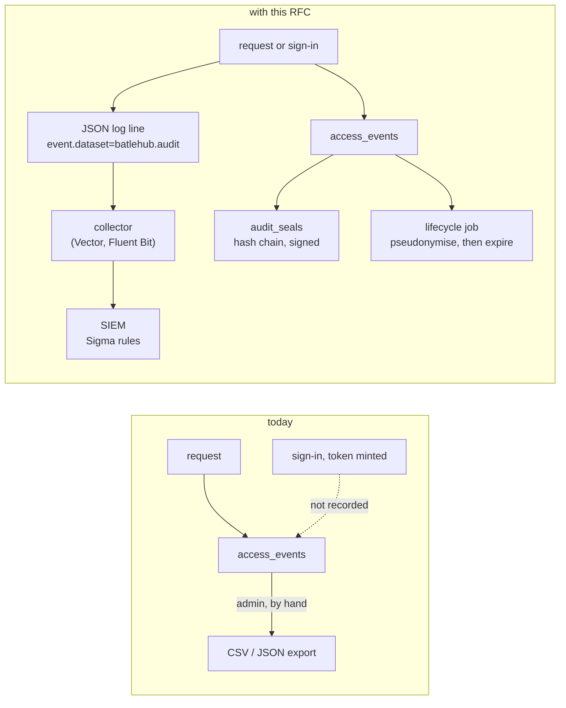
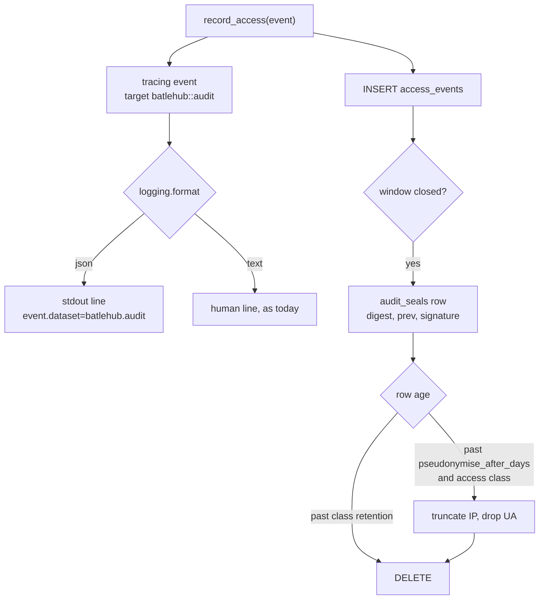
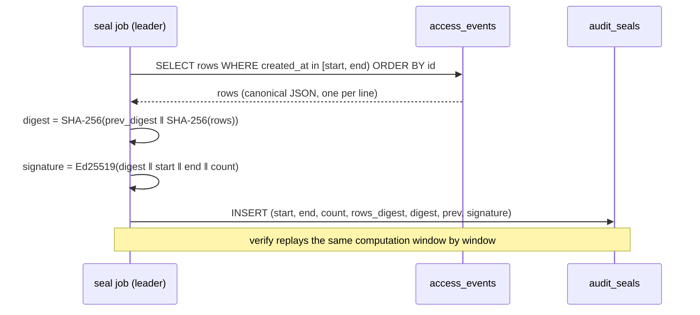
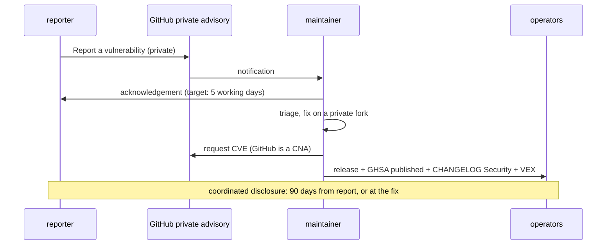

# RFC 0036 — Regulatory alignment: GDPR, ISO 27001 and the CRA as the baseline

| Field       | Value                                                        |
| ----------- | ------------------------------------------------------------ |
| Status      | In review                                                     |
| Short       | Regulatory alignment                                          |
| Settles     | Which regulatory frameworks BatleHub is built to support, and what the audit trail, personal data and vulnerability handling must do to meet them |
| Author      | Max Batleforc <maxleriche.60@gmail.com>                       |
| Co-author   | Claude Opus 5.5 <noreply@anthropic.com>                       |
| Created     | 2026-09-26                                                    |
| Supersedes  | —                                                             |
| Touches     | `crates/core` (`entities/access_log.rs`, `entities/audit_seal.rs`, `services/audit_trail.rs`, `services/audit_stream.rs`), `crates/adapters` (`db/packages/audit_trail.rs`, migrations 061–062), `crates/web` (`handlers/auth`, `handlers/back_office/audit.rs`, `handlers/back_office/gdpr.rs`, `middleware/auth.rs`, `middleware/ip_block.rs`), `crates/config` (`schema/audit.rs`), `cli` (`admin gdpr`, `admin audit verify`), `server` (`watcher.rs`), `deploy/siem/`, `tests/heavy/authz.sh`, `SECURITY.md`, `.github/`, docs |

---

## 1. Summary

BatleHub sits on the software supply chain of whoever runs it, and the
estates that run it are increasingly regulated. This RFC fixes the baseline
the project is built against — **GDPR, ISO/IEC 27001:2022 and the Cyber
Resilience Act** — and names **NIS2 and DORA** as the next target, reached
when the first regulated operator needs them. It is not a certification: a
certificate belongs to an organisation running a service, never to the
software. What the software owes is the evidence and the controls an auditor
asks the operator for, and four of those were missing or weak when this
document was written: the audit trail can be edited and is purged only by
hand, sign-ins are not audit events, personal data in it has no lifecycle, and
vulnerabilities were reported through a public issue template (closed by
phase 1, which landed with this document on 2026-09-26).

The RFC changes four things, in the order they can land: the project's own
**vulnerability handling** (a private channel, stated targets, advisories); an
**audit stream** a SIEM can consume, with **Sigma detection rules** shipped
beside it; a **lifecycle for personal data** in the audit trail (retention
classes, pseudonymisation, erasure); and **tamper evidence** for the trail
itself. A YARA scanner for artifact *contents* is specified as a later phase,
because YARA matches files, not log lines.

### Before / after

```text
# today
access_events            one table, every action, kept forever unless an
                         admin runs DELETE /api/v1/admin/audit-log?before=
sign-in / token minted   not recorded
SIEM                     GET /api/v1/admin/audit-log/export, by hand
SECURITY.md              "open an issue using the Security Issue template"
                         (until 2026-09-26, when phase 1 landed)

# with this RFC
[logging]
format = "json"          # every log line JSON; audit events carry event.dataset="batlehub.audit"

[audit]
access_retention_days     = 365   # downloads and metadata reads
security_retention_days   = 1095  # sign-ins, grants, blocks, purges, config
pseudonymise_after_days   = 30    # IP truncated, user agent dropped
seal_interval_secs        = 300   # hash-chained, signed windows

deploy/siem/sigma/*.yml  detection rules over the stream
batlehub admin audit verify          # the chain holds, or names the window
batlehub admin gdpr erase --user X   # pseudonymises one subject everywhere
SECURITY.md              GitHub private vulnerability reporting, targets,
                         advisories with a CVE, a stated support window
```



The copy that reaches the SIEM is the one an attacker with database access
cannot quietly rewrite; the seal chain is what lets anyone prove the database
copy was not rewritten either.

---

## 2. Motivation

1. **The audit trail is editable, and its own purge is erasable.**
   `access_events` is a plain Postgres table. `DELETE
   /api/v1/admin/audit-log?before=`
   (`crates/web/src/handlers/back_office/audit.rs`, `purge_audit_log`)
   writes an `AuditPurge` event — and the handler's own
   comment says a second call with the same cutoff removes it. ISO 27001
   A.8.15 asks that logs be *protected against tampering and unauthorised
   access*; nothing here can show they were.
2. **Authentication is not an audit event.** `AccessAction`
   (`crates/core/src/entities/access_log.rs`) has some forty variants —
   downloads, blocks, grants, retention runs, cache evictions — and none for
   an OIDC sign-in, a failed sign-in, a PAT minted or revoked, or a credential
   refused. "Who logged in, from where, and what was refused" is the first
   question of every access review (ISO A.5.18, A.8.5) and every incident.
3. **Personal data in the trail has no lifecycle.** Every row carries
   `user_id`, and since migration 029 the client IP and user agent. An IP
   address is personal data under GDPR. Nothing expires it: there is no
   retention setting (`crates/config/src/schema/mod.rs` states "there is no
   configured audit-retention window in this tree"), no pseudonymisation, and
   `docs/operations/incident-response.md` §PII handling answers an erasure
   request with a hand-written `UPDATE`. That fails storage limitation
   (Art. 5(1)(e)) and privacy by default (Art. 25) out of the box.
4. **A SIEM gets the trail only by polling an export.** The only ways out are
   `GET /api/v1/admin/audit-log/export` and `batlehub admin export-audit-log`.
   There is no stream, so detection is batch at best, and a SOC receiving the
   export has no rule set to start from. Detection is ISO A.8.16; for a
   future NIS2 or DORA operator it is the control incident reporting depends
   on.
5. **Vulnerabilities were reported in public** (until phase 1 landed with
   this document, 2026-09-26). `SECURITY.md` said *do not open a public
   issue* and then directed the reporter to
   `.github/ISSUE_TEMPLATE/security-issue.md` — a public issue template.
   There was no private channel, no stated response target, no advisory or
   CVE process and no support window. The CRA's vulnerability-handling
   requirements (Annex I, Part II) are exactly these things, and a
   prospective client's supplier questionnaire asks for them whether or not
   the CRA binds the project yet.
6. **Nothing maps BatleHub to the frameworks its operators are audited
   against.** `docs/operations/soc2-checklist.md` is the only mapping. GDPR
   and the CRA are each named once in passing (`incident-response.md` §PII
   handling, `guide/sbom.md`'s first line); ISO 27001, NIS2 and DORA appear
   nowhere, and no page maps a control to any of the five. An operator whose
   auditor asks "which control does this satisfy" has to derive the answer
   from source.

---

## 3. Goals / non-goals

**Goals**

- A written position on each framework: whom it binds, what BatleHub
  contributes, and what stays the operator's.
- A private, documented vulnerability-handling process for the project, with
  advisories that carry a CVE and reach the VEX document and the changelog.
- Sign-ins, sign-in failures, token lifecycle and refused credentials recorded
  as audit events.
- The audit trail available as a JSON stream, with a maintained set of Sigma
  rules over it.
- Personal data in the trail pseudonymised and expired on a configured
  schedule, and erasable for one data subject on request.
- Evidence that the trail was not altered: a signed hash chain over it and a
  command that verifies it.
- A compliance mapping page per framework, in the style of the SOC 2 page,
  that an operator can hand to an auditor.

**Non-goals**

- **Certifying anything.** Software is not certified; the operator is. The
  mapping pages carry the SOC 2 page's disclaimer.
- **Legal advice.** Whom a regulation binds is stated as the project reads
  it; an operator confirms it with counsel.
- **NIS2 and DORA conformance now.** They bind operators, not software, and
  no regulated operator runs BatleHub yet. §12's last phase lists what they
  add, so the baseline does not have to be rebuilt to reach them.
- **Vendor-specific SIEM content.** Sigma is the portable format; `sigma-cli`
  converts it to Splunk, Elastic, Sentinel or QRadar. Hand-maintained
  per-vendor queries would be four copies to keep in step.
- **YARA over logs.** YARA matches byte patterns in files. Log detection is
  Sigma's job; YARA is specified here as an artifact scanner (§6.6).
- **A write-once store inside BatleHub.** Tamper evidence is the seal chain
  plus the SIEM copy; immutable storage (S3 Object Lock, a WORM bucket) is
  the operator's, and the docs say how to point the stream at one.
- **Native TLS, KMS-held signing keys, enforced MFA.** Real controls, and
  each is its own change: listed in §12's NIS2/DORA phase, not built here.
- **Hash-chaining every row as it is written.** Rejected in §8: it
  serialises the hottest insert in the system.

---

## 4. User-facing design

### 4.1 Configuration

```toml
[logging]
# "text" (the default, today's output) or "json": one JSON object per line
# on stdout. Audit events are ordinary lines with event.dataset = "batlehub.audit".
format = "json"

[audit]
# Two classes, because the two kinds of row have opposite pressures: a
# download row is high-volume personal data that GDPR wants gone, a
# sign-in, grant or purge row is the evidence ISO and DORA want kept.
access_retention_days   = 365    # Download, ViewMetadata
security_retention_days = 1095   # every other action, and every auth event
# Access rows older than this lose their precision: the IP is truncated to
# /24 (IPv4) or /48 (IPv6) and the user agent is dropped. 0 disables.
pseudonymise_after_days = 30
# How often a sealing window closes. 0 disables sealing.
seal_interval_secs      = 300
# Ed25519 key that signs each seal; the public half is what `verify` uses.
seal_signing_key        = "${BATLEHUB_AUDIT_SEAL_KEY}"
```

- **Absent `[audit]` keeps today's behaviour**: nothing expires, nothing is
  pseudonymised, nothing is sealed. An upgrade never deletes data the
  operator did not ask it to. §4.3 warns about it instead.
- **`0` for a retention class means "never expire that class"**, and is
  distinct from absent only in that it silences the warning.
- **`[logging] format` absent means `text`**, byte-identical to today.

The project side needs no configuration: it is `SECURITY.md`, the repository's
private vulnerability reporting, and a `security.txt` on the docs site.

### 4.2 Behaviour rules

- **Classification is by action**, fixed in code: `Download` and
  `ViewMetadata` are the access class; every other `AccessAction`, including
  the new authentication actions of §6.1, is the security class. A new action
  is security class unless it is added to the access list deliberately — the
  failure direction is keeping too long, not too short.
- **Retention deletes; pseudonymisation rewrites.** A row past
  `pseudonymise_after_days` keeps its user id, its action and its outcome and
  loses the precision of its IP and its user agent. A row past its class's
  retention is deleted.
- **Pseudonymisation reaches the access class only.** A security-class row
  keeps its full IP for the whole of `security_retention_days`, because the
  source of a sign-in, a grant or a purge *is* the evidence: a truncated IP
  cannot tell two hosts in one `/24` apart in an access review. The basis is
  the operator's legitimate interest in the security of processing (GDPR
  Art. 6(1)(f), Art. 32) and, where one applies, a legal obligation to keep
  the record; the compliance page says which, and the shorter retention
  proposed for the access class is what keeps the two proportionate.
- **A purge is security class and outlives later purges.** The manual purge
  (`purge_audit_log`) deletes access-class rows only; security-class rows are
  removed by their retention and by nothing else. That closes motivation 1's
  "a second purge erases the first".
- **Pseudonymisation and retention never touch a row in an open seal
  window.** They run on closed windows, and each run is itself a
  security-class event carrying the window range it touched.
- **Erasure pseudonymises; it does not delete.** `gdpr erase --user X`
  replaces `X` with `erased:<hmac>` in `access_events`, token rows and block
  rows, with a key the operator holds, so two rows of the same subject stay
  linkable to each other and to nobody. Publication and ownership rows
  (`published_by`, `package_ownership`) are exempt (§11 q5): they are
  retained under legitimate interest, and `gdpr export` lists them so the
  subject sees what is kept. Deleting the rows would destroy the security
  evidence the retention class exists to keep; the regulation allows keeping
  what a legal obligation or legitimate interest requires, and the operator
  documents which one applies.
- **The stream is the table, not a second opinion.** An event is logged at
  the moment `record_access` writes it, with the same fields, so a SIEM rule
  and an export can never disagree about what happened. A failed database
  write still emits the line, with `batlehub.audit.persisted = false`.
- **Nothing is emitted for `/healthz`, `/livez` or `/metrics`**, which are not
  audit events today and are not made so.

### 4.3 Validation

`AppConfig::validate()` rejects:

| Condition | Rationale |
| --- | --- |
| `seal_interval_secs > 0` without `seal_signing_key` | an unsigned chain proves order, not origin; a half-configured seal would read as protection it is not |
| `seal_signing_key` that does not parse as an Ed25519 PKCS#8 PEM | the same check `services/signature.rs` applies to publish keys |
| `pseudonymise_after_days` greater than `access_retention_days` (both non-zero) | the rows would be deleted before they are pseudonymised, so the setting is a claim with no effect |
| `security_retention_days` less than `access_retention_days` (both non-zero) | evidence would expire before the traffic it explains |

Warnings (logged at start and listed by `GET /api/v1/admin/config/warnings`,
which the console already shows on the config-reload page,
`ui/src/pages/AdminConfigReload.vue`):

| Condition | Behaviour |
| --- | --- |
| no `[audit]` block | *"audit trail has no retention: personal data in access_events is kept indefinitely"*; behaviour unchanged |
| `pseudonymise_after_days = 0` with an access retention over 90 days | full IPs kept for the whole window; allowed, stated |
| `[logging] format = "text"` with `seal_interval_secs > 0` | sealing without a stream: the chain is verifiable but no copy leaves the database |

---

## 5. Architecture

### 5.1 Whom each framework binds, and what BatleHub owes it

| Framework | Binds | BatleHub's position | What the project owes |
| --- | --- | --- | --- |
| GDPR (Reg. 2016/679) | the operator, as controller of the users' data | baseline | minimisation and storage limitation by default (Art. 5, 25); erasure and access tooling (Art. 15, 17); the security of processing it offers (Art. 32) |
| ISO/IEC 27001:2022 | the operator's ISMS | baseline | Annex A evidence: logging (8.15), monitoring (8.16), access control (5.15–5.18, 8.2, 8.5), vulnerabilities (8.8), cryptography (8.24), secure development (8.25–8.28), ICT supply chain (5.21) |
| Cyber Resilience Act (Reg. 2024/2847) | a manufacturer placing a product on the EU market in a commercial activity | baseline; **not yet binding** — the project is non-commercial | Annex I Part II vulnerability handling, an SBOM, a support period; the reporting duty of Art. 14 (in force since 2026-09-11) once commercial |
| NIS2 (Dir. 2022/2555) | essential and important entities | future goal | the controls its Art. 21(2) measures name: supply-chain security (d), vulnerability handling (e), access control and MFA (i, j); detection that makes Art. 23's 24 h / 72 h / one-month reporting possible |
| DORA (Reg. 2022/2554) | financial entities, and through contracts their ICT providers | future goal | logging and detection (Art. 9–10), backup and restoration (Art. 12), incident classification (Art. 18); for a hosted instance, the contractual terms of Art. 30 |

The CRA row decides the most. Non-commercial free software is outside its
scope; the moment BatleHub is offered as a paid support contract or monetised
in another way, the maintainer becomes a manufacturer, and the obligations in
the right-hand column apply from the first commercial release. Building them
now costs one process and one page; retrofitting them under a 24-hour
reporting duty costs an incident.

A **public instance** is a second, separate role: its operator is a GDPR
controller for every visitor's IP, and — if it serves a regulated client —
an ICT third-party provider under DORA. Everything in §4 is what that
operator would need on day one.

### 5.2 The audit event's life



Because the log line is emitted by the same call that writes the row, the
stream cannot report an event the table does not hold or miss one it does.
Because rewriting runs only on sealed windows, a pseudonymised row is always
one whose original digest is already in the chain.

### 5.3 The seal chain



A window is sealed only after `end` is further in the past than the longest
in-flight request (the job waits one window), so a late insert cannot land
in a window already sealed.

The chain is **append-only records, not a fixed digest per window**, because
the lifecycle of §5.2 legitimately changes sealed rows. Three record kinds
share one sequence, each carrying the previous record's digest and a
signature:

- **seal** — a window closed, with its row count and rows digest;
- **amend** — the lifecycle job pseudonymised rows in a sealed window, with
  the window's new rows digest and the count it rewrote;
- **expire** — retention deleted a window, with the count it removed.

`verify` walks the sequence and, for each window still present, recomputes
the rows digest and compares it with the *latest* seal or amend for that
window. Because every amend and expire is signed and chained, the lifecycle
can change the rows and an attacker cannot: rewriting a row, or deleting one,
without the key leaves a window whose digest matches no signed record.

One edit the chain alone cannot see is **truncation**: an attacker with write
access to the database deletes the last *N* windows' rows *and* their seal
records, and `verify` walks a shorter chain that is valid end to end. The
anchor has to live outside the database, so **every seal, amend and expire
record is also an audit line on the stream** (`event.action=audit_seal`,
carrying the record's digest), and `verify --head <digest>` refuses a chain
whose newest record is not the digest the SIEM last received. Because the
stream copy leaves the host before the window it seals can be deleted, a
truncated tail is a head that no longer matches — which is the same reason
§4.3 warns about sealing without a stream.

### 5.4 Reporting a vulnerability in BatleHub



The advisory, the changelog's `### Security` section and
`vex/batlehub.openvex.json` are updated in the same release, so an operator's
scanner, their reading and their auditor see one answer.

---

## 6. Detailed design

### 6.1 Authentication events

- `crates/core/src/entities/access_log.rs` gains `SignIn`, `SignInFailed`,
  `TokenCreate`, `TokenRevoke`, `TokenNewSource` and `CredentialRejected`,
  with their
  `as_str` spellings and the `action_to_str` arm in
  `crates/adapters/src/db/packages/mod.rs`. All are security class.
- `SignIn` / `SignInFailed` are recorded in `oidc_callback`
  (`crates/web/src/handlers/auth/oidc/sso.rs`), with the provider name and,
  on failure, the reason class (state mismatch, token exchange, claims) —
  never the token or the code.
- `TokenCreate` / `TokenRevoke` in `crates/web/src/handlers/auth/tokens.rs`,
  carrying the token id and name, never its value or hash.
- `CredentialRejected` in `crates/web/src/middleware/auth.rs` when a bearer
  was presented and no provider accepted it — the middleware is the one
  place that knows both facts, since it falls back to `Identity::anonymous()`
  rather than answering, and the refusal the client then sees is the
  registry's own for an anonymous read. Throttled in process to one row per
  source IP per minute, so a credential-stuffing burst costs one write a
  minute rather than one per attempt; the throttled count is carried on the
  row that is written. The throttle is per process: an estate of *n* proxy
  replicas writes up to *n* rows a minute per IP, and the burst rule's
  threshold in §6.2 is set with that in mind.
- `TokenNewSource` in the PAT provider, when a token is accepted from a
  source IP it was last used from a different one — the row already carries
  `last_used` (migration 038), so the comparison is a read that happens
  anyway. A first-seen detection is stateful and outside what a Sigma rule
  can express (§6.2), so the server emits the fact and the rule matches it.

### 6.2 The audit stream

- `server/src/watcher.rs::init_tracing` gains the `[logging] format` switch:
  `tracing_subscriber::fmt::layer().json()` with the current span flattened,
  so `request_id` is on every line (the request span already carries it,
  `server/src/server_factory.rs`).
- `record_access` callers do not change. There are 15 of them across
  `crates/core` and `crates/web` and no shared helper above the port, so the
  event is emitted where every one of them lands:
  `crates/adapters/src/db/packages/crud.rs::record_access_impl` (and the
  in-memory repository, for the web tests), on target `batlehub::audit`, with
  ECS field names: `event.dataset` (`batlehub.audit`, the selector a
  collector and every Sigma `logsource` key on), `event.kind` (`event`, the
  ECS value — `audit` is not one, and a collector's ECS mapping would refuse
  it), `event.category` (`authentication`, `iam`, `package` or
  `configuration` by action), `event.action`, `event.outcome`,
  `event.reason`, `user.id`, `user.roles`, `source.ip`,
  `user_agent.original`, `batlehub.registry`, `package.name`,
  `package.version`, `http.request.id`.
- Two writes outside `record_access` join the stream with their own emit,
  same target and field names: the `config_changes` insert
  (`crates/adapters/src/db/config_change.rs`, `event.action=config_applied`
  or `config_rejected` from its `status` column) and the seal records of
  §5.3 (`event.action=audit_seal`). Without the first, `config_rejected.yml`
  below has nothing to fire on; without the second, the chain has no anchor
  off the host.
- `deploy/siem/sigma/` carries the rules, one file each, with a
  `README.md` that shows `sigma convert -t splunk` and a Vector and a Fluent
  Bit snippet. The initial set:

| Rule | Fires on |
| --- | --- |
| `audit_purge.yml` | any `audit_purge` — always worth a human |
| `grant_to_anonymous.yml` | `grant_write` whose subject is anonymous or `*` |
| `credential_rejected_burst.yml` | `credential_rejected` from one `source.ip`, count over threshold in 5 min |
| `sign_in_failed_burst.yml` | `sign_in_failed` per user or IP over threshold |
| `denied_download_burst.yml` | `download` + `outcome: denied` per IP over threshold |
| `bulk_pull.yml` | one principal pulling an unusual number of distinct packages in 10 min (exfiltration of a private registry) |
| `blocked_package_pulled.yml` | a download of a coordinate a flag or verdict marked malicious (`event.reason` carries it) |
| `token_new_source.yml` | any `token_new_source` (§6.1): a PAT used from a source IP other than its last one. Emitted by the server, because "never seen before" is stateful and Sigma correlations only count, count distinct values, or order events in a window |
| `retention_or_cache_clear.yml` | `cache_clear`, `retention_run`, `tombstone_compact` outside a maintenance window |
| `config_rejected.yml` | `config_rejected`, from the `config_changes` emit above |
| `audit_chain_gap.yml` | two consecutive `audit_seal` lines whose `prev` and digest do not chain — the SIEM-side half of the truncation check of §5.3 |

- `task siem:check` runs `sigma check` over the directory, and a fixture
  test replays recorded audit lines (from §6.7's run) through a minimal
  matcher, so a renamed field breaks the build instead of silently blinding
  a SOC.

### 6.3 Retention and pseudonymisation

- `crates/config`: an `AuditConfig` with the four keys of §4.1, validated as
  §4.3.
- `crates/core/src/services/audit_lifecycle.rs`: one job, run by the
  worker-role leader (`ScanQueue::try_lead`, the same advisory-lock election
  the rescan timer uses), that pseudonymises then expires closed windows in
  batches of 5 000 rows, writing a `RetentionRun`-style security event per
  run.
- `crates/adapters`: `purge_events_before` gains the class restriction; a
  migration adds an index on `(action, created_at)` for the class scans.
- `batlehub admin gdpr erase --user <id>` and
  `POST /api/v1/admin/gdpr/erase`, behind a new `gdpr:erase` verb on its
  own — `audit:purge` does not imply it, since a purge removes traffic and
  an erasure rewrites evidence — and `gdpr export --user <id>` answering an
  access request from the same rows, behind `audit:read`.

### 6.4 Seals

- Migration: `audit_seals (id, kind, window_start, window_end, row_count,
  rows_digest, digest, prev_digest, signature, key_id, created_at)`, `kind`
  one of `seal`, `amend`, `expire` (§5.3). The lifecycle job of §6.3 writes
  its `amend` and `expire` records in the same transaction as the rewrite or
  delete, so the two cannot disagree.
- `crates/core/src/services/audit_seal.rs`: the job of §5.3, leader-elected
  like §6.3, and the verifier. The canonical row form is the export's JSON
  with keys sorted, one per line.
- `batlehub admin audit verify [--from --to] [--head <digest>]`: exits `0`
  when every window verifies, `1` naming the first window that does not, and
  prints windows expired by retention as such. `--head` is the digest of the
  newest `audit_seal` line the SIEM holds; a chain whose last record is not
  that digest is reported as truncated (§5.3), and `verify` without it says
  in its output that truncation was not checked.

### 6.5 The project's vulnerability handling (phase 1)

**Landed 2026-09-26, in the commit that adds this document** (`37e2d15e`):
the rewritten `SECURITY.md`, both templates removed and replaced by the
contact-link configs, the console's footer link, the advisory procedure in
`security-scanning.md`, and the changelog entry. The list below is what was
built, kept as the record.

- `SECURITY.md` rewritten: GitHub private vulnerability reporting as the
  channel (already enabled on `batlehub/batlehub`: the repository's
  `private-vulnerability-reporting` endpoint answers `enabled: true`);
  acknowledgement, assessment and fix targets stated as targets for a single
  maintainer, not an SLA; 90-day coordinated disclosure; advisories through
  GHSA with a CVE; the supported-versions table; scope; safe harbour for
  good-faith research.
- `security-issue.md` removed from `.github/ISSUE_TEMPLATE/` and
  `.forgejo/ISSUE_TEMPLATE/`, and replaced in both by a contact link to the
  private form (`config.yml`, `config.yaml`), so the public template cannot
  be used by mistake.
- The console's footer link (`REPORT_SECURITY_URL`, `ui/src/config.ts`)
  pointed at that public template; it points at the private form.
- `docs/contributing/security-scanning.md` §*Publishing an advisory*: the
  advisory, the changelog's `### Security` entry and the VEX statement, in
  one release. `vex.py` already accepts `fixed` and `affected` statements.
- **No `security.txt` from this repository.** RFC 9116 places it at the root
  of a domain, `/.well-known/security.txt`; the docs site is served under a
  path (`/batlehub/`) on a host the project does not own the root of, so a
  file there would not be where a client looks. The repository's
  `SECURITY.md`, which GitHub surfaces on the *Security* tab and in the
  report form, is the discoverable policy until the project has a domain of
  its own.

### 6.6 A YARA scanner for artifact contents

- A `yara` scanner kind for the scan worker (`ArtifactScanner`, RFC 0018),
  reading operator-supplied rule files from `[scanners.yara] rules_dir` and
  running yara-x's `yr scan` binary inside the RFC 0022 sandbox like the
  other byte-reading scanners (§11 q6). A match is a finding with the rule
  name; the policy decides whether it blocks.
- Kept out of the earlier phases because it adds a binary to the worker
  image and is useful only to an operator who has rules to run.

### 6.7 `tests/heavy/authz.sh`, phase `audit`

A new phase in the existing credential-boundary suite, because it already
starts a server with static tokens, PATs and a real client against the tap.
The client is the suite's pinned npm; the server runs with `[logging] format
= "json"` and an `[audit]` block with `seal_interval_secs = 5`. What it
proves, on the wire and in the stream:

1. `npm install` of a public package with a PAT — the tap shows the tarball
   `GET ... -> 200` with request id *R*, and the server's stdout carries exactly
   one line with `event.dataset=batlehub.audit`, `event.action=download`,
   `event.outcome=allowed`, `http.request.id=R`, and the PAT's `user.id`.
2. `npm install` of a blocked version — npm exits non-zero with its own
   `E403` text, the tap shows no tarball request, and the stream carries one
   `download` line with `event.outcome=denied` and the block reason.
3. The PAT is revoked through the API, then used — the middleware falls
   back to anonymous (§6.1), so what npm sees is the closed registry's
   refusal of an anonymous read: the tap shows the packument
   `GET ... -> 403`, the status the suite's existing npm-deny arm already
   asserts through `WIRE_403`, and npm exits non-zero with its `E403` text.
   The stream carries `token_revoke` then `credential_rejected` from the
   tap's source IP; twenty further attempts in the same minute produce no
   further rows (the throttle) and one row's `throttled_count` says 20.
4. `batlehub admin audit verify` exits `0` after the run. One row is then
   altered with SQL; `verify` exits `1` and names the window holding it.
5. `DELETE /api/v1/admin/audit-log?before=now` removes the run's `download`
   rows; the `audit_purge`, `token_revoke` and `credential_rejected` rows are
   still listed by `GET /api/v1/admin/audit-log`, and a second purge does not
   remove the first purge's row.
6. The recorded stream from cases 1–5 is replayed through
   `credential_rejected_burst.yml` and `audit_purge.yml`: both fire, and
   `bulk_pull.yml` does not.

Pseudonymisation and erasure are not observable through a client — a
package manager never reads the audit trail — so they are proven in
`crates/adapters/tests/pg_audit_lifecycle.rs` against a real database, with
the clock injected. The project-side changes of §6.5 have no client at all:
what a client would observe is a reporter's browser reaching the private form,
and there is no package manager in that path. Their regression signal is the
console's footer test (`ui/src/components/app/AppFooter.test.ts`, which pins
the link to `REPORT_SECURITY_URL`) and `task docs:links` for the procedure's
cross-references.

**Deliberately untouched**, so reviewers do not go looking:

- `config_changes` (`018_config_changes.sql`) — already an append-only record
  with actor, status and diff; §6.2 adds one emit beside its insert and
  nothing else, and full before/after snapshots are a separate question.
- `timed_query` and `db_metrics` — observability, not audit; a metric is not
  evidence of who did what.
- The SOC 2 page — kept as it is; the new pages sit beside it and link to it.
- `signature.rs`'s key handling — the seal key reuses its parsing, not its
  storage; KMS is §12's last phase.

### 6.8 Docs

- `docs/operations/compliance.md`, the landing page: §5.1's table, the
  disclaimer, links to one page per framework.
- `docs/operations/compliance-gdpr.md`, `-iso27001.md`, `-cra.md`: the SOC 2
  page's format (criterion, control, status, evidence path), plus
  `-nis2-dora.md` listing what exists today and what §12's last phase adds.
- `docs/operations/siem.md`: the stream, the field reference, the collectors,
  the rules and how to add one.
- `docs/operations/incident-response.md`: a section on what NIS2 Art. 23's
  timeline asks of an operator and where BatleHub's evidence for it lives,
  and §PII handling rewritten around `gdpr erase` instead of the hand-written
  `UPDATE`. (The alert name it quoted was corrected to
  `BatleHubHighDeniedRequestRate` in both locales with phase 1.)
- French translations of each, as for every `operations/` page.

---

## 7. Security considerations

- **The stream carries personal data off the host.** IPs, user ids and user
  agents go wherever the collector sends them. The operator becomes the
  controller of that copy too; `docs/operations/siem.md` says so, and
  pseudonymisation in the database does not reach a copy already shipped.
- **No secret is ever an audit field.** Token values, hashes, OIDC codes and
  signatures are excluded by construction: the event types carry ids and
  names only, and a unit test asserts no field of a serialised event matches
  the `bh_pat_` prefix or a JWT shape.
- **`CredentialRejected` is attacker-triggered writes.** Throttled per IP in
  process (§6.1); the existing rate limiter and IP escalation
  (`middleware/rate_limit`, `middleware/ip_block.rs`) still apply in front of
  it.
- **The seal key signs, it does not encrypt.** Its compromise lets an
  attacker forge a chain from that point on; the SIEM copy is the control
  that detects it, which is why §4.3 warns about sealing without a stream.
- **Erasure is a destructive admin action.** It needs its own verb
  (`gdpr:erase`), is itself a security-class event naming the operator, and
  is refused for a subject with an open quarantine or block decision unless
  forced.
- **A private advisory channel shifts exposure, not risk.** The fix window is
  the same; what changes is that the report is not public before the fix.

---

## 8. Alternatives considered

| Alternative | Why rejected |
| --- | --- |
| Hash-chain each `access_events` row on insert | every download would serialise on the previous row's hash — one lock across the hottest insert (`record_access`, 1 per artifact read); windows give the same evidence with no hot-path cost |
| YARA rules for the SIEM, as first asked | YARA matches byte patterns in files; a log line is Sigma's domain, and a YARA rule over JSON lines would be a regex engine with none of Sigma's field semantics or converters |
| Per-vendor queries (SPL, KQL, AQL) | four rule sets to keep in step; `sigma convert` produces them from one source |
| OTLP logs instead of JSON on stdout | Kubernetes collectors read stdout already; OTLP logs are an exporter the server does not have (`build_otlp_provider` exports traces only) — worth adding later, not a prerequisite |
| Delete a data subject's rows on erasure | destroys the security evidence retention exists to keep, and breaks the seal chain; pseudonymisation satisfies the request where a retention basis applies |
| Default retention on, at upgrade | an upgrade that deletes a year of audit rows unasked is the incident this RFC is meant to prevent; a loud warning instead |
| Keep the public issue template, with a "mark private" note | a note does not make a public issue private; the report is visible the moment it is filed |

---

## 9. Rollout and compatibility

- **Default behaviour**: unchanged. No `[audit]`, no `[logging]` → text logs,
  nothing expires, nothing is sealed; one startup warning.
- **New audit actions** appear in the audit log, its export and the console's
  filters; a consumer that switches on action names sees six new values.
- **Migrations**: `audit_seals`, the `(action, created_at)` index, and the
  CHECK/enum widening for the new actions. Additive; `CURRENT_CONFIG_VERSION`
  does not move.
- **Operator prerequisites**: a collector for the stream, a key for the seals,
  and — for erasure — an HMAC key kept outside the database.
- **Rollback**: disabling `[audit]` stops the jobs; seals already written stay
  and verify. Rows already pseudonymised or deleted are not recoverable, which
  is the point of the setting and is stated beside it.

---

## 10. Test plan

- **Unit** (`crates/core/src/entities/access_log.rs`,
  `crates/core/src/services/audit_seal.rs`): action classification, canonical
  form stability, digest and signature over a fixed window, the no-secret
  assertion on serialised events.
- **Integration** (`crates/adapters/tests/pg_audit_lifecycle.rs`,
  `crates/adapters/tests/pg_audit_seal.rs`): pseudonymise, expire, erase and
  seal against Postgres with an injected clock; a purge's class restriction.
- **Web** (`crates/web/tests/audit_auth_events.rs`): sign-in, failure, token
  create/revoke and credential-rejected rows, with the throttle.
- **SIEM** (`task siem:check`): `sigma check`, and the replay fixture of §6.2.
- **Heavy** (`tests/heavy/authz.sh`, phase `audit`): §6.7.
- **Existing suites** that must pass unchanged: the web tests that read
  the audit log today (`admin_packages.rs`, `tokens_and_pagination.rs`,
  `proxy_basic.rs`, `bulk_and_quota_and_cache.rs`, `dynamic_groups.rs`,
  `listing_audit.rs`); `authz_matrix.rs`, whose route inventory
  (`the_route_inventory_matches_the_router`) fails until the erase route has
  its row; and `tests/heavy/db_calls.sh` — the stream must add no statement
  to any request, and the budget says so.

---

## 11. Decisions and open questions

### Resolved

| # | Question | Decision |
| --- | --- | --- |
| 1 | Which frameworks are the baseline? | **GDPR, ISO 27001 and the CRA; NIS2 and DORA as a future goal.** The first three apply to a public instance or a paid offer on day one; the last two bind regulated operators, and the first such client is prospective. |
| 2 | "YARA rules for the SIEM"? | **Sigma for the audit stream, YARA as an artifact scanner (§6.6).** Each format for what it matches. |
| 3 | Does the CRA bind the project now? | **No: non-commercial.** Its vulnerability-handling requirements are built now anyway (§6.5), because they are cheap and a paid offer would make them binding from its first release. |

| 4 | Default retention values? | **Absent means unchanged.** No `[audit]` block expires nothing and warns once; 365 days for access rows and 1 095 for security rows ship as the documented example, not the default. An upgrade that deleted a year of rows unasked is the incident this RFC exists to prevent, and a DORA operator who wants security events longer sets the number. Decided 2026-09-27. |
| 5 | Erasure of `published_by` and ownership rows? | **The audit trail and tokens only.** Publication and ownership rows are exempt, documented as retained under legitimate interest: "who published this" has to stay answerable for every consumer of the package, and an owner-less package has no one to administer it. `gdpr export` still lists those rows, so the subject sees what is kept and why. Decided 2026-09-27. |
| 6 | YARA engine? | **yara-x's `yr` binary, in the sandbox.** VirusTotal's Rust rewrite is the maintained line, and a binary in the RFC 0022 sandbox is how GuardDog and Trivy already run: the rules execute outside the worker process and the server links nothing. The in-process `yara-x` crate was rejected because operator-supplied rules would run in the worker's own address space. Decided 2026-09-27. |
| 7 | Where the stream goes when logs stay text? | **stdout, and only under `format = "json"`.** The default stays today's text output from the tracing layer; switching to `json` is what produces the stream, on stdout, where a collector reads. No file sink and no second shape on stderr: one switch, one place, nothing to rotate. Decided 2026-09-27. |

### Still open

None. The questions numbered 1–4 of the first draft's open list are rows
4–7 above; each was decided as the draft recommended.

---

## 12. Implementation phases

| Phase | Content |
| --- | --- |
| 1 | **Project vulnerability handling** (§6.5) — **landed 2026-09-26** with this document — and the compliance pages (§6.8, without the SIEM page), **written 2026-10-05**. Useful alone: it answers a supplier questionnaire today. |
| 2 | **Authentication events and the JSON stream** (§6.1, §6.2 without the rules), `[logging] format` — **landed 2026-10-05**; see §13. |
| 3 | **Sigma rules**, `task siem:check`, `docs/operations/siem.md`, and §6.7 cases 1–3 and 6 — **landed 2026-10-05**, without `audit_chain_gap.yml`, which needs phase 5's seals; see §13. |
| 4 | **Retention classes, pseudonymisation, erasure** (§6.3) and §6.7 case 5 — **landed 2026-10-05**; see §13. |
| 5 | **Seals and `audit verify`** (§6.4) and §6.7 case 4 — **landed 2026-10-05**, with `audit_chain_gap.yml` and a truncation case §6.7 did not list; see §13. |
| 6 | **YARA scanner** (§6.6) with yara-x's `yr` in the worker image (§11 q6). |
| 7 | **NIS2 / DORA**, when a regulated operator needs them: MFA enforcement through the OIDC `acr`/`amr` claims; signing keys (publish, APK, VS Code, seal) held in a KMS with a rotation procedure; a restore test in CI with a stated RPO/RTO; incident classification fields on notifications; a DORA Art. 30 contract annex template for a hosted offer. |

---

## 13. Implementation notes

Phases 2 and 3 landed 2026-10-05, and phases 4 and 5 the same day. What
follows is where the design was wrong or under-specified, recorded because the
next phase reads this document and not the diff. Rows 1–10 are phases 2–3's,
rows 11–19 phases 4–5's. Phase 6 (YARA) is not built, which is why the status
stays *In review*; phase 7 waits for a regulated operator, as §12 says.

### Corrections to the design

| # | § | What the RFC said | What landed, and why |
| --- | --- | --- | --- |
| 1 | §6.1 | `TokenNewSource`: *"the row already carries `last_used` (migration 038), so the comparison is a read that happens anyway"* | Migration 038 stores `last_used_at`, a **time**, and no address. Migration 061 adds `user_tokens.last_used_ip`, written by `touch_last_used` beside the time, and `RawAuthRequest` gained `source_ip` so a provider can see the caller at all. The comparison still costs no extra read: it runs only when the provider claims its once-a-minute `last_used_at` slot, so a token bouncing between two hosts is one row a minute. A token with no recorded address — every token, the first time after the upgrade — is not "new". |
| 2 | §6.1 | `TokenCreate` *"carrying the token id and name"*; `SignIn` *"with the provider name"* | `AccessEvent` had nowhere to carry either: its only free text is a *denial's* reason. Migration 061 adds `access_events.detail`, `AccessEvent::detail`, and `batlehub.audit.detail` on the stream. Never a secret: `token_id=… name="…"`, `provider=…`, `subject=… actions=…`. |
| 3 | §6.2 | `grant_to_anonymous.yml` fires on *"`grant_write` whose subject is anonymous or `*`"* | A `grant_write` row recorded the coordinate and nothing about the subject, so the rule had nothing to read. Grant writes and revocations now carry `subject=<subject> actions=<verbs>` in `detail`, and the rule keys on its prefix. That spelling is part of the stream's contract and is said so where it is written (`grant_detail` in `governance/grants.rs`). |
| 4 | §6.1 | *"the throttled count is carried on the row that is written"* | A row cannot carry a count of attempts that have not happened yet, and rewriting it later is the write per attempt the throttle exists to avoid. The count rides on the **next** row written for that source IP. §6.7 case 3's *"one row's `throttled_count` says 20"* therefore needs one attempt after the window, which the heavy phase makes; the replayed `credential_rejected_burst.yml` keys on `throttled_count >= 10`, not on a count of rows. |
| 5 | §6.2 | `http.request.id` on every line, *"with the current span flattened"* | `tracing-subscriber`'s JSON layer flattens the *event's* fields and nests the span's: the request id is `span.request_id`. Re-emitting it per event would need the id inside `record_access`, which every caller would have to pass down. The field reference documents `span.request_id`. |
| 6 | §6.2 | ECS `event.outcome` | ECS's own vocabulary is `success` / `failure` / `unknown`; the stream says `allowed` / `denied` / `error`, the audit log's words, because §6.7 asserts those and an operator reading the console and the SIEM side by side should not translate. A collector that enforces ECS's expected values maps them. |
| 7 | §6.2 | `config_rejected` from the `config_changes` insert's `status` column | The column has documented `"applied" \| "rejected"` since migration 018, and nothing ever wrote `rejected`: a refused candidate left no row. The reload service now writes one when the file watcher's or the editor's candidate does not parse, validate or build (the editor's dry-run *validate* button writes nothing). The stream line is emitted in `persist_audit`, the one funnel both repositories go through, rather than in the Postgres adapter — and is emitted with `persisted = false` when there is no table to write to. |
| 8 | §6.2 | The stream emitted where `record_access` lands | It is, in both repositories, through `audit_stream::emit` — and only under `format = "json"`: a process-wide switch set by the tracing setup, so the text format stays byte-identical, as §4.1 promises, rather than gaining a line per download. |
| 9 | §6.7 | Case 2: *"`npm install` of a blocked version — npm exits non-zero with its own `E403` text, the tap shows no tarball request, and the stream carries one `download` line with `event.outcome=denied`"* | Contradictory, and the first heavy run said which half: with no tarball request there is no download, so there is no download row. RFC 0006 hides a blocked version from the packument; npm stops on `ETARGET` after one *allowed* listing read, and **the block leaves nothing in the audit trail** on that path. The request that reaches the download gate is a lockfile that still names the version — `npm ci` fetches the tarball it resolved before the block, is refused `403`, and that is the `denied` row with the block's reason. The phase drives that. It is also exactly the client `blocked_package_pulled.yml` is written for: a lockfile, a cache or a machine that still names the coordinate. |
| 10 | §6.7 | Case 3: *"the PAT is revoked through the API, then used"* | Minting a PAT needs an interactive OIDC session, and no heavy suite has an identity provider. The phase presents a `bh_pat_` token that was never minted, which takes the middleware's path exactly; `token_revoke` is proven in-process by `crates/web/tests/tokens_and_pagination.rs`. |
| 11 | §6.3, §6.4 | Two services, `services/audit_lifecycle.rs` and `services/audit_seal.rs` | One, `services/audit_trail.rs`: the sealer, the lifecycle, erasure, export and the verifier. The canonical row form and the digests are pure functions in `entities/audit_seal.rs`. A lifecycle change to a sealed row has to commit its `amend` or `expire` record in the same transaction as the change, against a chain head the sealer may be moving — so the two share the head guard (`TrailBatch::expect_head`, a `Conflict` retried from a fresh read), and splitting them would have split that guard. |
| 12 | §6.3 | The job *"pseudonymises then expires"* | It expires, then pseudonymises: a row due both ways is deleted once, not rewritten into an `amend` record and then deleted into an `expire` record. |
| 13 | §6.3 | Leader-elected through `ScanQueue::try_lead`, *"the same advisory-lock election the rescan timer uses"* | A `LeaderLock` port with a key of its own (`AUDIT_LEADER_KEY`), a Postgres advisory lock in `crates/adapters` and an always-leader for in-memory tests — so `crates/core` stays without I/O and the audit jobs do not ride on the rescan queue's election. |
| 14 | §6.3 | *"`purge_events_before` gains the class restriction"* | The restriction is `AuditTrailService::purge_access_before`, which the purge handler calls: **access-class rows only**, through `expire` records on sealed windows, and its own `audit_purge` row naming the cutoff and the count. `purge_events_before` is unchanged and is reached only by an app built without the trail service — the in-process test apps; the server always builds one. |
| 15 | §6.4 | `audit_seals (id, kind, …)` | `seq BIGINT PRIMARY KEY` — the position in the chain, which is what a SIEM keys on and what `audit_chain_gap.yml` correlates — and an `affected` column carrying how many rows an `amend` or `expire` changed. |
| 16 | §6.4 | Unstated: where the chain starts, and what the lifecycle may touch | The first tick seals the newest window already one window in the past; rows before it are pre-chain and the lifecycle handles them without records. With sealing on, the lifecycle touches nothing past the end of the sealed range and waits for the first seal before touching anything, so an open window is never rewritten under the sealer. |
| 17 | §6.4 | `batlehub admin audit verify` | `batlehub-cli admin audit verify`, over `POST /api/v1/admin/audit/verify` behind `audit:read` — a body, because `--head` is a digest and `--from`/`--to` are instants — answering `501` on an unsealed trail. `--from`/`--to` select the windows whose rows are re-digested; the chain itself is always replayed whole. |
| 18 | §6.7 | Case 4: alter a row, `verify` exits 1 | Built as written, then extended both ways. The row is **put back** and `verify` passes again, so the failure is shown to be that row and nothing else; and a case **5b** the list did not have: the attack §5.3 is written against — a sealed row altered, the seal records from its window on deleted, the sealer left to re-seal over it. Observed: the chain verifies on its own (*that is the attack*), and `--head` with the digest the stream last carried fails with *"the chain's newest record is not the head the SIEM last received: its tail was truncated or rewritten"*; the stream carries record 21 twice and the replay makes `audit_chain_gap.yml` fire. |
| 19 | §6.7, §10 | Case 5 checks `token_revoke` survives the purge; §10 names `pg_audit_seal.rs` and unit tests in `services/audit_seal.rs` | No run mints a token (row 10), so case 5 checks the two `credential_rejected` rows survive instead — the same class. Observed: the purge deleted 3 `download` rows, written as one `expire` record; a second purge deleted 0 and left the first's row. The seal tests share `crates/adapters/tests/pg_audit_lifecycle.rs`, which makes a database of its own because the chain is one per database; the digest tests sit beside `entities/audit_seal.rs`. |

### What the RFC did not mention

- **`tracing`'s macros cannot open an event with a dotted field.**
  `info!(target: …, event.dataset = …)` is a macro ambiguity error, and a
  quoted first field is read as the message. `audit_stream.rs` uses `event!`
  with an explicit level and an identifier path first; the comment there says
  why, so the next field does not undo it.
- **The rules are tested against the emitter's source.** `sigma check`
  validates a rule's shape and cannot see a renamed field. `deploy/siem/replay.py`
  reads the field names out of `audit_stream.rs` and fails when a rule reads one
  that is not there, then replays a recorded stream through every rule against
  `fixtures/expected.json`. Renaming `source.ip` in the emitter fails two rules
  by name.
- **An actix app factory runs once per worker.** The first `credential_rejected`
  throttle was built inside it, so each of the server's workers had its own:
  the heavy phase's twenty attempts in one minute wrote eight rows, not one.
  The in-process test could not see it — a test app has one worker. The
  throttle is now a `CredentialRejectionAudit` built once, outside the factory,
  and every worker holds a clone of the same `Arc`.
- **`AccessEvent` is a struct literal in twenty-two places.** Two new fields
  meant two passes over every one of them; both are `Option`s defaulting to
  `None`, so no existing row or caller changed meaning.
- **An automatic IP ban left no audit row.** The middleware logged it with
  `tracing` and nothing else; the ban row is deleted when it expires and the
  violation counters after 30 days, so a ban was gone from the database within
  a month — the detection evidence §2 is about. Since 2026-10-05 every
  automatic ban writes `block_ip` as `system`, the banned caller in the network
  fields and `ip=… until=… reason=auto status=… violations=… threshold=…
  window_secs=…` in `detail`; the manual `block_ip` and `unblock_ip` rows, which
  said an IP was blocked and not which one, carry `ip=…` too. And
  `[ip_blocking].violation_window_secs` is refused above 30 days, the counters'
  retention, past which a window never reached its threshold.

### Still owed

- **Phase 6**, the YARA scanner (§6.6).
- `source.ip` on admin actions: `record_admin_action` has never carried the
  caller's address, so a `grant_write`, `audit_purge` or manual `block_ip` line
  names who but not from where. The web handlers have it (`AuthIdentity`
  carries `CallerNet`); threading it through `AdminService` is a follow-up that
  touches every admin handler.
- **Erasure misses a subject named in another row's `detail`.** It rewrites
  rows whose `user_id` is the subject, and the `gdpr_export` row whose `detail`
  is exactly `subject=<id>`. A `grant_write` or `grant_revoke` an admin wrote
  about the subject carries `subject=user:<id> actions=…` under the *admin's*
  `user_id`, and keeps it. The candidate query and the rewrite both need the
  grant spelling; a test that erases a user someone granted to is what proves it.
- **"The process did it" has two spellings.** An automatic ban is written as
  `user_id = "system"` (`Identity::system`), the lifecycle's `audit_lifecycle_run`
  row as `user_id = NULL`. A SIEM rule keying on either misses the other.
