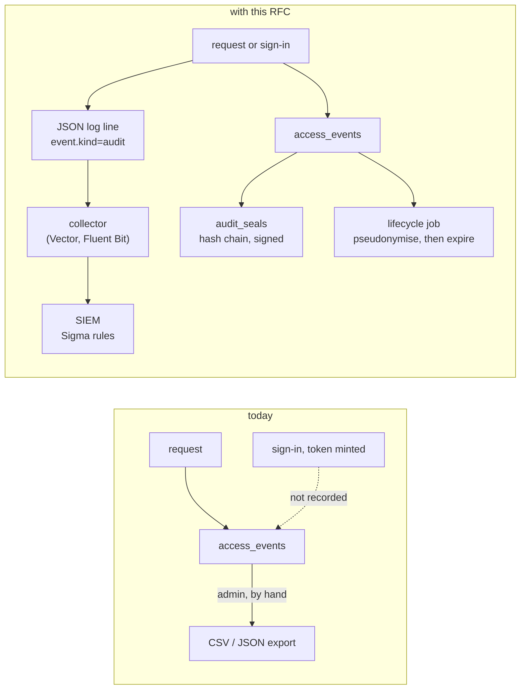
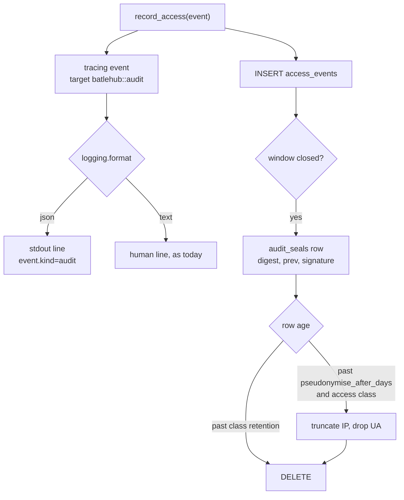
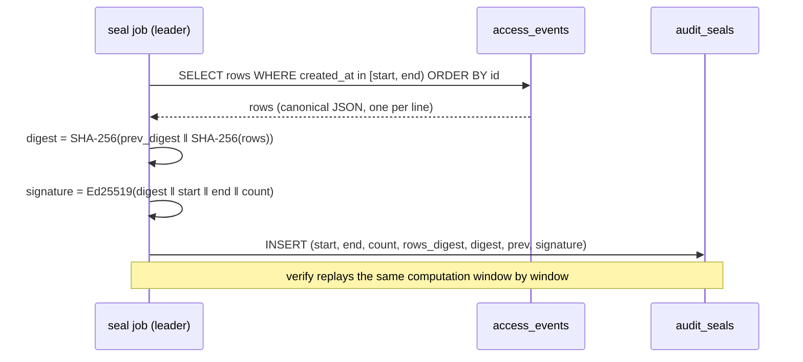
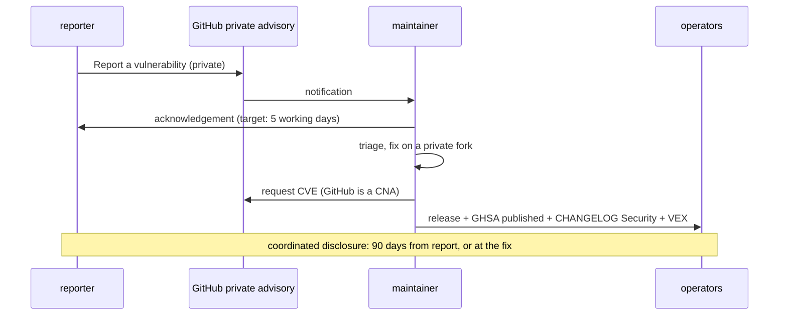

# RFC 0036 — Regulatory alignment: GDPR, ISO 27001 and the CRA as the baseline

| Field       | Value                                                        |
| ----------- | ------------------------------------------------------------ |
| Status      | Draft                                                         |
| Short       | Regulatory alignment                                          |
| Settles     | Which regulatory frameworks BatleHub is built to support, and what the audit trail, personal data and vulnerability handling must do to meet them |
| Author      | Max Batleforc <maxleriche.60@gmail.com>                       |
| Co-author   | Claude Opus 5.5 <noreply@anthropic.com>                       |
| Created     | 2026-09-26                                                    |
| Supersedes  | —                                                             |
| Touches     | `crates/core` (`entities/access_log.rs`, audit services), `crates/adapters` (`db/packages`, migrations), `crates/web` (`handlers/auth`, `handlers/back_office/audit.rs`, `middleware/auth.rs`), `crates/config`, `server` (`watcher.rs::init_tracing`), `deploy/siem/`, `SECURITY.md`, `.github/`, docs |

---

## 1. Summary

BatleHub sits on the software supply chain of whoever runs it, and the
estates that run it are increasingly regulated. This RFC fixes the baseline
the project is built against — **GDPR, ISO/IEC 27001:2022 and the Cyber
Resilience Act** — and names **NIS2 and DORA** as the next target, reached
when the first regulated operator needs them. It is not a certification: a
certificate belongs to an organisation running a service, never to the
software. What the software owes is the evidence and the controls an auditor
asks the operator for, and today four of those are missing or weak: the audit
trail can be edited and is purged only by hand, sign-ins are not audit events,
personal data in it has no lifecycle, and vulnerabilities are reported through
a public issue template.

The RFC changes four things, in the order they can land: the project's own
**vulnerability handling** (a private channel, stated targets, advisories); an
**audit stream** a SIEM can consume, with **Sigma detection rules** shipped
beside it; a **lifecycle for personal data** in the audit trail (retention
classes, pseudonymisation, erasure); and **tamper evidence** for the trail
itself. A YARA scanner for artifact *contents* is specified as a later phase,
because YARA matches files, not log lines.

### Before / after

```text
# today
access_events            one table, every action, kept forever unless an
                         admin runs DELETE /api/v1/admin/audit-log?before=
sign-in / token minted   not recorded
SIEM                     GET /api/v1/admin/audit-log/export, by hand
SECURITY.md              "open an issue using the Security Issue template"

# with this RFC
[logging]
format = "json"          # every log line JSON; audit events carry event.kind="audit"

[audit]
access_retention_days     = 365   # downloads and metadata reads
security_retention_days   = 1095  # sign-ins, grants, blocks, purges, config
pseudonymise_after_days   = 30    # IP truncated, user agent dropped
seal_interval_secs        = 300   # hash-chained, signed windows

deploy/siem/sigma/*.yml  detection rules over the stream
batlehub admin audit verify          # the chain holds, or names the window
batlehub admin gdpr erase --user X   # pseudonymises one subject everywhere
SECURITY.md              GitHub private vulnerability reporting, targets,
                         advisories with a CVE, a stated support window
```



The copy that reaches the SIEM is the one an attacker with database access
cannot quietly rewrite; the seal chain is what lets anyone prove the database
copy was not rewritten either.

---

## 2. Motivation

1. **The audit trail is editable, and its own purge is erasable.**
   `access_events` is a plain Postgres table. `DELETE
   /api/v1/admin/audit-log?before=` (`crates/web/src/handlers/back_office/audit.rs`,
   `purge_audit_log`) writes an `AuditPurge` event — and the handler's own
   comment says a second call with the same cutoff removes it. ISO 27001
   A.8.15 asks that logs be *protected against tampering and unauthorised
   access*; nothing here can show they were.
2. **Authentication is not an audit event.** `AccessAction`
   (`crates/core/src/entities/access_log.rs`) has some forty variants —
   downloads, blocks, grants, retention runs, cache evictions — and none for
   an OIDC sign-in, a failed sign-in, a PAT minted or revoked, or a credential
   refused. "Who logged in, from where, and what was refused" is the first
   question of every access review (ISO A.5.18, A.8.5) and every incident.
3. **Personal data in the trail has no lifecycle.** Every row carries
   `user_id`, and since migration 029 the client IP and user agent. An IP
   address is personal data under GDPR. Nothing expires it: there is no
   retention setting (`crates/config/src/schema/mod.rs` states "there is no
   configured audit-retention window in this tree"), no pseudonymisation, and
   `docs/operations/incident-response.md` §PII handling answers an erasure
   request with a hand-written `UPDATE`. That fails storage limitation
   (Art. 5(1)(e)) and privacy by default (Art. 25) out of the box.
4. **A SIEM gets the trail only by polling an export.** The only ways out are
   `GET /api/v1/admin/audit-log/export` and `batlehub admin export-audit-log`.
   There is no stream, so detection is batch at best, and a SOC receiving the
   export has no rule set to start from. Detection is ISO A.8.16; for a
   future NIS2 or DORA operator it is the control incident reporting depends
   on.
5. **Vulnerabilities are reported in public.** `SECURITY.md` says *do not
   open a public issue* and then directs the reporter to
   `.github/ISSUE_TEMPLATE/security-issue.md` — a public issue template.
   There is no private channel, no stated response target, no advisory or CVE
   process and no support window. The CRA's vulnerability-handling
   requirements (Annex I, Part II) are exactly these things, and a
   prospective client's supplier questionnaire asks for them whether or not
   the CRA binds the project yet.
6. **Nothing maps BatleHub to the frameworks its operators are audited
   against.** `docs/operations/soc2-checklist.md` is the only mapping; GDPR,
   ISO 27001, the CRA, NIS2 and DORA appear nowhere in the tree. An operator
   whose auditor asks "which control does this satisfy" has to derive the
   answer from source.

---

## 3. Goals / non-goals

**Goals**

- A written position on each framework: whom it binds, what BatleHub
  contributes, and what stays the operator's.
- A private, documented vulnerability-handling process for the project, with
  advisories that carry a CVE and reach the VEX document and the changelog.
- Sign-ins, sign-in failures, token lifecycle and refused credentials recorded
  as audit events.
- The audit trail available as a JSON stream, with a maintained set of Sigma
  rules over it.
- Personal data in the trail pseudonymised and expired on a configured
  schedule, and erasable for one data subject on request.
- Evidence that the trail was not altered: a signed hash chain over it and a
  command that verifies it.
- A compliance mapping page per framework, in the style of the SOC 2 page,
  that an operator can hand to an auditor.

**Non-goals**

- **Certifying anything.** Software is not certified; the operator is. The
  mapping pages carry the SOC 2 page's disclaimer.
- **Legal advice.** Whom a regulation binds is stated as the project reads
  it; an operator confirms it with counsel.
- **NIS2 and DORA conformance now.** They bind operators, not software, and
  no regulated operator runs BatleHub yet. §12's last phase lists what they
  add, so the baseline does not have to be rebuilt to reach them.
- **Vendor-specific SIEM content.** Sigma is the portable format; `sigma-cli`
  converts it to Splunk, Elastic, Sentinel or QRadar. Hand-maintained
  per-vendor queries would be four copies to keep in step.
- **YARA over logs.** YARA matches byte patterns in files. Log detection is
  Sigma's job; YARA is specified here as an artifact scanner (§6.6).
- **A write-once store inside BatleHub.** Tamper evidence is the seal chain
  plus the SIEM copy; immutable storage (S3 Object Lock, a WORM bucket) is
  the operator's, and the docs say how to point the stream at one.
- **Native TLS, KMS-held signing keys, enforced MFA.** Real controls, and
  each is its own change: listed in §12's NIS2/DORA phase, not built here.
- **Hash-chaining every row as it is written.** Rejected in §8: it
  serialises the hottest insert in the system.

---

## 4. User-facing design

### 4.1 Configuration

```toml
[logging]
# "text" (the default, today's output) or "json": one JSON object per line
# on stdout. Audit events are ordinary lines with event.kind = "audit".
format = "json"

[audit]
# Two classes, because the two kinds of row have opposite pressures: a
# download row is high-volume personal data that GDPR wants gone, a
# sign-in, grant or purge row is the evidence ISO and DORA want kept.
access_retention_days   = 365    # Download, ViewMetadata
security_retention_days = 1095   # every other action, and every auth event
# Access rows older than this lose their precision: the IP is truncated to
# /24 (IPv4) or /48 (IPv6) and the user agent is dropped. 0 disables.
pseudonymise_after_days = 30
# How often a sealing window closes. 0 disables sealing.
seal_interval_secs      = 300
# Ed25519 key that signs each seal; the public half is what `verify` uses.
seal_signing_key        = "${BATLEHUB_AUDIT_SEAL_KEY}"
```

- **Absent `[audit]` keeps today's behaviour**: nothing expires, nothing is
  pseudonymised, nothing is sealed. An upgrade never deletes data the
  operator did not ask it to. §4.3 warns about it instead.
- **`0` for a retention class means "never expire that class"**, and is
  distinct from absent only in that it silences the warning.
- **`[logging] format` absent means `text`**, byte-identical to today.

The project side needs no configuration: it is `SECURITY.md`, the repository's
private vulnerability reporting, and a `security.txt` on the docs site.

### 4.2 Behaviour rules

- **Classification is by action**, fixed in code: `Download` and
  `ViewMetadata` are the access class; every other `AccessAction`, including
  the new authentication actions of §6.1, is the security class. A new action
  is security class unless it is added to the access list deliberately — the
  failure direction is keeping too long, not too short.
- **Retention deletes; pseudonymisation rewrites.** A row past
  `pseudonymise_after_days` keeps its user id, its action and its outcome and
  loses the precision of its IP and its user agent. A row past its class's
  retention is deleted.
- **A purge is security class and outlives later purges.** The manual purge
  (`purge_audit_log`) deletes access-class rows only; security-class rows are
  removed by their retention and by nothing else. That closes motivation 1's
  "a second purge erases the first".
- **Pseudonymisation and retention never touch a row in an open seal
  window.** They run on closed windows, and each run is itself a
  security-class event carrying the window range it touched.
- **Erasure pseudonymises; it does not delete.** `gdpr erase --user X`
  replaces `X` with `erased:<hmac>` in `access_events`, token rows and block
  rows, with a key the operator holds, so two rows of the same subject stay
  linkable to each other and to nobody. Deleting the rows would destroy the
  security evidence the retention class exists to keep; the regulation
  allows keeping what a legal obligation or legitimate interest requires, and
  the operator documents which one applies.
- **The stream is the table, not a second opinion.** An event is logged at
  the moment `record_access` writes it, with the same fields, so a SIEM rule
  and an export can never disagree about what happened. A failed database
  write still emits the line, with `batlehub.audit.persisted = false`.
- **Nothing is emitted for `/healthz`, `/livez` or `/metrics`**, which are not
  audit events today and are not made so.

### 4.3 Validation

`AppConfig::validate()` rejects:

| Condition | Rationale |
| --- | --- |
| `seal_interval_secs > 0` without `seal_signing_key` | an unsigned chain proves order, not origin; a half-configured seal would read as protection it is not |
| `seal_signing_key` that does not parse as an Ed25519 PKCS#8 PEM | the same check `services/signature.rs` applies to publish keys |
| `pseudonymise_after_days` greater than `access_retention_days` (both non-zero) | the rows would be deleted before they are pseudonymised, so the setting is a claim with no effect |
| `security_retention_days` less than `access_retention_days` (both non-zero) | evidence would expire before the traffic it explains |

Warnings (logged at start and listed by `GET /api/v1/admin/config/warnings`,
which the console already shows on the config-reload page,
`ui/src/pages/AdminConfigReload.vue`):

| Condition | Behaviour |
| --- | --- |
| no `[audit]` block | *"audit trail has no retention: personal data in access_events is kept indefinitely"*; behaviour unchanged |
| `pseudonymise_after_days = 0` with an access retention over 90 days | full IPs kept for the whole window; allowed, stated |
| `[logging] format = "text"` with `seal_interval_secs > 0` | sealing without a stream: the chain is verifiable but no copy leaves the database |

---

## 5. Architecture

### 5.1 Whom each framework binds, and what BatleHub owes it

| Framework | Binds | BatleHub's position | What the project owes |
| --- | --- | --- | --- |
| GDPR (Reg. 2016/679) | the operator, as controller of the users' data | baseline | minimisation and storage limitation by default (Art. 5, 25); erasure and access tooling (Art. 15, 17); the security of processing it offers (Art. 32) |
| ISO/IEC 27001:2022 | the operator's ISMS | baseline | Annex A evidence: logging (8.15), monitoring (8.16), access control (5.15–5.18, 8.2, 8.5), vulnerabilities (8.8), cryptography (8.24), secure development (8.25–8.28), ICT supply chain (5.21) |
| Cyber Resilience Act (Reg. 2024/2847) | a manufacturer placing a product on the EU market in a commercial activity | baseline; **not yet binding** — the project is non-commercial | Annex I Part II vulnerability handling, an SBOM, a support period; the reporting duty of Art. 14 (in force since 2026-09-11) once commercial |
| NIS2 (Dir. 2022/2555) | essential and important entities | future goal | the controls its Art. 21(2) measures name: supply-chain security (d), vulnerability handling (e), access control and MFA (i, j); detection that makes Art. 23's 24 h / 72 h / one-month reporting possible |
| DORA (Reg. 2022/2554) | financial entities, and through contracts their ICT providers | future goal | logging and detection (Art. 9–10), backup and restoration (Art. 12), incident classification (Art. 18); for a hosted instance, the contractual terms of Art. 30 |

The CRA row decides the most. Non-commercial free software is outside its
scope; the moment BatleHub is offered as a paid support contract or monetised
in another way, the maintainer becomes a manufacturer, and the obligations in
the right-hand column apply from the first commercial release. Building them
now costs one process and one page; retrofitting them under a 24-hour
reporting duty costs an incident.

A **public instance** is a second, separate role: its operator is a GDPR
controller for every visitor's IP, and — if it serves a regulated client —
an ICT third-party provider under DORA. Everything in §4 is what that
operator would need on day one.

### 5.2 The audit event's life



Because the log line is emitted by the same call that writes the row, the
stream cannot report an event the table does not hold or miss one it does.
Because rewriting runs only on sealed windows, a pseudonymised row is always
one whose original digest is already in the chain.

### 5.3 The seal chain



A window is sealed only after `end` is further in the past than the longest
in-flight request (the job waits one window), so a late insert cannot land
in a window already sealed.

The chain is **append-only records, not a fixed digest per window**, because
the lifecycle of §5.2 legitimately changes sealed rows. Three record kinds
share one sequence, each carrying the previous record's digest and a
signature:

- **seal** — a window closed, with its row count and rows digest;
- **amend** — the lifecycle job pseudonymised rows in a sealed window, with
  the window's new rows digest and the count it rewrote;
- **expire** — retention deleted a window, with the count it removed.

`verify` walks the sequence and, for each window still present, recomputes
the rows digest and compares it with the *latest* seal or amend for that
window. Because every amend and expire is signed and chained, the lifecycle
can change the rows and an attacker cannot: rewriting a row, or deleting one,
without the key leaves a window whose digest matches no signed record.

### 5.4 Reporting a vulnerability in BatleHub



The advisory, the changelog's `### Security` section and
`vex/batlehub.openvex.json` are updated in the same release, so an operator's
scanner, their reading and their auditor see one answer.

---

## 6. Detailed design

### 6.1 Authentication events

- `crates/core/src/entities/access_log.rs` gains `SignIn`, `SignInFailed`,
  `TokenCreate`, `TokenRevoke` and `CredentialRejected`, with their
  `as_str` spellings and the `action_to_str` arm in
  `crates/adapters/src/db/packages/mod.rs`. All are security class.
- `SignIn` / `SignInFailed` are recorded in `oidc_callback`
  (`crates/web/src/handlers/auth/oidc/sso.rs`), with the provider name and,
  on failure, the reason class (state mismatch, token exchange, claims) —
  never the token or the code.
- `TokenCreate` / `TokenRevoke` in `crates/web/src/handlers/auth/tokens.rs`,
  carrying the token id and name, never its value or hash.
- `CredentialRejected` in `crates/web/src/middleware/auth.rs` when a bearer
  was presented and no provider accepted it. Throttled in process to one row
  per source IP per minute, so a credential-stuffing burst costs one write a
  minute rather than one per attempt; the throttled count is carried on the
  row that is written.

### 6.2 The audit stream

- `server/src/watcher.rs::init_tracing` gains the `[logging] format` switch:
  `tracing_subscriber::fmt::layer().json()` with the current span flattened,
  so `request_id` is on every line (the request span already carries it,
  `server/src/server_factory.rs`).
- `record_access` callers do not change. There are 25 of them across
  `crates/core` and `crates/web` and no shared helper above the port, so the
  event is emitted where every one of them lands:
  `crates/adapters/src/db/packages/crud.rs::record_access_impl` (and the
  in-memory repository, for the web tests), on target `batlehub::audit`, with
  ECS-style field names: `event.kind`,
  `event.action`, `event.outcome`, `event.reason`, `user.id`, `user.roles`,
  `source.ip`, `user_agent.original`, `batlehub.registry`, `package.name`,
  `package.version`, `http.request.id`.
- `deploy/siem/sigma/` carries the rules, one file each, with a
  `README.md` that shows `sigma convert -t splunk` and a Vector and a Fluent
  Bit snippet. The initial set:

| Rule | Fires on |
| --- | --- |
| `audit_purge.yml` | any `audit_purge` — always worth a human |
| `grant_to_anonymous.yml` | `grant_write` whose subject is anonymous or `*` |
| `credential_rejected_burst.yml` | `credential_rejected` from one `source.ip`, count over threshold in 5 min |
| `sign_in_failed_burst.yml` | `sign_in_failed` per user or IP over threshold |
| `denied_download_burst.yml` | `download` + `outcome: denied` per IP over threshold |
| `bulk_pull.yml` | one principal pulling an unusual number of distinct packages in 10 min (exfiltration of a private registry) |
| `blocked_package_pulled.yml` | a download of a coordinate a flag or verdict marked malicious (`event.reason` carries it) |
| `token_used_new_ip.yml` | a PAT seen from a source IP it was never seen from (correlation rule) |
| `retention_or_cache_clear.yml` | `cache_clear`, `retention_run`, `tombstone_compact` outside a maintenance window |
| `config_rejected.yml` | a rejected config reload |

- `task siem:check` runs `sigma check` over the directory, and a fixture
  test replays recorded audit lines (from §6.7's run) through a minimal
  matcher, so a renamed field breaks the build instead of silently blinding
  a SOC.

### 6.3 Retention and pseudonymisation

- `crates/config`: an `AuditConfig` with the four keys of §4.1, validated as
  §4.3.
- `crates/core/src/services/audit_lifecycle.rs`: one job, run by the
  worker-role leader (`ScanQueue::try_lead`, the same advisory-lock election
  the rescan timer uses), that pseudonymises then expires closed windows in
  batches of 5 000 rows, writing a `RetentionRun`-style security event per
  run.
- `crates/adapters`: `purge_events_before` gains the class restriction; a
  migration adds an index on `(action, created_at)` for the class scans.
- `batlehub admin gdpr erase --user <id>` and
  `POST /api/v1/admin/gdpr/erase` (`audit:purge` plus a new `gdpr:erase`
  verb), and `gdpr export --user <id>` answering an access request from the
  same rows.

### 6.4 Seals

- Migration: `audit_seals (id, kind, window_start, window_end, row_count,
  rows_digest, digest, prev_digest, signature, key_id, created_at)`, `kind`
  one of `seal`, `amend`, `expire` (§5.3). The lifecycle job of §6.3 writes
  its `amend` and `expire` records in the same transaction as the rewrite or
  delete, so the two cannot disagree.
- `crates/core/src/services/audit_seal.rs`: the job of §5.3, leader-elected
  like §6.3, and the verifier. The canonical row form is the export's JSON
  with keys sorted, one per line.
- `batlehub admin audit verify [--from --to]`: exits `0` when every window
  verifies, `1` naming the first window that does not, and prints windows
  expired by retention as such.

### 6.5 The project's vulnerability handling (phase 1)

- `SECURITY.md` rewritten: GitHub private vulnerability reporting as the
  channel (already enabled on `batlehub/batlehub`: the repository's
  `private-vulnerability-reporting` endpoint answers `enabled: true`);
  acknowledgement, assessment and fix targets stated as targets for a single
  maintainer, not an SLA; 90-day coordinated disclosure; advisories through
  GHSA with a CVE; the supported-versions table; scope; safe harbour for
  good-faith research.
- `security-issue.md` removed from `.github/ISSUE_TEMPLATE/` and
  `.forgejo/ISSUE_TEMPLATE/`, and replaced in both by a contact link to the
  private form (`config.yml`, `config.yaml`), so the public template cannot
  be used by mistake.
- The console's footer link (`REPORT_SECURITY_URL`, `ui/src/config.ts`)
  pointed at that public template; it points at the private form.
- `docs/contributing/security-scanning.md` §*Publishing an advisory*: the
  advisory, the changelog's `### Security` entry and the VEX statement, in
  one release. `vex.py` already accepts `fixed` and `affected` statements.
- **No `security.txt` from this repository.** RFC 9116 places it at the root
  of a domain, `/.well-known/security.txt`; the docs site is served under a
  path (`/batlehub/`) on a host the project does not own the root of, so a
  file there would not be where a client looks. The repository's
  `SECURITY.md`, which GitHub surfaces on the *Security* tab and in the
  report form, is the discoverable policy until the project has a domain of
  its own.

### 6.6 A YARA scanner for artifact contents

- A `yara` scanner kind for the scan worker (`ArtifactScanner`, RFC 0018),
  reading operator-supplied rule files from `[scanners.yara] rules_dir` and
  run inside the RFC 0022 sandbox like the other byte-reading scanners. A
  match is a finding with the rule name; the policy decides whether it
  blocks.
- Kept out of the earlier phases because it adds a dependency (open
  question 3) and is useful only to an operator who has rules to run.

### 6.7 `tests/heavy/authz.sh`, phase `audit`

A new phase in the existing credential-boundary suite, because it already
starts a server with static tokens, PATs and a real client against the tap.
The client is the suite's pinned npm; the server runs with `[logging] format
= "json"` and an `[audit]` block with `seal_interval_secs = 5`. What it
proves, on the wire and in the stream:

1. `npm install` of a public package with a PAT — the tap shows the tarball
   `GET ... -> 200` with request id *R*, and the server's stdout carries exactly
   one line with `event.kind=audit`, `event.action=download`,
   `event.outcome=allowed`, `http.request.id=R`, and the PAT's `user.id`.
2. `npm install` of a blocked version — npm exits non-zero with its own
   `E403` text, the tap shows no tarball request, and the stream carries one
   `download` line with `event.outcome=denied` and the block reason.
3. The PAT is revoked through the API, then used — npm exits with `E401`; the
   stream carries `token_revoke` then `credential_rejected` from the tap's
   source IP; twenty further attempts in the same minute produce no further
   rows (the throttle) and one row's `throttled_count` says 20.
4. `batlehub admin audit verify` exits `0` after the run. One row is then
   altered with SQL; `verify` exits `1` and names the window holding it.
5. `DELETE /api/v1/admin/audit-log?before=now` removes the run's `download`
   rows; the `audit_purge`, `token_revoke` and `credential_rejected` rows are
   still listed by `GET /api/v1/admin/audit-log`, and a second purge does not
   remove the first purge's row.
6. The recorded stream from cases 1–5 is replayed through
   `credential_rejected_burst.yml` and `audit_purge.yml`: both fire, and
   `bulk_pull.yml` does not.

Pseudonymisation and erasure are not observable through a client — a
package manager never reads the audit trail — so they are proven in
`crates/adapters/tests/pg_audit_lifecycle.rs` against a real database, with
the clock injected. The project-side changes of §6.5 have no client at all:
what a client would observe is a reporter's browser reaching the private form,
and there is no package manager in that path. Their regression signal is the
console's footer test (`ui/src/components/app/AppFooter.test.ts`, which pins
the link to `REPORT_SECURITY_URL`) and `task docs:links` for the procedure's
cross-references.

**Deliberately untouched**, so reviewers do not go looking:

- `config_changes` (`018_config_changes.sql`) — already an append-only record
  with actor and diff; it joins the stream through its existing write, and
  full before/after snapshots are a separate question.
- `timed_query` and `db_metrics` — observability, not audit; a metric is not
  evidence of who did what.
- The SOC 2 page — kept as it is; the new pages sit beside it and link to it.
- `signature.rs`'s key handling — the seal key reuses its parsing, not its
  storage; KMS is §12's last phase.

### 6.8 Docs

- `docs/operations/compliance.md`, the landing page: §5.1's table, the
  disclaimer, links to one page per framework.
- `docs/operations/compliance-gdpr.md`, `-iso27001.md`, `-cra.md`: the SOC 2
  page's format (criterion, control, status, evidence path), plus
  `-nis2-dora.md` listing what exists today and what §12's last phase adds.
- `docs/operations/siem.md`: the stream, the field reference, the collectors,
  the rules and how to add one.
- `docs/operations/incident-response.md`: the alert named
  `BatleHubHighDenyRate` becomes `BatleHubHighDeniedRequestRate`, the name
  in `deploy/prometheus-alerts.yaml`; a section on what NIS2 Art. 23's
  timeline asks of an operator and where BatleHub's evidence for it lives.
- French translations of each, as for every `operations/` page.

---

## 7. Security considerations

- **The stream carries personal data off the host.** IPs, user ids and user
  agents go wherever the collector sends them. The operator becomes the
  controller of that copy too; `docs/operations/siem.md` says so, and
  pseudonymisation in the database does not reach a copy already shipped.
- **No secret is ever an audit field.** Token values, hashes, OIDC codes and
  signatures are excluded by construction: the event types carry ids and
  names only, and a unit test asserts no field of a serialised event matches
  the `bh_pat_` prefix or a JWT shape.
- **`CredentialRejected` is attacker-triggered writes.** Throttled per IP in
  process (§6.1); the existing rate limiter and IP escalation
  (`middleware/rate_limit`, `middleware/ip_block.rs`) still apply in front of
  it.
- **The seal key signs, it does not encrypt.** Its compromise lets an
  attacker forge a chain from that point on; the SIEM copy is the control
  that detects it, which is why §4.3 warns about sealing without a stream.
- **Erasure is a destructive admin action.** It needs its own verb
  (`gdpr:erase`), is itself a security-class event naming the operator, and
  is refused for a subject with an open quarantine or block decision unless
  forced.
- **A private advisory channel shifts exposure, not risk.** The fix window is
  the same; what changes is that the report is not public before the fix.

---

## 8. Alternatives considered

| Alternative | Why rejected |
| --- | --- |
| Hash-chain each `access_events` row on insert | every download would serialise on the previous row's hash — one lock across the hottest insert (`record_access`, 1 per artifact read); windows give the same evidence with no hot-path cost |
| YARA rules for the SIEM, as first asked | YARA matches byte patterns in files; a log line is Sigma's domain, and a YARA rule over JSON lines would be a regex engine with none of Sigma's field semantics or converters |
| Per-vendor queries (SPL, KQL, AQL) | four rule sets to keep in step; `sigma convert` produces them from one source |
| OTLP logs instead of JSON on stdout | Kubernetes collectors read stdout already; OTLP logs are an exporter the server does not have (`build_otlp_provider` exports traces only) — worth adding later, not a prerequisite |
| Delete a data subject's rows on erasure | destroys the security evidence retention exists to keep, and breaks the seal chain; pseudonymisation satisfies the request where a retention basis applies |
| Default retention on, at upgrade | an upgrade that deletes a year of audit rows unasked is the incident this RFC is meant to prevent; a loud warning instead |
| Keep the public issue template, with a "mark private" note | a note does not make a public issue private; the report is visible the moment it is filed |

---

## 9. Rollout and compatibility

- **Default behaviour**: unchanged. No `[audit]`, no `[logging]` → text logs,
  nothing expires, nothing is sealed; one startup warning.
- **New audit actions** appear in the audit log, its export and the console's
  filters; a consumer that switches on action names sees five new values.
- **Migrations**: `audit_seals`, the `(action, created_at)` index, and the
  CHECK/enum widening for the new actions. Additive; `CURRENT_CONFIG_VERSION`
  does not move.
- **Operator prerequisites**: a collector for the stream, a key for the seals,
  and — for erasure — an HMAC key kept outside the database.
- **Rollback**: disabling `[audit]` stops the jobs; seals already written stay
  and verify. Rows already pseudonymised or deleted are not recoverable, which
  is the point of the setting and is stated beside it.

---

## 10. Test plan

- **Unit** (`crates/core/src/entities/access_log.rs`,
  `crates/core/src/services/audit_seal.rs`): action classification, canonical
  form stability, digest and signature over a fixed window, the no-secret
  assertion on serialised events.
- **Integration** (`crates/adapters/tests/pg_audit_lifecycle.rs`,
  `crates/adapters/tests/pg_audit_seal.rs`): pseudonymise, expire, erase and
  seal against Postgres with an injected clock; a purge's class restriction.
- **Web** (`crates/web/tests/audit_auth_events.rs`): sign-in, failure, token
  create/revoke and credential-rejected rows, with the throttle.
- **SIEM** (`task siem:check`): `sigma check`, and the replay fixture of §6.2.
- **Heavy** (`tests/heavy/authz.sh`, phase `audit`): §6.7.
- **Existing suites** that must pass unchanged: `crates/web/tests/audit*`,
  `authz_matrix.rs` (the new verb joins its inventory), and
  `tests/heavy/db_calls.sh` — the stream must add no statement to any
  request, and the budget says so.

---

## 11. Decisions and open questions

### Resolved

| # | Question | Decision |
| --- | --- | --- |
| 1 | Which frameworks are the baseline? | **GDPR, ISO 27001 and the CRA; NIS2 and DORA as a future goal.** The first three apply to a public instance or a paid offer on day one; the last two bind regulated operators, and the first such client is prospective. |
| 2 | "YARA rules for the SIEM"? | **Sigma for the audit stream, YARA as an artifact scanner (§6.6).** Each format for what it matches. |
| 3 | Does the CRA bind the project now? | **No: non-commercial.** Its vulnerability-handling requirements are built now anyway (§6.5), because they are cheap and a paid offer would make them binding from its first release. |

### Still open

1. **Default retention values.** 365 days for access rows and 1 095 for
   security rows are proposals. Access logs are commonly kept six months to
   a year; a DORA operator may want security events longer. Recommendation:
   ship the proposals as the documented examples, keep the default "absent".
2. **Erasure of `published_by` and ownership rows.** Pseudonymising the
   publisher of a package breaks "who published this" for every consumer of
   it. Recommendation: exempt publication records, documented as retained
   under legitimate interest, and pseudonymise only the audit trail and
   tokens.
3. **YARA engine.** The `yara-x` crate (Rust, in-process) against the
   `yara` binary in the sandbox. Recommendation: the binary in the sandbox,
   matching how GuardDog and Trivy already run and adding no linked
   dependency to the server.
4. **Where the stream goes in a non-JSON deployment.** Keeping text logs and
   writing the audit lines to a separate file would let an operator adopt the
   stream without changing log parsing. Recommendation: not now — one switch,
   stdout, which is what a collector reads.

---

## 12. Implementation phases

| Phase | Content |
| --- | --- |
| 1 | **Project vulnerability handling** (§6.5) and the compliance pages (§6.8, without the SIEM page). Useful alone: it answers a supplier questionnaire today. |
| 2 | **Authentication events and the JSON stream** (§6.1, §6.2 without the rules), `[logging] format`. |
| 3 | **Sigma rules**, `task siem:check`, `docs/operations/siem.md`, and §6.7 cases 1–3 and 6. |
| 4 | **Retention classes, pseudonymisation, erasure** (§6.3) and §6.7 case 5. |
| 5 | **Seals and `audit verify`** (§6.4) and §6.7 case 4. |
| 6 | **YARA scanner** (§6.6), once open question 3 is settled. |
| 7 | **NIS2 / DORA**, when a regulated operator needs them: MFA enforcement through the OIDC `acr`/`amr` claims; signing keys (publish, APK, VS Code, seal) held in a KMS with a rotation procedure; a restore test in CI with a stated RPO/RTO; incident classification fields on notifications; a DORA Art. 30 contract annex template for a hosted offer. |
